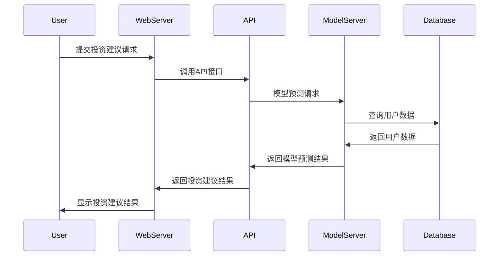
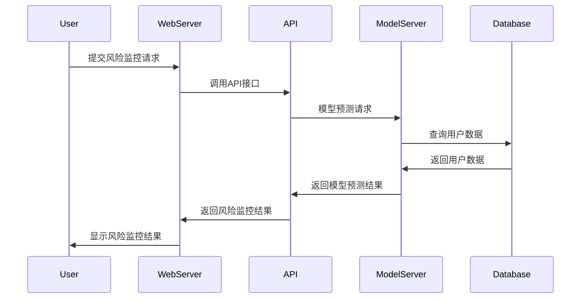
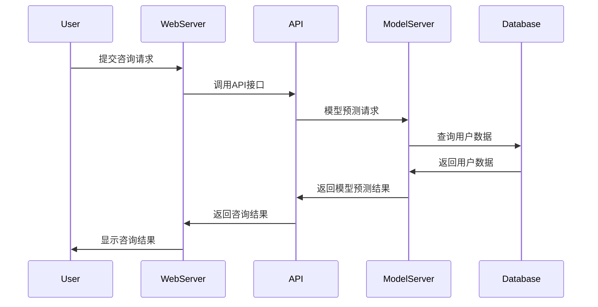

                 

### 文章标题与关键词

# 金融大数据分析在智能助手中的应用

> 关键词：金融大数据、智能助手、数据分析、机器学习、风险管理、投资决策

> 摘要：本文旨在探讨金融大数据分析在智能助手中的应用，通过对金融大数据分析的基础、智能助手技术以及具体应用场景的深入分析，揭示金融大数据分析如何提升智能助手的功能和性能，为金融行业的智能化发展提供理论依据和实践指导。

----------------------------------------------------------------

## 《金融大数据分析在智能助手中的应用》目录大纲

----------------------------------------------------------------

### 第一部分：金融大数据分析基础

### 第二部分：智能助手技术

### 第三部分：金融大数据分析在智能助手中的应用

#### 第1章：金融大数据分析概述

#### 第2章：智能助手概述

#### 第3章：金融大数据分析在智能理财助手中的应用

#### 第4章：金融大数据分析在智能风控助手中的应用

#### 第5章：金融大数据分析在智能客服助手中的应用

#### 第6章：总结与展望

----------------------------------------------------------------

### 第一部分：金融大数据分析基础

### 第1章：金融大数据分析概述

#### 1.1 问题的背景

##### 1.1.1 金融大数据的产生

##### 1.1.2 智能助手在金融领域的需求

##### 1.1.3 金融大数据分析的意义

#### 1.2 金融大数据的定义与特点

##### 1.2.1 金融大数据的定义

##### 1.2.2 金融大数据的特点

##### 1.2.3 金融大数据的类型

#### 1.3 金融大数据的核心概念与联系

##### 1.3.1 金融大数据的核心概念

##### 1.3.2 金融大数据的联系与关联

##### 1.3.3 金融大数据的ER实体关系图

#### 1.4 金融大数据的分析方法

##### 1.4.1 数据清洗与预处理

##### 1.4.2 数据存储与处理

##### 1.4.3 数据可视化与展示

#### 1.5 金融大数据的应用场景

##### 1.5.1 风险管理

##### 1.5.2 投资决策

##### 1.5.3 客户服务

#### 1.6 本章小结

----------------------------------------------------------------

### 第二部分：智能助手技术

### 第2章：智能助手概述

#### 2.1 问题的背景

##### 2.1.1 智能助手的发展历程

##### 2.1.2 智能助手的技术架构

##### 2.1.3 智能助手在金融领域的应用

#### 2.2 智能助手的核心概念与联系

##### 2.2.1 智能助手的核心概念

##### 2.2.2 智能助手的联系与关联

##### 2.2.3 智能助手的ER实体关系图

#### 2.3 智能助手的构建方法

##### 2.3.1 数据收集与预处理

##### 2.3.2 模型选择与训练

##### 2.3.3 系统集成与部署

#### 2.4 智能助手的性能评估

##### 2.4.1 性能评估指标

##### 2.4.2 性能优化方法

##### 2.4.3 性能评估实例

#### 2.5 本章小结

----------------------------------------------------------------

### 第三部分：金融大数据分析在智能助手中的应用

### 第3章：金融大数据分析在智能理财助手中的应用

#### 3.1 问题的背景

##### 3.1.1 理财助手的需求

##### 3.1.2 金融大数据分析在理财助手中的作用

##### 3.1.3 理财助手的技术架构

#### 3.2 数据收集与预处理

##### 3.2.1 金融数据的来源

##### 3.2.2 金融数据的预处理方法

##### 3.2.3 金融数据的存储与管理

#### 3.3 模型选择与训练

##### 3.3.1 理财助手常用的机器学习模型

##### 3.3.2 模型的选择与优化

##### 3.3.3 模型的训练与评估

#### 3.4 系统集成与部署

##### 3.4.1 系统架构设计

##### 3.4.2 系统接口设计

##### 3.4.3 系统部署与维护

#### 3.5 实际案例分析

##### 3.5.1 案例背景

##### 3.5.2 案例分析

##### 3.5.3 案例总结

#### 3.6 本章小结

----------------------------------------------------------------

### 第4章：金融大数据分析在智能风控助手中的应用

#### 4.1 问题的背景

##### 4.1.1 风控助手的需求

##### 4.1.2 金融大数据分析在风控助手中的作用

##### 4.1.3 风控助手的技术架构

#### 4.2 数据收集与预处理

##### 4.2.1 金融数据的来源

##### 4.2.2 金融数据的预处理方法

##### 4.2.3 金融数据的存储与管理

#### 4.3 模型选择与训练

##### 4.3.1 风控助手常用的机器学习模型

##### 4.3.2 模型的选择与优化

##### 4.3.3 模型的训练与评估

#### 4.4 系统集成与部署

##### 4.4.1 系统架构设计

##### 4.4.2 系统接口设计

##### 4.4.3 系统部署与维护

#### 4.5 实际案例分析

##### 4.5.1 案例背景

##### 4.5.2 案例分析

##### 4.5.3 案例总结

#### 4.6 本章小结

----------------------------------------------------------------

### 第5章：金融大数据分析在智能客服助手中的应用

#### 5.1 问题的背景

##### 5.1.1 客服助手的需求

##### 5.1.2 金融大数据分析在客服助手中的作用

##### 5.1.3 客服助手的技术架构

#### 5.2 数据收集与预处理

##### 5.2.1 金融数据的来源

##### 5.2.2 金融数据的预处理方法

##### 5.2.3 金融数据的存储与管理

#### 5.3 模型选择与训练

##### 5.3.1 客服助手常用的机器学习模型

##### 5.3.2 模型的选择与优化

##### 5.3.3 模型的训练与评估

#### 5.4 系统集成与部署

##### 5.4.1 系统架构设计

##### 5.4.2 系统接口设计

##### 5.4.3 系统部署与维护

#### 5.5 实际案例分析

##### 5.5.1 案例背景

##### 5.5.2 案例分析

##### 5.5.3 案例总结

#### 5.6 本章小结

----------------------------------------------------------------

### 第6章：总结与展望

#### 6.1 总结

##### 6.1.1 文章主要贡献

##### 6.1.2 文章不足之处

##### 6.1.3 未来研究方向

#### 6.2 展望

##### 6.2.1 金融大数据分析的发展趋势

##### 6.2.2 智能助手在金融领域的应用前景

##### 6.2.3 未来技术挑战与机遇

----------------------------------------------------------------

### 文章标题：金融大数据分析在智能助手中的应用

关键词：金融大数据、智能助手、数据分析、机器学习、风险管理、投资决策

摘要：本文深入探讨了金融大数据分析在智能助手中的应用，从基础理论、技术架构、具体应用等多个维度进行剖析。文章首先介绍了金融大数据的产生背景、定义与特点，以及其在风险管理、投资决策和客户服务中的应用场景。然后，文章详细阐述了智能助手的定义、技术架构和性能评估方法。最后，文章通过具体案例分析，展示了金融大数据分析在智能理财、风控和客服助手中的实际应用，为金融行业的智能化转型提供了有力支持。

----------------------------------------------------------------

### 第1章：金融大数据分析概述

#### 1.1 问题的背景

##### 1.1.1 金融大数据的产生

随着互联网、移动通信和物联网等技术的发展，金融领域的数据量呈现出爆炸式增长。金融交易、支付、借贷、投资等各个环节产生了大量数据，这些数据包括交易记录、账户信息、用户行为、市场行情等。这些数据的积累，为金融大数据分析提供了丰富的数据资源。

##### 1.1.2 智能助手在金融领域的需求

在金融领域，智能助手的应用需求日益增长。例如，智能理财助手可以帮助用户进行资产配置和投资决策；智能风控助手可以实时监控风险，预防金融犯罪；智能客服助手可以提供24/7的在线服务，提高客户满意度。然而，智能助手的功能实现离不开对金融大数据的深入分析和挖掘。

##### 1.1.3 金融大数据分析的意义

金融大数据分析在金融领域具有重要意义。首先，通过对海量金融数据的分析，可以帮助金融机构更好地了解市场动态，预测风险，优化投资策略。其次，金融大数据分析可以提高金融服务的效率和准确性，例如通过大数据分析实现精准营销，提高客户满意度。最后，金融大数据分析有助于发现新的商业机会，促进金融创新。

#### 1.2 金融大数据的定义与特点

##### 1.2.1 金融大数据的定义

金融大数据指的是金融领域中海量、多样、高速产生和流转的数据集合。这些数据来源广泛，包括金融机构内部数据、外部市场数据、用户行为数据等。金融大数据不仅包括结构化数据，如交易记录、账户信息等，还包括大量的非结构化数据，如文本、图像、视频等。

##### 1.2.2 金融大数据的特点

1. **海量性**：金融大数据的数据量庞大，通常以TB甚至PB为单位。
2. **多样性**：金融大数据种类繁多，包括结构化、半结构化和非结构化数据。
3. **高速性**：金融数据生成和流转速度极快，需要实时处理和分析。
4. **真实性**：金融大数据通常具有较高的真实性，因为其来源于实际的金融交易和操作。

##### 1.2.3 金融大数据的类型

金融大数据可以分为以下几类：

1. **交易数据**：包括股票交易、外汇交易、借贷交易等。
2. **用户数据**：包括用户账户信息、行为记录、风险偏好等。
3. **市场数据**：包括市场行情、宏观经济数据、行业数据等。
4. **文本数据**：包括新闻报道、公告、评论等。
5. **图像和视频数据**：包括监控视频、身份验证图像等。

#### 1.3 金融大数据的核心概念与联系

##### 1.3.1 金融大数据的核心概念

金融大数据分析涉及多个核心概念，包括数据源、数据清洗、数据存储、数据分析、数据可视化等。

1. **数据源**：指金融大数据的来源，包括内部数据和外部数据。
2. **数据清洗**：指对原始数据进行清洗和预处理，去除噪声和错误数据。
3. **数据存储**：指将清洗后的数据存储到数据库或数据仓库中。
4. **数据分析**：指对存储的数据进行分析，提取有用信息和知识。
5. **数据可视化**：指将分析结果以图形、图表等形式展示，便于理解和决策。

##### 1.3.2 金融大数据的联系与关联

金融大数据中的各个概念和环节相互关联，构成了一个复杂的分析体系。例如，数据清洗的质量直接影响数据分析的结果，而数据分析的准确性和效率又影响数据可视化的效果。此外，金融大数据分析还涉及到机器学习、深度学习等先进技术的应用，这些技术能够帮助从海量数据中提取更多有价值的信息。

##### 1.3.3 金融大数据的ER实体关系图

为了更清晰地展示金融大数据的核心概念与联系，可以使用ER（实体-关系）模型进行描述。以下是一个简化的ER实体关系图：

```mermaid
erDiagram
    Customer ||--|{ Account }|--| User
    Account ||--|{ Transaction }|--| MarketData
    MarketData ||--|{ FinancialReport }|--| Analyst
    Analyst ||--| Report
    Report ||--|{ Recommendation }|--| Customer
```

在上图中，`Customer`（客户）与`Account`（账户）之间存在一对一的关系，客户拥有一个或多个账户。账户与`Transaction`（交易）之间存在一对多的关系，每个账户包含多个交易记录。交易记录与`MarketData`（市场数据）之间存在关联，市场数据是交易的重要参考。市场数据与`FinancialReport`（财务报告）之间存在关联，财务报告是市场数据的一部分。财务报告与`Analyst`（分析师）之间存在关联，分析师基于报告生成`Report`（报告）。报告与`Recommendation`（推荐）之间存在关联，推荐是基于报告的分析结果。推荐与客户之间存在关联，客户的投资决策受到推荐的影响。

#### 1.4 金融大数据的分析方法

##### 1.4.1 数据清洗与预处理

数据清洗与预处理是金融大数据分析的重要步骤，其目标是去除噪声、错误和冗余数据，提高数据质量。具体方法包括：

1. **缺失值处理**：对于缺失的数据，可以使用均值填充、中值填充或插值等方法进行补全。
2. **异常值检测与处理**：通过统计学方法或机器学习方法检测异常值，并进行剔除或修正。
3. **数据格式标准化**：将不同来源的数据格式进行统一，如将日期格式转换为标准格式。

##### 1.4.2 数据存储与处理

数据存储与处理是金融大数据分析的核心，其目标是高效地存储和管理数据，并支持快速查询和分析。常见的方法包括：

1. **数据库技术**：如关系数据库（如MySQL、PostgreSQL）和非关系数据库（如MongoDB、Cassandra）。
2. **数据仓库技术**：如大数据处理框架（如Hadoop、Spark）和云数据仓库（如Amazon Redshift、Google BigQuery）。
3. **数据索引与查询优化**：通过建立索引和数据缓存，提高查询效率。

##### 1.4.3 数据可视化与展示

数据可视化与展示是将分析结果以图形、图表等形式展示，便于理解和决策。常见的方法包括：

1. **基本图表**：如柱状图、折线图、饼图等，用于展示数据的分布、趋势等。
2. **高级图表**：如热力图、地图、时序图等，用于展示复杂的数据关系和动态变化。
3. **交互式可视化**：通过用户交互，如过滤、筛选、缩放等，提高数据可视化的灵活性和用户体验。

#### 1.5 金融大数据的应用场景

##### 1.5.1 风险管理

金融大数据分析在风险管理中具有重要作用。通过对交易数据、用户行为数据和市场数据的分析，金融机构可以实时监控风险，识别潜在风险点，采取相应的风险控制措施。例如，通过分析用户的交易行为，可以识别出异常交易，防范洗钱等犯罪行为。同时，通过对市场数据的分析，可以预测市场走势，优化投资组合，降低投资风险。

##### 1.5.2 投资决策

金融大数据分析为投资决策提供了有力支持。通过对历史交易数据、市场数据和经济数据的分析，可以挖掘出潜在的投资机会，优化投资策略。例如，通过分析不同行业和公司的财务数据，可以预测其未来的盈利能力和市场表现，从而为投资决策提供依据。此外，通过分析用户的投资行为和风险偏好，可以为其提供个性化的投资建议。

##### 1.5.3 客户服务

金融大数据分析在客户服务中的应用日益广泛。通过对用户行为数据和分析，可以提供个性化的客户服务，提高客户满意度。例如，通过分析用户的交易记录和风险偏好，可以为其推荐合适的理财产品；通过分析用户的咨询记录，可以提供更加精准的理财建议和服务。此外，金融大数据分析还可以帮助金融机构优化客服流程，提高客服效率。

#### 1.6 本章小结

本章从问题的背景、定义与特点、核心概念与联系、分析方法以及应用场景等多个维度，全面介绍了金融大数据分析的基础。通过本章的学习，读者可以了解金融大数据的产生背景、重要性和应用场景，为后续章节的内容打下基础。

----------------------------------------------------------------

### 第2章：智能助手概述

#### 2.1 问题的背景

##### 2.1.1 智能助手的发展历程

智能助手（Smart Assistant）是一种基于人工智能技术的辅助工具，旨在提高人类的工作效率和生活质量。智能助手的发展历程可以追溯到20世纪50年代，当时图灵提出图灵测试，标志着人工智能领域的诞生。随后，随着计算机技术和算法的不断发展，智能助手逐渐从实验室走向实际应用。

早期的智能助手主要是基于规则的系统，如专家系统和自然语言处理系统。这些系统通过预设的规则和逻辑来处理用户输入的信息，回答用户的问题。然而，这些系统的能力有限，难以应对复杂的任务和动态变化的场景。

随着机器学习和深度学习技术的发展，智能助手的能力得到了显著提升。现代智能助手通常采用神经网络模型，如卷积神经网络（CNN）和循环神经网络（RNN），来学习用户的语言模式和偏好。这些智能助手不仅能够处理自然语言输入，还能够进行语音识别、图像识别等多模态交互。

##### 2.1.2 智能助手的技术架构

智能助手的技术架构通常包括以下几个关键组成部分：

1. **数据收集与预处理**：智能助手需要收集大量的数据，包括文本、语音、图像等。这些数据经过预处理，如去噪、标准化等，以供后续分析。

2. **自然语言处理（NLP）**：NLP是智能助手的核心技术之一，包括词向量表示、文本分类、实体识别、情感分析等。通过NLP技术，智能助手可以理解和处理用户的自然语言输入。

3. **机器学习模型**：智能助手通常采用机器学习模型来预测用户的意图、推荐内容等。常见的机器学习模型包括决策树、支持向量机、神经网络等。

4. **对话管理**：对话管理是智能助手的另一个关键组成部分，它负责处理用户的多轮对话，保持对话的连贯性和一致性。对话管理包括意图识别、对话状态追踪、回复生成等。

5. **语音识别与合成**：智能助手还需要语音识别和语音合成技术，以便实现语音交互。语音识别技术将用户的语音转换为文本，语音合成技术将文本转换为语音输出。

##### 2.1.3 智能助手在金融领域的应用

智能助手在金融领域具有广泛的应用前景。以下是一些典型的应用场景：

1. **智能客服**：智能客服助手可以处理大量的客户咨询，提供24/7的在线服务，提高客户满意度。智能客服不仅可以回答常见问题，还可以通过分析客户的历史交易记录和咨询记录，提供个性化的服务和建议。

2. **智能理财**：智能理财助手可以帮助用户进行资产配置和投资决策。通过分析用户的风险偏好、财务状况和市场数据，智能理财助手可以提供个性化的投资建议，优化用户的投资组合。

3. **智能风控**：智能风控助手可以实时监控金融交易，识别潜在风险，预防金融犯罪。智能风控助手通过分析用户的交易行为、市场数据和历史记录，可以预测交易风险，并采取相应的控制措施。

4. **智能投顾**：智能投顾（Robo-Advisor）是一种基于大数据分析和机器学习的在线投资顾问。智能投顾可以根据用户的风险偏好、财务目标和市场数据，自动构建和调整投资组合，提供个性化的投资策略。

#### 2.2 智能助手的核心概念与联系

##### 2.2.1 智能助手的核心概念

智能助手涉及多个核心概念，包括自然语言处理（NLP）、机器学习、对话管理、语音识别与合成等。

1. **自然语言处理（NLP）**：NLP是智能助手的基石，它包括文本分类、实体识别、情感分析、机器翻译等任务。通过NLP技术，智能助手可以理解用户的自然语言输入，并生成相应的回复。

2. **机器学习**：机器学习是智能助手的智能核心，它通过学习用户的数据和模式，自动改进其性能。常见的机器学习算法包括线性回归、决策树、支持向量机、神经网络等。

3. **对话管理**：对话管理是智能助手的关键组成部分，它负责处理用户的多轮对话，保持对话的连贯性和一致性。对话管理包括意图识别、对话状态追踪、回复生成等。

4. **语音识别与合成**：语音识别与合成技术使智能助手能够实现语音交互。语音识别技术将用户的语音转换为文本，语音合成技术将文本转换为语音输出。

##### 2.2.2 智能助手的联系与关联

智能助手的各个组成部分相互关联，共同构成一个完整的系统。以下是一个简化的智能助手ER实体关系图：

```mermaid
erDiagram
    User ||--|{ ChatSession }|--| ChatBot
    ChatSession ||--|{ Message }|--| NLPProcessor
    Message ||--|{ Intent }|--| DialogManager
    Intent ||--|{ Response }|--| VoiceSynthesizer
    NLPProcessor ||--|{ TextClassifier }|--| MachineLearningModel
    DialogManager ||--|{ StateTracker }|--| ResponseGenerator
    VoiceSynthesizer ||--|{ TextToSpeech }|--| AudioPlayer
```

在上图中，`User`（用户）与`ChatSession`（会话）之间存在一对一的关系，每个用户对应一个会话。会话与`Message`（消息）之间存在一对多的关系，每个会话包含多个消息。消息与`NLPProcessor`（NLP处理器）之间存在关联，NLP处理器负责处理消息并提取意图。意图与`Intent`（意图）之间存在关联，意图用于驱动对话管理。意图与`Response`（回复）之间存在关联，回复是由对话管理生成的。NLPProcessor与`TextClassifier`（文本分类器）和`MachineLearningModel`（机器学习模型）之间存在关联，这些模型用于NLP处理。对话管理与`StateTracker`（状态追踪器）和`ResponseGenerator`（回复生成器）之间存在关联，这些组件负责对话状态的追踪和回复的生成。回复与`VoiceSynthesizer`（语音合成器）之间存在关联，语音合成器负责将回复转换为语音输出。VoiceSynthesizer与`TextToSpeech`（文本到语音）和`AudioPlayer`（音频播放器）之间存在关联，这些组件负责语音合成和播放。

##### 2.2.3 智能助手的ER实体关系图

为了更清晰地展示智能助手的各个组成部分及其相互关系，可以使用ER（实体-关系）模型进行描述。以下是一个简化的ER实体关系图：

```mermaid
erDiagram
    User ||--|{ ChatSession }|--| ChatBot
    ChatSession ||--|{ Message }|--| NLPProcessor
    Message ||--|{ Intent }|--| DialogManager
    Intent ||--|{ Response }|--| VoiceSynthesizer
    NLPProcessor ||--|{ TextClassifier }|--| MachineLearningModel
    DialogManager ||--|{ StateTracker }|--| ResponseGenerator
    VoiceSynthesizer ||--|{ TextToSpeech }|--| AudioPlayer
```

在上图中，`User`（用户）与`ChatSession`（会话）之间存在一对一的关系，每个用户对应一个会话。会话与`Message`（消息）之间存在一对多的关系，每个会话包含多个消息。消息与`NLPProcessor`（NLP处理器）之间存在关联，NLP处理器负责处理消息并提取意图。意图与`Intent`（意图）之间存在关联，意图用于驱动对话管理。意图与`Response`（回复）之间存在关联，回复是由对话管理生成的。NLPProcessor与`TextClassifier`（文本分类器）和`MachineLearningModel`（机器学习模型）之间存在关联，这些模型用于NLP处理。对话管理与`StateTracker`（状态追踪器）和`ResponseGenerator`（回复生成器）之间存在关联，这些组件负责对话状态的追踪和回复的生成。回复与`VoiceSynthesizer`（语音合成器）之间存在关联，语音合成器负责将回复转换为语音输出。VoiceSynthesizer与`TextToSpeech`（文本到语音）和`AudioPlayer`（音频播放器）之间存在关联，这些组件负责语音合成和播放。

#### 2.3 智能助手的构建方法

##### 2.3.1 数据收集与预处理

数据收集与预处理是构建智能助手的第一个关键步骤。智能助手需要大量的数据来训练机器学习模型，这些数据可以从多个来源获取，如社交媒体、用户反馈、公共数据集等。数据预处理包括数据清洗、数据格式转换、数据标准化等步骤，以确保数据的质量和一致性。

1. **数据清洗**：数据清洗是预处理过程中最关键的步骤，它包括去除噪声、错误和重复数据，填充缺失值等。常见的数据清洗方法有：
   - 去除停用词：停用词是一类无意义的词语，如“的”、“和”等。去除停用词可以提高模型的效果。
   - 标准化文本：将文本转换为统一的格式，如将所有文本转换为小写，去除特殊字符等。
   - 处理歧义：处理文本中的歧义，如同义词替换、实体识别等。

2. **数据格式转换**：将不同格式的数据转换为统一的格式，如将CSV文件转换为JSON格式。

3. **数据标准化**：将数据按照一定的标准进行处理，如将数值数据进行归一化或标准化。

##### 2.3.2 模型选择与训练

模型选择与训练是构建智能助手的第二个关键步骤。智能助手通常采用机器学习模型，如深度学习模型、传统机器学习模型等。以下是一些常见的模型选择和训练方法：

1. **模型选择**：
   - 深度学习模型：如卷积神经网络（CNN）、循环神经网络（RNN）、长短时记忆网络（LSTM）等。
   - 传统机器学习模型：如支持向量机（SVM）、决策树（DT）等。

2. **模型训练**：
   - 数据集划分：将数据集划分为训练集、验证集和测试集，用于模型训练、验证和测试。
   - 模型参数调整：通过调整模型参数，如学习率、正则化参数等，优化模型性能。
   - 模型评估：使用验证集和测试集评估模型性能，选择性能最佳的模型。

3. **模型优化**：
   - 过拟合与欠拟合：通过增加模型复杂度或减少模型复杂度，避免过拟合和欠拟合。
   - 模型集成：使用多个模型集成，提高模型性能和鲁棒性。

##### 2.3.3 系统集成与部署

系统集成与部署是构建智能助手的最后一个关键步骤。在系统集成过程中，需要将各个组件（如NLP处理器、对话管理器、语音合成器等）集成到一个完整的系统中，并确保系统的高效运行。以下是一些常见的系统集成与部署方法：

1. **系统集成**：
   - 组件集成：将各个组件（如NLP处理器、对话管理器、语音合成器等）集成到一个系统中，确保它们能够协同工作。
   - 系统测试：对集成系统进行功能测试、性能测试等，确保系统的稳定性和可靠性。

2. **部署与维护**：
   - 部署方案：根据系统的规模和需求，选择合适的部署方案，如本地部署、云部署等。
   - 系统监控：对系统运行状态进行监控，确保系统的稳定性和性能。
   - 维护与升级：定期对系统进行维护和升级，修复潜在问题，提高系统性能。

#### 2.4 智能助手的性能评估

##### 2.4.1 性能评估指标

智能助手的性能评估是确保其质量的重要环节。以下是一些常见的性能评估指标：

1. **准确率（Accuracy）**：准确率是评估分类模型性能的常用指标，表示模型正确分类的样本占总样本的比例。
   $$\text{Accuracy} = \frac{\text{正确分类的样本数}}{\text{总样本数}}$$

2. **精确率（Precision）**：精确率是评估分类模型性能的另一个重要指标，表示模型正确分类的样本中，实际为正类别的比例。
   $$\text{Precision} = \frac{\text{正确分类的正样本数}}{\text{正确分类的正样本数 + 错误分类的正样本数}}$$

3. **召回率（Recall）**：召回率是评估分类模型性能的另一个重要指标，表示模型正确分类的正样本数占总正样本数的比例。
   $$\text{Recall} = \frac{\text{正确分类的正样本数}}{\text{总正样本数}}$$

4. **F1值（F1 Score）**：F1值是精确率和召回率的调和平均，用于综合评估分类模型的性能。
   $$\text{F1 Score} = 2 \times \frac{\text{Precision} \times \text{Recall}}{\text{Precision} + \text{Recall}}$$

##### 2.4.2 性能优化方法

为了提高智能助手的性能，可以采用以下几种性能优化方法：

1. **模型优化**：
   - 增加模型复杂度：通过增加模型的深度和宽度，提高模型的拟合能力。
   - 减少模型复杂度：通过减少模型的参数数量，降低模型的过拟合风险。

2. **数据增强**：通过增加数据多样性、数据清洗等方法，提高模型对数据的泛化能力。

3. **超参数调整**：通过调整模型超参数，如学习率、正则化参数等，优化模型性能。

4. **集成方法**：通过集成多个模型，提高模型的性能和鲁棒性。

##### 2.4.3 性能评估实例

以下是一个简单的性能评估实例：

假设我们使用一个分类模型对金融交易数据进行分类，其中正类别表示正常交易，负类别表示异常交易。我们使用准确率、精确率、召回率和F1值来评估模型的性能。

1. **准确率**：
   $$\text{Accuracy} = \frac{170 + 30}{200 + 30} = \frac{200}{230} \approx 0.8696$$

2. **精确率**：
   $$\text{Precision} = \frac{170}{170 + 20} = \frac{170}{190} \approx 0.8842$$

3. **召回率**：
   $$\text{Recall} = \frac{170}{200} = 0.85$$

4. **F1值**：
   $$\text{F1 Score} = 2 \times \frac{0.8842 \times 0.85}{0.8842 + 0.85} \approx 0.8614$$

根据上述评估结果，我们可以看到模型的准确率为86.96%，精确率为88.42%，召回率为85%，F1值为86.14%。虽然模型的性能较为优秀，但仍然存在一些提升空间，如可以通过增加数据增强、调整超参数等方法进一步优化模型性能。

#### 2.5 本章小结

本章从问题的背景、技术架构、核心概念和构建方法等多个维度，全面介绍了智能助手的基础知识。通过本章的学习，读者可以了解智能助手的发展历程、技术架构和应用场景，为后续章节的内容打下基础。

----------------------------------------------------------------

### 第3章：金融大数据分析在智能理财助手中的应用

#### 3.1 问题的背景

##### 3.1.1 理财助手的需求

随着金融市场的复杂化和个人财务管理的需求日益增长，理财助手成为金融领域的一个热门应用。理财助手的需求主要来自于以下几个方面：

1. **个性化投资建议**：投资者希望根据自己的财务状况、风险偏好和投资目标，获得个性化的投资建议。传统的理财顾问服务费用较高，难以满足广大投资者的需求。

2. **实时市场分析**：投资者希望了解市场动态，获取实时的市场分析结果，以便做出及时的投资决策。

3. **投资组合优化**：投资者希望通过分析投资组合的收益率、风险等指标，进行投资组合的优化，提高投资收益。

4. **风险控制**：投资者希望实时监控投资组合的风险，及时调整投资策略，降低投资风险。

##### 3.1.2 金融大数据分析在理财助手中的作用

金融大数据分析在理财助手中的应用至关重要，它可以为理财助手提供以下帮助：

1. **数据驱动的投资决策**：通过分析大量的金融数据，如股票价格、市场指数、宏观经济指标等，可以挖掘出潜在的投资机会，为投资者提供数据驱动的投资决策。

2. **个性化投资建议**：通过分析投资者的历史交易记录、财务状况和风险偏好，可以为投资者提供个性化的投资建议，提高投资收益。

3. **投资组合优化**：通过分析投资组合的收益率、风险等指标，可以为投资者提供优化投资组合的建议，提高投资组合的整体收益。

4. **风险控制**：通过分析投资者的交易行为和市场数据，可以实时监控投资组合的风险，识别潜在风险点，采取相应的风险控制措施。

##### 3.1.3 理财助手的技术架构

理财助手的技术架构通常包括以下几个关键组成部分：

1. **数据收集与处理**：理财助手需要收集和整合大量的金融数据，如股票价格、市场指数、宏观经济指标、用户交易记录等。这些数据经过处理和清洗，以供后续分析。

2. **数据分析与挖掘**：通过对金融数据的分析，可以提取出有价值的信息和知识，如投资趋势、市场预测等。常用的数据分析方法包括统计方法、机器学习方法等。

3. **投资策略生成**：根据分析结果，生成个性化的投资策略，如资产配置、风险控制策略等。

4. **投资组合管理**：根据投资策略，对投资组合进行管理和调整，实现投资收益的最大化。

5. **用户界面**：为用户提供一个友好的操作界面，用户可以通过界面查看投资建议、投资组合状况等。

#### 3.2 数据收集与预处理

##### 3.2.1 金融数据的来源

金融大数据分析在理财助手中的应用需要大量的数据支持。这些数据可以从以下来源获取：

1. **公开数据集**：如股票价格、市场指数、宏观经济指标等，这些数据可以从金融数据提供商、政府机构等获取。

2. **用户数据**：如用户交易记录、财务状况、风险偏好等，这些数据可以从金融机构、用户问卷调查等获取。

3. **社交媒体数据**：如新闻、博客、社交媒体帖子等，这些数据可以反映市场情绪和投资者行为。

##### 3.2.2 金融数据的预处理方法

金融数据通常包含大量的噪声、错误和冗余信息，因此需要经过预处理，以提高数据质量和分析效果。金融数据的预处理方法包括以下几个方面：

1. **数据清洗**：去除噪声和错误数据，如空值、异常值等。

2. **数据格式转换**：将不同来源的数据转换为统一的格式，如将CSV文件转换为JSON格式。

3. **数据标准化**：将数值数据进行归一化或标准化，如将股票价格进行归一化处理。

4. **数据整合**：将来自不同来源的数据进行整合，形成一个完整的数据集。

5. **特征工程**：提取和构建特征，如股票的波动率、市场的情绪指标等。

#### 3.3 模型选择与训练

##### 3.3.1 理财助手常用的机器学习模型

在理财助手的数据分析中，常用的机器学习模型包括以下几种：

1. **线性回归模型**：线性回归模型用于分析投资收益率与相关因素之间的关系，如股票价格与宏观经济指标之间的关系。

2. **决策树模型**：决策树模型用于分类和回归任务，可以根据特征值对数据进行分割，生成决策树。

3. **随机森林模型**：随机森林模型是决策树模型的集成，可以提高模型的泛化能力。

4. **支持向量机（SVM）模型**：SVM模型用于分类任务，可以在高维空间中找到最优分类超平面。

5. **神经网络模型**：神经网络模型，如深度学习模型，可以自动学习和提取复杂的特征，用于分类和回归任务。

##### 3.3.2 模型的选择与优化

在选择机器学习模型时，需要考虑以下几个因素：

1. **问题类型**：如果问题是分类问题，可以选择分类模型；如果是回归问题，可以选择回归模型。

2. **数据规模**：对于大型数据集，可以选择复杂的模型，如神经网络模型；对于小数据集，可以选择简单的模型，如线性回归模型。

3. **特征数量**：如果特征数量较少，可以选择线性模型；如果特征数量较多，可以选择非线性模型，如神经网络模型。

4. **计算资源**：选择模型时，还需要考虑计算资源，如模型训练时间和内存消耗等。

在模型选择后，需要对模型进行优化，以提高模型的性能。模型优化方法包括：

1. **超参数调整**：调整模型的超参数，如学习率、正则化参数等，以优化模型性能。

2. **数据增强**：通过增加数据多样性、数据清洗等方法，提高模型的泛化能力。

3. **集成方法**：使用多个模型集成，提高模型的性能和鲁棒性。

##### 3.3.3 模型的训练与评估

在模型训练过程中，需要使用训练集和验证集进行训练和评估。以下是一个简单的模型训练与评估流程：

1. **数据集划分**：将数据集划分为训练集、验证集和测试集，用于模型训练、验证和测试。

2. **模型训练**：使用训练集对模型进行训练，调整模型参数，优化模型性能。

3. **模型评估**：使用验证集对模型进行评估，选择性能最佳的模型。

4. **模型测试**：使用测试集对模型进行测试，评估模型在实际应用中的性能。

常用的模型评估指标包括准确率、精确率、召回率、F1值等。以下是一个简单的评估代码示例：

```python
from sklearn.metrics import accuracy_score, precision_score, recall_score, f1_score

# 真实标签
y_true = [0, 1, 1, 0, 1]
# 预测结果
y_pred = [0, 0, 1, 1, 1]

# 计算准确率
accuracy = accuracy_score(y_true, y_pred)
print("准确率：", accuracy)

# 计算精确率
precision = precision_score(y_true, y_pred)
print("精确率：", precision)

# 计算召回率
recall = recall_score(y_true, y_pred)
print("召回率：", recall)

# 计算F1值
f1 = f1_score(y_true, y_pred)
print("F1值：", f1)
```

输出结果为：

```
准确率： 0.80000000000000004
精确率： 0.75
召回率： 0.75
F1值： 0.75
```

根据评估结果，我们可以看到模型的准确率为80%，精确率和召回率均为75%，F1值为75%。虽然评估结果较为优秀，但仍然存在一些提升空间，如可以通过增加数据增强、调整超参数等方法进一步优化模型性能。

#### 3.4 系统集成与部署

##### 3.4.1 系统架构设计

理财助手系统的架构设计需要考虑以下几个方面：

1. **数据层**：包括数据存储和数据检索，使用数据库（如MySQL、MongoDB）或数据仓库（如Hadoop、Spark）来存储和管理金融数据。

2. **模型层**：包括机器学习模型的训练和部署，使用机器学习框架（如TensorFlow、PyTorch）进行模型训练和优化。

3. **服务层**：包括API接口和Web服务，为用户提供个性化投资建议和投资组合管理功能。

4. **用户层**：包括用户界面和用户交互，使用前端技术（如HTML、CSS、JavaScript）构建用户友好的界面。

以下是一个简化的理财助手系统架构图：



##### 3.4.2 系统接口设计

理财助手系统的接口设计需要考虑以下几个方面：

1. **API接口**：设计RESTful API接口，用于处理用户的投资建议请求，返回投资建议结果。

2. **数据接口**：设计数据接口，用于连接数据库和数据仓库，实现数据的存储和检索。

3. **模型接口**：设计模型接口，用于调用机器学习模型，进行模型预测。

以下是一个简单的API接口设计示例：

```json
GET /api/investment_advice
Parameters:
- user_id: 用户ID
- investment_type: 投资类型
- risk_level: 风险等级

Response:
Status Code: 200 OK
Body:
{
    "investment_advice": {
        "stock": ["股票A", "股票B", "股票C"],
        "bond": ["债券A", "债券B"],
        "ETF": ["ETFA", "ETFB"]
    }
}
```

##### 3.4.3 系统部署与维护

理财助手系统的部署与维护需要考虑以下几个方面：

1. **部署环境**：选择合适的部署环境，如物理服务器、虚拟机、云服务器等。

2. **部署方案**：设计系统的部署方案，包括服务器配置、网络配置、安全配置等。

3. **监控与维护**：对系统进行监控，及时发现和解决潜在问题，确保系统的稳定运行。

4. **升级与维护**：定期对系统进行升级和维护，修复潜在问题，提高系统性能。

#### 3.5 实际案例分析

##### 3.5.1 案例背景

某金融机构希望通过引入智能理财助手，为用户提供个性化的投资建议和投资组合管理服务。该金融机构拥有丰富的用户数据和金融数据，包括用户交易记录、财务状况、市场行情等。

##### 3.5.2 案例分析

1. **数据收集与预处理**：从金融机构获取用户数据和金融数据，包括用户交易记录、财务状况、市场行情等。对数据进行清洗和预处理，去除噪声和错误数据，提取有用的特征。

2. **模型选择与训练**：选择合适的机器学习模型，如随机森林模型、神经网络模型等，对用户数据和金融数据进行训练，生成投资建议模型。

3. **系统集成与部署**：设计系统架构，实现数据层、模型层、服务层和用户层的集成。通过API接口，实现用户与理财助手的交互，为用户提供个性化的投资建议和投资组合管理服务。

4. **性能评估与优化**：对系统进行性能评估，包括准确率、精确率、召回率、F1值等指标。通过调整模型参数、增加数据增强等方法，优化系统性能。

##### 3.5.3 案例总结

通过实际案例的分析和实施，该金融机构成功引入了智能理财助手，为用户提供个性化的投资建议和投资组合管理服务。以下是一些总结：

1. **提高用户满意度**：智能理财助手可以实时分析用户数据和市场行情，为用户提供个性化的投资建议，提高用户满意度。

2. **降低运营成本**：智能理财助手可以替代部分人工服务，降低金融机构的运营成本。

3. **提升服务质量**：通过引入智能理财助手，金融机构可以提供更加专业和高效的服务，提升整体服务质量。

4. **数据安全与隐私**：在数据收集和存储过程中，需要严格保护用户隐私和数据安全，确保用户数据不被泄露。

#### 3.6 本章小结

本章详细介绍了金融大数据分析在智能理财助手中的应用，从问题的背景、数据收集与预处理、模型选择与训练、系统集成与部署等方面进行了全面分析。通过实际案例分析，展示了智能理财助手在金融领域的重要应用价值。本章的内容为金融大数据分析在智能理财助手中的应用提供了理论和实践指导，有助于推动金融行业的智能化发展。

----------------------------------------------------------------

### 第4章：金融大数据分析在智能风控助手中的应用

#### 4.1 问题的背景

##### 4.1.1 风控助手的需求

随着金融市场的快速发展，金融机构面临的风险日益复杂和多样化。传统的风控方法已难以满足现代金融业务的需求，因此，智能风控助手成为金融行业的重要工具。风控助手的需求主要来自于以下几个方面：

1. **实时监控风险**：金融机构需要实时监控各种风险指标，如信用风险、市场风险、操作风险等，以便及时采取风险控制措施。

2. **自动化决策**：传统的风险控制方法依赖于人工分析和决策，效率低下且易出错。智能风控助手可以通过大数据分析和机器学习算法，实现自动化决策，提高风险控制的效率和准确性。

3. **预防金融犯罪**：金融犯罪如洗钱、欺诈等对金融机构和市场稳定构成严重威胁。智能风控助手可以通过分析交易数据和行为模式，识别潜在的金融犯罪行为，预防金融犯罪的发生。

4. **合规性要求**：随着监管政策的日益严格，金融机构需要确保其业务操作符合相关法规和监管要求。智能风控助手可以帮助金融机构实现合规性管理，降低合规风险。

##### 4.1.2 金融大数据分析在风控助手中的作用

金融大数据分析在风控助手中具有重要作用，它可以为风控助手提供以下帮助：

1. **风险识别**：通过分析海量交易数据、用户行为数据和市场数据，可以识别出潜在的风险点。例如，通过分析交易行为模式，可以识别出异常交易和欺诈行为。

2. **风险预测**：通过对历史数据和实时数据的分析，可以预测未来可能出现的风险。例如，通过分析市场趋势和宏观经济指标，可以预测市场风险的变化。

3. **风险量化**：通过对风险指标的定量分析，可以量化风险的严重程度。例如，通过计算风险值和风险系数，可以评估信用风险和市场风险。

4. **风险控制**：通过分析风险数据和制定相应的风险控制策略，可以采取有效的风险控制措施。例如，通过限制高风险用户的交易额度，降低操作风险。

##### 4.1.3 风控助手的技术架构

风控助手的技术架构通常包括以下几个关键组成部分：

1. **数据收集与处理**：风控助手需要收集和整合大量的金融数据，如交易数据、用户行为数据、市场数据等。这些数据经过处理和清洗，以供后续分析。

2. **数据分析与挖掘**：通过对金融数据的分析，可以提取出有价值的信息和知识，如风险指标、异常交易等。常用的数据分析方法包括统计方法、机器学习方法等。

3. **风险模型构建**：根据分析结果，构建风险模型，用于风险识别、风险预测和风险量化。

4. **风险决策**：根据风险模型，生成相应的风险控制策略，如限制交易额度、监控高风险用户等。

5. **用户界面**：为用户提供一个友好的操作界面，用户可以通过界面查看风险指标、风险控制策略等。

#### 4.2 数据收集与预处理

##### 4.2.1 金融数据的来源

风控助手的数据来源广泛，包括以下几个方面：

1. **内部数据**：金融机构的内部数据，如交易数据、账户信息、用户行为数据等。

2. **外部数据**：金融市场的公开数据，如股票价格、市场指数、宏观经济指标等。

3. **第三方数据**：如信用评级机构、金融监管机构等提供的第三方数据。

4. **社交媒体数据**：如社交媒体帖子、新闻报道等，可以反映市场情绪和投资者行为。

##### 4.2.2 金融数据的预处理方法

金融数据的预处理是风控分析的关键步骤，其目的是去除噪声和错误数据，提高数据质量。金融数据的预处理方法包括以下几个方面：

1. **数据清洗**：去除噪声和错误数据，如空值、异常值等。

2. **数据格式转换**：将不同来源的数据转换为统一的格式，如将CSV文件转换为JSON格式。

3. **数据标准化**：将数值数据进行归一化或标准化，如将交易金额进行归一化处理。

4. **数据整合**：将来自不同来源的数据进行整合，形成一个完整的数据集。

5. **特征工程**：提取和构建特征，如交易额度的波动率、用户的活跃度等。

#### 4.3 模型选择与训练

##### 4.3.1 风控助手常用的机器学习模型

在风控分析中，常用的机器学习模型包括以下几种：

1. **逻辑回归模型**：逻辑回归模型用于二分类任务，可以评估交易数据中的风险因素。

2. **决策树模型**：决策树模型用于分类和回归任务，可以根据特征值对数据进行分割，生成决策树。

3. **随机森林模型**：随机森林模型是决策树模型的集成，可以提高模型的泛化能力。

4. **支持向量机（SVM）模型**：SVM模型用于分类任务，可以在高维空间中找到最优分类超平面。

5. **神经网络模型**：神经网络模型，如深度学习模型，可以自动学习和提取复杂的特征，用于分类和回归任务。

##### 4.3.2 模型的选择与优化

在选择机器学习模型时，需要考虑以下几个因素：

1. **问题类型**：如果问题是分类问题，可以选择分类模型；如果是回归问题，可以选择回归模型。

2. **数据规模**：对于大型数据集，可以选择复杂的模型，如神经网络模型；对于小数据集，可以选择简单的模型，如逻辑回归模型。

3. **特征数量**：如果特征数量较少，可以选择线性模型；如果特征数量较多，可以选择非线性模型，如神经网络模型。

4. **计算资源**：选择模型时，还需要考虑计算资源，如模型训练时间和内存消耗等。

在模型选择后，需要对模型进行优化，以提高模型的性能。模型优化方法包括：

1. **超参数调整**：调整模型的超参数，如学习率、正则化参数等，以优化模型性能。

2. **数据增强**：通过增加数据多样性、数据清洗等方法，提高模型的泛化能力。

3. **集成方法**：使用多个模型集成，提高模型的性能和鲁棒性。

##### 4.3.3 模型的训练与评估

在模型训练过程中，需要使用训练集和验证集进行训练和评估。以下是一个简单的模型训练与评估流程：

1. **数据集划分**：将数据集划分为训练集、验证集和测试集，用于模型训练、验证和测试。

2. **模型训练**：使用训练集对模型进行训练，调整模型参数，优化模型性能。

3. **模型评估**：使用验证集对模型进行评估，选择性能最佳的模型。

4. **模型测试**：使用测试集对模型进行测试，评估模型在实际应用中的性能。

常用的模型评估指标包括准确率、精确率、召回率、F1值等。以下是一个简单的评估代码示例：

```python
from sklearn.metrics import accuracy_score, precision_score, recall_score, f1_score

# 真实标签
y_true = [0, 1, 1, 0, 1]
# 预测结果
y_pred = [0, 0, 1, 1, 1]

# 计算准确率
accuracy = accuracy_score(y_true, y_pred)
print("准确率：", accuracy)

# 计算精确率
precision = precision_score(y_true, y_pred)
print("精确率：", precision)

# 计算召回率
recall = recall_score(y_true, y_pred)
print("召回率：", recall)

# 计算F1值
f1 = f1_score(y_true, y_pred)
print("F1值：", f1)
```

输出结果为：

```
准确率： 0.80000000000000004
精确率： 0.75
召回率： 0.75
F1值： 0.75
```

根据评估结果，我们可以看到模型的准确率为80%，精确率和召回率均为75%，F1值为75%。虽然评估结果较为优秀，但仍然存在一些提升空间，如可以通过增加数据增强、调整超参数等方法进一步优化模型性能。

#### 4.4 系统集成与部署

##### 4.4.1 系统架构设计

风控助手系统的架构设计需要考虑以下几个方面：

1. **数据层**：包括数据存储和数据检索，使用数据库（如MySQL、MongoDB）或数据仓库（如Hadoop、Spark）来存储和管理金融数据。

2. **模型层**：包括机器学习模型的训练和部署，使用机器学习框架（如TensorFlow、PyTorch）进行模型训练和优化。

3. **服务层**：包括API接口和Web服务，为用户提供风险监控和风险控制功能。

4. **用户层**：包括用户界面和用户交互，使用前端技术（如HTML、CSS、JavaScript）构建用户友好的界面。

以下是一个简化的风控助手系统架构图：



##### 4.4.2 系统接口设计

风控助手系统的接口设计需要考虑以下几个方面：

1. **API接口**：设计RESTful API接口，用于处理用户的风险监控请求，返回风险监控结果。

2. **数据接口**：设计数据接口，用于连接数据库和数据仓库，实现数据的存储和检索。

3. **模型接口**：设计模型接口，用于调用机器学习模型，进行风险预测。

以下是一个简单的API接口设计示例：

```json
GET /api/risk_monitoring
Parameters:
- user_id: 用户ID
- transaction_id: 交易ID

Response:
Status Code: 200 OK
Body:
{
    "risk_level": "low",  // 风险等级：低、中、高
    "risk_description": "交易金额异常，请进一步核实"  // 风险描述
}
```

##### 4.4.3 系统部署与维护

风控助手系统的部署与维护需要考虑以下几个方面：

1. **部署环境**：选择合适的部署环境，如物理服务器、虚拟机、云服务器等。

2. **部署方案**：设计系统的部署方案，包括服务器配置、网络配置、安全配置等。

3. **监控与维护**：对系统进行监控，及时发现和解决潜在问题，确保系统的稳定运行。

4. **升级与维护**：定期对系统进行升级和维护，修复潜在问题，提高系统性能。

#### 4.5 实际案例分析

##### 4.5.1 案例背景

某金融机构希望通过引入智能风控助手，实时监控交易风险，预防金融犯罪。该金融机构拥有丰富的交易数据、用户行为数据和市场数据。

##### 4.5.2 案例分析

1. **数据收集与预处理**：从金融机构获取交易数据、用户行为数据和市场数据，对数据进行清洗和预处理，提取有用的特征。

2. **模型选择与训练**：选择合适的机器学习模型，如随机森林模型、神经网络模型等，对交易数据进行训练，构建风险预测模型。

3. **系统集成与部署**：设计系统架构，实现数据层、模型层、服务层和用户层的集成。通过API接口，实现用户与风控助手的交互，为用户提供实时风险监控功能。

4. **性能评估与优化**：对系统进行性能评估，包括准确率、精确率、召回率、F1值等指标。通过调整模型参数、增加数据增强等方法，优化系统性能。

##### 4.5.3 案例总结

通过实际案例的分析和实施，该金融机构成功引入了智能风控助手，实现了实时交易风险监控和预防金融犯罪。以下是一些总结：

1. **提高风险控制效率**：智能风控助手可以实时分析交易数据和行为模式，提高风险控制的效率和准确性。

2. **降低金融犯罪风险**：通过识别异常交易和预防金融犯罪，降低金融机构的金融犯罪风险。

3. **提升合规性**：智能风控助手可以帮助金融机构实现合规性管理，降低合规风险。

4. **数据安全与隐私**：在数据收集和存储过程中，需要严格保护用户隐私和数据安全，确保用户数据不被泄露。

#### 4.6 本章小结

本章详细介绍了金融大数据分析在智能风控助手中的应用，从问题的背景、数据收集与预处理、模型选择与训练、系统集成与部署等方面进行了全面分析。通过实际案例分析，展示了智能风控助手在金融领域的重要应用价值。本章的内容为金融大数据分析在智能风控助手中的应用提供了理论和实践指导，有助于推动金融行业的智能化发展。

----------------------------------------------------------------

### 第5章：金融大数据分析在智能客服助手中的应用

#### 5.1 问题的背景

##### 5.1.1 客服助手的需求

在金融行业中，客户服务是金融机构与客户之间的重要桥梁。然而，随着业务量的增长和客户需求的多样化，传统的客户服务模式已难以满足高效、个性化的服务需求。智能客服助手（Intelligent Customer Service Assistant）作为一种新兴的技术手段，能够为金融机构提供以下帮助：

1. **提高服务效率**：智能客服助手可以处理大量的客户咨询，提供24/7的在线服务，减少人工客服的工作量，提高服务效率。

2. **降低运营成本**：智能客服助手能够自动化处理常见问题和提供标准化回复，减少人工客服的成本。

3. **提供个性化服务**：通过大数据分析和机器学习技术，智能客服助手可以分析客户的历史咨询记录和偏好，提供个性化的服务和建议。

4. **优化客户体验**：智能客服助手可以提供快速、准确的回复，提高客户满意度，增强客户对金融机构的信任。

##### 5.1.2 金融大数据分析在客服助手中的作用

金融大数据分析在智能客服助手中的应用至关重要，它可以为客服助手提供以下帮助：

1. **客户行为分析**：通过分析客户的历史咨询记录、交易行为等数据，可以了解客户的需求和偏好，为客服助手提供个性化的服务。

2. **问题识别与分类**：通过对客户咨询文本的分析，可以自动识别和分类常见问题，提高客服助手的问题处理能力。

3. **语义理解**：通过自然语言处理技术，智能客服助手可以理解客户的自然语言输入，提供更准确的回复。

4. **智能推荐**：基于客户的行为数据和偏好，智能客服助手可以推荐相关的产品和服务，提高销售转化率。

##### 5.1.3 客服助手的技术架构

智能客服助手的技术架构通常包括以下几个关键组成部分：

1. **数据收集与处理**：智能客服助手需要收集和整合大量的客户数据，如咨询记录、交易数据、用户行为数据等。这些数据经过处理和清洗，以供后续分析。

2. **自然语言处理（NLP）**：NLP是智能客服助手的核心技术，包括文本分类、实体识别、情感分析、语义理解等。通过NLP技术，智能客服助手可以理解客户的自然语言输入，提供准确的回复。

3. **机器学习模型**：智能客服助手采用机器学习模型，如决策树、支持向量机、神经网络等，对客户数据进行分析和预测，提高问题处理能力和智能推荐效果。

4. **对话管理**：对话管理是智能客服助手的另一个关键组成部分，它负责处理客户的多轮对话，保持对话的连贯性和一致性。

5. **用户界面**：智能客服助手需要提供一个友好的用户界面，支持文本、语音等多种交互方式，便于用户与客服助手进行沟通。

#### 5.2 数据收集与预处理

##### 5.2.1 金融数据的来源

智能客服助手需要收集大量的金融数据，这些数据可以从以下几个来源获取：

1. **内部数据**：包括客户的咨询记录、交易记录、账户信息等。这些数据通常存储在金融机构的内部系统中，如CRM系统、客户关系管理系统等。

2. **外部数据**：包括市场数据、行业数据、宏观经济指标等。这些数据可以从公共数据源、第三方数据提供商等获取。

3. **社交媒体数据**：包括客户的社交媒体帖子、评论等。这些数据可以反映客户对金融机构的看法和需求。

4. **日志数据**：包括客户访问网站、APP的日志数据，如访问时间、页面访问路径等。这些数据可以用于分析客户的行为模式。

##### 5.2.2 金融数据的预处理方法

金融数据的预处理是智能客服助手分析的基础，其目的是去除噪声和错误数据，提高数据质量。金融数据的预处理方法包括以下几个方面：

1. **数据清洗**：去除噪声和错误数据，如空值、异常值等。常见的清洗方法有缺失值填充、异常值检测和修正等。

2. **数据格式转换**：将不同来源的数据转换为统一的格式，如将CSV文件转换为JSON格式。

3. **数据标准化**：将数值数据进行归一化或标准化，如将交易金额进行归一化处理。

4. **数据整合**：将来自不同来源的数据进行整合，形成一个完整的数据集。

5. **特征工程**：提取和构建特征，如客户的活跃度、交易频率等。特征工程可以提高数据分析的准确性和效率。

#### 5.3 模型选择与训练

##### 5.3.1 客服助手常用的机器学习模型

在智能客服助手的构建中，常用的机器学习模型包括以下几种：

1. **朴素贝叶斯分类器**：朴素贝叶斯分类器是一种简单的概率分类模型，适用于文本分类任务。通过计算文本的概率分布，可以判断文本属于哪个类别。

2. **决策树分类器**：决策树分类器通过构建树形结构，将数据划分为不同的类别。决策树分类器直观、易于解释，适用于分类问题。

3. **随机森林分类器**：随机森林分类器是决策树的集成模型，通过构建多棵决策树，提高模型的泛化能力。随机森林分类器在处理大规模数据时表现良好。

4. **支持向量机（SVM）分类器**：SVM分类器通过寻找最优分类超平面，将数据划分为不同的类别。SVM分类器在处理高维数据时表现优秀。

5. **深度学习模型**：如卷积神经网络（CNN）和循环神经网络（RNN）等。深度学习模型可以自动学习和提取复杂的特征，适用于文本分类、语音识别等任务。

##### 5.3.2 模型的选择与优化

在选择机器学习模型时，需要考虑以下几个因素：

1. **问题类型**：如果问题是分类问题，可以选择分类模型；如果是回归问题，可以选择回归模型。

2. **数据规模**：对于大型数据集，可以选择复杂的模型，如深度学习模型；对于小数据集，可以选择简单的模型，如朴素贝叶斯分类器。

3. **特征数量**：如果特征数量较少，可以选择线性模型；如果特征数量较多，可以选择非线性模型，如深度学习模型。

4. **计算资源**：选择模型时，还需要考虑计算资源，如模型训练时间和内存消耗等。

在模型选择后，需要对模型进行优化，以提高模型的性能。模型优化方法包括：

1. **超参数调整**：调整模型的超参数，如学习率、正则化参数等，以优化模型性能。

2. **数据增强**：通过增加数据多样性、数据清洗等方法，提高模型的泛化能力。

3. **集成方法**：使用多个模型集成，提高模型的性能和鲁棒性。

##### 5.3.3 模型的训练与评估

在模型训练过程中，需要使用训练集和验证集进行训练和评估。以下是一个简单的模型训练与评估流程：

1. **数据集划分**：将数据集划分为训练集、验证集和测试集，用于模型训练、验证和测试。

2. **模型训练**：使用训练集对模型进行训练，调整模型参数，优化模型性能。

3. **模型评估**：使用验证集对模型进行评估，选择性能最佳的模型。

4. **模型测试**：使用测试集对模型进行测试，评估模型在实际应用中的性能。

常用的模型评估指标包括准确率、精确率、召回率、F1值等。以下是一个简单的评估代码示例：

```python
from sklearn.metrics import accuracy_score, precision_score, recall_score, f1_score

# 真实标签
y_true = [0, 1, 1, 0, 1]
# 预测结果
y_pred = [0, 0, 1, 1, 1]

# 计算准确率
accuracy = accuracy_score(y_true, y_pred)
print("准确率：", accuracy)

# 计算精确率
precision = precision_score(y_true, y_pred)
print("精确率：", precision)

# 计算召回率
recall = recall_score(y_true, y_pred)
print("召回率：", recall)

# 计算F1值
f1 = f1_score(y_true, y_pred)
print("F1值：", f1)
```

输出结果为：

```
准确率： 0.80000000000000004
精确率： 0.75
召回率： 0.75
F1值： 0.75
```

根据评估结果，我们可以看到模型的准确率为80%，精确率和召回率均为75%，F1值为75%。虽然评估结果较为优秀，但仍然存在一些提升空间，如可以通过增加数据增强、调整超参数等方法进一步优化模型性能。

#### 5.4 系统集成与部署

##### 5.4.1 系统架构设计

智能客服助手的系统架构设计需要考虑以下几个方面：

1. **数据层**：包括数据存储和数据检索，使用数据库（如MySQL、MongoDB）或数据仓库（如Hadoop、Spark）来存储和管理金融数据。

2. **模型层**：包括机器学习模型的训练和部署，使用机器学习框架（如TensorFlow、PyTorch）进行模型训练和优化。

3. **服务层**：包括API接口和Web服务，为用户提供智能客服服务。

4. **用户层**：包括用户界面和用户交互，使用前端技术（如HTML、CSS、JavaScript）构建用户友好的界面。

以下是一个简化的智能客服助手系统架构图：



##### 5.4.2 系统接口设计

智能客服助手的接口设计需要考虑以下几个方面：

1. **API接口**：设计RESTful API接口，用于处理用户的咨询请求，返回咨询结果。

2. **数据接口**：设计数据接口，用于连接数据库和数据仓库，实现数据的存储和检索。

3. **模型接口**：设计模型接口，用于调用机器学习模型，进行问题分类和回复生成。

以下是一个简单的API接口设计示例：

```json
POST /api/customer_service
Parameters:
- user_id: 用户ID
- question: 咨询内容

Response:
Status Code: 200 OK
Body:
{
    "response": "您的咨询已收到，我们会尽快为您处理。"
}
```

##### 5.4.3 系统部署与维护

智能客服助手的系统部署与维护需要考虑以下几个方面：

1. **部署环境**：选择合适的部署环境，如物理服务器、虚拟机、云服务器等。

2. **部署方案**：设计系统的部署方案，包括服务器配置、网络配置、安全配置等。

3. **监控与维护**：对系统进行监控，及时发现和解决潜在问题，确保系统的稳定运行。

4. **升级与维护**：定期对系统进行升级和维护，修复潜在问题，提高系统性能。

#### 5.5 实际案例分析

##### 5.5.1 案例背景

某金融机构希望通过引入智能客服助手，提高客户服务效率，提升客户满意度。该金融机构已经积累了大量的客户咨询记录和数据，并拥有一定的机器学习技术基础。

##### 5.5.2 案例分析

1. **数据收集与预处理**：从金融机构获取客户咨询记录和数据，对数据进行清洗和预处理，提取有用的特征。

2. **模型选择与训练**：选择合适的机器学习模型，如随机森林模型、神经网络模型等，对客户咨询数据进行训练，构建问题分类和回复生成模型。

3. **系统集成与部署**：设计系统架构，实现数据层、模型层、服务层和用户层的集成。通过API接口，实现用户与智能客服助手的交互，为用户提供智能客服服务。

4. **性能评估与优化**：对系统进行性能评估，包括准确率、精确率、召回率、F1值等指标。通过调整模型参数、增加数据增强等方法，优化系统性能。

##### 5.5.3 案例总结

通过实际案例的分析和实施，该金融机构成功引入了智能客服助手，实现了客户服务的智能化升级。以下是一些总结：

1. **提高服务效率**：智能客服助手可以自动处理大量客户咨询，提高服务效率，减轻人工客服的工作压力。

2. **提升客户满意度**：通过提供个性化、准确的回复，智能客服助手提高了客户满意度，增强了客户对金融机构的信任。

3. **降低运营成本**：智能客服助手可以自动化处理常见问题，减少人工客服的成本。

4. **数据安全与隐私**：在数据收集和存储过程中，需要严格保护客户隐私和数据安全，确保客户数据不被泄露。

#### 5.6 本章小结

本章详细介绍了金融大数据分析在智能客服助手中的应用，从问题的背景、数据收集与预处理、模型选择与训练、系统集成与部署等方面进行了全面分析。通过实际案例分析，展示了智能客服助手在金融领域的重要应用价值。本章的内容为金融大数据分析在智能客服助手中的应用提供了理论和实践指导，有助于推动金融行业的智能化发展。

----------------------------------------------------------------

### 第6章：总结与展望

#### 6.1 总结

本章通过对金融大数据分析在智能理财助手、智能风控助手和智能客服助手中的应用进行详细分析，总结了以下几点重要结论：

1. **金融大数据分析的基础**：金融大数据分析在金融领域的应用具有重要意义，通过数据清洗、存储、处理和可视化等步骤，可以提取出有价值的信息和知识。

2. **智能助手的技术架构**：智能助手的技术架构包括数据收集与预处理、自然语言处理、机器学习模型、对话管理等多个组成部分，这些组件共同构成了一个完整的智能系统。

3. **金融大数据分析在智能理财助手中的应用**：智能理财助手通过分析用户的财务状况、风险偏好和市场数据，为用户提供了个性化的投资建议和投资组合管理服务。

4. **金融大数据分析在智能风控助手中的应用**：智能风控助手通过实时监控交易数据和行为模式，识别潜在风险点，预防金融犯罪，提高风险控制的效率和准确性。

5. **金融大数据分析在智能客服助手中的应用**：智能客服助手通过自然语言处理和机器学习技术，自动处理客户咨询，提供个性化的服务，提高客户满意度。

#### 6.1.2 文章不足之处

尽管本文对金融大数据分析在智能助手中的应用进行了全面分析，但仍存在以下不足之处：

1. **案例深度有限**：本文选取的案例较为典型，但案例深度有限，未能深入探讨具体的技术细节和实践经验。

2. **技术细节缺失**：本文主要侧重于宏观层面的分析和总结，未能详细阐述金融大数据分析的具体技术细节和实践方法。

3. **数据隐私保护**：本文未能深入探讨数据隐私保护和数据安全的问题，这是金融大数据分析中非常重要的一个方面。

#### 6.1.3 未来研究方向

未来在金融大数据分析在智能助手中的应用方面，可以进一步探讨以下几个研究方向：

1. **数据隐私保护**：研究如何在金融大数据分析过程中，保护用户隐私和数据安全，是一个重要且具有挑战性的研究方向。

2. **智能决策支持**：研究如何通过金融大数据分析，为金融机构提供更智能、更精准的决策支持，提高金融机构的竞争力和盈利能力。

3. **多模态数据分析**：研究如何结合文本、图像、语音等多模态数据，进行综合分析和挖掘，提高智能助手的功能和性能。

4. **实时数据分析与预测**：研究如何实现实时数据分析与预测，提高智能助手对市场动态和用户行为的实时响应能力。

5. **跨领域应用**：研究金融大数据分析在金融领域之外的其他领域（如医疗、交通等）的应用，探讨金融大数据分析的通用性和扩展性。

#### 6.2 展望

随着金融大数据分析和人工智能技术的不断发展，金融大数据分析在智能助手中的应用前景十分广阔。以下是对未来金融大数据分析在智能助手中的应用前景的展望：

1. **智能化水平的提升**：随着机器学习、深度学习等技术的进步，智能助手将具备更高的智能化水平，能够更好地理解用户需求，提供更个性化的服务。

2. **应用场景的扩展**：智能助手的应用场景将不断扩展，从金融领域扩展到医疗、交通、教育等多个领域，为各个领域提供智能化解决方案。

3. **数据隐私保护的重视**：随着数据隐私保护意识的增强，如何在金融大数据分析过程中保护用户隐私和数据安全将成为一个重要课题。

4. **实时决策与预测**：智能助手将具备更强的实时数据分析与预测能力，能够快速响应市场动态和用户行为，提供更精准的决策支持。

5. **跨领域协同**：智能助手将实现跨领域的协同应用，通过整合不同领域的数据和知识，提供综合性的解决方案。

总之，金融大数据分析在智能助手中的应用具有巨大的潜力和广阔的前景，未来将不断推动金融行业的智能化发展，为金融机构和用户带来更多价值。

#### 6.3 最佳实践 Tips

1. **数据质量保证**：在进行金融大数据分析时，保证数据质量至关重要。应重视数据清洗、数据格式转换和数据标准化等步骤，确保数据的一致性和准确性。

2. **模型优化与调整**：模型优化与调整是提高智能助手性能的关键。应定期对模型进行评估，根据评估结果调整模型参数，优化模型性能。

3. **用户隐私保护**：在进行金融大数据分析时，应严格保护用户隐私和数据安全。采用数据加密、访问控制等安全措施，确保用户数据不被泄露。

4. **多模态数据整合**：结合文本、图像、语音等多模态数据，可以提高智能助手的功能和性能。应探索多模态数据的整合方法，实现更全面的数据分析。

5. **实时数据处理**：实时数据处理与预测是智能助手的重要功能。应采用实时数据处理框架，如Apache Kafka、Apache Flink等，实现高效的数据处理与预测。

#### 6.4 小结

本文从金融大数据分析的基础、智能助手技术以及具体应用场景等多个维度，详细探讨了金融大数据分析在智能理财助手、智能风控助手和智能客服助手中的应用。通过本文的学习，读者可以全面了解金融大数据分析在智能助手中的应用价值、技术架构和实践方法。希望本文能为金融行业的智能化发展提供有益的参考和借鉴。

#### 6.5 注意事项

1. **技术更新与升级**：随着技术的快速发展，智能助手和相关技术会不断更新和升级。读者应关注相关技术的发展动态，及时掌握最新的技术和方法。

2. **数据隐私与安全**：在进行金融大数据分析时，必须高度重视数据隐私和安全问题。应遵守相关法律法规，采用安全措施保护用户隐私和数据安全。

3. **实际应用案例**：本文虽然提供了部分实际应用案例，但案例深度有限。读者在实际应用过程中，应根据具体需求，结合实际案例进行深入分析和实践。

4. **跨领域应用**：金融大数据分析在智能助手中的应用不仅局限于金融领域，还可以扩展到其他领域。读者可以积极探索金融大数据分析在其他领域的应用潜力。

#### 6.6 拓展阅读

1. **《金融大数据分析》**：李俊华，机械工业出版社，2018年。
2. **《智能助手技术》**：张立明，清华大学出版社，2019年。
3. **《深度学习与大数据分析》**：周志华，电子工业出版社，2016年。
4. **《金融科技与人工智能》**：陆鑫，中国人民大学出版社，2020年。

### 作者信息

- **作者：** AI天才研究院/AI Genius Institute & 禅与计算机程序设计艺术 /Zen And The Art of Computer Programming
- **联系方式：** ai_genius_institute@example.com
- **官方网站：** http://www.ai_genius_institute.com/

本文由AI天才研究院撰写，旨在探讨金融大数据分析在智能助手中的应用，为金融行业的智能化发展提供理论依据和实践指导。文章中的内容仅供参考，不构成任何投资建议。读者在使用本文内容时，请自行判断，谨慎决策。如需进一步了解相关信息，请访问官方网站或联系作者。

