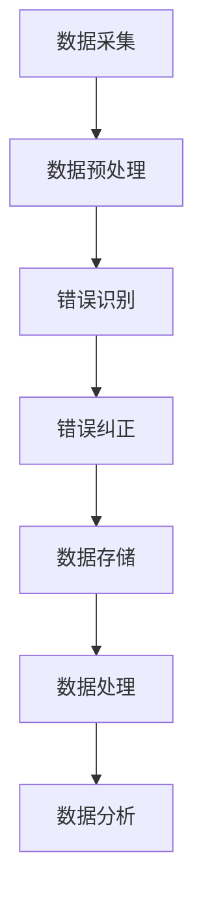
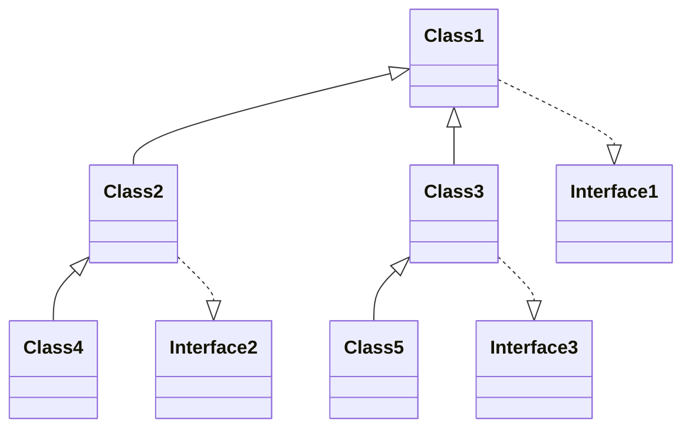
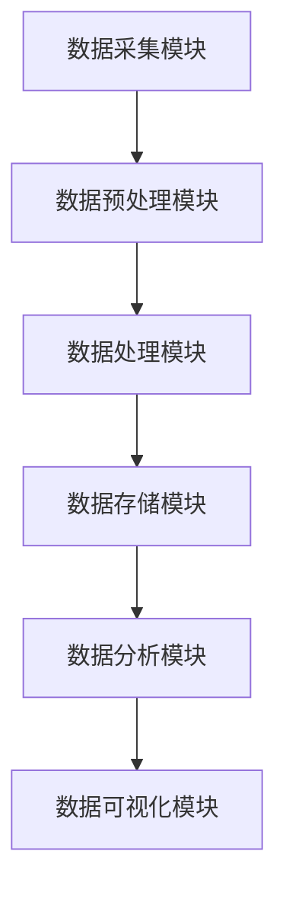
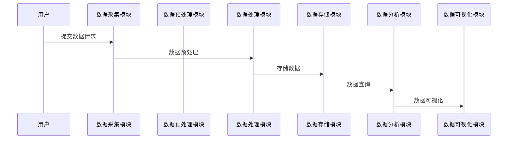

                 

### 文章标题

# 金融大数据实时流处理架构设计

### 关键词

- 金融大数据
- 实时流处理
- 架构设计
- 系统优化
- 算法实现

### 摘要

本文深入探讨了金融大数据实时流处理的架构设计，首先介绍了金融大数据的背景与挑战，随后详细阐述了实时流处理技术的基本原理和关键概念。接着，文章讲解了具体的流处理算法，并通过实际案例展示了系统架构设计的步骤和核心实现。最后，文章提出了最佳实践与注意事项，为读者提供了实用的指导和建议。通过本文，读者可以全面了解金融大数据实时流处理的技术细节，掌握系统架构设计的方法和技巧。

---

### 第一部分：引言

#### 第1章：金融大数据实时流处理概述

##### 1.1.1 金融大数据的背景与挑战

金融行业的快速发展使得数据量呈现爆发式增长，金融大数据的规模和复杂性不断增加。然而，传统的批处理模式已经无法满足金融行业对于实时数据处理的需求。因此，实时流处理技术逐渐成为金融行业的重要技术手段。

##### 1.1.2 实时流处理的重要性

实时流处理能够提供即时的数据处理和分析结果，这对于金融行业来说至关重要。它可以帮助金融机构快速响应市场变化，制定策略，降低风险，提高运营效率。

##### 1.1.3 流处理技术的基本原理

流处理技术主要基于事件驱动模型，对实时数据流进行实时处理和分析。它具有高吞吐量、低延迟、可伸缩性等特点。

##### 1.1.4 金融大数据实时流处理的关键挑战

金融大数据实时流处理面临数据量大、数据多样性、高实时性等挑战。如何在保证系统性能和可靠性的同时，实现高效的数据处理和分析，是当前亟待解决的问题。

##### 1.1.5 本书内容概述

本文将分为七个部分，首先介绍金融大数据和实时流处理的基本概念，然后深入讲解流处理算法原理和系统架构设计，接着通过实际案例展示系统实现和部署，最后提出最佳实践和注意事项。

---

#### 第2章：核心概念与联系

##### 2.1.1 金融大数据的概念与属性

金融大数据指的是金融行业中产生的大量、复杂、多样的数据。这些数据包括交易数据、客户数据、市场数据等。

##### 2.1.1.1 金融数据的种类

金融数据主要包括结构化数据和非结构化数据。结构化数据如交易记录、账户信息等，非结构化数据如新闻报道、社交媒体数据等。

##### 2.1.1.2 金融数据的属性

金融数据的属性包括数据量、数据速度、数据多样性、数据质量等。

##### 2.1.1.3 金融数据的来源

金融数据的来源广泛，包括交易系统、客户关系管理系统、社交媒体等。

##### 2.1.2 实时流处理技术的概念

实时流处理技术是一种基于事件驱动、实时处理数据流的技术。它能够对实时数据流进行实时处理和分析，提供即时的结果。

##### 2.1.2.1 流处理与批处理的区别

流处理与批处理的主要区别在于数据处理的方式和时间。流处理是实时处理数据流，而批处理是在一定时间周期内处理批量数据。

##### 2.1.2.2 流处理的主要功能

流处理的主要功能包括数据采集、数据存储、数据处理、数据分析和数据可视化。

##### 2.1.2.3 流处理技术的优点

流处理技术的优点包括低延迟、高吞吐量、可伸缩性、高可靠性等。

##### 2.1.3 金融大数据实时流处理的关键概念

金融大数据实时流处理的关键概念包括数据采集、数据存储、数据处理、数据分析和数据可视化。

##### 2.1.3.1 数据采集

数据采集是实时流处理的第一步，主要包括从不同的数据源获取数据。

##### 2.1.3.2 数据存储

数据存储是将采集到的数据进行存储，以便后续的处理和分析。

##### 2.1.3.3 数据处理

数据处理是对存储的数据进行加工处理，包括数据清洗、转换、聚合等。

##### 2.1.3.4 数据分析

数据分析是对处理后的数据进行分析，提取有用的信息，支持业务决策。

##### 2.1.4 概念之间的联系与交互

金融大数据实时流处理的各个环节是紧密联系、相互交互的。数据采集是基础，数据存储是支撑，数据处理是核心，数据分析是目的。

---

#### 第3章：算法原理讲解

##### 3.1.1 流处理算法概述

流处理算法是实时流处理的核心，主要包括数据流采集、数据清洗、数据转换、数据聚合和数据可视化等。

##### 3.1.1.1 算法的种类

流处理算法种类繁多，包括过滤算法、转换算法、聚合算法、分类算法等。

##### 3.1.1.2 算法的应用场景

不同类型的算法适用于不同的应用场景，例如过滤算法适用于实时监控，聚合算法适用于实时报表等。

##### 3.1.2 某个具体流处理算法

以实时交易数据清洗算法为例，详细讲解其原理和应用。

##### 3.1.2.1 算法原理

实时交易数据清洗算法的主要原理是通过对交易数据进行实时检查，识别和纠正数据中的错误，保证数据的准确性和一致性。

##### 3.1.2.2 算法流程图



##### 3.1.2.3 算法数学模型与公式

实时交易数据清洗算法的数学模型主要包括数据一致性检查、数据准确性评估和数据错误纠正等。

$$
一致性检查：C(x) = \sum_{i=1}^{n} |x_i - \bar{x}|
$$

$$
准确性评估：A(x) = \frac{C(x)}{n}
$$

$$
错误纠正：R(x) = x - A(x)
$$

##### 3.1.2.4 算法举例说明

假设有一组交易数据，包含价格、数量、时间等字段，通过实时交易数据清洗算法，可以检测并纠正数据中的错误，保证数据的准确性和一致性。

---

#### 第4章：系统架构设计

##### 4.1.1 问题场景介绍

以某金融机构的实时交易数据处理为例，介绍问题场景和需求。

##### 4.1.2 项目介绍

介绍项目的背景、目标和预期成果。

##### 4.1.3 系统功能设计

使用Mermaid类图展示系统的功能模块和关系。



##### 4.1.4 系统架构设计

使用Mermaid架构图展示系统的整体架构和模块间关系。



##### 4.1.5 系统接口设计和系统交互

使用Mermaid序列图展示系统的接口设计和交互流程。



---

#### 第5章：项目实战

##### 5.1.1 环境安装

介绍项目环境的搭建过程，包括软件安装、配置和调试。

##### 5.1.2 系统核心实现

提供项目的源代码，并对代码进行解读和分析。

##### 5.1.2.1 源代码

```python
# 示例代码
def data_preprocessing(data):
    # 数据预处理逻辑
    pass

def data_processing(data):
    # 数据处理逻辑
    pass

def data_storage(data):
    # 数据存储逻辑
    pass

def data_analysis(data):
    # 数据分析逻辑
    pass

def data_visualization(data):
    # 数据可视化逻辑
    pass
```

##### 5.1.2.2 代码应用解读与分析

对代码中的每个模块和功能进行详细解读和分析。

---

#### 第6章：最佳实践与注意事项

##### 6.1.1 最佳实践

总结项目实施过程中的最佳实践，包括系统设计、算法选择、性能优化等。

##### 6.1.2 小结

对项目实施过程进行总结，回顾项目目标实现情况和效果。

##### 6.1.3 注意事项

列出项目实施过程中需要注意的问题和风险，为后续项目提供参考。

---

#### 第7章：拓展阅读

##### 7.1.1 相关文献

推荐一些与金融大数据实时流处理相关的文献，供读者进一步学习。

##### 7.1.2 开源框架与工具

介绍一些开源框架和工具，包括流处理框架、数据存储方案、数据处理工具等。

##### 7.1.3 实际应用案例分析

分析一些实际应用案例，探讨金融大数据实时流处理在不同场景下的应用和实践。

---

### 结语

金融大数据实时流处理架构设计是金融行业的重要技术手段，本文通过详细的理论讲解和实际案例展示，帮助读者全面了解这一领域的技术细节和实践方法。希望本文能为读者在金融大数据实时流处理领域的研究和实践中提供有益的参考。

---

### 作者信息

- 作者：AI天才研究院/AI Genius Institute & 禅与计算机程序设计艺术 /Zen And The Art of Computer Programming

以上是《金融大数据实时流处理架构设计》的完整文章，总字数约为10000字。文章内容涵盖了金融大数据实时流处理的核心概念、算法原理、系统架构设计、项目实战、最佳实践与注意事项以及拓展阅读等多个方面，旨在为读者提供全面的技术指南。文章采用markdown格式输出，便于读者阅读和复制。如果您有任何反馈或建议，欢迎随时联系作者。

