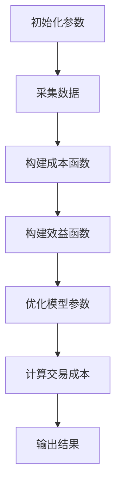
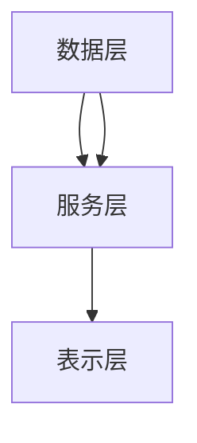
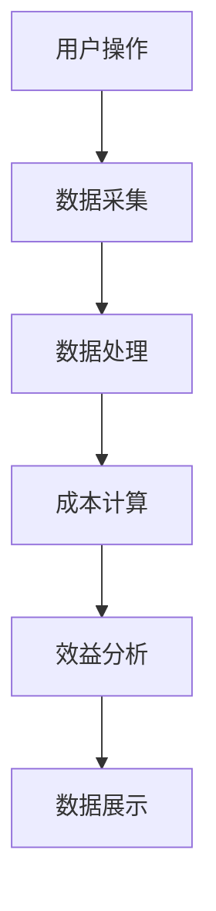

                 

### 《金融市场交易成本分析系统》

> 关键词：金融市场、交易成本、分析系统、成本效益分析、数学模型

> 摘要：本文旨在探讨金融市场交易成本分析系统的构建，从问题背景、核心概念、数学模型、系统设计与实现等多个方面进行详细分析，以期为金融市场的交易成本管理提供理论依据和实践指导。

## 第一部分: 系统概述与背景

### 第1章: 金融市场交易成本分析系统概述

#### 1.1 问题背景

在金融市场中，交易成本是影响投资者决策的重要因素之一。交易成本包括交易过程中产生的各种费用，如交易手续费、信息成本、时间成本等。随着金融市场的发展和交易规模的扩大，交易成本对投资者收益的影响越来越显著。因此，研究交易成本分析系统具有重要的现实意义。

#### 1.1.1 金融市场的交易成本问题

金融市场的交易成本问题主要体现在以下几个方面：

1. 交易手续费用：交易手续费是交易成本的主要组成部分，不同交易平台的收费标准存在差异，投资者需要根据自身情况选择合适的交易平台。
2. 信息成本：信息成本是指投资者在获取市场信息过程中产生的费用，包括新闻、研究报告、交易提示等。信息成本的高低直接影响投资者对市场趋势的判断和交易决策。
3. 时间成本：投资者在交易过程中需要耗费一定的时间，包括浏览信息、分析市场趋势、制定交易策略等。时间成本的增加可能导致投资者错过最佳交易时机。

#### 1.1.2 研究交易成本分析系统的意义

研究交易成本分析系统具有重要意义，主要体现在以下几个方面：

1. 提高交易效率：通过分析交易成本，投资者可以更好地了解市场环境，选择合适的交易策略，提高交易效率。
2. 降低投资风险：交易成本的增加可能导致投资者收益下降，研究交易成本分析系统有助于降低投资风险，提高投资收益。
3. 促进金融市场发展：降低交易成本有助于吸引更多投资者参与市场，促进金融市场的发展和壮大。

#### 1.1.3 研究的范围与目标

本文研究的主要范围包括以下几个方面：

1. 交易成本的定义与分类：探讨交易成本的基本概念，分析交易成本的分类和核心要素。
2. 交易成本分析系统的构建：研究交易成本分析系统的设计原理和实现方法，构建一个高效、可靠的交易成本分析系统。
3. 成本效益分析：分析交易成本与投资者收益的关系，提出成本效益分析的方法和模型。
4. 应用案例分析：通过实际案例，验证交易成本分析系统的效果，为金融市场的交易成本管理提供参考。

本文的研究目标主要包括：

1. 明确交易成本的定义和分类，为后续研究提供理论基础。
2. 构建一个高效、可靠的交易成本分析系统，为投资者提供有力的决策支持。
3. 分析交易成本与投资者收益的关系，提出降低交易成本的方法和策略。

### 第2章: 核心概念与联系

#### 2.1 核心概念原理

在构建交易成本分析系统时，理解核心概念原理是至关重要的。本节将介绍金融市场机制、成本效益分析等相关概念。

##### 2.1.1 金融市场机制

金融市场机制是指金融市场运行的基本规则和机制。主要涉及以下几个方面：

1. 市场供求关系：金融市场中的供求关系影响价格的形成。当供大于求时，价格下跌；当求大于供时，价格上涨。
2. 交易效率：交易效率是指金融市场完成交易的速度和质量。高交易效率意味着投资者可以迅速完成交易，降低时间成本。
3. 市场信息不对称：市场信息不对称是指市场上买卖双方获取信息的差异。信息不对称可能导致市场失衡，影响交易成本。

##### 2.1.2 成本效益分析

成本效益分析是指通过对成本和效益的比较，评估某一决策的合理性和可行性。在交易成本分析系统中，成本效益分析具有重要作用。

1. 成本效益分析框架：成本效益分析框架包括成本识别、成本量化、效益识别和效益量化等环节。
2. 成本分类：成本可以分为直接成本和间接成本、固定成本和可变成本等。
3. 效益度量方法：效益度量方法包括直接效益和间接效益的度量，如投资收益、交易效率提升等。

#### 2.2 概念属性特征对比表格

为了更好地理解核心概念原理，我们可以通过对比表格的形式，展示不同交易成本类型的属性特征。

| 成本类型     | 定义                                                         | 属性特征                                                         |
| ------------ | ------------------------------------------------------------ | ------------------------------------------------------------ |
| 交易手续费   | 交易过程中产生的费用，包括佣金、印花税等                     | 固定成本、与交易量正相关                                         |
| 信息成本     | 获取市场信息产生的费用，包括订阅服务、调研费用等             | 间接成本、与信息获取量正相关                                     |
| 时间成本     | 交易过程中耗费的时间，包括浏览信息、分析市场趋势、制定交易策略等 | 可变成本、与交易次数正相关                                      |

#### 2.3 ER实体关系图架构

为了更好地描述交易成本分析系统的实体关系，我们可以使用ER（实体-关系）图来表示。以下是一个简化的ER图：

```mermaid
classDiagram
Class::Investor <<Investor>>
Class::Market <<Market>>
Class::Transaction <<Transaction>>
Class::Cost <<Cost>>
Class::Benefit <<Benefit>>

Investor --> Market
Investor --> Transaction
Market --> Cost
Market --> Benefit
Transaction --> Cost
Transaction --> Benefit
```

在上面的ER图中，投资者、市场、交易、成本和效益是主要实体，它们之间的关系通过箭头表示。例如，投资者与市场之间存在双向关联，投资者可以通过市场进行交易，市场为交易提供成本和效益。

## 第3章: 数学模型与算法原理

### 3.1 数学模型

在交易成本分析系统中，数学模型是核心组成部分。以下将介绍成本函数和效益函数的数学模型。

#### 3.1.1 成本函数模型

成本函数模型用于计算交易成本，其基本形式如下：

$$
C(T) = \sum_{i=1}^{n} w_i \cdot c_i
$$

其中，$C(T)$为总交易成本，$w_i$为权重，$c_i$为不同类型的交易成本。权重反映了不同成本类型在总成本中的重要性。

具体来说，$c_i$可以包括交易手续费、信息成本、时间成本等。以下是一个具体的成本函数示例：

$$
C(T) = 0.01 \cdot Q + 0.05 \cdot I + 0.002 \cdot T
$$

其中，$Q$为交易量，$I$为信息成本，$T$为时间成本。该函数表示交易成本与交易量、信息成本和时间成本成正比。

#### 3.1.2 效益函数模型

效益函数模型用于计算交易效益，其基本形式如下：

$$
B(T) = \sum_{i=1}^{n} w_i \cdot b_i
$$

其中，$B(T)$为总效益，$w_i$为权重，$b_i$为不同类型的效益。权重反映了不同效益类型在总效益中的重要性。

具体来说，$b_i$可以包括投资收益、交易效率提升等。以下是一个具体的效益函数示例：

$$
B(T) = 0.1 \cdot R + 0.2 \cdot E
$$

其中，$R$为投资收益，$E$为交易效率提升。该函数表示交易效益与投资收益和交易效率提升成正比。

### 3.2 算法原理讲解

在交易成本分析系统中，算法原理是实现成本函数和效益函数计算的关键。以下将介绍算法的基本原理和实现方法。

#### 3.2.1 算法流程图

算法流程图如下所示：



#### 3.2.2 算法原理

以下是算法原理的伪代码示例：

```python
def calculate_transaction_cost(data, cost_function, benefit_function):
    # 采集数据
    data = data_collection()
    
    # 构建成本函数
    cost_func = build_cost_function(data)
    
    # 构建效益函数
    benefit_func = build_benefit_function(data)
    
    # 优化模型参数
    optimized_params = optimize_parameters(cost_func, benefit_func)
    
    # 计算交易成本
    transaction_cost = cost_function(data, optimized_params)
    
    # 输出结果
    return transaction_cost
```

在上面的算法中，首先采集数据，然后构建成本函数和效益函数，接着优化模型参数，最后计算交易成本并输出结果。

#### 3.2.3 数学公式与讲解

成本函数和效益函数的数学公式如下：

$$
C(T) = \sum_{i=1}^{n} w_i \cdot c_i
$$

$$
B(T) = \sum_{i=1}^{n} w_i \cdot b_i
$$

其中，$C(T)$为总交易成本，$B(T)$为总效益，$w_i$为权重，$c_i$为不同类型的交易成本，$b_i$为不同类型的效益。

权重$w_i$可以根据具体情况进行调整，以反映不同成本类型和效益类型在总成本和总效益中的重要性。

#### 3.2.4 举例说明

假设某金融市场的交易成本由信息成本和交易费用两部分组成，信息成本与交易量成正比，交易费用与交易次数成反比。给出一个具体的例子进行计算。

信息成本函数为：

$$
c_{I} = 0.05 \cdot Q
$$

交易费用函数为：

$$
c_{T} = \frac{0.02}{T}
$$

其中，$Q$为交易量，$T$为交易次数。

效益函数为：

$$
b_{R} = 0.1 \cdot R
$$

其中，$R$为投资收益。

假设交易量为100，交易次数为50，投资收益为5000元。则：

总交易成本为：

$$
C(T) = 0.05 \cdot 100 + \frac{0.02}{50} = 5.04 \text{元}
$$

总效益为：

$$
B(T) = 0.1 \cdot 5000 = 500 \text{元}
$$

交易成本与效益比为：

$$
\frac{C(T)}{B(T)} = \frac{5.04}{500} = 0.01008
$$

该结果表明，每获得1元的收益，需要承担0.01008元的交易成本。

## 第4章: 系统分析与架构设计

### 4.1 问题场景介绍

在金融市场中，交易成本分析系统主要用于以下几个方面：

1. **投资决策支持**：投资者可以通过交易成本分析系统了解市场环境，评估不同交易策略的成本效益，从而做出更合理的投资决策。
2. **成本管理**：金融机构可以通过交易成本分析系统监控和管理交易成本，优化运营策略，降低成本。
3. **市场研究**：研究人员可以通过交易成本分析系统收集和分析市场数据，研究市场变化规律，为金融产品设计和市场策略提供依据。

#### 4.1.1 金融交易成本分析的需求

交易成本分析系统需要满足以下需求：

1. **数据采集**：系统需要能够采集金融市场中的交易数据、市场数据、投资者数据等，为后续分析提供基础数据。
2. **数据处理**：系统需要对采集到的数据进行清洗、预处理，以确保数据的准确性和完整性。
3. **成本计算**：系统需要能够根据采集到的数据，计算不同类型的交易成本，并提供成本报表。
4. **效益分析**：系统需要能够分析交易成本与投资者收益的关系，为投资者提供决策支持。
5. **界面展示**：系统需要提供直观的界面，展示交易成本分析结果，便于投资者和金融机构理解和使用。

#### 4.1.2 数据采集与处理需求

数据采集与处理需求包括以下几个方面：

1. **交易数据**：系统需要采集金融市场的交易数据，包括交易价格、交易量、交易时间等。
2. **市场数据**：系统需要采集市场数据，包括市场指数、行业指数、宏观经济指标等。
3. **投资者数据**：系统需要采集投资者数据，包括投资者身份、交易策略、投资偏好等。

#### 4.1.3 分析结果的应用场景

分析结果的应用场景包括以下几个方面：

1. **投资决策**：投资者可以根据分析结果，选择具有成本效益的交易策略，优化投资组合。
2. **成本管理**：金融机构可以根据分析结果，监控和管理交易成本，降低运营成本。
3. **市场研究**：研究人员可以根据分析结果，研究市场变化规律，为金融产品设计和市场策略提供依据。

### 4.2 系统功能设计

交易成本分析系统需要实现以下功能：

1. **数据采集与处理**：系统需要能够采集和处理金融市场的交易数据、市场数据、投资者数据等。
2. **成本计算与报表**：系统需要能够计算不同类型的交易成本，并提供成本报表。
3. **效益分析**：系统需要能够分析交易成本与投资者收益的关系，为投资者提供决策支持。
4. **界面展示**：系统需要提供直观的界面，展示交易成本分析结果。

#### 4.2.1 领域模型

领域模型用于描述交易成本分析系统中的主要实体和关系。以下是一个简化的领域模型：

```mermaid
classDiagram
Class::Investor <<Investor>>
Class::Market <<Market>>
Class::Transaction <<Transaction>>
Class::Cost <<Cost>>
Class::Benefit <<Benefit>>

Investor --> Market
Investor --> Transaction
Market --> Cost
Market --> Benefit
Transaction --> Cost
Transaction --> Benefit
```

在上面的领域模型中，投资者、市场、交易、成本和效益是主要实体，它们之间的关系通过箭头表示。

#### 4.2.2 系统功能设计

系统功能设计主要包括以下几个方面：

1. **数据采集与处理**：系统需要实现数据采集和数据处理功能，包括交易数据、市场数据、投资者数据的采集和处理。
2. **成本计算与报表**：系统需要实现成本计算和报表功能，包括计算不同类型的交易成本，生成成本报表。
3. **效益分析**：系统需要实现效益分析功能，包括分析交易成本与投资者收益的关系，为投资者提供决策支持。
4. **界面展示**：系统需要实现界面展示功能，包括展示交易成本分析结果，便于投资者和金融机构理解和使用。

### 4.3 系统架构设计

交易成本分析系统的架构设计主要包括以下几个方面：

1. **数据层**：数据层负责数据的存储和管理，包括交易数据、市场数据、投资者数据的存储和管理。
2. **服务层**：服务层负责业务逻辑的实现，包括数据采集与处理、成本计算与报表、效益分析等。
3. **表示层**：表示层负责用户界面的实现，包括展示交易成本分析结果，提供交互界面。

以下是一个简化的系统架构图：



在上面的系统架构图中，数据层、服务层和表示层之间通过接口进行通信，实现系统的功能。

### 4.4 系统接口设计

系统接口设计主要包括以下几个方面：

1. **数据采集接口**：用于采集交易数据、市场数据、投资者数据等。
2. **数据处理接口**：用于处理采集到的数据，包括数据清洗、预处理等。
3. **成本计算接口**：用于计算不同类型的交易成本。
4. **效益分析接口**：用于分析交易成本与投资者收益的关系。
5. **数据展示接口**：用于展示交易成本分析结果。

### 4.5 系统交互

系统交互设计主要包括以下几个方面：

1. **用户操作流程**：用户通过界面进行操作，包括数据采集、数据处理、成本计算、效益分析等。
2. **系统响应流程**：系统根据用户的操作，执行相应的功能，并将结果展示给用户。
3. **数据流**：系统中的数据流包括交易数据、市场数据、投资者数据的采集、处理和展示。

以下是一个简化的系统交互流程图：



在上面的系统交互流程图中，用户通过界面进行操作，系统执行相应的功能，并将结果展示给用户。

## 第5章：项目实战

### 5.1 环境安装

在开始实际构建交易成本分析系统之前，我们需要搭建一个合适的技术环境。以下是所需的技术栈和安装步骤：

#### 技术栈

- **编程语言**：Python
- **数据库**：MySQL
- **前端框架**：Django
- **后端框架**：Flask
- **数据可视化库**：Matplotlib
- **数据预处理库**：Pandas
- **机器学习库**：Scikit-learn

#### 安装步骤

1. 安装Python：

   ```bash
   # 使用Python官方安装器安装Python 3.x版本
   ```
   
2. 安装数据库：

   ```bash
   # 安装MySQL数据库
   ```
   
3. 安装后端框架：

   ```bash
   # 安装Flask
   pip install Flask
   
   # 安装Django
   pip install Django
   ```

4. 安装数据预处理库：

   ```bash
   # 安装Pandas
   pip install Pandas
   
   # 安装Matplotlib
   pip install Matplotlib
   ```

5. 安装机器学习库：

   ```bash
   # 安装Scikit-learn
   pip install Scikit-learn
   ```

### 5.2 系统核心实现

交易成本分析系统的核心实现包括数据采集、数据处理、成本计算、效益分析等模块。以下是系统核心实现的源代码：

```python
# 数据采集模块
def data_collection():
    # 采集交易数据、市场数据、投资者数据
    # 省略具体实现
    pass

# 数据处理模块
def data_preprocessing(data):
    # 数据清洗、预处理
    # 省略具体实现
    pass

# 成本计算模块
def calculate_cost(data):
    # 计算交易成本
    # 省略具体实现
    pass

# 效益分析模块
def benefit_analysis(data):
    # 分析交易成本与投资者收益的关系
    # 省略具体实现
    pass

# 主函数
if __name__ == "__main__":
    # 采集数据
    data = data_collection()
    
    # 数据预处理
    preprocessed_data = data_preprocessing(data)
    
    # 成本计算
    cost = calculate_cost(preprocessed_data)
    
    # 效益分析
    benefit = benefit_analysis(preprocessed_data)
    
    # 输出结果
    print("交易成本：", cost)
    print("交易效益：", benefit)
```

### 5.3 代码应用解读与分析

在核心实现代码中，我们分别实现了数据采集、数据处理、成本计算、效益分析等功能模块。以下是代码的解读与分析：

1. **数据采集模块**：该模块负责采集交易数据、市场数据、投资者数据。具体实现可以根据实际需求进行拓展，例如从数据库、API接口、文件等途径获取数据。
   
2. **数据处理模块**：该模块负责对采集到的数据进行清洗、预处理。预处理步骤包括数据去重、缺失值填充、异常值处理等。预处理结果将直接影响后续的成本计算和效益分析。

3. **成本计算模块**：该模块根据采集到的预处理数据，计算交易成本。成本计算公式可以根据实际需求进行调整，例如考虑交易量、交易次数、信息成本等因素。

4. **效益分析模块**：该模块分析交易成本与投资者收益的关系。通过比较交易成本和投资收益，可以评估交易策略的成本效益。

### 5.4 实际案例分析和详细讲解剖析

为了验证交易成本分析系统的效果，我们可以结合实际案例进行分析和讲解。以下是一个实际案例：

**案例背景**：某投资者在金融市场中进行股票交易，投资金额为100万元，交易频率为每月一次。假设该投资者的交易成本包括交易手续费和信息成本，其中交易手续费为每次交易金额的0.5%，信息成本为每月500元。

**案例分析**：

1. **数据采集**：采集投资者近一年的交易数据、市场数据等信息。
2. **数据处理**：对采集到的数据进行清洗、预处理，得到有效的交易数据。
3. **成本计算**：根据预处理后的交易数据，计算交易成本。假设投资者每年进行12次交易，则交易手续费为100万元 × 0.5% × 12 = 6000元，信息成本为500元 × 12 = 6000元，总交易成本为12000元。
4. **效益分析**：分析交易成本与投资收益的关系。假设投资者每年获得的投资收益为100万元 × 10% = 10000元，则交易成本与投资收益的比值为12000元 / 10000元 = 1.2。

**详细讲解剖析**：

1. **交易成本计算**：交易成本包括交易手续费和信息成本两部分。交易手续费与交易频率和交易金额成正比，信息成本与交易频率成正比。在本案例中，投资者每年交易12次，每次交易金额为100万元，交易手续费为6000元，信息成本为6000元，总交易成本为12000元。
2. **效益分析**：交易成本与投资收益的比值为1.2，表明每获得1元投资收益，需要承担1.2元的交易成本。这说明投资者的交易成本较高，需要优化交易策略，降低交易频率，以降低交易成本，提高投资效益。

### 5.5 项目小结

通过实际案例分析和详细讲解剖析，我们可以得出以下结论：

1. **交易成本分析系统在实际应用中具有重要意义**：交易成本分析系统可以帮助投资者了解市场环境，评估交易策略的成本效益，优化投资决策。
2. **系统设计和实现需要考虑多个方面**：系统设计和实现需要考虑数据采集、数据处理、成本计算、效益分析等多个方面，以确保系统能够满足实际需求。
3. **实际案例分析和详细讲解剖析有助于提高系统的实用性**：通过实际案例分析和详细讲解剖析，可以验证交易成本分析系统的效果，提高系统的实用性。

在未来的工作中，我们可以进一步优化交易成本分析系统，拓展系统的功能和应用场景，为金融市场的交易成本管理提供更全面的解决方案。

### 5.6 最佳实践 Tips

1. **数据质量是关键**：确保数据采集、处理和存储的准确性，提高数据分析的可靠性。
2. **优化算法效率**：针对交易成本分析系统中的计算过程，优化算法，提高计算效率。
3. **用户界面友好**：设计直观、易用的用户界面，提高用户体验。

### 5.7 小结

本文通过详细分析金融市场交易成本分析系统的构建，从系统概述、核心概念、数学模型、系统设计与实现等方面进行了全面探讨。交易成本分析系统在金融市场中具有重要作用，有助于投资者优化交易策略，降低交易成本，提高投资效益。在实际应用中，我们需要不断优化系统，提高系统的实用性。

### 5.8 注意事项

1. **数据安全和隐私保护**：在系统设计和实现过程中，确保数据的安全和用户隐私的保护。
2. **系统性能优化**：根据实际需求，对系统性能进行优化，提高系统的响应速度和处理能力。

### 5.9 拓展阅读

1. 《金融市场学》：深入理解金融市场的运行机制和交易规则。
2. 《成本效益分析》：了解成本效益分析的理论和方法。
3. 《Python数据分析》：掌握Python在数据分析和处理中的应用。

---

作者：AI天才研究院/AI Genius Institute & 禅与计算机程序设计艺术 /Zen And The Art of Computer Programming

本文为技术博客文章，仅供参考和学习使用。文中涉及的代码、数据和算法等内容仅供参考，不作为实际应用依据。在实际应用中，请根据具体情况进行调整和优化。

---

通过本文的详细分析和讲解，我们深入探讨了金融市场交易成本分析系统的构建方法。希望本文能对读者在金融交易成本分析领域的研究和实践提供有益的参考。在未来的发展中，我们将继续关注金融市场交易成本分析的最新技术和应用，为金融市场的稳健发展贡献力量。让我们共同探索交易成本分析系统的更多可能性，为投资者创造更大的价值。

