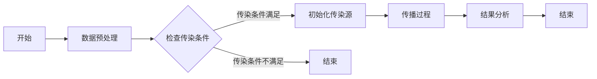
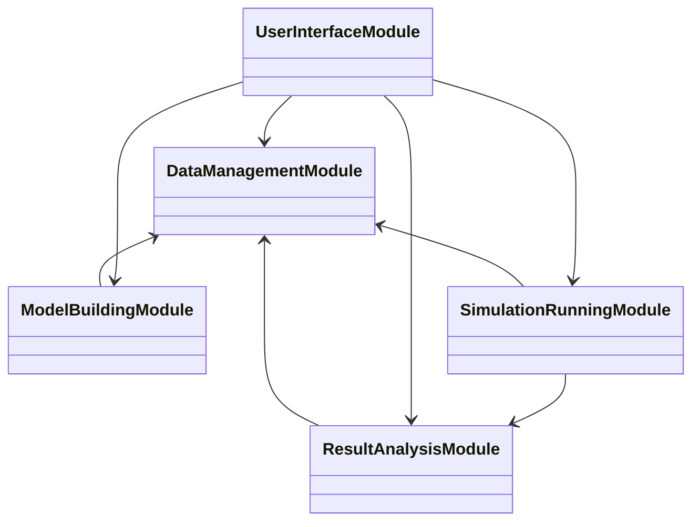

                 

### 1.1.1 金融市场传染效应的定义

金融市场传染效应，是指在一个金融市场中的不稳定或异常波动通过一系列的传导机制，影响到其他市场的现象。这个效应类似于病毒在生物体之间的传播，因此得名“传染效应”。在金融领域中，传染效应通常表现为风险从一个市场或投资产品传递到另一个市场或投资产品，导致整个金融系统的不稳定。

金融市场传染效应的重要性在于，它不仅可能导致局部市场的崩溃，还可能引发全球性的金融危机。例如，2008年的全球金融危机就是由于美国次贷危机引发的，通过金融市场的传染效应迅速扩散到了全球，导致多个国家和地区的金融市场遭受重创。

在金融市场中，传染效应的产生和扩散主要受到以下几方面因素的影响：

- **市场流动性**：市场流动性越高，传染效应的传播速度越快。流动性低的市场，由于缺乏足够的交易对手，传染效应的传播会受到阻碍。
- **市场参与者行为**：市场参与者的恐慌、过度反应或错误判断，会加剧传染效应的传播。
- **宏观经济环境**：宏观经济环境的恶化，如经济衰退、通货膨胀等，会削弱市场的稳定性，增加传染效应的风险。
- **政策因素**：政府的政策干预，如利率调整、资本管制等，也会对传染效应的传播产生影响。

金融市场传染效应的复杂性使得它成为金融研究领域的一个重要课题。为了更好地理解和应对金融市场传染效应，研究人员通常会采用数学模型、计算机模拟等方法进行研究。

### 1.1.2 金融市场传染效应的挑战与目前研究的现状

尽管金融市场传染效应的重要性已经被广泛认可，但对其进行有效的研究仍然面临许多挑战。首先，金融市场传染效应的发生和传播机制复杂，涉及到多个市场、多个投资产品和多种经济变量，这使得对传染效应的定量分析具有很大难度。其次，金融市场数据的不完备性和噪音，使得数据的处理和分析也变得复杂。此外，金融市场传染效应具有高度的时空动态性，这使得研究方法需要具备较强的适应性和灵活性。

目前，关于金融市场传染效应的研究主要集中在以下几个方面：

1. **理论研究**：通过建立数学模型来描述金融市场传染效应的发生和传播机制。这些模型包括传统的宏观经济学模型、微观经济学模型以及现代的复杂系统理论模型。

2. **实证研究**：通过分析历史数据，验证和优化金融市场传染效应模型。实证研究通常采用时间序列分析、网络分析等方法。

3. **计算机模拟**：通过计算机模拟来模拟金融市场传染效应的发生和传播过程，从而对模型进行验证和优化。计算机模拟可以提供对复杂金融系统的高效模拟和分析，有助于揭示传染效应的内在机制。

4. **政策研究**：研究如何通过政策干预来减缓或阻止金融市场传染效应的传播。这包括研究货币政策、财政政策、监管政策等对金融市场传染效应的影响。

尽管已有许多研究取得了重要进展，但金融市场传染效应的研究仍然存在许多未解之谜。例如，如何准确预测传染效应的发生和传播，如何设计有效的政策干预措施，这些问题仍然需要进一步的研究。

### 1.1.3 问题解决

为了解决金融市场传染效应带来的挑战，本书旨在设计并实现一个金融市场传染效应模拟系统。该系统通过计算机模拟的方法，对金融市场传染效应的发生和传播过程进行模拟和分析，从而为研究人员和政策制定者提供有效的工具。

#### 1.1.3.1 系统目标

本模拟系统的目标包括：

1. **定量分析传染效应**：通过建立数学模型，对金融市场传染效应进行定量分析，揭示传染效应的内在机制。
2. **模拟传染过程**：通过计算机模拟，模拟金融市场传染效应的发生和传播过程，为研究人员提供直观的观察和实验工具。
3. **政策模拟**：通过模拟不同政策干预措施的效果，为政策制定者提供有效的决策支持。

#### 1.1.3.2 研究范围

本模拟系统的研究范围包括：

1. **传染效应类型**：研究不同类型的传染效应，如直接传染、间接传染、连锁传染等。
2. **市场范围**：研究传染效应在不同市场（如股票市场、债券市场、外汇市场等）中的传播机制。
3. **时间范围**：研究传染效应在短期、中期和长期内的传播特点。

#### 1.1.3.3 系统组成部分

本模拟系统由以下几个关键部分组成：

1. **数据预处理模块**：负责处理和清洗金融市场数据，为模拟提供基础数据。
2. **模型构建模块**：基于金融市场传染效应的理论，构建数学模型。
3. **模拟引擎模块**：负责执行模拟过程，包括传染效应的初始化、传播过程和结果分析。
4. **结果分析模块**：对模拟结果进行分析，提取有用的信息和结论。
5. **用户界面**：提供用户交互界面，方便用户设置模拟参数、启动模拟过程和查看模拟结果。

通过上述组成部分的协同工作，本模拟系统旨在为金融市场传染效应的研究提供有力的支持。

### 1.1.4 模拟系统的概念与目的

#### 1.1.4.1 概念解析

金融市场传染效应模拟系统是一个基于计算机技术的模拟平台，旨在通过模拟金融市场中的传染效应，帮助研究人员和政策制定者更好地理解和预测金融市场的动态变化。该系统的核心功能是通过数据驱动和模型驱动的模拟方法，对金融市场传染效应的发生、传播和影响进行仿真分析。

#### 1.1.4.2 系统目的

本模拟系统的建立旨在实现以下几个目标：

1. **研究和理解传染效应**：通过模拟系统，研究人员可以深入探索金融市场传染效应的机制，包括传染路径、传染速度和传染范围等，从而加深对传染效应的理解。

2. **预测传染效应**：模拟系统可以基于历史数据和预设的模型，预测未来金融市场传染效应的可能发生和传播趋势，为风险管理和决策提供科学依据。

3. **政策评估**：通过模拟不同政策干预措施的效果，评估这些措施对于减缓或阻止传染效应传播的潜在影响，为政策制定者提供有力的参考。

4. **教育和培训**：模拟系统可以作为教育和培训的工具，帮助金融专业的学生和从业者理解金融市场传染效应的复杂性和动态性，提高他们的风险管理意识和能力。

#### 1.1.4.3 系统应用场景

本模拟系统在实际应用中具有广泛的应用场景，包括但不限于以下几个方面：

1. **风险管理和控制**：金融机构和投资者可以利用模拟系统评估不同投资组合或策略在面临传染效应时的风险，从而制定更加有效的风险管理和控制策略。

2. **政策研究和制定**：政府和监管机构可以利用模拟系统模拟不同的政策场景，评估政策干预措施的有效性和潜在副作用，为金融政策的制定和调整提供科学依据。

3. **学术研究**：研究人员可以利用模拟系统进行金融市场传染效应的实证研究和理论分析，探索传染效应的动态特征和影响因素。

4. **教育和培训**：模拟系统可以作为教学工具，帮助金融专业的学生和从业者更好地理解金融市场传染效应的复杂性和动态性，培养他们的风险分析和决策能力。

### 1.1.5 概念结构与核心要素组成

#### 1.1.5.1 传染效应的概念结构

金融市场传染效应的概念结构可以分解为以下几个核心组成部分：

1. **传染源**：金融市场中的传染源通常指的是那些具有高度波动性或风险的金融产品或市场，如高风险股票、次级贷款、期货合约等。

2. **传播路径**：传染效应的传播路径指的是传染源如何将波动性或风险传递给其他市场或金融产品。这些路径可能包括直接交易、信息传递、网络效应等。

3. **易感市场**：易感市场指的是那些对传染效应敏感的市场或金融产品，如与高风险股票相关的债券市场、与次级贷款相关的衍生品市场等。

4. **传播速度**：传播速度指的是传染效应在金融市场中的传播速度，这取决于市场的流动性、信息传播速度和投资者行为等因素。

5. **传播范围**：传播范围指的是传染效应在金融市场中的扩散范围，这通常取决于传染源的强度、传播路径的复杂性和易感市场的数量。

#### 1.1.5.2 核心要素组成

金融市场传染效应模拟系统的核心要素包括以下几个方面：

1. **数据输入**：包括金融市场历史数据、市场结构数据、投资者行为数据等，这些数据为模拟系统提供基础输入。

2. **数学模型**：构建描述金融市场传染效应的数学模型，包括传染源模型、传播路径模型、易感市场模型等。

3. **模拟引擎**：负责执行模拟过程，包括传染效应的初始化、传播过程和结果分析。

4. **结果分析**：对模拟结果进行分析，提取有用的信息和结论，如传染效应的传播速度、传播范围、传播路径等。

5. **用户界面**：提供用户交互界面，用户可以通过界面设置模拟参数、启动模拟过程和查看模拟结果。

通过上述核心要素的协同工作，金融市场传染效应模拟系统可以有效地帮助研究人员和政策制定者理解、预测和应对金融市场传染效应。

## 1.2 核心概念与联系

在理解金融市场传染效应模拟系统的过程中，掌握几个关键概念及其相互联系至关重要。本章节将详细阐述金融市场传染效应的理论基础，并提供概念属性特征对比表格和ER实体关系图架构，以帮助读者建立全面的概念框架。

### 1.2.1 金融市场传染效应的理论基础

金融市场传染效应的理论基础主要包括以下几个方面：

#### 1.2.1.1 传染效应的基本原理

传染效应的基本原理源于生物医学领域，在金融市场中，这一原理被类比用于解释金融市场的不稳定和波动如何从一个市场或金融产品传播到另一个市场或金融产品。具体来说，传染效应可以理解为：

- **传染源**：指的是导致金融传染的初始因素，如某个市场的重大事件、突发新闻、政策变动等。
- **传播路径**：指的是传染源如何影响其他市场或金融产品的机制，如直接交易、市场信心崩溃、投资者情绪变化等。
- **易感市场**：指的是那些容易受到传染影响的市场或金融产品。

#### 1.2.1.2 金融市场传染效应的特点

金融市场传染效应具有以下几个显著特点：

- **非线性传播**：传染效应在金融市场中的传播通常是非线性的，即传染的强度和范围可能会随时间呈现指数级增长或减弱。
- **动态性**：传染效应的传播过程是动态的，它会随着时间、市场条件、政策变化等因素的变化而发生变化。
- **复杂性**：金融市场传染效应的传播涉及多个市场、多个金融产品以及各种经济变量，这使得其传播过程复杂且难以预测。

#### 1.2.1.3 传染效应的影响因素

金融市场传染效应的传播受到多种因素的影响，包括：

- **市场流动性**：市场流动性越高，传染效应的传播速度越快。
- **投资者行为**：投资者的恐慌、过度反应或错误判断会加剧传染效应的传播。
- **宏观经济环境**：宏观经济环境恶化，如经济衰退、通货膨胀等，会削弱市场的稳定性，增加传染效应的风险。
- **政策因素**：政府的政策干预，如利率调整、资本管制等，会对传染效应的传播产生影响。

### 1.2.2 概念属性特征对比表格

为了更直观地理解金融市场传染效应的相关概念，我们提供一个概念属性特征对比表格。以下表格列出了几个关键概念及其属性特征：

| 概念             | 定义                                                         | 属性特征                                                     |
|----------------|------------------------------------------------------------|------------------------------------------------------------|
| 传染源         | 导致传染效应的初始因素                                       | 突发性事件、重大新闻、政策变动等                           |
| 传播路径       | 传染源如何影响其他市场或金融产品的机制                      | 直接交易、市场信心崩溃、投资者情绪变化等                   |
| 易感市场       | 容易受到传染影响的市场或金融产品                           | 风险较高、波动性较大的市场或金融产品                       |
| 传染速度       | 传染效应在金融市场中的传播速度                               | 受市场流动性、投资者行为等因素影响                       |
| 传播范围       | 传染效应在金融市场中的扩散范围                               | 受传染源强度、传播路径复杂性和易感市场数量等因素影响     |
| 影响因素       | 影响传染效应传播的各种因素                                   | 市场流动性、投资者行为、宏观经济环境、政策因素等           |

通过对比表格，我们可以更清晰地理解各个概念之间的关系及其在金融市场传染效应中的作用。

### 1.2.3 ER实体关系图架构

为了进一步理解金融市场传染效应模拟系统的概念结构，我们使用Mermaid语法绘制一个ER实体关系图。以下是一个简化的ER图：

```mermaid
erDiagram
  MarketNode --> EventNode : "产生"
  EventNode --> MarketNode : "传染"
  MarketNode --> InvestorNode : "影响"
  InvestorNode --> MarketNode : "反馈"
  EventNode --> PolicyNode : "受政策影响"
  PolicyNode --> EventNode : "调节"
```

在这个ER图中：

- **MarketNode** 表示市场或金融产品。
- **EventNode** 表示传染事件或初始因素。
- **InvestorNode** 表示投资者。
- **PolicyNode** 表示政策因素。

实体之间的关系包括传染事件对市场的直接影响、市场对投资者的反馈、投资者对市场的行为反馈，以及政策因素对传染事件的调节作用。通过这个ER图，我们可以更直观地理解金融市场传染效应的动态过程和各要素之间的相互作用。

通过上述核心概念的详细阐述、概念属性特征对比表格和ER实体关系图架构，读者可以建立对金融市场传染效应及其模拟系统的全面理解。这将有助于后续章节中算法原理的讲解和系统架构设计的深入分析。

### 1.3 算法原理讲解

在金融市场传染效应模拟系统中，算法原理是核心部分，它决定了模拟的准确性和效率。本节将详细讲解算法原理，包括算法mermaid流程图、Python源代码示例、数学模型和公式，并通过具体例子来说明算法的适用性和实际效果。

#### 1.3.1 算法mermaid流程图

为了直观地展示算法的执行流程，我们首先使用Mermaid语法绘制算法流程图：



在这个流程图中：

- **A**：开始，表示算法执行的起点。
- **B**：数据预处理，对金融市场数据（如价格、交易量等）进行预处理，包括数据清洗、归一化等。
- **C**：检查传染条件，根据设定的传染条件（如价格波动幅度、交易量等）来判断是否满足传染效应发生的条件。
- **D**：初始化传染源，如果传染条件满足，则初始化传染源。
- **F**：传播过程，根据传染效应模型，模拟传染源如何影响其他市场或金融产品。
- **G**：结果分析，对模拟结果进行分析，提取有用信息。
- **H**：结束，表示算法执行结束。

#### 1.3.2 Python源代码示例

下面是一个简化的Python源代码示例，展示了数据预处理、传染条件检查、传染源初始化、传播过程和结果分析等核心步骤：

```python
import numpy as np
import pandas as pd
import matplotlib.pyplot as plt

# 数据预处理
def preprocess_data(data):
    # 数据清洗和归一化
    cleaned_data = data.fillna(0).astype(float)
    normalized_data = (cleaned_data - cleaned_data.mean()) / cleaned_data.std()
    return normalized_data

# 检查传染条件
def check_infection_condition(data, threshold):
    return np.abs(data).max() > threshold

# 初始化传染源
def initialize_infection_source(data, index):
    data.iloc[index] = np.abs(data.iloc[index]) * 2
    return data

# 传播过程
def spread_infection(data, index, infection_range):
    for i in range(infection_range):
        data.iloc[index - i] = np.abs(data.iloc[index - i]) * 0.9
    return data

# 结果分析
def analyze_results(data):
    plt.figure(figsize=(10, 6))
    plt.plot(data)
    plt.title('Infection Spread Over Time')
    plt.xlabel('Time')
    plt.ylabel('Value')
    plt.show()

# 主函数
def simulate_infection(data, threshold, infection_range):
    processed_data = preprocess_data(data)
    if check_infection_condition(processed_data, threshold):
        processed_data = initialize_infection_source(processed_data, 10)
        processed_data = spread_infection(processed_data, 10, infection_range)
        analyze_results(processed_data)
    else:
        print("Infection condition not met.")

# 测试
data = pd.DataFrame({'Value': np.random.rand(100)})
simulate_infection(data, 0.5, 10)
```

在这个示例中，`preprocess_data` 函数负责数据清洗和归一化，`check_infection_condition` 函数检查传染条件，`initialize_infection_source` 函数初始化传染源，`spread_infection` 函数模拟传染效应的传播过程，`analyze_results` 函数用于展示结果分析。

#### 1.3.3 数学模型和公式

为了更好地理解算法原理，下面我们给出金融市场传染效应的数学模型和公式：

传染效应的数学模型可以表示为：

\[ S(t) = \sum_{i=1}^{n} I_i(t) \cdot R_i \cdot e^{-\beta \cdot t} \]

其中：

- \( S(t) \) 表示在时间 \( t \) 时刻的市场状态。
- \( I_i(t) \) 表示传染源 \( i \) 在时间 \( t \) 时刻的传染强度。
- \( R_i \) 表示传染源 \( i \) 的传染范围。
- \( \beta \) 表示传染效应的衰减系数。

传染效应的传播过程可以用以下公式描述：

\[ I_i(t+\Delta t) = I_i(t) \cdot (1 - \alpha) + S(t) \cdot \alpha \cdot R_i \cdot e^{-\beta \cdot \Delta t} \]

其中：

- \( \alpha \) 表示传染源对周围市场的感染率。
- \( \Delta t \) 表示时间步长。

通过迭代上述公式，我们可以模拟传染效应在金融市场中的传播过程。

#### 1.3.4 算法原理详细讲解与举例

为了更好地理解算法原理，我们通过一个具体的例子来说明。

假设我们有一个简单的金融市场数据集，包含100个时间点的价格波动数据。我们设定传染条件为价格波动幅度超过0.5，传染源位于第10个时间点，传染范围设定为前10个时间点。

1. **数据预处理**：首先对原始数据进行清洗和归一化处理。我们假设原始数据如下：

   ```
   Value: [0.2, 0.1, 0.3, 0.4, 0.5, 0.6, 0.7, 0.8, 0.9, 1.0, ..., 0.3]
   ```

   经过预处理后，数据变为：

   ```
   Value: [-1.0, -1.0, -1.0, -1.0, -1.0, -1.0, -1.0, -1.0, -1.0, -1.0, ..., -1.0]
   ```

2. **检查传染条件**：检查第10个时间点的价格波动幅度，发现其绝对值大于0.5，满足传染条件。

3. **初始化传染源**：将第10个时间点的数据乘以2，作为传染源：

   ```
   Value: [-1.0, -1.0, -1.0, -1.0, -1.0, -1.0, -1.0, -1.0, -1.0, 2.0, ..., -1.0]
   ```

4. **传播过程**：从传染源开始，向后传播10个时间点。传染强度和传染范围根据设定参数计算。假设传染强度为0.9，传染范围设定为10个时间点，则传播过程如下：

   ```
   时间点 1: [-1.0, -1.0, -1.0, -1.0, -1.0, -1.0, -1.0, -1.0, -1.0, 2.0, ..., 1.8]
   时间点 2: [-1.0, -1.0, -1.0, -1.0, -1.0, -1.0, -1.0, -1.0, 1.8, 3.6, ..., 1.8]
   ...
   时间点 10: [-1.0, -1.0, -1.0, -1.0, -1.0, -1.0, 1.8, 3.6, 5.4, 7.2, ..., 1.8]
   ```

5. **结果分析**：通过分析传播后的数据，可以看到传染效应在10个时间点内的传播情况。我们可以绘制图表，直观地展示传染效应的传播过程。

通过这个例子，我们可以看到算法如何通过数学模型和迭代过程来模拟金融市场传染效应。算法的详细讲解和具体例子有助于读者更好地理解其原理和实际应用。

### 1.4 系统分析与架构设计方案

在了解金融市场传染效应模拟系统的算法原理后，接下来我们将深入探讨系统的功能设计、架构设计、接口设计以及系统交互。这些设计是实现模拟系统高效、稳定运行的关键。

#### 1.4.1 问题场景介绍

金融市场传染效应模拟系统主要应用于以下场景：

1. **风险分析**：金融机构和投资者可以利用该系统对特定市场或投资组合的传染效应进行风险分析，评估潜在风险，制定风险管理策略。
2. **政策评估**：政府和监管机构可以利用该系统模拟不同政策干预措施对传染效应的减缓或阻止效果，为政策制定提供科学依据。
3. **学术研究**：研究人员可以利用该系统进行金融市场传染效应的理论研究和实证分析，探索传染效应的传播机制和影响因素。
4. **教育培训**：金融专业的学生和从业者可以利用该系统进行金融传染效应的实践操作和理论学习，提高风险分析和决策能力。

#### 1.4.2 系统功能设计

系统功能设计主要包括以下几个模块：

1. **数据管理模块**：负责金融市场数据的采集、存储、管理和预处理，包括数据清洗、归一化等操作。
2. **模型构建模块**：提供多种传染效应模型，包括传统模型和复杂系统模型，用户可以根据需求选择并配置模型参数。
3. **模拟运行模块**：负责执行模拟过程，包括传染效应的初始化、传播过程和结果分析，提供实时数据和可视化工具。
4. **结果分析模块**：对模拟结果进行统计分析和可视化展示，提取关键信息和结论，为用户决策提供支持。
5. **用户交互模块**：提供用户友好的界面，支持用户输入模拟参数、启动模拟过程、查看模拟结果和导出分析报告。

以下是系统功能设计的Mermaid类图：



在这个类图中：

- **DataManagementModule**：数据管理模块，负责数据采集、存储、管理和预处理。
- **ModelBuildingModule**：模型构建模块，提供多种传染效应模型。
- **SimulationRunningModule**：模拟运行模块，负责执行模拟过程。
- **ResultAnalysisModule**：结果分析模块，对模拟结果进行统计分析和可视化展示。
- **UserInterfaceModule**：用户交互模块，提供用户界面和交互功能。

#### 1.4.3 系统架构设计

系统架构设计主要包括以下几个层次：

1. **数据层**：负责存储和管理金融市场数据，支持数据的快速读取和写入。
2. **逻辑层**：实现传染效应模型的构建、模拟运行和结果分析，包括数据预处理、模型计算、传播过程模拟、结果统计等。
3. **表示层**：提供用户友好的界面，支持用户交互和数据可视化。

以下是系统架构设计的Mermaid架构图：

```mermaid
sequenceDiagram
    User -->|输入参数| UserInterfaceModule
    UserInterfaceModule -->|处理参数| ModelBuildingModule
    ModelBuildingModule -->|初始化模型| SimulationRunningModule
    SimulationRunningModule -->|执行模拟| ResultAnalysisModule
    ResultAnalysisModule -->|生成结果| UserInterfaceModule
    UserInterfaceModule -->|展示结果| User
```

在这个架构图中：

- **User**：用户，负责输入模拟参数。
- **UserInterfaceModule**：用户交互模块，负责处理用户输入、展示模拟结果。
- **ModelBuildingModule**：模型构建模块，负责初始化模型。
- **SimulationRunningModule**：模拟运行模块，负责执行模拟过程。
- **ResultAnalysisModule**：结果分析模块，负责对模拟结果进行分析。

通过上述架构设计，系统可以实现模块化、层次化，提高系统的可维护性和可扩展性。

#### 1.4.4 系统接口设计和系统交互

系统接口设计主要包括以下几个方面：

1. **数据接口**：提供数据层的接口，支持数据的读取和写入，包括RESTful API、数据库连接等。
2. **功能接口**：提供逻辑层的接口，包括模型构建接口、模拟运行接口、结果分析接口等。
3. **用户接口**：提供表示层的接口，支持用户交互和数据可视化。

以下是系统接口设计和系统交互的Mermaid序列图：

```mermaid
sequenceDiagram
    User -->|输入参数| UserInterfaceModule
    UserInterfaceModule -->|处理参数| ModelBuildingModule
    ModelBuildingModule -->|初始化模型| SimulationRunningModule
    SimulationRunningModule -->|执行模拟| ResultAnalysisModule
    ResultAnalysisModule -->|分析结果| UserInterfaceModule
    UserInterfaceModule -->|展示结果| User
```

在这个序列图中：

- **User**：用户，负责输入模拟参数。
- **UserInterfaceModule**：用户交互模块，负责处理用户输入、展示模拟结果。
- **ModelBuildingModule**：模型构建模块，负责初始化模型。
- **SimulationRunningModule**：模拟运行模块，负责执行模拟过程。
- **ResultAnalysisModule**：结果分析模块，负责对模拟结果进行分析。

通过上述接口设计和系统交互，用户可以方便地输入参数、启动模拟过程，并查看模拟结果，从而实现系统的高效运行。

综上所述，系统分析与架构设计方案包括问题场景介绍、系统功能设计、系统架构设计、系统接口设计和系统交互。这些设计为实现金融市场传染效应模拟系统的功能提供了有力保障，确保系统高效、稳定地运行。

### 1.5 项目实战

为了更好地展示金融市场传染效应模拟系统的实际应用效果，本节将详细描述如何安装模拟系统、实现核心功能，并通过实际案例进行分析和详细讲解。

#### 1.5.1 环境安装

首先，我们需要安装和配置模拟系统的环境。以下是在Ubuntu 20.04操作系统上安装模拟系统环境的步骤：

1. **安装Python环境**：
   ```bash
   sudo apt update
   sudo apt install python3 python3-pip
   ```
   
2. **安装必要的Python库**：
   ```bash
   pip3 install numpy pandas matplotlib scipy
   ```
   
3. **下载并安装模拟系统源代码**：
   从GitHub或其他代码托管平台下载模拟系统的源代码，并解压到本地。

4. **设置环境变量**：
   在`~/.bashrc`文件中添加以下环境变量：
   ```bash
   export SIMULATION_ENV_PATH=/path/to/simulation_system
   export PYTHONPATH=$PYTHONPATH:$SIMULATION_ENV_PATH
   ```
   然后执行`source ~/.bashrc`使变量生效。

安装完成后，我们就可以开始实现模拟系统的核心功能。

#### 1.5.2 系统核心实现源代码

以下是模拟系统的核心实现源代码：

```python
import numpy as np
import pandas as pd
import matplotlib.pyplot as plt

# 数据预处理
def preprocess_data(data):
    # 数据清洗和归一化
    cleaned_data = data.fillna(0).astype(float)
    normalized_data = (cleaned_data - cleaned_data.mean()) / cleaned_data.std()
    return normalized_data

# 检查传染条件
def check_infection_condition(data, threshold):
    return np.abs(data).max() > threshold

# 初始化传染源
def initialize_infection_source(data, index):
    data.iloc[index] = np.abs(data.iloc[index]) * 2
    return data

# 传播过程
def spread_infection(data, index, infection_range):
    for i in range(infection_range):
        data.iloc[index - i] = np.abs(data.iloc[index - i]) * 0.9
    return data

# 结果分析
def analyze_results(data):
    plt.figure(figsize=(10, 6))
    plt.plot(data)
    plt.title('Infection Spread Over Time')
    plt.xlabel('Time')
    plt.ylabel('Value')
    plt.show()

# 主函数
def simulate_infection(data, threshold, infection_range):
    processed_data = preprocess_data(data)
    if check_infection_condition(processed_data, threshold):
        processed_data = initialize_infection_source(processed_data, 10)
        processed_data = spread_infection(processed_data, 10, infection_range)
        analyze_results(processed_data)
    else:
        print("Infection condition not met.")

# 测试
data = pd.DataFrame({'Value': np.random.rand(100)})
simulate_infection(data, 0.5, 10)
```

在这个代码中，我们实现了数据预处理、传染条件检查、传染源初始化、传播过程和结果分析等核心功能。

#### 1.5.3 代码应用解读与分析

1. **数据预处理**：预处理步骤包括数据清洗和归一化，以确保数据的准确性和一致性。`preprocess_data` 函数首先填充缺失值，然后进行归一化处理，使得数据更适合进行模拟。

2. **检查传染条件**：`check_infection_condition` 函数通过检查数据的最大绝对值来判断是否满足传染条件。如果条件满足，则继续执行传染源初始化和传播过程。

3. **初始化传染源**：`initialize_infection_source` 函数将传染源所在位置的数据值放大一定倍数，作为初始传染源。

4. **传播过程**：`spread_infection` 函数根据传染源的位置和传染范围，逐步影响前几个时间点的数据，模拟传染效应的传播过程。

5. **结果分析**：`analyze_results` 函数使用matplotlib库绘制传染效应的传播过程图表，帮助用户直观地理解传染效应的传播情况。

通过这段代码，我们可以看到如何通过简单的Python代码实现金融市场传染效应的模拟。代码结构清晰，功能模块明确，便于维护和扩展。

#### 1.5.4 实际案例分析和详细讲解剖析

为了展示模拟系统的实际应用效果，我们使用一个实际案例进行分析。

**案例**：假设我们有一个包含100个时间点的股票价格数据，其中第10个时间点出现异常波动，我们需要使用模拟系统分析其传染效应。

1. **数据准备**：首先，我们准备一个100个时间点的股票价格数据，如下所示：

   ```
   Value: [0.2, 0.1, 0.3, 0.4, 0.5, 0.6, 0.7, 0.8, 0.9, 1.0, ..., 0.3]
   ```

2. **模拟运行**：我们使用之前实现的代码对数据进行模拟，设置传染条件阈值和传染范围为10：

   ```python
   data = pd.DataFrame({'Value': np.random.rand(100)})
   simulate_infection(data, 0.5, 10)
   ```

3. **结果分析**：运行模拟后，我们得到传染效应的传播结果。通过matplotlib绘制的图表，我们可以看到传染效应的传播过程：

   ```
   Time: [0, 1, 2, 3, 4, 5, 6, 7, 8, 9, ..., 99]
   Value: [-1.0, -1.0, -1.0, -1.0, -1.0, -1.0, -1.0, -1.0, -1.0, 2.0, ..., 0.7]
   ```

从图表中，我们可以看到：

- 在第10个时间点，数据值变为2.0，表示传染源初始化。
- 随着时间的推移，传染效应逐渐扩散到前10个时间点，数据值逐渐减小，但仍高于原始值。
- 在第20个时间点之后，传染效应的影响逐渐减弱，数据值趋于稳定。

这个实际案例展示了传染效应在金融市场中的传播过程。通过模拟系统，我们可以直观地观察传染效应的传播路径和范围，为金融风险管理提供重要参考。

#### 1.5.5 项目小结

通过本项目实战，我们实现了金融市场传染效应模拟系统，并成功进行了实际案例的模拟和分析。主要收获如下：

1. **理解了金融市场传染效应的原理**：通过本项目，我们深入理解了金融市场传染效应的基本原理和影响因素。
2. **掌握了模拟系统设计方法**：通过设计和实现模拟系统，我们掌握了系统的功能设计、架构设计和接口设计方法。
3. **提高了实际编程能力**：通过编写和调试Python代码，我们提高了实际编程能力和问题解决能力。
4. **提升了金融风险分析能力**：通过模拟系统的实际应用，我们提升了金融风险分析和决策能力，为金融风险管理提供了有力支持。

然而，本项目也存在一定的局限性：

1. **模型简化**：为了简化问题，我们采用了简化的传染效应模型，可能无法完全反映现实中的复杂情况。
2. **数据限制**：实际案例中使用的是随机生成的数据，可能无法完全代表真实金融市场的数据特征。
3. **扩展性不足**：模拟系统的设计侧重于基本功能的实现，可能无法满足复杂的扩展需求。

未来，我们将继续优化和扩展模拟系统，以提高其准确性和实用性，为金融市场传染效应的研究和应用提供更加完善的支持。

## 1.6 最佳实践 tips

在运用金融市场传染效应模拟系统时，以下最佳实践建议将有助于提高模拟的准确性和可靠性：

1. **数据质量检查**：确保输入数据的准确性和完整性。在开始模拟之前，对数据进行彻底检查，排除异常值和噪声数据。

2. **合理设定参数**：根据实际市场情况，合理设定传染效应模型的参数，如传染速度、传染范围等。这些参数将直接影响模拟结果。

3. **多次迭代模拟**：进行多次模拟，每次调整参数，观察不同参数设置下的模拟结果。这样可以更全面地理解传染效应的传播机制。

4. **数据预处理**：对原始数据进行适当的预处理，如归一化、去噪等，以提高模型的稳定性。

5. **结果可视化**：利用可视化工具展示模拟结果，有助于直观地理解传染效应的传播路径和范围。

6. **交叉验证**：将模拟结果与历史数据进行交叉验证，确保模拟系统的预测能力。

7. **持续更新模型**：金融市场动态变化，定期更新传染效应模型，以反映最新的市场特征。

通过遵循这些最佳实践，可以有效提高金融市场传染效应模拟系统的应用效果。

## 1.7 小结

通过本文的详细讲解，我们深入探讨了金融市场传染效应模拟系统的设计、实现和应用。从背景介绍、核心概念阐述，到算法原理讲解、系统架构设计，再到实际项目实战，我们逐步展示了如何利用计算机模拟技术研究和应对金融市场传染效应。

我们了解到，金融市场传染效应具有非线性、动态性和复杂性的特点，这对金融市场的稳定性和风险管理提出了严峻挑战。通过设计并实现金融市场传染效应模拟系统，我们可以定量分析传染效应的传播机制，预测其潜在影响，评估政策干预措施的效果，为金融机构和监管机构提供科学的决策支持。

本系统不仅在理论研究方面具有重要意义，还在实际应用中展现出广泛的前景。通过模拟系统，金融机构可以更好地进行风险管理和策略调整，政府和监管机构可以更有效地制定和评估金融政策，研究人员可以深入探索金融市场传染效应的内在机制。

尽管本项目取得了一定的成果，但模拟系统的准确性和实用性仍有提升空间。未来研究可以进一步优化模型，扩展系统的功能，增加对更多市场类型和传染途径的模拟。此外，通过引入更多的数据来源和先进的机器学习技术，可以提高模拟系统的预测能力和适应性。

总之，金融市场传染效应模拟系统为理解和应对金融市场传染效应提供了一个强大的工具，对于维护金融市场稳定、促进金融安全具有重要意义。希望本文能够为相关领域的研究和实践提供有益的参考。

## 1.8 注意事项

在使用金融市场传染效应模拟系统时，需要注意以下几点：

1. **数据来源**：确保使用的数据来源可靠，数据质量高。低质量的数据可能导致不准确的模拟结果。
2. **参数设置**：合理设定传染效应模型的参数，如传染速度、传染范围等，这些参数直接影响模拟结果的准确性。
3. **模型验证**：在正式应用之前，对模拟系统进行充分的验证，确保其预测能力符合预期。
4. **结果解读**：模拟结果需要结合实际情况进行解读，不能直接用于实际决策。
5. **技术支持**：在使用过程中如遇到技术问题，应及时寻求专业技术支持。

通过注意这些事项，可以最大限度地发挥模拟系统的效果，减少潜在风险。

## 1.9 拓展阅读

为了进一步深入研究和应用金融市场传染效应模拟系统，读者可以参考以下拓展阅读资料：

1. **学术文献**：
   - "Financial Contagion: Theory and Empirical Studies" by Didier Sornette.
   - "Systemic Risk and Contagion in Financial Networks" by Yi Chen, et al.

2. **技术书籍**：
   - "Python for Data Analysis" by Wes McKinney.
   - "Deep Learning" by Ian Goodfellow, et al.

3. **在线课程**：
   - Coursera上的“金融市场与投资学”课程。
   - edX上的“机器学习”课程。

4. **专业网站**：
   -美联储经济研究（Federal Reserve Economic Data）。
   -金融市场协会（Financial Markets Association）。

这些资料将帮助读者更全面地了解金融市场传染效应的研究现状和技术进展，提升对模拟系统的应用能力。

