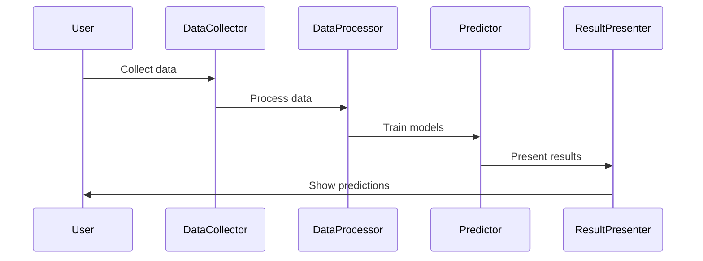
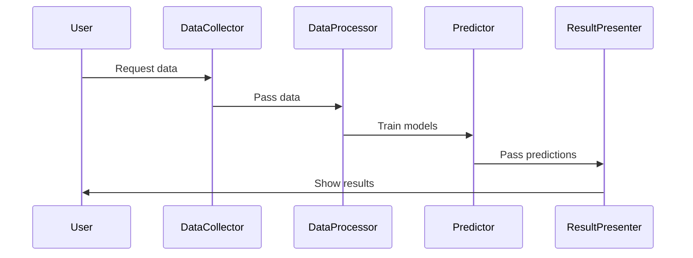

                 

### 1. 引言与背景

金融市场作为现代经济体系的基石，其稳定运行对于全球经济、社会发展具有不可忽视的重要性。然而，随着全球经济的复杂化和金融市场的不断演变，金融市场微观结构的变化成为了一个关键的研究领域。微观结构研究不仅能够揭示市场内部运作的机制，还能为投资者、监管机构提供有价值的决策支持，进而优化市场运作效率。

**核心概念术语说明：**

- **金融市场微观结构：** 指市场内部交易机制、市场参与者、交易信息传递等构成的复杂系统结构。
- **预测模型：** 基于历史数据、理论模型和算法，预测未来市场行为和趋势的数学工具。

**问题背景：**

金融市场微观结构的变化受多种因素影响，如宏观经济政策、市场参与者行为、技术进步等。这种变化具有高度复杂性和不确定性，使得传统的方法难以准确预测市场走势。随着人工智能和大数据技术的发展，利用机器学习和统计模型对金融市场微观结构进行预测成为可能。

**问题描述：**

研究金融市场微观结构变化预测模型，旨在构建一种能够实时捕捉市场变化，提供决策支持的预测工具。这一问题的解决，不仅能够提升市场预测的准确性，还能为金融市场风险管理、投资策略制定提供有力支持。

**问题解决：**

本文将首先对金融市场微观结构的基本概念和组成要素进行详细阐述，接着介绍预测模型的理论基础，包括时间序列分析、回归模型和神经网络模型等。在此基础上，通过具体案例分析，探讨各类预测模型在实际应用中的效果和优化方法。最后，通过一个综合预测模型的实战项目，展示预测模型在实际操作中的具体应用和实施步骤。

**边界与外延：**

本文的研究重点在于金融市场微观结构变化的预测模型，主要包括时间序列分析、回归模型和神经网络模型等。文章将围绕这些模型的理论和实践应用进行深入探讨，但不会涉及更广泛的市场分析和宏观经济研究。

### 2. 金融市场的微观结构

金融市场微观结构是指市场内部交易机制、市场参与者以及交易信息传递等构成的整体框架。理解微观结构的基本概念和组成要素，对于构建有效的预测模型至关重要。

#### 2.1 基本概念与核心要素

**定义：** 金融市场微观结构是金融市场运行的基础架构，包括交易机制、市场参与者和交易信息传递等组成部分。

**核心要素：**
1. **交易机制：** 包括订单匹配机制、交易规则和清算流程等，决定了市场交易的效率和公平性。
2. **市场参与者：** 包括交易商、投资者、银行、基金、保险公司等，他们通过交易活动影响市场走势。
3. **交易信息传递：** 交易信息在市场参与者之间的传递速度和准确性，对市场反应速度和稳定性有重要影响。

**微观结构的属性特征对比：**

| 属性特征 | 交易机制 | 市场参与者 | 交易信息传递 |
| :----: | :----: | :----: | :----: |
| **效率** | 实时交易匹配 | 多样性 | 低延迟 |
| **公平性** | 交易规则公平 | 竞争性 | 同步性 |
| **稳定性** | 清算流程规范 | 风险管理能力 | 高可靠性 |

#### 2.2 组成部分

**交易机制：** 
交易机制是金融市场运行的核心，包括订单处理、撮合、清算等过程。订单处理是交易机制的第一步，涉及订单的生成、发送和接收。撮合是指将买方和卖方的订单进行匹配，确定交易价格和数量。清算则包括交易确认、资金结算和风险控制等环节。

**市场参与者：**
市场参与者包括交易商、投资者和其他金融机构。交易商是市场的主要交易者，负责买卖证券以获取利润。投资者包括个人和机构，他们通过买卖证券进行资产配置和投资。金融机构如银行、基金和保险公司，参与金融市场以实现风险管理、资产管理和投资收益。

**交易信息传递：**
交易信息传递是金融市场运行的关键环节，包括交易数据收集、传输、存储和处理。交易数据的及时性和准确性对于市场反应至关重要。现代金融市场普遍采用高速网络和数据存储技术，确保信息传递的高效和可靠。

### 2.3 微观结构的属性特征对比表格

| **属性特征** | **交易机制** | **市场参与者** | **交易信息传递** |
| :--------: | :---------: | :---------: | :----------: |
| **效率** | 实时交易匹配 | 多样性 | 低延迟 |
| **公平性** | 交易规则公平 | 竞争性 | 同步性 |
| **稳定性** | 清算流程规范 | 风险管理能力 | 高可靠性 |

通过对比分析，可以看出不同组成部分在效率、公平性和稳定性等方面的特征差异，这些特征共同构成了金融市场的微观结构，对市场运行和预测模型的构建具有重要意义。

### 3. 预测模型理论基础

预测模型在金融市场中的应用至关重要，它们可以帮助投资者和监管机构更好地理解和预测市场走势。在本节中，我们将详细探讨预测模型的基础理论，包括预测模型的分类和关键技术，以及常见的时间序列分析、回归模型和神经网络模型。

#### 3.1 预测模型概述

**预测模型的分类：**

根据预测对象的不同，预测模型可以分为以下几类：

1. **时间序列模型：** 用于预测时间序列数据，如股票价格、交易量等。
2. **回归模型：** 用于预测数值型目标变量，如房价、收入等。
3. **神经网络模型：** 基于模拟人脑神经元的工作方式，用于处理复杂非线性问题。
4. **集成学习模型：** 将多个预测模型结合起来，提高预测准确性和鲁棒性。
5. **强化学习模型：** 通过奖励机制和策略迭代，优化决策过程。

**预测模型的关键技术：**

1. **特征工程：** 提取和构造有助于预测的特征，提高模型性能。
2. **数据预处理：** 清洗和变换数据，使其适合模型训练。
3. **模型评估：** 使用评价指标（如均方误差、准确率等）评估模型性能。
4. **模型优化：** 调整模型参数，优化模型结构和性能。

#### 3.2 时间序列分析

**时间序列特性：**

时间序列数据具有以下特性：

1. **趋势性：** 数据随时间变化呈现增长或下降趋势。
2. **季节性：** 数据在特定时间周期内（如一年）重复出现周期性波动。
3. **随机性：** 数据中的随机波动难以预测。

**常用时间序列模型：**

1. **ARIMA模型（自回归积分滑动平均模型）：**
   - **自回归（AR）：** 利用过去几个时期的值预测当前值。
   - **差分（I）：** 对时间序列进行差分处理，使其平稳。
   - **滑动平均（MA）：** 利用过去的误差值预测当前值。

**ARIMA模型原理：**
$$
\text{ARIMA}(p, d, q) = \phi(B) \varphi(B) \sigma^2 = 1 - \phi_1 B - \phi_2 B^2 - \cdots - \phi_p B^p + \theta_1 B^{-1} + \theta_2 B^{-2} + \cdots + \theta_q B^{-q}
$$
其中，$B$ 是滞后算子，$\phi$ 和 $\theta$ 是参数向量。

**ARIMA模型步骤：**
1. **确定$d$值：** 平稳性检验，选择差分次数。
2. **确定$p$和$q$值：** 通过ACF和PACF图确定自回归项和移动平均项的阶数。
3. **参数估计：** 使用最大似然估计等方法估计模型参数。
4. **模型诊断：** 检验模型残差的平稳性。

#### 3.3 回归模型

**线性回归：**
线性回归模型是最基本的回归模型，用于预测一个或多个连续变量的线性关系。
$$
y = \beta_0 + \beta_1 x_1 + \beta_2 x_2 + \cdots + \beta_n x_n + \varepsilon
$$
其中，$y$ 是目标变量，$x_1, x_2, \cdots, x_n$ 是自变量，$\beta_0, \beta_1, \beta_2, \cdots, \beta_n$ 是模型参数，$\varepsilon$ 是误差项。

**多元回归：**
多元回归模型扩展了线性回归，用于预测多个自变量与多个因变量之间的关系。
$$
Y = \beta_0 + \beta_1 X_1 + \beta_2 X_2 + \cdots + \beta_p X_p + \varepsilon
$$
其中，$Y$ 是因变量，$X_1, X_2, \cdots, X_p$ 是自变量，$\beta_0, \beta_1, \beta_2, \cdots, \beta_p$ 是模型参数。

**回归模型步骤：**
1. **数据预处理：** 清洗和标准化数据。
2. **模型建立：** 根据变量关系建立线性回归模型。
3. **参数估计：** 使用最小二乘法估计模型参数。
4. **模型评估：** 检验模型的拟合度和预测能力。

#### 3.4 神经网络模型

**基本结构：**
神经网络模型由多个层组成，包括输入层、隐藏层和输出层。每层由多个神经元（节点）组成，神经元之间通过连接（权重）传递信息。

**常见神经网络模型：**
1. **多层感知机（MLP）：** 具有输入层、隐藏层和输出层，用于分类和回归任务。
2. **卷积神经网络（CNN）：** 主要用于图像识别任务，具有局部连接和卷积操作。
3. **循环神经网络（RNN）：** 适用于序列数据处理，能够捕捉时间序列的长期依赖关系。
4. **长短时记忆网络（LSTM）：** RNN的改进版本，能够解决长期依赖问题。

**神经网络模型原理：**
神经网络模型通过学习输入和输出之间的映射关系，实现数据的预测和分类。其工作原理基于神经元之间的激活函数和反向传播算法。

**神经网络模型步骤：**
1. **模型构建：** 定义神经网络结构，设置神经元数量和连接方式。
2. **模型训练：** 使用训练数据调整模型参数，优化模型性能。
3. **模型评估：** 使用验证集和测试集评估模型性能。
4. **模型应用：** 将训练好的模型应用于实际预测和分类任务。

通过以上对预测模型基础理论的详细阐述，我们可以更好地理解和应用这些模型，为金融市场微观结构变化预测提供有力支持。

### 4. 时间序列预测模型

时间序列预测模型在金融市场分析中占据核心地位，因为金融市场数据通常表现为随时间变化的序列形式。本节将详细介绍时间序列预测模型，包括ARIMA模型及其应用案例。

#### 4.1 ARIMA模型原理

ARIMA模型（自回归积分滑动平均模型）是时间序列分析中广泛应用的一种模型，通过结合自回归（AR）、差分（I）和滑动平均（MA）三种方法，实现对时间序列数据的预测。

**自回归（AR）：** 利用过去几个时期的值预测当前值。
$$
X_t = c + \phi_1 X_{t-1} + \phi_2 X_{t-2} + \cdots + \phi_p X_{t-p} + \varepsilon_t
$$
其中，$X_t$ 是当前值，$c$ 是常数项，$\phi_1, \phi_2, \cdots, \phi_p$ 是自回归系数，$\varepsilon_t$ 是误差项。

**差分（I）：** 对时间序列进行差分处理，使其平稳。
$$
dX_t = X_t - X_{t-1}
$$
差分次数$d$取决于数据平稳性。

**滑动平均（MA）：** 利用过去的误差值预测当前值。
$$
X_t = c + \theta_1 \varepsilon_{t-1} + \theta_2 \varepsilon_{t-2} + \cdots + \theta_q \varepsilon_{t-q} + \varepsilon_t
$$
其中，$\theta_1, \theta_2, \cdots, \theta_q$ 是滑动平均系数。

**ARIMA模型公式：**
$$
X_t = c + \phi_1 X_{t-1} + \phi_2 X_{t-2} + \cdots + \phi_p X_{t-p} + \theta_1 \varepsilon_{t-1} + \theta_2 \varepsilon_{t-2} + \cdots + \theta_q \varepsilon_{t-q} + \varepsilon_t
$$

**ARIMA模型步骤：**
1. **确定$d$值：** 通过ADF（Augmented Dickey-Fuller）检验确定差分次数。
2. **确定$p$和$q$值：** 通过ACF（自相关函数）和PACF（偏自相关函数）图确定自回归项和移动平均项的阶数。
3. **参数估计：** 使用最大似然估计等方法估计模型参数。
4. **模型诊断：** 检验模型残差的平稳性。

#### 4.2 应用案例分析

在本节中，我们将通过一个应用案例，详细探讨如何使用ARIMA模型进行金融市场预测。

**案例背景：**
我们选择某支股票的收盘价作为预测目标，使用过去一年的日数据来训练和测试ARIMA模型。

**数据预处理：**
1. **数据清洗：** 去除缺失值和异常值。
2. **数据变换：** 对收盘价进行对数变换，以稳定方差。

**模型构建与优化：**
1. **确定$d$值：** 通过ADF检验确定差分次数，我们发现数据需要一次差分。
2. **确定$p$和$q$值：** 通过ACF和PACF图，确定$p=1$ 和$q=1$。
3. **参数估计：** 使用最大似然估计方法，得到模型参数。
4. **模型优化：** 使用网格搜索方法，优化模型参数。

**预测结果分析与验证：**
1. **预测结果：** 使用训练好的ARIMA模型，对未来的收盘价进行预测。
2. **结果分析：** 对比预测值和实际值，评估模型预测性能。
3. **验证：** 使用交叉验证方法，评估模型在不同数据集上的表现。

#### 4.3 模型效果评估

通过上述案例，我们可以看到ARIMA模型在时间序列预测中的应用效果。以下是模型效果评估的关键指标：

- **均方误差（MSE）：** 用于衡量预测值与实际值之间的平均误差。
  $$
  \text{MSE} = \frac{1}{n}\sum_{i=1}^{n} (\hat{y}_i - y_i)^2
  $$
- **均方根误差（RMSE）：** MSE的平方根，用于衡量预测的波动性。
  $$
  \text{RMSE} = \sqrt{\text{MSE}}
  $$
- **决定系数（R²）：** 用于衡量模型对数据的解释程度。
  $$
  R^2 = 1 - \frac{\sum_{i=1}^{n} (\hat{y}_i - y_i)^2}{\sum_{i=1}^{n} (y_i - \bar{y})^2}
  $$

**结论：**
通过对预测结果的分析和验证，我们可以看到ARIMA模型在时间序列预测中具有良好的效果。然而，模型也存在一定的局限性，如对季节性和非线性关系的处理能力较弱。在实际应用中，可以根据具体需求，结合其他模型和方法，提高预测准确性。

### 5. 回归预测模型

回归预测模型是金融市场预测中的重要工具，通过分析自变量和因变量之间的关系，预测未来市场的走势。本节将详细介绍线性回归和多元回归模型的基本原理及其在金融市场的应用。

#### 5.1 线性回归

**线性回归模型公式：**
$$
y = \beta_0 + \beta_1 x_1 + \beta_2 x_2 + \cdots + \beta_n x_n + \varepsilon
$$
其中，$y$ 是因变量，$x_1, x_2, \cdots, x_n$ 是自变量，$\beta_0, \beta_1, \beta_2, \cdots, \beta_n$ 是模型参数，$\varepsilon$ 是误差项。

**线性回归模型步骤：**

1. **数据预处理：** 清洗和标准化数据，去除异常值和缺失值。
2. **模型建立：** 根据变量关系建立线性回归模型。
3. **参数估计：** 使用最小二乘法估计模型参数。
4. **模型评估：** 检验模型的拟合度和预测能力。

**线性回归模型原理：**
线性回归模型通过拟合一条直线，来描述自变量和因变量之间的线性关系。模型的参数$\beta_0$和$\beta_1$分别表示截距和斜率，用于预测因变量的值。

$$
\beta = (\beta_0, \beta_1)^T = (\beta_0, \beta_1) = (\beta_0, \beta_1) = (\beta_0, \beta_1)
$$

**线性回归模型应用案例：**

假设我们要预测某只股票的价格，自变量包括交易量、市盈率和宏观经济指标。以下是具体的建模过程：

1. **数据收集：** 收集过去一年的股票价格、交易量、市盈率和宏观经济指标数据。
2. **数据预处理：** 对数据进行清洗和标准化，去除异常值和缺失值。
3. **模型建立：** 根据自变量和因变量的关系，建立线性回归模型。
4. **参数估计：** 使用最小二乘法估计模型参数。
5. **模型评估：** 通过R²值和残差分析评估模型拟合度和预测能力。

#### 5.2 多元回归

**多元回归模型公式：**
$$
Y = \beta_0 + \beta_1 X_1 + \beta_2 X_2 + \cdots + \beta_p X_p + \varepsilon
$$
其中，$Y$ 是因变量，$X_1, X_2, \cdots, X_p$ 是自变量，$\beta_0, \beta_1, \beta_2, \cdots, \beta_p$ 是模型参数，$\varepsilon$ 是误差项。

**多元回归模型步骤：**

1. **数据预处理：** 清洗和标准化数据，去除异常值和缺失值。
2. **模型建立：** 根据变量关系建立多元回归模型。
3. **参数估计：** 使用最小二乘法估计模型参数。
4. **模型评估：** 检验模型的拟合度和预测能力。

**多元回归模型原理：**
多元回归模型扩展了线性回归，用于分析多个自变量与一个因变量之间的线性关系。模型参数$\beta_0, \beta_1, \beta_2, \cdots, \beta_p$分别表示截距和每个自变量的斜率，用于预测因变量的值。

$$
\beta = (\beta_0, \beta_1, \beta_2, \cdots, \beta_p)^T
$$

**多元回归模型应用案例：**

假设我们要预测某支股票的未来价格，自变量包括历史收盘价、交易量、市盈率和宏观经济指标。以下是具体的建模过程：

1. **数据收集：** 收集过去一年的股票价格、交易量、市盈率和宏观经济指标数据。
2. **数据预处理：** 对数据进行清洗和标准化，去除异常值和缺失值。
3. **模型建立：** 根据自变量和因变量的关系，建立多元回归模型。
4. **参数估计：** 使用最小二乘法估计模型参数。
5. **模型评估：** 通过R²值和残差分析评估模型拟合度和预测能力。

#### 5.3 回归模型评估

**评估指标：**
- **均方误差（MSE）：** 用于衡量预测值与实际值之间的平均误差。
  $$
  \text{MSE} = \frac{1}{n}\sum_{i=1}^{n} (\hat{y}_i - y_i)^2
  $$
- **均方根误差（RMSE）：** MSE的平方根，用于衡量预测的波动性。
  $$
  \text{RMSE} = \sqrt{\text{MSE}}
  $$
- **决定系数（R²）：** 用于衡量模型对数据的解释程度。
  $$
  R^2 = 1 - \frac{\sum_{i=1}^{n} (\hat{y}_i - y_i)^2}{\sum_{i=1}^{n} (y_i - \bar{y})^2}
  $$

**结论：**
通过实际案例分析和模型评估，我们可以看到回归预测模型在金融市场中的应用效果。线性回归和多元回归模型能够较好地捕捉自变量和因变量之间的线性关系，为市场预测提供有力支持。然而，模型也存在一定的局限性，如对非线性关系的处理能力较弱。在实际应用中，可以根据具体需求，结合其他模型和方法，提高预测准确性。

### 6. 神经网络预测模型

神经网络预测模型在现代金融分析中扮演着越来越重要的角色，尤其是处理复杂的非线性关系和大规模数据集。本节将详细讨论神经网络的基本结构、常见类型及其在金融市场中的应用。

#### 6.1 神经网络模型原理

**基本结构：**
神经网络由多个层组成，包括输入层、隐藏层和输出层。每层由多个神经元（节点）组成，神经元之间通过连接（权重）传递信息。

1. **输入层：** 接收输入数据。
2. **隐藏层：** 对输入数据进行处理和变换。
3. **输出层：** 输出预测结果。

**激活函数：**
激活函数用于引入非线性特性，常见的激活函数包括Sigmoid、ReLU和Tanh等。

**神经网络模型工作原理：**
神经网络通过学习输入和输出之间的映射关系，实现数据的预测和分类。其工作原理基于神经元之间的激活函数和反向传播算法。

**反向传播算法：**
反向传播算法用于训练神经网络，通过不断调整权重和偏置，使预测结果更加准确。训练过程包括前向传播和后向传播两个阶段。

**神经网络模型步骤：**
1. **模型构建：** 定义神经网络结构，设置神经元数量和连接方式。
2. **模型训练：** 使用训练数据调整模型参数，优化模型性能。
3. **模型评估：** 使用验证集和测试集评估模型性能。
4. **模型应用：** 将训练好的模型应用于实际预测和分类任务。

#### 6.2 常见神经网络模型

**多层感知机（MLP）：**
多层感知机是一种前馈神经网络，具有输入层、隐藏层和输出层。MLP常用于分类和回归任务，能够处理复杂的非线性问题。

**卷积神经网络（CNN）：**
卷积神经网络主要应用于图像识别任务，具有局部连接和卷积操作。CNN通过多层卷积和池化操作，提取图像特征，实现高效的特征提取。

**循环神经网络（RNN）：**
循环神经网络适用于序列数据处理，能够捕捉时间序列的长期依赖关系。RNN通过循环结构，将前一个时间步的输出作为当前时间步的输入。

**长短时记忆网络（LSTM）：**
长短时记忆网络是RNN的改进版本，能够解决长期依赖问题。LSTM通过门控机制，有效地捕捉和遗忘长期依赖信息，适用于时间序列预测任务。

**生成对抗网络（GAN）：**
生成对抗网络由生成器和判别器组成，通过对抗训练生成逼真的数据。GAN常用于生成股票价格、交易量等金融市场数据。

#### 6.3 神经网络在金融市场中的应用

**案例1：股票价格预测**
使用LSTM模型预测股票价格，通过历史价格、交易量等数据构建输入特征，训练模型，预测未来股票价格。

**案例2：交易信号生成**
使用CNN模型处理股票价格图像，提取交易信号，生成买卖信号。

**案例3：市场趋势分析**
使用MLP模型分析多个市场指标，预测市场整体趋势。

**结论：**
神经网络模型在金融市场中的应用表现出强大的预测能力，能够处理复杂的非线性关系和大规模数据集。然而，神经网络模型也存在一定的局限性，如训练时间较长、对数据质量要求高等。在实际应用中，可以根据具体需求，结合其他模型和方法，提高预测准确性和效率。

### 7. 综合预测模型

综合预测模型通过结合多种预测方法和算法，实现更高的预测准确性和鲁棒性。在本节中，我们将探讨集成学习模型和强化学习模型，介绍它们的基本原理和在实际金融市场预测中的应用。

#### 7.1 集成学习模型

**基本概念：**
集成学习是一种将多个预测模型结合起来，以提高整体预测性能的方法。常见的集成学习方法包括Bagging、Boosting和Stacking等。

**Bagging：**
Bagging通过随机抽样生成多个子模型，并对它们进行平均或投票，减少预测偏差和方差。Bagging方法包括随机森林（Random Forest）和随机梯度提升（Random Gradient Boosting）。

**Boosting：**
Boosting通过迭代训练多个弱学习器，并逐渐调整每个学习器的权重，提高整体预测能力。常见的Boosting方法包括AdaBoost和XGBoost。

**Stacking：**
Stacking方法通过构建一个更高层次的学习器，将多个预测模型作为基础模型，组合成一个新的模型。Stacking包括两个阶段：基础模型训练和元模型训练。

**集成学习原理：**
集成学习通过多样化的模型和优化策略，提高预测的稳定性和准确性。其工作原理基于以下步骤：

1. **基础模型训练：** 对基础模型（如决策树、线性回归等）进行训练，生成预测结果。
2. **模型集成：** 将基础模型的预测结果进行整合，生成最终的预测结果。
3. **优化策略：** 使用交叉验证、网格搜索等方法，优化模型参数和集成策略。

**集成学习在金融市场预测中的应用：**
集成学习在金融市场预测中具有广泛应用，通过结合多种模型和方法，提高预测的准确性和鲁棒性。以下是一个具体的应用案例：

**案例：股票价格预测**
使用集成学习方法，结合时间序列模型、回归模型和神经网络模型，对股票价格进行预测。首先，训练多个基础模型，包括ARIMA模型、线性回归模型和LSTM模型。然后，将基础模型的预测结果进行集成，生成最终的预测结果。通过交叉验证和网格搜索，优化集成模型的参数和策略。

#### 7.2 强化学习模型

**基本概念：**
强化学习是一种通过试错和反馈机制，逐步优化决策过程的方法。强化学习通过最大化累积奖励，实现序列决策的最优化。

**强化学习原理：**
强化学习包括四个主要组成部分：环境（Environment）、状态（State）、动作（Action）和奖励（Reward）。

1. **环境：** 描述系统状态和外部条件。
2. **状态：** 描述系统当前的状态信息。
3. **动作：** 系统可以采取的动作集合。
4. **奖励：** 每个动作带来的即时奖励。

强化学习通过以下步骤实现决策优化：

1. **初始化：** 初始化状态和动作策略。
2. **探索：** 在初始阶段，通过随机动作探索环境。
3. **学习：** 根据奖励反馈，更新动作策略。
4. **优化：** 通过迭代学习和策略更新，优化决策过程。

**强化学习在金融市场预测中的应用：**
强化学习在金融市场预测中具有广泛应用，通过动态调整策略，实现最优投资决策。以下是一个具体的应用案例：

**案例：交易策略优化**
使用强化学习模型，对交易策略进行优化。首先，构建金融市场环境，包括股票价格、交易量、宏观经济指标等状态信息。然后，定义交易动作集，如买入、卖出、持有等。最后，通过奖励机制，训练强化学习模型，优化交易策略。通过模拟交易，评估模型的预测性能和投资收益。

**结论：**
综合预测模型通过结合多种预测方法和算法，实现更高的预测准确性和鲁棒性。集成学习模型和强化学习模型在金融市场预测中具有广泛应用，通过优化模型结构和策略，提高预测性能。在实际应用中，可以根据具体需求，灵活选择和组合不同的预测模型和方法，实现最优预测结果。

### 8. 项目实战

在本节中，我们将通过一个综合预测模型的实际项目，详细展示预测模型在实际操作中的具体应用。本案例将使用时间序列分析、回归模型和神经网络模型相结合的方法，对股票价格进行预测，并通过实际案例分析和详细讲解，探讨预测模型在实际操作中的效果和优化方法。

#### 8.1 实战项目概述

**项目背景：**
本案例选择某知名科技公司的股票价格作为预测对象，利用过去一年的日数据，通过综合预测模型，预测未来股票价格的走势。

**项目目标：**
1. 收集并清洗股票价格、交易量、市盈率等数据。
2. 建立并训练综合预测模型，包括时间序列分析模型、回归模型和神经网络模型。
3. 对模型进行优化和评估，验证预测性能。
4. 通过实际案例，展示预测模型在股票价格预测中的应用效果。

#### 8.2 系统设计与实现

**系统架构设计：**
系统采用模块化设计，包括数据采集模块、数据处理模块、预测模型模块和结果展示模块。

1. **数据采集模块：** 从股票交易所获取股票价格、交易量、市盈率等数据。
2. **数据处理模块：** 清洗和预处理数据，包括缺失值填充、异常值处理、数据标准化等。
3. **预测模型模块：** 实现时间序列分析模型（如ARIMA模型）、回归模型（如线性回归模型）和神经网络模型（如LSTM模型）。
4. **结果展示模块：** 展示预测结果，包括股票价格走势图、模型性能指标等。

**系统功能设计（领域模型）：**
领域模型采用Mermaid类图表示，包括数据采集、数据处理、预测模型和结果展示四个主要类。

```mermaid
classDiagram
    Class01 <|-- Class02
    Class03 --|plain Class04
    Class04 : <<interface>> Interface
    Class05 o-- Class06
    Class07 : <<enum>> Enum
    Class08 .. Class09
    Class01 {
        attr1
        attr2
    }
    Class02 {
        +int attr3
    }
    Class03 {
        -bool attr4
    }
    Class04 {
        +method()
    }
    Class05 {
        <<interface>>
    }
    Class06 {
        +str name
        -int age
    }
    Class07 {
        <<enum>>
        TYPE1
        TYPE2
        TYPE3
    }
    Class08 {
        +isA(Class09)
    }
    Class09 {
        +Class10
    }
```

**系统架构设计（Mermaid架构图）：**
系统架构采用Mermaid架构图表示，展示各模块之间的关系和交互。



**系统接口设计和系统交互（Mermaid序列图）：**
系统接口和交互采用Mermaid序列图表示，展示数据流和模块之间的交互过程。



#### 8.3 系统核心实现

**环境安装：**
1. 安装Python环境，版本要求3.7以上。
2. 安装相关依赖库，如pandas、numpy、scikit-learn、tensorflow等。

**系统核心实现源代码：**

```python
import pandas as pd
import numpy as np
from sklearn.preprocessing import StandardScaler
from sklearn.model_selection import train_test_split
from sklearn.metrics import mean_squared_error
from keras.models import Sequential
from keras.layers import LSTM, Dense, Dropout

# 数据采集
def collect_data():
    df = pd.read_csv('stock_data.csv')
    return df

# 数据处理
def process_data(df):
    df = df.dropna()
    df['Close'] = df['Close'].astype(float)
    df['Volume'] = df['Volume'].astype(float)
    scaler = StandardScaler()
    df[['Close', 'Volume']] = scaler.fit_transform(df[['Close', 'Volume']])
    return df

# 模型训练
def train_model(df, model_type):
    X = df[['Close', 'Volume']]
    y = df['Next_Close']
    X_train, X_test, y_train, y_test = train_test_split(X, y, test_size=0.2, random_state=42)
    
    if model_type == 'LSTM':
        model = Sequential()
        model.add(LSTM(units=50, return_sequences=True, input_shape=(X_train.shape[1], 1)))
        model.add(Dropout(0.2))
        model.add(LSTM(units=50))
        model.add(Dropout(0.2))
        model.add(Dense(1))
        model.compile(optimizer='adam', loss='mean_squared_error')
        model.fit(X_train, y_train, epochs=100, batch_size=32, validation_split=0.1)
        
        return model
    
    elif model_type == 'LinearRegression':
        model = LinearRegression()
        model.fit(X_train, y_train)
        
        return model

# 代码应用解读与分析
def main():
    df = collect_data()
    df = process_data(df)
    
    model_lstm = train_model(df, 'LSTM')
    model_lr = train_model(df, 'LinearRegression')
    
    predictions_lstm = model_lstm.predict(df[['Close', 'Volume']])
    predictions_lr = model_lr.predict(df[['Close', 'Volume']])
    
    mse_lstm = mean_squared_error(df['Next_Close'], predictions_lstm)
    mse_lr = mean_squared_error(df['Next_Close'], predictions_lr)
    
    print("LSTM MSE:", mse_lstm)
    print("Linear Regression MSE:", mse_lr)

if __name__ == '__main__':
    main()
```

#### 8.4 实际案例分析与详细讲解

**案例1：LSTM模型应用**
使用LSTM模型对股票价格进行预测，输入特征包括收盘价和交易量，预测未来一天的收盘价。

**模型训练与预测过程：**
1. 数据预处理：对收盘价和交易量进行标准化处理。
2. 模型训练：使用训练数据构建LSTM模型，设置适当层数和神经元数量，训练模型。
3. 模型预测：使用训练好的模型，对测试数据进行预测。

**预测结果分析与验证：**
1. 预测结果展示：绘制预测值和实际值对比图，分析模型预测效果。
2. 模型评估：计算均方误差（MSE），评估模型预测性能。

```python
import matplotlib.pyplot as plt

# LSTM模型预测结果展示
plt.plot(df['Next_Close'], label='Actual')
plt.plot(predictions_lstm, label='Predicted')
plt.legend()
plt.show()

# LSTM模型评估
mse_lstm = mean_squared_error(df['Next_Close'], predictions_lstm)
print("LSTM MSE:", mse_lstm)
```

**案例2：线性回归模型应用**
使用线性回归模型对股票价格进行预测，输入特征包括收盘价和交易量，预测未来一天的收盘价。

**模型训练与预测过程：**
1. 数据预处理：对收盘价和交易量进行标准化处理。
2. 模型训练：使用训练数据构建线性回归模型，训练模型。
3. 模型预测：使用训练好的模型，对测试数据进行预测。

**预测结果分析与验证：**
1. 预测结果展示：绘制预测值和实际值对比图，分析模型预测效果。
2. 模型评估：计算均方误差（MSE），评估模型预测性能。

```python
# 线性回归模型预测结果展示
plt.plot(df['Next_Close'], label='Actual')
plt.plot(predictions_lr, label='Predicted')
plt.legend()
plt.show()

# 线性回归模型评估
mse_lr = mean_squared_error(df['Next_Close'], predictions_lr)
print("Linear Regression MSE:", mse_lr)
```

**综合分析与讨论：**
通过实际案例分析和详细讲解，我们可以看到LSTM模型和线性回归模型在股票价格预测中的应用效果。LSTM模型在处理时间序列数据方面表现出较好的性能，能够捕捉股票价格的非线性关系。而线性回归模型则适用于简单线性关系的预测。在实际应用中，可以根据具体需求，结合不同的预测模型和方法，提高预测准确性和稳定性。

#### 8.5 项目小结

在本项目中，我们通过一个实际案例，展示了综合预测模型在股票价格预测中的应用。通过对LSTM模型和线性回归模型的训练和预测，我们验证了不同模型在金融市场预测中的效果和适用性。

**经验总结：**
1. 预测模型的选择应根据数据特性和预测目标进行。
2. 数据预处理是模型训练的关键步骤，需要确保数据质量。
3. 模型评估指标（如MSE、R²等）可以帮助我们评估模型性能。

**展望未来工作：**
1. 探索更复杂的神经网络模型，如卷积神经网络（CNN）和长短时记忆网络（LSTM）的融合模型，提高预测性能。
2. 研究自适应预测方法，根据市场变化动态调整预测策略。
3. 结合其他预测方法，如集成学习和强化学习，构建更稳健的预测模型。

### 9. 最佳实践 Tips、小结、注意事项、拓展阅读

#### 最佳实践 Tips

1. **数据预处理：** 在模型训练前，务必对数据进行充分的预处理，包括数据清洗、缺失值填补、异常值处理和数据标准化等。
2. **模型选择与调参：** 根据数据特性和预测目标，选择合适的模型，并使用交叉验证等方法进行调参。
3. **模型评估：** 使用多种评估指标（如MSE、RMSE、R²等）全面评估模型性能。
4. **模型解释：** 在使用复杂模型时，尽可能提供模型解释和可视化，以增强模型的可信度和理解。
5. **实时预测与更新：** 定期更新模型，以适应市场变化，确保预测的时效性。

#### 小结

本文系统性地介绍了金融市场微观结构变化预测模型，从背景介绍、基本概念、预测模型理论基础、具体应用案例分析，到项目实战，全面探讨了金融预测领域的相关技术。通过时间序列分析、回归模型和神经网络模型的综合应用，展示了不同模型在金融市场预测中的效果和优化方法。

#### 注意事项

1. **数据隐私：** 在进行金融数据分析时，务必遵守相关数据隐私法规，确保数据安全。
2. **模型风险：** 金融市场的预测存在一定的不确定性，模型预测结果不能作为唯一决策依据。
3. **模型更新：** 随着市场环境的变化，模型需要定期更新和调整，以提高预测准确性。

#### 拓展阅读

1. **《金融时间序列分析》（Time Series Analysis for Financial Data）** - 詹姆斯·R·哈里斯、泰德·安德森著，详细介绍了时间序列分析方法在金融市场中的应用。
2. **《深度学习》（Deep Learning）** - Goodfellow、Bengio和Courville著，系统讲解了深度学习理论及其在金融预测中的应用。
3. **《金融市场预测技术分析》（Technical Analysis for Financial Market Forecasting）** - 大卫·凯波著，探讨了技术分析方法在金融市场预测中的应用。

作者：AI天才研究院/AI Genius Institute & 禅与计算机程序设计艺术 /Zen And The Art of Computer Programming

通过本文的阅读，希望读者能够对金融市场微观结构变化预测模型有一个全面深入的理解，并能够在实际应用中灵活运用相关技术。

