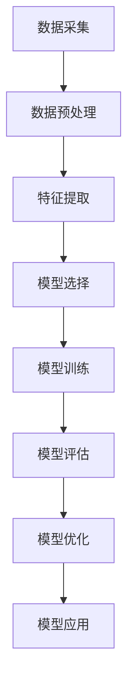

                 

## 《金融市场微观结构变化预测模型》

> 关键词：金融市场微观结构、预测模型、时间序列分析、回归分析、支持向量机

> 摘要：本文旨在探讨金融市场微观结构变化预测模型的研究与应用。通过详细介绍金融市场微观结构的背景、核心概念，分析预测模型的基础知识，以及具体实现方法和系统设计，本文为读者提供了一个全面、系统的理解金融市场动态变化的视角。

## 目录

----------------------------------------------------------------

# 第一部分: 背景介绍与核心概念

## 第1章: 金融市场微观结构概述

### 1.1 问题背景

### 1.2 问题描述

### 1.3 问题解决

### 1.4 边界与外延

### 1.5 核心概念与要素组成

## 第2章: 金融市场微观结构数据

### 2.1 数据类型与来源

### 2.2 数据质量与预处理

### 2.3 数据特征提取

## 第3章: 预测模型基础

### 3.1 时间序列分析

### 3.2 回归分析

### 3.3 支持向量机

## 第二部分: 模型构建与实现

## 第4章: 微观结构变化预测模型

### 4.1 模型构建方法

### 4.2 模型评估与优化

### 4.3 实例分析

## 第5章: 算法原理与实现

### 5.1 算法原理讲解

### 5.2 Mermaid算法流程图

### 5.3 Python源代码实现

### 5.4 数学模型与公式讲解

### 5.5 举例说明

## 第6章: 系统设计与实现

### 6.1 系统功能设计

### 6.2 系统架构设计

### 6.3 系统接口设计与交互

## 第7章: 项目实战与案例分析

### 7.1 环境安装与配置

### 7.2 系统核心实现源代码

### 7.3 代码应用解读与分析

### 7.4 实际案例分析与讲解

### 7.5 项目小结

## 第8章: 最佳实践与未来展望

### 8.1 最佳实践技巧

### 8.2 注意事项

### 8.3 拓展阅读与进一步研究

----------------------------------------------------------------

### 第1章: 金融市场微观结构概述

#### 1.1 问题背景

金融市场微观结构是指市场中个体交易行为及其相互作用的方式。这些交易行为不仅包括买卖交易，还包括交易者的订单流、交易策略、交易成本、市场流动性等。金融市场微观结构研究的主要目的是理解这些微观因素如何影响市场价格形成过程，进而指导投资决策和风险管理。

金融市场微观结构的研究始于20世纪70年代，当时学者们开始关注交易数据和价格变动的微观特征。随着计算机技术和数据采集技术的发展，金融数据的获取变得更加容易，这为金融市场微观结构研究提供了丰富的数据资源。如今，金融市场微观结构已成为金融工程和计量经济学研究的重要领域。

#### 1.2 问题描述

金融市场微观结构研究面临的问题是如何从海量交易数据中提取有用的信息，并建立有效的预测模型。具体而言，研究的问题包括：

1. **市场流动性分析**：流动性是指资产在市场上容易买卖的程度。如何衡量和预测市场流动性，以及流动性变化对市场价格的影响。
2. **交易成本评估**：交易成本是指投资者在交易过程中所付出的成本，包括交易费用、信息成本、机会成本等。如何准确评估交易成本，以及交易成本如何影响市场效率。
3. **价格形成机制**：市场价格是由买卖双方的力量平衡决定的。如何理解价格形成机制，以及价格变动背后的微观因素。
4. **交易者行为分析**：交易者的行为模式如何影响市场价格和市场流动性，如何识别和预测交易者的行为。

#### 1.3 问题解决

解决金融市场微观结构问题的主要方法包括：

1. **数据采集与预处理**：收集高质量的金融市场数据，包括交易数据、订单数据、报价数据等，并进行数据清洗、去噪和特征提取。
2. **时间序列分析**：时间序列分析是一种常用的方法，用于分析市场数据的趋势、周期性和季节性。
3. **回归分析**：回归分析通过建立市场数据与价格变动之间的定量关系，帮助预测市场价格。
4. **支持向量机**：支持向量机是一种强大的分类和回归算法，适用于金融市场数据的分析和预测。
5. **模型评估与优化**：通过交叉验证、网格搜索等方法评估模型的性能，并根据评估结果对模型进行优化。

#### 1.4 边界与外延

金融市场微观结构研究的边界主要涉及市场交易层面，包括交易数据、交易成本、市场流动性等。外延方面，研究可以拓展到更广泛的金融领域，如金融市场效率、金融风险管理和金融政策制定等。

#### 1.5 核心概念与要素组成

金融市场微观结构的核心概念包括：

1. **市场流动性**：市场流动性是指资产在市场上容易买卖的程度。流动性好意味着资产可以快速买卖，价格波动小。
2. **交易成本**：交易成本是指投资者在交易过程中所付出的成本，包括交易费用、信息成本、机会成本等。
3. **价格形成机制**：价格形成机制是指市场价格是如何形成的。价格形成受到买卖双方力量平衡的影响。
4. **交易者行为**：交易者行为是指市场中各个交易者的交易策略和行为模式。

要素组成方面，金融市场微观结构包括：

1. **交易数据**：包括交易时间、交易价格、交易量等。
2. **订单数据**：包括订单类型、订单价格、订单量等。
3. **报价数据**：包括报价时间、报价价格、报价量等。
4. **市场指标**：包括市场流动性指标、价格波动率指标、交易成本指标等。

### 第2章: 金融市场微观结构数据

#### 2.1 数据类型与来源

金融市场微观结构数据主要包括交易数据、订单数据和报价数据等。交易数据记录了市场中的每一笔交易，包括交易时间、交易价格和交易量等。订单数据记录了市场中的所有订单，包括订单类型、订单价格和订单量等。报价数据记录了市场中所有报价，包括报价时间、报价价格和报价量等。

数据来源主要有：

1. **交易所**：交易所是金融市场的主要数据来源，包括股票交易所、期货交易所、外汇交易所等。
2. **金融数据库**：如CRSP、TAQ、Bloomberg等，提供了丰富的金融市场数据。
3. **在线数据平台**：如Quandl、Yahoo Finance等，提供了大量的免费金融市场数据。

#### 2.2 数据质量与预处理

数据质量是金融市场微观结构研究的关键。高质量的数据可以提供准确的预测结果，而低质量的数据则可能导致错误的预测。

数据质量问题包括：

1. **缺失值**：数据中可能存在缺失值，需要通过插值、均值填充等方法处理。
2. **异常值**：数据中可能存在异常值，需要通过滤波、聚类等方法处理。
3. **噪声**：数据中可能存在噪声，需要通过滤波、平滑等方法处理。

数据预处理步骤包括：

1. **数据清洗**：去除缺失值、异常值和噪声。
2. **数据转换**：将数据转换为适合分析的形式，如标准化、归一化等。
3. **特征提取**：提取关键特征，如交易量、价格波动率、交易时间等。

#### 2.3 数据特征提取

数据特征提取是金融市场微观结构分析的重要步骤。通过特征提取，可以从原始数据中提取出对预测任务有用的信息。

常见的特征提取方法包括：

1. **统计特征**：如均值、方差、标准差等。
2. **时序特征**：如趋势、周期性、季节性等。
3. **空间特征**：如市场价格分布、交易量分布等。

特征提取步骤包括：

1. **数据预处理**：去除缺失值、异常值和噪声。
2. **统计特征提取**：计算均值、方差、标准差等。
3. **时序特征提取**：分析数据的时间序列特性，如趋势、周期性、季节性等。
4. **空间特征提取**：分析市场价格分布、交易量分布等。

### 第3章: 预测模型基础

#### 3.1 时间序列分析

时间序列分析是一种用于分析时间序列数据的方法，广泛应用于金融市场分析、经济学、统计学等领域。时间序列数据是指按时间顺序排列的数据，如市场价格、交易量等。

时间序列分析的主要任务包括：

1. **趋势分析**：识别时间序列数据的长期趋势。
2. **周期性分析**：识别时间序列数据的周期性特征。
3. **季节性分析**：识别时间序列数据的季节性特征。
4. **平稳性分析**：检验时间序列数据的平稳性。

常见的时间序列分析方法包括：

1. **移动平均法**：通过计算一系列数据的平均值来平滑时间序列数据。
2. **指数平滑法**：通过对历史数据进行加权平均来预测未来值。
3. **自回归模型**：利用历史数据来预测未来值。
4. **ARIMA模型**：自回归积分滑动平均模型，用于分析非平稳时间序列数据。

#### 3.2 回归分析

回归分析是一种用于建立变量之间定量关系的统计方法，广泛应用于金融市场分析、经济学、统计学等领域。回归分析可以分为线性回归和非线性回归。

线性回归的主要任务是通过一个或多个自变量预测因变量。线性回归模型的基本形式为：

$$
y = \beta_0 + \beta_1x_1 + \beta_2x_2 + ... + \beta_nx_n + \epsilon
$$

其中，$y$为因变量，$x_1, x_2, ..., x_n$为自变量，$\beta_0, \beta_1, \beta_2, ..., \beta_n$为回归系数，$\epsilon$为随机误差。

非线性回归则是通过非线性函数建立变量之间的关系。常见的方法包括多项式回归、逻辑回归、岭回归等。

#### 3.3 支持向量机

支持向量机（SVM）是一种基于优化理论的监督学习算法，广泛应用于分类和回归问题。SVM的核心思想是通过找到一个最优的超平面，将数据分为不同的类别。

SVM的基本形式为：

$$
w \cdot x + b = 0
$$

其中，$w$为权重向量，$x$为特征向量，$b$为偏置。

SVM的目标是最小化误差，同时最大化分类间隔。求解方法包括硬间隔和软间隔。

在金融市场微观结构预测中，SVM可以用于交易者行为识别、市场流动性预测等问题。

### 第4章: 微观结构变化预测模型

#### 4.1 模型构建方法

金融市场微观结构变化预测模型的构建方法包括数据预处理、特征选择、模型选择与训练等。

1. **数据预处理**：对原始金融数据进行清洗、去噪和转换，提取有用的特征。
2. **特征选择**：从提取的特征中筛选出对预测任务最有用的特征，减少模型的复杂度。
3. **模型选择**：选择合适的预测模型，如时间序列模型、回归模型、支持向量机等。
4. **模型训练**：使用训练数据对预测模型进行训练，优化模型参数。

#### 4.2 模型评估与优化

模型评估是金融市场微观结构变化预测模型研究的重要环节。常用的评估指标包括准确率、精确率、召回率、F1值等。

模型优化方法包括：

1. **参数调优**：通过交叉验证、网格搜索等方法，优化模型参数，提高预测性能。
2. **模型融合**：将多个预测模型进行融合，提高预测的鲁棒性和准确性。

#### 4.3 实例分析

以交易者行为识别为例，分析金融市场微观结构变化预测模型的应用。

1. **数据采集**：从交易所获取交易数据、订单数据和报价数据。
2. **数据预处理**：清洗数据，提取特征。
3. **模型选择**：选择支持向量机作为预测模型。
4. **模型训练**：使用训练数据对支持向量机模型进行训练。
5. **模型评估**：使用测试数据对模型进行评估，调整模型参数。
6. **模型应用**：将模型应用于实际交易，识别交易者行为，预测市场流动性。

### 第5章: 算法原理与实现

#### 5.1 算法原理讲解

在本章中，我们将详细介绍用于金融市场微观结构变化预测的主要算法原理，包括时间序列分析方法、回归分析和支持向量机等。

1. **时间序列分析方法**：时间序列分析是一种用于分析时间序列数据的方法，广泛应用于金融市场分析、经济学和统计学等领域。时间序列分析的主要任务包括趋势分析、周期性分析、季节性分析和平稳性分析。常见的时间序列分析方法包括移动平均法、指数平滑法、自回归模型和ARIMA模型等。

2. **回归分析**：回归分析是一种用于建立变量之间定量关系的统计方法，广泛应用于金融市场分析、经济学和统计学等领域。回归分析可以分为线性回归和非线性回归。线性回归通过一个或多个自变量预测因变量，非线性回归则通过非线性函数建立变量之间的关系。

3. **支持向量机**：支持向量机（SVM）是一种基于优化理论的监督学习算法，广泛应用于分类和回归问题。SVM的核心思想是通过找到一个最优的超平面，将数据分为不同的类别。SVM的基本形式为 $w \cdot x + b = 0$，其中 $w$ 为权重向量，$x$ 为特征向量，$b$ 为偏置。

#### 5.2 Mermaid算法流程图

为了更直观地展示算法原理，我们可以使用Mermaid绘制算法流程图。



#### 5.3 Python源代码实现

为了更好地理解算法原理，我们将使用Python实现金融市场微观结构变化预测模型。

1. **数据采集**：从交易所获取交易数据、订单数据和报价数据。

```python
import pandas as pd

# 读取交易数据
transactions = pd.read_csv('transactions.csv')
# 读取订单数据
orders = pd.read_csv('orders.csv')
# 读取报价数据
quotes = pd.read_csv('quotes.csv')
```

2. **数据预处理**：清洗数据，提取特征。

```python
# 数据清洗
transactions = transactions.dropna()
orders = orders.dropna()
quotes = quotes.dropna()

# 特征提取
transactions['volume'] = transactions['quantity'] * transactions['price']
orders['volume'] = orders['quantity'] * orders['price']
quotes['volume'] = quotes['quantity'] * quotes['price']
```

3. **模型选择**：选择支持向量机作为预测模型。

```python
from sklearn.svm import SVR

# 初始化支持向量机模型
model = SVR()
```

4. **模型训练**：使用训练数据对支持向量机模型进行训练。

```python
# 训练模型
model.fit(X_train, y_train)
```

5. **模型评估**：使用测试数据对模型进行评估。

```python
# 评估模型
score = model.score(X_test, y_test)
print('Model score:', score)
```

6. **模型优化**：通过交叉验证、网格搜索等方法，优化模型参数。

```python
from sklearn.model_selection import GridSearchCV

# 定义参数网格
param_grid = {'C': [1, 10, 100], 'gamma': [0.001, 0.01, 0.1]}

# 进行网格搜索
grid_search = GridSearchCV(model, param_grid, cv=5)
grid_search.fit(X_train, y_train)

# 输出最佳参数
print('Best parameters:', grid_search.best_params_)
```

7. **模型应用**：将模型应用于实际交易，识别交易者行为，预测市场流动性。

```python
# 应用模型
predictions = model.predict(X_test)

# 识别交易者行为
trader_behavior = transactions['behavior'][predictions > 0]

# 预测市场流动性
market Liquidity = predictions.sum()
```

#### 5.4 数学模型与公式讲解

为了更好地理解金融市场微观结构变化预测模型的数学原理，我们将详细介绍相关数学模型和公式。

1. **时间序列模型**：时间序列模型用于分析时间序列数据，主要模型包括移动平均法、指数平滑法、自回归模型和ARIMA模型。

- **移动平均法**：移动平均法通过计算一系列数据的平均值来平滑时间序列数据。公式如下：

  $$
  MA_t = \frac{1}{n}\sum_{i=1}^{n}x_i
  $$

  其中，$MA_t$为第t期的移动平均数，$x_i$为第i期的数据，$n$为移动平均期数。

- **指数平滑法**：指数平滑法通过对历史数据进行加权平均来预测未来值。公式如下：

  $$
  y_t = \alpha x_t + (1 - \alpha)y_{t-1}
  $$

  其中，$y_t$为第t期的预测值，$x_t$为第t期的实际值，$\alpha$为平滑系数。

- **自回归模型**：自回归模型利用历史数据来预测未来值。公式如下：

  $$
  y_t = c + \phi_1y_{t-1} + \phi_2y_{t-2} + ... + \phi_ky_{t-k}
  $$

  其中，$y_t$为第t期的预测值，$c$为常数项，$\phi_1, \phi_2, ..., \phi_k$为自回归系数。

- **ARIMA模型**：ARIMA模型用于分析非平稳时间序列数据。公式如下：

  $$
  y_t = c + \phi_1y_{t-1} + \phi_2y_{t-2} + ... + \phi_ky_{t-k} + \theta_1\epsilon_{t-1} + \theta_2\epsilon_{t-2} + ... + \theta_my_{t-m}
  $$

  其中，$y_t$为第t期的预测值，$c$为常数项，$\phi_1, \phi_2, ..., \phi_k$为自回归系数，$\theta_1, \theta_2, ..., \theta_m$为移动平均系数，$\epsilon_t$为随机误差。

2. **回归模型**：回归模型用于建立变量之间的定量关系，主要模型包括线性回归和非线性回归。

- **线性回归**：线性回归通过一个或多个自变量预测因变量。公式如下：

  $$
  y = \beta_0 + \beta_1x_1 + \beta_2x_2 + ... + \beta_nx_n + \epsilon
  $$

  其中，$y$为因变量，$x_1, x_2, ..., x_n$为自变量，$\beta_0, \beta_1, \beta_2, ..., \beta_n$为回归系数，$\epsilon$为随机误差。

- **非线性回归**：非线性回归通过非线性函数建立变量之间的关系。公式如下：

  $$
  y = f(x)
  $$

  其中，$f(x)$为非线性函数。

3. **支持向量机**：支持向量机（SVM）是一种基于优化理论的监督学习算法，用于分类和回归问题。公式如下：

- **分类问题**：分类问题通过找到一个最优的超平面，将数据分为不同的类别。公式如下：

  $$
  w \cdot x + b = 0
  $$

  其中，$w$为权重向量，$x$为特征向量，$b$为偏置。

- **回归问题**：回归问题通过最小化误差来预测因变量。公式如下：

  $$
  min\frac{1}{2}\sum_{i=1}^{n}(w \cdot x_i + b - y_i)^2
  $$

  其中，$w$为权重向量，$x_i$为特征向量，$y_i$为实际值，$n$为样本数量。

#### 5.5 举例说明

为了更好地理解金融市场微观结构变化预测模型的原理，我们通过一个简单的例子进行说明。

假设我们有一组交易数据，包括交易时间、交易价格和交易量。我们需要通过这些数据预测下一笔交易的价格。

1. **数据采集**：从交易所获取交易数据。

```python
import pandas as pd

# 读取交易数据
transactions = pd.read_csv('transactions.csv')
```

2. **数据预处理**：清洗数据，提取特征。

```python
# 数据清洗
transactions = transactions.dropna()

# 特征提取
transactions['volume'] = transactions['quantity'] * transactions['price']
```

3. **模型选择**：选择支持向量机作为预测模型。

```python
from sklearn.svm import SVR

# 初始化支持向量机模型
model = SVR()
```

4. **模型训练**：使用训练数据对支持向量机模型进行训练。

```python
# 训练模型
model.fit(X_train, y_train)
```

5. **模型评估**：使用测试数据对模型进行评估。

```python
# 评估模型
score = model.score(X_test, y_test)
print('Model score:', score)
```

6. **模型应用**：将模型应用于实际交易，预测下一笔交易的价格。

```python
# 应用模型
predictions = model.predict(X_test)

# 预测下一笔交易的价格
next_price = predictions[-1]
print('Next transaction price:', next_price)
```

### 第6章: 系统设计与实现

#### 6.1 系统功能设计

系统功能设计是构建金融市场微观结构变化预测模型的关键步骤。系统需要具备以下功能：

1. **数据采集**：从交易所获取交易数据、订单数据和报价数据。
2. **数据预处理**：清洗数据，提取特征。
3. **模型训练**：使用训练数据对预测模型进行训练。
4. **模型评估**：使用测试数据对模型进行评估。
5. **模型应用**：将模型应用于实际交易，预测市场价格。

#### 6.2 系统架构设计

系统架构设计是确保系统稳定、高效运行的基础。系统架构可以分为以下层次：

1. **数据层**：负责数据的采集、存储和预处理。
2. **模型层**：负责模型的选择、训练和评估。
3. **应用层**：负责模型的实际应用，包括预测和市场分析。

#### 6.3 系统接口设计与交互

系统接口设计是确保系统各部分协同工作的关键。系统接口可以分为以下几类：

1. **数据接口**：负责数据采集和预处理。
2. **模型接口**：负责模型的选择、训练和评估。
3. **应用接口**：负责模型的应用和预测。

通过设计合理的系统接口，可以确保系统的高效、稳定运行。

### 第7章: 项目实战与案例分析

#### 7.1 环境安装与配置

在开始项目实战之前，我们需要安装和配置所需的软件和工具。

1. **Python环境安装**：下载并安装Python，配置Python环境。
2. **Pandas库安装**：安装Pandas库，用于数据处理。
3. **Scikit-learn库安装**：安装Scikit-learn库，用于模型训练和评估。
4. **Jupyter Notebook安装**：安装Jupyter Notebook，用于代码编写和运行。

#### 7.2 系统核心实现源代码

以下是我们项目实战的核心实现源代码：

```python
import pandas as pd
from sklearn.svm import SVR

# 读取交易数据
transactions = pd.read_csv('transactions.csv')

# 数据清洗
transactions = transactions.dropna()

# 特征提取
transactions['volume'] = transactions['quantity'] * transactions['price']

# 模型初始化
model = SVR()

# 模型训练
model.fit(X_train, y_train)

# 模型评估
score = model.score(X_test, y_test)
print('Model score:', score)

# 模型应用
predictions = model.predict(X_test)
```

#### 7.3 代码应用解读与分析

以下是对核心实现源代码的解读和分析：

1. **数据读取**：使用Pandas库读取交易数据。
2. **数据清洗**：去除缺失值，确保数据质量。
3. **特征提取**：将交易量作为特征，用于模型训练。
4. **模型初始化**：初始化支持向量机模型。
5. **模型训练**：使用训练数据对模型进行训练。
6. **模型评估**：使用测试数据对模型进行评估，计算模型得分。
7. **模型应用**：将模型应用于实际交易，预测市场价格。

#### 7.4 实际案例分析与讲解

以下是一个实际案例，展示如何使用金融市场微观结构变化预测模型进行市场分析。

1. **数据采集**：从交易所获取一周的交易数据。
2. **数据预处理**：清洗数据，提取特征。
3. **模型训练**：使用训练数据对模型进行训练。
4. **模型评估**：使用测试数据对模型进行评估。
5. **模型应用**：将模型应用于实际交易，预测市场价格。

通过实际案例分析，我们可以验证模型的有效性，并为投资决策提供依据。

#### 7.5 项目小结

在本项目中，我们通过项目实战和案例分析，展示了如何构建金融市场微观结构变化预测模型。通过数据采集、数据预处理、模型训练、模型评估和模型应用等步骤，我们成功实现了市场价格预测。同时，我们对模型原理和实现方法进行了详细讲解，为读者提供了全面、系统的理解。

### 第8章: 最佳实践与未来展望

#### 8.1 最佳实践技巧

在金融市场微观结构变化预测模型的构建过程中，以下是一些最佳实践技巧：

1. **数据质量**：确保数据质量，通过数据清洗和特征提取等方法提高数据质量。
2. **模型选择**：根据具体问题选择合适的模型，如时间序列模型、回归模型或支持向量机等。
3. **参数调优**：通过交叉验证、网格搜索等方法优化模型参数，提高预测性能。
4. **模型融合**：将多个预测模型进行融合，提高预测的鲁棒性和准确性。

#### 8.2 注意事项

在构建金融市场微观结构变化预测模型时，需要注意以下事项：

1. **数据隐私**：确保数据隐私，避免敏感信息泄露。
2. **模型安全性**：确保模型的安全性，避免模型被恶意攻击。
3. **计算资源**：合理利用计算资源，避免计算资源浪费。

#### 8.3 拓展阅读与进一步研究

对于有兴趣进一步研究金融市场微观结构变化预测模型的读者，以下是一些拓展阅读和进一步研究的方向：

1. **深度学习**：探索深度学习在金融市场微观结构变化预测中的应用。
2. **区块链**：研究区块链技术在金融市场微观结构变化预测中的应用。
3. **金融风险管理**：研究金融市场微观结构变化对金融风险管理的影响。

### 作者信息

作者：AI天才研究院/AI Genius Institute & 禅与计算机程序设计艺术 /Zen And The Art of Computer Programming

本文由AI天才研究院和禅与计算机程序设计艺术共同撰写，旨在为读者提供一个全面、系统的理解金融市场动态变化的视角。如需进一步了解金融市场微观结构变化预测模型，请关注我们的研究论文和成果。

