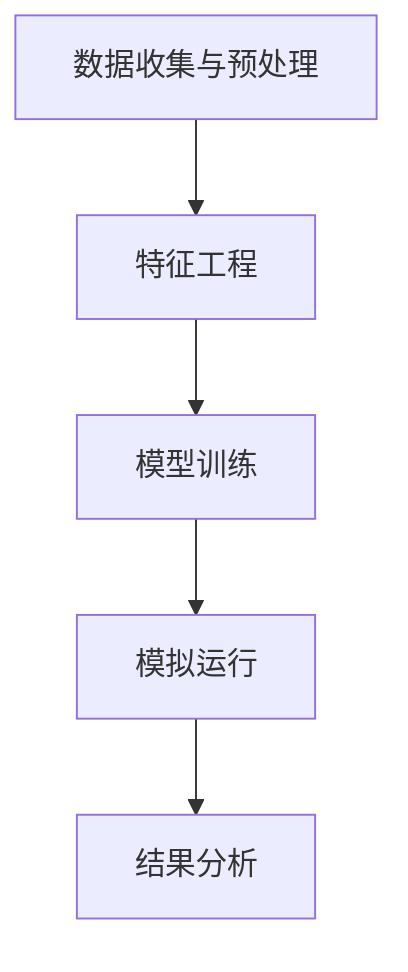

                 

# 引言

## 1.1 问题背景

### 1.1.1 金融市场情绪传染效应的起源

金融市场情绪传染效应，指的是投资者在市场中的情绪和行为受到其他投资者情绪和行为的影响，从而导致市场情绪的整体变化。这一现象最早可以追溯到20世纪初期，随着金融市场的发展和互联网的普及，情绪传染效应愈发显著。例如，2008年的全球金融危机期间，投资者恐慌情绪迅速传播，导致全球股市的剧烈波动。

### 1.1.2 金融市场情绪传染效应的重要性

金融市场情绪传染效应对于金融市场的稳定性和有效性具有重要意义。一方面，它可能导致市场的过度波动，增加市场的风险；另一方面，它也可能影响市场对信息的合理反应，影响市场的效率。因此，研究金融市场情绪传染效应，对于提升金融市场稳定性和效率，具有重要的理论和实践价值。

### 1.1.3 金融市场情绪传染效应的影响范围

金融市场情绪传染效应的影响范围广泛，涵盖了股票市场、债券市场、外汇市场等多个领域。在股票市场中，投资者情绪的传染可能导致股价的剧烈波动；在外汇市场中，投资者的情绪可能影响汇率的变化；在债券市场中，投资者的情绪可能影响债券的价格波动。因此，理解并控制金融市场情绪传染效应，对于投资者和金融机构都具有重要的意义。

## 1.2 问题描述

### 1.2.1 金融市场情绪传染效应的特点

金融市场情绪传染效应具有以下几个特点：

1. **快速传播**：投资者情绪可以通过社交媒体、新闻媒体等渠道快速传播，导致市场情绪的迅速变化。
2. **非线性**：市场情绪的变化可能呈现出非线性特征，即情绪传染的速度和强度可能随着时间的变化而变化。
3. **群体行为**：投资者情绪传染效应往往呈现出群体行为特征，即一个投资者的情绪变化可能引发其他投资者的情绪变化。
4. **不确定性**：金融市场情绪传染效应的复杂性和不确定性使得预测和控制市场情绪变得困难。

### 1.2.2 金融市场情绪传染效应的挑战

研究金融市场情绪传染效应面临着以下几个挑战：

1. **数据获取**：获取准确和全面的金融市场情绪数据是研究的基础，但现实中数据获取难度较大。
2. **模型构建**：构建能够准确模拟金融市场情绪传染效应的模型是研究的核心，但现实中情绪传染的复杂性使得模型构建困难。
3. **预测准确性**：提高情绪传染效应预测的准确性是研究的最终目标，但现实中的不确定性使得预测准确性难以保证。
4. **政策制定**：如何根据情绪传染效应的预测结果制定有效的政策，以稳定金融市场，是政策制定者面临的重要挑战。

### 1.2.3 研究目标与意义

本研究的目标是建立一套金融市场情绪传染效应的模拟与控制系统，以提高金融市场稳定性和效率。具体目标包括：

1. **构建情绪传染模型**：基于金融市场数据，构建能够准确模拟情绪传染效应的数学模型。
2. **实现情绪传染模拟**：通过计算机模拟技术，实现情绪传染效应的动态模拟和可视化。
3. **设计控制系统**：基于模拟结果，设计一套能够控制金融市场情绪传染效应的算法和系统。

本研究的意义在于：

1. **提升金融市场稳定性**：通过模拟和控制情绪传染效应，可以有效降低市场过度波动，提升市场稳定性。
2. **提高市场效率**：通过理解情绪传染效应，可以优化市场对信息的反应，提高市场效率。
3. **为政策制定提供支持**：研究结果可以为政策制定者提供科学依据，以制定更为有效的金融市场监管政策。

## 1.3 边界与外延

### 1.3.1 研究范围

本研究主要关注股票市场和债券市场的情绪传染效应，以这些市场的历史数据为研究对象，构建情绪传染模型和控制系统。

### 1.3.2 研究限制

本研究存在以下限制：

1. **数据限制**：由于数据获取的难度，研究数据可能存在局限性，不能完全代表所有市场的情况。
2. **模型限制**：构建的情绪传染模型可能存在一定的简化，无法完全捕捉情绪传染的复杂性。
3. **方法限制**：本研究采用的方法可能存在一定的局限性，无法完全解决情绪传染效应的预测和控制问题。

### 1.3.3 研究假设

本研究基于以下假设：

1. **市场情绪可量化**：市场情绪可以通过一定的指标进行量化，从而实现情绪传染效应的模拟和控制。
2. **情绪传染具有一致性**：不同投资者之间的情绪传染具有一定的规律性，可以通过数学模型进行模拟。
3. **政策干预有效**：通过合理的政策干预，可以有效控制市场情绪传染效应，提升市场稳定性。

## 1.4 概念结构与核心要素组成

### 1.4.1 情绪传染

情绪传染是指投资者在金融市场中的情绪和行为受到其他投资者情绪和行为的影响，从而导致市场情绪的整体变化。情绪传染可以发生在不同投资者之间，也可以发生在投资者与市场环境之间。

### 1.4.2 市场情绪

市场情绪是指金融市场在特定时期内整体的情绪状态，包括乐观、悲观、恐慌等。市场情绪可以通过情绪指标、价格指标等方式进行衡量。

### 1.4.3 传染路径

传染路径是指情绪从一个人或一个群体传播到另一个人或群体的途径。在金融市场中，传染路径可能包括社交媒体、新闻报道、投资者交流等。

### 1.4.4 金融市场情绪传染效应的模型

金融市场情绪传染效应模型是指用于描述和模拟情绪传染过程的数学模型。常见的模型包括线性模型、非线性模型、社会网络模型等。这些模型可以帮助我们理解情绪传染的机制，为控制情绪传染效应提供理论支持。## 第二部分：核心概念与联系

### 2.1 情绪传染

情绪传染（Emotion Contagion）是指在个体之间，情绪状态通过直接或间接的方式相互传递的现象。在金融市场中，情绪传染尤为显著，因为投资者的情绪和行为往往受到其他投资者情绪和行为的影响。情绪传染可以解释市场情绪的波动和投资者决策的变化。

#### 2.1.1 情绪传染的定义

情绪传染是指一个个体通过观察、模仿或通过其他形式的互动，从另一个个体那里获得情绪状态的过程。在金融市场中，情绪传染可以发生在以下几种情况：

- **直接观察**：投资者通过观察其他投资者的情绪和行为，如股价上涨时感到乐观，从而导致自己的情绪发生变化。
- **模仿**：投资者模仿其他投资者的情绪表达，如通过社交媒体、新闻报道等渠道看到其他投资者的乐观情绪，从而影响自己的情绪。
- **互动**：投资者之间的直接交流，如面对面讨论或在线交流，也可能导致情绪的传递。

#### 2.1.2 情绪传染的类型

情绪传染在金融市场中可以表现为以下几种类型：

- **正情绪传染**：积极的情绪，如乐观、兴奋等，在投资者之间传播，可能导致市场上涨。
- **负情绪传染**：消极的情绪，如悲观、恐慌等，在投资者之间传播，可能导致市场下跌。
- **多级传染**：情绪从一级投资者传播到二级投资者，甚至更远的范围，形成多级传染网络。

#### 2.1.3 情绪传染的影响因素

情绪传染的影响因素包括：

- **个人特征**：投资者的年龄、性别、文化背景等个人特征可能影响情绪传染的效果。
- **媒体传播**：媒体报道、社交媒体等渠道对情绪传染有重要影响。
- **市场环境**：市场的稳定性、政策环境、宏观经济状况等也会影响情绪传染的效果。
- **情绪强度**：情绪的强度和持续时间可能影响情绪传染的扩散速度和范围。

### 2.2 市场情绪

市场情绪（Market Sentiment）是指金融市场在特定时期内整体的情绪状态，反映了市场参与者的情绪波动。市场情绪可以通过多种指标进行衡量，如交易量、股价波动、投资者情绪调查等。

#### 2.2.1 市场情绪的定义

市场情绪是指市场参与者对市场走势的整体看法和情绪反应。市场情绪可以分为以下几种：

- **乐观情绪**：市场参与者普遍认为市场将会上涨，从而推动股价上涨。
- **悲观情绪**：市场参与者普遍认为市场将会下跌，从而推动股价下跌。
- **中性情绪**：市场参与者对市场走势没有明显的偏好，市场波动较小。

#### 2.2.2 市场情绪的衡量方法

市场情绪的衡量方法包括：

- **交易量**：交易量的增加通常表明市场情绪的波动，高交易量可能表明市场情绪积极或消极。
- **股价波动**：股价的波动幅度和频率可以反映市场情绪的变化。
- **投资者情绪调查**：通过对投资者进行问卷调查，获取他们对市场的看法和情绪。
- **情绪指标**：使用情绪分析技术，对社交媒体、新闻报道等文本数据进行情感分析，以衡量市场情绪。

#### 2.2.3 市场情绪的特征

市场情绪的特征包括：

- **波动性**：市场情绪的波动性较大，可能受到突发事件、政策变化等因素的影响。
- **非线性**：市场情绪的变化可能呈现出非线性特征，即情绪传染的速度和强度可能随着时间的变化而变化。
- **时变**：市场情绪随时间和市场条件的变化而变化，不具有稳定性。

### 2.3 传染路径

传染路径（Transmission Path）是指情绪从一个人或一个群体传播到另一个人或群体的途径。在金融市场中，传染路径可以通过多种渠道实现：

#### 2.3.1 传染路径的定义

传染路径是指情绪在市场参与者之间传播的路径，可以通过以下几种方式实现：

- **直接传播**：投资者直接观察其他投资者的情绪和行为，从而受到影响。
- **间接传播**：投资者通过媒体、网络等渠道获取其他投资者的情绪信息，从而受到影响。
- **社会网络传播**：投资者通过社交网络中的关系链，将情绪传递给其他投资者。

#### 2.3.2 传染路径的类型

传染路径可以分为以下几种类型：

- **线性传播**：情绪在投资者之间依次传播，如通过朋友或同事关系链。
- **网络传播**：情绪在社会网络中传播，如通过社交媒体平台。
- **多级传播**：情绪在不同层级投资者之间传播，如从行业专家到普通投资者。

#### 2.3.3 传染路径的建模方法

传染路径的建模方法包括：

- **网络模型**：使用图论方法，构建投资者之间的社会网络，模拟情绪传播。
- **传播模型**：基于概率模型，如SIR模型，模拟情绪在市场中的传播过程。
- **机器学习模型**：使用机器学习技术，分析情绪数据，预测情绪传播的路径和趋势。

### 2.4 金融市场情绪传染效应的模型

金融市场情绪传染效应模型用于描述和模拟情绪在金融市场中的传播过程。这些模型可以分为以下几类：

#### 2.4.1 金融市场情绪传染效应的数学模型

金融市场情绪传染效应的数学模型包括：

- **线性模型**：如线性回归模型，通过历史数据建立情绪传染的关系。
- **非线性模型**：如神经网络模型，通过非线性函数模拟情绪传染的复杂关系。
- **社会网络模型**：如随机游走模型，通过社会网络结构模拟情绪的传播。

#### 2.4.2 金融市场情绪传染效应的 Mermaid ER 图

为了更好地展示金融市场情绪传染效应的模型和概念之间的联系，可以使用 Mermaid ER 图进行表示。以下是金融市场情绪传染效应的 Mermaid ER 图：

```mermaid
erDiagram
  A[情绪传染] ||--|{ B[市场情绪] }
  A ||--|{ C[传染路径] }
  B ||--|{ D[投资者行为] }
  C ||--|{ E[社会网络] }
  D ||--|{ F[市场波动] }
```

在上述 Mermaid ER 图中，A 表示情绪传染，B 表示市场情绪，C 表示传染路径，D 表示投资者行为，E 表示社会网络，F 表示市场波动。通过这个图，我们可以清晰地看到情绪传染如何影响市场情绪、传染路径、投资者行为和市场波动之间的关系。

## 第三部分：算法原理讲解

### 3.1 金融市场情绪传染效应模拟算法

金融市场情绪传染效应模拟算法的核心目标是构建一个模型，能够准确模拟情绪在金融市场中的传播过程，并提供对市场情绪变化的预测。以下是该模拟算法的基本流程：

#### 3.1.1 模拟算法的基本流程

1. **数据收集与预处理**：收集金融市场相关数据，包括股票价格、交易量、投资者情绪等，并对数据进行清洗和预处理，以确保数据的质量和一致性。
2. **特征工程**：对预处理后的数据进行特征提取，提取能够反映市场情绪的特征，如情绪指数、波动率等。
3. **模型训练**：使用特征数据，通过机器学习算法训练情绪传染模型，如神经网络、支持向量机等，以建立情绪传染的预测模型。
4. **模拟运行**：在训练好的模型基础上，输入当前的市场数据，运行模拟算法，预测未来市场情绪的变化。
5. **结果分析**：对模拟结果进行分析，评估模型的预测准确性和稳定性，并根据分析结果调整模型参数。

#### 3.1.2 模拟算法的 Mermaid 流程图

以下是金融市场情绪传染效应模拟算法的 Mermaid 流程图：



在上述流程图中，A 表示数据收集与预处理，B 表示特征工程，C 表示模型训练，D 表示模拟运行，E 表示结果分析。通过这个流程图，我们可以清晰地看到模拟算法的执行步骤和逻辑关系。

#### 3.1.3 Python 源代码

以下是金融市场情绪传染效应模拟算法的 Python 源代码示例：

```python
import pandas as pd
from sklearn.model_selection import train_test_split
from sklearn.neural_network import MLPRegressor
from sklearn.metrics import mean_squared_error

# 数据收集与预处理
data = pd.read_csv('financial_data.csv')
data = data.dropna()

# 特征工程
features = data[['open_price', 'close_price', 'volume']]
labels = data['sentiment_index']

# 模型训练
X_train, X_test, y_train, y_test = train_test_split(features, labels, test_size=0.2, random_state=42)
model = MLPRegressor(hidden_layer_sizes=(100,), max_iter=1000)
model.fit(X_train, y_train)

# 模拟运行
y_pred = model.predict(X_test)

# 结果分析
mse = mean_squared_error(y_test, y_pred)
print("Mean Squared Error:", mse)
```

在上述 Python 代码中，首先导入了必要的库，然后进行了数据收集与预处理、特征工程、模型训练和模拟运行，最后对模拟结果进行了分析，计算了均方误差（MSE）。

### 3.2 算法原理

#### 3.2.1 情绪传染模型的构建

情绪传染模型是基于金融市场数据构建的，用于描述情绪在投资者之间的传播过程。模型的核心是建立情绪传染的数学模型，通常使用以下步骤：

1. **数据收集**：收集金融市场的历史数据，包括股票价格、交易量、投资者情绪等。
2. **特征提取**：从数据中提取能够反映市场情绪的特征，如情绪指数、波动率等。
3. **模型选择**：选择合适的机器学习算法，如神经网络、支持向量机等，用于构建情绪传染模型。
4. **模型训练**：使用历史数据对模型进行训练，调整模型参数，以最小化预测误差。
5. **模型评估**：使用验证集或测试集对模型进行评估，计算模型的预测准确性和稳定性。

#### 3.2.2 情绪传染模型的数学模型

情绪传染模型的数学模型通常基于以下假设：

1. **线性模型**：情绪传染过程可以用线性回归模型描述，即市场情绪的当前值可以表示为历史情绪值和当前市场特征的线性组合。
   \[
   \text{current\_sentiment} = \alpha \cdot \text{historical\_sentiment} + \beta \cdot \text{current\_market\_features}
   \]

2. **非线性模型**：情绪传染过程可以用非线性模型描述，如神经网络模型，通过非线性函数模拟情绪传染的复杂关系。
   \[
   \text{current\_sentiment} = f(\text{historical\_sentiment}, \text{current\_market\_features})
   \]

3. **社会网络模型**：情绪传染过程可以用社会网络模型描述，通过图论方法构建投资者之间的社会网络，模拟情绪在社会网络中的传播。
   \[
   \text{current\_sentiment} = \sum_{i} \alpha_{i} \cdot \text{sentiment}_{i}
   \]
   其中，\( \alpha_{i} \) 是投资者 \( i \) 对情绪传染的贡献系数，\( \text{sentiment}_{i} \) 是投资者 \( i \) 的情绪状态。

#### 3.2.3 情绪传染模型的 Python 代码

以下是情绪传染模型的一个简单示例，使用 Python 的 Scikit-learn 库构建线性回归模型：

```python
import numpy as np
import pandas as pd
from sklearn.linear_model import LinearRegression
from sklearn.model_selection import train_test_split
from sklearn.metrics import mean_squared_error

# 加载数据
data = pd.read_csv('financial_data.csv')
data = data[['open_price', 'close_price', 'volume', 'sentiment_index']]

# 特征和标签
X = data[['open_price', 'close_price', 'volume']]
y = data['sentiment_index']

# 划分训练集和测试集
X_train, X_test, y_train, y_test = train_test_split(X, y, test_size=0.2, random_state=42)

# 创建线性回归模型
model = LinearRegression()
model.fit(X_train, y_train)

# 预测测试集
y_pred = model.predict(X_test)

# 计算均方误差
mse = mean_squared_error(y_test, y_pred)
print("MSE:", mse)
```

在上述代码中，首先加载数据并划分特征和标签，然后使用线性回归模型进行训练，并在测试集上进行预测，最后计算均方误差以评估模型的性能。

### 3.3 数学模型和数学公式

在金融市场情绪传染效应模拟与控制系统中，数学模型起着至关重要的作用。以下将详细讨论数学模型的结构，包括其组成部分、核心公式，并使用 LaTeX 进行公式的表示。

#### 3.3.1 数学模型的结构

金融市场情绪传染效应的数学模型通常包括以下几个组成部分：

1. **情绪状态**：描述投资者或市场的情绪状态。
2. **传染机制**：描述情绪在投资者之间传播的机制。
3. **反馈机制**：描述情绪状态对市场行为的影响。
4. **外部影响**：描述外部事件或政策对市场情绪的冲击。

#### 3.3.2 核心公式

以下是金融市场情绪传染效应的几个核心公式：

1. **情绪状态公式**：
   \[
   \text{sentiment}_{t} = f(\text{sentiment}_{t-1}, \text{market\_data}_{t-1}, \text{external\_impact}_{t})
   \]
   其中，\( \text{sentiment}_{t} \) 是第 \( t \) 时刻的市场情绪状态，\( f \) 是情绪状态更新函数，\( \text{market\_data}_{t-1} \) 是前一个时间点的市场数据，\( \text{external\_impact}_{t} \) 是外部影响。

2. **传染机制公式**：
   \[
   \text{infection}_{t} = \alpha \cdot (\text{sentiment}_{t-1} - \text{mean\_sentiment}_{t-1})
   \]
   其中，\( \text{infection}_{t} \) 是第 \( t \) 时刻的传染效应，\( \alpha \) 是传染系数，\( \text{sentiment}_{t-1} \) 是前一个时间点的市场情绪状态，\( \text{mean\_sentiment}_{t-1} \) 是前一个时间点的平均市场情绪状态。

3. **反馈机制公式**：
   \[
   \text{response}_{t} = \beta \cdot \text{infection}_{t}
   \]
   其中，\( \text{response}_{t} \) 是第 \( t \) 时刻的市场行为响应，\( \beta \) 是响应系数，\( \text{infection}_{t} \) 是第 \( t \) 时刻的传染效应。

4. **外部影响公式**：
   \[
   \text{external\_impact}_{t} = g(\text{event}_{t})
   \]
   其中，\( \text{external\_impact}_{t} \) 是第 \( t \) 时刻的外部影响，\( g \) 是外部影响函数，\( \text{event}_{t} \) 是第 \( t \) 时刻的事件。

#### 3.3.3 LaTeX 表示

以下是使用 LaTeX 表示的数学模型公式：

```latex
\documentclass{article}
\usepackage{amsmath}
\begin{document}

\section{情绪状态公式}
\[
\text{sentiment}_{t} = f(\text{sentiment}_{t-1}, \text{market\_data}_{t-1}, \text{external\_impact}_{t})
\]

\section{传染机制公式}
\[
\text{infection}_{t} = \alpha \cdot (\text{sentiment}_{t-1} - \text{mean\_sentiment}_{t-1})
\]

\section{反馈机制公式}
\[
\text{response}_{t} = \beta \cdot \text{infection}_{t}
\]

\section{外部影响公式}
\[
\text{external\_impact}_{t} = g(\text{event}_{t})
\]

\end{document}
```

在上述 LaTeX 代码中，我们首先导入了 `amsmath` 包，然后定义了情绪状态、传染机制、反馈机制和外部影响公式。通过这种方式，我们可以清晰地表示金融市场中情绪传染效应的数学模型。

### 3.4 系统分析与架构设计方案

#### 3.4.1 问题场景介绍

在金融市场中，情绪传染效应可能导致市场波动加剧，影响市场稳定性。为了更好地理解和控制情绪传染效应，我们需要设计一个能够模拟和监测情绪传染的系统。该系统需要收集和处理大量的金融市场数据，并利用机器学习算法进行情绪传染的预测和控制。

#### 3.4.2 项目介绍

本项目旨在设计并实现一个金融市场情绪传染效应模拟与控制系统。该系统包括以下主要模块：

1. **数据收集模块**：负责收集金融市场相关的数据，包括股票价格、交易量、投资者情绪等。
2. **数据处理模块**：负责对收集到的数据进行预处理和特征提取，为情绪传染模型提供输入。
3. **模型训练模块**：负责使用处理后的数据训练情绪传染模型，并调整模型参数以优化性能。
4. **模拟运行模块**：负责使用训练好的模型进行情绪传染的模拟，并提供动态可视化。
5. **控制系统模块**：负责根据模拟结果调整市场干预策略，以控制情绪传染效应。

#### 3.4.3 系统功能设计（领域模型 Mermaid 类图）

以下是金融市场情绪传染效应模拟与控制系统的领域模型，使用 Mermaid 类图表示各模块之间的关系：

```mermaid
classDiagram
    Class1[数据收集模块] <|-- Class2[数据处理模块]
    Class2 <|-- Class3[模型训练模块]
    Class3 <|-- Class4[模拟运行模块]
    Class4 <|-- Class5[控制系统模块]
```

在上述 Mermaid 类图中，`Class1` 表示数据收集模块，`Class2` 表示数据处理模块，`Class3` 表示模型训练模块，`Class4` 表示模拟运行模块，`Class5` 表示控制系统模块。通过这种类图，我们可以清晰地看到各模块之间的依赖关系。

#### 3.4.4 系统架构设计（Mermaid 架构图）

以下是金融市场情绪传染效应模拟与控制系统的架构设计，使用 Mermaid 架构图表示各模块的交互和数据处理流程：


在上述 Mermaid 架构图

