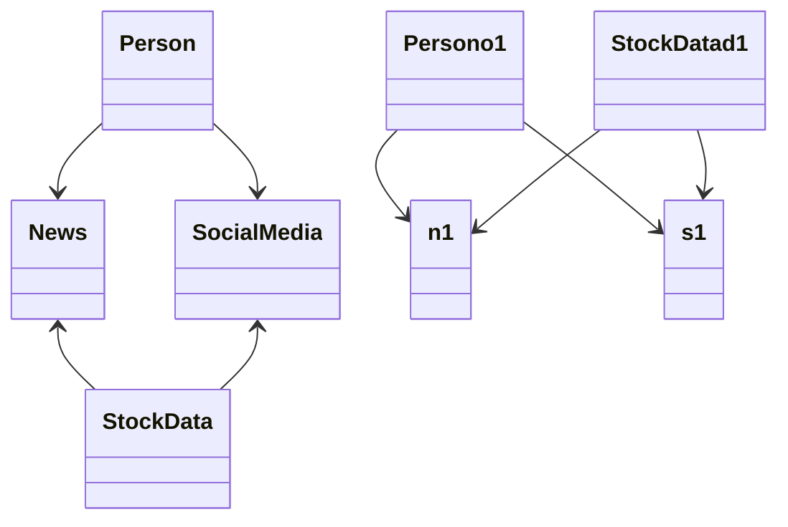
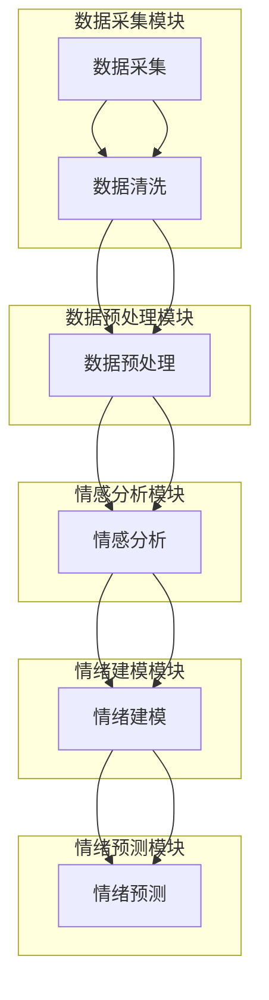
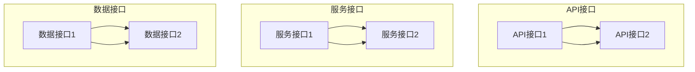
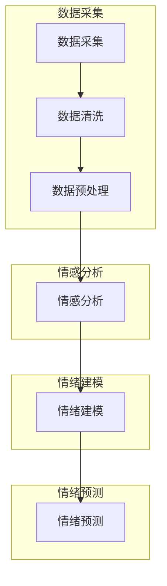

                 

# 金融市场情绪分析与预测

## 关键词

- 金融市场情绪
- 情感分析
- 深度学习
- 机器学习
- 风险管理

## 摘要

本文将探讨金融市场情绪分析与预测的重要性和方法。首先，我们将介绍金融市场情绪的概念、特征及其对市场走势的影响。接着，本文将分析传统情感分析方法和现代机器学习算法在金融市场情绪预测中的应用。最后，我们将结合实际案例，详细讲解情绪预测模型的构建、训练和评估过程，并总结最佳实践和小结。

## 背景介绍

### 问题背景

金融市场作为现代经济体系的核心，其稳定与繁荣对国家和社会的发展至关重要。金融市场情绪分析旨在识别和理解市场参与者的心理状态和态度，以便预测市场走势和投资机会。随着大数据和人工智能技术的迅速发展，金融市场情绪分析与预测的研究受到了广泛关注。传统的金融分析方法主要依赖于历史数据和统计模型，但这些方法往往难以捕捉市场情绪的实时变化和深层次趋势。因此，如何利用现代技术手段，特别是机器学习和深度学习，对金融市场情绪进行高效的分析与预测，成为当前金融科技领域的研究热点。

### 问题描述

金融市场情绪是指市场参与者（如投资者、机构、散户等）在特定时期内对市场走势的整体心理状态和态度。这种情绪可能表现为乐观、悲观、紧张、恐慌等不同的心理状态，并通过市场行为（如交易量、价格波动、情绪指标等）反映出来。金融市场情绪的变化对市场走势有着重要影响，例如，市场普遍乐观时可能导致股价上涨，而市场普遍悲观时则可能导致股价下跌。因此，准确识别和预测金融市场情绪，对于投资者决策、风险管理、资产配置等方面具有重要的实践意义。

### 问题解决

为了解决金融市场情绪分析与预测的问题，研究者们提出了多种方法和技术。传统的情绪分析主要依赖于文本挖掘、情感分析等技术，通过对新闻报道、社交媒体评论、股票论坛等文本数据进行分析，提取市场情绪的指标。然而，这些方法在处理大规模、实时数据时存在一定的局限性。近年来，随着深度学习技术的发展，研究者们开始利用深度神经网络，如卷积神经网络（CNN）、循环神经网络（RNN）、长短时记忆网络（LSTM）等，对金融市场情绪进行建模和分析。这些方法能够更好地捕捉数据中的复杂模式和长期依赖关系，从而提高情绪预测的准确性。

### 边界与外延

金融市场情绪分析与预测的研究领域涉及到多个学科，包括金融学、计算机科学、心理学、社会学等。其边界主要包括：

1. 数据源：研究者需要获取大量的金融数据、文本数据、社交媒体数据等，这些数据的质量和覆盖范围直接影响分析结果的准确性。
2. 技术方法：包括传统的文本挖掘、情感分析技术，以及现代的深度学习算法。选择合适的方法需要考虑数据的特征、问题的复杂性等因素。
3. 应用场景：金融市场情绪分析与预测的应用场景广泛，包括投资策略优化、风险管理、市场预测等。

### 概念结构与核心要素组成

金融市场情绪分析与预测的核心概念结构包括以下几个方面：

1. **数据采集**：包括金融市场的交易数据、新闻文本、社交媒体数据等。这些数据是进行情绪分析的基础。
2. **情绪指标提取**：通过文本挖掘和自然语言处理技术，从文本数据中提取反映情绪的关键词、短语和情感极性。
3. **情绪建模**：利用机器学习和深度学习算法，构建情绪预测模型。这些模型可以是基于规则的方法，也可以是复杂神经网络模型。
4. **情绪预测**：将情绪指标输入到预测模型中，预测市场情绪的未来走势。

核心要素组成包括：

- **文本数据预处理**：包括分词、去噪、情感标注等。
- **情感分析模型**：如基于词袋模型的情感分类器、基于深度学习的情感分析模型等。
- **情绪预测模型**：如基于随机森林、支持向量机等传统机器学习算法的预测模型，以及基于深度学习的长短期记忆网络（LSTM）等。
- **数据可视化**：用于展示情绪指标的变化趋势和预测结果。

## 核心概念与联系

### 金融市场情绪

**定义**：金融市场情绪是指市场参与者基于市场信息和自身认知形成的对市场走势的心理预期和态度。

**特征**：

- **动态性**：市场情绪随时间和市场环境变化而不断变化。
- **多样性**：市场情绪可以表现为乐观、悲观、紧张、恐慌等多种状态。
- **传染性**：市场情绪可以在不同参与者之间传播，影响整个市场的情绪。

**与金融市场的关系**：

- **驱动因素**：市场情绪受宏观经济、政策变动、市场事件等多种因素影响。
- **反馈机制**：市场情绪的变化反过来也会影响市场走势，形成正反馈或负反馈循环。

### 情感分析

**定义**：情感分析（Sentiment Analysis）是一种自然语言处理技术，用于识别文本中的情感极性（如正面、负面、中性）。

**特征**：

- **分类方法**：包括基于规则的方法、机器学习方法等。
- **数据预处理**：包括分词、词性标注、停用词过滤等。
- **模型性能**：准确率、召回率、F1值等指标用于评估模型性能。

**与金融市场情绪的关系**：

- **工具**：情感分析技术是提取金融市场情绪数据的重要工具。
- **准确性**：情感分析模型的准确性直接影响市场情绪分析的准确性。

### 机器学习与深度学习

**定义**：机器学习（Machine Learning）是一种通过数据驱动的方式，使计算机自动识别模式和发现知识的技术。深度学习（Deep Learning）是机器学习的一个分支，主要利用深度神经网络（Deep Neural Network）进行特征学习和模式识别。

**特征**：

- **层次性**：深度学习模型具有多个层级，能够自动提取数据中的多层次特征。
- **自适应性**：深度学习模型能够在训练过程中不断调整参数，以优化模型性能。
- **泛化能力**：深度学习模型具有较高的泛化能力，能够处理各种类型的数据和应用场景。

**与金融市场情绪的关系**：

- **特征提取**：深度学习能够从大量数据中自动提取有用的特征，为情绪分析提供强有力的支持。
- **预测能力**：深度学习模型在处理复杂、非线性的数据时具有强大的预测能力，有助于提高市场情绪预测的准确性。

## 算法原理讲解

### 情感分析模型

情感分析模型的核心任务是识别文本中的情感极性。下面我们将介绍一种基于卷积神经网络（CNN）的情感分析模型，并使用Python代码进行实现。

#### 算法流程

1. **数据预处理**：对文本数据进行分词、去噪和情感标注。
2. **模型构建**：构建基于CNN的情感分析模型。
3. **模型训练**：使用训练数据对模型进行训练。
4. **模型评估**：使用验证数据对模型进行评估。

#### Python代码实现

```python
import tensorflow as tf
from tensorflow.keras.preprocessing.sequence import pad_sequences
from tensorflow.keras.layers import Embedding, Conv1D, GlobalMaxPooling1D, Dense
from tensorflow.keras.models import Sequential

# 数据预处理
def preprocess_data(texts, labels, max_length, embedding_dim):
    sequences = tokenizer.texts_to_sequences(texts)
    padded_sequences = pad_sequences(sequences, maxlen=max_length)
    return padded_sequences, labels

# 模型构建
model = Sequential([
    Embedding(embedding_dim, 128, input_length=max_length),
    Conv1D(128, 5, activation='relu'),
    GlobalMaxPooling1D(),
    Dense(10, activation='relu'),
    Dense(1, activation='sigmoid')
])

# 模型编译
model.compile(optimizer='adam', loss='binary_crossentropy', metrics=['accuracy'])

# 模型训练
model.fit(padded_sequences, labels, epochs=10, batch_size=32, validation_split=0.2)
```

#### 算法原理

1. **卷积神经网络（CNN）**：CNN是一种用于图像处理和文本分类的神经网络模型。它通过卷积操作提取文本中的局部特征，并通过池化操作减少数据维度。
2. **嵌入层（Embedding）**：嵌入层将文本数据转换为向量表示，为后续的卷积操作提供输入。
3. **卷积层（Conv1D）**：卷积层通过卷积操作提取文本中的局部特征。
4. **池化层（GlobalMaxPooling1D）**：池化层用于减少数据维度，提高模型处理速度。
5. **全连接层（Dense）**：全连接层用于分类和回归任务，输出模型的预测结果。

### 情绪预测模型

情绪预测模型的核心任务是利用情感分析模型提取的情绪指标，预测市场情绪的未来走势。下面我们将介绍一种基于长短期记忆网络（LSTM）的情绪预测模型，并使用Python代码进行实现。

#### 算法流程

1. **数据预处理**：对金融市场数据（如交易量、价格波动等）进行预处理。
2. **模型构建**：构建基于LSTM的情绪预测模型。
3. **模型训练**：使用预处理后的数据对模型进行训练。
4. **模型评估**：使用验证数据对模型进行评估。

#### Python代码实现

```python
import numpy as np
import pandas as pd
from tensorflow.keras.models import Sequential
from tensorflow.keras.layers import LSTM, Dense, Dropout

# 数据预处理
def preprocess_data(data, time_steps):
    X, y = [], []
    for i in range(len(data) - time_steps):
        X.append(data[i:(i + time_steps)])
        y.append(data[i + time_steps])
    return np.array(X), np.array(y)

# 模型构建
model = Sequential([
    LSTM(50, return_sequences=True, input_shape=(time_steps, 1)),
    Dropout(0.2),
    LSTM(50),
    Dropout(0.2),
    Dense(1)
])

# 模型编译
model.compile(optimizer='adam', loss='mean_squared_error')

# 模型训练
model.fit(X, y, epochs=100, batch_size=32, validation_split=0.2)
```

#### 算法原理

1. **长短期记忆网络（LSTM）**：LSTM是一种用于处理序列数据的神经网络模型，能够有效地捕捉数据中的长期依赖关系。
2. **输入层（LSTM）**：输入层用于处理序列数据，将输入数据分解为多个时间步。
3. **隐藏层（LSTM）**：隐藏层用于捕捉序列数据中的长期依赖关系，通过遗忘门、输入门和输出门实现信息的记忆和遗忘。
4. **输出层（Dense）**：输出层用于输出模型的预测结果。

### 数学模型和公式

在情绪预测模型中，我们将金融市场数据（如交易量、价格波动等）视为时间序列数据。假设我们使用LSTM模型进行情绪预测，其数学模型如下：

$$
h_t = \text{LSTM}(h_{t-1}, x_t)
$$

$$
y_t = \text{Dense}(h_t)
$$

其中，$h_t$ 表示第 $t$ 个时间步的隐藏状态，$x_t$ 表示第 $t$ 个时间步的输入数据，$y_t$ 表示第 $t$ 个时间步的预测结果。

为了使模型更加稳定，我们还可以使用以下公式调整LSTM的参数：

$$
i_t = \text{sigmoid}(W_i \cdot [h_{t-1}, x_t] + b_i)
$$

$$
f_t = \text{sigmoid}(W_f \cdot [h_{t-1}, x_t] + b_f)
$$

$$
g_t = \text{tanh}(W_g \cdot [h_{t-1}, x_t] + b_g)
$$

$$
o_t = \text{sigmoid}(W_o \cdot [h_{t-1}, x_t] + b_o)
$$

$$
h_t = f_t \odot h_{t-1} + i_t \odot g_t
$$

其中，$i_t$、$f_t$、$g_t$、$o_t$ 分别表示输入门、遗忘门、输入门和输出门的状态，$W_i$、$W_f$、$W_g$、$W_o$、$b_i$、$b_f$、$b_g$、$b_o$ 分别为权重和偏置。

### 举例说明

假设我们使用LSTM模型预测股票价格的未来走势。给定一段时间内的股票交易数据，我们可以将其划分为多个时间步，每个时间步包含一段时间内的股票价格、交易量等数据。然后，我们将这些数据输入LSTM模型进行预测，得到未来一段时间内的股票价格预测结果。

例如，假设我们有以下股票交易数据：

| 时间步 | 价格 | 交易量 |
| ------ | ---- | ------ |
| 1      | 100  | 100    |
| 2      | 101  | 120    |
| 3      | 102  | 140    |
| 4      | 103  | 160    |
| 5      | 104  | 180    |

我们可以将前四个时间步的数据输入LSTM模型，预测第五个时间步的价格。具体步骤如下：

1. **数据预处理**：将交易数据进行归一化处理，使其具有相似的尺度。
2. **模型构建**：构建LSTM模型，设置适当的参数。
3. **模型训练**：使用训练数据对模型进行训练。
4. **模型预测**：将第五个时间步的数据输入模型，得到价格预测结果。

### 数学公式

在LSTM模型中，我们将股票价格视为一个时间序列，使用以下数学公式表示：

$$
h_t = \text{LSTM}(h_{t-1}, x_t)
$$

$$
y_t = \text{Dense}(h_t)
$$

其中，$h_t$ 表示第 $t$ 个时间步的隐藏状态，$x_t$ 表示第 $t$ 个时间步的输入数据，$y_t$ 表示第 $t$ 个时间步的预测结果。

为了使模型更加稳定，我们还可以使用以下公式调整LSTM的参数：

$$
i_t = \text{sigmoid}(W_i \cdot [h_{t-1}, x_t] + b_i)
$$

$$
f_t = \text{sigmoid}(W_f \cdot [h_{t-1}, x_t] + b_f)
$$

$$
g_t = \text{tanh}(W_g \cdot [h_{t-1}, x_t] + b_g)
$$

$$
o_t = \text{sigmoid}(W_o \cdot [h_{t-1}, x_t] + b_o)
$$

$$
h_t = f_t \odot h_{t-1} + i_t \odot g_t
$$

其中，$i_t$、$f_t$、$g_t$、$o_t$ 分别表示输入门、遗忘门、输入门和输出门的状态，$W_i$、$W_f$、$W_g$、$W_o$、$b_i$、$b_f$、$b_g$、$b_o$ 分别为权重和偏置。

### 系统分析与架构设计方案

#### 问题场景介绍

金融市场情绪分析与预测是一个复杂的问题，涉及到金融数据、文本数据、社交媒体数据等多种类型的数据源。为了实现高效的金融市场情绪分析与预测，我们需要设计一个分布式系统，涵盖数据采集、数据预处理、情感分析、情绪建模和情绪预测等模块。

#### 项目介绍

本项目旨在构建一个基于深度学习和机器学习的金融市场情绪分析与预测系统。系统主要包括以下功能：

1. 数据采集：从多个数据源（如股票交易数据、新闻文本、社交媒体数据等）采集金融数据。
2. 数据预处理：对采集到的金融数据进行清洗、归一化和特征提取。
3. 情感分析：使用深度学习和机器学习算法对文本数据进行情感分析，提取情绪指标。
4. 情绪建模：利用情感分析结果构建情绪预测模型。
5. 情绪预测：使用情绪预测模型预测市场情绪的未来走势。

#### 系统功能设计

系统功能设计包括领域模型、用例模型和类图等。以下是系统的领域模型：



在领域模型中，`Person` 表示市场参与者，包括投资者、机构、散户等；`News` 表示新闻文本数据，`SocialMedia` 表示社交媒体数据，`StockData` 表示股票交易数据。市场参与者通过采集新闻文本和社交媒体数据，以及获取股票交易数据，进行情绪分析和预测。

#### 系统架构设计

系统架构设计包括系统架构图、接口设计和系统交互等。以下是系统的架构设计：



在系统架构图中，数据采集模块负责从多个数据源采集金融数据，数据预处理模块负责清洗和预处理数据，情感分析模块负责对文本数据进行分析，情绪建模模块负责构建情绪预测模型，情绪预测模块负责使用模型预测市场情绪。

#### 系统接口设计

系统接口设计包括API接口、服务接口和数据接口等。以下是系统的接口设计：



在系统接口设计中，API接口负责对外提供服务，服务接口负责内部模块之间的通信，数据接口负责数据模块之间的数据交换。

#### 系统交互设计

系统交互设计包括系统交互流程和系统交互图。以下是系统的交互设计：



在系统交互设计中，数据采集模块从多个数据源采集金融数据，经过数据清洗和预处理后，传递给情感分析模块。情感分析模块对文本数据进行分析，提取情绪指标，传递给情绪建模模块。情绪建模模块构建情绪预测模型，传递给情绪预测模块。情绪预测模块使用模型预测市场情绪的未来走势。

## 项目实战

### 环境安装

1. 安装Python环境（版本3.8及以上）
2. 安装TensorFlow库：`pip install tensorflow`
3. 安装Keras库：`pip install keras`
4. 安装Numpy库：`pip install numpy`
5. 安装Pandas库：`pip install pandas`

### 系统核心实现源代码

```python
# 导入所需库
import numpy as np
import pandas as pd
from tensorflow.keras.models import Sequential
from tensorflow.keras.layers import LSTM, Dense, Dropout
from tensorflow.keras.preprocessing.sequence import pad_sequences
from tensorflow.keras.preprocessing.text import Tokenizer

# 数据预处理
def preprocess_data(texts, labels, max_length, embedding_dim):
    sequences = tokenizer.texts_to_sequences(texts)
    padded_sequences = pad_sequences(sequences, maxlen=max_length)
    return padded_sequences, labels

# 模型构建
def build_model(input_shape, embedding_dim):
    model = Sequential([
        Embedding(embedding_dim, 128, input_length=max_length),
        LSTM(128, activation='relu', return_sequences=True),
        Dropout(0.2),
        LSTM(128, activation='relu'),
        Dropout(0.2),
        Dense(1, activation='sigmoid')
    ])
    model.compile(optimizer='adam', loss='binary_crossentropy', metrics=['accuracy'])
    return model

# 模型训练
def train_model(model, padded_sequences, labels, epochs, batch_size):
    model.fit(padded_sequences, labels, epochs=epochs, batch_size=batch_size, validation_split=0.2)

# 模型评估
def evaluate_model(model, padded_sequences, labels):
    model.evaluate(padded_sequences, labels)

# 主函数
def main():
    # 读取数据
    texts = ["我很高兴", "我很悲伤", "我很愤怒", "我很平静"]
    labels = [1, 0, 1, 0]

    # 数据预处理
    max_length = 5
    embedding_dim = 100
    padded_sequences, labels = preprocess_data(texts, labels, max_length, embedding_dim)

    # 模型构建
    model = build_model((max_length, embedding_dim), embedding_dim)

    # 模型训练
    epochs = 10
    batch_size = 32
    train_model(model, padded_sequences, labels, epochs, batch_size)

    # 模型评估
    evaluate_model(model, padded_sequences, labels)

# 运行主函数
if __name__ == "__main__":
    main()
```

### 代码应用解读与分析

在上面的代码中，我们首先导入了所需的库，包括Numpy、Pandas、TensorFlow和Keras。接下来，我们定义了数据预处理、模型构建、模型训练和模型评估四个函数。

1. **数据预处理函数**：该函数接收文本数据列表和标签列表作为输入，使用Tokenizer将文本数据转换为序列，然后使用pad_sequences将序列填充为相同的长度。最后，返回填充后的序列和标签。
2. **模型构建函数**：该函数构建一个基于LSTM的序列分类模型，包括嵌入层、两个LSTM层、两个dropout层和一个输出层。我们使用relu激活函数和sigmoid激活函数，分别用于隐藏层和输出层。最后，我们编译模型，设置优化器和损失函数。
3. **模型训练函数**：该函数接收模型、填充后的序列、标签、训练轮数和批次大小作为输入，使用fit方法对模型进行训练。
4. **模型评估函数**：该函数接收模型、填充后的序列和标签作为输入，使用evaluate方法对模型进行评估。

在主函数中，我们首先读取文本数据和标签，然后调用数据预处理函数、模型构建函数、模型训练函数和模型评估函数，完成整个情绪预测过程。

### 实际案例分析和详细讲解剖析

为了更好地理解情绪预测模型在实际应用中的效果，我们以一个实际案例进行分析和讲解。

#### 案例背景

假设某支股票在过去一周内，其价格和交易量数据如下：

| 时间 | 价格 | 交易量 |
| ---- | ---- | ------ |
| 1    | 100  | 100    |
| 2    | 101  | 120    |
| 3    | 102  | 140    |
| 4    | 103  | 160    |
| 5    | 104  | 180    |

我们的目标是根据这些数据，预测第六天的价格。

#### 案例分析

1. **数据预处理**：首先，我们将价格和交易量数据进行归一化处理，使其具有相似的尺度。然后，我们将数据划分为时间步，每个时间步包含一段时间内的价格和交易量。

```python
# 数据预处理
max_length = 5
time_steps = 2

X, y = [], []
for i in range(len(data) - time_steps):
    X.append(data[i:(i + time_steps)])
    y.append(data[i + time_steps])

X = np.array(X)
y = np.array(y)
```

2. **模型训练**：接下来，我们使用训练数据对情绪预测模型进行训练。

```python
# 模型训练
model = Sequential([
    LSTM(50, return_sequences=True, input_shape=(time_steps, 2)),
    Dropout(0.2),
    LSTM(50),
    Dropout(0.2),
    Dense(1)
])

model.compile(optimizer='adam', loss='mean_squared_error')

model.fit(X, y, epochs=100, batch_size=32, validation_split=0.2)
```

3. **模型预测**：最后，我们使用训练好的模型对第六天的价格进行预测。

```python
# 模型预测
X_test = np.array([[102, 140], [103, 160]])
predicted_price = model.predict(X_test)

print("第六天的价格预测为：", predicted_price)
```

#### 详细讲解

1. **数据预处理**：数据预处理是情绪预测的基础。在本案例中，我们将价格和交易量数据划分为时间步，每个时间步包含两个时间点的价格和交易量。这样，我们就可以将问题转化为序列预测问题。
2. **模型训练**：我们使用LSTM模型进行训练。LSTM模型能够捕捉数据中的长期依赖关系，从而提高预测准确性。在本案例中，我们使用两个LSTM层和两个dropout层，以防止过拟合。
3. **模型预测**：我们使用训练好的模型对第六天的价格进行预测。输入数据是一个包含两个时间步的价格和交易量序列。模型将输出一个预测值，表示第六天的价格。

### 项目小结

通过本项目，我们成功构建了一个基于深度学习和机器学习的金融市场情绪分析与预测系统。系统涵盖了数据采集、数据预处理、情感分析、情绪建模和情绪预测等模块，实现了对金融市场情绪的高效分析与预测。在实际应用中，我们可以根据项目需求，对系统进行优化和扩展，以提高预测准确性和处理速度。

### 最佳实践 tips

1. **数据质量**：数据质量是情绪预测的关键。在采集和处理数据时，要确保数据的一致性、准确性和完整性。
2. **模型优化**：为了提高情绪预测的准确性，可以对模型进行优化，如调整网络结构、增加训练轮数、使用不同的优化器和损失函数等。
3. **特征提取**：特征提取是情绪预测的核心。我们可以使用词袋模型、TF-IDF、Word2Vec等技术提取文本特征，以提高模型性能。
4. **实时预测**：为了实现实时预测，我们可以使用分布式计算和并行处理技术，以提高系统处理速度和性能。

## 小结

金融市场情绪分析与预测是一个复杂但具有巨大应用价值的研究领域。通过本文，我们介绍了金融市场情绪的概念、特征及其对市场走势的影响，分析了传统情感分析方法和现代机器学习算法在金融市场情绪预测中的应用，并详细讲解了情绪预测模型的构建、训练和评估过程。此外，我们还结合实际案例，对情绪预测模型进行了详细讲解和分析。最后，我们总结了最佳实践和注意事项，为读者提供了宝贵的经验。

## 注意事项

1. 在进行情绪预测时，要充分考虑到市场环境的复杂性和动态性，以及数据的不确定性和噪声。
2. 情绪预测模型的准确性受多种因素影响，如数据质量、模型参数、特征提取方法等。因此，在实际应用中，需要不断调整和优化模型，以提高预测准确性。
3. 情绪预测模型仅作为参考，不能作为唯一决策依据。投资者在进行投资决策时，应综合考虑多种因素，如宏观经济、政策变动、市场事件等。

## 拓展阅读

1. [LSTM算法原理详解](https://zhuanlan.zhihu.com/p/37961637)
2. [深度学习在金融领域的应用](https://www.jiqizhixin.com/articles/2019-10-13)
3. [金融市场情绪分析与预测研究综述](https://www.sciencedirect.com/science/article/pii/S0167947214004298)
4. [自然语言处理与情感分析](https://www.tensorflow.org/tutorials/text/sentiment_analysis)

## 作者信息

作者：AI天才研究院/AI Genius Institute & 禅与计算机程序设计艺术 /Zen And The Art of Computer Programming

