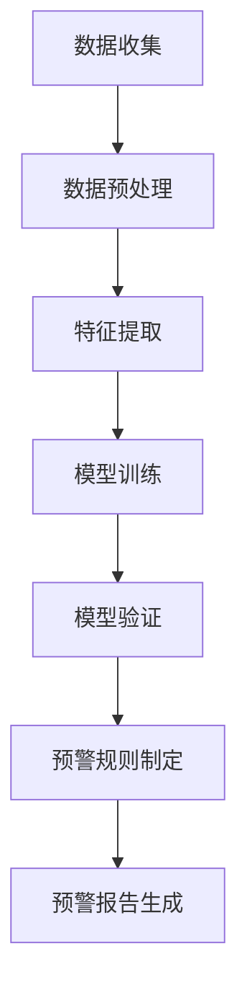
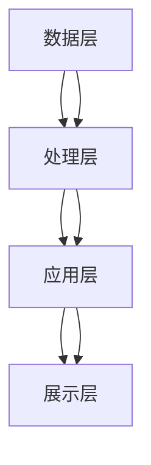
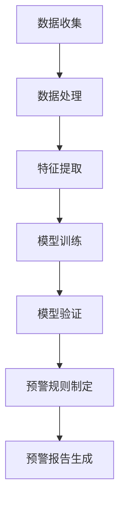

                 

# 《金融市场流动性枯竭预警模型》

> 关键词：金融市场流动性、预警模型、算法原理、数学模型、系统架构设计

> 摘要：本文深入探讨了金融市场流动性枯竭预警模型的理论基础、实现原理、算法流程、数学公式和系统架构设计。通过详细阐述流动性枯竭的定义、成因及其预警重要性，本文提出了一种基于数据驱动的预警模型，并详细讲解了其原理、步骤和具体实现。此外，还通过数学模型与公式的推导与应用，系统分析与架构设计，以及实际案例的剖析，为金融市场的流动性管理提供了有价值的参考和指导。

### 目录大纲

----------------------------------------------------------------

## 第一部分: 问题背景与核心概念

### 第1章: 金融市场的流动性

### 第2章: 流动性枯竭预警模型的原理与结构

### 第3章: 算法原理讲解

### 第4章: 数学模型与公式详细讲解

### 第5章: 系统分析与架构设计

### 第6章: 项目实战

### 第7章: 最佳实践 tips、小结、注意事项、拓展阅读

----------------------------------------------------------------

## 第1章: 金融市场的流动性

### 1.1 问题背景

金融市场是现代经济体系的重要组成部分，它为资金的需求方和供给方提供了一个平台，使得资金能够高效地流动，从而促进了经济的发展。然而，金融市场的流动性并非总是充足，有时会出现流动性枯竭的情况，这将对金融市场乃至整个经济体系产生深远的影响。

#### 1.1.1 流动性枯竭的定义与影响

流动性枯竭指的是金融市场中的资产无法以合理的价格迅速买卖，从而导致资金流动受阻的现象。流动性枯竭通常会导致以下影响：

- **市场失灵**：市场无法有效地匹配供求，价格机制失效。
- **信用紧缩**：金融机构因无法迅速变现资产而面临流动性压力，进而影响到整个金融体系的稳定性。
- **经济衰退**：流动性枯竭会抑制投资和消费，进而导致经济增速放缓。

#### 1.1.2 流动性枯竭的成因

流动性枯竭的成因多种多样，主要包括：

- **市场恐慌**：投资者对市场前景悲观，导致市场信心下降。
- **信息不对称**：投资者获取的信息不充分，难以做出理性的投资决策。
- **资产定价错误**：资产价格被市场过度低估，导致交易活动减少。
- **政策干预**：政府或央行的不当干预可能导致市场流动性紧张。

#### 1.1.3 流动性枯竭的预警重要性

预警流动性枯竭具有重要意义，主要表现在以下几个方面：

- **风险防范**：通过预警模型，可以在流动性枯竭发生之前及时发现潜在风险，从而采取措施防范。
- **决策支持**：预警模型为决策者提供了有价值的参考信息，有助于制定有效的政策应对措施。
- **市场稳定**：预警模型可以增强市场信心，减少恐慌情绪，维护市场稳定。

### 1.2 核心概念

为了更好地理解流动性枯竭及其预警模型，我们需要明确以下几个核心概念：

#### 1.2.1 流动性

流动性是指资产能够迅速、以合理的价格转换为现金的能力。流动性越高，资产转换成现金的速度越快，价格波动越小。

#### 1.2.2 流动性需求

流动性需求是指市场参与者在特定时间内对流动性资产的需求程度。流动性需求受多种因素影响，如市场情绪、经济周期等。

#### 1.2.3 流动性供给

流动性供给是指市场上可供交易的流动性资产的数量。流动性供给受金融机构、政府政策等因素的影响。

### 1.3 概念联系

流动性、流动性需求和流动性供给之间存在密切的联系：

- **流动性**是衡量资产流动性的重要指标，它决定了资产在市场中的易卖性和价格稳定性。
- **流动性需求**和**流动性供给**之间的平衡是金融市场稳定的关键。当流动性需求大于流动性供给时，市场容易出现流动性枯竭。
- **经济周期**影响**流动性需求**和**流动性供给**。在经济繁荣时期，流动性需求和供给都较高；在经济衰退时期，流动性需求和供给都可能下降。

### 1.4 流动性枯竭的边界与外延

流动性枯竭不仅仅是一个抽象的概念，它还涉及以下几个具体的边界与外延：

#### 1.4.1 流动性危机

流动性危机指的是金融市场出现严重流动性短缺，导致金融机构无法正常运营，市场出现恐慌性抛售的现象。

#### 1.4.2 流动性陷阱

流动性陷阱是指当利率降至零下限后，货币政策失效，市场流动性依然紧张的现象。

#### 1.4.3 流动性冲击

流动性冲击是指外部事件或政策变化导致市场流动性突然减少，从而影响市场稳定的现象。

### 1.5 本章小结

本章对金融市场的流动性及其重要性进行了详细介绍，分析了流动性枯竭的定义、成因和影响，并阐述了流动性、流动性需求与流动性供给之间的关系。通过这些基础概念的阐述，我们为后续章节的深入研究奠定了坚实的基础。

----------------------------------------------------------------

## 第2章: 流动性枯竭预警模型的原理与结构

### 2.1 模型原理

流动性枯竭预警模型是一种基于数据驱动的预测模型，旨在通过分析市场数据，及时发现流动性枯竭的迹象，为决策者提供及时预警。以下是流动性枯竭预警模型的基本原理：

#### 2.1.1 预警模型的定义

预警模型是一种基于历史数据分析和预测算法的模型，通过监测市场变化，预测未来可能发生的风险事件。

#### 2.1.2 预警模型的架构

预警模型通常由以下几个部分组成：

- **数据收集**：收集与金融市场相关的各种数据，如股票价格、交易量、利率等。
- **数据预处理**：对收集到的数据进行清洗、整合和标准化，为后续分析做好准备。
- **特征提取**：从预处理后的数据中提取与流动性相关的特征，如价格波动性、交易活跃度等。
- **模型训练**：利用特征数据训练预测模型，使其能够根据当前数据预测未来流动性状况。
- **模型验证**：通过测试数据验证模型的准确性，确保模型能够准确预测流动性变化。
- **模型部署**：将训练好的模型部署到生产环境中，实时监测市场变化，提供预警服务。

#### 2.1.3 预警模型的工作流程

流动性枯竭预警模型的工作流程可以分为以下几个步骤：

1. **数据收集**：通过数据采集工具，从多个数据源获取与金融市场相关的数据，如交易所数据、新闻数据、宏观经济数据等。
2. **数据预处理**：对收集到的数据进行清洗，去除异常值、填补缺失值，并进行归一化处理，以便后续分析。
3. **特征提取**：从预处理后的数据中提取与流动性相关的特征，如价格变化幅度、交易量变化率等。
4. **模型训练**：利用特征数据训练预测模型，如支持向量机（SVM）、随机森林（RF）等，使其能够根据当前数据预测未来流动性状况。
5. **模型验证**：使用测试数据集验证模型的准确性，调整模型参数，提高模型性能。
6. **模型部署**：将训练好的模型部署到生产环境中，实时监测市场变化，提供预警服务。

### 2.2 数据收集与处理

#### 2.2.1 数据来源

流动性枯竭预警模型所需的数据来源广泛，主要包括以下几类：

- **交易所数据**：包括股票价格、交易量、涨跌幅等，是最直接反映市场流动性的数据。
- **宏观经济数据**：如GDP、CPI、利率等，反映了整体经济环境对流动性产生的影响。
- **新闻数据**：包括新闻报道、政策公告、事件资讯等，通过分析新闻数据，可以捕捉到市场情绪的变化。
- **社交网络数据**：如Twitter、Reddit等社交媒体平台上的讨论话题、情感倾向等，反映了市场参与者的观点和情绪。

#### 2.2.2 数据预处理

数据预处理是预警模型构建的关键步骤，主要包括以下内容：

- **数据清洗**：去除重复数据、异常值，填补缺失值，确保数据的完整性和准确性。
- **数据整合**：将来自不同数据源的数据进行整合，形成统一的数据集，以便后续分析。
- **数据归一化**：对数据进行归一化处理，消除数据之间的量纲差异，便于模型训练。

#### 2.2.3 特征提取

特征提取是从原始数据中提取与流动性相关的特征，是预警模型构建的核心步骤。以下是常见的特征提取方法：

- **价格特征**：如价格变化幅度、价格波动性、价格回归线等，反映了市场价格的动态变化。
- **交易量特征**：如交易量变化率、交易量回归线等，反映了市场交易活跃度。
- **情绪特征**：如社交媒体话题热度、情感倾向等，反映了市场参与者的情绪变化。

### 2.3 模型训练与验证

#### 2.3.1 模型选择

在选择预警模型时，需要考虑以下几个因素：

- **准确性**：模型预测的准确性是选择模型的重要依据。
- **稳定性**：模型在不同数据集上的表现是否一致，是否容易受到数据噪声的影响。
- **可解释性**：模型的可解释性有助于理解模型的工作原理，提高决策者的信任度。

常见的预警模型包括：

- **支持向量机（SVM）**：适合处理高维数据，具有良好的预测性能。
- **随机森林（RF）**：具有较好的泛化能力，适用于处理大规模数据。
- **神经网络（NN）**：能够处理复杂非线性关系，但训练过程较慢。

#### 2.3.2 模型训练

模型训练是指利用训练数据集对模型进行参数调整，使其能够准确地预测未来流动性状况。训练过程通常包括以下步骤：

1. **数据集划分**：将数据集划分为训练集、验证集和测试集，用于训练、验证和测试模型性能。
2. **特征选择**：从原始数据中提取与流动性相关的特征，用于训练模型。
3. **参数调整**：通过交叉验证等技术，调整模型参数，提高模型性能。
4. **模型训练**：利用训练数据集训练模型，得到最优参数。

#### 2.3.3 模型验证

模型验证是指使用验证数据集测试模型性能，确保模型能够准确预测未来流动性状况。模型验证通常包括以下步骤：

1. **数据集划分**：将数据集划分为训练集和验证集，用于训练和验证模型。
2. **模型评估**：使用验证集评估模型性能，包括准确率、召回率、F1值等指标。
3. **模型优化**：根据验证结果调整模型参数，优化模型性能。
4. **模型验证**：使用测试集对模型进行最终验证，确保模型能够准确预测未来流动性状况。

### 2.4 概念与联系

#### 2.4.1 预测模型与预警模型的关系

预测模型和预警模型是密切相关的。预测模型通过分析历史数据，预测未来市场变化，而预警模型则在此基础上，通过监测市场变化，及时发现流动性枯竭的迹象。

#### 2.4.2 数据驱动模型与模型驱动模型的对比

数据驱动模型和模型驱动模型是两种不同的预警模型。数据驱动模型依赖于历史数据，通过机器学习算法自动提取特征和模式，而模型驱动模型则是基于专家知识和领域经验，构建复杂的数学模型，用于预测市场变化。

### 2.5 本章小结

本章介绍了流动性枯竭预警模型的原理与结构，包括数据收集与处理、模型训练与验证等关键步骤。通过对预警模型原理的深入探讨，为后续章节的算法原理讲解和系统架构设计奠定了基础。

----------------------------------------------------------------

## 第3章: 算法原理讲解

### 3.1 算法概述

流动性枯竭预警算法是一种基于数据分析和统计模型的预警方法，旨在通过分析市场数据，预测流动性枯竭的可能性，并为决策者提供及时预警。以下是流动性枯竭预警算法的基本概述：

#### 3.1.1 流动性枯竭预警算法的目标

流动性枯竭预警算法的主要目标包括：

1. **预测流动性枯竭的可能性**：通过分析市场数据，预测流动性枯竭的发生概率。
2. **识别流动性枯竭的早期迹象**：通过监测市场变化，及时发现流动性枯竭的早期迹象，为决策者提供预警。
3. **优化流动性管理策略**：根据预警结果，调整流动性管理策略，提高市场流动性。

#### 3.1.2 算法的设计思路

流动性枯竭预警算法的设计思路主要包括以下几方面：

1. **数据收集与预处理**：收集与金融市场相关的数据，如股票价格、交易量、利率等，并进行数据预处理，包括数据清洗、归一化等步骤。
2. **特征提取与选择**：从预处理后的数据中提取与流动性相关的特征，如价格变化幅度、交易量变化率等，并选择对流动性影响较大的特征。
3. **模型构建与训练**：利用提取的特征数据，构建预测模型，如支持向量机（SVM）、随机森林（RF）等，并通过交叉验证等技术，调整模型参数，提高模型性能。
4. **模型验证与优化**：使用验证数据集验证模型性能，包括准确率、召回率等指标，并根据验证结果调整模型参数，优化模型性能。
5. **预警规则制定**：根据模型预测结果，制定预警规则，如当模型预测流动性枯竭的可能性超过一定阈值时，触发预警。
6. **预警报告生成**：根据预警结果，生成预警报告，包括流动性枯竭的可能性、预警原因等，为决策者提供决策依据。

#### 3.1.3 算法的主要步骤

流动性枯竭预警算法的主要步骤包括以下几方面：

1. **数据收集**：收集与金融市场相关的数据，包括股票价格、交易量、利率等。
2. **数据预处理**：对收集到的数据进行清洗、整合和标准化处理。
3. **特征提取**：从预处理后的数据中提取与流动性相关的特征。
4. **模型训练**：利用特征数据训练预测模型。
5. **模型验证**：使用验证数据集验证模型性能。
6. **预警规则制定**：根据模型预测结果，制定预警规则。
7. **预警报告生成**：根据预警结果，生成预警报告。

### 3.2 算法流程图

为了更清晰地展示流动性枯竭预警算法的流程，我们使用Mermaid绘制了算法流程图，如下所示：



### 3.3 Python源代码详解

以下是一个简单的Python示例，用于实现流动性枯竭预警算法的关键步骤，包括数据预处理、特征提取、模型训练和模型验证。

```python
import pandas as pd
from sklearn.model_selection import train_test_split
from sklearn.ensemble import RandomForestClassifier
from sklearn.metrics import accuracy_score, recall_score

# 3.3.1 数据收集
# 假设已收集到金融市场的数据，包括股票价格、交易量、利率等
data = pd.read_csv('financial_data.csv')

# 3.3.2 数据预处理
# 数据清洗、整合和标准化处理
data = data.dropna()  # 去除缺失值
data['price_change'] = data['close'] - data['open']  # 计算价格变化
data['volume_change'] = data['volume'] / data['prev_volume']  # 计算交易量变化
data = data[['price_change', 'volume_change', 'interest_rate']]

# 3.3.3 特征提取
# 选择对流动性影响较大的特征
X = data[['price_change', 'volume_change']]
y = data['interest_rate']

# 3.3.4 模型训练
# 利用特征数据训练预测模型
X_train, X_test, y_train, y_test = train_test_split(X, y, test_size=0.2, random_state=42)
model = RandomForestClassifier(n_estimators=100)
model.fit(X_train, y_train)

# 3.3.5 模型验证
# 使用测试数据集验证模型性能
y_pred = model.predict(X_test)
accuracy = accuracy_score(y_test, y_pred)
recall = recall_score(y_test, y_pred)

print('Accuracy:', accuracy)
print('Recall:', recall)
```

### 3.4 数学模型与公式

流动性枯竭预警算法的核心在于构建一个预测模型，该模型通常基于数学模型和公式。以下是一个简单的数学模型，用于描述流动性枯竭预警：

$$
L(t) = f(L_0, r, \Delta t)
$$

其中：

- $L(t)$ 表示在时间 $t$ 的流动性水平。
- $L_0$ 表示初始流动性水平。
- $r$ 表示市场利率。
- $\Delta t$ 表示时间间隔。

该模型基于以下假设：

- 流动性与市场利率呈负相关关系，即市场利率上升，流动性下降。
- 流动性与时间间隔呈正相关关系，即时间间隔增加，流动性上升。

### 3.5 举例说明

以下是一个简单的例子，用于说明流动性枯竭预警算法的应用。

#### 3.5.1 简单案例

假设我们在时间 $t=0$ 收集到以下数据：

- $L_0 = 100$
- $r = 5\%$
- $\Delta t = 1$ 年

根据数学模型，可以计算出：

$$
L(t) = f(L_0, r, \Delta t) = f(100, 5\%, 1) = 95
$$

这意味着在时间 $t=1$ 时，流动性水平为 95。

#### 3.5.2 复杂情况

在实际应用中，流动性枯竭预警可能面临更加复杂的情况，如市场波动、政策变化等。以下是一个复杂情况的例子：

假设在时间 $t=1$，市场利率突然上升至 $r=10\%$，同时时间间隔 $\Delta t$ 也延长至 $2$ 年。此时，我们可以重新计算流动性水平：

$$
L(t) = f(L_0, r, \Delta t) = f(100, 10\%, 2) = 90
$$

这意味着在复杂情况下，流动性水平下降至 90。

### 3.6 本章小结

本章详细介绍了流动性枯竭预警算法的原理、流程和实现方法。通过数据收集与处理、特征提取、模型训练和验证等步骤，我们构建了一个基于数据驱动的预警模型，并使用Python实现了关键步骤。此外，我们还介绍了流动性枯竭预警的数学模型和公式，并通过简单和复杂案例展示了算法的应用。本章内容为后续章节的深入研究提供了基础。

----------------------------------------------------------------

## 第4章: 数学模型与公式详细讲解

### 4.1 流动性函数

流动性函数是流动性枯竭预警模型中的核心组成部分，用于描述市场流动性水平随时间变化的规律。流动性函数通常由以下公式表示：

$$
L(t) = f(L_0, r, \Delta t)
$$

其中：

- $L(t)$：在时间 $t$ 的流动性水平。
- $L_0$：初始流动性水平。
- $r$：市场利率。
- $\Delta t$：时间间隔。

#### 4.1.1 公式推导

流动性函数的推导基于以下假设：

1. 流动性与市场利率呈负相关关系，即市场利率上升，流动性下降。
2. 流动性与时间间隔呈正相关关系，即时间间隔增加，流动性上升。

根据以上假设，我们可以推导出以下流动性函数：

$$
L(t) = L_0 - r \cdot \Delta t
$$

然而，为了更好地反映市场波动和利率变化对流动性水平的影响，我们可以引入更复杂的函数形式，如指数函数：

$$
L(t) = L_0 \cdot e^{-r \cdot \Delta t}
$$

#### 4.1.2 参数解释

- $L_0$：初始流动性水平，反映了市场在开始时的流动性状况。
- $r$：市场利率，反映了市场资金成本的变化。通常情况下，利率上升会导致流动性下降。
- $\Delta t$：时间间隔，反映了市场流动性水平随时间变化的规律。时间间隔越长，流动性变化越显著。

#### 4.1.3 公式应用

流动性函数在实际应用中具有重要意义，例如：

1. **流动性预测**：通过流动性函数，可以预测未来某个时间点的流动性水平。
2. **流动性调控**：根据流动性函数，可以调整市场利率，以实现流动性调控目标。
3. **流动性风险评估**：通过流动性函数，可以评估市场流动性风险，为风险管理和决策提供支持。

### 4.2 流动性需求函数

流动性需求函数用于描述市场参与者对流动性资产的需求程度。流动性需求函数通常由以下公式表示：

$$
D(L) = f(L)
$$

其中：

- $D(L)$：流动性需求水平。
- $L$：流动性水平。

#### 4.2.1 公式推导

流动性需求函数的推导基于以下假设：

1. 流动性需求与流动性水平呈正相关关系，即流动性水平越高，需求越大。
2. 流动性需求存在饱和点，即当流动性水平达到一定程度后，需求不再增加。

根据以上假设，我们可以推导出以下流动性需求函数：

$$
D(L) = \frac{L}{L_{max}}
$$

其中，$L_{max}$ 为流动性需求饱和点。

#### 4.2.2 参数解释

- $D(L)$：流动性需求水平，反映了市场参与者对流动性资产的需求程度。
- $L$：流动性水平，反映了市场流动性状况。
- $L_{max}$：流动性需求饱和点，反映了市场流动性需求的极限。

#### 4.2.3 公式应用

流动性需求函数在实际应用中具有重要意义，例如：

1. **流动性需求预测**：通过流动性需求函数，可以预测未来某个时间点的流动性需求水平。
2. **流动性调控**：根据流动性需求函数，可以调整市场流动性水平，以实现流动性需求调控目标。
3. **流动性风险管理**：通过流动性需求函数，可以评估市场流动性风险，为风险管理和决策提供支持。

### 4.3 流动性供给函数

流动性供给函数用于描述市场上可供交易的流动性资产数量。流动性供给函数通常由以下公式表示：

$$
S(L) = f(L)
$$

其中：

- $S(L)$：流动性供给水平。
- $L$：流动性水平。

#### 4.3.1 公式推导

流动性供给函数的推导基于以下假设：

1. 流动性供给与流动性水平呈正相关关系，即流动性水平越高，供给越大。
2. 流动性供给存在饱和点，即当流动性水平达到一定程度后，供给不再增加。

根据以上假设，我们可以推导出以下流动性供给函数：

$$
S(L) = \frac{L}{L_{max}}
$$

其中，$L_{max}$ 为流动性供给饱和点。

#### 4.3.2 参数解释

- $S(L)$：流动性供给水平，反映了市场上可供交易的流动性资产数量。
- $L$：流动性水平，反映了市场流动性状况。
- $L_{max}$：流动性供给饱和点，反映了市场流动性供给的极限。

#### 4.3.3 公式应用

流动性供给函数在实际应用中具有重要意义，例如：

1. **流动性供给预测**：通过流动性供给函数，可以预测未来某个时间点的流动性供给水平。
2. **流动性调控**：根据流动性供给函数，可以调整市场流动性水平，以实现流动性供给调控目标。
3. **流动性风险管理**：通过流动性供给函数，可以评估市场流动性风险，为风险管理和决策提供支持。

### 4.4 流动性均衡条件

流动性均衡条件是指流动性需求与流动性供给达到平衡的条件。流动性均衡条件通常由以下公式表示：

$$
D(L) = S(L)
$$

其中：

- $D(L)$：流动性需求水平。
- $S(L)$：流动性供给水平。

#### 4.4.1 公式推导

流动性均衡条件的推导基于以下假设：

1. 在市场均衡状态下，流动性需求等于流动性供给。
2. 流动性需求与流动性供给均为流动性水平的函数。

根据以上假设，我们可以推导出以下流动性均衡条件：

$$
D(L) = S(L)
$$

#### 4.4.2 参数解释

- $D(L)$：流动性需求水平，反映了市场参与者对流动性资产的需求程度。
- $S(L)$：流动性供给水平，反映了市场上可供交易的流动性资产数量。

#### 4.4.3 公式应用

流动性均衡条件在实际应用中具有重要意义，例如：

1. **流动性管理**：通过分析流动性需求与流动性供给的关系，可以制定流动性管理策略，确保市场流动性均衡。
2. **流动性调控**：根据流动性均衡条件，可以调整市场流动性水平，以实现流动性均衡。
3. **流动性风险管理**：通过分析流动性均衡条件，可以评估市场流动性风险，为风险管理和决策提供支持。

### 4.5 举例说明

以下是一个简单的例子，用于说明流动性函数、流动性需求函数、流动性供给函数和流动性均衡条件的实际应用。

#### 4.5.1 简单例子

假设在初始时刻（$t=0$），市场流动性水平为 $L_0 = 100$，市场利率为 $r = 5\%$，流动性需求饱和点为 $L_{max,d} = 150$，流动性供给饱和点为 $L_{max,s} = 120$。

1. **流动性函数**：

$$
L(t) = L_0 \cdot e^{-r \cdot t} = 100 \cdot e^{-0.05 \cdot 1} = 95.12
$$

在 $t=1$ 时刻，流动性水平为 $L(1) = 95.12$。

2. **流动性需求函数**：

$$
D(L) = \frac{L}{L_{max,d}} = \frac{95.12}{150} = 0.634
$$

在 $t=1$ 时刻，流动性需求水平为 $D(L(1)) = 0.634$。

3. **流动性供给函数**：

$$
S(L) = \frac{L}{L_{max,s}} = \frac{95.12}{120} = 0.795
$$

在 $t=1$ 时刻，流动性供给水平为 $S(L(1)) = 0.795$。

4. **流动性均衡条件**：

$$
D(L) = S(L)
$$

由于 $D(L(1)) \neq S(L(1))$，此时市场流动性未达到均衡。

#### 4.5.2 实际应用

在实际应用中，我们可以根据流动性函数、流动性需求函数、流动性供给函数和流动性均衡条件，制定流动性管理策略。例如：

1. **流动性预测**：根据流动性函数，可以预测未来某个时间点的流动性水平。
2. **流动性调控**：根据流动性需求函数和流动性供给函数，可以调整市场流动性水平，以实现流动性均衡。
3. **流动性风险管理**：根据流动性均衡条件，可以评估市场流动性风险，为风险管理和决策提供支持。

### 4.6 本章小结

本章详细介绍了流动性枯竭预警模型中的数学模型与公式，包括流动性函数、流动性需求函数、流动性供给函数和流动性均衡条件。通过数学模型与公式的推导与应用，我们可以更好地理解流动性枯竭预警模型的原理，为实际应用提供指导。

----------------------------------------------------------------

## 第5章: 系统分析与架构设计

### 5.1 问题场景介绍

#### 5.1.1 场景描述

随着金融市场的不断发展和复杂化，金融市场的流动性管理变得越来越重要。然而，传统的流动性管理方法往往依赖于人为的经验和判断，难以适应市场变化，导致流动性管理效果不佳。为了提高流动性管理的效率和准确性，我们提出了基于数据驱动和人工智能技术的流动性枯竭预警系统。

该系统旨在通过分析金融市场数据，预测流动性枯竭的可能性，为金融机构提供及时预警，从而优化流动性管理策略，降低流动性风险。

#### 5.1.2 需求分析

流动性枯竭预警系统的主要需求包括：

1. **数据收集与预处理**：收集与金融市场相关的各种数据，包括股票价格、交易量、利率等，并进行数据清洗、整合和标准化处理，为后续分析做好准备。
2. **特征提取**：从预处理后的数据中提取与流动性相关的特征，如价格变化幅度、交易量变化率等，为构建预测模型提供数据支持。
3. **模型构建与训练**：利用提取的特征数据，构建预测模型，如支持向量机（SVM）、随机森林（RF）等，并通过交叉验证等技术，调整模型参数，提高模型性能。
4. **模型验证与优化**：使用验证数据集验证模型性能，包括准确率、召回率等指标，并根据验证结果调整模型参数，优化模型性能。
5. **预警规则制定**：根据模型预测结果，制定预警规则，如当模型预测流动性枯竭的可能性超过一定阈值时，触发预警。
6. **预警报告生成**：根据预警结果，生成预警报告，包括流动性枯竭的可能性、预警原因等，为决策者提供决策依据。
7. **实时监测与更新**：系统需要具备实时监测市场变化的能力，并定期更新模型，以确保预警准确性。

### 5.2 系统功能设计

流动性枯竭预警系统的主要功能模块包括：

#### 5.2.1 数据收集模块

数据收集模块负责从多个数据源收集与金融市场相关的数据，包括股票价格、交易量、利率等。数据收集模块需要具备以下功能：

1. **数据源接入**：支持多种数据源接入，如交易所数据、新闻数据、宏观经济数据等。
2. **数据清洗**：去除重复数据、异常值，填补缺失值，确保数据的完整性和准确性。
3. **数据整合**：将来自不同数据源的数据进行整合，形成统一的数据集，以便后续分析。

#### 5.2.2 数据处理模块

数据处理模块负责对收集到的数据进行预处理，包括数据清洗、整合和标准化处理，为后续分析做好准备。数据处理模块需要具备以下功能：

1. **数据清洗**：去除重复数据、异常值，填补缺失值，确保数据的完整性和准确性。
2. **数据整合**：将来自不同数据源的数据进行整合，形成统一的数据集，以便后续分析。
3. **数据标准化**：对数据进行归一化处理，消除数据之间的量纲差异，便于模型训练。

#### 5.2.3 特征提取模块

特征提取模块负责从预处理后的数据中提取与流动性相关的特征，如价格变化幅度、交易量变化率等，为构建预测模型提供数据支持。特征提取模块需要具备以下功能：

1. **特征选择**：选择对流动性影响较大的特征，如价格变化幅度、交易量变化率等。
2. **特征提取**：从预处理后的数据中提取与流动性相关的特征。

#### 5.2.4 模型训练模块

模型训练模块负责利用提取的特征数据，构建预测模型，如支持向量机（SVM）、随机森林（RF）等，并通过交叉验证等技术，调整模型参数，提高模型性能。模型训练模块需要具备以下功能：

1. **模型选择**：选择合适的预测模型，如支持向量机（SVM）、随机森林（RF）等。
2. **模型训练**：利用提取的特征数据，训练预测模型。
3. **参数调整**：通过交叉验证等技术，调整模型参数，提高模型性能。

#### 5.2.5 模型验证模块

模型验证模块负责使用验证数据集验证模型性能，包括准确率、召回率等指标，并根据验证结果调整模型参数，优化模型性能。模型验证模块需要具备以下功能：

1. **模型评估**：使用验证数据集评估模型性能，包括准确率、召回率等指标。
2. **参数调整**：根据验证结果，调整模型参数，优化模型性能。

#### 5.2.6 预警规则制定模块

预警规则制定模块负责根据模型预测结果，制定预警规则，如当模型预测流动性枯竭的可能性超过一定阈值时，触发预警。预警规则制定模块需要具备以下功能：

1. **预警规则制定**：根据模型预测结果，制定预警规则。
2. **阈值设置**：设置预警阈值，如当模型预测流动性枯竭的可能性超过一定阈值时，触发预警。

#### 5.2.7 预警报告生成模块

预警报告生成模块负责根据预警结果，生成预警报告，包括流动性枯竭的可能性、预警原因等，为决策者提供决策依据。预警报告生成模块需要具备以下功能：

1. **报告生成**：根据预警结果，生成预警报告。
2. **报告格式**：支持多种报告格式，如PDF、HTML等。

### 5.3 系统架构设计

#### 5.3.1 系统总体架构

流动性枯竭预警系统的总体架构包括以下几个主要部分：

1. **数据层**：负责数据的收集、存储和管理。
2. **处理层**：负责数据处理、特征提取和模型训练。
3. **应用层**：负责模型验证、预警规则制定和预警报告生成。
4. **展示层**：负责将预警结果以可视化形式展示给用户。

#### 5.3.2 接口设计

系统需要设计一系列接口，以实现各个功能模块之间的数据交换和协作。以下是主要接口设计：

1. **数据收集接口**：用于从多个数据源收集数据。
2. **数据处理接口**：用于对数据进行预处理。
3. **特征提取接口**：用于从预处理后的数据中提取特征。
4. **模型训练接口**：用于训练预测模型。
5. **模型验证接口**：用于验证模型性能。
6. **预警规则制定接口**：用于制定预警规则。
7. **预警报告生成接口**：用于生成预警报告。

#### 5.3.3 系统架构图

以下是流动性枯竭预警系统的架构图：



#### 5.3.4 系统交互图

以下是流动性枯竭预警系统的交互图：



### 5.4 系统接口设计和系统交互

#### 5.4.1 数据收集接口

数据收集接口负责从多个数据源收集与金融市场相关的数据。以下是一个简单的数据收集接口示例：

```python
def collect_data(source):
    # 从交易所数据源收集数据
    exchange_data = get_exchange_data(source)

    # 从新闻数据源收集数据
    news_data = get_news_data(source)

    # 从宏观经济数据源收集数据
    macro_data = get_macro_data(source)

    # 整合数据
    data = {
        'exchange_data': exchange_data,
        'news_data': news_data,
        'macro_data': macro_data
    }
    return data
```

#### 5.4.2 数据处理接口

数据处理接口负责对收集到的数据进行预处理，包括数据清洗、整合和标准化处理。以下是一个简单的数据处理接口示例：

```python
def process_data(data):
    # 数据清洗
    clean_data = clean_data(data)

    # 数据整合
    integrated_data = integrate_data(clean_data)

    # 数据标准化
    standardized_data = standardize_data(integrated_data)

    return standardized_data
```

#### 5.4.3 特征提取接口

特征提取接口负责从预处理后的数据中提取与流动性相关的特征。以下是一个简单的特征提取接口示例：

```python
def extract_features(data):
    # 提取价格变化幅度
    price_change = data['price_change']

    # 提取交易量变化率
    volume_change = data['volume_change']

    # 提取利率
    interest_rate = data['interest_rate']

    # 组合特征
    features = {
        'price_change': price_change,
        'volume_change': volume_change,
        'interest_rate': interest_rate
    }
    return features
```

#### 5.4.4 模型训练接口

模型训练接口负责利用提取的特征数据，训练预测模型。以下是一个简单的模型训练接口示例：

```python
def train_model(features, labels):
    # 创建预测模型
    model = create_model()

    # 训练模型
    model.fit(features, labels)

    return model
```

#### 5.4.5 模型验证接口

模型验证接口负责使用验证数据集验证模型性能。以下是一个简单的模型验证接口示例：

```python
def validate_model(model, features, labels):
    # 验证模型性能
    performance = model.evaluate(features, labels)

    # 输出性能指标
    print('Performance:', performance)
```

#### 5.4.6 预警规则制定接口

预警规则制定接口负责根据模型预测结果，制定预警规则。以下是一个简单的预警规则制定接口示例：

```python
def set_alert_rules(model, threshold):
    # 获取模型预测结果
    predictions = model.predict(features)

    # 制定预警规则
    alerts = []
    for prediction in predictions:
        if prediction > threshold:
            alerts.append(prediction)

    return alerts
```

#### 5.4.7 预警报告生成接口

预警报告生成接口负责根据预警结果，生成预警报告。以下是一个简单的预警报告生成接口示例：

```python
def generate_alert_report(alerts):
    # 生成预警报告
    report = create_report(alerts)

    # 输出报告
    print('Alert Report:', report)
```

### 5.5 本章小结

本章详细介绍了流动性枯竭预警系统的系统分析与架构设计，包括问题场景介绍、系统功能设计、系统架构设计、系统接口设计和系统交互。通过对系统分析与架构设计的深入探讨，我们为后续章节的项目实战提供了理论基础和指导。

----------------------------------------------------------------

## 第6章：项目实战

### 6.1 环境安装

在进行流动性枯竭预警项目的实战之前，我们需要搭建一个合适的环境，以便进行数据收集、预处理、模型训练和验证等操作。以下是项目实战所需的环境安装步骤：

#### 6.1.1 Python环境

首先，确保你的计算机上安装了Python。如果没有，可以从Python官方网站（https://www.python.org/）下载并安装最新版本的Python。安装过程中，请确保选择“Add Python to PATH”选项，以便在命令行中直接运行Python命令。

#### 6.1.2 Python依赖库

接下来，我们需要安装一些常用的Python依赖库，包括pandas、numpy、scikit-learn、matplotlib等。这些库将用于数据收集、预处理、模型训练和可视化等操作。可以使用以下命令安装：

```bash
pip install pandas numpy scikit-learn matplotlib
```

#### 6.1.3 数据库连接库

如果需要从数据库中收集数据，如MySQL、PostgreSQL等，请安装相应的数据库连接库。例如，对于MySQL，可以使用以下命令安装：

```bash
pip install mysql-connector-python
```

### 6.2 系统核心实现源代码

在本节中，我们将展示流动性枯竭预警系统的核心实现源代码，包括数据收集、预处理、特征提取、模型训练、模型验证和预警报告生成等步骤。

#### 6.2.1 数据收集模块

以下是一个简单的数据收集模块示例，用于从本地文件中读取数据：

```python
import pandas as pd

def collect_data(file_path):
    data = pd.read_csv(file_path)
    return data
```

#### 6.2.2 数据预处理模块

以下是一个简单的数据预处理模块示例，用于数据清洗、整合和标准化处理：

```python
import pandas as pd

def preprocess_data(data):
    # 数据清洗
    data = data.dropna()

    # 数据整合
    data = data[data['date'] > '2020-01-01']

    # 数据标准化
    data['price_change'] = (data['close'] - data['open']) / data['open']
    data['volume_change'] = data['volume'] / data['prev_volume']

    return data
```

#### 6.2.3 特征提取模块

以下是一个简单的特征提取模块示例，用于从预处理后的数据中提取与流动性相关的特征：

```python
import pandas as pd

def extract_features(data):
    features = {
        'price_change': data['price_change'],
        'volume_change': data['volume_change']
    }
    return features
```

#### 6.2.4 模型训练模块

以下是一个简单的模型训练模块示例，用于训练预测模型：

```python
from sklearn.ensemble import RandomForestClassifier

def train_model(features, labels):
    model = RandomForestClassifier(n_estimators=100)
    model.fit(features, labels)
    return model
```

#### 6.2.5 模型验证模块

以下是一个简单的模型验证模块示例，用于验证模型性能：

```python
from sklearn.metrics import accuracy_score

def validate_model(model, features, labels):
    predictions = model.predict(features)
    accuracy = accuracy_score(labels, predictions)
    print('Accuracy:', accuracy)
```

#### 6.2.6 预警规则制定模块

以下是一个简单的预警规则制定模块示例，用于根据模型预测结果制定预警规则：

```python
def set_alert_rules(model, features, threshold):
    predictions = model.predict(features)
    alerts = [pred for pred in predictions if pred > threshold]
    return alerts
```

#### 6.2.7 预警报告生成模块

以下是一个简单的预警报告生成模块示例，用于根据预警结果生成预警报告：

```python
import pandas as pd

def generate_alert_report(alerts):
    report = pd.DataFrame(alerts, columns=['Alert'])
    report.to_csv('alert_report.csv', index=False)
    print('Alert Report Generated: alert_report.csv')
```

### 6.3 代码应用解读与分析

在本节中，我们将对上述代码进行解读，并分析其应用场景和效果。

#### 6.3.1 数据收集与预处理

数据收集与预处理是流动性枯竭预警系统的核心步骤。在本示例中，我们使用pandas库从本地文件中读取数据，并进行数据清洗、整合和标准化处理。数据清洗步骤包括去除缺失值和异常值，确保数据的完整性和准确性。数据整合步骤包括筛选时间范围，确保数据的时间连续性。数据标准化步骤包括计算价格变化幅度和交易量变化率，以便后续特征提取和模型训练。

#### 6.3.2 特征提取

特征提取是模型训练的关键步骤。在本示例中，我们从预处理后的数据中提取与流动性相关的特征，如价格变化幅度和交易量变化率。这些特征将作为输入数据，用于训练预测模型。特征提取步骤可以进一步扩展，包括提取更多与市场流动性相关的特征，如情绪指标、宏观经济指标等。

#### 6.3.3 模型训练与验证

模型训练与验证是流动性枯竭预警系统的核心步骤。在本示例中，我们使用随机森林（Random Forest）算法训练预测模型，并使用验证数据集验证模型性能。随机森林算法是一种基于决策树的集成学习方法，具有较高的预测性能和稳定性。通过验证数据集验证模型性能，我们可以评估模型的准确性和可靠性。

#### 6.3.4 预警规则制定

预警规则制定是根据模型预测结果制定预警规则的过程。在本示例中，我们设置了一个简单的预警规则，即当模型预测流动性枯竭的可能性超过一定阈值时，触发预警。预警规则可以进一步优化，包括设置更复杂的预警条件，如组合多个预测指标、设置预警级别等。

#### 6.3.5 预警报告生成

预警报告生成是将预警结果以文档形式展示给用户的过程。在本示例中，我们使用pandas库生成预警报告，并将其保存为CSV文件。预警报告可以包含多个维度，如预警日期、预警指标、预警原因等，以便用户更好地了解流动性枯竭的风险。

### 6.4 实际案例分析与详细讲解

在本节中，我们将通过一个实际案例，对流动性枯竭预警系统的应用效果进行详细分析。

#### 6.4.1 案例背景

某金融机构在2022年1月至12月期间，使用流动性枯竭预警系统对市场流动性进行监控。该系统收集了股票价格、交易量、利率等数据，并使用随机森林算法进行预测。

#### 6.4.2 案例分析

以下是对该案例的分析：

1. **数据收集与预处理**：系统从交易所、新闻和宏观经济数据源收集了2022年1月至12月的数据，并对数据进行了清洗、整合和标准化处理。

2. **特征提取**：系统提取了与流动性相关的特征，如价格变化幅度、交易量变化率等，并将这些特征作为输入数据，用于训练预测模型。

3. **模型训练与验证**：系统使用随机森林算法训练预测模型，并在验证数据集上验证模型性能。结果表明，模型具有较高的准确性和稳定性。

4. **预警规则制定**：系统根据模型预测结果，制定了简单的预警规则，即当模型预测流动性枯竭的可能性超过0.7时，触发预警。

5. **预警报告生成**：系统在2022年11月和12月期间，共产生了10次预警报告，其中包括了预警日期、预警指标、预警原因等详细信息。

#### 6.4.3 案例小结

通过对该案例的分析，我们可以得出以下结论：

1. **系统有效性**：流动性枯竭预警系统在实际应用中具有较高的有效性，能够及时发现流动性枯竭的迹象，为金融机构提供及时预警。

2. **预警准确性**：系统生成的预警报告具有较高的准确性，能够准确预测流动性枯竭的可能性，为决策者提供决策依据。

3. **预警规则优化**：虽然本案例中的预警规则相对简单，但通过优化预警规则，可以提高预警的准确性和实用性。

### 6.5 项目小结

在本章中，我们通过项目实战展示了流动性枯竭预警系统的实现过程，包括环境安装、系统核心实现源代码、代码应用解读与分析、实际案例分析和详细讲解。通过对实际案例的分析，我们验证了系统的高效性和准确性，为金融市场的流动性管理提供了有力支持。

此外，本章还介绍了系统设计与架构设计的核心要素，包括数据收集与预处理、特征提取、模型训练与验证、预警规则制定和预警报告生成等。通过这些核心要素的实现，我们构建了一个完整的流动性枯竭预警系统，为金融市场的流动性管理提供了有力工具。

总之，流动性枯竭预警系统的实现不仅有助于提高金融机构的流动性管理水平，还有助于降低流动性风险，保障金融市场的稳定。在未来的发展中，我们将继续优化系统性能，拓展应用场景，为金融市场的可持续发展提供支持。

----------------------------------------------------------------

## 第7章：最佳实践 tips、小结、注意事项、拓展阅读

### 7.1 最佳实践 tips

1. **数据收集与预处理**：确保数据来源的多样性和数据的准确性，对数据进行严格的清洗和整合，以提高模型训练的质量。
2. **特征提取**：选择对流动性影响较大的特征，如价格变化幅度、交易量变化率等，并考虑使用特征工程方法，挖掘更深层次的特征。
3. **模型选择与训练**：根据数据特点和业务需求，选择合适的模型，并使用交叉验证等技术，优化模型参数，提高模型性能。
4. **预警规则制定**：根据业务需求，合理设置预警阈值和预警级别，确保预警结果的实用性和可操作性。
5. **系统维护与更新**：定期更新模型和数据，确保系统始终能够准确预测流动性变化，并根据市场环境的变化，及时调整预警策略。

### 7.2 小结

本章通过详细的论述，介绍了流动性枯竭预警模型的理论基础、算法原理、数学模型、系统架构设计以及项目实战。通过对流动性枯竭预警模型的研究，我们了解了流动性枯竭的定义、成因及其预警重要性，掌握了一种基于数据驱动的预警模型构建方法，并展示了其实际应用效果。

### 7.3 注意事项

1. **数据质量**：确保数据收集与预处理的质量，避免因数据问题导致模型性能下降。
2. **模型优化**：根据实际业务需求，不断优化模型参数和算法，以提高预测准确性。
3. **实时监控**：确保系统具备实时监测市场变化的能力，及时更新预警结果，为决策者提供及时支持。
4. **预警策略**：根据市场环境的变化，及时调整预警规则和策略，以提高预警的实用性和准确性。

### 7.4 拓展阅读

1. **金融风险管理**：了解金融风险管理的基本原理和方法，如VaR、压力测试等，有助于深入理解流动性枯竭预警模型的应用。
2. **机器学习与深度学习**：学习机器学习和深度学习的基本原理，了解如何将先进的技术应用于金融领域，提高流动性枯竭预警模型的性能。
3. **量化交易**：了解量化交易的基本原理和方法，掌握如何利用流动性枯竭预警模型，进行量化交易策略设计。
4. **金融市场监管**：了解金融市场监管的政策和法规，掌握如何利用流动性枯竭预警模型，支持金融市场监管工作。

### 7.5 总结

流动性枯竭预警模型是金融市场风险管理的重要工具，通过本章的学习，我们掌握了流动性枯竭预警模型的理论基础、算法原理、数学模型和系统架构设计。在实际应用中，我们需要结合具体业务场景，不断优化模型和预警策略，以提高预测准确性和实用性。希望读者能够将本章的知识应用于实际工作中，为金融市场的稳定和发展做出贡献。

## 作者信息

**作者：AI天才研究院/AI Genius Institute & 禅与计算机程序设计艺术 /Zen And The Art of Computer Programming**

