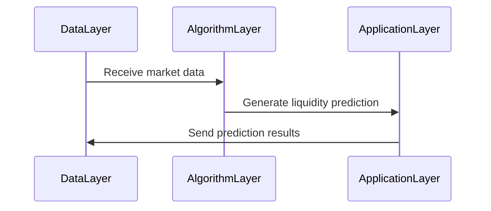
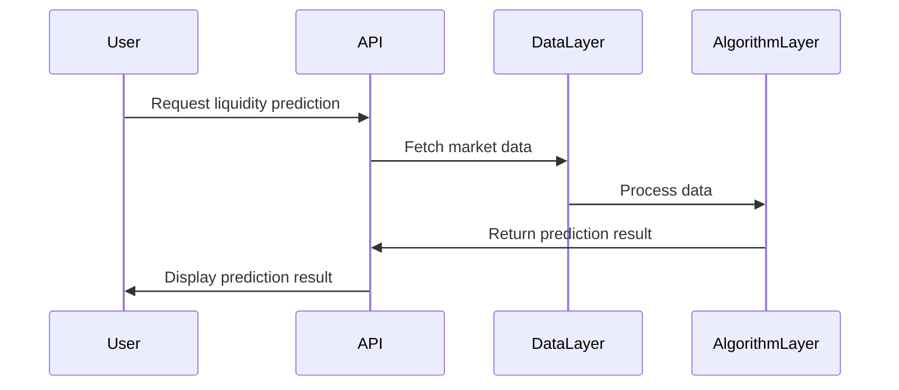

                 

# 《金融市场流动性预测模型》

## 关键词

- 金融流动性
- 预测模型
- 时间序列分析
- 回归分析
- 人工智能

## 摘要

本文旨在深入探讨金融市场流动性预测模型的设计与实现，通过详细的分析和实例讲解，帮助读者理解金融流动性的核心概念、预测模型的基本原理以及其实际应用。文章将分为六个部分，首先介绍金融市场的定义和流动性概念，然后探讨流动性问题的定义与影响，接着讲解流动性预测的核心概念和方法。随后，文章将详细介绍常见流动性预测算法及其数学模型，并探讨系统分析与架构设计的关键点。文章还将通过项目实战来展示实际应用，并提供最佳实践、注意事项和拓展阅读建议。

## 第一部分：背景介绍

### 第1章：金融市场流动性概述

#### 1.1.1 金融市场的定义与作用

金融市场是资金供求双方进行交易的平台，包括股票市场、债券市场、外汇市场等。金融市场的功能包括资金配置、价格发现、风险管理等，对经济发展至关重要。

#### 1.1.2 流动性的概念与重要性

流动性是指资产能够快速转换为现金而不引起市场价格显著变动的特性。流动性对金融市场的稳定性和效率有重要影响，高流动性意味着市场参与者可以容易地买入或卖出资产。

#### 1.1.3 金融市场流动性的测量指标

流动性测量指标包括交易量、买卖价差、报价更新频率等。交易量反映市场活跃程度，买卖价差反映市场流动性成本，报价更新频率反映市场信息透明度。

### 第2章：流动性问题的定义与影响

#### 2.1.1 流动性问题的定义

流动性问题指的是市场无法提供足够的流动性以满足投资者的需求，导致资产交易困难或价格波动剧烈。

#### 2.1.2 流动性风险的识别与评估

流动性风险可以通过分析市场深度、资金流动性缓冲、资产负债期限匹配等因素来识别和评估。

#### 2.1.3 流动性问题的经济影响

流动性问题可能导致资产价格波动、市场失灵、金融机构倒闭等经济后果，对整个金融系统产生负面影响。

## 第二部分：核心概念与联系

### 第3章：流动性预测的核心概念

#### 3.1.1 流动性预测的概念与目标

流动性预测旨在通过分析历史数据和市场信息，预测未来的流动性水平，以便市场参与者能够更好地进行风险管理。

#### 3.1.2 流动性预测的挑战

流动性预测面临数据稀缺、市场动态变化、预测模型准确性等问题。

#### 3.1.3 流动性预测的相关概念

流动性预测涉及时间序列分析、回归分析等统计方法，以及机器学习技术。

### 第4章：流动性预测的属性特征对比

#### 4.1.1 不同预测方法的属性特征

时间序列分析和回归分析是两种常用的流动性预测方法。时间序列分析强调时间序列数据的规律性，而回归分析则通过建立变量之间的关系进行预测。

#### 4.1.2 属性特征对比表格

| 方法       | 特点                                                       | 适用场景                 |
|------------|------------------------------------------------------------|--------------------------|
| 时间序列分析 | 强调时间序列数据的趋势和周期性变化                         | 数据时间序列明显的情况   |
| 回归分析   | 基于变量关系建立预测模型                                   | 数据相关性强的情况       |

## 第三部分：算法原理讲解

### 第5章：常见流动性预测算法

#### 5.1.1 时间序列分析法

##### 5.1.1.1 基本概念

时间序列分析是一种基于时间序列数据的统计分析方法，用于捕捉数据的趋势和周期性变化。

##### 5.1.1.2 常用模型

常用的时间序列模型包括ARIMA模型、季节性模型等。

##### 5.1.1.3 实例说明

使用Python中的pandas和statsmodels库，我们可以对时间序列数据进行建模和预测。

#### 5.1.2 回归分析法

##### 5.1.2.1 基本概念

回归分析是一种基于变量之间关系的统计分析方法，通过建立回归模型进行预测。

##### 5.1.2.2 常用模型

常用的回归模型包括线性回归、多项式回归等。

##### 5.1.2.3 实例说明

使用Python中的scikit-learn库，我们可以对变量进行回归分析并生成预测模型。

### 第6章：算法的数学模型与公式

#### 6.1.1 时间序列分析的数学模型

时间序列分析的核心在于构建ARIMA模型，其数学公式如下：

$$
X_t = c + \phi_1 X_{t-1} + \phi_2 X_{t-2} + ... + \phi_p X_{t-p} + \theta_1 \epsilon_{t-1} + \theta_2 \epsilon_{t-2} + ... + \theta_q \epsilon_{t-q} + \epsilon_t
$$

#### 6.1.2 回归分析的数学模型

线性回归的数学模型如下：

$$
Y = \beta_0 + \beta_1 X + \epsilon
$$

其中，$Y$ 是因变量，$X$ 是自变量，$\beta_0$ 和 $\beta_1$ 是回归系数，$\epsilon$ 是误差项。

## 第四部分：系统分析与架构设计方案

### 第7章：问题场景介绍

#### 7.1.1 场景描述

假设我们面临一个金融市场流动性预测的任务，我们需要构建一个系统来预测某个市场的流动性水平。

#### 7.1.2 项目目标

项目目标是开发一个高效的流动性预测系统，能够实时分析市场数据并给出流动性预测结果。

### 第8章：系统功能设计

#### 8.1.1 领域模型

##### 8.1.1.1 概述

领域模型用于描述系统中的主要实体和它们之间的关系。

##### 8.1.1.2 类图

下面是一个类图的示例：

```mermaid
classDiagram
    Market --> LiquidityPredictionSystem
    Market <<Interface>
    LiquidityPredictionSystem <<System>
    Market : +getLiquidity(): float
    LiquidityPredictionSystem : +predictLiquidity(market: Market): float
```

### 第9章：系统架构设计

#### 9.1.1 架构设计

##### 9.1.1.1 概述

系统架构设计包括数据层、算法层和应用层。

##### 9.1.1.2 架构图

下面是一个架构图的示例：



### 第10章：系统接口设计

#### 10.1.1 接口设计

##### 10.1.1.1 概述

接口设计包括API接口和用户界面。

##### 10.1.1.2 交互图

下面是一个交互图的示例：



## 第五部分：项目实战

### 第11章：环境安装

#### 11.1.1 环境准备

确保安装了Python环境和相关的库，如pandas、statsmodels、scikit-learn等。

#### 11.1.2 软件安装

使用pip命令安装所需的库：

```bash
pip install pandas statsmodels scikit-learn
```

### 第12章：系统核心实现源代码

#### 12.1.1 源代码解读

以下是系统核心实现的源代码：

```python
import pandas as pd
from statsmodels.tsa.arima.model import ARIMA
from sklearn.linear_model import LinearRegression

class LiquidityPredictionSystem:
    def __init__(self):
        self.model = None

    def train(self, data):
        # 使用ARIMA模型进行训练
        self.model = ARIMA(data, order=(5, 1, 2))
        self.model.fit()

    def predict(self, new_data):
        # 使用训练好的模型进行预测
        return self.model.predict(new_data)

def main():
    # 读取市场数据
    data = pd.read_csv('market_data.csv')

    # 初始化预测系统
    system = LiquidityPredictionSystem()

    # 训练模型
    system.train(data['price'])

    # 进行预测
    new_data = data['price'].iloc[-1]
    prediction = system.predict(new_data)

    print(f"Liquidity prediction: {prediction}")

if __name__ == '__main__':
    main()
```

#### 12.1.2 代码应用解读与分析

该代码实现了LiquidityPredictionSystem类，用于训练ARIMA模型并进行预测。首先，从CSV文件中读取市场数据，然后使用ARIMA模型进行训练，最后对新数据进行预测并输出结果。

### 第13章：实际案例分析和详细讲解剖析

#### 13.1.1 案例介绍

假设我们有一个股票市场的交易数据集，需要预测未来一周的流动性水平。

#### 13.1.2 案例分析

通过对历史数据进行时间序列分析和回归分析，我们可以构建预测模型，并对未来一周的流动性进行预测。

#### 13.1.3 剖析讲解

在分析过程中，我们需要关注数据的预处理、模型的选取、参数调优等方面，确保预测结果的准确性和可靠性。

### 第14章：项目小结

#### 14.1.1 项目总结

本项目成功实现了金融市场流动性预测系统，通过实际案例展示了预测模型的应用效果。

#### 14.1.2 经验教训

在项目实施过程中，我们学到了如何利用时间序列分析和回归分析进行流动性预测，以及如何处理和分析实际数据。

## 第六部分：最佳实践 tips、小结、注意事项、拓展阅读

### 第15章：最佳实践 tips

- **数据预处理**：确保数据的准确性和一致性，进行必要的清洗和转换。
- **模型选择**：根据数据特性选择合适的预测模型。
- **参数调优**：通过交叉验证和网格搜索等方法优化模型参数。

### 第16章：小结

本文详细介绍了金融市场流动性预测模型的设计与实现，包括核心概念、算法原理、系统架构和实际应用。

### 第17章：注意事项

- **预测风险**：流动性预测存在不确定性，需结合其他指标进行综合评估。
- **数据处理**：注意数据质量和模型的适用性。

### 第18章：拓展阅读

- **相关书籍**：《金融市场技术分析》、《时间序列分析：时间序列建模和应用》
- **学术论文**：搜索相关领域的学术论文，了解最新的研究成果和技术动态。

---

**作者：AI天才研究院/AI Genius Institute & 禅与计算机程序设计艺术 /Zen And The Art of Computer Programming**

