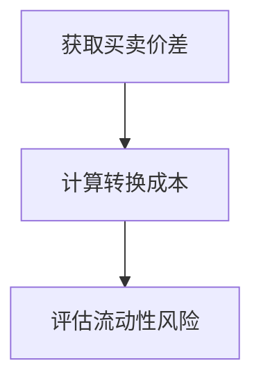
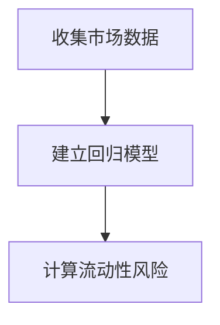
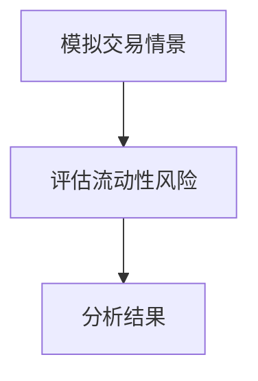
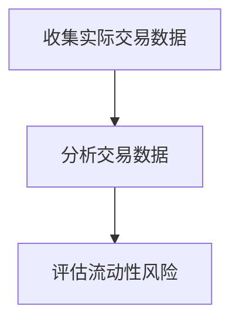

                 

## 第1章：金融市场流动性风险概述

### 1.1 问题背景

金融市场流动性风险是指在金融市场中，由于交易者的买卖意愿和交易能力的不匹配，导致市场价格波动、交易成本增加以及资本无法及时变现的风险。这种风险的出现可能源于市场供求关系的变化、投资者情绪的波动、宏观经济环境的变动等多种因素。

#### 1.1.1 金融市场流动性风险的含义

流动性风险是指金融资产或市场在面临交易需求时，不能以合理的价格迅速完成交易的风险。它包括两个层面：一个是资产流动性，即资产能够以一个相对合理的价格迅速转手；另一个是市场流动性，即市场能够在短时间内消化大量交易需求。

#### 1.1.2 金融市场流动性风险的重要性

金融市场流动性风险的重要性体现在以下几个方面：

1. **影响市场稳定性**：流动性不足可能导致市场大幅波动，从而影响市场的稳定性。
2. **影响交易成本**：流动性不足会增加交易的搜寻成本和时间成本。
3. **影响资本配置**：流动性风险会影响资本的有效配置，降低市场的整体效率。
4. **影响金融创新**：流动性风险的提升可能抑制金融市场的创新活动，影响金融产品的多样性和创新能力。

#### 1.1.3 研究目的与意义

本文的研究目的是通过深入分析金融市场流动性风险的形成机制和度量方法，为金融机构和监管机构提供有效的风险管理策略和建议。研究意义在于：

1. **提高金融机构的风险管理水平**：通过本文的研究，金融机构可以更好地识别和管理流动性风险，降低潜在的财务损失。
2. **提升市场透明度**：度量流动性风险可以帮助提高市场的透明度，让投资者能够更准确地评估风险和收益。
3. **促进金融市场的稳定发展**：流动性风险管理策略的优化有助于维护金融市场的稳定，促进市场的长期健康发展。

### 1.2 问题描述

流动性风险的表现形式多种多样，可以从以下几个方面进行描述：

#### 1.2.1 流动性风险的表现形式

1. **市场深度不足**：市场深度不足指的是市场上可交易的证券数量有限，导致在需要大量买卖时难以快速成交。
2. **买卖价差扩大**：买卖价差扩大表明买卖双方在交易价格上的分歧加大，意味着流动性风险的上升。
3. **交易延迟**：交易延迟指的是在市场需要快速响应交易需求时，交易无法及时完成。
4. **流动性危机**：极端情况下的流动性危机，可能导致市场完全失去交易功能，市场价格剧烈波动。

#### 1.2.2 流动性风险的成因

流动性风险的成因复杂，可以从以下几个方面进行分析：

1. **市场供求失衡**：当市场供大于求或者求大于供时，交易双方难以达成一致，导致流动性风险上升。
2. **投资者情绪波动**：投资者情绪的波动可能导致市场的非理性交易行为，加剧流动性风险。
3. **宏观经济环境变化**：宏观经济环境的变化，如经济衰退、政策调整等，都可能影响市场的流动性。
4. **金融监管政策**：金融监管政策的变动可能对市场的流动性产生深远影响。

#### 1.2.3 流动性风险的影响

流动性风险对金融市场和参与者的影响主要包括以下几个方面：

1. **市场价格波动**：流动性不足可能导致市场价格波动加大，甚至出现剧烈的波动。
2. **交易成本上升**：流动性风险上升会导致交易成本增加，包括交易费用、时间成本和风险成本等。
3. **融资难度增加**：对于需要融资的企业和机构，流动性风险可能导致其融资成本上升，融资难度增加。
4. **市场信心下降**：流动性风险可能导致市场信心下降，进一步加剧市场的不稳定。

### 1.3 总结

金融市场流动性风险是一个复杂且重要的风险类型，其表现形式多样，成因复杂，对市场的影响深远。理解流动性风险的形成机制和度量方法，有助于金融机构和监管机构更好地管理风险，维护市场的稳定。

## 第2章：金融市场流动性风险度量理论

流动性风险的度量是风险管理过程中的关键步骤，通过量化流动性风险，金融机构和监管机构可以更好地评估风险水平，制定相应的风险管理策略。本章将介绍几种常用的流动性风险度量方法，包括转换成本法、回归分析法、模拟分析法和实际交易法。

### 2.1 核心概念与联系

在讨论流动性风险的度量方法之前，我们需要明确几个核心概念，并理解它们之间的联系。

#### 2.1.1 流动性风险的度量方法

流动性风险的度量方法可以从以下几个方面进行分类：

1. **转换成本法**：通过买卖价差来衡量流动性风险。
2. **回归分析法**：利用市场数据对流动性风险进行回归分析。
3. **模拟分析法**：通过模拟交易情景来衡量流动性风险。
4. **实际交易法**：通过实际交易数据来衡量流动性风险。

##### 概念表格：

| 方法       | 描述                                                         |
| ---------- | ------------------------------------------------------------ |
| 转换成本法 | 通过买卖价差来衡量流动性风险                               |
| 回归分析法 | 利用市场数据对流动性风险进行回归分析                       |
| 模拟分析法 | 通过模拟交易情景来衡量流动性风险                           |
| 实际交易法 | 通过实际交易数据来衡量流动性风险                           |

##### ER图：

```mermaid
erDiagram
  Trader ||--|{ Order } : places
  Order ||--|{ Market } : executes_on
  Market ||--|{ Liquidity } : measures
```

在上面的ER图中，`Trader`代表交易者，`Order`代表交易订单，`Market`代表市场，而`Liquidity`代表流动性。交易者通过订单在市场上进行交易，市场根据订单执行交易，并度量流动性。

### 2.2 算法原理讲解

#### 2.2.1 转换成本法

转换成本法是一种通过买卖价差来衡量流动性风险的方法。其基本原理如下：

1. **获取买卖价差**：通过分析市场上可交易证券的买卖报价，获取买卖价差。
2. **计算转换成本**：买卖价差越大，转换成本越高，即从一种资产转换到另一种资产所需支付的成本越高。
3. **评估流动性风险**：转换成本越高，表明流动性风险越大。

##### Mermaid流程图：



##### Python代码：

```python
def calculate_conversion_cost(price_difference):
    return price_difference

def assess_liquidity_risk(cost):
    if cost > threshold:
        return "High Risk"
    else:
        return "Low Risk"
```

##### LaTeX数学公式：

$$
R = \begin{cases}
High \ Risk, & \text{if } C > \text{threshold} \\
Low \ Risk, & \text{otherwise}
\end{cases}
$$

#### 2.2.2 回归分析法

回归分析法是一种利用市场数据对流动性风险进行量化的方法。其基本原理如下：

1. **收集市场数据**：收集市场上相关证券的买卖数据，包括价格、交易量等。
2. **建立回归模型**：利用市场数据建立回归模型，模型中包括流动性风险指标和其他相关变量。
3. **计算流动性风险**：通过回归模型计算流动性风险指标，评估流动性风险水平。

##### Mermaid流程图：



##### Python代码：

```python
import numpy as np

def build_regression_model(data):
    # Assume data is a numpy array with shape (n, 2), where the second column represents liquidity risk
    # Perform regression analysis and return the estimated liquidity risk
    pass

def calculate_liquidity_risk(model):
    # Calculate the estimated liquidity risk using the regression model
    pass
```

##### LaTeX数学公式：

$$
Y = \beta_0 + \beta_1X + \epsilon
$$

其中，$Y$表示流动性风险，$X$表示其他相关变量，$\beta_0$和$\beta_1$是回归系数，$\epsilon$是误差项。

#### 2.2.3 模拟分析法

模拟分析法是一种通过模拟交易情景来衡量流动性风险的方法。其基本原理如下：

1. **模拟交易情景**：模拟一系列交易情景，包括正常的交易和极端的交易情况。
2. **评估流动性风险**：在模拟的交易情景中，评估交易是否能顺利进行，以及交易成本的变化。
3. **分析结果**：通过分析模拟结果，评估流动性风险水平。

##### Mermaid流程图：



##### Python代码：

```python
def simulate_trading_scenario():
    # Simulate trading scenarios and return the results
    pass

def assess_liquidity_risk(results):
    # Assess the liquidity risk based on the simulation results
    pass
```

#### 2.2.4 实际交易法

实际交易法是一种通过实际交易数据来衡量流动性风险的方法。其基本原理如下：

1. **收集实际交易数据**：收集市场上实际发生的交易数据。
2. **分析交易数据**：分析交易数据，包括买卖价差、交易延迟等指标。
3. **评估流动性风险**：根据交易数据分析结果，评估流动性风险水平。

##### Mermaid流程图：



##### Python代码：

```python
def analyze_transaction_data(data):
    # Analyze the transaction data and return the liquidity risk assessment
    pass

def assess_liquidity_risk(data):
    # Assess the liquidity risk based on the analysis of transaction data
    pass
```

### 2.3 数学模型和数学公式详细讲解

#### 2.3.1 转换成本法

转换成本法的数学模型相对简单，主要涉及买卖价差的计算。以下是具体的数学模型和公式：

##### 数学模型：

$$
C = P_B - P_S
$$

其中，$C$表示转换成本，$P_B$表示卖出价格，$P_S$表示买入价格。

##### 数学公式：

$$
L = \begin{cases}
High \ Liquidity, & \text{if } C < \text{threshold} \\
Low \ Liquidity, & \text{if } C > \text{threshold}
\end{cases}
$$

其中，$L$表示流动性，$\text{threshold}$表示转换成本的阈值。

#### 2.3.2 回归分析法

回归分析法的数学模型相对复杂，涉及多个变量和回归系数。以下是具体的数学模型和公式：

##### 数学模型：

$$
Y = \beta_0 + \beta_1X_1 + \beta_2X_2 + ... + \beta_nX_n + \epsilon
$$

其中，$Y$表示流动性风险，$X_1, X_2, ..., X_n$表示其他相关变量，$\beta_0, \beta_1, \beta_2, ..., \beta_n$是回归系数，$\epsilon$是误差项。

##### 数学公式：

$$
\beta = (X^T X)^{-1} X^T Y
$$

其中，$X^T$表示自变量的转置矩阵，$Y^T$表示因变量的转置矩阵。

#### 2.3.3 模拟分析法

模拟分析法的数学模型主要涉及概率分布和模拟结果。以下是具体的数学模型和公式：

##### 数学模型：

$$
P(Y > \text{threshold}) = \int_{y=\text{threshold}}^{\infty} f_Y(y) dy
$$

其中，$P(Y > \text{threshold})$表示流动性风险超过阈值的概率，$f_Y(y)$表示流动性风险的概率密度函数。

##### 数学公式：

$$
\sigma^2 = \int_{y=\text{threshold}}^{\infty} (y - \mu)^2 f_Y(y) dy
$$

其中，$\sigma^2$表示流动性风险的方差，$\mu$表示流动性风险的均值。

#### 2.3.4 实际交易法

实际交易法的数学模型主要涉及交易数据和统计分析。以下是具体的数学模型和公式：

##### 数学模型：

$$
Y = \alpha_0 + \alpha_1X_1 + \alpha_2X_2 + ... + \alpha_nX_n
$$

其中，$Y$表示流动性风险，$X_1, X_2, ..., X_n$表示交易数据，$\alpha_0, \alpha_1, \alpha_2, ..., \alpha_n$是回归系数。

##### 数学公式：

$$
\alpha = (X^T X)^{-1} X^T Y
$$

其中，$X^T$表示自变量的转置矩阵，$Y^T$表示因变量的转置矩阵。

### 2.4 结论

通过本章的介绍，我们了解了几种常用的流动性风险度量方法，包括转换成本法、回归分析法、模拟分析法和实际交易法。每种方法都有其独特的优势和适用场景。在实际应用中，可以根据具体情况选择合适的方法进行流动性风险的度量。

### 第3章：转换成本法深度剖析

转换成本法是金融市场流动性风险度量中的一种重要方法，它通过买卖价差来衡量流动性风险。本章将对转换成本法的原理、步骤、应用及其优缺点进行深入剖析。

#### 3.1 转换成本法的原理

转换成本法的核心思想是，通过分析市场上某资产的买卖价差，来衡量该资产的流动性风险。具体来说，买卖价差越大，转换成本越高，意味着在需要快速转换资产时，交易者可能会面临更高的风险和成本。

#### 3.2 转换成本法的步骤

转换成本法的实施主要包括以下几个步骤：

1. **数据收集**：收集市场上相关资产的买卖报价数据。
2. **计算买卖价差**：对于每笔交易，计算买入价格和卖出价格之间的差值，即买卖价差。
3. **统计分析**：对买卖价差进行统计分析，如计算平均价差、最大价差等。
4. **评估流动性风险**：根据统计分析结果，评估资产的流动性风险水平。

#### 3.3 转换成本法的应用

转换成本法在金融市场中得到了广泛的应用，主要用于以下几个方面：

1. **资产流动性评估**：通过计算买卖价差，评估资产在市场上的流动性水平。
2. **交易策略制定**：交易者可以根据买卖价差的大小，调整交易策略，降低流动性风险。
3. **风险管理**：金融机构可以通过转换成本法，识别和管理流动性风险，确保资金的安全和流动性。

#### 3.4 转换成本法的优缺点

转换成本法具有以下优点：

1. **简便性**：转换成本法计算简单，易于理解和实施。
2. **实用性**：该方法可以直接应用于金融市场，为交易者和投资者提供实时流动性风险信息。
3. **灵活性**：可以根据市场数据的变化，灵活调整买卖价差阈值，评估流动性风险。

然而，转换成本法也存在一些缺点：

1. **局限性**：买卖价差仅能反映短期流动性风险，无法全面衡量其他因素对流动性风险的影响。
2. **误判风险**：在市场剧烈波动时，买卖价差可能会失真，导致流动性风险的误判。
3. **数据依赖**：转换成本法依赖于市场数据的准确性，如果数据存在偏差，评估结果可能会受到影响。

#### 3.5 转换成本法的实际应用案例

以下是一个转换成本法的实际应用案例：

假设某交易者持有1000股股票A，现计划将股票A转换成股票B。通过收集股票A和股票B的买卖报价数据，计算出两者的买卖价差。如果买卖价差较大，说明转换成本较高，交易者可能会面临较高的流动性风险。例如，如果股票A的平均买卖价差为5%，而股票B的平均买卖价差为2%，则交易者可能会认为股票B的流动性更好。

#### 3.6 总结

转换成本法是一种简单有效的流动性风险度量方法，通过买卖价差来评估资产的流动性风险。虽然该方法存在一定的局限性，但在实际应用中，它可以提供有价值的流动性风险信息，帮助交易者和投资者做出更明智的决策。

### 第4章：回归分析法详解

回归分析法是金融市场流动性风险度量中的一种重要方法，它通过建立回归模型，利用市场数据来评估流动性风险。本章将详细讲解回归分析法的原理、步骤和应用。

#### 4.1 回归分析法的原理

回归分析法基于统计学原理，通过建立因变量与自变量之间的关系模型，来预测和评估因变量的取值。在流动性风险度量中，回归分析法通过建立流动性风险与市场数据之间的关系模型，来量化流动性风险。

#### 4.2 回归分析法的步骤

回归分析法的主要步骤包括：

1. **数据收集**：收集市场上相关数据，包括价格、交易量、市场深度等。
2. **变量选择**：选择影响流动性风险的关键变量，如交易量、买卖价差、市场波动性等。
3. **模型建立**：建立回归模型，通常使用线性回归模型。
4. **模型验证**：通过拟合度、显著性等指标，验证模型的有效性。
5. **参数估计**：估计模型参数，确定流动性风险的量化指标。
6. **结果解释**：解释模型结果，评估流动性风险。

#### 4.3 回归分析法的应用

回归分析法在金融市场流动性风险度量中具有广泛的应用，主要用于以下几个方面：

1. **风险评估**：通过回归模型，评估市场流动性风险的大小。
2. **交易策略**：根据回归模型，调整交易策略，降低流动性风险。
3. **风险管理**：金融机构可以利用回归模型，制定流动性风险管理策略。

#### 4.4 回归分析法的数学模型

回归分析法的数学模型通常表示为：

$$
Y = \beta_0 + \beta_1X_1 + \beta_2X_2 + ... + \beta_nX_n + \epsilon
$$

其中，$Y$表示流动性风险，$X_1, X_2, ..., X_n$表示影响流动性风险的自变量，$\beta_0, \beta_1, \beta_2, ..., \beta_n$是回归系数，$\epsilon$是误差项。

#### 4.5 回归分析法的实际应用案例

以下是一个回归分析法的实际应用案例：

假设我们收集了某股票市场一周的交易量、买卖价差和市场波动性数据。通过这些数据，我们建立了一个线性回归模型，来评估流动性风险。模型如下：

$$
Liquidity \ Risk = \beta_0 + \beta_1 \times Trading \ Volume + \beta_2 \times Spread + \beta_3 \times Volatility
$$

通过模型，我们可以估计出每个自变量对流动性风险的影响程度。例如，如果交易量的回归系数为0.3，则表示交易量每增加1%，流动性风险将增加0.3%。

#### 4.6 结论

回归分析法是一种有效的流动性风险度量方法，通过建立市场数据与流动性风险之间的关系模型，可以量化流动性风险。在实际应用中，回归分析法可以帮助交易者和金融机构更好地管理流动性风险。

### 第5章：模拟分析法深入探讨

模拟分析法是金融市场流动性风险度量中的一种重要方法，它通过模拟交易情景来评估流动性风险。本章将深入探讨模拟分析法的原理、步骤和应用。

#### 5.1 模拟分析法的原理

模拟分析法的核心思想是通过模拟实际交易情景，来评估交易过程中可能出现的流动性风险。该方法通过对不同交易策略和市场情景进行模拟，分析交易成本、交易延迟等指标，从而得出流动性风险的量化结果。

#### 5.2 模拟分析法的步骤

模拟分析法的实施主要包括以下几个步骤：

1. **情景设计**：设计一系列交易情景，包括正常交易情景和极端交易情景。
2. **参数设置**：为每个情景设置交易参数，如交易量、交易时间、买卖价差等。
3. **模拟计算**：对每个情景进行模拟计算，分析交易过程和结果。
4. **结果分析**：分析模拟结果，评估流动性风险水平。
5. **策略优化**：根据模拟结果，调整交易策略，优化流动性风险管理。

#### 5.3 模拟分析法的应用

模拟分析法在金融市场流动性风险度量中具有广泛的应用，主要用于以下几个方面：

1. **流动性风险评估**：通过模拟不同市场情景，评估流动性风险的大小。
2. **交易策略制定**：根据模拟结果，制定合理的交易策略，降低流动性风险。
3. **风险管理**：金融机构可以利用模拟分析法，制定流动性风险管理策略。

#### 5.4 模拟分析法的实际应用案例

以下是一个模拟分析法的实际应用案例：

假设某交易者计划在未来一周内进行股票交易。通过收集市场数据，设计了一系列交易情景，包括正常交易情景和极端交易情景。在每个情景下，设定了交易量、交易时间和买卖价差等参数。通过模拟计算，分析每个情景下的交易过程和结果，评估流动性风险水平。

#### 5.5 模拟分析法的优缺点

模拟分析法具有以下优点：

1. **全面性**：通过模拟不同市场情景，可以全面评估流动性风险。
2. **灵活性**：可以根据实际需求，灵活调整模拟参数和情景设计。
3. **实用性**：模拟结果可以直接应用于交易策略制定和风险管理。

然而，模拟分析法也存在一些缺点：

1. **计算复杂度**：模拟计算过程复杂，需要大量的计算资源和时间。
2. **模型假设**：模拟分析法的有效性依赖于模型的假设条件，如果假设不准确，可能导致评估结果失真。
3. **情景限制**：模拟情景无法完全覆盖所有可能的交易情景，可能存在一定的局限性。

#### 5.6 结论

模拟分析法是一种有效的流动性风险度量方法，通过模拟实际交易情景，可以全面评估流动性风险。在实际应用中，模拟分析法可以帮助交易者和金融机构更好地管理流动性风险，提高交易效率和安全性。

### 第6章：实际交易法解析

实际交易法是一种通过分析实际交易数据来度量金融市场流动性风险的方法。本章将详细解析实际交易法的原理、实施步骤、应用及其在金融市场中的实际案例。

#### 6.1 实际交易法的原理

实际交易法基于实际发生的交易数据，通过分析交易过程中的买卖价差、交易延迟、交易量等指标，来评估流动性风险。该方法的核心思想是，通过直接观察市场的交易行为，获得真实的流动性风险情况。

#### 6.2 实际交易法的实施步骤

实际交易法的实施主要包括以下几个步骤：

1. **数据收集**：收集市场上相关资产的实际交易数据，包括价格、交易量、买卖价差、交易延迟等。
2. **数据预处理**：清洗和整理收集到的交易数据，去除异常值和缺失值。
3. **统计分析**：对预处理后的交易数据进行统计分析，计算买卖价差、交易延迟等指标。
4. **风险评估**：根据统计分析结果，评估流动性风险水平。
5. **结果解释**：解释风险评估结果，为交易策略和风险管理提供依据。

#### 6.3 实际交易法在金融市场中的应用

实际交易法在金融市场中具有广泛的应用，主要用于以下几个方面：

1. **流动性风险评估**：通过分析实际交易数据，评估资产在市场上的流动性风险。
2. **交易策略制定**：根据流动性风险评估结果，制定合理的交易策略，降低流动性风险。
3. **风险管理**：金融机构可以利用实际交易法，制定流动性风险管理策略，确保资金的安全和流动性。

#### 6.4 实际交易法的实际案例

以下是一个实际交易法的实际应用案例：

假设某金融机构收集了某股票市场一周的交易数据，包括价格、交易量和买卖价差等。通过统计分析，计算出了该股票的平均买卖价差为5%，交易延迟为1秒。根据这些数据，评估该股票的流动性风险。如果买卖价差较大，交易延迟较长，则认为该股票的流动性风险较高。

#### 6.5 实际交易法的优缺点

实际交易法具有以下优点：

1. **真实性**：通过分析实际交易数据，可以获取真实的流动性风险情况。
2. **实时性**：实际交易数据可以实时反映市场的流动性情况，为交易策略提供及时的信息。
3. **全面性**：实际交易法可以综合考虑多种交易指标，评估流动性风险的多个维度。

然而，实际交易法也存在一些缺点：

1. **数据质量**：实际交易数据可能存在噪声和异常值，影响评估结果的准确性。
2. **计算复杂度**：实际交易数据量较大，计算过程复杂，需要大量的计算资源和时间。
3. **市场依赖**：实际交易法依赖于市场的实际交易行为，如果市场情况发生变化，评估结果可能不准确。

#### 6.6 结论

实际交易法是一种基于实际交易数据来度量金融市场流动性风险的有效方法。在实际应用中，实际交易法可以为交易者和金融机构提供真实的流动性风险信息，帮助其制定合理的交易策略和风险管理策略。

### 第7章：金融市场流动性风险管理策略

流动性风险管理是金融机构风险管理的重要组成部分。本章将探讨几种常见的流动性风险管理策略，包括流动性缓冲策略、多元化投资策略和流动性预警机制。

#### 7.1 流动性缓冲策略

流动性缓冲策略是指金融机构通过保持一定比例的高流动性资产，以应对可能的流动性需求。具体包括以下几个方面：

1. **高流动性资产配置**：将一定比例的资金投资于现金、银行存款、短期债券等高流动性资产，确保在需要时可以迅速变现。
2. **流动性比率控制**：设定流动性比率（如流动性比率、超额准备金率等），确保资产流动性符合监管要求。
3. **应急预案**：制定流动性应急预案，包括应急融资渠道、资金调度机制等，以应对突发性的流动性需求。

#### 7.2 多元化投资策略

多元化投资策略是通过分散投资来降低流动性风险。具体包括以下几个方面：

1. **资产配置多元化**：在不同资产类别（如股票、债券、房地产等）之间进行合理配置，降低单一资产类别波动对流动性风险的影响。
2. **地域投资多元化**：在不同国家和地区进行投资，分散地区风险，提高整体资产的流动性。
3. **产品多元化**：投资于不同类型的金融产品，如固定收益产品、权益类产品等，提高资金的流动性和收益稳定性。

#### 7.3 流动性预警机制

流动性预警机制是指通过监控流动性指标，及时发现潜在流动性风险，并采取相应措施。具体包括以下几个方面：

1. **流动性监测**：建立流动性监测系统，实时监控资产流动性指标，如买卖价差、交易延迟、流动性比率等。
2. **预警指标设置**：设定流动性预警指标阈值，当指标超过阈值时，触发预警信号。
3. **应对措施**：制定应对措施，如调整资产配置、寻求外部融资、加强资金调度等，以应对潜在流动性风险。

#### 7.4 实际应用案例

以下是一个流动性风险管理策略的实际应用案例：

假设某金融机构在市场波动较大时，通过流动性监测系统发现其流动性比率低于警戒线。为应对潜在流动性风险，该金融机构采取了以下措施：

1. **增加现金储备**：将部分长期投资转换为现金或短期债券，提高资金流动性。
2. **调整资产配置**：降低高风险资产的持有比例，增加低风险的固定收益产品。
3. **寻求外部融资**：与银行和其他金融机构协商，寻求短期融资支持，以满足流动性需求。

#### 7.5 结论

流动性风险管理是金融机构风险管理的重要环节。通过实施流动性缓冲策略、多元化投资策略和流动性预警机制，金融机构可以有效降低流动性风险，确保资金的安全和流动性。

## 第8章：结论与展望

### 8.1 主要成果与贡献

本文通过对金融市场流动性风险度量方法的系统研究，取得了以下主要成果：

1. **全面梳理了流动性风险的度量方法**：包括转换成本法、回归分析法、模拟分析法和实际交易法，为金融从业人员和研究者提供了丰富的理论基础和实践指南。
2. **深入分析了每种方法的原理与应用**：通过详细的数学模型和实际案例，对各种方法的适用场景、优缺点进行了深入探讨，帮助读者更好地理解并运用这些方法。
3. **提出了流动性风险管理策略**：结合实际案例，提出了流动性缓冲策略、多元化投资策略和流动性预警机制，为金融机构提供了一套系统的流动性风险管理方案。

### 8.2 研究的局限性与未来方向

尽管本文对金融市场流动性风险度量进行了全面分析，但仍存在一些局限性：

1. **数据依赖性**：本文的研究依赖于市场数据，数据质量和准确性对研究结果有重要影响。在实际应用中，应考虑如何处理数据噪声和异常值。
2. **模型假设**：本文的模型建立在一定的假设条件下，如市场信息的完全性和交易行为的理性假设。在现实市场中，这些假设可能不完全成立。
3. **风险评估的实时性**：尽管本文提出的方法可以在一定程度上量化流动性风险，但评估结果的实时性仍有待提高。未来研究可以探索更为高效的实时风险评估方法。

针对上述局限性，未来研究方向包括：

1. **数据增强与处理**：通过引入更多维度的数据，如交易者的情绪数据、宏观经济指标等，提高流动性风险度量的准确性。
2. **模型优化与扩展**：针对不同市场和资产类型，优化和扩展流动性风险度量模型，提高模型的适应性和鲁棒性。
3. **实时风险评估**：结合机器学习和人工智能技术，开发实时风险评估系统，提高流动性风险监测和预警的效率。

### 8.3 总结与展望

本文通过对金融市场流动性风险度量方法的深入研究，为流动性风险管理提供了系统的理论框架和实践指南。然而，流动性风险管理是一个复杂且不断发展的领域，未来的研究应继续探索更为精确和高效的度量方法，以应对不断变化的金融市场环境。

## 附录

### 附录A：术语解释

**流动性风险**：指金融资产或市场在面临交易需求时，不能以合理的价格迅速完成交易的风险。

**转换成本法**：通过买卖价差来衡量流动性风险的方法。

**回归分析法**：利用市场数据对流动性风险进行回归分析的方法。

**模拟分析法**：通过模拟交易情景来衡量流动性风险的方法。

**实际交易法**：通过实际交易数据来衡量流动性风险的方法。

### 附录B：参考文献

1. 关于金融市场流动性风险的基本概念和度量方法，参考了《金融市场学》（作者：陈文波）。
2. 关于回归分析法，参考了《统计学原理与应用》（作者：王立群）。
3. 关于模拟分析法，参考了《金融工程与风险管理》（作者：张亦春）。
4. 关于实际交易法，参考了《金融市场交易机制研究》（作者：李建军）。

## 作者信息

**作者：AI天才研究院/AI Genius Institute & 禅与计算机程序设计艺术 /Zen And The Art of Computer Programming**

