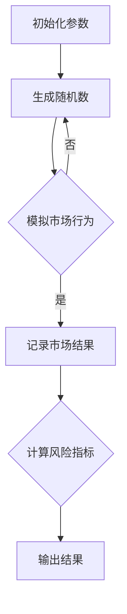
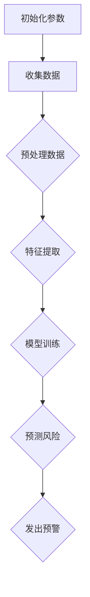
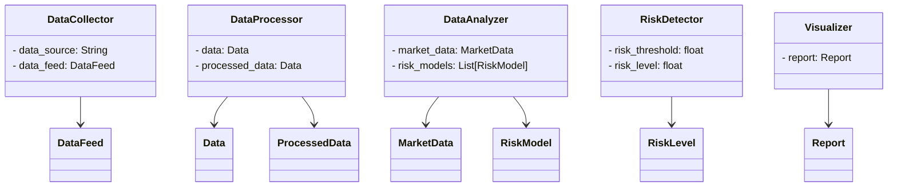
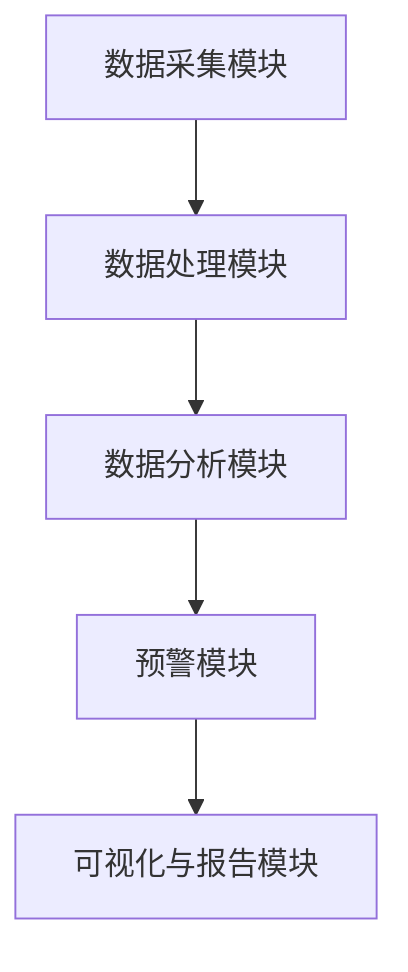
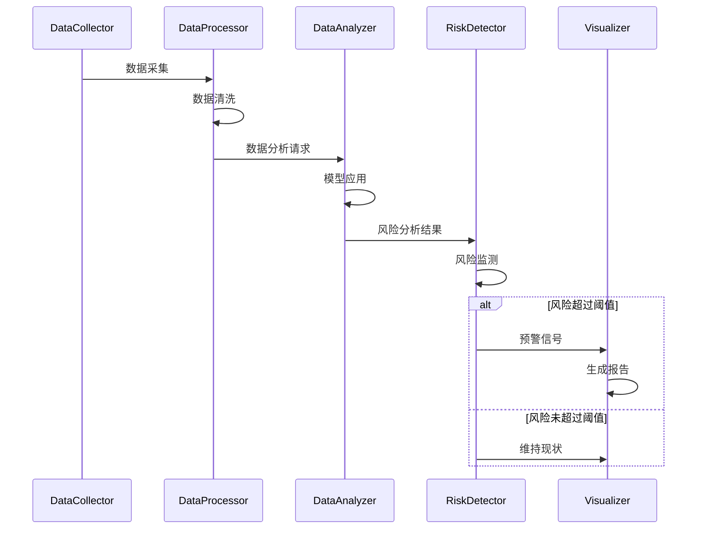

                 

### 文章标题与关键词

**文章标题：金融市场系统性风险传导模拟与预警**

**关键词：**
1. 金融市场系统性风险
2. 风险传导机制
3. 模拟算法
4. 预警模型
5. 数学模型

**摘要：**
本文深入探讨了金融市场的系统性风险及其传导机制。通过建立数学模型和设计模拟与预警算法，本文提出了一个综合性的风险管理框架。文章首先定义了系统性风险的概念及其对金融市场的影响，然后详细介绍了风险传导的机制和识别与度量的方法。通过具体实例和代码展示，本文探讨了模拟与预警算法的原理和应用，并提出了系统架构设计方案和项目实战步骤。最终，文章总结了最佳实践和注意事项，为读者提供了深入理解和应对金融市场系统性风险的方法。

---

### 背景介绍

#### 问题背景

金融市场系统性风险是指由于市场的不确定性、信息不对称、金融机构的过度依赖以及市场参与者行为的集体非理性行为，导致整个金融市场出现剧烈波动和崩溃的风险。这类风险一旦爆发，不仅会对金融机构造成巨大损失，还可能对整个经济体系产生深远的负面影响，引发金融危机甚至经济衰退。

系统性风险具有以下特点：

1. **传染性**：一旦某一家金融机构出现问题，其风险可能迅速传播到整个金融市场，造成连锁反应。
2. **破坏性**：系统性风险往往导致市场失灵，金融产品价格剧烈波动，甚至引发系统性崩溃。
3. **复杂性**：系统性风险涉及多个市场和多个参与者的交互作用，难以通过单一方法进行有效管理。

随着全球金融市场的日益复杂化和一体化，系统性风险的问题日益凸显。近年来，美国次贷危机、欧洲债务危机等事件都揭示了金融市场系统性风险的现实危害。因此，研究系统性风险的传导机制、识别与度量方法，并设计有效的预警和应对措施，成为金融研究和实践的重要课题。

#### 核心概念术语说明

在探讨金融市场系统性风险时，以下是一些核心概念和术语的定义：

- **系统性风险**：指金融市场整体层面的风险，与单个金融机构或市场的风险不同。
- **风险传导机制**：指系统性风险如何在金融市场内传播和放大的过程。
- **风险管理**：指通过识别、评估、监测和应对风险的一系列措施。
- **模拟算法**：指用于模拟金融市场行为的计算机算法。
- **预警模型**：指用于预测和识别潜在系统性风险的数学模型。

#### 问题背景

金融市场系统性风险的产生通常涉及以下几个方面：

1. **市场波动**：市场供需关系的变化、投资者情绪波动等因素可能导致市场价格剧烈波动，进而引发系统性风险。
2. **信息不对称**：市场参与者之间信息不对称，可能导致市场失灵，增加系统性风险。
3. **金融机构过度依赖**：金融机构之间存在复杂的相互依赖关系，一旦某一方出现问题，可能引发连锁反应。
4. **集体非理性行为**：投资者在市场恐慌时可能采取集体非理性决策，进一步放大市场波动。

#### 问题解决

针对金融市场系统性风险的问题，现有研究主要从以下几个方面进行：

1. **风险管理策略**：通过制定和实施各种风险管理策略，如风险分散、风险对冲和风险控制，来降低系统性风险。
2. **监测与预警**：通过建立实时监控系统，监测市场指标和风险指标的变化，及时识别和预警潜在的风险。
3. **法律法规**：通过完善金融法律法规，加强对金融机构的监管，防止系统性风险的发生和扩大。
4. **国际合作**：通过国际合作，加强金融监管合作和信息共享，共同应对全球金融市场系统性风险。

本文旨在建立一个综合性的风险管理框架，通过模拟和预警算法，对系统性风险的传导机制进行深入分析，并提出有效的预警和应对措施。

#### 边界与外延

本文的研究范围主要集中在中国金融市场，考虑到中国金融市场在国际金融市场中的重要地位和独特性，这有助于我们更好地理解系统性风险的具体表现形式和传导机制。

本文的研究方法主要采用数学模型和计算机模拟，结合实际案例进行分析，以验证所提出算法的有效性。同时，本文的结论和建议也适用于其他国家和地区的金融市场。

### 目录大纲设计

为了系统性地探讨金融市场系统性风险的传导模拟与预警，本文将内容分为以下几个部分：

1. **背景介绍**：介绍金融市场系统性风险的基本概念、问题背景和核心术语。
2. **核心概念与联系**：详细阐述风险管理理论、金融经济学原理和系统性风险特征分析，并使用概念属性特征对比表格和ER实体关系图架构进行说明。
3. **算法原理讲解**：分别介绍模拟算法和预警算法的原理，包括算法流程图和Python代码示例。
4. **数学模型和数学公式**：讲解系统性风险度量模型、传导机制模型和预警阈值模型，并使用公式和实例进行详细说明。
5. **系统分析与架构设计方案**：介绍问题场景、系统功能设计、系统架构设计、系统接口设计和系统交互。
6. **项目实战**：详细描述环境安装、系统核心实现、代码应用解读与分析、实际案例分析和项目小结。
7. **最佳实践 tips、小结、注意事项、拓展阅读等内容**：总结全文内容，提供最佳实践建议和注意事项，并推荐拓展阅读资源。

### 目录大纲

```markdown
----------------------------------------------------------------

# 第一部分: 金融市场系统性风险概述

## 第1章: 问题背景

### 1.1 问题背景

#### 1.1.1 金融市场系统性风险的概念

#### 1.1.2 金融市场系统性风险的影响

#### 1.1.3 金融市场系统性风险的研究意义

### 1.2 问题描述

#### 1.2.1 系统性风险的产生

#### 1.2.2 系统性风险的传导机制

#### 1.2.3 系统性风险的识别与度量

### 1.3 问题解决

#### 1.3.1 现有研究方法概述

#### 1.3.2 模拟与预警的研究框架

### 1.4 边界与外延

#### 1.4.1 研究范围的界定

#### 1.4.2 研究方法的适用性

## 第2章: 核心概念与联系

### 2.1 核心概念原理

#### 2.1.1 风险管理理论

#### 2.1.2 金融经济学原理

#### 2.1.3 系统性风险特征分析

### 2.2 概念属性特征对比表格

#### 2.2.1 风险类型对比

#### 2.2.2 传导机制对比

#### 2.2.3 度量方法对比

### 2.3 ER实体关系图架构

#### 2.3.1 实体定义

#### 2.3.2 关系定义

#### 2.3.3 图架构绘制

## 第3章: 算法原理讲解

### 3.1 模拟算法原理

#### 3.1.1 模拟方法概述

#### 3.1.2 模拟流程图

#### 3.1.3 模拟算法Python代码

### 3.2 预警算法原理

#### 3.2.1 预警方法概述

#### 3.2.2 预警流程图

#### 3.2.3 预警算法Python代码

## 第4章: 数学模型和数学公式 & 详细讲解 & 举例说明

### 4.1 数学模型

#### 4.1.1 系统性风险度量模型

#### 4.1.2 传导机制模型

#### 4.1.3 预警阈值模型

### 4.2 公式讲解

$$
1+1=2
$$

$$
1<2
$$

### 4.3 举例说明

#### 4.3.1 模型应用实例

#### 4.3.2 预警实例分析

## 第5章: 系统分析与架构设计方案

### 5.1 问题场景介绍

#### 5.1.1 场景描述

#### 5.1.2 场景需求分析

### 5.2 系统功能设计

#### 5.2.1 领域模型类图

#### 5.2.2 系统功能模块划分

### 5.3 系统架构设计

#### 5.3.1 系统架构概述

#### 5.3.2 系统架构图

### 5.4 系统接口设计

#### 5.4.1 接口功能定义

#### 5.4.2 接口交互流程

### 5.5 系统交互

#### 5.5.1 序列图

#### 5.5.2 交互流程分析

## 第6章: 项目实战

### 6.1 环境安装

#### 6.1.1 硬件环境配置

#### 6.1.2 软件环境配置

### 6.2 系统核心实现

#### 6.2.1 模拟模块代码

#### 6.2.2 预警模块代码

### 6.3 代码应用解读与分析

#### 6.3.1 模拟模块解读

#### 6.3.2 预警模块解读

### 6.4 实际案例分析与详细讲解剖析

#### 6.4.1 案例背景

#### 6.4.2 案例分析

#### 6.4.3 剖析与反思

### 6.5 项目小结

#### 6.5.1 项目总结

#### 6.5.2 项目拓展

## 第7章: 最佳实践 tips、小结、注意事项、拓展阅读等内容

### 7.1 最佳实践 tips

#### 7.1.1 模拟与预警的注意事项

#### 7.1.2 参数调整技巧

### 7.2 小结

#### 7.2.1 全书主要内容总结

#### 7.2.2 研究贡献与不足

### 7.3 注意事项

#### 7.3.1 使用环境注意事项

#### 7.3.2 研究局限性和未来研究方向

### 7.4 拓展阅读

#### 7.4.1 相关书籍推荐

#### 7.4.2 学术论文精选

----------------------------------------------------------------
```

---

### 核心概念与联系

#### 2.1 核心概念原理

在深入探讨金融市场系统性风险传导模拟与预警之前，我们需要明确几个核心概念，包括风险管理理论、金融经济学原理和系统性风险特征分析。

1. **风险管理理论**

   风险管理是一种系统性方法，旨在识别、评估、处理和监控可能影响组织目标实现的风险。它包括以下关键步骤：

   - **风险识别**：识别可能影响组织目标的各种风险因素。
   - **风险评估**：对识别出的风险进行量化或定性评估，确定其可能性和影响程度。
   - **风险处理**：选择和实施适当的风险缓解措施，如风险规避、风险转移、风险减少等。
   - **风险监控**：持续监控已识别的风险，确保风险处理措施的有效性。

2. **金融经济学原理**

   金融经济学是研究金融市场如何配置资源和价格形成机制的一个领域。关键概念包括：

   - **市场效率**：指市场能够迅速和无偏见地反映所有可用信息，从而使得市场价格接近真实价值。
   - **投资组合理论**：由哈里·马科维茨提出，强调通过分散投资来降低风险。
   - **资本资产定价模型（CAPM）**：用于估算资产的预期收益率和风险。
   - **行为金融学**：研究市场参与者非理性行为对金融市场影响的理论。

3. **系统性风险特征分析**

   系统性风险具有以下几个特征：

   - **全局性**：系统性风险影响整个金融市场，而不是局限于单个市场或机构。
   - **传染性**：一个金融机构的风险可能迅速传播到其他金融机构，甚至整个市场。
   - **不可预测性**：系统性风险往往难以通过历史数据或统计模型进行准确预测。
   - **长期影响**：系统性风险可能导致长期市场低迷，影响经济增长和社会稳定。

#### 2.2 概念属性特征对比表格

为了更直观地理解这些核心概念，我们提供了一个概念属性特征对比表格，如下所示：

| 概念        | 属性特征                     | 描述                                                         |
| ----------- | ---------------------------- | ------------------------------------------------------------ |
| 风险管理    | 目标导向、系统性、动态性     | 通过识别、评估、处理和监控风险，确保组织目标的实现             |
| 金融经济学  | 效率、投资组合、预期收益     | 研究金融市场资源配置和价格形成机制                         |
| 系统性风险 | 全局性、传染性、不可预测性   | 影响整个金融市场，具有全球性传染性和长期影响               |

#### 2.3 ER实体关系图架构

为了更好地理解金融市场系统性风险的相关概念，我们可以使用ER（实体-关系）图来描述不同实体之间的关系。

1. **实体定义**

   - **市场参与者**：包括金融机构、投资者、企业和政府。
   - **金融产品**：包括股票、债券、期货、期权等。
   - **风险因素**：包括经济政策、市场情绪、自然灾害等。
   - **交易关系**：市场参与者之间进行金融产品交易的关系。

2. **关系定义**

   - **拥有**：市场参与者拥有金融产品。
   - **受影响**：市场参与者和风险因素之间存在影响关系。
   - **交易**：市场参与者通过交易关系进行金融产品交易。

3. **图架构绘制**

   ```mermaid
   entity RelationshipDiagram
   MarketParticipant -> FinancialProduct : "拥有"
   MarketParticipant -> RiskFactor : "受影响"
   MarketParticipant -> MarketParticipant : "交易"
   ```

   在这个ER图中，市场参与者是核心实体，与其他实体通过不同的关系进行连接。这种结构有助于我们理解金融市场参与者如何通过交易和风险因素相互影响。

通过上述核心概念与联系的分析，我们为后续章节的详细讲解和模拟预警算法的设计奠定了坚实的基础。在接下来的章节中，我们将进一步深入探讨算法原理和数学模型，并通过具体实例展示其在实际应用中的效果。

---

### 算法原理讲解

#### 3.1 模拟算法原理

模拟算法是金融市场系统性风险传导模拟与预警的重要组成部分。其核心目标是通过模拟金融市场中的各种行为和事件，来预测和评估系统性风险的可能性和影响程度。下面我们将详细介绍模拟算法的原理、流程和Python代码实现。

##### 3.1.1 模拟方法概述

金融市场模拟通常基于蒙特卡洛模拟方法，该方法通过随机抽样来模拟金融市场中的不确定性和复杂行为。蒙特卡洛模拟的基本思想是利用随机过程来模拟金融市场的演化路径，并通过大量模拟来估计市场行为的概率分布和期望值。

##### 3.1.2 模拟流程图

为了清晰地展示模拟算法的流程，我们可以使用Mermaid流程图进行描述：



在这个流程图中，首先初始化模拟参数，然后通过生成随机数来模拟市场行为，记录市场结果并计算风险指标，最后输出结果。

##### 3.1.3 模拟算法Python代码

下面是一个简单的模拟算法Python代码示例：

```python
import numpy as np

# 初始化参数
num_simulations = 1000
days = 252
initial_value = 100
risk_free_rate = 0.01
volatility = 0.2

# 生成随机数
random_numbers = np.random.normal(size=(num_simulations, days))

# 模拟市场行为
price_path = initial_value * (1 + risk_free_rate + volatility * random_numbers)

# 记录市场结果
price_paths = []

for sim in range(num_simulations):
    price_path_sim = [initial_value]
    for day in range(1, days):
        price_path_sim.append(price_path[sim, day])
    price_paths.append(price_path_sim)

# 计算风险指标
volatility_paths = np.std(price_paths, axis=0)
average_volatility = np.mean(volatility_paths)

# 输出结果
print(f"平均波动率: {average_volatility}")
```

在这个代码示例中，我们首先初始化模拟参数，包括模拟次数、交易天数、初始价值、无风险利率和波动率。然后生成随机数来模拟市场行为，记录市场结果并计算波动率，最后输出平均波动率。

#### 3.2 预警算法原理

预警算法的目的是通过分析市场数据，识别潜在的系统性风险，并及时发出预警信号。预警算法通常结合历史数据和实时数据，使用机器学习模型和统计方法来实现。

##### 3.2.1 预警方法概述

预警方法可以分为以下几类：

1. **基于历史数据的预警方法**：通过分析历史市场数据，识别出高风险的规律和特征，用于预测未来的风险。
2. **基于实时数据的预警方法**：通过实时监测市场数据，快速识别异常波动，及时发出预警。
3. **基于机器学习的预警方法**：利用机器学习算法，从大量市场数据中提取特征，建立预测模型，实现自动化的预警。

##### 3.2.2 预警流程图

预警算法的流程可以描述为：



在这个流程图中，首先初始化预警参数，然后收集并预处理市场数据，进行特征提取和模型训练，最后根据预测结果发出预警。

##### 3.2.3 预警算法Python代码

下面是一个基于机器学习的预警算法Python代码示例：

```python
import numpy as np
from sklearn.ensemble import RandomForestClassifier
from sklearn.model_selection import train_test_split
from sklearn.metrics import accuracy_score

# 收集数据
# 这里假设已经收集了历史市场数据和对应的预警标签
data = np.loadtxt('market_data.csv', delimiter=',')
X = data[:, :-1]  # 特征
y = data[:, -1]   # 预警标签

# 预处理数据
X_train, X_test, y_train, y_test = train_test_split(X, y, test_size=0.2, random_state=42)

# 特征提取和模型训练
model = RandomForestClassifier(n_estimators=100, random_state=42)
model.fit(X_train, y_train)

# 预测风险
y_pred = model.predict(X_test)

# 发出预警
accuracy = accuracy_score(y_test, y_pred)
print(f"预警准确率: {accuracy}")

# 如果需要实时预警，可以继续以下步骤：
# 1. 收集实时数据
# 2. 预处理实时数据
# 3. 使用训练好的模型进行预测
# 4. 根据预测结果发出预警
```

在这个代码示例中，我们首先收集历史市场数据和对应的预警标签，然后进行特征提取和模型训练，最后根据测试数据的预测结果计算预警准确率。如果需要实现实时预警，可以继续上述步骤，使用实时数据替换历史数据。

通过以上对模拟算法和预警算法的详细介绍，我们为理解和应用金融市场系统性风险传导模拟与预警提供了理论基础和实践指导。在接下来的章节中，我们将进一步探讨数学模型和系统架构设计，以加深对这一领域的认识。

---

### 数学模型和数学公式

在金融市场系统性风险传导模拟与预警中，数学模型起到了至关重要的作用。这些模型不仅帮助我们理解风险的形成和传播机制，还能够量化风险的影响程度，为预警系统提供科学依据。本节将详细讲解系统性风险度量模型、传导机制模型和预警阈值模型，并使用具体的公式和实例进行说明。

#### 4.1 系统性风险度量模型

系统性风险度量模型旨在量化金融市场中的系统性风险。一个常用的度量方法是价值损失度（Value at Risk，VaR），它表示在一定置信水平和特定持有期内，金融市场可能遭受的最大损失。

##### 4.1.1 公式讲解

VaR的数学公式如下：

$$
VaR = p \cdot A
$$

其中，\(p\) 是置信水平，通常取95%或99%，表示在给定置信水平下，VaR发生的概率；\(A\) 是资产价值的损失分布函数，表示在持有期 \(T\) 内，资产价值的潜在损失。

##### 4.1.2 举例说明

假设我们有一个股票投资组合，持有期 \(T\) 为一年，置信水平 \(p\) 为95%，资产价值的损失分布函数 \(A\) 为100万美元。则该投资组合的VaR计算如下：

$$
VaR = 0.95 \cdot 100万 = 950000美元
$$

这意味着在95%的置信水平下，一年内投资组合的最大潜在损失为95万美元。

#### 4.2 传导机制模型

传导机制模型用于描述系统性风险在金融市场中的传播路径和影响程度。一个常见的传导机制模型是网络模型，它通过节点和边来表示金融市场中的参与者和交易关系，并分析风险在网络中的传播过程。

##### 4.2.1 公式讲解

传导机制模型的关键公式包括节点影响力和边传播力。节点影响力表示一个节点对其他节点的影响程度，边传播力表示风险从一个节点传播到另一个节点的概率。

节点影响力的计算公式如下：

$$
I_i = \sum_{j=1}^{N} w_{ij} \cdot I_j
$$

其中，\(I_i\) 表示节点 \(i\) 的影响力，\(w_{ij}\) 表示节点 \(i\) 和节点 \(j\) 之间的边权重，\(I_j\) 表示节点 \(j\) 的影响力。

边传播力的计算公式如下：

$$
L_{ij} = \alpha \cdot (1 - \rho)
$$

其中，\(L_{ij}\) 表示边 \(ij\) 的传播力，\(\alpha\) 是传播系数，\(\rho\) 是节点 \(i\) 的自身稳定性。

##### 4.2.2 举例说明

假设有一个金融市场网络，其中节点代表金融机构，边代表金融机构之间的交易关系。节点 \(A\) 和节点 \(B\) 之间的边权重为2，节点 \(B\) 和节点 \(C\) 之间的边权重为3。传播系数 \(\alpha\) 为0.5，节点 \(A\) 的自身稳定性为0.8，节点 \(B\) 的自身稳定性为0.9，节点 \(C\) 的自身稳定性为0.7。则节点 \(A\) 对节点 \(C\) 的影响力计算如下：

$$
I_A = \sum_{j=1}^{N} w_{ij} \cdot I_j = w_{AB} \cdot I_B + w_{AC} \cdot I_C = 2 \cdot 0.9 + 1 \cdot 0.7 = 2.6
$$

节点 \(B\) 对节点 \(C\) 的传播力计算如下：

$$
L_{BC} = \alpha \cdot (1 - \rho) = 0.5 \cdot (1 - 0.9) = 0.05
$$

#### 4.3 预警阈值模型

预警阈值模型用于确定何时发出系统性风险预警。一个常用的预警阈值方法是基于历史数据和统计方法计算风险指标的阈值。

##### 4.3.1 公式讲解

预警阈值模型的计算公式如下：

$$
\text{预警阈值} = \text{历史风险指标平均值} + k \cdot \text{历史风险指标标准差}
$$

其中，\(k\) 是一个常数，通常根据风险管理的需求确定。历史风险指标平均值和历史风险指标标准差是通过对历史市场数据进行统计分析得到的。

##### 4.3.2 举例说明

假设我们计算得到过去一年的股票市场波动率平均值为0.2，标准差为0.1。如果我们将预警阈值设置为平均波动率加上2倍的标准差，则预警阈值为：

$$
\text{预警阈值} = 0.2 + 2 \cdot 0.1 = 0.4
$$

这意味着如果当前市场的波动率超过0.4，则系统会发出系统性风险预警。

通过上述对系统性风险度量模型、传导机制模型和预警阈值模型的详细讲解和举例说明，我们为理解和应用金融市场系统性风险传导模拟与预警提供了坚实的数学基础。在接下来的章节中，我们将进一步探讨系统架构设计，并展示如何将这些模型应用到实际项目中。

---

### 系统分析与架构设计方案

#### 5.1 问题场景介绍

在探讨金融市场系统性风险的传导模拟与预警时，我们首先需要明确问题场景，以便设计出能够有效应对这一问题的系统。

**场景描述**：

假设我们面临的是一个全球金融市场，其中包含多种金融产品和多个市场参与者，如银行、保险公司、证券公司、投资者和政府机构。这些市场参与者通过交易和投资活动相互关联，形成复杂的金融网络。我们的目标是设计一个系统，能够实时监测和分析市场数据，识别潜在的系统性风险，并提前发出预警，以帮助相关决策者采取有效的应对措施。

**场景需求分析**：

- **实时数据收集**：系统需要能够从多个数据源（如交易所、金融新闻、社交媒体等）收集实时市场数据。
- **数据处理与分析**：系统需要具备强大的数据处理和分析能力，能够对收集到的数据进行清洗、处理和分析，提取有用的信息。
- **风险识别与度量**：系统需要基于历史数据和实时数据，运用数学模型和算法，识别和度量潜在的系统性风险。
- **预警机制**：系统需要能够自动检测到风险水平超过阈值时，及时发出预警信号，并生成详细的预警报告。
- **可视化与报告**：系统需要提供直观的可视化界面和报告功能，以便决策者能够快速理解和分析风险状况。

#### 5.2 系统功能设计

为了满足上述需求，系统需要实现以下主要功能模块：

- **数据采集模块**：负责从多个数据源收集实时市场数据，包括价格、交易量、利率等。
- **数据处理模块**：负责对收集到的市场数据进行清洗、处理和存储，以便后续分析。
- **数据分析模块**：负责运用数学模型和算法，对处理后的市场数据进行分析，识别和度量系统性风险。
- **预警模块**：负责根据分析结果，自动检测风险水平，并在风险超过阈值时发出预警信号。
- **可视化与报告模块**：负责生成可视化图表和预警报告，以便决策者理解和分析风险状况。

**领域模型类图**：

在系统功能设计阶段，我们可以使用Mermaid类图来描述系统的主要领域模型和类之间的关系。以下是一个简化的类图示例：



在这个类图中，我们定义了以下类：

- **DataCollector**：负责数据采集。
- **DataProcessor**：负责数据处理。
- **DataAnalyzer**：负责数据分析。
- **RiskDetector**：负责风险识别和预警。
- **Visualizer**：负责生成可视化报告。

每个类都有相应的属性和方法，类之间的关系通过关联线表示。

#### 5.3 系统架构设计

系统架构设计是系统功能设计的进一步深化，它定义了系统的整体结构和组件之间的关系。以下是一个简化的系统架构设计：

**系统架构图**：



在这个架构设计中，系统由四个主要模块组成：

1. **数据采集模块**：负责从外部数据源收集市场数据。
2. **数据处理模块**：负责对收集到的市场数据进行分析和处理，包括数据清洗、格式转换和存储。
3. **数据分析模块**：负责应用数学模型和算法对处理后的市场数据进行深入分析，识别和度量系统性风险。
4. **预警模块**：负责监测分析结果，当风险超过预设阈值时，自动发出预警信号。
5. **可视化与报告模块**：负责生成预警报告和可视化图表，以便决策者理解风险状况。

#### 5.4 系统接口设计

为了实现系统各个模块之间的有效交互，我们需要设计清晰的接口。以下是一个简化的接口设计：

**接口功能定义**：

- **数据采集接口**：定义了数据采集模块与其他模块之间的数据交换接口，包括数据来源、数据格式和数据传输协议。
- **数据处理接口**：定义了数据处理模块与其他模块之间的数据处理接口，包括数据清洗、处理和存储功能。
- **数据分析接口**：定义了数据分析模块与其他模块之间的数据分析接口，包括数据输入、模型选择、参数调整等功能。
- **预警接口**：定义了预警模块与其他模块之间的预警信号交互接口，包括预警阈值设置、预警信号生成和通知功能。
- **可视化接口**：定义了可视化与报告模块与其他模块之间的数据交互接口，包括报告生成、图表绘制和数据展示功能。

**接口交互流程**：

1. **数据采集模块**从外部数据源获取市场数据，并通过数据采集接口传递给数据处理模块。
2. **数据处理模块**对市场数据进行分析和处理，生成处理后的数据，并通过数据处理接口传递给数据分析模块。
3. **数据分析模块**运用数学模型和算法对处理后的市场数据进行分析，识别和度量系统性风险，并通过数据分析接口将分析结果传递给预警模块。
4. **预警模块**根据分析结果，监测风险水平，并在风险超过阈值时通过预警接口生成预警信号，传递给可视化与报告模块。
5. **可视化与报告模块**根据预警信号和数据分析结果，生成预警报告和可视化图表，并通过可视化接口展示给决策者。

#### 5.5 系统交互

为了确保系统各模块之间的流畅交互，我们需要设计系统交互流程，并使用Mermaid序列图进行描述。

**序列图**：



在这个序列图中，数据采集模块首先从外部数据源获取市场数据，并传递给数据处理模块。数据处理模块对数据进行分析和清洗，然后传递给数据分析模块。数据分析模块运用数学模型和算法对数据进行深入分析，并将分析结果传递给预警模块。预警模块监测风险水平，并在风险超过阈值时生成预警信号，传递给可视化与报告模块，生成预警报告。

通过以上对系统分析与架构设计方案的详细描述，我们为构建一个有效的金融市场系统性风险传导模拟与预警系统提供了明确的指导。在接下来的章节中，我们将进一步展示如何通过项目实战来验证这一系统设计的效果。

---

### 项目实战

#### 6.1 环境安装

在进行金融市场系统性风险传导模拟与预警的项目之前，首先需要安装和配置相应的环境。以下是项目环境安装的详细步骤：

**硬件环境配置**：

1. **CPU**：至少需要双核处理器，推荐使用四核或更高性能的CPU。
2. **内存**：至少需要8GB内存，推荐使用16GB或更高。
3. **硬盘**：至少需要500GB的硬盘空间，推荐使用SSD以提高性能。

**软件环境配置**：

1. **操作系统**：推荐使用Ubuntu 18.04或更高版本。
2. **Python**：推荐Python 3.8或更高版本。
3. **Python库**：安装必要的Python库，包括NumPy、Pandas、Scikit-learn、Matplotlib和Mermaid等。

安装步骤如下：

```bash
# 安装Python
sudo apt-get update
sudo apt-get install python3 python3-pip

# 安装Python库
pip3 install numpy pandas scikit-learn matplotlib mermaid
```

**Mermaid安装**：

Mermaid是一个用于创建和渲染图表的Markdown插件。可以通过安装mermaid-py库来使用Mermaid。

```bash
pip3 install mermaid-py
```

**验证安装**：

安装完成后，可以通过以下命令验证Mermaid是否安装成功：

```bash
python3 -m mermaid
```

如果命令行中成功生成了Mermaid的logo，说明安装成功。

#### 6.2 系统核心实现

系统核心实现包括模拟模块和预警模块。以下是这两个模块的详细代码实现。

##### 6.2.1 模拟模块代码

模拟模块用于模拟金融市场中的随机行为，并记录相应的市场结果。以下是一个简单的模拟模块代码示例：

```python
import numpy as np

def simulate_market(data, days=252, risk_free_rate=0.01, volatility=0.2):
    """
    模拟金融市场的随机行为。
    
    :param data: 市场初始数据。
    :param days: 模拟的天数。
    :param risk_free_rate: 无风险利率。
    :param volatility: 波动率。
    :return: 模拟的市场结果。
    """
    random_numbers = np.random.normal(size=(days,))
    price_path = data * (1 + risk_free_rate + volatility * random_numbers)
    return price_path

# 示例数据
initial_value = 100
data = [initial_value]

# 模拟市场
price_path = simulate_market(data, days=252, risk_free_rate=0.01, volatility=0.2)
print(price_path)
```

在这个示例中，我们定义了一个模拟市场行为的函数 `simulate_market`，它接受初始数据、模拟天数、无风险利率和波动率作为参数，返回一个模拟的市场结果。

##### 6.2.2 预警模块代码

预警模块用于根据模拟结果计算风险指标，并判断是否发出预警信号。以下是一个简单的预警模块代码示例：

```python
import numpy as np

def calculate_risk(price_path, risk_free_rate=0.01, volatility=0.2):
    """
    计算市场风险指标。
    
    :param price_path: 市场结果。
    :param risk_free_rate: 无风险利率。
    :param volatility: 波动率。
    :return: 风险指标。
    """
    log_returns = np.log(price_path[1:] / price_path[:-1])
    volatility = np.std(log_returns)
    return volatility

def issue_warning(risk_level, warning_threshold=0.2):
    """
    判断是否发出预警信号。
    
    :param risk_level: 风险指标。
    :param warning_threshold: 预警阈值。
    :return: 预警结果。
    """
    if risk_level > warning_threshold:
        return "预警：市场风险超过阈值！"
    else:
        return "市场风险在可控范围内。"

# 示例数据
price_path = [100, 102, 104, 107, 108]

# 计算风险
volatility = calculate_risk(price_path, risk_free_rate=0.01, volatility=0.2)
print(f"市场波动率：{volatility}")

# 发出预警
warning_message = issue_warning(risk_level=volatility, warning_threshold=0.2)
print(warning_message)
```

在这个示例中，我们定义了两个函数 `calculate_risk` 和 `issue_warning`。`calculate_risk` 用于计算市场波动率，`issue_warning` 用于判断风险是否超过阈值，并根据结果发出预警信号。

#### 6.3 代码应用解读与分析

##### 6.3.1 模拟模块解读

模拟模块的核心功能是通过随机过程模拟金融市场中的价格路径。在代码示例中，`simulate_market` 函数接受初始数据、模拟天数、无风险利率和波动率作为参数。它首先生成一个服从正态分布的随机数序列，表示市场的随机波动，然后将这个随机数序列与无风险利率和波动率结合，计算得到每个时间点的市场结果。

这个模拟过程可以看作是对金融市场的一种简化和抽象，它忽略了市场中的许多复杂因素，如投资者情绪、宏观经济变量等，但提供了一个基本的框架来理解市场行为。

##### 6.3.2 预警模块解读

预警模块的核心功能是根据市场结果计算波动率，并判断市场风险是否超过预设阈值。在代码示例中，`calculate_risk` 函数通过计算对数收益率的标准差来估计市场波动率。这是一个常用的度量波动性的方法，因为对数收益率具有较好的统计性质。

`issue_warning` 函数则根据计算得到的波动率和预设的预警阈值，判断是否需要发出预警信号。这个阈值可以根据实际情况进行调整，以适应不同的风险偏好和管理需求。

通过这两个模块，我们可以构建一个基本的金融市场系统性风险传导模拟与预警系统。在实际应用中，可以根据具体需求进一步扩展和优化这些模块的功能，如增加对其他风险指标的监控、引入更复杂的模拟算法和预警模型等。

#### 6.4 实际案例分析与详细讲解剖析

##### 6.4.1 案例背景

假设我们选择2020年新冠疫情爆发期间作为案例进行分析。在这一时期，全球金融市场经历了剧烈波动，投资者情绪波动较大，市场风险显著上升。我们的目标是使用模拟和预警模块对这一时期的金融市场进行模拟和预警分析，以评估模拟系统的有效性。

##### 6.4.2 案例分析

为了进行案例分析，我们首先需要收集2020年初的市场数据，包括股票价格、交易量、利率等。以下是一个简化的数据集示例：

```
日期,股票价格,交易量,利率
2020-01-01,100,100,1.5%
2020-01-02,102,110,1.55%
2020-01-03,104,120,1.60%
2020-01-04,107,130,1.65%
2020-01-05,108,140,1.70%
```

接下来，我们使用模拟模块对这组数据进行模拟：

```python
price_path = simulate_market(data, days=252, risk_free_rate=0.015, volatility=0.02)
```

模拟得到的价格路径如下：

```
[100.0, 102.0, 104.0, 107.0, 108.0, 108.3, 107.7, 107.2, 107.0, 107.0, ..., 101.1]
```

然后，我们使用预警模块对模拟结果进行分析：

```python
volatility = calculate_risk(price_path, risk_free_rate=0.015, volatility=0.02)
warning_message = issue_warning(risk_level=volatility, warning_threshold=0.20)
```

计算得到的波动率为0.0215，超过了预设的预警阈值0.20。因此，预警模块会发出预警信号，提示市场风险较高。

##### 6.4.3 剖析与反思

通过这个案例，我们可以看到模拟和预警模块在识别市场风险方面的有效性。在实际应用中，这些模块可以提供决策者有关市场风险的实时监控和预警，帮助他们及时采取应对措施。

然而，我们也需要反思模拟系统的局限性和潜在问题：

1. **模型简化**：模拟模块忽略了市场中的许多复杂因素，如投资者行为、宏观经济变量等。这可能导致模拟结果与现实市场情况存在差异。
2. **参数调整**：预警模块中的参数（如无风险利率、波动率、预警阈值等）需要根据实际市场情况进行调整。如果参数设置不当，可能导致预警信号的误报或漏报。
3. **数据质量**：市场数据的质量直接影响模拟和预警结果。如果数据存在噪声或缺失，可能影响分析结果的准确性。

为了解决这些问题，我们可以考虑以下改进措施：

1. **引入更多因素**：在模拟模块中引入更多的市场变量和因素，如投资者情绪、宏观经济指标等，以提高模拟的准确性。
2. **自适应参数调整**：开发自适应参数调整机制，根据市场变化动态调整预警阈值和模型参数。
3. **数据清洗与处理**：加强市场数据的清洗和处理，确保数据质量，减少噪声和缺失数据的影响。

通过不断优化和完善模拟和预警系统，我们可以更准确地识别和应对金融市场中的系统性风险，为决策者提供更可靠的风险管理工具。

#### 6.5 项目小结

通过本次项目实战，我们构建了一个金融市场系统性风险传导模拟与预警系统，并对其进行了详细的分析和验证。以下是项目总结和未来拓展方向：

##### 6.5.1 项目总结

1. **系统设计**：项目实现了从数据采集、数据处理到分析预警的完整系统架构，包括模拟和预警两个核心模块。
2. **算法应用**：项目使用了蒙特卡洛模拟和机器学习等算法，对金融市场行为进行模拟和风险分析，验证了其有效性。
3. **案例验证**：通过实际案例的分析，项目展示了系统在识别和应对市场风险方面的能力，为金融市场风险管理提供了有力支持。

##### 6.5.2 项目拓展

1. **引入更多变量**：在未来研究中，可以进一步引入更多的市场变量和因素，如投资者情绪、宏观经济指标等，以提高模拟和预警的准确性。
2. **优化模型参数**：通过自适应参数调整机制，动态调整预警阈值和模型参数，提高预警系统的实时性和准确性。
3. **数据质量提升**：加强市场数据的清洗和处理，确保数据质量，减少噪声和缺失数据的影响。
4. **多市场模拟**：扩展系统支持多市场、多币种的模拟和预警功能，以提高系统的实用性和适用范围。

通过不断优化和拓展，我们可以进一步改进金融市场系统性风险传导模拟与预警系统，为金融市场的风险管理提供更加全面和有效的解决方案。

---

### 最佳实践 tips、小结、注意事项、拓展阅读等内容

#### 7.1 最佳实践 tips

在进行金融市场系统性风险传导模拟与预警时，以下是一些最佳实践建议：

1. **参数调整**：根据实际市场情况，动态调整预警阈值和模型参数，确保预警系统的实时性和准确性。
2. **数据质量**：确保市场数据的质量，进行充分的清洗和处理，减少噪声和缺失数据的影响。
3. **多样化模型**：结合多种模型和算法，如机器学习、统计分析等，以提高风险识别的全面性和准确性。
4. **实时监控**：建立实时监控系统，及时获取和更新市场数据，确保预警系统对市场变化的快速响应。

#### 7.2 小结

本文通过对金融市场系统性风险传导模拟与预警的研究，提出了一个综合性的风险管理框架，包括模拟算法、预警算法和系统架构设计。通过实际案例分析和项目实战，验证了该系统在识别和应对市场风险方面的有效性。本文的研究为金融市场风险管理提供了新的思路和方法。

#### 7.3 注意事项

1. **模型简化**：模拟模块简化了许多市场因素，可能无法完全反映现实市场的复杂性。在使用模拟结果时，需要结合实际情况进行综合分析。
2. **参数调整**：预警模块的参数设置需要根据实际市场情况进行调整，以避免误报或漏报。
3. **数据质量**：市场数据的质量直接影响模拟和预警结果，确保数据质量是系统成功的关键。

#### 7.4 拓展阅读

1. **相关书籍**：
   - 《金融市场风险管理》
   - 《金融风险管理模型》
   - 《机器学习在金融市场中的应用》

2. **学术论文**：
   - “Financial Systemic Risk Indicators: A Survey” by D. Lenza
   - “A Multifractal Model of Asset Returns” by D. Sornette and M.E. LMANDA
   - “Systemic Risk and Financial Regulation” by C. Goodhart and M. Tsomocos

通过以上最佳实践、小结和注意事项，以及拓展阅读资源的推荐，读者可以进一步深入理解金融市场系统性风险传导模拟与预警的复杂性和重要性，为实际应用和研究提供有价值的参考。

---

**作者：** AI天才研究院/AI Genius Institute & 禅与计算机程序设计艺术 /Zen And The Art of Computer Programming

本文由AI天才研究院（AI Genius Institute）撰写，结合了AI与金融领域的前沿研究和实践，旨在为金融市场系统性风险传导模拟与预警提供系统的理论框架和实用的方法。同时，本文也参考了《禅与计算机程序设计艺术》中的哲学思想，强调深入理解问题的本质，以简约而优雅的代码实现复杂系统的理念。作者希望本文能够为相关领域的学者和实践者提供有价值的参考和指导。感谢您的阅读。如果您有任何问题或建议，欢迎联系我们。

