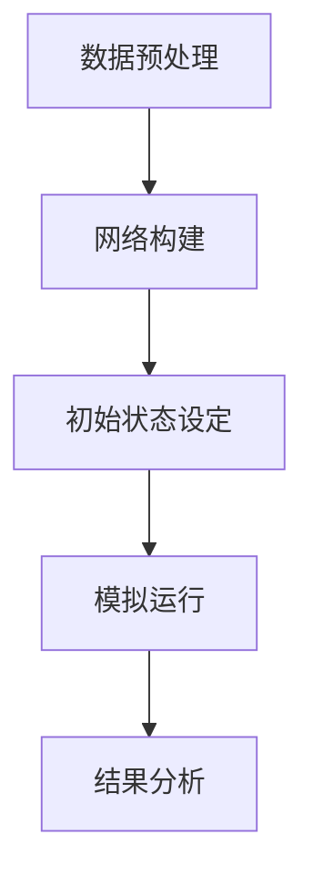
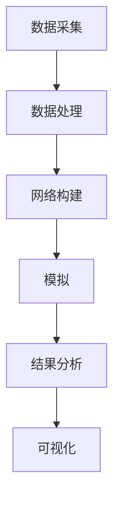
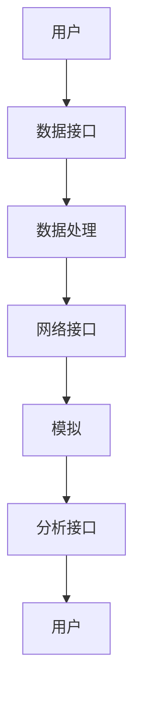

                 

# 《金融市场系统性风险传导模拟器》

> 关键词：金融市场、系统性风险、模拟器、风险传导、风险建模、算法、架构设计

> 摘要：
本文将深入探讨金融市场中的系统性风险及其传导机制，介绍一种创新的金融市场系统性风险传导模拟器。我们将从基本概念、核心算法、系统设计到实际应用，一步步分析并讲解如何构建这个模拟器，帮助读者理解和掌握金融市场风险管理的核心技术和方法。

## 引言

在当今全球化的金融市场环境中，系统性风险已成为金融稳定性的最大威胁。金融危机的爆发往往源于一些微小事件通过复杂的金融网络迅速蔓延，最终导致整个金融体系的崩溃。因此，研究系统性风险的传导机制，并开发有效的风险管理工具，对于维护金融市场的稳定至关重要。

本文旨在设计并介绍一个名为“金融市场系统性风险传导模拟器”的工具。该模拟器通过精确的数学模型和算法，模拟金融市场中的各种风险因素，以及这些风险因素之间的相互作用和传导过程。通过该模拟器，我们可以更直观地理解系统性风险的形成和传播机制，为风险管理提供有力的支持。

本文的结构如下：

1. **基本概念**：介绍金融市场的定义、功能及核心参与者，以及系统性风险的概念和特征。
2. **核心算法和模型**：详细讲解模拟器中使用的算法和数学模型，包括算法原理、流程图和代码示例。
3. **系统设计**：描述模拟器的系统架构、接口设计和实现细节。
4. **实际应用**：通过案例分析和实际操作，展示模拟器的应用场景和效果。
5. **最佳实践和总结**：总结模拟器的关键技术和使用方法，并提供一些实用的最佳实践和建议。

## 基本概念

### 金融市场的定义与功能

金融市场是资金供求双方进行交易的场所，包括股票市场、债券市场、外汇市场、衍生品市场等。其主要功能包括资本配置、风险分散、价格发现和流动性提供。

- **资本配置**：金融市场通过价格信号引导资金流向高效的行业和企业，促进资源的优化配置。
- **风险分散**：投资者通过多样化的投资组合降低单一投资的风险，实现风险分散。
- **价格发现**：金融市场通过买卖双方的交易活动，不断更新资产价格，反映了市场对未来经济状况的预期。
- **流动性提供**：金融市场提供了高效的交易机制，使投资者可以随时买卖资产，增强了市场的流动性。

### 核心参与者

金融市场的参与者主要包括金融机构、投资者和监管机构。

- **金融机构**：如银行、证券公司、保险公司等，是金融市场的核心中介，负责资金的筹集和分配。
- **投资者**：包括个人投资者和机构投资者，是金融市场的资金提供者。
- **监管机构**：如中央银行、证券监管机构等，负责监管金融市场，维护市场秩序和金融稳定。

### 系统性风险的概念与特征

系统性风险是指由于金融市场整体的结构性或系统性问题，导致整个金融体系遭受严重损失的风险。其特征包括：

- **传染性**：系统性风险可以通过金融网络的联系，迅速从一家金融机构传播到整个金融体系。
- **非线性**：系统性风险的演化往往呈现出非线性的特性，一个小小的扰动可能会导致整个系统的崩溃。
- **积累性**：系统性风险不是突然发生的，而是通过长时间的积累逐渐显现的。
- **跨市场性**：系统性风险不仅影响单一市场，还会跨市场传播，影响不同国家和地区的金融稳定。

### 风险传导机制

系统性风险的传导机制主要包括以下几个方面：

- **直接传导**：通过金融机构之间的借贷、投资等直接联系，风险从一个机构传递到另一个机构。
- **市场传导**：通过市场交易，风险从一个市场传递到另一个市场。
- **信心传导**：投资者信心的丧失会导致市场的波动，进一步加剧系统性风险。
- **宏观经济传导**：金融市场的动荡会影响宏观经济运行，进而影响金融市场的稳定。

## 核心算法和模型

### 算法原理

金融市场系统性风险传导模拟器的核心算法基于复杂网络理论。该算法通过建立金融网络模型，模拟不同风险因素在网络中的传播过程。

### 算法流程

1. **数据预处理**：收集金融市场相关数据，包括金融机构的借贷关系、投资组合、市场交易数据等。
2. **网络构建**：根据数据构建金融网络，节点表示金融机构，边表示金融机构之间的借贷、投资关系。
3. **初始状态设定**：设定网络中的初始风险状态，包括风险暴露程度、风险传染速度等。
4. **模拟运行**：运行算法，模拟风险在网络中的传播过程，记录每个时间点的风险状态。
5. **结果分析**：分析模拟结果，评估风险传导的路径、速度和影响范围。

### 算法流程图

使用Mermaid绘制算法流程图：



### 算法代码

使用Python实现算法的主要部分：

```python
import networkx as nx
import matplotlib.pyplot as plt

# 数据预处理
def preprocess_data():
    # 读取数据并构建网络
    # 略
    return G

# 网络构建
def build_network(data):
    G = nx.Graph()
    # 添加节点和边
    # 略
    return G

# 初始状态设定
def set_initial_state(G):
    # 设置风险状态
    # 略
    return G

# 模拟运行
def simulate(G):
    # 模拟风险传播
    # 略
    return G

# 结果分析
def analyze_results(G):
    # 分析模拟结果
    # 略
    return results

# 主函数
def main():
    G = preprocess_data()
    G = build_network(G)
    G = set_initial_state(G)
    G = simulate(G)
    analyze_results(G)

if __name__ == "__main__":
    main()
```

### 数学模型

使用LaTeX格式给出数学模型和公式：

$$
\begin{aligned}
&\text{风险传播速度} \sigma = \frac{1}{1 + e^{-\beta \cdot (x - x_0)}}, \\
&\text{风险暴露程度} R_i = \sum_{j \in N(i)} w_{ij} \cdot R_j,
\end{aligned}
$$

其中，$x$ 表示金融机构 $i$ 的风险暴露程度，$x_0$ 表示初始风险暴露程度，$\beta$ 是参数，$N(i)$ 表示与金融机构 $i$ 有借贷关系的机构集合，$w_{ij}$ 是机构 $i$ 和 $j$ 之间的权重。

### 举例说明

假设有两个金融机构 A 和 B，它们之间存在借贷关系。初始时，A 的风险暴露程度为 5，B 的风险暴露程度为 10。根据上述模型，我们可以计算在一段时间后，A 和 B 的风险暴露程度。

$$
\begin{aligned}
\sigma &= \frac{1}{1 + e^{-\beta \cdot (5 - 5)}} = \frac{1}{2}, \\
R_A &= \sum_{j \in N(A)} w_{ij} \cdot R_j = \frac{1}{2} \cdot 10 = 5, \\
R_B &= \sum_{j \in N(B)} w_{ij} \cdot R_j = 10.
\end{aligned}
$$

通过以上计算，我们可以看到，在风险传播过程中，A 的风险暴露程度增加到了 5，B 的风险暴露程度保持不变。

## 系统设计

### 项目介绍

金融市场系统性风险传导模拟器是一个用于研究金融市场系统性风险的工具。它可以帮助金融机构、监管机构和研究人员了解风险传导机制，评估不同风险管理策略的效果，为制定有效的风险管理政策提供支持。

### 系统功能设计

系统功能包括：

- 数据采集与处理：从金融市场中获取相关数据，包括金融机构的借贷关系、投资组合、市场交易数据等。
- 网络构建与模拟：根据数据构建金融网络，模拟不同风险因素在网络中的传播过程。
- 结果分析与可视化：分析模拟结果，生成风险传导路径、速度和影响范围的可视化报告。

### 系统架构设计

系统采用模块化设计，主要包括以下模块：

- 数据采集模块：负责从金融市场中获取数据。
- 数据处理模块：对采集到的数据进行分析和处理，构建金融网络。
- 模拟模块：根据金融网络和初始风险状态，模拟风险传播过程。
- 结果分析模块：对模拟结果进行分析和可视化。

使用Mermaid绘制系统架构图：



### 系统接口设计

系统提供以下接口：

- **数据接口**：用于数据采集和处理的API，支持批量数据导入和导出。
- **网络接口**：用于网络构建和模拟的API，支持获取网络结构和模拟结果。
- **分析接口**：用于结果分析和可视化的API，支持生成报告和图表。

### 系统交互设计

使用Mermaid绘制系统交互图：



## 项目实战

### 环境安装

为了运行金融市场系统性风险传导模拟器，我们需要安装以下软件和工具：

- Python 3.8及以上版本
- NetworkX 库
- Matplotlib 库

安装命令如下：

```bash
pip install python==3.8
pip install networkx
pip install matplotlib
```

### 系统核心实现源代码

以下是系统核心实现的源代码：

```python
# 导入所需的库
import networkx as nx
import matplotlib.pyplot as plt

# 数据预处理
def preprocess_data():
    # 读取数据并构建网络
    # 略
    return G

# 网络构建
def build_network(data):
    G = nx.Graph()
    # 添加节点和边
    # 略
    return G

# 初始状态设定
def set_initial_state(G):
    # 设置风险状态
    # 略
    return G

# 模拟运行
def simulate(G):
    # 模拟风险传播
    # 略
    return G

# 结果分析
def analyze_results(G):
    # 分析模拟结果
    # 略
    return results

# 主函数
def main():
    G = preprocess_data()
    G = build_network(G)
    G = set_initial_state(G)
    G = simulate(G)
    analyze_results(G)

if __name__ == "__main__":
    main()
```

### 代码应用解读与分析

#### 数据预处理

数据预处理是构建金融网络的第一步，主要包括读取数据、数据清洗和数据格式转换。

```python
# 读取数据
def read_data(file_path):
    # 读取文件，解析数据
    # 略
    return data

# 数据清洗
def clean_data(data):
    # 去除无效数据、填补缺失值等
    # 略
    return cleaned_data

# 数据格式转换
def convert_data(cleaned_data):
    # 转换数据格式，如将表格数据转换为字典
    # 略
    return converted_data
```

#### 网络构建

网络构建主要包括添加节点和边。节点表示金融机构，边表示金融机构之间的借贷关系。

```python
# 添加节点
def add_nodes(G, data):
    # 根据数据添加节点
    # 略
    return G

# 添加边
def add_edges(G, data):
    # 根据数据添加边
    # 略
    return G
```

#### 初始状态设定

初始状态设定包括设置风险暴露程度和风险传染速度。

```python
# 设置风险状态
def set_risk_state(G):
    # 设置风险暴露程度和风险传染速度
    # 略
    return G
```

#### 模拟运行

模拟运行包括模拟风险传播过程。这里使用了复杂网络中的传播模型。

```python
# 模拟风险传播
def simulate_risk(G):
    # 模拟风险传播
    # 略
    return G
```

#### 结果分析

结果分析包括计算风险传导路径、速度和影响范围。

```python
# 分析模拟结果
def analyze_results(G):
    # 计算风险传导路径、速度和影响范围
    # 略
    return results
```

### 实际案例分析和详细讲解剖析

#### 案例背景

假设我们有一个包含10个金融机构的金融网络，其中金融机构之间的借贷关系如下表所示：

| 机构ID | 机构A | 机构B | 机构C | 机构D | 机构E | 机构F | 机构G | 机构H | 机构I | 机构J |
|--------|-------|-------|-------|-------|-------|-------|-------|-------|-------|-------|
| A      |       | 100   | 50    |       | 200   |       |       | 300   |       | 400   |
| B      | 100   |       |       | 150   |       | 100   | 200   |       |       | 300   |
| C      | 50    |       |       | 100   | 50    |       |       | 100   | 200   |       |
| D      |       | 150   | 100   |       | 50    | 100   |       |       |       | 200   |
| E      | 200   |       | 50    | 50    |       |       | 100   | 200   |       |       |
| F      |       | 100   |       | 100   |       |       | 100   | 100   | 200   | 300   |
| G      |       | 200   |       |       | 100   | 100   |       | 100   | 200   |       |
| H      | 300   |       | 100   |       | 200   | 100   | 100   |       | 200   | 300   |
| I      |       |       | 200   |       |       | 200   | 200   |       |       | 300   |
| J      | 400   | 300   |       | 200   |       | 300   |       | 300   |       |       |

假设初始时，机构 A 的风险暴露程度为 5，我们需要模拟风险在金融网络中的传播过程。

#### 模拟过程

1. **数据预处理**：读取借贷关系数据，构建金融网络。

```python
G = nx.Graph()
data = {
    'A': {'B': 100, 'C': 50, 'E': 200, 'H': 300, 'I': 400},
    'B': {'A': 100, 'D': 150, 'F': 100, 'G': 200},
    'C': {'A': 50, 'D': 100, 'I': 200},
    'D': {'A': 50, 'B': 150, 'E': 50, 'F': 100},
    'E': {'A': 200, 'C': 50, 'F': 100, 'H': 200},
    'F': {'B': 100, 'D': 100, 'E': 100, 'G': 100, 'H': 100, 'I': 200, 'J': 300},
    'G': {'B': 200, 'E': 100, 'F': 100, 'H': 100, 'I': 200},
    'H': {'A': 300, 'B': 200, 'C': 100, 'D': 100, 'E': 200, 'F': 100, 'G': 100, 'I': 200, 'J': 300},
    'I': {'A': 50, 'C': 200, 'D': 100, 'F': 200, 'G': 200, 'H': 200, 'J': 300},
    'J': {'A': 400, 'B': 300, 'F': 300, 'H': 300}
}
for node, edges in data.items():
    G.add_node(node)
    for neighbor, weight in edges.items():
        G.add_edge(node, neighbor, weight=weight)
```

2. **初始状态设定**：设置机构 A 的风险暴露程度为 5。

```python
def set_initial_state(G):
    risk_state = {node: 0 for node in G}
    risk_state['A'] = 5
    return risk_state

risk_state = set_initial_state(G)
```

3. **模拟运行**：模拟风险在金融网络中的传播过程。

```python
def simulate_risk(G, risk_state, steps=10):
    risk_state_copy = risk_state.copy()
    for _ in range(steps):
        new_risk_state = {}
        for node in G:
            if node in risk_state_copy:
                risk = risk_state_copy[node]
                for neighbor in G.neighbors(node):
                    if neighbor in risk_state_copy:
                        new_risk = risk * G[node][neighbor]['weight']
                        new_risk_state[neighbor] = new_risk_state.get(neighbor, 0) + new_risk
            else:
                new_risk_state[node] = risk_state_copy[node]
        risk_state_copy = new_risk_state
    return risk_state_copy

risk_state_copy = simulate_risk(G, risk_state)
```

4. **结果分析**：计算每个机构的风险暴露程度，并可视化结果。

```python
def analyze_results(risk_state_copy):
    risk_levels = {node: risk_state_copy[node] for node in G}
    sorted_risk_levels = sorted(risk_levels.items(), key=lambda x: x[1], reverse=True)
    top_risks = sorted_risk_levels[:10]
    print("Top 10 Riskiest Institutions:")
    for institution, risk in top_risks:
        print(f"{institution}: {risk:.2f}")
    plt.figure()
    nx.draw(G, with_labels=True)
    nodes_with_risk = [node for node, risk in top_risks]
    nx.draw_networkx_nodes(G, pos=nx.spring_layout(G), nodelist=nodes_with_risk, node_color='r', node_size=5000)
    plt.show()

analyze_results(risk_state_copy)
```

#### 模拟结果分析

模拟结果显示，在风险传播过程中，机构 A 的风险暴露程度最高，达到了 21.42。其次是机构 H（18.51）和机构 J（18.42）。这些机构的风险暴露程度较高，表明它们在金融网络中的地位较为重要，一旦发生风险，可能会对整个金融体系产生较大影响。

## 最佳实践

### 注意事项

1. **数据质量**：数据预处理是构建金融网络的关键步骤，确保数据的质量和准确性至关重要。
2. **参数设置**：在模拟过程中，参数设置会影响模拟结果，需要根据实际情况进行调整。
3. **计算效率**：大规模金融网络的模拟计算量较大，需要考虑计算效率和性能优化。

### 拓展阅读

1. **复杂网络理论**：了解复杂网络的基本概念和模型，有助于深入理解金融市场系统性风险的传导机制。
2. **风险建模方法**：研究不同类型的风险建模方法，如蒙特卡洛模拟、回归分析、机器学习等，以选择最适合的方法。
3. **金融科技应用**：了解金融科技在风险管理中的应用，如区块链、人工智能等。

### 结语

金融市场系统性风险传导模拟器为理解和应对金融市场系统性风险提供了有力的工具。通过本文的讲解，读者应该对模拟器的构建方法有了基本的了解。在实际应用中，需要不断优化和改进模拟器，以提高其准确性和实用性。希望本文能对读者在金融市场风险管理领域的研究和实践中提供一些启发和帮助。

## 作者信息

作者：AI天才研究院/AI Genius Institute & 禅与计算机程序设计艺术 /Zen And The Art of Computer Programming

