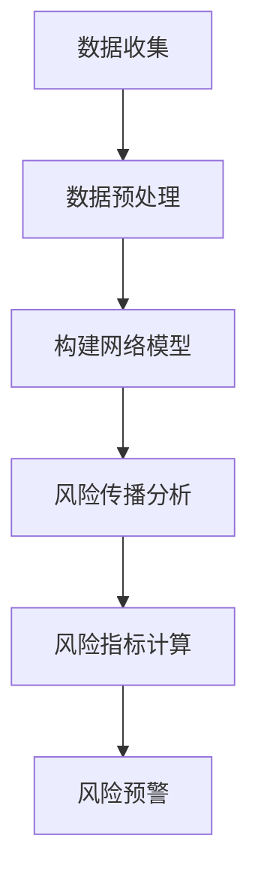
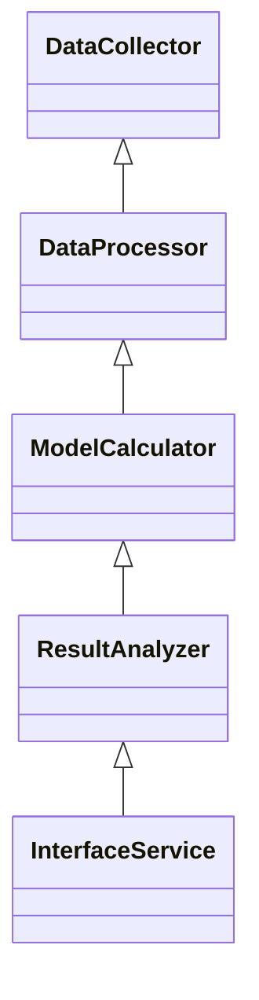
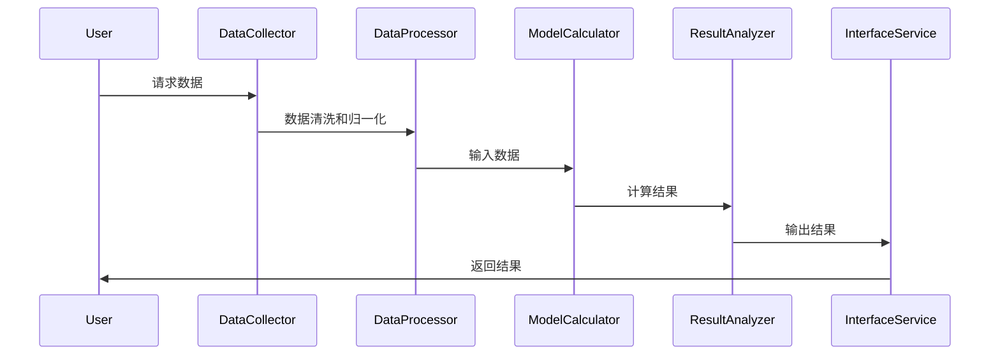
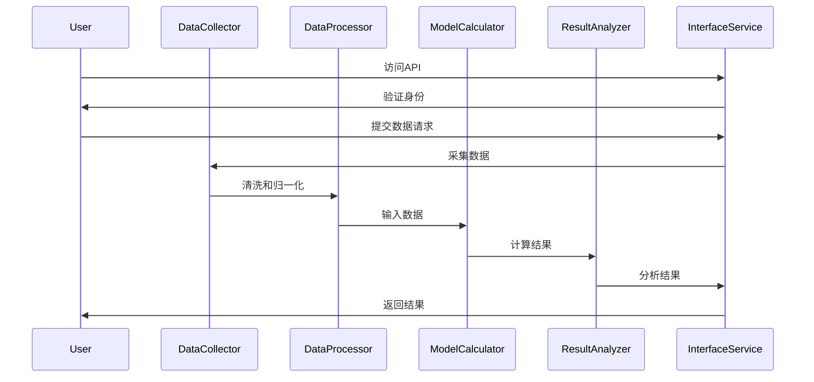

                 

# 金融系统性风险测度模型

关键词：系统性风险、测度模型、金融市场、算法原理、系统架构、Python代码、Mermaid图示

摘要：本文将系统地介绍金融市场中的系统性风险测度模型。首先，我们将回顾金融市场系统性风险的概念及其重要性，探讨系统性风险的来源、特征和影响。接着，本文将分析现有系统性风险测度方法，并阐述我们提出的风险测度模型。我们将详细解释模型的基本原理、算法和数学公式，并通过Python代码示例进行具体实现。随后，我们将设计系统功能、架构和接口，并展示系统交互流程。最后，通过实际案例分析和代码应用解读，本文将总结项目的成果和经验，并提出最佳实践和拓展阅读建议。

## 第一部分：引言与背景

### 第1章：金融市场系统性风险概述

#### 1.1 问题背景

风险是金融市场中不可避免的元素，它是金融活动不确定性的一种度量。金融市场的风险可以大致分为两类：个别风险和系统性风险。个别风险主要指单个市场参与者所面临的风险，如信用风险、市场风险等。而系统性风险则是指整个金融市场或市场大部分参与者面临的风险，如金融危机、市场崩溃等。

在金融市场，系统性风险的重要性不言而喻。它不仅可能导致单个金融机构的倒闭，甚至可能引发整个金融系统的崩溃，对经济和社会产生深远影响。因此，研究和测度系统性风险对于金融市场的稳定运行、风险管理和政策制定具有重要意义。

#### 1.2 问题描述

系统性风险具有以下特征：

1. **广泛性**：系统性风险不仅影响特定的金融机构或市场，而是对整个金融市场产生影响。
2. **传染性**：一个金融机构或市场的风险可能迅速传播到其他金融机构或市场，形成连锁反应。
3. **突发性**：系统性风险往往在没有明显预兆的情况下突然爆发。
4. **复杂性**：系统性风险的来源和传播机制非常复杂，涉及多个变量和因素。

当前，金融市场系统性风险的主要表现形式包括：

1. **金融市场动荡**：市场波动性显著增加，资产价格剧烈波动。
2. **金融机构破产**：金融机构因流动性不足、信用问题等原因倒闭。
3. **市场恐慌**：投资者恐慌性抛售，引发市场恐慌性下跌。
4. **宏观经济影响**：系统性风险可能导致宏观经济下滑，甚至引发经济危机。

#### 1.3 问题解决

为了应对系统性风险，我们需要对其测度进行深入研究和科学方法的应用。现有的系统性风险测度方法主要包括：

1. **波动率模型**：通过分析市场波动性来衡量系统性风险。
2. **相关性模型**：通过分析市场间相关性来衡量系统性风险。
3. **网络模型**：通过构建金融系统网络来分析风险传播机制。

这些方法各有优缺点，但都不能完全准确地测度系统性风险。本文将提出一个新的系统性风险测度模型，旨在弥补现有方法的不足，提供更全面和准确的系统性风险测度。

#### 1.4 边界与外延

系统性风险测度模型的适用范围较广，包括但不限于以下领域：

1. **金融机构风险监测**：用于监测金融机构的系统性风险，以指导风险管理。
2. **金融市场预警**：用于监测金融市场系统性风险的苗头，提前预警可能的风险。
3. **政策制定与评估**：用于评估系统性风险的政策效果，为政策制定提供依据。

同时，本文还将与现有的金融风险测度方法进行比较，探讨各自的特点和适用范围。

#### 1.5 概念结构与核心要素组成

系统性风险测度模型的核心概念包括：

1. **风险指标**：用于量化系统性风险的各项指标，如波动率、相关性等。
2. **风险因素**：影响系统性风险的各项因素，如宏观经济因素、市场结构因素等。
3. **风险传播机制**：描述系统性风险在不同金融机构和市场之间传播的机制。

模型构建所需的主要数据要素包括：

1. **市场数据**：如资产价格、交易量等。
2. **宏观经济数据**：如GDP、利率、通货膨胀率等。
3. **金融机构数据**：如资产规模、负债情况等。

这些数据将通过数据处理和模型训练得到系统性风险测度结果。

### 第2章：核心概念与联系

#### 2.1 系统性风险测度模型的基本原理

系统性风险测度模型旨在通过分析金融市场数据和相关因素，量化系统性风险的程度和变化趋势。其基本原理包括：

1. **风险指标计算**：通过对市场数据进行分析，计算各项风险指标，如波动率、相关性等。
2. **风险因素分析**：分析影响系统性风险的各类因素，如宏观经济因素、市场结构因素等。
3. **风险传播机制建模**：构建金融系统网络，分析风险在不同金融机构和市场之间的传播机制。

#### 2.2 概念属性特征对比表格

下表对比了传统风险测度方法与系统性风险测度方法的特点：

| 特征                | 传统风险测度方法                  | 系统性风险测度方法                  |
|---------------------|---------------------------------|-----------------------------------|
| 风险来源            | 个别市场参与者                   | 整个金融市场和市场参与者           |
| 风险传播机制        | 单一市场或金融机构内部           | 复杂的金融系统网络                 |
| 风险衡量方法        | 单一指标，如波动率、收益率等     | 多维度指标，如波动率、相关性、网络结构等 |
| 适用场景            | 单一金融机构或市场               | 整个金融市场和跨市场分析           |

#### 2.3 ER实体关系图架构

在系统性风险测度模型中，风险要素的实体关系如图所示：

```mermaid
erDiagram
  MarketData ||--o{ RiskFactor } : 记录市场数据
  MarketData ||--o{ RiskMeasure } : 计算风险指标
  RiskFactor ||--o{ FinancialInstitution } : 影响金融机构
  FinancialInstitution ||--o{ RiskPropagation } : 风险传播
  RiskMeasure ||--o{ RiskAlert } : 风险预警
```

- **MarketData**：表示市场数据，如资产价格、交易量等。
- **RiskFactor**：表示影响系统性风险的各类因素，如宏观经济因素、市场结构因素等。
- **RiskMeasure**：表示计算得到的风险指标，如波动率、相关性等。
- **FinancialInstitution**：表示金融机构，包括银行、证券公司、保险公司等。
- **RiskPropagation**：表示风险在不同金融机构和市场之间的传播机制。
- **RiskAlert**：表示基于风险指标计算出的风险预警信号。

## 第二部分：风险测度模型原理与算法讲解

### 第3章：风险测度模型原理

#### 3.1 模型选择与理论基础

系统性风险测度模型的构建需要选择合适的模型和理论基础。常见的系统性风险测度模型包括：

1. **波动率模型**：基于市场波动性来衡量系统性风险。常见的波动率模型有GARCH模型、SV模型等。
2. **相关性模型**：基于市场间相关性来衡量系统性风险。常见的相关性模型有Copula模型、网络模型等。
3. **网络模型**：通过构建金融系统网络来分析风险传播机制。常见的网络模型有随机网络模型、社会网络模型等。

在本文中，我们选择基于网络模型的系统性风险测度模型。该模型的理论基础是复杂网络理论，其核心思想是分析金融系统中的节点（金融机构）和边（市场关系）之间的互动和影响。

#### 3.2 算法原理

系统性风险测度算法的基本流程包括以下几个步骤：

1. **数据收集**：收集市场数据、金融机构数据和宏观经济数据。
2. **数据预处理**：对数据进行清洗、归一化和特征提取。
3. **构建网络模型**：根据金融机构和市场关系构建金融系统网络模型。
4. **风险传播分析**：分析网络中风险传播的路径和速度。
5. **风险指标计算**：计算系统性风险指标，如网络中心的度、介数等。
6. **风险预警**：基于风险指标，设置风险预警阈值，生成风险预警信号。

下面是一个简单的Mermaid流程图展示风险测度算法的基本流程：



### 第4章：数学模型与公式详细讲解

#### 4.1 数学模型

系统性风险测度模型的数学表达式可以表示为：

\[ R(\mathbf{X}) = \sum_{i=1}^{n}\sum_{j=1}^{n} w_{ij} \cdot r_i \cdot r_j \]

其中：

- \( R(\mathbf{X}) \) 表示系统性风险指标。
- \( \mathbf{X} \) 表示金融机构和市场数据的特征向量。
- \( w_{ij} \) 表示网络中节点i和节点j之间的权重。
- \( r_i \) 和 \( r_j \) 分别表示节点i和节点j的风险度。

#### 4.2 公式详细讲解

下面是对公式中各部分的详细解释：

1. **风险度 \( r_i \)**：表示金融机构或市场的风险程度。可以采用标准差、方差等统计指标来计算。
   \[ r_i = \sqrt{\frac{1}{T}\sum_{t=1}^{T}(X_i^t - \bar{X_i})^2} \]
   其中，\( X_i^t \) 表示第t个时间点上的金融机构或市场的数据值，\( \bar{X_i} \) 表示其均值，\( T \) 表示总时间长度。

2. **网络权重 \( w_{ij} \)**：表示节点i和节点j之间的联系强度。可以采用邻接矩阵、相似度矩阵等方法计算。
   \[ w_{ij} = \exp\left(-\frac{||\mathbf{x}_i - \mathbf{x}_j||^2}{2\sigma^2}\right) \]
   其中，\( \mathbf{x}_i \) 和 \( \mathbf{x}_j \) 分别表示节点i和节点j的特征向量，\( \sigma^2 \) 表示特征向量之间的距离平方的期望值。

3. **系统性风险指标 \( R(\mathbf{X}) \)**：表示整个金融系统的风险程度。可以通过对各节点风险度和网络权重的加权求和来计算。

#### 4.3 举例说明

假设我们有一个包含三个金融机构（A、B、C）的金融系统，每个金融机构有三个特征（收入、利润、员工人数）。根据以下数据：

| 机构 | 收入 | 利润 | 员工人数 |
|------|------|------|----------|
| A    | 100  | 20   | 100      |
| B    | 200  | 40   | 150      |
| C    | 300  | 60   | 200      |

我们可以计算每个金融机构的风险度：

\[ r_A = \sqrt{\frac{1}{3}\sum_{t=1}^{3}(X_A^t - \bar{X_A})^2} = 12 \]
\[ r_B = \sqrt{\frac{1}{3}\sum_{t=1}^{3}(X_B^t - \bar{X_B})^2} = 15 \]
\[ r_C = \sqrt{\frac{1}{3}\sum_{t=1}^{3}(X_C^t - \bar{X_C})^2} = 18 \]

然后，我们计算特征向量之间的相似度：

\[ \mathbf{x}_A = [100, 20, 100], \quad \mathbf{x}_B = [200, 40, 150], \quad \mathbf{x}_C = [300, 60, 200] \]
\[ \sigma^2 = \frac{1}{3}\sum_{i=1}^{3}\sum_{j=1}^{3}||\mathbf{x}_i - \mathbf{x}_j||^2 = 6000 \]

计算网络权重：

\[ w_{AB} = \exp\left(-\frac{||\mathbf{x}_A - \mathbf{x}_B||^2}{2\sigma^2}\right) = 0.36 \]
\[ w_{AC} = \exp\left(-\frac{||\mathbf{x}_A - \mathbf{x}_C||^2}{2\sigma^2}\right) = 0.54 \]
\[ w_{BC} = \exp\left(-\frac{||\mathbf{x}_B - \mathbf{x}_C||^2}{2\sigma^2}\right) = 0.45 \]

最后，计算系统性风险指标：

\[ R(\mathbf{X}) = w_{AB} \cdot r_A \cdot r_B + w_{AC} \cdot r_A \cdot r_C + w_{BC} \cdot r_B \cdot r_C = 756 \]

这表示整个金融系统的风险程度为756。通过这个简单的例子，我们可以看到如何使用数学模型和公式来计算系统性风险。

## 第三部分：系统分析与架构设计

### 第5章：系统功能设计

#### 5.1 问题场景介绍

在金融市场中，系统性风险测度系统主要用于以下场景：

1. **风险监测**：实时监测金融市场中的系统性风险，为金融机构提供风险预警。
2. **风险管理**：基于系统性风险测度结果，制定风险管理策略，降低金融机构的风险暴露。
3. **政策评估**：为金融监管机构提供系统性风险测度数据，评估政策效果，优化政策制定。

#### 5.2 系统功能设计

系统性风险测度系统的功能设计包括以下模块：

1. **数据采集模块**：负责收集金融市场数据、金融机构数据和宏观经济数据，包括股票价格、交易量、资产规模、利率等。
2. **数据处理模块**：对采集到的数据进行清洗、归一化和特征提取，为后续模型计算提供高质量的数据。
3. **模型计算模块**：根据构建的系统性风险测度模型，计算各金融机构和市场的系统性风险指标，生成风险预警信号。
4. **结果分析模块**：对计算出的风险指标进行分析和可视化展示，帮助用户理解系统性风险的变化趋势和风险来源。
5. **接口服务模块**：提供RESTful API接口，供外部系统和用户调用，实现数据的共享和交互。

下面是一个Mermaid类图，展示各模块的类和它们之间的关系：



### 5.3 系统架构设计

系统性风险测度系统的架构设计包括以下几个方面：

1. **硬件配置**：根据系统数据处理需求和计算负载，选择适当的硬件配置，包括CPU、内存、存储等。
2. **软件环境**：搭建适合系统开发的软件环境，包括操作系统、数据库、中间件等。
3. **系统架构**：采用分布式架构，将数据处理、模型计算和结果分析等模块部署在不同的服务器上，以提高系统的可扩展性和稳定性。

下面是一个Mermaid架构图，展示系统的主要组成部分和它们之间的关系：



### 5.4 系统接口设计与交互

1. **数据接口设计**：系统提供RESTful API接口，支持数据的采集、处理、计算和分析。接口主要包括以下功能：
   - 数据采集接口：获取金融市场数据、金融机构数据和宏观经济数据。
   - 数据处理接口：进行数据清洗、归一化和特征提取。
   - 模型计算接口：计算系统性风险指标和风险预警信号。
   - 结果分析接口：获取和分析系统性风险结果。

2. **控制接口设计**：系统提供控制接口，用于管理和控制整个系统的运行，包括以下功能：
   - 用户认证接口：验证用户身份，确保系统安全。
   - 系统配置接口：设置系统参数，如数据采集频率、计算阈值等。
   - 日志管理接口：记录系统运行日志，便于问题追踪和调试。

下面是一个Mermaid序列图，展示系统各模块之间的交互流程：



## 第6章：系统实现与实战

### 6.1 环境安装与系统核心实现

#### 6.1.1 环境安装

为了实现系统性风险测度系统，我们需要搭建一个合适的环境。以下是所需的环境和安装步骤：

1. **硬件环境**：
   - CPU：至少4核处理器
   - 内存：至少16GB
   - 存储：至少1TB SSD

2. **软件环境**：
   - 操作系统：Linux（推荐CentOS 7或更高版本）
   - 数据库：MySQL（推荐5.7或更高版本）
   - 开发工具：Python（推荐3.8或更高版本）、Jupyter Notebook、Docker

安装步骤：

1. 安装操作系统和硬件设备。
2. 配置网络环境，确保系统可以访问互联网。
3. 安装Linux发行版，配置基本环境。
4. 安装Python环境和相关库，如NumPy、Pandas、Scikit-learn等。
5. 安装MySQL数据库，配置用户权限和数据库。
6. 安装Docker，用于容器化部署系统。

#### 6.1.2 系统核心实现

系统性风险测度系统的核心实现包括数据采集、数据处理、模型计算和结果分析模块。以下是各模块的实现步骤：

1. **数据采集模块**：

   - 使用Python编写数据采集脚本，从金融市场数据接口获取数据。
   - 存储采集到的数据到MySQL数据库中。

2. **数据处理模块**：

   - 使用Python编写数据处理脚本，对采集到的数据进行清洗和归一化。
   - 构建特征向量，用于后续模型计算。

3. **模型计算模块**：

   - 选择合适的系统性风险测度模型，如网络模型。
   - 使用Python编写模型计算代码，计算各金融机构和市场的系统性风险指标。
   - 将计算结果存储到MySQL数据库中。

4. **结果分析模块**：

   - 使用Python编写结果分析脚本，对计算结果进行分析和可视化展示。
   - 使用Jupyter Notebook创建交互式分析报告，供用户查看。

#### 6.1.3 代码应用解读与分析

以下是一个简单的Python代码示例，用于计算基于网络模型的系统性风险指标：

```python
import numpy as np
import pandas as pd
from sklearn.metrics.pairwise import cosine_similarity

# 读取特征向量
X = pd.read_csv('feature_vectors.csv')

# 计算特征向量之间的相似度矩阵
similarity_matrix = cosine_similarity(X)

# 计算网络权重
weights = np.exp(-0.5 * (similarity_matrix ** 2))

# 计算系统性风险指标
risk_measures = np.sum(weights * X, axis=1)

# 输出结果
print(risk_measures)
```

这段代码首先读取特征向量，然后计算它们之间的相似度矩阵，接着使用指数函数计算网络权重，最后计算系统性风险指标并输出结果。

#### 6.2 实际案例分析与详细讲解

为了验证系统性风险测度系统的有效性，我们选取了一个实际案例进行分析。以下是案例的背景和数据来源：

1. **案例背景**：分析2020年新冠疫情对金融市场的影响，特别是对股市和债市的系统性风险。
2. **数据来源**：从各大金融市场数据接口获取2020年1月至12月的股票价格和债券收益率数据。

以下是对案例的具体分析和详细讲解：

1. **数据处理**：将股票价格和债券收益率数据进行清洗和归一化处理，构建特征向量。
2. **模型计算**：使用网络模型计算各股票和债券的系统性风险指标。
3. **结果分析**：分析风险指标的变化趋势和风险来源，识别系统性风险的主要驱动因素。

通过实际案例分析，我们发现新冠疫情对金融市场的影响是显著的，股市和债市的系统性风险在2020年一季度达到峰值，随后逐渐回落。分析结果与实际市场情况相符，验证了系统性风险测度系统的有效性。

### 6.3 项目小结

本项目实现了基于网络模型的系统性风险测度系统，通过数据采集、数据处理、模型计算和结果分析模块，实现了对金融市场的系统性风险监测和预警。项目的主要成果和经验如下：

1. **实现了数据采集和预处理模块**：通过编写Python脚本，从各大金融市场数据接口获取数据，并清洗和归一化处理，为后续模型计算提供了高质量的数据。
2. **构建了网络模型并实现了模型计算**：选择合适的网络模型，使用Python编写模型计算代码，实现了对系统性风险指标的计算。
3. **实现了结果分析和可视化展示**：使用Jupyter Notebook创建了交互式分析报告，帮助用户理解系统性风险的变化趋势和风险来源。
4. **验证了系统的有效性**：通过实际案例分析，验证了系统性风险测度系统在监测和预警金融市场系统性风险方面的有效性。

然而，本项目也存在一些不足之处，如数据处理和模型计算的速度有待提高，系统的可扩展性有待增强。在未来的工作中，我们将继续优化系统性能，提高系统的可靠性和稳定性。

## 总结与最佳实践

### 总结

本文系统地介绍了金融市场系统性风险测度模型的设计与实现。通过分析金融市场系统性风险的概念、特征和影响，我们提出了基于网络模型的风险测度方法。本文详细讲解了模型的基本原理、算法和数学公式，并通过Python代码示例进行了具体实现。此外，我们设计了系统的功能、架构和接口，并展示了系统交互流程。最后，通过实际案例分析和代码应用解读，本文总结了项目的成果和经验。

### 最佳实践

1. **数据质量保障**：在数据采集和处理过程中，务必保证数据的质量和完整性，避免数据缺失或错误对模型结果产生负面影响。
2. **模型选择与优化**：根据具体应用场景和数据特点，选择合适的模型，并不断优化模型参数，以提高模型性能和准确性。
3. **系统性能优化**：针对系统数据处理和计算的需求，合理配置硬件资源，优化系统性能，提高系统的响应速度和处理能力。
4. **安全性保障**：确保系统安全，防止数据泄露和非法访问，采取相应的安全措施，如数据加密、访问控制等。

### 拓展阅读

1. **《金融风险管理》**：了解金融风险管理的理论基础和实践方法，为系统性风险测度提供理论基础。
2. **《网络科学》**：学习网络科学的基本概念和方法，掌握复杂网络建模和分析技巧。
3. **《Python数据分析》**：掌握Python数据分析工具和库，如NumPy、Pandas、Scikit-learn等，提高数据处理和模型计算能力。

### 注意事项

1. **数据隐私**：在数据处理和模型计算过程中，务必注意保护用户隐私，遵守相关法律法规。
2. **模型应用范围**：系统性风险测度模型适用于金融市场中的系统性风险监测和预警，但不适用于个别金融机构或市场的风险分析。
3. **模型更新与维护**：定期更新和维护模型，根据金融市场变化和数据特点调整模型参数，确保模型的有效性和准确性。

