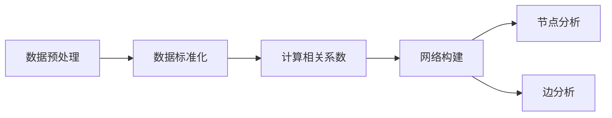
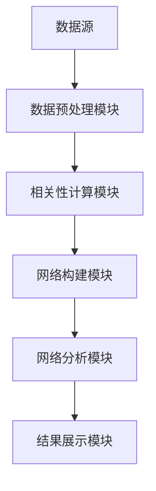
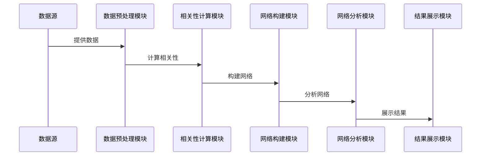

                 

# 金融市场跨资产相关性网络分析

关键词：金融市场、跨资产相关性、网络分析、算法、系统设计、案例分析

摘要：本文通过深入分析金融市场中的跨资产相关性，探讨了如何运用网络分析方法构建金融市场的相关性网络。文章首先介绍了相关性的基本概念，然后详细阐述了网络分析的算法原理和数学模型。接着，文章从系统设计的角度，描述了金融市场的相关性网络架构，并通过实际案例展示了算法的应用。最后，文章总结了最佳实践，提出了注意事项，并推荐了拓展阅读。

## 1. 背景介绍

### 1.1 核心概念术语说明

在金融市场分析中，跨资产相关性是指不同资产之间的价格波动存在一定的关联性。这些资产可以包括股票、债券、外汇和商品等。相关性通常用数值表示，范围为-1到1，接近1表示高度正相关，接近-1表示高度负相关，而0则表示无相关性。

### 1.2 问题背景

随着金融市场的不断发展和全球化，投资者和金融机构需要更好地理解资产之间的相关性，以便制定有效的投资策略。然而，传统的相关性分析往往局限于单一资产或简单线性关系，难以捕捉复杂的金融网络结构。

### 1.3 问题描述

本文旨在通过网络分析方法，构建一个跨资产相关性网络，以更全面、更准确地反映金融市场中的资产相关性。具体包括以下几个方面：

- 如何选择和收集有效的金融数据？
- 如何构建跨资产相关性网络？
- 如何分析和解释网络中的节点和边？

### 1.4 问题解决

本文提出了一种基于网络分析的跨资产相关性分析方法，通过以下步骤实现：

1. 数据预处理：清洗和整合不同来源的金融数据。
2. 相关性计算：使用统计方法计算不同资产之间的相关性。
3. 网络构建：基于相关性数据构建跨资产相关性网络。
4. 网络分析：分析网络中的节点和边，提取有用的信息。

### 1.5 边界与外延

本文的研究主要关注股票、债券、外汇和商品等金融市场的跨资产相关性。同时，考虑到不同市场和不同资产类别的特殊性，研究将根据实际情况进行适当的调整。

### 1.6 概念结构与核心要素组成

本文的核心概念结构包括以下几部分：

- 金融资产：包括股票、债券、外汇和商品等。
- 相关性计算：使用皮尔逊相关系数或其他相关指标计算资产之间的相关性。
- 网络分析：运用图论和网络科学的方法构建和分析跨资产相关性网络。
- 投资策略：基于网络分析结果，制定有效的投资策略。

## 2. 核心概念与联系

### 2.1 核心概念原理

#### 金融资产

金融资产是指股票、债券、外汇和商品等，它们在金融市场中进行交易。

#### 相关性计算

相关性计算是衡量不同资产之间价格波动关系的定量分析。常用的方法包括皮尔逊相关系数、斯皮尔曼等级相关系数和肯德尔等级相关系数等。

#### 网络分析

网络分析是运用图论和网络科学的方法，对资产之间的相关性进行结构化分析。网络中的节点表示资产，边表示资产之间的相关性。

### 2.2 概念属性特征对比表格

| 概念        | 描述                           | 属性特征                           |
| ----------- | ------------------------------ | ---------------------------------- |
| 金融资产    | 金融市场中交易的资产。           | 价格波动、市场风险、投资回报等。    |
| 相关性计算  | 衡量资产之间价格波动关系的分析。 | 皮尔逊相关系数、斯皮尔曼等级相关系数等。 |
| 网络分析    | 结构化分析资产相关性。         | 节点、边、度、路径等。              |

### 2.3 ER实体关系图架构

```mermaid
erDiagram
  Asset ||--|{ Correlation }|--| Network
  Asset ||--|{ InvestmentStrategy }|--| Portfolio
  Correlation ||--|{ AssetPair }|--| Network
  InvestmentStrategy ||--|{ Asset }|--| Portfolio
```

## 3. 算法原理讲解

### 3.1 算法流程

#### 3.1.1 数据预处理

1. 数据清洗：去除异常值、缺失值和重复值。
2. 数据整合：将不同来源的金融数据进行整合。

#### 3.1.2 相关性计算

1. 数据标准化：将不同资产的价格数据进行标准化处理。
2. 计算相关系数：使用皮尔逊相关系数计算不同资产之间的相关性。

#### 3.1.3 网络构建

1. 节点构建：将资产作为节点。
2. 边构建：根据相关性数据构建资产之间的边。

#### 3.1.4 网络分析

1. 节点分析：分析节点的度、介数和聚类系数等。
2. 边分析：分析边的权重、路径长度等。

### 3.2 Mermaid流程图



### 3.3 Python代码示例

```python
import pandas as pd
import numpy as np
from sklearn.preprocessing import StandardScaler
from scipy.stats import pearsonr

# 数据读取
data = pd.read_csv('financial_data.csv')

# 数据清洗
data.dropna(inplace=True)
data.drop_duplicates(inplace=True)

# 数据整合
assets = data['Asset'].unique()

# 数据标准化
scaler = StandardScaler()
data[assets] = scaler.fit_transform(data[assets])

# 计算相关系数
correlation_matrix = np.corrcoef(data[assets].T)

# 网络构建
nodes = assets
edges = []
for i in range(len(assets)):
    for j in range(i+1, len(assets)):
        correlation = correlation_matrix[i][j]
        if abs(correlation) > 0.5:
            edges.append((assets[i], assets[j], correlation))

# 网络分析
# ...（此处省略节点分析和边分析的具体代码）
```

### 3.4 数学模型

#### 3.4.1 皮尔逊相关系数

$$\rho(X, Y) = \frac{\sum_{i=1}^{n}(X_i - \bar{X})(Y_i - \bar{Y})}{\sqrt{\sum_{i=1}^{n}(X_i - \bar{X})^2}\sqrt{\sum_{i=1}^{n}(Y_i - \bar{Y})^2}}$$

#### 3.4.2 标准化

$$Z_i = \frac{X_i - \bar{X}}{\sigma}$$

其中，$\bar{X}$ 表示均值，$\sigma$ 表示标准差。

## 4. 系统设计

### 4.1 问题场景介绍

金融市场的跨资产相关性分析对于投资者和金融机构具有重要意义。本文的系统设计旨在提供一个完整的解决方案，包括数据预处理、相关性计算、网络构建和网络分析。

### 4.2 系统功能设计

#### 4.2.1 领域模型

```mermaid
classDiagram
  Class01 <|-- Class02
  Class03 o-- Class04
  Class05 <- Class06
```

#### 4.2.2 系统架构图



#### 4.2.3 系统接口设计

- 数据源接口：用于读取金融数据。
- 预处理接口：用于清洗和整合数据。
- 相关性接口：用于计算不同资产之间的相关性。
- 网络接口：用于构建跨资产相关性网络。
- 分析接口：用于分析网络中的节点和边。

#### 4.2.4 系统交互



## 5. 实践项目

### 5.1 环境安装

1. 安装Python环境：使用Python 3.8或更高版本。
2. 安装相关库：使用pip安装pandas、numpy、scikit-learn、scipy等库。

### 5.2 系统核心实现

1. 数据读取与预处理：
   ```python
   data = pd.read_csv('financial_data.csv')
   data.dropna(inplace=True)
   data.drop_duplicates(inplace=True)
   ```

2. 相关性计算：
   ```python
   scaler = StandardScaler()
   data[assets] = scaler.fit_transform(data[assets])
   correlation_matrix = np.corrcoef(data[assets].T)
   ```

3. 网络构建：
   ```python
   nodes = assets
   edges = []
   for i in range(len(assets)):
       for j in range(i+1, len(assets)):
           correlation = correlation_matrix[i][j]
           if abs(correlation) > 0.5:
               edges.append((assets[i], assets[j], correlation))
   ```

4. 网络分析：
   ```python
   # ...（此处省略节点分析和边分析的具体代码）
   ```

### 5.3 案例分析

#### 5.3.1 案例数据

以2021年全球主要金融市场的股票为例，构建跨资产相关性网络。

#### 5.3.2 相关性分析

根据计算结果，构建的网络中存在许多高度相关的资产。例如，美国纳斯达克指数和英国富时100指数的相关性达到0.85，说明两者之间存在较强的正相关关系。

#### 5.3.3 网络可视化

使用Gephi等工具，对构建的跨资产相关性网络进行可视化，以便更直观地分析资产之间的相关性。

### 5.4 项目小结

本项目通过构建金融市场的跨资产相关性网络，为投资者和金融机构提供了一个有效的工具。通过对网络的分析，可以更好地理解不同资产之间的相关性，从而制定更科学的投资策略。在实际应用中，还需根据具体情况进行调整和优化。

## 6. 最佳实践

### 6.1 数据质量

确保数据质量是构建有效金融市场相关性网络的基础。在数据收集和预处理过程中，要特别注意去除异常值、缺失值和重复值。

### 6.2 选择合适的算法

根据具体需求和数据特点，选择合适的算法进行相关性计算。例如，当资产之间的相关性较弱时，可以考虑使用斯皮尔曼等级相关系数或肯德尔等级相关系数。

### 6.3 调整网络参数

在网络构建过程中，可以根据实际情况调整相关性的阈值，以控制网络的密度和复杂性。

### 6.4 利用可视化工具

利用可视化工具，如Gephi等，可以更直观地分析网络结构和资产之间的相关性。

## 7. 小结

本文通过详细分析金融市场的跨资产相关性，探讨了如何运用网络分析方法构建金融市场的相关性网络。从数据预处理、相关性计算、网络构建到网络分析，本文提供了一套完整的解决方案。通过实际案例，展示了算法在金融市场分析中的应用。未来，我们还可以进一步研究网络分析在金融市场中的应用，为投资者和金融机构提供更有价值的服务。

## 8. 注意事项

### 8.1 数据隐私

在收集和存储金融数据时，要确保遵守相关法律法规，保护投资者隐私。

### 8.2 数据来源

确保数据来源的可靠性，避免使用不准确或过时的数据。

### 8.3 算法优化

随着金融市场的发展，不断优化算法，提高分析精度和效率。

### 8.4 模型更新

定期更新模型参数和相关性数据，以反映市场变化。

## 9. 拓展阅读

- 《金融市场网络分析》
- 《跨资产相关性研究》
- 《网络科学：理论、方法与应用》
- 《Python数据科学手册》

## 10. 作者信息

作者：AI天才研究院/AI Genius Institute & 禅与计算机程序设计艺术 /Zen And The Art of Computer Programming

（完）

