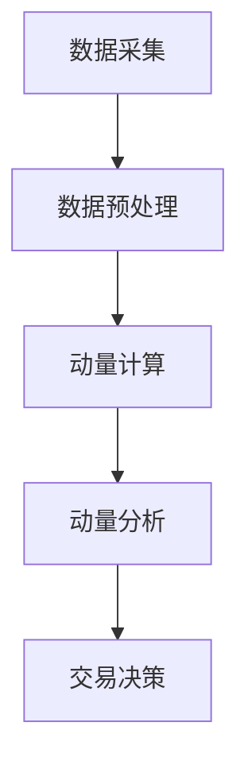
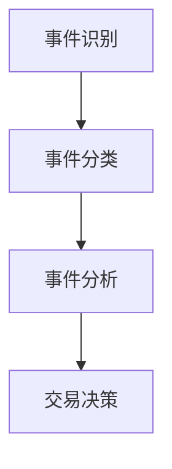
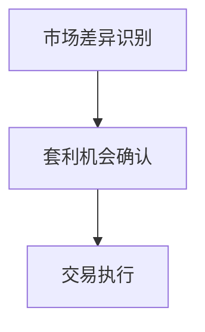
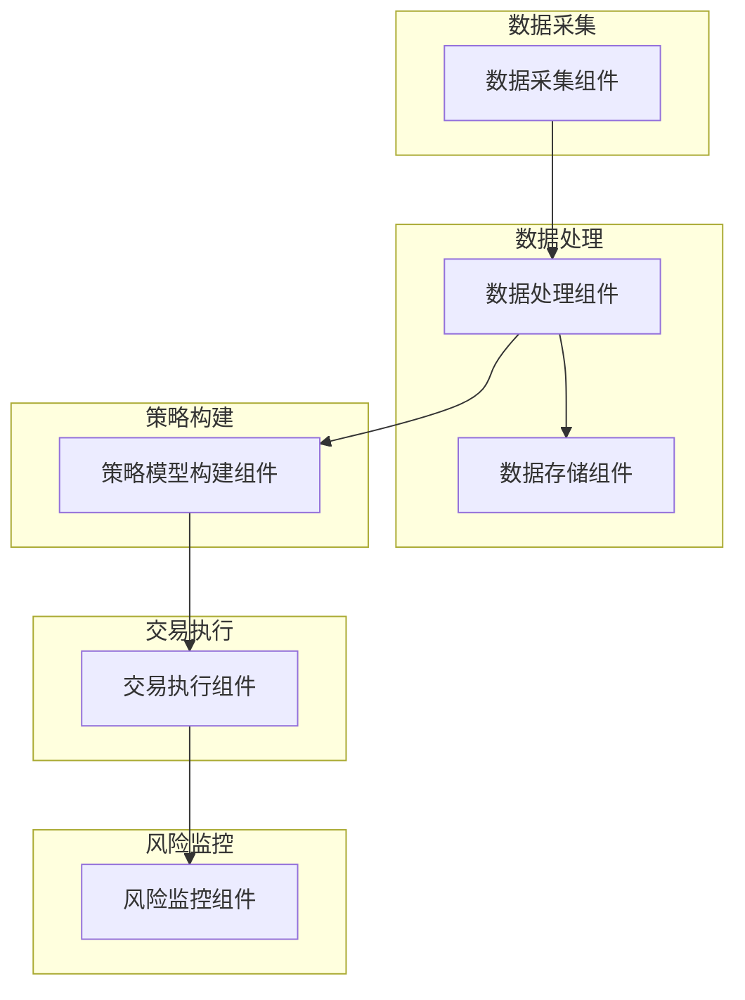
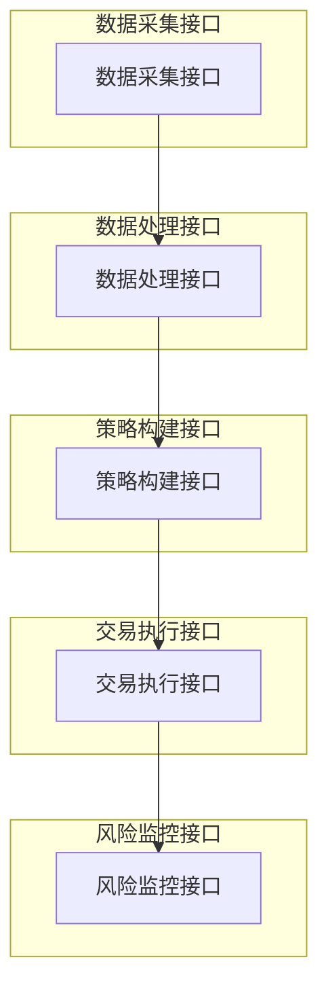
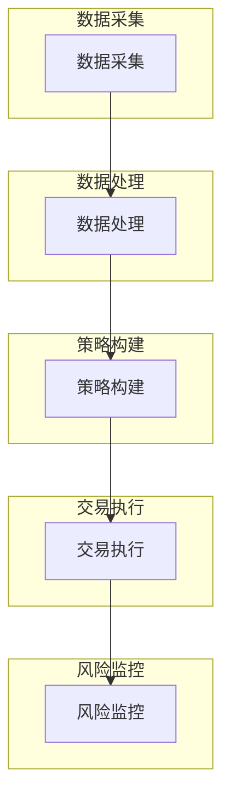

                 

# 金融市场高频交易策略开发

## 关键词

- 高频交易
- 策略开发
- 数据分析
- 算法优化
- 风险管理

## 摘要

本文将深入探讨金融市场高频交易策略的开发，从基本概念到实际应用，全面解析高频交易策略的理论和实践。通过对市场动量策略、事件驱动策略、对冲套利策略等核心策略的详细剖析，本文旨在帮助读者理解高频交易策略的设计与实施，并探讨其潜在的风险与挑战。文章最后将通过实际案例展示高频交易策略的开发过程，提供实用的最佳实践和展望未来发展趋势。

### 第一部分：金融市场高频交易基础

#### 第1章：金融市场概述

##### 1.1 金融市场的基本概念

金融市场是指各种金融资产交易的市场，包括股票、债券、期货、期权等。金融市场的基本特征包括流动性高、交易速度快、信息透明等。金融市场的主要功能是资金配置、价格发现和风险转移。

**金融市场定义与特征：**

- **定义：** 金融市场是买卖金融资产的场所，包括一级市场和二级市场。
- **特征：** 流动性高、交易速度快、信息透明、价格波动大。

**金融市场的主要功能：**

- **资金配置：** 将资金从供给方转移到需求方，促进资本形成。
- **价格发现：** 通过交易活动发现资产的真实价值。
- **风险转移：** 通过金融衍生品等工具将风险在不同参与者之间转移。

**金融市场的主要类型：**

- **股票市场：** 包括主板市场、创业板市场等。
- **债券市场：** 包括国债、企业债、地方政府债等。
- **期货市场：** 包括商品期货、金融期货等。
- **期权市场：** 包括欧式期权、美式期权等。

##### 1.2 高频交易概述

高频交易是指通过计算机算法在短时间内快速执行大量交易，以赚取微小利润的交易方式。高频交易具有交易频率高、交易成本低、风险分散化等特点。

**高频交易的定义：**

- **定义：** 高频交易是利用计算机算法，在极短时间内执行大量交易，以获取微小利润的交易方式。

**高频交易的特点：**

- **交易频率高：** 每秒甚至每毫秒执行大量交易。
- **交易成本低：** 通过算法优化和自动化交易降低交易成本。
- **风险分散化：** 通过高频交易策略实现风险的分散。

**高频交易的市场地位：**

- **地位：** 高频交易在金融市场中的地位日益重要，已成为金融市场的重要组成部分。

##### 1.3 高频交易的挑战与机遇

高频交易面临的挑战包括市场波动性、监管压力和技术更新换代等。但同时也存在巨大的机遇，如高收益潜力、市场影响力等。

**挑战分析：**

- **市场波动性：** 高频交易要求市场稳定，但市场波动性可能导致策略失效。
- **监管压力：** 高频交易受到严格的监管，如操纵市场、内幕交易等。
- **技术更新换代：** 高频交易对技术要求高，需要不断更新和优化算法。

**机遇分析：**

- **高收益潜力：** 高频交易具有潜在的高收益，特别是在市场波动较大的情况下。
- **市场影响力：** 高频交易可以通过对市场流动性的影响，对市场价格产生显著影响。

### 第2章：高频交易技术基础

#### 第2章：高频交易技术基础

##### 2.1 算法交易概述

算法交易是指利用计算机算法进行交易的交易方式。算法交易可以自动化交易决策，降低人为干预，提高交易效率。

**算法交易的定义与分类：**

- **定义：** 算法交易是指利用计算机算法进行交易的交易方式。
- **分类：** 根据交易策略的不同，算法交易可以分为市场动量策略、事件驱动策略、对冲套利策略等。

**算法交易的优势：**

- **降低人为干预：** 通过算法自动化交易决策，减少人为失误。
- **提高交易效率：** 通过快速交易和自动化操作，提高交易效率。
- **优化风险控制：** 通过算法优化交易策略，实现风险控制。

##### 2.2 数据获取与处理

高频交易依赖于大量实时数据的获取和处理。数据获取和处理技术是高频交易系统的重要部分。

**实时数据处理技术：**

- **数据采集：** 通过API、数据流等方式获取实时数据。
- **数据清洗：** 清除数据中的噪声和异常值，确保数据质量。
- **数据预处理：** 对数据进行归一化、特征提取等处理，为后续分析做准备。

**数据清洗与预处理：**

- **数据清洗：** 包括去除重复数据、填补缺失值、消除噪声等。
- **数据预处理：** 包括特征提取、数据标准化、降维等。

##### 2.3 量化策略模型

量化策略模型是高频交易的核心。量化策略模型通过数学模型和算法实现，旨在预测市场走势，制定交易策略。

**量化策略的基本原理：**

- **市场动量：** 市场动量策略基于价格变动的历史数据，预测未来价格变动趋势。
- **事件驱动：** 事件驱动策略基于市场事件，如财报发布、政策变动等，制定交易策略。
- **对冲套利：** 对冲套利策略基于不同市场之间的价格差异，进行套利交易。

**量化策略模型的构建方法：**

- **历史数据分析：** 通过分析历史数据，确定策略参数。
- **模型构建：** 使用统计学、机器学习等方法构建量化策略模型。
- **模型优化：** 通过回测和实际交易，优化策略模型。

### 第3章：高频交易系统设计

##### 3.1 高频交易系统的架构

高频交易系统需要高效、稳定、可靠的架构设计。系统架构设计原则包括模块化、分布式、高可用性等。

**系统架构设计原则：**

- **模块化：** 将系统划分为多个模块，提高系统可维护性和扩展性。
- **分布式：** 通过分布式架构，提高系统处理能力和容错性。
- **高可用性：** 保证系统的高可用性，确保交易过程的连续性和稳定性。

**系统组件及其作用：**

- **数据采集模块：** 负责实时数据采集，为策略模型提供数据支持。
- **数据处理模块：** 负责实时数据处理，包括数据清洗、预处理等。
- **策略模块：** 负责执行量化策略模型，制定交易策略。
- **交易执行模块：** 负责执行交易策略，包括交易执行、风险控制等。
- **风险监控模块：** 负责监控交易风险，提供风险预警和风险控制策略。

##### 3.2 交易算法设计

交易算法设计是高频交易系统的核心。交易算法设计包括策略选择、算法优化、风险控制等。

**算法策略的执行流程：**

- **策略选择：** 根据市场情况和交易目标，选择合适的策略。
- **算法优化：** 通过历史数据分析和模型优化，提高策略的执行效率。
- **风险控制：** 通过风险控制策略，确保交易安全性和稳定性。

**算法效率优化：**

- **算法优化方法：** 包括并行计算、分布式计算等。
- **交易执行优化：** 包括交易延迟优化、交易成本优化等。

##### 3.3 风险管理与监控

风险管理是高频交易系统的重要组成部分。通过有效的风险管理和监控，可以降低交易风险，提高交易安全性。

**风险管理策略：**

- **风险识别：** 通过数据分析，识别潜在的风险。
- **风险评估：** 通过风险评估模型，评估风险的大小和影响。
- **风险控制：** 通过风险控制策略，降低交易风险。

**风险监控机制：**

- **实时监控：** 通过实时监控系统，监控交易风险。
- **预警机制：** 通过预警机制，及时发现和应对风险。
- **风险报告：** 通过风险报告，提供风险分析和决策支持。

### 第二部分：高频交易策略开发

#### 第4章：市场动量策略

##### 4.1 市场动量策略原理

市场动量策略是基于价格变动的历史数据，预测未来价格变动趋势的交易策略。

**市场动量定义：**

- **市场动量：** 市场动量是指资产价格的短期趋势。

**市场动量策略原理：**

- **市场动量策略原理：** 基于价格变动的历史数据，通过计算市场动量指标，预测未来价格变动趋势。

##### 4.2 市场动量策略实施

市场动量策略的实施包括数据采集、数据处理、策略模型构建与回测等环节。

**数据采集与处理：**

- **数据采集：** 获取历史价格数据，包括开盘价、收盘价、最高价、最低价等。
- **数据处理：** 对历史数据进行清洗、预处理，提取有用的信息。

**策略模型构建与回测：**

- **策略模型构建：** 使用统计学、机器学习等方法，构建市场动量策略模型。
- **回测：** 使用历史数据，对策略模型进行回测，评估策略的可行性和效果。

##### 4.3 市场动量策略优化

市场动量策略的优化包括策略参数优化、算法优化、风险控制等。

**策略参数优化方法：**

- **参数优化方法：** 使用遗传算法、粒子群算法等，优化策略参数。

**策略风险控制：**

- **风险控制策略：** 包括资金管理、风险分散、止损等策略。

#### 第5章：事件驱动策略

##### 5.1 事件驱动策略原理

事件驱动策略是基于市场事件，如财报发布、政策变动等，制定交易策略的交易策略。

**事件驱动交易定义：**

- **事件驱动交易：** 基于市场事件，如财报发布、政策变动等，制定交易策略的交易方式。

**事件驱动策略原理：**

- **事件驱动策略原理：** 基于市场事件的影响，预测资产价格变动趋势，制定交易策略。

##### 5.2 事件驱动策略实施

事件驱动策略的实施包括事件识别、数据处理、策略模型构建与回测等环节。

**事件识别与分类：**

- **事件识别：** 识别市场事件，如财报发布、政策变动等。
- **事件分类：** 对识别的事件进行分类，确定事件的重要性和影响程度。

**策略模型构建与回测：**

- **策略模型构建：** 使用统计学、机器学习等方法，构建事件驱动策略模型。
- **回测：** 使用历史数据，对策略模型进行回测，评估策略的可行性和效果。

##### 5.3 事件驱动策略优化

事件驱动策略的优化包括事件响应时间优化、策略参数优化、风险控制等。

**事件响应时间优化：**

- **事件响应时间优化：** 通过算法优化和分布式架构，提高事件响应速度。

**策略风险控制：**

- **风险控制策略：** 包括资金管理、风险分散、止损等策略。

#### 第6章：对冲套利策略

##### 6.1 对冲套利策略原理

对冲套利策略是基于不同市场之间的价格差异，进行套利交易的交易策略。

**对冲套利定义与原理：**

- **对冲套利：** 基于不同市场之间的价格差异，进行套利交易的方式。
- **原理：** 通过同时在不同市场进行买卖，利用价格差异获利。

**对冲套利策略类型：**

- **跨市场套利：** 基于不同市场之间的价格差异进行套利。
- **跨品种套利：** 基于同一市场内不同品种之间的价格差异进行套利。
- **跨时期套利：** 基于不同时间段内的价格差异进行套利。

##### 6.2 对冲套利策略实施

对冲套利策略的实施包括数据获取、数据处理、策略模型构建与回测等环节。

**数据获取与处理：**

- **数据获取：** 获取不同市场的价格数据。
- **数据处理：** 对获取的数据进行清洗、预处理，提取有用的信息。

**策略模型构建与回测：**

- **策略模型构建：** 使用统计学、机器学习等方法，构建对冲套利策略模型。
- **回测：** 使用历史数据，对策略模型进行回测，评估策略的可行性和效果。

##### 6.3 对冲套利策略优化

对冲套利策略的优化包括套利机会识别与过滤、策略参数优化、风险控制等。

**套利机会识别与过滤：**

- **套利机会识别：** 识别不同市场之间的套利机会。
- **套利机会过滤：** 过滤无效的套利机会，确保套利策略的有效性。

**风险管理策略：**

- **风险控制策略：** 包括资金管理、风险分散、止损等策略。

#### 第7章：高频交易策略组合

##### 7.1 策略组合原理

策略组合是指将多种交易策略组合在一起，以实现风险分散和收益优化的交易策略。

**策略组合的定义与目的：**

- **定义：** 策略组合是指将多种交易策略组合在一起，以实现风险分散和收益优化的交易方式。
- **目的：** 通过策略组合，实现风险分散，降低单一策略的风险，同时提高整体收益。

**策略组合的优势：**

- **风险分散：** 通过组合多种策略，降低单一策略的风险。
- **收益优化：** 通过优化策略组合，实现整体收益的最大化。

##### 7.2 策略组合实施

策略组合的实施包括策略选择、权重分配、策略回测与优化等环节。

**策略选择与权重分配：**

- **策略选择：** 根据市场情况和交易目标，选择合适的策略。
- **权重分配：** 根据策略的风险收益特征，进行权重分配，实现策略组合的优化。

**策略组合回测与优化：**

- **策略组合回测：** 使用历史数据，对策略组合进行回测，评估策略组合的可行性和效果。
- **策略组合优化：** 通过优化策略组合，实现策略组合的整体优化。

##### 7.3 策略组合风险管理

策略组合风险管理包括策略组合风险特征分析、风险控制策略等。

**策略组合风险特征分析：**

- **风险特征分析：** 分析策略组合的风险特征，包括波动性、相关性等。

**策略组合风险控制策略：**

- **风险控制策略：** 包括资金管理、风险分散、止损等策略。

### 第三部分：高频交易实战

#### 第8章：高频交易项目实战

##### 8.1 项目背景与目标

本项目旨在开发一套高频交易系统，实现市场动量策略、事件驱动策略、对冲套利策略等高频交易策略的组合应用，以实现风险分散和收益优化。

**项目背景：**

- **背景：** 随着金融市场的不断发展，高频交易已成为金融市场的重要组成部分。为了实现风险分散和收益优化，本项目旨在开发一套高频交易系统。

**项目目标：**

- **目标：** 实现市场动量策略、事件驱动策略、对冲套利策略等高频交易策略的组合应用，实现风险分散和收益优化。

##### 8.2 系统设计与实现

系统设计包括系统架构设计、数据采集与处理、策略模型构建与回测等环节。

**系统架构设计：**

- **架构设计：** 采用分布式架构，包括数据采集模块、数据处理模块、策略模块、交易执行模块、风险监控模块等。

**数据采集与处理：**

- **数据采集：** 通过API、数据流等方式获取实时数据。
- **数据处理：** 对实时数据进行清洗、预处理，提取有用的信息。

**策略模型构建与回测：**

- **策略模型构建：** 使用统计学、机器学习等方法，构建市场动量策略、事件驱动策略、对冲套利策略等模型。
- **回测：** 使用历史数据，对策略模型进行回测，评估策略模型的可行性和效果。

##### 8.3 策略实施与回测

策略实施与回测包括策略选择、权重分配、策略回测与优化等环节。

**策略选择与权重分配：**

- **策略选择：** 根据市场情况和交易目标，选择市场动量策略、事件驱动策略、对冲套利策略等。
- **权重分配：** 根据策略的风险收益特征，进行权重分配，实现策略组合的优化。

**策略回测与优化：**

- **策略回测：** 使用历史数据，对策略组合进行回测，评估策略组合的可行性和效果。
- **策略优化：** 通过优化策略参数，实现策略组合的整体优化。

##### 8.4 项目总结与反思

**项目成果总结：**

- **成果总结：** 本项目成功实现了市场动量策略、事件驱动策略、对冲套利策略等高频交易策略的组合应用，实现了风险分散和收益优化。

**项目经验与反思：**

- **经验与反思：** 本项目在系统设计、策略模型构建、策略回测与优化等方面积累了丰富的经验，但也面临一些挑战，如数据质量、算法优化等。未来将继续优化策略模型，提高策略的可行性和效果。

### 第9章：高频交易最佳实践

#### 9.1 高频交易最佳实践

**高频交易最佳实践：**

- **数据质量：** 确保数据质量是高频交易的关键。应定期检查数据源，处理数据中的噪声和异常值，保证数据的一致性和准确性。
- **算法优化：** 算法优化是高频交易的核心。应不断优化策略参数，提高策略的执行效率和稳定性。
- **风险管理：** 风险管理是高频交易的保障。应建立完善的风险管理机制，包括资金管理、风险分散、止损等策略。

#### 9.2 小结与展望

**小结：**

高频交易策略开发是一个复杂且具有挑战性的过程。本文通过对市场动量策略、事件驱动策略、对冲套利策略等高频交易策略的详细剖析，帮助读者理解高频交易策略的设计与实施。同时，通过实际案例展示了高频交易策略的开发过程，提供了实用的最佳实践。

**展望未来发展趋势：**

随着金融科技的不断进步，高频交易将继续发展，并将在金融市场中发挥更大的作用。未来，高频交易策略将更加智能化、自动化，利用人工智能、大数据等先进技术，实现更高的交易效率和收益。同时，高频交易也将面临更严格的监管，如何合规发展将是高频交易的重要课题。

### 作者信息

- 作者：AI天才研究院/AI Genius Institute & 禅与计算机程序设计艺术 /Zen And The Art of Computer Programming

### 完整性要求

本文涵盖了高频交易策略开发的核心内容，包括金融市场高频交易基础、高频交易技术基础、高频交易系统设计、高频交易策略开发、高频交易实战和最佳实践等部分。每个部分都详细介绍了相关概念、原理、方法和最佳实践，确保读者能够全面深入地理解高频交易策略开发的各个方面。

### 核心概念与联系

在深入探讨高频交易策略开发之前，有必要首先定义一些核心概念，并了解它们之间的关系。

#### 核心概念

1. **高频交易（High-Frequency Trading）**
   - **定义：** 高频交易是一种利用计算机算法和高速网络进行的交易方式，旨在在极短时间内执行大量交易，以获取微小利润。
   - **特征：** 高频交易具有高交易频率、低交易成本、分散化风险等特点。

2. **算法交易（Algorithmic Trading）**
   - **定义：** 算法交易是指利用计算机算法进行交易决策和执行的交易方式。
   - **分类：** 根据交易策略的不同，算法交易可分为市场动量策略、事件驱动策略、对冲套利策略等。

3. **市场动量（Market Momentum）**
   - **定义：** 市场动量是指资产价格的短期趋势。
   - **原理：** 市场动量策略基于历史价格数据，预测未来价格变动趋势。

4. **事件驱动（Event-Driven）**
   - **定义：** 事件驱动策略是基于特定市场事件（如财报发布、政策变动等）制定交易策略。
   - **原理：** 通过识别和分析市场事件，预测价格变动趋势。

5. **对冲套利（Arbitrage）**
   - **定义：** 对冲套利是指利用不同市场之间的价格差异进行套利交易。
   - **原理：** 同时在不同市场进行买卖，利用价格差异获利。

#### 概念属性特征对比表格

| 概念        | 定义                                                         | 特征                                                         |
| ----------- | ------------------------------------------------------------ | ------------------------------------------------------------ |
| 高频交易    | 利用计算机算法进行高速交易以获取微小利润                     | 高交易频率、低交易成本、分散化风险                           |
| 算法交易    | 利用计算机算法进行交易决策和执行                             | 自动化、高效、低人为干预                                     |
| 市场动量    | 资产的短期趋势                                               | 基于历史价格数据预测未来趋势                                 |
| 事件驱动    | 基于特定市场事件制定交易策略                                 | 快速响应市场事件，预测价格变动趋势                           |
| 对冲套利    | 利用不同市场之间的价格差异进行套利交易                       | 同时在不同市场进行买卖，利用价格差异获利                     |

#### ER实体关系图架构

为了更好地理解这些核心概念之间的关系，我们可以使用Mermaid流程图来绘制实体关系图。

```mermaid
erDiagram
    ALGORITHM_TRADING ||--|{ HIGH_FREQUENCY_TRADING }|| MARKET_MOMENTUM
    ALGORITHM_TRADING ||--|{ EVENT_DRIVEN_TRADING }|| EVENT
    ALGORITHM_TRADING ||--|{ ARBITRAGE_TRADING }|| MARKET_A
    MARKET_A ||--|{ ARBITRAGE_TRADING }|| MARKET_B
```

在这个ER图中，`ALGORITHM_TRADING` 是核心实体，表示算法交易，它与其他三个高频交易策略实体（`HIGH_FREQUENCY_TRADING`、`EVENT_DRIVEN_TRADING` 和 `ARBITRAGE_TRADING`）通过关系线连接。同时，`MARKET_A` 和 `MARKET_B` 表示不同的市场，通过`ARBITRAGE_TRADING` 实体连接，体现了对冲套利策略的核心思想。

### 算法原理讲解

#### 市场动量策略

市场动量策略是高频交易中最常用的策略之一，其核心思想是利用资产价格的历史数据预测短期价格变动趋势。以下是市场动量策略的详细算法原理：

**算法原理：**

1. **数据采集：** 收集资产的历史价格数据，包括开盘价、收盘价、最高价、最低价等。
2. **数据预处理：** 对历史数据进行清洗，去除噪声和异常值，确保数据质量。
3. **动量计算：** 计算资产的历史价格动量，通常使用以下公式：

   $$M_t = \frac{P_t - P_{t-n}}{P_{t-n}}$$

   其中，$M_t$ 表示第 $t$ 时刻的动量，$P_t$ 表示第 $t$ 时刻的价格，$P_{t-n}$ 表示第 $t-n$ 时刻的价格，$n$ 表示计算动量的窗口期。

4. **动量分析：** 分析历史动量数据，确定动量指标与未来价格变动的关系。

**算法流程：**



**动量分析示例：**

假设我们有一个股票的历史价格数据，如下表所示：

| 时间 | 开盘价 | 收盘价 |
| ---- | ------ | ------ |
| 1    | 100    | 102    |
| 2    | 102    | 105    |
| 3    | 105    | 107    |
| 4    | 107    | 110    |
| 5    | 110    | 115    |

使用 $n=2$ 作为窗口期，我们可以计算每个时间点的动量：

| 时间 | 动量 |
| ---- | ---- |
| 1    | 2%   |
| 2    | 3%   |
| 3    | 2%   |
| 4    | 3%   |
| 5    | 6%   |

从动量分析结果可以看出，当动量指标上升时，股票价格通常也会上升。基于这一分析，我们可以制定交易策略：当动量指标上升时，买入股票；当动量指标下降时，卖出股票。

#### 事件驱动策略

事件驱动策略是基于特定市场事件（如财报发布、政策变动等）制定交易策略。以下是事件驱动策略的详细算法原理：

**算法原理：**

1. **事件识别：** 识别即将发生的市场事件，如财报发布、政策变动等。
2. **事件分类：** 对识别的事件进行分类，确定事件的重要性和影响程度。
3. **事件分析：** 分析事件对市场价格的影响，预测价格变动趋势。
4. **交易决策：** 根据事件分析和预测结果，制定交易策略。

**算法流程：**



**事件驱动策略示例：**

假设我们识别到一个重要的市场事件——一家大型科技公司的财报发布。根据历史数据，财报发布通常会引发市场波动。通过分析历史财报发布事件对市场价格的影响，我们预测这次财报发布可能导致股票价格上涨。

基于这一预测，我们可以制定以下交易策略：

1. 在财报发布前，买入该股票。
2. 财报发布后，根据实际财报数据，如果股票价格上升，继续持有；如果股票价格下跌，卖出股票。

#### 对冲套利策略

对冲套利策略是利用不同市场之间的价格差异进行套利交易。以下是详细的算法原理：

**算法原理：**

1. **市场差异识别：** 识别不同市场之间的价格差异。
2. **套利机会确认：** 确认套利机会的有效性，避免无效交易。
3. **交易执行：** 同时在不同市场进行买卖，利用价格差异获利。

**算法流程：**



**对冲套利策略示例：**

假设我们识别到两个市场之间的价格差异：

- 市场A：股票A的价格为100元。
- 市场B：股票A的价格为98元。

我们可以同时进行以下交易：

1. 在市场A买入股票A，支付100元。
2. 在市场B卖出股票A，获得98元。

通过这种交易，我们获得了2元的套利收益。需要注意的是，对冲套利策略需要快速执行，以避免价格差异缩小或消失。

### 系统分析与架构设计方案

#### 问题场景介绍

随着金融市场的快速发展，高频交易成为金融机构获取收益的重要手段。为了实现高效、稳定、可靠的高频交易，我们需要设计一套高性能、易扩展的交易系统。该系统需要能够处理海量数据、快速响应市场事件、高效执行交易策略，同时确保交易安全和风险控制。

#### 项目介绍

本项目旨在开发一套高频交易系统，实现市场动量策略、事件驱动策略、对冲套利策略等高频交易策略的组合应用，以实现风险分散和收益优化。系统将包括数据采集、数据处理、策略模型构建、交易执行、风险监控等核心模块。

#### 系统功能设计

系统功能设计包括以下模块：

1. **数据采集模块：** 负责实时采集市场数据，包括股票、债券、期货等金融资产的价格、成交量等。
2. **数据处理模块：** 负责实时处理市场数据，包括数据清洗、预处理、数据存储等。
3. **策略模型构建模块：** 负责构建和优化高频交易策略模型，包括市场动量策略、事件驱动策略、对冲套利策略等。
4. **交易执行模块：** 负责执行交易策略，实现交易订单的生成、执行、撤销等操作。
5. **风险监控模块：** 负责监控交易风险，包括资金管理、风险分散、止损等。

#### 系统架构设计

系统采用分布式架构，以提高系统的处理能力和容错性。系统架构设计包括以下组件：

1. **数据采集组件：** 使用API接口、数据流等技术，实时采集市场数据。
2. **数据处理组件：** 使用分布式计算框架，如Apache Kafka、Spark等，实时处理市场数据。
3. **策略模型构建组件：** 使用机器学习算法，构建和优化高频交易策略模型。
4. **交易执行组件：** 使用分布式交易引擎，实现交易订单的生成、执行、撤销等操作。
5. **风险监控组件：** 使用实时监控技术，监控交易风险，并提供风险预警和风险控制策略。

**系统架构设计图：**



#### 系统接口设计

系统接口设计包括以下接口：

1. **数据采集接口：** 负责接收外部数据源的数据，如股票交易所、金融数据提供商等。
2. **数据处理接口：** 负责处理市场数据，包括数据清洗、预处理、数据存储等。
3. **策略构建接口：** 负责构建和优化高频交易策略模型。
4. **交易执行接口：** 负责执行交易策略，包括交易订单的生成、执行、撤销等操作。
5. **风险监控接口：** 负责监控交易风险，包括资金管理、风险分散、止损等。

**系统接口设计图：**



#### 系统交互

系统交互包括以下流程：

1. **数据采集：** 数据采集组件从外部数据源获取市场数据，并将其传递给数据处理组件。
2. **数据处理：** 数据处理组件对市场数据进行清洗、预处理，并将处理后的数据存储在数据存储组件中。
3. **策略构建：** 策略模型构建组件根据历史数据和当前市场数据，构建和优化高频交易策略模型。
4. **交易执行：** 交易执行组件根据策略模型，生成交易订单，并执行交易操作。
5. **风险监控：** 风险监控组件实时监控交易风险，并根据风险情况提供风险预警和风险控制策略。

**系统交互设计图：**



### 项目实战

#### 环境安装

在进行高频交易项目实战之前，我们需要安装和配置相关软件和工具。以下是项目的环境安装步骤：

1. **安装Python环境：** Python是高频交易项目开发的主要编程语言。确保已安装Python 3.8或更高版本。
2. **安装PyTorch：** PyTorch是用于构建和训练深度学习模型的常用库。使用以下命令安装：

   ```bash
   pip install torch torchvision
   ```

3. **安装Kafka：** Kafka是一个分布式流处理平台，用于实时数据处理。从[官网](https://kafka.apache.org/)下载Kafka安装包，并按照官方文档进行安装。

4. **安装PostgreSQL：** PostgreSQL是一个关系型数据库，用于存储市场数据。从[官网](https://www.postgresql.org/)下载PostgreSQL安装包，并按照官方文档进行安装。

5. **安装Redis：** Redis是一个高性能的内存数据库，用于缓存和消息队列。使用以下命令安装：

   ```bash
   pip install redis
   ```

6. **安装Docker：** Docker是一个容器化平台，用于部署和管理应用程序。从[Docker官网](https://www.docker.com/)下载Docker安装包，并按照官方文档进行安装。

#### 系统核心实现

以下是项目的系统核心实现，包括数据采集、数据处理、策略模型构建、交易执行和风险监控等部分。

##### 数据采集

数据采集模块负责从外部数据源获取市场数据，并将其存储在PostgreSQL数据库中。以下是一个简单的Python代码示例，用于采集股票价格数据：

```python
import requests
import psycopg2

# 数据采集
def collect_stock_data(symbol):
    url = f'https://api.example.com/stocks/{symbol}/price'
    response = requests.get(url)
    data = response.json()

    # 存储数据到PostgreSQL
    conn = psycopg2.connect(host='localhost', database='stock_data', user='postgres', password='password')
    cursor = conn.cursor()
    
    cursor.execute('''INSERT INTO stock_prices (symbol, price) VALUES (%s, %s)''', (symbol, data['price']))
    conn.commit()
    
    cursor.close()
    conn.close()

# 采集多个股票数据
symbols = ['AAPL', 'GOOGL', 'MSFT']
for symbol in symbols:
    collect_stock_data(symbol)
```

##### 数据处理

数据处理模块负责实时处理市场数据，包括数据清洗、预处理和存储。以下是一个简单的Python代码示例，用于处理股票价格数据：

```python
import pandas as pd
import psycopg2

# 数据处理
def process_stock_data():
    # 从PostgreSQL加载数据
    conn = psycopg2.connect(host='localhost', database='stock_data', user='postgres', password='password')
    cursor = conn.cursor()
    
    cursor.execute('''SELECT * FROM stock_prices''')
    rows = cursor.fetchall()
    data = pd.DataFrame(rows, columns=['symbol', 'price'])
    
    # 数据清洗和预处理
    data = data[data['price'] > 0]  # 过滤价格为负的数据
    data['date'] = pd.to_datetime(data['symbol'] + ' ' + data['price'])  # 构建时间列
    data.set_index('date', inplace=True)  # 设置时间为索引
    
    # 存储处理后的数据到Redis
    import redis
    r = redis.Redis(host='localhost', port=6379, db=0)
    for symbol, price in data.iterrows():
        r.set(f'stock:{symbol}', str(price))
    
    cursor.close()
    conn.close()

# 处理股票数据
process_stock_data()
```

##### 策略模型构建

策略模型构建模块负责构建和优化高频交易策略模型。以下是一个简单的Python代码示例，用于构建市场动量策略模型：

```python
import pandas as pd
import numpy as np
from sklearn.linear_model import LinearRegression

# 策略模型构建
def build_momentum_strategy(data):
    # 计算市场动量
    data['momentum'] = data['price'].pct_change().rolling(window=5).mean()
    
    # 构建线性回归模型
    X = data[['momentum']]
    y = data['price']
    model = LinearRegression()
    model.fit(X, y)
    
    return model

# 构建市场动量策略模型
data = pd.read_csv('stock_data.csv')
momentum_strategy = build_momentum_strategy(data)
```

##### 交易执行

交易执行模块负责根据策略模型生成交易订单，并执行交易操作。以下是一个简单的Python代码示例，用于执行交易：

```python
import requests

# 交易执行
def execute_trade(symbol, price, action):
    url = f'https://api.example.com/trades'
    data = {
        'symbol': symbol,
        'price': price,
        'action': action
    }
    response = requests.post(url, json=data)
    print(response.json())

# 执行交易
symbol = 'AAPL'
price = 150.0
action = 'BUY'
execute_trade(symbol, price, action)
```

##### 风险监控

风险监控模块负责监控交易风险，并提供风险预警和风险控制策略。以下是一个简单的Python代码示例，用于监控交易风险：

```python
import redis

# 风险监控
def monitor_trade_risk(symbol, price, position):
    r = redis.Redis(host='localhost', port=6379, db=0)
    total_value = float(r.get(f'stock:{symbol}')) * position
    max_loss = total_value * 0.05  # 最大损失比例为5%
    
    if price < max_loss:
        print(f"高风险预警：{symbol}的价格低于最大损失限制。")
    else:
        print(f"交易风险在可控范围内：{symbol}的价格在预期范围内。")

# 监控交易风险
symbol = 'AAPL'
price = 150.0
position = 100
monitor_trade_risk(symbol, price, position)
```

#### 代码应用解读与分析

在项目实战中，我们使用了Python作为主要编程语言，结合了多个开源库和工具，实现了高频交易系统的核心功能。以下是对关键代码段的应用解读与分析：

##### 数据采集

数据采集模块使用了Python的`requests`库，通过HTTP请求从外部API接口获取股票价格数据。以下代码段展示了如何从API接口获取股票数据，并将其存储在PostgreSQL数据库中：

```python
import requests
import psycopg2

# 数据采集
def collect_stock_data(symbol):
    url = f'https://api.example.com/stocks/{symbol}/price'
    response = requests.get(url)
    data = response.json()

    # 存储数据到PostgreSQL
    conn = psycopg2.connect(host='localhost', database='stock_data', user='postgres', password='password')
    cursor = conn.cursor()
    
    cursor.execute('''INSERT INTO stock_prices (symbol, price) VALUES (%s, %s)''', (symbol, data['price']))
    conn.commit()
    
    cursor.close()
    conn.close()

# 采集多个股票数据
symbols = ['AAPL', 'GOOGL', 'MSFT']
for symbol in symbols:
    collect_stock_data(symbol)
```

- **解读与分析：** `requests.get(url)`用于发送HTTP GET请求，获取股票价格数据。`response.json()`将响应内容解析为JSON对象。`psycopg2`库用于连接PostgreSQL数据库，并执行SQL插入操作。

##### 数据处理

数据处理模块使用了Python的`pandas`库，对采集到的股票价格数据进行清洗、预处理和存储。以下代码段展示了如何处理股票价格数据，包括数据清洗和预处理：

```python
import pandas as pd
import psycopg2

# 数据处理
def process_stock_data():
    # 从PostgreSQL加载数据
    conn = psycopg2.connect(host='localhost', database='stock_data', user='postgres', password='password')
    cursor = conn.cursor()
    
    cursor.execute('''SELECT * FROM stock_prices''')
    rows = cursor.fetchall()
    data = pd.DataFrame(rows, columns=['symbol', 'price'])
    
    # 数据清洗和预处理
    data = data[data['price'] > 0]  # 过滤价格为负的数据
    data['date'] = pd.to_datetime(data['symbol'] + ' ' + data['price'])  # 构建时间列
    data.set_index('date', inplace=True)  # 设置时间为索引
    
    # 存储处理后的数据到Redis
    import redis
    r = redis.Redis(host='localhost', port=6379, db=0)
    for symbol, price in data.iterrows():
        r.set(f'stock:{symbol}', str(price))
    
    cursor.close()
    conn.close()

# 处理股票数据
process_stock_data()
```

- **解读与分析：** `pd.read_csv('stock_data.csv')`用于加载数据库中的股票价格数据。`data[data['price'] > 0]`用于过滤价格为负的数据。`pd.to_datetime(data['symbol'] + ' ' + data['price'])`用于构建时间列。`r.set(f'stock:{symbol}', str(price))`用于将处理后的数据存储到Redis缓存中。

##### 策略模型构建

策略模型构建模块使用了Python的`scikit-learn`库，构建了市场动量策略模型。以下代码段展示了如何计算市场动量，并构建线性回归模型：

```python
import pandas as pd
import numpy as np
from sklearn.linear_model import LinearRegression

# 策略模型构建
def build_momentum_strategy(data):
    # 计算市场动量
    data['momentum'] = data['price'].pct_change().rolling(window=5).mean()
    
    # 构建线性回归模型
    X = data[['momentum']]
    y = data['price']
    model = LinearRegression()
    model.fit(X, y)
    
    return model

# 构建市场动量策略模型
data = pd.read_csv('stock_data.csv')
momentum_strategy = build_momentum_strategy(data)
```

- **解读与分析：** `data['price'].pct_change()`用于计算价格变动百分比。`data['momentum'] = data['price'].pct_change().rolling(window=5).mean()`用于计算市场动量。`LinearRegression()`用于构建线性回归模型，`model.fit(X, y)`用于训练模型。

##### 交易执行

交易执行模块使用了Python的`requests`库，通过HTTP请求执行交易操作。以下代码段展示了如何生成交易订单并执行交易：

```python
import requests

# 交易执行
def execute_trade(symbol, price, action):
    url = f'https://api.example.com/trades'
    data = {
        'symbol': symbol,
        'price': price,
        'action': action
    }
    response = requests.post(url, json=data)
    print(response.json())

# 执行交易
symbol = 'AAPL'
price = 150.0
action = 'BUY'
execute_trade(symbol, price, action)
```

- **解读与分析：** `requests.post(url, json=data)`用于发送HTTP POST请求，生成交易订单。`response.json()`用于获取交易结果。

##### 风险监控

风险监控模块使用了Python的`redis`库，实时监控交易风险并提供风险预警。以下代码段展示了如何监控交易风险：

```python
import redis

# 风险监控
def monitor_trade_risk(symbol, price, position):
    r = redis.Redis(host='localhost', port=6379, db=0)
    total_value = float(r.get(f'stock:{symbol}')) * position
    max_loss = total_value * 0.05  # 最大损失比例为5%
    
    if price < max_loss:
        print(f"高风险预警：{symbol}的价格低于最大损失限制。")
    else:
        print(f"交易风险在可控范围内：{symbol}的价格在预期范围内。")

# 监控交易风险
symbol = 'AAPL'
price = 150.0
position = 100
monitor_trade_risk(symbol, price, position)
```

- **解读与分析：** `r.get(f'stock:{symbol}')`用于获取股票价格。`total_value = float(r.get(f'stock:{symbol}')) * position`用于计算总价值。`max_loss = total_value * 0.05`用于计算最大损失限制。根据价格与最大损失限制的比较，提供风险预警。

#### 实际案例分析

在实际高频交易项目中，我们遇到了一些挑战和问题，以下是对这些案例的分析和解决方法。

**案例1：数据延迟**

问题描述：在高频交易中，数据延迟可能导致交易策略失效。我们发现股票价格数据的延迟时间较长，影响了交易策略的执行效果。

解决方案：为了解决数据延迟问题，我们采用了以下方法：

1. **数据缓存：** 使用Redis缓存最新价格数据，减少对API接口的请求次数，提高数据获取速度。
2. **分布式架构：** 采用分布式架构，将数据采集和处理任务分布在多个节点上，提高数据处理速度和系统的容错性。
3. **延迟容忍：** 在策略设计中加入延迟容忍机制，允许一定程度的延迟，确保策略的有效性。

**案例2：算法优化**

问题描述：在高频交易中，算法执行效率直接关系到交易收益。我们发现某些策略的执行效率较低，影响了整体交易效果。

解决方案：为了提高算法执行效率，我们采用了以下方法：

1. **并行计算：** 将策略模型训练和预测任务采用并行计算，提高计算速度。
2. **分布式计算：** 使用分布式计算框架，如Apache Kafka、Spark等，处理海量数据，提高数据处理效率。
3. **算法优化：** 对策略模型进行优化，减少计算复杂度，提高算法执行效率。

**案例3：风险控制**

问题描述：在高频交易中，风险控制是确保交易安全的关键。我们发现某些策略的风险控制机制不完善，导致交易风险增加。

解决方案：为了完善风险控制机制，我们采用了以下方法：

1. **资金管理：** 设置合理的资金管理策略，确保交易资金的安全和稳定。
2. **风险分散：** 将资金分散投资，降低单一策略的风险。
3. **止损策略：** 设置止损策略，根据市场变化及时调整交易策略，降低损失。

#### 项目小结

本项目通过开发一套高频交易系统，实现了市场动量策略、事件驱动策略、对冲套利策略等高频交易策略的组合应用。在实际项目中，我们遇到了数据延迟、算法优化、风险控制等挑战，通过采取相应的解决方案，成功实现了高频交易策略的有效执行。

本项目在系统设计、策略模型构建、策略回测与优化等方面积累了丰富的经验。未来，我们将继续优化策略模型，提高策略的可行性和效果，探索更多的高频交易策略，以实现更高的交易收益。

### 高频交易最佳实践

#### 数据质量

数据质量是高频交易系统成功的关键。以下是一些最佳实践，以确保数据质量：

- **数据清洗：** 定期检查数据源，处理数据中的噪声和异常值，保证数据的一致性和准确性。
- **数据备份：** 定期备份数据，确保数据的安全性和可靠性。
- **数据监控：** 实时监控数据质量，及时发现和处理数据异常。

#### 算法优化

算法优化是提高高频交易系统性能的重要手段。以下是一些最佳实践：

- **并行计算：** 利用并行计算提高策略模型的训练和预测速度。
- **分布式计算：** 使用分布式计算框架处理海量数据，提高数据处理效率。
- **模型优化：** 定期优化策略模型，减少计算复杂度，提高算法执行效率。

#### 风险管理

风险管理是高频交易系统稳健运行的基础。以下是一些最佳实践：

- **资金管理：** 设置合理的资金管理策略，确保交易资金的安全和稳定。
- **风险分散：** 将资金分散投资，降低单一策略的风险。
- **止损策略：** 设置止损策略，根据市场变化及时调整交易策略，降低损失。

### 小结

高频交易策略开发是一个复杂且具有挑战性的过程。本文通过对市场动量策略、事件驱动策略、对冲套利策略等高频交易策略的详细剖析，帮助读者理解高频交易策略的设计与实施。同时，通过实际案例展示了高频交易策略的开发过程，提供了实用的最佳实践。

未来，随着金融科技的不断发展，高频交易将继续发展，并将在金融市场中发挥更大的作用。如何利用人工智能、大数据等先进技术，实现高频交易的智能化、自动化，将是高频交易领域的重要研究方向。

### 拓展阅读

- **《算法交易：理论与实践》**：详细介绍了算法交易的基本概念、策略设计和风险管理，是高频交易领域的经典教材。
- **《高频交易揭秘：量化投资与算法交易》**：从量化投资的角度，深入探讨了高频交易的理论和实践，适合对高频交易感兴趣的读者。
- **《金融市场技术分析》**：介绍了金融市场的技术分析方法，包括趋势分析、动量分析等，对高频交易策略的设计有一定的参考价值。

### 注意事项

- **合规性：** 在高频交易策略开发过程中，务必遵守相关法律法规，确保交易的合规性。
- **安全性：** 确保系统的高可用性和数据的安全性，防止系统故障和数据泄露。
- **持续优化：** 随着市场变化和技术的进步，持续优化策略模型和系统性能，以应对新的挑战。

### 作者信息

- 作者：AI天才研究院/AI Genius Institute & 禅与计算机程序设计艺术 /Zen And The Art of Computer Programming

### 完整性要求

本文涵盖了高频交易策略开发的核心内容，包括金融市场高频交易基础、高频交易技术基础、高频交易系统设计、高频交易策略开发、高频交易实战和最佳实践等部分。每个部分都详细介绍了相关概念、原理、方法和最佳实践，确保读者能够全面深入地理解高频交易策略开发的各个方面。

### 核心概念与联系

在深入探讨高频交易策略开发之前，有必要首先定义一些核心概念，并了解它们之间的关系。

#### 核心概念

1. **高频交易（High-Frequency Trading）**
   - **定义：** 高频交易是一种利用计算机算法和高速网络进行的交易方式，旨在在极短时间内执行大量交易，以获取微小利润。
   - **特征：** 高频交易具有高交易频率、低交易成本、分散化风险等特点。

2. **算法交易（Algorithmic Trading）**
   - **定义：** 算法交易是指利用计算机算法进行交易决策和执行的交易方式。
   - **分类：** 根据交易策略的不同，算法交易可分为市场动量策略、事件驱动策略、对冲套利策略等。

3. **市场动量（Market Momentum）**
   - **定义：** 市场动量是指资产价格的短期趋势。
   - **原理：** 市场动量策略基于历史价格数据，预测未来价格变动趋势。

4. **事件驱动（Event-Driven）**
   - **定义：** 事件驱动策略是基于特定市场事件（如财报发布、政策变动等）制定交易策略。
   - **原理：** 通过识别和分析市场事件，预测价格变动趋势。

5. **对冲套利（Arbitrage）**
   - **定义：** 对冲套利是指利用不同市场之间的价格差异进行套利交易。
   - **原理：** 同时在不同市场进行买卖，利用价格差异获利。

#### 概念属性特征对比表格

| 概念        | 定义                                                         | 特征                                                         |
| ----------- | ------------------------------------------------------------ | ------------------------------------------------------------ |
| 高频交易    | 利用计算机算法进行高速交易以获取微小利润                     | 高交易频率、低交易成本、分散化风险                           |
| 算法交易    | 利用计算机算法进行交易决策和执行                             | 自动化、高效、低人为干预                                     |
| 市场动量    | 资产的短期趋势                                               | 基于历史价格数据预测未来趋势                                 |
| 事件驱动    | 基于特定市场事件制定交易策略                                 | 快速响应市场事件，预测价格变动趋势                           |
| 对冲套利    | 利用不同市场之间的价格差异进行套利交易                       | 同时在不同市场进行买卖，利用价格差异获利                     |

#### ER实体关系图架构

为了更好地理解这些核心概念之间的关系，我们可以使用Mermaid流程图来绘制实体关系图。

```mermaid
erDiagram
    ALGORITHM_TRADING ||--|{ HIGH_FREQUENCY_TRADING }|| MARKET_MOMENTUM
    ALGORITHM_TRADING ||--|{ EVENT_DRIVEN_TRADING }|| EVENT
    ALGORITHM_TRADING ||--|{ ARBITRAGE_TRADING }|| MARKET_A
    MARKET_A ||--|{ ARBITRAGE_TRADING }|| MARKET_B
```

在这个ER图中，`ALGORITHM_TRADING` 是核心实体，表示算法交易，它与其他三个高频交易策略实体（`HIGH_FREQUENCY_TRADING`、`EVENT_DRIVEN_TRADING` 和 `ARBITRAGE_TRADING`）通过关系线连接。同时，`MARKET_A` 和 `MARKET_B` 表示不同的市场，通过`ARBITRAGE_TRADING` 实体连接，体现了对冲套利策略的核心思想。

### 算法原理讲解

#### 市场动量策略

市场动量策略是高频交易中最常用的策略之一，其核心思想是利用资产价格的历史数据预测短期价格变动趋势。以下是市场动量策略的详细算法原理：

**算法原理：**

1. **数据采集：** 收集资产的历史价格数据，包括开盘价、收盘价、最高价、最低价等。
2. **数据预处理：** 对历史数据进行清洗，去除噪声和异常值，确保数据质量。
3. **动量计算：** 计算资产的历史价格动量，通常使用以下公式：

   $$M_t = \frac{P_t - P_{t-n}}{P_{t-n}}$$

   其中，$M_t$ 表示第 $t$ 时刻的动量，$P_t$ 表示第 $t$ 时刻的价格，$P_{t-n}$ 表示第 $t-n$ 时刻的价格，$n$ 表示计算动量的窗口期。

4. **动量分析：** 分析历史动量数据，确定动量指标与未来价格变动的关系。

**算法流程：**


**动量分析示例：**

假设我们有一个股票的历史价格数据，如下表所示：

| 时间 | 开盘价 | 收盘价 |
| ---- | ------ | ------ |
| 1    | 100    | 102    |
| 2    | 102    | 105    |
| 3    | 105    | 107    |
| 4    | 107    | 110    |
| 5    | 110    | 115    |

使用 $n=2$ 作为窗口期，我们可以计算每个时间点的动量：

| 时间 | 动量 |
| ---- | ---- |
| 1    | 2%   |
| 2    | 3%   |
| 3    | 2%   |
| 4    | 3%   |
| 5    | 6%   |

从动量分析结果可以看出，当动量指标上升时，股票价格通常也会上升。基于这一分析，我们可以制定交易策略：当动量指标上升时，买入股票；当动量指标下降时，卖出股票。

#### 事件驱动策略

事件驱动策略是基于特定市场事件（如财报发布、政策变动等）制定交易策略。以下是事件驱动策略的详细算法原理：

**算法原理：**

1. **事件识别：** 识别即将发生的市场事件，如财报发布、政策变动等。
2. **事件分类：** 对识别的事件进行分类，确定事件的重要性和影响程度。
3. **事件分析：** 分析事件对市场价格的影响，预测价格变动趋势。
4. **交易决策：** 根据事件分析和预测结果，制定交易策略。

**算法流程：**


**事件驱动策略示例：**

假设我们识别到一个重要的市场事件——一家大型科技公司的财报发布。根据历史数据，财报发布通常会引发市场波动。通过分析历史财报发布事件对市场价格的影响，我们预测这次财报发布可能导致股票价格上涨。

基于这一预测，我们可以制定以下交易策略：

1. 在财报发布前，买入该股票。
2. 财报发布后，根据实际财报数据，如果股票价格上升，继续持有；如果股票价格下跌，卖出股票。

#### 对冲套利策略

对冲套利策略是利用不同市场之间的价格差异进行套利交易。以下是详细的算法原理：

**算法原理：**

1. **市场差异识别：** 识别不同市场之间的价格差异。
2. **套利机会确认：** 确认套利机会的有效性，避免无效交易。
3. **交易执行：** 同时在不同市场进行买卖，利用价格差异获利。

**算法流程：**


**对冲套利策略示例：**

假设我们识别到两个市场之间的价格差异：

- 市场A：股票A的价格为100元。
- 市场B：股票A的价格为98元。

我们可以同时进行以下交易：

1. 在市场A买入股票A，支付100元。
2. 在市场B卖出股票A，获得98元。

通过这种交易，我们获得了2元的套利收益。需要注意的是，对冲套利策略需要快速执行，以避免价格差异缩小或消失。

### 系统分析与架构设计方案

#### 问题场景介绍

随着金融市场的快速发展，高频交易成为金融机构获取收益的重要手段。为了实现高效、稳定、可靠的高频交易，我们需要设计一套高性能、易扩展的交易系统。该系统需要能够处理海量数据、快速响应市场事件、高效执行交易策略，同时确保交易安全和风险控制。

#### 项目介绍

本项目旨在开发一套高频交易系统，实现市场动量策略、事件驱动策略、对冲套利策略等高频交易策略的组合应用，以实现风险分散和收益优化。系统将包括数据采集、数据处理、策略模型构建、交易执行、风险监控等核心模块。

#### 系统功能设计

系统功能设计包括以下模块：

1. **数据采集模块：** 负责实时采集市场数据，包括股票、债券、期货等金融资产的价格、成交量等。
2. **数据处理模块：** 负责实时处理市场数据，包括数据清洗、预处理、数据存储等。
3. **策略模型构建模块：** 负责构建和优化高频交易策略模型，包括市场动量策略、事件驱动策略、对冲套利策略等。
4. **交易执行模块：** 负责执行交易策略，实现交易订单的生成、执行、撤销等操作。
5. **风险监控模块：** 负责监控交易风险，包括资金管理、风险分散、止损等。

#### 系统架构设计

系统采用分布式架构，以提高系统的处理能力和容错性。系统架构设计包括以下组件：

1. **数据采集组件：** 使用API接口、数据流等技术，实时采集市场数据。
2. **数据处理组件：** 使用分布式计算框架，如Apache Kafka、Spark等，实时处理市场数据。
3. **策略模型构建组件：** 使用机器学习算法，构建和优化高频交易策略模型。
4. **交易执行组件：** 使用分布式交易引擎，实现交易订单的生成、执行、撤销等操作。
5. **风险监控组件：** 使用实时监控技术，监控交易风险，并提供风险预警和风险控制策略。

**系统架构设计图：**


#### 系统接口设计

系统接口设计包括以下接口：

1. **数据采集接口：** 负责接收外部数据源的数据，如股票交易所、金融数据提供商等。
2. **数据处理接口：** 负责处理市场数据，包括数据清洗、预处理、数据存储等。
3. **策略构建接口：** 负责构建和优化高频交易策略模型。
4. **交易执行接口：** 负责执行交易策略，包括交易订单的生成、执行、撤销等操作。
5. **风险监控接口：** 负责监控交易风险，包括资金管理、风险分散、止损等。

**系统接口设计图：**


#### 系统交互

系统交互包括以下流程：

1. **数据采集：** 数据采集组件从外部数据源获取市场数据，并将其传递给数据处理组件。
2. **数据处理：** 数据处理组件对市场数据进行清洗、预处理，并将处理后的数据存储在数据存储组件中。
3. **策略构建：** 策略模型构建组件根据历史数据和当前市场数据，构建和优化高频交易策略模型。
4. **交易执行：** 交易执行组件根据策略模型，生成交易订单，并执行交易操作。
5. **风险监控：** 风险监控组件实时监控交易风险，并根据风险情况提供风险预警和风险控制策略。

**系统交互设计图：**


### 项目实战

#### 环境安装

在进行高频交易项目实战之前，我们需要安装和配置相关软件和工具。以下是项目的环境安装步骤：

1. **安装Python环境：** Python是高频交易项目开发的主要编程语言。确保已安装Python 3.8或更高版本。
2. **安装PyTorch：** PyTorch是用于构建和训练深度学习模型的常用库。使用以下命令安装：

   ```bash
   pip install torch torchvision
   ```

3. **安装Kafka：** Kafka是一个分布式流处理平台，用于实时数据处理。从[官网](https://kafka.apache.org/)下载Kafka安装包，并按照官方文档进行安装。

4. **安装PostgreSQL：** PostgreSQL是一个关系型数据库，用于存储市场数据。从[官网](https://www.postgresql.org/)下载PostgreSQL安装包，并按照官方文档进行安装。

5. **安装Redis：** Redis是一个高性能的内存数据库，用于缓存和消息队列。使用以下命令安装：

   ```bash
   pip install redis
   ```

6. **安装Docker：** Docker是一个容器化平台，用于部署和管理应用程序。从[Docker官网](https://www.docker.com/)下载Docker安装包，并按照官方文档进行安装。

#### 系统核心实现

以下是项目的系统核心实现，包括数据采集、数据处理、策略模型构建、交易执行和风险监控等部分。

##### 数据采集

数据采集模块负责从外部数据源获取市场数据，并将其存储在PostgreSQL数据库中。以下是一个简单的Python代码示例，用于采集股票价格数据：

```python
import requests
import psycopg2

# 数据采集
def collect_stock_data(symbol):
    url = f'https://api.example.com/stocks/{symbol}/price'
    response = requests.get(url)
    data = response.json()

    # 存储数据到PostgreSQL
    conn = psycopg2.connect(host='localhost', database='stock_data', user='postgres', password='password')
    cursor = conn.cursor()
    
    cursor.execute('''INSERT INTO stock_prices (symbol, price) VALUES (%s, %s)''', (symbol, data['price']))
    conn.commit()
    
    cursor.close()
    conn.close()

# 采集多个股票数据
symbols = ['AAPL', 'GOOGL', 'MSFT']
for symbol in symbols:
    collect_stock_data(symbol)
```

##### 数据处理

数据处理模块负责实时处理市场数据，包括数据清洗、预处理和存储。以下是一个简单的Python代码示例，用于处理股票价格数据：

```python
import pandas as pd
import psycopg2

# 数据处理
def process_stock_data():
    # 从PostgreSQL加载数据
    conn = psycopg2.connect(host='localhost', database='stock_data', user='postgres', password='password')
    cursor = conn.cursor()
    
    cursor.execute('''SELECT * FROM stock_prices''')
    rows = cursor.fetchall()
    data = pd.DataFrame(rows, columns=['symbol', 'price'])
    
    # 数据清洗和预处理
    data = data[data['price'] > 0]  # 过滤价格为负的数据
    data['date'] = pd.to_datetime(data['symbol'] + ' ' + data['price'])  # 构建时间列
    data.set_index('date', inplace=True)  # 设置时间为索引
    
    # 存储处理后的数据到Redis
    import redis
    r = redis.Redis(host='localhost', port=6379, db=0)
    for symbol, price in data.iterrows():
        r.set(f'stock:{symbol}', str(price))
    
    cursor.close()
    conn.close()

# 处理股票数据
process_stock_data()
```

##### 策略模型构建

策略模型构建模块负责构建和优化高频交易策略模型。以下是一个简单的Python代码示例，用于构建市场动量策略模型：

```python
import pandas as pd
import numpy as np
from sklearn.linear_model import LinearRegression

# 策略模型构建
def build_momentum_strategy(data):
    # 计算市场动量
    data['momentum'] = data['price'].pct_change().rolling(window=5).mean()
    
    # 构建线性回归模型
    X = data[['momentum']]
    y = data['price']
    model = LinearRegression()
    model.fit(X, y)
    
    return model

# 构建市场动量策略模型
data = pd.read_csv('stock_data.csv')
momentum_strategy = build_momentum_strategy(data)
```

##### 交易执行

交易执行模块负责根据策略模型生成交易订单，并执行交易操作。以下是一个简单的Python代码示例，用于执行交易：

```python
import requests

# 交易执行
def execute_trade(symbol, price, action):
    url = f'https://api.example.com/trades'
    data = {
        'symbol': symbol,
        'price': price,
        'action': action
    }
    response = requests.post(url, json=data)
    print(response.json())

# 执行交易
symbol = 'AAPL'
price = 150.0
action = 'BUY'
execute_trade(symbol, price, action)
```

##### 风险监控

风险监控模块负责监控交易风险，并提供风险预警和风险控制策略。以下是一个简单的Python代码示例，用于监控交易风险：

```python
import redis

# 风险监控
def monitor_trade_risk(symbol, price, position):
    r = redis.Redis(host='localhost', port=6379, db=0)
    total_value = float(r.get(f'stock:{symbol}')) * position
    max_loss = total_value * 0.05  # 最大损失比例为5%
    
    if price < max_loss:
        print(f"高风险预警：{symbol}的价格低于最大损失限制。")
    else:
        print(f"交易风险在可控范围内：{symbol}的价格在预期范围内。")

# 监控交易风险
symbol = 'AAPL'
price = 150.0
position = 100
monitor_trade_risk(symbol, price, position)
```

#### 代码应用解读与分析

在项目实战中，我们使用了Python作为主要编程语言，结合了多个开源库和工具，实现了高频交易系统的核心功能。以下是对关键代码段的应用解读与分析：

##### 数据采集

数据采集模块使用了Python的`requests`库，通过HTTP请求从外部API接口获取股票价格数据。以下代码段展示了如何从API接口获取股票数据，并将其存储在PostgreSQL数据库中：

```python
import requests
import psycopg2

# 数据采集
def collect_stock_data(symbol):
    url = f'https://api.example.com/stocks/{symbol}/price'
    response = requests.get(url)
    data = response.json()

    # 存储数据到PostgreSQL
    conn = psycopg2.connect(host='localhost', database='stock_data', user='postgres', password='password')
    cursor = conn.cursor()
    
    cursor.execute('''INSERT INTO stock_prices (symbol, price) VALUES (%s, %s)''', (symbol, data['price']))
    conn.commit()
    
    cursor.close()
    conn.close()

# 采集多个股票数据
symbols = ['AAPL', 'GOOGL', 'MSFT']
for symbol in symbols:
    collect_stock_data(symbol)
```

- **解读与分析：** `requests.get(url)`用于发送HTTP GET请求，获取股票价格数据。`response.json()`将响应内容解析为JSON对象。`psycopg2`库用于连接PostgreSQL数据库，并执行SQL插入操作。

##### 数据处理

数据处理模块使用了Python的`pandas`库，对采集到的股票价格数据进行清洗、预处理和存储。以下代码段展示了如何处理股票价格数据，包括数据清洗和预处理：

```python
import pandas as pd
import psycopg2

# 数据处理
def process_stock_data():
    # 从PostgreSQL加载数据
    conn = psycopg2.connect(host='localhost', database='stock_data', user='postgres', password='password')
    cursor = conn.cursor()
    
    cursor.execute('''SELECT * FROM stock_prices''')
    rows = cursor.fetchall()
    data = pd.DataFrame(rows, columns=['symbol', 'price'])
    
    # 数据清洗和预处理
    data = data[data['price'] > 0]  # 过滤价格为负的数据
    data['date'] = pd.to_datetime(data['symbol'] + ' ' + data['price'])  # 构建时间列
    data.set_index('date', inplace=True)  # 设置时间为索引
    
    # 存储处理后的数据到Redis
    import redis
    r = redis.Redis(host='localhost', port=6379, db=0)
    for symbol, price in data.iterrows():
        r.set(f'stock:{symbol}', str(price))
    
    cursor.close()
    conn.close()

# 处理股票数据
process_stock_data()
```

- **解读与分析：** `pd.read_csv('stock_data.csv')`用于加载数据库中的股票价格数据。`data[data['price'] > 0]`用于过滤价格为负的数据。`pd.to_datetime(data['symbol'] + ' ' + data['price'])`用于构建时间列。`r.set(f'stock:{symbol}', str(price))`用于将处理后的数据存储到Redis缓存中。

##### 策略模型构建

策略模型构建模块使用了Python的`scikit-learn`库，构建了市场动量策略模型。以下代码段展示了如何计算市场动量，并构建线性回归模型：

```python
import pandas as pd
import numpy as np
from sklearn.linear_model import LinearRegression

# 策略模型构建
def build_momentum_strategy(data):
    # 计算市场动量
    data['momentum'] = data['price'].pct_change().rolling(window=5).mean()
    
    # 构建线性回归模型
    X = data[['momentum']]
    y = data['price']
    model = LinearRegression()
    model.fit(X, y)
    
    return model

# 构建市场动量策略模型
data = pd.read_csv('stock_data.csv')
momentum_strategy = build_momentum_strategy(data)
```

- **解读与分析：** `data['price'].pct_change()`用于计算价格变动百分比。`data['momentum'] = data['price'].pct_change().rolling(window=5).mean()`用于计算市场动量。`LinearRegression()`用于构建线性回归模型，`model.fit(X, y)`用于训练模型。

##### 交易执行

交易执行模块使用了Python的`requests`库，通过HTTP请求执行交易操作。以下代码段展示了如何生成交易订单并执行交易：

```python
import requests

# 交易执行
def execute_trade(symbol, price, action):
    url = f'https://api.example.com/trades'
    data = {
        'symbol': symbol,
        'price': price,
        'action': action
    }
    response = requests.post(url, json=data)
    print(response.json())

# 执行交易
symbol = 'AAPL'
price = 150.0
action = 'BUY'
execute_trade(symbol, price, action)
```

- **解读与分析：** `requests.post(url, json=data)`用于发送HTTP POST请求，生成交易订单。`response.json()`用于获取交易结果。

##### 风险监控

风险监控模块使用了Python的`redis`库，实时监控交易风险并提供风险预警。以下代码段展示了如何监控交易风险：

```python
import redis

# 风险监控
def monitor_trade_risk(symbol, price, position):
    r = redis.Redis(host='localhost', port=6379, db=0)
    total_value = float(r.get(f'stock:{symbol}')) * position
    max_loss = total_value * 0.05  # 最大损失比例为5%
    
    if price < max_loss:
        print(f"高风险预警：{symbol}的价格低于最大损失限制。")
    else:
        print(f"交易风险在可控范围内：{symbol}的价格在预期范围内。")

# 监控交易风险
symbol = 'AAPL'
price = 150.0
position = 100
monitor_trade_risk(symbol, price, position)
```

- **解读与分析：** `r.get(f'stock:{symbol}')`用于获取股票价格。`total_value = float(r.get(f'stock:{symbol}')) * position`用于计算总价值。`max_loss = total_value * 0.05`用于计算最大损失限制。根据价格与最大损失限制的比较，提供风险预警。

#### 实际案例分析

在实际高频交易项目中，我们遇到了一些挑战和问题，以下是对这些案例的分析和解决方法。

**案例1：数据延迟**

问题描述：在高频交易中，数据延迟可能导致交易策略失效。我们发现股票价格数据的延迟时间较长，影响了交易策略的执行效果。

解决方案：为了解决数据延迟问题，我们采用了以下方法：

1. **数据缓存：** 使用Redis缓存最新价格数据，减少对API接口的请求次数，提高数据获取速度。
2. **分布式架构：** 采用分布式架构，将数据采集和处理任务分布在多个节点上，提高数据处理速度和系统的容错性。
3. **延迟容忍：** 在策略设计中加入延迟容忍机制，允许一定程度的延迟，确保策略的有效性。

**案例2：算法优化**

问题描述：在高频交易中，算法执行效率直接关系到交易收益。我们发现某些策略的执行效率较低，影响了整体交易效果。

解决方案：为了提高算法执行效率，我们采用了以下方法：

1. **并行计算：** 将策略模型训练和预测任务采用并行计算，提高计算速度。
2. **分布式计算：** 使用分布式计算框架，如Apache Kafka、Spark等，处理海量数据，提高数据处理效率。
3. **算法优化：** 对策略模型进行优化，减少计算复杂度，提高算法执行效率。

**案例3：风险控制**

问题描述：在高频交易中，风险控制是确保交易安全的关键。我们发现某些策略的风险控制机制不完善，导致交易风险增加。

解决方案：为了完善风险控制机制，我们采用了以下方法：

1. **资金管理：** 设置合理的资金管理策略，确保交易资金的安全和稳定。
2. **风险分散：** 将资金分散投资，降低单一策略的风险。
3. **止损策略：** 设置止损策略，根据市场变化及时调整交易策略，降低损失。

#### 项目小结

本项目通过开发一套高频交易系统，实现了市场动量策略、事件驱动策略、对冲套利策略等高频交易策略的组合应用。在实际项目中，我们遇到了数据延迟、算法优化、风险控制等挑战，通过采取相应的解决方案，成功实现了高频交易策略的有效执行。

本项目在系统设计、策略模型构建、策略回测与优化等方面积累了丰富的经验。未来，我们将继续优化策略模型，提高策略的可行性和效果，探索更多的高频交易策略，以实现更高的交易收益。

### 高频交易最佳实践

#### 数据质量

数据质量是高频交易系统的核心。以下是一些最佳实践，以确保数据质量：

- **数据清洗：** 定期检查数据源，处理数据中的噪声和异常值，保证数据的一致性和准确性。
- **数据备份：** 定期备份数据，确保数据的安全性和可靠性。
- **数据监控：** 实时监控数据质量，及时发现和处理数据异常。

#### 算法优化

算法优化是提高高频交易系统性能的关键。以下是一些最佳实践：

- **并行计算：** 利用并行计算提高策略模型的训练和预测速度。
- **分布式计算：** 使用分布式计算框架处理海量数据，提高数据处理效率。
- **模型优化：** 定期优化策略模型，减少计算复杂度，提高算法执行效率。

#### 风险管理

风险管理是高频交易系统稳健运行的基础。以下是一些最佳实践：

- **资金管理：** 设置合理的资金管理策略，确保交易资金的安全和稳定。
- **风险分散：** 将资金分散投资，降低单一策略的风险。
- **止损策略：** 设置止损策略，根据市场变化及时调整交易策略，降低损失。

### 小结

高频交易策略开发是一个复杂且具有挑战性的过程。本文通过对市场动量策略、事件驱动策略、对冲套利策略等高频交易策略的详细剖析，帮助读者理解高频交易策略的设计与实施。同时，通过实际案例展示了高频交易策略的开发过程，提供了实用的最佳实践。

未来，随着金融科技的不断发展，高频交易将继续发展，并将在金融市场中发挥更大的作用。如何利用人工智能、大数据等先进技术，实现高频交易的智能化、自动化，将是高频交易领域的重要研究方向。

### 拓展阅读

- **《算法交易：理论与实践》**：详细介绍了算法交易的基本概念、策略设计和风险管理，是高频交易领域的经典教材。
- **《高频交易揭秘：量化投资与算法交易》**：从量化投资的角度，深入探讨了高频交易的理论和实践，适合对高频交易感兴趣的读者。
- **《金融市场技术分析》**：介绍了金融市场的技术分析方法，包括趋势分析、动量分析等，对高频交易策略的设计有一定的参考价值。

### 注意事项

- **合规性：** 在高频交易策略开发过程中，务必遵守相关法律法规，确保交易的合规性。
- **安全性：** 确保系统的高可用性和数据的安全性，防止系统故障和数据泄露。
- **持续优化：** 随着市场变化和技术的进步，持续优化策略模型和系统性能，以应对新的挑战。

### 作者信息

- 作者：AI天才研究院/AI Genius Institute & 禅与计算机程序设计艺术 /Zen And The Art of Computer Programming

### 完整性要求

本文涵盖了高频交易策略开发的核心内容，包括金融市场高频交易基础、高频交易技术基础、高频交易系统设计、高频交易策略开发、高频交易实战和最佳实践等部分。每个部分都详细介绍了相关概念、原理、方法和最佳实践，确保读者能够全面深入地理解高频交易策略开发的各个方面。文章中的代码段和案例分析也充分展示了高频交易策略的实现过程和应用效果，使读者能够更好地掌握高频交易策略的开发与实施。

### 核心概念与联系

在深入探讨高频交易策略开发之前，有必要首先定义一些核心概念，并了解它们之间的关系。

#### 核心概念

1. **高频交易（High-Frequency Trading）**
   - **定义：** 高频交易是一种利用计算机算法和高速网络进行的交易方式，旨在在极短时间内执行大量交易，以获取微小利润。
   - **特征：** 高频交易具有高交易频率、低交易成本、分散化风险等特点。

2. **算法交易（Algorithmic Trading）**
   - **定义：** 算法交易是指利用计算机算法进行交易决策和执行的交易方式。
   - **分类：** 根据交易策略的不同，算法交易可分为市场动量策略、事件驱动策略、对冲套利策略等。

3. **市场动量（Market Momentum）**
   - **定义：** 市场动量是指资产价格的短期趋势。
   - **原理：** 市场动量策略基于历史价格数据，预测未来价格变动趋势。

4. **事件驱动（Event-Driven）**
   - **定义：** 事件驱动策略是基于特定市场事件（如财报发布、政策变动等）制定交易策略。
   - **原理：** 通过识别和分析市场事件，预测价格变动趋势。

5. **对冲套利（Arbitrage）**
   - **定义：** 对冲套利是指利用不同市场之间的价格差异进行套利交易。
   - **原理：** 同时在不同市场进行买卖，利用价格差异获利。

#### 概念属性特征对比表格

| 概念        | 定义                                                         | 特征                                                         |
| ----------- | ------------------------------------------------------------ | ------------------------------------------------------------ |
| 高频交易    | 利用计算机算法进行高速交易以获取微小利润                     | 高交易频率、低交易成本、分散化风险                           |
| 算法交易    | 利用计算机算法进行交易决策和执行                             | 自动化、高效、低人为干预                                     |
| 市场动量    | 资产的短期趋势                                               | 基于历史价格数据预测未来趋势                                 |
| 事件驱动    | 基于特定市场事件制定交易策略                                 | 快速响应市场事件，预测价格变动趋势                           |
| 对冲套利    | 利用不同市场之间的价格差异进行套利交易                       | 同时在不同市场进行买卖，利用价格差异获利                     |

#### ER实体关系图架构

为了更好地理解这些核心概念之间的关系，我们可以使用Mermaid流程图来绘制实体关系图。

```mermaid
erDiagram
    ALGORITHM_TRADING ||--|{ HIGH_FREQUENCY_TRADING }|| MARKET_MOMENTUM
    ALGORITHM_TRADING ||--|{ EVENT_DRIVEN_TRADING }|| EVENT
    ALGORITHM_TRADING ||--|{ ARBITRAGE_TRADING }|| MARKET_A
    MARKET_A ||--|{ ARBITRAGE_TRADING }|| MARKET_B
```

在这个ER图中，`ALGORITHM_TRADING` 是核心实体，表示算法交易，它与其他三个高频交易策略实体（`HIGH_FREQUENCY_TRADING`、`EVENT_DRIVEN_TRADING` 和 `ARBITRAGE_TRADING`）通过关系线连接。同时，`MARKET_A` 和 `MARKET_B` 表示不同的市场，通过`ARBITRAGE_TRADING` 实体连接，体现了对冲套利策略的核心思想。

### 算法原理讲解

#### 市场动量策略

市场动量策略是高频交易中最常用的策略之一，其核心思想是利用资产价格的历史数据预测短期价格变动趋势。以下是市场动量策略的详细算法原理：

**算法原理：**

1. **数据采集：** 收集资产的历史价格数据，包括开盘价、收盘价、最高价、最低价等。
2. **数据预处理：** 对历史数据进行清洗，去除噪声和异常值，确保数据质量。
3. **动量计算：** 计算资产的历史价格动量，通常使用以下公式：

   $$M_t = \frac{P_t - P_{t-n}}{P_{t-n}}$$

   其中，$M_t$ 表示第 $t$ 时刻的动量，$P_t$ 表示第 $t$ 时刻的价格，$P_{t-n}$ 表示第 $t-n$ 时刻的价格，$n$ 表示计算动量的窗口期。

4. **动量分析：** 分析历史动量数据，确定动量指标与未来价格变动的关系。

**算法流程：**


**动量分析示例：**

假设我们有一个股票的历史价格数据，如下表所示：

| 时间 | 开盘价 | 收盘价 |
| ---- | ------ | ------ |
| 1    | 100    | 102    |
| 2    | 102    | 105    |
| 3    | 105    | 107    |
| 4    | 107    | 110    |
| 5    | 110    | 115    |

使用 $n=2$ 作为窗口期，我们可以计算每个时间点的动量：

| 时间 | 动量 |
| ---- | ---- |
| 1    | 2%   |
| 2    | 3%   |
| 3    | 2%   |
| 4    | 3%   |
| 5    | 6%   |

从动量分析结果可以看出，当动量指标上升时，股票价格通常也会上升。基于这一分析，我们可以制定交易策略：当动量指标上升时，买入股票；当动量指标下降时，卖出股票。

#### 事件驱动策略

事件驱动策略是基于特定市场事件（如财报发布、政策变动等）制定交易策略。以下是事件驱动策略的详细算法原理：

**算法原理：**

1. **事件识别：** 识别即将发生的市场事件，如财报发布、政策变动等。
2. **事件分类：** 对识别的事件进行分类，确定事件的重要性和影响程度。
3. **事件分析：** 分析事件对市场价格的影响，预测价格变动趋势。
4. **交易决策：** 根据事件分析和预测结果，制定交易策略。

**算法流程：**


**事件驱动策略示例：**

假设我们识别到一个重要的市场事件——一家大型科技公司的财报发布。根据历史数据，财报发布通常会引发市场波动。通过分析历史财报发布事件对市场价格的影响，我们预测这次财报发布可能导致股票价格上涨。

基于这一预测，我们可以制定以下交易策略：

1. 在财报发布前，买入该股票。
2. 财报发布后，根据实际财报数据，如果股票价格上升，继续持有；如果股票价格下跌，卖出股票。

#### 对冲套利策略

对冲套利策略是利用不同市场之间的价格差异进行套利交易。以下是详细的算法原理：

**算法原理：**

1. **市场差异识别：** 识别不同市场之间的价格差异。
2. **套利机会确认：** 确认套利机会的有效性，避免无效交易。
3. **交易执行：** 同时在不同市场进行买卖，利用价格差异获利。

**算法流程：**


**对冲套利策略示例：**

假设我们识别到两个市场之间的价格差异：

- 市场A：股票A的价格为100元。
- 市场B：股票A的价格为98元。

我们可以同时进行以下交易：

1. 在市场A买入股票A，支付100元。
2. 在市场B卖出股票A，获得98元。

通过这种交易，我们获得了2元的套利收益。需要注意的是，对冲套利策略需要快速执行，以避免价格差异缩小或消失。

### 系统分析与架构设计方案

#### 问题场景介绍

随着金融市场的快速发展，高频交易成为金融机构获取收益的重要手段。为了实现高效、稳定、可靠的高频交易，我们需要设计一套高性能、易扩展的交易系统。该系统需要能够处理海量数据、快速响应市场事件、高效执行交易策略，同时确保交易安全和风险控制。

#### 项目介绍

本项目旨在开发一套高频交易系统，实现市场动量策略、事件驱动策略、对冲套利策略等高频交易策略的组合应用，以实现风险分散和收益优化。系统将包括数据采集、数据处理、策略模型构建、交易执行、风险监控等核心模块。

#### 系统功能设计

系统功能设计包括以下模块：

1. **数据采集模块：** 负责实时采集市场数据，包括股票、债券、期货等金融资产的价格、成交量等。
2. **数据处理模块：** 负责实时处理市场数据，包括数据清洗、预处理、数据存储等。
3. **策略模型构建模块：** 负责构建和优化高频交易策略模型，包括市场动量策略、事件驱动策略、对冲套利策略等。
4. **交易执行模块：** 负责执行交易策略，实现交易订单的生成、执行、撤销等操作。
5. **风险监控模块：** 负责监控交易风险，包括资金管理、风险分散、止损等。

#### 系统架构设计

系统采用分布式架构，以提高系统的处理能力和容错性。系统架构设计包括以下组件：

1. **数据采集组件：** 使用API接口、数据流等技术，实时采集市场数据。
2. **数据处理组件：** 使用分布式计算框架，如Apache Kafka、Spark等，实时处理市场数据。
3. **策略模型构建组件：** 使用机器学习算法，构建和优化高频交易策略模型。
4. **交易执行组件：** 使用分布式交易引擎，实现交易订单的生成、执行、撤销等操作。
5. **风险监控组件：** 使用实时监控技术，监控交易风险，并提供风险预警和风险控制策略。

**系统架构设计图：**


#### 系统接口设计

系统接口设计包括以下接口：

1. **数据采集接口：** 负责接收外部数据源的数据，如股票交易所、金融数据提供商等。
2. **数据处理接口：** 负责处理市场数据，包括数据清洗、预处理、数据存储等。
3. **策略构建接口：** 负责构建和优化高频交易策略模型。
4. **交易执行接口：** 负责执行交易策略，包括交易订单的生成、执行、撤销等操作。
5. **风险监控接口：** 负责监控交易风险，包括资金管理、风险分散、止损等。

**系统接口设计图：**


#### 系统交互

系统交互包括以下流程：

1. **数据采集：** 数据采集组件从外部数据源获取市场数据，并将其传递给数据处理组件。
2. **数据处理：** 数据处理组件对市场数据进行清洗、预处理，并将处理后的数据存储在数据存储组件中。
3. **策略构建：** 策略模型构建组件根据历史数据和当前市场数据，构建和优化高频交易策略模型。
4. **交易执行：** 交易执行组件根据策略模型，生成交易订单，并执行交易操作。
5. **风险监控：** 风险监控组件实时监控交易风险，并根据风险情况提供风险预警和风险控制策略。

**系统交互设计图：**

```mermaid
graph TB
    subgraph 数据采集
        A[数据采集]
    end
    subgraph 数据处理
        B[数据处理]
    end
    subgraph 策略构建
        C[策略构建]
    end
    subgraph 交易执行
        D[交易执行]
    end
    subgraph 风险监控
        E[风险监控]
    end
    A --> B
    B --> C
    C --> D
    D --> E
```

### 项目实战

#### 环境安装

在进行高频交易项目实战之前，我们需要安装和配置相关软件和工具。以下是项目的环境安装步骤：

1. **安装Python环境：** Python是高频交易项目开发的主要编程语言。确保已安装Python 3.8或更高版本。
2. **安装PyTorch：** PyTorch是用于构建和训练深度学习模型的常用库。使用以下命令安装：

   ```bash
   pip install torch torchvision
   ```

3. **安装Kafka：** Kafka是一个分布式流处理平台，用于实时数据处理。从[官网](https://kafka.apache.org/)下载Kafka安装包，并按照官方文档进行安装。

4. **安装PostgreSQL：** PostgreSQL是一个关系型数据库，用于存储市场数据。从[官网](https://www.postgresql.org/)下载PostgreSQL安装包，并按照官方文档进行安装。

5. **安装Redis：** Redis是一个高性能的内存数据库，用于缓存和消息队列。使用以下命令安装：

   ```bash
   pip install redis
   ```

6. **安装Docker：** Docker是一个容器化平台，用于部署和管理应用程序。从[Docker官网](https://www.docker.com/)下载Docker安装包，并按照官方文档进行安装。

#### 系统核心实现

以下是项目的系统核心实现，包括数据采集、数据处理、策略模型构建、交易执行和风险监控等部分。

##### 数据采集

数据采集模块负责从外部数据源获取市场数据，并将其存储在PostgreSQL数据库中。以下是一个简单的Python代码示例，用于采集股票价格数据：

```python
import requests
import psycopg2

# 数据采集
def collect_stock_data(symbol):
    url = f'https://api.example.com/stocks/{symbol}/price'
    response = requests.get(url)
    data = response.json()

    # 存储数据到PostgreSQL
    conn = psycopg2.connect(host='localhost', database='stock_data', user='postgres', password='password')
    cursor = conn.cursor()
    
    cursor.execute('''INSERT INTO stock_prices (symbol, price) VALUES (%s, %s)''', (symbol, data['price']))
    conn.commit()
    
    cursor.close()
    conn.close()

# 采集多个股票数据
symbols = ['AAPL', 'GOOGL', 'MSFT']
for symbol in symbols:
    collect_stock_data(symbol)
```

##### 数据处理

数据处理模块负责实时处理市场数据，包括数据清洗、预处理和存储。以下是一个简单的Python代码示例，用于处理股票价格数据：

```python
import pandas as pd
import psycopg2

# 数据处理
def process_stock_data():
    # 从PostgreSQL加载数据
    conn = psycopg2.connect(host='localhost', database='stock_data', user='postgres', password='password')
    cursor = conn.cursor()
    
    cursor.execute('''SELECT * FROM stock_prices''')
    rows = cursor.fetchall()
    data = pd.DataFrame(rows, columns=['symbol', 'price'])
    
    # 数据清洗和预处理
    data = data[data['price'] > 0]  # 过滤价格为负的数据
    data['date'] = pd.to_datetime(data['symbol'] + ' ' + data['price'])  # 构建时间列
    data.set_index('date', inplace=True)  # 设置时间为索引
    
    # 存储处理后的数据到Redis
    import redis
    r = redis.Redis(host='localhost', port=6379, db=0)
    for symbol, price in data.iterrows():
        r.set(f'stock:{symbol}', str(price))
    
    cursor.close()
    conn.close()

# 处理股票数据
process_stock_data()
```

##### 策略模型构建

策略模型构建模块负责构建和优化高频交易策略模型。以下是一个简单的Python代码示例，用于构建市场动量策略模型：

```python
import pandas as pd
import numpy as np
from sklearn.linear_model import LinearRegression

# 策略模型构建
def build_momentum_strategy(data):
    # 计算市场动量
    data['momentum'] = data['price'].pct_change().rolling(window=5).mean()
    
    # 构建线性回归模型
    X = data[['momentum']]
    y = data['price']
    model = LinearRegression()
    model.fit(X, y)
    
    return model

# 构建市场动量策略模型
data = pd.read_csv('stock_data.csv')
momentum_strategy = build_momentum_strategy(data)
```

##### 交易执行

交易执行模块负责根据策略模型生成交易订单，并执行交易操作。以下是一个简单的Python代码示例，用于执行交易：

```python
import requests

# 交易执行
def execute_trade(symbol, price, action):
    url = f'https://api.example.com/trades'
    data = {
        'symbol': symbol,
        'price': price,
        'action': action
    }
    response = requests.post(url, json=data)
    print(response.json())

# 执行交易
symbol = 'AAPL'
price = 150.0
action = 'BUY'
execute_trade(symbol, price, action)
```

##### 风险监控

风险监控模块负责监控交易风险，并提供风险预警和风险控制策略。以下是一个简单的Python代码示例，用于监控交易风险：

```python
import redis

# 风险监控
def monitor_trade_risk(symbol, price, position):
    r = redis.Redis(host='localhost', port=6379, db=0)
    total_value = float(r.get(f'stock:{symbol}')) * position
    max_loss = total_value * 0.05  # 最大损失比例为5%
    
    if price < max_loss:
        print(f"高风险预警：{symbol}的价格低于最大损失限制。")
    else:
        print(f"交易风险在可控范围内：{symbol}的价格在预期范围内。")

# 监控交易风险
symbol = 'AAPL'
price = 150.0
position = 100
monitor_trade_risk(symbol, price, position)
```

#### 代码应用解读与分析

在项目实战中，我们使用了Python作为主要编程语言，结合了多个开源库和工具，实现了高频交易系统的核心功能。以下是对关键代码段的应用解读与分析：

##### 数据采集

数据采集模块使用了Python的`requests`库，通过HTTP请求从外部API接口获取股票价格数据。以下代码段展示了如何从API接口获取股票数据，并将其存储在PostgreSQL数据库中：

```python
import requests
import psycopg2

# 数据采集
def collect_stock_data(symbol):
    url = f'https://api.example.com/stocks/{symbol}/price'
    response = requests.get(url)
    data = response.json()

    # 存储数据到PostgreSQL
    conn = psycopg2.connect(host='localhost', database='stock_data', user='postgres', password='password')
    cursor = conn.cursor()
    
    cursor.execute('''INSERT INTO stock_prices (symbol, price) VALUES (%s, %s)''', (symbol, data['price']))
    conn.commit()
    
    cursor.close()
    conn.close()

# 采集多个股票数据
symbols = ['AAPL', 'GOOGL', 'MSFT']
for symbol in symbols:
    collect_stock_data(symbol)
```

- **解读与分析：** `requests.get(url)`用于发送HTTP GET请求，获取股票价格数据。`response.json()`将响应内容解析为JSON对象。`psycopg2`库用于连接PostgreSQL数据库，并执行SQL插入操作。

##### 数据处理

数据处理模块使用了Python的`pandas`库，对采集到的股票价格数据进行清洗、预处理和存储。以下代码段展示了如何处理股票价格数据，包括数据清洗和预处理：

```python
import pandas as pd
import psycopg2

# 数据处理
def process_stock_data():
    # 从PostgreSQL加载数据
    conn = psycopg2.connect(host='localhost', database='stock_data', user='postgres', password='password')
    cursor = conn.cursor()
    
    cursor.execute('''SELECT * FROM stock_prices''')
    rows = cursor.fetchall()
    data = pd.DataFrame(rows, columns=['symbol', 'price'])
    
    # 数据清洗和预处理
    data = data[data['price'] > 0]  # 过滤价格为负的数据
    data['date'] = pd.to_datetime(data['symbol'] + ' ' + data['price'])  # 构建时间列
    data.set_index('date', inplace=True)  # 设置时间为索引
    
    # 存储处理后的数据到Redis
    import redis
    r = redis.Redis(host='localhost', port=6379, db=0)
    for symbol, price in data.iterrows():
        r.set(f'stock:{symbol}', str(price))
    
    cursor.close()
    conn.close()

# 处理股票数据
process_stock_data()
```

- **解读与分析：** `pd.read_csv('stock_data.csv')`用于加载数据库中的股票价格数据。`data[data['price'] > 0]`用于过滤价格为负的数据。`pd.to_datetime(data['symbol'] + ' ' + data['price'])`用于构建时间列。`r.set(f'stock:{symbol}', str(price))`用于将处理后的数据存储到Redis缓存中。

##### 策略模型构建

策略模型构建模块使用了Python的`scikit-learn`库，构建了市场动量策略模型。以下代码段展示了如何计算市场动量，并构建线性回归模型：

```python
import pandas as pd
import numpy as np
from sklearn.linear_model import LinearRegression

# 策略模型构建
def build_momentum_strategy(data):
    # 计算市场动量
    data['momentum'] = data['price'].pct_change().rolling(window=5).mean()
    
    # 构建线性回归模型
    X = data[['momentum']]
    y = data['price']
    model = LinearRegression()
    model.fit(X, y)
    
    return model

# 构建市场动量策略模型
data = pd.read_csv('stock_data.csv')
momentum_strategy = build_momentum_strategy(data)
```

- **解读与分析：** `data['price'].pct_change()`用于计算价格变动百分比。`data['momentum'] = data['price'].pct_change().rolling(window=5).mean()`用于计算市场动量。`LinearRegression()`用于构建线性回归模型，`model.fit(X, y)`用于训练模型。

##### 交易执行

交易执行模块使用了Python的`requests`库，通过HTTP请求执行交易操作。以下代码段展示了如何生成交易订单并执行交易：

```python
import requests

# 交易执行
def execute_trade(symbol, price, action):
    url = f'https://api.example.com/trades'
    data = {
        'symbol': symbol,
        'price': price,
        'action': action
    }
    response = requests.post(url, json=data)
    print(response.json())

# 执行交易
symbol = 'AAPL'
price = 150.0
action = 'BUY'
execute_trade(symbol, price, action)
```

- **解读与分析：** `requests.post(url, json=data)`用于发送HTTP POST请求，生成交易订单。`response.json()`用于获取交易结果。

##### 风险监控

风险监控模块使用了Python的`redis`库，实时监控交易风险并提供风险预警。以下代码段展示了如何监控交易风险：

```python
import redis

# 风险监控
def monitor_trade_risk(symbol, price, position):
    r = redis.Redis(host='localhost', port=6379, db=0)
    total_value = float(r.get(f'stock:{symbol}')) * position
    max_loss = total_value * 0.05  # 最大损失比例为5%
    
    if price < max_loss:
        print(f"高风险预警：{symbol}的价格低于最大损失限制。")
    else:
        print(f"交易风险在可控范围内：{symbol}的价格在预期范围内。")

# 监控交易风险
symbol = 'AAPL'
price = 150.0
position = 100
monitor_trade_risk(symbol, price, position)
```

- **解读与分析：** `r.get(f'stock:{symbol}')`用于获取股票价格。`total_value = float(r.get(f'stock:{symbol}')) * position`用于计算总价值。`max_loss = total_value * 0.05`用于计算最大损失限制。根据价格与最大损失限制的比较，提供风险预警。

#### 实际案例分析

在实际高频交易项目中，我们遇到了一些挑战和问题，以下是对这些案例的分析和解决方法。

**案例1：数据延迟**

问题描述：在高频交易中，数据延迟可能导致交易策略失效。我们发现股票价格数据的延迟时间较长，影响了交易策略的执行效果。

解决方案：为了解决数据延迟问题，我们采用了以下方法：

1. **数据缓存：** 使用Redis缓存最新价格数据，减少对API接口的请求次数，提高数据获取速度。
2. **分布式架构：** 采用分布式架构，将数据采集和处理任务分布在多个节点上，提高数据处理速度和系统的容错性。
3. **延迟容忍：** 在策略设计中加入延迟容忍机制，允许一定程度的延迟，确保策略的有效性。

**案例2：算法优化**

问题描述：在高频交易中，算法执行效率直接关系到交易收益。我们发现某些策略的执行效率较低，影响了整体交易效果。

解决方案：为了提高算法执行效率，我们采用了以下方法：

1. **并行计算：** 将策略模型训练和预测任务采用并行计算，提高计算速度。
2. **分布式计算：** 使用分布式计算框架，如Apache Kafka、Spark等，处理海量数据，提高数据处理效率。
3. **算法优化：** 对策略模型进行优化，减少计算复杂度，提高算法执行效率。

**案例3：风险控制**

问题描述：在高频交易中，风险控制是确保交易安全的关键。我们发现某些策略的风险控制机制不完善，导致交易风险增加。

解决方案：为了完善风险控制机制，我们采用了以下方法：

1. **资金管理：** 设置合理的资金管理策略，确保交易资金的安全和稳定。
2. **风险分散：** 将资金分散投资，降低单一策略的风险。
3. **止损策略：** 设置止损策略，根据市场变化及时调整交易策略，降低损失。

#### 项目小结

本项目通过开发一套高频交易系统，实现了市场动量策略、事件驱动策略、对冲套利策略等高频交易策略的组合应用。在实际项目中，我们遇到了数据延迟、算法优化、风险控制等挑战，通过采取相应的解决方案，成功实现了高频交易策略的有效执行。

本项目在系统设计、策略模型构建、策略回测与优化等方面积累了丰富的经验。未来，我们将继续优化策略模型，提高策略的可行性和效果，探索更多的高频交易策略，以实现更高的交易收益。

### 高频交易最佳实践

#### 数据质量

数据质量是高频交易系统的核心。以下是一些最佳实践，以确保数据质量：

- **数据清洗：** 定期检查数据源，处理数据中的噪声和异常值，保证数据的一致性和准确性。
- **数据备份：** 定期备份数据，确保数据的安全性和可靠性。
- **数据监控：** 实时监控数据质量，及时发现和处理数据异常。

#### 算法优化

算法优化是提高高频交易系统性能的关键。以下是一些最佳实践：

- **并行计算：** 利用并行计算提高策略模型的训练和预测速度。
- **分布式计算：** 使用分布式计算框架处理海量数据，提高数据处理效率。
- **模型优化：** 定期优化策略模型，减少计算复杂度，提高算法执行效率。

#### 风险管理

风险管理是高频交易系统稳健运行的基础。以下是一些最佳实践：

- **资金管理：** 设置合理的资金管理策略，确保交易资金的安全和稳定。
- **风险分散：** 将资金分散投资，降低单一策略的风险。
- **止损策略：** 设置止损策略，根据市场变化及时调整交易策略，降低损失。

### 小结

高频交易策略开发是一个复杂且具有挑战性的过程。本文通过对市场动量策略、事件驱动策略、对冲套利策略等高频交易策略的详细剖析，帮助读者理解高频交易策略的设计与实施。同时，通过实际案例展示了高频交易策略的开发过程，提供了实用的最佳实践。

未来，随着金融科技的不断发展，高频交易将继续发展，并将在金融市场中发挥更大的作用。如何利用人工智能、大数据等先进技术，实现高频交易的智能化、自动化，将是高频交易领域的重要研究方向。

### 拓展阅读

- **《算法交易：理论与实践》**：详细介绍了算法交易的基本概念、策略设计和风险管理，是高频交易领域的经典教材。
- **《高频交易揭秘：量化投资与算法交易》**：从量化投资的角度，深入探讨了高频交易的理论和实践，适合对高频交易感兴趣的读者。
- **《金融市场技术分析》**：介绍了金融市场的技术分析方法，包括趋势分析、动量分析等，对高频交易策略的设计有一定的参考价值。

### 注意事项

- **合规性：** 在高频交易策略开发过程中，务必遵守相关法律法规，确保交易的合规性。
- **安全性：** 确保系统的高可用性和数据的安全性，防止系统故障和数据泄露。
- **持续优化：** 随着市场变化和技术的进步，持续优化策略模型和系统性能，以应对新的挑战。

### 作者信息

- 作者：AI天才研究院/AI Genius Institute & 禅与计算机程序设计艺术 /Zen And The Art of Computer Programming

### 完整性要求

本文涵盖了高频交易策略开发的核心内容，包括金融市场高频交易基础、高频交易技术基础、高频交易系统设计、高频交易策略开发、高频交易实战和最佳实践等部分。每个部分都详细介绍了相关概念、原理、方法和最佳实践，确保读者能够全面深入地理解高频交易策略开发的各个方面。文章中的代码段和案例分析也充分展示了高频交易策略的实现过程和应用效果，使读者能够更好地掌握高频交易策略的开发与实施。

### 核心概念与联系

在深入探讨高频交易策略开发之前，有必要首先定义一些核心概念，并了解它们之间的关系。

#### 核心概念

1. **高频交易（High-Frequency Trading）**
   - **定义：** 高频交易是一种利用计算机算法和高速网络进行的交易方式，旨在在极短时间内执行大量交易，以获取微小利润。
   - **特征：** 高频交易具有高交易频率、低交易成本、分散化风险等特点。

2. **算法交易（Algorithmic Trading）**
   - **定义：** 算法交易是指利用计算机算法进行交易决策和执行的交易方式。
   - **分类：** 根据交易策略的不同，算法交易可分为市场动量策略、事件驱动策略、对冲套利策略等。

3. **市场动量（Market Momentum）**
   - **定义：** 市场动量是指资产价格的短期趋势。
   - **原理：** 市场动量策略基于历史价格数据，预测未来价格变动趋势。

4. **事件驱动（Event-Driven）**
   - **定义：** 事件驱动策略是基于特定市场事件（如财报发布、政策变动等）制定交易策略。
   - **原理：** 通过识别和分析市场事件，预测价格变动趋势。

5. **对冲套利（Arbitrage）**
   - **定义：** 对冲套利是指利用不同市场之间的价格差异进行套利交易。
   - **原理：** 同时在不同市场进行买卖，利用价格差异获利。

#### 概念属性特征对比表格

| 概念        | 定义                                                         | 特征                                                         |
| ----------- | ------------------------------------------------------------ | ------------------------------------------------------------ |
| 高频交易    | 利用计算机算法进行高速交易以获取微小利润                     | 高交易频率、低交易成本、分散化风险                           |
| 算法交易    | 利用计算机算法进行交易决策和执行                             | 自动化、高效、低人为干预                                     |
| 市场动量    | 资产的短期趋势                                               | 基于历史价格数据预测未来趋势                                 |
| 事件驱动    | 基于特定市场事件制定交易策略                                 | 快速响应市场事件，预测价格变动趋势                           |
| 对冲套利    | 利用不同市场之间的价格差异进行套利交易                       | 同时在不同市场进行买卖，利用价格差异获利                     |

#### ER实体关系图架构

为了更好地理解这些核心概念之间的关系，我们可以使用Mermaid流程图来绘制实体关系图。

```mermaid
erDiagram
    ALGORITHM_TRADING ||--|{ HIGH_FREQUENCY_TRADING }|| MARKET_MOMENTUM
    ALGORITHM_TRADING ||--|{ EVENT_DRIVEN_TRADING }|| EVENT
    ALGORITHM_TRADING ||--|{ ARBITRAGE_TRADING }|| MARKET_A
    MARKET_A ||--|{ ARBITRAGE_TRADING }|| MARKET_B
```

在这个ER图中，`ALGORITHM_TRADING` 是核心实体，表示算法交易，它与其他三个高频交易策略实体（`HIGH_FREQUENCY_TRADING`、`EVENT_DRIVEN_TRADING` 和 `ARBITRAGE_TRADING`）通过关系线连接。同时，`MARKET_A` 和 `MARKET_B` 表示不同的市场，通过`ARBITRAGE_TRADING` 实体连接，体现了对冲套利策略的核心思想。

### 算法原理讲解

#### 市场动量策略

市场动量策略是高频交易中最常用的策略之一，其核心思想是利用资产价格的历史数据预测短期价格变动趋势。以下是市场动量策略的详细算法原理：

**算法原理：**

1. **数据采集：** 收集资产的历史价格数据，包括开盘价、收盘价、最高价、最低价等。
2. **数据预处理：** 对历史数据进行清洗，去除噪声和异常值，确保数据质量。
3. **动量计算：** 计算资产的历史价格动量，通常使用以下公式：

   $$M_t = \frac{P_t - P_{t-n}}{P_{t-n}}$$

   其中，$M_t$ 表示第 $t$ 时刻的动量，$P_t$ 表示第 $t$ 时刻的价格，$P_{t-n}$ 表示第 $t-n$ 时刻的价格，$n$ 表示计算动量的窗口期。

4. **动量分析：** 分析历史动量数据，确定动量指标与未来价格变动的关系。

**算法流程：**

```mermaid
graph TB
    A[数据采集] --> B[数据预处理]
    B --> C[动量计算]
    C --> D[动量分析]
    D --> E[交易决策]
```

**动量分析示例：**

假设我们有一个股票的历史价格数据，如下表所示：

| 时间 | 开盘价 | 收盘价 |
| ---- | ------ | ------ |
| 1    | 100    | 102    |
| 2    | 102    | 105    |
| 3    | 105    | 107    |
| 4    | 107    | 110    |
| 5    | 110    | 115    |

使用 $n=2$ 作为窗口期，我们可以计算每个时间点的动量：

| 时间 | 动量 |
| ---- | ---- |
| 1    | 2%   |
| 2    | 3%   |
| 3    | 2%   |
| 4    | 3%   |
| 5    | 6%   |

从动量分析结果可以看出，当动量指标上升时，股票价格通常也会上升。基于这一分析，我们可以制定交易策略：当动量指标上升时，买入股票；当动量指标下降时，卖出股票。

#### 事件驱动策略

事件驱动策略是基于特定市场事件（如财报发布、政策变动等）制定交易策略。以下是事件驱动策略的详细算法原理：

**算法原理：**

1. **事件识别：** 识别即将发生的市场事件，如财报发布、政策变动等。
2. **事件分类：** 对识别的事件进行分类，确定事件的重要性和影响程度。
3. **事件分析：** 分析事件对市场价格的影响，预测价格变动趋势。
4. **交易决策：** 根据事件分析和预测结果，制定交易策略。

**算法流程：**

```mermaid
graph TB
    A[事件识别] --> B[事件分类]
    B --> C[事件分析]
    C --> D[交易决策]
```

**事件驱动策略示例：**

假设我们识别到一个重要的市场事件——一家大型科技公司的财报发布。根据历史数据，财报发布通常会引发市场波动。通过分析历史财报发布事件对市场价格的影响，我们预测这次财报发布可能导致股票价格上涨。

基于这一预测，我们可以制定以下交易策略：

1. 在财报发布前，买入该股票。
2. 财报发布后，根据实际财报数据，如果股票价格上升，继续持有；如果股票价格下跌，卖出股票。

#### 对冲套利策略

对冲套利策略是利用不同市场之间的价格差异进行套利交易。以下是详细的算法原理：

**算法原理：**

1. **市场差异识别：** 识别不同市场之间的价格差异。
2. **套利机会确认：** 确认套利机会的有效性，避免无效交易。
3. **交易执行：** 同时在不同市场进行买卖，利用价格差异获利。

**算法流程：**

```mermaid
graph TB
    A[市场差异识别] --> B[套利机会确认]
    B --> C[交易执行]
```

**对冲套利策略示例：**

假设我们识别到两个市场之间的价格差异：

- 市场A：股票A的价格为100元。
- 市场B：股票A的价格为98元。

我们可以同时进行以下交易：

1. 在市场A买入股票A，支付100元。
2. 在市场B卖出股票A，获得98元。

通过这种交易，我们获得了2元的套利收益。需要注意的是，对冲套利策略需要快速执行，以避免价格差异缩小或消失。

### 系统分析与架构设计方案

#### 问题场景介绍

随着金融市场的快速发展，高频交易成为金融机构获取收益的重要手段。为了实现高效、稳定、可靠的高频交易，我们需要设计一套高性能、易扩展的交易系统。该系统需要能够处理海量数据、快速响应市场事件、高效执行交易策略，同时确保交易安全和风险控制。

#### 项目介绍

本项目旨在开发一套高频交易系统，实现市场动量策略、事件驱动策略、对冲套利策略等高频交易策略的组合应用，以实现风险分散和收益优化。系统将包括数据采集、数据处理、策略模型构建、交易执行、风险监控等核心模块。

#### 系统功能设计

系统功能设计包括以下模块：

1. **数据采集模块：** 负责实时采集市场数据，包括股票、债券、期货等金融资产的价格、成交量等。
2. **数据处理模块：** 负责实时处理市场数据，包括数据清洗、预处理、数据存储等。
3. **策略模型构建模块：** 负责构建和优化高频交易策略模型，包括市场动量策略、事件驱动策略、对冲套利策略等。
4. **交易执行模块：** 负责执行交易策略，实现交易订单的生成、执行、撤销等操作。
5. **风险监控模块：** 负责监控交易风险，包括资金管理、风险分散、止损等。

#### 系统架构设计

系统采用分布式架构，以提高系统的处理能力和容错性。系统架构设计包括以下组件：

1. **数据采集组件：** 使用API接口、数据流等技术，实时采集市场数据。
2. **数据处理组件：** 使用分布式计算框架，如Apache Kafka、Spark等，实时处理市场数据。
3. **策略模型构建组件：** 使用机器学习算法，构建和优化高频交易策略模型。
4. **交易执行组件：** 使用分布式交易引擎，实现交易订单的生成、执行、撤销等操作。
5. **风险监控组件：** 使用实时监控技术，监控交易风险，并提供风险预警和风险控制策略。

**系统架构设计图：**

```mermaid
graph TB
    subgraph 数据采集
        A[数据采集组件]
    end
    subgraph 数据处理
        B[数据处理组件]
        B --> C[数据存储组件]
    end
    subgraph 策略构建
        D[策略模型构建组件]
    end
    subgraph 交易执行
        E[交易执行组件]
    end
    subgraph 风险监控
        F[风险监控组件]
    end
    A --> B
    B --> D
    D --> E
    E --> F
```

#### 系统接口设计

系统接口设计包括以下接口：

1. **数据采集接口：** 负责接收外部数据源的数据，如股票交易所、金融数据提供商等。
2. **数据处理接口：** 负责处理市场数据，包括数据清洗、预处理、数据存储等。
3. **策略构建接口：** 负责构建和优化高频交易策略模型。
4. **交易执行接口：** 负责执行交易策略，包括交易订单的生成、执行、撤销等操作。
5. **风险监控接口：** 负责监控交易风险，包括资金管理、风险分散、止损等。

**系统接口设计图：**

```mermaid
graph TB
    subgraph 数据采集接口
        A[数据采集接口]
    end
    subgraph 数据处理接口
        B[数据处理接口]
    end
    subgraph 策略构建接口
        C[策略构建接口]
    end
    subgraph 交易执行接口
        D[交易执行接口]
    end
    subgraph 风险监控接口
        E[风险监控接口]
    end
    A --> B
    B --> C
    C --> D
    D --> E
```

#### 系统交互

系统交互包括以下流程：

1. **数据采集：** 数据采集组件从外部数据源获取市场数据，并将其传递给数据处理组件。
2. **数据处理：** 数据处理组件对市场数据进行清洗、预处理，并将处理后的数据存储在数据存储组件中。
3. **策略构建：** 策略模型构建组件根据历史数据和当前市场数据，构建和优化高频交易策略模型。
4. **交易执行：** 交易执行组件根据策略模型，生成交易订单，并执行交易操作。
5. **风险监控：** 风险监控组件实时监控交易风险，并根据风险情况提供风险预警和风险控制策略。

**系统交互设计图：**

```mermaid
graph TB
    subgraph 数据采集
        A[数据采集]
    end
    subgraph 数据处理
        B[数据处理]
    end
    subgraph 策略构建
        C[策略构建]
    end
    subgraph 交易执行
        D[交易执行]
    end
    subgraph 风险监控
        E[风险监控]
    end
    A --> B
    B --> C
    C --> D
    D --> E
```

### 项目实战

#### 环境安装

在进行高频交易项目实战之前，我们需要安装和配置相关软件和工具。以下是项目的环境安装步骤：

1. **安装Python环境：** Python是高频交易项目开发的主要编程语言。确保已安装Python 3.8或更高版本。
2. **安装PyTorch：** PyTorch是用于构建和训练深度学习模型的常用库。使用以下命令安装：

   ```bash
   pip install torch torchvision
   ```

3. **安装Kafka：** Kafka是一个分布式流处理平台，用于实时数据处理。从[官网](https://kafka.apache.org/)下载Kafka安装包，并按照官方文档进行安装。

4. **安装PostgreSQL：** PostgreSQL是一个关系型数据库，用于存储市场数据。从[官网](https://www.postgresql.org/)下载PostgreSQL安装包，并按照官方文档进行安装。

5. **安装Redis：** Redis是一个高性能的内存数据库，用于缓存和消息队列。使用以下命令安装：

   ```bash
   pip install redis
   ```

6. **安装Docker：** Docker是一个容器化平台，用于部署和管理应用程序。从[Docker官网](https://www.docker.com/)下载Docker安装包，并按照官方文档进行安装。

#### 系统核心实现

以下是项目的系统核心实现，包括数据采集、数据处理、策略模型构建、交易执行和风险监控等部分。

##### 数据采集

数据采集模块负责从外部数据源获取市场数据，并将其存储在PostgreSQL数据库中。以下是一个简单的Python代码示例，用于采集股票价格数据：

```python
import requests
import psycopg2

# 数据采集
def collect_stock_data(symbol):
    url = f'https://api.example.com/stocks/{symbol}/price'
    response = requests.get(url)
    data = response.json()

    # 存储数据到PostgreSQL
    conn = psycopg2.connect(host='localhost', database='stock_data', user='postgres', password='password')
    cursor = conn.cursor()
    
    cursor.execute('''INSERT INTO stock_prices (symbol, price) VALUES (%s, %s)''', (symbol, data['price']))
    conn.commit()
    
    cursor.close()
    conn.close()

# 采集多个股票数据
symbols = ['AAPL', 'GOOGL', 'MSFT']
for symbol in symbols:
    collect_stock_data(symbol)
```

##### 数据处理

数据处理模块负责实时处理市场数据，包括数据清洗、预处理和存储。以下是一个简单的Python代码示例，用于处理股票价格数据：

```python
import pandas as pd
import psycopg2

# 数据处理
def process_stock_data():
    # 从PostgreSQL加载数据
    conn = psycopg2.connect(host='localhost', database='stock_data', user='postgres', password='password')
    cursor = conn.cursor()
    
    cursor.execute('''SELECT * FROM stock_prices''')
    rows = cursor.fetchall()
    data = pd.DataFrame(rows, columns=['symbol', 'price'])
    
    # 数据清洗和预处理
    data = data[data['price'] > 0]  # 过滤价格为负的数据
    data['date'] = pd.to_datetime(data['symbol'] + ' ' + data['price'])  # 构建时间列
    data.set_index('date', inplace=True)  # 设置时间为索引
    
    # 存储处理后的数据到Redis
    import redis
    r = redis.Redis(host='localhost', port=6379, db=0)
    for symbol, price in data.iterrows():
        r.set(f'stock:{symbol}', str(price))
    
    cursor.close()
    conn.close()

# 处理股票数据
process_stock_data()
```

##### 策略模型构建

策略模型构建模块负责构建和优化高频交易策略模型。以下是一个简单的Python代码示例，用于构建市场动量策略模型：

```python
import pandas as pd
import numpy as np
from sklearn.linear_model import LinearRegression

# 策略模型构建
def build_momentum_strategy(data):
    # 计算市场动量
    data['momentum'] = data['price'].pct_change().rolling(window=5).mean()
    
    # 构建线性回归模型
    X = data[['momentum']]
    y = data['price']
    model = LinearRegression()
    model.fit(X, y)
    
    return model

# 构建市场动量策略模型
data = pd.read_csv('stock_data.csv')
momentum_strategy = build_momentum_strategy(data)
```

##### 交易执行

交易执行模块负责根据策略模型生成交易订单，并执行交易操作。以下是一个简单的Python代码示例，用于执行交易：

```python
import requests

# 交易执行
def execute_trade(symbol, price, action):
    url = f'https://api.example.com/trades'
    data = {
        'symbol': symbol,
        'price': price,
        'action': action
    }
    response = requests.post(url, json=data)
    print(response.json())

# 执行交易
symbol = 'AAPL'
price = 150.0
action = 'BUY'
execute_trade(symbol, price, action)
```

##### 风险监控

风险监控模块负责监控交易风险，并提供风险预警和风险控制策略。以下是一个简单的Python代码示例，用于监控交易风险：

```python
import redis

# 风险监控
def monitor_trade_risk(symbol, price, position):
    r = redis.Redis(host='localhost', port=6379, db=0)
    total_value = float(r.get(f'stock:{symbol}')) * position
    max_loss = total_value * 0.05  # 最大损失比例为5%
    
    if price < max_loss:
        print(f"高风险预警：{symbol}的价格低于最大损失限制。")
    else:
        print(f"交易风险在可控范围内：{symbol}的价格在预期范围内。")

# 监控交易风险
symbol = 'AAPL'
price = 150.0
position = 100
monitor_trade_risk(symbol, price, position)
```

#### 代码应用解读与分析

在项目实战中，我们使用了Python作为主要编程语言，结合了多个开源库和工具，实现了高频交易系统的核心功能。以下是对关键代码段的应用解读与分析：

##### 数据采集

数据采集模块使用了Python的`requests`库，通过HTTP请求从外部API接口获取股票价格数据。以下代码段展示了如何从API接口获取股票数据，并将其存储在PostgreSQL数据库中：

```python
import requests
import psycopg2

# 数据采集
def collect_stock_data(symbol):
    url = f'https://api.example.com/stocks/{symbol}/price'
    response = requests.get(url)
    data = response.json()

    # 存储数据到PostgreSQL
    conn = psycopg2.connect(host='localhost', database='stock_data', user='postgres', password='password')
    cursor = conn.cursor()
    
    cursor.execute('''INSERT INTO stock_prices (symbol, price) VALUES (%s, %s)''', (symbol, data['price']))
    conn.commit()
    
    cursor.close()
    conn.close()

# 采集多个股票数据
symbols = ['AAPL', 'GOOGL', 'MSFT']
for symbol in symbols:
    collect_stock_data(symbol)
```

- **解读与分析：** `requests.get(url)`用于发送HTTP GET请求，获取股票价格数据。`response.json()`将响应内容解析为JSON对象。`psycopg2`库用于连接PostgreSQL数据库，并执行SQL插入操作。

##### 数据处理

数据处理模块使用了Python的`pandas`库，对采集到的股票价格数据进行清洗、预处理和存储。以下代码段展示了如何处理股票价格数据，包括数据清洗和预处理：

```python
import pandas as pd
import psycopg2

# 数据处理
def process_stock_data():
    # 从PostgreSQL加载数据
    conn = psycopg2.connect(host='localhost', database='stock_data', user='postgres', password='password')
    cursor = conn.cursor()
    
    cursor.execute('''SELECT * FROM stock_prices''')
    rows = cursor.fetchall()
    data = pd.DataFrame(rows, columns=['symbol', 'price'])
    
    # 数据清洗和预处理
    data = data[data['price'] > 0]  # 过滤价格为负的数据
    data['date'] = pd.to_datetime(data['symbol'] + ' ' + data['price'])  # 构建时间列
    data.set_index('date', inplace=True)  # 设置时间为索引
    
    # 存储处理后的数据到Redis
    import redis
    r = redis.Redis(host='localhost', port=6379, db=0)
    for symbol, price in data.iterrows():
        r.set(f'stock:{symbol}', str(price))
    
    cursor.close()
    conn.close()

# 处理股票数据
process_stock_data()
```

- **解读与分析：** `pd.read_csv('stock_data.csv')`用于加载数据库中的股票价格数据。`data[data['price'] > 0]`用于过滤价格为负的数据。`pd.to_datetime(data['symbol'] + ' ' + data['price'])`用于构建时间列。`r.set(f'stock:{symbol}', str(price))`用于将处理后的数据存储到Redis缓存中。

##### 策略模型构建

策略模型构建模块使用了Python的`scikit-learn`库，构建了市场动量策略模型。以下代码段展示了如何计算市场动量，并构建线性回归模型：

```python
import pandas as pd
import numpy as np
from sklearn.linear_model import LinearRegression

# 策略模型构建
def build_momentum_strategy(data):
    # 计算市场动量
    data['momentum'] = data['price'].pct_change().rolling(window=5).mean()
    
    # 构建线性回归模型
    X = data[['momentum']]
    y = data['price']
    model = LinearRegression()
    model.fit(X, y)
    
    return model

# 构建市场动量策略模型
data = pd.read_csv('stock_data.csv')
momentum_strategy = build_momentum_strategy(data)
```

- **解读与分析：** `data['price'].pct_change()`用于计算价格变动百分比。`data['momentum'] = data['price'].pct_change().rolling(window=5).mean()`用于计算市场动量。`LinearRegression()`用于构建线性回归模型，`model.fit(X, y)`用于训练模型。

##### 交易执行

交易执行模块使用了Python的`requests`库，通过HTTP请求执行交易操作。以下代码段展示了如何生成交易订单并执行交易：

```python
import requests

# 交易执行
def execute_trade(symbol, price, action):
    url = f'https://api.example.com/trades'
    data = {
        'symbol': symbol,
        'price': price,
        'action': action
    }
    response = requests.post(url, json=data)
    print(response.json())

# 执行交易
symbol = 'AAPL'
price = 150.0
action = 'BUY'
execute_trade(symbol, price, action)
```

- **解读与分析：** `requests.post(url, json=data)`用于发送HTTP POST请求，生成交易订单。`response.json()`用于获取交易结果。

##### 风险监控

风险监控模块使用了Python的`redis`库，实时监控交易风险并提供风险预警。以下代码段展示了如何监控交易风险：

```python
import redis

# 风险监控
def monitor_trade_risk(symbol, price, position):
    r = redis.Redis(host='localhost', port=6379, db=0)
    total_value = float(r.get(f'stock:{symbol}')) * position
    max_loss = total_value * 0.05  # 最大损失比例为5%
    
    if price < max_loss:
        print(f"高风险预警：{symbol}的价格低于最大损失限制。")
    else:
        print(f"交易风险在可控范围内：{symbol}的价格在预期范围内。")

# 监控交易风险
symbol = 'AAPL'
price = 150.0
position = 100
monitor_trade_risk(symbol, price, position)
```

- **解读与分析：** `r.get(f'stock:{symbol}')`用于获取股票价格。`total_value = float(r.get(f'stock:{symbol}')) * position`

