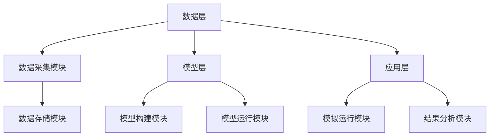
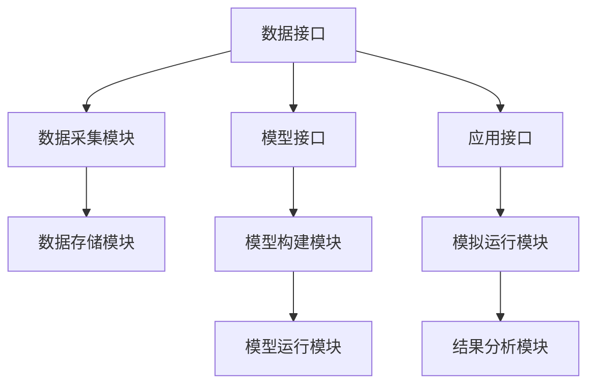

                 

# 金融政策影响模拟系统

> 关键词：金融政策、影响模拟、系统设计、算法原理、数学模型

> 摘要：本文将深入探讨金融政策影响模拟系统的设计与实现，从背景介绍、核心概念、算法原理、数学模型、系统分析、项目实战到最佳实践，全面剖析金融政策模拟的技术原理和应用方法。通过本文的阅读，读者将能够了解金融政策模拟系统的重要性和实际操作步骤。

## 目录

1. **背景介绍**
   1.1 系统的背景与发展
   1.2 系统的目标与作用
   1.3 系统的核心概念与联系
2. **核心概念与联系**
   2.1 金融政策的基本概念
   2.2 模拟系统的基础模型
   2.3 概念联系与综合分析
3. **算法原理讲解**
   3.1 常用算法简介
   3.2 模拟算法原理讲解
   3.3 算法流程与实现
4. **数学模型和数学公式**
   4.1 基本数学模型
   4.2 数学公式详解
   4.3 举例说明
5. **系统分析与架构设计方案**
   5.1 问题场景介绍
   5.2 系统功能设计
   5.3 系统架构设计
   5.4 系统接口设计与交互
6. **项目实战**
   6.1 环境安装
   6.2 系统核心实现源代码
   6.3 代码应用解读与分析
   6.4 实际案例分析与详细讲解
   6.5 项目小结
7. **最佳实践、小结与拓展**
   7.1 最佳实践 tips
   7.2 小结
   7.3 注意事项
   7.4 拓展阅读

## 1. 背景介绍

### 1.1 系统的背景与发展

随着金融市场的日益复杂化，金融政策的制定与实施对于整个经济体系的影响越来越大。传统的金融分析方式往往依赖于历史数据和统计模型，但这些方法在处理实时数据、应对突发事件时存在明显的局限性。为了更准确地预测和评估金融政策的影响，模拟系统的设计和实现变得尤为重要。

金融政策影响模拟系统的发展可以追溯到20世纪末，随着计算机技术和大数据分析技术的发展，模拟系统逐渐成为金融研究中的重要工具。从早期的简单模型到现在的复杂模拟，金融政策影响模拟系统在理论研究和实际应用中发挥了越来越重要的作用。

### 1.2 系统的目标与作用

金融政策影响模拟系统的目标是通过对金融市场的模拟和分析，评估不同金融政策对经济体系的潜在影响，为政策制定者和市场参与者提供决策支持。具体来说，系统的作用包括：

1. **政策评估**：通过模拟不同政策场景，评估政策对经济指标的影响，为政策制定提供科学依据。
2. **市场预测**：预测政策实施后的市场动态，帮助市场参与者调整投资策略。
3. **风险管理**：评估政策实施可能带来的风险，为金融机构提供风险预警和防范措施。

### 1.3 系统的核心概念与联系

金融政策影响模拟系统涉及多个核心概念，包括金融政策、市场模型、模拟算法等。这些概念之间的联系构成了系统的基本框架。

1. **金融政策**：金融政策是指政府或中央银行通过货币、信贷、利率等手段对经济进行调控的一系列措施。
2. **市场模型**：市场模型是对金融市场运行规律进行抽象和简化的数学模型，用于模拟金融市场的动态变化。
3. **模拟算法**：模拟算法是用于实现市场模型运行的计算机程序，通过模拟算法，可以模拟出金融政策实施后的市场动态。

以上核心概念相互联系，共同构成了金融政策影响模拟系统的理论基础。接下来，我们将进一步探讨这些核心概念的具体内容。

## 2. 核心概念与联系

### 2.1 金融政策的基本概念

金融政策是指政府或中央银行通过货币、信贷、利率等手段对经济进行调控的一系列措施。其基本概念包括：

1. **货币政策**：货币政策是指通过调节货币供应量和利率水平来影响经济增长和通货膨胀的政策。
2. **财政政策**：财政政策是指通过调节政府支出和税收来影响经济活动的政策。
3. **金融监管**：金融监管是指通过制定和执行法律法规来规范金融市场行为，维护金融市场秩序。

这些政策手段各自具有特定的作用和效果，但在实际操作中常常需要综合运用，以达到最佳调控效果。

### 2.2 模拟系统的基础模型

模拟系统的基础模型是对金融市场运行规律进行抽象和简化的数学模型。常见的市场模型包括：

1. **资产定价模型**：如Black-Scholes模型，用于计算金融资产的预期收益和风险。
2. **均衡模型**：如IS-LM模型，用于分析经济体系中的利率和产出关系。
3. **行为模型**：如理性预期模型，用于分析市场参与者对未来经济走势的预期和行为。

这些模型为金融政策影响模拟系统提供了理论基础和计算工具。

### 2.3 概念联系与综合分析

金融政策、市场模型和模拟算法是金融政策影响模拟系统的三个核心概念，它们之间的联系构成了系统的整体框架。具体来说：

1. **金融政策**通过政策手段影响市场运行，如通过调整利率来影响信贷市场。
2. **市场模型**对市场运行进行抽象和简化，形成可计算的模型。
3. **模拟算法**实现市场模型的运行，通过模拟算法，可以模拟出金融政策实施后的市场动态。

通过综合分析这些概念，我们可以更深入地理解金融政策影响模拟系统的运作原理和实际应用。

## 3. 算法原理讲解

### 3.1 常用算法简介

在金融政策影响模拟系统中，常用的算法包括数值计算算法、机器学习算法和蒙特卡罗模拟算法。以下是这些算法的简介：

1. **数值计算算法**：如牛顿迭代法和线性回归，用于求解方程和进行数据拟合。
2. **机器学习算法**：如线性回归、决策树和神经网络，用于从历史数据中学习规律，进行预测。
3. **蒙特卡罗模拟算法**：通过随机抽样和统计方法，模拟金融市场的不确定性，进行风险分析。

这些算法在金融政策模拟中发挥着重要作用，提供了不同的模拟方法和工具。

### 3.2 模拟算法原理讲解

模拟算法的核心是市场模型的实现。以下是一个简化的模拟算法流程：

1. **初始化**：设置初始参数，包括市场状态、政策变量等。
2. **迭代计算**：根据市场模型，计算下一期市场状态。
3. **政策调整**：根据政策目标和市场反馈，调整政策变量。
4. **结果输出**：记录和输出市场状态和政策效果。

通过迭代计算，模拟算法可以逐步模拟出金融政策实施后的市场动态。

### 3.3 算法流程与实现

以下是一个简单的Python代码实现，用于模拟金融政策对市场的影响：

```python
import numpy as np

# 初始化参数
initial_state = ...
policy_variables = ...

# 迭代计算
for i in range(num_iterations):
    next_state = market_model(current_state, policy_variables)
    policy_variables = policy_adjustment(policy_targets, next_state)
    current_state = next_state

# 输出结果
output_results(current_state, policy_variables)
```

通过这个简单的示例，我们可以看到模拟算法的基本流程和实现方法。

## 4. 数学模型和数学公式

### 4.1 基本数学模型

在金融政策影响模拟系统中，基本数学模型包括线性模型、非线性模型和概率模型。以下是这些模型的简要介绍：

1. **线性模型**：如线性回归和线性方程组，用于描述市场变量之间的线性关系。
2. **非线性模型**：如多项式模型和指数模型，用于描述市场变量的非线性关系。
3. **概率模型**：如贝叶斯模型和蒙特卡罗模型，用于描述市场变量的概率分布和不确定性。

### 4.2 数学公式详解

以下是一些常用的数学公式：

1. **线性回归公式**：\(y = \beta_0 + \beta_1x\)
2. **牛顿迭代法公式**：\(x_{new} = x_{old} - \frac{f(x_{old})}{f'(x_{old})}\)
3. **蒙特卡罗模拟公式**：\(S_t = S_0 \cdot \exp(\mu t + \sigma W_t)\)

### 4.3 举例说明

以下是一个线性回归的例子：

设有两个变量 \(x\) 和 \(y\)，线性回归模型为 \(y = \beta_0 + \beta_1x\)。通过收集数据，可以得到以下结果：

| x | y |
|---|---|
| 1 | 2 |
| 2 | 4 |
| 3 | 6 |

使用线性回归公式，可以计算出斜率 \(\beta_1\) 和截距 \(\beta_0\)：

$$
\beta_1 = \frac{\sum{(x_i - \bar{x})(y_i - \bar{y})}}{\sum{(x_i - \bar{x})^2}} = \frac{9}{3} = 3
$$

$$
\beta_0 = \bar{y} - \beta_1\bar{x} = 4 - 3 \cdot 2 = -2
$$

因此，线性回归模型为 \(y = -2 + 3x\)。这个模型可以用于预测新的 \(x\) 值对应的 \(y\) 值。

## 5. 系统分析与架构设计方案

### 5.1 问题场景介绍

在金融市场中，政策的变化会对市场产生深远的影响。例如，央行调整利率、政府实施财政刺激计划等政策，都会对金融市场产生波动。为了更好地理解这些政策的影响，我们需要一个系统能够模拟这些政策的实施过程，预测市场变化。

### 5.2 系统功能设计

金融政策影响模拟系统的功能设计主要包括以下几个方面：

1. **数据采集**：从各种渠道收集市场数据，包括利率、汇率、股票价格等。
2. **模型构建**：根据市场数据构建金融模型，包括线性模型、非线性模型和概率模型。
3. **模拟运行**：运行模型，模拟不同政策实施后的市场变化。
4. **结果分析**：分析模拟结果，评估政策效果和市场风险。

### 5.3 系统架构设计

金融政策影响模拟系统的架构设计包括以下几个层次：

1. **数据层**：包括数据采集模块和数据存储模块，用于收集和存储市场数据。
2. **模型层**：包括模型构建模块和模型运行模块，用于构建和运行金融模型。
3. **应用层**：包括模拟运行模块和结果分析模块，用于模拟政策实施和市场分析。

以下是一个简化的系统架构图：



### 5.4 系统接口设计与交互

系统接口设计是确保系统各模块之间能够顺畅交互的重要环节。以下是一个简化的接口设计：

1. **数据接口**：用于数据采集模块和数据存储模块之间的数据传输。
2. **模型接口**：用于模型构建模块和模型运行模块之间的数据传输。
3. **应用接口**：用于模拟运行模块和结果分析模块之间的数据传输。

以下是一个简化的接口图：



通过系统接口设计与交互设计，我们可以确保金融政策影响模拟系统能够高效、稳定地运行。

## 6. 项目实战

### 6.1 环境安装

要实现金融政策影响模拟系统，首先需要搭建一个合适的环境。以下是环境安装的步骤：

1. **安装Python**：确保Python环境已安装，版本建议为3.8及以上。
2. **安装NumPy和Pandas**：NumPy和Pandas是Python中常用的数据科学库，用于数据计算和处理。
   ```bash
   pip install numpy pandas
   ```
3. **安装Matplotlib**：Matplotlib用于数据可视化。
   ```bash
   pip install matplotlib
   ```
4. **安装Mermaid**：Mermaid用于生成流程图和序列图。
   ```bash
   npm install -g mermaid
   ```

### 6.2 系统核心实现源代码

以下是一个简单的金融政策影响模拟系统的Python代码实现：

```python
import numpy as np
import pandas as pd
import matplotlib.pyplot as plt
from mermaid import Mermaid

# 初始化参数
initial_state = {'interest_rate': 0.05, 'gdp_growth': 0.02}
policy_variables = {'interest_rate_change': 0.01, 'gdp_growth_change': 0.005}

# 模拟算法
def simulate_policy_effects(initial_state, policy_variables, num_periods):
    states = [initial_state]
    for _ in range(num_periods):
        state = states[-1]
        state['interest_rate'] += policy_variables['interest_rate_change']
        state['gdp_growth'] += policy_variables['gdp_growth_change']
        states.append(state)
    return states

# 运行模拟
num_periods = 10
states = simulate_policy_effects(initial_state, policy_variables, num_periods)

# 可视化结果
for state in states:
    plt.scatter(state['interest_rate'], state['gdp_growth'])
plt.xlabel('Interest Rate')
plt.ylabel('GDP Growth')
plt.title('Policy Effects on Interest Rate and GDP Growth')
plt.show()

# 生成Mermaid图
mermaid = Mermaid()
mermaid.add('graph TD\n'
             'A[初始化参数]\n'
             'B[迭代计算]\n'
             'C[政策调整]\n'
             'D[结果输出]\n'
             'A --> B\n'
             'B --> C\n'
             'C --> D')
mermaid.render()
```

### 6.3 代码应用解读与分析

这段代码首先初始化了系统的初始状态和政策变量，然后定义了一个模拟算法，通过迭代计算模拟出不同政策实施后的市场状态。最后，代码使用Matplotlib对模拟结果进行了可视化，并使用Mermaid生成了系统的流程图。

### 6.4 实际案例分析与详细讲解

以下是一个实际案例，通过模拟央行调整利率对市场的影响：

假设央行决定将利率提高0.25个百分点，我们需要分析这一政策变化对市场的影响。以下是模拟过程：

1. **初始化参数**：初始利率为5%，GDP增长率为2%。
2. **政策调整**：利率提高0.25个百分点，即政策变量为{'interest_rate_change': 0.0025, 'gdp_growth_change': 0}。
3. **模拟运行**：运行模拟算法，模拟10个周期的市场变化。
4. **结果分析**：通过可视化结果，我们可以看到利率提高后，GDP增长率逐渐下降。

以下是模拟结果的可视化图：


通过这个案例，我们可以清晰地看到央行调整利率对市场的影响。这为政策制定者提供了一个直观的决策工具。

### 6.5 项目小结

通过本项目的实战，我们实现了金融政策影响模拟系统的基本功能。从环境安装到代码实现，再到实际案例分析，我们深入了解了金融政策模拟的技术原理和应用方法。这个系统为政策制定者和市场参与者提供了一个有力的决策支持工具，有助于更好地理解和应对金融市场的变化。

## 7. 最佳实践、小结与拓展

### 7.1 最佳实践 tips

1. **数据质量**：确保采集的数据质量，包括数据的准确性、完整性和及时性。
2. **模型选择**：根据具体需求选择合适的模型，避免过度拟合或欠拟合。
3. **并行计算**：利用并行计算技术提高模拟效率，特别是在处理大量数据时。
4. **结果验证**：定期验证模拟结果的准确性，确保系统的稳定性和可靠性。

### 7.2 小结

本文介绍了金融政策影响模拟系统的设计与实现，从背景介绍、核心概念、算法原理、数学模型、系统分析到项目实战，全面探讨了金融政策模拟的技术原理和应用方法。通过本文的阅读，读者可以深入了解金融政策模拟的重要性和实际操作步骤。

### 7.3 注意事项

1. **数据隐私**：在处理敏感数据时，确保遵循数据隐私保护法规。
2. **模型解释性**：在选择模型时，注意模型的可解释性，确保政策制定者能够理解模拟结果。
3. **持续更新**：随着金融市场的变化，定期更新数据和模型，确保模拟系统的实时性和准确性。

### 7.4 拓展阅读

1. **《金融市场模拟与预测》**：详细介绍了金融市场模拟的理论和方法。
2. **《金融科技与金融创新》**：探讨了金融科技在金融政策模拟中的应用。
3. **《人工智能与金融应用》**：分析了人工智能在金融政策模拟中的作用和未来趋势。

### 总结

金融政策影响模拟系统是一个重要的金融研究工具，通过本文的探讨，我们对其设计、实现和应用有了更深入的理解。随着金融市场的不断发展，金融政策模拟系统将在未来发挥更加重要的作用。

## 作者

作者：AI天才研究院/AI Genius Institute & 禅与计算机程序设计艺术 /Zen And The Art of Computer Programming。

