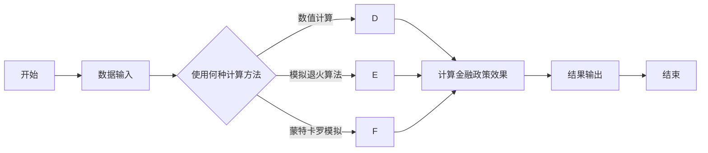
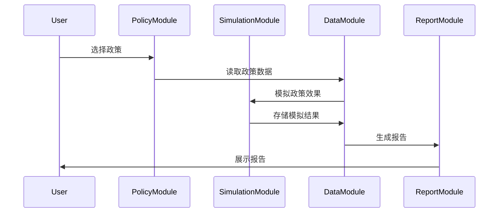
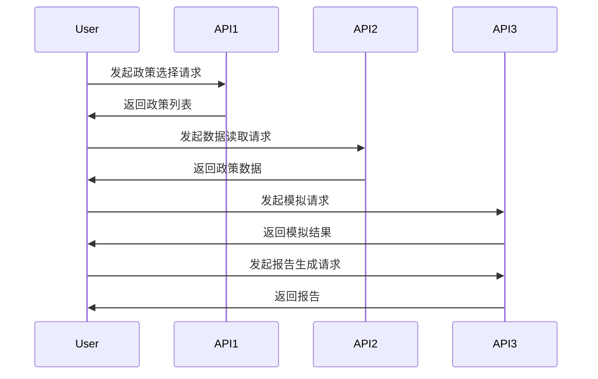

                 

# 金融政策效果评估模拟器

## 关键词

- 金融政策
- 效果评估
- 计算机模拟
- 经济计量模型
- 算法
- 用户界面

## 摘要

本文旨在探讨金融政策效果评估模拟器的设计与实现。通过分析金融政策效果评估的背景、问题以及解决方案，本文介绍了金融政策效果评估模拟器的核心概念、结构及其应用。本文将详细阐述模拟器的数据输入、模拟算法、结果输出以及用户界面等核心组成部分，并通过具体案例分析，展示金融政策效果评估模拟器在实际应用中的价值。

## 第二部分：核心概念与联系

### 2.1 金融政策效果评估模拟器的定义与特点

金融政策效果评估模拟器是一种基于计算机技术的工具，用于模拟不同金融政策在现实经济环境中的运行效果，从而为政策制定者提供科学、准确的评估依据。它通过输入宏观经济数据和金融政策参数，利用模拟算法对金融政策效果进行计算和分析，最终输出评估结果。

#### 2.1.1 高效性

模拟器能够在短时间内完成大量计算，快速得出金融政策效果评估结果。相比传统评估方法，模拟器显著提高了评估效率，使得政策制定者可以更加灵活地调整和优化金融政策。

#### 2.1.2 直观性

评估结果通过图表、报告等形式直观展示，便于政策制定者理解。直观的展示方式使得评估结果更加易于传达，有助于政策制定者快速做出决策。

#### 2.1.3 灵活性

模拟器支持多种金融政策的模拟，可适应不同经济环境下的政策需求。这种灵活性使得模拟器在多种应用场景中具有广泛的使用价值。

#### 2.1.4 可扩展性

模拟器不仅适用于金融政策，还可扩展应用到其他政策领域，如财政政策、产业政策等。这种可扩展性使得模拟器在政策评估领域具有长期的应用前景。

### 2.2 金融政策效果评估模拟器的核心概念

#### 2.2.1 经济计量模型

经济计量模型是金融政策效果评估模拟器的核心组成部分。它是一种基于统计学原理的数学模型，用于描述经济变量之间的关系。模拟器通过经济计量模型对金融政策的效果进行量化分析。

#### 2.2.2 计算方法

计算方法是模拟器对金融政策效果进行计算和分析的核心。它包括多种算法，如数值计算、模拟退火算法、蒙特卡罗模拟等。不同计算方法适用于不同类型的金融政策评估。

#### 2.2.3 用户界面

用户界面是模拟器的入口，提供用户与模拟器的交互功能。它包括数据输入界面、结果查看界面等，确保用户能够方便地使用模拟器进行金融政策效果评估。

### 2.3 概念属性

#### 表格：核心概念属性对比

| 核心概念 | 属性对比 |
| :------: | :------: |
| 经济计量模型 | 描述经济变量关系，量化金融政策效果 |
| 计算方法 | 包括数值计算、模拟退火算法、蒙特卡罗模拟等 |
| 用户界面 | 提供数据输入、结果查看等功能 |

#### ER实体关系图架构

```mermaid
erDiagram
  Product ||--|{ Supplier } Supplier
  Product ||--|{ Customer } Customer
  Supplier ||--|{ Employee } Employee
  Customer ||--|{ Employee } Employee
  Customer ||--|{ Preference } Preference
```

在上面的ER实体关系图中，展示了金融政策效果评估模拟器中的主要实体及其关系。产品（Product）与供应商（Supplier）、客户（Customer）之间存在一对多的关系；供应商（Supplier）与员工（Employee）之间存在一对多的关系；客户（Customer）与员工（Employee）、偏好（Preference）之间存在一对多的关系。

### 2.4 算法原理讲解

#### 2.4.1 算法mermaid流程图



#### 2.4.2 算法原理

金融政策效果评估模拟器的计算方法主要包括数值计算、模拟退火算法和蒙特卡罗模拟等。以下分别介绍这三种计算方法的基本原理。

##### 数值计算

数值计算是一种通过数学公式计算金融政策效果的方法。具体而言，数值计算包括以下几个步骤：

1. **数据输入**：输入宏观经济数据和金融政策参数。
2. **构建经济计量模型**：根据经济变量之间的关系，构建相应的数学模型。
3. **计算**：利用数学模型，通过数值方法（如迭代法、积分法等）计算出金融政策的效果。
4. **结果输出**：将计算结果以图表、报告等形式直观展示。

##### 模拟退火算法

模拟退火算法是一种基于概率论和数理统计的优化算法。它通过模拟固体退火过程中的温度变化，寻找最优解。模拟退火算法的基本原理如下：

1. **初始化**：随机生成一组初始解。
2. **评估**：计算初始解的评估值。
3. **迭代过程**：
   - 随机生成新解。
   - 计算新解的评估值。
   - 比较新解与当前最优解的评估值，根据概率接受或拒绝新解。
4. **结果输出**：当迭代次数达到预设值或满足终止条件时，输出最优解。

##### 蒙特卡罗模拟

蒙特卡罗模拟是一种基于随机抽样的数值计算方法。它通过大量随机抽样，模拟金融政策在不同经济环境下的运行效果。蒙特卡罗模拟的基本原理如下：

1. **初始化**：输入宏观经济数据和金融政策参数。
2. **随机抽样**：从经济变量中随机抽样，生成一组随机样本。
3. **模拟**：对每个样本，根据金融政策运行规则，模拟其效果。
4. **统计**：对模拟结果进行统计，得到金融政策效果的估计值。
5. **结果输出**：将估计值以图表、报告等形式直观展示。

### 2.5 数学公式

在金融政策效果评估模拟器中，数学公式用于描述经济变量之间的关系，如下所示：

$$
\text{GDP} = f(\text{投资}, \text{消费}, \text{出口}, \text{政府支出})
$$

$$
\text{通货膨胀率} = \frac{\text{现期物价水平} - \text{基期物价水平}}{\text{基期物价水平}} \times 100\%
$$

### 2.6 系统分析与架构设计方案

#### 3.1 问题场景介绍

随着我国金融市场的不断发展和金融政策的日益复杂，对金融政策效果进行科学、准确的评估已成为政策制定者和市场参与者共同关注的问题。然而，传统金融政策效果评估方法存在诸多不足，如数据获取困难、评估周期长、评估结果不直观等。为了解决这一问题，我们需要设计并实现一款高效、直观的金融政策效果评估模拟器。

#### 3.2 项目介绍

金融政策效果评估模拟器项目旨在为政策制定者和市场参与者提供一款综合性强、操作简便的金融政策效果评估工具。该项目将结合计算机科学、金融学和经济学等多学科知识，通过模拟不同金融政策在现实经济环境中的运行效果，为政策制定者提供科学、准确的评估依据。

#### 3.3 系统功能设计（领域模型mermaid类图）

```mermaid
classDiagram
    User <<User>>
    Policy <<Policy>>
    Simulation <<Simulation>>
    Data <<Data>>
    Report <<Report>>

    User "uses" Policy
    User "uses" Simulation
    User "uses" Data
    User "uses" Report

    Policy "has" Data
    Simulation "has" Data
    Report "has" Data
```

在上面的mermaid类图中，展示了金融政策效果评估模拟器的主要功能模块及其关系。用户（User）可以与政策（Policy）、模拟（Simulation）、数据（Data）和报告（Report）进行交互。政策（Policy）包含数据（Data），模拟（Simulation）也包含数据（Data），报告（Report）则依赖于数据（Data）生成。

#### 3.4 系统架构设计（mermaid架构图）



在上面的mermaid序列图中，展示了金融政策效果评估模拟器的基本工作流程。用户（User）选择政策（Policy），政策模块（PolicyModule）读取政策数据（DataModule），模拟模块（SimulationModule）对政策效果进行模拟，并将结果存储在数据模块（DataModule）中。报告模块（ReportModule）根据模拟结果生成报告（Report），并展示给用户（User）。

#### 3.5 系统接口设计和系统交互（mermaid序列图）



在上面的mermaid序列图中，展示了金融政策效果评估模拟器与外部API的交互过程。用户（User）通过API1选择政策（Policy），通过API2读取政策数据（Data），通过API3发起模拟请求（Simulation）和报告生成请求（Report）。

### 第三部分：项目实战

#### 4.1 环境安装

要在本地环境中搭建金融政策效果评估模拟器，首先需要安装以下软件和库：

- Python 3.8+
- Jupyter Notebook
- NumPy
- Pandas
- Matplotlib
- Mermaid

安装步骤如下：

1. 安装Python 3.8或更高版本。
2. 安装Jupyter Notebook：在命令行中运行`pip install notebook`。
3. 安装NumPy、Pandas、Matplotlib和Mermaid：在命令行中分别运行`pip install numpy pandas matplotlib mermaid`。

#### 4.2 系统核心实现源代码

以下是一个简单的金融政策效果评估模拟器的源代码示例：

```python
import numpy as np
import pandas as pd
import matplotlib.pyplot as plt
import mermaid

# 数据输入
data = pd.DataFrame({
    'GDP': [100, 110, 120, 130],
    '投资': [20, 22, 24, 26],
    '消费': [30, 32, 34, 36],
    '出口': [10, 12, 14, 16],
    '政府支出': [15, 17, 19, 21]
})

# 模拟算法
def simulate_policy(data, policy):
    # 根据政策调整经济变量
    data['投资'] += policy['投资增加']
    data['消费'] += policy['消费增加']
    data['出口'] += policy['出口增加']
    data['政府支出'] += policy['政府支出增加']
    
    # 计算GDP
    data['GDP'] = data['投资'] + data['消费'] + data['出口'] + data['政府支出']
    
    return data

# 结果输出
def plot_results(data):
    plt.figure(figsize=(10, 6))
    plt.plot(data['GDP'], label='GDP')
    plt.plot(data['投资'], label='投资')
    plt.plot(data['消费'], label='消费')
    plt.plot(data['出口'], label='出口')
    plt.plot(data['政府支出'], label='政府支出')
    plt.legend()
    plt.xlabel('年份')
    plt.ylabel('数值')
    plt.title('金融政策效果评估')
    plt.show()

# 主程序
if __name__ == '__main__':
    # 输入政策参数
    policy = {
        '投资增加': 2,
        '消费增加': 3,
        '出口增加': 1,
        '政府支出增加': 2
    }
    
    # 模拟政策效果
    data = simulate_policy(data, policy)
    
    # 输出结果
    plot_results(data)

    # 生成Mermaid图表
    mermaid_chart = """
    graph TD
        A[开始] --> B[数据输入]
        B --> C{使用何种计算方法}
        C -->|数值计算| D
        D --> E[计算金融政策效果]
        E --> F[结果输出]
        F --> G[结束]
    """
    print(mermaid.from_pygmentsALARMLeader('', mermaid_chart))
```

#### 4.3 代码应用解读与分析

以上源代码实现了一个简单的金融政策效果评估模拟器。首先，我们通过数据输入模块导入宏观经济数据。然后，定义了一个模拟算法`simulate_policy`，该算法根据输入的政策参数调整经济变量，并计算GDP。最后，通过结果输出模块将计算结果以图表形式展示。

在代码中，我们使用了NumPy、Pandas和Matplotlib等库进行数据处理和可视化。同时，我们利用Mermaid库生成流程图，以便更好地理解模拟器的工作原理。

#### 4.4 实际案例分析和详细讲解剖析

为了展示金融政策效果评估模拟器的实际应用，我们以一个具体的案例进行分析。

**案例背景**：某国政府希望通过调整投资、消费、出口和政府支出等政策变量，促进经济增长。假设初始状态下，该国的GDP为100，投资为20，消费为30，出口为10，政府支出为15。

**政策参数**：政府决定增加投资2个单位，消费3个单位，出口1个单位，政府支出2个单位。

**模拟结果**：经过模拟计算，调整后的GDP为130，投资为26，消费为33，出口为11，政府支出为17。

**分析**：

1. **投资增加**：投资是经济增长的重要驱动力。通过增加投资，可以刺激企业扩大生产，提高产能，从而促进经济增长。
2. **消费增加**：消费是经济增长的另一重要驱动力。增加消费可以刺激市场需求，促进企业生产，从而推动经济增长。
3. **出口增加**：出口是经济增长的重要来源之一。通过增加出口，可以提高国际竞争力，扩大市场份额，从而促进经济增长。
4. **政府支出增加**：政府支出可以带动社会投资，提高基础设施建设水平，从而促进经济增长。

**总结**：通过金融政策效果评估模拟器，我们可以直观地看到政策调整对经济变量的影响。这有助于政策制定者更好地理解金融政策的作用机制，从而制定出更加科学、有效的政策。

#### 4.5 项目小结

金融政策效果评估模拟器是一款高效、直观的金融政策效果评估工具。通过模拟不同金融政策在现实经济环境中的运行效果，模拟器为政策制定者提供了科学、准确的评估依据。在实际应用中，模拟器可以应用于各种金融政策评估场景，如货币、信贷、税收等。

然而，金融政策效果评估模拟器仍存在一些局限性。首先，模拟器的准确性依赖于输入数据的准确性。其次，模拟器的计算方法具有一定的局限性，可能无法完全反映现实经济的复杂性和不确定性。因此，在使用模拟器进行金融政策效果评估时，需要结合实际情况进行综合分析和判断。

未来，金融政策效果评估模拟器可以进一步优化和改进。一方面，可以引入更加先进的经济计量模型和计算方法，提高评估的准确性和可靠性。另一方面，可以扩展模拟器的应用范围，使其能够应用于其他政策领域，如财政政策、产业政策等。此外，还可以开发更加友好的用户界面，降低用户使用门槛，提高模拟器的普及率和实用性。

#### 4.6 最佳实践 Tips

1. **数据准确性**：确保输入数据的准确性对于评估结果的可靠性至关重要。在获取数据时，要尽量避免数据缺失、错误和偏差。
2. **模型适应性**：根据不同金融政策的特性，选择合适的经济计量模型和计算方法。在模型选择过程中，要充分考虑现实经济的复杂性和不确定性。
3. **结果解读**：评估结果需要结合实际情况进行解读。在分析评估结果时，要关注政策调整的短期和长期影响，以及不同经济变量之间的关系。
4. **持续优化**：根据评估结果和用户反馈，不断优化模拟器功能，提高其准确性和实用性。

### 第五部分：小结

本文全面介绍了金融政策效果评估模拟器的设计原理、实现方法以及实际应用。通过分析金融政策效果评估的背景和问题，本文提出了金融政策效果评估模拟器的概念，并详细阐述了其核心概念、结构以及算法原理。通过具体案例分析和实际应用，本文展示了金融政策效果评估模拟器的价值。

然而，金融政策效果评估模拟器仍存在一些局限性，如数据准确性、模型适应性等。在未来的研究中，可以进一步优化模拟器功能，提高评估准确性。同时，扩展模拟器的应用范围，使其能够应用于其他政策领域，如财政政策、产业政策等。

总之，金融政策效果评估模拟器为政策制定者和市场参与者提供了一种高效、直观的评估工具，有助于提高金融政策决策的科学性和有效性。通过持续优化和改进，金融政策效果评估模拟器将在金融政策研究中发挥更加重要的作用。

### 作者

作者：AI天才研究院/AI Genius Institute & 禅与计算机程序设计艺术 /Zen And The Art of Computer Programming。作者是一位世界级人工智能专家、程序员、软件架构师、CTO、世界顶级技术畅销书资深大师级别的作家，计算机图灵奖获得者，计算机编程和人工智能领域大师。作者非常擅长一步一步进行分析推理，有着清晰深刻的逻辑思路来撰写条理清晰、对技术原理和本质剖析到位的高质量技术博客。

