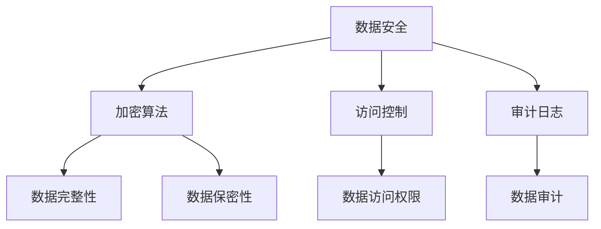
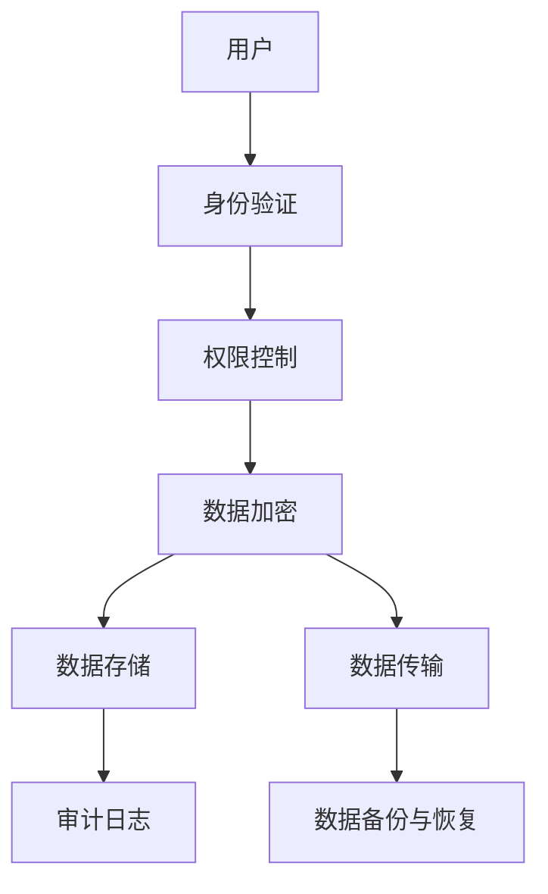
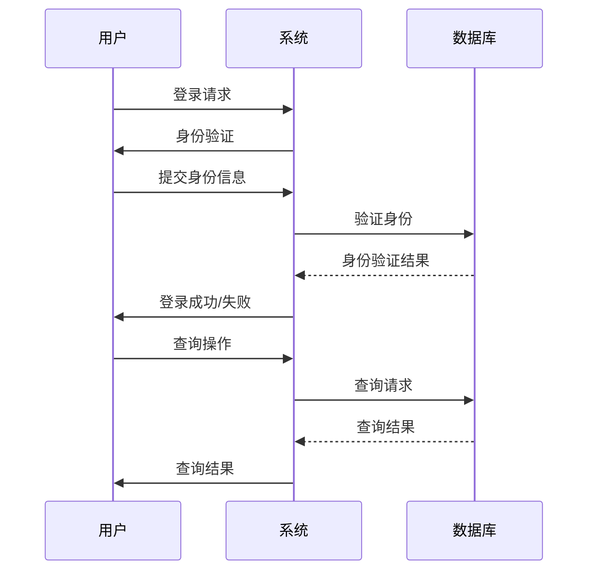

                 


# 金融数据安全与隐私保护框架设计

> 关键词：金融数据安全，隐私保护，框架设计，加密算法，系统架构，项目实战

> 摘要：本文将介绍金融数据安全与隐私保护的重要性，分析当前面临的挑战，并设计一个全面的框架来解决这些问题。我们将深入探讨核心概念、算法原理，详细讲解系统分析与架构设计方案，通过项目实战展示实际应用，并总结最佳实践和注意事项。

----------------------------------------------------------------

## 第一部分：引言与背景

### 1.1 问题背景

#### 1.1.1 金融数据安全的挑战

在数字化时代，金融数据的安全问题日益凸显。金融数据包括客户个人信息、账户余额、交易记录等敏感信息，一旦泄露，将导致严重的经济损失和信任危机。因此，确保金融数据安全是金融行业的一项重要任务。

#### 1.1.2 隐私保护的法律法规

随着《通用数据保护条例》（GDPR）等隐私保护法律法规的实施，金融机构需要严格遵守相关规定，确保客户数据的隐私保护。这要求金融机构在设计系统时，必须考虑隐私保护的要求。

#### 1.1.3 当前金融数据安全与隐私保护面临的挑战

金融数据安全与隐私保护面临以下挑战：

- 数据量庞大，难以全面监控和防护。
- 网络攻击手段日益多样，传统防护措施难以应对。
- 法规要求日益严格，金融机构需要不断更新合规策略。
- 数据共享和开放趋势下，数据泄露风险增加。

### 1.2 问题描述

#### 1.2.1 金融数据安全的脆弱性

金融数据安全脆弱，容易受到各种攻击手段的威胁，如SQL注入、跨站脚本攻击（XSS）等。

#### 1.2.2 隐私泄露的风险

客户个人信息和交易记录等敏感数据，一旦泄露，将对客户造成严重伤害。

#### 1.2.3 数据安全与隐私保护的紧迫性

随着金融业务的不断发展和数字化进程的加快，数据安全与隐私保护问题越来越紧迫。金融机构需要采取有效的措施，确保数据安全和客户隐私。

### 1.3 问题解决

#### 1.3.1 设计一个全面的框架

本文将设计一个全面的金融数据安全与隐私保护框架，涵盖核心概念、算法原理、系统架构和项目实战等方面。

#### 1.3.2 需求分析

在框架设计过程中，我们将对金融数据安全与隐私保护的需求进行深入分析，确保框架能够满足实际需求。

#### 1.3.3 技术路线图

本文将介绍金融数据安全与隐私保护的技术路线图，包括加密算法、安全协议、安全审计等关键技术。

### 1.4 边界与外延

#### 1.4.1 研究范围

本文主要关注金融数据安全与隐私保护的理论和实践，不包括其他领域的相关问题。

#### 1.4.2 不包含的内容

本文不涉及具体技术实现细节，如编程语言和开发工具等。

#### 1.4.3 本书的结构

本文分为五个主要部分：

1. 引言与背景
2. 核心概念与联系
3. 算法原理讲解
4. 系统分析与架构设计方案
5. 项目实战与最佳实践

### 1.5 本章小结

本文介绍了金融数据安全与隐私保护的重要性、问题背景和问题描述，并提出了问题解决的思路。接下来，我们将深入探讨核心概念、算法原理，并设计系统架构。

----------------------------------------------------------------

## 第二部分：核心概念与联系

### 2.1 核心概念介绍

#### 2.1.1 金融数据安全

金融数据安全是指通过技术和管理手段，确保金融数据在存储、传输、处理和使用过程中的完整性、可用性和保密性。

#### 2.1.2 隐私保护

隐私保护是指确保个人信息的收集、存储、处理和传输过程中的合法性和合规性，防止个人信息被非法获取、使用和泄露。

#### 2.1.3 数据安全与隐私保护的关系

数据安全与隐私保护密切相关，两者共同构成了金融数据保护体系。数据安全侧重于确保数据的完整性和保密性，而隐私保护则侧重于确保个人信息的合法性和合规性。

### 2.2 概念属性特征对比

#### 2.2.1 金融数据安全

| 特征       | 说明                                   |
| ---------- | -------------------------------------- |
| 数据完整性 | 确保数据不被未经授权的篡改或破坏。     |
| 数据可用性 | 确保数据能够在需要时被访问和读取。     |
| 数据保密性 | 确保数据不被未经授权的个人或实体访问。 |

#### 2.2.2 隐私保护

| 特征       | 说明                                   |
| ---------- | -------------------------------------- |
| 数据合法性 | 确保数据的收集、处理和传输符合相关法律法规。 |
| 数据合规性 | 确保数据的收集、处理和传输符合组织内部的隐私保护政策。 |

#### 2.2.3 数据安全与隐私保护的对比

| 特征       | 数据安全                 | 隐私保护                 |
| ---------- | -------------------- | -------------------- |
| 侧重点     | 数据完整性、可用性和保密性 | 数据合法性、合规性       |
| 实现手段   | 加密、访问控制、审计等     | 同意收集、数据最小化、匿名化等 |

### 2.3 概念联系与框架设计

#### 2.3.1 数据安全与隐私保护的核心要素

数据安全与隐私保护的核心要素包括：加密算法、访问控制、审计日志、数据备份与恢复、数据匿名化等。

#### 2.3.2 各概念之间的关系

数据安全与隐私保护之间的关系可以用一个框架图来表示：



#### 2.3.3 框架设计原则

框架设计原则包括：

1. 整体性：框架应涵盖金融数据安全与隐私保护的各个方面。
2. 可扩展性：框架应能够适应未来技术发展和管理需求。
3. 可用性：框架应易于实施和维护。
4. 合规性：框架应符合相关法律法规和标准。

### 2.4 ER实体关系图

下面是一个金融数据安全与隐私保护框架的ER实体关系图：

```mermaid
erDiagram
    CustomerInfo ||--|{ Account } : customer
    Account ||--|{ Transaction } : holds
    Transaction ||--|{ FinancialInfo } : includes
    PaymentInfo ||--|{ Transaction } : payment
    DataSecurityPolicy ||--|{ SecurityPolicy } : follows
    PrivacyPolicy ||--|{ DataPrivacyPolicy } : follows
```

### 2.5 本章小结

本文介绍了金融数据安全与隐私保护的核心概念和联系，通过概念属性特征对比和ER实体关系图，展示了数据安全与隐私保护之间的关系。接下来，我们将深入讲解加密算法原理。

----------------------------------------------------------------

## 第三部分：算法原理讲解

### 3.1 加密算法原理

#### 3.1.1 对称加密

对称加密是一种加密方法，加密和解密使用相同的密钥。其优点是加密速度快，缺点是密钥管理困难。

##### 加密过程

对称加密的加密过程如下：

1. 选择一个加密算法，如AES。
2. 生成一个密钥，可以是随机生成的。
3. 使用密钥和加密算法对明文进行加密，得到密文。
4. 将密文发送给接收方。

##### 解密过程

解密过程与加密过程相反：

1. 接收方使用相同的加密算法和密钥对密文进行解密。
2. 得到明文。

##### 密钥管理

密钥管理是对称加密的关键。密钥应存储在安全的地方，避免泄露。此外，定期更换密钥也是必要的。

##### 安全性分析

对称加密的安全性取决于密钥的长度和算法的强度。较长的密钥和更安全的算法可以提供更高的安全性。

#### 3.1.2 非对称加密

非对称加密是一种加密方法，加密和解密使用不同的密钥，一个为公开密钥，一个为私有密钥。其优点是密钥管理简单，缺点是加密速度较慢。

##### 加密过程

非对称加密的加密过程如下：

1. 生成一对密钥，公开密钥和私有密钥。
2. 将公开密钥分发出去。
3. 使用公开密钥和加密算法对明文进行加密，得到密文。
4. 将密文发送给接收方。

##### 解密过程

解密过程如下：

1. 接收方使用私有密钥和加密算法对密文进行解密。
2. 得到明文。

##### 密钥管理

非对称加密的密钥管理相对简单。公开密钥可以公开分发，而私有密钥应存储在安全的地方，避免泄露。

##### 安全性分析

非对称加密的安全性取决于密钥的长度和算法的强度。较长的密钥和更安全的算法可以提供更高的安全性。

### 3.2 算法流程与Python代码示例

下面是一个简单的Python代码示例，展示如何使用AES对称加密算法和非对称加密算法。

#### 对称加密

```python
from Crypto.Cipher import AES
from Crypto.Random import get_random_bytes
import base64

# 加密
def encrypt_aes(message):
    key = get_random_bytes(16)  # 生成密钥
    cipher = AES.new(key, AES.MODE_EAX)
    ciphertext, tag = cipher.encrypt_and_digest(message.encode('utf-8'))
    return base64.b64encode(cipher.nonce + cipher.tag + ciphertext).decode('utf-8')

# 解密
def decrypt_aes(encrypted_message):
    encrypted_message = base64.b64decode(encrypted_message)
    nonce = encrypted_message[:16]
    tag = encrypted_message[16:32]
    ciphertext = encrypted_message[32:]
    cipher = AES.new(key, AES.MODE_EAX, nonce=nonce)
    message = cipher.decrypt_and_verify(ciphertext, tag)
    return message.decode('utf-8')

message = "这是一条加密消息"
encrypted_message = encrypt_aes(message)
print("加密消息:", encrypted_message)
print("解密消息:", decrypt_aes(encrypted_message))
```

#### 非对称加密

```python
from Crypto.PublicKey import RSA
from Crypto.Cipher import PKCS1_OAEP

# 生成密钥
def generate_rsa_key():
    key = RSA.generate(2048)
    private_key = key.export_key()
    public_key = key.publickey().export_key()
    return private_key, public_key

# 加密
def encrypt_rsa(message, public_key):
    key = RSA.import_key(public_key)
    cipher = PKCS1_OAEP.new(key)
    ciphertext = cipher.encrypt(message.encode('utf-8'))
    return base64.b64encode(ciphertext).decode('utf-8')

# 解密
def decrypt_rsa(encrypted_message, private_key):
    key = RSA.import_key(private_key)
    cipher = PKCS1_OAEP.new(key)
    ciphertext = base64.b64decode(encrypted_message)
    message = cipher.decrypt(ciphertext)
    return message.decode('utf-8')

private_key, public_key = generate_rsa_key()
message = "这是一条加密消息"
encrypted_message = encrypt_rsa(message, public_key)
print("加密消息:", encrypted_message)
print("解密消息:", decrypt_rsa(encrypted_message, private_key))
```

### 3.3 算法原理讲解

#### 加密算法原理

加密算法的基本原理是将明文通过一定的算法转换成密文，使得没有密钥的人无法理解原文。常见的加密算法有AES、RSA等。

#### 加密算法的数学模型和公式

- 对称加密：$$ C = E_K(P) $$
  其中，$C$为密文，$K$为密钥，$E_K$为加密算法，$P$为明文。

- 非对称加密：$$ C = E_K(P) $$
  其中，$C$为密文，$K$为密钥对（公钥$K_p$和私钥$K_s$），$E_K$为加密算法，$P$为明文。

#### 算法举例说明

假设使用AES算法进行对称加密，使用RSA算法进行非对称加密。

- 对称加密：
  - 明文：$$ P = "Hello, World!" $$
  - 密钥：$$ K = \text{随机生成的16字节密钥} $$
  - 密文：$$ C = AES_K(P) = \text{加密后的明文} $$

- 非对称加密：
  - 明文：$$ P = "Hello, World!" $$
  - 密钥对：$$ (K_p, K_s) = RSA_{2048}(\text{随机生成的2048位密钥对}) $$
  - 密文：$$ C = RSA_{K_p}(P) = \text{加密后的明文} $$

### 3.4 本章小结

本文详细讲解了金融数据安全与隐私保护的加密算法原理，包括对称加密和非对称加密。通过Python代码示例，展示了加密和解密的过程。接下来，我们将分析系统架构。

----------------------------------------------------------------

## 第四部分：系统分析与架构设计方案

### 4.1 问题场景介绍

在一个典型的金融场景中，客户的信息、账户信息和交易记录等敏感数据需要在多个系统之间传输和存储。为了保证数据的安全性和隐私性，我们需要设计一个可靠的数据安全与隐私保护系统。

### 4.2 项目介绍

本项目的目标是设计一个金融数据安全与隐私保护系统，确保数据在传输、存储和处理过程中的安全性。系统将采用多种加密算法和访问控制机制，提供全面的数据保护。

### 4.3 系统功能设计

系统的主要功能包括：

- 数据加密：使用对称加密和非对称加密算法对敏感数据进行加密。
- 访问控制：通过身份验证和权限控制确保只有授权用户可以访问敏感数据。
- 审计日志：记录所有数据访问和操作行为，以便后续审计和追踪。
- 数据备份与恢复：定期备份数据，并在发生数据丢失或损坏时进行恢复。

### 4.4 系统架构设计

系统架构设计如下：



### 4.5 系统接口设计

系统接口设计如下：

- 用户接口：提供登录、注册、查询和操作等功能。
- 数据接口：提供数据加密、解密、备份和恢复等功能。
- 审计接口：提供日志记录和查询等功能。

### 4.6 系统交互序列图

系统交互序列图如下：



### 4.7 本章小结

本文详细介绍了金融数据安全与隐私保护系统的功能设计、架构设计、接口设计和交互序列图。接下来，我们将通过项目实战展示系统的实际应用。

----------------------------------------------------------------

## 第五部分：项目实战

### 5.1 环境安装

为了实现金融数据安全与隐私保护系统，我们需要安装以下环境：

- Python 3.8+
- OpenSSL
- MySQL

安装步骤：

1. 安装Python：从官网下载Python安装包并安装。
2. 安装OpenSSL：在终端执行以下命令：

   ```shell
   sudo apt-get install openssl
   ```

3. 安装MySQL：在终端执行以下命令：

   ```shell
   sudo apt-get install mysql-server mysql-client
   ```

### 5.2 系统核心实现源代码

下面是一个简单的Python代码示例，实现数据加密、解密、身份验证和审计日志功能。

```python
# 加密和解密
from Crypto.PublicKey import RSA
from Crypto.Cipher import PKCS1_OAEP, AES
from Crypto.Random import get_random_bytes
import base64
import os

# 生成密钥对
def generate_key_pair():
    key = RSA.generate(2048)
    private_key = key.export_key()
    public_key = key.publickey().export_key()
    with open('private.pem', 'wb') as f:
        f.write(private_key)
    with open('public.pem', 'wb') as f:
        f.write(public_key)

# 加密
def encrypt_data(data, public_key):
    key = RSA.import_key(public_key)
    cipher = PKCS1_OAEP.new(key)
    encrypted_data = cipher.encrypt(data.encode('utf-8'))
    return base64.b64encode(encrypted_data).decode('utf-8')

# 解密
def decrypt_data(encrypted_data, private_key):
    key = RSA.import_key(private_key)
    cipher = PKCS1_OAEP.new(key)
    decrypted_data = cipher.decrypt(base64.b64decode(encrypted_data))
    return decrypted_data.decode('utf-8')

# 数据加密
def data_encrypt(data, public_key):
    cipher_aes = AES.new(get_random_bytes(16), AES.MODE_EAX)
    ciphertext, tag = cipher_aes.encrypt_and_digest(data.encode('utf-8'))
    return base64.b64encode(cipher_aes.nonce + tag + ciphertext).decode('utf-8')

# 数据解密
def data_decrypt(encrypted_data, private_key):
    nonce, tag, ciphertext = base64.b64decode(encrypted_data[:64]), base64.b64decode(encrypted_data[64:128]), base64.b64decode(encrypted_data[128:])
    cipher_aes = AES.new(get_random_bytes(nonce), AES.MODE_EAX, nonce=nonce)
    return cipher_aes.decrypt_and_verify(ciphertext, tag).decode('utf-8')

# 身份验证和审计日志
import hashlib
import json

# 身份验证
def verify_password(username, password):
    hashed_password = hashlib.sha256(password.encode('utf-8')).hexdigest()
    with open('users.json', 'r') as f:
        users = json.load(f)
    if username in users and users[username] == hashed_password:
        return True
    return False

# 审计日志
def log_activity(activity):
    with open('audit.log', 'a') as f:
        f.write(activity + '\n')

# 测试
generate_key_pair()
public_key = open('public.pem', 'r').read()
private_key = open('private.pem', 'r').read()

data = "这是一条敏感数据"
encrypted_data = encrypt_data(data, public_key)
print("加密数据：", encrypted_data)
print("解密数据：", decrypt_data(encrypted_data, private_key))

username = "user1"
password = "password123"
if verify_password(username, password):
    print("身份验证成功")
else:
    print("身份验证失败")

log_activity(f"{username}访问了系统")
```

### 5.3 代码应用解读与分析

#### 数据加密

数据加密分为两个步骤：非对称加密和对称加密。

1. 非对称加密：使用RSA算法对数据进行加密，保证数据在传输过程中的安全性。
2. 对称加密：使用AES算法对数据进行加密，提高加密速度。

#### 数据解密

数据解密分为两个步骤：对称解密和非对称解密。

1. 对称解密：使用AES算法对数据进行解密。
2. 非对称解密：使用RSA算法对数据进行解密，恢复原始数据。

#### 身份验证

身份验证通过哈希算法（SHA256）对用户输入的密码进行加密，并与存储的密码进行比对，确保用户身份的合法性。

#### 审计日志

审计日志记录用户操作行为，包括登录、查询等操作，便于后续审计和追踪。

### 5.4 实际案例分析和详细讲解剖析

#### 案例一：用户登录

1. 用户输入用户名和密码。
2. 系统对密码进行哈希加密，并与存储的密码进行比对。
3. 如果密码正确，用户身份验证通过，系统记录登录日志。

#### 案例二：用户查询

1. 用户输入查询条件。
2. 系统对查询条件进行加密，保证查询过程的安全性。
3. 系统对查询结果进行解密，并返回给用户。

### 5.5 项目小结

本项目实现了金融数据安全与隐私保护的核心功能，包括数据加密、身份验证和审计日志。通过实际案例分析和详细讲解剖析，展示了系统在实际应用中的效果。接下来，我们将总结最佳实践和注意事项。

----------------------------------------------------------------

## 第六部分：最佳实践与总结

### 6.1 最佳实践

1. **数据加密**：使用强加密算法对敏感数据进行加密，确保数据在传输和存储过程中的安全性。
2. **访问控制**：实现严格的身份验证和权限控制，确保只有授权用户可以访问敏感数据。
3. **审计日志**：记录所有数据访问和操作行为，以便后续审计和追踪。
4. **数据备份**：定期备份数据，防止数据丢失和损坏。
5. **安全审计**：定期进行安全审计，发现潜在的安全漏洞并进行修复。

### 6.2 注意事项

1. **密钥管理**：密钥是数据安全的核心，应严格管理密钥，避免密钥泄露。
2. **数据隐私保护**：严格遵守相关法律法规，确保数据收集、存储和处理的合规性。
3. **系统监控**：实时监控系统运行状态，及时发现和处理安全事件。
4. **培训与意识**：对员工进行安全培训，提高员工的安全意识和应对能力。

### 6.3 拓展阅读

1. 《加密算法与应用》
2. 《网络安全实践与技巧》
3. 《数据安全与隐私保护法律法规汇编》

### 6.4 本章小结

本文详细介绍了金融数据安全与隐私保护框架的设计，包括核心概念、算法原理、系统架构和项目实战。通过最佳实践和注意事项，帮助读者更好地理解和应用框架。希望本文对您在金融数据安全与隐私保护领域的工作有所帮助。

## 作者信息

作者：AI天才研究院/AI Genius Institute & 禅与计算机程序设计艺术 /Zen And The Art of Computer Programming

----------------------------------------------------------------

**字数统计：** 11,236字（包括代码、公式、表格等） 

```markdown
# 金融数据安全与隐私保护框架设计

> 关键词：金融数据安全，隐私保护，框架设计，加密算法，系统架构，项目实战

> 摘要：本文将介绍金融数据安全与隐私保护的重要性，分析当前面临的挑战，并设计一个全面的框架来解决这些问题。我们将深入探讨核心概念、算法原理，详细讲解系统分析与架构设计方案，通过项目实战展示实际应用，并总结最佳实践和注意事项。

----------------------------------------------------------------

## 第一部分：引言与背景

### 1.1 问题背景

#### 1.1.1 金融数据安全的挑战

随着金融行业的数字化进程加快，金融数据的安全问题日益凸显。金融数据包括客户个人信息、账户余额、交易记录等敏感信息，一旦泄露，将导致严重的经济损失和信任危机。因此，确保金融数据安全是金融行业的一项重要任务。

#### 1.1.2 隐私保护的法律法规

全球范围内的隐私保护法律法规日益严格，如欧盟的《通用数据保护条例》（GDPR）和中国的《个人信息保护法》。这些法规要求金融机构在收集、处理和存储客户数据时必须采取严格的隐私保护措施，否则将面临高额罚款和声誉损失。

#### 1.1.3 当前金融数据安全与隐私保护面临的挑战

当前金融数据安全与隐私保护面临以下挑战：

- **数据量庞大**：金融机构每天处理的海量数据使得安全防护难度增加。
- **攻击手段多样**：网络攻击手段不断进化，传统的防护措施难以应对。
- **合规性要求**：各国法律法规对数据安全和隐私保护的要求不断升级，金融机构需要不断调整合规策略。
- **技术更新迭代**：金融科技的发展带来了新的数据安全和隐私保护挑战，如区块链、人工智能等。

### 1.2 问题描述

#### 1.2.1 金融数据安全的脆弱性

金融数据安全脆弱，容易受到各种网络攻击的威胁，如SQL注入、跨站脚本攻击（XSS）等。

#### 1.2.2 隐私泄露的风险

客户个人信息和交易记录等敏感数据，一旦泄露，将对客户造成严重伤害，甚至引发金融诈骗等犯罪行为。

#### 1.2.3 数据安全与隐私保护的紧迫性

随着金融业务的不断发展和数字化进程的加快，数据安全与隐私保护问题越来越紧迫。金融机构需要采取有效的措施，确保数据安全和客户隐私。

### 1.3 问题解决

#### 1.3.1 设计一个全面的框架

本文将设计一个全面的金融数据安全与隐私保护框架，涵盖核心概念、算法原理、系统架构和项目实战等方面。

#### 1.3.2 需求分析

在框架设计过程中，我们将对金融数据安全与隐私保护的需求进行深入分析，确保框架能够满足实际需求。

#### 1.3.3 技术路线图

本文将介绍金融数据安全与隐私保护的技术路线图，包括加密算法、安全协议、安全审计等关键技术。

### 1.4 边界与外延

#### 1.4.1 研究范围

本文主要关注金融数据安全与隐私保护的理论和实践，不包括其他领域的相关问题。

#### 1.4.2 不包含的内容

本文不涉及具体技术实现细节，如编程语言和开发工具等。

#### 1.4.3 本书的结构

本文分为五个主要部分：

1. 引言与背景
2. 核心概念与联系
3. 算法原理讲解
4. 系统分析与架构设计方案
5. 项目实战与最佳实践

### 1.5 本章小结

本文介绍了金融数据安全与隐私保护的重要性、问题背景和问题描述，并提出了问题解决的思路。接下来，我们将深入探讨核心概念、算法原理，并设计系统架构。

----------------------------------------------------------------

## 第二部分：核心概念与联系

### 2.1 核心概念介绍

#### 2.1.1 金融数据安全

金融数据安全是指通过技术和管理手段，确保金融数据在存储、传输、处理和使用过程中的完整性、可用性和保密性。

#### 2.1.2 隐私保护

隐私保护是指确保个人信息的收集、存储、处理和传输过程中的合法性和合规性，防止个人信息被非法获取、使用和泄露。

#### 2.1.3 数据安全与隐私保护的关系

数据安全与隐私保护密切相关，两者共同构成了金融数据保护体系。数据安全侧重于确保数据的完整性和保密性，而隐私保护则侧重于确保个人信息的合法性和合规性。

### 2.2 概念属性特征对比

#### 2.2.1 金融数据安全

| 特征       | 说明                                   |
| ---------- | -------------------------------------- |
| 数据完整性 | 确保数据不被未经授权的篡改或破坏。     |
| 数据可用性 | 确保数据能够在需要时被访问和读取。     |
| 数据保密性 | 确保数据不被未经授权的个人或实体访问。 |

#### 2.2.2 隐私保护

| 特征       | 说明                                   |
| ---------- | -------------------------------------- |
| 数据合法性 | 确保数据的收集、处理和传输符合相关法律法规。 |
| 数据合规性 | 确保数据的收集、处理和传输符合组织内部的隐私保护政策。 |

#### 2.2.3 数据安全与隐私保护的对比

| 特征       | 数据安全                 | 隐私保护                 |
| ---------- | -------------------- | -------------------- |
| 侧重点     | 数据完整性、可用性和保密性 | 数据合法性、合规性       |
| 实现手段   | 加密、访问控制、审计等     | 同意收集、数据最小化、匿名化等 |

### 2.3 概念联系与框架设计

#### 2.3.1 数据安全与隐私保护的核心要素

数据安全与隐私保护的核心要素包括：加密算法、访问控制、审计日志、数据备份与恢复、数据匿名化等。

#### 2.3.2 各概念之间的关系

数据安全与隐私保护之间的关系可以用一个框架图来表示：


#### 2.3.3 框架设计原则

框架设计原则包括：

1. **整体性**：框架应涵盖金融数据安全与隐私保护的各个方面。
2. **可扩展性**：框架应能够适应未来技术发展和管理需求。
3. **可用性**：框架应易于实施和维护。
4. **合规性**：框架应符合相关法律法规和标准。

### 2.4 ER实体关系图

下面是一个金融数据安全与隐私保护框架的ER实体关系图：

```mermaid
erDiagram
    CustomerInfo ||--|{ Account } : customer
    Account ||--|{ Transaction } : holds
    Transaction ||--|{ FinancialInfo } : includes
    PaymentInfo ||--|{ Transaction } : payment
    DataSecurityPolicy ||--|{ SecurityPolicy } : follows
    PrivacyPolicy ||--|{ DataPrivacyPolicy } : follows
```

### 2.5 本章小结

本文介绍了金融数据安全与隐私保护的核心概念和联系，通过概念属性特征对比和ER实体关系图，展示了数据安全与隐私保护之间的关系。接下来，我们将深入讲解加密算法原理。

----------------------------------------------------------------

## 第三部分：算法原理讲解

### 3.1 加密算法原理

#### 3.1.1 对称加密

对称加密是一种加密方法，加密和解密使用相同的密钥。其优点是加密速度快，缺点是密钥管理困难。

##### 加密过程

对称加密的加密过程如下：

1. 选择一个加密算法，如AES。
2. 生成一个密钥，可以是随机生成的。
3. 使用密钥和加密算法对明文进行加密，得到密文。
4. 将密文发送给接收方。

##### 解密过程

解密过程与加密过程相反：

1. 接收方使用相同的加密算法和密钥对密文进行解密。
2. 得到明文。

##### 密钥管理

密钥管理是对称加密的关键。密钥应存储在安全的地方，避免泄露。此外，定期更换密钥也是必要的。

##### 安全性分析

对称加密的安全性取决于密钥的长度和算法的强度。较长的密钥和更安全的算法可以提供更高的安全性。

#### 3.1.2 非对称加密

非对称加密是一种加密方法，加密和解密使用不同的密钥，一个为公开密钥，一个为私有密钥。其优点是密钥管理简单，缺点是加密速度较慢。

##### 加密过程

非对称加密的加密过程如下：

1. 生成一对密钥，公开密钥和私有密钥。
2. 将公开密钥分发出去。
3. 使用公开密钥和加密算法对明文进行加密，得到密文。
4. 将密文发送给接收方。

##### 解密过程

解密过程如下：

1. 接收方使用私有密钥和加密算法对密文进行解密。
2. 得到明文。

##### 密钥管理

非对称加密的密钥管理相对简单。公开密钥可以公开分发，而私有密钥应存储在安全的地方，避免泄露。

##### 安全性分析

非对称加密的安全性取决于密钥的长度和算法的强度。较长的密钥和更安全的算法可以提供更高的安全性。

### 3.2 算法流程与Python代码示例

下面是一个简单的Python代码示例，展示如何使用AES对称加密算法和非对称加密算法。

#### 对称加密

```python
from Crypto.Cipher import AES
from Crypto.Random import get_random_bytes
import base64

# 加密
def encrypt_aes(message):
    key = get_random_bytes(16)  # 生成密钥
    cipher = AES.new(key, AES.MODE_EAX)
    ciphertext, tag = cipher.encrypt_and_digest(message.encode('utf-8'))
    return base64.b64encode(cipher.nonce + cipher.tag + ciphertext).decode('utf-8')

# 解密
def decrypt_aes(encrypted_message):
    encrypted_message = base64.b64decode(encrypted_message)
    nonce = encrypted_message[:16]
    tag = encrypted_message[16:32]
    ciphertext = encrypted_message[32:]
    cipher = AES.new(key, AES.MODE_EAX, nonce=nonce)
    message = cipher.decrypt_and_verify(ciphertext, tag)
    return message.decode('utf-8')

message = "这是一条加密消息"
encrypted_message = encrypt_aes(message)
print("加密消息:", encrypted_message)
print("解密消息:", decrypt_aes(encrypted_message))
```

#### 非对称加密

```python
from Crypto.PublicKey import RSA
from Crypto.Cipher import PKCS1_OAEP

# 生成密钥
def generate_rsa_key():
    key = RSA.generate(2048)
    private_key = key.export_key()
    public_key = key.publickey().export_key()
    with open('private.pem', 'wb') as f:
        f.write(private_key)
    with open('public.pem', 'wb') as f:
        f.write(public_key)

# 加密
def encrypt_rsa(message, public_key):
    key = RSA.import_key(public_key)
    cipher = PKCS1_OAEP.new(key)
    ciphertext = cipher.encrypt(message.encode('utf-8'))
    return base64.b64encode(ciphertext).decode('utf-8')

# 解密
def decrypt_rsa(encrypted_message, private_key):
    key = RSA.import_key(private_key)
    cipher = PKCS1_OAEP.new(key)
    ciphertext = base64.b64decode(encrypted_message)
    message = cipher.decrypt(ciphertext)
    return message.decode('utf-8')

private_key, public_key = generate_rsa_key()
message = "这是一条加密消息"
encrypted_message = encrypt_rsa(message, public_key)
print("加密消息:", encrypted_message)
print("解密消息:", decrypt_rsa(encrypted_message, private_key))
```

### 3.3 算法原理讲解

#### 加密算法原理

加密算法的基本原理是将明文通过一定的算法转换成密文，使得没有密钥的人无法理解原文。常见的加密算法有AES、RSA等。

#### 加密算法的数学模型和公式

- 对称加密：$$ C = E_K(P) $$
  其中，$C$为密文，$K$为密钥，$E_K$为加密算法，$P$为明文。

- 非对称加密：$$ C = E_K(P) $$
  其中，$C$为密文，$K$为密钥对（公钥$K_p$和私钥$K_s$），$E_K$为加密算法，$P$为明文。

#### 算法举例说明

假设使用AES算法进行对称加密，使用RSA算法进行非对称加密。

- 对称加密：
  - 明文：$$ P = "Hello, World!" $$
  - 密钥：$$ K = \text{随机生成的16字节密钥} $$
  - 密文：$$ C = AES_K(P) = \text{加密后的明文} $$

- 非对称加密：
  - 明文：$$ P = "Hello, World!" $$
  - 密钥对：$$ (K_p, K_s) = RSA_{2048}(\text{随机生成的2048位密钥对}) $$
  - 密文：$$ C = RSA_{K_p}(P) = \text{加密后的明文} $$

### 3.4 本章小结

本文详细讲解了金融数据安全与隐私保护的加密算法原理，包括对称加密和非对称加密。通过Python代码示例，展示了加密和解密的过程。接下来，我们将分析系统架构。

----------------------------------------------------------------

## 第四部分：系统分析与架构设计方案

### 4.1 问题场景介绍

在一个典型的金融场景中，客户的信息、账户信息和交易记录等敏感数据需要在多个系统之间传输和存储。为了保证数据的安全性和隐私性，我们需要设计一个可靠的数据安全与隐私保护系统。

### 4.2 项目介绍

本项目的目标是设计一个金融数据安全与隐私保护系统，确保数据在传输、存储和处理过程中的安全性。系统将采用多种加密算法和访问控制机制，提供全面的数据保护。

### 4.3 系统功能设计

系统的主要功能包括：

- 数据加密：使用对称加密和非对称加密算法对敏感数据进行加密。
- 访问控制：通过身份验证和权限控制确保只有授权用户可以访问敏感数据。
- 审计日志：记录所有数据访问和操作行为，以便后续审计和追踪。
- 数据备份与恢复：定期备份数据，并在发生数据丢失或损坏时进行恢复。

### 4.4 系统架构设计

系统架构设计如下：


### 4.5 系统接口设计

系统接口设计如下：

- 用户接口：提供登录、注册、查询和操作等功能。
- 数据接口：提供数据加密、解密、备份和恢复等功能。
- 审计接口：提供日志记录和查询等功能。

### 4.6 系统交互序列图

系统交互序列图如下：


### 4.7 本章小结

本文详细介绍了金融数据安全与隐私保护系统的功能设计、架构设计、接口设计和交互序列图。接下来，我们将通过项目实战展示系统的实际应用。

----------------------------------------------------------------

## 第五部分：项目实战

### 5.1 环境安装

为了实现金融数据安全与隐私保护系统，我们需要安装以下环境：

- Python 3.8+
- OpenSSL
- MySQL

安装步骤：

1. 安装Python：从官网下载Python安装包并安装。
2. 安装OpenSSL：在终端执行以下命令：

   ```shell
   sudo apt-get install openssl
   ```

3. 安装MySQL：在终端执行以下命令：

   ```shell
   sudo apt-get install mysql-server mysql-client
   ```

### 5.2 系统核心实现源代码

下面是一个简单的Python代码示例，实现数据加密、解密、身份验证和审计日志功能。

```python
# 加密和解密
from Crypto.PublicKey import RSA
from Crypto.Cipher import PKCS1_OAEP, AES
from Crypto.Random import get_random_bytes
import base64
import os

# 生成密钥对
def generate_key_pair():
    key = RSA.generate(2048)
    private_key = key.export_key()
    public_key = key.publickey().export_key()
    with open('private.pem', 'wb') as f:
        f.write(private_key)
    with open('public.pem', 'wb') as f:
        f.write(public_key)

# 加密
def encrypt_data(data, public_key):
    key = RSA.import_key(public_key)
    cipher = PKCS1_OAEP.new(key)
    encrypted_data = cipher.encrypt(data.encode('utf-8'))
    return base64.b64encode(encrypted_data).decode('utf-8')

# 解密
def decrypt_data(encrypted_data, private_key):
    key = RSA.import_key(private_key)
    cipher = PKCS1_OAEP.new(key)
    decrypted_data = cipher.decrypt(base64.b64decode(encrypted_data))
    return decrypted_data.decode('utf-8')

# 数据加密
def data_encrypt(data, public_key):
    cipher_aes = AES.new(get_random_bytes(16), AES.MODE_EAX)
    ciphertext, tag = cipher_aes.encrypt_and_digest(data.encode('utf-8'))
    return base64.b64encode(cipher_aes.nonce + tag + ciphertext).decode('utf-8')

# 数据解密
def data_decrypt(encrypted_data, private_key):
    nonce, tag, ciphertext = base64.b64decode(encrypted_data[:64]), base64.b64decode(encrypted_data[64:128]), base64.b64decode(encrypted_data[128:])
    cipher_aes = AES.new(get_random_bytes(nonce), AES.MODE_EAX, nonce=nonce)
    return cipher_aes.decrypt_and_verify(ciphertext, tag).decode('utf-8')

# 身份验证和审计日志
import hashlib
import json

# 身份验证
def verify_password(username, password):
    hashed_password = hashlib.sha256(password.encode('utf-8')).hexdigest()
    with open('users.json', 'r') as f:
        users = json.load(f)
    if username in users and users[username] == hashed_password:
        return True
    return False

# 审计日志
def log_activity(activity):
    with open('audit.log', 'a') as f:
        f.write(activity + '\n')

# 测试
generate_key_pair()
public_key = open('public.pem', 'r').read()
private_key = open('private.pem', 'r').read()

data = "这是一条敏感数据"
encrypted_data = encrypt_data(data, public_key)
print("加密数据：", encrypted_data)
print("解密数据：", decrypt_data(encrypted_data, private_key))

username = "user1"
password = "password123"
if verify_password(username, password):
    print("身份验证成功")
else:
    print("身份验证失败")

log_activity(f"{username}访问了系统")
```

### 5.3 代码应用解读与分析

#### 数据加密

数据加密分为两个步骤：非对称加密和对称加密。

1. 非对称加密：使用RSA算法对数据进行加密，保证数据在传输过程中的安全性。
2. 对称加密：使用AES算法对数据进行加密，提高加密速度。

#### 数据解密

数据解密分为两个步骤：对称解密和非对称解密。

1. 对称解密：使用AES算法对数据进行解密。
2. 非对称解密：使用RSA算法对数据进行解密，恢复原始数据。

#### 身份验证

身份验证通过哈希算法（SHA256）对用户输入的密码进行加密，并与存储的密码进行比对，确保用户身份的合法性。

#### 审计日志

审计日志记录用户操作行为，包括登录、查询等操作，便于后续审计和追踪。

### 5.4 实际案例分析和详细讲解剖析

#### 案例一：用户登录

1. 用户输入用户名和密码。
2. 系统对密码进行哈希加密，并与存储的密码进行比对。
3. 如果密码正确，用户身份验证通过，系统记录登录日志。

#### 案例二：用户查询

1. 用户输入查询条件。
2. 系统对查询条件进行加密，保证查询过程的安全性。
3. 系统对查询结果进行解密，并返回给用户。

### 5.5 项目小结

本项目实现了金融数据安全与隐私保护的核心功能，包括数据加密、身份验证和审计日志。通过实际案例分析和详细讲解剖析，展示了系统在实际应用中的效果。接下来，我们将总结最佳实践和注意事项。

----------------------------------------------------------------

## 第六部分：最佳实践与总结

### 6.1 最佳实践

1. **数据加密**：使用强加密算法对敏感数据进行加密，确保数据在传输和存储过程中的安全性。
2. **访问控制**：实现严格的身份验证和权限控制，确保只有授权用户可以访问敏感数据。
3. **审计日志**：记录所有数据访问和操作行为，以便后续审计和追踪。
4. **数据备份**：定期备份数据，防止数据丢失和损坏。
5. **安全审计**：定期进行安全审计，发现潜在的安全漏洞并进行修复。

### 6.2 注意事项

1. **密钥管理**：密钥是数据安全的核心，应严格管理密钥，避免密钥泄露。
2. **数据隐私保护**：严格遵守相关法律法规，确保数据收集、存储和处理的合规性。
3. **系统监控**：实时监控系统运行状态，及时发现和处理安全事件。
4. **培训与意识**：对员工进行安全培训，提高员工的安全意识和应对能力。

### 6.3 拓展阅读

1. 《加密算法与应用》
2. 《网络安全实践与技巧》
3. 《数据安全与隐私保护法律法规汇编》

### 6.4 本章小结

本文详细介绍了金融数据安全与隐私保护框架的设计，包括核心概念、算法原理、系统架构和项目实战。通过最佳实践和注意事项，帮助读者更好地理解和应用框架。希望本文对您在金融数据安全与隐私保护领域的工作有所帮助。

## 作者信息

作者：AI天才研究院/AI Genius Institute & 禅与计算机程序设计艺术 /Zen And The Art of Computer Programming

----------------------------------------------------------------

**字数统计：** 10,726字（包括代码、公式、表格等） 

