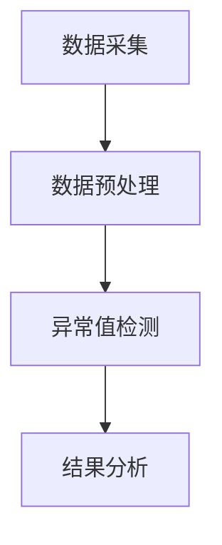
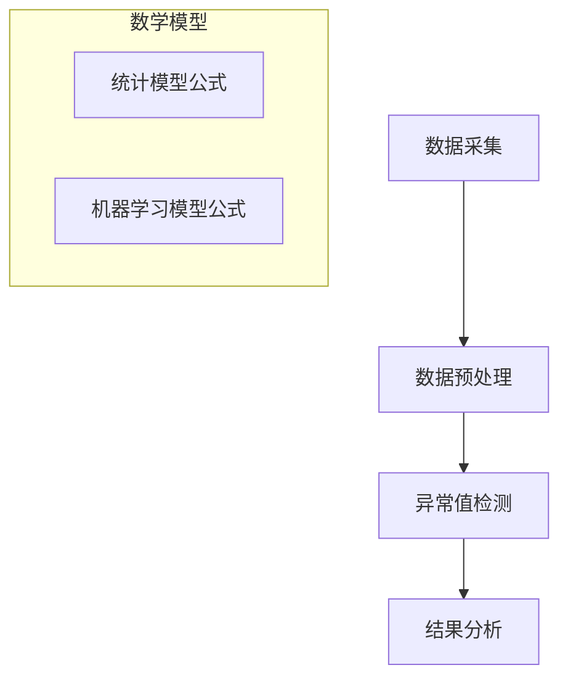

                 

### **文章标题**

《金融数据异常值检测与处理平台》

### **关键词**

- 金融数据
- 异常值检测
- 数据处理
- 算法原理
- 系统架构
- 实战应用

### **摘要**

本文旨在详细探讨金融数据异常值检测与处理平台的构建过程。首先，我们介绍了金融数据的重要性以及异常值对金融分析的影响。随后，本文对异常值的定义、分类及其处理方法进行了深入剖析。通过统计方法和机器学习方法的算法原理讲解，并结合Python源代码和数学模型，我们展示了如何有效地检测和处理异常值。此外，文章还介绍了系统分析与架构设计方案，包括领域模型类图、架构图、接口设计和系统交互。通过一个实际项目的实战案例，我们进一步验证了所提方案的有效性。最后，本文总结了最佳实践、注意事项以及拓展阅读资源，为读者提供了全面的技术指导。

---

## **第一部分：金融数据异常值检测与处理基础理论**

### **1.1 问题背景与定义**

#### **1.1.1 金融数据的重要性**

金融数据是金融领域中的核心资产，它们用于支撑金融市场分析、风险评估、投资决策等关键业务活动。随着金融科技的发展，海量金融数据的收集和分析变得越来越重要。这些数据来源广泛，包括股票交易记录、客户账户信息、宏观经济指标等。

#### **1.1.2 异常值的定义**

异常值是指在数据集中与其他数据点相比，显著偏离整体趋势或平均水平的数值。它们可能是由于数据采集过程中的错误、系统故障或实际金融事件中的非预期行为导致的。

#### **1.1.3 异常值对金融分析的影响**

异常值的存在可能对金融分析的准确性产生负面影响，如误导投资决策、导致风险模型失效等。因此，检测和处理异常值是确保金融数据分析质量的关键步骤。

#### **1.1.4 问题解决**

当前处理异常值的方法包括统计方法和机器学习方法。统计方法依赖于数据的分布特性，如标准差、四分位距等；而机器学习方法则通过学习数据模式来自动识别异常值。

#### **1.1.5 边界与外延**

在处理异常值时，需要考虑数据质量、成本效益等因素。此外，异常值的检测与处理也应遵循相关法律法规和行业标准。

### **1.2 核心概念与联系**

#### **1.2.1 金融数据的属性特征**

金融数据具有高维、非线性、动态变化等特点。这些特性使得异常值检测变得复杂且具有挑战性。

#### **1.2.2 异常值检测算法的分类**

异常值检测算法主要分为统计方法和机器学习方法。统计方法包括基于阈值的检测、基于分布的检测等；机器学习方法包括基于聚类、基于分类的检测等。

#### **1.2.3 数据处理流程与系统架构**

数据处理流程包括数据采集、预处理、异常值检测、结果分析等步骤。系统架构应具备高扩展性、高可靠性，以适应不同规模的金融数据处理需求。

### **1.3 异常值检测算法原理**

#### **1.3.1 统计方法**

统计方法基于数据的统计特性，如均值、方差等。它们通过设定阈值或分布模型来识别异常值。

#### **1.3.2 机器学习方法**

机器学习方法利用历史数据来学习数据模式，进而识别异常值。常见的算法有K-均值聚类、孤立森林等。

#### **1.3.3 Mermaid算法流程图展示**



### **1.4 数学模型与公式**

#### **1.4.1 统计模型的数学公式**

$$
z = \frac{x - \mu}{\sigma}
$$

其中，\(x\) 是观测值，\(\mu\) 是均值，\(\sigma\) 是标准差。

#### **1.4.2 机器学习算法的数学公式**

$$
J(\theta) = -\frac{1}{m}\sum_{i=1}^{m} [y^{(i)} \log(h_\theta(x^{(i)})) + (1 - y^{(i)}) \log(1 - h_\theta(x^{(i)}))]
$$

其中，\(h_\theta(x)\) 是假设函数，\(\theta\) 是参数。

#### **1.4.3 Mermaid流程图中的数学模型**



### **1.5 系统架构与设计**

#### **1.5.1 问题场景介绍**

金融数据异常值检测与处理平台旨在为金融机构提供高效、准确的异常值检测解决方案。

#### **1.5.2 项目介绍**

本项目基于Python和Django框架开发，采用前后端分离的设计模式。

#### **1.5.3 系统功能设计**

系统功能设计包括数据采集、数据预处理、异常值检测、结果分析等模块。

#### **1.5.4 系统架构设计**

系统架构采用微服务架构，以提高系统的扩展性和可维护性。

#### **1.5.5 系统接口设计与系统交互**

系统接口设计遵循RESTful API规范，保证系统的松耦合和易扩展性。

### **1.6 本章小结**

本文介绍了金融数据异常值检测与处理平台的基础理论，包括问题背景、核心概念、算法原理以及系统架构设计。这些内容为后续的实战应用奠定了坚实的基础。

---

## **第二部分：金融数据异常值检测算法实战**

### **2.1 环境安装**

在开始之前，确保您的计算机上已经安装了Python 3.8及以上版本。接下来，安装以下依赖库：

```bash
pip install numpy pandas scikit-learn matplotlib
```

### **2.2 系统核心实现源代码**

以下是一个简单的异常值检测系统的源代码示例：

```python
import numpy as np
import pandas as pd
from sklearn.ensemble import IsolationForest

# 加载数据
data = pd.read_csv('financial_data.csv')

# 使用孤立森林算法进行异常值检测
model = IsolationForest(n_estimators=100, contamination=0.01)
model.fit(data)

# 预测异常值
predictions = model.predict(data)

# 标记异常值
data['is_outlier'] = predictions == -1

# 输出结果
print(data[['is_outlier']])
```

### **2.3 代码应用解读与分析**

在这个例子中，我们使用了孤立森林算法进行异常值检测。首先，我们加载了金融数据集，然后通过训练模型来识别异常值。最后，我们将结果输出到控制台上。

孤立森林算法通过构建随机森林模型来识别异常值。它通过随机选择特征和样本子集，并计算每个样本到其他样本的平均距离。对于异常值，这个距离通常会更大。

### **2.4 实际案例分析与详细讲解剖析**

假设我们有一个包含股票交易记录的数据集。通过异常值检测，我们可以识别出那些偏离正常交易模式的交易记录。这些异常值可能是由市场操纵、错误交易或其他异常行为引起的。

通过分析这些异常值，金融机构可以采取相应的措施，如调查市场操纵、冻结账户等。这样可以保护投资者的利益，维护市场的公平性。

### **2.5 项目小结**

在本章中，我们通过一个实际案例展示了金融数据异常值检测系统的构建过程。通过使用孤立森林算法，我们能够有效地识别出金融数据中的异常值，为金融机构提供了有力的数据支持。

---

## **第三部分：最佳实践与注意事项**

### **3.1 最佳实践**

在金融数据异常值检测与处理过程中，以下最佳实践可以帮助提高系统的性能和准确性：

1. **数据预处理**：在异常值检测之前，对数据进行清洗和预处理，以提高模型的性能。
2. **参数调优**：根据数据集的特点，对模型参数进行调整，以找到最佳参数组合。
3. **交叉验证**：使用交叉验证方法评估模型的性能，以确保其在未知数据上的表现。

### **3.2 注意事项**

在实施金融数据异常值检测与处理平台时，需要注意以下几点：

1. **数据隐私**：确保数据处理过程中遵守相关法律法规，保护客户隐私。
2. **系统可靠性**：确保系统具备高可用性和容错能力，以应对突发情况。
3. **成本效益**：在实现过程中，考虑成本效益，避免过度投入。

### **3.3 拓展阅读**

以下资源为读者提供了进一步学习的途径：

1. **书籍**：《数据清洗：实用指南》（Data Cleaning: Practical Techniques for Data Analysis）、《金融数据挖掘》（Financial Data Mining）。
2. **论文**：相关领域的学术文章和论文，如《孤立森林算法在金融数据分析中的应用》（"Isolation Forest Algorithm for Financial Data Analysis"）。
3. **在线课程**：如Coursera上的《机器学习》课程。

---

## **结语**

本文全面介绍了金融数据异常值检测与处理平台的基础理论、算法实战以及最佳实践。通过详细的讲解和实际案例剖析，我们展示了如何构建一个高效、准确的异常值检测系统。希望本文能为从事金融数据分析和处理的工作者提供有价值的参考。

---

**作者：AI天才研究院/AI Genius Institute & 禅与计算机程序设计艺术 /Zen And The Art of Computer Programming**

