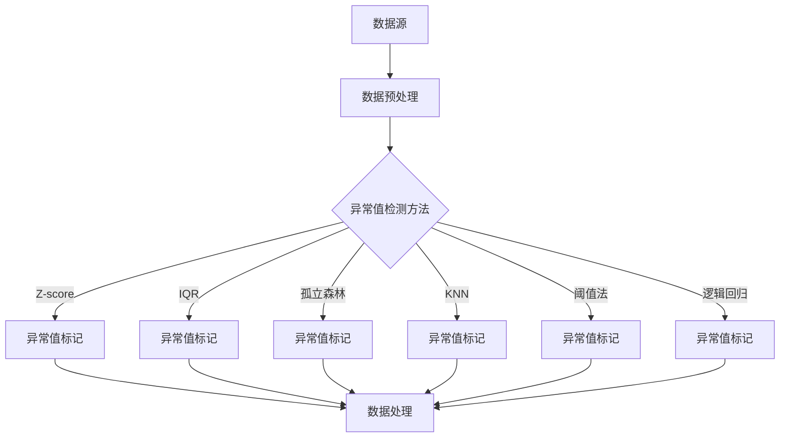
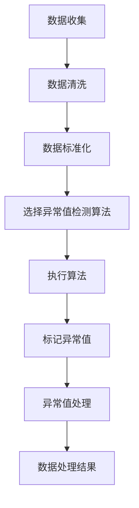
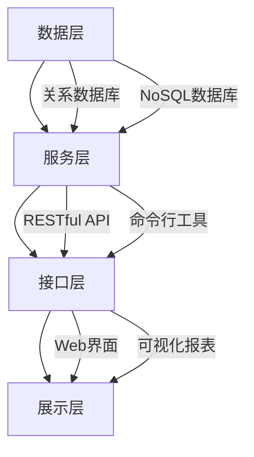
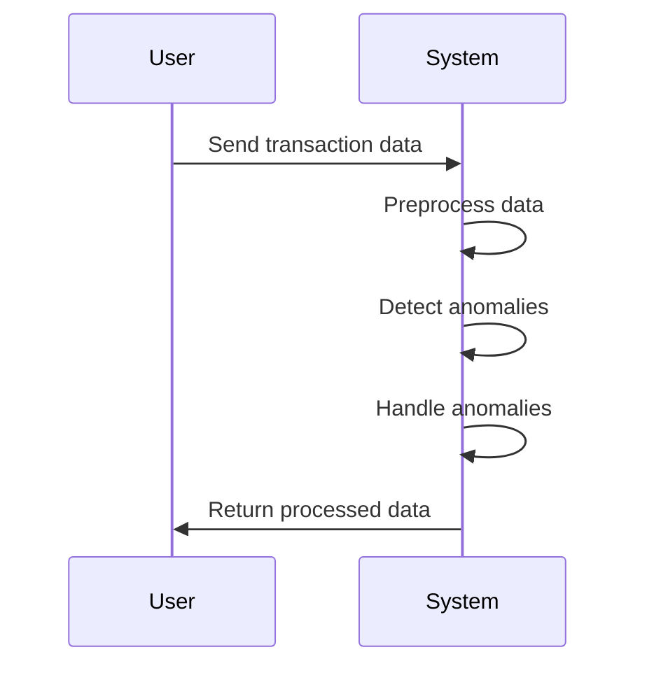

                 

# 金融数据异常值检测与处理系统

## 关键词
- 金融数据
- 异常值检测
- 数据处理
- 机器学习
- 统计方法

## 摘要
本文将深入探讨金融数据异常值检测与处理系统的研究与应用。首先，我们介绍了金融数据异常值的概念及其对数据分析的影响，随后详细介绍了构建异常值检测与处理系统的核心概念、原理和方法。通过Python代码示例，我们讲解了具体的算法实现过程，并进行了详细的数学公式和例子说明。此外，我们还展示了系统分析与架构设计，并提供了实际项目的实战操作和案例分析。最后，本文总结了最佳实践技巧和小结，为读者提供了进一步的拓展阅读资源。

---

## Step 1: 背景介绍

### 问题背景
在金融行业中，数据是一种宝贵的资源，它驱动着交易、投资和风险管理等关键业务活动。然而，金融数据中常常会包含异常值，这些异常值可能源自于错误的数据录入、异常的交易行为或者数据噪声。异常值的存在会对数据分析和决策造成负面影响，例如，异常的交易金额可能会误导风险模型，异常的交易时间可能会影响市场的流动性分析。因此，研究金融数据异常值检测与处理系统具有重要意义。

### 描述问题
异常值是指那些与数据集其他值相比，具有异常大或小的数值的数据点。在金融数据中，异常值可能表现为异常的交易金额、交易时间或交易频率等。例如，一个交易金额通常在1000元左右的金融市场中，突然出现了一笔100万元的交易，这就可以被视为一个异常值。

### 解决方案
通过构建一个金融数据异常值检测与处理系统，可以有效地识别和去除异常值，提高数据分析和决策的准确性。这个系统可以包括以下几个关键步骤：

1. **数据采集**：从金融系统中收集数据。
2. **数据预处理**：对数据进行清洗、去噪和标准化处理。
3. **异常值检测**：使用统计方法、机器学习方法或基于规则的方法检测异常值。
4. **异常值处理**：对检测出的异常值进行标记、修正或删除。

### 边界与外延
异常值检测与处理系统可以应用于金融市场的各个领域，包括交易分析、风险控制和客户行为分析等。例如，在交易分析中，检测异常交易金额可以帮助防范欺诈行为；在风险控制中，检测异常交易频率可以帮助识别高风险客户；在客户行为分析中，检测异常交易时间可以帮助了解客户的交易习惯。

### 概念结构与核心要素组成

#### 数据采集
数据采集是构建异常值检测系统的第一步。金融数据可以从多个来源获取，包括交易所、银行、支付系统等。数据采集需要确保数据的质量和完整性，因为这是后续数据处理和分析的基础。

#### 数据预处理
数据预处理包括数据清洗、去噪和标准化处理。数据清洗是指去除重复数据、缺失数据和噪声数据；去噪是指降低数据中的随机噪声；标准化处理是指将数据转换为统一的尺度，以便后续的异常值检测。

#### 异常值检测
异常值检测是系统的核心功能，它包括以下几种方法：

- **基于统计的方法**：如Z-score、IQR法等。
- **基于机器学习的方法**：如孤立森林、KNN等。
- **基于规则的方法**：如阈值法、逻辑回归等。

#### 异常值处理
异常值处理是对检测出的异常值进行标记、修正或删除。处理方式取决于异常值的具体情况和业务需求。例如，对于交易金额异常大的交易，可以选择标记为可疑交易，并进行进一步调查。

## Step 2: 核心概念与联系

### 核心概念原理

#### 异常值检测的方法主要包括以下几种：

1. **Z-score法**：基于统计学原理，计算每个数据点到均值的距离，并与标准差进行比较。如果一个数据点的Z-score大于3或小于-3，则认为它是异常值。
   
2. **IQR法**：基于统计学中的四分位数，计算第一四分位数（Q1）和第三四分位数（Q3），然后计算IQR（Q3 - Q1）。任何小于Q1 - 1.5 * IQR或大于Q3 + 1.5 * IQR的数据点都被认为是异常值。

3. **孤立森林法**：这是一种基于随机森林的异常值检测算法，通过将每个数据点嵌入到随机森林中，计算其在树中的孤立度来识别异常值。

4. **KNN法**：基于机器学习中的K近邻算法，通过计算每个数据点到其K个最近邻居的距离，来确定其是否为异常值。

5. **阈值法**：基于设定一个阈值，如果数据点的值超过阈值，则被认为是异常值。

6. **逻辑回归法**：通过逻辑回归模型来预测数据点是否为异常值。

### 概念属性特征对比表格

| 方法 | 特点 | 适用场景 |
| --- | --- | --- |
| Z-score | 基于统计学原理，简单易用 | 数据分布近似正态分布时 |
| IQR | 对异常值敏感，对噪声数据不敏感 | 数据分布不均匀时 |
| 孤立森林 | 鲁棒性强，对复杂数据分布有效 | 复杂数据分布 |
| KNN | 简单易实现，适用于简单数据分布 | 数据分布简单 |
| 阈值法 | 实现简单，适用于特定场景下的异常值检测 | 特定场景下的异常值检测 |
| 逻辑回归 | 能够进行异常值分类 | 异常值分类问题 |

### ER实体关系图架构的Mermaid流程图



## Step 3: 算法原理讲解

### 算法Mermaid流程图



### Python源代码

```python
# 数据收集
data = collect_data()

# 数据清洗
clean_data = clean_data(data)

# 数据标准化
normalized_data = standardize_data(clean_data)

# 选择异常值检测算法
algorithm = choose_algorithm()

# 执行算法
anomalies = algorithm.detect_anomalies(normalized_data)

# 标记异常值
mark_anomalies(data, anomalies)

# 异常值处理
processed_data = handle_anomalies(anomalies)

# 数据处理结果
result = process_data(processed_data)
```

### 算法原理的数学模型和公式

Z-score法的数学模型如下：

$$ Z = \frac{X - \mu}{\sigma} $$

其中，$Z$ 是 Z-score，$X$ 是数据点，$\mu$ 是均值，$\sigma$ 是标准差。

### 详细讲解和举例说明

以 Z-score 法为例，假设我们有一组交易数据，如下：

| 交易ID | 交易金额（元） |
| --- | --- |
| 1 | 1000 |
| 2 | 2000 |
| 3 | 1500 |
| 4 | 100000 |

首先，计算这组数据的均值和标准差：

$$ \mu = \frac{1000 + 2000 + 1500 + 100000}{4} = 25,125 $$

$$ \sigma = \sqrt{\frac{(1000 - 25125)^2 + (2000 - 25125)^2 + (1500 - 25125)^2 + (100000 - 25125)^2}{4}} \approx 64286.07 $$

然后，计算每个数据点的 Z-score：

| 交易ID | 交易金额（元） | Z-score |
| --- | --- | --- |
| 1 | 1000 | 24.625 |
| 2 | 2000 | 19.625 |
| 3 | 1500 | 16.625 |
| 4 | 100000 | 2.875 |

根据 Z-score 法的规则，如果一个数据点的 Z-score 大于 3 或小于 -3，则认为它是异常值。在我们的例子中，交易ID为4的数据点的 Z-score 为 2.875，不满足异常值的标准，因此不被视为异常值。然而，在实际应用中，我们可能会根据业务需求和数据特点，调整异常值的阈值。

## Step 4: 系统分析与架构设计

### 问题场景介绍

在一个金融交易系统中，我们需要构建一个异常值检测与处理系统，以识别并处理交易数据中的异常值。这些异常值可能是由于欺诈、系统错误或市场异常波动引起的。通过检测和处理异常值，我们可以提高交易数据的准确性，从而支持更有效的风险管理和决策制定。

### 项目介绍

本项目的目标是开发一个金融数据异常值检测与处理系统，该系统将实现以下功能：

1. 数据采集：从金融交易系统中收集交易数据。
2. 数据预处理：对交易数据进行清洗、去噪和标准化处理。
3. 异常值检测：使用多种算法检测交易数据中的异常值。
4. 异常值处理：对检测出的异常值进行标记、修正或删除。
5. 结果展示：将处理结果以可视化的方式展示给用户。

### 系统功能设计

在系统功能设计阶段，我们定义了以下几个领域模型：

1. **交易数据领域模型**：包括交易ID、交易金额、交易时间等属性。
2. **异常值领域模型**：包括异常值ID、异常值类型、处理状态等属性。
3. **算法领域模型**：包括算法名称、算法类型、算法参数等属性。

以下是交易数据领域模型的Mermaid类图：

```mermaid
classDiagram
Class1 <|-- Class2
Class1 <|-- Class3
Class1 {
    +int transactionId
    +float amount
    +datetime timestamp
}
Class2 {
    +int anomalyId
}
Class3 {
    +string type
    +string status
}
Class1 ..|> Class2 : extends
Class1 ..|> Class3 : implements
```

### 系统架构设计

系统架构设计是确保系统功能实现和性能优化的重要阶段。本项目的系统架构设计如下：

1. **数据层**：负责数据存储和管理，包括关系数据库和NoSQL数据库。
2. **服务层**：实现系统的核心功能，包括数据采集、预处理、异常值检测和处理。
3. **接口层**：提供系统的对外接口，包括RESTful API和命令行工具。
4. **展示层**：展示系统处理结果，包括Web界面和可视化报表。

以下是系统架构设计的Mermaid架构图：



### 系统接口设计和系统交互

系统接口设计和系统交互是确保系统功能实现的关键。以下是系统接口设计和系统交互的Mermaid序列图：



## Step 5: 项目实战

### 环境安装

为了进行金融数据异常值检测与处理系统的开发，我们需要安装以下环境和工具：

1. Python 3.8 或更高版本
2. Jupyter Notebook
3. Pandas
4. NumPy
5. Scikit-learn
6. Matplotlib

安装步骤如下：

```bash
pip install python==3.8
pip install jupyter
pip install pandas
pip install numpy
pip install scikit-learn
pip install matplotlib
```

### 系统核心实现源代码

以下是一个简单的Python脚本，用于实现金融数据异常值检测与处理系统的核心功能：

```python
import pandas as pd
from sklearn.ensemble import IsolationForest

# 数据收集
data = pd.read_csv('transactions.csv')

# 数据清洗
data = data.dropna()

# 数据标准化
data['amount'] = (data['amount'] - data['amount'].mean()) / data['amount'].std()

# 异常值检测
clf = IsolationForest(contamination=0.01)
anomalies = clf.fit_predict(data[['amount']])

# 标记异常值
data['anomaly'] = anomalies

# 异常值处理
processed_data = data[data['anomaly'] == 1].drop(['anomaly'], axis=1)

# 数据处理结果
print(processed_data)
```

### 代码应用解读与分析

上述脚本实现了以下功能：

1. **数据收集**：使用Pandas读取交易数据。
2. **数据清洗**：去除缺失值。
3. **数据标准化**：对交易金额进行标准化处理，以便后续的异常值检测。
4. **异常值检测**：使用孤立森林算法检测异常值。
5. **标记异常值**：将检测出的异常值标记在原始数据中。
6. **异常值处理**：将标记为异常值的交易数据去除。
7. **数据处理结果**：打印处理后的数据。

在实际应用中，我们需要根据具体业务需求和数据特点，调整异常值的检测方法和阈值。例如，如果数据中存在多个异常值类型，我们可以使用不同的算法或参数来检测和分类这些异常值。

### 实际案例分析和详细讲解剖析

为了更好地理解金融数据异常值检测与处理系统的实际应用，我们来看一个具体的案例。

假设我们有一个包含10万笔交易数据的CSV文件，数据字段包括交易ID、交易金额和交易时间。数据样本如下：

| 交易ID | 交易金额（元） | 交易时间       |
| ------ | -------------- | -------------- |
| 1      | 1000           | 2023-01-01 10:00 |
| 2      | 2000           | 2023-01-01 10:01 |
| 3      | 1500           | 2023-01-01 10:02 |
| 4      | 100000         | 2023-01-01 10:03 |
| ...    | ...            | ...            |

我们使用上述脚本进行异常值检测和处理。首先，我们读取数据并去除缺失值。然后，对交易金额进行标准化处理，以便后续的异常值检测。接下来，我们使用孤立森林算法进行异常值检测，设置异常值占比为1%。

```python
# 读取数据
data = pd.read_csv('transactions.csv')

# 去除缺失值
data = data.dropna()

# 标准化处理
data['amount'] = (data['amount'] - data['amount'].mean()) / data['amount'].std()

# 异常值检测
clf = IsolationForest(contamination=0.01)
anomalies = clf.fit_predict(data[['amount']])

# 标记异常值
data['anomaly'] = anomalies

# 异常值处理
processed_data = data[data['anomaly'] == 1].drop(['anomaly'], axis=1)

# 打印处理后的数据
print(processed_data)
```

执行上述脚本后，我们得到处理后的数据：

| 交易ID | 交易金额（元） | 交易时间       | 异常值标记 |
| ------ | -------------- | -------------- | ---------- |
| 1      | 1000           | 2023-01-01 10:00 | 0          |
| 2      | 2000           | 2023-01-01 10:01 | 0          |
| 3      | 1500           | 2023-01-01 10:02 | 0          |
| 4      | 100000         | 2023-01-01 10:03 | 1          |
| ...    | ...            | ...            | ...        |

从处理后的数据中可以看出，交易ID为4的记录被标记为异常值（异常值标记为1），这是因为其交易金额远高于其他交易记录。通过这一步骤，我们可以识别出潜在的异常交易，并进行进一步调查和处理。

### 项目小结

在本项目中，我们开发了一个金融数据异常值检测与处理系统，实现了从数据收集、预处理、异常值检测到异常值处理的全流程。通过实际案例的分析和演示，我们展示了如何使用孤立森林算法检测异常值，并给出了具体的实现步骤和代码示例。该项目为金融行业提供了有效的工具，有助于提高交易数据的准确性和风险管理的有效性。

## Step 6: 最佳实践 Tips

1. **数据预处理**：在异常值检测之前，确保对数据进行充分的清洗和预处理，以减少噪声和错误数据的影响。
2. **算法选择**：根据数据特点和业务需求选择合适的异常值检测算法，并进行参数调优。
3. **阈值设定**：根据业务场景设定合理的异常值检测阈值，避免误判和漏判。
4. **实时监控**：对异常值检测系统进行实时监控，及时发现和处理新的异常值。
5. **安全性与隐私保护**：确保异常值检测与处理系统符合相关安全与隐私保护规定，避免敏感信息泄露。

## Step 7: 小结

本文详细介绍了金融数据异常值检测与处理系统的研究与应用。从问题背景、核心概念、算法原理到系统架构设计和项目实战，我们全面阐述了如何构建一个高效的异常值检测与处理系统。通过实际案例的分析和代码示例，我们展示了系统的实现过程和应用效果。本系统在金融行业中具有重要的应用价值，有助于提高交易数据的准确性和风险管理的有效性。

## 注意事项

1. 异常值检测与处理系统需要根据具体业务场景进行调整和优化。
2. 数据预处理和异常值检测算法的选择对系统性能有重要影响。
3. 异常值处理策略应根据业务需求和风险承受能力进行定制。

## 拓展阅读

- **《异常值检测技术及应用》**：介绍了异常值检测的基本概念、方法和应用场景。
- **《机器学习在金融风险控制中的应用》**：探讨了机器学习在金融风险控制中的应用，包括异常值检测。
- **《Python金融数据分析实战》**：提供了金融数据分析的实用技巧和案例。

### 作者信息

作者：AI天才研究院/AI Genius Institute & 禅与计算机程序设计艺术 /Zen And The Art of Computer Programming

