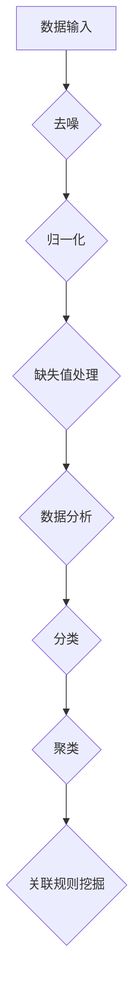

                 

### 让我们一步一步思考：金融数据收集与处理

在本文中，我们将采用“一步步思考”的方式，深入探讨金融数据收集与处理的重要议题。我们将从背景介绍开始，逐步了解核心概念，详细讲解算法原理，分析数学模型，阐述系统设计与实施，并最终提供最佳实践和拓展阅读资源。以下是我们的步骤：

#### 第一步：背景介绍

1. **金融数据的重要性**：
   - 金融数据是金融市场运作的基础，对于金融机构、投资者和研究人员至关重要。
   - 它包括市场交易数据、宏观经济指标、公司财务报告等，为金融分析和决策提供依据。

2. **数据收集与处理的挑战**：
   - 数据量大，处理速度快，需要高效的数据收集和处理技术。
   - 数据质量参差不齐，需要数据清洗和预处理技术。
   - 隐私和安全问题是数据收集与处理的重大挑战。

3. **本书目的与结构安排**：
   - 本书旨在提供金融数据收集与处理的全流程指导，从数据源选择、数据采集、预处理，到数据处理和分析，以及数据存储与可视化。

#### 第二步：核心概念与联系

1. **金融数据**：
   - **定义**：金融数据是指与金融市场相关的各类数据。
   - **类型**：包括股票交易数据、外汇数据、债券数据等。
   - **来源**：可以从公开数据源（如交易所、政府网站）和私有数据源（如金融机构内部数据）获取。

2. **数据收集**：
   - **数据收集的方法**：包括数据爬取、API调用等。
   - **数据清洗**：去除无效、重复或错误的数据，提高数据质量。

3. **数据处理**：
   - **数据处理的目标**：从数据中提取有价值的信息。
   - **数据处理的方法**：包括数据分析、数据挖掘等技术。

#### 第三步：算法原理讲解

1. **数据预处理算法**：
   - **去噪**：使用滤波算法去除数据中的噪声。
   - **归一化**：调整数据范围，使其适合特定算法。
   - **缺失值处理**：使用插值、均值等方法填充缺失值。

2. **数据分析算法**：
   - **描述性统计分析**：计算平均值、中位数、标准差等统计量。
   - **相关性分析**：检测不同变量之间的相关性。
   - **趋势分析**：识别时间序列数据中的趋势和周期性。

3. **数据挖掘算法**：
   - **分类**：将数据分为不同的类别。
   - **聚类**：将相似的数据点分组。
   - **关联规则挖掘**：发现数据之间的关联规则。

使用mermaid绘制算法流程图，并结合Python代码和LaTeX公式详细讲解算法原理。例如：

#### 第四步：数学模型和数学公式

使用LaTeX格式嵌入文中独立段落，详细讲解金融数据处理的数学模型和公式。例如：

$$
\sigma^2 = \frac{1}{n-1}\sum_{i=1}^{n}(x_i - \bar{x})^2
$$

这段公式描述了标准差的计算方法，用于描述数据集的离散程度。

#### 第五步：系统分析与架构设计方案

1. **问题场景**：介绍金融数据收集与处理的具体应用场景。
2. **系统功能设计**：使用mermaid绘制领域模型类图，详细描述系统功能。
3. **系统架构设计**：使用mermaid绘制系统架构图，展示各组件之间的关系。
4. **系统接口设计**：描述系统与外部系统交互的接口。
5. **系统交互**：使用mermaid绘制序列图，展示系统组件之间的交互流程。

#### 第六步：项目实战

1. **环境安装**：介绍安装所需的环境和工具。
2. **系统核心实现源代码**：提供关键代码示例，并进行解读。
3. **代码应用解读与分析**：分析代码实现的具体步骤和逻辑。
4. **实际案例分析和详细讲解剖析**：分析真实案例，展示数据处理过程。
5. **项目小结**：总结项目的主要成果和经验。

#### 第七步：最佳实践与总结

1. **最佳实践**：提供数据收集与处理的最佳实践建议。
2. **小结**：总结文章的主要观点和结论。
3. **注意事项**：提醒读者在实施过程中需要注意的问题。
4. **拓展阅读**：推荐相关的书籍和在线资源。

通过以上七个步骤，我们将对金融数据收集与处理进行全面而深入的探讨，帮助读者理解和掌握相关技术。在接下来的文章中，我们将逐一深入每个步骤，提供详细的讲解和实例。让我们开始这一段旅程吧！

