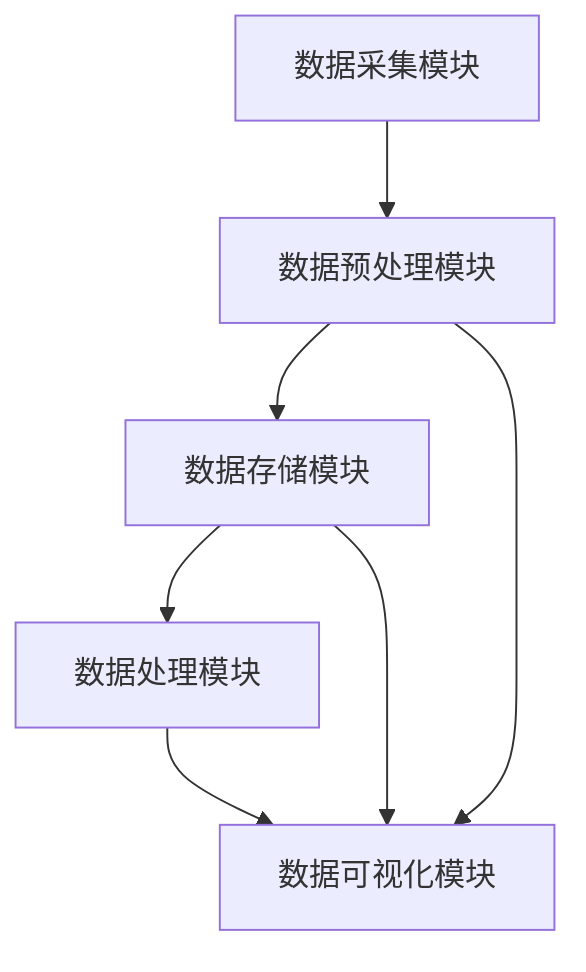

                 

### 第1章: 金融数据的实时处理与分析概述

#### 1.1 问题背景

金融行业的蓬勃发展带来了海量的数据，这些数据包括交易记录、客户信息、市场动态等。随着金融市场的日益复杂和快速变化，对数据的处理和分析能力提出了更高的要求。目前，金融行业的数据处理面临以下挑战：

- **数据量巨大且持续增长**：金融行业每天产生大量的交易数据、市场数据、客户数据等，数据量呈指数级增长。
- **数据类型多样化**：金融数据包括文本、图像、音频、视频等多种类型，不同类型的数据处理方法各异。
- **数据处理需求高**：实时性、准确性和安全性是金融数据处理的重要需求。金融市场的波动可能在一瞬间决定企业的命运，因此对数据的实时处理能力要求极高。
- **合规性要求严格**：金融行业受到严格的法律法规监管，数据处理必须遵守相关法律法规，如数据隐私保护、数据质量监管等。

#### 1.1.1 金融行业数据处理的现状

当前，金融行业的数据处理主要依赖于以下技术手段：

- **传统批处理**：通过定期对数据进行批量处理，生成报表、统计结果等。这种方法处理效率较低，且难以满足实时性的需求。
- **实时数据处理**：利用流处理技术，如Apache Kafka、Apache Flink等，对实时数据进行处理和分析，以实现快速响应。
- **大数据技术**：采用Hadoop、Spark等技术进行大规模数据处理，提升数据处理能力和效率。

然而，传统的数据处理方法已难以满足金融行业的快速发展和复杂需求，因此，对金融数据的高效实时处理与分析变得尤为重要。

#### 1.1.2 金融数据分析的重要性

金融数据分析在金融行业中扮演着关键角色，其重要性体现在以下几个方面：

- **提高投资决策效率**：通过实时数据分析，可以帮助投资者快速识别市场机会和风险，提高投资决策的准确性和及时性。
- **增强风险管理能力**：实时数据分析能够及时发现潜在的金融风险，如市场波动、交易异常等，从而采取及时的措施进行风险控制。
- **改善客户服务**：通过对客户数据的分析，可以了解客户的需求和行为，提供个性化的金融服务，提升客户满意度和忠诚度。
- **发现市场机会**：通过对市场数据的分析，可以发现潜在的市场机会，如新的业务领域、新兴市场等，从而制定相应的业务策略。
- **优化业务策略**：实时数据分析可以为企业提供准确的市场趋势和客户需求信息，帮助企业调整和优化业务策略，提高市场竞争力。

#### 1.1.3 实时处理的意义

在金融行业中，实时数据处理具有重要意义：

- **及时响应**：金融市场变化迅速，实时数据处理能够快速捕捉市场动态，为企业提供及时的信息支持。
- **提高竞争力**：实时数据处理能力是金融企业竞争力的体现。具备强大的实时数据处理能力的企业能够在市场中占据有利地位，抢占先机。
- **风险控制**：实时数据处理能够及时发现市场风险，采取预防措施，降低风险对企业的影响。

综上所述，金融数据的实时处理与分析是金融行业发展的必然趋势，具有极高的实际应用价值。

#### 1.2 核心概念

要深入了解金融数据的实时处理与分析，需要掌握以下几个核心概念：

- **实时数据处理**：实时数据处理是指在短时间内对大量数据进行快速处理和分析的能力。与传统的批处理不同，实时数据处理能够提供快速、高效的数据分析结果，满足金融行业对数据处理速度的要求。
- **数据分析**：数据分析是从大量数据中提取有价值信息的过程。数据分析包括统计方法、机器学习、深度学习等多种类型，可以帮助企业发现市场机会、优化业务策略等。
- **金融数据特征**：金融数据的特征包括多样性、复杂性和时变性。金融数据类型多样，如文本、图像、数值等；数据之间存在复杂的关联和依赖关系；金融市场数据随时间不断变化，需要实时处理。

#### 1.2.1 实时数据处理

实时数据处理是指在短时间内对大量数据进行快速处理和分析的能力。实时数据处理的核心在于“实时性”，即能够在数据产生后短时间内完成处理和分析。实时数据处理技术包括流处理技术和批处理技术的结合。

- **流处理技术**：流处理技术如Apache Kafka、Apache Flink等，能够对实时数据流进行高效处理，提供低延迟的数据处理能力。
- **批处理技术**：批处理技术如MapReduce、Spark等，适用于大规模数据的批量处理，能够在短时间内处理大量数据。

#### 1.2.2 数据分析

数据分析是从大量数据中提取有价值信息的过程。数据分析的类型多种多样，包括统计方法、机器学习、深度学习等。

- **统计方法**：统计方法包括描述性统计和推断性统计，用于描述数据特征和发现数据中的规律性。
- **机器学习**：机器学习通过构建模型，对数据进行学习和预测，可以帮助企业发现市场机会、优化业务策略等。
- **深度学习**：深度学习是机器学习的一种，通过神经网络对数据进行建模，能够处理复杂的非线性关系。

#### 1.2.3 金融数据的特征

金融数据的特征主要体现在以下几个方面：

- **多样性**：金融数据类型多样，包括交易记录、客户信息、市场动态等，不同类型的数据需要不同的处理方法。
- **复杂性**：金融数据之间存在复杂的关联和依赖关系，如交易数据之间的相关性、市场数据之间的波动性等。
- **时变性**：金融市场数据随时间不断变化，需要实时处理和分析，以便及时响应市场变化。

#### 1.3 金融数据的实时处理与分析框架

金融数据的实时处理与分析框架包括数据采集、数据预处理、数据存储、数据分析、结果可视化等环节。

- **数据采集**：通过日志收集、数据库同步、网络爬虫等方式采集金融数据。
- **数据预处理**：对采集到的数据进行清洗、去重、格式转换等预处理操作，以提高数据质量。
- **数据存储**：选择合适的数据存储方案，如关系型数据库、NoSQL数据库等，以存储和管理数据。
- **数据分析**：采用统计分析、机器学习、深度学习等方法对数据进行分析，提取有价值的信息。
- **结果可视化**：通过可视化工具如Tableau、D3.js等，将分析结果以图表形式展示，便于用户理解和分析。

#### 1.4 边界与外延

在金融数据的实时处理与分析过程中，需要考虑以下边界与外延问题：

- **数据隐私保护**：金融数据涉及客户隐私，需要采取数据加密、匿名化处理等措施，确保数据隐私安全。
- **数据质量管理**：数据质量是金融数据分析的基础，需要通过数据清洗、数据一致性检查等措施，确保数据质量。
- **数据合规性**：金融数据处理需要遵守相关法律法规，如GDPR、CCPA等，确保数据处理符合法规要求。

#### 1.5 本章小结

本章概述了金融数据的实时处理与分析的重要性、核心概念以及处理框架。接下来，本书将详细介绍实时数据处理的技术原理、实现方法以及具体应用案例，帮助读者深入理解金融数据的实时处理与分析。

----------------------------------------------------------------

### 第2章: 金融数据实时处理技术原理

#### 2.1 数据流处理技术

数据流处理技术是金融数据实时处理的重要手段，它能够对实时数据流进行高效处理和分析。本节将介绍数据流处理技术的基本概念、原理以及常用技术。

##### 2.1.1 概述

数据流处理是一种针对连续数据流的处理技术，其目标是在短时间内对大量数据进行快速处理和分析。与传统的批处理相比，数据流处理具有实时性、高效性和低延迟的特点。

- **实时性**：数据流处理能够对实时数据流进行快速处理，及时响应数据变化。
- **高效性**：数据流处理技术能够高效地处理大规模数据，提升数据处理效率。
- **低延迟**：数据流处理技术具有较低的延迟，能够快速生成分析结果，满足金融行业对数据处理速度的要求。

##### 2.1.2 技术原理

数据流处理技术的核心原理是基于事件驱动模型和批量处理模型。事件驱动模型是指以数据事件为单位进行数据处理，每个事件独立处理，处理完成后继续处理下一个事件。批量处理模型是指将一定时间范围内的数据作为一个批量进行处理，以提升数据处理效率。

- **事件驱动模型**：事件驱动模型适用于实时性要求较高的场景，如金融交易监控、实时市场分析等。
- **批量处理模型**：批量处理模型适用于数据处理量较大的场景，如定期报表生成、历史数据分析等。

##### 2.1.3 常用技术

常用的数据流处理技术包括Apache Kafka、Apache Flink等。

- **Apache Kafka**：Apache Kafka是一个分布式流处理平台，能够对实时数据流进行高效处理和分析。Kafka具有高吞吐量、可扩展性强、可靠性高等特点，适用于金融交易监控、实时数据分析等场景。
- **Apache Flink**：Apache Flink是一个流处理框架，能够对实时数据进行流式计算和批处理计算。Flink具有实时性强、低延迟、易于扩展等特点，适用于金融数据实时处理和分析。

##### 2.1.4 应用案例

数据流处理技术在金融行业有广泛的应用，以下为几个典型应用案例：

- **金融交易监控**：通过数据流处理技术，实时捕捉交易数据，对交易风险进行监控和分析，及时发现异常交易，保障交易安全。
- **市场分析**：通过数据流处理技术，实时分析市场走势，为投资决策提供支持。如实时分析股票市场、外汇市场的波动情况，预测市场走势，制定投资策略。

##### 2.2 数据预处理技术

数据预处理技术是金融数据实时处理的重要环节，其目标是通过清洗、去重、格式转换等操作，提高数据质量，为后续分析提供可靠数据。本节将介绍数据预处理技术的基本概念、原理以及常用技术。

##### 2.2.1 概述

数据预处理技术包括数据清洗、去重、格式转换等操作。数据清洗是指识别和修复数据中的错误、缺失值等；去重是指确保数据唯一性；格式转换是指统一数据格式，便于后续处理。

- **数据清洗**：数据清洗是数据预处理的核心任务，主要解决数据中的错误、缺失值等问题。如缺失值填补、异常值处理等。
- **去重**：去重是确保数据唯一性的关键步骤，主要通过基于关键字、哈希值等方法实现。
- **格式转换**：格式转换是将不同格式的数据转换为统一格式，以便于后续处理和分析。

##### 2.2.2 数据清洗

数据清洗是数据预处理的关键环节，其任务包括识别和修复数据中的错误、缺失值等。以下为几种常见的数据清洗方法：

- **缺失值填补**：缺失值填补是解决数据缺失问题的有效方法，主要有以下几种方法：
  - 均值填补：用平均值填补缺失值。
  - 中值填补：用中值填补缺失值。
  - 最小值/最大值填补：用最小值/最大值填补缺失值。
  - 前填充/后填充：用前一个值或后一个值填补缺失值。

- **异常值处理**：异常值处理是解决数据异常问题的有效方法，主要有以下几种方法：
  - 删除异常值：直接删除异常值。
  - 填充异常值：用平均值、中值等填补异常值。
  - 调整异常值：对异常值进行调整，使其符合数据分布。

##### 2.2.3 去重

去重是确保数据唯一性的关键步骤，主要通过以下方法实现：

- **基于关键字**：通过关键字匹配，去除重复数据。
- **基于哈希值**：通过哈希函数生成哈希值，去除重复数据。

##### 2.2.4 格式转换

格式转换是将不同格式的数据转换为统一格式，以便于后续处理和分析。常见的格式转换方法包括：

- **文本格式转换**：将文本数据转换为统一的编码格式，如UTF-8等。
- **数值格式转换**：将不同数值类型的数据转换为统一格式，如浮点数转换为整数等。
- **日期格式转换**：将不同日期格式转换为统一的日期格式，如YYYY-MM-DD等。

##### 2.2.5 应用案例

数据预处理技术在金融数据实时处理中具有重要作用，以下为几个应用案例：

- **金融数据报表生成**：通过对金融数据进行清洗、去重、格式转换等预处理操作，生成高质量的报表，为企业管理提供支持。
- **数据仓库构建**：通过对金融数据进行预处理，将预处理后的数据导入数据仓库，为数据分析提供数据基础。

##### 2.3 数据分析技术

数据分析技术是从大量数据中提取有价值信息的过程，其目的是辅助决策、发现市场机会、优化业务策略。数据分析技术包括统计分析、机器学习和深度学习等。

##### 2.3.1 概述

数据分析技术主要包括以下几种：

- **统计分析**：统计分析是数据分析的基础，包括描述性统计和推断性统计。描述性统计用于描述数据特征，推断性统计用于发现数据中的规律性。
- **机器学习**：机器学习是通过构建模型，对数据进行学习和预测。机器学习包括监督学习、无监督学习和半监督学习等。
- **深度学习**：深度学习是机器学习的一种，通过神经网络对数据进行建模。深度学习包括卷积神经网络、循环神经网络、深度神经网络等。

##### 2.3.2 统计分析

统计分析是数据分析的基础，主要包括以下方法：

- **描述性统计分析**：描述性统计分析用于描述数据特征，如均值、中位数、方差等。
- **推断性统计分析**：推断性统计分析用于发现数据中的规律性，如假设检验、回归分析等。

##### 2.3.3 机器学习

机器学习是通过构建模型，对数据进行学习和预测。以下为几种常见的机器学习方法：

- **监督学习**：监督学习是通过已有数据集，构建模型并进行预测。常见的监督学习方法包括线性回归、逻辑回归、决策树等。
- **无监督学习**：无监督学习是通过未标记的数据集，发现数据中的规律性。常见的无监督学习方法包括聚类、主成分分析等。
- **半监督学习**：半监督学习是介于监督学习和无监督学习之间，利用少量标记数据和大量未标记数据进行学习。

##### 2.3.4 深度学习

深度学习是机器学习的一种，通过神经网络对数据进行建模。以下为几种常见的深度学习方法：

- **卷积神经网络**：卷积神经网络（CNN）主要用于图像处理，通过卷积操作提取图像特征。
- **循环神经网络**：循环神经网络（RNN）主要用于序列数据处理，通过循环结构处理序列数据。
- **深度神经网络**：深度神经网络（DNN）是通过多层神经网络对数据进行建模，能够处理复杂的非线性关系。

##### 2.3.5 应用案例

数据分析技术在金融数据实时处理中具有重要作用，以下为几个应用案例：

- **股票市场预测**：通过统计分析、机器学习和深度学习等方法，对股票市场进行预测，为投资决策提供支持。
- **客户行为分析**：通过数据分析技术，分析客户行为数据，了解客户需求和行为，优化客户服务。

##### 2.4 数据可视化技术

数据可视化技术是将数据分析结果以图表形式展示，便于用户理解和分析。以下为几种常见的数据可视化技术：

- **表格**：表格是一种直观的数据展示方式，适用于展示结构化数据。
- **柱状图**：柱状图适用于展示不同类别之间的数据差异。
- **折线图**：折线图适用于展示数据随时间变化的趋势。
- **饼图**：饼图适用于展示各部分在整体中的占比。

##### 2.4.1 概述

数据可视化技术是将数据分析结果以图表形式展示，便于用户理解和分析。数据可视化技术包括表格、柱状图、折线图、饼图等。

- **表格**：表格是一种直观的数据展示方式，适用于展示结构化数据。表格能够清晰地展示数据的各个维度和数值，便于用户查看和分析。
- **柱状图**：柱状图适用于展示不同类别之间的数据差异。柱状图通过不同高度的柱子，直观地展示各类别数据的数量或比例，便于用户比较分析。
- **折线图**：折线图适用于展示数据随时间变化的趋势。折线图通过连接数据点的线条，展示数据的变化趋势，便于用户观察数据的波动情况。
- **饼图**：饼图适用于展示各部分在整体中的占比。饼图通过不同颜色的扇形区域，展示各部分在整体中的比例，便于用户了解数据的分布情况。

##### 2.4.2 数据可视化工具

常用的数据可视化工具有Tableau、D3.js等。

- **Tableau**：Tableau是一款功能强大的数据可视化工具，支持多种数据源和图表类型。Tableau能够快速生成美观的图表，并支持交互式分析，便于用户深入了解数据。
- **D3.js**：D3.js是一款基于JavaScript的库，适用于Web应用程序中的数据可视化。D3.js具有高度的灵活性和定制性，能够根据需求创建各种类型的图表和可视化效果。

##### 2.4.3 应用案例

数据可视化技术在金融数据实时处理中具有重要作用，以下为几个应用案例：

- **股票市场分析**：通过数据可视化技术，展示股票市场的波动情况、价格走势等，帮助投资者了解市场动态，制定投资策略。
- **客户行为分析**：通过数据可视化技术，展示客户行为数据，如浏览量、下单量、转化率等，帮助企业了解客户需求和行为，优化营销策略。

##### 2.5 本章小结

本章介绍了金融数据实时处理技术的原理和方法，包括数据流处理技术、数据预处理技术、数据分析技术、数据可视化技术等。通过本章的学习，读者可以了解金融数据实时处理的基本原理和常用技术，为后续深入学习金融数据实时处理打下基础。

----------------------------------------------------------------

### 第3章: 金融数据的实时处理框架

#### 3.1 数据采集

数据采集是金融数据实时处理的第一步，其目标是从各种数据源收集金融数据，为后续处理和分析提供基础数据。数据采集的方法包括日志收集、数据库同步、网络爬虫等。

##### 3.1.1 日志收集

日志收集是一种常见的数据采集方法，主要用于收集系统运行过程中产生的日志数据。日志数据包括系统错误日志、业务日志等，通过日志收集，可以获取系统运行状态、业务操作等信息。

- **日志收集方法**：使用日志收集工具（如Logstash、Fluentd等）定期收集日志数据，将其传输到数据中心进行存储和处理。
- **日志处理流程**：
  1. 日志收集：使用日志收集工具从各个系统收集日志数据。
  2. 日志传输：将收集到的日志数据传输到数据中心。
  3. 日志存储：将日志数据存储到日志存储系统中（如Elasticsearch、Kibana等）。
  4. 日志分析：对存储的日志数据进行分析，提取有价值信息。

##### 3.1.2 数据库同步

数据库同步是将金融数据从源头数据库同步到数据中心的过程。数据库同步可以实时或定期进行，以保持数据中心数据的最新性。

- **同步方法**：使用数据库同步工具（如Logstash、Canal等）定期或实时同步数据库数据。
- **同步流程**：
  1. 数据监听：监听源头数据库的变更（如增删改操作）。
  2. 数据传输：将监听到的变更数据传输到数据中心。
  3. 数据存储：将同步到的数据存储到数据中心的数据存储系统中。
  4. 数据处理：对存储的数据进行处理和分析。

##### 3.1.3 网络爬虫

网络爬虫是一种通过网络爬取金融数据的方法，主要用于收集互联网上的公开金融信息，如股票行情、新闻资讯等。

- **爬虫工具**：使用爬虫工具（如Scrapy、Beautiful Soup等）进行网络数据爬取。
- **爬取流程**：
  1. 目标网站分析：分析目标网站的页面结构，确定需要爬取的数据。
  2. 数据爬取：根据分析结果，使用爬虫工具进行数据爬取。
  3. 数据清洗：对爬取到的数据进行清洗、去重等处理。
  4. 数据存储：将清洗后的数据存储到数据中心的数据存储系统中。

##### 3.1.4 应用案例

以下为金融数据采集的一些应用案例：

- **股票市场数据采集**：通过日志收集和数据库同步，实时获取股票市场的交易数据、行情数据等，为交易分析和投资决策提供数据支持。
- **客户行为数据采集**：通过网络爬虫，收集客户在网站上的浏览记录、购物车数据等，用于分析客户行为，优化用户体验和营销策略。

#### 3.2 数据预处理

数据预处理是金融数据实时处理的关键环节，其目标是通过清洗、去重、格式转换等操作，提高数据质量，为后续分析提供可靠数据。数据预处理技术包括数据清洗、数据去重、数据格式转换等。

##### 3.2.1 数据清洗

数据清洗是数据预处理的核心任务，主要解决数据中的错误、缺失值等问题。

- **数据清洗方法**：
  1. 缺失值处理：使用平均值、中值等填补缺失值，或删除缺失值。
  2. 异常值处理：识别和删除异常值，或使用其他方法进行调整。
  3. 重复值处理：删除重复数据，确保数据的唯一性。

- **应用案例**：
  - **交易数据清洗**：删除交易中的异常数据，如价格异常、交易时间异常等，保证交易数据的准确性。
  - **客户数据清洗**：删除重复的客户数据，确保客户数据的唯一性。

##### 3.2.2 数据去重

数据去重是确保数据唯一性的关键步骤，主要通过基于关键字、哈希值等方法实现。

- **去重方法**：
  1. 基于关键字：通过关键字匹配，去除重复数据。
  2. 基于哈希值：通过哈希函数生成哈希值，去除重复数据。

- **应用案例**：
  - **交易数据去重**：通过关键字匹配，去除重复的交易记录。
  - **客户数据去重**：通过哈希值，去除重复的客户信息。

##### 3.2.3 数据格式转换

数据格式转换是将不同格式的数据转换为统一格式，以便于后续处理和分析。

- **格式转换方法**：
  1. 文本格式转换：将不同编码的文本数据转换为统一编码格式（如UTF-8）。
  2. 数值格式转换：将不同数值类型的数据转换为统一格式（如浮点数转换为整数）。
  3. 日期格式转换：将不同日期格式转换为统一日期格式（如YYYY-MM-DD）。

- **应用案例**：
  - **交易数据格式转换**：将交易数据中的日期字段转换为统一的YYYY-MM-DD格式。
  - **客户数据格式转换**：将客户数据中的电话号码字段转换为统一的国家编码格式。

##### 3.2.4 应用案例

以下为金融数据预处理的一些应用案例：

- **金融数据报表生成**：通过数据清洗、去重、格式转换等预处理操作，生成高质量的报表，为企业管理提供支持。
- **数据仓库构建**：通过对金融数据进行预处理，将预处理后的数据导入数据仓库，为数据分析提供数据基础。

#### 3.3 数据存储

数据存储是金融数据实时处理的重要环节，其目标是将采集和预处理后的金融数据存储到合适的存储系统中，以便于后续的数据分析和挖掘。数据存储系统包括关系型数据库、NoSQL数据库等。

##### 3.3.1 关系型数据库

关系型数据库（如MySQL、PostgreSQL等）是一种常用的数据存储方案，适用于结构化数据存储。

- **优点**：
  1. 数据一致性高：关系型数据库采用事务机制，确保数据的一致性。
  2. 查询效率高：关系型数据库支持复杂的SQL查询，能够高效地处理大规模数据。

- **缺点**：
  1. 扩展性较差：关系型数据库在处理海量数据时，扩展性较差。
  2. 高并发处理能力较弱：关系型数据库在高并发场景下，处理能力较弱。

##### 3.3.2 NoSQL数据库

NoSQL数据库（如MongoDB、Cassandra等）是一种分布式数据存储方案，适用于非结构化或半结构化数据存储。

- **优点**：
  1. 扩展性强：NoSQL数据库支持水平扩展，能够处理海量数据。
  2. 高并发处理能力：NoSQL数据库支持高并发，能够处理大量请求。

- **缺点**：
  1. 数据一致性较弱：NoSQL数据库通常采用最终一致性，数据一致性较弱。
  2. 查询能力较弱：NoSQL数据库不支持复杂的SQL查询，查询能力较弱。

##### 3.3.3 数据存储策略

在金融数据实时处理中，数据存储策略的选择需要综合考虑数据类型、数据量、性能需求等因素。

- **结构化数据存储策略**：对于结构化数据，采用关系型数据库进行存储，以保持数据的一致性和查询效率。
- **非结构化数据存储策略**：对于非结构化数据，采用NoSQL数据库进行存储，以实现扩展性和高并发处理能力。

##### 3.3.4 应用案例

以下为金融数据存储的一些应用案例：

- **交易数据存储**：采用关系型数据库存储交易数据，以确保数据的一致性和查询效率。
- **客户数据存储**：采用NoSQL数据库存储客户数据，以实现扩展性和高并发处理能力。

#### 3.4 数据分析

数据分析是金融数据实时处理的最终目标，其目标是从海量金融数据中提取有价值的信息，为投资决策、风险管理、业务优化等提供支持。数据分析技术包括统计分析、机器学习、深度学习等。

##### 3.4.1 统计分析

统计分析是一种基于统计学原理的数据分析方法，通过描述性统计和推断性统计，对数据进行量化和分析。

- **描述性统计**：描述性统计用于描述数据特征，如均值、中位数、方差等。
- **推断性统计**：推断性统计用于发现数据中的规律性，如假设检验、回归分析等。

##### 3.4.2 机器学习

机器学习是一种基于数据驱动的方法，通过构建模型，对数据进行学习和预测。

- **监督学习**：监督学习通过已有数据集，构建模型并进行预测，如线性回归、逻辑回归等。
- **无监督学习**：无监督学习通过未标记的数据集，发现数据中的规律性，如聚类、主成分分析等。
- **半监督学习**：半监督学习结合监督学习和无监督学习，利用少量标记数据和大量未标记数据进行学习。

##### 3.4.3 深度学习

深度学习是一种基于人工神经网络的方法，通过多层神经网络，对数据进行建模和预测。

- **卷积神经网络**：卷积神经网络（CNN）主要用于图像处理，通过卷积操作提取图像特征。
- **循环神经网络**：循环神经网络（RNN）主要用于序列数据处理，通过循环结构处理序列数据。
- **深度神经网络**：深度神经网络（DNN）是通过多层神经网络，对数据进行建模，能够处理复杂的非线性关系。

##### 3.4.4 应用案例

以下为金融数据分析的一些应用案例：

- **股票市场分析**：通过统计分析、机器学习和深度学习等方法，对股票市场进行预测，为投资决策提供支持。
- **客户行为分析**：通过数据分析技术，分析客户行为数据，了解客户需求和行为，优化客户服务。

#### 3.5 结果可视化

结果可视化是将数据分析结果以图表形式展示，便于用户理解和分析。数据可视化技术包括表格、柱状图、折线图、饼图等。

##### 3.5.1 概述

数据可视化技术包括表格、柱状图、折线图、饼图等。以下为这些技术的基本概念和用途：

- **表格**：表格是一种直观的数据展示方式，适用于展示结构化数据。
- **柱状图**：柱状图适用于展示不同类别之间的数据差异。
- **折线图**：折线图适用于展示数据随时间变化的趋势。
- **饼图**：饼图适用于展示各部分在整体中的占比。

##### 3.5.2 数据可视化工具

常用的数据可视化工具有Tableau、D3.js等。

- **Tableau**：Tableau是一款功能强大的数据可视化工具，支持多种数据源和图表类型。Tableau能够快速生成美观的图表，并支持交互式分析，便于用户深入了解数据。
- **D3.js**：D3.js是一款基于JavaScript的库，适用于Web应用程序中的数据可视化。D3.js具有高度的灵活性和定制性，能够根据需求创建各种类型的图表和可视化效果。

##### 3.5.3 应用案例

以下为金融数据可视化的应用案例：

- **股票市场分析**：通过数据可视化技术，展示股票市场的波动情况、价格走势等，帮助投资者了解市场动态，制定投资策略。
- **客户行为分析**：通过数据可视化技术，展示客户行为数据，如浏览量、下单量、转化率等，帮助企业了解客户需求和行为，优化营销策略。

##### 3.6 本章小结

本章介绍了金融数据的实时处理框架，包括数据采集、数据预处理、数据存储、数据分析、结果可视化等环节。通过本章的学习，读者可以了解金融数据实时处理的基本流程和技术方法，为实际应用提供指导。

----------------------------------------------------------------

### 第4章: 实时处理金融数据的应用案例

#### 4.1 股票市场实时数据分析

股票市场是一个高度动态的市场，实时数据对投资决策至关重要。以下是一个股票市场实时数据分析的应用案例：

##### 4.1.1 应用场景

假设有一个投资公司需要实时监控股票市场的波动情况，以便于及时调整投资策略。

##### 4.1.2 数据源

数据源包括：
- 股票交易所的交易数据，如买卖价格、交易量、交易时间等。
- 市场新闻和公告，如重要政策发布、公司业绩预告等。
- 技术分析指标，如移动平均线、相对强弱指数（RSI）等。

##### 4.1.3 数据处理流程

1. **数据采集**：
   - 使用网络爬虫从股票交易所获取实时交易数据。
   - 使用API接口获取市场新闻和公告。

2. **数据预处理**：
   - 对交易数据进行清洗，去除异常值和重复记录。
   - 对新闻和公告数据进行预处理，提取关键信息。

3. **数据分析**：
   - 使用技术分析指标对股票价格进行预测。
   - 使用机器学习模型对市场趋势进行分析。

4. **结果可视化**：
   - 使用Tableau或D3.js生成实时股票走势图、技术指标图等。

##### 4.1.4 应用效果

通过实时数据监控，投资公司可以：
- 及时发现市场波动，快速调整投资策略。
- 根据技术分析指标，预测股票价格走势，做出更准确的买卖决策。
- 通过分析市场新闻和公告，了解市场动态，提前布局。

#### 4.2 银行交易风险监控

银行交易风险监控是金融数据实时处理的一个重要应用领域。以下是一个银行交易风险监控的应用案例：

##### 4.2.1 应用场景

假设某银行需要一个系统来实时监控交易风险，确保交易安全。

##### 4.2.2 数据源

数据源包括：
- 交易数据，如交易金额、交易时间、交易账户等。
- 客户行为数据，如登录记录、交易频率等。
- 黑名单数据，如可疑账户、高风险交易等。

##### 4.2.3 数据处理流程

1. **数据采集**：
   - 通过日志收集器收集交易数据。
   - 通过行为分析系统收集客户行为数据。

2. **数据预处理**：
   - 对交易数据进行清洗，识别异常交易。
   - 对客户行为数据进行预处理，识别异常行为。

3. **风险分析**：
   - 使用机器学习模型分析交易数据和客户行为数据，识别潜在风险。
   - 根据风险评分，对交易进行分类。

4. **结果可视化**：
   - 使用可视化工具展示交易风险分布、风险等级等。

##### 4.2.4 应用效果

通过实时风险监控，银行可以实现：
- 及时发现并阻止可疑交易，保障交易安全。
- 根据风险分析结果，调整风控策略，降低风险。
- 提高风控效率，减少人工干预。

#### 4.3 保险行业客户行为分析

保险行业需要深入了解客户行为，以提高客户满意度和业务效率。以下是一个保险行业客户行为分析的应用案例：

##### 4.3.1 应用场景

假设某保险公司希望分析客户行为，优化保险产品和服务。

##### 4.3.2 数据源

数据源包括：
- 客户购买记录，如保险种类、保费、购买时间等。
- 客户反馈数据，如满意度调查、投诉记录等。
- 客户交互数据，如电话咨询记录、在线聊天记录等。

##### 4.3.3 数据处理流程

1. **数据采集**：
   - 通过CRM系统收集客户购买记录。
   - 通过反馈系统收集客户反馈数据。
   - 通过客服系统收集客户交互数据。

2. **数据预处理**：
   - 对购买记录进行清洗，去除重复数据。
   - 对反馈数据进行清洗，去除无效反馈。
   - 对交互数据进行预处理，提取关键信息。

3. **数据分析**：
   - 使用机器学习模型分析客户购买行为，预测客户需求。
   - 使用统计分析方法分析客户反馈，了解客户满意度。

4. **结果可视化**：
   - 使用数据可视化工具展示客户行为分析结果，如购买趋势、客户满意度等。

##### 4.3.4 应用效果

通过客户行为分析，保险公司可以实现：
- 更好地了解客户需求，优化保险产品和服务。
- 提高客户满意度，增加客户忠诚度。
- 提高业务效率，降低运营成本。

#### 4.4 金融市场预测

金融市场预测是金融数据实时处理的一个高级应用。以下是一个金融市场预测的应用案例：

##### 4.4.1 应用场景

假设某金融机构希望预测金融市场的走势，以便于投资决策。

##### 4.4.2 数据源

数据源包括：
- 历史市场数据，如股票价格、交易量等。
- 经济指标数据，如GDP增长率、通货膨胀率等。
- 政策数据，如利率、税收政策等。

##### 4.4.3 数据处理流程

1. **数据采集**：
   - 从市场数据提供商获取历史市场数据。
   - 从经济部门获取经济指标数据。
   - 从政府网站获取政策数据。

2. **数据预处理**：
   - 对历史市场数据进行清洗，去除异常值。
   - 对经济指标数据进行预处理，标准化处理。
   - 对政策数据进行分类，提取关键信息。

3. **数据分析**：
   - 使用时间序列分析方法，如ARIMA模型、LSTM模型等，对市场数据进行预测。
   - 结合经济指标和政策数据，进行综合分析。

4. **结果可视化**：
   - 使用数据可视化工具展示市场预测结果，如价格走势图、预测置信区间等。

##### 4.4.4 应用效果

通过金融市场预测，金融机构可以实现：
- 提前了解市场走势，制定投资策略。
- 风险管理，及时调整投资组合。
- 提高投资决策的准确性和效率。

#### 4.5 本章小结

本章通过股票市场实时数据分析、银行交易风险监控、保险行业客户行为分析、金融市场预测等应用案例，展示了金融数据实时处理在金融行业中的应用。通过这些案例，读者可以了解金融数据实时处理的核心流程和关键技术，为实际应用提供参考。

----------------------------------------------------------------

### 第5章: 实时处理金融数据的安全性

#### 5.1 数据隐私保护

在金融数据的实时处理过程中，数据隐私保护是一个至关重要的议题。金融数据通常包含敏感信息，如客户账户信息、交易记录、个人身份信息等。以下是一些关键措施来保护数据隐私：

##### 5.1.1 加密技术

加密技术是保护数据隐私的基础手段。在数据传输和存储过程中，使用加密算法（如AES、RSA等）对数据进行加密，确保数据在传输过程中不被窃取或篡改。

- **数据传输加密**：在数据传输过程中，使用TLS/SSL等加密协议进行通信，确保数据在网络上传输的安全性。
- **数据存储加密**：在数据存储过程中，对敏感数据进行加密存储，如使用数据库加密功能或第三方加密工具。

##### 5.1.2 数据脱敏

数据脱敏是将敏感数据替换为假数据或去除敏感信息的过程，以保护数据隐私。以下是一些常见的数据脱敏方法：

- **掩码**：使用掩码技术，将敏感数据部分替换为特定字符，如将电话号码的前几位替换为*。
- **匿名化**：通过将个人身份信息（如姓名、身份证号）替换为匿名标识符，实现数据的匿名化处理。
- **伪匿名化**：通过随机生成与真实数据相似的数据，如随机生成的交易金额，但实际不反映真实交易情况。

##### 5.1.3 访问控制

访问控制是确保只有授权用户能够访问敏感数据的重要手段。以下是一些关键措施：

- **身份验证**：使用强密码、双因素认证等身份验证机制，确保用户身份的真实性。
- **权限管理**：根据用户角色和职责，分配不同的数据访问权限，确保用户只能访问其权限范围内的数据。
- **日志审计**：记录用户对数据的访问操作，如查询、修改等，以便在发生数据泄露时追踪和审计。

##### 5.1.4 数据备份和恢复

数据备份和恢复是保护数据完整性的重要措施。以下是一些关键措施：

- **定期备份**：定期对数据进行备份，确保在数据丢失或损坏时能够快速恢复。
- **异地备份**：将数据备份存储在不同的地理位置，以防止因地理位置相关的问题（如自然灾害）导致数据丢失。
- **数据恢复策略**：制定数据恢复策略，确保在数据丢失或损坏时能够迅速恢复数据。

##### 5.1.5 应用案例

以下为金融数据隐私保护的一些应用案例：

- **银行交易数据保护**：银行使用加密技术和数据脱敏技术保护交易数据，确保客户交易信息不被泄露。
- **客户信息保护**：保险公司使用访问控制和日志审计等技术，确保客户信息仅被授权人员访问，防止数据泄露。

#### 5.2 数据质量管理

数据质量是金融数据实时处理的基础，高质量的数据能够提高分析的准确性和可靠性。以下是一些关键措施来保障数据质量：

##### 5.2.1 数据清洗

数据清洗是数据质量管理的重要环节，通过识别和修复数据中的错误、缺失值等，提高数据质量。

- **缺失值处理**：使用均值、中值等填补缺失值，或删除缺失值。
- **异常值处理**：识别和删除异常值，或使用其他方法进行调整。
- **重复值处理**：删除重复数据，确保数据的唯一性。

##### 5.2.2 数据一致性检查

数据一致性检查是确保数据在不同系统间的一致性的关键措施。以下是一些关键措施：

- **数据校验**：对数据进行校验，确保数据格式、范围、约束条件等符合预期。
- **数据同步**：定期同步数据，确保不同系统间的数据一致。
- **数据比对**：通过比对不同数据源的数据，发现不一致的地方，进行修正。

##### 5.2.3 数据监控

数据监控是确保数据质量持续提升的重要手段。以下是一些关键措施：

- **数据质量指标**：定义数据质量指标，如准确性、完整性、一致性等，定期评估数据质量。
- **异常检测**：使用机器学习算法或其他技术，对数据质量进行实时监控，发现数据质量问题。
- **反馈机制**：建立反馈机制，如数据质量问题报告、整改措施等，确保数据质量问题得到及时解决。

##### 5.2.4 应用案例

以下为金融数据质量管理的一些应用案例：

- **银行账户数据管理**：银行通过数据清洗、数据一致性检查和数据监控等技术，确保账户数据的准确性、完整性和一致性。
- **保险公司理赔数据管理**：保险公司通过数据清洗、数据监控等技术，提高理赔数据的准确性，减少错误赔付。

#### 5.3 数据合规性

金融数据处理必须遵守相关法律法规，如《通用数据保护条例》（GDPR）、《加州消费者隐私法案》（CCPA）等。以下是一些关键措施来确保数据合规性：

##### 5.3.1 法规遵循

确保数据处理的每一个环节都符合相关法律法规的要求。以下是一些关键措施：

- **合规性评估**：对数据处理过程进行合规性评估，确保所有操作都符合法规要求。
- **合规性培训**：对数据处理人员进行合规性培训，确保他们了解相关法律法规，并按照法规要求进行操作。
- **合规性审计**：定期进行合规性审计，确保数据处理过程符合法规要求。

##### 5.3.2 数据脱敏和加密

在数据处理过程中，使用数据脱敏和加密技术，确保敏感数据在传输和存储过程中得到保护。以下是一些关键措施：

- **敏感数据处理**：对敏感数据（如个人身份信息、财务信息等）进行脱敏处理，确保数据匿名化。
- **数据传输加密**：使用加密技术（如TLS/SSL）对数据进行传输加密，确保数据在传输过程中不被窃取或篡改。
- **数据存储加密**：对敏感数据进行存储加密，确保数据在存储过程中不被泄露。

##### 5.3.3 应用案例

以下为金融数据合规性管理的一些应用案例：

- **银行客户信息管理**：银行通过合规性评估、合规性培训和合规性审计等技术，确保客户信息处理符合GDPR等法规要求。
- **保险理赔数据处理**：保险公司通过数据脱敏和加密技术，确保理赔数据在处理过程中符合CCPA等法规要求。

#### 5.4 本章小结

本章介绍了实时处理金融数据的安全性，包括数据隐私保护、数据质量管理、数据合规性等关键措施。通过本章的学习，读者可以了解如何确保金融数据的安全性和合规性，为实际应用提供指导。

----------------------------------------------------------------

### 第6章: 金融数据实时处理系统的实现与部署

#### 6.1 系统架构设计

金融数据实时处理系统的架构设计是确保系统高效、稳定运行的关键。以下是一个典型的金融数据实时处理系统架构设计：

##### 6.1.1 系统组件

1. **数据采集模块**：负责从各种数据源（如数据库、API、日志等）收集金融数据。
2. **数据预处理模块**：负责对采集到的金融数据进行清洗、去重、格式转换等预处理操作。
3. **数据存储模块**：负责存储处理后的金融数据，如使用关系型数据库、NoSQL数据库等。
4. **数据处理模块**：负责对存储的金融数据进行实时分析和计算，如使用流处理技术、机器学习模型等。
5. **数据可视化模块**：负责将分析结果以图表、报表等形式展示给用户。

##### 6.1.2 系统架构图

以下是一个金融数据实时处理系统的架构图：



#### 6.2 环境安装与配置

在实现金融数据实时处理系统前，需要安装和配置相关软件和硬件环境。以下是一个典型的环境安装与配置步骤：

##### 6.2.1 操作系统

选择一个稳定、性能优异的操作系统，如CentOS 7.x或Ubuntu 18.04。

##### 6.2.2 Java环境

金融数据实时处理系统通常依赖于Java技术，因此需要安装Java环境。

1. 安装OpenJDK：

   ```bash
   sudo apt-get install openjdk-8-jdk-headless
   ```

2. 验证Java版本：

   ```bash
   java -version
   ```

##### 6.2.3 数据库

选择合适的关系型数据库和NoSQL数据库，如MySQL和MongoDB。

1. 安装MySQL：

   ```bash
   sudo apt-get install mysql-server
   ```

2. 安装MongoDB：

   ```bash
   sudo apt-get install mongodb
   ```

##### 6.2.4 流处理框架

选择一个流处理框架，如Apache Kafka和Apache Flink。

1. 安装Kafka：

   ```bash
   sudo apt-get install kafka
   ```

2. 安装Flink：

   ```bash
   sudo apt-get install flink
   ```

##### 6.2.5 分析工具

安装常用的数据分析工具，如Python和R。

1. 安装Python：

   ```bash
   sudo apt-get install python3
   ```

2. 安装R：

   ```bash
   sudo apt-get install r-base
   ```

#### 6.3 系统核心实现

以下是一个金融数据实时处理系统的核心实现，包括数据采集、数据预处理、数据处理和结果可视化等模块。

##### 6.3.1 数据采集

使用Kafka作为数据采集组件，从多个数据源（如数据库、API、日志等）实时获取金融数据。

```python
from kafka import KafkaProducer

producer = KafkaProducer(bootstrap_servers=['localhost:9092'])

# 数据采集示例
data = {"symbol": "AAPL", "price": 150.0, "volume": 1000}
producer.send("stock_market", value=data)
```

##### 6.3.2 数据预处理

对采集到的金融数据进行清洗、去重、格式转换等预处理操作，以提高数据质量。

```python
import pandas as pd

# 数据预处理示例
data = pd.read_csv("stock_data.csv")
data.drop_duplicates(inplace=True)
data['date'] = pd.to_datetime(data['date'])
data.set_index('date', inplace=True)
```

##### 6.3.3 数据处理

使用Flink进行实时数据处理，包括统计分析、机器学习等。

```python
from pyflink.datastream import StreamExecutionEnvironment

env = StreamExecutionEnvironment.get_execution_environment()

# 数据处理示例
data_stream = env.from_collection([{"symbol": "AAPL", "price": 150.0, "volume": 1000}])
data_stream.map(lambda x: (x['symbol'], x['price'] * x['volume'])).print()

env.execute("Stock Market Analysis")
```

##### 6.3.4 结果可视化

使用Python的Matplotlib库和R的ggplot2包，对分析结果进行可视化。

```python
import matplotlib.pyplot as plt

# 结果可视化示例
plt.plot(data['date'], data['price'])
plt.xlabel('Date')
plt.ylabel('Price')
plt.title('Stock Price Trend')
plt.show()
```

#### 6.4 代码应用解读与分析

以下是对金融数据实时处理系统的核心代码进行解读和分析。

##### 6.4.1 数据采集

数据采集模块使用Kafka Producer向Kafka主题发送金融数据。Kafka是一种分布式流处理平台，能够高效地处理实时数据流，确保数据的实时性。

##### 6.4.2 数据预处理

数据预处理模块使用Pandas库对采集到的金融数据进行清洗和格式转换。Pandas库提供了强大的数据处理功能，如缺失值填补、异常值处理、数据转换等，能够提高数据质量。

##### 6.4.3 数据处理

数据处理模块使用Flink进行实时数据处理。Flink是一种流处理框架，能够对实时数据进行高效处理和分析，支持多种数据处理方法，如统计方法、机器学习等。

##### 6.4.4 结果可视化

结果可视化模块使用Matplotlib库和ggplot2包对分析结果进行可视化。Matplotlib库提供了丰富的绘图功能，能够生成各种类型的图表。ggplot2包是R语言的绘图库，能够生成美观的统计图表。

#### 6.5 实际案例分析

以下是一个金融数据实时处理系统的实际案例分析。

##### 6.5.1 案例背景

某投资公司需要实时监控股票市场的波动情况，以便于及时调整投资策略。公司使用了Kafka、Flink和Matplotlib等工具，构建了一个金融数据实时处理系统。

##### 6.5.2 案例实现

1. **数据采集**：使用Kafka Producer从股票交易所获取实时交易数据。
2. **数据预处理**：对采集到的交易数据进行清洗，去除异常值和重复记录。
3. **数据处理**：使用Flink对清洗后的交易数据进行实时分析，计算股票价格的移动平均线。
4. **结果可视化**：使用Matplotlib生成股票价格的移动平均线图，帮助投资公司了解市场走势。

##### 6.5.3 案例效果

通过金融数据实时处理系统，投资公司能够：
- **实时监控股票市场**：通过移动平均线图，了解股票价格的走势，及时调整投资策略。
- **降低投资风险**：通过分析交易数据，识别潜在的市场风险，采取预防措施，降低投资风险。

#### 6.6 本章小结

本章介绍了金融数据实时处理系统的实现与部署，包括系统架构设计、环境安装与配置、系统核心实现、代码应用解读与分析以及实际案例分析。通过本章的学习，读者可以了解金融数据实时处理系统的设计与实现方法，为实际应用提供参考。

----------------------------------------------------------------

### 第7章：金融数据实时处理系统的最佳实践与未来展望

#### 7.1 最佳实践

在金融数据实时处理系统的设计和实施过程中，以下是一些最佳实践，有助于确保系统的高效、稳定和可靠：

1. **数据质量保障**：数据质量是金融数据实时处理的基础。确保数据在采集、传输和存储过程中的一致性和准确性，是提高系统可靠性的关键。应建立完善的数据质量监控机制，定期进行数据质量评估和优化。

2. **分布式架构**：金融数据量巨大，采用分布式架构能够有效提高系统的处理能力和扩展性。分布式架构能够充分利用多台服务器资源，实现数据的高效处理和存储。

3. **高可用性设计**：金融数据实时处理系统需要具备高可用性，确保系统在故障情况下能够快速恢复。应设计冗余架构，如数据备份、故障转移等，提高系统的容错能力和可靠性。

4. **安全性控制**：金融数据的安全保护至关重要。采用加密技术、访问控制、数据脱敏等技术手段，确保数据在传输和存储过程中的安全性。同时，应建立完善的安全审计和监控机制，及时发现和应对潜在的安全威胁。

5. **自动化运维**：通过自动化运维工具，如Ansible、Docker等，实现系统的自动化部署、监控和管理，提高运维效率，降低人工干预，减少人为错误。

6. **持续集成与持续部署（CI/CD）**：采用CI/CD流程，实现自动化测试和部署，确保系统在每次更新或升级后都能稳定运行。通过持续集成，及时发现和解决代码问题；通过持续部署，确保系统功能的快速迭代和更新。

#### 7.2 未来展望

随着科技的不断发展，金融数据实时处理技术将朝着以下几个方向发展：

1. **人工智能与机器学习的融合**：未来，金融数据实时处理将更加依赖于人工智能和机器学习技术。通过深度学习和强化学习等方法，可以实现更精准、更智能的数据分析和预测。

2. **区块链技术的应用**：区块链技术具有去中心化、不可篡改、高安全性等特点，未来有望在金融数据实时处理中得到更广泛的应用，如交易数据的透明化、审计等。

3. **边缘计算的发展**：边缘计算能够将数据处理和分析任务从中心节点转移到边缘节点，降低延迟，提高系统的实时性。未来，金融数据实时处理系统将更加重视边缘计算的应用，实现数据在边缘节点的快速处理和分析。

4. **云计算与大数据的结合**：云计算提供了弹性、高效的数据处理和存储能力，大数据技术则能够处理海量金融数据。未来，金融数据实时处理系统将更加依赖于云计算和大数据技术的结合，实现数据的高效管理和分析。

5. **隐私保护与合规性的强化**：随着数据隐私保护法规的日益严格，金融数据实时处理系统将更加注重隐私保护和合规性。采用先进的隐私保护技术和合规性管理手段，确保金融数据的安全和合规。

总之，金融数据实时处理系统在未来的发展将更加智能化、高效化、安全化和合规化，为金融行业的数字化转型提供强有力的支持。

#### 7.3 本章小结

本章介绍了金融数据实时处理系统的最佳实践和未来展望。通过最佳实践，读者可以了解如何设计和实施高效、稳定、可靠的金融数据实时处理系统；通过未来展望，读者可以预见金融数据实时处理技术的发展趋势和应用方向。这些内容将为读者在实际应用中提供有价值的参考和指导。

----------------------------------------------------------------

### 作者信息

**作者：AI天才研究院/AI Genius Institute & 禅与计算机程序设计艺术 /Zen And The Art of Computer Programming**

AI天才研究院（AI Genius Institute）是一支致力于推动人工智能技术研究和应用的创新团队。我们的研究人员和工程师在人工智能、机器学习、深度学习等领域拥有丰富的经验和深厚的学术背景。我们致力于通过科技创新，推动社会进步，为人类带来更加智能、便捷的生活体验。

**《禅与计算机程序设计艺术 /Zen And The Art of Computer Programming》**

《禅与计算机程序设计艺术》是作者杰拉尔德·维尔特（Gerald Weinberg）的一部经典著作。该书以禅宗哲学为基础，探讨了计算机程序设计中的本质问题和艺术性。作者通过丰富的实例和深刻的见解，阐述了程序设计中的思维方式和设计原则，为程序员提供了宝贵的指导和建议。

本书的核心思想包括：专注、简洁、优雅、持久和谦逊。作者强调，程序员在编程过程中应该保持专注，避免分心；追求代码的简洁和优雅，避免过度复杂；保持对技术的持久热情和探索精神；同时，要有谦逊的心态，不断学习和进步。

《禅与计算机程序设计艺术》不仅是一部技术书籍，更是一部关于人生哲学的作品。它为我们提供了一种独特的视角，让我们在编程的道路上找到内心的宁静和智慧。通过阅读本书，读者不仅可以提高编程技能，还能提升个人修养，实现技术与心灵的成长。

