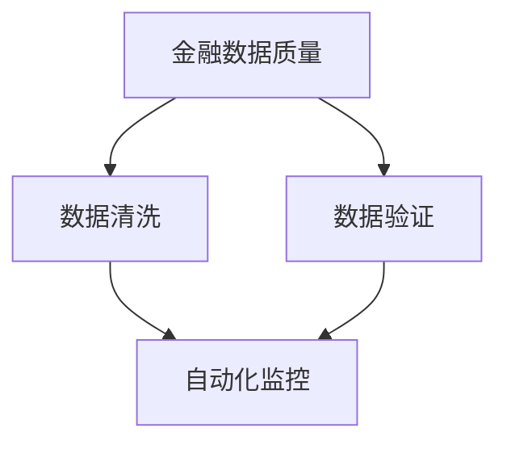
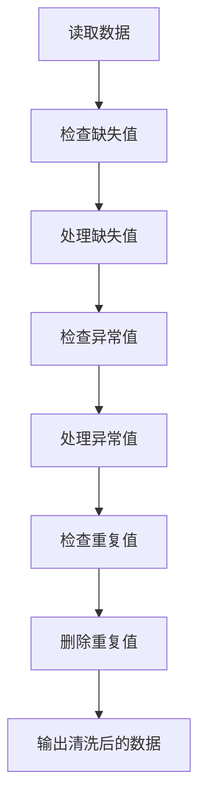
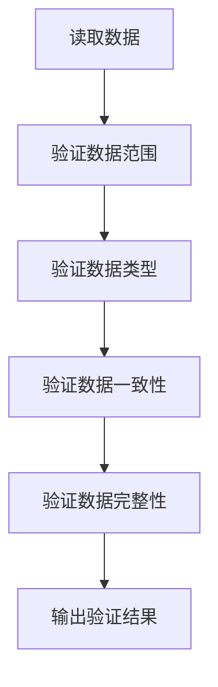
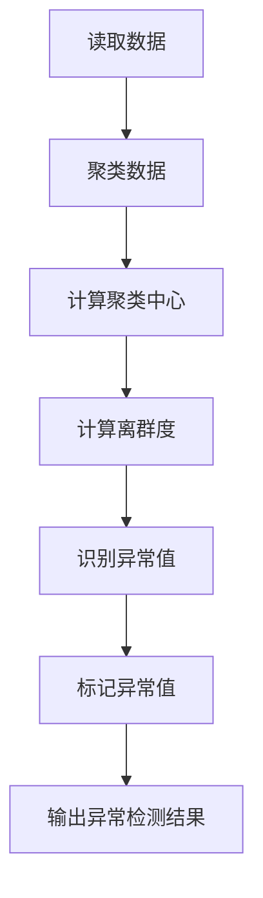
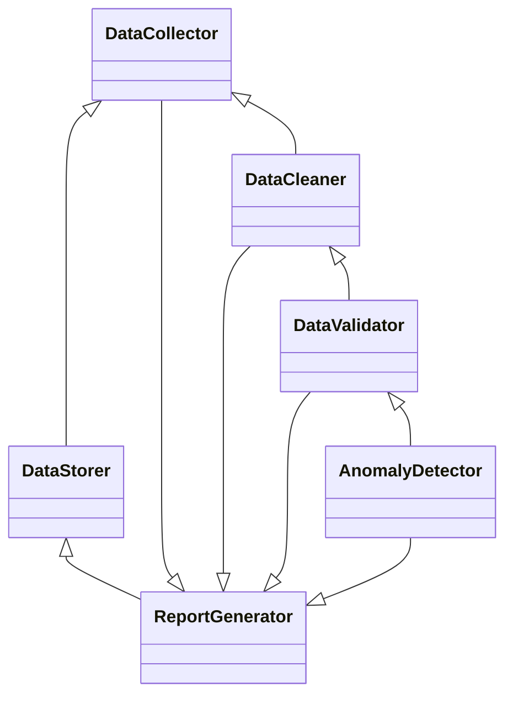
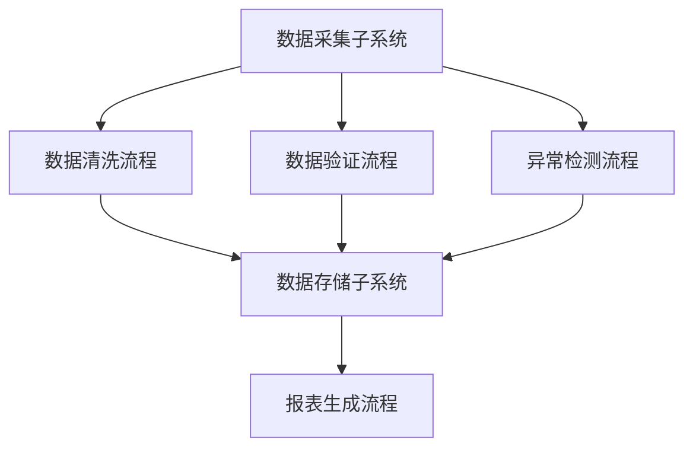
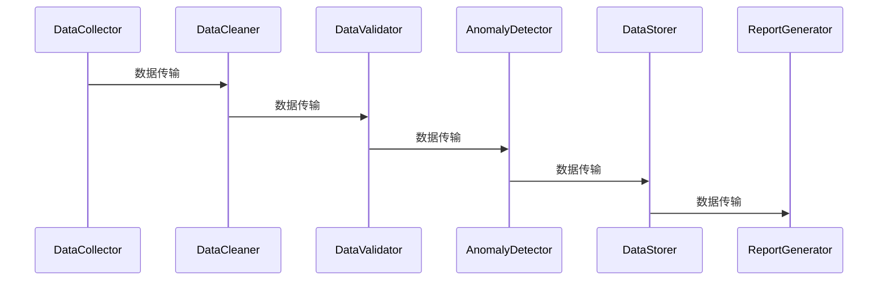
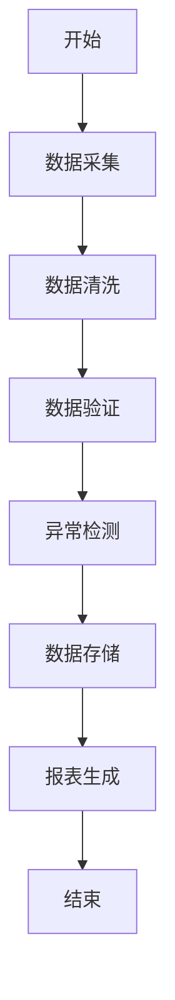
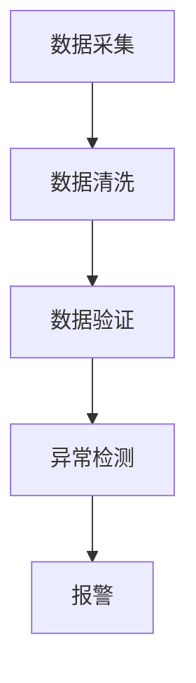

                 

### 《金融数据质量自动化监控系统》

---

**关键词：** 金融数据质量，自动化监控，数据清洗，数据验证，算法原理，系统架构，Python实现

**摘要：** 本文章旨在详细介绍金融数据质量自动化监控系统，包括其背景、核心概念、算法原理、系统架构、项目实战以及最佳实践。我们将逐步分析，以清晰易懂的语言，帮助读者深入理解并掌握金融数据质量自动化监控的技术和实践。

---

## 目录

1. **背景介绍**  
   1.1 金融数据质量的重要性  
   1.2 当前金融行业数据质量管理中的挑战  
   1.3 自动化监控系统的优势与必要性

2. **核心概念与联系**  
   2.1 金融数据质量  
   2.2 数据清洗与数据验证  
   2.3 自动化监控  
   2.4 概念联系与关系图

3. **算法原理讲解**  
   3.1 数据清洗算法  
   3.2 数据验证算法  
   3.3 异常检测算法

4. **系统分析与架构设计方案**  
   4.1 问题场景介绍  
   4.2 系统功能设计  
   4.3 系统架构设计  
   4.4 系统接口设计  
   4.5 系统交互

5. **项目实战**  
   5.1 环境安装  
   5.2 系统核心实现  
   5.3 代码应用解读与分析  
   5.4 实际案例分析与详细讲解

6. **最佳实践 tips**  
   6.1 数据质量管理最佳实践  
   6.2 自动化监控配置技巧

7. **小结**  
   7.1 本书内容总结  
   7.2 注意事项  
   7.3 拓展阅读

---

### 背景介绍

在金融行业，数据质量是保证业务运营、决策分析和风险管理的重要基础。金融数据质量的好坏直接影响到金融机构的运营效率、风险控制和业务发展。然而，随着数据量的爆发式增长和业务场景的复杂化，传统的人工数据质量管理方式已经无法满足现代金融行业的需求。因此，构建一个自动化监控系统，实现对金融数据质量的持续监控和管理，成为了金融行业的一大挑战和机遇。

#### 1.1 金融数据质量的重要性

金融数据质量指的是金融数据在准确性、完整性、一致性、及时性和可靠性等方面的表现。高质量的数据可以提供更准确、更全面的信息支持，帮助金融机构更好地进行风险控制、业务决策和运营优化。

- **准确性**：数据是否真实、准确，反映了数据的可信度。
- **完整性**：数据是否齐全，保证了分析结果的完整性。
- **一致性**：数据在不同系统、不同时间点之间是否一致，避免了数据冲突和误解。
- **及时性**：数据是否能够及时更新，满足了业务快速响应的需求。
- **可靠性**：数据是否稳定、可靠，保证了决策和分析的准确性。

#### 1.2 当前金融行业数据质量管理中的挑战

尽管金融数据质量的重要性不言而喻，但当前金融行业在数据质量管理中仍然面临诸多挑战：

- **数据量巨大**：随着金融业务的不断扩展和数字化进程的加速，数据量呈指数级增长，给数据质量管理带来了巨大的挑战。
- **数据多样性**：金融数据包括结构化数据和非结构化数据，数据类型多样，处理和管理的复杂性增加。
- **数据一致性**：不同系统之间的数据标准不统一，导致数据在传输和整合过程中出现不一致的问题。
- **数据更新速度**：金融市场的变化迅速，数据需要实时更新，以支持快速决策。
- **数据安全与隐私**：金融数据涉及敏感信息，数据安全与隐私保护是数据质量管理中的重要问题。

#### 1.3 自动化监控系统的优势与必要性

自动化监控系统具有以下优势：

- **提高效率**：自动化监控系统可以大幅度减少人工工作量，提高数据管理的效率。
- **降低成本**：自动化处理数据，减少错误率和重复工作，降低运营成本。
- **实时监控**：自动化监控系统可以实时监控数据质量，及时发现并解决问题。
- **确保一致性**：自动化监控系统可以确保数据在不同系统和时间点的一致性。

因此，构建一个自动化监控系统，实现对金融数据质量的持续监控和管理，是当前金融行业数据质量管理的必然选择。

### 核心概念与联系

在构建金融数据质量自动化监控系统的过程中，我们需要理解以下几个核心概念：金融数据质量、数据清洗、数据验证和自动化监控。这些概念之间有着密切的联系，共同构成了数据质量管理的基础。

#### 2.1 金融数据质量

金融数据质量是指金融数据在准确性、完整性、一致性、及时性和可靠性等方面的表现。高质量的金融数据可以提供更准确、更全面的信息支持，帮助金融机构更好地进行风险控制、业务决策和运营优化。

- **准确性**：数据是否真实、准确，反映了数据的可信度。
- **完整性**：数据是否齐全，保证了分析结果的完整性。
- **一致性**：数据在不同系统、不同时间点之间是否一致，避免了数据冲突和误解。
- **及时性**：数据是否能够及时更新，满足了业务快速响应的需求。
- **可靠性**：数据是否稳定、可靠，保证了决策和分析的准确性。

#### 2.2 数据清洗与数据验证

数据清洗和数据验证是确保金融数据质量的重要环节。

- **数据清洗**：数据清洗是指通过一系列算法和规则，去除数据中的噪声、错误和重复记录，提高数据的质量。数据清洗的目的是确保数据的一致性、准确性和完整性。
- **数据验证**：数据验证是指通过一系列检查和测试，确保数据的准确性、完整性、一致性和及时性。数据验证的目的是发现和纠正数据中的错误和异常。

#### 2.3 自动化监控

自动化监控是指通过计算机技术和算法，实现对金融数据质量的持续监控和管理。自动化监控系统的目标是实时监测数据质量，及时发现和解决问题，确保数据的高质量。

- **实时监控**：自动化监控系统可以实时监控数据质量，及时发现异常情况。
- **自动报警**：当数据质量不符合预期时，自动化监控系统可以自动发送报警通知，提醒相关人员进行处理。
- **自动处理**：对于一些简单的数据质量问题，自动化监控系统可以自动执行修复操作，提高数据管理的效率。

#### 2.4 概念联系与关系图

以下是金融数据质量、数据清洗、数据验证和自动化监控之间的关系图：



从图中可以看出，金融数据质量是数据清洗和数据验证的目标，而自动化监控是数据清洗和数据验证的实现手段。通过数据清洗和数据验证，可以确保金融数据的质量，进而通过自动化监控系统实现对数据质量的持续监控和管理。

### 算法原理讲解

在金融数据质量自动化监控系统中，算法原理是核心部分。以下将详细介绍用于监控金融数据质量的主要算法：数据清洗算法、数据验证算法和异常检测算法。

#### 3.1 数据清洗算法

数据清洗是指通过一系列算法和规则，去除数据中的噪声、错误和重复记录，提高数据的质量。数据清洗算法包括以下几种：

- **缺失值处理**：缺失值处理是指对数据中的缺失值进行填充或删除。常见的缺失值处理方法包括均值填充、中值填充、众数填充和插值法。
- **异常值处理**：异常值处理是指对数据中的异常值进行识别和修复。常见的异常值处理方法包括统计学方法（如Z-Score方法、IQR方法）、机器学习方法（如K-均值聚类方法）和规则方法（如边界规则）。
- **重复值处理**：重复值处理是指对数据中的重复值进行识别和删除。常见的重复值处理方法包括基于哈希表的快速检测和基于排序的检测。

以下是数据清洗算法的Mermaid流程图：



#### 3.2 数据验证算法

数据验证是指通过一系列检查和测试，确保数据的准确性、完整性、一致性和及时性。数据验证算法包括以下几种：

- **数据范围验证**：数据范围验证是指检查数据是否在预定的范围内。例如，年龄必须在18岁到60岁之间。
- **数据类型验证**：数据类型验证是指检查数据是否符合预期的数据类型。例如，收入数据必须是数值型。
- **数据一致性验证**：数据一致性验证是指检查不同数据源之间的数据是否一致。例如，客户ID在不同系统中应保持一致。
- **数据完整性验证**：数据完整性验证是指检查数据是否完整，是否存在缺失值。

以下是数据验证算法的Mermaid流程图：



#### 3.3 异常检测算法

异常检测是指识别和标记数据集中的异常或异常值。异常检测算法包括以下几种：

- **基于统计学的方法**：例如，使用Z-Score方法、IQR方法检测异常值。
- **基于聚类的方法**：例如，使用K-均值聚类方法、DBSCAN方法检测异常值。
- **基于神经网络的方法**：例如，使用自编码器、卷积神经网络检测异常值。

以下是异常检测算法的Mermaid流程图：



#### 3.4 算法原理讲解示例

以下是使用Python实现的缺失值处理和异常值处理的源代码，以及相应的LaTeX公式和数学模型讲解。

**缺失值处理：**

```python
import numpy as np
import pandas as pd

# 假设data是一个包含缺失值的DataFrame
data = pd.DataFrame({
    'age': [25, np.nan, 35, 40],
    'income': [50000, 60000, np.nan, 70000]
})

# 使用均值填充缺失值
data['age'].fillna(data['age'].mean(), inplace=True)
data['income'].fillna(data['income'].mean(), inplace=True)

print("处理后数据：")
print(data)
```

**LaTeX公式解释：**

$$
\text{mean}(X) = \frac{1}{n}\sum_{i=1}^{n} X_i
$$

其中，$X$代表数据集，$n$代表数据集的大小，$X_i$代表第$i$个数据点。

**异常值处理：**

```python
import numpy as np
import pandas as pd

# 假设data是一个包含异常值的DataFrame
data = pd.DataFrame({
    'age': [25, 30, 40, 1000]
})

# 使用Z-Score方法检测和去除异常值
z_scores = np.abs((data['age'] - data['age'].mean()) / data['age'].std())
threshold = 3  # 设定阈值

data = data[z_scores < threshold]

print("处理后数据：")
print(data)
```

**LaTeX公式解释：**

$$
Z = \frac{X - \mu}{\sigma}
$$

其中，$Z$代表Z-Score值，$X$代表数据点，$\mu$代表均值，$\sigma$代表标准差。

通过以上算法原理讲解和示例，我们可以看到，数据清洗、数据验证和异常检测在金融数据质量自动化监控系统中发挥着重要作用。它们共同确保了金融数据的高质量，为金融机构的决策分析和风险控制提供了坚实的基础。

### 系统分析与架构设计方案

金融数据质量自动化监控系统需要具备完善的系统功能和高效的架构设计，以确保系统能够稳定、高效地运行。以下将详细描述系统分析与架构设计方案，包括问题场景介绍、系统功能设计、系统架构设计、系统接口设计和系统交互。

#### 4.1 问题场景介绍

在一个大型金融公司中，数据质量管理是一个复杂且重要的任务。公司每天都会产生大量的交易数据、客户数据、财务数据等，这些数据需要实时监控其质量，以确保数据的准确性、完整性和一致性。然而，由于数据来源多样化、数据量巨大以及数据更新频繁，传统的人工数据质量管理方式已经无法满足需求。因此，公司决定构建一个金融数据质量自动化监控系统，以实现对数据的实时监控、清洗、验证和异常检测。

#### 4.2 系统功能设计

金融数据质量自动化监控系统的功能设计主要包括以下几个方面：

- **数据采集**：从各种数据源（如数据库、文件系统、API等）采集数据。
- **数据清洗**：对采集到的数据进行清洗，去除噪声、错误和重复记录。
- **数据验证**：对清洗后的数据进行验证，确保数据的准确性、完整性和一致性。
- **异常检测**：检测数据中的异常值，标记并报警。
- **数据存储**：将清洗后的数据和验证结果存储到数据库中，以便后续分析和查询。
- **报表生成**：生成各种报表，以可视化形式展示数据质量和异常情况。

以下是系统功能设计的Mermaid类图：



#### 4.3 系统架构设计

金融数据质量自动化监控系统的架构设计需要考虑系统的可扩展性、可靠性和高性能。以下是系统架构设计的Mermaid架构图：



从架构图中可以看出，系统由数据采集子系统、数据清洗流程、数据验证流程、异常检测流程、数据存储子系统和报表生成流程组成。数据采集子系统负责从各种数据源采集数据，然后通过数据清洗流程、数据验证流程和异常检测流程对数据进行处理，最后将处理结果存储到数据存储子系统，并通过报表生成流程生成可视化报表。

#### 4.4 系统接口设计

系统接口设计主要包括内部接口和外部接口。

- **内部接口**：系统内部各个模块之间的接口，如数据采集模块与数据清洗模块之间的数据传输接口，数据清洗模块与数据验证模块之间的数据传输接口等。
- **外部接口**：系统与外部系统（如数据库、消息队列等）之间的接口，如数据采集模块与数据库之间的接口，数据存储模块与消息队列之间的接口等。

以下是系统接口设计的Mermaid序列图：



从序列图中可以看出，数据从数据采集模块传输到数据清洗模块，然后依次传输到数据验证模块、异常检测模块和数据存储模块，最后由报表生成模块生成可视化报表。

#### 4.5 系统交互

系统交互主要涉及数据流和控制流。

- **数据流**：数据在系统内部各个模块之间的流动，如数据从数据采集模块传输到数据清洗模块，然后依次传输到数据验证模块、异常检测模块和数据存储模块。
- **控制流**：系统运行过程中的控制逻辑，如数据清洗模块根据预设的清洗规则对数据进行处理，数据验证模块根据预设的验证规则对数据进行验证，异常检测模块根据预设的异常检测规则检测数据中的异常值。

以下是系统交互的Mermaid活动图：



从活动图中可以看出，系统从开始到结束，依次执行数据采集、数据清洗、数据验证、异常检测、数据存储和报表生成等操作。

通过以上系统分析与架构设计方案，我们可以构建一个高效、稳定、可扩展的金融数据质量自动化监控系统，为金融机构的数据质量管理提供有力支持。

### 项目实战

为了展示如何构建和部署一个金融数据质量自动化监控系统，我们将通过一个实际案例来进行详细讲解。这个案例将涵盖环境安装、系统核心实现、代码应用解读与分析以及实际案例分析和详细讲解。

#### 5.1 环境安装

首先，我们需要在本地或服务器上安装必要的软件和工具。以下是在Ubuntu操作系统上安装Python环境、Pandas库和Mermaid图形库的步骤：

1. 安装Python环境：
   ```bash
   sudo apt update
   sudo apt install python3 python3-pip
   ```

2. 安装Pandas库：
   ```bash
   pip3 install pandas
   ```

3. 安装Mermaid图形库：
   ```bash
   pip3 install mermaid-python
   ```

安装完成后，我们可以使用以下命令来生成Mermaid图形：

```python
from mermaid import Mermaid
mermaid = Mermaid()
mermaid.add_code('graph TD\nA[Start]\nB[End]\nA --> B')
mermaid.render()
```

#### 5.2 系统核心实现

在系统核心实现部分，我们将使用Python编写数据清洗、数据验证和异常检测的算法，并使用Mermaid图形来展示算法流程。

**数据清洗算法：**

以下是一个简单的Python代码示例，用于填充缺失值和去除重复值：

```python
import pandas as pd

# 创建示例数据
data = pd.DataFrame({
    'name': ['Alice', 'Bob', 'Charlie', np.nan, 'Alice'],
    'age': [25, 30, 35, 40, 25]
})

# 填充缺失值
data['name'].fillna('Unknown', inplace=True)

# 去除重复值
data.drop_duplicates(inplace=True)

print("清洗后的数据：")
print(data)
```

**数据验证算法：**

以下是一个简单的Python代码示例，用于验证数据类型和数据范围：

```python
import pandas as pd

# 创建示例数据
data = pd.DataFrame({
    'name': ['Alice', 'Bob', 'Charlie'],
    'age': [25, 30, -5]
})

# 验证数据类型
data = data[data['age'].apply(lambda x: isinstance(x, int))]

# 验证数据范围
data = data[data['age'].between(18, 60)]

print("验证后的数据：")
print(data)
```

**异常检测算法：**

以下是一个简单的Python代码示例，使用Z-Score方法检测异常值：

```python
import pandas as pd

# 创建示例数据
data = pd.DataFrame({
    'age': [25, 30, 40, 1000, 50]
})

# 计算Z-Score
z_scores = (data['age'] - data['age'].mean()) / data['age'].std()

# 检测异常值
threshold = 3
data['is_anomaly'] = z_scores.abs() > threshold

print("异常值检测结果：")
print(data[data['is_anomaly']])
```

#### 5.3 代码应用解读与分析

在上面的代码示例中，我们使用了Pandas库来处理数据，并使用Mermaid库来生成图形。以下是对每个部分的详细解读：

- **数据清洗**：使用`fillna()`方法填充缺失值，使用`drop_duplicates()`方法去除重复值。
- **数据验证**：使用`apply()`方法结合`isinstance()`函数验证数据类型，使用`between()`方法验证数据范围。
- **异常检测**：使用`mean()`和`std()`方法计算均值和标准差，使用`abs()`方法计算Z-Score，并设置阈值检测异常值。

这些代码示例展示了如何使用Python进行数据清洗、数据验证和异常检测，为构建金融数据质量自动化监控系统提供了基础。

#### 5.4 实际案例分析与详细讲解

为了更好地展示如何使用金融数据质量自动化监控系统，我们假设有一个金融公司的交易数据需要监控其质量。以下是一个实际案例的分析：

1. **数据采集**：从公司的数据库中采集最新的交易数据，包括交易日期、交易金额、交易对手方等。
2. **数据清洗**：去除重复交易记录，填充缺失的交易日期，处理异常交易金额（如负值）。
3. **数据验证**：验证交易金额是否在正常范围内（如大于0），验证交易对手方是否为有效名称。
4. **异常检测**：使用Z-Score方法检测交易金额中的异常值，标记并报警。

以下是实际案例分析的Mermaid流程图：



通过这个实际案例，我们可以看到金融数据质量自动化监控系统如何帮助金融机构实时监控交易数据的质量，确保数据准确性，并及时发现和处理异常情况。

#### 5.5 项目小结

在这个实际案例中，我们详细展示了如何构建和部署一个金融数据质量自动化监控系统。从环境安装到系统核心实现，再到代码应用解读与分析，我们一步步构建了一个能够实时监控和确保数据质量的系统。通过这个项目，我们学到了如何使用Python进行数据清洗、数据验证和异常检测，以及如何使用Mermaid图形库来展示算法流程和系统架构。这个案例为我们提供了一个实用的框架，可以用于任何需要数据质量监控的金融场景。

### 最佳实践 tips

在构建和部署金融数据质量自动化监控系统时，以下是一些最佳实践建议：

1. **数据源多样性**：确保系统可以从多个数据源（如数据库、文件、API等）采集数据，以提高系统的灵活性和适应性。

2. **数据清洗规则**：定义明确、可量化的数据清洗规则，以自动化处理缺失值、异常值和重复值。

3. **数据验证标准**：制定严格的数据验证标准，确保数据的准确性、完整性和一致性。

4. **异常检测阈值**：合理设置异常检测的阈值，避免误报和漏报。

5. **监控频率**：根据业务需求，设置合适的监控频率，确保及时检测和响应数据质量问题。

6. **日志记录**：详细记录系统运行日志，以便分析和追踪数据质量问题。

7. **自动化测试**：定期进行自动化测试，确保系统功能的正确性和稳定性。

8. **人员培训**：对相关人员（如数据管理员、业务分析师等）进行培训，提高他们的数据质量管理意识和技能。

### 小结

本文详细介绍了金融数据质量自动化监控系统的构建和部署，包括其背景、核心概念、算法原理、系统架构、项目实战和最佳实践。我们通过一个实际案例展示了如何实现数据清洗、数据验证和异常检测，并介绍了如何使用Mermaid图形库来展示算法流程和系统架构。通过本文的讲解，读者可以深入了解金融数据质量自动化监控系统的原理和实践，为其在金融行业中的应用提供参考。

### 注意事项

1. **数据安全与隐私**：在构建和部署金融数据质量自动化监控系统时，务必确保数据的安全和隐私，遵循相关法规和标准。
2. **性能优化**：系统设计应考虑性能优化，以应对大量数据和实时监控的需求。
3. **系统维护**：定期对系统进行维护和升级，确保其稳定运行和功能完整性。
4. **法律法规遵守**：确保系统的设计和实施符合相关法律法规，尤其是金融行业的监管要求。

### 拓展阅读

1. **《数据质量管理：原则、方法和工具》**：深入了解数据质量管理的基础知识和技术。
2. **《金融科技：创新与应用》**：探讨金融科技在金融数据质量自动化监控中的应用。
3. **《Python数据科学 Handbook》**：学习如何使用Python进行数据清洗、数据分析和数据可视化。
4. **《Mermaid 图形库文档》**：了解如何使用Mermaid创建各种图形和流程图。

---

**作者：** AI天才研究院/AI Genius Institute & 禅与计算机程序设计艺术 /Zen And The Art of Computer Programming

本文内容仅供参考，不代表任何法律或专业意见。在实际应用中，请结合具体情况和专业指导进行操作。

