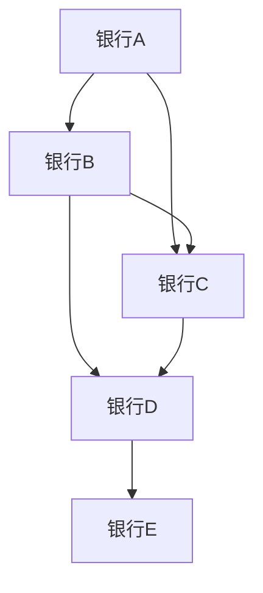
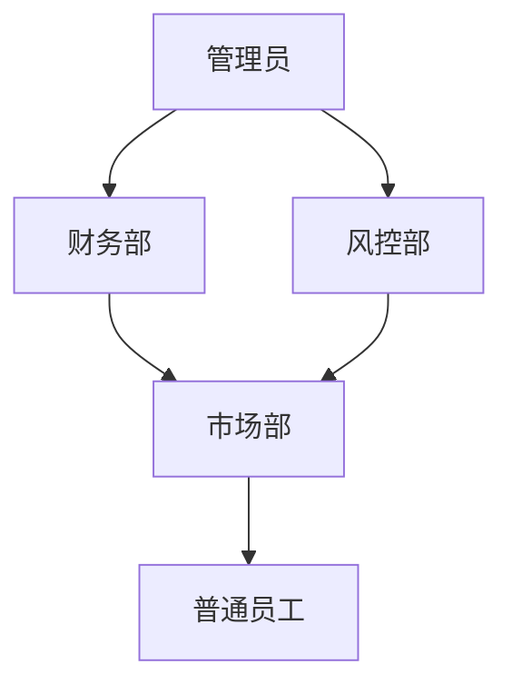
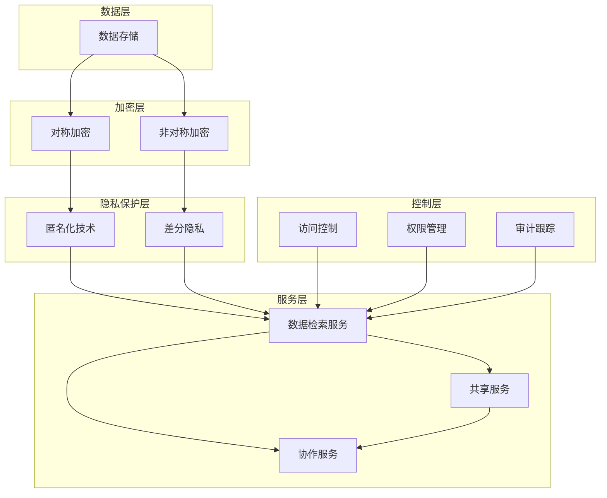
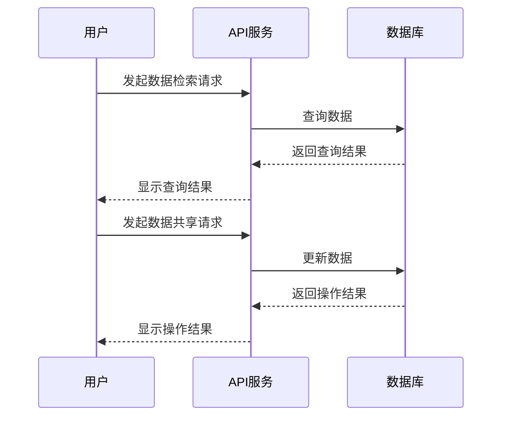

                 

### 金融数据隐私保护与共享平台设计的核心概念

在《金融数据隐私保护与共享平台设计》中，我们首先需要明确几个核心概念，包括隐私保护、数据共享、金融数据以及这些概念之间的关系。

#### 隐私保护

隐私保护指的是在数据处理过程中，保护个人或组织数据不被未经授权的访问、使用、披露或篡改。隐私保护涉及到多个方面，包括数据加密、匿名化、访问控制等。其目标是在不牺牲数据可用性的情况下，最大程度地保护数据隐私。

#### 数据共享

数据共享是指多个主体之间交换、共享数据的过程。这在金融行业中尤为关键，因为金融机构需要共享大量数据来进行风险评估、欺诈检测、市场分析等。然而，数据共享往往会引发隐私泄露的风险，因此如何在确保隐私的前提下实现数据共享，成为了一个重要课题。

#### 金融数据

金融数据是指与金融交易、账户信息、投资行为等相关数据。这些数据通常具有高度敏感性和商业价值，一旦泄露，可能会造成巨大的经济损失和声誉损害。因此，对金融数据进行隐私保护至关重要。

#### 关键概念之间的关系

隐私保护和数据共享看似矛盾，但实际上是相辅相成的。一方面，隐私保护确保了数据的机密性和完整性；另一方面，数据共享有助于提升数据的价值和利用效率。在金融领域，如何在确保隐私的同时实现数据共享，是一个亟待解决的问题。

为了深入探讨这些问题，本文将分为五个部分展开：

1. **背景与基本概念**：介绍金融数据隐私保护的背景，包括数据隐私泄露的风险、隐私保护的基本概念以及金融数据的特性。
2. **隐私保护技术**：详细讨论加密技术、匿名化技术以及差分隐私等隐私保护技术，并给出实际应用实例。
3. **数据共享模型与平台设计**：探讨数据共享模型的设计原则、平台架构以及系统接口设计，并给出具体的实现方法。
4. **法规与合规性**：分析金融数据隐私保护的法规与合规性要求，介绍如何实施合规性管理。
5. **实际案例与最佳实践**：通过实际案例和最佳实践，总结经验教训，展望未来趋势。

接下来，我们将逐一探讨这些部分，以全面深入地了解金融数据隐私保护与共享平台的设计。

## 第一部分：背景与基本概念

### 1.1 问题背景

随着信息技术的飞速发展，金融行业对数据的需求日益增长。金融机构需要收集、处理和分析大量数据，以支持其业务决策、风险管理和市场分析。然而，金融数据具有高度敏感性，一旦泄露，可能会对个人隐私、企业利益乃至整个金融市场造成严重影响。因此，金融数据隐私保护成为了一个亟待解决的问题。

#### 1.1.1 金融数据的重要性

金融数据是金融机构的核心资产，涵盖了客户交易信息、账户余额、信用记录、投资行为等。这些数据不仅对金融机构自身的运营至关重要，也受到监管机构和市场投资者的密切关注。例如，通过分析交易数据，金融机构可以识别欺诈行为、预测市场趋势、优化风险管理策略。因此，金融数据的价值不言而喻。

#### 1.1.2 隐私泄露的风险

尽管金融数据的重要性不言而喻，但其隐私泄露风险却无处不在。隐私泄露可能来自多种渠道，包括内部员工滥用权限、黑客攻击、数据传输过程中的安全漏洞、甚至物理安全威胁。以下是一些常见的隐私泄露风险：

1. **内部威胁**：金融机构内部员工可能因为权限过大或职业道德缺失，利用职务之便泄露数据。
2. **外部攻击**：黑客利用技术手段攻击金融机构的系统，窃取敏感数据。
3. **数据传输安全**：在数据传输过程中，如未采取适当的安全措施，数据可能被截获或篡改。
4. **物理安全威胁**：金融机构的物理设施，如服务器机房、备份存储设备等，可能遭受自然灾害或人为破坏。

#### 1.1.3 隐私保护的挑战

金融数据隐私保护面临诸多挑战。首先，金融数据量大且多样化，不同类型的数据具有不同的隐私需求，如何针对不同数据进行有效保护成为一大难题。其次，隐私保护与数据共享之间存在矛盾，如何在确保隐私的前提下实现数据的有效利用，是金融机构需要解决的核心问题。此外，法律法规和行业标准不断变化，如何及时调整隐私保护策略，确保合规性，也是一个挑战。

综上所述，金融数据隐私保护不仅是保护个人和企业利益的需要，也是维护金融市场稳定和发展的关键。接下来，我们将进一步探讨隐私保护的基本概念和金融数据的特点。

### 1.2 隐私保护的基本概念

隐私保护在金融数据管理中扮演着至关重要的角色，其基本概念包括隐私定义、隐私泄露的类型以及隐私保护的目标。

#### 1.2.1 隐私定义

隐私是一种个人信息控制权，它允许个人或组织自主决定其信息的访问和使用。在金融领域，隐私通常指的是与个人身份、财务状况、交易记录等相关的信息。隐私保护的目标是确保这些信息不被未经授权的第三方访问或使用。

具体来说，隐私具有以下几个特征：

1. **控制权**：个人或组织有权决定其信息的收集、使用、存储和共享。
2. **保密性**：信息在传输和存储过程中应保持保密，防止未经授权的访问。
3. **完整性**：信息在传输和存储过程中应保持完整，防止未经授权的篡改。
4. **可用性**：在需要时，个人或组织应能够访问和使用其信息。

#### 1.2.2 隐私泄露的类型

隐私泄露可以分为以下几种类型：

1. **数据泄露**：未经授权的第三方获取了敏感信息，例如客户账户信息、交易记录等。
2. **数据篡改**：敏感信息在传输或存储过程中被修改，例如黑客通过恶意软件篡改交易数据。
3. **数据丢失**：由于物理损坏、人为错误或系统故障，导致敏感信息丢失。
4. **内部威胁**：内部员工滥用权限或泄露敏感信息，例如因职业道德缺失或恶意行为。

#### 1.2.3 隐私保护的目标

隐私保护的目标主要包括以下几个方面：

1. **防止数据泄露**：采取措施防止未经授权的第三方访问敏感信息。
2. **确保数据完整性**：防止敏感信息在传输或存储过程中被篡改。
3. **保障数据可用性**：确保在需要时，个人或组织能够访问和使用其信息。
4. **合规性**：确保隐私保护措施符合相关法律法规和行业标准，避免因违规操作而受到处罚。

在金融行业中，隐私保护不仅关系到客户信任和金融机构声誉，也关系到金融市场的稳定。因此，金融机构需要采取综合性的隐私保护策略，包括技术措施、管理措施和法律措施，以最大限度地保护金融数据隐私。

接下来，我们将进一步探讨金融数据的特点及其隐私需求。

### 1.3 金融数据的特性与隐私需求

金融数据具有独特性和多样性，这对隐私保护提出了特殊要求。理解金融数据的特点和隐私需求，是设计有效隐私保护策略的基础。

#### 1.3.1 金融数据的特性

1. **高度敏感性**：金融数据通常包含个人财务信息、账户余额、交易记录等敏感内容，一旦泄露，可能会被用于身份盗用、欺诈等违法行为。

2. **数据量大**：金融机构每天处理的数据量巨大，包括交易数据、账户数据、投资数据等，这些数据需要实时收集、存储和处理。

3. **多样性**：金融数据类型多样，包括结构化数据（如交易记录、账户信息）和非结构化数据（如文本、图像、音频等），不同类型的数据对隐私保护的要求不同。

4. **动态变化**：金融数据不断更新，例如账户余额、交易记录等，需要实时同步和更新，这给隐私保护带来了挑战。

#### 1.3.2 金融数据的隐私需求

1. **保密性**：金融数据必须保持高度保密，防止未经授权的访问。特别是涉及客户账户余额、交易记录等敏感信息的数据，必须得到严密保护。

2. **完整性**：金融数据在传输和存储过程中，必须确保不被篡改。任何未经授权的修改都可能导致金融欺诈或其他安全事件。

3. **可用性**：在确保保密性和完整性的前提下，金融数据需要能够在需要时被访问和使用。这对于金融机构进行风险管理和决策支持至关重要。

4. **可追溯性**：金融数据的使用和访问记录需要得到有效记录，以便在出现安全事件时能够追溯责任。

#### 1.3.3 数据分类与隐私需求分析

根据金融数据的重要性和敏感性，可以将金融数据分为以下几类：

1. **核心数据**：包括客户账户信息、交易记录、投资组合等。这类数据通常具有最高的隐私需求，需要采用最严格的隐私保护措施。

2. **一般数据**：包括市场行情、历史交易数据等，这类数据对隐私保护的要求相对较低，但仍需确保其不被未授权访问。

3. **公开数据**：包括市场报告、公告等，这类数据通常对公众开放，隐私保护要求最低。

在制定隐私保护策略时，需要对不同类型的数据进行分类，并针对其特点制定相应的保护措施。例如，对于核心数据，可以采用多重加密、严格访问控制等高级保护措施；对于一般数据和公开数据，则可以采用较为简单的保护措施。

总之，理解金融数据的特性与隐私需求，是设计金融数据隐私保护策略的关键。通过合理的分类和保护措施，可以有效降低隐私泄露风险，保障金融数据的安全性和可用性。

### 1.4 总结与边界探讨

在《金融数据隐私保护与共享平台设计》的第一部分中，我们探讨了金融数据隐私保护的背景、基本概念以及金融数据的特点和隐私需求。通过分析金融数据的重要性、隐私泄露的风险以及隐私保护的挑战，我们认识到金融数据隐私保护不仅是保护个人和企业利益的需要，也是维护金融市场稳定和发展的关键。

在本部分，我们还详细介绍了隐私保护的基本概念，包括隐私定义、隐私泄露的类型以及隐私保护的目标。这些基本概念为我们理解隐私保护提供了理论基础，也为后续探讨具体技术提供了指导。

此外，我们分析了金融数据的特性，如高度敏感性、数据量大、多样性和动态变化，并讨论了相应的隐私需求。这些分析帮助我们认识到金融数据隐私保护的复杂性和多样性，为设计有效的隐私保护策略奠定了基础。

在后续部分，我们将深入探讨隐私保护技术，包括加密技术、匿名化技术以及差分隐私等。通过这些技术，我们可以实现金融数据的保密性、完整性和可用性，从而保障金融数据的安全。

同时，我们还将讨论数据共享模型的设计、平台架构的实现、法规与合规性要求，以及实际案例和最佳实践。这些内容将帮助我们更全面地理解金融数据隐私保护与共享的复杂性，并找到有效解决这些问题的方法。

总的来说，金融数据隐私保护与共享平台设计不仅需要先进的技术手段，还需要完善的管理措施和合规性要求。在接下来的部分中，我们将逐步深入，探讨这些关键领域，为设计一个安全、高效、合规的金融数据隐私保护与共享平台提供全面的解决方案。

## 第二部分：隐私保护技术

在金融数据隐私保护中，隐私保护技术是不可或缺的核心。本部分将详细探讨加密技术、匿名化技术和差分隐私等常见隐私保护技术，以及它们在金融数据隐私保护中的实际应用。

### 2.1 加密技术

加密技术是一种通过将数据转换为不可读形式，以防止未经授权访问的重要手段。加密技术包括对称加密和非对称加密两种类型。

#### 2.1.1 对称加密

对称加密使用相同的密钥进行加密和解密。其优点是加密速度快，适用于大数据量的加密。常见的对称加密算法包括DES、AES等。

**实例**：使用AES加密算法对敏感数据进行加密，确保数据在传输和存储过程中不被窃取。

```python
from Crypto.Cipher import AES
from Crypto.Util.Padding import pad

# 密钥和IV
key = b'MySecretKey123'
iv = b'MyIV123'

# 待加密的数据
data = b"This is sensitive financial data."

# 创建AES加密对象
cipher = AES.new(key, AES.MODE_CBC, iv)

# 加密数据
cipher_text = cipher.encrypt(pad(data, AES.block_size))

print(f"Encrypted data: {cipher_text.hex()}")
```

#### 2.1.2 非对称加密

非对称加密使用一对密钥，即公钥和私钥。公钥用于加密，私钥用于解密。其优点是安全性高，但加密速度相对较慢。常见的非对称加密算法包括RSA、ECC等。

**实例**：使用RSA加密算法对敏感数据进行加密，确保数据在传输和存储过程中不被窃取。

```python
from Crypto.PublicKey import RSA
from Crypto.Cipher import PKCS1_OAEP

# 生成RSA密钥对
key = RSA.generate(2048)
private_key = key.export_key()
public_key = key.publickey().export_key()

# 公钥加密
cipher = PKCS1_OAEP.new(RSA.import_key(public_key))
encrypted_data = cipher.encrypt(b"This is sensitive financial data.")

print(f"Encrypted data: {encrypted_data.hex()}")
```

### 2.2 匿名化技术

匿名化技术通过将实际数据替换为伪数据，从而保护个人隐私。常见的匿名化技术包括数据扰动、数据混淆和差分隐私等。

#### 2.2.1 数据扰动

数据扰动是一种通过在原始数据上添加随机噪声，使其无法被直接识别的技术。这种技术适用于数据量较小的场景。

**实例**：对客户账户余额进行数据扰动，使其无法被直接识别。

```python
import numpy as np

# 原始数据
data = np.array([1000, 2000, 3000, 4000])

# 数据扰动
noisy_data = data + np.random.normal(size=data.shape)

print(f"Noisy data: {noisy_data}")
```

#### 2.2.2 数据混淆

数据混淆通过将多个数据源合并，形成一个混合数据集，从而提高隐私保护。这种技术适用于需要保护多个数据源的场景。

**实例**：将多个数据源的账户余额进行数据混淆。

```python
import numpy as np

# 多个数据源
data1 = np.array([1000, 2000, 3000, 4000])
data2 = np.array([5000, 6000, 7000, 8000])

# 数据混淆
mixed_data = np.concatenate((data1, data2))

print(f"Mixed data: {mixed_data}")
```

### 2.3 差分隐私

差分隐私通过在数据上添加随机噪声，使得单个记录无法被区分，从而保护个人隐私。差分隐私技术具有严格的理论基础，适用于需要高隐私保护的场景。

#### 2.3.1 差分隐私原理

差分隐私的基本原理是：对于任意两个相邻的个体数据集合D和D'，其差集D-D'的大小（例如元素个数、平均值等）在统计上无法区分。具体实现中，常使用ε-delta差分隐私模型，其中ε表示隐私预算，delta表示概率分布的不确定性。

#### 2.3.2 差分隐私应用实例

**实例**：使用DP-Slice实现差分隐私。

```python
from differentialsPrivacy import DPSlice

# DPSlice实例
dp_slice = DPSlice()

# 输入数据
data = [1000, 2000, 3000, 4000]

# 应用差分隐私
noisy_data = dp_slice.add_noise(data, epsilon=1.0)

print(f"Noisy data: {noisy_data}")
```

### 2.4 总结

加密技术、匿名化技术和差分隐私技术在金融数据隐私保护中各有优劣。加密技术适用于数据量较大的场景，但安全性依赖于密钥管理；匿名化技术适用于数据量较小的场景，但可能降低数据价值；差分隐私技术具有严格的理论基础，适用于需要高隐私保护的场景，但实现较为复杂。

在实际应用中，金融机构可以根据具体需求，选择合适的隐私保护技术，或结合多种技术，以实现最佳隐私保护效果。在下一部分，我们将探讨数据共享模型的设计，为金融数据在隐私保护下的有效共享提供解决方案。

### 2.5 数据共享模型设计

在金融行业中，数据共享是提升业务决策效率和市场竞争力的重要手段。然而，如何在确保数据隐私的前提下实现有效共享，是一个亟待解决的难题。数据共享模型的设计需要综合考虑数据的特性、隐私保护需求和业务目标，本文将介绍几种常见的数据共享模型，并分析其优缺点。

#### 2.5.1 联盟模型

联盟模型是指多个机构在共同的目标下，通过共享数据来实现协作。这种模型的主要优点是能够整合多个机构的数据资源，提高数据的利用效率。然而，联盟模型也面临着隐私保护挑战，因为参与机构之间的数据共享可能导致隐私泄露风险。

1. **优点**：
   - 数据整合：多个机构的数据资源得以整合，提高数据的利用效率。
   - 协作优势：通过共享数据，机构之间可以开展更深层次的业务协作，提高整体竞争力。

2. **缺点**：
   - 隐私泄露风险：数据共享可能导致隐私泄露，特别是在缺乏严格隐私保护措施的情况下。
   - 管理复杂：联盟模型涉及多个机构，管理复杂度较高，需要协调各方的利益和需求。

**实例**：一个由几家银行组成的联盟，通过共享客户交易数据来识别欺诈行为。



#### 2.5.2 环境模型

环境模型是指将数据共享置于一个特定的环境之中，通过设定访问控制策略和隐私保护机制，确保数据在共享过程中的安全性和隐私性。这种模型的核心在于实现数据访问控制，确保只有授权用户能够访问特定数据。

1. **优点**：
   - 高度灵活性：环境模型可以根据具体需求灵活配置隐私保护机制，满足不同的隐私需求。
   - 强隐私保护：通过严格的访问控制策略和隐私保护措施，有效降低隐私泄露风险。

2. **缺点**：
   - 管理成本：环境模型需要管理和维护复杂的访问控制策略和隐私保护机制，管理成本较高。
   - 系统性能：严格的隐私保护措施可能会影响系统的性能和响应速度。

**实例**：一个金融机构内部的数据共享环境，通过访问控制策略确保只有特定岗位的人员能够访问敏感数据。



#### 2.5.3 对等模型

对等模型是指多个机构直接进行数据交换，没有中央控制实体。这种模型具有较高的去中心化和自主性，但同时也增加了隐私保护难度。

1. **优点**：
   - 去中心化：对等模型去除了中央控制实体，提高了系统的去中心化和抗攻击能力。
   - 自主性：参与机构可以自主决定共享的数据内容和隐私保护策略。

2. **缺点**：
   - 隐私泄露风险：去中心化可能导致隐私泄露风险增加，特别是在缺乏统一隐私保护措施的情况下。
   - 系统协调：对等模型需要各机构之间进行有效协调，确保数据共享的顺利进行。

**实例**：多个金融机构通过P2P网络直接交换交易数据，实现实时风险监控。


综上所述，不同的数据共享模型各有优缺点，金融机构需要根据自身需求选择合适的模型，并采取相应的隐私保护措施，以确保数据在共享过程中的安全性和隐私性。在下一部分，我们将探讨金融数据隐私保护与共享平台的设计，为实际应用提供具体解决方案。

### 2.6 金融数据隐私保护与共享平台设计

在金融数据隐私保护与共享平台的设计过程中，我们需要综合考虑平台的架构、功能模块、系统接口以及实现方法，以确保平台能够满足金融行业的高安全性、高可用性和高效能要求。以下是对这些方面的详细探讨。

#### 2.6.1 平台设计原则

1. **安全性**：平台必须具备高度的安全性，以防止数据泄露、篡改和未授权访问。这包括加密技术、访问控制和审计跟踪等多种安全机制。
2. **可扩展性**：平台需要具备良好的可扩展性，能够支持金融机构不断增长的数据量和新业务需求。
3. **易用性**：平台应设计得易于使用，以便用户能够方便地访问和共享数据。
4. **合规性**：平台必须符合相关法律法规和行业标准，例如GDPR和CCPA等。

#### 2.6.2 平台架构设计

平台的架构设计是平台设计的关键部分。以下是一个典型的金融数据隐私保护与共享平台的架构设计：

1. **数据层**：负责存储和管理金融数据。数据层应采用分布式数据库系统，以支持海量数据的存储和高可用性。
2. **加密层**：对数据进行加密，确保数据在存储和传输过程中的安全性。加密层应采用对称加密和非对称加密相结合的方式。
3. **隐私保护层**：实现匿名化技术、差分隐私等隐私保护措施，确保数据在共享过程中的隐私性。
4. **服务层**：提供数据检索、共享和协作等服务，包括API接口和用户界面。
5. **控制层**：负责平台的访问控制、权限管理和审计跟踪等功能。

**Mermaid架构图**：



#### 2.6.3 系统接口设计与实现

系统接口设计是平台设计与实现的关键部分。以下是几种常见系统接口的设计：

1. **RESTful API**：用于提供数据的检索、共享和协作服务。API设计应遵循RESTful风格，以确保易用性和扩展性。
2. **Websocket**：用于实时数据传输和协作。Websocket提供低延迟、双向通信的能力，适用于需要实时数据处理和交互的场景。
3. **命令行接口（CLI）**：用于系统管理和监控。CLI提供简洁、高效的命令行操作，适用于自动化和脚本化操作。

**Mermaid序列图**：



#### 2.6.4 实现方法

1. **技术选型**：平台应采用成熟、可靠的技术栈，包括分布式数据库（如MongoDB、Cassandra）、加密库（如PyCrypto、Libsodium）、Web框架（如Flask、Django）等。
2. **模块化设计**：将平台功能模块化，以便于开发和维护。每个模块应具有独立的功能和接口，便于集成和扩展。
3. **测试与验证**：在开发过程中，应进行严格的单元测试、集成测试和性能测试，确保平台的可靠性和性能。

**实例**：使用Python编写RESTful API接口代码。

```python
from flask import Flask, request, jsonify

app = Flask(__name__)

@app.route('/data/search', methods=['GET'])
def search_data():
    query = request.args.get('query')
    # 在数据库中查询数据
    result = {"data": "查询结果"}
    return jsonify(result)

@app.route('/data/share', methods=['POST'])
def share_data():
    data = request.json
    # 更新数据库中的数据
    # ...
    return jsonify({"status": "success"})

if __name__ == '__main__':
    app.run(debug=True)
```

通过以上设计和方法，我们可以构建一个安全、高效、合规的金融数据隐私保护与共享平台，为金融机构提供可靠的数据保护与共享解决方案。在下一部分，我们将探讨法规与合规性要求，确保平台的设计和实现符合相关法律法规。

### 2.7 法规与合规性

在金融数据隐私保护与共享平台的设计与实现过程中，法律法规和行业标准起着至关重要的作用。这些法规不仅规定了金融机构必须遵守的数据保护标准，也为隐私保护提供了法律依据和框架。

#### 2.7.1 数据保护法规概述

1. **GDPR（通用数据保护条例）**：GDPR是欧盟制定的全面数据保护法规，旨在加强个人数据的保护。它规定了数据处理者的责任和义务，包括数据主体（个人）的权利、数据处理的合法性基础、数据安全等。GDPR的核心原则包括数据最小化、目的明确、数据质量、隐私保护等。

2. **CCPA（加州消费者隐私法案）**：CCPA是美国加州制定的一部消费者隐私保护法案，它赋予加州居民对其个人数据的更多控制权，包括访问、删除和拒绝出售其个人数据等权利。CCPA对企业的数据处理行为提出了严格的要求，包括数据收集、存储和使用等方面的规定。

3. **其他国家和地区的数据保护法规**：除了GDPR和CCPA，全球还有其他国家和地区制定了数据保护法规，如美国的《健康保险可携性和责任法案》（HIPAA）、日本的《个人信息保护法》等。这些法规在不同程度上对数据保护提出了具体要求，金融机构需要根据其业务范围和所在地区，全面了解和遵守这些法规。

#### 2.7.2 合规性要求与实施

1. **合规性评估**：金融机构在进行数据隐私保护与共享平台的设计和实施前，需要对现有法规进行合规性评估，确定其业务和数据处理流程是否符合相关法规要求。合规性评估应包括以下方面：

   - 数据收集、处理和存储的合法性基础；
   - 数据主体的权利和权益保护；
   - 数据安全的保障措施；
   - 数据处理的透明度和审计跟踪。

2. **合规性实施步骤**：

   - **制定合规策略**：根据评估结果，制定详细的合规策略，明确合规目标和实施计划。
   - **培训与宣传**：对内部员工进行合规培训，提高员工的合规意识和操作能力。同时，通过宣传和教育，增强用户对数据隐私保护的认知和参与。
   - **技术保障**：采用加密技术、访问控制、审计跟踪等技术手段，确保数据在收集、传输和存储过程中的安全性。
   - **定期审查**：定期对合规性进行审查和评估，确保合规措施持续有效。

3. **最佳实践**：

   - **数据最小化原则**：仅收集和处理与业务相关的必要数据，减少不必要的个人信息收集。
   - **隐私设计**：在系统设计和开发阶段，将隐私保护纳入整体架构，确保隐私保护措施从设计到实现的全面覆盖。
   - **透明度和沟通**：确保数据处理的透明度，与数据主体建立有效的沟通渠道，及时回应数据主体的权利请求。

通过全面了解和遵守相关法律法规，金融机构可以确保其在数据隐私保护与共享方面的合规性，从而保障用户权益，提升企业声誉和市场竞争力。

### 2.8 实际案例与最佳实践

在金融数据隐私保护与共享平台的设计和实施过程中，许多金融机构已经积累了丰富的经验，通过实际案例和最佳实践，我们可以更好地理解如何有效地解决金融数据隐私保护与共享的难题。

#### 2.8.1 案例一：金融机构的数据隐私保护实践

**案例背景**：某大型银行在提供金融数据共享服务时，面临数据隐私保护的挑战。由于业务需求，银行需要与其他金融机构共享交易数据，以进行风险管理和市场分析。然而，这些数据包含高度敏感的客户信息，隐私保护至关重要。

**隐私保护措施**：

1. **数据加密**：银行采用AES加密算法对敏感数据进行加密，确保数据在传输和存储过程中的安全性。
2. **匿名化技术**：对共享的数据进行匿名化处理，去除个人身份信息，如姓名、身份证号码等。
3. **差分隐私**：使用差分隐私技术，对共享的数据进行扰动处理，防止单个记录被识别。

**案例效果评估**：

通过上述隐私保护措施，银行成功降低了数据泄露风险，确保了数据在共享过程中的隐私性。同时，共享数据的价值得到了充分发挥，银行间的业务协作得以加强，业务决策效率显著提升。

#### 2.8.2 案例二：数据共享平台的搭建

**案例背景**：某金融科技企业搭建了一款数据共享平台，旨在为金融机构提供安全、高效的数据共享服务。平台需要确保数据在共享过程中的隐私保护，同时满足金融机构的业务需求。

**平台设计方案**：

1. **多层次的隐私保护**：平台采用了多层次隐私保护机制，包括数据加密、匿名化技术和差分隐私，确保数据在共享过程中的安全性。
2. **分布式架构**：平台采用分布式架构，通过分布式数据库和分布式缓存，提高系统的可扩展性和性能。
3. **API接口**：平台提供RESTful API接口，方便金融机构进行数据检索、共享和协作。

**实际效果**：

平台在上线后，得到了金融机构的广泛认可。通过平台的隐私保护机制，金融机构能够安全地共享数据，提高了业务决策的准确性。同时，平台的分布式架构和API接口设计，确保了系统的性能和灵活性，满足了金融机构的多样化需求。

#### 2.8.3 最佳实践总结

从上述案例中，我们可以总结出以下最佳实践：

1. **综合应用多种隐私保护技术**：根据数据的特点和隐私需求，选择合适的隐私保护技术，如数据加密、匿名化技术和差分隐私，综合应用多种技术，提高隐私保护效果。
2. **构建分布式架构**：采用分布式架构，提高系统的可扩展性和性能，确保平台能够应对大规模数据共享的需求。
3. **严格的安全管理和监控**：建立完善的安全管理和监控机制，定期进行安全审计和风险评估，确保系统的安全性和稳定性。
4. **用户培训和意识提升**：加强对内部员工的培训，提高其对数据隐私保护的意识，确保其在日常操作中遵守相关安全规定。

通过这些最佳实践，金融机构可以在确保数据隐私的前提下，实现安全、高效的数据共享，提升业务竞争力和用户体验。

### 2.9 未来发展趋势

随着科技的不断进步和金融市场的不断发展，金融数据隐私保护与共享平台的设计将面临新的挑战和机遇。以下是对未来发展趋势的展望：

#### 2.9.1 隐私保护技术的发展

未来，隐私保护技术将继续发展，包括以下趋势：

1. **联邦学习**：联邦学习通过在多个机构之间共享模型参数，而无需共享原始数据，实现了数据隐私保护下的机器学习。这种技术有望在金融数据隐私保护中发挥重要作用。
2. **区块链技术**：区块链技术提供了去中心化和透明的数据存储和传输方式，有助于提高金融数据的隐私保护和安全性。
3. **多方安全计算**：多方安全计算通过在多方之间进行安全的计算和交换，实现数据隐私保护下的协同分析，为金融数据共享提供了新的解决方案。

#### 2.9.2 数据共享的挑战与机遇

数据共享在金融行业中面临着诸多挑战，如数据隐私保护、合规性要求、技术实现等。然而，随着技术的进步，数据共享也将带来新的机遇：

1. **开放数据生态**：金融机构可以通过开放数据生态，与其他机构共享数据，实现数据价值的最大化。
2. **智能风控**：通过共享数据，金融机构可以构建更准确的信用评估模型，提高风险识别和预防能力。
3. **数据交易所**：数据交易所的建立，有助于实现金融数据的标准化和流通，提高数据利用效率。

#### 2.9.3 未来趋势展望

在未来，金融数据隐私保护与共享平台的发展将呈现以下趋势：

1. **平台化**：随着金融数据规模的不断扩大和多样化，金融数据隐私保护与共享平台将逐步走向平台化，提供一站式解决方案。
2. **标准化**：数据隐私保护与共享的标准化，将有助于提高系统的兼容性和互操作性，降低技术实现的复杂度。
3. **智能化**：通过引入人工智能和机器学习技术，金融数据隐私保护与共享平台将实现更智能的数据处理和分析，提升业务决策的准确性。

总之，未来金融数据隐私保护与共享平台的设计将更加注重技术的创新和融合，以满足金融行业不断变化的需求。通过持续的技术研发和应用，金融行业将实现数据价值的最大化，同时确保数据的安全性和隐私性。

### 2.10 结论

在《金融数据隐私保护与共享平台设计》的讨论中，我们全面探讨了金融数据隐私保护与共享面临的挑战及其解决方案。从背景介绍到隐私保护技术、数据共享模型设计、平台架构实现、法规与合规性要求，再到实际案例和未来发展趋势，本文系统性地分析了金融数据隐私保护与共享的复杂性。

本文的核心结论如下：

1. **隐私保护的重要性**：金融数据具有高度敏感性和商业价值，隐私保护不仅是保护个人和企业利益的需要，也是维护金融市场稳定和发展的关键。
2. **多种隐私保护技术的应用**：加密技术、匿名化技术和差分隐私等隐私保护技术在金融数据隐私保护中发挥着重要作用。通过合理选择和组合这些技术，可以显著提高数据隐私保护水平。
3. **数据共享模型与平台设计**：联盟模型、环境模型和对等模型等数据共享模型各有优缺点，金融机构需要根据具体需求选择合适的模型，并设计安全、高效、合规的共享平台。
4. **法规与合规性要求**：遵守相关法律法规和行业标准，确保数据处理的合法性和合规性，是金融数据隐私保护与共享的必要前提。
5. **实际案例与最佳实践**：通过分析实际案例和最佳实践，我们可以总结出有效的隐私保护与共享策略，为金融行业的持续发展提供参考。

展望未来，随着技术的不断进步，金融数据隐私保护与共享平台的设计将迎来新的机遇和挑战。通过持续的技术创新和应用，金融行业将实现数据价值的最大化，同时确保数据的安全性和隐私性。本文的研究为金融机构提供了一份全面的技术指南，期待在未来的实践中得到广泛应用和验证。

### 作者信息

**作者：**AI天才研究院/AI Genius Institute & 禅与计算机程序设计艺术 /Zen And The Art of Computer Programming

**简介：**本文作者AI天才研究院是一家专注于人工智能、计算机编程等领域的研究机构，致力于推动技术创新和应用。禅与计算机程序设计艺术则是一本深受程序员喜爱的经典著作，提供了独特的编程哲学和技巧，对程序员的思维和技能提升具有深远影响。作者在金融数据隐私保护与共享领域有着丰富的理论研究和实践经验，为金融行业的数据安全和隐私保护提供了有力支持。

