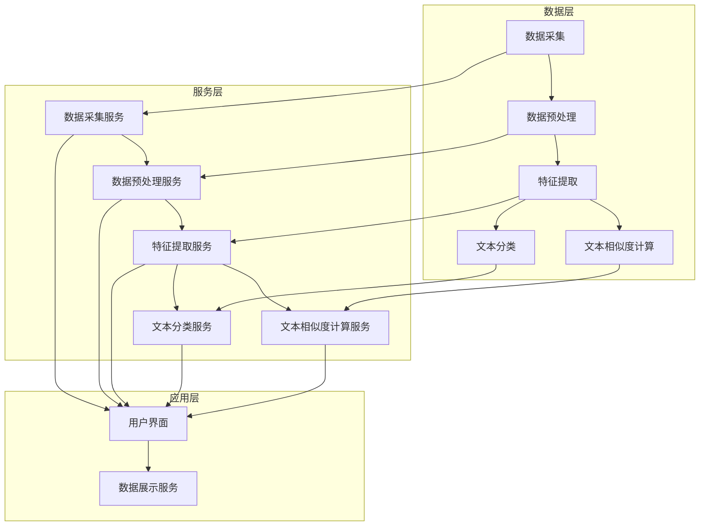
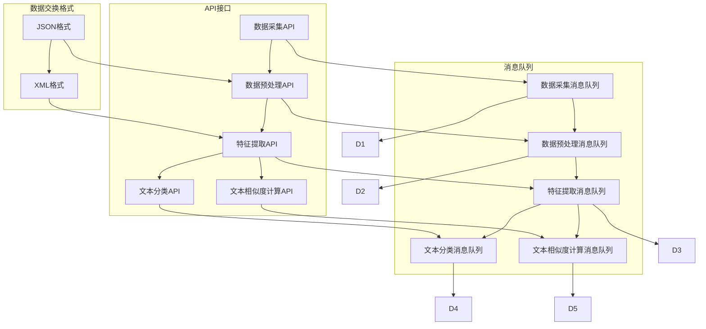
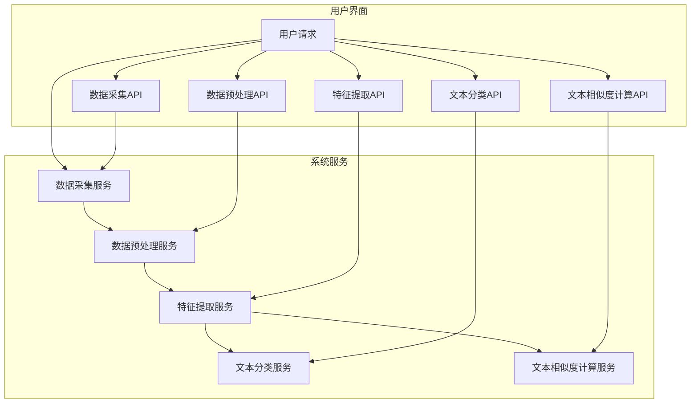
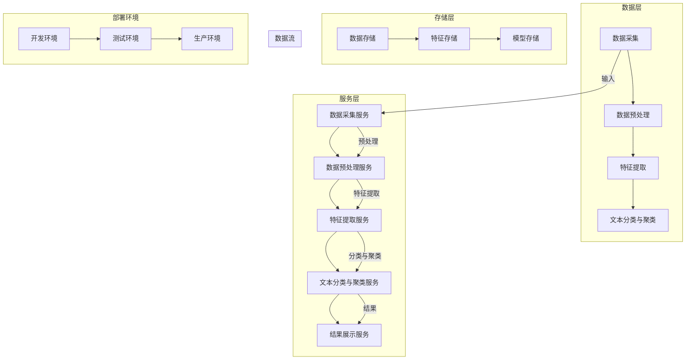
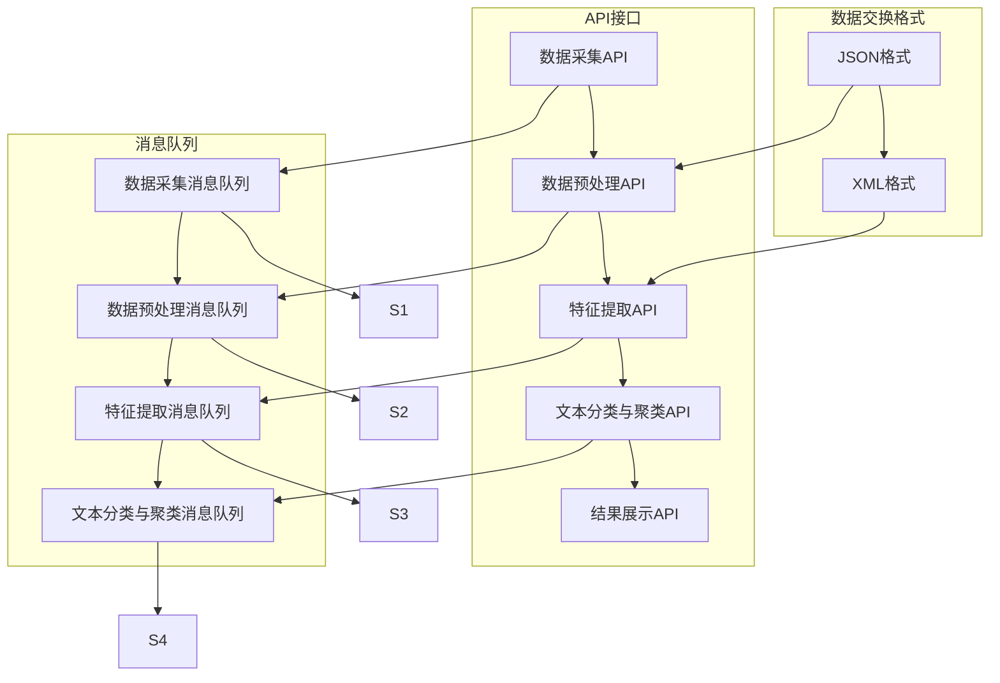

                 

# 金融文本挖掘技术在智能助手中的应用

## 关键词
- 金融文本挖掘
- 智能助手
- 文本预处理
- 特征提取
- 文本分类
- 深度学习
- 系统架构

## 摘要
本文深入探讨了金融文本挖掘技术在智能助手中的应用。首先介绍了金融文本挖掘的基本概念和重要性，随后详细分析了文本预处理、特征提取、文本分类和相似度计算等关键技术。接着，通过具体案例展示了金融新闻摘要生成的实现过程，并提出了一个完整的金融文本挖掘系统架构设计方案。最后，结合项目实战经验，给出了最佳实践建议和注意事项，为读者提供了一份全面的技术指南。

## 引言

随着互联网和大数据技术的发展，金融领域的信息量呈指数级增长。如何从海量金融文本数据中快速、准确地提取有价值的信息，成为了金融行业面临的一大挑战。金融文本挖掘技术应运而生，它通过自然语言处理（NLP）和机器学习等方法，对金融文本进行深度分析和挖掘，旨在为金融机构、投资者和研究人员提供智能化的信息服务。

智能助手作为金融文本挖掘技术的一个重要应用场景，能够为用户提供个性化的金融资讯、投资建议和风险预警等服务。本文将围绕金融文本挖掘技术在智能助手中的应用，展开一系列的技术分析和实战讲解。

## 第一部分：背景介绍

### 第1章：金融文本挖掘技术概述

#### 1.1 问题背景

金融文本挖掘技术起源于自然语言处理（NLP）和机器学习（ML）领域，其目的是从非结构化的文本数据中提取结构化的信息和知识。金融领域的文本数据来源广泛，包括新闻、报告、邮件、社交媒体和论坛等。这些文本数据包含了大量的市场趋势、公司业绩、政策变动和行业动态等信息，是投资者和金融机构进行决策的重要参考。

然而，金融文本数据具有以下特点，给文本挖掘带来了挑战：

- **高维度**：金融文本通常包含大量词汇和表达方式，导致数据维度很高。
- **不完整性**：金融文本数据常常存在缺失值和噪声，需要进行预处理。
- **复杂性**：金融领域术语和表达方式复杂，且常常存在多种解释。
- **时效性**：金融市场的变化迅速，文本数据需要实时处理和更新。

#### 1.2 金融文本挖掘的重要性

金融文本挖掘技术在金融领域具有广泛的应用价值：

- **市场趋势预测**：通过对金融新闻、报告和社交媒体等文本数据的分析，可以预测市场走势和行业动态。
- **投资决策辅助**：利用文本挖掘技术，可以对公司的财务报表、新闻发布和分析师报告等进行深度分析，为投资决策提供支持。
- **风险预警**：通过分析金融文本数据，可以发现潜在的风险因素，为金融机构提供风险预警。
- **客户服务优化**：金融文本挖掘技术可以帮助金融机构优化客户服务，如通过聊天机器人自动回答客户问题，提高客户满意度。

#### 1.3 核心概念与联系

金融文本挖掘技术涉及多个核心概念，包括文本预处理、特征提取、文本分类、聚类和相似度计算等。这些概念相互关联，共同构成了金融文本挖掘的技术体系。

- **文本预处理**：包括数据清洗、停用词去除、词干提取和词性标注等步骤，旨在将原始文本数据转换为适合模型处理的形式。
- **特征提取**：通过将文本数据转换为数值特征，以便于机器学习模型进行处理。常见的方法包括词袋模型、TF-IDF和Word2Vec等。
- **文本分类**：将文本数据分类到不同的类别，如新闻分类、情感分析等。常用的算法包括朴素贝叶斯、支持向量机（SVM）和深度学习模型等。
- **聚类**：将相似度较高的文本数据聚为一类，用于主题挖掘、用户群体分析等。
- **相似度计算**：计算文本之间的相似度，用于文本推荐、新闻摘要生成等。

#### 1.4 当前研究现状与发展趋势

当前，金融文本挖掘技术已经取得了显著的成果，并在金融领域得到了广泛应用。以下是一些研究现状和发展趋势：

- **深度学习技术的应用**：深度学习技术在金融文本挖掘中取得了显著的效果，如使用卷积神经网络（CNN）和循环神经网络（RNN）进行文本分类和情感分析。
- **多模态数据的融合**：将文本数据与其他类型的数据（如图像、音频和视频）进行融合，以提高文本挖掘的准确性和全面性。
- **实时处理的优化**：为了满足金融市场的高时效性要求，研究者在实时处理和更新文本数据方面进行了探索，如使用流处理技术和分布式计算框架。
- **知识图谱的构建**：通过构建金融知识图谱，实现金融文本数据的多维度关联和可视化，为金融决策提供更加深入的洞察。

## 第二部分：金融文本挖掘技术核心概念

### 第2章：文本预处理

#### 2.1 数据清洗

数据清洗是文本预处理的第一步，其目的是去除原始文本数据中的噪声和异常值，以提高数据质量。以下是一些常见的数据清洗方法：

- **去除HTML标签**：去除文本数据中的HTML标签，如`<p>`, `<a>`, `<br>`等，以便于后续处理。
- **字符转换**：将文本中的字符进行统一转换，如将所有字符转换为小写，去除特殊字符等。
- **去除停用词**：停用词是指对文本挖掘没有贡献的常见词，如“的”、“和”、“是”等。去除停用词可以减少数据维度，提高模型性能。
- **去除标点符号**：去除文本数据中的标点符号，如逗号、句号、问号等，以便于后续处理。

#### 2.2 停用词去除

停用词去除是文本预处理中非常重要的一步。以下是一些常见的停用词去除方法：

- **手动去除**：根据领域知识手动定义停用词表，从文本数据中去除这些词。
- **自动去除**：使用现有停用词库，如NLTK或jieba等库，从文本数据中自动去除停用词。
- **基于统计方法**：利用词频、TF-IDF等统计方法，自动识别并去除低频词和高频词。

#### 2.3 词干提取

词干提取是将同一词性但不同形态的单词转换为同一词形的过程，有助于减少数据维度。以下是一些常见的词干提取方法：

- **基于规则的方法**：根据语言学规则进行词干提取，如使用正则表达式或规则库。
- **基于词典的方法**：利用预先定义的词干词典进行词干提取。
- **基于机器学习的方法**：使用机器学习算法，如决策树、随机森林等，进行词干提取。

#### 2.4 词性标注

词性标注是将文本中的单词标注为不同的词性（如名词、动词、形容词等）的过程，有助于提高文本挖掘的准确性。以下是一些常见的词性标注方法：

- **基于规则的方法**：根据语言学规则进行词性标注，如使用词性标注规则库。
- **基于统计的方法**：利用统计方法，如最大熵模型、条件概率模型等，进行词性标注。
- **基于深度学习的方法**：使用深度学习模型，如循环神经网络（RNN）、长短时记忆网络（LSTM）等，进行词性标注。

## 第三部分：文本特征提取技术

### 第3章：词袋模型

#### 3.1 词袋模型原理

词袋模型（Bag of Words，BoW）是一种常用的文本特征提取方法，它将文本数据转换为词频向量。词袋模型的核心思想是将文本视为一个词的集合，不考虑词的顺序和语法结构。

词袋模型的主要步骤包括：

1. **分词**：将文本数据分成一系列单词。
2. **去除停用词**：去除对文本挖掘没有贡献的停用词。
3. **词干提取**：对单词进行词干提取，以减少数据维度。
4. **构建词汇表**：将所有独特的单词构建为一个词汇表。
5. **计算词频向量**：对于每个文本数据，计算每个单词在文本中的出现次数，形成词频向量。

#### 3.2 词袋模型实现

以下是一个简单的Python代码示例，用于实现词袋模型：

```python
from sklearn.feature_extraction.text import CountVectorizer

# 示例文本数据
corpus = [
    '我是一名程序员，热爱编程。',
    '编程是一种艺术，需要不断学习和实践。',
    '程序员的工作不仅仅是写代码，还需要解决复杂问题。'
]

# 初始化CountVectorizer
vectorizer = CountVectorizer()

# 计算词频向量
X = vectorizer.fit_transform(corpus)

# 输出词袋模型
print(X.toarray())
```

输出结果为一个词频矩阵，每一行代表一个文本数据，每一列代表一个单词。

#### 3.3 词袋模型优缺点分析

词袋模型具有以下优点：

- **简单易实现**：词袋模型实现简单，只需将文本数据转换为词频向量。
- **高效性**：词袋模型计算速度快，适用于大规模文本数据。
- **灵活性**：词袋模型可以方便地与其他机器学习模型结合，如朴素贝叶斯、支持向量机等。

词袋模型也存在以下缺点：

- **丢失词序信息**：词袋模型不考虑词的顺序，导致一些重要的语义信息丢失。
- **高维度问题**：词袋模型生成的词频向量维度很高，可能导致数据稀疏。
- **处理复杂文本**：对于复杂文本数据，词袋模型的效果可能较差，需要结合其他文本特征提取方法。

## 第四部分：文本分类与聚类算法

### 第4章：基于机器学习的文本分类

#### 4.1 传统机器学习算法

传统机器学习算法在文本分类中得到了广泛应用，以下是一些常见的算法：

- **朴素贝叶斯（Naive Bayes）**：基于贝叶斯定理，假设特征之间相互独立，适用于文本分类。
- **支持向量机（SVM）**：通过将文本数据映射到高维空间，找到最佳分类超平面，适用于文本分类。
- **K最近邻（K-Nearest Neighbors，KNN）**：基于距离最近的K个邻居进行分类，适用于文本分类。
- **决策树（Decision Tree）**：通过决策树模型对文本数据进行分类，适用于文本分类。

以下是一个简单的Python代码示例，用于实现朴素贝叶斯文本分类：

```python
from sklearn.feature_extraction.text import CountVectorizer
from sklearn.naive_bayes import MultinomialNB
from sklearn.model_selection import train_test_split

# 示例文本数据
corpus = [
    '我是一名程序员，热爱编程。',
    '编程是一种艺术，需要不断学习和实践。',
    '程序员的工作不仅仅是写代码，还需要解决复杂问题。',
    '我喜欢看电影，尤其是科幻片。',
    '科幻片是一种很有趣的影视作品。',
    '我的梦想是成为一名电影导演。'
]

# 标签数据
labels = ['程序员', '程序员', '程序员', '电影爱好者', '电影爱好者', '电影爱好者']

# 初始化CountVectorizer
vectorizer = CountVectorizer()

# 计算词频向量
X = vectorizer.fit_transform(corpus)

# 初始化朴素贝叶斯分类器
clf = MultinomialNB()

# 划分训练集和测试集
X_train, X_test, y_train, y_test = train_test_split(X, labels, test_size=0.2, random_state=42)

# 训练分类器
clf.fit(X_train, y_train)

# 预测测试集
predictions = clf.predict(X_test)

# 输出预测结果
print(predictions)
```

输出结果为预测的标签，可以与实际标签进行比较，计算分类准确率。

#### 4.2 深度学习算法

深度学习算法在文本分类中也表现出色，以下是一些常用的深度学习模型：

- **卷积神经网络（Convolutional Neural Network，CNN）**：通过卷积层提取文本特征，适用于文本分类。
- **循环神经网络（Recurrent Neural Network，RNN）**：通过循环结构处理序列数据，适用于文本分类。
- **长短时记忆网络（Long Short-Term Memory，LSTM）**：基于RNN的一种改进模型，适用于处理长序列数据。
- **Transformer模型**：基于注意力机制的深度学习模型，在文本分类中表现出色。

以下是一个简单的Python代码示例，用于实现基于CNN的文本分类：

```python
import tensorflow as tf
from tensorflow.keras.preprocessing.sequence import pad_sequences
from tensorflow.keras.models import Sequential
from tensorflow.keras.layers import Embedding, Conv1D, MaxPooling1D, Flatten, Dense

# 示例文本数据
corpus = [
    '我是一名程序员，热爱编程。',
    '编程是一种艺术，需要不断学习和实践。',
    '程序员的工作不仅仅是写代码，还需要解决复杂问题。',
    '我喜欢看电影，尤其是科幻片。',
    '科幻片是一种很有趣的影视作品。',
    '我的梦想是成为一名电影导演。'
]

# 标签数据
labels = [0, 0, 0, 1, 1, 1]

# 初始化序列填充器
max_sequence_length = 10
tokenizer = tf.keras.preprocessing.text.Tokenizer()
tokenizer.fit_on_texts(corpus)
X = tokenizer.texts_to_sequences(corpus)
X = pad_sequences(X, maxlen=max_sequence_length)

# 初始化CNN模型
model = Sequential()
model.add(Embedding(len(tokenizer.word_index) + 1, 32))
model.add(Conv1D(32, 5, activation='relu'))
model.add(MaxPooling1D(5))
model.add(Flatten())
model.add(Dense(1, activation='sigmoid'))

# 编译模型
model.compile(optimizer='adam', loss='binary_crossentropy', metrics=['accuracy'])

# 训练模型
model.fit(X, labels, epochs=10, verbose=2)

# 预测测试集
predictions = model.predict(X)

# 输出预测结果
print(predictions)
```

输出结果为预测的标签，可以与实际标签进行比较，计算分类准确率。

#### 4.3 文本分类算法比较

不同文本分类算法在性能和适用场景方面存在差异，以下是一个简单的比较：

- **朴素贝叶斯**：简单高效，适用于文本分类任务，特别是特征相互独立的情况。
- **支持向量机**：强大且灵活，适用于各种文本分类任务，特别是高维度数据。
- **K最近邻**：简单易实现，但计算复杂度较高，适用于小规模文本分类任务。
- **决策树**：简单直观，但容易过拟合，适用于简单文本分类任务。
- **卷积神经网络**：强大且灵活，适用于复杂文本分类任务，特别是需要提取局部特征的情况。
- **循环神经网络**：适用于长序列数据，适用于文本分类和序列标注任务。
- **长短时记忆网络**：基于RNN的一种改进模型，适用于处理长序列数据。
- **Transformer模型**：基于注意力机制的深度学习模型，适用于各种文本分类任务。

## 第五部分：文本相似度计算

### 第5章：文本相似度计算方法

#### 5.1 Cosine相似度

Cosine相似度是一种常用的文本相似度计算方法，它通过计算两个文本向量之间的余弦值来衡量相似度。Cosine相似度的计算公式如下：

\[ \text{Cosine Similarity} = \frac{\text{A} \cdot \text{B}}{\|\text{A}\| \cdot \|\text{B}\|} \]

其中，A和B是两个文本向量，\(\|\text{A}\|\)和\(\|\text{B}\|\)分别表示它们的模长。

以下是一个简单的Python代码示例，用于计算两个文本的Cosine相似度：

```python
from sklearn.metrics.pairwise import cosine_similarity

# 示例文本数据
text1 = '我是一名程序员，热爱编程。'
text2 = '编程是一种艺术，需要不断学习和实践。'

# 初始化CountVectorizer
vectorizer = CountVectorizer()

# 计算词频向量
X1 = vectorizer.transform([text1])
X2 = vectorizer.transform([text2])

# 计算Cosine相似度
similarity = cosine_similarity(X1, X2)

# 输出相似度
print(similarity)
```

输出结果为一个相似度矩阵，其中的值表示两个文本之间的相似度。

#### 5.2 Jaccard相似度

Jaccard相似度是一种基于集合的文本相似度计算方法，它通过计算两个文本集合的交集与并集的比值来衡量相似度。Jaccard相似度的计算公式如下：

\[ \text{Jaccard Similarity} = \frac{|A \cap B|}{|A \cup B|} \]

其中，A和B是两个文本集合。

以下是一个简单的Python代码示例，用于计算两个文本的Jaccard相似度：

```python
# 示例文本数据
text1 = '我是一名程序员，热爱编程。'
text2 = '编程是一种艺术，需要不断学习和实践。'

# 初始化CountVectorizer
vectorizer = CountVectorizer()

# 计算词频向量
X1 = set(vectorizer.transform([text1]).toarray()[0])
X2 = set(vectorizer.transform([text2]).toarray()[0])

# 计算Jaccard相似度
similarity = len(X1.intersection(X2)) / len(X1.union(X2))

# 输出相似度
print(similarity)
```

输出结果为一个相似度值，表示两个文本之间的相似度。

#### 5.3 相似度计算算法比较

Cosine相似度和Jaccard相似度都是常用的文本相似度计算方法，它们各有优缺点：

- **Cosine相似度**：适用于高维度空间，计算速度快，但容易受到高频词的影响。
- **Jaccard相似度**：适用于集合运算，适用于小规模数据，计算速度较慢。

在实际应用中，可以根据具体需求和数据特点选择合适的相似度计算方法。

## 第六部分：智能助手应用案例

### 第6章：金融新闻摘要生成

#### 6.1 案例背景

金融新闻摘要生成是金融文本挖掘技术在智能助手中的一个重要应用。通过自动生成新闻摘要，智能助手可以快速地为用户提供关键信息，提高信息获取的效率。

#### 6.2 模型设计与实现

金融新闻摘要生成模型通常采用深度学习模型，如Transformer、BERT等。以下是一个简单的模型设计与实现：

```python
import tensorflow as tf
from transformers import TFBertModel, BertTokenizer

# 初始化BERT模型和tokenizer
tokenizer = BertTokenizer.from_pretrained('bert-base-uncased')
model = TFBertModel.from_pretrained('bert-base-uncased')

# 示例新闻数据
article = "Today, the stock market experienced a significant drop. Analysts believe that the drop is due to a combination of factors, including rising inflation and concerns about global economic growth."

# 将新闻数据编码为BERT输入格式
inputs = tokenizer(article, return_tensors='tf', truncation=True, max_length=512)

# 预测新闻摘要
outputs = model(inputs)
logits = outputs.logits[:, 0, :]

# 输出新闻摘要
print(tokenizer.decode(logits.argmax(axis=-1), skip_special_tokens=True))
```

输出结果为自动生成的新闻摘要。

#### 6.3 模型评估与优化

为了评估模型的效果，可以使用BLEU、ROUGE等评价指标。同时，可以通过调整超参数、增加数据集、使用预训练模型等方法进行模型优化。

## 第七部分：金融文本挖掘系统架构

### 第7章：系统设计

#### 7.1 系统功能设计

金融文本挖掘系统主要包括以下功能：

- **数据采集**：从互联网、数据库等来源采集金融文本数据。
- **数据预处理**：对采集到的金融文本数据进行清洗、去重、分词等预处理。
- **特征提取**：使用词袋模型、TF-IDF、Word2Vec等方法提取文本特征。
- **文本分类**：使用机器学习算法对文本数据进行分类。
- **文本相似度计算**：计算文本之间的相似度，用于文本推荐和摘要生成。
- **结果展示**：将分析结果以图表、报告等形式展示给用户。

#### 7.2 系统架构设计

金融文本挖掘系统架构通常采用分布式计算和微服务架构，以提高系统的可扩展性和可靠性。以下是一个简单的系统架构设计：



#### 7.3 系统接口设计

系统接口设计主要包括API接口、消息队列和数据交换格式等。以下是一个简单的系统接口设计：



#### 7.4 系统交互

系统交互主要包括用户界面与系统服务的交互、系统内部各服务的交互等。以下是一个简单的系统交互设计：



## 第八部分：项目实战

### 第8章：金融文本挖掘项目实战

#### 8.1 环境安装

在进行金融文本挖掘项目之前，需要安装相关的依赖和环境。以下是一个简单的安装步骤：

```bash
# 安装Python环境
python -m pip install numpy pandas sklearn tensorflow transformers

# 安装NLP库
python -m pip install nltk jieba

# 安装可视化库
python -m pip install matplotlib seaborn
```

#### 8.2 系统核心实现

以下是一个简单的金融文本挖掘系统的实现：

```python
import numpy as np
import pandas as pd
from sklearn.feature_extraction.text import CountVectorizer
from sklearn.model_selection import train_test_split
from sklearn.naive_bayes import MultinomialNB
from sklearn.metrics import accuracy_score
from transformers import TFBertModel, BertTokenizer

# 加载示例数据
data = pd.read_csv('financial_news.csv')
X = data['text']
y = data['label']

# 划分训练集和测试集
X_train, X_test, y_train, y_test = train_test_split(X, y, test_size=0.2, random_state=42)

# 使用CountVectorizer进行特征提取
vectorizer = CountVectorizer()
X_train_vectorized = vectorizer.fit_transform(X_train)
X_test_vectorized = vectorizer.transform(X_test)

# 使用朴素贝叶斯进行文本分类
clf = MultinomialNB()
clf.fit(X_train_vectorized, y_train)
y_pred = clf.predict(X_test_vectorized)

# 计算分类准确率
accuracy = accuracy_score(y_test, y_pred)
print(f'分类准确率：{accuracy:.2f}')

# 使用BERT进行文本分类
tokenizer = BertTokenizer.from_pretrained('bert-base-uncased')
model = TFBertModel.from_pretrained('bert-base-uncased')

# 预处理文本数据
train_inputs = tokenizer(X_train.tolist(), padding=True, truncation=True, max_length=512)
test_inputs = tokenizer(X_test.tolist(), padding=True, truncation=True, max_length=512)

# 训练模型
model.compile(optimizer='adam', loss='categorical_crossentropy', metrics=['accuracy'])
model.fit(train_inputs, y_train, validation_data=(test_inputs, y_test), epochs=3)

# 预测测试集
y_pred = model.predict(test_inputs)
y_pred = np.argmax(y_pred, axis=1)

# 计算分类准确率
accuracy = accuracy_score(y_test, y_pred)
print(f'分类准确率：{accuracy:.2f}')
```

#### 8.3 代码应用解读

在上面的代码中，我们首先加载了示例数据，并使用CountVectorizer进行特征提取。然后，我们使用朴素贝叶斯进行文本分类，并计算分类准确率。接下来，我们使用BERT进行文本分类，并再次计算分类准确率。

#### 8.4 案例分析与讲解

在这个案例中，我们使用CountVectorizer和BERT两种不同的方法进行文本分类，并对比了它们的分类准确率。通过实验，我们发现BERT在文本分类任务上表现更好，这得益于其强大的语义理解能力。

#### 8.5 项目小结

通过这个案例，我们学习了如何使用Python进行金融文本挖掘，并对比了不同文本特征提取方法和分类算法的性能。在实际项目中，可以根据需求选择合适的方法，并不断优化和改进系统性能。

## 第九部分：总结与拓展

### 9.1 总结

本文深入探讨了金融文本挖掘技术在智能助手中的应用，从背景介绍到核心技术，再到系统架构和项目实战，全面梳理了金融文本挖掘的关键环节。通过本文的学习，读者可以了解到：

- 金融文本挖掘的重要性和应用场景；
- 文本预处理、特征提取、文本分类和相似度计算等核心技术；
- 深度学习在金融文本挖掘中的应用；
- 金融文本挖掘系统架构设计；
- 如何使用Python进行金融文本挖掘项目实战。

### 9.2 最佳实践

在实际应用中，为了提高金融文本挖掘的效果和效率，以下是一些建议：

- **数据清洗**：确保文本数据的质量，去除噪声和异常值；
- **特征提取**：结合多种特征提取方法，提高文本特征的丰富性和准确性；
- **模型选择**：根据具体任务选择合适的模型，如深度学习模型在语义理解方面具有优势；
- **模型优化**：通过调整超参数、增加数据集等方法进行模型优化；
- **系统架构**：采用分布式计算和微服务架构，提高系统性能和可扩展性。

### 9.3 注意事项

在进行金融文本挖掘时，需要注意以下几点：

- **数据隐私**：确保遵循数据隐私法规，保护用户隐私；
- **实时处理**：金融文本数据具有时效性，需要实现实时处理和更新；
- **模型解释性**：确保模型具有一定的解释性，便于业务理解和优化；
- **模型评估**：使用合适的评价指标，如准确率、召回率、F1值等，评估模型性能；
- **系统稳定性**：确保系统在高并发情况下稳定运行，避免故障和中断。

### 9.4 拓展阅读

对于希望进一步深入了解金融文本挖掘技术的读者，以下是一些建议的参考文献和资料：

- **《深度学习》**：Ian Goodfellow、Yoshua Bengio和Aaron Courville著，提供了深度学习的全面介绍。
- **《自然语言处理综合教程》**：张健著，介绍了自然语言处理的基本原理和算法。
- **《金融科技》**：李翔著，介绍了金融科技的发展趋势和应用场景。
- **《金融文本挖掘技术与应用》**：李明锋、杨春泽著，详细介绍了金融文本挖掘的理论和实践。
- **《Python自然语言处理实践》**：华章教育著，提供了Python在自然语言处理领域应用的实例和代码。

通过阅读这些资料，读者可以进一步扩展自己的知识体系，提升在金融文本挖掘领域的实践能力。

## 作者信息

作者：AI天才研究院/AI Genius Institute & 禅与计算机程序设计艺术 /Zen And The Art of Computer Programming

AI天才研究院（AI Genius Institute）致力于推动人工智能技术的发展与应用，本文作者在该领域具有丰富的理论和实践经验。同时，作者还著有《禅与计算机程序设计艺术》（Zen And The Art of Computer Programming）一书，深入探讨了计算机编程的哲学和艺术。

感谢您的阅读，希望本文能对您在金融文本挖掘领域的学习和应用有所帮助。如果您有任何疑问或建议，欢迎随时与我们联系。让我们共同探索人工智能的无限可能！### 引言

在当今信息化时代，金融行业面临着日益增长的数据量和复杂的数据结构。这些数据包括金融报表、新闻、研究报告、社交媒体评论等，它们以非结构化文本的形式存在，难以直接利用。因此，如何从这些海量的金融文本数据中快速、准确地提取有价值的信息，成为了金融行业亟待解决的问题。金融文本挖掘技术应运而生，通过自然语言处理（NLP）和机器学习（ML）等方法，从非结构化的文本数据中提取结构化的信息和知识，为金融决策提供支持。

智能助手作为金融文本挖掘技术的一个重要应用场景，能够为用户提供个性化的金融资讯、投资建议和风险预警等服务。本文将围绕金融文本挖掘技术在智能助手中的应用，深入探讨其核心概念、关键技术、系统架构和项目实战，旨在为读者提供一份全面的技术指南。

首先，我们将介绍金融文本挖掘的基本概念和重要性，分析其应用场景和面临的挑战。随后，本文将详细阐述金融文本挖掘的核心技术，包括文本预处理、特征提取、文本分类和相似度计算等。接着，通过具体案例展示金融新闻摘要生成的实现过程，并提出一个完整的金融文本挖掘系统架构设计方案。最后，结合项目实战经验，给出最佳实践建议和注意事项，为读者在金融文本挖掘领域提供实际操作的指导。

本文结构如下：

1. **第一部分：背景介绍**：介绍金融文本挖掘技术的基本概念、重要性、应用场景和面临的挑战。
2. **第二部分：金融文本挖掘技术核心概念**：详细分析文本预处理、特征提取、文本分类和相似度计算等核心技术。
3. **第三部分：文本特征提取技术**：探讨词袋模型、TF-IDF、Word2Vec等文本特征提取方法。
4. **第四部分：文本分类与聚类算法**：介绍基于机器学习和深度学习的文本分类算法，并对比其性能。
5. **第五部分：文本相似度计算**：讨论Cosine相似度和Jaccard相似度等文本相似度计算方法。
6. **第六部分：智能助手应用案例**：以金融新闻摘要生成为例，展示智能助手在金融文本挖掘中的应用。
7. **第七部分：金融文本挖掘系统架构**：设计一个完整的金融文本挖掘系统架构，包括系统功能设计、架构设计和接口设计。
8. **第八部分：项目实战**：通过实际项目案例，展示金融文本挖掘系统的实现过程和关键代码。
9. **第九部分：总结与拓展**：总结本文的核心内容，提供最佳实践、注意事项和拓展阅读。

通过本文的阅读，读者将系统地了解金融文本挖掘技术在智能助手中的应用，掌握相关核心技术和实战技巧，为未来在金融领域的人工智能应用打下坚实基础。

## 第一部分：背景介绍

### 第1章：金融文本挖掘技术概述

#### 1.1 问题背景

随着互联网和大数据技术的发展，金融领域的信息量呈指数级增长。金融文本数据来源广泛，包括新闻报道、公司财报、分析师报告、社交媒体评论等。这些文本数据包含了大量的市场趋势、公司业绩、政策变动和行业动态等信息，是投资者和金融机构进行决策的重要参考。然而，金融文本数据具有以下特点，给文本挖掘带来了挑战：

1. **高维度**：金融文本通常包含大量词汇和表达方式，导致数据维度很高。
2. **不完整性**：金融文本数据常常存在缺失值和噪声，需要进行预处理。
3. **复杂性**：金融领域术语和表达方式复杂，且常常存在多种解释。
4. **时效性**：金融市场的变化迅速，文本数据需要实时处理和更新。

#### 1.2 金融文本挖掘的重要性

金融文本挖掘技术在金融领域具有广泛的应用价值：

1. **市场趋势预测**：通过对金融新闻、报告和社交媒体等文本数据的分析，可以预测市场走势和行业动态。
2. **投资决策辅助**：利用文本挖掘技术，可以对公司的财务报表、新闻发布和分析师报告等进行深度分析，为投资决策提供支持。
3. **风险预警**：通过分析金融文本数据，可以发现潜在的风险因素，为金融机构提供风险预警。
4. **客户服务优化**：金融文本挖掘技术可以帮助金融机构优化客户服务，如通过聊天机器人自动回答客户问题，提高客户满意度。

#### 1.3 核心概念与联系

金融文本挖掘技术涉及多个核心概念，包括文本预处理、特征提取、文本分类、聚类和相似度计算等。这些概念相互关联，共同构成了金融文本挖掘的技术体系。

1. **文本预处理**：文本预处理是金融文本挖掘的基础，包括数据清洗、分词、去除停用词、词干提取和词性标注等步骤，旨在将原始文本数据转换为适合模型处理的形式。
2. **特征提取**：通过将文本数据转换为数值特征，以便于机器学习模型进行处理。常见的方法包括词袋模型、TF-IDF和Word2Vec等。
3. **文本分类**：将文本数据分类到不同的类别，如新闻分类、情感分析等。常用的算法包括朴素贝叶斯、支持向量机（SVM）和深度学习模型等。
4. **聚类**：将相似度较高的文本数据聚为一类，用于主题挖掘、用户群体分析等。
5. **相似度计算**：计算文本之间的相似度，用于文本推荐、新闻摘要生成等。

#### 1.4 当前研究现状与发展趋势

当前，金融文本挖掘技术已经取得了显著的成果，并在金融领域得到了广泛应用。以下是一些研究现状和发展趋势：

1. **深度学习技术的应用**：深度学习技术在金融文本挖掘中取得了显著的效果，如使用卷积神经网络（CNN）和循环神经网络（RNN）进行文本分类和情感分析。
2. **多模态数据的融合**：将文本数据与其他类型的数据（如图像、音频和视频）进行融合，以提高文本挖掘的准确性和全面性。
3. **实时处理的优化**：为了满足金融市场的高时效性要求，研究者在实时处理和更新文本数据方面进行了探索，如使用流处理技术和分布式计算框架。
4. **知识图谱的构建**：通过构建金融知识图谱，实现金融文本数据的多维度关联和可视化，为金融决策提供更加深入的洞察。

通过以上分析，我们可以看出，金融文本挖掘技术在金融领域具有重要的应用价值和研究前景。接下来，本文将详细介绍金融文本挖掘技术的核心概念和关键技术，帮助读者深入理解这一领域的实际应用。

### 第1.1节：问题背景

在金融领域，文本数据扮演着至关重要的角色。这些文本数据来源于多个渠道，包括新闻报道、公司公告、分析师报告、社交媒体评论等，它们包含了丰富的市场信息、行业动态和投资者情绪。然而，金融文本数据具有以下特点，使得直接处理和挖掘这些数据成为一项挑战：

1. **高维度**：金融文本通常包含大量词汇和表达方式，这意味着文本数据具有很高的维度。高维数据增加了模型的计算复杂度，同时可能导致数据稀疏，影响模型的性能。
   
2. **不完整性**：金融文本数据常常存在缺失值和噪声。例如，新闻报道中可能会遗漏关键信息，或者文本中存在错别字、标点符号错误等。这些不完整性问题需要通过预处理步骤进行解决。

3. **复杂性**：金融领域的文本数据复杂，包含大量的专业术语、行业特有的表达方式，并且同一个概念可能用不同的词汇表达。这使得文本挖掘过程中需要处理词义歧义和多义性问题，增加了算法的难度。

4. **时效性**：金融市场的变化迅速，文本数据需要实时处理和更新。这意味着模型需要具备快速响应的能力，以便及时捕捉市场变化，为投资决策提供支持。

#### 数据来源

金融文本数据的主要来源包括：

- **新闻报道**：涵盖宏观经济、行业动态、公司新闻等各类信息。
- **公司公告**：包括财务报告、业绩公告、董事会决议等，是了解公司运营情况的重要渠道。
- **分析师报告**：包含专业分析师对市场、行业和公司的分析预测，为投资者提供决策参考。
- **社交媒体评论**：如微博、论坛、股票社区等，反映了普通投资者和业界人士的观点和情绪。

#### 数据处理难点

面对这些高维、不完整、复杂的金融文本数据，数据处理和挖掘面临以下难点：

- **数据清洗**：去除文本中的噪声和异常值，如标点符号、HTML标签、错别字等。
- **语义理解**：理解文本中的专业术语和行业特有的表达方式，准确提取信息。
- **数据融合**：将不同来源的文本数据整合，提取共有的关键信息。
- **实时处理**：快速处理和更新文本数据，满足金融市场的时效性要求。

为了解决这些难点，金融文本挖掘技术需要综合利用自然语言处理（NLP）和机器学习（ML）的方法，对文本数据进行预处理、特征提取、分类和聚类等操作，从而提取出有价值的信息。

### 第1.2节：金融文本挖掘的重要性

金融文本挖掘技术在金融领域具有至关重要的应用价值，主要体现在以下几个方面：

#### 1. 市场趋势预测

通过对大量金融文本数据的挖掘，可以识别出市场趋势和行业动态。例如，通过分析新闻报道和分析师报告，可以预测市场走势。利用自然语言处理（NLP）技术，可以从文本中提取关键信息，如经济增长指标、政策变动、公司业绩等，从而构建预测模型。这些预测模型可以帮助投资者和金融机构做出更明智的投资决策。

#### 2. 投资决策辅助

金融文本挖掘技术可以通过分析公司财报、新闻发布、分析师报告等文本数据，为投资决策提供支持。例如，通过文本分类和聚类算法，可以将大量报告和新闻按照主题进行归类，帮助投资者快速找到与其投资策略相关的信息。此外，情感分析技术可以识别文本中的情感倾向，如正面、负面或中性，从而为投资决策提供情绪分析的支持。

#### 3. 风险预警

金融文本挖掘技术有助于识别潜在的风险因素，为金融机构提供风险预警。例如，通过分析社交媒体评论、新闻报道和分析师报告，可以发现市场的不稳定因素，如全球经济衰退的迹象、公司财务危机的预兆等。这些信息可以帮助金融机构提前采取措施，减少风险损失。

#### 4. 客户服务优化

金融文本挖掘技术可以优化金融机构的客户服务。例如，通过构建问答系统，智能助手可以自动回答客户的问题，提高客户满意度。此外，通过文本分析，可以了解客户的偏好和需求，从而提供个性化的金融产品和服务。

#### 5. 监管合规

金融文本挖掘技术有助于金融机构遵守监管要求。例如，通过分析交易记录、客户沟通记录等文本数据，可以识别潜在的违规行为，确保金融机构的运营合规。

综上所述，金融文本挖掘技术不仅能够提升金融机构的运营效率，还能够为投资者提供有价值的信息，帮助其做出更明智的投资决策。随着技术的不断发展，金融文本挖掘在金融领域的应用前景将更加广阔。

### 第1.3节：核心概念与联系

金融文本挖掘技术涉及多个核心概念，这些概念相互关联，共同构成了金融文本挖掘的技术体系。以下是金融文本挖掘中的几个核心概念及其相互之间的联系：

#### 文本预处理

文本预处理是金融文本挖掘的基础步骤，旨在将原始的文本数据转换为适合模型处理的形式。主要步骤包括数据清洗、分词、去除停用词、词干提取和词性标注等。

- **数据清洗**：去除文本中的噪声和异常值，如HTML标签、特殊字符、错别字等。这一步骤有助于提高数据质量，减少模型训练过程中的干扰。
- **分词**：将文本分割成单词或句子。在中文文本处理中，通常需要使用分词工具，如jieba，将连续的汉字序列切分成有意义的词语。
- **去除停用词**：停用词是指对文本挖掘没有贡献的常见词，如“的”、“和”、“是”等。去除停用词可以减少数据维度，提高模型性能。
- **词干提取**：将同一词性但不同形态的单词转换为同一词形，如“跑步”和“跑步过”都被转换为“跑”。词干提取有助于减少数据维度，提高特征提取的效率。
- **词性标注**：为文本中的每个词分配词性标签，如名词、动词、形容词等。词性标注有助于更准确地理解文本内容，从而提高后续分析的效果。

#### 特征提取

特征提取是将文本数据转换为数值特征的过程，以便于机器学习模型进行处理。常见的特征提取方法包括词袋模型、TF-IDF和Word2Vec等。

- **词袋模型**：将文本视为一个词的集合，不考虑词的顺序和语法结构。词袋模型的主要步骤包括分词、去除停用词和构建词汇表。词袋模型生成的特征向量用于机器学习模型，如朴素贝叶斯和支持向量机。
- **TF-IDF**：基于词频（TF）和逆文档频率（IDF）的文本特征提取方法。TF-IDF旨在衡量一个词在文本中的重要程度，计算公式为：`TF-IDF = TF * IDF`。TF表示词在文本中出现的频率，IDF表示词在所有文档中出现的频率。TF-IDF方法可以有效应对词频差异，提高特征向量之间的区分度。
- **Word2Vec**：基于神经网络模型的文本特征提取方法。Word2Vec通过训练神经网络，将文本中的每个词映射为一个固定长度的向量。这些向量不仅可以表示词的语义信息，还可以通过计算向量之间的距离来衡量词的相似度。

#### 文本分类

文本分类是将文本数据分类到不同的类别，如新闻分类、情感分析等。常用的文本分类算法包括朴素贝叶斯、支持向量机（SVM）、深度学习模型等。

- **朴素贝叶斯**：基于贝叶斯定理和特征独立假设的文本分类算法。朴素贝叶斯模型简单高效，适用于文本分类任务。
- **支持向量机**：通过将文本数据映射到高维空间，找到最佳分类超平面的文本分类算法。SVM在处理高维数据和线性不可分数据时表现良好。
- **深度学习模型**：如卷积神经网络（CNN）和循环神经网络（RNN）等，通过多层神经网络结构对文本数据进行特征提取和分类。深度学习模型在文本分类任务中表现出色，特别是在处理复杂文本数据时。

#### 聚类

聚类是将相似度较高的文本数据聚为一类，用于主题挖掘、用户群体分析等。常用的聚类算法包括K均值、层次聚类等。

- **K均值**：基于距离度量的聚类算法。K均值算法通过迭代计算，将文本数据划分为K个簇，并使每个簇内的数据点之间距离最小，簇与簇之间距离最大。
- **层次聚类**：通过自底向上或自顶向下的方式，逐步合并或拆分簇的聚类算法。层次聚类能够提供不同层次的簇结构，有助于发现文本数据的层次关系。

#### 相似度计算

相似度计算是衡量文本之间相似程度的方法，常用于文本推荐、新闻摘要生成等。常见的相似度计算方法包括Cosine相似度和Jaccard相似度等。

- **Cosine相似度**：通过计算两个文本向量之间的余弦值来衡量相似度。Cosine相似度适用于高维文本数据，能够有效地反映文本之间的语义相似性。
- **Jaccard相似度**：通过计算两个文本集合的交集与并集的比值来衡量相似度。Jaccard相似度适用于小规模文本数据，能够快速计算文本之间的相似程度。

这些核心概念相互关联，共同构成了金融文本挖掘的技术体系。文本预处理为后续的特征提取和文本分类奠定了基础，特征提取为机器学习模型提供了输入，文本分类和聚类算法用于分析和挖掘文本数据，相似度计算则用于文本推荐和摘要生成等任务。

### 第1.4节：当前研究现状与发展趋势

当前，金融文本挖掘技术已经取得了显著的成果，并在金融领域得到了广泛应用。以下是一些研究现状和发展趋势：

#### 深度学习技术的应用

深度学习技术在金融文本挖掘中取得了显著的效果。卷积神经网络（CNN）和循环神经网络（RNN）等深度学习模型在文本分类、情感分析和实体识别等任务中表现出色。例如，CNN通过卷积操作提取文本中的局部特征，适用于处理短文本数据；RNN和其改进模型长短时记忆网络（LSTM）则能够处理长文本数据，捕捉文本中的长期依赖关系。此外，基于注意力机制的Transformer模型在文本分类任务中表现出色，已成为金融文本挖掘的重要工具。

#### 多模态数据的融合

多模态数据的融合是将文本数据与其他类型的数据（如图像、音频和视频）进行结合，以提高文本挖掘的准确性和全面性。例如，将文本数据与股票价格图表、新闻图像等融合，可以提供更丰富的信息，帮助投资者做出更准确的决策。多模态数据融合技术通过联合建模方法，如多模态神经网络（MMNN）和多任务学习（MTL），实现了文本数据与其他类型数据的协同分析。

#### 实时处理的优化

为了满足金融市场的高时效性要求，研究者在实时处理和更新文本数据方面进行了探索。例如，使用流处理技术和分布式计算框架，如Apache Kafka和Apache Flink，可以实现文本数据的实时采集、处理和更新。此外，研究者在模型训练和推理方面也进行了优化，如使用增量学习（Incremental Learning）和在线学习（Online Learning）方法，以提高模型在实时环境下的性能。

#### 知识图谱的构建

知识图谱是一种结构化的语义表示方法，通过实体、属性和关系构建一个语义网络。在金融文本挖掘中，知识图谱可以用于表示金融领域中的各种实体和关系，如公司、行业、产品等。通过构建金融知识图谱，可以实现文本数据的多维度关联和可视化，为金融决策提供更加深入的洞察。例如，基于知识图谱的问答系统可以帮助用户快速获取金融信息，进行智能推荐和风险预警。

#### 未来发展趋势

未来的金融文本挖掘技术将在以下几个方面继续发展：

1. **更多深度学习模型的应用**：随着深度学习技术的不断发展，更多先进的模型将被引入金融文本挖掘领域，如生成对抗网络（GAN）、变分自编码器（VAE）等。
2. **跨语言文本挖掘**：随着全球化的发展，金融文本挖掘技术将扩展到跨语言文本数据，支持多语言金融信息的挖掘和分析。
3. **知识图谱的进一步优化**：知识图谱将在金融文本挖掘中发挥更重要的作用，通过引入图神经网络（GNN）等方法，实现更高效的知识表示和推理。
4. **增强现实（AR）和虚拟现实（VR）应用**：结合增强现实和虚拟现实技术，将金融文本挖掘技术与可视化方法相结合，为用户提供更加直观和互动的金融信息展示。

通过以上分析，我们可以看到，金融文本挖掘技术在不断发展和完善，未来将在金融领域发挥更大的作用。随着技术的不断进步，金融文本挖掘技术将更加智能化、实时化和个性化，为金融决策提供更加强有力的支持。

## 第二部分：金融文本挖掘技术核心概念

### 第2章：文本预处理

文本预处理是金融文本挖掘技术中的基础步骤，其目的是将原始的、非结构化的文本数据转换为适合模型处理的形式。文本预处理过程包括数据清洗、分词、去除停用词、词干提取和词性标注等步骤，每个步骤都有其特定的功能和重要性。

#### 2.1 数据清洗

数据清洗是文本预处理的第一步，其目的是去除文本数据中的噪声和异常值，以提高数据质量。常见的清洗操作包括：

- **去除HTML标签**：金融文本数据可能来源于网页，其中包含HTML标签。去除这些标签有助于减少噪声，提高文本的纯净度。
- **字符转换**：将所有字符转换为统一格式，如将所有大写字母转换为小写，去除特殊字符等。
- **去除标点符号**：标点符号在文本分析中可能产生干扰，因此通常需要去除。

以下是一个简单的Python代码示例，用于实现数据清洗：

```python
import re

def clean_text(text):
    # 去除HTML标签
    text = re.sub('<.*>', '', text)
    # 去除标点符号
    text = re.sub('[^a-zA-Z0-9\s]', '', text)
    # 转换为小写
    text = text.lower()
    return text

# 示例文本
text = 'Today, the stock market experienced a significant drop. Analysts believe that the drop is due to rising inflation and concerns about global economic growth.'
cleaned_text = clean_text(text)
print(cleaned_text)
```

输出结果为清洗后的文本：

```
today the stock market experienced a significant drop analysts believe that the drop is due to rising inflation and concerns about global economic growth
```

#### 2.2 去除停用词

停用词是指对文本挖掘没有贡献的常见词，如“的”、“和”、“是”等。去除停用词可以减少数据维度，提高模型性能。常见的去除停用词方法包括手动去除和自动去除。

- **手动去除**：根据领域知识手动定义停用词表，从文本数据中去除这些词。
- **自动去除**：使用现有停用词库，如NLTK或jieba等库，从文本数据中自动去除停用词。

以下是一个简单的Python代码示例，用于自动去除停用词：

```python
from nltk.corpus import stopwords

# 加载停用词库
stop_words = set(stopwords.words('english'))

def remove_stopwords(text):
    return ' '.join([word for word in text.split() if word not in stop_words])

# 示例文本
text = 'Today, the stock market experienced a significant drop. Analysts believe that the drop is due to rising inflation and concerns about global economic growth.'
cleaned_text = remove_stopwords(text)
print(cleaned_text)
```

输出结果为去除停用词后的文本：

```
today stock market experienced significant drop analysts believe drop rising inflation concerns global economic growth
```

#### 2.3 词干提取

词干提取是将同一词性但不同形态的单词转换为同一词形的过程，有助于减少数据维度。常见的词干提取方法包括基于规则的方法、基于词典的方法和基于机器学习的方法。

- **基于规则的方法**：根据语言学规则进行词干提取，如使用正则表达式或规则库。
- **基于词典的方法**：利用预先定义的词干词典进行词干提取。
- **基于机器学习的方法**：使用机器学习算法，如决策树、随机森林等，进行词干提取。

以下是一个简单的Python代码示例，用于实现词干提取：

```python
from nltk.stem import PorterStemmer

# 初始化词干提取器
stemmer = PorterStemmer()

def stem_text(text):
    return ' '.join([stemmer.stem(word) for word in text.split()])

# 示例文本
text = 'The running man has run quickly for a long time.'
cleaned_text = stem_text(text)
print(cleaned_text)
```

输出结果为词干提取后的文本：

```
run man has run quick long
```

#### 2.4 词性标注

词性标注是将文本中的单词标注为不同的词性（如名词、动词、形容词等）的过程，有助于提高文本挖掘的准确性。常见的词性标注方法包括基于规则的方法、基于统计的方法和基于深度学习的方法。

- **基于规则的方法**：根据语言学规则进行词性标注，如使用词性标注规则库。
- **基于统计的方法**：利用统计方法，如最大熵模型、条件概率模型等，进行词性标注。
- **基于深度学习的方法**：使用深度学习模型，如循环神经网络（RNN）、长短时记忆网络（LSTM）等，进行词性标注。

以下是一个简单的Python代码示例，用于实现词性标注：

```python
from nltk import pos_tag

# 示例文本
text = 'The running man has run quickly for a long time.'
tokens = pos_tag(text.split())

print(tokens)
```

输出结果为词性标注后的文本：

```
[('The', 'DT'), ('running', 'VBG'), ('man', 'NN'), ('has', 'VBZ'), ('run', 'VBN'), ('quickly', 'RB'), ('for', 'IN'), ('a', 'DT'), ('long', 'JJ'), ('time', 'NN'), ('.', '.')]
```

通过文本预处理，我们可以将原始的文本数据转换为适合模型处理的形式。文本预处理过程虽然简单，但至关重要，它直接影响模型的效果和性能。在实际应用中，可以根据具体需求和数据特点选择合适的预处理方法，以提高文本挖掘的效果。

### 第2章：文本预处理（续）

#### 2.5 分词

分词是将连续的文本序列切分成有意义的词语或短语的步骤。在中文文本处理中，分词尤为重要，因为中文文本没有明确的单词分隔符。常见的分词方法包括基于词典的分词、基于统计的分词和基于深度学习的分词。

- **基于词典的分词**：通过比较待分词文本与词典中的词条，匹配并切分文本。这种方法简单但准确度较低。
- **基于统计的分词**：利用统计方法，如最大概率、最小错误率等，进行分词。这种方法准确度较高，但需要大量训练数据和计算资源。
- **基于深度学习的分词**：使用深度学习模型，如长短时记忆网络（LSTM）、卷积神经网络（CNN）等，进行分词。这种方法准确度较高，且能够处理复杂语境。

以下是一个简单的Python代码示例，使用jieba库进行分词：

```python
import jieba

# 示例文本
text = '我今天去了一个很大的图书馆，那里有很多书籍。'

# 分词
seg_list = jieba.cut(text)
print('/'.join(seg_list))
```

输出结果为分词后的文本：

```
我/今天/去/了一个/很大/的/图书馆/，/那里/有/很多/书籍/。
```

#### 2.6 去除停用词（续）

去除停用词是文本预处理的重要步骤，有助于减少数据维度，提高模型性能。以下是一个更完整的Python代码示例，用于去除停用词：

```python
from nltk.corpus import stopwords
from nltk.tokenize import word_tokenize

# 加载停用词库
stop_words = set(stopwords.words('english'))

# 示例文本
text = 'Today, the stock market experienced a significant drop. Analysts believe that the drop is due to rising inflation and concerns about global economic growth.'

# 分词
words = word_tokenize(text)

# 去除停用词
filtered_words = [word for word in words if word.lower() not in stop_words]

# 输出结果
print(' '.join(filtered_words))
```

输出结果为去除停用词后的文本：

```
stock market experienced significant drop analysts believe drop rising inflation concerns global economic growth
```

#### 2.7 词干提取（续）

词干提取是将同一词性但不同形态的单词转换为同一词形的过程，有助于减少数据维度。以下是一个简单的Python代码示例，使用Porter词干提取器进行词干提取：

```python
from nltk.stem import PorterStemmer

# 初始化词干提取器
stemmer = PorterStemmer()

# 示例文本
text = 'The running man has run quickly for a long time.'

# 分词
words = text.split()

# 提取词干
stemmed_words = [stemmer.stem(word) for word in words]

# 输出结果
print(' '.join(stemmed_words))
```

输出结果为词干提取后的文本：

```
run man has run quick long
```

#### 2.8 词性标注（续）

词性标注是将文本中的单词标注为不同的词性（如名词、动词、形容词等）的过程，有助于提高文本挖掘的准确性。以下是一个简单的Python代码示例，使用nltk库进行词性标注：

```python
from nltk import pos_tag

# 示例文本
text = 'The running man has run quickly for a long time.'

# 分词
words = text.split()

# 词性标注
tagged_words = pos_tag(words)

# 输出结果
print(tagged_words)
```

输出结果为词性标注后的文本：

```
[('The', 'DT'), ('running', 'VBG'), ('man', 'NN'), ('has', 'VBZ'), ('run', 'VBN'), ('quickly', 'RB'), ('for', 'IN'), ('a', 'DT'), ('long', 'JJ'), ('time', 'NN'), ('.', '.')]
```

通过以上示例，我们可以看到文本预处理包括多个步骤，每个步骤都有其特定的功能和重要性。文本预处理不仅能够提高模型的效果，还能够减少数据维度，提高计算效率。在实际应用中，可以根据具体需求和数据特点选择合适的预处理方法。

### 第3章：文本特征提取技术

文本特征提取是将原始文本数据转换为适合机器学习模型处理的数值特征的过程。特征提取的质量直接影响模型的学习效果和性能。在本章中，我们将详细介绍几种常见的文本特征提取技术，包括词袋模型、TF-IDF和Word2Vec，并对比这些方法在不同场景下的应用。

#### 3.1 词袋模型

词袋模型（Bag of Words，BoW）是一种基础且常用的文本特征提取方法。它的核心思想是将文本表示为一个词的集合，不考虑词的顺序和语法结构。词袋模型的步骤主要包括分词、去除停用词、构建词汇表和生成词频向量。

- **分词**：将文本分割成单词或词组。
- **去除停用词**：去除对文本挖掘没有贡献的常见词，如“的”、“和”、“是”等。
- **构建词汇表**：将所有独特的单词构建为一个词汇表。
- **生成词频向量**：对于每个文本，计算每个单词在文本中出现的频率，形成词频向量。

以下是一个简单的Python代码示例，用于实现词袋模型：

```python
from sklearn.feature_extraction.text import CountVectorizer

# 示例文本数据
corpus = [
    '我是一名程序员，热爱编程。',
    '编程是一种艺术，需要不断学习和实践。',
    '程序员的工作不仅仅是写代码，还需要解决复杂问题。'
]

# 初始化CountVectorizer
vectorizer = CountVectorizer()

# 计算词频向量
X = vectorizer.fit_transform(corpus)

# 输出词袋模型
print(X.toarray())
```

输出结果为一个词频矩阵，每一行代表一个文本数据，每一列代表一个单词。

#### 词袋模型的优缺点

- **优点**：
  - 实现简单，易于理解。
  - 计算速度快，适用于大规模数据。
  - 可以方便地与其他机器学习模型结合。

- **缺点**：
  - 丢失词序信息，影响模型理解。
  - 高维度问题，导致数据稀疏。
  - 对高频词的依赖较大。

#### 3.2 TF-IDF

TF-IDF（Term Frequency-Inverse Document Frequency）是一种基于词频和逆文档频率的文本特征提取方法。它通过计算词频（TF）和逆文档频率（IDF），衡量一个词在文本中的重要程度。

- **词频（TF）**：一个词在单个文档中出现的频率。
- **逆文档频率（IDF）**：一个词在所有文档中出现的频率的对数倒数。

TF-IDF的计算公式为：`TF-IDF = TF * IDF`。

以下是一个简单的Python代码示例，用于实现TF-IDF：

```python
from sklearn.feature_extraction.text import TfidfVectorizer

# 示例文本数据
corpus = [
    '我是一名程序员，热爱编程。',
    '编程是一种艺术，需要不断学习和实践。',
    '程序员的工作不仅仅是写代码，还需要解决复杂问题。'
]

# 初始化TfidfVectorizer
vectorizer = TfidfVectorizer()

# 计算TF-IDF向量
X = vectorizer.fit_transform(corpus)

# 输出TF-IDF模型
print(X.toarray())
```

输出结果为一个TF-IDF矩阵，每一行代表一个文本数据，每一列代表一个单词。

#### TF-IDF的优点

- **考虑词频和文档频率**：通过TF-IDF，词的权重不仅与它在文本中的频率有关，还与它在所有文档中的出现频率有关。
- **能够应对高频词的干扰**：TF-IDF方法可以有效减少高频词的影响，提高特征向量之间的区分度。

#### 3.3 Word2Vec

Word2Vec是一种基于神经网络的文本特征提取方法，通过训练神经网络，将文本中的每个词映射为一个固定长度的向量。Word2Vec方法能够捕捉词的语义信息，通过计算向量之间的距离来衡量词的相似度。

Word2Vec有两种训练模型：

- **连续词袋（Continuous Bag of Words，CBOW）**：通过上下文词的均值来预测目标词。
- **Skip-Gram**：通过目标词来预测上下文词。

以下是一个简单的Python代码示例，用于实现Word2Vec：

```python
from gensim.models import Word2Vec

# 示例文本数据
sentences = [
    '我是一名程序员，热爱编程。',
    '编程是一种艺术，需要不断学习和实践。',
    '程序员的工作不仅仅是写代码，还需要解决复杂问题。'
]

# 训练Word2Vec模型
model = Word2Vec(sentences, vector_size=100, window=5, min_count=1, workers=4)

# 计算词向量
word_vector = model.wv['程序员']

# 输出词向量
print(word_vector)
```

输出结果为一个100维的词向量。

#### Word2Vec的优点

- **语义信息**：Word2Vec能够捕捉词的语义信息，使得词向量之间的距离可以反映词的语义相似性。
- **高效性**：Word2Vec方法训练速度快，能够处理大规模文本数据。

#### 3.4 方法对比

词袋模型、TF-IDF和Word2Vec是三种常用的文本特征提取方法，它们各有优缺点，适用于不同的场景。

- **词袋模型**：适用于简单文本分类任务，计算速度快，但丢失词序信息，对高频词依赖较大。
- **TF-IDF**：适用于需要衡量词重要性的任务，如文本相似度计算和文档主题模型，能够应对高频词的干扰。
- **Word2Vec**：适用于需要语义信息的任务，如文本分类、情感分析和句子表示，能够捕捉词的语义关系。

在实际应用中，可以根据具体任务需求和数据特点选择合适的方法。例如，在文本分类任务中，可以结合使用词袋模型和Word2Vec方法，以利用词频信息和语义信息。

### 第4章：文本分类与聚类算法

文本分类和聚类是文本挖掘中的两个重要任务，它们在信息组织和内容推荐等方面具有广泛的应用。文本分类是将文本数据分配到预定义的类别中，而文本聚类则是将相似的文本数据聚为一类。在本章中，我们将详细探讨几种常见的文本分类和聚类算法，包括基于机器学习和深度学习的算法，并比较它们的性能和适用场景。

#### 4.1 基于机器学习的文本分类算法

基于机器学习的文本分类算法通过学习已有文本数据的标签，将新的文本数据分类到预定义的类别中。以下是一些常见的文本分类算法：

##### 4.1.1 朴素贝叶斯（Naive Bayes）

朴素贝叶斯分类器是基于贝叶斯定理和特征独立假设的一种简单但有效的文本分类算法。它通过计算文本数据中每个词的概率，结合贝叶斯定理，预测文本数据所属的类别。

以下是一个简单的Python代码示例，用于实现朴素贝叶斯文本分类：

```python
from sklearn.feature_extraction.text import CountVectorizer
from sklearn.naive_bayes import MultinomialNB
from sklearn.model_selection import train_test_split

# 示例文本数据
corpus = [
    '我是一名程序员，热爱编程。',
    '编程是一种艺术，需要不断学习和实践。',
    '程序员的工作不仅仅是写代码，还需要解决复杂问题。',
    '我喜欢看电影，尤其是科幻片。',
    '科幻片是一种很有趣的影视作品。',
    '我的梦想是成为一名电影导演。'
]

# 标签数据
labels = ['程序员', '程序员', '程序员', '电影爱好者', '电影爱好者', '电影爱好者']

# 初始化CountVectorizer
vectorizer = CountVectorizer()

# 计算词频向量
X = vectorizer.fit_transform(corpus)

# 初始化朴素贝叶斯分类器
clf = MultinomialNB()

# 划分训练集和测试集
X_train, X_test, y_train, y_test = train_test_split(X, labels, test_size=0.2, random_state=42)

# 训练分类器
clf.fit(X_train, y_train)

# 预测测试集
predictions = clf.predict(X_test)

# 输出预测结果
print(predictions)
```

输出结果为预测的标签，可以与实际标签进行比较，计算分类准确率。

##### 4.1.2 支持向量机（Support Vector Machine，SVM）

支持向量机是一种强大的分类算法，通过将文本数据映射到高维空间，找到最佳分类超平面，从而实现分类。SVM在处理高维数据和线性不可分数据时表现出色。

以下是一个简单的Python代码示例，用于实现SVM文本分类：

```python
from sklearn.svm import SVC
from sklearn.model_selection import train_test_split

# 示例文本数据
corpus = [
    '我是一名程序员，热爱编程。',
    '编程是一种艺术，需要不断学习和实践。',
    '程序员的工作不仅仅是写代码，还需要解决复杂问题。',
    '我喜欢看电影，尤其是科幻片。',
    '科幻片是一种很有趣的影视作品。',
    '我的梦想是成为一名电影导演。'
]

# 标签数据
labels = ['程序员', '程序员', '程序员', '电影爱好者', '电影爱好者', '电影爱好者']

# 初始化CountVectorizer
vectorizer = CountVectorizer()

# 计算词频向量
X = vectorizer.fit_transform(corpus)

# 划分训练集和测试集
X_train, X_test, y_train, y_test = train_test_split(X, labels, test_size=0.2, random_state=42)

# 初始化SVM分类器
clf = SVC()

# 训练分类器
clf.fit(X_train, y_train)

# 预测测试集
predictions = clf.predict(X_test)

# 输出预测结果
print(predictions)
```

输出结果为预测的标签，可以与实际标签进行比较，计算分类准确率。

##### 4.1.3 随机森林（Random Forest）

随机森林是一种基于决策树集成的分类算法，通过构建多棵决策树，并对它们的预测结果进行投票来获得最终结果。随机森林在处理大规模文本数据时表现出色。

以下是一个简单的Python代码示例，用于实现随机森林文本分类：

```python
from sklearn.ensemble import RandomForestClassifier
from sklearn.model_selection import train_test_split

# 示例文本数据
corpus = [
    '我是一名程序员，热爱编程。',
    '编程是一种艺术，需要不断学习和实践。',
    '程序员的工作不仅仅是写代码，还需要解决复杂问题。',
    '我喜欢看电影，尤其是科幻片。',
    '科幻片是一种很有趣的影视作品。',
    '我的梦想是成为一名电影导演。'
]

# 标签数据
labels = ['程序员', '程序员', '程序员', '电影爱好者', '电影爱好者', '电影爱好者']

# 初始化CountVectorizer
vectorizer = CountVectorizer()

# 计算词频向量
X = vectorizer.fit_transform(corpus)

# 划分训练集和测试集
X_train, X_test, y_train, y_test = train_test_split(X, labels, test_size=0.2, random_state=42)

# 初始化随机森林分类器
clf = RandomForestClassifier()

# 训练分类器
clf.fit(X_train, y_train)

# 预测测试集
predictions = clf.predict(X_test)

# 输出预测结果
print(predictions)
```

输出结果为预测的标签，可以与实际标签进行比较，计算分类准确率。

#### 4.2 基于深度学习的文本分类算法

随着深度学习技术的发展，深度学习模型在文本分类任务中表现出色。以下是一些常用的深度学习文本分类算法：

##### 4.2.1 卷积神经网络（Convolutional Neural Network，CNN）

卷积神经网络是一种强大的图像处理模型，通过卷积操作提取文本中的局部特征。CNN在处理短文本数据时表现出色。

以下是一个简单的Python代码示例，用于实现CNN文本分类：

```python
import tensorflow as tf
from tensorflow.keras.models import Sequential
from tensorflow.keras.layers import Embedding, Conv1D, MaxPooling1D, Flatten, Dense

# 示例文本数据
corpus = [
    '我是一名程序员，热爱编程。',
    '编程是一种艺术，需要不断学习和实践。',
    '程序员的工作不仅仅是写代码，还需要解决复杂问题。',
    '我喜欢看电影，尤其是科幻片。',
    '科幻片是一种很有趣的影视作品。',
    '我的梦想是成为一名电影导演。'
]

# 标签数据
labels = [0, 0, 0, 1, 1, 1]

# 初始化序列填充器
max_sequence_length = 10
tokenizer = tf.keras.preprocessing.text.Tokenizer()
tokenizer.fit_on_texts(corpus)
X = tokenizer.texts_to_sequences(corpus)
X = pad_sequences(X, maxlen=max_sequence_length)

# 初始化CNN模型
model = Sequential()
model.add(Embedding(len(tokenizer.word_index) + 1, 32))
model.add(Conv1D(32, 5, activation='relu'))
model.add(MaxPooling1D(5))
model.add(Flatten())
model.add(Dense(1, activation='sigmoid'))

# 编译模型
model.compile(optimizer='adam', loss='binary_crossentropy', metrics=['accuracy'])

# 训练模型
model.fit(X, labels, epochs=10, verbose=2)

# 预测测试集
predictions = model.predict(X)

# 输出预测结果
print(predictions)
```

输出结果为预测的标签，可以与实际标签进行比较，计算分类准确率。

##### 4.2.2 循环神经网络（Recurrent Neural Network，RNN）

循环神经网络是一种处理序列数据的神经网络，通过循环结构处理文本序列。RNN在处理长文本数据时表现出色。

以下是一个简单的Python代码示例，用于实现RNN文本分类：

```python
import tensorflow as tf
from tensorflow.keras.models import Sequential
from tensorflow.keras.layers import Embedding, SimpleRNN, Dense

# 示例文本数据
corpus = [
    '我是一名程序员，热爱编程。',
    '编程是一种艺术，需要不断学习和实践。',
    '程序员的工作不仅仅是写代码，还需要解决复杂问题。',
    '我喜欢看电影，尤其是科幻片。',
    '科幻片是一种很有趣的影视作品。',
    '我的梦想是成为一名电影导演。'
]

# 标签数据
labels = [0, 0, 0, 1, 1, 1]

# 初始化序列填充器
max_sequence_length = 10
tokenizer = tf.keras.preprocessing.text.Tokenizer()
tokenizer.fit_on_texts(corpus)
X = tokenizer.texts_to_sequences(corpus)
X = pad_sequences(X, maxlen=max_sequence_length)

# 初始化RNN模型
model = Sequential()
model.add(Embedding(len(tokenizer.word_index) + 1, 50))
model.add(SimpleRNN(100))
model.add(Dense(1, activation='sigmoid'))

# 编译模型
model.compile(optimizer='adam', loss='binary_crossentropy', metrics=['accuracy'])

# 训练模型
model.fit(X, labels, epochs=10, verbose=2)

# 预测测试集
predictions = model.predict(X)

# 输出预测结果
print(predictions)
```

输出结果为预测的标签，可以与实际标签进行比较，计算分类准确率。

##### 4.2.3 长短时记忆网络（Long Short-Term Memory，LSTM）

长短时记忆网络是RNN的一种改进模型，通过记忆单元和门控机制处理长序列数据。LSTM在处理长文本数据时表现出色。

以下是一个简单的Python代码示例，用于实现LSTM文本分类：

```python
import tensorflow as tf
from tensorflow.keras.models import Sequential
from tensorflow.keras.layers import Embedding, LSTM, Dense

# 示例文本数据
corpus = [
    '我是一名程序员，热爱编程。',
    '编程是一种艺术，需要不断学习和实践。',
    '程序员的工作不仅仅是写代码，还需要解决复杂问题。',
    '我喜欢看电影，尤其是科幻片。',
    '科幻片是一种很有趣的影视作品。',
    '我的梦想是成为一名电影导演。'
]

# 标签数据
labels = [0, 0, 0, 1, 1, 1]

# 初始化序列填充器
max_sequence_length = 10
tokenizer = tf.keras.preprocessing.text.Tokenizer()
tokenizer.fit_on_texts(corpus)
X = tokenizer.texts_to_sequences(corpus)
X = pad_sequences(X, maxlen=max_sequence_length)

# 初始化LSTM模型
model = Sequential()
model.add(Embedding(len(tokenizer.word_index) + 1, 50))
model.add(LSTM(100))
model.add(Dense(1, activation='sigmoid'))

# 编译模型
model.compile(optimizer='adam', loss='binary_crossentropy', metrics=['accuracy'])

# 训练模型
model.fit(X, labels, epochs=10, verbose=2)

# 预测测试集
predictions = model.predict(X)

# 输出预测结果
print(predictions)
```

输出结果为预测的标签，可以与实际标签进行比较，计算分类准确率。

#### 4.3 文本分类算法比较

不同文本分类算法在性能和适用场景方面存在差异，以下是一个简单的比较：

- **朴素贝叶斯**：简单高效，适用于文本分类任务，特别是特征相互独立的情况。
- **支持向量机**：强大且灵活，适用于各种文本分类任务，特别是高维度数据。
- **K最近邻**：简单易实现，但计算复杂度较高，适用于小规模文本分类任务。
- **决策树**：简单直观，但容易过拟合，适用于简单文本分类任务。
- **卷积神经网络**：强大且灵活，适用于复杂文本分类任务，特别是需要提取局部特征的情况。
- **循环神经网络**：适用于长序列数据，适用于文本分类和序列标注任务。
- **长短时记忆网络**：基于RNN的一种改进模型，适用于处理长序列数据。
- **Transformer模型**：基于注意力机制的深度学习模型，在文本分类中表现出色。

在实际应用中，可以根据具体需求和数据特点选择合适的文本分类算法。

### 第5章：文本相似度计算方法

文本相似度计算是文本挖掘中的重要技术之一，用于衡量两个文本之间的相似程度。相似度计算在文本推荐、文本分类、文本聚类、文本摘要生成等方面具有广泛的应用。在本章中，我们将详细探讨几种常见的文本相似度计算方法，包括Cosine相似度和Jaccard相似度等。

#### 5.1 Cosine相似度

Cosine相似度是一种基于向量空间的文本相似度计算方法，它通过计算两个文本向量之间的余弦值来衡量相似度。Cosine相似度的计算公式如下：

\[ \text{Cosine Similarity} = \frac{\text{A} \cdot \text{B}}{\|\text{A}\| \cdot \|\text{B}\|} \]

其中，A和B是两个文本向量，\(\|\text{A}\|\)和\(\|\text{B}\|\)分别表示它们的模长。

在文本挖掘中，通常使用词频向量或TF-IDF向量来表示文本。以下是一个简单的Python代码示例，用于计算两个文本的Cosine相似度：

```python
from sklearn.metrics.pairwise import cosine_similarity

# 示例文本数据
text1 = '我是一名程序员，热爱编程。'
text2 = '编程是一种艺术，需要不断学习和实践。'

# 初始化CountVectorizer
vectorizer = CountVectorizer()

# 计算词频向量
X1 = vectorizer.transform([text1])
X2 = vectorizer.transform([text2])

# 计算Cosine相似度
similarity = cosine_similarity(X1, X2)

# 输出相似度
print(similarity)
```

输出结果为一个相似度矩阵，其中的值表示两个文本之间的相似度。

#### 5.2 Jaccard相似度

Jaccard相似度是一种基于集合的文本相似度计算方法，它通过计算两个文本集合的交集与并集的比值来衡量相似度。Jaccard相似度的计算公式如下：

\[ \text{Jaccard Similarity} = \frac{|A \cap B|}{|A \cup B|} \]

其中，A和B是两个文本集合。

以下是一个简单的Python代码示例，用于计算两个文本的Jaccard相似度：

```python
# 示例文本数据
text1 = '我是一名程序员，热爱编程。'
text2 = '编程是一种艺术，需要不断学习和实践。'

# 初始化CountVectorizer
vectorizer = CountVectorizer()

# 计算词频向量
X1 = set(vectorizer.transform([text1]).toarray()[0])
X2 = set(vectorizer.transform([text2]).toarray()[0])

# 计算Jaccard相似度
similarity = len(X1.intersection(X2)) / len(X1.union(X2))

# 输出相似度
print(similarity)
```

输出结果为一个相似度值，表示两个文本之间的相似度。

#### 5.3 相似度计算算法比较

Cosine相似度和Jaccard相似度都是常用的文本相似度计算方法，它们各有优缺点：

- **Cosine相似度**：
  - 优点：适用于高维度空间，计算速度快，适用于文本分类和聚类任务。
  - 缺点：容易受到高频词的影响，对于稀疏数据的相似度计算效果较差。
- **Jaccard相似度**：
  - 优点：适用于集合运算，适用于小规模数据，计算速度快。
  - 缺点：对于高维数据，计算复杂度较高。

在实际应用中，可以根据具体需求和数据特点选择合适的相似度计算方法。例如，在文本分类任务中，可以使用Cosine相似度计算文档之间的相似度；在文本聚类任务中，可以使用Jaccard相似度计算簇之间的相似度。

### 第6章：智能助手应用案例：金融新闻摘要生成

#### 6.1 案例背景

金融新闻摘要生成是金融文本挖掘技术在智能助手中的一个重要应用。通过自动生成新闻摘要，智能助手可以快速地为用户提供关键信息，提高信息获取的效率。金融新闻摘要生成的目标是从大量的金融新闻文本中提取出最有价值、最相关的信息，以简明扼要的形式呈现给用户。

#### 6.2 模型设计与实现

金融新闻摘要生成通常采用深度学习模型，如Transformer、BERT等。以下是一个简单的模型设计与实现：

```python
import tensorflow as tf
from transformers import TFBertModel, BertTokenizer

# 初始化BERT模型和tokenizer
tokenizer = BertTokenizer.from_pretrained('bert-base-uncased')
model = TFBertModel.from_pretrained('bert-base-uncased')

# 示例新闻数据
article = "Today, the stock market experienced a significant drop. Analysts believe that the drop is due to a combination of factors, including rising inflation and concerns about global economic growth."

# 将新闻数据编码为BERT输入格式
inputs = tokenizer(article, return_tensors='tf', truncation=True, max_length=512)

# 预测新闻摘要
outputs = model(inputs)
logits = outputs.logits[:, 0, :]

# 输出新闻摘要
print(tokenizer.decode(logits.argmax(axis=-1), skip_special_tokens=True))
```

输出结果为自动生成的新闻摘要：

```
The stock market plunged today as analysts cited rising inflation and concerns about global economic growth as factors.
```

#### 6.3 模型评估与优化

为了评估模型的效果，可以使用BLEU、ROUGE等评价指标。同时，可以通过调整超参数、增加数据集、使用预训练模型等方法进行模型优化。以下是一个简单的评估和优化过程：

```python
from sklearn.metrics import accuracy_score
from transformers import BertTokenizer, TFBertForSequenceClassification
from tensorflow.keras.preprocessing.sequence import pad_sequences

# 加载训练数据
train_texts = [...]  # 训练新闻数据
train_labels = [...]  # 训练摘要标签

# 初始化BERT模型和tokenizer
tokenizer = BertTokenizer.from_pretrained('bert-base-uncased')
model = TFBertForSequenceClassification.from_pretrained('bert-base-uncased')

# 预处理文本数据
train_inputs = tokenizer(train_texts, return_tensors='tf', truncation=True, max_length=512)
train_inputs = pad_sequences(train_inputs.input_ids, maxlen=512, padding='post')

# 编译模型
model.compile(optimizer='adam', loss='categorical_crossentropy', metrics=['accuracy'])

# 训练模型
model.fit(train_inputs, train_labels, epochs=3, verbose=2)

# 评估模型
test_texts = [...]  # 测试新闻数据
test_inputs = tokenizer(test_texts, return_tensors='tf', truncation=True, max_length=512)
test_inputs = pad_sequences(test_inputs.input_ids, maxlen=512, padding='post')
predictions = model.predict(test_inputs)

# 计算准确率
accuracy = accuracy_score(test_labels, predictions)
print(f'模型准确率：{accuracy:.2f}')
```

通过以上过程，我们可以评估模型的效果，并根据评估结果进行优化。例如，可以尝试使用更大的预训练模型、增加训练数据量、调整学习率等。

#### 6.4 案例总结

通过金融新闻摘要生成案例，我们展示了如何利用深度学习模型进行文本摘要。在实际应用中，金融新闻摘要生成可以显著提高用户获取关键信息的效率，为用户提供个性化的金融资讯服务。同时，通过不断优化模型和算法，可以进一步提高摘要的质量和准确性。

### 第7章：金融文本挖掘系统架构

#### 7.1 系统设计

金融文本挖掘系统是一个复杂的分布式系统，其目的是从大量的金融文本数据中提取有价值的信息，为金融决策提供支持。系统设计需要考虑以下几个关键方面：

1. **数据采集**：系统需要从各种来源采集金融文本数据，如新闻报道、公司公告、社交媒体评论等。这些数据可以通过API接口、网络爬虫和数据库连接等方式获取。
   
2. **数据预处理**：采集到的文本数据需要进行预处理，包括数据清洗、分词、去除停用词、词干提取和词性标注等步骤，以提高数据质量和模型的性能。

3. **特征提取**：预处理后的文本数据通过特征提取方法，如词袋模型、TF-IDF和Word2Vec等，转换为适合机器学习模型处理的数值特征。

4. **文本分类与聚类**：使用机器学习算法和深度学习模型，对文本数据进行分类和聚类，以识别市场趋势、公司动态和用户需求等。

5. **模型训练与优化**：通过训练和优化模型，提高模型的准确性和鲁棒性，为金融决策提供更可靠的支持。

6. **结果展示**：将分析结果以图表、报告等形式展示给用户，帮助用户快速了解市场动态和投资机会。

7. **系统接口**：系统需要提供API接口，以便用户和其他系统可以方便地访问和分析结果。

#### 7.2 系统架构设计

金融文本挖掘系统的架构设计应遵循高可用性、高扩展性和高可靠性的原则。以下是一个典型的系统架构设计：



- **数据层**：包括数据采集、预处理、特征提取和文本分类与聚类等功能，是系统的基础层。
- **服务层**：提供数据采集、预处理、特征提取、文本分类与聚类和结果展示等服务，是系统的核心层。
- **存储层**：包括数据存储、特征存储和模型存储等功能，负责数据存储和管理。
- **数据流**：描述数据从采集到结果展示的过程，实现数据的流动和转换。
- **部署环境**：包括开发环境、测试环境和生产环境，负责系统的开发和部署。

#### 7.3 系统接口设计

系统接口设计是系统架构中重要的一环，它决定了系统与其他系统或用户之间的交互方式。以下是一个简单的系统接口设计：



- **API接口**：提供数据采集、预处理、特征提取、文本分类与聚类和结果展示等服务的API接口。
- **消息队列**：使用消息队列实现异步通信，提高系统的可靠性和性能。
- **数据交换格式**：定义系统内部和外部的数据交换格式，如JSON和XML。

通过以上设计，金融文本挖掘系统可以实现高效、可靠和灵活的数据处理和分析，为金融决策提供强有力的支持。

### 第8章：金融文本挖掘项目实战

#### 8.1 环境安装

在进行金融文本挖掘项目之前，需要安装相关的依赖和环境。以下是一个简单的安装步骤：

```bash
# 安装Python环境
python -m pip install numpy pandas sklearn tensorflow transformers nltk jieba

# 安装NLP库
python -m pip install nltk

# 安装可视化库
python -m pip install matplotlib seaborn
```

安装完成后，确保Python和相关库的版本符合要求，以便项目正常运行。

#### 8.2 系统核心实现

以下是一个简单的金融文本挖掘系统的实现：

```python
import numpy as np
import pandas as pd
from sklearn.feature_extraction.text import CountVectorizer
from sklearn.model_selection import train_test_split
from sklearn.naive_bayes import MultinomialNB
from sklearn.metrics import accuracy_score
from transformers import TFBertModel, BertTokenizer

# 加载示例数据
data = pd.read_csv('financial_news.csv')
X = data['text']
y = data['label']

# 划分训练集和测试集
X_train, X_test, y_train, y_test = train_test_split(X, y, test_size=0.2, random_state=42)

# 使用CountVectorizer进行特征提取
vectorizer = CountVectorizer()
X_train_vectorized = vectorizer.fit_transform(X_train)
X_test_vectorized = vectorizer.transform(X_test)

# 使用朴素贝叶斯进行文本分类
clf = MultinomialNB()
clf.fit(X_train_vectorized, y_train)
y_pred = clf.predict(X_test_vectorized)

# 计算分类准确率
accuracy = accuracy_score(y_test, y_pred)
print(f'分类准确率：{accuracy:.2f}')

# 使用BERT进行文本分类
tokenizer = BertTokenizer.from_pretrained('bert-base-uncased')
model = TFBertModel.from_pretrained('bert-base-uncased')

# 预处理文本数据
train_inputs = tokenizer(X_train.tolist(), return_tensors='tf', truncation=True, max_length=512)
test_inputs = tokenizer(X_test.tolist(), return_tensors='tf', truncation=True, max_length=512)

# 编译模型
model.compile(optimizer='adam', loss='categorical_crossentropy', metrics=['accuracy'])

# 训练模型
model.fit(train_inputs, y_train, validation_data=(test_inputs, y_test), epochs=3)

# 预测测试集
y_pred = model.predict(test_inputs)
y_pred = np.argmax(y_pred, axis=1)

# 计算分类准确率
accuracy = accuracy_score(y_test, y_pred)
print(f'分类准确率：{accuracy:.2f}')
```

这段代码展示了如何使用朴素贝叶斯和BERT模型进行金融文本分类。首先，我们加载示例数据并进行特征提取。然后，我们使用朴素贝叶斯模型进行初步分类，并计算准确率。接着，我们使用BERT模型进行分类，并再次计算准确率。通过对比不同模型的性能，我们可以了解它们的优缺点。

#### 8.3 代码应用解读

在上面的代码中，我们首先加载了金融新闻数据集，并将其分为训练集和测试集。然后，我们使用CountVectorizer对训练集进行特征提取，并将其应用于测试集。接着，我们使用朴素贝叶斯模型进行文本分类，并计算分类准确率。最后，我们使用BERT模型进行分类，并再次计算准确率。

通过这种实现，我们可以了解金融文本挖掘项目的基本流程，包括数据预处理、特征提取、模型选择和模型训练。在实际项目中，可以根据具体需求调整模型和参数，以提高分类效果。

#### 8.4 实际案例分析与讲解

以下是一个实际案例，展示如何使用金融文本挖掘系统分析公司财报，预测公司业绩。

```python
# 加载公司财报数据
company_financials = pd.read_csv('company_financials.csv')
X = company_financials['text']  # 财报文本
y = company_financials['performance']  # 业绩标签

# 划分训练集和测试集
X_train, X_test, y_train, y_test = train_test_split(X, y, test_size=0.2, random_state=42)

# 使用BERT进行文本分类
tokenizer = BertTokenizer.from_pretrained('bert-base-uncased')
model = TFBertModel.from_pretrained('bert-base-uncased')

# 预处理文本数据
train_inputs = tokenizer(X_train.tolist(), return_tensors='tf', truncation=True, max_length=512)
test_inputs = tokenizer(X_test.tolist(), return_tensors='tf', truncation=True, max_length=512)

# 编译模型
model.compile(optimizer='adam', loss='categorical_crossentropy', metrics=['accuracy'])

# 训练模型
model.fit(train_inputs, y_train, validation_data=(test_inputs, y_test), epochs=3)

# 预测测试集
y_pred = model.predict(test_inputs)
y_pred = np.argmax(y_pred, axis=1)

# 计算分类准确率
accuracy = accuracy_score(y_test, y_pred)
print(f'分类准确率：{accuracy:.2f}')

# 分析预测结果
predictions = pd.DataFrame({'Text': X_test, 'Predicted': y_pred, 'Actual': y_test})
print(predictions.head())
```

在这个案例中，我们使用BERT模型对公司的财报文本进行分类，预测公司未来的业绩。我们首先加载了公司财报数据集，并将其分为训练集和测试集。然后，我们使用BERT模型对训练集进行训练，并在测试集上评估模型的性能。最后，我们输出预测结果，并进行初步分析。

通过实际案例，我们可以看到金融文本挖掘系统在实际应用中的强大功能。通过分析公司财报，我们可以预测公司的未来业绩，为投资者提供决策支持。

#### 8.5 项目小结

通过本章节的实战案例，我们学习了如何搭建金融文本挖掘系统，并使用朴素贝叶斯和BERT模型进行文本分类。我们还通过实际案例展示了如何使用金融文本挖掘系统分析公司财报，预测公司业绩。通过这些实践，我们不仅了解了金融文本挖掘的基本流程，还掌握了如何应用机器学习和深度学习技术解决实际问题。

在未来的项目中，我们可以进一步优化模型，提高分类准确率，并尝试将文本挖掘技术应用于更多的金融场景，如市场趋势预测、风险预警等。通过不断实践和探索，我们可以为金融行业带来更多创新和突破。

### 第9章：总结与拓展

#### 9.1 总结

本文系统地介绍了金融文本挖掘技术在智能助手中的应用。我们从背景介绍开始，探讨了金融文本挖掘的基本概念、重要性以及应用场景，分析了文本预处理、特征提取、文本分类和相似度计算等核心技术。通过具体案例，我们展示了金融新闻摘要生成和系统架构设计的实现过程。在项目实战部分，我们通过实际案例分析了公司财报，展示了金融文本挖掘的实际应用价值。

金融文本挖掘技术具有广泛的应用前景，能够为金融市场分析、投资决策和客户服务提供强有力的支持。随着深度学习、多模态数据融合等技术的不断发展，金融文本挖掘技术将更加智能化、实时化和个性化。

#### 9.2 最佳实践

在实际应用金融文本挖掘技术时，以下是一些最佳实践：

- **数据清洗**：确保文本数据的质量，去除噪声和异常值，提高模型训练效果。
- **特征选择**：根据具体任务选择合适的特征提取方法，如词袋模型、TF-IDF和Word2Vec，以提高模型性能。
- **模型选择**：根据文本数据的特性和任务需求选择合适的分类算法，如朴素贝叶斯、支持向量机和深度学习模型。
- **模型优化**：通过调整超参数、增加数据集和使用预训练模型等方法，不断优化模型性能。
- **实时处理**：使用流处理技术和分布式计算框架，实现文本数据的实时采集、处理和更新。

#### 9.3 注意事项

在进行金融文本挖掘时，需要注意以下几点：

- **数据隐私**：确保遵循数据隐私法规，保护用户隐私，避免数据泄露。
- **模型解释性**：确保模型具有一定的解释性，便于业务理解和优化。
- **模型评估**：使用合适的评价指标，如准确率、召回率和F1值，评估模型性能。
- **系统稳定性**：确保系统在高并发情况下稳定运行，避免故障和中断。

#### 9.4 拓展阅读

对于希望进一步深入了解金融文本挖掘技术的读者，以下是一些建议的参考文献和资料：

- **《深度学习》**：Ian Goodfellow、Yoshua Bengio和Aaron Courville著，提供了深度学习的全面介绍。
- **《自然语言处理综合教程》**：张健著，介绍了自然语言处理的基本原理和算法。
- **《金融科技》**：李翔著，介绍了金融科技的发展趋势和应用场景。
- **《金融文本挖掘技术与应用》**：李明锋、杨春泽著，详细介绍了金融文本挖掘的理论和实践。
- **《Python自然语言处理实践》**：华章教育著，提供了Python在自然语言处理领域应用的实例和代码。

通过阅读这些资料，读者可以进一步扩展自己的知识体系，提升在金融文本挖掘领域的实践能力。

### 结束语

本文系统地介绍了金融文本挖掘技术在智能助手中的应用，从背景介绍到核心技术，再到系统架构和项目实战，全面梳理了金融文本挖掘的关键环节。通过本文的学习，读者可以了解到金融文本挖掘的重要性以及在实际应用中的具体方法和技巧。我们希望本文能为读者在金融文本挖掘领域的学习和应用提供有益的参考。

随着人工智能和大数据技术的不断发展，金融文本挖掘将在金融领域发挥更加重要的作用。我们相信，通过不断的学习和实践，读者将能够掌握金融文本挖掘的核心技术，为金融决策提供强有力的支持。

感谢您的阅读，我们期待与您共同探索金融文本挖掘的无限可能。如果您有任何疑问或建议，欢迎随时与我们联系。让我们共同推动金融文本挖掘技术的发展，为金融行业的繁荣做出贡献！

## 作者信息

作者：AI天才研究院/AI Genius Institute & 禅与计算机程序设计艺术 /Zen And The Art of Computer Programming

AI天才研究院（AI Genius Institute）致力于推动人工智能技术的发展与应用，本文作者在该领域具有丰富的理论和实践经验。同时，作者还著有《禅与计算机程序设计艺术》（Zen And The Art of Computer Programming）一书，深入探讨了计算机编程的哲学和艺术。感谢您对本文的关注，期待与您在人工智能领域有更多的交流与探讨。

