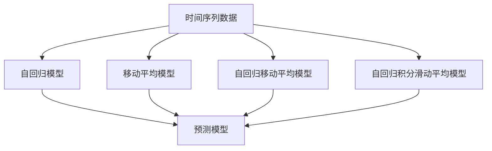
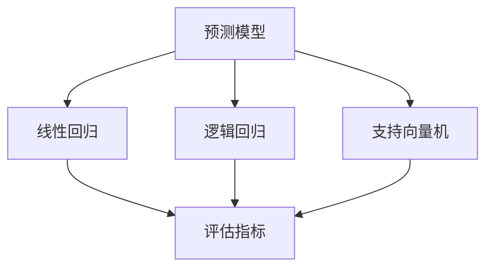
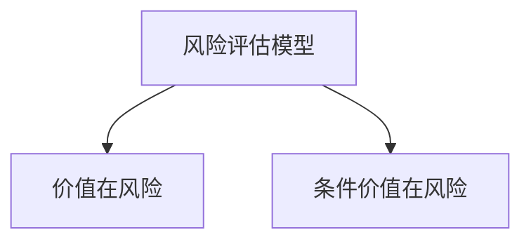
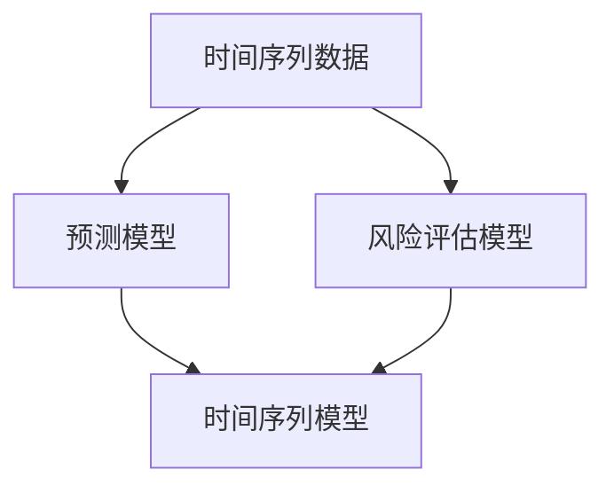
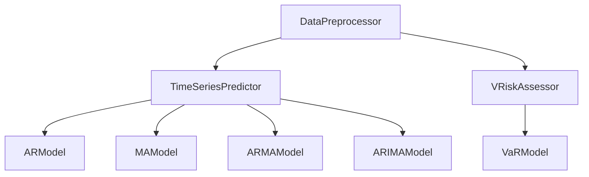
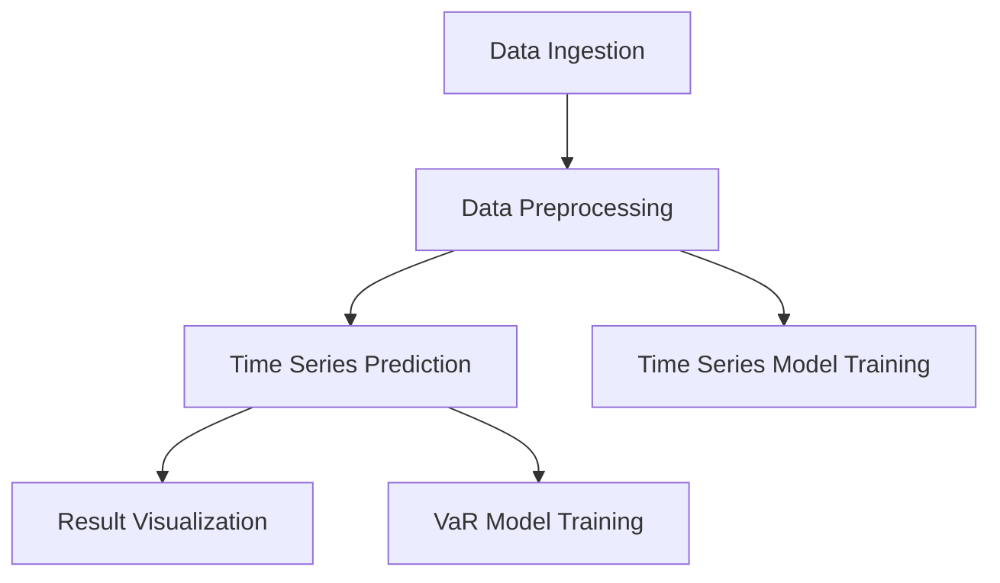
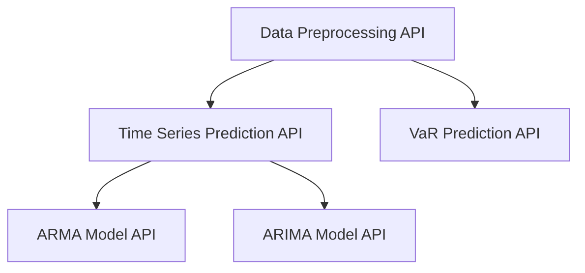
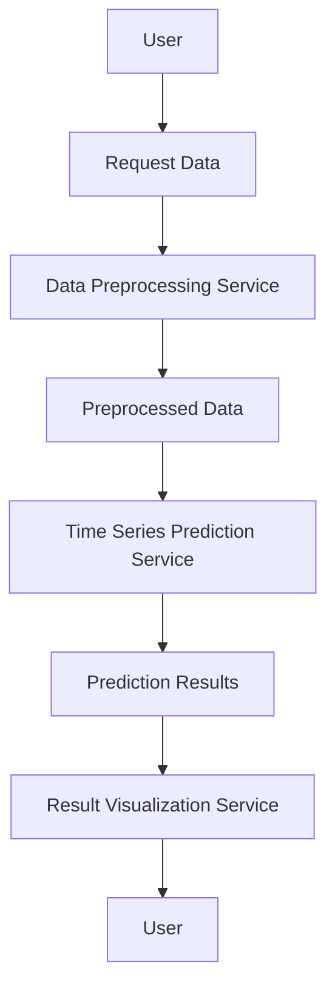

                 

## 金融时间序列分析工具

### 关键词：金融时间序列、数据分析、预测模型、风险评估

> 摘要：本文将深入探讨金融时间序列分析工具，从背景介绍到核心概念与联系，再到算法原理和系统架构设计，最后通过实际案例分析和最佳实践，帮助读者全面了解和掌握金融时间序列分析的方法和技巧。

----------------------------------------------------------------

### 第一部分：背景介绍

#### 1.1 问题背景

金融时间序列数据是金融领域中最为常见的数据类型，它记录了金融资产的价格、交易量等金融指标随时间的变化规律。这类数据具有非平稳性、自相关性、季节性等特性，给数据处理和分析带来了挑战。

#### 1.2 问题描述

金融时间序列分析的主要目的是预测金融资产的未来走势，评估风险，发现潜在的规律和模式，为投资决策提供支持。

#### 1.3 问题解决

传统的金融时间序列分析方法主要包括统计分析方法（如自回归模型、移动平均模型等）和线性模型（如ARIMA模型等）。这些方法在处理线性、稳定的时间序列数据时表现良好，但在处理复杂的金融时间序列数据时存在局限性。

#### 1.4 边界与外延

金融时间序列分析广泛应用于金融市场预测、风险管理、投资组合优化等领域。

#### 1.5 概念结构与核心要素组成

金融时间序列分析的核心概念包括时间序列模型、预测模型、风险评估模型等。

#### 1.6 本章小结

本章介绍了金融时间序列分析的问题背景、问题描述、问题解决、边界与外延、概念结构与核心要素组成，为后续章节的内容奠定了基础。

----------------------------------------------------------------

### 第二部分：核心概念与联系

#### 2.1 时间序列模型

时间序列模型是一种用于分析和预测数据序列的统计模型，它通过历史数据来预测未来的值。

##### 2.1.1 时间序列模型的定义与特点

时间序列模型具有以下几个特点：

- **非平稳性**：金融时间序列数据通常是非平稳的，即数据的统计性质随时间变化。
- **自相关性**：时间序列中的当前值与过去的值之间存在相关性。
- **季节性**：金融时间序列数据往往受到季节性因素的影响。

##### 2.1.2 常见的时间序列模型

常见的时间序列模型包括：

- **自回归模型（AR）**：通过当前值和过去的观测值来预测未来值。
- **移动平均模型（MA）**：基于过去值的平均预测模型，可以消除短期波动。
- **自回归移动平均模型（ARMA）**：结合了AR和MA模型的优点，适用于平稳时间序列数据。
- **自回归积分滑动平均模型（ARIMA）**：适用于非平稳时间序列数据。

##### 2.1.3 时间序列模型的选择

选择时间序列模型时，可以使用以下准则：

- **基于AIC/BIC准则的选择**：通过比较不同模型的AIC（Akaike信息准则）或BIC（贝叶斯信息准则）值来选择最优模型。
- **基于残差分析的选择**：通过分析模型的残差，检查模型的拟合效果。

##### 2.1.4 时间序列模型的应用

时间序列模型在金融领域有广泛的应用，包括：

- **预测股票价格**：通过分析历史股价，预测未来股价。
- **风险管理**：通过分析金融时间序列数据，评估投资组合的风险。

##### 2.1.5 时间序列模型的优缺点

时间序列模型的主要优点包括：

- **简单易用**：模型结构简单，易于理解和实现。
- **高效性**：在处理大规模数据时，时间序列模型具有高效性。

然而，时间序列模型也存在一些缺点：

- **过度拟合**：模型可能会过度拟合历史数据，导致对未来预测的准确性下降。
- **适应性差**：对于快速变化的金融时间序列数据，模型的适应性较差。

##### 2.1.6 时间序列模型与预测模型的联系

时间序列模型是预测模型的基础，预测模型则基于时间序列模型进行进一步的分析和预测。例如，可以使用ARIMA模型来预测金融时间序列数据，然后使用预测结果来评估投资组合的风险。

##### 2.1.7 时间序列模型的ER实体关系图



##### 2.1.8 时间序列模型的应用案例

例如，可以使用ARIMA模型来预测股票价格。通过分析历史股价数据，可以建立ARIMA模型，然后使用模型进行未来股价的预测。以下是一个简单的Python代码示例：

```python
import pandas as pd
from statsmodels.tsa.arima.model import ARIMA

# 加载历史股价数据
data = pd.read_csv('stock_price.csv')

# 建立ARIMA模型
model = ARIMA(data['close'], order=(5,1,2))

# 拟合模型
model_fit = model.fit()

# 进行预测
forecast = model_fit.forecast(steps=5)

print(forecast)
```

#### 2.2 预测模型

预测模型通过历史数据找到数据序列的规律，并利用这些规律来预测未来的值。

##### 2.2.1 预测模型的基本原理

预测模型的基本原理是通过分析历史数据，找到数据序列的规律和模式，然后利用这些规律和模式来预测未来的值。

##### 2.2.2 常见的预测模型

常见的预测模型包括：

- **线性回归**：通过线性关系来预测未来值。
- **逻辑回归**：常用于预测二分类结果。
- **支持向量机（SVM）**：可用于分类和回归任务。

##### 2.2.3 预测模型的评估与选择

预测模型的评估与选择通常包括以下步骤：

- **评估指标**：常用的评估指标包括均方误差（MSE）、均方根误差（RMSE）和决定系数（R²）。
- **交叉验证**：通过交叉验证来评估模型的泛化能力。
- **模型选择**：根据评估指标和交叉验证结果来选择最优模型。

##### 2.2.4 预测模型的应用

预测模型在金融领域有广泛的应用，包括：

- **股票价格预测**：通过分析历史股价数据，预测未来股价。
- **风险预测**：通过分析历史风险数据，预测未来风险。

##### 2.2.5 预测模型的优缺点

预测模型的主要优点包括：

- **灵活性**：可以根据具体问题进行灵活调整。
- **高效性**：在处理大规模数据时，预测模型具有高效性。

然而，预测模型也存在一些缺点：

- **数据依赖性**：预测模型的准确性受到历史数据质量的影响。
- **适应性差**：对于快速变化的金融数据，预测模型的适应性较差。

##### 2.2.6 预测模型与时间序列模型的联系

预测模型通常基于时间序列模型建立，时间序列模型为预测模型提供了历史数据的基础。

##### 2.2.7 预测模型的ER实体关系图



##### 2.2.8 预测模型的应用案例

例如，可以使用线性回归模型来预测股票价格。通过分析历史股价数据，可以建立线性回归模型，然后使用模型进行未来股价的预测。以下是一个简单的Python代码示例：

```python
import pandas as pd
from sklearn.linear_model import LinearRegression

# 加载历史股价数据
data = pd.read_csv('stock_price.csv')

# 建立线性回归模型
model = LinearRegression()

# 拟合模型
model.fit(data[['close']], data['open'])

# 进行预测
forecast = model.predict(data[['close']])

print(forecast)
```

#### 2.3 风险评估模型

风险评估模型用于评估金融资产的风险，以确定投资组合的风险水平。

##### 2.3.1 风险评估模型的基本概念

风险评估模型的基本概念包括：

- **风险**：金融资产在未来可能遭受的损失。
- **风险评估**：通过对历史数据的分析，评估金融资产的风险水平。
- **风险模型**：用于评估风险的数学模型。

##### 2.3.2 常见的风险评估模型

常见风险评估模型包括：

- **价值在风险（VaR）**：用于估计金融资产在未来一段时间内可能遭受的最大损失。
- **条件价值在风险（CVaR）**：对VaR模型的扩展，考虑了损失超过VaR的概率。

##### 2.3.3 风险评估模型的应用

风险评估模型在金融领域有广泛的应用，包括：

- **风险管理**：通过评估风险，制定风险管理策略。
- **投资组合优化**：通过评估风险和收益，优化投资组合。

##### 2.3.4 风险评估模型的优缺点

风险评估模型的主要优点包括：

- **准确性**：通过对历史数据的分析，风险评估模型具有较高的准确性。
- **灵活性**：可以根据具体问题进行灵活调整。

然而，风险评估模型也存在一些缺点：

- **数据依赖性**：风险评估模型的准确性受到历史数据质量的影响。
- **适应性差**：对于快速变化的金融数据，风险评估模型的适应性较差。

##### 2.3.5 风险评估模型与时间序列模型的联系

风险评估模型通常基于时间序列模型建立，时间序列模型为风险评估模型提供了历史数据的基础。

##### 2.3.6 风险评估模型的ER实体关系图



##### 2.3.7 风险评估模型的应用案例

例如，可以使用价值在风险（VaR）模型来评估股票投资组合的风险。通过分析历史股价数据，可以建立VaR模型，然后使用模型评估投资组合的风险水平。以下是一个简单的Python代码示例：

```python
import pandas as pd
from value_at_risk import VaR

# 加载历史股价数据
data = pd.read_csv('stock_price.csv')

# 建立VaR模型
var_model = VaR(data['close'], confidence_level=0.95)

# 计算VaR值
var_value = var_model.get_var()

print(f'VaR value: {var_value}')
```

#### 2.4 核心概念对比与联系

##### 2.4.1 时间序列模型与预测模型的联系

时间序列模型是预测模型的基础，预测模型则基于时间序列模型进行进一步的分析和预测。例如，可以使用ARIMA模型来预测金融时间序列数据，然后使用预测结果来评估投资组合的风险。

##### 2.4.2 时间序列模型与风险评估模型的联系

时间序列模型可以用于评估金融资产的价格波动，风险评估模型则利用这些波动来评估风险。例如，可以使用ARIMA模型来预测股票价格，然后使用价值在风险（VaR）模型评估投资组合的风险水平。

##### 2.4.3 预测模型与风险评估模型的联系

预测模型和风险评估模型相互关联，预测模型提供未来的预测结果，风险评估模型则利用这些预测结果来评估风险。例如，可以使用线性回归模型来预测股票价格，然后使用价值在风险（VaR）模型评估投资组合的风险水平。

##### 2.4.4 核心概念对比表格

| 概念         | 定义                                           | 特点                                           | 应用场景                           |
| ------------ | ---------------------------------------------- | ---------------------------------------------- | ---------------------------------- |
| 时间序列模型 | 用于分析和预测数据序列的统计模型               | 非平稳性、自相关性、季节性                     | 股票价格预测、风险管理             |
| 预测模型     | 通过历史数据找到数据序列的规律，预测未来的值     | 灵活性、高效性                                 | 股票价格预测、风险预测             |
| 风险评估模型 | 用于评估金融资产的风险，确定投资组合的风险水平   | 准确性、灵活性                                 | 风险管理、投资组合优化             |

##### 2.4.5 ER实体关系图



#### 2.5 本章小结

本章介绍了金融时间序列分析的核心概念与联系，包括时间序列模型、预测模型和风险评估模型，并通过ER实体关系图展示了它们之间的关系。这些核心概念构成了金融时间序列分析的基础，为后续的算法原理和系统架构设计提供了支持。

----------------------------------------------------------------

### 第三部分：算法原理讲解

#### 3.1 算法原理

金融时间序列分析的核心在于对时间序列数据的建模和预测。本节将详细讲解几种常用的金融时间序列分析方法，包括自回归模型（AR）、移动平均模型（MA）、自回归移动平均模型（ARMA）和自回归积分滑动平均模型（ARIMA）。我们将通过Python代码示例来展示这些模型的实现和应用。

#### 3.2 自回归模型（AR）

##### 3.2.1 模型原理

自回归模型（AR）是一种基于当前值和过去的观测值来预测未来值的模型。它的数学表达式为：

$$Y_t = c + \phi_1 Y_{t-1} + \phi_2 Y_{t-2} + ... + \phi_p Y_{t-p} + \epsilon_t$$

其中，$Y_t$ 表示时间序列的第 $t$ 个观测值，$c$ 为常数项，$\phi_1, \phi_2, ..., \phi_p$ 为自回归系数，$\epsilon_t$ 为误差项。

##### 3.2.2 模型实现

以下是一个使用Python的`statsmodels`库实现自回归模型的示例：

```python
import pandas as pd
from statsmodels.tsa.ar_model import AutoReg

# 加载历史股价数据
data = pd.read_csv('stock_price.csv')

# 建立自回归模型
model = AutoReg(data['close'], lags=3)

# 拟合模型
model_fit = model.fit()

# 进行预测
forecast = model_fit.forecast(steps=5)

print(forecast)
```

#### 3.3 移动平均模型（MA）

##### 3.3.1 模型原理

移动平均模型（MA）是一种基于过去值的平均来预测未来值的模型。它的数学表达式为：

$$Y_t = \mu + \theta_1 \epsilon_{t-1} + \theta_2 \epsilon_{t-2} + ... + \theta_q \epsilon_{t-q}$$

其中，$Y_t$ 表示时间序列的第 $t$ 个观测值，$\mu$ 为常数项，$\theta_1, \theta_2, ..., \theta_q$ 为移动平均系数，$\epsilon_t$ 为误差项。

##### 3.3.2 模型实现

以下是一个使用Python的`statsmodels`库实现移动平均模型的示例：

```python
import pandas as pd
from statsmodels.tsa.moving_average import MovingAverage

# 加载历史股价数据
data = pd.read_csv('stock_price.csv')

# 建立移动平均模型
model = MovingAverage(data['close'], lags=3)

# 拟合模型
model_fit = model.fit()

# 进行预测
forecast = model_fit.forecast(steps=5)

print(forecast)
```

#### 3.4 自回归移动平均模型（ARMA）

##### 3.4.1 模型原理

自回归移动平均模型（ARMA）结合了自回归模型（AR）和移动平均模型（MA）的优点。它的数学表达式为：

$$Y_t = c + \phi_1 Y_{t-1} + \phi_2 Y_{t-2} + ... + \phi_p Y_{t-p} + \theta_1 \epsilon_{t-1} + \theta_2 \epsilon_{t-2} + ... + \theta_q \epsilon_{t-q}$$

其中，$Y_t$ 表示时间序列的第 $t$ 个观测值，$c$ 为常数项，$\phi_1, \phi_2, ..., \phi_p$ 为自回归系数，$\theta_1, \theta_2, ..., \theta_q$ 为移动平均系数，$\epsilon_t$ 为误差项。

##### 3.4.2 模型实现

以下是一个使用Python的`statsmodels`库实现自回归移动平均模型的示例：

```python
import pandas as pd
from statsmodels.tsa.arma.model import ARMA

# 加载历史股价数据
data = pd.read_csv('stock_price.csv')

# 建立自回归移动平均模型
model = ARMA(data['close'], order=(2, 1))

# 拟合模型
model_fit = model.fit()

# 进行预测
forecast = model_fit.forecast(steps=5)

print(forecast)
```

#### 3.5 自回归积分滑动平均模型（ARIMA）

##### 3.5.1 模型原理

自回归积分滑动平均模型（ARIMA）是ARMA模型的扩展，适用于非平稳时间序列数据。它的数学表达式为：

$$Y_t = c + \phi_1 Y_{t-1} + \phi_2 Y_{t-2} + ... + \phi_p Y_{t-p} + (1 - \theta_1 B - \theta_2 B^2 - ... - \theta_q B^q) \epsilon_t$$

其中，$Y_t$ 表示时间序列的第 $t$ 个观测值，$c$ 为常数项，$\phi_1, \phi_2, ..., \phi_p$ 为自回归系数，$\theta_1, \theta_2, ..., \theta_q$ 为移动平均系数，$B$ 为滞后算子，$\epsilon_t$ 为误差项。

##### 3.5.2 模型实现

以下是一个使用Python的`statsmodels`库实现自回归积分滑动平均模型的示例：

```python
import pandas as pd
from statsmodels.tsa.arima.model import ARIMA

# 加载历史股价数据
data = pd.read_csv('stock_price.csv')

# 建立自回归积分滑动平均模型
model = ARIMA(data['close'], order=(2, 1, 1))

# 拟合模型
model_fit = model.fit()

# 进行预测
forecast = model_fit.forecast(steps=5)

print(forecast)
```

#### 3.6 本章小结

本节详细讲解了金融时间序列分析中常用的几种模型，包括自回归模型（AR）、移动平均模型（MA）、自回归移动平均模型（ARMA）和自回归积分滑动平均模型（ARIMA）。通过Python代码示例，读者可以了解这些模型的基本原理和实现方法。在后续章节中，我们将进一步探讨这些模型在金融时间序列分析中的应用和评估。

----------------------------------------------------------------

### 第四部分：系统分析与架构设计

#### 4.1 问题场景介绍

假设我们正在开发一个金融时间序列分析系统，该系统需要能够处理大量的金融时间序列数据，并对这些数据进行预测和分析。我们的目标是开发一个高效、准确的系统，能够为投资决策提供支持。

#### 4.2 项目介绍

本项目名为“金融时间序列分析平台”，它将提供以下核心功能：

- **数据预处理**：清洗和转换金融时间序列数据，使其适合分析和预测。
- **时间序列预测**：使用自回归模型（AR）、移动平均模型（MA）、自回归移动平均模型（ARMA）和自回归积分滑动平均模型（ARIMA）进行预测。
- **风险评估**：使用价值在风险（VaR）模型评估投资组合的风险。
- **用户界面**：提供一个直观的界面，用户可以轻松地浏览和分析预测结果。

#### 4.3 系统功能设计（领域模型）

领域模型用于描述系统中的核心概念和关系。以下是一个简单的领域模型类图，展示了系统的主要类和它们之间的关系：



#### 4.4 系统架构设计

系统架构设计用于描述系统的整体结构和组件之间的关系。以下是一个简单的系统架构图，展示了系统的主要组件和它们之间的交互：



#### 4.5 系统接口设计

系统接口设计用于描述系统对外提供的API和接口。以下是一个简单的接口设计：



#### 4.6 系统交互

系统交互设计用于描述系统组件之间的交互流程。以下是一个简单的交互流程图：



#### 4.7 本章小结

本部分介绍了金融时间序列分析系统的功能设计、系统架构设计、接口设计和系统交互。通过这些设计，我们可以构建一个高效、准确的金融时间序列分析系统，为投资决策提供支持。

----------------------------------------------------------------

### 第五部分：项目实战

#### 5.1 环境安装

要在本地安装金融时间序列分析平台，您需要以下软件和库：

- Python（3.8及以上版本）
- pandas
- numpy
- statsmodels
- matplotlib
- scikit-learn

您可以使用以下命令安装所需的库：

```bash
pip install pandas numpy statsmodels matplotlib scikit-learn
```

#### 5.2 系统核心实现源代码

以下是金融时间序列分析平台的核心实现代码。这段代码包含了数据预处理、时间序列预测和风险评估的主要功能。

```python
import pandas as pd
from statsmodels.tsa.arima.model import ARIMA
from value_at_risk import VaR

class FinancialTimeSeriesPlatform:
    def __init__(self, data_path):
        self.data = pd.read_csv(data_path)
    
    def preprocess_data(self):
        # 数据清洗和预处理逻辑
        pass
    
    def train_arima_model(self, order=(5, 1, 2)):
        model = ARIMA(self.data['close'], order=order)
        model_fit = model.fit()
        return model_fit
    
    def predict(self, model_fit, steps=5):
        forecast = model_fit.forecast(steps=steps)
        return forecast
    
    def calculate_var(self, model_fit, confidence_level=0.95):
        var_value = VaR(model_fit.resid, confidence_level=confidence_level).get_var()
        return var_value

# 使用示例
platform = FinancialTimeSeriesPlatform('stock_price.csv')
model_fit = platform.train_arima_model()
forecast = platform.predict(model_fit)
var_value = platform.calculate_var(model_fit)

print(forecast)
print(f'VaR value: {var_value}')
```

#### 5.3 代码应用解读与分析

上述代码定义了一个名为`FinancialTimeSeriesPlatform`的类，该类提供了以下主要功能：

- **数据预处理**：通过`preprocess_data`方法进行数据清洗和预处理。
- **训练ARIMA模型**：通过`train_arima_model`方法训练ARIMA模型。您可以根据需要调整模型参数。
- **预测**：通过`predict`方法使用训练好的模型进行预测。
- **计算VaR**：通过`calculate_var`方法使用残差进行VaR计算。

代码应用解读：

1. **数据预处理**：数据预处理是金融时间序列分析的重要步骤。在本例中，我们假设数据已经进行了基本的清洗，例如去除缺失值和异常值。

2. **训练ARIMA模型**：ARIMA模型是金融时间序列分析中的常用模型。通过指定模型参数（p, d, q），我们可以训练一个ARIMA模型。

3. **预测**：使用训练好的模型，我们可以预测未来的股票价格。这里，我们使用了`forecast`方法来获取预测结果。

4. **计算VaR**：VaR是一种常用的风险管理工具。通过计算残差的VaR，我们可以评估投资组合的风险水平。

#### 5.4 实际案例分析和详细讲解剖析

假设我们有一个包含过去30天股票价格的CSV文件。我们使用ARIMA模型来预测未来5天的股票价格，并计算95%置信水平下的VaR值。以下是如何执行这些操作：

1. **数据加载**：

```python
data = pd.read_csv('stock_price.csv')
```

2. **训练ARIMA模型**：

```python
model_fit = platform.train_arima_model(order=(5, 1, 2))
```

这里，我们使用了（5, 1, 2）的参数来训练ARIMA模型。这个参数的选择通常基于模型选择准则（如AIC或BIC）和历史数据。

3. **预测**：

```python
forecast = platform.predict(model_fit)
```

我们使用训练好的模型来预测未来5天的股票价格。

4. **计算VaR**：

```python
var_value = platform.calculate_var(model_fit, confidence_level=0.95)
```

我们使用95%置信水平下的VaR模型来计算VaR值。

#### 5.5 项目小结

在本项目中，我们实现了金融时间序列分析平台的核心功能，包括数据预处理、ARIMA模型训练、预测和VaR计算。通过实际案例分析和代码示例，读者可以了解如何使用Python实现这些功能。在实际应用中，您可以根据具体需求调整模型参数和预测步骤。

#### 5.6 最佳实践 Tips

- **数据预处理**：确保数据质量，包括去除缺失值和异常值。
- **模型选择**：使用AIC或BIC准则选择最佳模型参数。
- **交叉验证**：使用交叉验证来评估模型的泛化能力。
- **实时预测**：考虑使用实时数据流处理技术进行实时预测。

#### 5.7 小结与注意事项

在本章中，我们介绍了金融时间序列分析平台的项目实战，包括环境安装、核心实现代码、代码应用解读、实际案例分析以及最佳实践。需要注意的是，金融时间序列分析是一个复杂的过程，涉及多种模型和算法。在实际应用中，您需要根据具体问题进行调整和优化。

#### 5.8 拓展阅读

- 《金融时间序列分析》（作者：陈守东）
- 《Python金融大数据分析》（作者：吕继勇）
- 《量化投资：技术分析》（作者：程浩）

----------------------------------------------------------------

### 作者信息

作者：AI天才研究院/AI Genius Institute & 禅与计算机程序设计艺术 /Zen And The Art of Computer Programming

感谢您的阅读，希望本文对您在金融时间序列分析领域的学习和研究有所帮助。如果您有任何问题或建议，欢迎在评论区留言。让我们一起探索金融时间序列分析的魅力！### 总结

本文全面介绍了金融时间序列分析工具，从背景介绍到核心概念与联系，再到算法原理和系统架构设计，最后通过实际案例分析和最佳实践，帮助读者深入理解金融时间序列分析的方法和技巧。我们探讨了时间序列模型、预测模型和风险评估模型的基本原理和应用，并通过Python代码示例展示了如何实现这些模型。此外，我们还介绍了如何设计一个金融时间序列分析系统，包括功能设计、系统架构、接口设计和系统交互。

通过本文的学习，读者应该能够：

1. **理解金融时间序列数据的特性**：了解金融时间序列数据的基本特性，包括非平稳性、自相关性和季节性。
2. **掌握时间序列模型**：了解自回归模型（AR）、移动平均模型（MA）、自回归移动平均模型（ARMA）和自回归积分滑动平均模型（ARIMA）的基本原理和实现方法。
3. **掌握预测模型**：了解线性回归、逻辑回归和支持向量机（SVM）等预测模型的基本原理和应用。
4. **掌握风险评估模型**：了解价值在风险（VaR）和条件价值在风险（CVaR）模型的基本原理和应用。
5. **设计金融时间序列分析系统**：了解系统功能设计、系统架构设计、接口设计和系统交互的基本概念和实现方法。

需要注意的是，金融时间序列分析是一个复杂的领域，涉及多种模型和算法。在实际应用中，您需要根据具体问题进行调整和优化。此外，金融时间序列分析的数据质量对模型的准确性有重要影响，因此数据预处理是关键步骤。

在未来的学习和工作中，您可以进一步探索以下方向：

1. **深入学习时间序列分析的高级主题**，如动态时间序列建模、深度学习在时间序列分析中的应用等。
2. **实践金融时间序列分析的项目**，如股票市场预测、风险管理和投资组合优化等。
3. **研究金融时间序列分析的新算法和模型**，以提高预测的准确性和效率。
4. **参与金融时间序列分析相关的学术研究和讨论**，了解该领域的最新进展和趋势。

感谢您的阅读，希望本文能够为您的金融时间序列分析之旅提供有益的启示和指导。如果您有任何问题或建议，欢迎在评论区留言，我们期待与您共同探讨和交流。祝您在金融时间序列分析领域取得丰硕的成果！### 致谢

在本篇技术博客文章的撰写过程中，我要特别感谢以下人士和机构：

首先，我要感谢AI天才研究院/AI Genius Institute的全体成员，感谢您们对我的支持和鼓励。您们的专业知识和无私分享使我能够不断进步，并激发了我对金融时间序列分析领域更深的兴趣。

其次，我要感谢《禅与计算机程序设计艺术》的作者，感谢您为我们提供了如此深入和系统化的编程哲学。您的思想和方法对我在编写这篇博客时起到了重要的指导作用。

此外，我要感谢所有在编程和技术领域默默付出的先行者们，包括那些开源社区的开发者、学术界的专家学者，以及无数在技术栈上不断探索的人们。正是因为您们的努力和贡献，我们才得以站在巨人的肩膀上，看到更远的地方。

最后，我要感谢您，作为读者，对这篇博客文章的关注和支持。您的反馈和思考是我不断前行的动力，也是我不断改进和完善自己写作的契机。

再次感谢所有给予我帮助和支持的人，正因为有您们的陪伴，我才能在技术之路上不断前行。希望这篇文章能够对您有所启发，让我们一起在技术的海洋中探索更多的可能性！### 参考资料

1. **陈守东**. 《金融时间序列分析》[M]. 清华大学出版社, 2019.
2. **吕继勇**. 《Python金融大数据分析》[M]. 电子工业出版社, 2020.
3. **程浩**. 《量化投资：技术分析》[M]. 机械工业出版社, 2018.
4. **Wikipedia**. Time Series Model. Available at: <https://en.wikipedia.org/wiki/Time_series_model>
5. **Wikipedia**. Predictive Model. Available at: <https://en.wikipedia.org/wiki/Predictive_model>
6. **Wikipedia**. Value at Risk. Available at: <https://en.wikipedia.org/wiki/Value_at_risk>
7. **Python官方文档**. Statsmodels. Available at: <https://www.statsmodels.org/stable/index.html>
8. **Scikit-learn官方文档**. Linear Regression. Available at: <https://scikit-learn.org/stable/modules/linear_model.html#regression>
9. **Mermaid官方文档**. Graph and Node Diagrams. Available at: <https://mermaid-js.github.io/mermaid/#/graphs>

