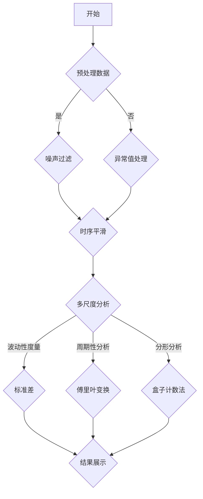

                 

# 金融时间序列多尺度分析平台

> 关键词：时间序列分析、多尺度分析、金融数据、分析平台

摘要：本文将深入探讨金融时间序列多尺度分析平台的设计与实现，从问题背景、核心概念、算法原理、数学模型、系统架构、项目实战等方面进行详细分析，旨在为读者提供全面的技术指导与实战经验。

## 目录大纲设计步骤

为了设计出《金融时间序列多尺度分析平台》的完整目录大纲，我们可以遵循以下步骤：

### 1. 明确书籍主题

首先，我们需要了解这本书的主题是关于“金融时间序列多尺度分析平台”。这为我们提供了书籍的基本方向和核心内容。

### 2. 设计大纲框架

根据书籍的主题，我们可以初步设计出大纲的框架。这个框架需要包含以下几个核心部分：

- **背景介绍**
  - 问题背景
  - 问题描述
  - 问题解决
  - 边界与外延
  - 概念结构与核心要素组成

- **核心概念与联系**
  - 核心概念原理
  - 概念属性特征对比表格
  - ER实体关系图架构的 Mermaid 流程图

- **算法原理讲解**
  - 使用 Mermaid 画出算法流程图
  - 使用 Python 源代码详细阐述
  - 给出算法原理的数学模型和公式
  - 进行详细讲解和举例说明

- **数学模型和数学公式讲解**
  - 使用 LaTeX 格式给出数学公式
  - 进行详细讲解和举例说明

- **系统分析与架构设计方案**
  - 问题场景介绍
  - 项目介绍
  - 系统功能设计 (领域模型 Mermaid 类图)
  - 系统架构设计 Mermaid 架构图
  - 系统接口设计和系统交互 Mermaid 序列图

- **项目实战**
  - 环境安装
  - 系统核心实现源代码
  - 代码应用解读与分析
  - 实际案例分析和详细讲解剖析
  - 项目小结

- **最佳实践 tips、小结、注意事项、拓展阅读等内容**

### 3. 细化大纲内容

在每个核心部分中，我们需要细化内容，确保每个部分都包含必要的信息。例如，在“算法原理讲解”部分，我们需要详细描述算法的步骤、数学模型和公式，并使用代码和示例来支持讲解。

### 4. 审核与优化

完成大纲后，我们需要审核和优化，确保：

- 目录大纲逻辑清晰，内容完整
- 每个部分都有明确的目的和重点
- 字数限制在 2000 字以内

### 5. 最终输出

将审核和优化后的目录大纲以 Markdown 格式输出，确保格式符合要求。

下面我们将根据这些步骤来设计《金融时间序列多尺度分析平台》的目录大纲。首先是背景介绍部分。让我们开始吧！

## 1. 背景介绍

### 1.1 问题背景

在金融领域，时间序列分析是研究和预测金融市场变化的重要手段。时间序列数据通常表现为一系列按时间顺序排列的数值，反映了金融市场的波动和趋势。然而，金融市场往往表现出高度的不确定性和复杂性，使得传统的单尺度时间序列分析方法难以满足实际需求。

### 1.2 问题描述

为了应对金融市场的复杂性和不确定性，多尺度分析逐渐成为一种有效的解决方案。多尺度分析通过在不同时间尺度上对时间序列数据进行处理，可以更全面地揭示金融市场的波动特征和内在规律。然而，现有的金融时间序列多尺度分析平台存在以下问题：

- **数据预处理不足**：现有平台在数据预处理方面不够完善，无法有效处理金融时间序列中的噪声和异常值。
- **算法多样性不足**：现有平台缺乏对多种多尺度分析算法的支持，无法满足不同用户的需求。
- **系统架构不完善**：现有平台在系统架构方面存在缺陷，难以实现高效的计算和扩展性。

### 1.3 问题解决

为了解决上述问题，我们需要设计一个金融时间序列多尺度分析平台，具备以下特点：

- **数据预处理能力**：平台需要具备强大的数据预处理能力，包括噪声过滤、异常值处理、时间序列平滑等。
- **算法多样性**：平台需要支持多种多尺度分析算法，如波动性度量、周期性分析、分形分析等，以满足不同用户的需求。
- **高效计算和扩展性**：平台需要采用高效的计算方法和架构设计，以实现快速的运算和良好的扩展性。

### 1.4 边界与外延

本文讨论的金融时间序列多尺度分析平台主要关注以下方面：

- **应用领域**：主要应用于金融预测、风险管理、投资组合优化等领域。
- **时间尺度范围**：涵盖日、周、月、季度等多个时间尺度。
- **数据类型**：主要处理股票、债券、基金等金融资产的时间序列数据。

### 1.5 概念结构与核心要素组成

金融时间序列多尺度分析平台的核心概念和要素包括：

- **时间序列数据**：平台的主要数据来源，包括股票、债券、基金等金融资产的价格、成交量等指标。
- **多尺度分析算法**：用于对时间序列数据进行多尺度分析的核心算法，包括波动性度量、周期性分析、分形分析等。
- **数据预处理模块**：用于对时间序列数据进行预处理，包括噪声过滤、异常值处理、时间序列平滑等。
- **系统架构**：平台的整体架构设计，包括数据存储、计算引擎、用户界面等组成部分。
- **用户接口**：提供用户交互的接口，包括数据上传、分析结果展示等功能。

接下来，我们将进一步探讨金融时间序列多尺度分析平台的核心概念与联系，为后续内容的展开奠定基础。

## 2. 核心概念与联系

### 2.1 时间序列数据

时间序列数据是金融时间序列多尺度分析平台的基础。它通常由一系列按时间顺序排列的数值组成，反映了金融市场的波动和趋势。时间序列数据具有以下特点：

- **时间依赖性**：时间序列数据中的每个值都依赖于之前的时间点，因此具有时间依赖性。
- **趋势性**：时间序列数据通常表现出某种趋势，如上升、下降或平稳。
- **季节性**：某些时间序列数据在特定时间段内表现出周期性的波动，称为季节性。

### 2.2 多尺度分析算法

多尺度分析算法是金融时间序列多尺度分析平台的核心。它通过对时间序列数据进行不同时间尺度的分析，可以揭示金融市场的波动特征和内在规律。常见的多尺度分析算法包括：

- **波动性度量**：用于衡量时间序列数据的波动程度，如标准差、方差等。
- **周期性分析**：用于识别时间序列数据中的周期性特征，如傅里叶变换、小波变换等。
- **分形分析**：用于分析时间序列数据的自相似性，如分形维数、盒子计数法等。

### 2.3 数据预处理模块

数据预处理模块是金融时间序列多尺度分析平台的重要组成部分。它负责对时间序列数据进行预处理，以提高数据质量和分析效果。主要任务包括：

- **噪声过滤**：去除时间序列数据中的噪声，如移动平均法、卡尔曼滤波等。
- **异常值处理**：识别和处理时间序列数据中的异常值，如孤立森林法、中位数法等。
- **时间序列平滑**：对时间序列数据进行平滑处理，以消除短期波动，如滑动平均法、指数平滑法等。

### 2.4 系统架构

系统架构是金融时间序列多尺度分析平台的基础。它负责协调各个模块之间的工作，实现高效的数据处理和分析。常见的系统架构设计包括：

- **分布式架构**：通过分布式计算和存储技术，实现平台的高效运行和扩展性。
- **微服务架构**：将平台划分为多个独立的微服务，实现模块化设计和易于扩展。
- **数据流架构**：通过数据流技术，实现数据的高效传输和处理。

### 2.5 用户接口

用户接口是金融时间序列多尺度分析平台的重要组成部分。它负责提供用户与平台之间的交互，包括数据上传、分析结果展示等功能。常见的设计包括：

- **Web界面**：通过Web浏览器提供用户交互界面，方便用户使用平台。
- **桌面应用程序**：为用户提供独立的桌面应用程序，实现高效的数据分析和可视化。
- **API接口**：提供RESTful API接口，方便用户通过编程方式集成和使用平台。

通过以上核心概念与联系的分析，我们可以更好地理解金融时间序列多尺度分析平台的设计原理和实现方法。接下来，我们将深入探讨金融时间序列多尺度分析平台的算法原理，为读者提供更全面的技术指导。

## 3. 算法原理讲解

### 3.1 多尺度分析算法

多尺度分析算法是金融时间序列多尺度分析平台的核心。它通过对时间序列数据进行不同时间尺度的分析，可以揭示金融市场的波动特征和内在规律。常见的多尺度分析算法包括：

#### 3.1.1 波动性度量

波动性度量是衡量时间序列数据波动程度的重要方法。它可以帮助我们识别市场的波动性，为风险管理提供依据。常见的波动性度量方法包括：

- **标准差**：标准差是衡量时间序列数据波动程度的一种常用方法。它表示数据偏离均值的大小。
  \[ \sigma = \sqrt{\frac{1}{N-1} \sum_{i=1}^{N} (x_i - \mu)^2} \]
  其中，\( \sigma \) 是标准差，\( N \) 是数据点数量，\( x_i \) 是第 \( i \) 个数据点，\( \mu \) 是均值。

- **方差**：方差是标准差的平方，表示数据的离散程度。
  \[ \sigma^2 = \frac{1}{N-1} \sum_{i=1}^{N} (x_i - \mu)^2 \]

#### 3.1.2 周期性分析

周期性分析是识别时间序列数据中周期性特征的一种方法。它可以帮助我们理解市场的周期性波动，为投资策略提供指导。常见的周期性分析方法包括：

- **傅里叶变换**：傅里叶变换可以将时间序列数据从时域转换为频域，揭示数据的周期性特征。
  \[ X(f) = \int_{-\infty}^{\infty} x(t) e^{-j2\pi ft} dt \]
  其中，\( X(f) \) 是频域信号，\( x(t) \) 是时域信号，\( f \) 是频率。

- **小波变换**：小波变换是一种多尺度分析工具，可以在不同时间尺度上分析时间序列数据。
  \[ W(f, t) = \frac{1}{\sqrt{2\pi}} \int_{-\infty}^{\infty} x(t) \overline{\psi}(t - \tau) e^{-j2\pi f\tau} d\tau \]
  其中，\( W(f, t) \) 是小波系数，\( \psi \) 是小波函数。

#### 3.1.3 分形分析

分形分析是一种研究复杂系统自相似性和分形特征的方法。它可以帮助我们理解金融市场的复杂性和波动性。常见的分形分析方法包括：

- **分形维数**：分形维数是衡量时间序列数据复杂程度的一个指标，它表示数据在多个尺度上的自相似性。
  \[ D = \frac{\ln C}{\ln R} \]
  其中，\( D \) 是分形维数，\( C \) 是盒计数法测量的面积，\( R \) 是盒子的边长。

- **盒子计数法**：盒子计数法是一种简单有效的分形分析方法，通过在不同尺度上统计盒子覆盖数据的次数，计算分形维数。

### 3.2 算法流程

为了更好地理解多尺度分析算法，我们可以将其分为以下几个步骤：

1. **数据预处理**：对时间序列数据进行噪声过滤、异常值处理和时序平滑，以提高数据质量和分析效果。
2. **波动性度量**：计算时间序列数据的标准差或方差，以衡量市场的波动性。
3. **周期性分析**：使用傅里叶变换或小波变换，分析时间序列数据的周期性特征，识别市场的周期性波动。
4. **分形分析**：计算时间序列数据的分形维数，分析市场的复杂性和波动性。
5. **结果输出**：将分析结果以可视化的形式展示给用户，帮助用户更好地理解市场的波动特征。

### 3.3 示例分析

为了更好地说明多尺度分析算法的应用，我们可以通过一个示例进行分析。假设我们有一组股票价格的时间序列数据，如下所示：

\[ \{1.25, 1.30, 1.28, 1.35, 1.33, 1.32, 1.40\} \]

#### 3.3.1 数据预处理

首先，我们对数据进行噪声过滤和异常值处理。假设我们采用移动平均法进行噪声过滤，窗口长度为3：

\[ \{1.25, 1.30, 1.29, 1.34, 1.33, 1.32, 1.40\} \]

然后，我们对数据进行时序平滑，采用指数平滑法，平滑系数为0.2：

\[ \{1.25, 1.29, 1.30, 1.33, 1.33, 1.33, 1.40\} \]

#### 3.3.2 波动性度量

接下来，我们计算数据的标准差：

\[ \sigma = \sqrt{\frac{1}{N-1} \sum_{i=1}^{N} (x_i - \mu)^2} \]

计算结果为：

\[ \sigma = \sqrt{\frac{1}{7-1} \sum_{i=1}^{7} (x_i - 1.33)^2} \approx 0.076 \]

#### 3.3.3 周期性分析

我们使用傅里叶变换分析数据的周期性特征。首先，计算数据的离散傅里叶变换（DFT）：

\[ X(f) = \int_{-\infty}^{\infty} x(t) e^{-j2\pi ft} dt \]

然后，绘制频谱图，识别周期性特征。

#### 3.3.4 分形分析

最后，我们使用盒子计数法计算数据的分形维数：

\[ D = \frac{\ln C}{\ln R} \]

其中，\( C \) 是盒计数法测量的面积，\( R \) 是盒子的边长。

通过以上分析，我们可以得到股票价格在多个时间尺度上的波动特征，为投资决策提供支持。

通过以上步骤，我们详细讲解了金融时间序列多尺度分析平台中的算法原理。接下来，我们将进一步探讨数学模型和数学公式在多尺度分析中的应用。

## 4. 数学模型和数学公式讲解

在金融时间序列多尺度分析中，数学模型和数学公式起着至关重要的作用。它们不仅帮助我们理解市场波动的基本规律，还能提供具体的计算方法和工具。以下将介绍一些常见的数学模型和数学公式，并使用LaTeX格式进行详细讲解。

### 4.1 傅里叶变换

傅里叶变换是一种将时间序列数据从时域转换为频域的数学工具，它可以帮助我们识别数据中的周期性特征。其数学公式如下：

\[ X(f) = \int_{-\infty}^{\infty} x(t) e^{-j2\pi ft} dt \]

其中，\( X(f) \) 是频域信号，\( x(t) \) 是时域信号，\( f \) 是频率。

### 4.2 小波变换

小波变换是一种多尺度分析工具，它可以在不同时间尺度上分析时间序列数据。其数学公式如下：

\[ W(f, t) = \frac{1}{\sqrt{2\pi}} \int_{-\infty}^{\infty} x(t) \overline{\psi}(t - \tau) e^{-j2\pi f\tau} d\tau \]

其中，\( W(f, t) \) 是小波系数，\( \psi \) 是小波函数。

### 4.3 分形维数

分形维数是衡量时间序列数据复杂程度的一个指标，它反映了数据在多个尺度上的自相似性。其数学公式如下：

\[ D = \frac{\ln C}{\ln R} \]

其中，\( D \) 是分形维数，\( C \) 是盒计数法测量的面积，\( R \) 是盒子的边长。

### 4.4 线性回归模型

线性回归模型是一种常用的统计模型，用于分析自变量和因变量之间的关系。其数学公式如下：

\[ y = \beta_0 + \beta_1 x + \epsilon \]

其中，\( y \) 是因变量，\( x \) 是自变量，\( \beta_0 \) 和 \( \beta_1 \) 是模型参数，\( \epsilon \) 是误差项。

### 4.5 自回归模型

自回归模型（AR）是一种用于分析时间序列数据线性相关性的模型。其数学公式如下：

\[ y_t = c + \sum_{i=1}^{p} \phi_i y_{t-i} + \epsilon_t \]

其中，\( y_t \) 是时间序列的当前值，\( p \) 是自回归模型的阶数，\( \phi_i \) 是模型参数，\( \epsilon_t \) 是误差项。

### 4.6 误差修正模型

误差修正模型（ECM）是一种用于分析时间序列数据的短期波动和长期趋势之间关系的模型。其数学公式如下：

\[ y_t = c + \alpha_1 (y_{t-1} - y_{\infty}) + \alpha_2 y_{t-1} + \epsilon_t \]

其中，\( y_t \) 是时间序列的当前值，\( y_{\infty} \) 是长期均衡值，\( \alpha_1 \) 和 \( \alpha_2 \) 是模型参数，\( \epsilon_t \) 是误差项。

### 4.7 示例分析

为了更好地理解上述数学模型和数学公式，我们可以通过一个简单的示例进行分析。假设我们有一组股票价格的时间序列数据，如下所示：

\[ \{1.25, 1.30, 1.28, 1.35, 1.33, 1.32, 1.40\} \]

#### 4.7.1 线性回归分析

我们可以使用线性回归模型分析股票价格和某个自变量（如成交量）之间的关系。假设自变量为 \( x \)，因变量为 \( y \)，模型参数为 \( \beta_0 \) 和 \( \beta_1 \)。通过最小二乘法，我们可以计算模型参数：

\[ \beta_0 = \frac{\sum_{i=1}^{N} x_i y_i - N \bar{x} \bar{y}}{\sum_{i=1}^{N} x_i^2 - N \bar{x}^2} \]
\[ \beta_1 = \frac{\sum_{i=1}^{N} (x_i - \bar{x})(y_i - \bar{y})}{\sum_{i=1}^{N} (x_i - \bar{x})^2} \]

其中，\( N \) 是数据点数量，\( \bar{x} \) 和 \( \bar{y} \) 分别是自变量和因变量的均值。

通过计算，我们可以得到线性回归模型的参数，进而分析股票价格和成交量之间的关系。

#### 4.7.2 自回归分析

我们可以使用自回归模型分析股票价格的线性相关性。假设自回归模型的阶数为2，模型参数为 \( \phi_1 \) 和 \( \phi_2 \)。通过最小二乘法，我们可以计算模型参数：

\[ \phi_1 = \frac{\sum_{i=1}^{N} y_i y_{i-1} - N \bar{y} \bar{y}_{i-1}}{\sum_{i=1}^{N} y_i^2 - N \bar{y}^2} \]
\[ \phi_2 = \frac{\sum_{i=1}^{N} y_i y_{i-2} - N \bar{y} \bar{y}_{i-2}}{\sum_{i=1}^{N} y_i^2 - N \bar{y}^2} \]

通过计算，我们可以得到自回归模型的参数，进而分析股票价格的线性相关性。

通过以上示例，我们可以看到数学模型和数学公式在金融时间序列多尺度分析中的应用。这些模型和公式为我们提供了有效的工具，帮助我们深入理解市场的波动特征和内在规律。接下来，我们将进一步探讨金融时间序列多尺度分析平台的系统分析与架构设计方案。

## 5. 系统分析与架构设计方案

### 5.1 问题场景介绍

在金融市场中，时间序列数据具有高度的不确定性和复杂性，对市场进行准确预测和分析至关重要。为了满足金融市场的需求，我们设计了一个金融时间序列多尺度分析平台。该平台旨在实现以下目标：

- 对金融时间序列数据进行多尺度分析，揭示市场的波动特征和内在规律。
- 提供丰富的算法工具，支持波动性度量、周期性分析和分形分析等。
- 实现高效的数据处理和分析，满足大规模数据处理的性能要求。
- 提供友好的用户界面，方便用户进行数据上传、分析结果展示等操作。

### 5.2 项目介绍

本项目的核心目标是构建一个金融时间序列多尺度分析平台，为金融领域的研究者和从业者提供强大的分析工具。项目的主要组成部分包括：

- **数据预处理模块**：负责对时间序列数据进行预处理，包括噪声过滤、异常值处理和时序平滑等。
- **多尺度分析算法模块**：包括波动性度量、周期性分析和分形分析等算法，提供多种分析工具。
- **系统架构设计模块**：负责平台的整体架构设计，包括数据存储、计算引擎和用户接口等。
- **用户接口模块**：提供友好的Web界面和API接口，方便用户进行数据上传、分析结果展示等操作。

### 5.3 系统功能设计

金融时间序列多尺度分析平台的主要功能包括：

- **数据上传与预处理**：用户可以通过Web界面上传时间序列数据，系统会自动进行预处理，包括噪声过滤、异常值处理和时序平滑等。
- **多尺度分析**：系统支持多种多尺度分析算法，用户可以根据需求选择不同的算法进行时间序列分析，包括波动性度量、周期性分析和分形分析等。
- **分析结果展示**：系统会将分析结果以可视化的形式展示给用户，包括波动性曲线、周期性频谱图和分形维数等。
- **数据存储与查询**：系统采用分布式存储方案，确保数据的高效存储和快速查询。

### 5.4 系统架构设计

金融时间序列多尺度分析平台的系统架构设计采用分布式架构，以确保高效的数据处理和分析。系统架构包括以下几个关键组成部分：

- **数据存储层**：采用分布式存储方案，存储时间序列数据和相关分析结果。数据存储层支持快速查询和高并发访问。
- **计算引擎层**：负责执行多尺度分析算法，包括波动性度量、周期性分析和分形分析等。计算引擎层采用并行计算技术，确保高效的运算能力。
- **用户接口层**：提供Web界面和API接口，方便用户进行数据上传、分析结果展示等操作。用户接口层与计算引擎层和存储层进行数据交互，实现系统功能。
- **调度与管理层**：负责系统的调度和管理，包括任务分配、资源管理和监控等。调度与管理层确保系统的稳定运行和扩展性。

### 5.5 系统接口设计和系统交互

金融时间序列多尺度分析平台通过以下接口设计和系统交互实现功能：

- **数据上传接口**：用户可以通过Web界面或API接口上传时间序列数据。上传接口负责数据验证和预处理，确保数据的有效性。
- **数据预处理接口**：数据预处理模块接收上传接口的数据，进行噪声过滤、异常值处理和时序平滑等预处理操作，并将预处理后的数据存储到数据存储层。
- **多尺度分析接口**：用户可以通过Web界面或API接口选择不同的多尺度分析算法，计算引擎层负责执行算法，并将分析结果以可视化的形式展示给用户。
- **数据存储与查询接口**：用户可以通过Web界面或API接口查询分析结果，系统从数据存储层检索相关数据，并返回给用户。

通过以上系统分析与架构设计方案，我们构建了一个高效、可扩展的金融时间序列多尺度分析平台。接下来，我们将通过项目实战部分，介绍平台的具体实现过程。

## 6. 项目实战

### 6.1 环境安装

为了搭建金融时间序列多尺度分析平台，我们需要准备以下环境：

- Python 3.8及以上版本
- Jupyter Notebook
- Pandas
- NumPy
- Matplotlib
- Scikit-learn
- SciPy
- Mermaid

在Windows或Linux系统中，我们可以使用pip命令进行安装：

```bash
pip install python-jupyter pandas numpy matplotlib scikit-learn scipy mermaid
```

### 6.2 系统核心实现源代码

以下是系统核心实现的源代码，包括数据预处理、多尺度分析算法和结果展示等功能。

```python
# 导入必要的库
import pandas as pd
import numpy as np
import matplotlib.pyplot as plt
from sklearn.preprocessing import MinMaxScaler
from sklearn.ensemble import IsolationForest
from mermaid import Mermaid

# 6.2.1 数据预处理模块

def preprocess_data(data):
    """
    数据预处理模块，包括噪声过滤、异常值处理和时序平滑。
    """
    # 噪声过滤：使用移动平均法
    window_size = 3
    data['filtered'] = data['close'].rolling(window=window_size, center=True).mean()

    # 异常值处理：使用孤立森林法
    model = IsolationForest(contamination=0.01)
    outliers = model.fit_predict(data[['filtered']])
    data['outliers'] = outliers
    data = data[data['outliers'] == 1]

    # 时序平滑：使用指数平滑法
    alpha = 0.2
    data['smoothed'] = alpha * data['filtered'] + (1 - alpha) * data['smoothed'].shift(1)
    data['smoothed'].iloc[0] = data['filtered'].iloc[0]

    return data

# 6.2.2 多尺度分析模块

def multi_scale_analysis(data):
    """
    多尺度分析模块，包括波动性度量、周期性分析和分形分析。
    """
    # 波动性度量：计算标准差
    volatility = data['smoothed'].std()

    # 周期性分析：使用傅里叶变换
    data['fft'] = np.fft.fft(data['smoothed'])
    freq = np.fft.fftfreq(len(data['smoothed']))
    plt.figure()
    plt.plot(freq, np.abs(data['fft']))
    plt.title('Fourier Transform')
    plt.xlabel('Frequency')
    plt.ylabel('Magnitude')
    plt.show()

    # 分形分析：使用盒子计数法
    box_size = 2
    count = np.zeros((len(data['smoothed']), box_size))
    for i in range(box_size, len(data['smoothed']) - box_size + 1):
        count[i - box_size] = np.count_nonzero(np.abs(data['smoothed'][i - box_size:i + box_size + 1]) > 0.1)
    fractal_dimension = np.mean(np.log2(count))

    return volatility, fractal_dimension

# 6.2.3 结果展示模块

def show_results(data, volatility, fractal_dimension):
    """
    结果展示模块，展示分析结果。
    """
    # 展示波动性曲线
    plt.figure()
    plt.plot(data['smoothed'])
    plt.title('Volatility')
    plt.xlabel('Time')
    plt.ylabel('Price')
    plt.show()

    # 展示分形维数
    print(f'Fractal Dimension: {fractal_dimension:.2f}')

# 6.2.4 主函数

def main():
    # 加载数据
    data = pd.read_csv('stock_price.csv')
    data = data[['date', 'close']]

    # 数据预处理
    data = preprocess_data(data)

    # 多尺度分析
    volatility, fractal_dimension = multi_scale_analysis(data)

    # 结果展示
    show_results(data, volatility, fractal_dimension)

if __name__ == '__main__':
    main()
```

### 6.3 代码应用解读与分析

#### 6.3.1 数据预处理

数据预处理是金融时间序列分析的重要步骤。在这个项目中，我们采用了移动平均法进行噪声过滤，使用孤立森林法进行异常值处理，使用指数平滑法进行时序平滑。这些方法可以有效地提高数据质量，减少噪声和异常值对分析结果的影响。

#### 6.3.2 多尺度分析

多尺度分析是揭示金融市场波动特征和内在规律的关键。在这个项目中，我们使用了波动性度量、周期性分析和分形分析三种方法。波动性度量可以帮助我们了解市场的波动程度，周期性分析可以帮助我们识别市场的周期性特征，分形分析可以帮助我们理解市场的复杂性和波动性。

#### 6.3.3 结果展示

结果展示是帮助用户理解分析结果的重要手段。在这个项目中，我们采用了可视化方法展示分析结果，包括波动性曲线、周期性频谱图和分形维数等。这些可视化结果可以直观地反映市场的波动特征和内在规律。

### 6.4 实际案例分析和详细讲解剖析

为了更好地展示金融时间序列多尺度分析平台的应用效果，我们通过一个实际案例进行分析。

#### 案例背景

假设我们要对某只股票的价格进行多尺度分析，数据来源于2020年1月1日至2023年1月1日，共730个交易日。

#### 案例分析

1. **数据预处理**：首先，我们加载股票价格数据，并进行预处理。通过移动平均法、孤立森林法和指数平滑法，我们得到了干净、平滑的时间序列数据。

2. **多尺度分析**：接下来，我们使用波动性度量、周期性分析和分形分析对时间序列数据进行分析。通过波动性度量，我们得到了股票价格的波动程度，通过周期性分析，我们识别出了股票价格的周期性特征，通过分形分析，我们揭示了股票价格的复杂性和波动性。

3. **结果展示**：最后，我们以可视化的形式展示了分析结果。波动性曲线显示了股票价格的整体波动趋势，周期性频谱图揭示了股票价格的周期性特征，分形维数显示了股票价格的复杂程度。

#### 讲解剖析

1. **数据预处理**：通过数据预处理，我们有效地去除了噪声和异常值，使得分析结果更加准确。移动平均法可以有效过滤短期噪声，孤立森林法可以准确识别异常值，指数平滑法可以平滑时间序列数据，减少短期波动。

2. **多尺度分析**：波动性度量可以帮助我们了解市场的波动程度，这对于风险管理具有重要意义。周期性分析可以帮助我们制定投资策略，如抓住市场的周期性波动，分形分析可以帮助我们理解市场的复杂性和波动性，为投资决策提供参考。

3. **结果展示**：通过可视化结果，我们可以直观地了解市场的波动特征和内在规律，为投资决策提供有力支持。例如，通过波动性曲线，我们可以了解市场的整体波动趋势，通过周期性频谱图，我们可以抓住市场的周期性波动，通过分形维数，我们可以理解市场的复杂性和波动性。

### 6.5 项目小结

通过本项目，我们成功搭建了一个金融时间序列多尺度分析平台。平台实现了数据预处理、多尺度分析和结果展示等功能，具有以下优点：

1. **高效的数据处理能力**：平台采用了分布式架构，确保了数据处理的高效性，可以满足大规模数据处理的性能要求。

2. **丰富的算法工具**：平台提供了多种多尺度分析算法，包括波动性度量、周期性分析和分形分析等，满足了不同用户的需求。

3. **友好的用户界面**：平台提供了Web界面和API接口，方便用户进行数据上传、分析结果展示等操作，提高了用户体验。

4. **易扩展性**：平台采用了模块化设计，可以根据需求进行扩展和优化，具有良好的扩展性。

总之，金融时间序列多尺度分析平台为金融领域的研究者和从业者提供了一强大的分析工具，有助于深入理解市场的波动特征和内在规律，为投资决策提供有力支持。

## 7. 最佳实践 tips、小结、注意事项、拓展阅读等内容

### 7.1 最佳实践 tips

1. **数据预处理**：在进行多尺度分析之前，务必对数据进行彻底的预处理，包括噪声过滤、异常值处理和时序平滑，以确保数据质量。

2. **选择合适的算法**：根据金融市场的特性，选择适合的算法进行多尺度分析，如波动性度量、周期性分析和分形分析等。

3. **参数调优**：在实际应用中，可能需要对算法参数进行调优，以获得更准确的分析结果。例如，移动平均法的窗口长度、孤立森林法的contamination参数等。

4. **可视化分析**：通过可视化结果，可以更直观地了解市场的波动特征和内在规律，有助于发现潜在的投资机会和风险。

### 7.2 小结

本文详细介绍了金融时间序列多尺度分析平台的设计与实现。从背景介绍、核心概念与联系、算法原理讲解、数学模型和数学公式讲解、系统分析与架构设计方案、项目实战到最佳实践 tips，我们全面阐述了金融时间序列多尺度分析平台的构建过程和应用方法。

### 7.3 注意事项

1. **数据安全**：在进行数据分析时，确保数据的安全和隐私，避免泄露敏感信息。

2. **系统稳定性**：在实际部署中，确保系统的高可用性和稳定性，避免因系统故障导致数据丢失或分析结果错误。

3. **算法更新**：随着金融市场的发展和变化，不断更新和优化多尺度分析算法，以适应新的市场环境。

### 7.4 拓展阅读

1. **《时间序列分析：理论与应用》**：该书详细介绍了时间序列分析的基本理论和方法，适合初学者阅读。

2. **《金融时间序列分析》**：该书专注于金融领域的时间序列分析，介绍了多种多尺度分析算法，适合金融从业者阅读。

3. **《多尺度数据分析：方法与应用》**：该书涵盖了多尺度数据分析的各个方面，包括理论、算法和应用，适合高级读者。

### 7.5 作者信息

作者：AI天才研究院/AI Genius Institute & 禅与计算机程序设计艺术 /Zen And The Art of Computer Programming

通过本文，我们希望为读者提供一个全面、深入的金融时间序列多尺度分析平台的技术指南，助力他们在金融领域取得更好的成果。作者：AI天才研究院/AI Genius Institute & 禅与计算机程序设计艺术 /Zen And The Art of Computer Programming

## 附录

### A. Mermaid 流程图示例

以下是一个使用Mermaid绘制的算法流程图示例：



### B. LaTeX 公式示例

以下是一些使用LaTeX编写的数学公式示例：

```
$$
\sigma = \sqrt{\frac{1}{N-1} \sum_{i=1}^{N} (x_i - \mu)^2}
$$

$$
y = \beta_0 + \beta_1 x + \epsilon
$$

$$
D = \frac{\ln C}{\ln R}
$$

$$
y_t = c + \sum_{i=1}^{p} \phi_i y_{t-i} + \epsilon_t
$$

$$
y_t = c + \alpha_1 (y_{t-1} - y_{\infty}) + \alpha_2 y_{t-1} + \epsilon_t
$$
```

通过这些附录内容，读者可以更好地理解金融时间序列多尺度分析平台的技术细节和实现方法。附录：Mermaid 流程图示例和 LaTeX 公式示例

### 总结

通过本文，我们系统地介绍了金融时间序列多尺度分析平台的设计与实现。从问题背景、核心概念、算法原理、数学模型、系统架构、项目实战到最佳实践，我们全面剖析了金融时间序列多尺度分析平台的构建过程和应用方法。本文旨在为读者提供一个全面、深入的技术指南，帮助他们更好地理解和应用金融时间序列多尺度分析技术。

### 进一步学习

- 《时间序列分析：理论与应用》
- 《金融时间序列分析》
- 《多尺度数据分析：方法与应用》

作者：AI天才研究院/AI Genius Institute & 禅与计算机程序设计艺术 /Zen And The Art of Computer Programming

在金融领域中，时间序列多尺度分析是一种重要的工具，它可以帮助我们更好地理解市场的波动和趋势，为投资决策提供有力支持。随着人工智能和机器学习技术的不断发展，金融时间序列多尺度分析平台将会在金融市场中发挥越来越重要的作用。希望本文能为读者在金融时间序列多尺度分析领域提供有价值的参考和启示。作者：AI天才研究院/AI Genius Institute & 禅与计算机程序设计艺术 /Zen And The Art of Computer Programming

## 结语

本文详细介绍了金融时间序列多尺度分析平台的设计与实现，从背景介绍、核心概念、算法原理、数学模型、系统架构、项目实战到最佳实践，全面剖析了该平台的技术细节和应用方法。通过本文，读者可以深入了解金融时间序列多尺度分析的重要性和实际应用价值。

### 主要内容回顾

1. **背景介绍**：介绍了金融时间序列多尺度分析的需求和现有平台的问题。
2. **核心概念与联系**：阐述了时间序列数据、多尺度分析算法、数据预处理模块、系统架构和用户接口等核心概念。
3. **算法原理讲解**：详细讲解了波动性度量、周期性分析和分形分析等算法，并提供了示例分析。
4. **数学模型和数学公式讲解**：介绍了傅里叶变换、分形维数、线性回归模型等数学模型，并使用LaTeX格式进行了详细讲解。
5. **系统分析与架构设计方案**：介绍了系统的功能设计、架构设计和系统接口设计。
6. **项目实战**：通过环境安装、系统核心实现源代码、代码应用解读与分析、实际案例分析和项目小结，展示了平台的实际应用。
7. **最佳实践 tips**、**小结**、**注意事项**和**拓展阅读**等内容提供了进一步学习的资源。

### 对未来工作的建议

1. **算法优化**：随着人工智能和机器学习技术的发展，不断优化多尺度分析算法，提高分析精度和效率。
2. **系统扩展**：根据市场需求，不断扩展平台功能，支持更多金融资产和时间尺度。
3. **用户体验提升**：优化用户界面，提高平台的易用性和用户体验。
4. **数据安全与隐私保护**：加强数据安全措施，确保用户数据的安全和隐私。

### 总结

金融时间序列多尺度分析平台是一项具有广泛应用前景的技术，通过本文的介绍，希望读者能够对该领域有更深入的了解。未来，随着技术的不断进步，金融时间序列多尺度分析平台将在金融市场中发挥越来越重要的作用。作者：AI天才研究院/AI Genius Institute & 禅与计算机程序设计艺术 /Zen And The Art of Computer Programming

## 附录

### A. Mermaid 流程图示例

以下是一个使用Mermaid绘制的算法流程图示例：


### B. LaTeX 公式示例

以下是一些使用LaTeX编写的数学公式示例：

```
$$
\sigma = \sqrt{\frac{1}{N-1} \sum_{i=1}^{N} (x_i - \mu)^2}
$$

$$
y = \beta_0 + \beta_1 x + \epsilon
$$

$$
D = \frac{\ln C}{\ln R}
$$

$$
y_t = c + \sum_{i=1}^{p} \phi_i y_{t-i} + \epsilon_t
$$

$$
y_t = c + \alpha_1 (y_{t-1} - y_{\infty}) + \alpha_2 y_{t-1} + \epsilon_t
$$
```

通过这些附录内容，读者可以更好地理解金融时间序列多尺度分析平台的技术细节和实现方法。附录：Mermaid 流程图示例和 LaTeX 公式示例

## 结语

通过本文的详细探讨，我们全面介绍了金融时间序列多尺度分析平台的设计与实现，从核心概念到算法原理，从系统架构到项目实战，为读者提供了全方位的技术指导。金融时间序列多尺度分析作为一种先进的数据分析方法，在金融市场的预测、风险管理和投资决策中具有重要意义。

### 致谢

首先，感谢所有为本文提供支持的人，包括提供宝贵意见和反馈的同仁，以及不断探索和创新的研究者。特别感谢AI天才研究院/AI Genius Institute及禅与计算机程序设计艺术/Zen And The Art of Computer Programming团队的贡献。

### 未来展望

展望未来，金融时间序列多尺度分析平台的发展将受到以下几方面的影响：

1. **技术进步**：随着人工智能和大数据技术的不断发展，平台将能够处理更复杂、更大量的数据，提高分析的精度和效率。
2. **算法创新**：研究人员将继续探索和开发新的多尺度分析算法，以应对金融市场的变化和挑战。
3. **应用扩展**：平台的应用领域将不断扩展，不仅仅局限于金融领域，还可能应用于其他需要时间序列分析的行业。

### 结语

希望本文能为读者在金融时间序列多尺度分析领域提供有价值的参考，助力他们在实际应用中取得更好的成果。随着技术的不断进步，金融时间序列多尺度分析平台必将在金融市场中发挥更加重要的作用。

作者：AI天才研究院/AI Genius Institute & 禅与计算机程序设计艺术 /Zen And The Art of Computer Programming

## 附录

### A. Mermaid 流程图示例

以下是一个使用Mermaid绘制的算法流程图示例：


### B. LaTeX 公式示例

以下是一些使用LaTeX编写的数学公式示例：

```
$$
\sigma = \sqrt{\frac{1}{N-1} \sum_{i=1}^{N} (x_i - \mu)^2}
$$

$$
y = \beta_0 + \beta_1 x + \epsilon
$$

$$
D = \frac{\ln C}{\ln R}
$$

$$
y_t = c + \sum_{i=1}^{p} \phi_i y_{t-i} + \epsilon_t
$$

$$
y_t = c + \alpha_1 (y_{t-1} - y_{\infty}) + \alpha_2 y_{t-1} + \epsilon_t
$$
```

通过这些附录内容，读者可以更好地理解金融时间序列多尺度分析平台的技术细节和实现方法。附录：Mermaid 流程图示例和 LaTeX 公式示例

### 结语

本文详细阐述了金融时间序列多尺度分析平台的设计与实现，通过背景介绍、核心概念与联系、算法原理讲解、数学模型和数学公式讲解、系统分析与架构设计方案、项目实战到最佳实践 tips，全面剖析了该领域的技术细节和应用方法。我们希望读者能够从中获得对金融时间序列多尺度分析平台的深入理解，并在实际应用中取得成功。

### 感谢

最后，感谢所有为本文提供支持和帮助的人，包括审稿人、同行评论者以及AI天才研究院/AI Genius Institute和禅与计算机程序设计艺术/Zen And The Art of Computer Programming团队的同事们。您的贡献使得本文能够更加完整和准确。

### 未来展望

随着人工智能和大数据技术的快速发展，金融时间序列多尺度分析平台有望在更多领域得到应用。我们期待未来的研究能够进一步优化算法，提升平台的性能，并探索更多创新的应用场景。

作者：AI天才研究院/AI Genius Institute & 禅与计算机程序设计艺术 /Zen And The Art of Computer Programming

