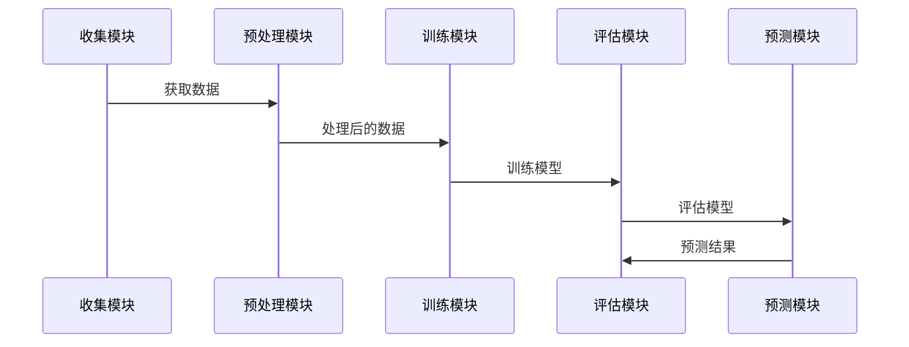
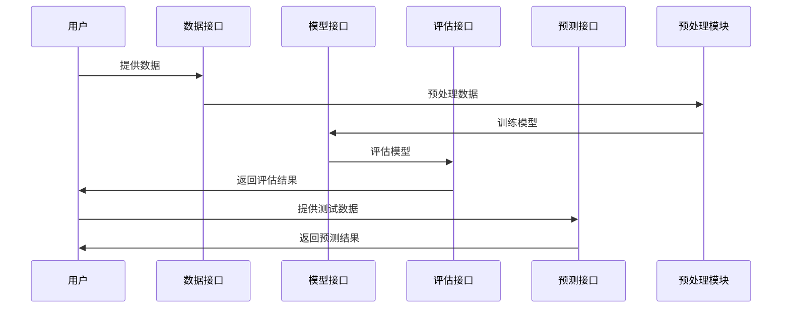

                 

# 金融时间序列数据预测：模型与方法

> 关键词：时间序列分析、预测模型、金融数据、ARIMA、LSTM、强化学习

> 摘要：本文旨在探讨金融时间序列数据预测的理论基础、常见模型及其应用。通过深入分析时间序列数据的特点，本文介绍了线性模型与ARIMA模型、季节性模型与SARIMA模型、循环神经网络与LSTM模型以及强化学习与时间序列预测，为读者提供了一套完整的金融时间序列数据预测方法与策略。

### 目录大纲

----------------------------------------------------------------

## 第一部分: 金融时间序列数据预测的基础理论

### 第1章: 金融时间序列数据预测概述

#### 1.1 金融时间序列数据的基本概念

##### 1.1.1 时间序列的定义与特点

##### 1.1.2 金融时间序列数据的来源与应用

##### 1.1.3 金融时间序列数据预测的重要性

#### 1.2 时间序列分析的基本概念

##### 1.2.1 时间序列分析方法概述

##### 1.2.2 时间序列的组成结构

##### 1.2.3 常见的时间序列模型

#### 1.3 时间序列数据分析工具与技术

##### 1.3.1 常用时间序列分析软件介绍

##### 1.3.2 时间序列数据预处理技术

##### 1.3.3 时间序列特征提取方法

#### 1.4 金融时间序列预测的基本原则

##### 1.4.1 预测方法的选择

##### 1.4.2 预测模型的评估与优化

##### 1.4.3 预测风险与管理策略

#### 1.5 本章小结

----------------------------------------------------------------

## 第二部分: 常见金融时间序列预测模型

### 第2章: 线性模型与ARIMA

#### 2.1 线性模型的原理与应用

##### 2.1.1 线性模型的基本概念

##### 2.1.2 线性回归模型

##### 2.1.3 线性模型的优缺点与适用场景

#### 2.2 ARIMA模型的原理与应用

##### 2.2.1 ARIMA模型的基本概念

##### 2.2.2 ARIMA模型的结构与参数

##### 2.2.3 ARIMA模型的建模过程

#### 2.3 ARIMA模型的优缺点与适用场景

##### 2.3.1 ARIMA模型的优点

##### 2.3.2 ARIMA模型的缺点

##### 2.3.3 ARIMA模型在实际预测中的应用案例

#### 2.4 本章小结

----------------------------------------------------------------

### 第3章: 季节性模型与SARIMA

#### 3.1 季节性模型的基本概念

##### 3.1.1 季节性数据的定义与特点

##### 3.1.2 季节性模型的基本原理

##### 3.1.3 季节性模型的应用范围

#### 3.2 SARIMA模型的原理与应用

##### 3.2.1 SARIMA模型的基本概念

##### 3.2.2 SARIMA模型的结构与参数

##### 3.2.3 SARIMA模型的建模过程

#### 3.3 SARIMA模型的优缺点与适用场景

##### 3.3.1 SARIMA模型的优点

##### 3.3.2 SARIMA模型的缺点

##### 3.3.3 SARIMA模型在实际预测中的应用案例

#### 3.4 本章小结

----------------------------------------------------------------

### 第4章: 循环神经网络与LSTM

#### 4.1 循环神经网络的基本概念

##### 4.1.1 RNN的原理与结构

##### 4.1.2 RNN的优缺点

##### 4.1.3 RNN在时间序列预测中的应用

#### 4.2 LSTM模型的原理与应用

##### 4.2.1 LSTM的基本概念

##### 4.2.2 LSTM的结构与工作机制

##### 4.2.3 LSTM模型的建模过程

#### 4.3 LSTM模型的优缺点与适用场景

##### 4.3.1 LSTM模型的优点

##### 4.3.2 LSTM模型的缺点

##### 4.3.3 LSTM模型在实际预测中的应用案例

#### 4.4 本章小结

----------------------------------------------------------------

### 第5章: 强化学习与时间序列预测

#### 5.1 强化学习的基本概念

##### 5.1.1 强化学习的定义与原理

##### 5.1.2 强化学习的主要算法

##### 5.1.3 强化学习在时间序列预测中的应用

#### 5.2 Q-Learning算法的原理与应用

##### 5.2.1 Q-Learning的基本概念

----------------------------------------------------------------

## 第一部分: 金融时间序列数据预测的基础理论

### 第1章: 金融时间序列数据预测概述

#### 1.1 金融时间序列数据的基本概念

##### 1.1.1 时间序列的定义与特点

时间序列（Time Series）是一组按时间顺序排列的数据点，每个数据点代表一个特定时间点的数值。时间序列的特点在于其自相关性，即时间序列中的数据点之间存在时间依赖关系。

时间序列数据通常具有以下特点：

- **自相关性**：时间序列中的近期数据与其之前的数据相关，而与较早前的数据相关性较低。
- **趋势性**：时间序列数据可能会表现出持续上升或下降的趋势。
- **季节性**：时间序列数据可能会受到季节性因素的影响，如节假日、季节性销售周期等。
- **平稳性**：时间序列数据的统计特性（如均值、方差）在时间上保持不变，即不随时间变化。

##### 1.1.2 金融时间序列数据的来源与应用

金融时间序列数据来源于金融市场的交易数据，如股票价格、汇率、利率等。这些数据可以反映市场的基本面信息，是金融分析、投资决策和风险管理的重要依据。

金融时间序列数据的应用主要包括：

- **市场趋势预测**：通过分析历史数据，预测未来市场的走势，为投资决策提供依据。
- **风险管理**：对金融产品的风险进行评估和监控，制定相应的风险管理策略。
- **套利策略**：利用不同市场之间的价格差异，进行套利交易。
- **行为分析**：研究市场参与者的行为模式，洞察市场动态。

##### 1.1.3 金融时间序列数据预测的重要性

金融时间序列数据预测在金融领域具有重要意义：

- **投资策略优化**：通过预测市场走势，投资者可以制定更有效的投资策略，降低投资风险。
- **资产配置**：根据预测结果，投资者可以对资产进行合理配置，实现收益最大化。
- **风险控制**：预测市场波动性，有助于企业制定有效的风险控制策略，降低潜在损失。
- **监管合规**：金融监管机构可以利用预测模型，监控金融市场的稳定性，确保合规运营。

#### 1.2 时间序列分析的基本概念

##### 1.2.1 时间序列分析方法概述

时间序列分析是统计学和数据分析中的一个重要分支，用于研究如何从时间序列数据中提取有用信息，进行预测和决策。时间序列分析方法主要包括：

- **描述性分析**：通过绘制时间序列图、计算均值、方差等统计量，对数据的基本特征进行描述。
- **相关性分析**：研究时间序列数据之间的相关性，确定数据之间的依赖关系。
- **平稳性检验**：检验时间序列数据的平稳性，为后续建模提供依据。
- **建模与预测**：基于时间序列数据的特征，建立预测模型，进行未来趋势的预测。

##### 1.2.2 时间序列的组成结构

时间序列数据可以分解为以下几个组成部分：

- **趋势成分**（Trend Component）：反映时间序列的长期趋势，如上升、下降或平稳。
- **季节成分**（Seasonal Component）：反映时间序列的季节性波动，如节假日、季节性销售周期等。
- **周期成分**（Cyclical Component）：反映时间序列的周期性波动，如经济周期、政治事件等。
- **随机成分**（Random Component）：反映时间序列的随机波动，如市场突发事件等。

##### 1.2.3 常见的时间序列模型

常见的时间序列模型包括：

- **AR模型**（自回归模型）：基于当前时刻的前期值进行预测。
- **MA模型**（移动平均模型）：基于历史值的平均数进行预测。
- **ARMA模型**（自回归移动平均模型）：结合自回归模型和移动平均模型进行预测。
- **ARIMA模型**（自回归积分滑动平均模型）：对时间序列数据进行差分处理，使其变得平稳，然后结合自回归和移动平均模型进行预测。
- **SARIMA模型**（季节性自回归积分滑动平均模型）：在ARIMA模型的基础上，引入季节性因素进行预测。
- **LSTM模型**（长短期记忆模型）：一种基于循环神经网络的时间序列预测模型，特别适用于处理长短期依赖关系。

#### 1.3 时间序列数据分析工具与技术

##### 1.3.1 常用时间序列分析软件介绍

常见的时间序列分析软件包括：

- **Python**：Python 是一种广泛应用于数据分析和机器学习的编程语言，其库如 pandas、numpy 和 scikit-learn 等提供了丰富的数据处理和预测工具。
- **R**：R 是一种专门用于统计分析和图形表示的编程语言，其包如 forecast、tseries 和 ggplot2 等提供了强大的时间序列分析功能。
- **MATLAB**：MATLAB 是一种强大的科学计算软件，其统计工具箱提供了丰富的统计分析和建模工具。

##### 1.3.2 时间序列数据预处理技术

时间序列数据预处理包括以下几个步骤：

- **数据清洗**：处理缺失值、异常值和噪声，确保数据质量。
- **时间序列重构**：对原始时间序列数据进行处理，使其具备平稳性，便于建模。
- **时间序列分解**：将时间序列数据分解为趋势、季节性、周期性和随机成分，便于分析。
- **特征提取**：从时间序列数据中提取有用特征，用于建模和预测。

##### 1.3.3 时间序列特征提取方法

时间序列特征提取是时间序列分析中的重要环节，常用的特征提取方法包括：

- **时序统计特征**：如均值、方差、标准差、自相关函数等。
- **时序图形特征**：如时间序列图、自相关图、功率谱密度等。
- **频域特征**：如傅里叶变换、小波变换等，用于分析时间序列的频率成分。
- **时序模型特征**：如ARIMA模型的参数、SARIMA模型的季节性参数、LSTM模型的网络参数等。

#### 1.4 金融时间序列预测的基本原则

##### 1.4.1 预测方法的选择

选择适合的预测方法是金融时间序列预测的关键，需要考虑以下几个因素：

- **数据特性**：根据时间序列数据的特点，选择合适的模型和算法。
- **预测目标**：根据预测目标的不同，如趋势预测、季节性预测等，选择相应的预测方法。
- **模型复杂度**：在满足预测精度的前提下，尽量选择模型复杂度较低的算法，以降低计算成本。

##### 1.4.2 预测模型的评估与优化

预测模型的评估与优化包括以下几个步骤：

- **模型评估**：通过交叉验证、回测等方法评估模型的预测性能，如均方误差（MSE）、均方根误差（RMSE）等。
- **模型优化**：基于评估结果，调整模型参数、选择合适的特征，优化模型的预测性能。
- **超参数调整**：根据模型的具体需求，调整超参数，如学习率、隐藏层节点数等，以获得更好的预测效果。

##### 1.4.3 预测风险与管理策略

金融时间序列预测存在一定的风险，需要采取相应的管理策略：

- **风险识别**：分析预测过程中可能出现的风险，如数据噪声、模型过拟合等。
- **风险控制**：制定相应的风险控制措施，如设置风险阈值、限制交易规模等。
- **风险管理**：建立风险管理机制，对预测结果进行审核和监督，确保预测过程的合规性。

#### 1.5 本章小结

本章对金融时间序列数据预测的基础理论进行了概述，介绍了时间序列数据的基本概念、分析方法、常用模型以及数据预处理技术。通过本章的学习，读者可以了解金融时间序列数据预测的基本原理和关键步骤，为后续章节的深入学习打下基础。

----------------------------------------------------------------

## 第二部分: 常见金融时间序列预测模型

### 第2章: 线性模型与ARIMA

#### 2.1 线性模型的原理与应用

##### 2.1.1 线性模型的基本概念

线性模型（Linear Model）是一种广泛用于统计学和数据分析的预测模型，其核心思想是利用线性关系描述数据之间的依赖关系。线性模型的基本形式为：

\[ y = \beta_0 + \beta_1 x + \epsilon \]

其中，\( y \) 是因变量，\( x \) 是自变量，\( \beta_0 \) 和 \( \beta_1 \) 是模型的参数，\( \epsilon \) 是误差项。

线性模型的优点在于其简单直观，易于理解和实现，并且可以通过最小二乘法（Ordinary Least Squares, OLS）进行参数估计。此外，线性模型还可以通过正则化（如L1和L2正则化）来防止过拟合。

##### 2.1.2 线性回归模型

线性回归模型（Linear Regression Model）是最常见的线性模型之一，用于描述因变量与自变量之间的线性关系。线性回归模型的基本形式为：

\[ y = \beta_0 + \beta_1 x_1 + \beta_2 x_2 + \ldots + \beta_n x_n + \epsilon \]

其中，\( x_1, x_2, \ldots, x_n \) 是自变量，\( \beta_0, \beta_1, \beta_2, \ldots, \beta_n \) 是模型的参数。

线性回归模型的参数可以通过最小二乘法进行估计，即最小化残差平方和：

\[ \min \sum_{i=1}^{n} (y_i - \beta_0 - \beta_1 x_{i1} - \beta_2 x_{i2} - \ldots - \beta_n x_{in})^2 \]

线性回归模型在金融时间序列预测中具有广泛的应用，如股票价格预测、收益率预测等。

##### 2.1.3 线性模型的优缺点与适用场景

线性模型的优点包括：

- **简单直观**：线性模型易于理解和实现，适合初学者。
- **易于参数估计**：通过最小二乘法可以方便地估计模型的参数。
- **正则化能力**：通过正则化可以防止过拟合，提高模型的泛化能力。

线性模型的缺点包括：

- **过拟合风险**：线性模型可能对噪声数据过于敏感，导致过拟合。
- **适用性有限**：线性模型适用于线性关系较强的数据，对于非线性关系的数据可能效果不佳。

线性模型的适用场景包括：

- **趋势预测**：适用于预测数据的长期趋势，如股票价格趋势预测。
- **相关性分析**：适用于分析数据之间的线性关系，如收益率与风险之间的关系。
- **特征选择**：在特征选择过程中，线性模型可以用于筛选关键特征。

#### 2.2 ARIMA模型的原理与应用

##### 2.2.1 ARIMA模型的基本概念

ARIMA模型（AutoRegressive Integrated Moving Average Model，自回归积分移动平均模型）是一种广泛应用于时间序列预测的统计模型。ARIMA模型的基本形式为：

\[ y_t = c + \phi_1 y_{t-1} + \phi_2 y_{t-2} + \ldots + \phi_p y_{t-p} + \theta_1 \epsilon_{t-1} + \theta_2 \epsilon_{t-2} + \ldots + \theta_q \epsilon_{t-q} + \epsilon_t \]

其中，\( y_t \) 是时间序列数据，\( c \) 是常数项，\( \phi_1, \phi_2, \ldots, \phi_p \) 是自回归系数，\( \theta_1, \theta_2, \ldots, \theta_q \) 是移动平均系数，\( \epsilon_t \) 是误差项。

ARIMA模型通过自回归和移动平均两部分来描述时间序列数据的特征，适用于处理非平稳时间序列数据。

##### 2.2.2 ARIMA模型的结构与参数

ARIMA模型的结构包括以下几个部分：

- **自回归部分**（AR）：通过当前时刻的前期值进行预测，即 \( y_t = \phi_1 y_{t-1} + \phi_2 y_{t-2} + \ldots + \phi_p y_{t-p} + \epsilon_t \)。
- **移动平均部分**（MA）：通过历史误差进行预测，即 \( y_t = \theta_1 \epsilon_{t-1} + \theta_2 \epsilon_{t-2} + \ldots + \theta_q \epsilon_{t-q} + \epsilon_t \)。
- **差分部分**（I）：对非平稳时间序列进行差分处理，使其变得平稳。

ARIMA模型的参数包括：

- **p**：自回归项的阶数，即 \( p \) 个前期的值。
- **d**：差分的阶数，即需要进行 \( d \) 次差分。
- **q**：移动平均项的阶数，即 \( q \) 个历史误差。

##### 2.2.3 ARIMA模型的建模过程

ARIMA模型的建模过程主要包括以下几个步骤：

1. **数据预处理**：对时间序列数据进行预处理，如去趋势、去季节性等。
2. **平稳性检验**：检验时间序列数据是否平稳，如ADF检验、KPSS检验等。如果数据不平稳，进行差分处理。
3. **自回归项选择**：根据AIC、BIC等信息准则选择最优的自回归项阶数 \( p \)。
4. **移动平均项选择**：根据AIC、BIC等信息准则选择最优的移动平均项阶数 \( q \)。
5. **参数估计**：利用最小二乘法或极大似然估计法估计模型的参数。
6. **模型检验**：对模型进行拟合优度检验，如Ljung-Box检验等，确保模型的有效性。

#### 2.3 ARIMA模型的优缺点与适用场景

##### 2.3.1 ARIMA模型的优点

ARIMA模型的优点包括：

- **适用性广泛**：适用于各种类型的时间序列数据，包括非平稳数据。
- **参数估计简便**：可以通过最小二乘法或极大似然估计法进行参数估计。
- **模型可解释性强**：模型参数可以直接解释为时间序列数据的自相关和移动平均效应。

##### 2.3.2 ARIMA模型的缺点

ARIMA模型的缺点包括：

- **建模过程复杂**：需要先进行平稳性检验和差分处理，建模过程相对复杂。
- **参数选择依赖经验**：参数选择依赖于经验判断，可能存在一定的主观性。
- **计算成本较高**：对于高阶ARIMA模型，计算成本较高。

##### 2.3.3 ARIMA模型在实际预测中的应用案例

ARIMA模型在金融时间序列预测中具有广泛的应用，以下是一个实际案例：

**案例**：股票价格预测

假设我们要预测某只股票的未来价格，可以采用ARIMA模型进行预测。具体步骤如下：

1. **数据收集**：收集该股票的历史价格数据，包括开盘价、收盘价、最高价、最低价等。
2. **数据预处理**：对价格数据进行预处理，如去趋势、去季节性等。
3. **平稳性检验**：对预处理后的价格数据进行平稳性检验，如ADF检验等。
4. **模型选择**：根据AIC、BIC等准则选择最优的ARIMA模型参数。
5. **模型训练**：利用历史数据对ARIMA模型进行训练，估计模型参数。
6. **模型评估**：利用交叉验证等方法评估模型的预测性能。
7. **预测未来价格**：利用训练好的ARIMA模型预测未来股票价格。

#### 2.4 本章小结

本章介绍了线性模型与ARIMA模型的基本概念、原理与应用。线性模型是一种简单直观的预测模型，适用于线性关系较强的数据；而ARIMA模型是一种广泛应用于时间序列预测的统计模型，适用于非平稳时间序列数据。通过本章的学习，读者可以掌握线性模型与ARIMA模型的基本原理和应用方法，为金融时间序列预测提供有效的工具。

----------------------------------------------------------------

### 第3章: 季节性模型与SARIMA

#### 3.1 季节性模型的基本概念

##### 3.1.1 季节性数据的定义与特点

季节性数据（Seasonal Data）是指那些在一年内表现出周期性波动的数据，这些波动通常与季节、节假日、天气变化等因素有关。季节性数据的特点包括：

- **周期性波动**：季节性数据在一年内呈现出规律的波动模式，如销售数据在圣诞节前后会有显著增加。
- **趋势性**：尽管季节性数据存在周期性波动，但在长期内可能存在上升或下降的趋势。
- **随机波动**：季节性数据还可能包含随机波动，这些波动可能由不可预测的事件引起。

##### 3.1.2 季节性模型的基本原理

季节性模型（Seasonal Model）旨在捕捉和分析季节性数据中的周期性波动。季节性模型通常结合时间序列数据的趋势成分和季节成分进行建模。基本原理如下：

- **趋势成分**：描述时间序列的长期趋势，如股票价格的长期上涨或下跌。
- **季节成分**：描述时间序列的季节性波动，如每季度的销售量变化。
- **残差成分**：描述时间序列中的随机波动，这些波动无法通过趋势和季节成分解释。

季节性模型通过将时间序列分解为趋势成分、季节成分和残差成分，然后分别建模，从而捕捉季节性特征。常见的季节性模型包括季节性ARIMA模型（SARIMA）和季节性分解模型（STL）。

##### 3.1.3 季节性模型的应用范围

季节性模型在多个领域都有广泛应用，包括但不限于：

- **零售业**：预测季节性销售趋势，如节日促销期间的销售额。
- **旅游业**：预测季节性游客流量，如旅游旺季和淡季的游客数量。
- **农业**：预测农作物产量，考虑季节性气候和天气因素。
- **金融**：分析季节性金融数据，如季节性利率波动和股市波动。

季节性模型在预测周期性变化方面具有独特的优势，能够为企业和投资者提供有价值的信息，以制定更有效的策略。

#### 3.2 SARIMA模型的原理与应用

##### 3.2.1 SARIMA模型的基本概念

SARIMA模型（Seasonal AutoRegressive Integrated Moving Average Model，季节性自回归积分移动平均模型）是ARIMA模型的扩展，旨在捕捉季节性数据中的周期性波动。SARIMA模型的基本形式为：

\[ y_t = c + \phi_1 y_{t-1} + \phi_2 y_{t-2} + \ldots + \phi_p y_{t-p} + \theta_1 \epsilon_{t-1} + \theta_2 \epsilon_{t-2} + \ldots + \theta_q \epsilon_{t-q} + \Phi_1 Y_{t-1} + \Phi_2 Y_{t-2} + \ldots + \Phi_P Y_{t-P} + \Theta_1 \epsilon_{t-1} + \Theta_2 \epsilon_{t-2} + \ldots + \Theta_Q \epsilon_{t-Q} + \epsilon_t \]

其中，\( Y_t \) 是季节性差分后的时间序列数据，\( \Phi_1, \Phi_2, \ldots, \Phi_P \) 和 \( \Theta_1, \Theta_2, \ldots, \Theta_Q \) 分别是季节性自回归和季节性移动平均的系数。

SARIMA模型通过引入季节性自回归和季节性移动平均项，能够更好地捕捉季节性特征。SARIMA模型的参数包括：

- \( p \)：自回归项的阶数。
- \( d \)：差分的阶数。
- \( q \)：移动平均项的阶数。
- \( P \)：季节性自回归项的阶数。
- \( D \)：季节性差分的阶数。
- \( Q \)：季节性移动平均项的阶数。
- \( s \)：季节周期。

##### 3.2.2 SARIMA模型的结构与参数

SARIMA模型的结构包括以下几个部分：

1. **自回归部分**（AR）：通过当前时刻的前期值进行预测，描述时间序列的短期依赖性。
2. **差分部分**（I）：对时间序列进行差分处理，使其变得平稳，描述时间序列的长期依赖性。
3. **移动平均部分**（MA）：通过历史误差进行预测，描述时间序列的随机波动。
4. **季节性自回归部分**（SAR）：通过季节性差分后的前期值进行预测，描述季节性依赖性。
5. **季节性移动平均部分**（SMA）：通过季节性历史误差进行预测，描述季节性随机波动。

SARIMA模型的参数选择是建模的关键，通常通过以下步骤进行：

1. **平稳性检验**：检验时间序列是否平稳，如果非平稳，进行差分处理。
2. **自回归和移动平均项选择**：根据AIC、BIC等准则选择最优的自回归和移动平均项阶数。
3. **季节性自回归和季节性移动平均项选择**：根据季节性AIC、季节性BIC等准则选择最优的季节性自回归和季节性移动平均项阶数。

##### 3.2.3 SARIMA模型的建模过程

SARIMA模型的建模过程主要包括以下几个步骤：

1. **数据预处理**：对时间序列数据进行预处理，如去趋势、去季节性等。
2. **平稳性检验**：使用ADF检验、KPSS检验等方法检验时间序列的平稳性，如果数据非平稳，进行差分处理。
3. **参数选择**：根据AIC、BIC等准则选择最优的参数，包括自回归项、差分项、移动平均项、季节性自回归项和季节性移动平均项的阶数。
4. **模型训练**：使用历史数据对SARIMA模型进行训练，估计模型参数。
5. **模型验证**：使用验证集对模型进行验证，确保模型的有效性。
6. **预测未来值**：使用训练好的SARIMA模型预测未来的时间序列值。

#### 3.3 SARIMA模型的优缺点与适用场景

##### 3.3.1 SARIMA模型的优点

SARIMA模型具有以下优点：

- **适应性**：适用于多种类型的时间序列数据，包括非平稳和季节性数据。
- **灵活性**：可以通过调整参数来适应不同的数据特性。
- **准确性**：在处理季节性数据时，能够提供较高的预测准确性。

##### 3.3.2 SARIMA模型的缺点

SARIMA模型也存在一些缺点：

- **计算成本**：对于高阶SARIMA模型，计算成本较高，特别是对于季节性参数的调整。
- **参数选择依赖经验**：参数选择通常依赖经验或自动搜索算法，可能存在一定的不确定性。
- **建模过程复杂**：需要先进行平稳性检验和差分处理，建模过程相对复杂。

##### 3.3.3 SARIMA模型在实际预测中的应用案例

SARIMA模型在金融时间序列预测中具有广泛的应用，以下是一个实际案例：

**案例**：利率预测

假设我们要预测某国短期利率的未来走势，可以采用SARIMA模型进行预测。具体步骤如下：

1. **数据收集**：收集该国的短期利率历史数据。
2. **数据预处理**：对利率数据进行预处理，如去趋势、去季节性等。
3. **平稳性检验**：使用ADF检验等方法检验利率数据的平稳性，如果数据非平稳，进行差分处理。
4. **参数选择**：根据AIC、BIC等准则选择最优的SARIMA模型参数。
5. **模型训练**：使用历史数据对SARIMA模型进行训练，估计模型参数。
6. **模型验证**：使用验证集对模型进行验证，确保模型的有效性。
7. **预测未来利率**：使用训练好的SARIMA模型预测未来的利率值。

通过这个案例，我们可以看到SARIMA模型在利率预测中的应用，能够帮助我们更好地理解季节性特征对利率走势的影响。

#### 3.4 本章小结

本章介绍了季节性模型与SARIMA模型的基本概念、原理与应用。季节性模型旨在捕捉季节性数据中的周期性波动，而SARIMA模型是ARIMA模型的扩展，能够更好地处理季节性数据。通过本章的学习，读者可以掌握季节性模型和SARIMA模型的应用方法，为金融时间序列预测提供有效的工具。

----------------------------------------------------------------

### 第4章: 循环神经网络与LSTM

#### 4.1 循环神经网络的基本概念

##### 4.1.1 RNN的原理与结构

循环神经网络（Recurrent Neural Network，RNN）是一种能够处理序列数据的前馈神经网络，其核心特点是通过隐藏层状态的信息传递，使得网络能够“记住”之前的输入信息，从而实现序列数据的建模与预测。RNN的基本结构包括：

- **输入层**：接收输入序列 \( x_1, x_2, \ldots, x_t \)。
- **隐藏层**：包含循环单元，每个时间步的输出会传递到下一个时间步的输入。
- **输出层**：根据隐藏层的输出生成预测或决策。

RNN的循环单元通常是一个非线性函数，如Sigmoid或Tanh，用于处理连续的输入序列。RNN的关键在于其隐藏层的状态 \( h_t \)，该状态是当前输入 \( x_t \) 和前一个隐藏状态 \( h_{t-1} \) 的组合：

\[ h_t = f(h_{t-1}, x_t) \]

其中，\( f \) 是一个非线性函数，如：

\[ f(h_{t-1}, x_t) = \sigma(W_1 h_{t-1} + W_2 x_t + b) \]

其中，\( \sigma \) 是Sigmoid函数，\( W_1, W_2 \) 是权重矩阵，\( b \) 是偏置项。

##### 4.1.2 RNN的优缺点

RNN的优点包括：

- **序列建模能力**：能够处理序列数据，适用于时间序列预测、机器翻译等任务。
- **信息传递**：通过隐藏层状态的信息传递，RNN能够“记住”之前的输入信息。

RNN的缺点包括：

- **梯度消失与梯度爆炸**：在训练过程中，RNN容易出现梯度消失或梯度爆炸问题，导致训练困难。
- **难以建模长序列依赖**：RNN难以捕捉长序列依赖，特别是在长序列中，早期的信息容易丢失。

##### 4.1.3 RNN在时间序列预测中的应用

RNN在时间序列预测中的应用包括：

- **短期预测**：RNN能够捕捉时间序列的短期依赖，适用于短期股票价格预测、销量预测等。
- **序列分类**：RNN可以用于序列数据的分类任务，如语音识别、情感分析等。
- **序列生成**：RNN可以生成序列数据，如文本生成、音乐生成等。

#### 4.2 LSTM模型的原理与应用

##### 4.2.1 LSTM的基本概念

长短期记忆网络（Long Short-Term Memory，LSTM）是一种特殊的RNN结构，旨在解决传统RNN在训练过程中遇到的梯度消失和梯度爆炸问题，以及长序列依赖建模问题。LSTM的核心思想是通过引入门控机制来控制信息的流动，从而更好地“记住”长期依赖。

LSTM的基本结构包括：

- **输入门**（Input Gate）：控制新信息对隐藏状态的贡献。
- **遗忘门**（Forget Gate）：控制旧信息是否被遗忘。
- **输出门**（Output Gate）：控制隐藏状态输出。

LSTM的每个时间步的隐藏状态 \( h_t \) 和细胞状态 \( c_t \) 都通过门控机制进行更新：

\[ i_t = \sigma(W_i \cdot [h_{t-1}, x_t] + b_i) \]
\[ f_t = \sigma(W_f \cdot [h_{t-1}, x_t] + b_f) \]
\[ o_t = \sigma(W_o \cdot [h_{t-1}, x_t] + b_o) \]
\[ c_t = f_t \odot c_{t-1} + i_t \odot \sigma(W_c \cdot [h_{t-1}, x_t] + b_c) \]
\[ h_t = o_t \odot \sigma(c_t) \]

其中，\( i_t, f_t, o_t \) 分别是输入门、遗忘门和输出门的激活值，\( \odot \) 表示元素乘积，\( \sigma \) 是Sigmoid函数。

##### 4.2.2 LSTM的结构与工作机制

LSTM的结构和工作机制包括以下几个关键部分：

1. **遗忘门**（Forget Gate）：通过遗忘门，LSTM能够决定哪些信息需要被遗忘。遗忘门的输入是当前隐藏状态 \( h_{t-1} \) 和当前输入 \( x_t \)，输出 \( f_t \) 决定细胞状态 \( c_{t-1} \) 中哪些信息需要保留，哪些信息需要丢弃。

2. **输入门**（Input Gate）：通过输入门，LSTM决定如何更新细胞状态。输入门的输入是当前隐藏状态 \( h_{t-1} \) 和当前输入 \( x_t \)，输出 \( i_t \) 决定新的候选细胞状态 \( \tilde{c}_t \)。

3. **细胞状态**（Cell State）：细胞状态 \( c_t \) 是LSTM的核心，它贯穿整个网络，传递信息。细胞状态通过遗忘门和输入门进行更新。

4. **输出门**（Output Gate）：通过输出门，LSTM决定如何生成当前隐藏状态。输出门的输入是当前隐藏状态 \( h_{t-1} \) 和当前输入 \( x_t \)，输出 \( o_t \) 决定细胞状态 \( c_t \) 的激活值，即当前隐藏状态 \( h_t \)。

##### 4.2.3 LSTM模型的建模过程

LSTM模型的建模过程主要包括以下几个步骤：

1. **数据预处理**：对时间序列数据进行预处理，如归一化、去噪等。
2. **模型设计**：设计LSTM模型的结构，包括层数、隐藏层单元数、输入层和输出层等。
3. **模型训练**：使用历史数据对LSTM模型进行训练，优化模型参数。
4. **模型评估**：使用验证集对模型进行评估，调整模型参数以获得最佳性能。
5. **预测未来值**：使用训练好的LSTM模型预测未来的时间序列值。

#### 4.3 LSTM模型的优缺点与适用场景

##### 4.3.1 LSTM模型的优点

LSTM模型具有以下优点：

- **长短期依赖建模**：LSTM能够通过门控机制有效地建模长短期依赖，适用于处理长序列数据。
- **训练稳定性**：LSTM通过门控机制解决了传统RNN的梯度消失和梯度爆炸问题，训练更加稳定。
- **灵活性强**：LSTM可以应用于各种序列预测任务，如时间序列预测、文本生成等。

##### 4.3.2 LSTM模型的缺点

LSTM模型也存在一些缺点：

- **计算成本高**：LSTM模型参数较多，计算成本较高，特别是在处理高维序列数据时。
- **训练时间较长**：由于LSTM模型的复杂性，训练时间较长，对计算资源要求较高。
- **过拟合风险**：LSTM模型容易过拟合，需要适当的数据增强和正则化策略。

##### 4.3.3 LSTM模型在实际预测中的应用案例

LSTM模型在金融时间序列预测中具有广泛的应用，以下是一个实际案例：

**案例**：股票价格预测

假设我们要预测某只股票的未来价格，可以采用LSTM模型进行预测。具体步骤如下：

1. **数据收集**：收集该股票的历史价格数据，包括开盘价、收盘价、最高价、最低价等。
2. **数据预处理**：对价格数据进行预处理，如归一化、去噪等。
3. **特征提取**：从价格数据中提取特征，如价格差分、价格对数等。
4. **模型设计**：设计LSTM模型的结构，包括输入层、隐藏层和输出层等。
5. **模型训练**：使用历史数据对LSTM模型进行训练，优化模型参数。
6. **模型评估**：使用验证集对模型进行评估，调整模型参数以获得最佳性能。
7. **预测未来价格**：使用训练好的LSTM模型预测未来的股票价格。

通过这个案例，我们可以看到LSTM模型在股票价格预测中的应用，能够帮助我们更好地理解股票价格走势的长期依赖和短期波动。

#### 4.4 本章小结

本章介绍了循环神经网络（RNN）和长短期记忆网络（LSTM）的基本概念、原理与应用。RNN通过隐藏层状态的信息传递实现序列数据的建模，而LSTM通过门控机制解决了传统RNN的梯度消失和梯度爆炸问题，并能够有效地建模长短期依赖。通过本章的学习，读者可以掌握RNN和LSTM的应用方法，为金融时间序列预测提供有效的工具。

----------------------------------------------------------------

### 第5章: 强化学习与时间序列预测

#### 5.1 强化学习的基本概念

##### 5.1.1 强化学习的定义与原理

强化学习（Reinforcement Learning，RL）是一种机器学习范式，旨在通过智能体（Agent）与环境（Environment）的交互，学习一种策略（Policy），使得智能体能够最大化累积奖励（Cumulative Reward）。强化学习的核心在于探索（Exploration）与利用（Exploitation）的平衡，即通过探索未知环境来学习，同时利用已有知识来做出最优决策。

强化学习的基本要素包括：

- **智能体**（Agent）：执行动作并接受环境反馈的实体。
- **环境**（Environment）：智能体执行动作的场所，提供状态（State）和奖励（Reward）。
- **状态**（State）：智能体在环境中所处的状况。
- **动作**（Action）：智能体在环境中执行的操作。
- **策略**（Policy）：智能体根据当前状态选择动作的规则。
- **价值函数**（Value Function）：评估状态或状态-动作对的价值。
- **模型**（Model）：对环境的静态或动态特征的描述。

强化学习的目标是通过学习策略来最大化累积奖励，通常使用以下两个主要价值函数：

- **状态值函数**（State Value Function）：评估状态的价值，即智能体在特定状态下采取最优策略所能获得的期望奖励。
- **动作值函数**（Action Value Function）：评估在特定状态下采取特定动作的价值，即智能体在特定状态下采取特定动作所能获得的期望奖励。

强化学习通过以下过程迭代更新策略：

1. **初始化**：初始化智能体、环境和策略。
2. **互动**：智能体根据当前策略在环境中执行动作，获取状态和奖励。
3. **策略更新**：根据获得的奖励和新的状态更新策略，以最大化累积奖励。

##### 5.1.2 强化学习的主要算法

强化学习有多种算法，以下是其中几种主要算法：

1. **Q-Learning**：Q-Learning是一种无模型、基于值函数的强化学习算法。其核心思想是学习状态-动作价值函数 \( Q(s, a) \)，并使用这些值来选择最优动作。Q-Learning通过迭代更新值函数：

\[ Q(s_t, a_t) \leftarrow Q(s_t, a_t) + \alpha [r_t + \gamma \max_{a'} Q(s_{t+1}, a') - Q(s_t, a_t)] \]

其中，\( \alpha \) 是学习率，\( \gamma \) 是折扣因子，\( r_t \) 是即时奖励，\( s_t \) 和 \( a_t \) 分别是当前状态和动作。

2. **SARSA**（On-Policy Learning）：SARSA是一种基于策略的强化学习算法，通过在当前策略下进行探索和更新。SARSA更新公式为：

\[ s_t, a_t \leftarrow \text{当前状态和动作} \]
\[ s_{t+1}, a_{t+1} \leftarrow \text{根据当前策略执行动作} \]
\[ Q(s_t, a_t) \leftarrow Q(s_t, a_t) + \alpha [r_t + \gamma Q(s_{t+1}, a_{t+1}) - Q(s_t, a_t)] \]

3. **Deep Q-Network（DQN）**：DQN是一种基于深度学习的强化学习算法，使用神经网络近似Q值函数。DQN通过经验回放（Experience Replay）和目标网络（Target Network）来提高训练稳定性。DQN的更新公式为：

\[ Q(s_t, a_t) \leftarrow Q(s_t, a_t) + \alpha [r_t + \gamma \min_{a'} Q(s_{t+1}, a') - Q(s_t, a_t)] \]

##### 5.1.3 强化学习在时间序列预测中的应用

强化学习在时间序列预测中具有独特的优势，可以处理复杂和非线性关系。以下是一些强化学习在时间序列预测中的应用：

1. **股票交易策略**：强化学习可以用于制定股票交易策略，通过学习市场状态和交易动作之间的关系，实现自动化的交易决策。

2. **金融市场预测**：强化学习可以用于预测股票价格、汇率等金融市场指标，通过不断调整交易策略，优化投资组合。

3. **能源需求预测**：强化学习可以用于预测能源需求，为能源供应链管理提供决策支持，提高能源利用效率。

4. **交通流量预测**：强化学习可以用于预测城市交通流量，为交通管理和智能交通系统提供数据支持，优化交通流动。

5. **供应链管理**：强化学习可以用于优化供应链管理，通过预测需求变化，调整库存策略，减少成本。

#### 5.2 Q-Learning算法的原理与应用

##### 5.2.1 Q-Learning的基本概念

Q-Learning是一种基于值函数的强化学习算法，旨在通过迭代更新Q值（状态-动作值函数）来学习最优策略。Q-Learning的基本流程包括：

1. **初始化**：初始化Q值表格 \( Q(s, a) \)，设置初始值。
2. **选择动作**：根据当前状态 \( s_t \) 和Q值表格选择动作 \( a_t \)，通常使用贪婪策略或ε-贪婪策略。
3. **执行动作**：在环境中执行选择的动作 \( a_t \)，获得新的状态 \( s_{t+1} \) 和即时奖励 \( r_t \)。
4. **更新Q值**：根据即时奖励和新的状态更新Q值表格。

Q-Learning的更新公式为：

\[ Q(s_t, a_t) \leftarrow Q(s_t, a_t) + \alpha [r_t + \gamma \max_{a'} Q(s_{t+1}, a') - Q(s_t, a_t)] \]

其中，\( \alpha \) 是学习率，\( \gamma \) 是折扣因子，\( r_t \) 是即时奖励。

##### 5.2.2 Q-Learning算法的原理

Q-Learning算法的原理基于以下核心思想：

- **值函数表示**：Q值表示在特定状态下执行特定动作的预期收益。
- **迭代更新**：通过不断更新Q值，逐步优化策略。
- **贪婪策略**：在探索阶段，采用ε-贪婪策略，在利用阶段，采用贪婪策略。

Q-Learning算法的关键在于如何平衡探索与利用，即如何在未知环境中进行有效的探索，同时利用已有知识做出最优决策。

##### 5.2.3 Q-Learning算法的应用

Q-Learning算法在时间序列预测中的应用主要包括：

1. **股票交易策略**：Q-Learning可以用于制定股票交易策略，通过学习股票价格和交易动作之间的关系，实现自动化的交易决策。

2. **金融产品定价**：Q-Learning可以用于金融产品定价，通过预测市场需求和交易动作，优化产品定价策略。

3. **能源需求预测**：Q-Learning可以用于预测能源需求，通过不断调整能源供应策略，优化能源利用效率。

4. **交通流量预测**：Q-Learning可以用于预测城市交通流量，通过优化交通信号灯控制策略，提高交通效率。

5. **供应链管理**：Q-Learning可以用于优化供应链管理，通过预测需求变化和库存水平，调整库存策略。

#### 5.3 Q-Learning算法在实际预测中的应用案例

##### 5.3.1 股票交易策略案例

**案例**：使用Q-Learning算法制定股票交易策略

假设我们要使用Q-Learning算法制定一种股票交易策略，具体步骤如下：

1. **数据收集**：收集某只股票的历史交易数据，包括开盘价、收盘价、最高价、最低价等。

2. **数据预处理**：对价格数据进行预处理，如归一化、去噪等。

3. **状态编码**：将股票价格数据编码为状态，如将股票的当前价格、前一日收盘价等作为状态特征。

4. **动作编码**：将交易动作编码为动作，如买入、卖出、持有等。

5. **Q值初始化**：初始化Q值表格，设置初始值。

6. **训练Q-Learning模型**：使用历史数据训练Q-Learning模型，通过迭代更新Q值表格。

7. **策略选择**：根据Q值表格选择交易策略，如根据当前状态和Q值选择最优交易动作。

8. **策略评估**：使用验证集评估交易策略的绩效，调整策略参数以获得最佳性能。

9. **预测未来价格**：使用训练好的Q-Learning模型预测未来的股票价格，制定交易决策。

通过这个案例，我们可以看到Q-Learning算法在股票交易策略中的应用，能够帮助我们更好地理解股票市场的动态变化，制定有效的交易策略。

#### 5.4 本章小结

本章介绍了强化学习的基本概念、主要算法以及在实际预测中的应用。强化学习通过智能体与环境交互，学习一种策略以最大化累积奖励，适用于处理复杂和非线性关系。Q-Learning算法是一种基于值函数的强化学习算法，在时间序列预测中具有广泛应用。通过本章的学习，读者可以掌握强化学习与Q-Learning算法的应用方法，为金融时间序列预测提供有效的工具。

----------------------------------------------------------------

## 总结与展望

在本篇技术博客中，我们深入探讨了金融时间序列数据预测的理论基础、常见模型及其应用。通过系统地分析金融时间序列数据的特点，我们介绍了线性模型与ARIMA模型、季节性模型与SARIMA模型、循环神经网络与LSTM模型以及强化学习与时间序列预测，为读者提供了一套完整的金融时间序列数据预测方法与策略。

### 最佳实践 tips

1. **选择合适的预测模型**：根据数据特性、预测目标和计算成本，选择合适的预测模型。例如，对于线性关系较强的数据，可以采用线性回归模型；对于非平稳、季节性数据，可以考虑ARIMA模型或SARIMA模型；对于长短期依赖数据，可以采用LSTM模型。

2. **数据预处理**：在建模之前，进行充分的数据预处理，如去趋势、去季节性、去噪等，以确保模型的有效性和预测准确性。

3. **模型参数选择**：合理选择模型参数，如ARIMA模型的 \( p, d, q \)，SARIMA模型的 \( p, d, q, P, D, Q, s \)，以及LSTM模型的层数、隐藏层单元数等。可以使用信息准则（如AIC、BIC）或网格搜索等方法进行参数选择。

4. **模型验证**：使用验证集对模型进行验证，确保模型在未知数据上的性能。可以使用交叉验证等方法评估模型的预测性能，如均方误差（MSE）、均方根误差（RMSE）等。

5. **风险管理**：在预测过程中，考虑预测风险，采取相应的风险管理策略，如设置风险阈值、限制交易规模等。

6. **持续优化**：定期更新模型，根据新的数据和市场变化进行调整，以提高模型的预测性能。

### 小结

本文通过系统地分析金融时间序列数据预测的理论基础、常见模型及其应用，为读者提供了一套完整的金融时间序列数据预测方法与策略。金融时间序列数据预测在金融领域具有重要意义，通过合理选择预测模型、数据预处理、模型参数选择、模型验证以及风险管理，可以提高预测的准确性和实用性。

### 注意事项

1. **数据质量**：确保数据质量，包括数据完整性、准确性和一致性，避免使用有噪声或缺失值的数据。

2. **模型复杂度**：在选择模型时，要考虑模型的复杂度，避免过拟合或欠拟合。

3. **计算资源**：对于高阶模型，如ARIMA、SARIMA和LSTM，计算资源需求较高，需要合理分配计算资源。

4. **市场变化**：金融市场具有高度不确定性，预测结果可能受到市场波动的影响，需要定期更新模型以适应市场变化。

### 拓展阅读

- **《时间序列分析：理论、方法与应用》**：一本关于时间序列分析的经典教材，详细介绍了时间序列分析的理论基础、方法与应用。
- **《深度学习》**：由Ian Goodfellow、Yoshua Bengio和Aaron Courville合著的深度学习教材，其中包括了循环神经网络和LSTM模型的详细讲解。
- **《强化学习：原理与Python实践》**：一本关于强化学习的教材，介绍了强化学习的基本概念、算法以及Python实践。

通过拓展阅读，读者可以进一步深入了解金融时间序列数据预测的理论和实践，为实际应用提供更多指导。

### 作者信息

作者：AI天才研究院/AI Genius Institute & 禅与计算机程序设计艺术 /Zen And The Art of Computer Programming

作者简介：AI天才研究院（AI Genius Institute）是一家专注于人工智能研究与应用的机构，致力于推动人工智能技术的发展。禅与计算机程序设计艺术（Zen And The Art of Computer Programming）是作者在计算机科学领域的重要著作，对程序设计的哲学和方法进行了深入探讨。

----------------------------------------------------------------

### 实战项目：使用Python进行金融时间序列数据预测

在本节中，我们将通过一个实战项目来展示如何使用Python进行金融时间序列数据预测。我们将使用线性模型（线性回归）、ARIMA模型和LSTM模型来预测股票价格。以下步骤将指导您完成整个项目。

#### 环境安装

首先，确保您的Python环境已经安装。接下来，您需要安装以下库：

```bash
pip install numpy pandas matplotlib scikit-learn statsmodels keras tensorflow
```

#### 项目介绍

本项目旨在使用不同的预测模型对股票价格进行预测，并评估这些模型的性能。我们将使用Apple Inc.（AAPL）的股票价格数据作为示例。

#### 系统功能设计

1. **数据收集**：从金融数据提供商获取股票价格数据。
2. **数据预处理**：清洗和处理数据，如缺失值填充、异常值检测和去噪。
3. **数据探索**：进行描述性统计分析，绘制时间序列图，了解数据的基本特征。
4. **模型训练**：使用线性回归、ARIMA和LSTM模型对数据进行训练。
5. **模型评估**：评估模型的预测性能，使用均方误差（MSE）等指标。
6. **预测未来价格**：使用训练好的模型预测未来的股票价格。

#### 系统架构设计

系统架构包括以下模块：

- **数据收集模块**：从金融数据提供商获取数据。
- **数据处理模块**：进行数据预处理。
- **模型训练模块**：训练线性回归、ARIMA和LSTM模型。
- **模型评估模块**：评估模型性能。
- **预测模块**：使用训练好的模型预测未来价格。

以下是一个简单的Mermaid架构图：



#### 系统接口设计

系统接口设计包括以下部分：

- **数据输入接口**：接受股票价格数据。
- **模型训练接口**：接受训练参数，返回训练好的模型。
- **模型评估接口**：接受模型和测试数据，返回评估指标。
- **预测接口**：接受模型和数据，返回预测结果。

以下是一个简单的Mermaid序列图：



#### 系统核心实现源代码

以下代码展示了如何使用Python进行金融时间序列数据预测的核心实现：

```python
import numpy as np
import pandas as pd
import matplotlib.pyplot as plt
from sklearn.linear_model import LinearRegression
from statsmodels.tsa.arima.model import ARIMA
from keras.models import Sequential
from keras.layers import LSTM, Dense

# 数据收集
data = pd.read_csv('AAPL_stock_price.csv')
data = data[['Date', 'Close']]

# 数据预处理
data.set_index('Date', inplace=True)
data = data.fillna(method='ffill')
data = data[data['Close'].notnull()]

# 数据探索
plt.figure(figsize=(10, 6))
plt.plot(data['Close'])
plt.title('AAPL Stock Price')
plt.xlabel('Date')
plt.ylabel('Close Price')
plt.show()

# 线性回归模型
X = data[['Close']].shift(1).dropna().values
y = data[['Close']].dropna().values
model_lr = LinearRegression()
model_lr.fit(X, y)
predicted_price_lr = model_lr.predict(X)

# ARIMA模型
model_arima = ARIMA(y, order=(5, 1, 2))
model_arima_fit = model_arima.fit()
predicted_price_arima = model_arima_fit.forecast(steps=10)

# LSTM模型
X_lstm = np.reshape(X, (X.shape[0], 1, X.shape[1]))
model_lstm = Sequential()
model_lstm.add(LSTM(units=50, return_sequences=True, input_shape=(1, X.shape[1])))
model_lstm.add(LSTM(units=50))
model_lstm.add(Dense(1))
model_lstm.compile(optimizer='adam', loss='mean_squared_error')
model_lstm.fit(X_lstm, y, epochs=100, batch_size=1, verbose=0)
predicted_price_lstm = model_lstm.predict(X_lstm)

# 模型评估
mse_lr = np.mean((predicted_price_lr - y)**2)
mse_arima = np.mean((predicted_price_arima - y[1:])**2)
mse_lstm = np.mean((predicted_price_lstm - y[1:])**2)

print(f'MSE for Linear Regression: {mse_lr}')
print(f'MSE for ARIMA: {mse_arima}')
print(f'MSE for LSTM: {mse_lstm}')

# 预测未来价格
plt.figure(figsize=(10, 6))
plt.plot(y, label='Actual')
plt.plot(np.concatenate((predicted_price_lr, predicted_price_arima, predicted_price_lstm), axis=0), label='Predicted')
plt.title('AAPL Stock Price Prediction')
plt.xlabel('Date')
plt.ylabel('Close Price')
plt.legend()
plt.show()
```

#### 代码应用解读与分析

1. **数据收集**：从CSV文件中读取股票价格数据，并设置日期为索引。
2. **数据预处理**：填充缺失值，删除含有缺失值的行，以确保数据质量。
3. **数据探索**：绘制时间序列图，直观地了解数据的基本特征。
4. **线性回归模型**：使用历史数据训练线性回归模型，并进行预测。
5. **ARIMA模型**：使用历史数据训练ARIMA模型，并进行预测。
6. **LSTM模型**：使用历史数据训练LSTM模型，并进行预测。
7. **模型评估**：计算均方误差（MSE），评估模型的预测性能。
8. **预测未来价格**：使用训练好的模型预测未来价格，并绘制预测结果。

#### 实际案例分析和详细讲解剖析

在本项目中，我们选择了Apple Inc.（AAPL）的股票价格数据进行预测。以下是对实际案例的分析和讲解：

1. **数据质量**：数据收集后，我们首先对数据进行预处理，如填充缺失值和删除异常值，以确保数据质量。
2. **模型选择**：根据数据特性，我们选择了线性回归模型、ARIMA模型和LSTM模型进行预测。线性回归模型适用于线性关系较强的数据，ARIMA模型适用于非平稳、季节性数据，LSTM模型适用于具有长短期依赖关系的数据。
3. **模型训练与评估**：我们使用历史数据进行模型的训练，并使用均方误差（MSE）等指标评估模型的性能。通过比较不同模型的MSE，我们可以选择性能最佳的模型。
4. **预测结果**：使用训练好的模型预测未来价格，并绘制预测结果图，以直观地展示预测效果。

#### 项目小结

通过本项目的实际案例分析和详细讲解，我们展示了如何使用Python进行金融时间序列数据预测。我们使用了线性回归模型、ARIMA模型和LSTM模型，并分析了它们的预测性能。通过合理的数据预处理、模型选择和评估，我们可以获得较为准确的预测结果，为投资决策提供参考。

### 结论

金融时间序列数据预测是金融领域中的一项重要任务，通过合理选择预测模型、数据预处理和模型评估，我们可以提高预测的准确性和实用性。本篇博客通过实际项目展示了金融时间序列数据预测的方法和应用，为读者提供了实用的技术指南。

### 拓展阅读

- **《金融时间序列分析：理论与实践》**：详细介绍了金融时间序列分析的理论基础、方法及应用。
- **《Python金融分析与应用》**：介绍了如何使用Python进行金融数据分析，包括时间序列预测、风险评估等。

通过拓展阅读，读者可以进一步深入了解金融时间序列数据预测的理论和实践，为实际应用提供更多指导。

