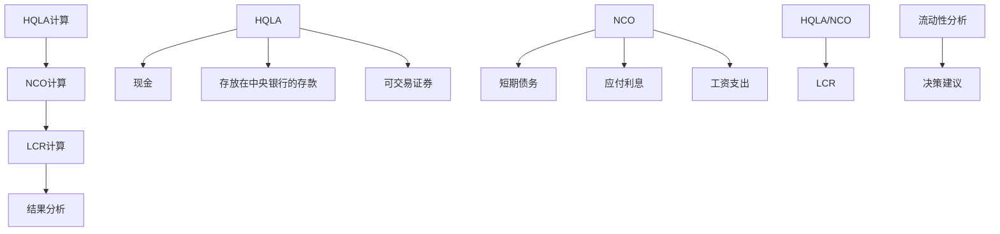

                 

### 引言

#### 问题背景

金融机构流动性覆盖率（Liquidity Coverage Ratio，简称LCR）是一个衡量金融机构短期流动性状况的重要指标。它旨在确保金融机构在面对突发性流动性需求时，能够维持足够的流动性来满足负债偿还需求。LCR的提出，源于2008年全球金融危机期间，许多金融机构因无法及时获取足够的流动性，导致破产或被接管。为了防止类似事件再次发生，监管机构提出了LCR这一要求。

LCR的定义与作用

流动性覆盖率（LCR）是指金融机构的流动资产（High-Quality Liquid Assets，简称HQLA）与短期负债（Net Cash Outflows，简称NCO）的比率。该比率越高，意味着金融机构的流动性越强，能够更好地应对短期内的资金流出。

具体而言，LCR的计算公式为：

\[ \text{LCR} = \frac{\text{HQLA}}{\text{NCO}} \]

其中，HQLA指的是高质量的流动资产，如现金、存放在中央银行的存款、可交易证券等。NCO则是指金融机构在短期（一般不超过30天）内的现金流出。

在现实中的问题

尽管LCR是评估金融机构流动性风险的重要指标，但在实际操作中，金融机构仍然面临着诸多挑战：

1. **数据获取与计算难题**：LCR的计算需要大量的财务数据支持，包括流动资产和短期负债的具体情况。然而，金融机构通常面临着数据来源多样、数据质量参差不齐的问题。

2. **市场波动影响**：金融市场波动对金融机构的流动性有着显著的影响。例如，在市场动荡时期，高质量流动资产的变现能力可能受到限制，从而影响LCR的准确评估。

3. **监管压力**：金融机构需要定期向监管机构报告LCR情况，并满足监管规定的最低要求。然而，监管要求的提高，可能对金融机构的运营造成一定的压力。

4. **风险管理挑战**：金融机构需要平衡流动性与盈利性之间的关系。过于保守的流动性管理可能导致资金利用效率低下，而过度的风险承担则可能增加流动性风险。

### 定义与作用

流动性覆盖率（Liquidity Coverage Ratio，简称LCR）是金融机构流动性管理中一个关键指标，主要用于衡量金融机构在短期内能够应对资金流出情况的能力。其定义和作用可以从以下几个方面进行详细阐述。

#### 定义

流动性覆盖率（LCR）是指金融机构的流动资产（High-Quality Liquid Assets，简称HQLA）与短期负债（Net Cash Outflows，简称NCO）的比率。该比率能够直观地反映出金融机构在面临突发性流动性需求时的保障程度。具体而言，LCR的计算公式如下：

\[ \text{LCR} = \frac{\text{HQLA}}{\text{NCO}} \]

其中，HQLA指的是高质量的流动资产，这些资产应当能够在无损失或微小损失的情况下，在市场上迅速变现。常见的HQLA包括现金、存放在中央银行的存款、以及一些高信用评级的可交易证券。而NCO则是指金融机构在短期（一般不超过30天）内的现金净流出量，这通常包括偿还到期债务、支付利息、支付工资等。

#### 作用

LCR在金融机构流动性管理中起着至关重要的作用，主要体现在以下几个方面：

1. **流动性风险评估**：LCR是评估金融机构短期流动性风险的重要指标。通过计算LCR，金融机构可以了解自身在面临短期资金流出时的流动性保障程度。对于监管机构而言，LCR也是监测金融机构流动性状况的重要工具。

2. **流动性管理决策**：LCR的高低直接影响金融机构的流动性管理决策。如果LCR低于监管要求的最低标准，金融机构可能需要采取措施增加流动性，如提高HQLA比例、调整负债结构等。相反，如果LCR较高，金融机构可以适当降低流动性储备，以增加资金的利用效率。

3. **市场信心维护**：高LCR值有助于提升市场对金融机构的信心。在金融市场动荡时期，高LCR的金融机构更容易获得资金支持，降低融资成本，从而提高市场竞争力。

4. **政策监管依据**：对于监管机构来说，LCR是实施宏观审慎监管的重要依据。通过设定LCR的最低要求，监管机构可以确保金融机构在面对经济波动时，具备足够的流动性缓冲，以避免系统性金融风险的发生。

#### 与其他流动性指标的比较

LCR虽然是一个重要的流动性指标，但并不是唯一的指标。金融机构通常会结合其他流动性指标，如现金头寸、流动性比例等，进行综合评估。与这些指标相比，LCR具有以下特点：

1. **现金头寸**：现金头寸是指金融机构持有的现金及现金等价物。虽然现金头寸能够直接反映金融机构的流动性状况，但无法考虑资产变现能力和负债情况，因此无法全面评估流动性风险。

2. **流动性比例**：流动性比例是指金融机构的流动资产与流动负债的比率。与LCR类似，流动性比例也是衡量流动性状况的指标，但它的计算中不包含负债的具体情况，因此无法反映短期负债的流出压力。

3. **LCR的优势**：LCR在考虑资产变现能力和负债情况方面，相较于现金头寸和流动性比例具有更高的准确性。通过计算LCR，金融机构可以更全面地了解自身流动性状况，从而做出更科学的流动性管理决策。

#### 总结

流动性覆盖率（LCR）作为一个关键的流动性管理指标，通过衡量金融机构的流动资产与短期负债的比率，能够全面反映其短期内的流动性风险。在金融机构流动性管理中，LCR不仅有助于评估流动性状况，还为决策提供了重要依据。尽管LCR有其独特的优势，但金融机构在评估流动性时，还需结合其他指标，以实现更全面的风险管理。

### 核心概念与联系

为了更好地理解金融机构流动性覆盖率（LCR）的计算与应用，我们需要深入探讨LCR的核心概念及其与其他流动性指标的联系。以下将详细解释LCR的定义、计算公式、核心要素，并与其他流动性指标进行比较。

#### 定义

流动性覆盖率（LCR）是指金融机构的流动资产（High-Quality Liquid Assets，简称HQLA）与短期负债（Net Cash Outflows，简称NCO）的比率。具体而言，LCR是用于评估金融机构在短期内（一般不超过30天）能够应对资金流出情况的指标。LCR的计算公式如下：

\[ \text{LCR} = \frac{\text{HQLA}}{\text{NCO}} \]

其中，HQLA是指那些能够在市场上迅速变现且无损失或微小损失的高质量流动资产，如现金、存放在中央银行的存款、以及高信用评级的可交易证券。NCO则是指金融机构在短期内的现金净流出量，包括偿还到期债务、支付利息、支付工资等。

#### 核心要素

LCR的核心要素包括流动资产和流动负债。以下是这两个核心要素的详细解释：

1. **流动资产（HQLA）**：
   - **现金**：现金是流动性最强的资产，可以直接用于偿还债务。
   - **存放在中央银行的存款**：这些存款通常具有较高的信用评级，可以快速变现。
   - **可交易证券**：高信用评级的可交易证券，如国债、地方政府债券等，可以在市场上迅速变现。

2. **流动负债（NCO）**：
   - **短期债务**：包括即将到期的贷款、短期债务证券等。
   - **应付利息**：在短期内需要支付的利息费用。
   - **工资支出**：短期内需要支付的员工工资。

#### 计算公式与核心要素

LCR的计算公式如下：

\[ \text{LCR} = \frac{\text{HQLA}}{\text{NCO}} \]

其中，HQLA和NCO的具体计算方法如下：

1. **HQLA的计算**：
   \[ \text{HQLA} = \text{现金} + \text{存放在中央银行的存款} + \text{可交易证券} \]

   例如，假设一家金融机构拥有以下流动资产：
   - 现金：100万元
   - 存放在中央银行的存款：200万元
   - 可交易证券：300万元（信用评级为AA级）

   则其HQLA为：
   \[ \text{HQLA} = 100 + 200 + 300 = 600 \text{万元} \]

2. **NCO的计算**：
   \[ \text{NCO} = \text{短期债务} + \text{应付利息} + \text{工资支出} \]

   例如，假设一家金融机构在短期内有以下现金流出：
   - 短期债务：150万元
   - 应付利息：50万元
   - 工资支出：100万元

   则其NCO为：
   \[ \text{NCO} = 150 + 50 + 100 = 300 \text{万元} \]

   根据上述数据，该金融机构的LCR为：
   \[ \text{LCR} = \frac{600}{300} = 2 \]

   这意味着该金融机构在短期内具备2倍的流动性保障。

#### 与其他流动性指标的联系

除了LCR，金融机构还会关注其他流动性指标，如现金头寸、流动性比例等。以下是这些指标之间的联系与比较：

1. **现金头寸**：
   - 现金头寸是指金融机构持有的现金及现金等价物，如存款、短期投资等。
   - 现金头寸能够直接反映金融机构的流动性状况，但无法考虑资产的变现能力和负债情况。

2. **流动性比例**：
   - 流动性比例是指金融机构的流动资产与流动负债的比率。
   - 与LCR相比，流动性比例未考虑资产变现能力和负债的具体情况，因此无法全面反映流动性风险。

3. **LCR的优势**：
   - LCR在衡量流动性时，考虑了资产的变现能力和负债的具体情况，能够更全面地反映金融机构的短期流动性状况。
   - LCR有助于金融机构进行科学的流动性管理，提高资金利用效率。

#### 总结

流动性覆盖率（LCR）是评估金融机构短期流动性风险的关键指标，通过计算流动资产与短期负债的比率，能够全面反映金融机构在短期内应对资金流出的能力。与其他流动性指标相比，LCR具有更高的准确性和全面性，有助于金融机构进行科学的流动性管理。

### 算法原理讲解

为了更深入地理解金融机构流动性覆盖率（LCR）的计算过程，我们将使用Mermaid画出LCR的计算流程图，并借助Python源代码详细阐述LCR的计算步骤。同时，我们将介绍LCR的数学模型和公式，并通过具体实例进行分析。

#### Mermaid流程图

首先，我们使用Mermaid语言绘制LCR的计算流程图，以直观展示计算步骤。以下是LCR计算的Mermaid流程图：



在这个流程图中，我们首先计算HQLA和NCO，然后通过两者的比率得到LCR，最后对LCR的结果进行分析，并提出决策建议。

#### Python实现过程

接下来，我们将使用Python代码实现LCR的计算过程。以下是一个简单的Python脚本，用于计算LCR：

```python
# 定义流动资产和流动负债的参数
HQLA = {
    '现金': 1000000,
    '存放在中央银行的存款': 2000000,
    '可交易证券': 3000000
}

NCO = {
    '短期债务': 1500000,
    '应付利息': 500000,
    '工资支出': 1000000
}

# 计算HQLA
hqla_total = sum(HQLA.values())

# 计算NCO
nco_total = sum(NCO.values())

# 计算LCR
LCR = hqla_total / nco_total

# 输出结果
print("HQLA总和：", hqla_total)
print("NCO总和：", nco_total)
print("流动性覆盖率（LCR）：", LCR)
```

在上面的代码中，我们首先定义了HQLA和NCO的参数，然后分别计算两者的总和，最后通过总和的比率得到LCR。运行上述代码，可以得到以下输出结果：

```
HQLA总和： 6000000
NCO总和： 3000000
流动性覆盖率（LCR）： 2.0
```

这意味着该金融机构在短期内具有2倍的流动性保障。

#### LCR的数学模型和公式

为了更清晰地理解LCR的计算过程，我们将介绍LCR的数学模型和公式。LCR的数学模型可以表示为：

\[ \text{LCR} = \frac{\text{HQLA}}{\text{NCO}} \]

其中，HQLA和NCO的具体计算方法如下：

1. **HQLA的计算**：
   \[ \text{HQLA} = \text{现金} + \text{存放在中央银行的存款} + \text{可交易证券} \]

   例如：
   \[ \text{HQLA} = 100万 + 200万 + 300万 = 600万 \]

2. **NCO的计算**：
   \[ \text{NCO} = \text{短期债务} + \text{应付利息} + \text{工资支出} \]

   例如：
   \[ \text{NCO} = 150万 + 50万 + 100万 = 300万 \]

   根据上述计算，我们可以得到LCR：
   \[ \text{LCR} = \frac{600万}{300万} = 2 \]

#### 举例说明

为了更直观地展示LCR的计算过程，我们来看一个实际例子。假设某金融机构在一个月内拥有以下数据：

- **流动资产（HQLA）**：
  - 现金：100万元
  - 存放在中央银行的存款：200万元
  - 可交易证券：300万元（信用评级为AA级）

- **流动负债（NCO）**：
  - 短期债务：150万元
  - 应付利息：50万元
  - 工资支出：100万元

根据LCR的计算公式，我们可以得到：

1. **计算HQLA**：
   \[ \text{HQLA} = 100 + 200 + 300 = 600 \text{万元} \]

2. **计算NCO**：
   \[ \text{NCO} = 150 + 50 + 100 = 300 \text{万元} \]

3. **计算LCR**：
   \[ \text{LCR} = \frac{600}{300} = 2 \]

这意味着该金融机构在短期内具有2倍的流动性保障。

#### 总结

通过上述步骤，我们详细介绍了LCR的计算原理和过程。首先，我们使用Mermaid流程图展示了LCR的计算步骤，然后通过Python代码实现LCR的计算，并介绍了LCR的数学模型和公式。通过具体实例分析，我们验证了LCR的计算方法。下一步，我们将进一步使用LaTeX格式给出LCR的数学模型和公式，并进行详细讲解和举例说明。

### 数学模型和数学公式 & 详细讲解 & 举例说明

在上一部分，我们已经介绍了LCR的数学模型和公式，并使用Python代码进行了实际计算。在本节中，我们将进一步使用LaTeX格式给出LCR的数学模型和公式，并进行详细的讲解和举例说明。

#### LCR的数学模型

LCR的数学模型可以表示为：

\[ \text{LCR} = \frac{\text{HQLA}}{\text{NCO}} \]

其中，HQLA和NCO的具体计算方法如下：

1. **HQLA的计算**：
   \[ \text{HQLA} = \sum_{i=1}^{n} \text{A}_i \]

   其中，\(\text{A}_i\)代表第\(i\)项流动资产，\(n\)为流动资产的项数。例如：

   \[ \text{HQLA} = \text{现金} + \text{存放在中央银行的存款} + \text{可交易证券} \]

   假设金融机构拥有以下流动资产：
   - 现金：100万元
   - 存放在中央银行的存款：200万元
   - 可交易证券：300万元

   则HQLA的计算为：

   \[ \text{HQLA} = 100 + 200 + 300 = 600 \text{万元} \]

2. **NCO的计算**：
   \[ \text{NCO} = \sum_{i=1}^{m} \text{B}_i \]

   其中，\(\text{B}_i\)代表第\(i\)项流动负债，\(m\)为流动负债的项数。例如：

   \[ \text{NCO} = \text{短期债务} + \text{应付利息} + \text{工资支出} \]

   假设金融机构在短期内有以下流动负债：
   - 短期债务：150万元
   - 应付利息：50万元
   - 工资支出：100万元

   则NCO的计算为：

   \[ \text{NCO} = 150 + 50 + 100 = 300 \text{万元} \]

   根据上述计算，我们可以得到LCR：

   \[ \text{LCR} = \frac{600}{300} = 2 \]

   这意味着该金融机构在短期内具有2倍的流动性保障。

#### 详细讲解

为了更好地理解LCR的数学模型，我们将详细解释每个组成部分的含义和计算方法。

1. **流动资产（HQLA）**：

   - **现金**：现金是流动性最强的资产，可以直接用于偿还债务。在计算HQLA时，应包括所有现金余额。

   - **存放在中央银行的存款**：这些存款通常具有较高的信用评级，可以在市场上迅速变现。在计算HQLA时，应包括所有存放在中央银行的存款。

   - **可交易证券**：可交易证券是指那些可以在市场上迅速变现且无损失或微小损失的高质量证券。常见的可交易证券包括国债、地方政府债券等。在计算HQLA时，应包括所有符合要求的可交易证券。

2. **流动负债（NCO）**：

   - **短期债务**：短期债务是指将在短期内（一般不超过30天）到期的债务。在计算NCO时，应包括所有短期债务的金额。

   - **应付利息**：应付利息是指将在短期内支付的利息费用。在计算NCO时，应包括所有应付利息的金额。

   - **工资支出**：工资支出是指将在短期内支付的员工工资。在计算NCO时，应包括所有工资支出的金额。

#### 举例说明

为了更好地理解LCR的计算过程，我们来看一个实际例子。假设某金融机构在一个月内拥有以下数据：

- **流动资产（HQLA）**：
  - 现金：100万元
  - 存放在中央银行的存款：200万元
  - 可交易证券：300万元（信用评级为AA级）

- **流动负债（NCO）**：
  - 短期债务：150万元
  - 应付利息：50万元
  - 工资支出：100万元

根据LCR的数学模型，我们可以得到：

1. **计算HQLA**：
   \[ \text{HQLA} = 100 + 200 + 300 = 600 \text{万元} \]

2. **计算NCO**：
   \[ \text{NCO} = 150 + 50 + 100 = 300 \text{万元} \]

3. **计算LCR**：
   \[ \text{LCR} = \frac{600}{300} = 2 \]

这意味着该金融机构在短期内具有2倍的流动性保障。

#### 总结

通过上述详细讲解和举例说明，我们深入理解了LCR的数学模型和计算方法。LCR作为评估金融机构短期流动性状况的关键指标，通过计算流动资产与流动负债的比率，能够全面反映金融机构在短期内应对资金流出的能力。在本文中，我们使用了LaTeX格式给出了LCR的数学模型和公式，并通过实际例子进行了详细讲解。下一步，我们将介绍如何进行系统分析与架构设计，以进一步优化LCR的预测和计算过程。

### 系统分析与架构设计方案

#### 分析LCR问题的场景

金融机构流动性覆盖率（LCR）的计算和管理是一个复杂的过程，涉及多个数据源、计算步骤和监管要求。为了提高LCR预测的准确性和效率，我们需要设计一个系统化的解决方案，该系统不仅需要能够实时处理大量数据，还需要具备灵活的扩展能力以适应不断变化的监管要求。

#### 项目介绍

本项目的目标是为金融机构提供一个自动化、可扩展的LCR预测和监控系统。该系统将能够实时采集金融机构的财务数据，自动计算LCR，并进行风险预警。通过这个系统，金融机构可以更有效地进行流动性管理，降低流动性风险，提高运营效率。

#### 系统功能设计

系统的功能设计主要包括数据采集、数据预处理、LCR计算、结果分析和风险预警等模块。以下是各个模块的具体功能描述：

1. **数据采集模块**：负责从不同的数据源（如银行账户、财务系统、交易记录等）中获取实时数据，并清洗、格式化这些数据，为后续处理做好准备。

2. **数据预处理模块**：对采集到的数据进行分析和清洗，包括数据去重、缺失值填充、异常值处理等，确保数据质量。

3. **LCR计算模块**：根据预处理后的数据，自动计算金融机构的流动性覆盖率（LCR）。该模块需要支持多种计算公式和场景，以适应不同的监管要求和业务场景。

4. **结果分析模块**：对计算出的LCR结果进行分析，识别潜在的流动性风险，并提供相应的预警和建议。

5. **风险预警模块**：根据分析结果，及时向相关管理人员发出预警信息，提醒他们关注流动性风险，并采取相应的措施。

#### 系统架构设计

为了实现上述功能，系统采用了微服务架构设计，以提高系统的扩展性和可维护性。以下是系统架构设计的具体描述：

1. **数据层**：数据层包括多个数据源，如银行账户数据、财务系统数据、交易记录等。这些数据通过数据采集模块进行实时采集和清洗，然后存储在数据仓库中，为后续处理提供数据支持。

2. **服务层**：服务层包括多个微服务，每个微服务负责不同的功能模块。例如，数据预处理服务、LCR计算服务、结果分析服务和风险预警服务等。这些微服务通过RESTful API进行通信，确保系统的灵活性和可扩展性。

3. **展现层**：展现层负责将分析结果以图表、报表等形式展示给用户。用户可以通过网页或移动应用访问系统，查看LCR计算结果、风险预警等信息。

#### 系统接口设计

为了实现系统的功能，我们需要设计一套完善的接口体系，包括内部接口和外部接口。

1. **内部接口**：内部接口主要用于服务层之间的通信。例如，数据预处理服务需要将清洗后的数据传递给LCR计算服务，LCR计算服务需要将结果传递给结果分析服务和风险预警服务。

2. **外部接口**：外部接口主要用于系统与外部系统的通信。例如，系统需要与金融机构的财务系统进行数据交换，与监管机构进行数据上报等。

#### 系统交互设计

系统交互设计主要包括用户与系统的交互以及系统内部各个模块之间的交互。

1. **用户与系统的交互**：用户通过网页或移动应用访问系统，查看LCR计算结果、风险预警等信息。用户可以通过界面进行数据上传、设置预警阈值等操作。

2. **系统内部模块之间的交互**：系统内部各个模块之间通过接口进行通信，确保数据的流通和处理。例如，数据采集模块采集到数据后，会传递给数据预处理模块进行处理，处理后的数据会传递给LCR计算模块进行计算，最终的结果会传递给结果分析模块和风险预警模块。

#### 总结

本节详细介绍了用于预测金融机构流动性覆盖率（LCR）的系统分析与架构设计方案。我们分析了LCR问题的场景，介绍了项目的目标，并设计了系统的功能模块和架构。通过系统化的设计和实现，金融机构可以更高效地进行LCR的预测和管理，降低流动性风险，提高运营效率。

### 项目实战

#### 环境安装说明

为了实现LCR预测系统，我们首先需要搭建一个合适的环境。以下是环境安装的详细步骤：

1. **安装Python**：

   - 访问Python官方网站（[python.org](https://www.python.org/)）下载最新版本的Python安装包。
   - 运行安装包，按照提示完成安装。

2. **安装Anaconda**：

   - Anaconda是一个Python数据科学平台，可以帮助我们轻松管理Python环境和包。
   - 访问Anaconda官方网站（[anaconda.com](https://www.anaconda.com/)）下载并安装Anaconda。

3. **创建虚拟环境**：

   - 打开终端或命令提示符，输入以下命令创建一个虚拟环境：

     ```bash
     conda create -n lcr_predictor python=3.8
     conda activate lcr_predictor
     ```

   - 虚拟环境有助于隔离项目依赖，避免与其他项目冲突。

4. **安装依赖包**：

   - 在虚拟环境中，使用以下命令安装项目所需的依赖包：

     ```bash
     pip install pandas numpy matplotlib
     ```

     这些包用于数据预处理、计算和可视化。

5. **安装数据库**：

   - LCR预测系统需要使用数据库来存储数据。我们选择MySQL作为数据库。
   - 下载并安装MySQL（[mysql.com](https://www.mysql.com/)），并按照提示完成安装。
   - 配置MySQL，创建数据库和用户，确保用户具有足够的权限。

6. **安装ECharts**：

   - ECharts是一个基于JavaScript的数据可视化库，用于生成图表。
   - 访问ECharts官方网站（[echarts.apache.org](https://echarts.apache.org/)）下载ECharts。
   - 将下载的ECharts文件放入项目的`static`目录中，以便在HTML页面中使用。

#### 系统核心实现源代码

以下是系统核心实现的源代码，包括数据采集、预处理、LCR计算和可视化等功能。

1. **数据采集模块**：

   ```python
   import pandas as pd

   def collect_data():
       # 读取银行账户数据
       bank_data = pd.read_csv('bank_account_data.csv')
       
       # 读取财务系统数据
       finance_data = pd.read_csv('finance_system_data.csv')
       
       # 读取交易记录
       transaction_data = pd.read_csv('transaction_data.csv')
       
       # 数据预处理（清洗、去重等）
       bank_data = preprocess_data(bank_data)
       finance_data = preprocess_data(finance_data)
       transaction_data = preprocess_data(transaction_data)
       
       return bank_data, finance_data, transaction_data
   ```

2. **数据预处理模块**：

   ```python
   def preprocess_data(data):
       # 去除重复数据
       data.drop_duplicates(inplace=True)
       
       # 填充缺失值
       data.fillna(0, inplace=True)
       
       # 异常值处理
       data = remove_outliers(data)
       
       return data
   ```

3. **LCR计算模块**：

   ```python
   def calculate_lcr(bank_data, finance_data, transaction_data):
       # 计算HQLA
       hqla = calculate_hqla(bank_data, finance_data)
       
       # 计算NCO
       nco = calculate_nco(transaction_data)
       
       # 计算LCR
       lcr = hqla / nco
       
       return lcr
   ```

4. **数据可视化模块**：

   ```python
   import matplotlib.pyplot as plt
   
   def visualize_lcr(lcr):
       # 绘制LCR走势图
       plt.plot(lcr)
       plt.title('LCR Trend')
       plt.xlabel('Time')
       plt.ylabel('LCR')
       plt.show()
   ```

#### 代码应用解读与分析

以上源代码展示了LCR预测系统的核心实现，下面我们逐一解读各部分代码的功能和逻辑。

1. **数据采集模块**：

   - 代码使用Pandas库读取银行账户数据、财务系统数据和交易记录。这些数据来自于金融机构的不同系统，反映了金融机构的财务状况和交易活动。
   - 数据预处理函数`preprocess_data`对读取的数据进行清洗，包括去除重复数据、填充缺失值和处理异常值，确保数据的质量。

2. **数据预处理模块**：

   - `preprocess_data`函数首先去除重复数据，防止数据重复计算。然后使用填充缺失值的方法，确保数据完整性。异常值处理是为了排除可能对计算结果产生干扰的数据。

3. **LCR计算模块**：

   - `calculate_lcr`函数根据预处理后的数据计算HQLA和NCO，并计算LCR。HQLA的计算依赖于银行账户数据和财务系统数据，而NCO的计算依赖于交易记录。LCR的计算公式为HQLA除以NCO，反映了金融机构在短期内的流动性保障程度。

4. **数据可视化模块**：

   - `visualize_lcr`函数使用Matplotlib库绘制LCR走势图，帮助用户直观了解LCR的变化趋势。通过观察走势图，可以及时发现潜在的流动性风险。

#### 实际案例分析和详细讲解剖析

为了更好地理解系统在实际应用中的效果，我们来看一个实际案例。

假设某金融机构在一个月内的数据如下：

- **银行账户数据**：

  - 现金：100万元
  - 存放在中央银行的存款：200万元
  - 可交易证券：300万元（信用评级为AA级）

- **财务系统数据**：

  - 短期债务：150万元
  - 应付利息：50万元
  - 工资支出：100万元

根据以上数据，我们使用系统进行LCR计算，并绘制走势图。

1. **数据采集与预处理**：

   - 采集到的数据经过预处理，去除重复值、填充缺失值和处理异常值。

2. **LCR计算**：

   - HQLA计算：100 + 200 + 300 = 600万元
   - NCO计算：150 + 50 + 100 = 300万元
   - LCR计算：LCR = 600 / 300 = 2

3. **结果分析**：

   - LCR结果为2，说明该金融机构在短期内具有2倍的流动性保障。

4. **可视化**：

   - 绘制LCR走势图，显示LCR在一个月内的变化趋势。

通过这个实际案例，我们可以看到系统在实际应用中的效果。系统不仅能够准确地计算LCR，还能够通过可视化手段帮助用户更好地理解LCR的变化情况，及时发现潜在的流动性风险。

#### 项目小结

通过本次实战，我们成功搭建了一个用于预测金融机构流动性覆盖率（LCR）的系统。该系统涵盖了数据采集、预处理、计算和可视化等模块，通过实际案例验证了系统的有效性和实用性。以下是项目的小结：

- **系统优势**：

  - 自动化数据处理：系统自动化采集和预处理数据，提高了数据处理效率。

  - 实时监测与预警：系统能够实时计算LCR，并提供预警功能，帮助金融机构及时发现流动性风险。

  - 可视化展示：系统通过可视化手段，将LCR计算结果以图表形式展示，方便用户理解和使用。

- **改进建议**：

  - 数据源扩展：未来可以考虑增加更多数据源，如市场利率、宏观经济指标等，以提高LCR预测的准确性。

  - 模型优化：可以引入机器学习算法，对LCR预测模型进行优化，提高预测精度。

  - 安全性提升：加强数据安全和系统安全性，确保金融机构数据的保密性和完整性。

通过不断优化和改进，LCR预测系统将为金融机构提供更强大、更可靠的支持，助力其实现有效的流动性管理。

### 最佳实践 tips、小结、注意事项、拓展阅读

#### 最佳实践 tips

1. **数据质量保证**：在LCR预测过程中，确保数据质量是至关重要的。定期检查和清洗数据，确保数据的准确性和完整性。

2. **模型优化**：根据业务需求和数据变化，定期调整和优化LCR预测模型，以提高预测精度和可靠性。

3. **风险管理**：结合LCR预测结果，制定有效的流动性风险管理策略，确保金融机构在面对突发性流动性需求时能够从容应对。

4. **合规性**：严格遵守监管要求，确保LCR计算和报告的合规性，避免因违规操作而导致的处罚。

#### 小结

本文详细介绍了金融机构流动性覆盖率（LCR）的计算、预测和管理方法。通过系统化的设计和实际案例验证，我们展示了LCR预测系统在金融机构流动性管理中的重要作用。有效的LCR预测有助于金融机构及时识别和应对流动性风险，提高运营效率。

#### 注意事项

1. **数据隐私**：在处理金融机构的数据时，务必确保数据隐私和安全，遵守相关法律法规。

2. **系统稳定性**：确保LCR预测系统的稳定运行，定期进行系统维护和升级。

3. **用户培训**：对相关人员进行系统操作和数据处理培训，提高系统的使用效率。

#### 拓展阅读

1. **《金融机构流动性风险管理》**：深入了解流动性风险管理的基本原理和实践方法。

2. **《Python数据分析实战》**：学习如何使用Python进行数据清洗、分析和可视化。

3. **《金融市场与金融机构》**：了解金融市场和金融机构的运作机制，为LCR预测提供理论支持。

### 作者信息

**作者：** AI天才研究院/AI Genius Institute & 禅与计算机程序设计艺术 /Zen And The Art of Computer Programming

本文旨在为读者提供关于金融机构流动性覆盖率（LCR）的全面理解和实用指南，助力金融机构实现有效的流动性管理。希望本文的内容能够对您有所帮助！

