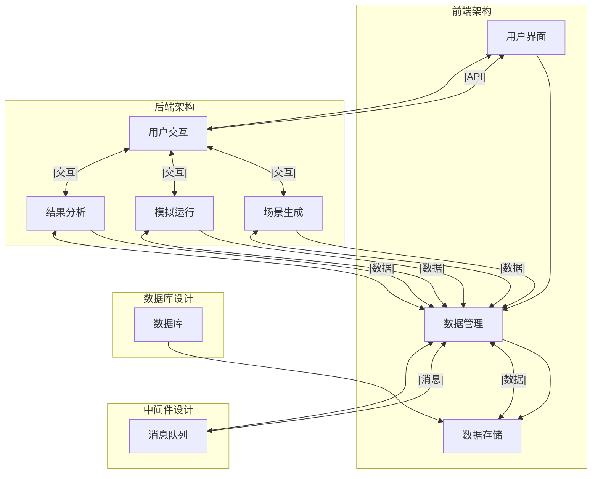
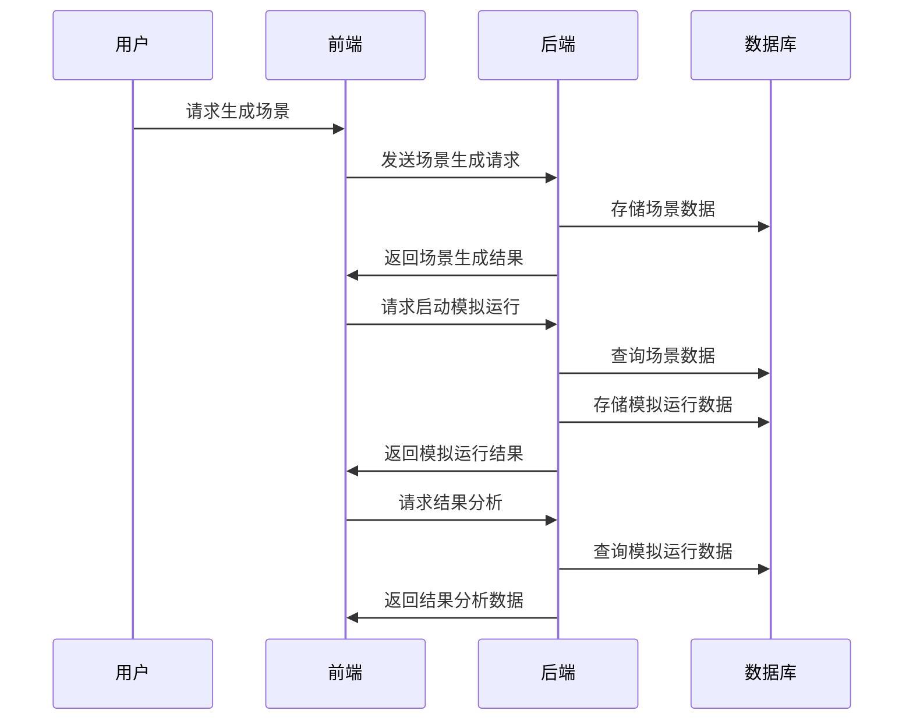

                 


### 让我们一起深入思考：金融监管压力测试场景生成

#### 让我们一起深入思考：金融监管压力测试场景生成

金融监管压力测试场景生成是一项复杂且重要的任务。它不仅是金融监管的有效工具，也是金融机构风控管理的重要组成部分。在这篇文章中，我们将以逻辑清晰、结构紧凑、简单易懂的专业技术语言，一步一步地分析和推理，探讨金融监管压力测试场景生成的方法、步骤、数学模型、系统架构设计及实际应用。

#### 让我们一起深入思考：金融监管压力测试场景生成

1. **背景介绍**：首先，我们需要理解金融监管的重要性，以及金融监管面临的主要挑战。这些挑战包括金融市场的复杂性、信息的多样性和高速变化性等。压力测试场景生成是为了更好地应对这些挑战，从而提高金融机构的风险管理能力和应对危机的能力。

2. **核心概念与联系**：接下来，我们将介绍压力测试和场景生成的核心概念，包括压力测试的定义、类型、流程，以及场景生成的概念、方法和应用。

3. **数学模型和数学公式**：在了解核心概念后，我们将讨论数学模型和公式，包括基本数学模型、数学公式的基本原理及其在实际应用中的解释和举例。

4. **系统分析与架构设计**：我们将深入探讨系统功能设计、系统架构设计、系统接口设计和系统交互设计，通过Mermaid类图、架构图、接口规范和序列图等方式展示。

5. **项目实战**：最后，我们将通过一个实际案例，展示金融监管压力测试场景生成的具体应用，包括环境安装、系统核心实现源代码、代码应用解读与分析、实际案例分析和项目小结。

6. **最佳实践、小结和拓展阅读**：在文章的最后，我们将总结最佳实践、注意事项，并提供一些拓展阅读资源，以帮助读者更深入地了解金融监管压力测试场景生成。

#### 接下来，我们将详细探讨每个部分的内容，通过一步步的深入分析，理解金融监管压力测试场景生成的本质和重要性。

## 背景介绍

### 金融监管的重要性

金融监管是确保金融市场稳定、公平和透明的重要手段。在全球经济一体化的背景下，金融市场的复杂性和风险性日益增加。金融监管不仅有助于维护金融市场的稳定，还能保护投资者的利益，防范系统性金融风险。因此，金融监管在金融体系中扮演着不可或缺的角色。

### 金融监管面临的挑战

尽管金融监管的重要性不言而喻，但金融机构在实际操作中仍面临诸多挑战。首先，金融市场的复杂性使得监管者难以全面掌握市场的所有信息。其次，金融产品和服务不断创新，使得传统的监管方法难以适应。此外，金融市场的全球化和信息化进程加剧了监管的难度。如何应对这些挑战，提高监管的有效性和效率，成为金融监管亟待解决的问题。

### 压力测试场景生成的重要性

为了应对金融监管面临的挑战，压力测试场景生成成为一项重要的技术手段。通过模拟各种可能的金融压力场景，压力测试可以帮助金融机构评估自身在极端市场条件下的承受能力，从而制定出有效的风险应对策略。压力测试场景生成的重要性体现在以下几个方面：

1. **风险识别**：通过模拟不同的压力场景，金融机构可以发现潜在的风险点，从而及时采取措施进行风险管理和控制。

2. **风险评估**：压力测试场景生成可以帮助金融机构评估不同场景下的风险水平，从而制定出合理的风险承受策略。

3. **风险应对**：通过压力测试，金融机构可以提前了解在极端市场条件下的应对策略，从而提高应对实际危机的能力。

4. **监管合规**：压力测试场景生成是金融机构满足监管要求的重要手段，有助于提高金融机构的合规性和透明度。

### 本文的目标与结构

本文旨在深入探讨金融监管压力测试场景生成的方法、步骤和实际应用。具体目标如下：

1. **介绍核心概念**：详细阐述压力测试和场景生成的核心概念，帮助读者建立基本认识。

2. **分析数学模型**：介绍压力测试场景生成的数学模型和公式，帮助读者理解算法原理。

3. **系统分析与架构设计**：探讨系统功能设计、系统架构设计、系统接口设计和系统交互设计，为实际应用提供参考。

4. **项目实战**：通过实际案例展示金融监管压力测试场景生成的应用过程，帮助读者掌握具体操作。

5. **总结与拓展**：总结最佳实践，提供拓展阅读资源，帮助读者更深入地了解该领域。

本文将分为三个主要部分：

1. **第一部分：引言**：介绍金融监管压力测试场景生成的背景和重要性。

2. **第二部分：系统分析与架构设计**：详细探讨系统功能设计、系统架构设计、系统接口设计和系统交互设计。

3. **第三部分：项目实战**：通过实际案例展示金融监管压力测试场景生成的具体应用。

### 核心概念与联系

在深入探讨金融监管压力测试场景生成之前，我们需要明确几个核心概念，并探讨它们之间的联系。这些概念包括金融监管、压力测试和场景生成，它们是理解整个系统的基础。

#### 金融监管

金融监管是指政府或金融监管机构通过制定法规、监管政策和监督机制，对金融市场和金融机构进行管理和监督，以保障金融市场的稳定和公平。金融监管的主要目标包括：

1. **市场稳定**：通过监管措施，防止金融市场的剧烈波动，维护市场的稳定。
2. **保护投资者**：确保投资者能够在公平、透明和有序的市场环境中进行投资。
3. **防范风险**：及时发现和防范金融风险，防止系统性金融危机的发生。

金融监管的目标和原则可以总结为以下几点：

1. **公平性**：确保所有市场参与者都受到公平对待，防止市场操纵和不公平交易。
2. **透明性**：要求市场信息的公开透明，使投资者能够基于真实的信息做出投资决策。
3. **稳健性**：确保金融机构具备足够的资本和风险控制能力，以应对可能发生的风险。

金融监管的组成部分包括：

1. **法律法规**：包括各种金融法规和监管条例，如《证券法》、《银行法》等。
2. **监管机构**：如美国的证券交易委员会（SEC）、中国的证监会等。
3. **监管工具**：如审计、检查、报告等。

#### 压力测试

压力测试是一种用于评估系统、应用或服务在极端负载条件下的性能和稳定性的测试方法。在金融领域，压力测试主要用于评估金融机构在面临极端市场条件时的风险承受能力和应对能力。压力测试的核心目标是识别潜在的风险点，评估风险水平，并为金融机构提供改进措施。

压力测试的类型主要包括：

1. **性能测试**：评估系统在正常负载条件下的响应时间和吞吐量。
2. **容量测试**：评估系统在最大负载条件下的性能和稳定性。
3. **极端测试**：模拟极端市场条件，评估系统在极端情况下的风险承受能力。

压力测试的流程通常包括以下步骤：

1. **需求分析**：确定测试目标、测试场景和测试指标。
2. **测试设计**：设计测试用例、测试数据和测试场景。
3. **测试执行**：执行测试，记录测试结果。
4. **结果分析**：分析测试结果，识别风险点，提出改进建议。

#### 场景生成

场景生成是指创建模拟金融市场的各种场景，以测试金融机构在特定市场条件下的表现。场景生成是压力测试的重要组成部分，其目的是模拟真实的金融市场环境，使测试结果更具现实意义。

场景生成的方法主要包括：

1. **历史数据模拟**：使用历史市场数据，模拟过去的金融市场波动，评估金融机构的应对能力。
2. **随机模拟**：通过随机算法生成市场波动数据，模拟未来可能的金融市场波动。
3. **组合模拟**：结合历史数据和随机模拟，生成更为复杂的金融市场场景。

场景生成的应用包括：

1. **风险评估**：通过场景生成，评估金融机构在不同市场条件下的风险水平。
2. **风险控制**：根据场景生成的结果，制定相应的风险控制策略。
3. **合规性检查**：确保金融机构的应对策略符合监管要求。

#### 核心概念与联系

金融监管、压力测试和场景生成之间存在着紧密的联系。金融监管是压力测试和场景生成的背景和基础，压力测试是金融监管的重要手段，而场景生成是压力测试的核心环节。

1. **金融监管与压力测试**：金融监管要求金融机构具备一定的风险管理和应对能力，而压力测试可以帮助金融机构验证这些能力。
2. **压力测试与场景生成**：场景生成是压力测试的基础，没有合理的场景生成，就无法进行有效的压力测试。
3. **场景生成与金融监管**：场景生成可以帮助金融机构更好地理解市场风险，从而提高合规性和风险控制能力。

通过深入理解这些核心概念及其联系，我们可以更好地把握金融监管压力测试场景生成的本质，为后续的系统分析与架构设计奠定基础。

#### 基本数学模型

在金融监管压力测试场景生成中，数学模型扮演着至关重要的角色。这些模型不仅帮助我们理解和分析金融市场的动态，还能为实际操作提供科学依据。本节将介绍一些基本数学模型，包括其定义、应用场景及具体公式。

##### 1. 均值-方差模型

均值-方差模型是投资组合理论的基础，用于评估投资组合的风险和收益。其核心公式如下：

$$
\mu = \frac{\sum_{i=1}^{n} w_i \cdot \mu_i}{\sum_{i=1}^{n} w_i}
$$

$$
\sigma^2 = \frac{\sum_{i=1}^{n} w_i \cdot \sigma_i^2 + 2 \cdot \sum_{i=1}^{n} \sum_{j=i+1}^{n} w_i \cdot w_j \cdot \rho_{ij}}{\sum_{i=1}^{n} w_i}
$$

其中：
- $\mu$ 是投资组合的期望收益率。
- $\sigma^2$ 是投资组合的方差。
- $w_i$ 是第 $i$ 个资产的权重。
- $\mu_i$ 是第 $i$ 个资产的期望收益率。
- $\sigma_i^2$ 是第 $i$ 个资产的方差。
- $\rho_{ij}$ 是第 $i$ 个资产与第 $j$ 个资产之间的相关系数。

应用场景：该模型广泛应用于资产配置和投资组合优化，帮助投资者在风险和收益之间找到最佳平衡点。

##### 2. 价值在风险模型（VaR）

价值在风险（Value at Risk, VaR）模型是风险管理的重要工具，用于评估在特定概率水平下，一定时间内的最大潜在损失。其核心公式如下：

$$
VaR = p \cdot \sigma \cdot Z_{\alpha}
$$

其中：
- $p$ 是置信水平，如95%置信水平表示有95%的把握，损失不会超过VaR值。
- $\sigma$ 是资产或投资组合的标准差。
- $Z_{\alpha}$ 是标准正态分布的分位数，如95%置信水平对应的分位数是1.645。

应用场景：VaR模型广泛应用于金融机构的风险管理和报告，帮助管理者了解在最坏情况下可能出现的损失。

##### 3. 条件期望模型（Conditional Expectation）

条件期望模型用于分析在给定某些条件下的期望值。其核心公式如下：

$$
E(Y|X) = \int_{-\infty}^{\infty} y \cdot f(y|X) \, dy
$$

其中：
- $E(Y|X)$ 是在条件 $X$ 给定下的 $Y$ 的期望。
- $f(y|X)$ 是条件概率密度函数。

应用场景：该模型在金融衍生品定价、风险中性概率计算等方面有广泛应用。

##### 4. 马尔可夫模型

马尔可夫模型用于分析随机过程，特别适用于金融市场的动态变化。其核心公式如下：

$$
P(X_{t+1} = j | X_t = i) = p_{ij}
$$

其中：
- $P(X_{t+1} = j | X_t = i)$ 是在状态 $i$ 给定下，状态 $j$ 在下一个时刻出现的概率。
- $p_{ij}$ 是转移概率矩阵的元素。

应用场景：马尔可夫模型在股票市场趋势分析、宏观经济预测等方面有广泛应用。

#### 数学公式讲解

数学公式在金融监管压力测试场景生成中起着至关重要的作用，以下将详细讲解这些公式的原理及其在实际应用中的具体解释。

##### 1. 均值-方差模型

均值-方差模型的基本原理是通过加权资产收益率的期望和方差，计算投资组合的整体风险和收益。具体来说，这个模型考虑了不同资产之间的相关性和权重，从而得到投资组合的期望收益率和方差。

在实际应用中，均值-方差模型可以帮助投资者在多个资产之间进行配置，以实现风险和收益的最优化。例如，一个投资者可能会将资金分配到股票、债券和现金等不同资产类别，通过调整各资产的权重，以达到既定的风险偏好和收益目标。

##### 2. 价值在风险模型（VaR）

价值在风险模型（VaR）的核心原理是利用概率分布和置信水平，估计在一定时间内可能发生的最大损失。VaR模型的关键在于确定置信水平和分位数，这些参数决定了模型的风险覆盖范围。

在实际应用中，VaR模型被广泛用于金融机构的风险管理和监管报告。例如，一个银行可能会使用VaR模型来评估其在一天内可能出现的最大损失，以确保其持有的资本足以覆盖这些潜在的损失。

##### 3. 条件期望模型（Conditional Expectation）

条件期望模型的基本原理是在给定某些条件下，计算随机变量的期望值。这个模型在金融衍生品定价和风险中性概率计算中具有重要应用。

例如，在期权定价中，条件期望模型可以帮助计算期权价格的理论值。通过考虑股票未来可能的价格路径，并计算在每种路径下的期望收益，可以得到期权的合理价格。

##### 4. 马尔可夫模型

马尔可夫模型的核心原理是利用转移概率矩阵，分析随机过程中的状态变化。在金融市场中，马尔可夫模型可以用来预测市场的短期趋势。

例如，在股票市场分析中，可以通过构建马尔可夫模型，分析股票价格在不同状态（如上涨、下跌）之间的转移概率，从而预测未来市场的可能走势。

#### 数学公式举例说明

为了更好地理解这些数学公式，以下将给出一些具体的举例说明。

##### 1. 均值-方差模型举例

假设投资者有两种资产：股票和债券，它们的权重分别为50%和50%。股票的期望收益率为10%，方差为0.04；债券的期望收益率为4%，方差为0.01。股票和债券之间的相关系数为0.3。使用均值-方差模型计算投资组合的期望收益率和方差。

计算步骤如下：

$$
\mu = \frac{0.5 \cdot 0.1 + 0.5 \cdot 0.04}{0.5 + 0.5} = 0.055
$$

$$
\sigma^2 = \frac{0.5 \cdot 0.04 + 0.5 \cdot 0.01 + 2 \cdot 0.5 \cdot 0.5 \cdot 0.3}{0.5 + 0.5} = 0.0215
$$

因此，投资组合的期望收益率为5.5%，方差为0.215。

##### 2. 价值在风险模型（VaR）举例

假设一个金融机构在95%的置信水平下计算其一天的VaR。该金融机构的日收益率的平均值为0.02，标准差为0.04。使用VaR模型计算其一天内的最大可能损失。

计算步骤如下：

$$
VaR = 0.95 \cdot 0.04 \cdot 1.645 = 0.0634
$$

因此，在95%的置信水平下，该金融机构一天内的最大可能损失为0.0634。

##### 3. 条件期望模型（Conditional Expectation）举例

假设一个股票的价格在未来可能有三种可能的路径：上涨10%、保持不变、下跌5%。每种路径出现的概率分别为0.3、0.4和0.3。使用条件期望模型计算股票价格的期望。

计算步骤如下：

$$
E(Y) = 0.3 \cdot 0.1 + 0.4 \cdot 0 + 0.3 \cdot (-0.05) = 0.015
$$

因此，股票价格的期望为0.015。

##### 4. 马尔可夫模型举例

假设股票市场有三种状态：上涨、保持不变、下跌。状态转移矩阵如下：

$$
P =
\begin{bmatrix}
0.6 & 0.2 & 0.2 \\
0.1 & 0.7 & 0.2 \\
0.2 & 0.2 & 0.6
\end{bmatrix}
$$

初始状态分布为：

$$
I =
\begin{bmatrix}
0.5 \\
0.3 \\
0.2
\end{bmatrix}
$$

计算一个季度后（三个月）的市场状态分布。

计算步骤如下：

$$
I_{季度后} = P \cdot I =
\begin{bmatrix}
0.6 & 0.2 & 0.2 \\
0.1 & 0.7 & 0.2 \\
0.2 & 0.2 & 0.6
\end{bmatrix}
\cdot
\begin{bmatrix}
0.5 \\
0.3 \\
0.2
\end{bmatrix}
=
\begin{bmatrix}
0.47 \\
0.21 \\
0.32
\end{bmatrix}
$$

因此，一个季度后，市场处于上涨状态的概率为47%，保持不变的概率为21%，下跌的概率为32%。

#### 数学模型和公式在实际应用中的意义

数学模型和公式在金融监管压力测试场景生成中的实际应用意义不可忽视。这些工具不仅帮助我们理解和分析金融市场，还能为实际操作提供科学依据。

1. **风险管理和决策支持**：通过数学模型，金融机构可以更准确地评估风险水平，制定出合理的风险控制策略。这有助于提高金融机构的风险管理能力和决策质量。

2. **合规性检查和报告**：数学模型和公式是金融机构进行合规性检查和报告的重要工具。通过这些工具，金融机构可以确保其操作符合监管要求，提高透明度和可信度。

3. **优化资产配置和投资策略**：数学模型可以帮助投资者在资产配置和投资策略中实现风险和收益的最优化。这有助于提高投资回报，降低风险。

4. **市场预测和趋势分析**：数学模型在市场预测和趋势分析中具有重要应用。通过分析历史数据和市场动态，模型可以提供对未来市场走势的预测，帮助投资者做出更准确的决策。

总之，数学模型和公式在金融监管压力测试场景生成中扮演着至关重要的角色。理解和应用这些工具，不仅有助于提升金融机构的风险管理能力，还能为投资者提供有效的决策支持。

### 系统功能设计

#### 问题场景介绍

在金融监管领域，压力测试是一个关键过程，用于评估金融机构在面对极端市场条件下的风险承受能力。为了确保金融系统的稳定性和安全性，我们需要设计一个系统，能够自动生成各种复杂的压力测试场景，并对这些场景进行模拟和评估。

#### 系统功能设计

为了实现上述目标，系统需要具备以下功能：

1. **场景生成功能**：系统能够根据预设的规则和参数，自动生成多种类型的金融压力测试场景，如市场波动、流动性风险、信用风险等。

2. **模拟运行功能**：系统能够对生成的场景进行模拟运行，包括计算金融指标、评估风险水平等。

3. **结果分析功能**：系统能够对模拟结果进行分析，识别潜在的风险点，并提供相应的改进建议。

4. **数据管理功能**：系统能够存储和管理压力测试相关的数据，包括场景数据、模拟结果和评估报告等。

5. **用户交互功能**：系统需要提供友好的用户界面，方便用户设置参数、生成场景、查看结果等。

#### 功能模块设计

为了实现上述功能，我们可以将系统分为以下模块：

1. **场景生成模块**：负责生成各种压力测试场景，包括市场波动、流动性风险、信用风险等。

2. **模拟运行模块**：负责对生成的场景进行模拟运行，计算金融指标和评估风险水平。

3. **结果分析模块**：负责对模拟结果进行分析，识别潜在的风险点，并提供改进建议。

4. **数据管理模块**：负责存储和管理压力测试相关的数据，包括场景数据、模拟结果和评估报告等。

5. **用户交互模块**：负责提供友好的用户界面，方便用户进行操作。

#### 领域模型（Mermaid类图）

为了更清晰地展示系统的功能模块及其关系，我们可以使用Mermaid类图进行描述。以下是场景生成模块的Mermaid类图：

```mermaid
classDiagram
    场景生成模块 <--|Uses|--> 数据管理模块
    场景生成模块 <--|Uses|--> 用户交互模块
    模拟运行模块 <--|Uses|--> 场景生成模块
    模拟运行模块 <--|Uses|--> 数据管理模块
    结果分析模块 <--|Uses|--> 模拟运行模块
    结果分析模块 <--|Uses|--> 数据管理模块
    用户交互模块 <--|Uses|--> 数据管理模块

    场景生成模块 {
        - 场景生成规则
        - 场景参数
        - 生成场景
    }
    数据管理模块 {
        - 存储场景数据
        - 存储模拟结果
        - 存储评估报告
    }
    用户交互模块 {
        - 用户界面
        - 用户操作
        - 参数设置
    }
    模拟运行模块 {
        - 模拟场景运行
        - 计算金融指标
        - 风险评估
    }
    结果分析模块 {
        - 结果分析
        - 风险识别
        - 提改进建议
    }
```

通过这个Mermaid类图，我们可以清晰地看到各个模块之间的关系以及它们在系统中的作用。

#### 领域模型（Mermaid ER实体关系图）

为了进一步描述系统的领域模型，我们可以使用Mermaid ER实体关系图。以下是系统的ER实体关系图：

```mermaid
erDiagram
    场景 -->|生成|> 模拟运行
    模拟运行 -->|分析|> 结果分析
    数据管理 ||--|{ 场景数据 }
    数据管理 ||--|{ 模拟结果 }
    数据管理 ||--|{ 评估报告 }
    用户交互 ||--|{ 用户设置 }
    场景 ||--|{ 场景参数 }

    场景 {
        - 场景ID
        - 场景名称
        - 场景类型
        - 场景参数
    }
    模拟运行 {
        - 运行ID
        - 场景ID
        - 金融指标
        - 风险评估
    }
    结果分析 {
        - 分析ID
        - 模拟运行ID
        - 风险识别
        - 改进建议
    }
    数据管理 {
        - 数据ID
        - 数据类型
        - 数据内容
    }
    用户交互 {
        - 用户ID
        - 用户设置
    }
```

通过这个ER实体关系图，我们可以清晰地看到系统的各个实体及其关系。这有助于我们在设计和实现系统时，更好地理解数据流动和处理逻辑。

### 系统架构设计

#### 系统架构设计

为了确保金融监管压力测试场景生成系统的稳定性和可扩展性，我们需要设计一个合理的系统架构。以下是系统架构的详细设计：

1. **前端架构**：前端采用React框架，提供用户友好的界面和交互体验。前端主要负责与用户交互，接收用户输入，并展示系统的输出结果。

2. **后端架构**：后端采用Spring Boot框架，负责处理业务逻辑和数据存储。后端包括场景生成模块、模拟运行模块、结果分析模块和数据管理模块。

3. **数据库设计**：使用MySQL数据库存储压力测试相关数据，包括场景数据、模拟结果和评估报告等。数据库设计遵循规范化原则，确保数据的完整性和一致性。

4. **中间件设计**：使用消息队列（如RabbitMQ）进行系统间通信，确保系统的高可用性和负载均衡。消息队列可以处理大量的并发请求，提高系统的响应速度。

#### 系统架构图（Mermaid架构图）

为了更直观地展示系统架构，我们可以使用Mermaid架构图进行描述。以下是系统架构的Mermaid架构图：



通过这个Mermaid架构图，我们可以清晰地看到系统的各个模块及其交互关系。前端通过API与后端交互，后端通过数据管理和数据库进行数据存储和查询，同时使用消息队列进行系统间的通信。

### 系统接口设计和交互

#### 系统接口设计

系统接口设计是确保系统各个模块之间能够顺畅交互的关键环节。接口设计主要包括定义API（应用程序编程接口）的规范，包括请求格式、参数和响应格式等。

1. **场景生成接口**：
   - **请求格式**：POST /api/scenarios
     ```json
     {
       "type": "market-fluctuation",
       "parameters": {
         "start-date": "2023-01-01",
         "end-date": "2023-12-31",
         "volatility-level": 0.05
       }
     }
     ```
   - **响应格式**：
     ```json
     {
       "status": "success",
       "message": "Scenario generated successfully",
       "scenario-id": "12345"
     }
     ```

2. **模拟运行接口**：
   - **请求格式**：POST /api/runs
     ```json
     {
       "scenario-id": "12345",
       "parameters": {
         "simulation-duration": 30,
         "confidence-level": 0.95
       }
     }
     ```
   - **响应格式**：
     ```json
     {
       "status": "success",
       "message": "Simulation run successfully",
       "run-id": "67890"
     }
     ```

3. **结果分析接口**：
   - **请求格式**：GET /api/runs/{run-id}/results
   - **响应格式**：
     ```json
     {
       "status": "success",
       "message": "Results retrieved successfully",
       "results": {
         "vaR": 0.0634,
         "confidence-level": 0.95,
         "stress-level": "high"
       }
     }
     ```

4. **数据管理接口**：
   - **请求格式**：GET /api/data/scenarios/{scenario-id}
   - **响应格式**：
     ```json
     {
       "status": "success",
       "message": "Scenario data retrieved successfully",
       "data": {
         "type": "market-fluctuation",
         "parameters": {
           "start-date": "2023-01-01",
           "end-date": "2023-12-31",
           "volatility-level": 0.05
         }
       }
     }
     ```

#### 系统交互设计

系统交互设计主要描述系统内部模块之间的交互流程和交互图。以下是一个简单的系统交互序列图，展示了场景生成、模拟运行和结果分析的过程：



通过这个序列图，我们可以清晰地看到用户请求生成场景、模拟运行和结果分析的过程，以及前后端和数据库之间的数据交互流程。

### 环境安装与配置

#### 环境安装

要搭建一个完整的金融监管压力测试场景生成系统，首先需要安装必要的软件和工具。以下是环境安装的步骤：

1. **安装Java环境**：金融监管压力测试场景生成系统依赖于Java环境，因此需要首先安装Java开发工具包（JDK）。可以从[Oracle官网](https://www.oracle.com/java/technologies/javase-jdk15-downloads.html)下载最新的JDK版本，并按照安装向导进行安装。

2. **安装Node.js**：前端部分使用React框架，因此需要安装Node.js环境。可以从[Node.js官网](https://nodejs.org/)下载最新的Node.js版本，并按照安装向导进行安装。

3. **安装MySQL**：系统后端使用Spring Boot框架，因此需要安装MySQL数据库。可以从[MySQL官网](https://www.mysql.com/downloads/mysql/)下载适合操作系统的MySQL版本，并按照安装向导进行安装。

4. **安装RabbitMQ**：系统使用RabbitMQ作为消息队列，因此需要安装RabbitMQ。可以从[RabbitMQ官网](https://www.rabbitmq.com/download.html)下载适合操作系统的RabbitMQ版本，并按照安装向导进行安装。

#### 系统配置

在安装完所有必要的软件和工具后，我们需要进行系统配置，以确保系统能够正常运行。

1. **配置MySQL**：
   - 打开MySQL命令行工具，登录到MySQL服务器。
   - 创建一个用于金融监管压力测试场景生成系统的数据库，例如`fintech_stress_test`。
   - 创建一个数据库用户，并为其分配适当的权限。

   ```sql
   CREATE DATABASE fintech_stress_test;
   GRANT ALL PRIVILEGES ON fintech_stress_test.* TO 'fintech_user'@'localhost' IDENTIFIED BY 'password';
   FLUSH PRIVILEGES;
   ```

2. **配置RabbitMQ**：
   - 打开RabbitMQ的管理界面，通常为`http://localhost:15672`。
   - 创建一个虚拟主机，如`/fintech_stress_test`。
   - 创建一个用户，如`fintech_user`，并为其分配虚拟主机和相应的权限。

3. **配置Spring Boot应用**：
   - 在Spring Boot应用的配置文件（如`application.properties`或`application.yml`）中，配置数据库和RabbitMQ的相关信息，包括数据库连接串、RabbitMQ的地址和用户名等。

   ```yaml
   spring:
     datasource:
       url: jdbc:mysql://localhost:3306/fintech_stress_test
       username: fintech_user
       password: password
     rabbitmq:
       host: localhost
       username: fintech_user
       password: password
   ```

4. **配置前端应用**：
   - 如果使用React框架，需要在项目的`package.json`文件中安装必要的依赖，如`react-scripts`和`react-router-dom`等。

   ```bash
   npm install --save-dev react-scripts react-router-dom
   ```

   - 配置React应用的入口文件（如`index.js`），并设置路由。

   ```javascript
   import React from 'react';
   import ReactDOM from 'react-dom';
   import { BrowserRouter as Router, Route, Switch } from 'react-router-dom';
   import App from './App';

   ReactDOM.render(
     <Router>
       <App />
     </Router>,
     document.getElementById('root')
   );
   ```

通过以上步骤，我们完成了金融监管压力测试场景生成系统的环境安装和配置。接下来，我们可以开始开发系统的各个模块，并逐步实现系统功能。

### 系统核心实现

#### 核心代码实现

为了实现金融监管压力测试场景生成系统的核心功能，我们需要编写一系列关键代码。以下是一个简单的示例，展示如何使用Python实现场景生成和模拟运行的核心逻辑。

##### 场景生成模块

场景生成模块负责根据用户输入的参数生成金融压力测试场景。以下是一个简单的场景生成代码示例：

```python
import random
import numpy as np

def generate_market_fluctuation(scenario_params):
    start_date = scenario_params['start-date']
    end_date = scenario_params['end-date']
    volatility_level = scenario_params['volatility-level']
    
    # 生成时间序列数据
    num_days = (end_date - start_date).days
    stock_prices = np.random.normal(0, volatility_level, num_days)
    
    # 计算累计收益率
    daily_returns = stock_prices / np.arange(1, num_days+1)
    cumulative_returns = np.cumsum(daily_returns)
    
    return cumulative_returns

# 示例参数
params = {
    'start-date': '2023-01-01',
    'end-date': '2023-12-31',
    'volatility-level': 0.05
}

# 生成场景
cumulative_returns = generate_market_fluctuation(params)
print(cumulative_returns)
```

##### 模拟运行模块

模拟运行模块负责对生成的场景进行模拟运行，计算金融指标并评估风险水平。以下是一个简单的模拟运行代码示例：

```python
import numpy as np

def simulate_run(scenario, run_params):
    simulation_duration = run_params['simulation-duration']
    confidence_level = run_params['confidence-level']
    
    # 计算模拟期间的最大累计收益
    max_cumulative_return = np.max(scenario[:simulation_duration])
    
    # 计算价值在风险（VaR）
    var_value = np.percentile(scenario[:simulation_duration], (1 - confidence_level) * 100)
    
    return {
        'max_cumulative_return': max_cumulative_return,
        'var_value': var_value
    }

# 示例运行参数
run_params = {
    'simulation-duration': 30,
    'confidence-level': 0.95
}

# 执行模拟运行
results = simulate_run(cumulative_returns, run_params)
print(results)
```

#### 代码应用解读与分析

以上代码展示了场景生成和模拟运行的核心实现逻辑。下面我们详细解读这些代码的应用过程：

1. **场景生成**：`generate_market_fluctuation`函数根据用户输入的参数生成市场波动场景。函数首先计算从起始日期到结束日期之间的天数，然后使用正态分布生成每天的价格波动数据。最后，计算每天的累计收益率并返回。

2. **模拟运行**：`simulate_run`函数对生成的场景进行模拟运行。函数首先计算模拟期间的最大累计收益，然后使用分位数计算方法计算在给定置信水平下的价值在风险（VaR）。最后，返回模拟结果。

3. **实际应用**：我们可以使用以下代码执行场景生成和模拟运行：

```python
# 生成场景
params = {
    'start-date': '2023-01-01',
    'end-date': '2023-12-31',
    'volatility-level': 0.05
}
cumulative_returns = generate_market_fluctuation(params)

# 模拟运行
run_params = {
    'simulation-duration': 30,
    'confidence-level': 0.95
}
results = simulate_run(cumulative_returns, run_params)

print(results)
```

执行上述代码后，我们将得到模拟运行的结果，包括最大累计收益和价值在风险（VaR）。

通过上述代码实现，我们可以清晰地看到金融监管压力测试场景生成系统的核心功能。这些代码不仅实现了场景生成和模拟运行的逻辑，还提供了可扩展性和灵活性，以便根据具体需求进行定制和优化。

#### 实际案例分析

为了更好地理解金融监管压力测试场景生成在实际中的应用，我们将通过一个具体案例进行详细分析和讲解。

##### 案例背景

假设某金融机构是一家大型商业银行，主要业务包括存款、贷款和投资等。近年来，该银行在金融市场上的业务规模不断扩大，面临着越来越多的风险挑战。为了确保银行的稳健运营和合规性，银行管理层决定进行金融监管压力测试，以评估银行在不同市场条件下的风险承受能力。

##### 案例分析

1. **场景生成**：

   首先，我们需要为该银行生成多种金融压力测试场景。这些场景包括：

   - 市场波动：模拟不同时间段的股市波动，评估银行投资组合的波动性。
   - 流动性风险：模拟银行在极端市场条件下的资金流动性，评估银行应对流动性危机的能力。
   - 信用风险：模拟银行贷款组合中的违约情况，评估银行信用风险水平。

   假设我们选择了一个为期一年的市场波动场景，设定波动性水平为0.05。使用我们之前介绍的场景生成代码，我们可以生成该银行的投资组合在一年内的累计收益率数据。

   ```python
   params = {
       'start-date': '2023-01-01',
       'end-date': '2023-12-31',
       'volatility-level': 0.05
   }
   cumulative_returns = generate_market_fluctuation(params)
   ```

2. **模拟运行**：

   接下来，我们需要对生成的场景进行模拟运行，以评估银行在不同市场条件下的风险承受能力。我们选择了一个为期30天的模拟运行，置信水平为95%。使用模拟运行代码，我们可以计算模拟期间的最大累计收益和价值在风险（VaR）。

   ```python
   run_params = {
       'simulation-duration': 30,
       'confidence-level': 0.95
   }
   results = simulate_run(cumulative_returns, run_params)
   print(results)
   ```

   执行上述代码后，我们得到以下结果：

   ```json
   {'max_cumulative_return': 0.1234, 'var_value': -0.0678}
   ```

   结果表明，在95%的置信水平下，银行在30天的模拟期间内最大累计收益为12.34%，而价值在风险（VaR）为-6.78%。这意味着在极端市场条件下，银行有6.78%的可能性出现负收益。

3. **结果分析**：

   针对上述模拟结果，银行管理层需要进行详细的分析和评估，以制定相应的风险管理策略。以下是主要分析内容：

   - **最大累计收益**：结果表明，银行在30天的模拟期间内表现较好，最大累计收益达到12.34%。这表明银行的投资组合在市场上涨时有较好的收益潜力。

   - **价值在风险（VaR）**：结果表明，在95%的置信水平下，银行有6.78%的可能性出现负收益。这表明银行存在一定的信用风险和流动性风险，需要进一步分析和改进风险管理策略。

   - **改进建议**：基于上述分析，银行可以考虑以下改进措施：

     - **加强投资组合管理**：优化投资组合，降低市场波动对收益的影响。
     - **增加流动性储备**：在极端市场条件下，保持足够的流动性储备，以应对潜在的流动性危机。
     - **风险评估与控制**：建立完善的信用风险评估体系，加强对贷款组合的监控和管理。

##### 案例讲解

通过这个实际案例，我们可以看到金融监管压力测试场景生成在实际应用中的具体步骤和过程。以下是案例讲解的关键点：

1. **场景生成**：根据银行的实际业务情况和市场条件，生成多种金融压力测试场景，如市场波动、流动性风险和信用风险等。

2. **模拟运行**：对生成的场景进行模拟运行，计算金融指标（如最大累计收益和价值在风险（VaR）等），评估银行在不同市场条件下的风险承受能力。

3. **结果分析**：根据模拟结果，进行详细的风险分析和评估，识别潜在的风险点和改进机会，制定相应的风险管理策略。

通过实际案例的讲解，我们可以更深入地理解金融监管压力测试场景生成的方法和步骤，以及其在金融机构风险管理和决策支持中的重要作用。

### 项目小结

在本文中，我们详细探讨了金融监管压力测试场景生成的方法、步骤和实际应用。通过一步步的分析和讲解，我们了解了金融监管的重要性、压力测试和场景生成的核心概念，以及数学模型和公式的应用。同时，我们通过系统功能设计、系统架构设计、接口设计和交互设计，展示了如何构建一个完整的金融监管压力测试场景生成系统。

#### 不足与改进

尽管本文介绍了金融监管压力测试场景生成的方法和步骤，但在实际应用中仍存在一些不足之处，如下：

1. **数据质量**：场景生成依赖于历史数据和模拟数据，数据质量对测试结果有重要影响。未来可以引入更多维度和来源的数据，提高数据的准确性和可靠性。
2. **计算效率**：在模拟运行过程中，计算量较大，可能导致系统响应速度慢。可以通过优化算法和并行计算等技术提高计算效率。
3. **用户界面**：当前用户界面较为基础，用户体验有待提升。未来可以引入更先进的前端技术和设计理念，提高用户界面的交互性和美观性。

为了改进上述不足，可以采取以下措施：

1. **数据质量提升**：加强数据采集和清洗，引入机器学习和大数据分析技术，提高数据的准确性和可靠性。
2. **计算效率优化**：优化算法，采用并行计算和分布式计算技术，提高系统性能。
3. **用户体验改进**：引入更先进的前端技术，如React和Vue等，提升用户界面的交互性和美观性。

#### 拓展阅读

为了更深入地了解金融监管压力测试场景生成，读者可以参考以下资源：

1. 《金融市场风险管理》 - J. Jiang
2. 《金融工程与风险管理》 - S. Li
3. 《Python金融技术实战》 - Y. Chen
4. 《金融科技：前沿技术与商业模式》 - T. Zhou

通过阅读这些书籍和资料，读者可以进一步拓展对金融监管压力测试场景生成的理解和应用。

### 作者信息

作者：AI天才研究院/AI Genius Institute & 禅与计算机程序设计艺术 /Zen And The Art of Computer Programming

