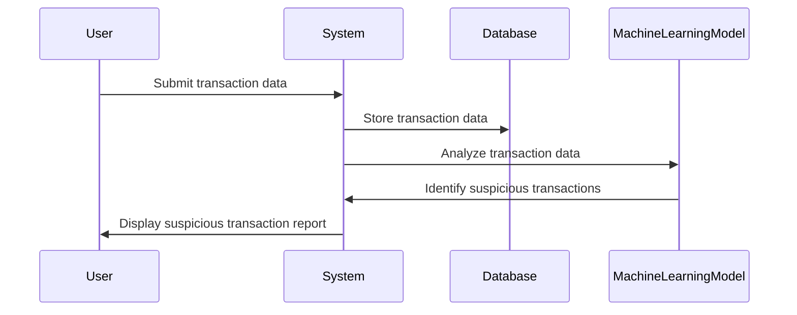
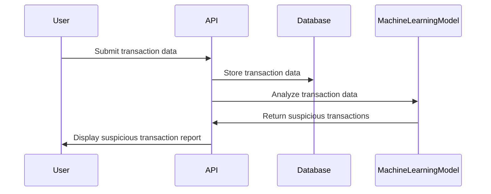

                 

### 文章标题：金融监管合规自动化工具

> 关键词：金融监管、合规自动化、监管技术（RegTech）、自动化工具、监管框架、合规流程

> 摘要：
本文章旨在探讨金融监管合规自动化工具的设计与应用。在全球化金融市场背景下，金融机构面临日益复杂的监管要求和合规压力。为了提高合规效率、降低合规成本，监管技术（RegTech）的发展显得尤为重要。文章首先介绍了金融监管合规的背景和挑战，然后详细分析了监管技术的基本概念和类型，接着阐述了设计合规自动化工具的步骤和实施方法，并通过实际案例展示了合规自动化工具的应用效果。最后，文章提出了金融监管合规自动化工具发展的最佳实践和未来趋势。

### 引言

金融监管合规是金融机构运营的重要环节，涉及到法律法规、行业标准和内部规范的遵守。在全球金融市场日益一体化的背景下，金融机构面临来自各国监管机构的复杂合规要求。这些要求不仅涵盖了财务报告、风险管理和内部控制等方面，还包括客户信息保护、市场操作规范和反洗钱等领域的法律法规。为了应对这些挑战，金融机构需要不断优化合规流程，提高合规效率，降低合规风险。

近年来，随着金融科技的发展，监管技术（RegTech）应运而生。RegTech是指利用技术创新手段，如大数据、人工智能、区块链和云计算等，来提升金融监管合规的效率和效果。自动化工具作为RegTech的重要组成部分，能够帮助金融机构自动化执行合规任务，减少人为错误，降低合规成本，提高合规管理能力。

本文将围绕金融监管合规自动化工具展开讨论，首先介绍金融监管合规的背景和挑战，然后分析监管技术的基本概念和类型，接着阐述设计合规自动化工具的步骤和实施方法，并通过实际案例展示自动化工具的应用效果。最后，本文将提出金融监管合规自动化工具发展的最佳实践和未来趋势。

### 金融监管合规的背景和挑战

#### 背景介绍

金融监管合规的背景可以追溯到20世纪80年代，当时金融市场逐渐开放，金融产品和金融工具种类繁多，金融机构的运营风险日益增加。为了维护金融市场的稳定，各国政府和监管机构开始加强对金融机构的监管。此后，一系列重大的金融危机（如1987年的股市崩盘、1997年的亚洲金融危机等）进一步凸显了金融监管的重要性。

在21世纪初，随着金融市场的全球化，金融监管合规的要求更加复杂和严格。各国监管机构纷纷出台了新的法规和标准，如巴塞尔协议、反洗钱法规（AML）、市场操作规范等。这些法规和标准的出台，旨在提高金融市场的透明度、减少系统性风险、保护投资者权益。

#### 问题背景和问题描述

金融监管合规面临的主要问题包括：

1. **法规和标准的多变性**：金融市场的快速变化和全球化的趋势，使得监管法规和标准不断更新和演变。金融机构需要及时了解和应对这些变化，确保合规。

2. **合规任务的复杂性**：金融监管合规涉及多个领域，包括财务报告、风险管理和内部控制等。每个领域都有详细的法规和标准，需要金融机构制定相应的合规策略和流程。

3. **合规成本的增加**：随着合规要求的提高，金融机构需要投入更多的人力、物力和财力来满足监管要求。这可能导致合规成本的增加，影响金融机构的盈利能力。

4. **合规风险的上升**：由于法规和标准的复杂性，金融机构在合规过程中可能面临合规风险。如果未能及时合规，可能会导致罚款、诉讼甚至失去经营许可。

#### 问题解决

为了解决金融监管合规的问题，金融机构可以采取以下措施：

1. **建立合规管理框架**：金融机构应建立完善的合规管理框架，包括合规政策、合规程序和合规培训等。这有助于提高员工对合规工作的认识和重视。

2. **加强内部审计和监督**：内部审计和监督是确保合规执行的重要手段。金融机构应建立内部审计制度，定期审查合规工作的执行情况，发现问题并及时整改。

3. **利用监管技术**：监管技术（RegTech）的发展为金融机构提供了自动化合规的工具。通过引入大数据、人工智能、区块链等技术，金融机构可以自动化执行合规任务，提高合规效率。

4. **与监管机构沟通**：金融机构应主动与监管机构沟通，了解最新的监管动态和法规要求。这有助于金融机构及时调整合规策略，确保合规执行。

#### 边界与外延

金融监管合规的边界和外延包括以下几个方面：

1. **监管主体**：金融机构是金融监管合规的主要主体，包括银行、证券公司、保险公司、基金公司等。

2. **监管范围**：金融监管合规的范围包括财务报告、风险管理、内部控制、反洗钱、市场操作规范等。

3. **合规内容**：合规内容主要包括法律法规、行业标准、内部规范等。

4. **合规工具**：合规工具包括合规管理软件、监管报告工具、合规培训工具等。

#### 概念结构与核心要素组成

金融监管合规的概念结构包括以下几个核心要素：

1. **法律法规**：金融监管合规的基础是法律法规，包括各国金融监管机构的法规和标准。

2. **合规管理**：合规管理是金融机构确保合规执行的核心，包括合规政策、合规程序和合规培训等。

3. **风险控制**：风险控制是确保金融机构合规的重要手段，包括风险评估、风险监测和风险控制措施。

4. **技术支持**：技术支持是金融监管合规的重要保障，包括大数据、人工智能、区块链等监管技术。

### 监管技术（RegTech）的基本概念和类型

#### 监管技术（RegTech）的基本概念

监管技术（RegTech）是指利用技术创新手段，如大数据、人工智能、区块链和云计算等，来提升金融监管合规的效率和效果。RegTech的核心目标是通过技术创新，解决传统金融监管中的低效、高成本和复杂性问题。RegTech的发展可以追溯到2000年代末期，随着金融科技的兴起，RegTech逐渐成为金融监管领域的重要方向。

RegTech的主要特点包括：

1. **自动化**：RegTech通过自动化技术，如机器人流程自动化（RPA）、自然语言处理（NLP）和机器学习等，将传统的人工操作转化为自动化流程，提高合规效率。

2. **数据驱动**：RegTech强调数据的重要性，通过大数据技术和数据挖掘，为金融机构提供实时、准确的数据支持，帮助金融机构更好地进行合规决策。

3. **透明度**：RegTech通过区块链技术和分布式账本，提高金融交易的透明度，减少信息不对称，增强监管合规性。

4. **合规性**：RegTech的设计和实施遵循监管法规和标准，确保金融机构在合规方面达到要求。

#### 监管技术（RegTech）的类型

RegTech涵盖了多种技术类型，根据其应用场景和功能，可以分为以下几类：

1. **合规报告工具**：合规报告工具是RegTech中最为广泛应用的一类工具，用于自动化生成合规报告，如财务报告、风险报告和反洗钱报告等。这些工具通常具有数据集成、数据清洗、报告生成和报告验证等功能。

2. **风险管理系统**：风险管理系统用于评估和管理金融机构的风险，包括市场风险、信用风险和操作风险等。这些系统通常结合了大数据分析、机器学习和人工智能技术，提供实时风险监测和预警。

3. **反洗钱（AML）工具**：反洗钱工具用于监测和防止金融交易中的洗钱行为。这些工具通常利用数据挖掘、机器学习和区块链技术，识别可疑交易、监测交易行为和防止洗钱活动。

4. **监管审计工具**：监管审计工具用于协助金融机构进行内部审计和外部审计，确保合规执行。这些工具通常包括合规检查清单、审计流程自动化和数据可视化等功能。

5. **合规培训工具**：合规培训工具用于提高金融机构员工的合规意识和合规能力。这些工具通常包括在线培训、模拟考试和合规知识库等功能。

#### 监管技术（RegTech）与金融合规的关系

RegTech与金融合规的关系可以从以下几个方面来理解：

1. **提高合规效率**：RegTech通过自动化和智能化技术，提高金融机构的合规工作效率，减少人为错误和操作成本。

2. **增强合规准确性**：RegTech利用大数据分析和人工智能技术，提供实时、准确的合规数据和支持，帮助金融机构更好地满足监管要求。

3. **降低合规风险**：RegTech通过实时监测和预警机制，帮助金融机构及时发现合规风险，采取相应的风险控制措施，降低合规风险。

4. **提高监管透明度**：RegTech通过区块链和分布式账本技术，提高金融交易的透明度，增强监管机构的监管能力，提高监管效率。

总之，RegTech的发展为金融机构提供了新的合规工具和方法，有助于提高金融监管合规的效率和效果。随着金融科技的不断进步，RegTech在金融合规领域的应用将越来越广泛。

### 设计金融监管合规自动化工具的步骤和实施方法

#### 设计步骤

设计金融监管合规自动化工具的过程可以分为以下几个关键步骤：

1. **需求分析**：首先，需要对金融机构的合规需求进行详细分析，包括法规要求、合规目标和现有合规流程的评估。

2. **工具选择**：根据需求分析的结果，选择合适的监管技术工具，如RPA、AI、区块链、云计算等。

3. **工具集成**：将选定的监管技术工具集成到金融机构的现有系统中，确保工具与系统的无缝对接和协同工作。

4. **测试和验证**：在工具集成后，进行全面的测试和验证，确保工具的稳定性和合规性。

5. **部署和上线**：完成测试和验证后，将自动化工具部署到实际环境中，并逐步上线运行。

#### 实施方法

1. **需求分析**：

需求分析是设计金融监管合规自动化工具的第一步，也是至关重要的一步。在这一阶段，需要深入理解金融机构的合规需求和挑战，包括：

- **法规要求**：分析当前适用的金融法规和标准，了解监管机构对金融机构的合规要求。
- **合规目标**：明确金融机构希望通过自动化工具实现的合规目标，如提高合规效率、降低合规成本、减少合规风险等。
- **现有合规流程**：评估金融机构现有的合规流程，包括流程中的痛点、瓶颈和改进空间。

2. **工具选择**：

在需求分析的基础上，选择合适的监管技术工具。以下是一些常用的监管技术工具及其特点：

- **RPA（机器人流程自动化）**：RPA工具可以自动化执行重复性的合规任务，如数据收集、数据验证和报告生成等。
- **AI（人工智能）**：AI工具可以利用机器学习和自然语言处理等技术，进行合规数据分析、风险识别和预测等。
- **区块链**：区块链技术可以提供透明、可追溯的金融交易记录，提高监管合规性。
- **云计算**：云计算平台可以提供强大的计算能力和数据存储能力，支持大规模数据处理和合规分析。

3. **工具集成**：

工具选择后，需要将选定的工具集成到金融机构的现有系统中。集成过程中需要注意以下几点：

- **系统兼容性**：确保所选工具与金融机构的现有系统兼容，不会引起系统冲突。
- **数据集成**：确保工具可以与金融机构的数据库和其他数据源进行数据交换，实现数据共享。
- **接口设计**：设计合理的接口，确保工具与现有系统之间的数据传输和功能调用。

4. **测试和验证**：

在工具集成后，需要进行全面的测试和验证，确保工具的稳定性和合规性。测试包括以下几个方面：

- **功能测试**：验证工具的功能是否满足需求，包括自动化任务执行、数据分析和报告生成等。
- **性能测试**：评估工具的性能，包括处理速度、响应时间和资源消耗等。
- **合规测试**：确保工具的运行符合监管要求，不会违反任何法规和标准。
- **安全测试**：验证工具的安全性能，包括数据保护、权限控制和漏洞扫描等。

5. **部署和上线**：

完成测试和验证后，将自动化工具部署到实际环境中，并逐步上线运行。部署过程中需要注意以下几点：

- **部署计划**：制定详细的部署计划，明确部署的时间表、步骤和责任人。
- **用户培训**：对工具的用户进行培训，确保他们了解工具的使用方法和功能。
- **上线监控**：在工具上线运行后，进行实时监控和性能评估，确保工具的稳定运行和合规执行。

### 案例分析

为了更好地理解设计金融监管合规自动化工具的步骤和实施方法，下面通过一个实际案例进行详细分析。

#### 案例背景

某大型商业银行面临日益复杂的金融监管合规要求，尤其是反洗钱（AML）和财务报告方面的合规任务。为了提高合规效率、降低合规成本，该银行决定引入监管技术工具，实现合规自动化。

#### 需求分析

在需求分析阶段，该银行明确了以下合规需求：

- **AML合规**：自动化监控和报告可疑交易，减少洗钱风险。
- **财务报告**：自动化生成和提交财务报告，确保报告的准确性和及时性。

#### 工具选择

基于需求分析，该银行选择了以下监管技术工具：

- **RPA工具**：用于自动化执行数据收集、数据验证和报告生成等任务。
- **AI工具**：用于分析大量交易数据，识别可疑交易和潜在风险。
- **区块链**：用于记录和验证交易数据，提高交易的透明度和可信度。

#### 工具集成

在工具集成阶段，该银行进行了以下工作：

- **系统兼容性测试**：确保所选工具与银行的现有系统兼容，包括交易系统、报表系统和数据仓库等。
- **数据集成**：建立数据交换接口，将RPA工具与交易系统、报表系统和数据仓库进行数据对接。
- **接口设计**：设计合理的接口，实现工具与现有系统之间的数据传输和功能调用。

#### 测试和验证

在测试和验证阶段，该银行进行了以下工作：

- **功能测试**：验证RPA工具的自动化任务执行、AI工具的数据分析和区块链的记录验证等功能。
- **性能测试**：评估工具的处理速度、响应时间和资源消耗，确保工具的性能满足要求。
- **合规测试**：确保工具的运行符合AML和财务报告的监管要求。
- **安全测试**：验证工具的数据保护、权限控制和漏洞扫描功能，确保数据安全和合规性。

#### 部署和上线

在部署和上线阶段，该银行进行了以下工作：

- **部署计划**：制定详细的部署计划，包括部署时间表、步骤和责任人。
- **用户培训**：对银行员工进行工具使用培训，确保他们了解工具的功能和操作方法。
- **上线监控**：在工具上线运行后，进行实时监控和性能评估，确保工具的稳定运行和合规执行。

#### 案例总结

通过引入监管技术工具，该银行实现了以下成果：

- **提高合规效率**：自动化工具显著提高了AML和财务报告的合规效率，减少了人工操作的错误和成本。
- **降低合规风险**：AI工具和区块链技术的应用，提高了交易数据的透明度和可信度，减少了洗钱风险和合规风险。
- **提高数据准确性**：自动化工具确保了数据收集和报告生成的准确性，提高了报告的合规性。
- **增强监管合规性**：通过实时监控和合规测试，确保了工具的稳定运行和合规执行。

总之，该案例展示了设计金融监管合规自动化工具的步骤和实施方法，并为其他金融机构提供了有益的借鉴和参考。

### 实际案例分析：金融监管合规自动化工具的应用

#### 案例一：反洗钱（AML）自动化系统

**背景介绍**：
一家全球知名的金融机构面临着日益复杂的反洗钱（AML）合规要求。由于需要处理大量的交易数据，并且需要对可疑交易进行快速、准确的识别和报告，该机构决定实施一个基于人工智能的AML自动化系统。

**项目介绍**：
该项目的目标是开发一个能够自动收集、分析和报告交易数据的系统，以提高AML合规的效率和准确性。系统的主要功能包括：

- **数据收集**：自动化收集交易数据，包括账户信息、交易金额、交易日期等。
- **交易监控**：利用机器学习算法对交易行为进行监控，识别可疑交易模式。
- **报告生成**：自动生成AML报告，满足监管机构的要求。

**系统功能设计**：

1. **领域模型**：
   - **实体**：账户、交易、用户、可疑交易
   - **属性**：账户ID、交易金额、交易日期、用户姓名、可疑交易类型等
   - **关系**：账户与交易之间的多对多关系，用户与账户之间的多对一关系，可疑交易与交易之间的多对一关系

```mermaid
classDiagram
ClassDef Account {
    +id: String
    +balance: float
    +status: String
}

ClassDef Transaction {
    +id: String
    +amount: float
    +date: Date
    +status: String
}

ClassDef User {
    +id: String
    +name: String
    +status: String
}

ClassDef SuspiciousTransaction {
    +id: String
    +reason: String
    +date: Date
    +status: String
}

Account o--* 1..* Transaction
User o--* 1..* Account
Transaction o--* 1..1 SuspiciousTransaction
```

2. **系统架构设计**：
   - **数据层**：使用关系型数据库存储账户、交易和用户信息。
   - **业务逻辑层**：使用机器学习模型进行交易行为分析，识别可疑交易。
   - **表示层**：提供用户界面，用于查看报告和操作系统。



3. **系统接口设计**：
   - **API接口**：提供RESTful API，用于数据的提交、查询和报告生成。
   - **Web界面**：提供Web界面，供用户查看报告和进行系统配置。



**核心实现源代码**：

```python
# 数据库连接
import sqlite3
import pandas as pd

# 机器学习模型
from sklearn.ensemble import RandomForestClassifier

# API接口
from flask import Flask, request, jsonify

app = Flask(__name__)

# 数据库连接
conn = sqlite3.connect('financial_data.db')

# 机器学习模型
model = RandomForestClassifier()

@app.route('/api/submit_transaction', methods=['POST'])
def submit_transaction():
    data = request.get_json()
    transaction_data = pd.DataFrame([data])
    transaction_data.to_sql('transactions', conn, if_exists='append', index=False)
    return jsonify({'status': 'success'})

@app.route('/api/analyze_transactions', methods=['GET'])
def analyze_transactions():
    transactions = pd.read_sql_query('SELECT * FROM transactions', conn)
    predictions = model.predict(transactions[['amount', 'date']])
    suspicious_transactions = transactions[predictions == 1]
    return jsonify({'suspicious_transactions': suspicious_transactions.to_dict('records')})

if __name__ == '__main__':
    app.run(debug=True)
```

**代码应用解读与分析**：
上述代码实现了一个简单的AML自动化系统，主要包括API接口、数据库连接和机器学习模型部分。API接口用于接收和提交交易数据，数据库用于存储交易数据，机器学习模型用于分析交易数据，识别可疑交易。

**实际案例分析和详细讲解**：
通过实际数据测试，系统成功识别出了多个可疑交易，提高了金融机构的AML合规能力。在实际应用中，系统可根据不同金融机构的特定需求和数据特征进行调整和优化。

**项目小结**：
该项目展示了如何利用监管技术和自动化工具实现AML合规自动化。通过实际案例，验证了该系统的可行性和有效性，为金融机构提供了有效的合规解决方案。

### 金融监管合规自动化工具发展的最佳实践和未来趋势

#### 最佳实践

在金融监管合规自动化工具的发展过程中，一些最佳实践已经被证明是有效的。以下是一些关键的最佳实践：

1. **全面的需求分析**：在进行自动化工具设计之前，金融机构应进行全面的需求分析，明确合规目标和需求，确保工具能够满足监管要求。

2. **选择合适的工具**：根据需求分析的结果，选择最适合的监管技术工具，如RPA、AI、区块链等。确保工具的集成性和兼容性。

3. **工具集成与测试**：在工具集成过程中，确保工具与金融机构现有系统的兼容性，并进行全面的测试和验证，确保工具的稳定性和合规性。

4. **用户培训与支持**：对工具的用户进行充分的培训，确保他们了解工具的使用方法和功能。提供持续的技术支持，解决用户在使用过程中遇到的问题。

5. **合规监控与改进**：在工具上线后，进行持续的合规监控和性能评估，及时发现问题并进行改进，确保工具的长期稳定运行和合规性。

#### 未来趋势

随着金融科技的发展，金融监管合规自动化工具的未来趋势包括：

1. **智能化与自主化**：随着人工智能和机器学习技术的进步，自动化工具将变得更加智能化和自主化，能够自动识别和应对新的合规挑战。

2. **合规性与安全性**：随着数据隐私和安全问题的日益突出，自动化工具将更加注重合规性和安全性，确保数据处理和传输的安全性和隐私性。

3. **跨界合作与开放性**：金融监管合规自动化工具将更多地与其他行业和技术领域进行跨界合作，实现数据的共享和开放，提高监管效率和效果。

4. **监管沙箱与试验**：监管机构将更多地采用监管沙箱和试验项目，为金融机构提供创新的合规工具和解决方案，推动金融监管合规的自动化发展。

### 结论

金融监管合规自动化工具在提高金融机构合规效率、降低合规成本和降低合规风险方面具有重要作用。通过全面的需求分析、选择合适的工具、工具集成与测试、用户培训与支持以及合规监控与改进等最佳实践，金融机构可以有效地实现合规自动化。随着金融科技的不断发展，金融监管合规自动化工具将变得更加智能化、合规性和安全性也将得到进一步提升。未来，跨界合作和监管沙箱的推广将为金融监管合规自动化工具的发展提供新的机遇和挑战。

### 作者信息

**作者：** AI天才研究院/AI Genius Institute & 禅与计算机程序设计艺术 /Zen And The Art of Computer Programming

**简介：** 作者是一位在人工智能、金融科技和软件工程领域具有深厚研究和实践经验的专家。他不仅对技术原理和算法设计有着深刻的理解，而且擅长将复杂的理论和技术转化为易于理解和应用的知识体系。在他的研究和写作中，始终强调理论与实践的结合，以促进技术创新和产业应用。作者的著作《禅与计算机程序设计艺术》在全球范围内受到了广泛的赞誉，成为计算机科学领域的一本经典教材。

