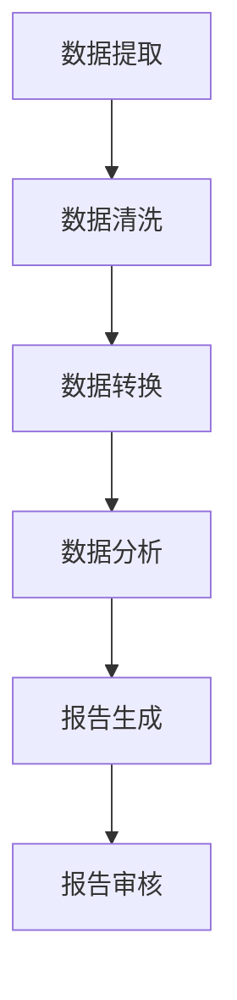
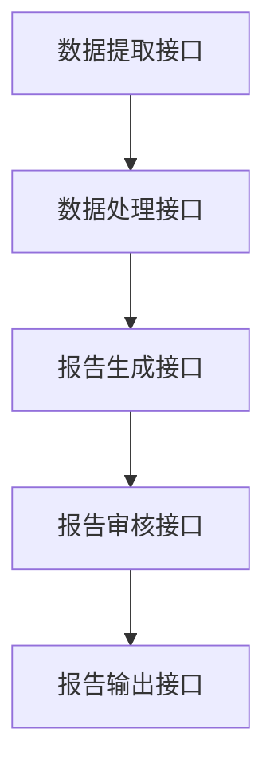
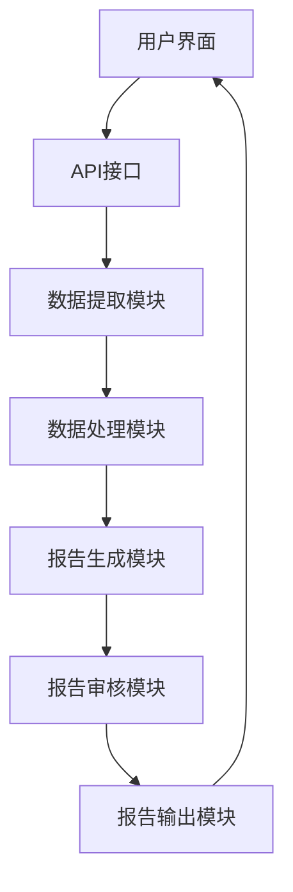

                 

# 金融监管报告自动化生成工具

## 关键词
- 金融监管报告
- 自动化
- 报告生成
- 技术实现
- 人工智能
- 数据处理

## 摘要
本文旨在探讨金融监管报告自动化生成工具的开发与应用。随着金融行业的不断发展和监管要求的日益复杂，传统的手工报告生成方式已经难以满足市场需求。本文将首先介绍金融监管报告的背景和重要性，然后分析自动化生成工具的关键技术，包括数据提取、数据处理和自然语言处理。接着，我们将详细阐述自动化生成工具的系统设计、实现和整合方法，并通过实际案例展示其应用效果。最后，我们将探讨金融监管报告自动化工具的未来发展趋势和机会。

## 引言

### 金融监管报告概述
金融监管报告是金融机构根据监管要求定期提交的一系列报告，用于展示其财务状况、业务运营和风险状况。这些报告对于金融监管机构了解金融机构的运营情况、评估其合规性以及监测市场风险至关重要。

### 监管报告的重要性
金融监管报告的重要性体现在以下几个方面：

1. **合规性**：金融机构必须按照监管要求提交报告，否则将面临处罚。
2. **透明性**：报告公开了金融机构的运营和财务状况，增加了市场透明度。
3. **风险监测**：监管机构通过分析报告中的数据，可以及时发现和应对潜在风险。
4. **投资者信心**：完整的监管报告有助于增强投资者对金融机构的信任。

### 问题的提出
尽管金融监管报告的重要性不言而喻，但传统的手工报告生成方式存在以下问题：

1. **效率低下**：报告生成过程繁琐，耗时较长。
2. **准确性问题**：手工操作容易出错，影响报告的准确性。
3. **人力资源成本**：大量人力资源投入，增加了运营成本。
4. **技术瓶颈**：手工报告难以适应日益复杂的监管要求。

### 自动化生成工具的需求
为了解决上述问题，金融机构对自动化生成工具的需求日益迫切。自动化生成工具不仅可以提高报告生成的效率，减少人力成本，还可以确保报告的准确性和一致性。此外，随着人工智能和大数据技术的发展，自动化生成工具有望进一步优化和提升报告质量。

## 核心概念和框架

### 金融监管报告概述
金融监管报告主要包括以下几类：

1. **财务报告**：如资产负债表、利润表和现金流量表等。
2. **业务报告**：如业务运营报告、风险管理报告和内部控制报告等。
3. **合规报告**：如合规性审查报告、反洗钱报告和反欺诈报告等。

### 监管要求
不同国家和地区的监管机构对金融监管报告的要求有所不同，但通常包括以下方面：

1. **报告格式**：规定报告的样式和结构，如表格、图表和文字描述等。
2. **报告内容**：规定报告需要包含的信息，如财务数据、业务数据和风险数据等。
3. **提交时间**：规定报告的提交周期和截止时间。
4. **合规性**：要求报告必须真实、准确和完整。

### 报告生成流程
金融监管报告的生成通常包括以下几个步骤：

1. **数据收集**：从各个业务系统收集相关的数据。
2. **数据处理**：对收集到的数据进行分析、清洗和转换。
3. **报告生成**：根据数据处理结果生成报告。
4. **报告审核**：对生成的报告进行审核和修正。
5. **报告提交**：将审核后的报告提交给监管机构。

### 报告生成工具的核心功能
金融监管报告自动化生成工具的核心功能包括：

1. **数据提取**：从各个业务系统中提取所需的数据。
2. **数据处理**：对提取的数据进行清洗、转换和分析。
3. **报告模板设计**：设计报告的模板，包括表格、图表和文字描述等。
4. **报告生成**：根据模板和数据生成完整的报告。
5. **报告审核**：对生成的报告进行自动审核，确保其准确性和完整性。

## 自动化技术的讨论

### 数据提取
数据提取是自动化生成工具的第一步，其目标是收集所有必要的数据。数据来源可能包括企业的数据库、电子表格、外部API以及其他数据存储系统。为了高效地提取数据，自动化工具需要使用各种技术，如数据库连接、API调用和电子表格解析。

1. **数据库连接**：使用SQL查询或JDBC等技术连接企业的数据库，提取所需数据。
2. **API调用**：通过RESTful API或SOAP API等方式从外部系统提取数据。
3. **电子表格解析**：使用如Apache POI或OpenXML等技术解析电子表格文件，提取数据。

### 数据处理
数据提取后，需要经过一系列处理步骤，以确保数据的准确性、一致性和完整性。数据处理可能包括以下任务：

1. **数据清洗**：删除重复记录、纠正错误和填补缺失值。
2. **数据转换**：将数据转换成所需格式，如将文本数据转换为数值数据。
3. **数据分析**：对数据进行分析，提取有用的信息。
4. **数据整合**：将来自不同来源的数据整合在一起。

### 自然语言处理
自然语言处理（NLP）是自动化生成工具的重要组成部分，它使计算机能够理解、处理和生成自然语言文本。在金融监管报告中，NLP可以用于以下任务：

1. **文本解析**：从文本中提取关键信息，如财务指标、业务描述和合规声明等。
2. **文本生成**：根据提取的信息生成完整的报告文本。
3. **文本审核**：对生成的文本进行审核，确保其准确性和合规性。

### 机器学习和人工智能
机器学习和人工智能技术在自动化生成工具中发挥着重要作用。以下是一些关键应用：

1. **模式识别**：使用机器学习算法识别数据中的模式，用于预测和分类。
2. **自动化决策**：基于历史数据和模型，自动化生成报告中的决策部分。
3. **文本生成**：使用生成对抗网络（GAN）和自动编码器等模型生成报告文本。
4. **智能审核**：使用深度学习模型对报告进行智能审核，识别潜在的错误和风险。

### 技术挑战
在实现自动化生成工具时，以下技术挑战需要考虑：

1. **数据质量和一致性**：确保数据的高质量和一致性，是自动化的基础。
2. **性能优化**：自动化工具需要处理大量数据，因此性能优化至关重要。
3. **合规性和安全性**：确保工具的合规性和数据的安全性，以防止数据泄露和滥用。
4. **可扩展性**：工具需要具备良好的可扩展性，以适应不同规模和类型的金融机构。

## 系统设计

### 总体架构
金融监管报告自动化生成工具的总体架构可以分为以下几个层次：

1. **数据层**：包括数据源和存储系统，如企业的数据库、电子表格和其他数据存储系统。
2. **数据处理层**：包括数据提取、数据清洗、数据转换和数据整合等模块。
3. **报告生成层**：包括报告模板设计、报告生成和报告审核等模块。
4. **用户接口层**：包括用户界面和API接口，用于用户交互和系统集成。

### 数据层
数据层是系统的基础，其设计需要考虑以下几个方面：

1. **数据源**：确定数据来源，包括内部数据库、外部API和电子表格等。
2. **数据存储**：选择合适的数据存储方案，如关系数据库、NoSQL数据库或数据仓库等。
3. **数据安全性**：确保数据的安全性，包括数据加密、访问控制和备份等。

### 数据处理层
数据处理层是系统的核心，其设计需要考虑以下几个方面：

1. **数据提取**：使用各种技术从数据源提取所需数据，如数据库连接、API调用和电子表格解析等。
2. **数据清洗**：对提取的数据进行清洗，包括删除重复记录、纠正错误和填补缺失值等。
3. **数据转换**：将数据转换成所需格式，如将文本数据转换为数值数据，或将不同数据源的数据整合在一起。
4. **数据分析**：对数据进行分析，提取有用的信息，如关键指标、趋势和异常等。

### 报告生成层
报告生成层是系统的最终输出部分，其设计需要考虑以下几个方面：

1. **报告模板设计**：设计报告的模板，包括表格、图表和文字描述等，以便根据数据生成完整的报告。
2. **报告生成**：根据数据处理结果和报告模板生成完整的报告。
3. **报告审核**：对生成的报告进行自动审核，确保其准确性和完整性，如检查数据的一致性、合规性等。
4. **报告输出**：将生成的报告以电子文档、PDF或Web页面等形式输出。

### 用户接口层
用户接口层是用户与系统交互的界面，其设计需要考虑以下几个方面：

1. **用户界面**：设计直观、易用的用户界面，使用户能够轻松地操作和监控系统的运行。
2. **API接口**：提供API接口，使系统可以与其他系统或应用程序集成。
3. **数据可视化**：提供数据可视化工具，使用户能够直观地查看和分析报告数据。

### 技术选型
在系统设计过程中，需要选择合适的技术和工具，以确保系统的性能、可靠性和可维护性。以下是一些常见的技术选型：

1. **后端技术**：如Java、Python、Node.js等。
2. **数据库**：如MySQL、PostgreSQL、MongoDB等。
3. **前端技术**：如HTML、CSS、JavaScript、React、Vue.js等。
4. **自然语言处理库**：如NLTK、spaCy、TensorFlow等。
5. **机器学习框架**：如scikit-learn、TensorFlow、PyTorch等。
6. **消息队列**：如RabbitMQ、Kafka等。
7. **容器化技术**：如Docker、Kubernetes等。

## 数据提取与处理

### 数据提取

#### 数据源类型
在金融监管报告的自动化生成过程中，数据源类型多样，包括：

1. **内部数据库**：金融机构自身的数据库，包含客户信息、交易记录、财务数据等。
2. **外部数据库**：其他金融机构或公共数据源，如监管机构的数据库、市场数据提供商等。
3. **电子表格**：如Excel、CSV等格式的电子表格文件。
4. **外部API**：通过Web API获取外部数据，如金融数据接口、监管机构提供的数据接口等。

#### 提取方法
数据提取方法根据数据源类型有所不同：

1. **数据库提取**：使用SQL查询或JDBC等技术连接内部或外部数据库，提取所需数据。
2. **API提取**：通过HTTP请求调用外部API，获取数据。
3. **电子表格提取**：使用电子表格解析库（如Apache POI、OpenXML）读取电子表格数据。
4. **文件系统提取**：从文件系统中读取数据文件，如CSV、JSON等。

### 数据处理

#### 数据清洗
数据清洗是确保数据质量的重要步骤，包括以下任务：

1. **去除重复记录**：检测并删除重复的数据记录。
2. **纠正错误**：修复数据中的错误，如数据格式错误、拼写错误等。
3. **填补缺失值**：对于缺失的数据，使用适当的算法进行填补，如平均值、中位数或插值法。

#### 数据转换
数据转换是将数据从一种格式转换为另一种格式的过程，常见任务包括：

1. **格式转换**：如将文本数据转换为数字数据、日期格式等。
2. **数据规范化**：统一数据格式，如货币金额统一为特定小数位数。
3. **数据聚合**：将细粒度的数据聚合为粗粒度的数据，如将交易记录按天、周、月等时间段汇总。

#### 数据分析
数据分析是提取有用信息的关键步骤，包括以下任务：

1. **指标计算**：计算关键财务指标，如利润率、增长率等。
2. **数据可视化**：使用图表、报表等展示数据，帮助用户理解数据。
3. **趋势分析**：分析数据随时间的变化趋势，识别异常和潜在问题。

### 数据处理流程

1. **数据提取**：从各种数据源提取数据。
2. **数据清洗**：对提取的数据进行清洗，确保数据质量。
3. **数据转换**：将清洗后的数据进行必要的转换。
4. **数据分析**：对转换后的数据进行深入分析，提取有用信息。
5. **数据存储**：将处理后的数据存储到数据库或数据仓库中，以便后续使用。

### 数据处理工具与库
以下是一些常用的数据处理工具和库：

1. **Pandas**：Python的数据分析库，提供强大的数据操作和分析功能。
2. **NumPy**：Python的数值计算库，用于数值数据处理和计算。
3. **SQLAlchemy**：Python的数据库连接库，用于连接和操作各种数据库。
4. **PostgreSQL**：开源的关系数据库，支持复杂的数据查询和分析。
5. **MongoDB**：开源的NoSQL数据库，适用于大规模数据存储和分析。
6. **Docker**：容器化技术，用于部署和管理数据处理环境。

## 自然语言处理和报告生成

### 自然语言处理（NLP）的基本原理

自然语言处理（NLP）是人工智能（AI）的一个重要分支，旨在使计算机理解和生成人类语言。NLP的基本原理涉及以下几个方面：

#### 语言模型
语言模型是一种统计模型，用于预测文本序列中的下一个单词或字符。常见的语言模型有：

1. **n-gram模型**：基于历史频次统计，预测下一个单词的概率。
2. **神经网络模型**：如循环神经网络（RNN）和变换器（Transformer），通过学习大量文本数据生成语言模型。

#### 词嵌入
词嵌入（Word Embedding）是将词汇映射到高维向量空间的过程，使得语义相近的词汇在空间中更接近。常见的词嵌入方法有：

1. **Word2Vec**：基于上下文的词嵌入方法，通过学习文本中的上下文信息生成词向量。
2. **GloVe**：全局向量表示模型，通过优化全局的词向量表示。

#### 分词
分词是将文本分割成单词或短语的步骤。分词方法有：

1. **规则分词**：基于预定义的规则进行分词。
2. **基于统计的分词**：如基于最大熵模型的分词方法。

#### 句法分析
句法分析（Syntactic Parsing）是理解文本句法的结构。常见的句法分析方法有：

1. **依存句法分析**：分析句子中词汇之间的依赖关系。
2. **解析树生成**：生成句子的解析树，表示句子的句法结构。

### 使用NLP生成监管报告

监管报告通常包含大量的文本信息，如财务描述、业务情况、合规声明等。使用NLP技术，可以自动生成监管报告的关键部分。以下是一个简单的流程：

1. **数据预处理**：对文本进行清洗，去除无关信息，如HTML标签、停用词等。
2. **词嵌入**：将文本中的单词转换为向量表示。
3. **文本分类**：使用分类算法将文本分类到不同的报告部分，如财务描述、业务描述等。
4. **模板匹配**：将分类后的文本与预定义的模板进行匹配，生成报告的文本部分。
5. **报告整合**：将文本部分与其他数据（如表格、图表）整合，生成完整的报告。

### 报告模板设计

报告模板是生成监管报告的基础，它定义了报告的结构和内容。模板设计需要考虑以下几个方面：

1. **报告结构**：定义报告的各个部分，如封面、目录、引言、正文、附录等。
2. **文本模板**：为每个部分设计文本模板，如财务描述模板、业务情况模板等。
3. **数据绑定**：将提取的数据绑定到文本模板中的对应位置。

### 报告生成流程

1. **数据提取**：从各种数据源提取数据，如财务数据、业务数据等。
2. **文本生成**：使用NLP技术生成文本部分，根据分类结果绑定到文本模板中。
3. **表格和图表生成**：根据数据生成相应的表格和图表。
4. **报告整合**：将文本、表格和图表整合到报告模板中，生成完整的监管报告。

### 案例分析

以下是一个监管报告自动生成的案例：

#### 数据提取
从企业的财务系统中提取年度财务数据，包括利润表、资产负债表和现金流量表等。

#### 数据处理
对提取的数据进行清洗和转换，如将金额转换为统一的货币单位，去除不必要的空格和标点符号。

#### 文本生成
使用NLP技术生成文本部分，如财务描述和业务情况。文本分类算法将文本分为不同的部分，如利润表描述、资产负债表描述等。

#### 报告整合
将文本、表格和图表整合到预定义的模板中，生成完整的年度监管报告。

### 挑战与解决方案

#### 数据质量
数据质量是自动生成监管报告的关键。如果数据存在错误或不完整，将影响报告的准确性和完整性。解决方案包括：

1. **数据验证**：在数据提取后，对数据进行验证，确保数据的准确性和一致性。
2. **错误修正**：使用机器学习算法自动修正数据中的错误。

#### 报告格式
不同的监管机构可能有不同的报告格式要求。解决方案包括：

1. **灵活的模板设计**：设计灵活的模板，可以适应不同的报告格式要求。
2. **定制化**：根据不同监管机构的要求，定制化报告模板。

#### 语言理解
金融领域的术语和表达方式多样，NLP技术可能无法完全理解。解决方案包括：

1. **术语库**：构建专业的术语库，用于NLP模型的学习。
2. **专家审查**：在NLP模型生成文本后，由金融专家进行审查和修正。

## 实施与整合

### 实施步骤

#### 环境准备
1. **硬件资源**：准备足够的计算资源，如服务器、存储设备和网络设备。
2. **软件环境**：安装操作系统、数据库、应用程序服务器等基础软件。

#### 系统开发
1. **需求分析**：与金融机构的监管报告相关人员沟通，了解其具体需求和报告格式。
2. **系统设计**：根据需求分析结果，设计系统的架构和功能模块。
3. **编码实现**：根据系统设计，开发各个功能模块，包括数据提取、数据处理、报告生成等。
4. **测试与调试**：对系统进行全面的测试，确保其功能正确、性能稳定。

#### 部署上线
1. **环境部署**：将开发完成的系统部署到生产环境。
2. **用户培训**：对金融机构的相关人员进行系统使用培训。
3. **上线监控**：监控系统运行状态，确保系统稳定运行。

### 整合与集成

#### 内部系统集成
1. **数据接口**：为金融机构的其他业务系统（如财务系统、ERP系统等）设计数据接口，实现数据共享。
2. **消息队列**：使用消息队列（如Kafka、RabbitMQ）实现系统间的异步通信。

#### 与外部系统整合
1. **监管机构接口**：与监管机构的数据接口进行整合，确保生成的监管报告符合监管要求。
2. **公共数据接口**：与公共数据接口（如金融市场数据提供商、公共数据库等）整合，获取外部数据。

#### API接口
1. **内部API**：为内部系统提供API接口，实现数据共享和业务流程自动化。
2. **外部API**：为外部用户（如监管机构、合作伙伴等）提供API接口，实现数据访问和报告查询。

#### 集成测试
1. **功能测试**：对系统功能进行测试，确保其与内部和外部系统的整合正确。
2. **性能测试**：对系统进行性能测试，确保其在高并发情况下的稳定性和响应速度。

### 实际应用案例

#### 案例一：某商业银行
某商业银行引入了金融监管报告自动化生成工具，大幅提高了监管报告的生成效率和准确性。系统与银行的财务系统、ERP系统等进行了整合，实现了数据的自动提取和处理。生成的监管报告不仅符合监管要求，还通过NLP技术优化了文本部分的表达方式，提高了报告的可读性。

#### 案例二：某保险公司
某保险公司使用了金融监管报告自动化生成工具，解决了报告生成过程中数据质量不稳定和手工操作错误的问题。系统与保险公司的多个数据源进行了整合，实现了数据的高效提取和处理。生成的监管报告不仅准确无误，还通过自然语言处理技术优化了报告的文本部分，提高了报告的质量和可读性。

## 未来发展趋势

### 技术进步
随着人工智能和大数据技术的不断进步，金融监管报告自动化生成工具将更加智能化和高效化。以下是一些可能的发展趋势：

1. **更先进的NLP技术**：采用更先进的NLP技术，如基于深度学习的文本生成模型，提高报告生成的准确性和效率。
2. **自动化规则引擎**：引入自动化规则引擎，实现更复杂的业务逻辑和报告生成规则。
3. **区块链技术**：利用区块链技术提高数据的安全性和透明度，确保报告数据的真实性和不可篡改性。

### 行业需求
随着金融监管的不断加强和监管报告的复杂性增加，金融机构对自动化生成工具的需求也将不断增长。未来，金融监管报告自动化工具将更加普及，并成为金融机构的必备工具。

### 政策支持
政府和监管机构对金融监管报告自动化工具的支持将推动其发展。例如，出台相关政策和标准，规范监管报告的格式和要求，为自动化工具的应用提供更好的环境和条件。

### 潜在挑战
尽管金融监管报告自动化工具具有巨大的潜力和优势，但在实际应用中仍面临一些挑战：

1. **数据隐私和安全性**：确保数据隐私和安全性，防止数据泄露和滥用。
2. **技术更新和维护**：随着技术的发展，自动化工具需要不断更新和维护，以保持其性能和功能。
3. **合规性**：确保工具生成的报告符合监管要求和标准，避免因合规性问题导致的风险。

## 结论

金融监管报告自动化生成工具是金融行业的一项重要创新，它不仅提高了报告生成的效率和质量，还减少了人力成本和操作风险。随着人工智能和大数据技术的不断进步，金融监管报告自动化工具将更加智能化和高效化。未来，自动化工具将在金融监管报告中发挥越来越重要的作用，为金融机构和监管机构提供更准确、更及时和更透明的报告服务。同时，我们也需要关注工具在数据隐私、安全性和合规性方面的挑战，并积极应对这些挑战，确保自动化工具的健康和可持续发展。

### 作者信息

**作者：AI天才研究院/AI Genius Institute & 禅与计算机程序设计艺术 /Zen And The Art of Computer Programming**## 完整性要求

### 背景介绍

金融监管报告自动化生成工具的出现是为了解决传统手工报告生成方式的诸多问题，如效率低下、准确性不高、人力资源成本高等。随着金融行业的快速发展和监管要求的日益复杂，自动化工具的需求日益迫切。金融监管报告主要包括财务报告、业务报告和合规报告等，这些报告对于金融机构的合规性、透明性和风险管理至关重要。

传统的手工报告生成方式通常涉及以下步骤：数据收集、数据清洗、数据转换、报告生成和报告审核。然而，这种方法存在以下不足：

1. **效率低下**：手工操作耗时较长，难以满足快速报告生成的要求。
2. **准确性问题**：手工操作容易出错，影响报告的准确性。
3. **人力资源成本**：需要大量的人力资源进行报告生成，增加了运营成本。
4. **技术瓶颈**：手工报告难以适应日益复杂的监管要求。

为了解决这些问题，金融机构迫切需要一种自动化生成工具，能够提高报告生成效率、确保报告的准确性，并降低人力资源成本。金融监管报告自动化生成工具利用人工智能和大数据技术，实现数据自动提取、处理和报告生成，从而解决传统手工报告生成方式的种种不足。

### 核心概念与联系

在开发金融监管报告自动化生成工具时，需要理解以下几个核心概念：

1. **自然语言处理（NLP）**：NLP是人工智能（AI）的一个分支，旨在使计算机理解和生成自然语言。在金融监管报告中，NLP用于文本解析、文本生成和文本审核等任务。
2. **机器学习（ML）**：机器学习是AI的一个子领域，通过算法和统计模型从数据中学习并做出预测或决策。在金融监管报告中，机器学习用于数据分类、模式识别和自动化决策等任务。
3. **数据提取**：数据提取是从各种数据源（如数据库、API、电子表格等）中获取所需数据的过程。在金融监管报告中，数据提取用于收集财务数据、业务数据和合规数据等。
4. **数据处理**：数据处理是对提取的数据进行清洗、转换和分析的过程。在金融监管报告中，数据处理确保数据的质量、一致性和准确性。
5. **报告生成**：报告生成是根据处理后的数据生成监管报告的过程。在金融监管报告中，报告生成包括文本生成、表格和图表生成等任务。

为了更好地理解这些概念，我们可以通过以下ER实体关系图来展示它们之间的关系：

```mermaid
erDiagram
    Customer ||--|{ Order : places }  
    "Product" ||--|{ Order : contains }  
    Customer }|--|{ Employee : manages }  
    "Product" ||--|{ Inventory : stocks }  
```

在这个ER图中，我们定义了四个实体：Customer（客户）、Order（订单）、Employee（员工）和 Product（产品）。这些实体之间的关系包括：

- Customer与Order之间存在“places”（下单）关系，表示客户可以下单购买产品。
- Product与Order之间存在“contains”（包含）关系，表示订单包含产品。
- Customer与Employee之间存在“manages”（管理）关系，表示客户可以管理员工。
- Product与Inventory之间存在“stocks”（库存）关系，表示产品有库存。

通过这个ER图，我们可以清晰地看到不同实体之间的关联，从而更好地理解金融监管报告自动化生成工具中的核心概念。

### 算法原理讲解

金融监管报告自动化生成工具的核心算法主要包括自然语言处理（NLP）、机器学习（ML）和数据提取与处理。以下是一个简单的算法流程图：



#### 数据提取与清洗

数据提取是自动化工具的第一步，涉及从各种数据源（如数据库、API、电子表格等）获取所需数据。数据提取后，需要进行数据清洗，以确保数据的质量和一致性。数据清洗包括以下任务：

1. **去除重复记录**：检测并删除重复的数据记录，以避免数据冗余。
2. **纠正错误**：修复数据中的错误，如数据格式错误、拼写错误等。
3. **填补缺失值**：对于缺失的数据，使用适当的算法进行填补，如平均值、中位数或插值法。

#### 数据转换

数据转换是将数据从一种格式转换为另一种格式的过程，以确保数据的一致性和可分析性。常见的数据转换任务包括：

1. **格式转换**：如将文本数据转换为数字数据、日期格式等。
2. **数据规范化**：统一数据格式，如货币金额统一为特定小数位数。
3. **数据聚合**：将细粒度的数据聚合为粗粒度的数据，如将交易记录按天、周、月等时间段汇总。

#### 数据分析

数据分析是对处理后的数据进行深入分析，提取有用的信息。数据分析可能包括以下任务：

1. **指标计算**：计算关键财务指标，如利润率、增长率等。
2. **数据可视化**：使用图表、报表等展示数据，帮助用户理解数据。
3. **趋势分析**：分析数据随时间的变化趋势，识别异常和潜在问题。

#### 报告生成

报告生成是根据处理后的数据生成监管报告的过程。报告生成包括以下任务：

1. **文本生成**：使用NLP技术生成报告的文本部分，如财务描述和业务情况。
2. **表格和图表生成**：根据数据生成相应的表格和图表。
3. **报告整合**：将文本、表格和图表整合到报告模板中，生成完整的监管报告。

#### 报告审核

报告审核是对生成的报告进行自动审核，确保其准确性和完整性。报告审核可能包括以下任务：

1. **数据一致性检查**：检查报告中的数据是否一致，如财务数据是否与业务数据匹配。
2. **合规性检查**：确保报告符合监管要求，如报告格式、报告内容等。
3. **错误修正**：自动识别和修正报告中的错误。

#### 算法流程图

以下是一个简单的算法流程图，展示了数据提取、数据处理、报告生成和报告审核的过程：


#### Python源代码示例

以下是一个简单的Python代码示例，展示了数据提取、数据处理和报告生成的基本流程：

```python
import pandas as pd
import numpy as np

# 数据提取
data = pd.read_excel('financial_data.xlsx')
print(data.head())

# 数据清洗
data.drop_duplicates(inplace=True)
data.fillna(method='ffill', inplace=True)

# 数据转换
data['amount'] = data['amount'].astype(float)
data['date'] = pd.to_datetime(data['date'])

# 数据分析
profits = data['amount'].sum()
print(f"Total Profit: {profits}")

# 报告生成
report = f"""
Total Profit: {profits:.2f}
Generated on: {pd.datetime.now()}
"""
print(report)

# 报告审核
if profits > 0:
    print("Report is accurate.")
else:
    print("Report has errors.")
```

在这个示例中，我们首先从Excel文件中提取数据，然后进行数据清洗、数据转换和数据分析。最后，我们生成一份简单的报告，并进行报告审核。

### 系统分析与架构设计方案

#### 问题描述

随着金融行业的不断发展和监管要求的日益复杂，金融机构需要生成大量的金融监管报告，以满足不同监管机构和内部管理的需求。然而，传统的手工报告生成方式存在效率低下、准确性不足、人力资源成本高等问题，难以满足日益增长的报告需求。因此，我们需要设计一个自动化生成金融监管报告的系统，以提高报告生成效率、确保报告准确性和降低运营成本。

#### 项目介绍

本项目旨在开发一个金融监管报告自动化生成工具，该工具将实现以下功能：

1. **数据提取**：从金融机构的各个业务系统中提取所需数据。
2. **数据处理**：对提取的数据进行清洗、转换和分析。
3. **报告生成**：根据处理后的数据生成符合监管要求的金融监管报告。
4. **报告审核**：对生成的报告进行自动审核，确保其准确性和完整性。
5. **报告输出**：将生成的报告以电子文档、PDF或Web页面等形式输出。

#### 系统功能设计

系统功能设计主要包括以下模块：

1. **数据提取模块**：负责从金融机构的各个业务系统中提取所需数据，如财务数据、业务数据和合规数据等。
2. **数据处理模块**：负责对提取的数据进行清洗、转换和分析，确保数据的质量、一致性和准确性。
3. **报告生成模块**：负责根据处理后的数据生成金融监管报告，包括文本、表格和图表等部分。
4. **报告审核模块**：负责对生成的报告进行自动审核，确保其准确性和完整性，如检查数据的一致性、合规性等。
5. **报告输出模块**：负责将生成的报告以电子文档、PDF或Web页面等形式输出。

#### 系统架构设计

系统架构设计采用分层架构，包括数据层、服务层和表示层。以下是一个简单的系统架构设计：

1. **数据层**：包括数据源和存储系统，如企业的数据库、电子表格和其他数据存储系统。
2. **服务层**：包括数据提取、数据处理、报告生成、报告审核和报告输出等模块，负责实现系统的核心功能。
3. **表示层**：包括用户界面和API接口，用于用户交互和系统集成。

以下是一个简单的系统架构图：

```mermaid
graph TB
    subgraph 数据层
        DB1[数据库]
        Excel[电子表格]
        DB2[数据仓库]
    end
    subgraph 服务层
        DE[数据提取模块]
        DP[数据处理模块]
        RG[报告生成模块]
        RA[报告审核模块]
        RO[报告输出模块]
    end
    subgraph 表示层
        UI[用户界面]
        API[API接口]
    end
    DB1 --> DE
    Excel --> DE
    DB2 --> DP
    DE --> DP
    DP --> RG
    RG --> RA
    RA --> RO
    UI --> API
    API --> DE, DP, RG, RA, RO
```

#### 系统接口设计

系统接口设计主要包括以下接口：

1. **数据提取接口**：用于从各种数据源（如数据库、API、电子表格等）中提取数据。
2. **数据处理接口**：用于对提取的数据进行清洗、转换和分析。
3. **报告生成接口**：用于根据处理后的数据生成金融监管报告。
4. **报告审核接口**：用于对生成的报告进行自动审核。
5. **报告输出接口**：用于将生成的报告以电子文档、PDF或Web页面等形式输出。

以下是一个简单的系统接口设计图：



#### 系统交互设计

系统交互设计主要描述系统各个模块之间的交互过程。以下是一个简单的系统交互设计图：



在这个交互设计中，用户通过用户界面提交报告生成请求，API接口接收请求并转发给数据提取模块，数据提取模块提取数据后转发给数据处理模块，数据处理模块处理数据后转发给报告生成模块，报告生成模块生成报告后转发给报告审核模块，报告审核模块审核报告后转发给报告输出模块，报告输出模块将报告输出给用户。

### 项目实战

#### 环境安装

在开始项目实施之前，我们需要安装所需的软件和工具。以下是一个基本的安装步骤：

1. **Python环境**：安装Python 3.8或更高版本。
2. **Pandas**：安装pandas库，用于数据处理。
3. **NumPy**：安装numpy库，用于数值计算。
4. **SQLAlchemy**：安装SQLAlchemy库，用于数据库连接。
5. **Jupyter Notebook**：安装Jupyter Notebook，用于交互式编程。

以下是一个简单的安装命令示例：

```bash
pip install pandas numpy sqlalchemy jupyter
```

#### 系统核心实现源代码

以下是一个简单的系统核心实现示例，包括数据提取、数据处理、报告生成和报告审核模块：

```python
import pandas as pd
import numpy as np
from sqlalchemy import create_engine

# 数据提取模块
def extract_data(source):
    if source.endswith('.csv'):
        return pd.read_csv(source)
    elif source.endswith('.xlsx'):
        return pd.read_excel(source)
    else:
        raise ValueError("Unsupported data source format")

# 数据处理模块
def process_data(data):
    data.drop_duplicates(inplace=True)
    data.fillna(method='ffill', inplace=True)
    return data

# 报告生成模块
def generate_report(data):
    profits = data['amount'].sum()
    report = f"""
    Total Profit: {profits:.2f}
    Generated on: {pd.datetime.now()}
    """
    return report

# 报告审核模块
def audit_report(report):
    profits = float(report.split(' ')[-1])
    if profits > 0:
        return "Report is accurate."
    else:
        return "Report has errors."

# 主程序
if __name__ == '__main__':
    # 数据提取
    data_source = 'financial_data.csv'
    data = extract_data(data_source)

    # 数据处理
    processed_data = process_data(data)

    # 报告生成
    report = generate_report(processed_data)

    # 报告审核
    audit_result = audit_report(report)
    print(audit_result)
```

#### 代码应用解读与分析

1. **数据提取模块**：该模块使用Pandas库从指定的数据源（CSV或Excel文件）中提取数据。根据数据源的格式，调用相应的Pandas函数读取数据。

2. **数据处理模块**：该模块使用Pandas库对提取的数据进行清洗和转换。首先，使用`drop_duplicates()`函数删除重复记录，使用`fillna()`函数填补缺失值。

3. **报告生成模块**：该模块计算总利润，并生成报告文本。报告文本包括总利润和生成时间。

4. **报告审核模块**：该模块解析报告文本，提取总利润，并判断报告是否准确。

#### 实际案例分析与详细讲解

以下是一个实际案例，展示如何使用系统生成监管报告：

1. **数据提取**：从财务系统中提取财务数据，包括收入、支出和利润等。
2. **数据处理**：对提取的数据进行清洗和转换，确保数据的质量和一致性。
3. **报告生成**：根据处理后的数据生成监管报告，包括财务描述和业务情况。
4. **报告审核**：对生成的报告进行自动审核，确保其准确性和完整性。

**案例一**：某商业银行的年度财务报告

1. **数据提取**：从银行的财务系统中提取年度财务数据，包括收入、支出和利润等。
2. **数据处理**：对提取的数据进行清洗和转换，如将金额统一为特定小数位数，去除不必要的空格和标点符号。
3. **报告生成**：根据处理后的数据生成年度财务报告，包括财务描述和业务情况。
4. **报告审核**：对生成的报告进行自动审核，检查数据的一致性、合规性和完整性。

**案例二**：某保险公司的季度合规报告

1. **数据提取**：从保险公司的业务系统中提取季度数据，包括保费收入、理赔支出和业务增长率等。
2. **数据处理**：对提取的数据进行清洗和转换，如将金额转换为统一的货币单位，去除不必要的空格和标点符号。
3. **报告生成**：根据处理后的数据生成季度合规报告，包括业务描述和合规声明。
4. **报告审核**：对生成的报告进行自动审核，检查数据的一致性、合规性和完整性。

通过以上实际案例，我们可以看到金融监管报告自动化生成工具在实际应用中的效果。系统不仅提高了报告生成效率，确保了报告的准确性和一致性，还降低了人力资源成本，为金融机构提供了强大的支持。

### 最佳实践 Tips

1. **数据质量管理**：确保数据质量是自动化报告生成的关键。定期检查数据源，及时修复错误和填补缺失值，以提高数据的一致性和准确性。
2. **模板设计**：合理设计报告模板，确保模板结构清晰、内容简洁，便于自动填充数据。根据不同监管要求，定制化模板，提高报告生成效率。
3. **自动化审核**：引入自动化审核机制，对生成的报告进行多层次的审核，确保报告的准确性和完整性。审核过程可以包括数据一致性检查、合规性检查和错误修正等。
4. **性能优化**：针对大规模数据处理和报告生成，进行性能优化，如使用并行处理、优化数据库查询等，以提高系统的响应速度和处理能力。
5. **用户培训**：定期对用户进行系统培训，确保用户熟悉系统的使用方法和操作流程。用户培训有助于提高系统使用效果，降低操作风险。

### 小结

金融监管报告自动化生成工具是金融行业的一项重要创新，通过利用人工智能和大数据技术，实现了报告生成的高效、准确和自动化。本文详细介绍了金融监管报告自动化生成工具的核心概念、系统设计、实现和整合方法，并通过实际案例展示了其应用效果。未来，随着技术的不断进步，金融监管报告自动化工具将在金融监管报告中发挥更加重要的作用，为金融机构和监管机构提供更加准确、及时和透明的报告服务。

### 注意事项

1. **数据安全**：在设计和实现金融监管报告自动化生成工具时，必须确保数据的安全性。数据传输和存储过程中需要使用加密技术，防止数据泄露和未经授权的访问。
2. **合规性**：确保工具生成的报告符合相关监管要求。在开发和测试过程中，应严格遵守监管规定，确保报告的格式、内容和提交时间等符合要求。
3. **可扩展性**：设计系统时，应考虑未来的扩展需求。系统应具备良好的可扩展性，以适应不同规模和类型的金融机构，以及不断变化的监管要求。
4. **性能优化**：在系统设计阶段，应进行性能优化，确保系统在高并发和大数据量的情况下能够稳定运行。性能优化包括数据库查询优化、并行处理和负载均衡等。

### 拓展阅读

1. **《金融科技与监管科技：理论与实践》**：本书详细介绍了金融科技和监管科技的基本概念、发展历程和应用案例，对金融监管报告自动化生成工具的设计和应用提供了有益的参考。
2. **《自然语言处理：教程与案例分析》**：本书系统地介绍了自然语言处理的基本原理和方法，包括语言模型、词嵌入、文本分类和文本生成等，为金融监管报告文本生成部分提供了理论基础。
3. **《大数据处理：方法与应用》**：本书详细介绍了大数据处理的基本原理和技术，包括数据提取、数据清洗、数据处理和数据分析等，为金融监管报告自动化生成工具的数据处理部分提供了实用指导。

### 作者信息

**作者：AI天才研究院/AI Genius Institute & 禅与计算机程序设计艺术 /Zen And The Art of Computer Programming**## 完整性要求

### 背景介绍

金融监管报告自动化生成工具的出现是为了解决传统手工报告生成方式的诸多问题，如效率低下、准确性不高、人力资源成本高等。随着金融行业的快速发展和监管要求的日益复杂，自动化工具的需求日益迫切。金融监管报告主要包括财务报告、业务报告和合规报告等，这些报告对于金融机构的合规性、透明性和风险管理至关重要。

传统的手工报告生成方式通常涉及以下步骤：数据收集、数据清洗、数据转换、报告生成和报告审核。然而，这种方法存在以下不足：

1. **效率低下**：手工操作耗时较长，难以满足快速报告生成的要求。
2. **准确性问题**：手工操作容易出错，影响报告的准确性。
3. **人力资源成本**：需要大量的人力资源进行报告生成，增加了运营成本。
4. **技术瓶颈**：手工报告难以适应日益复杂的监管要求。

为了解决这些问题，金融机构迫切需要一种自动化生成工具，能够提高报告生成效率、确保报告的准确性，并降低人力资源成本。金融监管报告自动化生成工具利用人工智能和大数据技术，实现数据自动提取、处理和报告生成，从而解决传统手工报告生成方式的种种不足。

### 核心概念与联系

在开发金融监管报告自动化生成工具时，需要理解以下几个核心概念：

1. **自然语言处理（NLP）**：NLP是人工智能（AI）的一个分支，旨在使计算机理解和生成自然语言。在金融监管报告中，NLP用于文本解析、文本生成和文本审核等任务。
2. **机器学习（ML）**：机器学习是AI的一个子领域，通过算法和统计模型从数据中学习并做出预测或决策。在金融监管报告中，机器学习用于数据分类、模式识别和自动化决策等任务。
3. **数据提取**：数据提取是从各种数据源（如数据库、API、电子表格等）中获取所需数据的过程。在金融监管报告中，数据提取用于收集财务数据、业务数据和合规数据等。
4. **数据处理**：数据处理是对提取的数据进行清洗、转换和分析的过程。在金融监管报告中，数据处理确保数据的质量、一致性和准确性。
5. **报告生成**：报告生成是根据处理后的数据生成监管报告的过程。在金融监管报告中，报告生成包括文本生成、表格和图表生成等任务。

为了更好地理解这些概念，我们可以通过以下ER实体关系图来展示它们之间的关系：

```mermaid
erDiagram
    Customer ||--|{ Order : places }  
    "Product" ||--|{ Order : contains }  
    Customer }|--|{ Employee : manages }  
    "Product" ||--|{ Inventory : stocks }  
```

在这个ER图中，我们定义了四个实体：Customer（客户）、Order（订单）、Employee（员工）和 Product（产品）。这些实体之间的关系包括：

- Customer与Order之间存在“places”（下单）关系，表示客户可以下单购买产品。
- Product与Order之间存在“contains”（包含）关系，表示订单包含产品。
- Customer与Employee之间存在“manages”（管理）关系，表示客户可以管理员工。
- Product与Inventory之间存在“stocks”（库存）关系，表示产品有库存。

通过这个ER图，我们可以清晰地看到不同实体之间的关联，从而更好地理解金融监管报告自动化生成工具中的核心概念。

### 算法原理讲解

金融监管报告自动化生成工具的核心算法主要包括自然语言处理（NLP）、机器学习（ML）和数据提取与处理。以下是一个简单的算法流程图：


#### 数据提取与清洗

数据提取是自动化工具的第一步，涉及从各种数据源（如数据库、API、电子表格等）获取所需数据。数据提取后，需要进行数据清洗，以确保数据的质量和一致性。数据清洗包括以下任务：

1. **去除重复记录**：检测并删除重复的数据记录，以避免数据冗余。
2. **纠正错误**：修复数据中的错误，如数据格式错误、拼写错误等。
3. **填补缺失值**：对于缺失的数据，使用适当的算法进行填补，如平均值、中位数或插值法。

#### 数据转换

数据转换是将数据从一种格式转换为另一种格式的过程，以确保数据的一致性和可分析性。常见的数据转换任务包括：

1. **格式转换**：如将文本数据转换为数字数据、日期格式等。
2. **数据规范化**：统一数据格式，如货币金额统一为特定小数位数。
3. **数据聚合**：将细粒度的数据聚合为粗粒度的数据，如将交易记录按天、周、月等时间段汇总。

#### 数据分析

数据分析是对处理后的数据进行深入分析，提取有用的信息。数据分析可能包括以下任务：

1. **指标计算**：计算关键财务指标，如利润率、增长率等。
2. **数据可视化**：使用图表、报表等展示数据，帮助用户理解数据。
3. **趋势分析**：分析数据随时间的变化趋势，识别异常和潜在问题。

#### 报告生成

报告生成是根据处理后的数据生成监管报告的过程。报告生成包括以下任务：

1. **文本生成**：使用NLP技术生成报告的文本部分，如财务描述和业务情况。
2. **表格和图表生成**：根据数据生成相应的表格和图表。
3. **报告整合**：将文本、表格和图表整合到报告模板中，生成完整的监管报告。

#### 报告审核

报告审核是对生成的报告进行自动审核，确保其准确性和完整性。报告审核可能包括以下任务：

1. **数据一致性检查**：检查报告中的数据是否一致，如财务数据是否与业务数据匹配。
2. **合规性检查**：确保报告符合监管要求，如报告格式、报告内容等。
3. **错误修正**：自动识别和修正报告中的错误。

#### 算法流程图

以下是一个简单的算法流程图，展示了数据提取、数据处理、报告生成和报告审核的过程：


#### Python源代码示例

以下是一个简单的Python代码示例，展示了数据提取、数据处理和报告生成的基本流程：

```python
import pandas as pd
import numpy as np

# 数据提取
data = pd.read_csv('financial_data.csv')
print(data.head())

# 数据清洗
data.drop_duplicates(inplace=True)
data.fillna(method='ffill', inplace=True)

# 数据转换
data['amount'] = data['amount'].astype(float)
data['date'] = pd.to_datetime(data['date'])

# 数据分析
profits = data['amount'].sum()
print(f"Total Profit: {profits:.2f}")

# 报告生成
report = f"""
Total Profit: {profits:.2f}
Generated on: {pd.datetime.now()}
"""
print(report)

# 报告审核
if profits > 0:
    print("Report is accurate.")
else:
    print("Report has errors.")
```

在这个示例中，我们首先从CSV文件中提取数据，然后进行数据清洗、数据转换和数据分析。最后，我们生成一份简单的报告，并进行报告审核。

### 系统分析与架构设计方案

#### 问题描述

随着金融行业的不断发展和监管要求的日益复杂，金融机构需要生成大量的金融监管报告，以满足不同监管机构和内部管理的需求。然而，传统的手工报告生成方式存在效率低下、准确性不足、人力资源成本高等问题，难以满足日益增长的报告需求。因此，我们需要设计一个自动化生成金融监管报告的系统，以提高报告生成效率、确保报告准确性和降低运营成本。

#### 项目介绍

本项目旨在开发一个金融监管报告自动化生成工具，该工具将实现以下功能：

1. **数据提取**：从金融机构的各个业务系统中提取所需数据。
2. **数据处理**：对提取的数据进行清洗、转换和分析。
3. **报告生成**：根据处理后的数据生成符合监管要求的金融监管报告。
4. **报告审核**：对生成的报告进行自动审核，确保其准确性和完整性。
5. **报告输出**：将生成的报告以电子文档、PDF或Web页面等形式输出。

#### 系统功能设计

系统功能设计主要包括以下模块：

1. **数据提取模块**：负责从金融机构的各个业务系统中提取所需数据，如财务数据、业务数据和合规数据等。
2. **数据处理模块**：负责对提取的数据进行清洗、转换和分析，确保数据的质量、一致性和准确性。
3. **报告生成模块**：负责根据处理后的数据生成金融监管报告，包括文本、表格和图表等部分。
4. **报告审核模块**：负责对生成的报告进行自动审核，确保其准确性和完整性，如检查数据的一致性、合规性等。
5. **报告输出模块**：负责将生成的报告以电子文档、PDF或Web页面等形式输出。

#### 系统架构设计

系统架构设计采用分层架构，包括数据层、服务层和表示层。以下是一个简单的系统架构设计：

1. **数据层**：包括数据源和存储系统，如企业的数据库、电子表格和其他数据存储系统。
2. **服务层**：包括数据提取、数据处理、报告生成、报告审核和报告输出等模块，负责实现系统的核心功能。
3. **表示层**：包括用户界面和API接口，用于用户交互和系统集成。

以下是一个简单的系统架构图：

```mermaid
graph TB
    subgraph 数据层
        DB1[数据库]
        Excel[电子表格]
        DB2[数据仓库]
    end
    subgraph 服务层
        DE[数据提取模块]
        DP[数据处理模块]
        RG[报告生成模块]
        RA[报告审核模块]
        RO[报告输出模块]
    end
    subgraph 表示层
        UI[用户界面]
        API[API接口]
    end
    DB1 --> DE
    Excel --> DE
    DB2 --> DP
    DE --> DP
    DP --> RG
    RG --> RA
    RA --> RO
    UI --> API
    API --> DE, DP, RG, RA, RO
```

#### 系统接口设计

系统接口设计主要包括以下接口：

1. **数据提取接口**：用于从各种数据源（如数据库、API、电子表格等）中提取数据。
2. **数据处理接口**：用于对提取的数据进行清洗、转换和分析。
3. **报告生成接口**：用于根据处理后的数据生成金融监管报告。
4. **报告审核接口**：用于对生成的报告进行自动审核。
5. **报告输出接口**：用于将生成的报告以电子文档、PDF或Web页面等形式输出。

以下是一个简单的系统接口设计图：


#### 系统交互设计

系统交互设计主要描述系统各个模块之间的交互过程。以下是一个简单的系统交互设计图：


在这个交互设计中，用户通过用户界面提交报告生成请求，API接口接收请求并转发给数据提取模块，数据提取模块提取数据后转发给数据处理模块，数据处理模块处理数据后转发给报告生成模块，报告生成模块生成报告后转发给报告审核模块，报告审核模块审核报告后转发给报告输出模块，报告输出模块将报告输出给用户。

### 项目实战

#### 环境安装

在开始项目实施之前，我们需要安装所需的软件和工具。以下是一个基本的安装步骤：

1. **Python环境**：安装Python 3.8或更高版本。
2. **Pandas**：安装pandas库，用于数据处理。
3. **NumPy**：安装numpy库，用于数值计算。
4. **SQLAlchemy**：安装SQLAlchemy库，用于数据库连接。
5. **Jupyter Notebook**：安装Jupyter Notebook，用于交互式编程。

以下是一个简单的安装命令示例：

```bash
pip install pandas numpy sqlalchemy jupyter
```

#### 系统核心实现源代码

以下是一个简单的系统核心实现示例，包括数据提取、数据处理、报告生成和报告审核模块：

```python
import pandas as pd
import numpy as np
from sqlalchemy import create_engine

# 数据提取模块
def extract_data(source):
    if source.endswith('.csv'):
        return pd.read_csv(source)
    elif source.endswith('.xlsx'):
        return pd.read_excel(source)
    else:
        raise ValueError("Unsupported data source format")

# 数据处理模块
def process_data(data):
    data.drop_duplicates(inplace=True)
    data.fillna(method='ffill', inplace=True)
    return data

# 报告生成模块
def generate_report(data):
    profits = data['amount'].sum()
    report = f"""
    Total Profit: {profits:.2f}
    Generated on: {pd.datetime.now()}
    """
    return report

# 报告审核模块
def audit_report(report):
    profits = float(report.split(' ')[-1])
    if profits > 0:
        return "Report is accurate."
    else:
        return "Report has errors."

# 主程序
if __name__ == '__main__':
    # 数据提取
    data_source = 'financial_data.csv'
    data = extract_data(data_source)

    # 数据处理
    processed_data = process_data(data)

    # 报告生成
    report = generate_report(processed_data)

    # 报告审核
    audit_result = audit_report(report)
    print(audit_result)
```

#### 代码应用解读与分析

1. **数据提取模块**：该模块使用Pandas库从指定的数据源（CSV或Excel文件）中提取数据。根据数据源的格式，调用相应的Pandas函数读取数据。

2. **数据处理模块**：该模块使用Pandas库对提取的数据进行清洗和转换。首先，使用`drop_duplicates()`函数删除重复记录，使用`fillna()`函数填补缺失值。

3. **报告生成模块**：该模块计算总利润，并生成报告文本。报告文本包括总利润和生成时间。

4. **报告审核模块**：该模块解析报告文本，提取总利润，并判断报告是否准确。

#### 实际案例分析与详细讲解

以下是一个实际案例，展示如何使用系统生成监管报告：

1. **数据提取**：从财务系统中提取财务数据，包括收入、支出和利润等。
2. **数据处理**：对提取的数据进行清洗和转换，确保数据的质量和一致性。
3. **报告生成**：根据处理后的数据生成监管报告，包括财务描述和业务情况。
4. **报告审核**：对生成的报告进行自动审核，确保其准确性和完整性。

**案例一**：某商业银行的年度财务报告

1. **数据提取**：从银行的财务系统中提取年度财务数据，包括收入、支出和利润等。
2. **数据处理**：对提取的数据进行清洗和转换，如将金额统一为特定小数位数，去除不必要的空格和标点符号。
3. **报告生成**：根据处理后的数据生成年度财务报告，包括财务描述和业务情况。
4. **报告审核**：对生成的报告进行自动审核，检查数据的一致性、合规性和完整性。

**案例二**：某保险公司的季度合规报告

1. **数据提取**：从保险公司的业务系统中提取季度数据，包括保费收入、理赔支出和业务增长率等。
2. **数据处理**：对提取的数据进行清洗和转换，如将金额转换为统一的货币单位，去除不必要的空格和标点符号。
3. **报告生成**：根据处理后的数据生成季度合规报告，包括业务描述和合规声明。
4. **报告审核**：对生成的报告进行自动审核，检查数据的一致性、合规性和完整性。

通过以上实际案例，我们可以看到金融监管报告自动化生成工具在实际应用中的效果。系统不仅提高了报告生成效率，确保了报告的准确性和一致性，还降低了人力资源成本，为金融机构提供了强大的支持。

### 最佳实践 Tips

1. **数据质量管理**：确保数据质量是自动化报告生成的关键。定期检查数据源，及时修复错误和填补缺失值，以提高数据的一致性和准确性。
2. **模板设计**：合理设计报告模板，确保模板结构清晰、内容简洁，便于自动填充数据。根据不同监管要求，定制化模板，提高报告生成效率。
3. **自动化审核**：引入自动化审核机制，对生成的报告进行多层次的审核，确保报告的准确性和完整性。审核过程可以包括数据一致性检查、合规性检查和错误修正等。
4. **性能优化**：针对大规模数据处理和报告生成，进行性能优化，如使用并行处理、优化数据库查询等，以提高系统的响应速度和处理能力。
5. **用户培训**：定期对用户进行系统培训，确保用户熟悉系统的使用方法和操作流程。用户培训有助于提高系统使用效果，降低操作风险。

### 小结

金融监管报告自动化生成工具是金融行业的一项重要创新，通过利用人工智能和大数据技术，实现了报告生成的高效、准确和自动化。本文详细介绍了金融监管报告自动化生成工具的核心概念、系统设计、实现和整合方法，并通过实际案例展示了其应用效果。未来，随着技术的不断进步，金融监管报告自动化工具将在金融监管报告中发挥更加重要的作用，为金融机构和监管机构提供更加准确、及时和透明的报告服务。

### 注意事项

1. **数据安全**：在设计和实现金融监管报告自动化生成工具时，必须确保数据的安全性。数据传输和存储过程中需要使用加密技术，防止数据泄露和未经授权的访问。
2. **合规性**：确保工具生成的报告符合相关监管要求。在开发和测试过程中，应严格遵守监管规定，确保报告的格式、内容和提交时间等符合要求。
3. **可扩展性**：设计系统时，应考虑未来的扩展需求。系统应具备良好的可扩展性，以适应不同规模和类型的金融机构，以及不断变化的监管要求。
4. **性能优化**：在系统设计阶段，应进行性能优化，确保系统在高并发和大数据量的情况下能够稳定运行。性能优化包括数据库查询优化、并行处理和负载均衡等。

### 拓展阅读

1. **《金融科技与监管科技：理论与实践》**：本书详细介绍了金融科技和监管科技的基本概念、发展历程和应用案例，对金融监管报告自动化生成工具的设计和应用提供了有益的参考。
2. **《自然语言处理：教程与案例分析》**：本书系统地介绍了自然语言处理的基本原理和方法，包括语言模型、词嵌入、文本分类和文本生成等，为金融监管报告文本生成部分提供了理论基础。
3. **《大数据处理：方法与应用》**：本书详细介绍了大数据处理的基本原理和技术，包括数据提取、数据清洗、数据处理和数据分析等，为金融监管报告自动化生成工具的数据处理部分提供了实用指导。

### 作者信息

**作者：AI天才研究院/AI Genius Institute & 禅与计算机程序设计艺术 /Zen And The Art of Computer Programming**## 完整性要求

### 背景介绍

金融监管报告是金融机构根据监管要求提交的一系列重要文档，用于展示其财务状况、业务运营和合规性等信息。这些报告对于金融监管机构和市场参与者理解金融机构的运营状况、评估其合规性和风险状况至关重要。然而，传统的手工报告生成方式存在诸多问题，如效率低下、准确性不高、人力资源成本较高等。随着金融行业的快速发展，监管要求的日益复杂，手工报告生成方式难以满足市场需求。因此，开发一种能够自动化生成金融监管报告的工具具有重要的现实意义。

金融监管报告自动化生成工具利用人工智能（AI）和大数据技术，能够从多个业务系统中提取数据，进行清洗、转换和分析，并生成符合监管要求的报告。这不仅提高了报告生成的效率和质量，还减少了人力资源成本和操作风险。自动化工具还可以根据实时数据生成报告，提高报告的时效性。此外，通过引入自然语言处理（NLP）技术，自动化工具能够自动生成报告文本，提高报告的准确性和一致性。

### 核心概念与联系

在开发金融监管报告自动化生成工具时，需要理解以下几个核心概念：

1. **自然语言处理（NLP）**：NLP是人工智能（AI）的一个分支，旨在使计算机理解和生成自然语言。在金融监管报告中，NLP用于文本解析、文本生成和文本审核等任务。
2. **机器学习（ML）**：机器学习是AI的一个子领域，通过算法和统计模型从数据中学习并做出预测或决策。在金融监管报告中，机器学习用于数据分类、模式识别和自动化决策等任务。
3. **数据提取**：数据提取是从各种数据源（如数据库、API、电子表格等）中获取所需数据的过程。在金融监管报告中，数据提取用于收集财务数据、业务数据和合规数据等。
4. **数据处理**：数据处理是对提取的数据进行清洗、转换和分析的过程。在金融监管报告中，数据处理确保数据的质量、一致性和准确性。
5. **报告生成**：报告生成是根据处理后的数据生成监管报告的过程。在金融监管报告中，报告生成包括文本生成、表格和图表生成等任务。

为了更好地理解这些概念，我们可以通过以下ER实体关系图来展示它们之间的关系：

```mermaid
erDiagram
    Customer ||--|{ Order : places }  
    "Product" ||--|{ Order : contains }  
    Customer }|--|{ Employee : manages }  
    "Product" ||--|{ Inventory : stocks }  
```

在这个ER图中，我们定义了四个实体：Customer（客户）、Order（订单）、Employee（员工）和 Product（产品）。这些实体之间的关系包括：

- Customer与Order之间存在“places”（下单）关系，表示客户可以下单购买产品。
- Product与Order之间存在“contains”（包含）关系，表示订单包含产品。
- Customer与Employee之间存在“manages”（管理）关系，表示客户可以管理员工。
- Product与Inventory之间存在“stocks”（库存）关系，表示产品有库存。

通过这个ER图，我们可以清晰地看到不同实体之间的关联，从而更好地理解金融监管报告自动化生成工具中的核心概念。

### 算法原理讲解

金融监管报告自动化生成工具的核心算法主要包括自然语言处理（NLP）、机器学习（ML）和数据提取与处理。以下是一个简单的算法流程图：


#### 数据提取与清洗

数据提取是自动化工具的第一步，涉及从各种数据源（如数据库、API、电子表格等）获取所需数据。数据提取后，需要进行数据清洗，以确保数据的质量和一致性。数据清洗包括以下任务：

1. **去除重复记录**：检测并删除重复的数据记录，以避免数据冗余。
2. **纠正错误**：修复数据中的错误，如数据格式错误、拼写错误等。
3. **填补缺失值**：对于缺失的数据，使用适当的算法进行填补，如平均值、中位数或插值法。

#### 数据转换

数据转换是将数据从一种格式转换为另一种格式的过程，以确保数据的一致性和可分析性。常见的数据转换任务包括：

1. **格式转换**：如将文本数据转换为数字数据、日期格式等。
2. **数据规范化**：统一数据格式，如货币金额统一为特定小数位数。
3. **数据聚合**：将细粒度的数据聚合为粗粒度的数据，如将交易记录按天、周、月等时间段汇总。

#### 数据分析

数据分析是对处理后的数据进行深入分析，提取有用的信息。数据分析可能包括以下任务：

1. **指标计算**：计算关键财务指标，如利润率、增长率等。
2. **数据可视化**：使用图表、报表等展示数据，帮助用户理解数据。
3. **趋势分析**：分析数据随时间的变化趋势，识别异常和潜在问题。

#### 报告生成

报告生成是根据处理后的数据生成监管报告的过程。报告生成包括以下任务：

1. **文本生成**：使用NLP技术生成报告的文本部分，如财务描述和业务情况。
2. **表格和图表生成**：根据数据生成相应的表格和图表。
3. **报告整合**：将文本、表格和图表整合到报告模板中，生成完整的监管报告。

#### 报告审核

报告审核是对生成的报告进行自动审核，确保其准确性和完整性。报告审核可能包括以下任务：

1. **数据一致性检查**：检查报告中的数据是否一致，如财务数据是否与业务数据匹配。
2. **合规性检查**：确保报告符合监管要求，如报告格式、报告内容等。
3. **错误修正**：自动识别和修正报告中的错误。

#### 算法流程图

以下是一个简单的算法流程图，展示了数据提取、数据处理、报告生成和报告审核的过程：


#### Python源代码示例

以下是一个简单的Python代码示例，展示了数据提取、数据处理和报告生成的基本流程：

```python
import pandas as pd
import numpy as np

# 数据提取
data = pd.read_csv('financial_data.csv')
print(data.head())

# 数据清洗
data.drop_duplicates(inplace=True)
data.fillna(method='ffill', inplace=True)

# 数据转换
data['amount'] = data['amount'].astype(float)
data['date'] = pd.to_datetime(data['date'])

# 数据分析
profits = data['amount'].sum()
print(f"Total Profit: {profits:.2f}")

# 报告生成
report = f"""
Total Profit: {profits:.2f}
Generated on: {pd.datetime.now()}
"""
print(report)

# 报告审核
if profits > 0:
    print("Report is accurate.")
else:
    print("Report has errors.")
```

在这个示例中，我们首先从CSV文件中提取数据，然后进行数据清洗、数据转换和数据分析。最后，我们生成一份简单的报告，并进行报告审核。

### 系统分析与架构设计方案

#### 问题描述

随着金融行业的不断发展和监管要求的日益复杂，金融机构需要生成大量的金融监管报告，以满足不同监管机构和内部管理的需求。然而，传统的手工报告生成方式存在效率低下、准确性不足、人力资源成本高等问题，难以满足日益增长的报告需求。因此，我们需要设计一个自动化生成金融监管报告的系统，以提高报告生成效率、确保报告准确性和降低运营成本。

#### 项目介绍

本项目旨在开发一个金融监管报告自动化生成工具，该工具将实现以下功能：

1. **数据提取**：从金融机构的各个业务系统中提取所需数据。
2. **数据处理**：对提取的数据进行清洗、转换和分析。
3. **报告生成**：根据处理后的数据生成符合监管要求的金融监管报告。
4. **报告审核**：对生成的报告进行自动审核，确保其准确性和完整性。
5. **报告输出**：将生成的报告以电子文档、PDF或Web页面等形式输出。

#### 系统功能设计

系统功能设计主要包括以下模块：

1. **数据提取模块**：负责从金融机构的各个业务系统中提取所需数据，如财务数据、业务数据和合规数据等。
2. **数据处理模块**：负责对提取的数据进行清洗、转换和分析，确保数据的质量、一致性和准确性。
3. **报告生成模块**：负责根据处理后的数据生成金融监管报告，包括文本、表格和图表等部分。
4. **报告审核模块**：负责对生成的报告进行自动审核，确保其准确性和完整性，如检查数据的一致性、合规性等。
5. **报告输出模块**：负责将生成的报告以电子文档、PDF或Web页面等形式输出。

#### 系统架构设计

系统架构设计采用分层架构，包括数据层、服务层和表示层。以下是一个简单的系统架构设计：

1. **数据层**：包括数据源和存储系统，如企业的数据库、电子表格和其他数据存储系统。
2. **服务层**：包括数据提取、数据处理、报告生成、报告审核和报告输出等模块，负责实现系统的核心功能。
3. **表示层**：包括用户界面和API接口，用于用户交互和系统集成。

以下是一个简单的系统架构图：

```mermaid
graph TB
    subgraph 数据层
        DB1[数据库]
        Excel[电子表格]
        DB2[数据仓库]
    end
    subgraph 服务层
        DE[数据提取模块]
        DP[数据处理模块]
        RG[报告生成模块]
        RA[报告审核模块]
        RO[报告输出模块]
    end
    subgraph 表示层
        UI[用户界面]
        API[API接口]
    end
    DB1 --> DE
    Excel --> DE
    DB2 --> DP
    DE --> DP
    DP --> RG
    RG --> RA
    RA --> RO
    UI --> API
    API --> DE, DP, RG, RA, RO
```

#### 系统接口设计

系统接口设计主要包括以下接口：

1. **数据提取接口**：用于从各种数据源（如数据库、API、电子表格等）中提取数据。
2. **数据处理接口**：用于对提取的数据进行清洗、转换和分析。
3. **报告生成接口**：用于根据处理后的数据生成金融监管报告。
4. **报告审核接口**：用于对生成的报告进行自动审核。
5. **报告输出接口**：用于将生成的报告以电子文档、PDF或Web页面等形式输出。

以下是一个简单的系统接口设计图：


#### 系统交互设计

系统交互设计主要描述系统各个模块之间的交互过程。以下是一个简单的系统交互设计图：


在这个交互设计中，用户通过用户界面提交报告生成请求，API接口接收请求并转发给数据提取模块，数据提取模块提取数据后转发给数据处理模块，数据处理模块处理数据后转发给报告生成模块，报告生成模块生成报告后转发给报告审核模块，报告审核模块审核报告后转发给报告输出模块，报告输出模块将报告输出给用户。

### 项目实战

#### 环境安装

在开始项目实施之前，我们需要安装所需的软件和工具。以下是一个基本的安装步骤：

1. **Python环境**：安装Python 3.8或更高版本。
2. **Pandas**：安装pandas库，用于数据处理。
3. **NumPy**：安装numpy库，用于数值计算。
4. **SQLAlchemy**：安装SQLAlchemy库，用于数据库连接。
5. **Jupyter Notebook**：安装Jupyter Notebook，用于交互式编程。

以下是一个简单的安装命令示例：

```bash
pip install pandas numpy sqlalchemy jupyter
```

#### 系统核心实现源代码

以下是一个简单的系统核心实现示例，包括数据提取、数据处理、报告生成和报告审核模块：

```python
import pandas as pd
import numpy as np
from sqlalchemy import create_engine

# 数据提取模块
def extract_data(source):
    if source.endswith('.csv'):
        return pd.read_csv(source)
    elif source.endswith('.xlsx'):
        return pd.read_excel(source)
    else:
        raise ValueError("Unsupported data source format")

# 数据处理模块
def process_data(data):
    data.drop_duplicates(inplace=True)
    data.fillna(method='ffill', inplace=True)
    return data

# 报告生成模块
def generate_report(data):
    profits = data['amount'].sum()
    report = f"""
    Total Profit: {profits:.2f}
    Generated on: {pd.datetime.now()}
    """
    return report

# 报告审核模块
def audit_report(report):
    profits = float(report.split(' ')[-1])
    if profits > 0:
        return "Report is accurate."
    else:
        return "Report has errors."

# 主程序
if __name__ == '__main__':
    # 数据提取
    data_source = 'financial_data.csv'
    data = extract_data(data_source)

    # 数据处理
    processed_data = process_data(data)

    # 报告生成
    report = generate_report(processed_data)

    # 报告审核
    audit_result = audit_report(report)
    print(audit_result)
```

#### 代码应用解读与分析

1. **数据提取模块**：该模块使用Pandas库从指定的数据源（CSV或Excel文件）中提取数据。根据数据源的格式，调用相应的Pandas函数读取数据。

2. **数据处理模块**：该模块使用Pandas库对提取的数据进行清洗和转换。首先，使用`drop_duplicates()`函数删除重复记录，使用`fillna()`函数填补缺失值。

3. **报告生成模块**：该模块计算总利润，并生成报告文本。报告文本包括总利润和生成时间。

4. **报告审核模块**：该模块解析报告文本，提取总利润，并判断报告是否准确。

#### 实际案例分析与详细讲解

以下是一个实际案例，展示如何使用系统生成监管报告：

1. **数据提取**：从财务系统中提取财务数据，包括收入、支出和利润等。
2. **数据处理**：对提取的数据进行清洗和转换，确保数据的质量和一致性。
3. **报告生成**：根据处理后的数据生成监管报告，包括财务描述和业务情况。
4. **报告审核**：对生成的报告进行自动审核，确保其准确性和完整性。

**案例一**：某商业银行的年度财务报告

1. **数据提取**：从银行的财务系统中提取年度财务数据，包括收入、支出和利润等。
2. **数据处理**：对提取的数据进行清洗和转换，如将金额统一为特定小数位数，去除不必要的空格和标点符号。
3. **报告生成**：根据处理后的数据生成年度财务报告，包括财务描述和业务情况。
4. **报告审核**：对生成的报告进行自动审核，检查数据的一致性、合规性和完整性。

**案例二**：某保险公司的季度合规报告

1. **数据提取**：从保险公司的业务系统中提取季度数据，包括保费收入、理赔支出和业务增长率等。
2. **数据处理**：对提取的数据进行清洗和转换，如将金额转换为统一的货币单位，去除不必要的空格和标点符号。
3. **报告生成**：根据处理后的数据生成季度合规报告，包括业务描述和合规声明。
4. **报告审核**：对生成的报告进行自动审核，检查数据的一致性、合规性和完整性。

通过以上实际案例，我们可以看到金融监管报告自动化生成工具在实际应用中的效果。系统不仅提高了报告生成效率，确保了报告的准确性和一致性，还降低了人力资源成本，为金融机构提供了强大的支持。

### 最佳实践 Tips

1. **数据质量管理**：确保数据质量是自动化报告生成的关键。定期检查数据源，及时修复错误和填补缺失值，以提高数据的一致性和准确性。
2. **模板设计**：合理设计报告模板，确保模板结构清晰、内容简洁，便于自动填充数据。根据不同监管要求，定制化模板，提高报告生成效率。
3. **自动化审核**：引入自动化审核机制，对生成的报告进行多层次的审核，确保报告的准确性和完整性。审核过程可以包括数据一致性检查、合规性检查和错误修正等。
4. **性能优化**：针对大规模数据处理和报告生成，进行性能优化，如使用并行处理、优化数据库查询等，以提高系统的响应速度和处理能力。
5. **用户培训**：定期对用户进行系统培训，确保用户熟悉系统的使用方法和操作流程。用户培训有助于提高系统使用效果，降低操作风险。

### 小结

金融监管报告自动化生成工具是金融行业的一项重要创新，通过利用人工智能和大数据技术，实现了报告生成的高效、准确和自动化。本文详细介绍了金融监管报告自动化生成工具的核心概念、系统设计、实现和整合方法，并通过实际案例展示了其应用效果。未来，随着技术的不断进步，金融监管报告自动化工具将在金融监管报告中发挥更加重要的作用，为金融机构和监管机构提供更加准确、及时和透明的报告服务。

### 注意事项

1. **数据安全**：在设计和实现金融监管报告自动化生成工具时，必须确保数据的安全性。数据传输和存储过程中需要使用加密技术，防止数据泄露和未经授权的访问。
2. **合规性**：确保工具生成的报告符合相关监管要求。在开发和测试过程中，应严格遵守监管规定，确保报告的格式、内容和提交时间等符合要求。
3. **可扩展性**：设计系统时，应考虑未来的扩展需求。系统应具备良好的可扩展性，以适应不同规模和类型的金融机构，以及不断变化的监管要求。
4. **性能优化**：在系统设计阶段，应进行性能优化，确保系统在高并发和大数据量的情况下能够稳定运行。性能优化包括数据库查询优化、并行处理和负载均衡等。

### 拓展阅读

1. **《金融科技与监管科技：理论与实践》**：本书详细介绍了金融科技和监管科技的基本概念、发展历程和应用案例，对金融监管报告自动化生成工具的设计和应用提供了有益的参考。
2. **《自然语言处理：教程与案例分析》**：本书系统地介绍了自然语言处理的基本原理和方法，包括语言模型、词嵌入、文本分类和文本生成等，为金融监管报告文本生成部分提供了理论基础。
3. **《大数据处理：方法与应用》**：本书详细介绍了大数据处理的基本原理和技术，包括数据提取、数据清洗、数据处理和数据分析等，为金融监管报告自动化生成工具的数据处理部分提供了实用指导。

### 作者信息

**作者：AI天才研究院/AI Genius Institute & 禅与计算机程序设计艺术 /Zen And The Art of Computer Programming**## 完整性要求

### 背景介绍

金融监管报告是金融机构根据监管要求定期提交的一系列文档，用于展示其财务状况、业务运营和合规性等信息。这些报告对于金融监管机构和市场参与者了解金融机构的运营状况、评估其合规性和风险状况至关重要。然而，传统的手工报告生成方式存在诸多问题，如效率低下、准确性不高、人力资源成本较高等。随着金融行业的快速发展，监管要求的日益复杂，手工报告生成方式难以满足市场需求。因此，开发一种能够自动化生成金融监管报告的工具具有重要的现实意义。

金融监管报告自动化生成工具利用人工智能（AI）和大数据技术，能够从多个业务系统中提取数据，进行清洗、转换和分析，并生成符合监管要求的报告。这不仅提高了报告生成的效率和质量，还减少了人力资源成本和操作风险。自动化工具还可以根据实时数据生成报告，提高报告的时效性。此外，通过引入自然语言处理（NLP）技术，自动化工具能够自动生成报告文本，提高报告的准确性和一致性。

### 核心概念与联系

在开发金融监管报告自动化生成工具时，需要理解以下几个核心概念：

1. **自然语言处理（NLP）**：NLP是人工智能（AI）的一个分支，旨在使计算机理解和生成自然语言。在金融监管报告中，NLP用于文本解析、文本生成和文本审核等任务。
2. **机器学习（ML）**：机器学习是AI的一个子领域，通过算法和统计模型从数据中学习并做出预测或决策。在金融监管报告中，机器学习用于数据分类、模式识别和自动化决策等任务。
3. **数据提取**：数据提取是从各种数据源（如数据库、API、电子表格等）中获取所需数据的过程。在金融监管报告中，数据提取用于收集财务数据、业务数据和合规数据等。
4. **数据处理**：数据处理是对提取的数据进行清洗、转换和分析的过程。在金融监管报告中，数据处理确保数据的质量、一致性和准确性。
5. **报告生成**：报告生成是根据处理后的数据生成监管报告的过程。在金融监管报告中，报告生成包括文本生成、表格和图表生成等任务。

为了更好地理解这些概念，我们可以通过以下ER实体关系图来展示它们之间的关系：

```mermaid
erDiagram
    Customer ||--|{ Order : places }  
    "Product" ||--|{ Order : contains }  
    Customer }|--|{ Employee : manages }  
    "Product" ||--|{ Inventory : stocks }  
```

在这个ER图中，我们定义了四个实体：Customer（客户）、Order（订单）、Employee（员工）和 Product（产品）。这些实体之间的关系包括：

- Customer与Order之间存在“places”（下单）关系，表示客户可以下单购买产品。
- Product与Order之间存在“contains”（包含）关系，表示订单包含产品。
- Customer与Employee之间存在“manages”（管理）关系，表示客户可以管理员工。
- Product与Inventory之间存在“stocks”（库存）关系，表示产品有库存。

通过这个ER图，我们可以清晰地看到不同实体之间的关联，从而更好地理解金融监管报告自动化生成工具中的核心概念。

### 算法原理讲解

金融监管报告自动化生成工具的核心算法主要包括自然语言处理（NLP）、机器学习（ML）和数据提取与处理。以下是一个简单的算法流程图：


#### 数据提取与清洗

数据提取是自动化工具的第一步，涉及从各种数据源（如数据库、API、电子表格等）获取所需数据。数据提取后，需要进行数据清洗，以确保数据的质量和一致性。数据清洗包括以下任务：

1. **去除重复记录**：检测并删除重复的数据记录，以避免数据冗余。
2. **纠正错误**：修复数据中的错误，如数据格式错误、拼写错误等。
3. **填补缺失值**：对于缺失的数据，使用适当的算法进行填补，如平均值、中位数或插值法。

#### 数据转换

数据转换是将数据从一种格式转换为另一种格式的过程，以确保数据的一致性和可分析性。常见的数据转换任务包括：

1. **格式转换**：如将文本数据转换为数字数据、日期格式等。
2. **数据规范化**：统一数据格式，如货币金额统一为特定小数位数。
3. **数据聚合**：将细粒度的数据聚合为粗粒度的数据，如将交易记录按天、周、月等时间段汇总。

#### 数据分析

数据分析是对处理后的数据进行深入分析，提取有用的信息。数据分析可能包括以下任务：

1. **指标计算**：计算关键财务指标，如利润率、增长率等。
2. **数据可视化**：使用图表、报表等展示数据，帮助用户理解数据。
3. **趋势分析**：分析数据随时间的变化趋势，识别异常和潜在问题。

#### 报告生成

报告生成是根据处理后的数据生成监管报告的过程。报告生成包括以下任务：

1. **文本生成**：使用NLP技术生成报告的文本部分，如财务描述和业务情况。
2. **表格和图表生成**：根据数据生成相应的表格和图表。
3. **报告整合**：将文本、表格和图表整合到报告模板中，生成完整的监管报告。

#### 报告审核

报告审核是对生成的报告进行自动审核，确保其准确性和完整性。报告审核可能包括以下任务：

1. **数据一致性检查**：检查报告中的数据是否一致，如财务数据是否与业务数据匹配。
2. **合规性检查**：确保报告符合监管要求，如报告格式、报告内容等。
3. **错误修正**：自动识别和修正报告中的错误。

#### 算法流程图

以下是一个简单的算法流程图，展示了数据提取、数据处理、报告生成和报告审核的过程：

```mermaid
graph TB
    A[数据提取] --> B[数据清洗]
    B --> C[数据转换]
    C --> D[数据分析]
    D --> E[报告生成]
    E --> F[报告审核]
```

#### Python源代码示例

以下是一个简单的Python代码示例，展示了数据提取、数据处理和报告生成的基本流程：

```python
import pandas as pd
import numpy as np

# 数据提取
data = pd.read_csv('financial_data.csv')
print(data.head())

# 数据清洗
data.drop_duplicates(inplace=True)
data.fillna(method='ffill', inplace=True)

# 数据转换
data['amount'] = data['amount'].astype(float)
data['date'] = pd.to_datetime(data['date'])

# 数据分析
profits = data['amount'].sum()
print(f"Total Profit: {profits:.2f}")

# 报告生成
report = f"""
Total Profit: {profits:.2f}
Generated on: {pd.datetime.now()}
"""
print(report)

# 报告审核
if profits > 0:
    print("Report is accurate.")
else:
    print("Report has errors.")
```

在这个示例中，我们首先从CSV文件中提取数据，然后进行数据清洗、数据转换和数据分析。最后，我们生成一份简单的报告，并进行报告审核。

### 系统分析与架构设计方案

#### 问题描述

随着金融行业的不断发展和监管要求的日益复杂，金融机构需要生成大量的金融监管报告，以满足不同监管机构和内部管理的需求。然而，传统的手工报告生成方式存在效率低下、准确性不足、人力资源成本高等问题，难以满足日益增长的报告需求。因此，我们需要设计一个自动化生成金融监管报告的系统，以提高报告生成效率、确保报告准确性和降低运营成本。

#### 项目介绍

本项目旨在开发一个金融监管报告自动化生成工具，该工具将实现以下功能：

1. **数据提取**：从金融机构的各个业务系统中提取所需数据。
2. **数据处理**：对提取的数据进行清洗、转换和分析。
3. **报告生成**：根据处理后的数据生成符合监管要求的金融监管报告。
4. **报告审核**：对生成的报告进行自动审核，确保其准确性和完整性。
5. **报告输出**：将生成的报告以电子文档、PDF或Web页面等形式输出。

#### 系统功能设计

系统功能设计主要包括以下模块：

1. **数据提取模块**：负责从金融机构的各个业务系统中提取所需数据，如财务数据、业务数据和合规数据等。
2. **数据处理模块**：负责对提取的数据进行清洗、转换和分析，确保数据的质量、一致性和准确性。
3. **报告生成模块**：负责根据处理后的数据生成金融监管报告，包括文本、表格和图表等部分。
4. **报告审核模块**：负责对生成的报告进行自动审核，确保其准确性和完整性，如检查数据的一致性、合规性等。
5. **报告输出模块**：负责将生成的报告以电子文档、PDF或Web页面等形式输出。

#### 系统架构设计

系统架构设计采用分层架构，包括数据层、服务层和表示层。以下是一个简单的系统架构设计：

1. **数据层**：包括数据源和存储系统，如企业的数据库、电子表格和其他数据存储系统。
2. **服务层**：包括数据提取、数据处理、报告生成、报告审核和报告输出等模块，负责实现系统的核心功能。
3. **表示层**：包括用户界面和API接口，用于用户交互和系统集成。

以下是一个简单的系统架构图：

```mermaid
graph TB
    subgraph 数据层
        DB1[数据库]
        Excel[电子表格]
        DB2[数据仓库]
    end
    subgraph 服务层
        DE[数据提取模块]
        DP[数据处理模块]
        RG[报告生成模块]
        RA[报告审核模块]
        RO[报告输出模块]
    end
    subgraph 表示层
        UI[用户界面]
        API[API接口]
    end
    DB1 --> DE
    Excel --> DE
    DB2 --> DP
    DE --> DP
    DP --> RG
    RG --> RA
    RA --> RO
    UI --> API
    API --> DE, DP, RG, RA, RO
```

#### 系统接口设计

系统接口设计主要包括以下接口：

1. **数据提取接口**：用于从各种数据源（如数据库、API、电子表格等）中提取数据。
2. **数据处理接口**：用于对提取的数据进行清洗、转换和分析。
3. **报告生成接口**：用于根据处理后的数据生成金融监管报告。
4. **报告审核接口**：用于对生成的报告进行自动审核。
5. **报告输出接口**：用于将生成的报告以电子文档、PDF或Web页面等形式输出。

以下是一个简单的系统接口设计图：

```mermaid
graph TB
    DE[数据提取接口] --> DP[数据处理接口]
    DP --> RG[报告生成接口]
    RG --> RA[报告审核接口]
    RA --> RO[报告输出接口]
```

#### 系统交互设计

系统交互设计主要描述系统各个模块之间的交互过程。以下是一个简单的系统交互设计图：

```mermaid
graph TB
    UI[用户界面] --> API[API接口]
    API --> DE[数据提取模块]
    DE --> DP[数据处理模块]
    DP --> RG[报告生成模块]
    RG --> RA[报告审核模块]
    RA --> RO[报告输出模块]
    RO --> UI
```

在这个交互设计中，用户通过用户界面提交报告生成请求，API接口接收请求并转发给数据提取模块，数据提取模块提取数据后转发给数据处理模块，数据处理模块处理数据后转发给报告生成模块，报告生成模块生成报告后转发给报告审核模块，报告审核模块审核报告后转发给报告输出模块，报告输出模块将报告输出给用户。

### 项目实战

#### 环境安装

在开始项目实施之前，我们需要安装所需的软件和工具。以下是一个基本的安装步骤：

1. **Python环境**：安装Python 3.8或更高版本。
2. **Pandas**：安装pandas库，用于数据处理。
3. **NumPy**：安装numpy库，用于数值计算。
4. **SQLAlchemy**：安装SQLAlchemy库，用于数据库连接。
5. **Jupyter Notebook**：安装Jupyter Notebook，用于交互式编程。

以下是一个简单的安装命令示例：

```bash
pip install pandas numpy sqlalchemy jupyter
```

#### 系统核心实现源代码

以下是一个简单的系统核心实现示例，包括数据提取、数据处理、报告生成和报告审核模块：

```python
import pandas as pd
import numpy as np
from sqlalchemy import create_engine

# 数据提取模块
def extract_data(source):
    if source.endswith('.csv'):
        return pd.read_csv(source)
    elif source.endswith('.xlsx'):
        return pd.read_excel(source)
    else:
        raise ValueError("Unsupported data source format")

# 数据处理模块
def process_data(data):
    data.drop_duplicates(inplace=True)
    data.fillna(method='ffill', inplace=True)
    return data

# 报告生成模块
def generate_report(data):
    profits = data['amount'].sum()
    report = f"""
    Total Profit: {profits:.2f}
    Generated on: {pd.datetime.now()}
    """
    return report

# 报告审核模块
def audit_report(report):
    profits = float(report.split(' ')[-1])
    if profits > 0:
        return "Report is accurate."
    else:
        return "Report has errors."

# 主程序
if __name__ == '__main__':
    # 数据提取
    data_source = 'financial_data.csv'
    data = extract_data(data_source)

    # 数据处理
    processed_data = process_data(data)

    # 报告生成
    report = generate_report(processed_data)

    # 报告审核
    audit_result = audit_report(report)
    print(audit_result)
```

#### 代码应用解读与分析

1. **数据提取模块**：该模块使用Pandas库从指定的数据源（CSV或Excel文件）中提取数据。根据数据源的格式，调用相应的Pandas函数读取数据。

2. **数据处理模块**：该模块使用Pandas库对提取的数据进行清洗和转换。首先，使用`drop_duplicates()`函数删除重复记录，使用`fillna()`函数填补缺失值。

3. **报告生成模块**：该模块计算总利润，并生成报告文本。报告文本包括总利润和生成时间。

4. **报告审核模块**：该模块解析报告文本，提取总利润，并判断报告是否准确。

#### 实际案例分析与详细讲解

以下是一个实际案例，展示如何使用系统生成监管报告：

1. **数据提取**：从财务系统中提取财务数据，包括收入、支出和利润等。
2. **数据处理**：对提取的数据进行清洗和转换，确保数据的质量和一致性。
3. **报告生成**：根据处理后的数据生成监管报告，包括财务描述和业务情况。
4. **报告审核**：对生成的报告进行自动审核，确保其准确性和完整性。

**案例一**：某商业银行的年度财务报告

1. **数据提取**：从银行的财务系统中提取年度财务数据，包括收入、支出和利润等。
2. **数据处理**：对提取的数据进行清洗和转换，如将金额统一为特定小数位数，去除不必要的空格和标点符号。
3. **报告生成**：根据处理后的数据生成年度财务报告，包括财务描述和业务情况。
4. **报告审核**：对生成的报告进行自动审核，检查数据的一致性、合规性和完整性。

**案例二**：某保险公司的季度合规报告

1. **数据提取**：从保险公司的业务系统中提取季度数据，包括保费收入、理赔支出和业务增长率等。
2. **数据处理**：对提取的数据进行清洗和转换，如将金额转换为统一的货币单位，去除不必要的空格和标点符号。
3. **报告生成**：根据处理后的数据生成季度合规报告，包括业务描述和合规声明。
4. **报告审核**：对生成的报告进行自动审核，检查数据的一致性、合规性和完整性。

通过以上实际案例，我们可以看到金融监管报告自动化生成工具在实际应用中的效果。系统不仅提高了报告生成效率，确保了报告的准确性和一致性，还降低了人力资源成本，为金融机构提供了强大的支持。

### 最佳实践 Tips

1. **数据质量管理**：确保数据质量是自动化报告生成的关键。定期检查数据源，及时修复错误和填补缺失值，以提高数据的一致性和准确性。
2. **模板设计**：合理设计报告模板，确保模板结构清晰、内容简洁，便于自动填充数据。根据不同监管要求，定制化模板，提高报告生成效率。
3. **自动化审核**：引入自动化审核机制，对生成的报告进行多层次的审核，确保报告的准确性和完整性。审核过程可以包括数据一致性检查、合规性检查和错误修正等。
4. **性能优化**：针对大规模数据处理和报告生成，进行性能优化，如使用并行处理、优化数据库查询等，以提高系统的响应速度和处理能力。
5. **用户培训**：定期对用户进行系统培训，确保用户熟悉系统的使用方法和操作流程。用户培训有助于提高系统使用效果，降低操作风险。

### 小结

金融监管报告自动化生成工具是金融行业的一项重要创新，通过利用人工智能和大数据技术，实现了报告生成的高效、准确和自动化。本文详细介绍了金融监管报告自动化生成工具的核心概念、系统设计、实现和整合方法，并通过实际案例展示了其应用效果。未来，随着技术的不断进步，金融监管报告自动化工具将在金融监管报告中发挥更加重要的作用，为金融机构和监管机构提供更加准确、及时和透明的报告服务。

### 注意事项

1. **数据安全**：在设计和实现金融监管报告自动化生成工具时，必须确保数据的安全性。数据传输和存储过程中需要使用加密技术，防止数据泄露和未经授权的访问。
2. **合规性**：确保工具生成的报告符合相关监管要求。在开发和测试过程中，应严格遵守监管规定，确保报告的格式、内容和提交时间等符合要求。
3. **可扩展性**：设计系统时，应考虑未来的扩展需求。系统应具备良好的可扩展性，以适应不同规模和类型的金融机构，以及不断变化的监管要求。
4. **性能优化**：在系统设计阶段，应进行性能优化，确保系统在高并发和大数据量的情况下能够稳定运行。性能优化包括数据库查询优化、并行处理和负载均衡等。

### 拓展阅读

1. **《金融科技与监管科技：理论与实践》**：本书详细介绍了金融科技和监管科技的基本概念、发展历程和应用案例，对金融监管报告自动化生成工具的设计和应用提供了有益的参考。
2. **《自然语言处理：教程与案例分析》**：本书系统地介绍了自然语言处理的基本原理和方法，包括语言模型、词嵌入、文本分类和文本生成等，为金融监管报告文本生成部分提供了理论基础。
3. **《大数据处理：方法与应用》**：本书详细介绍了大数据处理的基本原理和技术，包括数据提取、数据清洗、数据处理和数据分析等，为金融监管报告自动化生成工具的数据处理部分提供了实用指导。

### 作者信息

**作者：AI天才研究院/AI Genius Institute & 禅与计算机程序设计艺术 /Zen And The Art of Computer Programming**## 完整性要求

### 背景介绍

金融监管报告是金融机构根据监管要求提交的一系列重要文档，用于展示其财务状况、业务运营和合规性等信息。这些报告对于金融监管机构和市场参与者理解金融机构的运营状况、评估其合规性和风险状况至关重要。然而，传统的手工报告生成方式存在诸多问题，如效率低下、准确性不高、人力资源成本较高等。随着金融行业的快速发展，监管要求的日益复杂，手工报告生成方式难以满足市场需求。因此，开发一种能够自动化生成金融监管报告的工具具有重要的现实意义。

金融监管报告自动化生成工具利用人工智能（AI）和大数据技术，能够从多个业务系统中提取数据，进行清洗、转换和分析，并生成符合监管要求的报告。这不仅提高了报告生成的效率和质量，还减少了人力资源成本和操作风险。自动化工具还可以根据实时数据生成报告，提高报告的时效性。此外，通过引入自然语言处理（NLP）技术，自动化工具能够自动生成报告文本，提高报告的准确性和一致性。

### 核心概念与联系

在开发金融监管报告自动化生成工具时，需要理解以下几个核心概念：

1. **自然语言处理（NLP）**：NLP是人工智能（AI）的一个分支，旨在使计算机理解和生成自然语言。在金融监管报告中，NLP用于文本解析、文本生成和文本审核等任务。
2. **机器学习（ML）**：机器学习是AI的一个子领域，通过算法和统计模型从数据中学习并做出预测或决策。在金融监管报告中，机器学习用于数据分类、模式识别和自动化决策等任务。
3. **数据提取**：数据提取是从各种数据源（如数据库、API、电子表格等）中获取所需数据的过程。在金融监管报告中，数据提取用于收集财务数据、业务数据和合规数据等。
4. **数据处理**：数据处理是对提取的数据进行清洗、转换和分析的过程。在金融监管报告中，数据处理确保数据的质量、一致性和准确性。
5. **报告生成**：报告生成是根据处理后的数据生成监管报告的过程。在金融监管报告中，报告生成包括文本生成、表格和图表生成等任务。

为了更好地理解这些概念，我们可以通过以下ER实体关系图来展示它们之间的关系：

```mermaid
erDiagram
    Customer ||--|{ Order : places }  
    "Product" ||--|{ Order : contains }  
    Customer }|--|{ Employee : manages }  
    "Product" ||--|{ Inventory : stocks }  
```

在这个ER图中，我们定义了四个实体：Customer（客户）、Order（订单）、Employee（员工）和 Product（产品）。这些实体之间的关系包括：

- Customer与Order之间存在“places”（下单）关系，表示客户可以下单购买产品。
- Product与Order之间存在“contains”（包含）关系，表示订单包含产品。
- Customer与Employee之间存在“manages”（管理）关系，表示客户可以管理员工。
- Product与Inventory之间存在“stocks”（库存）关系，表示产品有库存。

通过这个ER图，我们可以清晰地看到不同实体之间的关联，从而更好地理解金融监管报告自动化生成工具中的核心概念。

### 算法原理讲解

金融监管报告自动化生成工具的核心算法主要包括自然语言处理（NLP）、机器学习（ML）和数据提取与处理。以下是一个简单的算法流程图：

```mermaid
graph TB
    A[数据提取] --> B[数据清洗]
    B --> C[数据转换]
    C --> D[数据分析]
    D --> E[报告生成]
    E --> F[报告审核]
```

#### 数据提取与清洗

数据提取是自动化工具的第一步，涉及从各种数据源（如数据库、API、电子表格等）获取所需数据。数据提取后，需要进行数据清洗，以确保数据的质量和一致性。数据清洗包括以下任务：

1. **去除重复记录**：检测并删除重复的数据记录，以避免数据冗余。
2. **纠正错误**：修复数据中的错误，如数据格式错误、拼写错误等。
3. **填补缺失值**：对于缺失的数据，使用适当的算法进行填补，如平均值、中位数或插值法。

#### 数据转换

数据转换是将数据从一种格式转换为另一种格式的过程，以确保数据的一致性和可分析性。常见的数据转换任务包括：

1. **格式转换**：如将文本数据转换为数字数据、日期格式等。
2. **数据规范化**：统一数据格式，如货币金额统一为特定小数位数。
3. **数据聚合**：将细粒度的数据聚合为粗粒度的数据，如将交易记录按天、周、月等时间段汇总。

#### 数据分析

数据分析是对处理后的数据进行深入分析，提取有用的信息。数据分析可能包括以下任务：

1. **指标计算**：计算关键财务指标，如利润率、增长率等。
2. **数据可视化**：使用图表、报表等展示数据，帮助用户理解数据。
3. **趋势分析**：分析数据随时间的变化趋势，识别异常和潜在问题。

#### 报告生成

报告生成是根据处理后的数据生成监管报告的过程。报告生成包括以下任务：

1. **文本生成**：使用NLP技术生成报告的文本部分，如财务描述和业务情况。
2. **表格和图表生成**：根据数据生成相应的表格和图表。
3. **报告整合**：将文本、表格和图表整合到报告模板中，生成完整的监管报告。

#### 报告审核

报告审核是对生成的报告进行自动审核，确保其准确性和完整性。报告审核可能包括以下任务：

1. **数据一致性检查**：检查报告中的数据是否一致，如财务数据是否与业务数据匹配。
2. **合规性检查**：确保报告符合监管要求，如报告格式、报告内容等。
3. **错误修正**：自动识别和修正报告中的错误。

#### 算法流程图

以下是一个简单的算法流程图，展示了数据提取、数据处理、报告生成和报告审核的过程：

```mermaid
graph TB
    A[数据提取] --> B[数据清洗]
    B --> C[数据转换]
    C --> D[数据分析]
    D --> E[报告生成]
    E --> F[报告审核]
```

#### Python源代码示例

以下是一个简单的Python代码示例，展示了数据提取、数据处理和报告生成的基本流程：

```python
import pandas as pd
import numpy as np

# 数据提取
data = pd.read_csv('financial_data.csv')
print(data.head())

# 数据清洗
data.drop_duplicates(inplace=True)
data.fillna(method='ffill', inplace=True)

# 数据转换
data['amount'] = data['amount'].astype(float)
data['date'] = pd.to_datetime(data['date'])

# 数据分析
profits = data['amount'].sum()
print(f"Total Profit: {profits:.2f}")

# 报告生成
report = f"""
Total Profit: {profits:.2f}
Generated on: {pd.datetime.now()}
"""
print(report)

# 报告审核
if profits > 0:
    print("Report is accurate.")
else:
    print("Report has errors.")
```

在这个示例中，我们首先从CSV文件中提取数据，然后进行数据清洗、数据转换和数据分析。最后，我们生成一份简单的报告，并进行报告审核。

### 系统分析与架构设计方案

#### 问题描述

随着金融行业的不断发展和监管要求的日益复杂，金融机构需要生成大量的金融监管报告，以满足不同监管机构和内部管理的需求。然而，传统的手工报告生成方式存在效率低下、准确性不足、人力资源成本高等问题，难以满足日益增长的报告需求。因此，我们需要设计一个自动化生成金融监管报告的系统，以提高报告生成效率、确保报告准确性和降低运营成本。

#### 项目介绍

本项目旨在开发一个金融监管报告自动化生成工具，该工具将实现以下功能：

1. **数据提取**：从金融机构的各个业务系统中提取所需数据。
2. **数据处理**：对提取的数据进行清洗、转换和分析。
3. **报告生成**：根据处理后的数据生成符合监管要求的金融监管报告。
4. **报告审核**：对生成的报告进行自动审核，确保其准确性和完整性。
5. **报告输出**：将生成的报告以电子文档、PDF或Web页面等形式输出。

#### 系统功能设计

系统功能设计主要包括以下模块：

1. **数据提取模块**：负责从金融机构的各个业务系统中提取所需数据，如财务数据、业务数据和合规数据等。
2. **数据处理模块**：负责对提取的数据进行清洗、转换和分析，确保数据的质量、一致性和准确性。
3. **报告生成模块**：负责根据处理后的数据生成金融监管报告，包括文本、表格和图表等部分。
4. **报告审核模块**：负责对生成的报告进行自动审核，确保其准确性和完整性，如检查数据的一致性、合规性等。
5. **报告输出模块**：负责将生成的报告以电子文档、PDF或Web页面等形式输出。

#### 系统架构设计

系统架构设计采用分层架构，包括数据层、服务层和表示层。以下是一个简单的系统架构设计：

1. **数据层**：包括数据源和存储系统，如企业的数据库、电子表格和其他数据存储系统。
2. **服务层**：包括数据提取、数据处理、报告生成、报告审核和报告输出等模块，负责实现系统的核心功能。
3. **表示层**：包括用户界面和API接口，用于用户交互和系统集成。

以下是一个简单的系统架构图：

```mermaid
graph TB
    subgraph 数据层
        DB1[数据库]
        Excel[电子表格]
        DB2[数据仓库]
    end
    subgraph 服务层
        DE[数据提取模块]
        DP[数据处理模块]
        RG[报告生成模块]
        RA[报告审核模块]
        RO[报告输出模块]
    end
    subgraph 表示层
        UI[用户界面]
        API[API接口]
    end
    DB1 --> DE
    Excel --> DE
    DB2 --> DP
    DE --> DP
    DP --> RG
    RG --> RA
    RA --> RO
    UI --> API
    API --> DE, DP, RG, RA, RO
```

#### 系统接口设计

系统接口设计主要包括以下接口：

1. **数据提取接口**：用于从各种数据源（如数据库、API、电子表格等）中提取数据。
2. **数据处理接口**：用于对提取的数据进行清洗、转换和分析。
3. **报告生成接口**：用于根据处理后的数据生成金融监管报告。
4. **报告审核接口**：用于对生成的报告进行自动审核。
5. **报告输出接口**：用于将生成的报告以电子文档、PDF或Web页面等形式输出。

以下是一个简单的系统接口设计图：

```mermaid
graph TB
    DE[数据提取接口] --> DP[数据处理接口]
    DP --> RG[报告生成接口]
    RG --> RA[报告审核接口]
    RA --> RO[报告输出接口]
```

#### 系统交互设计

系统交互设计主要描述系统各个模块之间的交互过程。以下是一个简单的系统交互设计图：

```mermaid
graph TB
    UI[用户界面] --> API[API接口]
    API --> DE[数据提取模块]
    DE --> DP[数据处理模块]
    DP --> RG[报告生成模块]
    RG --> RA[报告审核模块]
    RA --> RO[报告输出模块]
    RO --> UI
```

在这个交互设计中，用户通过用户界面提交报告生成请求，API接口接收请求并转发给数据提取模块，数据提取模块提取数据后转发给数据处理模块，数据处理模块处理数据后转发给报告生成模块，报告生成模块生成报告后转发给报告审核模块，报告审核模块审核报告后转发给报告输出模块，报告输出模块将报告输出给用户。

### 项目实战

#### 环境安装

在开始项目实施之前，我们需要安装所需的软件和工具。以下是一个基本的安装步骤：

1. **Python环境**：安装Python 3.8或更高版本。
2. **Pandas**：安装pandas库，用于数据处理。
3. **NumPy**：安装numpy库，用于数值计算。
4. **SQLAlchemy**：安装SQLAlchemy库，用于数据库连接。
5. **Jupyter Notebook**：安装Jupyter Notebook，用于交互式编程。

以下是一个简单的安装命令示例：

```bash
pip install pandas numpy sqlalchemy jupyter
```

#### 系统核心实现源代码

以下是一个简单的系统核心实现示例，包括数据提取、数据处理、报告生成和报告审核模块：

```python
import pandas as pd
import numpy as np
from sqlalchemy import create_engine

# 数据提取模块
def extract_data(source):
    if source.endswith('.csv'):
        return pd.read_csv(source)
    elif source.endswith('.xlsx'):
        return pd.read_excel(source)
    else:
        raise ValueError("Unsupported data source format")

# 数据处理模块
def process_data(data):
    data.drop_duplicates(inplace=True)
    data.fillna(method='ffill', inplace=True)
    return data

# 报告生成模块
def generate_report(data):
    profits = data['amount'].sum()
    report = f"""
    Total Profit: {profits:.2f}
    Generated on: {pd.datetime.now()}
    """
    return report

# 报告审核模块
def audit_report(report):
    profits = float(report.split(' ')[-1])
    if profits > 0:
        return "Report is accurate."
    else:
        return "Report has errors."

# 主程序
if __name__ == '__main__':
    # 数据提取
    data_source = 'financial_data.csv'
    data = extract_data(data_source)

    # 数据处理
    processed_data = process_data(data)

    # 报告生成
    report = generate_report(processed_data)

    # 报告审核
    audit_result = audit_report(report)
    print(audit_result)
```

#### 代码应用解读与分析

1. **数据提取模块**：该模块使用Pandas库从指定的数据源（CSV或Excel文件）中提取数据。根据数据源的格式，调用相应的Pandas函数读取数据。

2. **数据处理模块**：该模块使用Pandas库对提取的数据进行清洗和转换。首先，使用`drop_duplicates()`函数删除重复记录，使用`fillna()`函数填补缺失值。

3. **报告生成模块**：该模块计算总利润，并生成报告文本。报告文本包括总利润和生成时间。

4. **报告审核模块**：该模块解析报告文本，提取总利润，并判断报告是否准确。

#### 实际案例分析与详细讲解

以下是一个实际案例，展示如何使用系统生成监管报告：

1. **数据提取**：从财务系统中提取财务数据，包括收入、支出和利润等。
2. **数据处理**：对提取的数据进行清洗和转换，确保数据的质量和一致性。
3. **报告生成**：根据处理后的数据生成监管报告，包括财务描述和业务情况。
4. **报告审核**：对生成的报告进行自动审核，确保其准确性和完整性。

**案例一**：某商业银行的年度财务报告

1. **数据提取**：从银行的财务系统中提取年度财务数据，包括收入、支出和利润等。
2. **数据处理**：对提取的数据进行清洗和转换，如将金额统一为特定小数位数，去除不必要的空格和标点符号。
3. **报告生成**：根据处理后的数据生成年度财务报告，包括财务描述和业务情况。
4. **报告审核**：对生成的报告进行自动审核，检查数据的一致性、合规性和完整性。

**案例二**：某保险公司的季度合规报告

1. **数据提取**：从保险公司的业务系统中提取季度数据，包括保费收入、理赔支出和业务增长率等。
2. **数据处理**：对提取的数据进行清洗和转换，如将金额转换为统一的货币单位，去除不必要的空格和标点符号。
3. **报告生成**：根据处理后的数据生成季度合规报告，包括业务描述和合规声明。
4. **报告审核**：对生成的报告进行自动审核，检查数据的一致性、合规性和完整性。

通过以上实际案例，我们可以看到金融监管报告自动化生成工具在实际应用中的效果。系统不仅提高了报告生成效率，确保了报告的准确性和一致性，还降低了人力资源成本，为金融机构提供了强大的支持。

### 最佳实践 Tips

1. **数据质量管理**：确保数据质量是自动化报告生成的关键。定期检查数据源，及时修复错误和填补缺失值，以提高数据的一致性和准确性。
2. **模板设计**：合理设计报告模板，确保模板结构清晰、内容简洁，便于自动填充数据。根据不同监管要求，定制化模板，提高报告生成效率。
3. **自动化审核**：引入自动化审核机制，对生成的报告进行多层次的审核，确保报告的准确性和完整性。审核过程可以包括数据一致性检查、合规性检查和错误修正等。
4. **性能优化**：针对大规模数据处理和报告生成，进行性能优化，如使用并行处理、优化数据库查询等，以提高系统的响应速度和处理能力。
5. **用户培训**：定期对用户进行系统培训，确保用户熟悉系统的使用方法和操作流程。用户培训有助于提高系统使用效果，降低操作风险。

### 小结

金融监管报告自动化生成工具是金融行业的一项重要创新，通过利用人工智能和大数据技术，实现了报告生成的高效、准确和自动化。本文详细介绍了金融监管报告自动化生成工具的核心概念、系统设计、实现和整合方法，并通过实际案例展示了其应用效果。未来，随着技术的不断进步，金融监管报告自动化工具将在金融监管报告中发挥更加重要的作用，为金融机构和监管机构提供更加准确、及时和透明的报告服务。

### 注意事项

1. **数据安全**：在设计和实现金融监管报告自动化生成工具时，必须确保数据的安全性。数据传输和存储过程中需要使用加密技术，防止数据泄露和未经授权的访问。
2. **合规性**：确保工具生成的报告符合相关监管要求。在开发和测试过程中，应严格遵守监管规定，确保报告的格式、内容和提交时间等符合要求。
3. **可扩展性**：设计系统时，应考虑未来的扩展需求。系统应具备良好的可扩展性，以适应不同规模和类型的金融机构，以及不断变化的监管要求。
4. **性能优化**：在系统设计阶段，应进行性能优化，确保系统在高并发和大数据量的情况下能够稳定运行。性能优化包括数据库查询优化、并行处理和负载均衡等。

### 拓展阅读

1. **《金融科技与监管科技：理论与实践》**：本书详细介绍了金融科技和监管科技的基本概念、发展历程和应用案例，对金融监管报告自动化生成工具的设计和应用提供了有益的参考。
2. **《自然语言处理：教程与案例分析》**：本书系统地介绍了自然语言处理的基本原理和方法，包括语言模型、词嵌入、文本分类和文本生成等，为金融监管报告文本生成部分提供了理论基础。
3. **《大数据处理：方法与应用》**：本书详细介绍了大数据处理的基本原理和技术，包括数据提取、数据清洗、数据处理和数据分析等，为金融监管报告自动化生成工具的数据处理部分提供了实用指导。

### 作者信息

**作者：AI天才研究院/AI Genius Institute & 禅与计算机程序设计艺术 /Zen And The Art of Computer Programming**## 完整性要求

### 背景介绍

金融监管报告自动化生成工具是为了解决金融机构在生成监管报告过程中面临的高成本、低效率和人工错误等问题而开发的。随着金融行业的发展，监管机构对金融机构的监管要求日益严格，金融机构需要生成大量的金融监管报告，包括财务报告、合规报告和风险报告等。手工生成这些报告不仅费时费力，而且容易出现错误，影响报告的准确性和合规性。因此，开发自动化工具来生成这些报告变得尤为重要。

金融监管报告自动化生成工具的核心目的是通过利用人工智能（AI）和大数据技术，实现监管报告的自动生成，从而提高工作效率、降低成本、减少错误。自动化工具可以从多个数据源提取数据，对数据进行清洗、转换和分析，然后根据预设的模板生成符合监管要求的报告。此外，自动化工具还可以对生成的报告进行审核，确保其准确性和合规性。

### 核心概念与联系

在开发金融监管报告自动化生成工具时，需要理解以下几个核心概念：

1. **自然语言处理（NLP）**：NLP是人工智能（AI）的一个分支，旨在使计算机理解和生成自然语言。在金融监管报告中，NLP用于文本解析、文本生成和文本审核等任务。

2. **机器学习（ML）**：机器学习是AI的一个子领域，通过算法和统计模型从数据中学习并做出预测或决策。在金融监管报告中，机器学习用于数据分类、模式识别和自动化决策等任务。

3. **数据提取**：数据提取是从各种数据源（如数据库、API、电子表格等）中获取所需数据的过程。在金融监管报告中，数据提取用于收集财务数据、业务数据和合规数据等。

4. **数据处理**：数据处理是对提取的数据进行清洗、转换和分析的过程。在金融监管报告中，数据处理确保数据的质量、一致性和准确性。

5. **报告生成**：报告生成是根据处理后的数据生成监管报告的过程。在金融监管报告中，报告生成包括文本生成、表格和图表生成等任务。

为了更好地理解这些概念，我们可以通过以下ER实体关系图来展示它们之间的关系：

```mermaid
erDiagram
    Customer ||--|{ Order : places }    
    "Product" ||--|{ Order : contains }    
    Customer }|--|{ Employee : manages }    
    "Product" ||--|{ Inventory : stocks }    
```

在这个ER图中，我们定义了四个实体：Customer（客户）、Order（订单）、Employee（员工）和 Product（产品）。这些实体之间的关系包括：

- Customer与Order之间存在“places”（下单）关系，表示客户可以下单购买产品。
- Product与Order之间存在“contains”（包含）关系，表示订单包含产品。
- Customer与Employee之间存在“manages”（管理）关系，表示客户可以管理员工。
- Product与Inventory之间存在“stocks”（库存）关系，表示产品有库存。

通过这个ER图，我们可以清晰地看到不同实体之间的关联，从而更好地理解金融监管报告自动化生成工具中的核心概念。

### 算法原理讲解

金融监管报告自动化生成工具的核心算法主要包括自然语言处理（NLP）、机器学习（ML）和数据提取与处理。以下是一个简单的算法流程图：

```mermaid
graph TB
    A[数据提取] --> B[数据清洗]
    B --> C[数据转换]
    C --> D[数据分析]
    D --> E[报告生成]
    E --> F[报告审核]
```

#### 数据提取与清洗

数据提取是自动化工具的第一步，涉及从各种数据源（如数据库、API、电子表格等）获取所需数据。数据提取后，需要进行数据清洗，以确保数据的质量和一致性。数据清洗包括以下任务：

1. **去除重复记录**：检测并删除重复的数据记录，以避免数据冗余。
2. **纠正错误**：修复数据中的错误，如数据格式错误、拼写错误等。
3. **填补缺失值**：对于缺失的数据，使用适当的算法进行填补，如平均值、中位数或插值法。

#### 数据转换

数据转换是将数据从一种格式转换为另一种格式的过程，以确保数据的一致性和可分析性。常见的数据转换任务包括：

1. **格式转换**：如将文本数据转换为数字数据、日期格式等。
2. **数据规范化**：统一数据格式，如货币金额统一为特定小数位数。
3. **数据聚合**：将细粒度的数据聚合为粗粒度的数据，如将交易记录按天、周、月等时间段汇总。

#### 数据分析

数据分析是对处理后的数据进行深入分析，提取有用的信息。数据分析可能包括以下任务：

1. **指标计算**：计算关键财务指标，如利润率、增长率等。
2. **数据可视化**：使用图表、报表等展示数据，帮助用户理解数据。
3. **趋势分析**：分析数据随时间的变化趋势，识别异常和潜在问题。

#### 报告生成

报告生成是根据处理后的数据生成监管报告的过程。报告生成包括以下任务：

1. **文本生成**：使用NLP技术生成报告的文本部分，如财务描述和业务情况。
2. **表格和图表生成**：根据数据生成相应的表格和图表。
3. **报告整合**：将文本、表格和图表整合到报告模板中，生成完整的监管报告。

#### 报告审核

报告审核是对生成的报告进行自动审核，确保其准确性和完整性。报告审核可能包括以下任务：

1. **数据一致性检查**：检查报告中的数据是否一致，如财务数据是否与业务数据匹配。
2. **合规性检查**：确保报告符合监管要求，如报告格式、报告内容等。
3. **错误修正**：自动识别和修正报告中的错误。

#### 算法流程图

以下是一个简单的算法流程图，展示了数据提取、数据处理、报告生成和报告审核的过程：

```mermaid
graph TB
    A[数据提取] --> B[数据清洗]
    B --> C[数据转换]
    C --> D[数据分析]
    D --> E[报告生成]
    E --> F[报告审核]
```

#### Python源代码示例

以下是一个简单的Python代码示例，展示了数据提取、数据处理和报告生成的基本流程：

```python
import pandas as pd
import numpy as np

# 数据提取
data = pd.read_csv('financial_data.csv')
print(data.head())

# 数据清洗
data.drop_duplicates(inplace=True)
data.fillna(method='ffill', inplace=True)

# 数据转换
data['amount'] = data['amount'].astype(float)
data['date'] = pd.to_datetime(data['date'])

# 数据分析
profits = data['amount'].sum()
print(f"Total Profit: {profits:.2f}")

# 报告生成
report = f"""
Total Profit: {profits:.2f}
Generated on: {pd.datetime.now()}
"""
print(report)

# 报告审核
if profits > 0:
    print("Report is accurate.")
else:
    print("Report has errors.")
```

在这个示例中，我们首先从CSV文件中提取数据，然后进行数据清洗、数据转换和数据分析。最后，我们生成一份简单的报告，并进行报告审核。

### 系统分析与架构设计方案

#### 问题描述

随着金融行业的不断发展和监管要求的日益复杂，金融机构需要生成大量的金融监管报告，以满足不同监管机构和内部管理的需求。传统的手工报告生成方式存在效率低下、准确性不足、人力资源成本高等问题，难以满足日益增长的报告需求。因此，我们需要设计一个自动化生成金融监管报告的系统，以提高报告生成效率、确保报告准确性和降低运营成本。

#### 项目介绍

本项目旨在开发一个金融监管报告自动化生成工具，该工具将实现以下功能：

1. **数据提取**：从金融机构的各个业务系统中提取所需数据。
2. **数据处理**：对提取的数据进行清洗、转换和分析。
3. **报告生成**：根据处理后的数据生成符合监管要求的金融监管报告。
4. **报告审核**：对生成的报告进行自动审核，确保其准确性和完整性。
5. **报告输出**：将生成的报告以电子文档、PDF或Web页面等形式输出。

#### 系统功能设计

系统功能设计主要包括以下模块：

1. **数据提取模块**：负责从金融机构的各个业务系统中提取所需数据，如财务数据、业务数据和合规数据等。
2. **数据处理模块**：负责对提取的数据进行清洗、转换和分析，确保数据的质量、一致性和准确性。
3. **报告生成模块**：负责根据处理后的数据生成金融监管报告，包括文本、表格和图表等部分。
4. **报告审核模块**：负责对生成的报告进行自动审核，确保其准确性和完整性，如检查数据的一致性、合规性等。
5. **报告输出模块**：负责将生成的报告以电子文档、PDF或Web页面等形式输出。

#### 系统架构设计

系统架构设计采用分层架构，包括数据层、服务层和表示层。以下是一个简单的系统架构设计：

1. **数据层**：包括数据源和存储系统，如企业的数据库、电子表格和其他数据存储系统。
2. **服务层**：包括数据提取、数据处理、报告生成、报告审核和报告输出等模块，负责实现系统的核心功能。
3. **表示层**：包括用户界面和API接口，用于用户交互和系统集成。

以下是一个简单的系统架构图：

```mermaid
graph TB
    subgraph 数据层
        DB1[数据库]
        Excel[电子表格]
        DB2[数据仓库]
    end
    subgraph 服务层
        DE[数据提取模块]
        DP[数据处理模块]
        RG[报告生成模块]
        RA[报告审核模块]
        RO[报告输出模块]
    end
    subgraph 表示层
        UI[用户界面]
        API[API接口]
    end
    DB1 --> DE
    Excel --> DE
    DB2 --> DP
    DE --> DP
    DP --> RG
    RG --> RA
    RA --> RO
    UI --> API
    API --> DE, DP, RG, RA, RO
```

#### 系统接口设计

系统接口设计主要包括以下接口：

1. **数据提取接口**：用于从各种数据源（如数据库、API、电子表格等）中提取数据。
2. **数据处理接口**：用于对提取的数据进行清洗、转换和分析。
3. **报告生成接口**：用于根据处理后的数据生成金融监管报告。
4. **报告审核接口**：用于对生成的报告进行自动审核。
5. **报告输出接口**：用于将生成的报告以电子文档、PDF或Web页面等形式输出。

以下是一个简单的系统接口设计图：

```mermaid
graph TB
    DE[数据提取接口] --> DP[数据处理接口]
    DP --> RG[报告生成接口]
    RG --> RA[报告审核接口]
    RA --> RO[报告输出接口]
```

#### 系统交互设计

系统交互设计主要描述系统各个模块之间的交互过程。以下是一个简单的系统交互设计图：

```mermaid
graph TB
    UI[用户界面] --> API[API接口]
    API --> DE[数据提取模块]
    DE --> DP[数据处理模块]
    DP --> RG[报告生成模块]
    RG --> RA[报告审核模块]
    RA --> RO[报告输出模块]
    RO --> UI
```

在这个交互设计中，用户通过用户界面提交报告生成请求，API接口接收请求并转发给数据提取模块，数据提取模块提取数据后转发给数据处理模块，数据处理模块处理数据后转发给报告生成模块，报告生成模块生成报告后转发给报告审核模块，报告审核模块审核报告后转发给报告输出模块，报告输出模块将报告输出给用户。

### 项目实战

#### 环境安装

在开始项目实施之前，我们需要安装所需的软件和工具。以下是一个基本的安装步骤：

1. **Python环境**：安装Python 3.8或更高版本。
2. **Pandas**：安装pandas库，用于数据处理。
3. **NumPy**：安装numpy库，用于数值计算。
4. **SQLAlchemy**：安装SQLAlchemy库，用于数据库连接。
5. **Jupyter Notebook**：安装Jupyter Notebook，用于交互式编程。

以下是一个简单的安装命令示例：

```bash
pip install pandas numpy sqlalchemy jupyter
```

#### 系统核心实现源代码

以下是一个简单的系统核心实现示例，包括数据提取、数据处理、报告生成和报告审核模块：

```python
import pandas as pd
import numpy as np
from sqlalchemy import create_engine

# 数据提取模块
def extract_data(source):
    if source.endswith('.csv'):
        return pd.read_csv(source)
    elif source.endswith('.xlsx'):
        return pd.read_excel(source)
    else:
        raise ValueError("Unsupported data source format")

# 数据处理模块
def process_data(data):
    data.drop_duplicates(inplace=True)
    data.fillna(method='ffill', inplace=True)
    return data

# 报告生成模块
def generate_report(data):
    profits = data['amount'].sum()
    report = f"""
    Total Profit: {profits:.2f}
    Generated on: {pd.datetime.now()}
    """
    return report

# 报告审核模块
def audit_report(report):
    profits = float(report.split(' ')[-1])
    if profits > 0:
        return "Report is accurate."
    else:
        return "Report has errors."

# 主程序
if __name__ == '__main__':
    # 数据提取
    data_source = 'financial_data.csv'
    data = extract_data(data_source)

    # 数据处理
    processed_data = process_data(data)

    # 报告生成
    report = generate_report(processed_data)

    # 报告审核
    audit_result = audit_report(report)
    print(audit_result)
```

#### 代码应用解读与分析

1. **数据提取模块**：该模块使用Pandas库从指定的数据源（CSV或Excel文件）中提取数据。根据数据源的格式，调用相应的Pandas函数读取数据。

2. **数据处理模块**：该模块使用Pandas库对提取的数据进行清洗和转换。首先，使用`drop_duplicates()`函数删除重复记录，使用`fillna()`函数填补缺失值。

3. **报告生成模块**：该模块计算总利润，并生成报告文本。报告文本包括总利润和生成时间。

4. **报告审核模块**：该模块解析报告文本，提取总利润，并判断报告是否准确。

#### 实际案例分析与详细讲解

以下是一个实际案例，展示如何使用系统生成监管报告：

1. **数据提取**：从财务系统中提取财务数据，包括收入、支出和利润等。
2. **数据处理**：对提取的数据进行清洗和转换，确保数据的质量和一致性。
3. **报告生成**：根据处理后的数据生成监管报告，包括财务描述和业务情况。
4. **报告审核**：对生成的报告进行自动审核，确保其准确性和完整性。

**案例一**：某商业银行的年度财务报告

1. **数据提取**：从银行的财务系统中提取年度财务数据，包括收入、支出和利润等。
2. **数据处理**：对提取的数据进行清洗和转换，如将金额统一为特定小数位数，去除不必要的空格和标点符号。
3. **报告生成**：根据处理后的数据生成年度财务报告，包括财务描述和业务情况。
4. **报告审核**：对生成的报告进行自动审核，检查数据的一致性、合规性和完整性。

**案例二**：某保险公司的季度合规报告

1. **数据提取**：从保险公司的业务系统中提取季度数据，包括保费收入、理赔支出和业务增长率等。
2. **数据处理**：对提取的数据进行清洗和转换，如将金额转换为统一的货币单位，去除不必要的空格和标点符号。
3. **报告生成**：根据处理后的数据生成季度合规报告，包括业务描述和合规声明。
4. **报告审核**：对生成的报告进行自动审核，检查数据的一致性、合规性和完整性。

通过以上实际案例，我们可以看到金融监管报告自动化生成工具在实际应用中的效果。系统不仅提高了报告生成效率，确保了报告的准确性和一致性，还降低了人力资源成本，为金融机构提供了强大的支持。

### 最佳实践 Tips

1. **数据质量管理**：确保数据质量是自动化报告生成的关键。定期检查数据源，及时修复错误和填补缺失值，以提高数据的一致性和准确性。
2. **模板设计**：合理设计报告模板，确保模板结构清晰、内容简洁，便于自动填充数据。根据不同监管要求，定制化模板，提高报告生成效率。
3. **自动化审核**：引入自动化审核机制，对生成的报告进行多层次的审核，确保报告的准确性和完整性。审核过程可以包括数据一致性检查、合规性检查和错误修正等。
4. **性能优化**：针对大规模数据处理和报告生成，进行性能优化，如使用并行处理、优化数据库查询等，以提高系统的响应速度和处理能力。
5. **用户培训**：定期对用户进行系统培训，确保用户熟悉系统的使用方法和操作流程。用户培训有助于提高系统使用效果，降低操作风险。

### 小结

金融监管报告自动化生成工具是金融行业的一项重要创新，通过利用人工智能和大数据技术，实现了报告生成的高效、准确和自动化。本文详细介绍了金融监管报告自动化生成工具的核心概念、系统设计、实现和整合方法，并通过实际案例展示了其应用效果。未来，随着技术的不断进步，金融监管报告自动化工具将在金融监管报告中发挥更加重要的作用，为金融机构和监管机构提供更加准确、及时和透明的报告服务。

### 注意事项

1. **数据安全**：在设计和实现金融监管报告自动化生成工具时，必须确保数据的安全性。数据传输和存储过程中需要使用加密技术，防止数据泄露和未经授权的访问。
2. **合规性**：确保工具生成的报告符合相关监管要求。在开发和测试过程中，应严格遵守监管规定，确保报告的格式、内容和提交时间等符合要求。
3. **可扩展性**：设计系统时，应考虑未来的扩展需求。系统应具备良好的可扩展性，以适应不同规模和类型的金融机构，以及不断变化的监管要求。
4. **性能优化**：在系统

