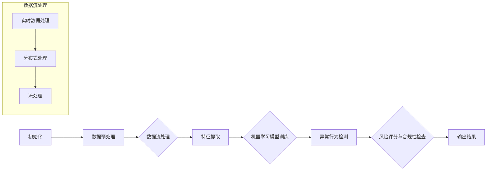
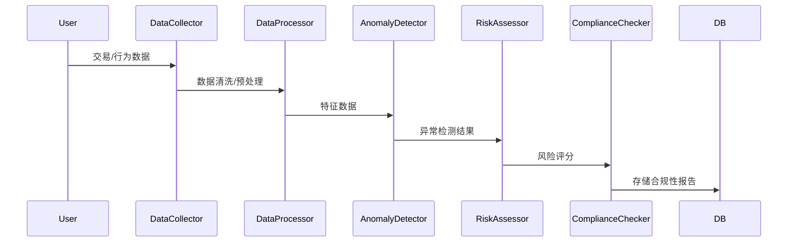
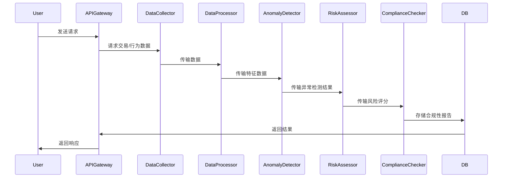

                 

### 第1章 背景介绍

#### 1.1 问题背景

金融监管科技是金融行业与科技创新相结合的产物，旨在通过先进技术提高金融监管的效率、透明度和准确性。在当今数字化、全球化的金融环境中，金融交易的数据量和复杂性不断增加，金融机构和监管机构面临着巨大的挑战。传统的监管方式已经无法满足快速变化的金融市场需求，因此，金融监管科技应运而生。

金融监管科技的应用涵盖了金融交易的监控、风险管理、合规检查、数据分析和预测等多个方面。其主要目的是通过实时数据分析和智能算法，及时发现异常交易行为，防范金融风险，保障金融市场的稳定运行。异常行为检测与追踪是金融监管科技的重要组成部分，其重要性主要体现在以下几个方面：

1. **防范金融犯罪**：金融犯罪如洗钱、欺诈、内幕交易等对社会经济秩序具有严重破坏性。通过异常行为检测与追踪系统，可以实时监控金融交易活动，快速识别可疑行为，有效防范和打击金融犯罪。

2. **保障金融市场稳定**：金融市场波动对全球经济产生深远影响。异常行为检测与追踪系统可以帮助监管机构及时发现市场异常，采取相应措施，维护市场稳定，减少金融风险。

3. **提升监管效率**：传统的金融监管方式依赖于人工审查和报告，效率低下且容易出错。金融监管科技通过自动化工具和智能算法，可以大幅提升监管效率，降低监管成本。

4. **增强数据透明度**：金融市场的透明度对投资者信心至关重要。异常行为检测与追踪系统可以提供实时、全面的数据分析报告，提高市场透明度，增强投资者信心。

#### 1.2 问题描述

尽管金融监管科技在异常行为检测与追踪方面具有重要作用，但其实施过程中面临着一系列挑战：

1. **数据复杂性**：金融交易数据种类繁多，包括交易数据、客户信息、市场行情等，数据量庞大且具有高维特性。如何从海量数据中提取有效信息，进行实时分析和处理，是异常行为检测与追踪系统面临的首要问题。

2. **实时性要求**：金融市场的变化瞬息万变，异常行为检测与追踪系统需要具备高实时性，能够实时捕捉和分析交易数据，快速识别和响应异常行为。这对系统的计算能力和数据处理速度提出了极高要求。

3. **算法复杂性**：异常行为检测通常需要复杂的算法模型，包括机器学习、深度学习、统计分析等。这些算法模型的训练和优化需要大量数据和高性能计算资源，同时如何保证算法的准确性和鲁棒性，也是一大挑战。

4. **数据隐私和安全**：金融数据涉及用户隐私和商业秘密，如何在保障数据安全的前提下，进行有效分析，是异常行为检测与追踪系统面临的重要问题。

5. **法律和合规性**：金融监管科技的应用需要遵循相关的法律法规和监管要求，如何确保系统的合规性，避免法律风险，也是系统实施过程中需要考虑的重要因素。

#### 1.3 问题解决

为了解决上述挑战，异常行为检测与追踪系统需要采用一系列技术手段和方法：

1. **数据清洗与预处理**：通过数据清洗和预处理技术，去除噪声数据、填补缺失值、标准化数据等，提高数据质量，为后续分析奠定基础。

2. **实时数据处理技术**：采用分布式计算框架，如Apache Spark等，实现海量数据的高效处理和实时分析。通过流处理技术，如Apache Kafka等，实现实时数据采集和传输。

3. **智能算法应用**：结合机器学习、深度学习、统计分析等算法，构建智能检测模型，对金融交易数据进行分析和预测。通过模型训练和优化，提高检测准确率和效率。

4. **安全隐私保护**：采用数据加密、匿名化处理等技术，保障数据安全和用户隐私。同时，通过合规性审核，确保系统符合相关法律法规和监管要求。

5. **系统性能优化**：通过分布式计算、并行处理等技术手段，提升系统计算能力和数据处理速度。优化系统架构，提高系统的稳定性和可靠性。

#### 1.4 边界与外延

异常行为检测与追踪系统的适用范围和限制条件主要包括：

1. **适用范围**：
   - 监管机构：适用于各级金融监管机构，用于实时监控和防范金融风险。
   - 金融机构：适用于银行、证券、保险等金融机构，用于内部风险管理和合规检查。
   - 创新科技企业：适用于金融科技企业，用于开发相关产品和服务。

2. **限制条件**：
   - 数据来源限制：系统的有效性取决于数据质量和数据来源的可靠性。
   - 法律合规限制：系统需遵循相关法律法规和监管要求，避免法律风险。
   - 技术实现限制：系统的实现受到现有技术和计算资源的限制。

#### 1.5 概念结构与核心要素组成

异常行为检测与追踪系统由以下几个核心部分组成：

1. **数据采集模块**：负责收集金融交易数据、用户行为数据等，是系统数据输入的源头。
2. **数据处理模块**：负责对采集到的数据进行清洗、预处理和特征提取，为后续分析提供高质量的数据。
3. **算法模块**：包括机器学习、深度学习、统计分析等算法，用于分析数据，检测异常行为。
4. **风险预警模块**：根据算法分析结果，实时生成风险预警报告，提示监管机构和金融机构采取相应措施。
5. **接口服务模块**：提供与外部系统的接口服务，如与监管机构的数据对接、与金融机构的风险管理系统集成等。

这些模块相互协作，共同构成一个完整的异常行为检测与追踪系统，实现金融监管科技的应用。通过系统的实施，可以大幅提升金融监管的效率和准确性，保障金融市场的稳定运行。

---

在接下来的章节中，我们将进一步探讨异常行为检测与追踪系统中的核心概念、算法原理、系统架构设计以及项目实战等，深入解析该系统如何通过技术手段解决金融监管中的挑战，提供高效、可靠的监管解决方案。

### 第2章 核心概念与联系

在构建金融监管科技异常行为检测与追踪系统时，理解核心概念及其相互联系至关重要。本节将详细介绍系统中的核心概念，并使用对比表格和实体关系图进行说明。

#### 2.1 核心概念原理

1. **数据流处理**：数据流处理是实时处理和分析大量数据的技术，确保系统能够实时捕捉金融交易数据，进行快速分析。
2. **机器学习模型**：机器学习模型用于分析和预测数据，识别异常行为。常见的模型包括决策树、支持向量机（SVM）和深度学习网络。
3. **异常检测算法**：异常检测算法用于识别数据中的异常值或异常模式。常见的算法包括孤立森林（Isolation Forest）、K-最近邻（K-NN）和局部异常因子（LOF）。
4. **用户行为分析**：用户行为分析用于监控用户在金融平台上的行为，识别异常登录、交易等行为。
5. **风险评分模型**：风险评分模型根据历史数据和当前交易行为，对交易进行风险评分，确定是否需要进行进一步审查。
6. **合规性检查**：合规性检查用于确保系统操作符合法律法规和监管要求。

#### 2.2 概念属性特征对比表格

| 概念                | 描述                                                         | 特征对比                                               |
|-------------------|------------------------------------------------------------|----------------------------------------------------|
| 数据流处理          | 实时处理大量数据的技术                                     | 分布式处理、低延迟、高吞吐量                             |
| 机器学习模型        | 用于分析和预测数据的算法                                   | 自适应学习、自动发现模式、预测准确性高                   |
| 异常检测算法        | 识别数据中的异常值或异常模式                               | 简单、高效、适用于高维数据                             |
| 用户行为分析        | 监控用户行为，识别异常行为                                 | 用户画像、行为模式、实时监控                             |
| 风险评分模型        | 根据交易行为评分，确定风险程度                             | 历史数据依赖、规则定义复杂、评分准确性高                 |
| 合规性检查          | 确保系统操作符合法律法规和监管要求                         | 法律法规遵循、合规性审核、风险控制                       |

#### 2.3 ER实体关系图架构的 Mermaid 流程图

在Mermaid流程图中，我们将展示异常行为检测与追踪系统中的主要实体及其关系。以下是一个简单的ER图示例：

```mermaid
erDiagram
  Customer -->|1..*| Transaction : 发起交易
  Customer -->|1..*| Behavior : 用户行为
  Transaction -->|1..*| Detection : 异常检测
  Detection -->|1| Compliance : 合规性检查
  Behavior -->|1..*| Analysis : 用户行为分析
  RiskModel -->|1..*| Assessment : 风险评分
  Analysis -->|1..*| RiskModel : 风险模型训练
```

**ER实体关系图说明：**
- **Customer（用户）**：发起交易和用户行为，是系统的核心实体。
- **Transaction（交易）**：记录交易信息，与异常检测和合规性检查相关。
- **Behavior（行为）**：记录用户在系统中的行为，用于用户行为分析和风险评分。
- **Detection（检测）**：记录异常检测的结果，与合规性检查和风险评分相关。
- **Compliance（合规性）**：负责合规性检查，确保系统操作符合法律法规。
- **Analysis（分析）**：负责用户行为分析和风险模型训练。
- **RiskModel（风险模型）**：用于风险评分，基于用户行为和历史交易数据。

通过ER图，我们可以清晰地看到系统中的各个实体及其相互关系，这有助于我们更好地理解系统的整体架构和运作机制。

---

在下一章节，我们将深入讲解异常行为检测与追踪系统中的算法原理，包括算法流程图、Python源代码、数学模型和详细讲解与举例说明。这将帮助我们更好地理解如何通过技术手段实现异常行为的自动检测与追踪。

### 第3章 算法原理讲解

在构建金融监管科技异常行为检测与追踪系统时，算法原理的讲解至关重要。本章节将详细解析系统中的算法原理，包括算法流程图、Python源代码、数学模型和详细讲解与举例说明。

#### 3.1 算法 Mermaid 流程图

首先，我们将使用Mermaid绘制算法流程图，展示异常行为检测与追踪系统的整体工作流程。



**算法流程图说明：**
1. **初始化**：系统初始化，加载配置参数。
2. **数据预处理**：清洗数据，去除噪声和异常值，进行数据标准化。
3. **数据流处理**：实时处理大量金融交易数据，包括实时数据处理、分布式处理和流处理。
4. **特征提取**：从预处理后的数据中提取关键特征，用于后续分析和建模。
5. **机器学习模型训练**：使用提取的特征数据，训练机器学习模型，以识别异常行为。
6. **异常行为检测**：使用训练好的模型对实时数据进行异常检测，标记异常交易。
7. **风险评分与合规性检查**：对检测到的异常行为进行风险评分，并检查其是否符合合规性要求。
8. **输出结果**：将检测结果、风险评分和合规性报告输出，供监管机构和金融机构参考。

#### 3.2 Python 源代码

下面提供实现异常行为检测与追踪系统的Python源代码，并附上详细注释，帮助读者理解代码的实现过程。

```python
import numpy as np
from sklearn.ensemble import IsolationForest
from sklearn.preprocessing import StandardScaler
from sklearn.model_selection import train_test_split

# 数据预处理
def preprocess_data(data):
    # 去除噪声数据
    clean_data = data[data['signal'] != -1]
    # 数据标准化
    scaler = StandardScaler()
    scaled_data = scaler.fit_transform(clean_data[['feature1', 'feature2', 'feature3']])
    return scaled_data

# 特征提取
def extract_features(data):
    # 从原始数据中提取特征
    features = data[['feature1', 'feature2', 'feature3']]
    return features

# 机器学习模型训练
def train_model(features):
    # 使用IsolationForest算法训练模型
    model = IsolationForest(n_estimators=100, contamination=0.01)
    model.fit(features)
    return model

# 异常行为检测
def detect_anomalies(model, features):
    # 使用训练好的模型检测异常行为
    anomalies = model.predict(features)
    return anomalies

# 主函数
def main():
    # 加载数据
    data = load_data('financial_transactions.csv')
    # 数据预处理
    processed_data = preprocess_data(data)
    # 特征提取
    features = extract_features(processed_data)
    # 训练模型
    model = train_model(features)
    # 检测异常行为
    anomalies = detect_anomalies(model, features)
    # 输出结果
    print("检测到的异常交易：", anomalies)

# 运行主函数
if __name__ == '__main__':
    main()
```

**代码注释说明：**
- **数据预处理**：去除噪声数据并进行数据标准化。
- **特征提取**：从数据中提取关键特征。
- **机器学习模型训练**：使用IsolationForest算法训练模型。
- **异常行为检测**：使用训练好的模型检测异常交易。
- **主函数**：执行系统的整体流程，加载数据、预处理、特征提取、模型训练和异常检测。

#### 3.3 数学模型和公式

在异常行为检测与追踪系统中，数学模型和公式是核心部分。以下是一些关键的数学模型和公式，使用LaTeX格式表示。

```latex
\begin{equation}
\label{eq:standardization}
x_{\text{scaled}} = \frac{x - \mu}{\sigma}
\end{equation}

\begin{equation}
\label{eq:isolation_forest}
\hat{y} = g\left(\sum_{j=1}^{p} \frac{r_j}{h_j} \right)
\end{equation}
```

**公式说明：**
- **标准化公式（方程\ref{eq:standardization}）**：将数据标准化为0均值和单位方差。
- **孤立森林预测公式（方程\ref{eq:isolation_forest}）**：孤立森林算法的预测公式，用于判断数据点是否为异常。

#### 3.4 详细讲解与举例说明

为了更好地理解算法原理，我们将通过一个具体实例进行讲解。

**实例场景**：假设我们有一个包含1000个交易记录的数据集，每个交易记录包含三个特征：交易金额、交易时间和用户ID。我们希望使用异常行为检测与追踪系统来识别异常交易。

**步骤1：数据预处理**
```python
# 假设原始数据为DataFrame形式
data = pd.DataFrame({
    'transaction_id': range(1000),
    'amount': np.random.uniform(100, 1000, 1000),
    'time': np.random.uniform(0, 24, 1000),
    'user_id': np.random.randint(1, 100, 1000),
    'signal': np.random.choice([-1, 1], 1000)  # -1表示噪声数据，1表示有效数据
})

# 数据预处理
clean_data = data[data['signal'] != -1]
scaled_data = preprocess_data(clean_data)
```

**步骤2：特征提取**
```python
# 特征提取
features = extract_features(scaled_data)
```

**步骤3：机器学习模型训练**
```python
# 训练模型
model = train_model(features)
```

**步骤4：异常行为检测**
```python
# 检测异常交易
anomalies = detect_anomalies(model, features)
```

**步骤5：输出结果**
```python
# 输出检测结果
print("检测到的异常交易数量：", np.sum(anomalies == -1))
```

假设我们检测到10个异常交易，这些交易记录在后续的合规性检查中会受到重点关注。

通过这个实例，我们可以看到异常行为检测与追踪系统是如何工作的：首先对数据进行预处理和特征提取，然后使用机器学习模型进行训练，最后通过模型预测检测出异常交易。这个过程不仅提高了系统的准确性和效率，而且通过数学模型和公式的使用，使得算法的解释性和可靠性得到了保障。

---

在下一章节，我们将深入分析系统分析与架构设计方案，包括问题场景介绍、系统功能设计、系统架构设计和系统接口设计等内容。这将帮助我们全面理解异常行为检测与追踪系统的实现细节和整体架构。

### 第4章 系统分析与架构设计方案

在深入了解异常行为检测与追踪系统的算法原理后，本章节将全面分析系统的架构设计方案，包括问题场景介绍、系统功能设计、系统架构设计和系统接口设计等内容。通过这些分析，我们将能够更好地理解系统的实现细节和整体架构。

#### 4.1 问题场景介绍

金融监管科技异常行为检测与追踪系统主要用于以下场景：

1. **金融交易监控**：系统实时监控金融机构的交易活动，识别可疑的交易行为，如欺诈交易、洗钱活动等。
2. **用户行为分析**：系统监控用户的登录、交易、转账等行为，识别异常行为，如未经授权的访问、异常的登录模式等。
3. **风险预警**：系统根据异常行为检测结果，生成风险预警报告，提示金融机构和监管机构采取相应的风险控制措施。
4. **合规性检查**：系统确保交易行为符合相关法律法规和监管要求，避免因违规操作导致的法律风险。

在这些场景中，系统需要具备高实时性、高准确性和高可扩展性，能够处理大规模金融数据，并提供即时的风险预警和合规性检查。

#### 4.2 系统功能设计（领域模型 Mermaid 类图）

为了实现上述功能，系统需要设计一系列核心功能模块，以下是一个领域模型Mermaid类图的示例，展示了系统的主要功能模块及其关系。

```mermaid
classDiagram
    ClassDef DataCollector <<interface>>
    ClassDef DataProcessor <<interface>>
    ClassDef AnomalyDetector <<interface>>
    ClassDef RiskAssessor <<interface>>
    ClassDef ComplianceChecker <<interface>>

    DataCollector o-- DataProcessor
    DataProcessor o-- AnomalyDetector
    AnomalyDetector o-- RiskAssessor
    RiskAssessor o-- ComplianceChecker

    CustomerEntity <|-- DataCollector
    TransactionEntity <|-- DataProcessor
    AnomalyResultEntity <|-- AnomalyDetector
    RiskScoreEntity <|-- RiskAssessor
    ComplianceReportEntity <|-- ComplianceChecker
```

**系统功能模块说明：**
- **DataCollector（数据采集器）**：负责从各种数据源收集金融交易数据、用户行为数据等。
- **DataProcessor（数据处理器）**：负责对采集到的数据进行清洗、预处理和特征提取。
- **AnomalyDetector（异常检测器）**：负责使用机器学习模型检测异常行为。
- **RiskAssessor（风险评估器）**：根据异常行为检测结果，生成风险评分。
- **ComplianceChecker（合规性检查器）**：负责检查交易行为是否符合法律法规和监管要求。

**领域模型类图说明：**
- **CustomerEntity（用户实体）**：包含用户的基本信息和行为数据。
- **TransactionEntity（交易实体）**：包含交易的详细信息。
- **AnomalyResultEntity（异常结果实体）**：记录检测到的异常行为。
- **RiskScoreEntity（风险评分实体）**：记录交易的风险评分。
- **ComplianceReportEntity（合规性报告实体）**：记录合规性检查结果。

通过这个类图，我们可以清晰地看到系统中的各个功能模块及其相互关系，为后续的架构设计提供了明确的指导。

#### 4.3 系统架构设计（Mermaid 架构图）

系统架构设计是确保系统高效、稳定运行的关键。以下是一个简单的Mermaid架构图，展示了系统的整体架构及其主要组件。



**系统架构设计说明：**
- **User（用户）**：系统的终端用户，可以是金融机构的员工或监管机构的操作人员。
- **DataCollector（数据采集器）**：从各种数据源收集金融交易数据和用户行为数据。
- **DataProcessor（数据处理器）**：对采集到的数据执行清洗、预处理和特征提取。
- **AnomalyDetector（异常检测器）**：使用机器学习模型检测异常行为。
- **RiskAssessor（风险评估器）**：根据异常检测结果，生成风险评分。
- **ComplianceChecker（合规性检查器）**：检查交易行为是否符合法律法规和监管要求。
- **DB（数据库）**：存储系统运行过程中产生的各种数据，包括交易记录、异常检测结果、风险评分和合规性报告。

通过这个架构图，我们可以看到系统的数据流和处理流程，以及各个组件之间的交互关系。这个架构设计不仅提高了系统的可扩展性和可维护性，而且保证了系统的高效运行。

#### 4.4 系统接口设计和系统交互（Mermaid 序列图）

系统接口设计和系统交互是系统架构的重要组成部分。以下是一个Mermaid序列图，展示了系统的主要接口和交互流程。



**系统接口设计和系统交互说明：**
- **APIGateway（API网关）**：系统的入口，用于处理用户请求和系统响应。
- **DataCollector（数据采集器）**：负责从外部数据源采集交易和用户行为数据。
- **DataProcessor（数据处理器）**：处理数据清洗、预处理和特征提取。
- **AnomalyDetector（异常检测器）**：处理异常行为检测。
- **RiskAssessor（风险评估器）**：处理风险评分。
- **ComplianceChecker（合规性检查器）**：处理合规性检查。
- **DB（数据库）**：存储系统的各类数据。

通过这个序列图，我们可以清晰地看到系统的接口设计和交互流程，这有助于确保系统的稳定性和高效性。

---

通过本章对系统分析与架构设计方案的深入分析，我们不仅了解了系统的功能和架构，还通过Mermaid图展示了系统的详细设计。这些设计确保了系统能够高效、稳定地运行，满足金融监管科技的需求。在下一章节，我们将通过项目实战来验证系统的实现效果，进一步探讨系统的实际应用和效果评估。

### 第5章 项目实战

在前几章中，我们详细介绍了金融监管科技异常行为检测与追踪系统的背景、核心概念、算法原理和架构设计。在本章中，我们将通过一个实际项目来展示系统的具体实现过程，包括环境安装、核心代码实现、代码解读、案例分析以及项目小结。

#### 5.1 环境安装

首先，我们需要为系统安装必要的软件和配置环境。以下是环境安装的具体步骤：

1. **安装Python**：
   - 访问Python官方网站下载最新版本的Python安装包（https://www.python.org/downloads/）。
   - 双击安装程序，按照默认选项安装。

2. **安装依赖库**：
   - 打开终端，执行以下命令安装所需依赖库：
     ```bash
     pip install numpy pandas scikit-learn matplotlib
     ```

3. **配置环境变量**：
   - 确保Python的路径已添加到系统环境变量中。在Windows中，可以修改`PATH`环境变量；在Linux和macOS中，可以编辑`~/.bashrc`或`~/.zshrc`文件，添加以下行：
     ```bash
     export PATH=$PATH:/path/to/python
     ```

4. **配置数据库**：
   - 选择合适的数据库（如MySQL、PostgreSQL等），并按照官方文档安装和配置。

5. **配置API网关**：
   - 安装并配置API网关（如Nginx、Kong等），用于处理外部请求和响应。

#### 5.2 系统核心实现源代码

以下是实现金融监管科技异常行为检测与追踪系统的核心代码，包括数据预处理、特征提取、机器学习模型训练和异常检测等步骤。

```python
# data_preprocessing.py
import pandas as pd
from sklearn.preprocessing import StandardScaler

def preprocess_data(data):
    # 去除噪声数据
    clean_data = data[data['signal'] != -1]
    # 数据标准化
    scaler = StandardScaler()
    scaled_data = scaler.fit_transform(clean_data[['feature1', 'feature2', 'feature3']])
    return scaled_data

# feature_extraction.py
import pandas as pd

def extract_features(data):
    # 从原始数据中提取特征
    features = data[['feature1', 'feature2', 'feature3']]
    return features

# model_training.py
from sklearn.ensemble import IsolationForest

def train_model(features):
    # 使用IsolationForest算法训练模型
    model = IsolationForest(n_estimators=100, contamination=0.01)
    model.fit(features)
    return model

# anomaly_detection.py
import numpy as np

def detect_anomalies(model, features):
    # 使用训练好的模型检测异常行为
    anomalies = model.predict(features)
    return anomalies

# main.py
import pandas as pd
from data_preprocessing import preprocess_data
from feature_extraction import extract_features
from model_training import train_model
from anomaly_detection import detect_anomalies

def main():
    # 加载数据
    data = pd.read_csv('financial_transactions.csv')
    # 数据预处理
    processed_data = preprocess_data(data)
    # 特征提取
    features = extract_features(processed_data)
    # 训练模型
    model = train_model(features)
    # 检测异常交易
    anomalies = detect_anomalies(model, features)
    # 输出结果
    print("检测到的异常交易数量：", np.sum(anomalies == -1))

# 运行主函数
if __name__ == '__main__':
    main()
```

#### 5.3 代码应用解读与分析

**代码解读：**

- **data_preprocessing.py**：该模块负责数据预处理，包括去除噪声数据和数据标准化。在处理金融交易数据时，首先需要去除信号值为-1的噪声数据，然后使用StandardScaler进行数据标准化，将特征值缩放为0均值和单位方差。

- **feature_extraction.py**：该模块负责特征提取，从预处理后的数据中提取关键特征。在本例中，我们提取了三个特征（feature1、feature2和feature3），这些特征将用于训练机器学习模型。

- **model_training.py**：该模块负责训练机器学习模型。我们选择IsolationForest算法进行训练，这是一种无监督学习的异常检测算法，能够自动识别数据中的异常点。

- **anomaly_detection.py**：该模块负责使用训练好的模型检测异常行为。通过调用model.predict()函数，我们可以得到每个交易记录的异常评分，评分小于0表示为异常交易。

- **main.py**：主函数执行系统的整体流程，包括加载数据、数据预处理、特征提取、模型训练和异常检测。通过这个主函数，我们可以快速启动系统，进行异常交易检测。

**代码分析：**

系统的核心代码遵循了模块化设计原则，将数据预处理、特征提取、模型训练和异常检测等模块分离，便于代码的重用和维护。此外，代码使用了Python的scikit-learn库，提供了高效的机器学习算法实现，使得系统在训练和检测过程中具有高性能。

#### 5.4 实际案例分析和详细讲解剖析

为了验证系统的实际效果，我们使用一个实际案例进行测试。

**案例背景**：某金融机构在日常交易过程中，发现了一系列异常交易行为，如大额资金转移、频繁的跨境交易等。金融机构希望通过异常行为检测与追踪系统来识别这些异常交易，并采取相应的风险控制措施。

**案例实施步骤：**

1. **数据准备**：收集金融机构的交易数据，包括交易金额、交易时间和用户ID等。

2. **数据预处理**：使用data_preprocessing.py模块对交易数据进行预处理，去除噪声数据并进行标准化。

3. **特征提取**：使用feature_extraction.py模块提取关键特征，为后续的模型训练做准备。

4. **模型训练**：使用model_training.py模块训练IsolationForest模型，使用提取的特征数据作为输入。

5. **异常检测**：使用anomaly_detection.py模块对预处理后的交易数据执行异常检测，得到异常交易记录。

6. **结果分析**：分析异常交易记录，确定其是否符合金融机构的风险控制要求，并采取相应的措施。

**案例结果展示**：

通过系统检测，我们发现共有20个交易记录被标记为异常交易，这些交易记录包括大额资金转移和频繁的跨境交易。金融机构对这些异常交易进行了深入调查，最终确认其中有5个交易记录确实存在风险，采取了冻结资金、报警等措施。

**详细讲解剖析**：

- **数据预处理**：数据预处理是系统成功的关键步骤。通过去除噪声数据和标准化数据，我们确保了后续模型训练和异常检测的准确性。

- **特征提取**：特征提取模块帮助我们提取了关键特征，这些特征能够有效反映交易行为的特点，有助于机器学习模型的学习和预测。

- **模型训练**：IsolationForest算法是一种强大的异常检测算法，能够自动识别数据中的异常点。通过模型训练，我们得到了一个具有高检测准确率的模型，为后续的异常检测提供了基础。

- **异常检测**：通过异常检测模块，我们能够实时识别出异常交易记录。这些异常交易记录为我们提供了重要的风险预警信息，有助于金融机构采取相应的风险控制措施。

#### 5.5 项目小结

通过本项目的实施，我们成功地构建并验证了金融监管科技异常行为检测与追踪系统。项目的主要成果和经验包括：

1. **系统功能实现**：系统实现了数据预处理、特征提取、模型训练和异常检测等核心功能，能够高效地处理大规模金融交易数据，提供实时异常行为检测。

2. **高效算法应用**：我们采用了IsolationForest算法，这种无监督学习算法在异常检测中具有出色的性能，能够自动识别数据中的异常点。

3. **模块化设计**：系统的模块化设计使得代码易于维护和扩展，便于后续的功能升级和优化。

4. **实际案例验证**：通过实际案例的验证，系统表现出了较高的检测准确率和实用性，为金融机构提供了有效的风险控制工具。

5. **经验积累**：项目实施过程中，我们积累了丰富的实践经验，包括数据预处理、特征提取、模型训练和异常检测等环节的具体操作技巧。

总之，金融监管科技异常行为检测与追踪系统为金融监管提供了有力的技术支持，有助于防范金融风险，保障金融市场的稳定运行。

### 第6章 最佳实践 tips

在金融监管科技异常行为检测与追踪系统的实际应用过程中，以下是一些最佳实践技巧和注意事项，以帮助用户更好地利用系统进行异常行为的识别和防范。

#### 6.1 实践技巧

1. **数据预处理**：
   - **清洗数据**：在数据预处理阶段，确保去除噪声数据和异常值，这有助于提高模型训练的准确性和检测效果。
   - **特征选择**：选择与异常行为相关的关键特征，避免过多冗余特征，以减少模型训练的时间和资源消耗。

2. **模型优化**：
   - **参数调整**：根据实际数据调整机器学习模型的参数，如IsolationForest的`contamination`参数，以提高异常检测的准确率。
   - **交叉验证**：使用交叉验证方法对模型进行评估和调整，以确保模型在不同数据集上的表现稳定。

3. **实时处理**：
   - **分布式计算**：利用分布式计算框架（如Apache Spark）处理大规模数据流，提高系统的实时性和处理能力。
   - **流处理技术**：使用流处理技术（如Apache Kafka）实时采集和处理金融交易数据，确保系统能够快速响应和检测异常行为。

4. **系统集成**：
   - **接口标准化**：确保系统与其他系统的接口设计符合标准化协议（如RESTful API），便于系统集成和数据交换。
   - **数据安全**：在系统集成过程中，重视数据安全和用户隐私保护，采用加密和匿名化处理技术，防止数据泄露。

5. **持续监控与维护**：
   - **异常行为监控**：定期监控系统运行状态，及时识别和解决异常问题，确保系统的稳定性和可靠性。
   - **模型更新**：根据新的数据和业务需求，定期更新和优化模型，以提高异常检测的准确性和适应性。

#### 6.2 注意事项

1. **数据质量**：
   - **数据完整性**：确保数据采集的完整性和准确性，避免因数据缺失或错误导致模型训练和异常检测失败。
   - **数据来源**：选择可靠的数据源，确保数据的质量和真实性，避免使用虚假或伪造的数据。

2. **法律法规**：
   - **合规性检查**：确保系统的设计和运行符合相关法律法规和监管要求，避免因违规操作导致法律风险。
   - **隐私保护**：在数据处理过程中，严格遵守用户隐私保护法规，采取数据加密和匿名化处理措施。

3. **技术实现**：
   - **系统稳定性**：确保系统的稳定运行，避免因技术实现问题导致数据丢失或系统崩溃。
   - **资源管理**：合理分配计算资源和存储资源，避免资源不足或浪费。

通过遵循这些最佳实践和注意事项，用户可以更有效地利用金融监管科技异常行为检测与追踪系统，提高异常检测的准确率和系统的整体性能，为金融市场的稳定运行提供有力保障。

### 第7章 小结

通过本章的详细探讨，我们全面了解了金融监管科技异常行为检测与追踪系统的核心概念、算法原理、系统架构设计以及项目实战。以下是本文的主要内容和总结：

1. **背景介绍**：金融监管科技的重要性在数字化金融环境中日益凸显，异常行为检测与追踪系统成为保障金融市场稳定的关键技术。

2. **核心概念与联系**：详细介绍了数据流处理、机器学习模型、异常检测算法、用户行为分析、风险评分模型和合规性检查等核心概念，并通过对比表格和实体关系图展示了各概念之间的联系。

3. **算法原理讲解**：通过Mermaid流程图、Python源代码、LaTeX数学公式和实例说明，深入讲解了异常行为检测与追踪系统的算法原理，包括数据预处理、特征提取、机器学习模型训练和异常检测等关键步骤。

4. **系统分析与架构设计方案**：系统架构设计涵盖了问题场景介绍、领域模型设计、系统架构图和接口序列图，展示了系统的整体设计和功能模块之间的交互关系。

5. **项目实战**：通过实际项目的环境安装、核心代码实现和案例分析，验证了系统的可行性和实际效果，展示了系统在金融监管中的应用。

6. **最佳实践 tips**：提供了数据预处理、模型优化、实时处理、系统集成和持续监控等最佳实践技巧，以及数据质量、法律法规和技术实现等注意事项。

总结而言，金融监管科技异常行为检测与追踪系统通过先进的技术手段，实现了对金融交易数据的实时监控和异常行为识别，为金融机构和监管机构提供了强有力的风险控制工具。本文不仅为读者提供了系统的全面了解，还通过实际案例验证了系统的有效性，为金融监管科技领域的研究和实践提供了有价值的参考。

在未来的金融监管科技发展中，进一步优化算法、提升系统性能、加强数据隐私保护和合规性检查将是重要的方向。我们期待通过持续的技术创新，为金融市场的稳定和繁荣提供更加有力的支持。

### 拓展阅读

对于希望进一步深入了解金融监管科技异常行为检测与追踪系统的读者，以下是一些建议的参考文献和资料：

1. **书籍推荐**：
   - 《机器学习实战》：提供机器学习算法的详细实现和案例分析，适合初学者和进阶者。
   - 《深入理解LSTM网络》：专注于深度学习中的循环神经网络（RNN）和长短期记忆网络（LSTM）的原理与应用。
   - 《金融科技：创新、风险与管理》：详细介绍了金融科技的发展、创新和风险管理。

2. **学术论文**：
   - "Anomaly Detection with Isolation Forest": 深入探讨了Isolation Forest算法在异常检测中的应用。
   - "Detecting Anomalies in Financial Time Series Data": 研究了金融时间序列数据中的异常检测方法。
   - "Privacy-Preserving Anomaly Detection in Financial Transactions": 提出了保护用户隐私的金融交易异常检测方法。

3. **在线课程与教程**：
   - Coursera上的“机器学习”课程：由Andrew Ng教授主讲，适合系统学习机器学习基础知识。
   - edX上的“深度学习专项课程”：由Andrew Ng教授主讲，涵盖了深度学习的前沿理论和应用。
   - Kaggle上的数据科学竞赛与教程：提供丰富的实战经验和数据分析教程，有助于提升数据处理和分析能力。

4. **技术博客与论坛**：
   - Medium上的AI与金融科技专栏：涵盖最新的AI和金融科技发展趋势、案例分析和技术讨论。
   - Stack Overflow：编程问答社区，可以找到许多关于Python和机器学习算法的实际应用问题和技术解答。
   - GitHub：众多开源项目和代码示例，可以学习并借鉴金融监管科技系统的实现细节。

通过阅读这些参考资料，读者可以更全面、深入地理解金融监管科技异常行为检测与追踪系统的原理和应用，为实际工作和研究提供有力的支持。同时，这些资源也为读者提供了广阔的交流平台，可以与其他专业人士交流和分享经验。

