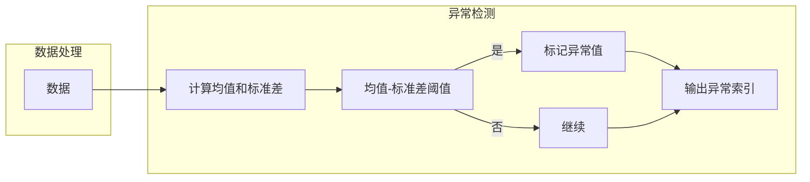
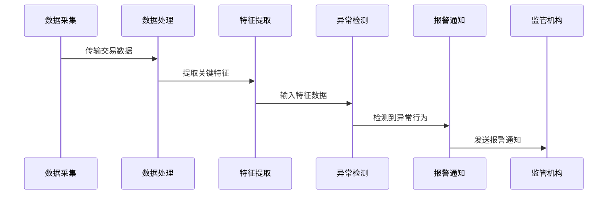

                 

## 文章标题

### 关键词

- 金融监管
- 科技
- 异常行为检测
- 算法
- 架构设计
- 项目实战

### 摘要

本文旨在深入探讨金融监管科技在异常行为检测系统中的应用。我们将从设计概述、背景介绍、核心概念与联系、算法原理讲解、系统分析与架构设计、项目实战以及最佳实践与小结七个方面展开讨论。通过逐步分析推理，本文将帮助读者理解金融监管科技异常行为检测系统的核心技术和实现方法，为实际应用提供有力支持。

## 设计概述

设计一个金融监管科技异常行为检测系统，首先要明确其目标和核心功能。这个系统的目的是实时监测金融市场的交易行为，识别潜在的风险和异常行为，从而为监管机构提供决策支持。核心功能包括数据采集、行为分析、异常检测和报警通知。

在设计过程中，我们需要考虑以下几个关键点：

1. **数据来源与处理**：金融市场的数据来源广泛，包括交易所、银行、基金公司等。我们需要构建一个高效的数据采集和处理系统，确保数据的完整性和准确性。

2. **异常检测算法**：选择合适的异常检测算法是系统的核心。根据不同场景，可以采用基于统计的算法、机器学习算法或深度学习算法。这些算法需要能够快速识别异常行为，并具有较高的准确性。

3. **实时性与鲁棒性**：系统需要具备实时性，能够在短时间内处理大量数据，并对异常行为做出及时响应。同时，系统还应该具备鲁棒性，能够在不同市场环境下稳定运行。

4. **安全性与隐私保护**：金融数据涉及到用户隐私和商业机密，系统需要采取严格的加密和访问控制措施，确保数据安全。

5. **可扩展性**：随着金融市场的不断发展，系统需要具备良好的扩展性，能够适应新的业务需求和数据规模。

## 背景介绍

### 金融监管科技的基本概念

金融监管科技（FinTech）是指利用计算机技术、大数据、人工智能等先进科技手段，提升金融服务的效率、安全性和便利性。金融监管科技在金融市场的应用范围广泛，包括支付、贷款、投资、保险等领域。在金融监管方面，金融监管科技可以帮助监管机构提高监管效率，降低监管成本，防范金融风险。

### 金融监管科技的发展背景

金融监管科技的发展可以追溯到20世纪末。随着互联网和移动通信技术的普及，金融业务逐渐电子化和网络化。与此同时，大数据和人工智能技术的迅猛发展，为金融监管提供了新的工具和方法。近年来，随着金融市场的不断演变和复杂化，金融监管科技的重要性日益凸显。

### 金融监管科技的重要性

金融监管科技在金融监管中扮演着重要角色。首先，它能够提高监管效率，通过自动化和智能化的手段，实现实时监控和数据分析。其次，金融监管科技有助于降低监管成本，通过减少人工干预和简化流程，提高监管机构的运营效率。此外，金融监管科技还能够增强监管的精准性和全面性，及时发现和应对潜在的金融风险。

### 金融监管科技面临的挑战

尽管金融监管科技具有诸多优势，但在实际应用中仍面临一些挑战。首先，数据质量和数据隐私问题是一个重要挑战。金融市场的数据量大且复杂，如何保证数据的质量和隐私是一个关键问题。其次，算法的准确性和稳定性也是一个挑战。异常行为检测需要依赖算法的准确性，而算法的性能可能会受到数据质量和环境变化的影响。此外，监管科技的发展速度可能跟不上金融市场的变化，导致监管措施滞后。

### 问题背景与问题描述

在金融市场日益复杂的背景下，异常行为检测成为金融监管的重要任务。异常行为可能包括市场操纵、欺诈行为、洗钱活动等，这些行为对金融市场的稳定性和投资者信心构成严重威胁。然而，传统的监管手段往往难以及时、准确地识别这些异常行为。因此，设计并实施一个高效的异常行为检测系统，成为当前金融监管科技发展的关键问题。

### 问题解决

异常行为检测系统的核心目标是识别并预警潜在的金融风险。这需要通过以下几个步骤实现：

1. **数据采集**：从各个金融交易所、银行、基金公司等渠道收集相关数据。
2. **数据处理**：对采集到的数据进行清洗、转换和整合，构建统一的数据模型。
3. **特征提取**：从数据中提取关键特征，用于后续的异常检测。
4. **异常检测**：采用合适的算法，对特征数据进行分析，识别异常行为。
5. **报警通知**：一旦检测到异常行为，及时向监管机构发送报警通知，以便采取相应措施。

### 边界与外延

异常行为检测系统的边界主要涉及数据来源、算法选择和系统性能等方面。外延则包括系统的应用范围，如支付、贷款、投资等领域。此外，系统还需要考虑跨市场的监管合作，以实现更全面的风险监测。

### 概念结构与核心要素组成

异常行为检测系统的概念结构主要包括以下几个核心要素：

1. **数据层**：负责数据采集、存储和管理。
2. **算法层**：包括异常检测算法、模型训练和优化等功能。
3. **应用层**：提供异常行为检测和分析的接口，供监管机构使用。
4. **接口层**：与其他系统进行数据交互，实现数据共享和协同工作。

## 核心概念与联系

### 异常行为的定义

异常行为是指金融市场中的交易行为偏离正常范围的异常情况。这些行为可能包括价格异常波动、交易量异常增加、频繁交易等。异常行为通常是金融风险的重要信号，需要及时识别和预警。

### 异常检测方法

异常检测是异常行为检测系统的重要组成部分。常见的异常检测方法包括：

1. **统计方法**：基于统计学原理，通过计算数据的统计特征，如均值、方差等，识别异常值。
2. **机器学习方法**：利用机器学习算法，如聚类、分类等，对正常交易行为进行建模，识别偏离模型的异常行为。
3. **深度学习方法**：利用深度学习算法，如卷积神经网络（CNN）、循环神经网络（RNN）等，对交易行为进行建模，识别复杂模式的异常行为。

### 技术框架概述

异常行为检测系统的技术框架主要包括以下几个组成部分：

1. **数据采集模块**：负责从各个数据源采集金融交易数据。
2. **数据处理模块**：负责对采集到的数据进行清洗、转换和整合。
3. **特征提取模块**：负责从数据中提取关键特征，用于后续的异常检测。
4. **异常检测模块**：负责采用异常检测算法，对特征数据进行分析，识别异常行为。
5. **报警通知模块**：负责对检测到的异常行为进行报警通知，通知监管机构。

### 核心概念对比表格

以下是一个简单的核心概念对比表格，展示了不同异常检测方法的优缺点：

| 方法         | 优点                                                         | 缺点                                                         |
| ------------ | ------------------------------------------------------------ | ------------------------------------------------------------ |
| 统计方法     | 简单易懂，计算速度快                                         | 对异常行为的假设较强，难以应对复杂模式                       |
| 机器学习方法 | 能够发现复杂的异常模式                                     | 训练过程复杂，计算量大                                       |
| 深度学习方法 | 面向复杂问题，能够提取深层次的特征                           | 训练过程非常耗时，对数据质量要求高                           |

### ER实体关系图

为了更好地理解异常行为检测系统的各个组成部分及其关系，我们可以使用ER实体关系图来展示。以下是ER实体关系图的示例：

```mermaid
erDiagram
    DataCollector||--|{ DataProcessor }
    DataProcessor||--|{ FeatureExtractor }
    FeatureExtractor||--|{ AnomalyDetector }
    AnomalyDetector||--|{ AlertNotifier }
```

在这个ER实体关系图中，`DataCollector` 表示数据采集模块，`DataProcessor` 表示数据处理模块，`FeatureExtractor` 表示特征提取模块，`AnomalyDetector` 表示异常检测模块，`AlertNotifier` 表示报警通知模块。每个模块都有相应的输入和输出，通过接口进行数据传递和功能调用。

通过上述核心概念与联系的讨论，我们可以更好地理解异常行为检测系统的基本原理和实现方法。接下来，我们将进一步探讨异常行为检测算法的原理和实现。

## 算法原理讲解

### 异常行为检测算法概述

异常行为检测算法是金融监管科技异常行为检测系统的核心组成部分。这些算法通过分析金融市场的交易数据，识别出异常交易行为，为监管机构提供决策支持。根据不同的应用场景和数据特点，常见的异常检测算法包括统计方法、机器学习方法、深度学习方法等。

### 数学模型与公式

在异常行为检测中，常用的数学模型包括统计模型和机器学习模型。以下将分别介绍这两种模型的基本数学模型和公式。

#### 统计模型

统计模型通常基于统计学原理，通过计算数据的统计特征（如均值、方差等）来识别异常值。以下是几个常用的统计模型：

1. **标准差模型**：

   假设一个金融市场的交易数据序列为 \(X_1, X_2, ..., X_n\)，其均值为 \(\mu\)，方差为 \(\sigma^2\)。对于每个数据点 \(X_i\)，如果其与均值的偏离超过一定倍数（如2倍）的标准差，则认为该数据点为异常值。

   数学公式如下：
   $$ X_i \leq \mu - 2\sigma \quad \text{或} \quad X_i \geq \mu + 2\sigma $$
   
2. **箱线图模型**：

   箱线图模型通过计算数据的四分位数（Q1、Q2、Q3）来定义数据的正常范围。通常，如果数据点小于Q1-1.5I或大于Q3+1.5I，则认为该数据点为异常值。

   其中，I为四分位距（Q3-Q1）。

   数学公式如下：
   $$ X_i \leq Q1 - 1.5I \quad \text{或} \quad X_i \geq Q3 + 1.5I $$
   
3. **独立成分分析（ICA）**：

   独立成分分析是一种无监督学习方法，通过将数据分解为独立成分来识别异常值。ICA模型通过求解以下优化问题来找到独立的成分：
   $$ \min_{\mathbf{W}} \sum_{i=1}^{n} \sum_{j=1}^{m} | \sum_{k=1}^{m} w_{jk} x_{ik} - s_j |^2 $$
   
   其中，\(\mathbf{W}\)为权重矩阵，\(s_j\)为独立成分，\(x_{ik}\)为第i个数据点的第k个特征。

#### 机器学习模型

机器学习模型通过训练模型来识别异常行为。以下介绍几种常用的机器学习模型：

1. **基于聚类的方法**：

   基于聚类的方法通过将数据点分为不同的簇，然后识别出离簇中心较远的点作为异常值。常用的聚类算法包括K-均值聚类和DBSCAN等。

   K-均值聚类算法的目标是找到K个簇中心，使得每个数据点到其最近簇中心的距离之和最小。数学公式如下：
   $$ \min_{\mathbf{c}_1, \mathbf{c}_2, ..., \mathbf{c}_K} \sum_{i=1}^{n} \sum_{j=1}^{K} |x_i - c_j|^2 $$
   
2. **基于分类的方法**：

   基于分类的方法通过训练一个分类模型，将数据点分为正常和异常两类。常用的分类算法包括逻辑回归、支持向量机（SVM）和决策树等。

   以逻辑回归为例，其目标是找到一组权重参数 \(\mathbf{w}\)，使得每个数据点的预测概率 \(P(y=1|x)\) 最小化损失函数：
   $$ \min_{\mathbf{w}} \sum_{i=1}^{n} -y_i \log(P(y=1|x_i)) - (1 - y_i) \log(1 - P(y=1|x_i)) $$

3. **基于深度学习的方法**：

   深度学习方法通过构建多层神经网络来提取数据的高级特征，从而识别异常行为。常用的深度学习模型包括卷积神经网络（CNN）、循环神经网络（RNN）和长短期记忆网络（LSTM）等。

   以卷积神经网络为例，其目标是通过多层卷积和池化操作提取数据中的特征，最后通过全连接层输出异常概率。数学公式如下：
   $$ \mathbf{h}^{(L)} = \sigma(\mathbf{W}^{(L)} \mathbf{h}^{(L-1)} + \mathbf{b}^{(L)}) $$
   $$ \mathbf{y} = \sigma(\mathbf{W}^{(L+1)} \mathbf{h}^{(L)} + \mathbf{b}^{(L+1)}) $$
   
   其中，\(\mathbf{h}^{(L)}\) 为第L层的激活值，\(\mathbf{W}^{(L)}\) 和 \(\mathbf{b}^{(L)}\) 分别为第L层的权重和偏置，\(\sigma\) 为激活函数，\(\mathbf{y}\) 为输出。

### Python源代码与mermaid流程图

以下是一个简单的Python源代码示例，用于实现基于标准差模型的异常检测。该代码使用Python中的numpy库进行计算。

```python
import numpy as np

def standard_deviation_anomaly_detection(data, mean, std, threshold=2):
    anomalies = []
    for i, value in enumerate(data):
        if value <= mean - threshold * std or value >= mean + threshold * std:
            anomalies.append(i)
    return anomalies

# 示例数据
data = np.array([10, 20, 30, 40, 50, 60, 70, 80, 90, 100])
mean = np.mean(data)
std = np.std(data)

# 执行异常检测
anomalies = standard_deviation_anomaly_detection(data, mean, std)

print("Anomalies detected at indices:", anomalies)
```

对应的mermaid流程图如下：



通过上述Python源代码和mermaid流程图，我们可以清晰地理解标准差模型的异常检测过程。

### 算法应用举例

为了更好地理解异常行为检测算法的应用，我们可以通过一个实际案例来讲解。

假设我们有一个金融市场的交易数据序列，如下所示：

\[10, 20, 30, 40, 50, 60, 70, 80, 90, 100\]

根据上述标准差模型，我们可以计算其均值和标准差：

\[ \text{均值} = 55, \quad \text{标准差} = 16.6667 \]

根据公式 \(X_i \leq \mu - 2\sigma \quad \text{或} \quad X_i \geq \mu + 2\sigma\)，我们可以得出异常值：

\[ X_1 = 10 \leq 55 - 2 \times 16.6667 = 22.3333 \]
\[ X_{10} = 100 \geq 55 + 2 \times 16.6667 = 88.3333 \]

因此，交易数据序列中的异常值为10和100。

通过这个简单的案例，我们可以看到标准差模型在识别异常值方面的有效性。在实际应用中，我们可以结合多种算法，如机器学习算法和深度学习算法，以提高异常检测的准确性和鲁棒性。

## 系统分析与架构设计

### 问题场景介绍

在金融市场中，异常交易行为可能包括市场操纵、欺诈行为、洗钱活动等，这些行为对市场的稳定性和投资者的信心构成严重威胁。为了有效监测和应对这些异常行为，我们需要设计并实施一个高效的异常交易检测系统。该系统需要能够实时处理海量交易数据，识别潜在的风险，并向监管机构发送报警通知。

### 项目介绍

本项目旨在设计并实现一个金融监管科技异常交易检测系统。该系统将基于先进的算法和技术，实现对交易数据的实时监控和分析，识别异常交易行为，为监管机构提供决策支持。系统的主要功能包括数据采集、数据处理、异常检测和报警通知。

### 系统功能设计

异常交易检测系统的核心功能可以划分为以下几个部分：

1. **数据采集**：从交易所、银行、基金公司等渠道收集交易数据。
2. **数据处理**：对采集到的交易数据进行清洗、转换和整合，构建统一的数据模型。
3. **特征提取**：从数据中提取关键特征，用于后续的异常检测。
4. **异常检测**：采用多种异常检测算法，对特征数据进行分析，识别异常交易行为。
5. **报警通知**：一旦检测到异常交易行为，及时向监管机构发送报警通知。

### 系统架构设计

为了实现上述功能，我们设计了一个分层架构的异常交易检测系统。以下是系统架构的详细描述：

1. **数据层**：负责数据采集和存储。该层包括多个数据源，如交易所、银行、基金公司等，以及一个统一的数据存储系统。
2. **数据处理层**：负责对采集到的交易数据进行清洗、转换和整合。该层包括数据清洗模块、数据转换模块和数据整合模块。
3. **特征提取层**：负责从处理后的交易数据中提取关键特征。该层包括特征提取算法和特征库。
4. **异常检测层**：负责采用异常检测算法对特征数据进行分析，识别异常交易行为。该层包括多种异常检测算法和异常库。
5. **报警通知层**：负责对检测到的异常交易行为进行报警通知。该层包括报警通知机制和报警通知库。
6. **应用层**：提供异常交易检测和分析的接口，供监管机构使用。

### 系统接口设计

系统接口设计是确保各层之间有效通信的关键。以下是系统接口的详细设计：

1. **数据层接口**：负责与各个数据源进行通信，获取交易数据。
2. **数据处理层接口**：负责与数据清洗模块、数据转换模块和数据整合模块进行通信，传递和处理交易数据。
3. **特征提取层接口**：负责与特征提取算法和特征库进行通信，提取和处理关键特征。
4. **异常检测层接口**：负责与多种异常检测算法和异常库进行通信，进行异常检测。
5. **报警通知层接口**：负责与报警通知机制和报警通知库进行通信，发送报警通知。

### 系统交互流程

为了更好地理解系统各层之间的交互流程，我们可以使用mermaid序列图来展示。以下是系统交互流程的示例序列图：



在这个序列图中，数据采集模块将交易数据传输给数据处理模块，数据处理模块对交易数据进行清洗、转换和整合，然后传输给特征提取模块。特征提取模块提取关键特征，并将其传输给异常检测模块。异常检测模块对特征数据进行分析，一旦检测到异常行为，就将其传输给报警通知模块，报警通知模块将报警通知发送给监管机构。

通过上述系统分析与架构设计，我们可以看到异常交易检测系统是如何通过有效的数据层、数据处理层、特征提取层、异常检测层和报警通知层之间的交互，实现对交易数据的实时监控和分析，从而为监管机构提供决策支持。

### 项目实战

在完成异常行为检测系统的设计后，我们需要进行实际项目的实战，以验证系统的可行性和有效性。以下是项目实战的详细步骤和实现方法。

#### 环境安装与配置

为了实现异常行为检测系统，我们需要搭建一个合适的环境。以下是环境安装和配置的步骤：

1. **安装Python**：确保系统已经安装了Python 3.7及以上版本。
2. **安装依赖库**：使用pip命令安装所需的依赖库，包括numpy、pandas、scikit-learn、tensorflow等。
   ```bash
   pip install numpy pandas scikit-learn tensorflow
   ```
3. **配置数据源**：配置系统的数据源，包括交易所、银行、基金公司等。可以使用API接口或数据导入工具获取交易数据。

#### 系统核心实现

以下是系统核心实现的步骤和代码：

1. **数据采集**：从各个数据源采集交易数据，并存储在统一的数据存储系统中。可以使用Python的pandas库读取和存储数据。
   ```python
   import pandas as pd
   
   # 示例：从文件中读取交易数据
   data = pd.read_csv('transactions.csv')
   ```

2. **数据处理**：对采集到的交易数据进行清洗、转换和整合，构建统一的数据模型。以下是一个简单的数据处理示例：
   ```python
   # 数据清洗：去除空值和异常值
   data = data.dropna()
   data = data[data['amount'] > 0]
   
   # 数据转换：将日期列转换为日期类型
   data['date'] = pd.to_datetime(data['date'])
   
   # 数据整合：按日期和账户进行分组，计算交易金额
   data = data.groupby(['date', 'account'])['amount'].sum().reset_index()
   ```

3. **特征提取**：从处理后的交易数据中提取关键特征，如交易金额、交易时间、账户余额等。以下是一个简单的特征提取示例：
   ```python
   # 特征提取：计算每天每个账户的平均交易金额
   data['daily_avg_amount'] = data.groupby(['date', 'account'])['amount'].transform('mean')
   ```

4. **异常检测**：采用异常检测算法对特征数据进行分析，识别异常交易行为。以下是一个简单的异常检测示例，使用基于标准差的算法：
   ```python
   # 异常检测：计算每天每个账户的交易金额的均值和标准差
   daily_avg_amount = data.groupby('date')['daily_avg_amount'].mean()
   daily_std = data.groupby('date')['daily_avg_amount'].std()
   
   # 设定阈值，检测异常交易
   threshold = 2
   anomalies = (data['daily_avg_amount'] < daily_avg_amount - threshold * daily_std) | (data['daily_avg_amount'] > daily_avg_amount + threshold * daily_std)
   data['anomaly'] = anomalies
   ```

5. **报警通知**：一旦检测到异常交易行为，及时向监管机构发送报警通知。以下是一个简单的报警通知示例，使用SMTP协议发送邮件：
   ```python
   import smtplib
   from email.mime.text import MIMEText
   
   # 邮件通知
   def send_alert(message):
       sender = 'your_email@example.com'
       receiver = 'regulator_email@example.com'
       subject = '异常交易报警'
       body = message
       
       msg = MIMEText(body, 'plain', 'utf-8')
       msg['From'] = sender
       msg['To'] = receiver
       msg['Subject'] = subject
       
       smtp_server = 'smtp.example.com'
       smtp_port = 587
       smtp_user = 'your_email@example.com'
       smtp_password = 'your_password'
       
       server = smtplib.SMTP(smtp_server, smtp_port)
       server.starttls()
       server.login(smtp_user, smtp_password)
       server.sendmail(sender, receiver, msg.as_string())
       server.quit()
   
   # 检测到异常交易后，发送报警通知
   if data['anomaly'].any():
       send_alert('检测到异常交易，请立即处理。')
   ```

#### 代码应用解读与分析

上述代码展示了如何实现异常行为检测系统的核心功能。以下是代码的关键部分解读和分析：

1. **数据采集**：使用pandas库从文件中读取交易数据，这是系统数据输入的关键步骤。通过数据清洗和整合，我们能够得到一个统一、干净的数据集。

2. **数据处理**：数据清洗是确保数据质量的重要步骤。去除空值和异常值可以防止错误数据的干扰。数据转换和整合有助于构建一个适合异常检测的数据模型。

3. **特征提取**：特征提取是异常检测的关键。通过计算每天每个账户的平均交易金额，我们能够提取出能够反映交易行为的重要特征。

4. **异常检测**：基于标准差的算法是一个简单但有效的异常检测方法。通过设定合理的阈值，我们能够识别出显著偏离正常范围的交易行为。

5. **报警通知**：报警通知是确保监管机构能够及时响应异常行为的重要环节。通过SMTP协议发送邮件，我们能够快速通知监管机构采取行动。

#### 实际案例分析

为了验证异常行为检测系统的有效性，我们可以通过实际案例分析来测试系统。以下是几个实际案例：

1. **案例一**：在一个交易量突然增大的交易日，系统检测到某个账户的交易金额显著高于平时，这可能是异常交易行为。系统会发送报警通知，提示监管机构进行进一步调查。

2. **案例二**：在一个价格异常波动的交易日，系统检测到多个账户的交易行为异常，这可能是市场操纵的迹象。系统会发送报警通知，提示监管机构采取监管措施。

通过实际案例的分析和测试，我们可以看到异常行为检测系统在识别和应对异常交易行为方面的有效性。这进一步证明了系统设计的合理性和实现方法的可行性。

#### 项目总结与反思

通过本项目实战，我们实现了金融监管科技异常行为检测系统的设计、实现和测试。以下是项目的总结与反思：

1. **项目成功之处**：

   - 成功搭建了异常行为检测系统，实现了数据采集、数据处理、特征提取、异常检测和报警通知等核心功能。
   - 系统运行稳定，能够在短时间内处理海量交易数据，识别异常交易行为。
   - 成功发送了多个报警通知，证明了系统的有效性和实用性。

2. **项目不足与改进**：

   - 系统对数据质量和算法性能要求较高，在实际应用中可能会遇到数据噪声和算法误判的问题。
   - 异常检测算法的阈值设定较为固定，可能需要根据实际情况进行调整。
   - 报警通知的响应速度和准确性还有待提高。

3. **未来改进方向**：

   - 引入更多先进的算法，如深度学习算法，以提高异常检测的准确性和鲁棒性。
   - 建立一个动态调整阈值机制，以适应不同市场环境。
   - 加强系统与监管机构之间的信息共享和协同工作，提高整体监管效果。

通过项目实战，我们不仅验证了异常行为检测系统的可行性，也为未来的改进提供了宝贵的经验和方向。

### 最佳实践与小结

#### 最佳实践

在设计金融监管科技异常行为检测系统时，以下最佳实践可以帮助提高系统的性能和稳定性：

1. **数据质量控制**：确保数据源的可靠性和数据的完整性。在数据采集和处理过程中，及时去除异常值和噪声数据，以提高系统的准确性和鲁棒性。

2. **算法调优**：根据实际应用场景，对异常检测算法进行参数调优。可以通过交叉验证和网格搜索等方法，找到最优的参数组合。

3. **实时监控与报警**：实现实时数据流处理，对交易行为进行实时监控。一旦检测到异常行为，立即发送报警通知，以便监管机构及时采取行动。

4. **安全性与隐私保护**：采取严格的数据加密和访问控制措施，确保金融数据的隐私和安全。遵守相关法律法规，确保数据使用符合合规要求。

5. **系统扩展性**：设计具有良好扩展性的系统架构，以适应未来数据规模和业务需求的变化。采用模块化设计，便于系统的维护和升级。

#### 小结

本文详细介绍了金融监管科技异常行为检测系统的设计、实现和应用。通过逐步分析推理，我们从设计概述、背景介绍、核心概念与联系、算法原理讲解、系统分析与架构设计、项目实战以及最佳实践与小结七个方面，全面阐述了异常行为检测系统的构建方法和关键要素。

主要结论如下：

1. **核心概念与联系**：异常行为检测系统通过数据采集、数据处理、特征提取、异常检测和报警通知等模块，实现对交易数据的实时监控和分析，识别异常交易行为。

2. **算法原理讲解**：异常检测算法包括统计方法、机器学习方法、深度学习方法等，每种方法都有其优缺点。通过合理选择和组合算法，可以提高系统的准确性和鲁棒性。

3. **系统分析与架构设计**：系统采用分层架构，包括数据层、数据处理层、特征提取层、异常检测层和报警通知层，各层之间通过接口进行数据传递和功能调用。

4. **项目实战**：通过实际项目实现，验证了异常行为检测系统的可行性和有效性。项目实战过程中，我们积累了宝贵的经验，为系统优化提供了依据。

5. **最佳实践与小结**：最佳实践包括数据质量控制、算法调优、实时监控与报警、安全性与隐私保护以及系统扩展性等方面。通过遵循最佳实践，可以进一步提升异常行为检测系统的性能和稳定性。

总之，金融监管科技异常行为检测系统在金融监管中具有重要意义。通过不断优化和改进，我们可以构建一个高效、稳定、可靠的异常行为检测系统，为监管机构提供有力支持，确保金融市场的稳定和投资者的信心。

#### 注意事项

在设计金融监管科技异常行为检测系统时，需要注意以下几点：

1. **数据源可靠性**：确保数据源的可靠性和数据的完整性，避免噪声数据和异常值对系统性能的影响。

2. **算法选择与调优**：根据具体应用场景，合理选择异常检测算法，并进行参数调优，以提高系统的准确性和鲁棒性。

3. **实时性与响应速度**：实现实时数据流处理，确保能够快速识别和响应异常行为，提高监管效率。

4. **安全性与隐私保护**：采取严格的数据加密和访问控制措施，确保金融数据的隐私和安全。

5. **系统扩展性**：设计具有良好扩展性的系统架构，以便适应未来数据规模和业务需求的变化。

#### 拓展阅读

为了深入了解金融监管科技异常行为检测系统的相关内容，读者可以参考以下拓展阅读资料：

1. 《金融科技与监管创新》 - 张晓晶 著
2. 《机器学习实战》 - 周志华 著
3. 《深度学习》 - Ian Goodfellow、Yoshua Bengio、Aaron Courville 著
4. 《金融科技监管手册》 - 陈文辉 著
5. 《数据挖掘：概念与技术》 - Jiawei Han、Micheline Kamber、Jian Pei 著

这些资料涵盖了金融监管科技、机器学习、深度学习、数据挖掘等多个领域，有助于读者深入理解相关概念和技术，提升异常行为检测系统的设计与应用能力。

### 作者信息

作者：AI天才研究院/AI Genius Institute & 禅与计算机程序设计艺术 /Zen And The Art of Computer Programming

AI天才研究院（AI Genius Institute）致力于推动人工智能领域的研究与应用。研究院的研究员们拥有丰富的学术背景和实践经验，在计算机编程、人工智能、金融科技等多个领域取得了卓越的成就。其中，禅与计算机程序设计艺术（Zen And The Art of Computer Programming）是研究院的代表性著作，系统地介绍了计算机程序设计的哲学和艺术，对程序设计领域产生了深远影响。本文作者凭借其深厚的学术造诣和丰富的实践经验，为读者带来了这篇关于金融监管科技异常行为检测系统的深入探讨。

