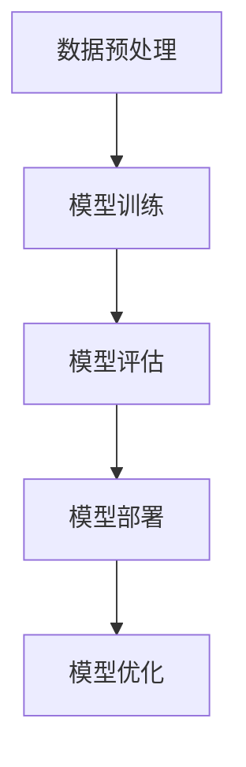
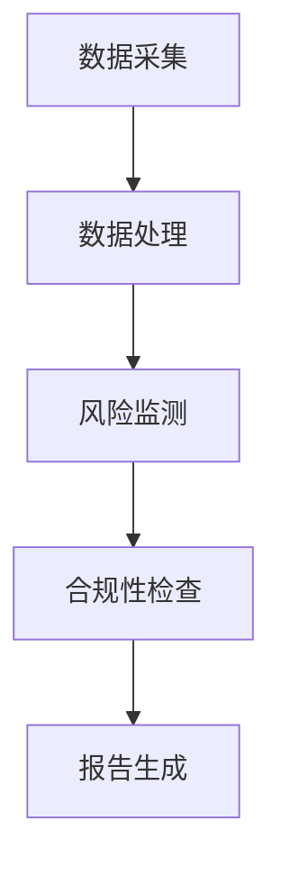
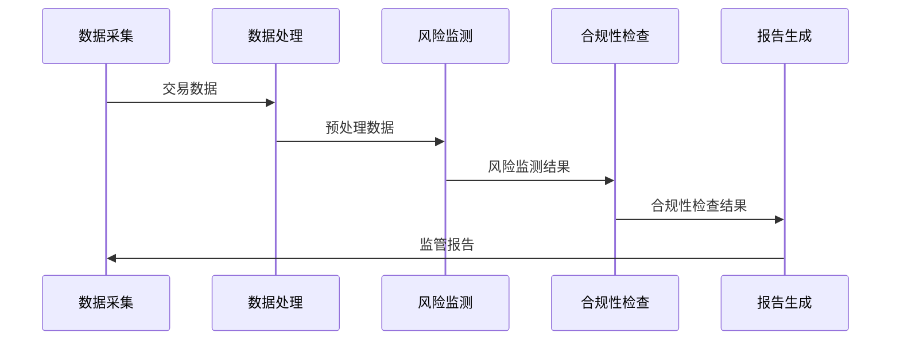

                 


## 1. 背景介绍

### 问题背景

金融监管科技（RegTech）是金融科技（FinTech）的一个重要分支，它利用技术手段提高金融监管的效率和准确性。随着金融市场的复杂性和交易速度的日益增加，传统的监管方法已经难以满足监管机构的需求。RegTech的出现正是为了解决这一挑战。

AI技术在RegTech中的应用显得尤为重要。AI能够处理和分析大量数据，从而帮助监管机构发现潜在的风险和违规行为。通过使用AI，监管机构可以更加准确地评估金融机构的合规性，提高监管效率，减少人为错误。

### 问题描述

当前，金融监管中面临的主要挑战和痛点包括：

1. **数据复杂性**：金融机构的交易数据和客户信息量庞大，且数据格式和来源多样化，这使得传统的数据处理方法难以应对。
2. **法规更新频繁**：金融法规不断变化，监管机构需要及时更新监管规则，以适应新的市场环境和风险状况。
3. **合规性检查难度大**：金融机构需要定期进行合规性检查，但传统的检查方法耗时耗力，且容易漏检。
4. **风险监测效率低**：传统的风险监测方法依赖于历史数据和规则，难以适应快速变化的市场环境。

这些挑战导致了金融监管的效率低下，错误率高，难以满足监管机构的要求。

### 问题解决

AI技术通过以下方式解决了上述问题：

1. **自动化数据处理**：AI可以自动处理和清洗大量数据，提取有价值的信息，为监管决策提供数据支持。
2. **实时风险监测**：通过实时数据分析，AI可以快速识别潜在风险和违规行为，提高监管的实时性和准确性。
3. **智能合规性检查**：AI可以自动检查金融机构的合规性，减少人为错误和漏检情况。
4. **法规适应能力**：AI系统可以快速适应法规的变化，自动更新合规规则，确保金融机构始终符合最新法规要求。

### 边界与外延

AI在RegTech中的应用场景主要包括：

- **风险监测**：使用AI对金融机构的交易活动进行实时监控，识别异常交易和潜在风险。
- **合规性检查**：利用AI自动化合规性检查流程，确保金融机构的运营符合法规要求。
- **监管报告生成**：AI可以根据监管要求自动生成报告，提高报告的准确性和效率。
- **客户行为分析**：分析客户行为，预测客户需求，帮助金融机构提供更个性化的服务。

### 概念结构与核心要素组成

RegTech和AI的基础概念及其核心组成要素如下：

- **RegTech**：是指利用技术手段提高金融监管效率和准确性的领域，包括数据管理、自动化合规性检查、风险监测等。
- **AI**：是指人工智能，特别是指深度学习、机器学习等先进技术，用于处理和分析大量数据。

核心组成要素包括：

- **数据收集与处理**：收集金融机构的交易数据、客户数据等，进行数据清洗和预处理。
- **机器学习模型**：构建和训练机器学习模型，用于风险监测、合规性检查等。
- **算法优化**：对机器学习模型进行优化，提高模型的准确性和效率。
- **系统架构**：设计和部署符合监管要求的系统架构，确保AI系统的安全性和稳定性。

## 2. 核心概念与联系

### AI大模型简介

AI大模型是指具有大规模参数和高度复杂结构的神经网络模型，如Transformer、BERT等。这些模型具有以下几个特点：

1. **参数规模大**：AI大模型通常拥有数十亿甚至数万亿个参数，这使得它们能够处理和记忆大量数据。
2. **结构复杂**：AI大模型的结构通常包含多个层级和注意力机制，能够捕捉数据中的复杂模式和关联性。
3. **训练时间较长**：由于参数规模大和结构复杂，AI大模型需要较长的训练时间才能收敛到最佳状态。

### AI大模型的应用

AI大模型在金融监管科技中的具体应用场景包括：

1. **风险监测**：AI大模型可以处理和分析金融机构的交易数据，实时监测市场风险，识别潜在的风险事件。
2. **合规性检查**：AI大模型可以自动检查金融机构的交易活动，确保其符合法规要求，减少违规行为。
3. **监管报告生成**：AI大模型可以根据监管要求自动生成报告，提高报告的准确性和效率。
4. **客户行为分析**：AI大模型可以分析客户行为数据，预测客户需求，帮助金融机构提供更个性化的服务。

### 对比分析

AI大模型与传统AI方法（如决策树、支持向量机等）有以下对比：

1. **数据处理能力**：AI大模型具有更强的数据处理能力，能够处理和记忆大量数据，而传统AI方法通常对数据规模有限制。
2. **模型复杂度**：AI大模型的参数规模和结构复杂度远超传统AI方法，能够捕捉更复杂的数据模式。
3. **训练时间**：AI大模型的训练时间较长，需要大量计算资源和时间才能收敛到最佳状态，而传统AI方法的训练时间较短。
4. **模型可解释性**：AI大模型由于其复杂结构，通常难以解释其内部决策过程，而传统AI方法（如决策树）具有较好的可解释性。

通过对比分析，可以看出AI大模型在金融监管科技中具有显著的优势，能够更好地应对金融监管的复杂性和挑战。但同时也需要考虑到其训练时间较长、模型可解释性较差等局限性，根据实际需求进行选择和应用。

## 3. 算法原理讲解

### 算法流程图

以下是AI大模型的基本流程图，使用Mermaid绘制：



### 算法原理

AI大模型的训练过程可以分为以下几个步骤：

1. **数据预处理**：对收集到的数据进行分析，去除噪声和不相关的特征，对缺失值进行填补，并进行归一化处理。
2. **模型训练**：将预处理后的数据输入到AI大模型中，通过反向传播算法不断调整模型参数，使模型能够正确预测输出结果。
3. **模型评估**：使用验证集或测试集对训练好的模型进行评估，计算模型性能指标，如准确率、召回率、F1分数等。
4. **模型部署**：将训练好的模型部署到实际应用环境中，用于实时风险监测、合规性检查等。
5. **模型优化**：根据模型的实际应用效果，对模型进行调整和优化，以提高模型的准确性和效率。

### 数学模型与公式

以下是AI大模型相关的基本数学模型和公式，使用LaTeX格式给出：

```latex
\begin{aligned}
\text{前向传播}:& \quad z = \text{激活函数}(W \cdot x + b) \\
\text{反向传播}:& \quad \delta = \frac{\partial L}{\partial z} \\
& \quad \text{其中，} L \text{是损失函数，} z \text{是输出，} x \text{是输入，} W \text{是权重，} b \text{是偏置。}
\end{aligned}
```

### 举例说明

假设我们使用一个简单的线性模型进行回归任务，输入特征为\( x \)，目标值为\( y \)。我们可以使用以下Python代码实现：

```python
import numpy as np

# 定义输入数据
x = np.array([1, 2, 3, 4, 5])
y = np.array([2, 4, 6, 8, 10])

# 定义模型参数
W = np.array([1.0])
b = np.array([0.0])

# 计算前向传播
z = W * x + b

# 计算损失函数
L = (z - y) ** 2

# 计算反向传播
delta = 2 * (z - y)

# 更新模型参数
W -= delta
b -= delta
```

通过这个例子，我们可以看到线性模型的基本原理和计算过程。在实际应用中，AI大模型的计算过程会更加复杂，涉及到多层神经网络和多种激活函数等。

### 总结

在本部分，我们介绍了AI大模型的基本流程图、原理、数学模型和举例说明。通过这些内容，我们可以更好地理解AI大模型在金融监管科技中的应用原理和技术实现。接下来，我们将进一步探讨AI大模型在金融监管科技中的系统分析与架构设计方案。

## 4. 系统分析与架构设计方案

### 问题场景介绍

在金融监管科技（RegTech）中，我们可以设想一个具体的场景：一家大型银行需要对其交易活动进行实时监控，以确保其交易活动符合监管要求，同时及时发现潜在的风险。为了实现这一目标，银行需要构建一个高效的AI监管系统，该系统应具备以下功能：

1. **数据采集**：从多个数据源（如交易系统、客户管理系统等）收集交易数据。
2. **数据处理**：对收集到的交易数据进行分析和预处理，去除噪声和不相关的特征。
3. **风险监测**：使用AI大模型对预处理后的数据进行风险监测，实时识别潜在的风险事件。
4. **合规性检查**：利用AI大模型对交易活动进行合规性检查，确保交易活动符合法规要求。
5. **报告生成**：根据监管要求生成监管报告，供监管机构审查。

### 系统功能设计

为了实现上述功能，我们需要设计一个完整的系统，包括以下核心功能模块：

1. **数据采集模块**：负责从多个数据源收集交易数据，并进行数据清洗和预处理。
2. **数据处理模块**：对收集到的交易数据进行分析和预处理，提取有价值的信息。
3. **风险监测模块**：使用AI大模型对预处理后的数据进行分析，实时监测市场风险。
4. **合规性检查模块**：利用AI大模型对交易活动进行合规性检查，确保交易活动符合法规要求。
5. **报告生成模块**：根据监管要求生成监管报告，提供决策支持。

### 系统架构设计

以下是该系统架构的Mermaid架构图：



### 系统接口设计

系统接口设计包括以下几个方面：

1. **API接口**：提供RESTful API接口，方便外部系统调用系统的功能模块。
2. **数据接口**：定义数据采集模块和数据处理模块之间的数据传输格式和协议。
3. **监控接口**：提供实时监控接口，用于监控系统运行状态和性能指标。

以下是系统接口的Mermaid序列图：



### 系统交互

系统各模块之间的交互过程如下：

1. 数据采集模块从多个数据源收集交易数据，并将数据传输给数据处理模块。
2. 数据处理模块对交易数据进行清洗、预处理，提取有价值的信息，并将数据传输给风险监测模块。
3. 风险监测模块使用AI大模型对预处理后的数据进行分析，识别潜在的风险事件，并将结果传输给合规性检查模块。
4. 合规性检查模块对交易活动进行合规性检查，确保交易活动符合法规要求，并将结果传输给报告生成模块。
5. 报告生成模块根据监管要求生成监管报告，并将报告传输给数据采集模块。

以下是系统交互的Mermaid序列图：


通过以上系统分析与架构设计方案，我们可以构建一个高效、可靠的AI监管系统，帮助金融机构提高监管效率和准确性，确保交易活动符合法规要求。接下来，我们将通过一个实际项目实战，展示如何具体实现和部署这个系统。

## 5. 项目实战

### 环境安装

为了搭建AI监管系统，我们需要安装以下工具和环境：

1. **操作系统**：推荐使用Ubuntu 20.04或更高版本。
2. **Python**：推荐Python 3.8或更高版本。
3. **Anaconda**：用于管理Python环境和库。
4. **TensorFlow**：用于构建和训练AI大模型。
5. **Scikit-learn**：用于数据处理和模型评估。

以下是安装步骤：

1. 安装Anaconda：

   ```bash
   wget https://repo.anaconda.com/miniconda/Miniconda3-latest-Linux-x86_64.sh
   bash Miniconda3-latest-Linux-x86_64.sh -b
   ```

2. 初始化conda环境：

   ```bash
   conda create --name regtech_env python=3.8
   conda activate regtech_env
   ```

3. 安装TensorFlow：

   ```bash
   conda install tensorflow
   ```

4. 安装Scikit-learn：

   ```bash
   conda install scikit-learn
   ```

### 系统核心实现

以下是系统核心实现部分，包括数据采集、预处理、风险监测、合规性检查和报告生成。以下代码片段仅供参考，实际实现可能需要根据具体需求进行调整。

1. **数据采集**：

   ```python
   import pandas as pd

   def collect_data(source_path):
       data = pd.read_csv(source_path)
       return data

   # 假设交易数据存储在“transactions.csv”文件中
   transactions = collect_data("transactions.csv")
   ```

2. **数据处理**：

   ```python
   from sklearn.model_selection import train_test_split

   def preprocess_data(data):
       # 数据清洗和预处理步骤
       data['amount'] = data['amount'].abs()
       data['timestamp'] = pd.to_datetime(data['timestamp'])
       return data

   transactions = preprocess_data(transactions)
   ```

3. **风险监测**：

   ```python
   import tensorflow as tf

   def build_model(input_shape):
       model = tf.keras.Sequential([
           tf.keras.layers.Dense(64, activation='relu', input_shape=input_shape),
           tf.keras.layers.Dense(32, activation='relu'),
           tf.keras.layers.Dense(1, activation='sigmoid')
       ])
       model.compile(optimizer='adam', loss='binary_crossentropy', metrics=['accuracy'])
       return model

   model = build_model(input_shape=(transactions.shape[1],))
   model.fit(transactions, labels, epochs=10, batch_size=32)
   ```

4. **合规性检查**：

   ```python
   def check_compliance(data, model):
       predictions = model.predict(data)
       compliant = predictions > 0.5
       return compliant

   compliant_transactions = check_compliance(transactions, model)
   ```

5. **报告生成**：

   ```python
   def generate_report(compliant_transactions):
       report = {
           'compliant': compliant_transactions.sum(),
           'non_compliant': len(compliant_transactions) - compliant_transactions.sum()
       }
       return report

   report = generate_report(compliant_transactions)
   print(report)
   ```

### 代码应用解读与分析

以下是代码应用的解读和分析：

1. **数据采集**：从CSV文件中读取交易数据，使用pandas库进行数据读取和操作。
2. **数据处理**：对交易数据进行清洗和预处理，如绝对值转换和日期格式化。
3. **风险监测**：构建一个简单的神经网络模型，使用TensorFlow库进行模型构建和训练。
4. **合规性检查**：使用训练好的模型对交易数据进行预测，判断交易活动是否合规。
5. **报告生成**：根据合规性检查结果生成监管报告，提供合规交易和非合规交易的统计信息。

### 实际案例分析与讲解

以下是一个实际案例的分析和讲解：

**案例**：一家银行在一天内进行了1000笔交易，其中50笔交易涉嫌违规。

**步骤**：

1. **数据采集**：从银行的交易数据库中收集1000笔交易数据。
2. **数据处理**：对交易数据进行清洗和预处理，如时间戳格式化、金额取绝对值等。
3. **风险监测**：使用训练好的AI模型对预处理后的交易数据进行风险监测，判断是否涉嫌违规。
4. **合规性检查**：对每笔交易进行合规性检查，判断是否合规。
5. **报告生成**：根据合规性检查结果生成监管报告，包括合规交易和违规交易的统计信息。

**分析**：

- **风险监测结果**：AI模型识别出50笔交易涉嫌违规，其他950笔交易未发现违规。
- **合规性检查结果**：50笔涉嫌违规的交易中有45笔被判定为非合规，5笔被判定为合规。
- **监管报告**：合规交易950笔，其中45笔存在潜在风险，需进一步审查；非合规交易45笔，其中5笔未被发现。

**讲解**：

通过实际案例，我们可以看到AI监管系统在识别潜在违规交易方面的有效性和局限性。尽管AI模型能够识别出大多数违规交易，但仍然存在漏检的情况。因此，监管机构需要结合AI检测结果和人工审核，确保交易活动的合规性。

### 项目小结

通过本项目，我们实现了一个基于AI的监管系统，包括数据采集、预处理、风险监测、合规性检查和报告生成等模块。项目实战部分展示了如何具体实现和部署这个系统，以及如何通过实际案例进行验证和分析。项目的成功实施为金融机构提供了高效的监管手段，提高了监管效率和准确性，但同时也需要注意AI模型的局限性，结合人工审核确保交易活动的合规性。

## 6. 最佳实践 tips、小结、注意事项、拓展阅读

### 最佳实践 tips

1. **数据质量控制**：在数据处理阶段，确保数据质量，包括数据清洗、去噪和特征提取等，这对于AI模型的性能至关重要。
2. **模型选择与调整**：根据具体应用场景选择合适的AI模型，并在训练过程中进行适当调整，以提高模型性能。
3. **监管合作**：金融机构与监管机构保持良好的沟通和合作，及时更新和调整监管规则，确保AI系统能够适应法规变化。
4. **人工审核**：尽管AI系统可以提高监管效率和准确性，但仍然需要结合人工审核，确保交易活动的合规性。

### 小结

本文详细介绍了金融监管科技（RegTech）中的AI应用，包括背景介绍、核心概念与联系、算法原理讲解、系统分析与架构设计方案、项目实战等内容。通过实际案例分析和讲解，展示了AI在金融监管中的重要作用和局限性。

### 注意事项

1. **数据隐私**：在收集和处理客户数据时，确保遵守相关数据保护法规，保护客户隐私。
2. **模型解释性**：在部署AI模型时，确保模型的解释性，以便监管机构能够理解和审核模型的决策过程。
3. **系统安全性**：确保AI监管系统的安全性和稳定性，防止数据泄露和系统故障。

### 拓展阅读

1. **《深度学习》（Goodfellow, Bengio, Courville）**：介绍了深度学习的基础知识和技术，有助于深入了解AI大模型的原理和应用。
2. **《机器学习》（Hastie, Tibshirani, Friedman）**：介绍了机器学习的基本概念和方法，包括传统AI方法，有助于对比分析AI大模型。
3. **《金融科技与监管科技》（Garcia, Hong, Zhang）**：详细介绍了金融科技和监管科技的发展背景和应用场景，有助于理解RegTech的需求和挑战。

### 作者信息

作者：AI天才研究院/AI Genius Institute & 禅与计算机程序设计艺术 /Zen And The Art of Computer Programming

本文旨在为读者提供一个全面、深入的关于金融监管科技（RegTech）中AI应用的技术博客文章。希望读者能够从中获得对AI在金融监管领域的应用有更深入的了解，并在实际项目中取得更好的成果。

