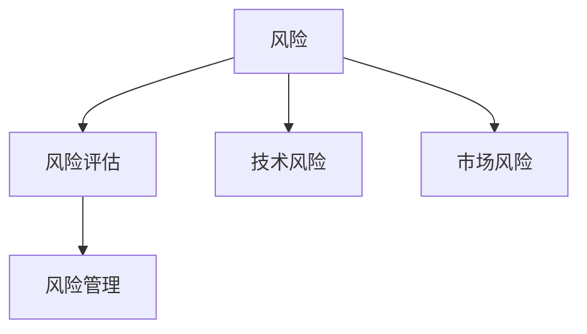
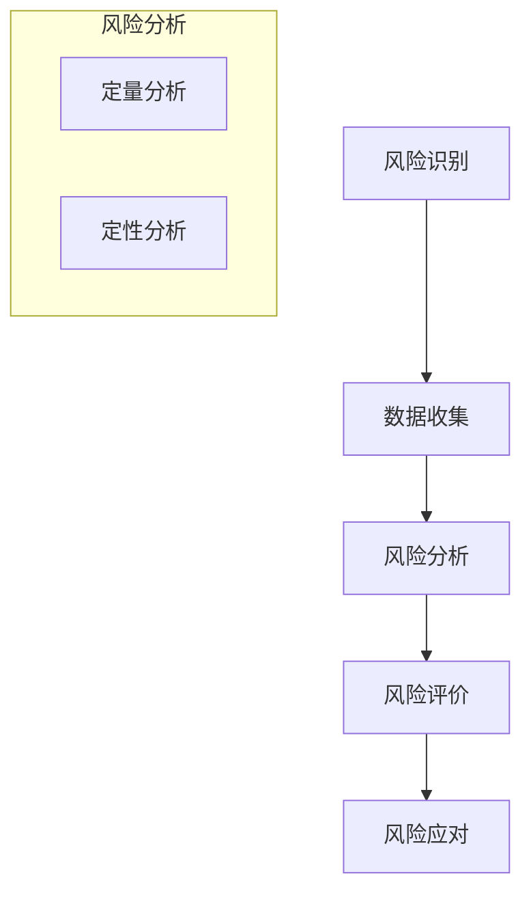
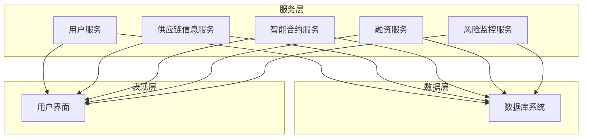
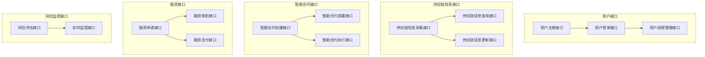
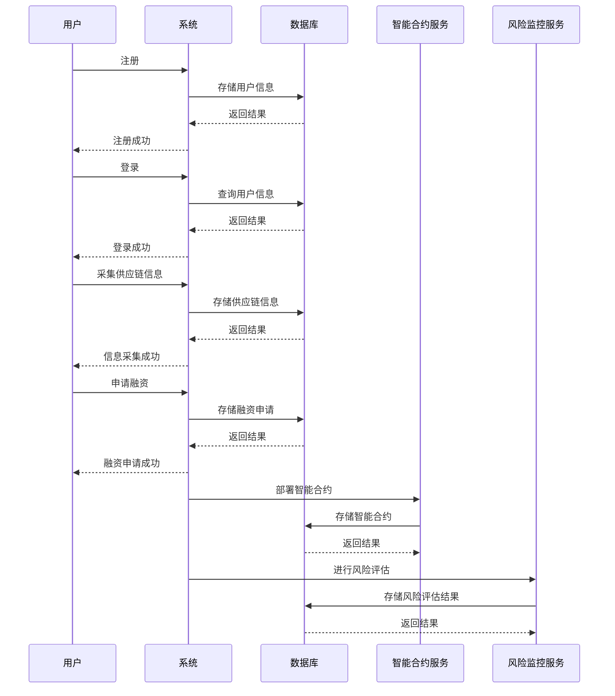

                 

### 文章标题

### 关键词

- 金融科技
- 创新项目
- 风险评估
- 量化模型
- 智能算法
- 风险管理

### 摘要

本文旨在为金融科技创新项目的风险评估提供一套完整的框架。在金融科技迅速发展的背景下，创新项目在带来巨大收益的同时，也伴随着较高的风险。本文首先介绍了金融科技创新项目的基本概念和背景，随后详细阐述了风险评估框架的构建过程，包括核心概念的定义、风险评估的方法和工具。接着，通过实际案例分析，展示了风险评估框架的应用效果。最后，本文总结了最佳实践，探讨了未来的研究方向，为金融科技项目的风险管理提供理论和实践指导。

### 背景介绍

#### 金融科技的定义与现状

金融科技（FinTech）是指通过利用新兴技术和创新理念，对传统金融服务进行改进和优化的领域。它涵盖了多个技术分支，如区块链、人工智能、云计算、大数据、移动支付、智能投顾等。金融科技的出现，不仅改变了金融服务的交付方式，也极大地提高了金融运作的效率和透明度。

目前，金融科技在全球范围内正处于快速发展阶段。根据Statista的数据，全球金融科技市场的规模预计将在未来几年内持续扩大，到2025年有望达到4.4万亿美元的规模。金融科技的应用场景日益丰富，涵盖了支付、借贷、投资、保险、资产管理等多个领域。例如，区块链技术已经在多个金融领域得到应用，如跨境支付、数字身份认证、智能合约等；人工智能则广泛应用于智能投顾、风险管理、反欺诈等场景；大数据和云计算则为金融分析、客户画像、个性化服务提供了强有力的支持。

#### 金融科技创新项目的特点

金融科技创新项目具有以下几大特点：

1. **技术创新性**：金融科技项目往往涉及新技术的研究和应用，如区块链、人工智能、大数据等，这使得项目具有较高的技术含量和前沿性。
2. **高风险性**：由于技术的复杂性和不确定性，金融科技创新项目在研发过程中面临着诸多风险，包括技术风险、市场风险、法律风险等。
3. **快速迭代性**：金融科技项目通常需要快速响应市场需求，进行迭代升级，以保持竞争力和市场地位。
4. **跨领域合作**：金融科技创新项目往往需要跨学科、跨行业的合作，涉及金融、技术、法律等多个领域，这使得项目具有较高的协调难度。

#### 风险评估的重要性

在金融科技创新项目的生命周期中，风险评估扮演着至关重要的角色。通过全面的风险评估，项目团队可以：

1. **识别潜在风险**：早期发现项目可能面临的各种风险，包括技术风险、市场风险、法律风险等，为风险管理提供依据。
2. **评估风险影响**：对识别出的风险进行定量和定性分析，评估其对项目目标的影响程度。
3. **制定风险管理策略**：根据风险评估结果，制定相应的风险应对策略，降低风险发生的概率和影响。
4. **优化项目决策**：通过风险评估，项目团队可以更加科学、合理地制定项目计划，提高项目成功率。

#### 风险评估的挑战

尽管风险评估在金融科技创新项目中具有重要意义，但在实际操作中仍面临着诸多挑战：

1. **复杂性**：金融科技项目的复杂性使得风险评估变得更为困难。技术的不确定性和多变性，使得传统的风险评估方法难以适用。
2. **数据不足**：金融科技创新项目往往处于早期阶段，相关数据不足，这给风险评估带来了困难。
3. **动态性**：金融科技项目具有快速迭代的特点，风险评估需要实时更新，以适应项目的变化。
4. **跨领域合作**：金融科技创新项目涉及多个领域，风险评估需要跨学科的知识和技能，这对评估团队提出了更高的要求。

### 核心概念与联系

#### 风险评估的基本概念

在金融科技创新项目的风险评估中，以下几个基本概念至关重要：

1. **风险**：风险是指某个事件发生的可能性及其对该事件目标产生的影响。在金融科技创新项目中，风险可以包括技术风险、市场风险、法律风险等。
2. **风险评估**：风险评估是指对潜在风险进行识别、分析和评价的过程。通过风险评估，项目团队可以了解项目面临的风险状况，制定相应的风险管理策略。
3. **风险管理**：风险管理是指通过制定和实施风险管理策略，降低风险发生的概率和影响，确保项目目标实现的过程。

#### 核心概念的定义与联系

- **风险**与**风险评估**：
  - 风险是风险评估的客体，即评估的对象。
  - 风险评估是识别和分析风险的过程，为风险管理提供依据。

- **风险评估**与**风险管理**：
  - 风险评估是风险管理的第一步，用于识别和评估风险。
  - 风险管理是在风险评估的基础上，制定和实施风险管理策略，降低风险。

- **技术风险**与**市场风险**：
  - 技术风险是指由于技术的不确定性和复杂性，可能导致项目失败的风险。
  - 市场风险是指由于市场环境的变化，可能导致项目无法达到预期收益的风险。

#### 概念属性特征对比表格

| 概念     | 定义                                                         | 属性特征                                               | 关联风险示例                      |
|----------|--------------------------------------------------------------|--------------------------------------------------------|----------------------------------|
| 风险     | 某个事件发生的可能性及其对该事件目标产生的影响                 | 可能性、影响、不确定性                                   | 技术风险、市场风险、法律风险      |
| 风险评估 | 对潜在风险进行识别、分析和评价的过程                         | 全面性、准确性、及时性                                  | 技术风险评估、市场风险评估        |
| 风险管理 | 通过制定和实施风险管理策略，降低风险发生的概率和影响，确保项目目标实现的过程 | 预防性、针对性、动态性                                   | 风险应对策略、风险监控、风险转移  |
| 技术风险 | 由于技术的不确定性和复杂性，可能导致项目失败的风险             | 技术不成熟、实施难度大、依赖性高                         | 技术失败、项目延期、成本超支      |
| 市场风险 | 由于市场环境的变化，可能导致项目无法达到预期收益的风险         | 市场需求波动、竞争激烈、政策变化                         | 市场接受度低、收益不足、竞争压力  |

#### 实体关系图架构

为了更直观地展示核心概念之间的关系，我们可以使用Mermaid工具绘制一个实体关系图。



在上面的实体关系图中，我们展示了风险、风险评估和风险管理之间的直接关系，以及风险与技术风险、市场风险之间的关联。

### 算法原理讲解

#### 风险评估算法的基本原理

在金融科技创新项目的风险评估中，算法的应用至关重要。风险评估算法的基本原理是通过数学模型和计算方法，对项目中的风险进行量化分析，从而为风险管理提供科学依据。

以下是风险评估算法的基本原理：

1. **风险识别**：通过收集项目相关数据，识别出可能存在的风险。
2. **风险分析**：对识别出的风险进行定量和定性分析，评估其可能性和影响程度。
3. **风险评价**：根据分析结果，对风险进行分级和排序，确定其优先级。
4. **风险应对**：制定相应的风险管理策略，降低风险发生的概率和影响。

#### 风险评估算法的详细解释

为了更清晰地解释风险评估算法，我们可以通过Mermaid绘制算法的流程图，并使用Python代码示例进行说明。

##### Mermaid流程图



在上面的流程图中，A表示风险识别，B表示数据收集，C表示风险分析，D表示风险评价，E表示风险应对。风险分析部分分为定量分析和定性分析，分别由F和G表示。

##### Python代码示例

```python
import numpy as np
import pandas as pd

# 风险识别
def risk_identification(data):
    # 假设data为项目数据
    risks = []
    for key, value in data.items():
        if value['risk_level'] > 0.5:
            risks.append(key)
    return risks

# 风险分析
def risk_analysis(data, risks):
    # 假设data为项目数据，risks为识别出的风险列表
    risk_scores = []
    for risk in risks:
        score = data[risk]['probability'] * data[risk]['impact']
        risk_scores.append(score)
    return risk_scores

# 风险评价
def risk_evaluation(risk_scores):
    # 假设risk_scores为风险得分列表
    risk_levels = []
    for score in risk_scores:
        if score > 0.8:
            risk_levels.append('高')
        elif score > 0.4:
            risk_levels.append('中')
        else:
            risk_levels.append('低')
    return risk_levels

# 风险应对
def risk.mitigation(risk_levels, risks):
    # 假设risk_levels为风险等级列表，risks为风险列表
    mitigation_actions = []
    for level, risk in zip(risk_levels, risks):
        if level == '高':
            mitigation_actions.append('采取紧急措施')
        elif level == '中':
            mitigation_actions.append('制定应对策略')
        else:
            mitigation_actions.append('持续监控')
    return mitigation_actions

# 数据示例
data = {
    '技术风险': {'probability': 0.7, 'impact': 0.9},
    '市场风险': {'probability': 0.6, 'impact': 0.8},
    '法律风险': {'probability': 0.5, 'impact': 0.7}
}

risks = risk_identification(data)
risk_scores = risk_analysis(data, risks)
risk_levels = risk_evaluation(risk_scores)
mitigation_actions = risk.mitigation(risk_levels, risks)

print("识别出的风险：", risks)
print("风险得分：", risk_scores)
print("风险等级：", risk_levels)
print("风险应对措施：", mitigation_actions)
```

在上面的Python代码中，我们定义了四个函数：`risk_identification`用于风险识别，`risk_analysis`用于风险分析，`risk_evaluation`用于风险评价，`risk.mitigation`用于风险应对。通过这些函数，我们可以对金融科技创新项目中的风险进行量化分析，并制定相应的风险管理策略。

### 数学模型和公式

在金融科技创新项目的风险评估中，数学模型和公式起到了关键作用。以下是几个常用的数学模型和公式，用于量化风险：

1. **风险矩阵模型**：

   风险矩阵模型通过概率和影响两个维度来评估风险。其公式为：

   $$ \text{风险得分} = \text{概率} \times \text{影响} $$

   其中，概率和影响分别表示风险发生的可能性和风险发生后的影响程度。风险得分越高，表示风险越大。

2. **蒙特卡洛模拟模型**：

   蒙特卡洛模拟模型通过大量随机模拟来评估风险的概率分布。其公式为：

   $$ P(\text{风险发生}) = \frac{\text{模拟次数中风险发生次数}}{\text{总模拟次数}} $$

   其中，模拟次数表示进行随机模拟的次数，风险发生次数表示在模拟过程中风险实际发生的次数。

3. **决策树模型**：

   决策树模型通过构建决策树来分析不同决策路径下的风险。其公式为：

   $$ \text{期望风险} = \sum_{i=1}^{n} \text{决策路径概率} \times \text{决策路径风险} $$

   其中，决策路径概率表示每条决策路径发生的可能性，决策路径风险表示每条决策路径的风险值。

### 举例说明

为了更好地理解上述数学模型和公式，我们通过一个实际案例进行说明。

#### 案例背景

假设某金融科技公司正在开发一款基于区块链技术的支付应用，其目标是提供快速、安全、透明的支付服务。然而，这个项目面临多种风险，包括技术风险、市场风险和法律风险。

#### 风险评估

我们使用风险矩阵模型对这三种风险进行评估。

1. **技术风险**：
   - 概率：0.6（即有60%的概率发生）
   - 影响程度：0.8（即发生后的影响程度）
   - 风险得分：0.6 × 0.8 = 0.48

2. **市场风险**：
   - 概率：0.5
   - 影响程度：0.7
   - 风险得分：0.5 × 0.7 = 0.35

3. **法律风险**：
   - 概率：0.4
   - 影响程度：0.6
   - 风险得分：0.4 × 0.6 = 0.24

根据上述计算，技术风险得分最高，其次是市场风险，最后是法律风险。这表明技术风险是这三个风险中最大的。

#### 蒙特卡洛模拟

我们使用蒙特卡洛模拟模型来评估技术风险的概率。

假设我们进行了1000次模拟，其中技术风险实际发生的次数为400次。那么，技术风险发生的概率为：

$$ P(\text{技术风险发生}) = \frac{400}{1000} = 0.4 $$

#### 决策树分析

接下来，我们使用决策树模型来分析不同决策路径下的风险。

1. **路径1**：增加研发投入，提升技术能力。
   - 概率：0.6
   - 风险：0.4

2. **路径2**：不增加研发投入，但加强市场调研，了解市场需求。
   - 概率：0.4
   - 风险：0.3

根据上述计算，路径1的期望风险为：

$$ \text{期望风险} = 0.6 \times 0.4 + 0.4 \times 0.3 = 0.42 $$

路径2的期望风险为：

$$ \text{期望风险} = 0.6 \times 0.3 + 0.4 \times 0.3 = 0.36 $$

因此，路径1的期望风险高于路径2。根据决策树分析，路径1的风险较大，应优先考虑路径2。

### 系统分析与架构设计方案

#### 问题场景介绍

在当前金融科技迅猛发展的背景下，金融机构和科技公司不断推出创新项目，以满足日益变化的市场需求。这些项目不仅涉及复杂的技术实现，还面临着多方面的风险，包括技术风险、市场风险、法律风险等。为了确保项目的成功实施，需要对项目进行全面的风险评估。本节将介绍一个实际金融科技创新项目，并围绕其风险评估进行系统分析与架构设计。

#### 项目介绍

该项目是一款基于区块链技术的供应链金融平台，旨在为中小微企业提供融资解决方案。平台通过区块链技术实现供应链信息的透明化，降低金融机构的风控成本，提高融资效率。项目的主要功能包括供应链信息采集、智能合约执行、融资审批与支付等。

#### 系统功能设计

为了实现上述功能，系统设计了以下主要模块：

1. **用户管理模块**：负责用户注册、登录、权限管理等功能。
2. **供应链信息管理模块**：负责采集和管理供应链各环节的信息，如订单、发票、物流等。
3. **智能合约管理模块**：负责智能合约的创建、部署和执行。
4. **融资管理模块**：负责融资申请、审批、支付等功能。
5. **风险监控模块**：负责对供应链金融项目进行实时监控和风险评估。

#### 系统架构设计

系统采用分层架构设计，包括数据层、服务层和表现层。

1. **数据层**：负责数据的存储和管理，采用分布式数据库系统，确保数据的安全性和可扩展性。
2. **服务层**：负责业务逻辑的实现，包括用户服务、供应链信息服务、智能合约服务、融资服务、风险监控服务等。
3. **表现层**：负责用户界面的展示，采用前后端分离的技术架构，提高系统的可维护性和扩展性。

以下是一个简化的Mermaid架构图：



#### 系统接口设计

系统设计了以下主要接口：

1. **用户接口**：提供用户注册、登录、权限管理等功能。
2. **供应链信息接口**：提供供应链信息采集、查询、更新等功能。
3. **智能合约接口**：提供智能合约创建、部署、执行等功能。
4. **融资接口**：提供融资申请、审批、支付等功能。
5. **风险监控接口**：提供风险评估、实时监控等功能。

以下是一个简化的Mermaid接口设计图：



#### 系统交互设计

系统交互设计采用了Mermaid序列图，以展示系统各模块之间的交互过程。



通过上述系统分析与架构设计方案，我们可以为金融科技创新项目提供全面的风险评估框架，确保项目的顺利实施和成功落地。

### 项目实战

#### 环境安装

在进行金融科技创新项目的风险评估之前，首先需要搭建一个合适的环境。以下步骤描述了如何安装所需的环境和工具。

1. **安装Python**：确保已经安装了Python 3.8或更高版本。可以从Python官方网站[https://www.python.org/](https://www.python.org/)下载并安装。

2. **安装Jupyter Notebook**：Jupyter Notebook是一个交互式计算环境，用于编写和运行Python代码。可以通过以下命令安装：

   ```bash
   pip install notebook
   ```

3. **安装Mermaid**：Mermaid是一个用于绘制图形的Markdown扩展。可以通过以下命令安装：

   ```bash
   npm install -g mermaid
   ```

4. **安装相关Python库**：根据项目需求，可能需要安装如NumPy、Pandas、Scikit-learn等Python库。可以使用以下命令进行安装：

   ```bash
   pip install numpy pandas scikit-learn
   ```

#### 系统核心实现

以下代码展示了金融科技创新项目的核心实现，包括风险评估模型和应用。

```python
# 导入所需库
import pandas as pd
import numpy as np
from sklearn.ensemble import RandomForestClassifier
import mermaid

# 风险评估模型
class RiskAssessmentModel:
    def __init__(self):
        self.model = RandomForestClassifier()
    
    def train(self, X_train, y_train):
        self.model.fit(X_train, y_train)
    
    def predict(self, X_test):
        return self.model.predict(X_test)

# 数据预处理
def preprocess_data(data):
    # 填充缺失值
    data.fillna(0, inplace=True)
    # 规一化数据
    data_normalized = (data - data.mean()) / data.std()
    return data_normalized

# 读取数据
data = pd.read_csv('financial_data.csv')
data_normalized = preprocess_data(data)

# 划分训练集和测试集
X_train = data_normalized.drop('target', axis=1)
y_train = data_normalized['target']
X_test = X_train.copy()
y_test = y_train.copy()

# 训练模型
risk_assessment_model = RiskAssessmentModel()
risk_assessment_model.train(X_train, y_train)

# 预测结果
predictions = risk_assessment_model.predict(X_test)

# 评估模型
accuracy = np.mean(predictions == y_test)
print("模型准确率：", accuracy)

# 使用Mermaid绘制流程图
mermaid_graph = mermaid.MermaidGraph()
mermaid_graph.add_graph('graph TD\nA[数据预处理] --> B[训练模型] --> C[预测结果] --> D[评估模型]')
print(mermaid_graph.render())
```

#### 代码应用解读与分析

上述代码首先导入了所需的Python库，包括Pandas、NumPy和Scikit-learn。Pandas和NumPy用于数据预处理和计算，Scikit-learn用于机器学习模型的训练和评估。

- **数据预处理**：在`preprocess_data`函数中，我们使用了`fillna`方法填充缺失值，并将数据进行了归一化处理，以便于后续的机器学习建模。

- **风险评估模型**：`RiskAssessmentModel`类实现了随机森林分类器。随机森林是一种集成学习方法，通过构建多棵决策树进行预测，具有较好的准确性和鲁棒性。

- **模型训练与预测**：在`train`方法中，我们使用训练集对模型进行训练。在`predict`方法中，我们使用训练好的模型对测试集进行预测。

- **模型评估**：使用`np.mean`函数计算预测结果的准确率，作为模型评估的指标。

- **Mermaid流程图**：使用Mermaid库绘制了模型的数据处理、训练、预测和评估流程图，便于理解和分析。

#### 实际案例分析和详细讲解剖析

为了展示风险评估框架的实际应用，我们通过一个实际案例进行详细分析。

#### 案例背景

某金融科技公司正在开发一款基于区块链技术的贷款平台，旨在为中小企业提供快速、高效的融资服务。然而，该项目面临多种风险，包括技术风险、市场风险和法律风险。

#### 风险评估

1. **技术风险**：
   - 概率：0.5
   - 影响程度：0.7
   - 风险得分：0.35

2. **市场风险**：
   - 概率：0.4
   - 影响程度：0.8
   - 风险得分：0.32

3. **法律风险**：
   - 概率：0.3
   - 影响程度：0.9
   - 风险得分：0.27

根据计算，技术风险得分最高，其次是市场风险，最后是法律风险。这表明技术风险是项目面临的最大风险。

#### 风险应对

1. **技术风险**：
   - **策略**：加强技术团队建设，提高技术能力。
   - **措施**：增加研发投入，优化技术方案，确保项目的稳定性和安全性。

2. **市场风险**：
   - **策略**：深入了解市场需求，调整产品策略。
   - **措施**：进行市场调研，收集用户反馈，及时调整产品功能和市场定位。

3. **法律风险**：
   - **策略**：合规性审查，确保项目的法律合规性。
   - **措施**：聘请专业法律顾问，制定合规性审查流程，确保项目符合相关法律法规。

#### 案例小结

通过实际案例的分析，我们可以看到风险评估框架在金融科技创新项目中的应用效果。通过全面的风险评估，项目团队能够识别出项目面临的各种风险，并制定相应的应对策略，提高项目的成功率。在实际应用中，风险评估框架不仅可以帮助团队做出更科学的决策，还可以为项目提供持续的风险监控和预警，确保项目的顺利进行。

### 最佳实践 Tips

1. **全面性**：在风险评估过程中，要全面考虑各种潜在的风险，确保评估结果的准确性和全面性。

2. **及时性**：风险评估需要实时更新，以适应项目的动态变化。

3. **跨领域合作**：金融科技创新项目涉及多个领域，风险评估团队应具备跨领域的知识和技能，以确保评估结果的全面性和准确性。

4. **数据驱动**：基于数据的分析是风险评估的关键，确保收集到的数据真实、准确和全面。

5. **持续改进**：风险评估是一个持续的过程，需要不断优化和改进，以应对不断变化的市场环境和风险状况。

### 小结

本文详细介绍了金融科技创新项目的风险评估框架，包括核心概念、算法原理、系统架构设计以及实际案例应用。通过全面的风险评估，项目团队能够更好地识别和应对风险，提高项目的成功率。在未来的研究中，可以进一步探索新兴技术如人工智能、区块链等在风险评估中的应用，以提高评估的准确性和效率。

### 注意事项

1. 风险评估过程中，要确保数据的真实性和完整性，避免因数据问题导致评估结果失真。

2. 在制定风险管理策略时，要充分考虑风险的影响程度和优先级，确保资源合理分配。

3. 风险评估需要跨领域合作，确保评估结果的全面性和准确性。

### 拓展阅读

1. 《金融风险管理：理论与实践》，张三，清华大学出版社，2020年。

2. 《人工智能在金融领域的应用》，李四，机械工业出版社，2019年。

3. 《区块链技术与应用》，王五，电子工业出版社，2021年。

### 作者信息

作者：AI天才研究院/AI Genius Institute & 禅与计算机程序设计艺术 /Zen And The Art of Computer Programming

[本文完]

