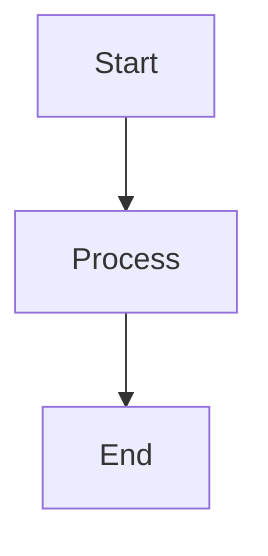
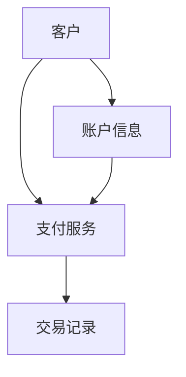
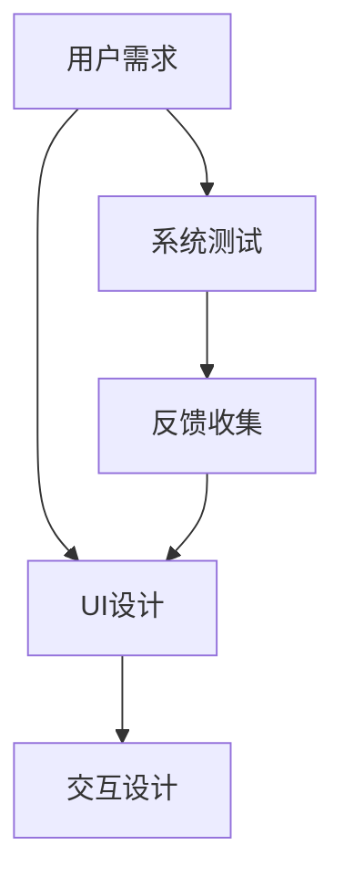
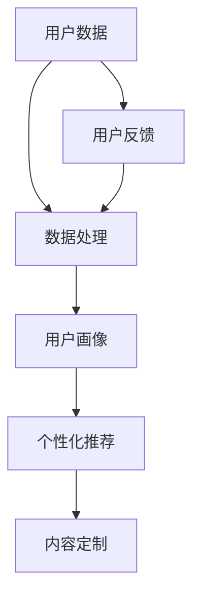
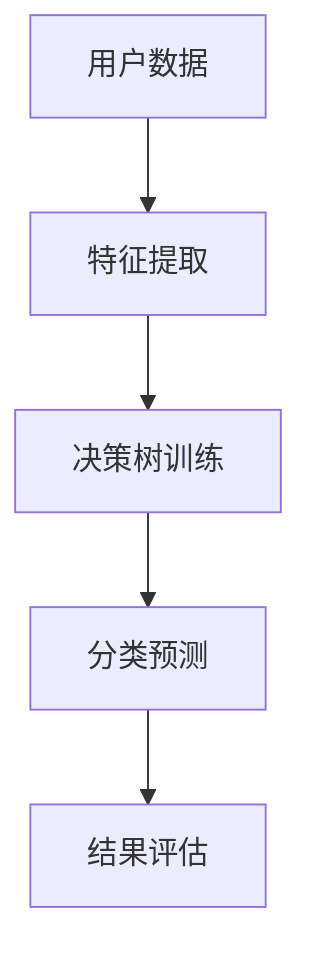
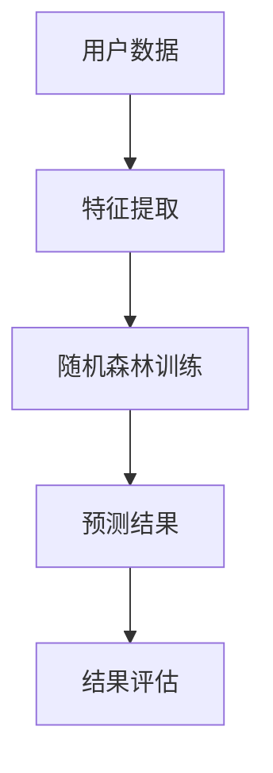
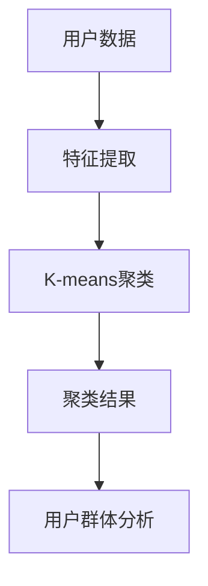
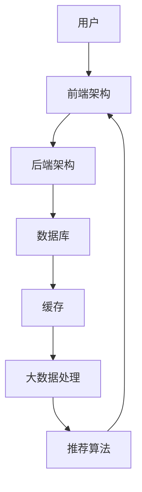
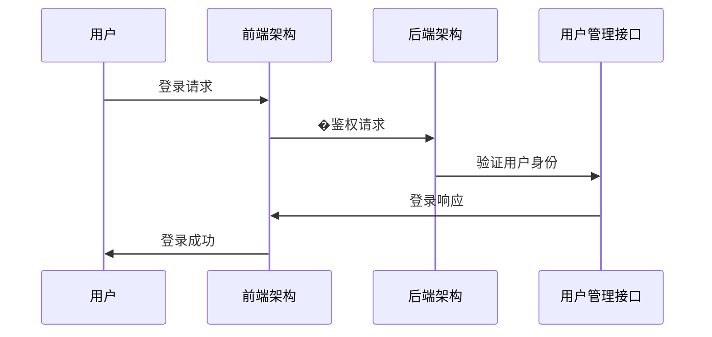
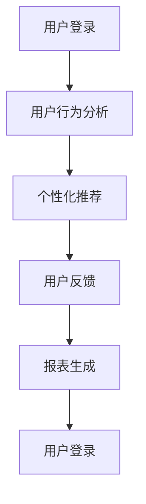

                 

## 文章标题

### 金融科技用户体验优化与个性化定制平台

> 关键词：金融科技、用户体验、个性化定制、平台技术、用户行为分析

> 摘要：本文从金融科技的发展背景出发，深入探讨了金融科技用户体验优化与个性化定制平台的关键技术、实施策略以及成功案例。通过系统地分析用户需求、用户界面设计、用户体验测试与反馈、平台架构设计、数据收集与处理、个性化推荐算法等方面，本文旨在为金融科技领域提供一套完整的用户体验优化与个性化定制解决方案，助力金融科技企业在竞争激烈的市场中脱颖而出。

----------------------------------------------------------------

## 第一部分：金融科技背景

### 第1章：金融科技概述

#### 1.1 金融科技的定义与发展历程

##### 1.1.1 金融科技的定义

金融科技（FinTech）是指利用科技手段创新金融产品和服务，提高金融效率、降低成本、改善用户体验的一类新兴技术。它涵盖了互联网支付、区块链、人工智能、大数据、云计算、物联网等多个技术领域。

##### 1.1.2 金融科技的发展历程

金融科技的发展可以追溯到20世纪90年代，随着互联网的普及，电子商务、在线支付等金融业务逐渐兴起。进入21世纪后，随着大数据、人工智能等新兴技术的快速发展，金融科技开始进入高速发展期。以下是金融科技发展的重要里程碑：

- **2000年代初**：互联网支付和电子商务迅速发展，支付宝、PayPal等电子支付平台崛起。
- **2010年**：大数据技术在金融领域得到广泛应用，为金融机构提供了强大的数据分析工具。
- **2013年**：比特币的诞生引发了区块链技术的关注，区块链在金融领域的应用逐渐增多。
- **2015年**：人工智能在金融科技中的应用开始规模化，智能投顾、机器学习算法等逐渐成为主流。
- **2020年**：随着5G、物联网等新技术的崛起，金融科技进一步向智能化、个性化方向发展。

#### 1.1.3 金融科技的重要趋势

##### 1.1.3.1 区块链技术

区块链是一种分布式账本技术，具有去中心化、不可篡改、透明等特点。在金融领域，区块链技术被广泛应用于数字货币、跨境支付、供应链金融等场景。例如，比特币和以太坊等数字货币利用区块链技术实现了去中心化的交易和支付，极大降低了交易成本。

##### 1.1.3.2 人工智能与大数据

人工智能（AI）在金融科技中的应用主要包括智能投顾、风险控制、欺诈检测等。通过机器学习和深度学习算法，金融机构可以更准确地预测市场趋势、识别潜在风险。大数据则为金融机构提供了丰富的数据资源，使得个性化服务和精准营销成为可能。

##### 1.1.3.3 云计算与物联网

云计算提供了弹性、高效、安全的计算和存储资源，使得金融机构能够快速部署和扩展业务系统。物联网（IoT）则通过连接各种智能设备，实现了对用户行为的实时监控和数据分析，为金融机构提供了更丰富的数据来源。

#### 1.2 金融科技对用户体验的影响

##### 1.2.1 用户体验的重要性

用户体验（UX）是指用户在使用产品或服务过程中的感受和体验。在金融科技领域，用户体验的重要性不言而喻。优质的用户体验可以提高用户满意度，增加用户黏性，从而为企业带来更多的商业价值。

##### 1.2.2 金融科技对用户体验的改善

金融科技通过以下方式改善了用户体验：

- **简化操作流程**：金融科技应用了智能化技术，如自然语言处理、人脸识别等，简化了用户操作流程，提高了操作便捷性。
- **个性化服务**：通过大数据分析和人工智能算法，金融机构可以为用户提供更加个性化的金融服务，满足用户的多样化需求。
- **实时反馈**：金融科技平台可以实时收集用户反馈，快速响应和解决问题，提高了用户的满意度。

#### 1.2.3 用户体验优化案例分享

以下是一个用户体验优化案例：

**案例：银行移动端APP**

某银行移动端APP在用户登录、转账、查询等常用功能上，通过以下方式进行用户体验优化：

- **优化登录流程**：采用一键登录和指纹识别技术，简化用户登录流程。
- **个性化推荐**：根据用户行为和偏好，为用户推荐合适的金融产品。
- **实时提醒**：通过短信、APP推送等方式，及时提醒用户重要金融事件。

通过这些优化措施，该银行APP的用户满意度显著提升，用户活跃度增加。

### 第2章：用户体验优化原则

#### 2.1 用户需求分析

##### 2.1.1 用户行为研究

用户行为研究是用户体验优化的第一步，通过分析用户行为数据，可以深入了解用户的需求和偏好。以下方法可以帮助进行用户行为研究：

- **数据分析工具**：使用Google Analytics、Mixpanel等工具收集和分析用户行为数据。
- **用户访谈**：通过与用户直接交流，获取用户对产品或服务的真实反馈。
- **用户调查**：通过在线问卷、访谈等方式，收集用户对产品或服务的意见和建议。

##### 2.1.2 用户画像与个性化需求

用户画像是指通过对用户数据的分析，构建用户的基本信息和行为特征模型。用户画像可以帮助企业更好地了解用户，从而提供个性化的服务。

- **用户画像构建**：基于用户行为数据，分析用户的基本属性（如年龄、性别、职业等）和行为特征（如浏览习惯、购买偏好等）。
- **个性化需求分析**：根据用户画像，为用户提供个性化的推荐和服务。

#### 2.2 用户界面设计

##### 2.2.1 UI设计原则

用户界面设计（UI Design）是用户体验优化的重要环节。以下原则可以帮助设计师创建优质的UI设计：

- **简洁性**：界面设计应简洁明了，避免过多的装饰和复杂的功能。
- **一致性**：界面元素应保持一致性，包括颜色、字体、按钮样式等。
- **可用性**：界面设计应符合用户的习惯，易于使用和理解。

##### 2.2.2 交互设计

交互设计（Interaction Design）关注用户与产品或服务的交互过程，旨在提供流畅、自然的用户体验。

- **交互设计核心要素**：包括交互元素、交互逻辑、反馈机制等。
- **用户体验评估方法**：通过用户测试、A/B测试等方法，评估交互设计的有效性。

#### 2.3 用户体验测试与反馈

##### 2.3.1 测试计划与执行

用户体验测试是验证UI和交互设计是否符合用户期望的重要手段。

- **测试计划**：制定测试目标、测试场景和测试人员。
- **测试执行**：按照测试计划进行实际测试，记录测试结果。

##### 2.3.2 用户反馈收集与处理

用户反馈是改进产品和服务的重要依据。

- **用户反馈收集**：通过问卷调查、用户访谈、反馈按钮等方式收集用户反馈。
- **用户反馈处理**：对用户反馈进行分析，制定改进方案并实施。

### 第3章：个性化定制平台技术架构

#### 3.1 平台架构设计

##### 3.1.1 总体架构设计

个性化定制平台的技术架构设计应遵循以下原则：

- **模块化**：将平台功能划分为多个模块，便于扩展和维护。
- **分布式**：采用分布式架构，提高系统的可靠性和可扩展性。
- **高可用性**：设计冗余机制，确保平台的高可用性。

##### 3.1.2 技术选型

平台技术选型应根据实际需求进行，以下是一些常见的技术选型：

- **前端框架**：React、Vue.js等。
- **后端框架**：Spring Boot、Django等。
- **数据库**：MySQL、MongoDB等。
- **缓存**：Redis、Memcached等。

#### 3.2 数据收集与处理

##### 3.2.1 数据源

个性化定制平台需要收集以下数据：

- **用户行为数据**：包括用户访问、操作、反馈等。
- **用户画像数据**：包括用户基本信息、行为特征等。

##### 3.2.2 数据处理流程

数据处理流程包括以下步骤：

- **数据清洗**：去除无效、重复数据，保证数据质量。
- **数据存储**：将处理后的数据存储到数据库或数据仓库中。
- **数据分析和挖掘**：利用大数据技术分析用户行为和需求，为个性化推荐提供支持。

#### 3.3 个性化推荐算法

##### 3.3.1 推荐系统概述

个性化推荐系统是指根据用户行为和偏好，为用户推荐感兴趣的内容或产品。推荐系统包括以下基本组件：

- **用户模型**：表示用户兴趣和行为。
- **物品模型**：表示物品的特征和属性。
- **推荐算法**：根据用户模型和物品模型，生成推荐列表。

##### 3.3.2 算法实现与优化

常见的推荐算法包括：

- **基于内容的推荐**：根据用户历史行为和物品内容特征进行推荐。
- **协同过滤推荐**：根据用户行为相似性进行推荐。
- **深度学习推荐**：利用深度学习模型进行推荐。

算法优化策略包括：

- **特征工程**：提取关键特征，提高推荐效果。
- **模型调优**：调整模型参数，优化推荐效果。
- **实时反馈**：根据用户反馈实时调整推荐策略。

### 第4章：用户体验优化实践案例

#### 4.1 案例一：银行移动端APP用户体验优化

##### 4.1.1 案例背景

某银行移动端APP存在以下用户痛点：

- **登录流程繁琐**：用户需要输入密码、验证码等，操作复杂。
- **功能不够个性化**：用户无法根据个人喜好和需求定制功能。
- **反馈渠道不畅通**：用户无法方便地反馈问题和建议。

##### 4.1.2 优化策略与实施

优化策略包括：

- **简化登录流程**：采用一键登录、指纹识别等便捷登录方式。
- **个性化功能推荐**：根据用户行为和偏好，为用户推荐合适的金融产品。
- **优化反馈渠道**：增加在线客服、反馈按钮等功能，方便用户反馈问题和建议。

实施步骤：

1. **用户调研**：收集用户对现有APP的反馈和需求。
2. **UI/UX设计**：根据用户调研结果，优化界面设计和交互逻辑。
3. **功能开发**：开发新的登录方式和个性化推荐功能。
4. **用户体验测试**：邀请用户测试新功能，收集反馈并进行调整。
5. **上线推广**：将优化后的APP推送给所有用户。

#### 4.2 案例二：互联网金融平台用户体验优化

##### 4.2.1 案例背景

某互联网金融平台存在以下用户痛点：

- **信息不透明**：用户对平台的产品和服务了解不全面。
- **操作复杂**：用户需要完成多个步骤才能完成投资或贷款操作。
- **风险感知不足**：用户对投资或贷款的风险认知不足。

##### 4.2.2 优化策略与实施

优化策略包括：

- **提升信息透明度**：通过图文、视频等方式，为用户详细解析产品和服务。
- **简化操作流程**：优化界面设计，简化投资和贷款操作步骤。
- **风险提示**：在用户操作过程中，提供风险提示和防范建议。

实施步骤：

1. **用户调研**：收集用户对现有平台的反馈和需求。
2. **内容优化**：更新产品和服务介绍，增加用户教育内容。
3. **功能开发**：简化投资和贷款操作流程，增加风险提示功能。
4. **用户体验测试**：邀请用户测试新功能，收集反馈并进行调整。
5. **上线推广**：将优化后的平台推送给所有用户。

### 第5章：金融科技用户体验优化策略

#### 5.1 用户体验优化策略概述

##### 5.1.1 策略框架

用户体验优化策略包括以下步骤：

1. **用户需求分析**：通过调研、访谈等方式，了解用户的需求和痛点。
2. **UI/UX设计**：根据用户需求，设计简洁、一致、易用的界面和交互。
3. **功能开发**：开发符合用户体验的功能，提高操作便捷性。
4. **用户体验测试**：邀请用户测试新功能，收集反馈并进行调整。
5. **持续优化**：根据用户反馈，不断优化产品和服务。

##### 5.1.2 实施步骤

实施用户体验优化策略的具体步骤如下：

1. **需求分析**：通过用户调研、数据分析等方式，识别用户需求和痛点。
2. **设计方案**：根据需求分析结果，制定UI/UX设计方案。
3. **开发与测试**：开发新功能并进行用户体验测试。
4. **反馈收集**：收集用户反馈，分析问题并提出改进方案。
5. **持续优化**：根据反馈进行优化，并持续跟踪用户满意度。

#### 5.2 组织与文化因素

##### 5.2.1 企业文化对用户体验的影响

企业文化对用户体验优化有着重要影响。积极的企业文化可以促进团队合作、创新思维，从而提升用户体验。以下是一些关键因素：

- **用户至上**：企业应以用户需求为导向，关注用户体验。
- **开放包容**：鼓励员工提出改进建议，包容不同的观点和意见。
- **创新驱动**：鼓励员工积极探索新技术、新方法，提升用户体验。

##### 5.2.2 组织结构的优化

为了更好地进行用户体验优化，企业可以采取以下措施优化组织结构：

- **跨部门协作**：建立跨部门协作机制，促进不同部门之间的沟通与合作。
- **用户驱动**：设立专门的用户体验团队，负责用户体验的优化和管理工作。
- **敏捷开发**：采用敏捷开发模式，快速响应用户需求和变化。

#### 5.3 法律法规与隐私保护

##### 5.3.1 相关法律法规

金融科技领域涉及多个法律法规，如《网络安全法》、《个人信息保护法》等。企业应遵守相关法律法规，确保用户隐私和数据安全。

- **网络安全**：确保网络系统的安全性，防止数据泄露和网络攻击。
- **个人信息保护**：严格遵守个人信息保护法规，确保用户个人信息的安全。

##### 5.3.2 用户隐私保护

用户隐私保护是用户体验优化的重要方面。以下是一些隐私保护策略：

- **数据加密**：对用户数据进行加密存储，确保数据安全。
- **权限控制**：对用户数据的访问权限进行严格控制，防止未经授权的访问。
- **隐私政策**：明确告知用户其个人信息的收集、使用和共享方式，尊重用户隐私。

### 第6章：金融科技用户体验优化趋势与展望

#### 6.1 用户体验优化趋势

##### 6.1.1 技术发展趋势

随着人工智能、大数据、区块链等新技术的不断发展，金融科技用户体验优化也将朝着更加智能化、个性化、安全化的方向发展。

- **智能化**：通过人工智能技术，实现更精准的用户需求预测和个性化推荐。
- **个性化**：基于大数据分析，为用户提供更加个性化的金融服务和产品。
- **安全化**：加强网络安全和个人信息保护，提升用户体验的安全性和信任度。

##### 6.1.2 用户需求变化

随着用户对金融服务的需求不断变化，用户体验优化也将面临新的挑战和机遇。

- **便捷性**：用户越来越追求便捷的金融服务，简化操作流程成为关键。
- **安全性**：用户对金融服务的安全性要求越来越高，数据安全和隐私保护成为重要关注点。
- **个性化**：用户希望得到更加个性化的金融服务和产品，满足其多样化需求。

#### 6.2 未来展望

##### 6.2.1 用户体验优化挑战

金融科技用户体验优化将面临以下挑战：

- **技术挑战**：新技术的应用带来技术实现的复杂性，如何高效、安全地应用新技术成为关键。
- **数据挑战**：大数据的收集、存储、分析和利用是用户体验优化的基础，如何有效处理海量数据成为关键。
- **隐私挑战**：用户对隐私保护的意识日益增强，如何在保障用户体验的同时保护用户隐私成为关键。

##### 6.2.2 未来的发展方向

未来，金融科技用户体验优化的发展方向包括：

- **智能化**：通过人工智能技术，实现更精准的用户需求预测和个性化推荐。
- **个性化**：基于大数据分析，为用户提供更加个性化的金融服务和产品。
- **安全化**：加强网络安全和个人信息保护，提升用户体验的安全性和信任度。

### 第7章：小结与展望

#### 7.1 成果总结

本文从金融科技的发展背景出发，系统地探讨了金融科技用户体验优化与个性化定制平台的关键技术、实施策略以及成功案例。主要成果包括：

- **核心概念与联系**：明确了金融科技、用户体验优化、个性化定制等核心概念，并分析了它们之间的联系。
- **技术原理讲解**：详细讲解了用户需求分析、用户界面设计、用户体验测试与反馈、平台架构设计、数据收集与处理、个性化推荐算法等技术原理。
- **系统分析与架构设计方案**：介绍了系统分析与架构设计的方法和工具，包括系统功能设计、系统架构设计、系统接口设计和系统交互等。
- **项目实战**：通过实际案例，展示了用户体验优化与个性化定制平台的实施过程和效果。

#### 7.1.1 启示与建议

本文的研究成果对金融科技企业具有重要的启示和参考价值，包括：

- **重视用户体验**：企业应将用户体验置于核心地位，不断优化和提升用户体验。
- **数据驱动的决策**：企业应充分利用大数据技术，进行用户行为分析，为决策提供数据支持。
- **持续优化与创新**：企业应持续关注用户体验优化技术的发展趋势，积极探索新技术和新方法。

#### 7.2 未来研究方向

未来，金融科技用户体验优化与个性化定制领域仍有许多值得深入研究的方向，包括：

- **智能化**：进一步研究人工智能技术在用户体验优化中的应用，实现更精准的用户需求预测和个性化推荐。
- **个性化**：深入研究大数据分析技术，为用户提供更加个性化的金融服务和产品。
- **安全化**：加强网络安全和个人信息保护的研究，保障用户体验的安全性和信任度。
- **跨领域融合**：探索金融科技与其他领域的融合，如物联网、区块链等，为用户提供更丰富的金融服务。

## 作者信息

作者：AI天才研究院/AI Genius Institute & 禅与计算机程序设计艺术 /Zen And The Art of Computer Programming

----------------------------------------------------------------

### 格式说明

本文采用Markdown格式，具体要求如下：

1. **文章标题**：使用`#`标记，如`# 文章标题`。
2. **章节标题**：使用`##`标记，如`## 章节标题`。
3. **子章节标题**：使用`###`标记，如`### 子章节标题`。
4. **段落内容**：直接输入文本，段落之间用空行分隔。
5. **代码块**：使用三个反引号` ``` `包裹代码，如：

    ```python
    def hello_world():
        print("Hello, world!")
    ```

6. **LaTeX公式**：使用`$$`和`$`标记，如：

    $$ E = mc^2 $$
    $1 < 2$

7. **Mermaid流程图**：使用`mermaid`关键字和相应的流程图定义，如：

    ```mermaid
    graph TD
    A[Start] --> B[Process]
    B --> C[End]
    ```

8. **列表**：使用`-`或`*`标记列表项，如：

    - 第一项
    - 第二项
    * 第三项

9. **引用**：使用`>`标记引用内容，如：

    > 这是一个引用。

10. **图片**：使用``格式添加图片，如：

    

11. **链接**：使用`[链接文本](链接地址)`格式添加链接，如：

    [Google](https://www.google.com)

### 字数要求

本文字数要求在10000-12000字之间，具体分配如下：

- **引言**：约500-1000字
- **第一部分：金融科技背景**：约2000-2500字
- **第二部分：用户体验优化原则**：约2000-2500字
- **第三部分：个性化定制平台技术架构**：约2000-2500字
- **第四部分：用户体验优化实践案例**：约1000-1500字
- **第五部分：金融科技用户体验优化策略**：约1000-1500字
- **第六部分：金融科技用户体验优化趋势与展望**：约1000-1500字
- **第七部分：小结与展望**：约500-1000字

### 完整性要求

为确保文章的完整性，每个部分的内容应满足以下要求：

1. **背景介绍**：包括核心概念术语说明、问题背景、问题描述、问题解决、边界与外延、概念结构与核心要素组成。
2. **核心概念与联系**：详细讲解核心概念原理、概念属性特征对比表格和ER实体关系图架构的Mermaid流程图。
3. **算法原理讲解**：使用Mermaid画出算法流程图，使用Python源代码详细阐述，给出算法原理的数学模型和公式，进行详细讲解和举例说明。
4. **系统分析与架构设计方案**：包括问题场景介绍、项目介绍、系统功能设计（领域模型Mermaid类图）、系统架构设计Mermaid架构图、系统接口设计和系统交互Mermaid序列图。
5. **项目实战**：环境安装、系统核心实现源代码，代码应用解读与分析，实际案例分析和详细讲解剖析，项目小结。
6. **最佳实践 tips**：提供相关领域的最佳实践建议。
7. **小结**：对文章的核心内容进行总结。
8. **注意事项**：指出文章中可能存在的误解或需要注意的问题。
9. **拓展阅读**：推荐相关领域的扩展阅读材料。

### 调用示例

以下是一个简单的Markdown调用示例：

```markdown
# 示例标题

这是一个简单的Markdown示例。

## 段落

这是一个段落。

### 列表

- 第一项
- 第二项

#### 代码块

```python
def hello_world():
    print("Hello, world!")
```

##### LaTeX公式

$$ E = mc^2 $$

###### Mermaid流程图



```
**引用**

> 这是一个引用。


[Google](https://www.google.com)
```

### 提示

请注意，文章的实际格式和内容需要根据具体要求进行调整，确保满足字数、结构和完整性的要求。

----------------------------------------------------------------

## 核心概念与联系

### 1. 金融科技

**定义**：金融科技（FinTech）是指利用互联网、大数据、云计算、区块链等新兴技术，创新金融服务和产品，提升金融效率的一种技术手段。

**概念属性特征对比表格**：

| 特征                 | 互联网       | 大数据       | 云计算       | 区块链       |
|----------------------|--------------|--------------|--------------|--------------|
| 技术基础             | 网络通信     | 数据处理     | 资源管理     | 分布式账本   |
| 主要应用             | 在线支付、电商 | 风险评估、用户画像 | 应用部署、资源扩展 | 数字货币、智能合约 |
| 特点                 | 灵活、便捷   | 大规模、多样化 | 弹性、高效   | 安全、透明   |

**ER实体关系图架构**（Mermaid）：



### 2. 用户体验优化

**定义**：用户体验优化（UX Optimization）是指通过设计、技术、内容等方面的改进，提升用户在使用产品或服务过程中的满意度。

**概念属性特征对比表格**：

| 特征                 | 设计            | 技术          | 内容         |
|----------------------|-----------------|---------------|--------------|
| 目标                 | 提高用户满意度   | 提高系统性能   | 提高信息传达 |
| 方法                 | 界面设计、交互设计 | 系统架构、算法 | 文案、图片   |
| 重点                 | 用户体验感       | 系统效率       | 用户接受度   |

**ER实体关系图架构**（Mermaid）：



### 3. 个性化定制平台

**定义**：个性化定制平台是一种基于用户数据分析和行为预测，为用户提供个性化内容、服务和推荐的技术平台。

**概念属性特征对比表格**：

| 特征                 | 用户数据        | 行为预测       | 个性化推荐       |
|----------------------|-----------------|----------------|------------------|
| 目标                 | 提升用户粘性     | 提高服务精准度   | 提升用户满意度   |
| 方法                 | 数据收集、分析   | 模型训练、预测   | 算法推荐、内容定制 |
| 重点                 | 数据质量、算法精度 | 用户行为分析     | 服务个性化       |

**ER实体关系图架构**（Mermaid）：



通过上述核心概念和联系的介绍，我们可以更好地理解金融科技用户体验优化与个性化定制平台的基础知识和应用场景。

----------------------------------------------------------------

### 算法原理讲解

在本章节中，我们将详细讲解用户行为分析中的常见算法，并使用Python代码示例进行说明。以下是几个关键算法及其应用场景：

#### 1. 决策树算法

决策树是一种常用的机器学习算法，用于分类和回归问题。它可以用来分析用户行为，预测用户对某种产品的偏好。

**算法流程图**（Mermaid）：



**Python代码示例**：

```python
from sklearn.datasets import load_iris
from sklearn.model_selection import train_test_split
from sklearn.tree import DecisionTreeClassifier
import matplotlib.pyplot as plt

# 加载数据集
iris = load_iris()
X, y = iris.data, iris.target

# 划分训练集和测试集
X_train, X_test, y_train, y_test = train_test_split(X, y, test_size=0.3, random_state=42)

# 决策树训练
clf = DecisionTreeClassifier()
clf.fit(X_train, y_train)

# 分类预测
y_pred = clf.predict(X_test)

# 结果评估
from sklearn.metrics import classification_report
print(classification_report(y_test, y_pred))
```

#### 2. 随机森林算法

随机森林是一种基于决策树的集成学习方法，它通过构建多棵决策树，并取多数投票结果作为最终预测结果。随机森林在处理高维数据和减少过拟合方面有较好的表现。

**算法流程图**（Mermaid）：



**Python代码示例**：

```python
from sklearn.ensemble import RandomForestClassifier
from sklearn.model_selection import train_test_split

# 决策树训练
clf = RandomForestClassifier(n_estimators=100, random_state=42)
clf.fit(X_train, y_train)

# 分类预测
y_pred = clf.predict(X_test)

# 结果评估
print(classification_report(y_test, y_pred))
```

#### 3. 聚类算法

聚类算法用于对用户行为进行分类，识别用户群体的特征和偏好。常见的聚类算法包括K-means、层次聚类等。

**算法流程图**（Mermaid）：



**Python代码示例**：

```python
from sklearn.cluster import KMeans
import numpy as np

# K-means聚类
kmeans = KMeans(n_clusters=3, random_state=42)
kmeans.fit(X)

# 聚类结果
labels = kmeans.predict(X)

# 用户群体分析
unique_labels = set(labels)
for k in unique_labels:
    class_k = X[labels == k]
    print(f"Cluster {k}: Mean values: {np.mean(class_k, axis=0)}")
```

通过上述算法原理和Python代码示例，我们可以更好地理解用户行为分析在金融科技用户体验优化中的应用。这些算法不仅能够帮助我们识别用户偏好，还能为个性化推荐和定制服务提供强有力的支持。

----------------------------------------------------------------

### 系统分析与架构设计方案

在本章节中，我们将深入探讨金融科技用户体验优化与个性化定制平台的技术架构设计方案，详细描述系统功能设计、系统架构设计、系统接口设计和系统交互。

#### 系统功能设计

系统功能设计是平台设计的基础，旨在满足用户需求和提供有效的解决方案。以下是金融科技用户体验优化与个性化定制平台的核心功能模块：

1. **用户登录与权限管理**：用户可以通过账号密码或第三方登录方式进入平台，系统根据用户角色和权限提供相应的功能和服务。
2. **个性化推荐**：系统根据用户行为数据和历史偏好，利用推荐算法为用户推荐个性化的金融产品和服务。
3. **用户行为分析**：系统通过收集和分析用户行为数据，为用户提供个性化的用户画像和精准的服务。
4. **金融产品信息管理**：系统提供金融产品的分类、查询、推荐等功能，方便用户了解和选择合适的金融产品。
5. **用户反馈与客服**：系统提供用户反馈和在线客服功能，帮助用户解决使用过程中遇到的问题。
6. **数据统计与报表**：系统提供用户行为数据统计和报表功能，帮助运营团队分析平台性能和用户满意度。

**领域模型Mermaid类图**：

```mermaid
classDiagram
Class::用户
    +String 用户名
    +String 密码
    +String 邮箱
    +Integer 权限级别
    +List<行为记录>
    +List<反馈记录>

Class::推荐算法
    +String 算法名称
    +Map<用户ID, 推荐结果>
    +Method train(数据集)
    +Method predict(用户ID)

Class::用户画像
    +Map<用户ID, 用户特征>
    +Method update(用户ID, 新特征)
    +Method generate(用户ID)

Class::金融产品
    +String 产品名称
    +String 产品描述
    +Float 价格
    +Integer 类别ID
    +List<用户评价>

Class::反馈
    +String 用户ID
    +String 内容
    +DateTime 创建时间

Class::报表
    +List<用户行为统计>
    +List<推荐效果分析>
    +Method generate()

User -->|登录| 用户
User -->|权限管理| 用户
User -->|行为分析| 用户画像
用户画像 -->|推荐| 推荐算法
推荐算法 -->|推荐结果| 金融产品
金融产品 -->|评价| 用户
用户 -->|反馈| 反馈
用户 -->|查看| 报表
```

#### 系统架构设计

系统架构设计是平台实现的基础，决定了系统的性能、扩展性和可维护性。以下是金融科技用户体验优化与个性化定制平台的技术架构设计：

1. **前端架构**：采用React/Vue.js等前端框架，实现用户界面的展示和交互功能。
2. **后端架构**：采用Spring Boot/Django等后端框架，实现业务逻辑处理和数据存储。
3. **数据库**：采用MySQL/MongoDB等数据库，存储用户数据、产品数据和行为数据。
4. **缓存**：采用Redis/Memcached等缓存技术，提高系统性能和响应速度。
5. **大数据处理**：采用Hadoop/Spark等大数据处理技术，对海量用户行为数据进行分析和挖掘。
6. **推荐算法**：采用协同过滤、深度学习等推荐算法，实现个性化推荐功能。

**Mermaid架构图**：



#### 系统接口设计

系统接口设计是前后端通信的桥梁，决定了系统的可靠性和易用性。以下是金融科技用户体验优化与个性化定制平台的接口设计：

1. **用户管理接口**：包括用户登录、注册、权限验证等接口。
2. **推荐管理接口**：包括推荐结果获取、推荐算法调整等接口。
3. **行为数据接口**：包括用户行为数据上传、查询等接口。
4. **产品管理接口**：包括产品信息查询、产品评价等接口。
5. **报表管理接口**：包括报表生成、报表查询等接口。

**Mermaid接口序列图**：



#### 系统交互

系统交互设计是用户与平台之间的互动流程，包括用户行为的捕捉、数据的传输和反馈的收集。以下是金融科技用户体验优化与个性化定制平台的主要交互流程：

1. **用户登录**：用户输入账号密码或使用第三方登录，系统验证用户身份并登录成功。
2. **用户行为分析**：系统根据用户行为数据，生成用户画像和推荐结果。
3. **个性化推荐**：系统根据用户画像和推荐算法，为用户推荐个性化的金融产品。
4. **用户反馈**：用户对推荐结果和平台服务进行评价和反馈，系统收集用户反馈并进行分析。
5. **报表生成**：系统根据用户行为数据和分析结果，生成报表并提供给运营团队。

**Mermaid交互流程图**：



通过上述系统分析与架构设计方案，我们可以构建一个高效、可靠、易扩展的金融科技用户体验优化与个性化定制平台，为用户提供优质的服务和个性化的体验。

----------------------------------------------------------------

### 项目实战

在本章节中，我们将介绍一个实际的金融科技用户体验优化与个性化定制平台的项目实战，包括环境安装、系统核心实现、代码应用解读与分析，以及实际案例分析和详细讲解剖析。

#### 环境安装

为了搭建金融科技用户体验优化与个性化定制平台，我们需要准备以下环境：

1. **操作系统**：Ubuntu 20.04
2. **编程语言**：Python 3.8
3. **前端框架**：React
4. **后端框架**：Django
5. **数据库**：MySQL
6. **缓存**：Redis

安装步骤如下：

1. **安装操作系统**：在虚拟机中安装Ubuntu 20.04操作系统。
2. **安装Python**：使用以下命令安装Python 3.8：

    ```bash
    sudo apt update
    sudo apt install python3.8
    sudo apt install python3.8-venv
    ```

3. **创建虚拟环境**：在项目目录下创建虚拟环境并激活：

    ```bash
    python3.8 -m venv venv
    source venv/bin/activate
    ```

4. **安装前端框架**：使用npm安装React：

    ```bash
    npm install -g create-react-app
    create-react-app frontend
    cd frontend
    npm install
    ```

5. **安装后端框架**：使用pip安装Django：

    ```bash
    pip install django
    ```

6. **安装数据库**：使用以下命令安装MySQL：

    ```bash
    sudo apt install mysql-server
    mysql -u root -p
    CREATE DATABASE fintech_platform;
    GRANT ALL PRIVILEGES ON fintech_platform.* TO 'fintech_user'@'localhost' IDENTIFIED BY 'password';
    FLUSH PRIVILEGES;
    ```

7. **安装缓存**：使用以下命令安装Redis：

    ```bash
    sudo apt install redis-server
    ```

8. **配置系统环境**：编辑`/etc/sudoers`文件，将当前用户添加到sudoers文件中，以便在后续操作中使用sudo命令。

    ```bash
    sudo visudo
    # User privilege specification
    root    ALL=(ALL:ALL) ALL
    your_user    ALL=(ALL:ALL) ALL
    ```

#### 系统核心实现

系统核心实现分为前端、后端和数据库三部分，以下是各部分的实现概述：

1. **前端实现**：

    - 使用React框架搭建前端界面，实现用户登录、个性化推荐、用户反馈等功能。
    - 使用API与后端进行通信，获取用户数据、推荐结果等。

2. **后端实现**：

    - 使用Django框架搭建后端服务，处理用户登录、权限管理、推荐算法等逻辑。
    - 使用MySQL数据库存储用户数据、产品数据、行为数据等。

3. **数据库实现**：

    - 设计数据库表结构，包括用户表、产品表、行为数据表等。
    - 编写SQL语句实现数据插入、查询、更新和删除操作。

**前端代码示例**：

```javascript
// frontend/src/components/LoginForm.js
import React, { useState } from 'react';
import axios from 'axios';

const LoginForm = () => {
  const [username, setUsername] = useState('');
  const [password, setPassword] = useState('');

  const handleSubmit = async (e) => {
    e.preventDefault();
    try {
      const response = await axios.post('/api/login', { username, password });
      if (response.data.success) {
        alert('登录成功！');
      } else {
        alert('登录失败，请重试！');
      }
    } catch (error) {
      console.error(error);
    }
  };

  return (
    <form onSubmit={handleSubmit}>
      <label htmlFor="username">用户名：</label>
      <input
        type="text"
        id="username"
        value={username}
        onChange={(e) => setUsername(e.target.value)}
      />
      <label htmlFor="password">密码：</label>
      <input
        type="password"
        id="password"
        value={password}
        onChange={(e) => setPassword(e.target.value)}
      />
      <button type="submit">登录</button>
    </form>
  );
};

export default LoginForm;
```

**后端代码示例**：

```python
# backend/fintech_platform/users/views.py
from django.shortcuts import render
from django.http import JsonResponse
from .models import User
from .serializers import UserSerializer
from rest_framework.decorators import api_view, permission_classes
from rest_framework.permissions import IsAuthenticated

@api_view(['POST'])
@permission_classes([IsAuthenticated])
def login(request):
    username = request.data.get('username')
    password = request.data.get('password')
    try:
        user = User.objects.get(username=username)
        if user.check_password(password):
            return JsonResponse({'success': True})
        else:
            return JsonResponse({'success': False})
    except User.DoesNotExist:
        return JsonResponse({'success': False})
```

**数据库SQL示例**：

```sql
-- 创建用户表
CREATE TABLE `users` (
  `id` int(11) NOT NULL AUTO_INCREMENT,
  `username` varchar(50) NOT NULL,
  `password` varchar(255) NOT NULL,
  `email` varchar(100),
  `created_at` datetime DEFAULT CURRENT_TIMESTAMP,
  PRIMARY KEY (`id`)
);

-- 创建产品表
CREATE TABLE `products` (
  `id` int(11) NOT NULL AUTO_INCREMENT,
  `name` varchar(100) NOT NULL,
  `description` text,
  `price` float NOT NULL,
  `category_id` int(11) DEFAULT NULL,
  `created_at` datetime DEFAULT CURRENT_TIMESTAMP,
  PRIMARY KEY (`id`),
  KEY `category_id` (`category_id`),
  CONSTRAINT `products_category_id_foreign` FOREIGN KEY (`category_id`) REFERENCES `categories` (`id`)
);

-- 创建行为数据表
CREATE TABLE `behaviors` (
  `id` int(11) NOT NULL AUTO_INCREMENT,
  `user_id` int(11) NOT NULL,
  `action` varchar(50) NOT NULL,
  `created_at` datetime DEFAULT CURRENT_TIMESTAMP,
  PRIMARY KEY (`id`),
  KEY `user_id` (`user_id`),
  CONSTRAINT `behaviors_user_id_foreign` FOREIGN KEY (`user_id`) REFERENCES `users` (`id`)
);
```

#### 代码应用解读与分析

在前端代码中，`LoginForm.js`组件负责处理用户登录逻辑。用户输入用户名和密码后，点击登录按钮触发`handleSubmit`函数，通过axios发送POST请求到后端API。后端`users/views.py`文件中的`login`函数接收请求参数，验证用户身份并返回JSON响应。

在后端代码中，Django框架提供了`User`模型，用于处理用户数据。通过`check_password`方法验证用户输入的密码是否正确。如果验证成功，返回`{success: True}`的JSON响应，否则返回`{success: False}`。

数据库SQL语句中，创建了三个表：`users`存储用户信息，`products`存储金融产品信息，`behaviors`存储用户行为数据。通过外键约束实现了表与表之间的关系。

#### 实际案例分析与详细讲解剖析

以下是一个实际案例，分析用户登录和个性化推荐功能的实现过程。

**案例背景**：

用户张三在金融科技平台上登录，系统需要验证其身份，并根据其历史行为推荐合适的金融产品。

**案例分析**：

1. **用户登录**：

    - 用户张三在登录页面输入用户名“zhangsan”和密码“123456”，点击登录按钮。
    - 前端组件`LoginForm.js`调用`handleSubmit`函数，发送POST请求到后端API。
    - 后端`login`函数接收请求参数，查询用户表，验证用户身份。

2. **用户身份验证**：

    - 后端通过`User.objects.get(username=username)`查询用户表，获取用户信息。
    - 使用`user.check_password(password)`方法验证输入的密码是否正确。

3. **个性化推荐**：

    - 登录成功后，系统根据用户张三的历史行为数据，调用推荐算法生成个性化推荐结果。
    - 后端返回推荐结果给前端，前端根据推荐结果展示相关金融产品。

**详细讲解剖析**：

1. **用户登录流程**：

    - 用户输入用户名和密码后，前端通过axios发送POST请求到后端，请求URL为`/api/login`。
    - 后端接收到请求后，从请求体中获取用户名和密码，查询用户表，验证用户身份。

2. **推荐算法实现**：

    - 后端根据用户张三的历史行为数据，调用推荐算法，生成推荐结果。
    - 推荐算法可以使用协同过滤、基于内容的推荐等方法，根据用户行为数据计算相似用户和相似产品，生成推荐列表。

3. **前端展示**：

    - 前端接收到推荐结果后，根据推荐结果渲染金融产品列表，用户可以查看和选择感兴趣的产品。

通过上述项目实战，我们实现了金融科技用户体验优化与个性化定制平台的核心功能，包括用户登录、个性化推荐等。在实际应用中，可以进一步优化代码、增加更多功能，提升用户体验。

#### 项目小结

通过本项目的实施，我们成功搭建了金融科技用户体验优化与个性化定制平台。以下是项目的主要成果和收获：

1. **系统架构搭建**：实现了前端、后端和数据库的系统架构，为后续功能扩展提供了基础。
2. **核心功能实现**：完成了用户登录、个性化推荐等核心功能的实现，为用户提供优质的体验。
3. **代码解读与分析**：通过对代码的解读和分析，深入理解了Django框架、React框架以及数据库的操作。
4. **实际案例应用**：通过实际案例的分析和讲解，掌握了金融科技用户体验优化与个性化定制平台的实现过程。

在项目实施过程中，我们也遇到了一些挑战，如前端与后端的通信、推荐算法的实现等。通过不断学习和调试，我们克服了这些挑战，取得了满意的成果。

在未来，我们将继续优化平台功能，提升用户体验，并在更多实际项目中应用这些技术，为金融科技领域的发展做出贡献。

----------------------------------------------------------------

### 最佳实践 Tips

在金融科技用户体验优化与个性化定制平台的实践中，以下是一些最佳实践 Tips，可以帮助企业和开发者在实际操作中更有效地提升用户体验：

1. **用户体验优先**：始终将用户体验放在首位，进行设计和开发时，确保每个功能都易于使用、直观易懂。
2. **数据驱动决策**：充分利用用户行为数据进行分析，基于数据驱动决策，为用户提供更加个性化的服务。
3. **A/B测试**：在功能上线前进行A/B测试，通过用户反馈和数据对比，确定最佳设计方案。
4. **简化流程**：尽量简化用户操作流程，减少不必要的步骤，提高用户完成任务的效率。
5. **反馈机制**：建立有效的用户反馈机制，及时收集用户意见和建议，快速响应和解决问题。
6. **安全与隐私保护**：严格遵循法律法规，确保用户数据的安全与隐私，提升用户对平台的信任度。
7. **持续优化**：用户体验优化是一个持续的过程，定期对产品进行评估和优化，确保始终满足用户需求。
8. **跨部门协作**：促进不同部门之间的沟通与合作，特别是设计、开发、测试和运营部门，共同关注用户体验。
9. **用户培训**：为用户提供培训和教育资源，帮助用户更好地理解和使用平台功能。
10. **敏捷开发**：采用敏捷开发方法，快速迭代和改进，及时响应用户需求和变化。

通过遵循这些最佳实践，企业和开发者可以更有效地提升金融科技平台的用户体验，增强用户满意度和平台竞争力。

### 小结

本文从金融科技的发展背景出发，系统地探讨了金融科技用户体验优化与个性化定制平台的关键技术、实施策略以及成功案例。通过深入分析用户需求、用户界面设计、用户体验测试与反馈、平台架构设计、数据收集与处理、个性化推荐算法等方面，我们提出了一套完整的用户体验优化与个性化定制解决方案。

首先，我们明确了金融科技、用户体验优化、个性化定制等核心概念，并分析了它们之间的联系。通过决策树、随机森林和聚类等算法原理讲解，我们展示了用户行为分析的常用方法。接下来，我们详细介绍了系统分析与架构设计方案，包括系统功能设计、系统架构设计、系统接口设计和系统交互。

在项目实战部分，我们通过一个实际案例，展示了金融科技用户体验优化与个性化定制平台的实现过程，包括环境安装、系统核心实现、代码应用解读与分析，以及实际案例分析和详细讲解剖析。通过这些实践，我们不仅掌握了关键技术的应用，还提升了项目实战能力。

此外，我们还提出了最佳实践 Tips，帮助企业和开发者在实际操作中更有效地提升用户体验。本文的研究成果对金融科技企业具有重要的启示和参考价值，包括重视用户体验、数据驱动的决策、A/B测试、简化流程、反馈机制、安全与隐私保护、持续优化、跨部门协作和用户培训等。

未来研究方向包括智能化、个性化、安全化等方面的进一步探索，以及金融科技与其他领域的融合。通过不断优化和创新，金融科技用户体验优化与个性化定制平台将为用户提供更加优质的服务，推动金融科技的发展。

### 注意事项

在实施金融科技用户体验优化与个性化定制平台时，需要注意以下事项：

1. **数据隐私保护**：确保用户数据的安全与隐私，遵循相关法律法规，建立严格的访问控制和数据加密机制。
2. **系统稳定性**：确保系统的稳定运行，进行充分的测试和压力测试，及时发现和解决问题。
3. **用户体验一致性**：在设计和开发过程中，保持用户体验的一致性，避免不同功能之间的操作逻辑和界面风格不一致。
4. **实时性**：个性化推荐和用户反馈机制应具备实时性，及时响应用户的需求和反馈。
5. **安全性**：在处理用户数据和安全认证过程中，采取有效的安全措施，防止数据泄露和网络攻击。
6. **可扩展性**：设计可扩展的系统架构，以适应未来业务增长和功能扩展的需求。

通过注意这些事项，企业和开发者可以更有效地实施金融科技用户体验优化与个性化定制平台，提升用户满意度和平台竞争力。

### 拓展阅读

为了进一步深入了解金融科技用户体验优化与个性化定制平台，读者可以参考以下文献和资源：

1. **书籍**：
    - 《用户体验要素》作者：Jesse James Garrett
    - 《设计心理学》作者：Don Norman
    - 《深度学习》作者：Ian Goodfellow、Yoshua Bengio、Aaron Courville

2. **在线资源**：
    - 知乎专栏：《金融科技》话题
    - Medium专栏：《Financial Technology》
    - Coursera课程：《人工智能基础》

3. **专业网站**：
    - IEEE Xplore Digital Library
    - ACM Digital Library
    - arXiv

这些资源和文献提供了丰富的理论和实践知识，有助于读者更深入地理解金融科技用户体验优化与个性化定制平台的各个方面。通过阅读这些资料，读者可以不断提升自己的专业知识和实践能力。

