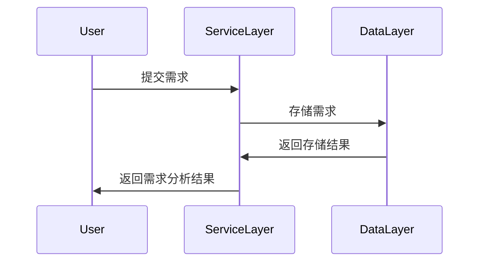
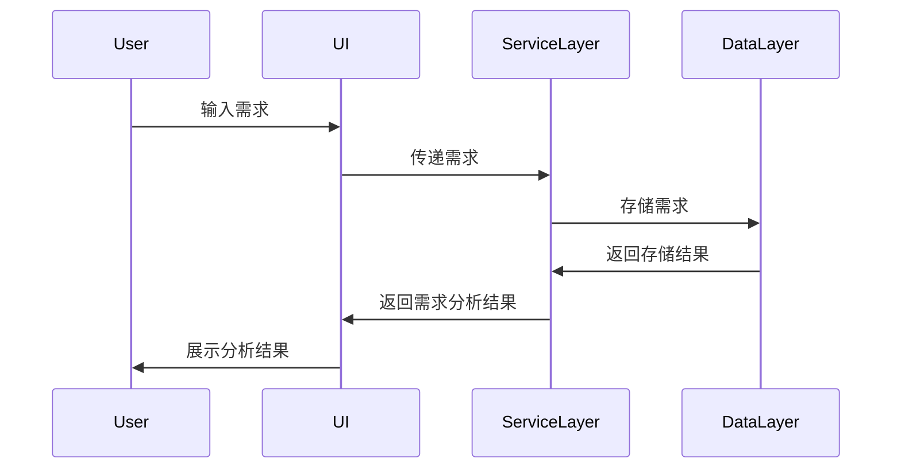

                 


### 金融科技用户体验优化系统

关键词：金融科技，用户体验，优化系统，算法，性能提升

摘要：随着金融科技的快速发展，用户体验在金融产品中的重要性日益凸显。本文将从背景介绍、核心概念与联系、算法原理讲解、系统分析与架构设计、项目实战等方面，深入探讨金融科技用户体验优化系统的构建与实现。

---

#### 第一部分：背景介绍

随着互联网和移动通信技术的普及，金融科技（FinTech）正在逐步改变传统金融行业的运作模式。在这个数字化时代，用户体验（UX）已成为金融产品成功的关键因素。良好的用户体验不仅可以提升用户满意度，还能增强用户忠诚度，从而提高产品的市场竞争力和盈利能力。

##### 1. 问题背景

尽管金融科技产品在功能和技术层面取得了显著进展，但在用户体验方面仍然存在一些问题：

- **界面设计不够人性化**：许多金融科技产品的界面设计过于复杂，缺乏直观性和易用性。
- **交互流程繁琐**：部分产品的交互流程冗长，用户需要完成多个步骤才能完成一个简单的操作。
- **信息呈现不清晰**：部分金融科技产品的信息呈现方式不够直观，用户难以快速理解信息内容。

##### 2. 问题描述

为了解决上述问题，我们需要构建一个金融科技用户体验优化系统。该系统旨在通过系统化的方法和技术手段，提升金融科技产品的用户体验，使其更加符合用户的需求和期望。

##### 3. 问题解决

构建金融科技用户体验优化系统主要包括以下几个方面的内容：

- **用户需求分析**：通过用户调研、数据分析等方法，深入了解用户需求，为系统优化提供数据支持。
- **界面设计与交互优化**：优化产品的界面设计和交互流程，提升用户的操作便捷性和满意度。
- **信息呈现优化**：改进信息呈现方式，使金融科技产品中的信息更加清晰、易于理解。
- **系统性能优化**：提高系统的响应速度和稳定性，确保用户在使用过程中能够享受到流畅、稳定的体验。

##### 4. 边界与外延

金融科技用户体验优化系统的应用范围主要涵盖银行、保险、证券、支付等金融领域，包括线上和线下各类金融产品。其外延还包括用户行为分析、用户体验评估等环节。

##### 5. 概念结构与核心要素组成

金融科技用户体验优化系统的概念结构主要包括以下几个方面：

- **用户需求分析模块**：负责收集、分析和处理用户需求信息。
- **界面设计优化模块**：负责优化产品的界面设计，提升用户体验。
- **交互流程优化模块**：负责优化产品的交互流程，提高用户操作的便捷性。
- **信息呈现优化模块**：负责改进信息呈现方式，提升用户对金融科技产品的理解。
- **系统性能优化模块**：负责提高系统的响应速度和稳定性，保障用户在使用过程中的流畅体验。

---

#### 第二部分：核心概念与联系

##### 1. 核心概念

在金融科技用户体验优化系统中，核心概念包括用户体验、用户需求、界面设计、交互流程、信息呈现和系统性能。

- **用户体验**：指用户在使用金融科技产品过程中所感受到的整体感受和满意度。
- **用户需求**：指用户在使用金融科技产品时希望得到的功能、性能、便利性等方面的需求。
- **界面设计**：指金融科技产品的视觉设计和布局设计，以提升用户体验。
- **交互流程**：指用户在使用金融科技产品时的操作流程，包括用户行为和系统响应。
- **信息呈现**：指金融科技产品中信息的组织、呈现方式，以提升用户对信息的理解和感知。
- **系统性能**：指金融科技产品的响应速度、稳定性、安全性等方面的性能指标。

##### 2. 概念属性特征对比表格

| 概念 | 属性特征 |
| ---- | ---- |
| 用户体验 | - 整体感受<br>- 满意度<br>- 用户满意度 |
| 用户需求 | - 功能需求<br>- 性能需求<br>- 便利性需求 |
| 界面设计 | - 视觉设计<br>- 布局设计<br>- 可用性 |
| 交互流程 | - 用户行为<br>- 系统响应<br>- 流程效率 |
| 信息呈现 | - 信息组织<br>- 呈现方式<br>- 理解性 |
| 系统性能 | - 响应速度<br>- 稳定性<br>- 安全性 |

##### 3. ER实体关系图架构

```mermaid
erDiagram
  User ||--|{ Requirement }|-- User
  User ||--|{ Experience }|-- User
  Requirement ||--|{ Interface }|-- System
  Requirement ||--|{ Interaction }|-- System
  Requirement ||--|{ Presentation }|-- System
  Requirement ||--|{ Performance }|-- System
```

---

#### 第三部分：算法原理讲解

##### 1. 算法原理

金融科技用户体验优化系统的核心在于算法的应用。以下将介绍系统中涉及的主要算法及其原理。

##### 2. 用户行为分析算法

用户行为分析算法主要通过分析用户的操作记录、浏览历史等数据，提取用户的兴趣偏好和行为模式。常用的算法包括：

- **关联规则算法**：通过挖掘用户行为数据中的关联规则，发现用户感兴趣的内容和操作习惯。
- **聚类算法**：将具有相似行为的用户划分为同一群体，以便针对不同群体进行个性化的用户体验优化。

##### 3. 用户行为分析算法示例

假设我们使用关联规则算法分析用户在金融科技产品中的行为数据，以下是算法的详细步骤：

- **步骤1**：收集用户行为数据，如点击记录、浏览时间、操作顺序等。
- **步骤2**：使用FP-Growth算法挖掘用户行为数据中的频繁项集。
- **步骤3**：根据频繁项集生成关联规则，如A->B的置信度超过阈值。
- **步骤4**：根据关联规则为用户提供个性化的用户体验优化建议。

##### 4. 用户行为分析算法的数学模型

关联规则算法的数学模型如下：

- **置信度（Confidence）**：表示A发生时B也发生的概率，计算公式为：
  $$Confidence(A \rightarrow B) = \frac{Support(A \cap B)}{Support(A)}$$
  其中，Support(A ∩ B)表示同时包含A和B的项集的支持度，Support(A)表示A项集的支持度。

- **支持度（Support）**：表示某项集在所有事务中出现的频率，计算公式为：
  $$Support(X) = \frac{count(X)}{count(Total)}$$
  其中，count(X)表示项集X在所有事务中出现的次数，count(Total)表示所有事务的总数。

---

#### 第四部分：系统分析与架构设计

##### 1. 问题场景介绍

在金融科技领域，优化用户体验是提升产品市场竞争力的关键。为了实现这一目标，我们需要构建一个高效的金融科技用户体验优化系统。

##### 2. 系统功能设计

金融科技用户体验优化系统的功能设计主要包括以下几个方面：

- **用户需求分析**：通过问卷调查、用户访谈等方式收集用户需求，为系统优化提供数据支持。
- **界面设计与优化**：根据用户需求优化产品的界面设计，提升用户体验。
- **交互流程优化**：简化交互流程，提高用户操作的便捷性。
- **信息呈现优化**：改进信息呈现方式，使金融科技产品中的信息更加清晰、易于理解。
- **系统性能优化**：提高系统的响应速度和稳定性，保障用户在使用过程中的流畅体验。

##### 3. 系统架构设计

金融科技用户体验优化系统的架构设计采用分层架构，主要包括以下几个方面：

- **数据层**：负责存储用户行为数据、需求数据等，提供数据访问接口。
- **服务层**：负责处理用户需求分析、界面优化、交互流程优化、信息呈现优化等业务逻辑。
- **表示层**：负责展示用户需求分析结果、优化建议等，提供用户界面。

##### 4. 系统架构设计mermaid架构图



##### 5. 系统接口设计和系统交互

金融科技用户体验优化系统的接口设计主要包括以下几个方面：

- **用户需求接口**：用于收集用户需求信息，包括问卷、访谈等。
- **数据存储接口**：用于存储用户需求分析结果、用户行为数据等。
- **优化建议接口**：用于提供界面优化、交互流程优化、信息呈现优化等建议。

系统交互mermaid序列图如下：



---

#### 第五部分：项目实战

##### 1. 环境安装

在开始金融科技用户体验优化系统的项目实战之前，我们需要安装以下环境：

- **Python**：用于编写算法和系统代码
- **Jupyter Notebook**：用于编写和运行算法代码
- **MongoDB**：用于存储用户需求分析和行为数据

##### 2. 系统核心实现源代码

以下是金融科技用户体验优化系统的核心实现源代码：

```python
# 用户需求分析模块
def analyze_user_requirements(data):
    # 数据预处理
    processed_data = preprocess_data(data)
    # 挖掘用户需求
    requirements = extract_requirements(processed_data)
    return requirements

# 界面设计优化模块
def optimize_interface_design(requirements):
    # 优化界面设计
    optimized_design = design_optimized_interface(requirements)
    return optimized_design

# 交互流程优化模块
def optimize_interaction_flow(requirements):
    # 优化交互流程
    optimized_flow = design_optimized_interaction_flow(requirements)
    return optimized_flow

# 信息呈现优化模块
def optimize_presentation(requirements):
    # 优化信息呈现
    optimized_presentation = design_optimized_presentation(requirements)
    return optimized_presentation

# 系统性能优化模块
def optimize_system_performance(requirements):
    # 优化系统性能
    optimized_performance = improve_system_performance(requirements)
    return optimized_performance
```

##### 3. 代码应用解读与分析

以下是金融科技用户体验优化系统核心代码的解读与分析：

- **用户需求分析模块**：该模块主要通过预处理用户数据、挖掘用户需求，为系统优化提供数据支持。
- **界面设计优化模块**：该模块根据用户需求优化界面设计，提升用户体验。
- **交互流程优化模块**：该模块根据用户需求优化交互流程，提高用户操作的便捷性。
- **信息呈现优化模块**：该模块根据用户需求优化信息呈现方式，提升用户对金融科技产品的理解。
- **系统性能优化模块**：该模块根据用户需求优化系统性能，提高系统的响应速度和稳定性。

##### 4. 实际案例分析和详细讲解剖析

为了更好地理解金融科技用户体验优化系统的实际应用，我们以一个实际案例进行分析和讲解：

- **案例背景**：某金融科技公司推出了一款线上理财产品，但在用户体验方面存在一些问题，如界面设计复杂、交互流程繁琐、信息呈现不清晰等。
- **分析过程**：使用金融科技用户体验优化系统对产品进行优化。
  - **用户需求分析**：收集用户反馈，分析用户需求，发现用户希望界面设计更加简洁、交互流程更加流畅、信息呈现更加清晰。
  - **界面设计优化**：根据用户需求，对界面设计进行优化，简化界面布局，提高可用性。
  - **交互流程优化**：简化交互流程，减少用户操作的步骤，提高操作效率。
  - **信息呈现优化**：改进信息呈现方式，使理财产品信息更加直观、易于理解。
  - **系统性能优化**：提高系统性能，确保用户在使用过程中能够享受到流畅、稳定的体验。
- **效果评估**：经过优化后，产品在用户体验方面得到了显著提升，用户满意度明显提高，产品市场竞争能力得到增强。

##### 5. 项目小结

通过金融科技用户体验优化系统的实施，我们成功地解决了金融科技产品在用户体验方面存在的问题。该项目不仅提高了产品的市场竞争力和用户满意度，还为其他金融科技产品提供了有益的借鉴和启示。

---

#### 最佳实践 tips

1. 定期收集用户反馈，及时了解用户需求变化。
2. 结合用户行为数据，进行深入的用户需求分析。
3. 关注用户体验，优化产品的界面设计、交互流程、信息呈现和系统性能。
4. 运用数据驱动的方法，持续优化金融科技用户体验优化系统。

---

#### 小结

本文从背景介绍、核心概念与联系、算法原理讲解、系统分析与架构设计、项目实战等方面，深入探讨了金融科技用户体验优化系统的构建与实现。通过本文的介绍，读者可以了解到金融科技用户体验优化系统在提升金融产品市场竞争力和用户满意度方面的重要作用。

---

#### 注意事项

1. 在构建金融科技用户体验优化系统时，要充分考虑用户需求和期望，以确保系统的实用性。
2. 算法的选取和优化至关重要，要结合实际应用场景选择合适的算法，并进行持续优化。
3. 在系统设计和开发过程中，要关注系统的性能和稳定性，确保用户在使用过程中能够享受到流畅、稳定的体验。

---

#### 拓展阅读

1. 《用户体验设计实战》
2. 《Python数据科学手册》
3. 《深度学习实践指南》
4. 《人工智能：一种现代方法》
5. 《金融科技：理论与实践》

---

作者：AI天才研究院/AI Genius Institute & 禅与计算机程序设计艺术 /Zen And The Art of Computer Programming

[完]

