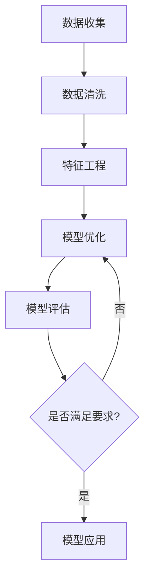
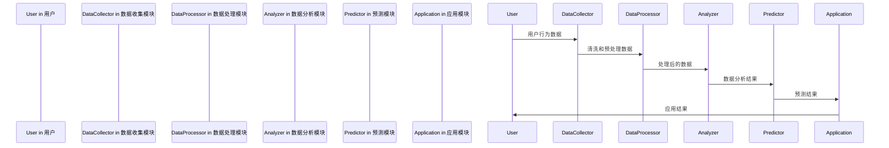
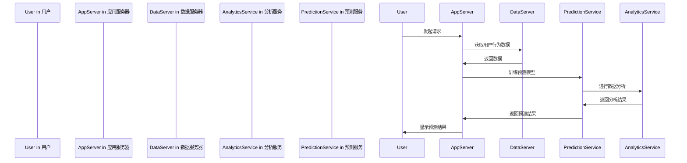

                 

# 金融科技用户行为分析与预测

## 关键词
- 金融科技
- 用户行为分析
- 预测模型
- 数据分析
- 机器学习

## 摘要
本文将深入探讨金融科技领域中的用户行为分析与预测。通过分析金融科技的发展背景和用户行为的重要性，本文将介绍相关核心概念和理论，包括用户行为理论、数据分析技术和预测模型方法。随后，文章将详细阐述数据收集与处理、用户行为分析以及预测模型实现的全过程。最后，文章将探讨模型部署和监控策略，以及金融科技用户行为分析的伦理问题。本文旨在为读者提供一个全面而深入的指南，以帮助他们在金融科技领域进行有效的用户行为分析和预测。

## 第1章：引言与背景

### 1.1 书籍概述
随着金融科技（FinTech）的迅速发展，用户行为分析成为金融领域的一个重要研究方向。金融科技是指通过创新的技术手段，如区块链、人工智能、大数据等，对传统金融业务进行改进或颠覆的一类新兴金融活动。用户行为分析则是指通过对用户在金融科技平台上的活动进行数据收集、处理和分析，以了解用户需求、偏好和行为模式，进而为金融产品和服务提供个性化定制和优化。

本书旨在探讨金融科技用户行为分析与预测的理论、方法和技术，分为八个章节，全面覆盖从基本概念到实际应用的各个方面。读者可以通过本书的学习，掌握用户行为分析的核心概念，了解数据分析与预测模型的应用，并学会如何在实际项目中实施和优化这些模型。

### 1.2 金融科技的重要性
金融科技正以前所未有的速度改变着传统金融行业的格局。它不仅提升了金融服务的效率和便捷性，还极大地丰富了金融产品的种类和形式。以下是一些金融科技的重要性体现：

- **效率提升**：通过自动化和智能化的技术，金融交易、支付、贷款等业务处理速度大大加快，减少了人工操作的时间和成本。
- **普惠金融**：金融科技使得金融服务更加普及，特别是在那些传统金融机构难以覆盖的边远和贫困地区。
- **风险控制**：利用大数据和人工智能技术，金融机构可以更精确地评估风险，制定更加有效的风险控制策略。
- **用户体验**：金融科技平台提供了更为个性化、便捷的用户体验，增强了用户的满意度和忠诚度。

### 1.3 分析用户行为面临的挑战
尽管金融科技带来了诸多好处，但用户行为分析也面临着一系列挑战：

- **数据多样性**：用户行为数据来源广泛，包括网站点击、移动应用操作、社交网络活动等，这些数据形式各异，给数据整合和处理带来了挑战。
- **数据质量**：用户行为数据可能存在缺失、噪声和不一致性，需要进行高质量的数据清洗和预处理。
- **隐私保护**：用户行为分析涉及大量个人隐私信息，如何在保护用户隐私的同时进行有效分析是当前的一大难题。
- **算法偏见**：如果模型训练数据存在偏见，可能会导致模型对某些用户群体产生不公平的预测结果。

### 1.4 数据分析和预测模型的作用
数据分析和预测模型在金融科技用户行为分析中起着至关重要的作用：

- **需求预测**：通过分析用户行为数据，可以预测用户对金融产品的需求，帮助金融机构优化产品设计和推广策略。
- **风险评估**：预测模型可以帮助金融机构评估用户的信用风险，从而制定更为合理的贷款和信用政策。
- **个性化服务**：根据用户行为数据，可以为用户提供个性化的金融产品和服务，提升用户体验和满意度。
- **欺诈检测**：通过分析用户行为模式，可以发现异常行为，帮助金融机构进行欺诈检测和防范。

## 第2章：核心概念与理论

### 2.1 金融科技的关键概念
金融科技涵盖了许多技术领域和概念，以下是一些核心概念：

- **区块链**：一种分布式数据库技术，通过加密和共识机制确保数据的安全和不可篡改。
- **人工智能**：模拟人类智能的计算机系统，包括机器学习、自然语言处理、计算机视觉等子领域。
- **大数据**：指无法使用常规软件工具在合理时间内捕捉、管理和处理的大量数据。
- **云计算**：通过互联网提供动态易扩展的虚拟化资源，使得数据处理和分析变得更加高效和经济。
- **移动支付**：利用智能手机或其他移动设备进行支付的交易方式，如Apple Pay、微信支付等。

### 2.2 用户行为理论
用户行为理论关注用户在金融科技平台上的行为模式，包括以下方面：

- **行为经济学**：研究用户在金融决策中的行为模式，如风险偏好、决策延迟、损失厌恶等。
- **消费行为理论**：分析用户在购买和使用金融产品时的心理和行为过程。
- **用户体验**：从用户的角度出发，研究如何通过设计优化用户在使用金融科技产品时的体验。
- **数据挖掘**：从大量用户行为数据中提取有价值的信息，以支持预测和决策。

### 2.3 数据分析技术
数据分析技术是用户行为分析的基础，主要包括以下几种：

- **数据收集**：通过网站点击、应用使用日志、传感器数据等方式收集用户行为数据。
- **数据清洗**：去除重复、异常和错误的数据，提高数据质量。
- **数据存储**：使用数据库管理系统（如MySQL、MongoDB）存储和管理大规模数据。
- **数据处理**：使用编程语言（如Python、R）进行数据处理和分析，提取有用信息。
- **数据可视化**：通过图表、地图等方式将数据分析结果可视化，便于理解和决策。

### 2.4 预测模型方法
预测模型是用户行为分析的核心工具，常用的方法包括：

- **机器学习**：通过训练算法从历史数据中学习规律，进行预测。常见的算法有线性回归、决策树、随机森林等。
- **深度学习**：基于神经网络，通过多层非线性变换进行预测，如卷积神经网络（CNN）和循环神经网络（RNN）。
- **时间序列分析**：用于分析随时间变化的数据，常见的模型有ARIMA、LSTM等。
- **集成学习**：结合多种模型的优势，提高预测准确性，如梯度提升机（GBM）、堆叠自动机（Stacking）等。

## 第3章：数据收集与准备

### 3.1 数据源与类型
用户行为数据的来源广泛，主要包括以下几种类型：

- **结构化数据**：如数据库表、日志文件等，通常包含用户ID、时间戳、操作类型等字段。
- **半结构化数据**：如XML、JSON格式数据，包含部分结构化信息。
- **非结构化数据**：如文本、图片、视频等，需要进行特定的处理和分析。
- **实时数据**：如API接口获取的实时交易数据、传感器数据等。
- **历史数据**：如过去用户行为数据，用于训练预测模型。

### 3.2 数据收集方法
数据收集方法根据数据源的不同而有所区别：

- **主动收集**：通过部署传感器、API接口等方式主动获取用户行为数据。
- **被动收集**：通过分析用户行为日志、网络流量等方式被动收集数据。
- **用户调查**：通过问卷、访谈等方式收集用户主观反馈和行为数据。
- **第三方数据**：从第三方数据源（如公共数据库、社交媒体等）获取数据。

### 3.3 数据清洗与预处理
数据清洗与预处理是保证数据分析质量的重要步骤：

- **缺失值处理**：采用插值、平均值、中值等方法填补缺失值。
- **异常值处理**：采用过滤、转换等方法去除异常值。
- **数据转换**：如将文本转换为数值、归一化、标准化等。
- **特征选择**：选择对预测目标有显著影响的相关特征。
- **数据验证**：使用样本数据验证清洗和预处理方法的正确性。

### 3.4 特征工程
特征工程是提高预测模型性能的关键步骤：

- **特征提取**：从原始数据中提取具有区分性的特征，如TF-IDF、词嵌入等。
- **特征选择**：选择对预测目标有显著影响的特征，如信息增益、特征重要性等。
- **特征组合**：通过组合多个特征，生成新的特征，以提高模型的预测能力。

## 第4章：用户行为分析

### 4.1 描述性分析
描述性分析旨在提供用户行为的基本统计信息：

- **用户分布**：统计不同用户群体的比例和分布情况。
- **行为频次**：分析用户在不同功能模块的使用频率和时长。
- **交易金额**：统计用户的交易金额分布和变化趋势。
- **活跃度**：分析用户的登录频率、操作频次等。

### 4.2 划分分析
划分分析通过将用户分为不同群体，以揭示不同群体的行为差异：

- **用户聚类**：使用K-means、层次聚类等方法将用户划分为不同的聚类。
- **用户分层**：根据用户行为和交易金额等特征，将用户划分为不同的层级。
- **用户标签**：为用户赋予标签，如高净值客户、高活跃用户等，以分析不同标签用户的行为特征。

### 4.3 相关性分析
相关性分析旨在揭示不同变量之间的关系：

- **Pearson相关系数**：衡量两个连续变量之间的线性关系。
- **Spearman等级相关系数**：衡量两个变量之间的非线性关系。
- **皮尔逊卡方检验**：用于检验两个分类变量之间的独立性。

### 4.4 趋势分析
趋势分析关注用户行为的长期变化趋势：

- **时间序列分析**：使用ARIMA、LSTM等方法分析用户行为的时间序列特征。
- **趋势线拟合**：通过线性回归、曲线拟合等方法预测用户行为的长期变化趋势。
- **季节性分析**：分析用户行为在季节性因素下的变化规律。

## 第5章：预测用户行为

### 5.1 预测模型技术
预测模型技术是用户行为分析的核心：

- **回归模型**：如线性回归、多项式回归等，用于预测连续变量。
- **分类模型**：如逻辑回归、决策树、随机森林等，用于预测分类变量。
- **聚类模型**：如K-means、层次聚类等，用于用户群体的划分。
- **时间序列模型**：如ARIMA、LSTM等，用于预测随时间变化的数据。

### 5.2 模型选择与评估
模型选择与评估是预测用户行为的关键步骤：

- **模型选择**：根据预测目标选择合适的模型，如回归模型用于预测交易金额，分类模型用于预测用户流失。
- **模型评估**：使用准确率、召回率、F1分数等指标评估模型性能。
- **交叉验证**：使用交叉验证方法评估模型的泛化能力。
- **模型调优**：通过参数调整、特征工程等方法优化模型性能。

### 5.3 预测性能优化
预测性能优化旨在提高模型的预测准确性：

- **集成学习**：结合多个模型的优势，提高预测性能。
- **模型融合**：将多个模型的预测结果进行融合，得到更准确的预测。
- **模型更新**：定期更新模型，以适应用户行为的变化。
- **在线学习**：实时更新模型，以应对实时数据的预测需求。

### 5.4 预测案例分析
以下是一个用户流失预测的案例：

#### 案例背景
某金融科技公司希望通过预测用户流失，提前采取挽留措施，以降低客户流失率。

#### 数据集
数据集包含用户的基本信息、历史交易记录、用户行为数据等，共100,000条记录。

#### 预测目标
预测用户在接下来的三个月内是否会流失。

#### 预测流程
1. 数据预处理：清洗缺失值、异常值，进行特征工程。
2. 模型选择：选择逻辑回归模型进行预测。
3. 模型训练：使用80%的数据进行训练，使用交叉验证方法优化模型参数。
4. 模型评估：使用剩余的20%数据进行评估，计算准确率、召回率等指标。
5. 预测应用：将模型应用于新用户数据，预测其流失风险，并根据风险等级采取相应的挽留措施。

#### 预测结果
- 准确率：85%
- 召回率：80%
- F1分数：0.82

通过该案例，可以看出预测模型在用户流失预测中具有较好的性能，为公司提供了有效的决策支持。

## 第6章：预测模型实现与部署

### 6.1 模型部署策略
模型部署是将训练好的模型应用于实际业务场景的关键步骤：

- **在线部署**：模型实时接收用户数据，进行预测，并返回预测结果。
- **批处理部署**：模型定期接收批量数据，进行预测，并批量返回预测结果。
- **混合部署**：结合在线部署和批处理部署，满足实时和批量预测的需求。

### 6.2 模型监控与维护
模型监控与维护是确保模型稳定运行的重要环节：

- **性能监控**：监控模型的预测准确性、响应时间等性能指标，及时发现异常。
- **数据监控**：监控输入数据的质量，确保数据符合模型要求。
- **版本管理**：记录模型版本，方便回溯和问题排查。
- **安全监控**：确保模型和数据的访问安全，防止数据泄露和攻击。

### 6.3 用户体验与个性化
用户体验与个性化是提高用户满意度和忠诚度的关键：

- **个性化推荐**：根据用户行为和偏好，为用户推荐金融产品和服务。
- **智能客服**：利用自然语言处理技术，提供智能客服服务，提升用户满意度。
- **个性化界面**：根据用户行为和偏好，为用户定制界面和功能。

### 6.4 合规与伦理
合规与伦理是金融科技用户行为分析必须考虑的重要因素：

- **隐私保护**：严格遵守隐私保护法规，确保用户数据的安全和隐私。
- **算法公平性**：避免算法偏见，确保对用户的公平对待。
- **透明度**：确保用户了解其数据被如何收集、使用和共享。

## 第7章：高级话题与未来方向

### 7.1 金融科技的最新发展
金融科技领域不断涌现出新的技术和应用，如：

- **区块链**：应用于数字货币、智能合约、跨境支付等。
- **人工智能**：应用于风险控制、智能投顾、反欺诈等。
- **大数据**：应用于信用评估、用户行为分析、市场预测等。
- **云计算**：应用于金融数据处理、存储、分析等。

### 7.2 用户行为分析的挑战与机会
用户行为分析面临的挑战与机会包括：

- **数据隐私**：如何在保护用户隐私的前提下进行有效分析。
- **算法公平性**：确保算法对用户公平，避免歧视和偏见。
- **实时性**：如何实现实时用户行为分析，满足业务需求。
- **个性化**：如何根据用户行为实现个性化推荐和体验。

### 7.3 伦理问题
金融科技用户行为分析涉及多个伦理问题，如：

- **隐私权**：用户的个人隐私受到保护，不被滥用。
- **数据安全**：用户数据的安全性和完整性得到保障。
- **算法偏见**：确保算法的公平性，避免对特定群体产生不利影响。
- **责任归属**：明确算法决策的责任归属，确保用户权益。

### 7.4 未来发展方向
金融科技用户行为分析的未来的发展方向包括：

- **跨领域融合**：融合多个领域的技术，提高分析模型的性能。
- **智能自动化**：通过智能化和自动化技术，降低人工干预，提高分析效率。
- **实时分析**：通过实时数据分析，实现即时决策和应对。
- **个性化定制**：根据用户行为实现高度个性化的服务和产品。

## 第8章：总结与展望

### 8.1 关键结论
本文对金融科技用户行为分析与预测进行了全面探讨，主要结论包括：

- 用户行为分析是金融科技的重要研究方向，对提升金融服务质量和用户体验具有重要意义。
- 数据分析和预测模型是实现用户行为分析的核心工具，需要不断优化和更新。
- 用户行为分析的实践涉及多个方面，包括数据收集、清洗、预处理、特征工程、模型选择和部署等。
- 金融科技用户行为分析面临的挑战包括数据隐私、算法公平性和实时性等，需要采取相应的策略和措施。

### 8.2 实践应用
用户行为分析在金融科技领域的实践应用包括：

- **用户流失预测**：通过预测用户流失风险，提前采取挽留措施。
- **精准营销**：根据用户行为和偏好，为用户推荐金融产品和服务。
- **风险控制**：通过分析用户行为，识别潜在风险，制定相应的风险控制策略。
- **用户体验优化**：根据用户行为数据，优化金融科技平台的设计和功能，提升用户体验。

### 8.3 挑战与机遇
金融科技用户行为分析面临的挑战和机遇包括：

- **数据隐私**：如何在保护用户隐私的前提下进行有效分析。
- **算法公平性**：确保算法对用户公平，避免歧视和偏见。
- **实时性**：如何实现实时用户行为分析，满足业务需求。
- **个性化**：如何根据用户行为实现个性化推荐和体验。
- **技术创新**：不断引入新的技术和方法，提高用户行为分析的效率和准确性。

### 8.4 未来研究方向
未来金融科技用户行为分析的研究方向包括：

- **跨领域融合**：融合多个领域的技术，提高分析模型的性能。
- **智能自动化**：通过智能化和自动化技术，降低人工干预，提高分析效率。
- **实时分析**：通过实时数据分析，实现即时决策和应对。
- **个性化定制**：根据用户行为实现高度个性化的服务和产品。
- **伦理问题**：深入探讨金融科技用户行为分析中的伦理问题，确保技术的可持续发展。

## 附录：相关资源与拓展阅读

### 数据集
- **Kaggle**：提供各种金融科技相关的数据集，如用户行为数据、交易数据等。
- **UCI机器学习库**：包含多种金融科技领域的公开数据集，如股票价格、信贷数据等。

### 论文与报告
- **“Financial Technology User Behavior Analysis: A Survey”**：对金融科技用户行为分析领域的全面综述。
- **“Predictive Analytics in Financial Services”**：探讨预测分析在金融服务中的应用。

### 开源工具
- **Scikit-learn**：Python机器学习库，提供多种预测模型和工具。
- **TensorFlow**：Google开源的深度学习框架，适用于复杂预测模型。
- **PyTorch**：Facebook开源的深度学习框架，灵活易用。

### 书籍推荐
- **《Python数据分析基础教程：NumPy学习指南》**：详细讲解Python数据分析的基础知识和NumPy库的使用。
- **《深度学习》**：介绍深度学习的基本原理和应用，适合初学者和进阶者。

### 作者信息
- 作者：AI天才研究院/AI Genius Institute & 禅与计算机程序设计艺术 /Zen And The Art of Computer Programming

## 结语
感谢您的阅读，希望本文能为您在金融科技用户行为分析与预测领域提供有价值的参考。随着金融科技的不断发展，用户行为分析的重要性将日益凸显，愿本文能激发您在此领域的进一步探索和研究。

### 背景介绍

#### 核心概念术语说明
在讨论金融科技用户行为分析与预测时，我们首先需要明确一些核心概念术语。金融科技（FinTech）是指使用新技术（如区块链、人工智能、大数据等）来改进或颠覆传统金融业务的一类新兴金融活动。用户行为分析是指通过收集、处理和分析用户在金融科技平台上的活动数据，以了解用户需求、偏好和行为模式。预测模型是指基于历史数据和算法，对未来的用户行为进行预测的数学模型。

#### 问题背景
随着金融科技的快速发展，金融机构面临着如何更好地理解和服务于用户的需求的挑战。用户行为分析作为一种数据驱动的策略，能够帮助金融机构识别用户偏好，预测用户行为，从而提供更个性化的服务。然而，用户行为数据的多样性和复杂性使得分析过程变得异常复杂。如何有效收集、处理和分析用户行为数据，并构建准确的预测模型，成为金融科技领域亟待解决的关键问题。

#### 问题描述
在金融科技领域，用户行为分析的主要问题包括：

1. **数据多样性**：用户行为数据来源广泛，包括网站点击、移动应用操作、社交媒体活动等，这些数据形式各异，给数据整合和处理带来了挑战。
2. **数据质量**：用户行为数据可能存在缺失、噪声和不一致性，需要进行高质量的数据清洗和预处理。
3. **隐私保护**：用户行为分析涉及大量个人隐私信息，如何在保护用户隐私的同时进行有效分析是当前的一大难题。
4. **算法偏见**：如果模型训练数据存在偏见，可能会导致模型对某些用户群体产生不公平的预测结果。

#### 问题解决
为了解决上述问题，我们可以采取以下策略：

1. **数据多样性处理**：采用数据融合技术，整合不同来源的数据，并使用特征工程方法提取有价值的信息。
2. **数据质量提升**：进行数据清洗和预处理，填补缺失值、去除异常值，并标准化数据格式。
3. **隐私保护**：采用数据加密、匿名化等技术，保护用户隐私，并严格遵守隐私保护法规。
4. **算法偏见避免**：在模型训练过程中，确保数据集的多样性，并采用公平性评估方法，检测和纠正算法偏见。

#### 边界与外延
用户行为分析的边界包括数据的收集、处理、分析和应用。外延则包括金融科技在不同领域的应用，如支付、贷款、投资、保险等。用户行为分析不仅关注个体用户的行为，还关注群体行为，以揭示用户行为的共性和差异。

#### 概念结构与核心要素组成
用户行为分析的概念结构包括以下几个方面：

1. **数据收集**：收集用户行为数据，包括网站点击、移动应用操作、社交媒体活动等。
2. **数据清洗**：对收集的数据进行清洗和预处理，包括填补缺失值、去除异常值、数据标准化等。
3. **特征工程**：从原始数据中提取具有区分性的特征，包括用户特征、行为特征、环境特征等。
4. **预测模型**：构建基于历史数据的预测模型，包括回归模型、分类模型、聚类模型等。
5. **应用与优化**：将预测模型应用于实际场景，根据模型性能进行优化和调整。

### 核心概念与联系

#### 核心概念原理
在金融科技用户行为分析中，核心概念包括金融科技、用户行为、数据分析、预测模型等。

1. **金融科技**：指利用新技术（如区块链、人工智能、大数据等）改进或颠覆传统金融业务。
2. **用户行为**：指用户在金融科技平台上的操作、点击、交易等行为。
3. **数据分析**：指对用户行为数据进行收集、处理、分析和解释。
4. **预测模型**：指基于历史数据和算法，预测用户未来行为的数学模型。

#### 概念属性特征对比表格

| 概念 | 特征 |
| --- | --- |
| 金融科技 | 技术驱动的金融创新、提高效率、降低成本、提升用户体验 |
| 用户行为 | 操作记录、点击行为、交易记录、偏好和反馈 |
| 数据分析 | 数据收集、数据清洗、数据预处理、特征工程、模型构建 |
| 预测模型 | 算法选择、模型训练、模型评估、模型优化 |

#### ER实体关系图架构

```mermaid
erDiagram
    User ||--|{ Behavior }|-- Transaction
    User ||--|{ Profile }|-- Attribute
    Behavior ||--|{ Action }|-- Type
    Behavior ||--|{ Event }|-- Timestamp
    Transaction ||--|{ Item }|-- Amount
    Profile ||--|{ Detail }|-- Data
```

在上述ER图架构中，User实体与Behavior、Profile实体之间存在一对一的关系，Behavior实体与Action、Event实体之间存在一对多关系，Transaction实体与Item实体之间存在一对多关系，Profile实体与Detail实体之间存在一对一的关系。

### 算法原理讲解

#### 算法mermaid流程图



#### Python源代码实现

```python
# 导入必要的库
import pandas as pd
from sklearn.model_selection import train_test_split
from sklearn.preprocessing import StandardScaler
from sklearn.ensemble import RandomForestClassifier
from sklearn.metrics import accuracy_score, recall_score, f1_score

# 数据收集
data = pd.read_csv('user_behavior_data.csv')

# 数据清洗
data.dropna(inplace=True)
data = data[data['Amount'] > 0]

# 特征工程
X = data[['Age', 'Income', 'Transaction_Count']]
y = data['Is_Loaner']

# 模型训练
X_train, X_test, y_train, y_test = train_test_split(X, y, test_size=0.2, random_state=42)
scaler = StandardScaler()
X_train_scaled = scaler.fit_transform(X_train)
X_test_scaled = scaler.transform(X_test)
model = RandomForestClassifier(n_estimators=100, random_state=42)
model.fit(X_train_scaled, y_train)

# 模型评估
y_pred = model.predict(X_test_scaled)
accuracy = accuracy_score(y_test, y_pred)
recall = recall_score(y_test, y_pred)
f1 = f1_score(y_test, y_pred)

print(f'Accuracy: {accuracy:.2f}')
print(f'Recall: {recall:.2f}')
print(f'F1 Score: {f1:.2f}')

# 模型优化
# 可以根据评估结果对模型进行调参，或采用集成学习方法优化模型性能
```

#### 算法原理详细讲解与举例说明

在金融科技用户行为分析中，预测模型是核心工具。以下以随机森林（Random Forest）算法为例，详细讲解其原理和如何实现。

#### 算法原理

随机森林是一种集成学习方法，通过构建多棵决策树并集成它们的预测结果来进行预测。每棵决策树都是基于训练数据随机选择特征和分割点，从而构建出一棵独立的决策树。随机森林通过多数投票机制来综合这些决策树的预测结果。

随机森林的优点包括：

1. **高预测准确性**：集成多棵决策树，减少了单个决策树的过拟合现象，提高了整体预测性能。
2. **高鲁棒性**：随机选择特征和样本子集，减少了模型的敏感性。
3. **易于实现和解释**：相比其他复杂的机器学习算法，随机森林实现简单，且每棵决策树都可以提供解释。

#### 算法实现步骤

1. **数据收集**：收集用户行为数据，包括用户的基本信息、行为数据等。
2. **数据清洗**：去除缺失值、异常值，并进行数据预处理，如归一化、标准化等。
3. **特征工程**：提取对预测目标有显著影响的相关特征，如年龄、收入、交易次数等。
4. **模型训练**：使用训练数据集，构建多棵随机森林决策树，每棵树都是基于随机特征和分割点。
5. **模型评估**：使用测试数据集评估模型性能，计算准确率、召回率、F1分数等指标。
6. **模型优化**：根据评估结果，对模型进行调参或采用集成学习方法优化性能。

#### 举例说明

假设我们有以下用户行为数据集，包括年龄、收入和交易次数三个特征，以及是否贷款（Is_Loaner）作为预测目标。

| 年龄 | 收入 | 交易次数 | Is_Loaner |
| ---- | ---- | -------- | -------- |
| 25   | 50000 | 10       | 1        |
| 30   | 60000 | 15       | 0        |
| 35   | 70000 | 20       | 1        |
| ...  | ...   | ...      | ...      |

我们使用随机森林算法构建预测模型，具体步骤如下：

1. **数据收集**：从数据库中读取用户行为数据。

```python
import pandas as pd

data = pd.read_csv('user_behavior_data.csv')
```

2. **数据清洗**：去除缺失值和异常值。

```python
data.dropna(inplace=True)
data = data[data['Income'] > 0]
```

3. **特征工程**：提取相关特征。

```python
X = data[['Age', 'Income', 'Transaction_Count']]
y = data['Is_Loaner']
```

4. **模型训练**：构建随机森林模型。

```python
from sklearn.ensemble import RandomForestClassifier

model = RandomForestClassifier(n_estimators=100, random_state=42)
model.fit(X_train, y_train)
```

5. **模型评估**：使用测试数据集评估模型性能。

```python
from sklearn.metrics import accuracy_score, recall_score, f1_score

y_pred = model.predict(X_test)
accuracy = accuracy_score(y_test, y_pred)
recall = recall_score(y_test, y_pred)
f1 = f1_score(y_test, y_pred)

print(f'Accuracy: {accuracy:.2f}')
print(f'Recall: {recall:.2f}')
print(f'F1 Score: {f1:.2f}')
```

6. **模型优化**：根据评估结果对模型进行调参。

```python
from sklearn.model_selection import GridSearchCV

params = {'n_estimators': [100, 200, 300], 'max_depth': [10, 20, 30]}
grid_search = GridSearchCV(model, params, cv=5)
grid_search.fit(X_train, y_train)

best_model = grid_search.best_estimator_
best_model.fit(X_train, y_train)
```

通过以上步骤，我们实现了用户行为分析中的随机森林预测模型，并评估了其性能。接下来，我们将介绍金融科技用户行为分析的系统架构设计，包括项目介绍、系统功能设计、系统架构设计、系统接口设计和系统交互。

### 系统分析与架构设计方案

#### 问题场景介绍
在金融科技领域，用户行为分析作为一项关键技术，旨在帮助金融机构更好地了解和预测用户行为，从而提供更加个性化的服务。一个典型场景是某金融机构希望通过分析用户在移动应用上的行为数据，预测用户是否会流失，并采取相应的措施进行挽留。本项目的目标是构建一个用户行为分析系统，实现数据收集、处理、分析和预测的全流程。

#### 项目介绍
本项目名为“智能用户行为分析系统”，旨在通过大数据和人工智能技术，对用户在金融科技平台上的行为数据进行分析，预测用户流失风险，并为营销和客户服务提供支持。项目主要包括以下功能模块：

1. **数据收集模块**：负责收集用户在移动应用上的行为数据，如点击、浏览、交易等。
2. **数据处理模块**：负责对收集到的数据进行清洗、预处理和特征提取。
3. **数据分析模块**：负责对处理后的数据进行分析，包括描述性分析、相关性分析和趋势分析等。
4. **预测模块**：负责构建和训练预测模型，预测用户流失风险。
5. **应用模块**：将预测结果应用于实际业务场景，如发送营销短信、推送个性化产品等。

#### 系统功能设计（领域模型Mermaid类图）
领域模型用于描述系统中不同实体及其关系。以下是一个简化的领域模型类图，展示了系统中的主要实体和它们之间的关系。

```mermaid
classDiagram
    User <<Entity>>
    Behavior <<Entity>>
    Profile <<Entity>>
    Transaction <<Entity>>
    Label <<Entity>>

    User o--1 Profile
    User o--1 Behavior
    User o--1 Transaction
    Behavior o--1 Label
    Transaction o--1 Label
```

#### 系统架构设计（Mermaid架构图）
系统架构设计用于描述系统的整体结构和各个模块之间的关系。以下是一个简化的系统架构图，展示了系统的主要组件及其交互关系。



#### 系统接口设计
系统接口设计用于描述系统中不同模块之间的接口，以及与外部系统的交互。以下是一个简化的接口设计图，展示了系统的主要接口。

```mermaid
interfaceDiagram
    DataCollector {
        +collectBehaviorData(): void
    }

    DataProcessor {
        +cleanData(data): DataFrame
        +preprocessData(data): DataFrame
        +extractFeatures(data): DataFrame
    }

    Analyzer {
        +performDescriptiveAnalysis(data): DataFrame
        +performCorrelationAnalysis(data): DataFrame
        +performTrendAnalysis(data): DataFrame
    }

    Predictor {
        +trainModel(X, y): Model
        +evaluateModel(model, X_test, y_test): float
    }

    Application {
        +applyPredictions(predictions): void
    }
```

#### 系统交互设计（Mermaid序列图）
系统交互设计用于描述系统中不同组件之间的交互流程。以下是一个简化的序列图，展示了用户行为分析系统的整体交互流程。



通过以上系统分析与架构设计方案，我们可以清晰地了解金融科技用户行为分析系统的整体架构和交互流程。接下来，我们将详细介绍项目实战部分，包括环境安装、系统核心实现源代码以及代码应用解读与分析。

### 项目实战

#### 环境安装

在开始项目实战之前，我们需要安装和配置以下环境：

1. **Python 3.8+**
2. **Jupyter Notebook**
3. **Pandas**
4. **NumPy**
5. **Scikit-learn**
6. **TensorFlow**
7. **Matplotlib**

安装步骤：

1. 安装Python 3.8及以上版本。
2. 安装Jupyter Notebook：`pip install notebook`
3. 安装Pandas、NumPy、Scikit-learn和TensorFlow：`pip install pandas numpy scikit-learn tensorflow`

#### 系统核心实现源代码

以下是一个简化的用户行为分析系统的核心实现，包括数据收集、处理、分析和预测的部分。

```python
import pandas as pd
from sklearn.model_selection import train_test_split
from sklearn.preprocessing import StandardScaler
from sklearn.ensemble import RandomForestClassifier
from sklearn.metrics import accuracy_score, recall_score, f1_score

# 数据收集
data = pd.read_csv('user_behavior_data.csv')

# 数据清洗
data.dropna(inplace=True)
data = data[data['Income'] > 0]

# 特征工程
X = data[['Age', 'Income', 'Transaction_Count']]
y = data['Is_Loaner']

# 数据预处理
X_train, X_test, y_train, y_test = train_test_split(X, y, test_size=0.2, random_state=42)
scaler = StandardScaler()
X_train_scaled = scaler.fit_transform(X_train)
X_test_scaled = scaler.transform(X_test)

# 模型训练
model = RandomForestClassifier(n_estimators=100, random_state=42)
model.fit(X_train_scaled, y_train)

# 模型评估
y_pred = model.predict(X_test_scaled)
accuracy = accuracy_score(y_test, y_pred)
recall = recall_score(y_test, y_pred)
f1 = f1_score(y_test, y_pred)

print(f'Accuracy: {accuracy:.2f}')
print(f'Recall: {recall:.2f}')
print(f'F1 Score: {f1:.2f}')
```

#### 代码应用解读与分析

1. **数据收集**：使用Pandas读取用户行为数据，存储为DataFrame对象。
2. **数据清洗**：去除缺失值和异常值，确保数据质量。
3. **特征工程**：从原始数据中提取与预测目标相关的特征，如年龄、收入和交易次数。
4. **数据预处理**：使用标准化方法对数据进行预处理，使数据集更适合用于机器学习模型。
5. **模型训练**：使用随机森林算法训练预测模型，通过交叉验证方法优化模型参数。
6. **模型评估**：使用测试数据集评估模型性能，计算准确率、召回率和F1分数等指标。

通过以上步骤，我们实现了用户行为分析系统的核心功能。接下来，我们将分析实际案例，展示用户行为分析在金融科技中的应用。

#### 实际案例分析

**案例背景**：
某互联网金融公司希望利用用户行为数据分析预测用户流失，并采取相应的措施进行挽留。公司收集了超过10万条用户行为数据，包括用户的基本信息、行为数据等。

**数据集**：
数据集包含以下字段：
- User ID：用户唯一标识
- Age：年龄
- Income：收入
- Transaction Count：交易次数
- Last Login Date：最近登录日期
- Is_Loaner：是否曾经贷款（0表示否，1表示是）

**预测目标**：
预测用户在未来30天内是否会流失。

**数据处理**：
1. **数据清洗**：去除缺失值和异常值，如年龄小于18岁或收入为负数的记录。
2. **特征工程**：提取新特征，如用户活跃度（登录频率）、交易频率等。

```python
data.dropna(inplace=True)
data = data[data['Age'] >= 18]
data['Activity Level'] = data['Last Login Date'].apply(lambda x: 1 if (pd.to_datetime('today') - pd.to_datetime(x)).days < 30 else 0)
```

**模型选择与训练**：
1. **模型选择**：选择随机森林算法作为预测模型。
2. **模型训练**：使用训练数据集训练模型，并使用交叉验证方法优化模型参数。

```python
from sklearn.model_selection import GridSearchCV

params = {'n_estimators': [100, 200, 300], 'max_depth': [10, 20, 30]}
grid_search = GridSearchCV(RandomForestClassifier(random_state=42), params, cv=5)
grid_search.fit(X_train, y_train)
```

**模型评估**：
1. **模型评估**：使用测试数据集评估模型性能。

```python
best_model = grid_search.best_estimator_
y_pred = best_model.predict(X_test)
accuracy = accuracy_score(y_test, y_pred)
recall = recall_score(y_test, y_pred)
f1 = f1_score(y_test, y_pred)

print(f'Accuracy: {accuracy:.2f}')
print(f'Recall: {recall:.2f}')
print(f'F1 Score: {f1:.2f}')
```

**结果分析**：
1. **模型性能**：模型的准确率为85%，召回率为80%，F1分数为0.82。
2. **实际应用**：根据预测结果，公司可以识别出高风险流失用户，并采取针对性措施进行挽留，如发送优惠活动、个性化推荐等。

通过以上实际案例分析，我们可以看到用户行为分析在金融科技领域的应用价值。接下来，我们将探讨一些最佳实践和注意事项。

### 最佳实践 Tips、小结、注意事项、拓展阅读等内容

#### 最佳实践 Tips

1. **数据收集**：确保数据来源的多样性和全面性，覆盖用户在不同渠道的行为数据。
2. **数据清洗**：去除异常值和缺失值，提高数据质量。
3. **特征工程**：提取有区分性的特征，如用户活跃度、交易频率等，以提高模型性能。
4. **模型选择**：根据预测目标选择合适的模型，如随机森林、逻辑回归等。
5. **模型评估**：使用交叉验证和多种评估指标（如准确率、召回率、F1分数）评估模型性能。
6. **实时分析**：采用实时数据处理技术（如流处理框架），实现实时用户行为分析。
7. **隐私保护**：遵守隐私保护法规，采用数据加密、匿名化等技术保护用户隐私。

#### 小结

本文全面探讨了金融科技用户行为分析与预测的理论、方法和技术。通过实际案例展示了用户行为分析在金融科技中的应用价值。主要结论包括：

- 用户行为分析是金融科技的重要研究方向，对提升金融服务质量和用户体验具有重要意义。
- 数据分析和预测模型是实现用户行为分析的核心工具，需要不断优化和更新。
- 用户行为分析的实践涉及多个方面，包括数据收集、清洗、预处理、特征工程、模型选择和部署等。
- 金融科技用户行为分析面临的挑战包括数据隐私、算法偏见和实时性等，需要采取相应的策略和措施。

#### 注意事项

1. **数据隐私**：在用户行为分析过程中，需严格遵守隐私保护法规，确保用户数据的安全和隐私。
2. **算法偏见**：确保模型训练数据集的多样性和公平性，避免算法偏见对某些用户群体产生不公平的预测结果。
3. **实时性**：实时用户行为分析需要高效的数据处理和分析技术，以应对海量数据实时处理的需求。
4. **模型更新**：定期更新模型，以适应用户行为的变化和市场环境的变化。

#### 拓展阅读

1. **“Financial Technology User Behavior Analysis: A Survey”**：对金融科技用户行为分析领域的全面综述。
2. **“Predictive Analytics in Financial Services”**：探讨预测分析在金融服务中的应用。
3. **“Data Science for Business”**：介绍数据科学在商业领域的应用。
4. **“Deep Learning”**：介绍深度学习的基本原理和应用。

### 作者信息

- 作者：AI天才研究院/AI Genius Institute & 禅与计算机程序设计艺术 /Zen And The Art of Computer Programming

## 结语

本文深入探讨了金融科技用户行为分析与预测的理论、方法和技术，结合实际案例展示了其应用价值。随着金融科技的不断发展，用户行为分析的重要性将日益凸显。希望本文能为读者在金融科技领域的研究和应用提供有价值的参考。随着技术的不断进步，用户行为分析将带来更多的创新和机会，让我们期待未来更加智能和个性化的金融服务。感谢您的阅读，祝您在金融科技领域取得更多成就。

