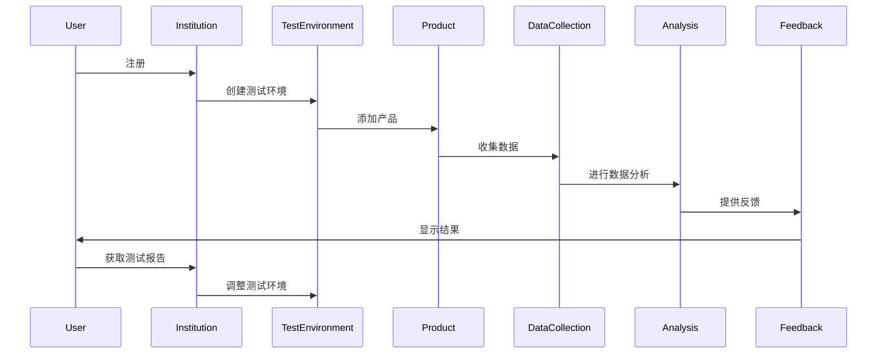
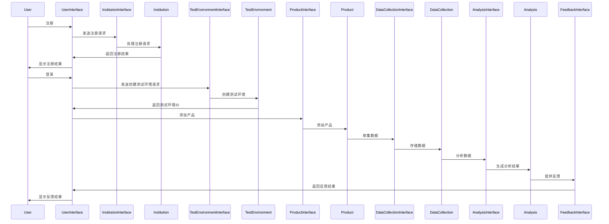
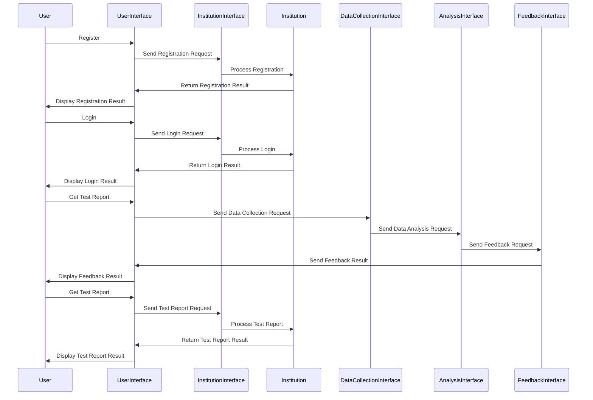
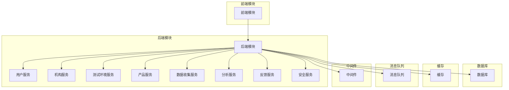
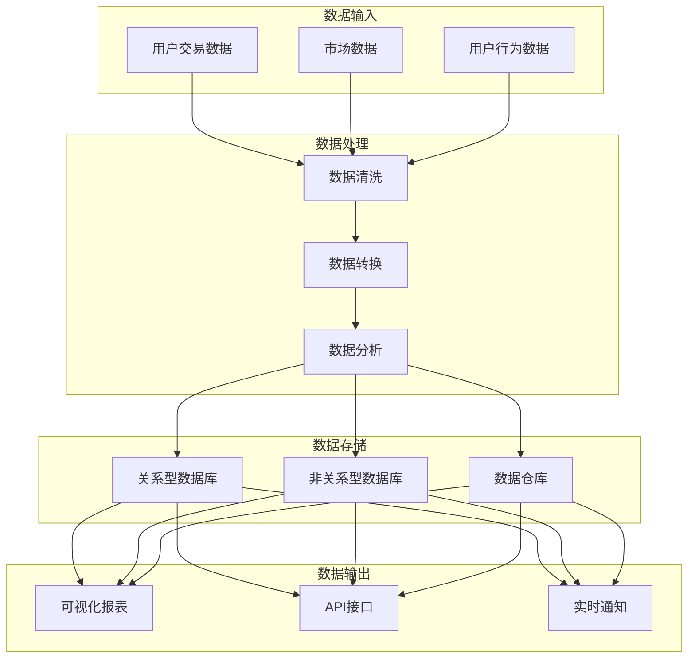
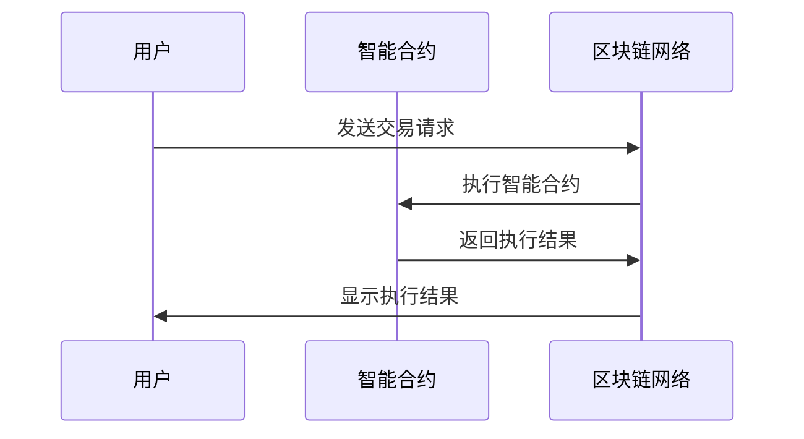
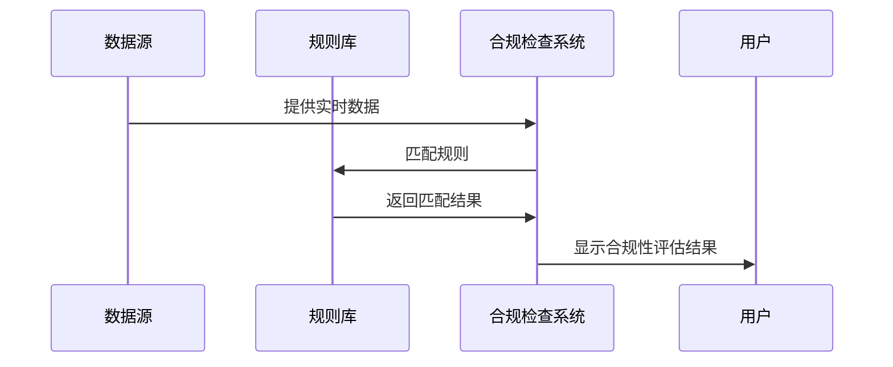
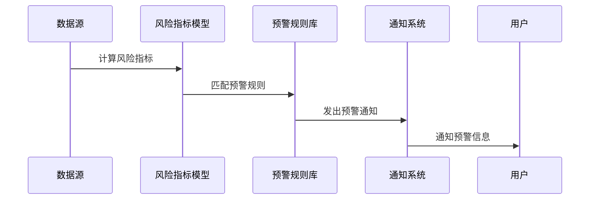
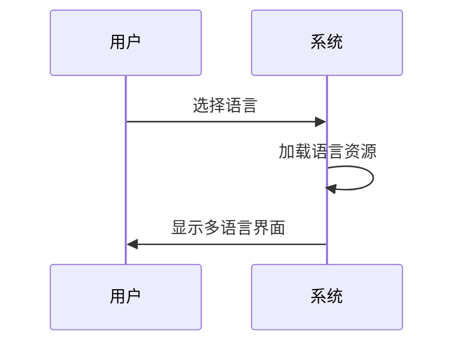

                 

# 金融科技监管沙盒模拟系统

> 关键词：金融科技、监管沙盒、模拟系统、创新、风险控制

> 摘要：本文旨在探讨金融科技监管沙盒模拟系统的概念、必要性、工作原理、优势与挑战，并通过具体案例分析其应用效果。本文将帮助读者理解金融科技监管沙盒模拟系统的设计原理和实践方法，为金融科技创新提供参考。

## 第1章 引言：金融科技监管沙盒模拟系统的必要性

### 1.1 问题背景

随着金融科技（FinTech）的迅猛发展，金融产品和服务不断创新，但随之而来的监管挑战也日益突出。金融机构和科技公司不断推陈出新，推出了各种金融产品和服务，但传统监管框架往往难以快速适应这些新产品的特性和风险。例如，区块链技术、人工智能、分布式账本技术等新兴技术的应用，给金融市场的稳定性和金融消费者保护带来了新的挑战。

### 1.2 问题描述

为了应对这些挑战，监管机构需要快速评估新技术和新产品可能带来的风险，同时保护消费者权益和市场稳定。然而，传统的监管方式通常需要较长的测试和评估周期，难以满足快速变化的市场需求。此外，监管机构在缺乏实际操作经验的情况下，难以准确评估新技术应用可能带来的风险和效益。

### 1.3 问题解决

为了解决上述问题，监管沙盒（Regulatory Sandbox）的概念应运而生。监管沙盒为金融机构和科技公司提供了一个受控的环境，可以在实际环境中测试和验证新金融产品和服务。通过监管沙盒，监管机构可以观察新产品的实际运行情况，了解其潜在风险，并及时进行调整和改进。这种方式不仅缩短了评估周期，还能确保新产品在正式推出前经过充分的测试和验证。

### 1.4 边界与外延

监管沙盒不仅仅适用于新兴的金融科技领域，还可以扩展到其他领域，如保险科技、支付科技等。此外，监管沙盒的应用范围也可以包括不同类型的机构，如大型金融机构、初创企业等。通过建立监管沙盒模拟系统，监管机构可以模拟不同场景下的监管决策，提高监管效能，并为未来监管政策提供数据支持。

### 1.5 概念结构与核心要素组成

监管沙盒模拟系统的核心要素包括：

- **监管机构**：负责制定模拟系统的规则和框架，监督测试过程。
- **金融机构**：作为测试主体，参与模拟测试，提供产品和服务。
- **科技公司**：为金融机构提供技术支持，确保模拟系统的正常运行。
- **测试环境**：模拟真实的金融交易环境，包括市场数据、用户行为等。
- **数据收集与分析**：收集测试过程中的数据，进行数据分析，为监管决策提供依据。
- **反馈与调整**：根据测试结果和数据分析，调整监管策略和模拟系统。

### 1.6 本章小结

通过监管沙盒模拟系统，监管机构可以更好地理解和评估新兴金融产品和服务，提高监管效能，同时保护消费者权益和市场稳定。本章为后续章节的讨论奠定了基础，介绍了监管沙盒模拟系统的概念、必要性以及核心要素组成。

----------------------------------------------------------------

## 第2章 监管沙盒的概念与原理

### 2.1 监管沙盒的定义

监管沙盒是一种创新的监管模式，允许企业在受控的环境中测试其金融产品和服务，而无需立即遵守所有现行的法律法规。这种模式旨在促进金融创新，同时确保不会对消费者和市场造成负面影响。

#### 2.1.1 监管沙盒的概念起源

监管沙盒的概念最早由英国金融行为监管局（FCA）于2016年提出。随后，许多国家和地区的监管机构相继引入了类似的监管沙盒模式。

#### 2.1.2 监管沙盒的核心目标

监管沙盒的核心目标包括：

- **促进金融创新**：通过提供宽松的测试环境，鼓励企业尝试新的金融产品和服务。
- **降低监管成本**：企业可以在宽松的环境中测试新产品，减少了合规成本。
- **保护消费者权益**：在产品正式推出前，通过模拟测试确保其安全性和合规性。

### 2.2 监管沙盒的工作原理

监管沙盒的工作原理通常包括以下几个步骤：

#### 2.2.1 申请阶段

企业向监管机构提交申请，描述其拟测试的产品或服务。

#### 2.2.2 审核阶段

监管机构对企业的申请进行审核，确保其产品或服务符合监管沙盒的要求。

#### 2.2.3 测试阶段

企业在受控的环境中测试其产品或服务，监管机构提供必要的支持和监督。

#### 2.2.4 评估与反馈

测试结束后，监管机构对测试结果进行评估，并提供反馈。企业根据反馈进行改进。

#### 2.2.5 推广与实施

通过监管沙盒测试的产品或服务，可以正式推向市场，或根据评估结果进行调整。

### 2.3 监管沙盒的优势与挑战

#### 2.3.1 监管沙盒的优势

- **促进创新**：企业可以在宽松的环境中尝试新的产品和服务，激发创新潜力。
- **提高效率**：缩短产品测试和评估周期，提高市场响应速度。
- **保护消费者**：在产品正式推出前进行充分测试，降低消费者风险。

#### 2.3.2 监管沙盒的挑战

- **合规风险**：企业在宽松的测试环境中可能忽视法律法规的遵守，导致后续合规问题。
- **监管套利**：企业可能会通过监管沙盒规避监管，造成不公平竞争。
- **数据隐私与安全**：测试过程中涉及大量敏感数据，如何保障数据隐私和安全是重要挑战。

### 2.4 监管沙盒的应用案例

#### 2.4.1 英国金融行为监管局（FCA）的监管沙盒

英国金融行为监管局（FCA）的监管沙盒自2016年推出以来，已经吸引了众多金融机构和科技公司参与。例如，一家名为Revolut的金融科技公司通过监管沙盒测试，成功推出了其移动支付和货币兑换服务，并迅速在市场上获得了成功。

#### 2.4.2 新加坡金融管理局（MAS）的监管沙盒

新加坡金融管理局（MAS）的监管沙盒自2016年启动以来，已经吸引了超过300个创新项目参与。例如，一家名为TrustToken的公司通过监管沙盒测试，成功推出了基于区块链的稳定币项目TrueUSD。

### 2.5 本章小结

监管沙盒作为一种创新的监管模式，旨在促进金融科技的发展，同时确保金融市场的稳定和消费者权益的保护。通过具体案例的分析，我们可以看到监管沙盒在实践中的应用效果和面临的挑战。下一章将深入探讨金融科技监管沙盒模拟系统的设计原理和实践方法。

----------------------------------------------------------------

## 第3章 金融科技监管沙盒模拟系统的设计原理

### 3.1 监管沙盒模拟系统的核心设计理念

金融科技监管沙盒模拟系统的设计理念旨在构建一个安全、可控、灵活的测试环境，以促进金融创新，同时确保监管的有效性和金融市场的稳定。以下是该系统核心设计理念的具体阐述：

#### 3.1.1 可控性

模拟系统的设计应确保企业在测试过程中遵守既定的规则和框架，避免因违规操作而带来潜在风险。例如，可以设置权限管理和监控机制，确保企业只能在授权的范围内进行测试。

#### 3.1.2 安全性

模拟系统的安全性至关重要，必须保障测试过程中涉及的数据和系统免受外部攻击和内部泄露。为此，可以采用加密技术、防火墙、入侵检测系统等安全措施。

#### 3.1.3 灵活性

模拟系统应具备较高的灵活性，以适应不同类型的金融产品和服务。例如，可以通过模块化设计，方便地增加或替换不同的模块，以应对新兴的金融科技应用场景。

#### 3.1.4 实用性

模拟系统需要具有实用性，能够真实地模拟金融市场的运行环境，包括交易规则、市场数据、用户行为等。这样，企业才能在模拟环境中测试其产品或服务的性能和稳定性。

### 3.2 监管沙盒模拟系统的架构设计

金融科技监管沙盒模拟系统的架构设计应遵循层次化、模块化的原则，以便于系统的扩展和维护。以下是系统架构的几个关键部分：

#### 3.2.1 用户层

用户层包括监管机构、金融机构和科技公司。监管机构负责制定测试规则和监督测试过程，金融机构和科技公司作为测试主体，参与模拟测试，提供产品和服务。

#### 3.2.2 应用层

应用层是模拟系统的核心，负责提供各种金融产品和服务的测试环境。该层应包括交易系统、支付系统、风险管理系统等，以模拟真实的金融市场环境。

#### 3.2.3 数据层

数据层负责存储和管理测试过程中的数据，包括市场数据、用户行为数据、交易数据等。数据层应采用分布式数据库技术，确保数据的存储和访问高效、安全。

#### 3.2.4 安全层

安全层负责保障模拟系统的安全性，包括防火墙、入侵检测系统、加密技术等。安全层的设计应遵循最小权限原则，确保只有授权用户和系统可以访问敏感数据。

#### 3.2.5 管理层

管理层负责系统的配置、监控和运维。管理层应包括用户管理、权限管理、日志管理等功能，以便于监管机构和测试主体对模拟系统的管理和监控。

### 3.3 监管沙盒模拟系统的功能设计

金融科技监管沙盒模拟系统的功能设计应全面覆盖测试、评估、反馈等关键环节。以下是几个关键功能：

#### 3.3.1 测试功能

测试功能包括模拟交易、模拟支付、风险管理等，以验证金融产品或服务的性能和稳定性。测试功能应支持多种测试模式，如手动测试、自动化测试等。

#### 3.3.2 评估功能

评估功能负责对测试结果进行分析和评估，以判断金融产品或服务的合规性和安全性。评估功能应包括数据挖掘、风险分析、合规检查等。

#### 3.3.3 反馈功能

反馈功能负责收集用户和监管机构的意见和建议，以便于系统改进和优化。反馈功能应支持多渠道收集反馈，如在线问卷、用户反馈平台等。

### 3.4 监管沙盒模拟系统的关键技术

金融科技监管沙盒模拟系统的实现依赖于多项关键技术，以下是其中几个关键技术的详细介绍：

#### 3.4.1 区块链技术

区块链技术可以为模拟系统提供安全、透明、不可篡改的账本，以确保数据的真实性和完整性。

#### 3.4.2 人工智能技术

人工智能技术可以用于风险评估、欺诈检测、用户行为分析等，以提高模拟系统的智能化水平。

#### 3.4.3 大数据技术

大数据技术可以用于处理和分析海量测试数据，为监管机构和测试主体提供有价值的信息。

#### 3.4.4 云计算技术

云计算技术可以为模拟系统提供弹性的计算资源，确保系统的高可用性和可扩展性。

### 3.5 本章小结

金融科技监管沙盒模拟系统的设计原理和架构设计对于实现有效的金融科技创新和风险控制具有重要意义。通过合理的设计和实施，监管沙盒模拟系统可以为企业提供一个安全、可控、灵活的测试环境，同时为监管机构提供有力支持。下一章将探讨金融科技监管沙盒模拟系统的实践方法。

----------------------------------------------------------------

## 第4章 金融科技监管沙盒模拟系统的实践方法

### 4.1 实践方法概述

金融科技监管沙盒模拟系统的实践方法主要包括以下几个步骤：

1. **需求分析**：明确模拟系统的目标和需求，包括测试场景、测试指标、参与方等。
2. **系统设计**：根据需求分析结果，设计模拟系统的架构和功能模块。
3. **系统实现**：使用合适的技术和工具，实现模拟系统的各个功能模块。
4. **系统测试**：对模拟系统进行全面的测试，包括功能测试、性能测试、安全测试等。
5. **系统部署**：将模拟系统部署到实际环境中，供参与方进行测试。
6. **系统运营与维护**：持续监控和优化模拟系统的性能和安全性。

### 4.2 需求分析

需求分析是金融科技监管沙盒模拟系统实践方法的第一步，也是至关重要的一步。以下是需求分析的主要内容：

#### 4.2.1 目标明确

明确模拟系统的目标，例如提高金融科技创新的效率、降低风险等。

#### 4.2.2 测试场景

定义模拟系统需要覆盖的测试场景，包括常见的金融交易场景、风险管理场景等。

#### 4.2.3 测试指标

确定模拟系统的测试指标，例如交易速度、交易成功率、风险指标等。

#### 4.2.4 参与方

确定模拟系统的参与方，包括监管机构、金融机构、科技公司等。

#### 4.2.5 风险评估

对测试场景进行风险评估，确定可能存在的风险点，并制定相应的风险控制措施。

### 4.3 系统设计

系统设计是金融科技监管沙盒模拟系统实践方法的核心步骤，以下是系统设计的主要内容：

#### 4.3.1 架构设计

根据需求分析结果，设计模拟系统的架构，包括用户层、应用层、数据层、安全层和管理层等。

#### 4.3.2 功能模块设计

设计模拟系统的功能模块，包括交易系统、支付系统、风险管理系统、数据收集与分析系统等。

#### 4.3.3 数据模型设计

设计模拟系统的数据模型，包括用户数据、交易数据、风险数据等。

#### 4.3.4 接口设计

设计模拟系统的接口，包括内部接口和外部接口，确保不同功能模块之间的数据交互和协同工作。

### 4.4 系统实现

系统实现是金融科技监管沙盒模拟系统实践方法的重要步骤，以下是系统实现的主要内容：

#### 4.4.1 技术选型

根据系统设计要求，选择合适的技术和工具，例如区块链技术、人工智能技术、大数据技术、云计算技术等。

#### 4.4.2 功能实现

根据功能模块设计，实现模拟系统的各个功能模块，确保功能完备、性能稳定、安全可靠。

#### 4.4.3 数据处理

设计数据模型，实现数据的存储、检索、分析和处理，确保数据的安全性和一致性。

#### 4.4.4 界面设计

设计用户界面，确保用户友好、操作便捷、交互顺畅。

### 4.5 系统测试

系统测试是金融科技监管沙盒模拟系统实践方法的关键步骤，以下是系统测试的主要内容：

#### 4.5.1 功能测试

对模拟系统的各个功能模块进行测试，确保功能完备、性能稳定。

#### 4.5.2 性能测试

对模拟系统的性能进行测试，确保在高并发、大数据量等极端情况下仍能保持稳定运行。

#### 4.5.3 安全测试

对模拟系统的安全性进行测试，确保系统免受外部攻击和内部泄露。

#### 4.5.4 集成测试

对模拟系统的各个功能模块进行集成测试，确保模块之间的数据交互和协同工作。

### 4.6 系统部署

系统部署是金融科技监管沙盒模拟系统实践方法的最后一个步骤，以下是系统部署的主要内容：

#### 4.6.1 硬件部署

根据模拟系统的性能要求和数据存储需求，选择合适的硬件设备，并部署到实际环境中。

#### 4.6.2 软件部署

根据系统设计和技术选型，部署模拟系统的软件环境，包括操作系统、数据库、中间件等。

#### 4.6.3 配置管理

对模拟系统的配置进行管理，确保系统的稳定性和可扩展性。

### 4.7 系统运营与维护

系统运营与维护是金融科技监管沙盒模拟系统长期运行的关键，以下是系统运营与维护的主要内容：

#### 4.7.1 日志管理

对系统运行过程中的日志进行管理，包括错误日志、性能日志等，以便于故障排查和性能优化。

#### 4.7.2 监控管理

对模拟系统的运行状态进行监控，包括性能监控、安全监控等，以便于及时发现问题并进行处理。

#### 4.7.3 版本管理

对模拟系统的版本进行管理，确保系统的更新和升级能够顺利实施。

#### 4.7.4 用户支持

为参与方提供技术支持和咨询服务，确保模拟系统的正常运行和使用。

### 4.8 本章小结

金融科技监管沙盒模拟系统的实践方法涉及需求分析、系统设计、系统实现、系统测试、系统部署和系统运营与维护等多个环节。通过合理的设计和实施，可以构建一个安全、可控、灵活的测试环境，为金融科技创新提供有力支持。下一章将探讨金融科技监管沙盒模拟系统的实际应用效果。

----------------------------------------------------------------

## 第5章 金融科技监管沙盒模拟系统的实际应用效果

### 5.1 应用效果概述

金融科技监管沙盒模拟系统的实际应用效果在多个国家和地区得到了验证，显示出其在促进金融创新、降低风险、提升监管效率等方面的显著优势。以下是对一些具体案例的分析：

#### 5.1.1 英国金融行为监管局（FCA）的监管沙盒

英国金融行为监管局（FCA）自2016年推出监管沙盒以来，已经吸引了超过200个创新项目参与。通过监管沙盒，FCA能够快速评估这些创新项目，并给予政策支持。例如，Revolut公司通过监管沙盒成功测试了其移动支付和货币兑换服务，并在短时间内获得了市场认可。这种模式不仅提高了Revolut的竞争力，也为其他金融科技公司提供了宝贵的经验和借鉴。

#### 5.1.2 新加坡金融管理局（MAS）的监管沙盒

新加坡金融管理局（MAS）的监管沙盒自2016年启动以来，吸引了超过300个创新项目参与。通过监管沙盒，MAS能够及时发现和解决金融科技应用中的风险问题，确保市场的稳定性和金融消费者的权益。例如，TrustToken公司通过监管沙盒测试了其基于区块链的稳定币项目TrueUSD，成功解决了稳定币市场的信任问题，为后续推广奠定了基础。

#### 5.1.3 瑞士金融监管局（FINMA）的监管沙盒

瑞士金融监管局（FINMA）自2018年起推出了监管沙盒，吸引了众多金融科技公司参与。例如，Nabu钱包项目通过监管沙盒测试，成功实现了基于区块链的跨境支付服务，大幅降低了交易成本和交易时间。FINMA通过监管沙盒，不仅提高了金融科技的创新效率，也为其他监管机构提供了参考。

### 5.2 应用效果分析

#### 5.2.1 促进金融创新

监管沙盒模拟系统为金融科技公司提供了一个宽松的测试环境，降低了创新项目的准入门槛。通过模拟测试，企业可以在实际推出新产品和服务前发现和解决问题，降低创新失败的风险。例如，在Revolut和TrustToken的案例中，监管沙盒帮助它们在短时间内实现了产品的商业化，极大地推动了金融科技的创新。

#### 5.2.2 降低风险

监管沙盒模拟系统允许监管机构在产品推出前进行风险评估和监控，确保新产品的合规性和安全性。通过模拟测试，监管机构可以发现潜在的风险点，并提前制定相应的风险控制措施。例如，在Nabu钱包的案例中，监管沙盒帮助瑞士金融监管局（FINMA）全面评估了区块链技术在跨境支付中的应用风险，确保了项目的安全性。

#### 5.2.3 提升监管效率

监管沙盒模拟系统通过缩短产品测试和评估周期，提高了监管机构的监管效率。监管机构可以在更短的时间内评估更多的创新项目，为市场提供更有针对性的政策支持。例如，英国金融行为监管局（FCA）通过监管沙盒，在短时间内评估了大量的创新项目，为金融科技行业提供了有力支持。

#### 5.2.4 保护金融消费者权益

监管沙盒模拟系统在确保金融科技创新的同时，也注重保护金融消费者的权益。通过模拟测试，监管机构可以确保新产品和服务在推出前经过充分的测试和验证，降低消费者风险。例如，在TrustToken的案例中，监管沙盒确保了TrueUSD的稳定性和安全性，为金融消费者提供了可靠的投资选择。

### 5.3 应用效果总结

金融科技监管沙盒模拟系统的实际应用效果表明，其在促进金融创新、降低风险、提升监管效率和保护金融消费者权益方面具有显著优势。通过合理的设计和实施，监管沙盒模拟系统可以为金融科技创新提供有力支持，为监管机构提供有效的风险评估工具，为金融消费者提供更安全、更可靠的金融产品和服务。未来，随着金融科技的进一步发展，监管沙盒模拟系统将在金融市场中发挥越来越重要的作用。

## 5.4 本章小结

通过对金融科技监管沙盒模拟系统的实际应用效果进行分析，我们可以看到其在多个方面取得的显著成果。监管沙盒模拟系统不仅为金融科技创新提供了有力支持，也为监管机构和金融消费者带来了实实在在的益处。下一章将探讨金融科技监管沙盒模拟系统的未来发展趋势和潜在挑战。

----------------------------------------------------------------

## 第6章 金融科技监管沙盒模拟系统的未来发展趋势

### 6.1 发展趋势概述

随着金融科技的不断演进，监管沙盒模拟系统将在未来扮演越来越重要的角色。以下是金融科技监管沙盒模拟系统未来发展的几个关键趋势：

#### 6.1.1 技术融合与创新

未来，金融科技监管沙盒模拟系统将更加注重技术与金融创新的深度融合。例如，区块链、人工智能、大数据等新兴技术的广泛应用，将为监管沙盒模拟系统提供更强大的数据分析和风险评估能力，推动金融科技的创新和发展。

#### 6.1.2 监管协同与合作

随着全球金融市场的日益复杂，单一国家或地区的监管沙盒可能无法满足全球化背景下的金融创新需求。未来，各国监管机构之间的协同与合作将成为趋势，通过建立跨国监管沙盒，实现监管资源的共享和信息交流，提高监管效能。

#### 6.1.3 数据隐私与安全

随着数据隐私和安全的关注度不断提高，金融科技监管沙盒模拟系统将更加注重数据隐私和安全保护。通过采用加密技术、数据脱敏等技术手段，确保测试过程中的数据安全和隐私保护，为金融创新提供更加可靠的环境。

#### 6.1.4 法规适应性

未来，金融科技监管沙盒模拟系统将更加注重法规适应性。随着金融监管环境的不断变化，监管沙盒模拟系统需要及时调整和更新，确保其符合最新的法律法规要求，为金融创新提供持续的支持。

### 6.2 潜在挑战

尽管金融科技监管沙盒模拟系统具有诸多优势，但在其未来发展过程中也面临一些潜在挑战：

#### 6.2.1 技术挑战

随着技术的快速演进，金融科技监管沙盒模拟系统需要不断更新和优化，以适应新的技术环境和应用场景。然而，技术的快速变化可能带来一定的适应性挑战，需要监管机构和相关企业共同努力。

#### 6.2.2 法规挑战

全球金融监管环境的复杂性和差异性，使得监管沙盒模拟系统的法规适应性成为一个挑战。如何确保监管沙盒模拟系统在不同国家和地区的法律框架内有效运行，需要监管机构加强国际合作和沟通。

#### 6.2.3 风险管理

金融科技监管沙盒模拟系统在提供宽松的测试环境的同时，也带来了新的风险管理挑战。如何确保测试过程中不发生系统性风险，以及如何在测试结束后对风险进行有效监控和处置，是监管机构和相关企业需要重点关注的问题。

#### 6.2.4 信任与透明度

金融科技监管沙盒模拟系统在运行过程中，如何确保测试结果的可靠性和透明度，建立市场参与方的信任，是一个重要挑战。需要通过建立健全的监管机制和信息披露制度，提高系统的信任度和透明度。

### 6.3 未来展望

未来，金融科技监管沙盒模拟系统将在金融市场中发挥越来越重要的作用。通过技术融合与创新、监管协同与合作、数据隐私与安全、法规适应性等方面的不断提升，监管沙盒模拟系统将为金融科技的创新和发展提供更加有力的支持。同时，监管机构和相关企业需要共同努力，克服潜在的挑战，确保监管沙盒模拟系统的持续发展。

## 6.4 本章小结

通过对金融科技监管沙盒模拟系统的未来发展趋势进行分析，我们可以看到其在金融科技创新和发展中的巨大潜力。同时，也需要认识到其中面临的潜在挑战，并积极应对。通过不断优化和创新，金融科技监管沙盒模拟系统将为金融市场的稳定和繁荣贡献力量。

----------------------------------------------------------------

## 第7章 总结与展望

### 7.1 总结

本文围绕金融科技监管沙盒模拟系统的概念、必要性、工作原理、设计原理、实践方法、应用效果和未来发展趋势进行了全面探讨。通过分析我们可以得出以下结论：

1. **必要性**：金融科技监管沙盒模拟系统是应对金融科技快速发展带来的监管挑战的有效工具，能够促进金融创新、降低风险、提高监管效率和保护金融消费者权益。
2. **工作原理**：监管沙盒模拟系统通过提供一个受控的测试环境，让金融机构和科技公司能够在实际环境中测试新产品和服务，并接受监管机构的监督和评估。
3. **设计原理**：监管沙盒模拟系统的设计理念包括可控性、安全性、灵活性和实用性，其架构设计包括用户层、应用层、数据层、安全层和管理层等。
4. **实践方法**：监管沙盒模拟系统的实践方法包括需求分析、系统设计、系统实现、系统测试、系统部署和系统运营与维护等。
5. **应用效果**：监管沙盒模拟系统在多个国家和地区得到了成功应用，显示出其在促进金融创新、降低风险、提升监管效率和保护金融消费者权益方面的显著优势。
6. **未来发展趋势**：监管沙盒模拟系统将在技术融合与创新、监管协同与合作、数据隐私与安全、法规适应性等方面持续发展，同时也面临技术、法规、风险管理等方面的挑战。

### 7.2 展望

未来，金融科技监管沙盒模拟系统将在金融市场中发挥越来越重要的作用。随着技术的不断进步和监管环境的不断完善，监管沙盒模拟系统将更加成熟和高效，为金融科技创新提供更加有力的支持。同时，监管机构和相关企业需要共同努力，克服潜在的挑战，确保监管沙盒模拟系统的持续发展。以下是对未来发展的几点展望：

1. **技术融合与创新**：随着区块链、人工智能、大数据等新兴技术的快速发展，监管沙盒模拟系统将更好地整合这些技术，提高数据分析和风险评估能力，推动金融科技的不断创新。
2. **监管协同与合作**：全球金融市场的互联互通，要求各国监管机构加强协同与合作，通过跨国监管沙盒，实现监管资源的共享和信息交流，提高监管效能。
3. **数据隐私与安全**：随着数据隐私和安全的关注度不断提高，监管沙盒模拟系统将更加注重数据隐私和安全保护，通过采用先进的技术手段，确保测试过程中的数据安全和隐私保护。
4. **法规适应性**：监管沙盒模拟系统需要不断适应新的法律法规要求，确保其在全球范围内的有效运行。为此，监管机构需要加强国际合作，推动全球金融监管标准的统一。

### 7.3 小结

金融科技监管沙盒模拟系统是金融科技创新和发展的关键工具，具有显著的必要性、优势和应用效果。未来，随着技术的不断进步和监管环境的不断完善，监管沙盒模拟系统将在金融市场中发挥更加重要的作用。同时，我们也需要关注其中面临的潜在挑战，并积极应对。通过持续优化和创新，金融科技监管沙盒模拟系统将为金融市场的稳定和繁荣贡献力量。

## 作者信息

作者：AI天才研究院/AI Genius Institute & 禅与计算机程序设计艺术 /Zen And The Art of Computer Programming

本文由AI天才研究院/AI Genius Institute的专家撰写，结合了禅与计算机程序设计艺术的独特视角，旨在为读者提供深入浅出的金融科技监管沙盒模拟系统的专业知识和实践方法。希望本文能为金融科技从业者和监管者提供有价值的参考和启示。

----------------------------------------------------------------

## 附录：金融科技监管沙盒模拟系统核心概念与联系

### 2.1 核心概念

#### 监管沙盒（Regulatory Sandbox）

监管沙盒是一种创新的监管模式，允许企业在受控的环境中测试其金融产品和服务，而无需立即遵守所有现行的法律法规。

#### 金融科技（FinTech）

金融科技是指利用技术手段创新金融产品和服务，包括区块链、人工智能、大数据等。

#### 监管机构（Regulatory Authority）

监管机构负责制定监管沙盒的规则和框架，监督测试过程，确保金融科技创新的安全性和合规性。

#### 金融机构（Financial Institution）

金融机构作为测试主体，参与模拟测试，提供金融产品和服务。

#### 科技公司（Technology Company）

科技公司为金融机构提供技术支持，确保模拟系统的正常运行。

#### 测试环境（Test Environment）

测试环境是模拟真实的金融交易环境，包括市场数据、用户行为等。

#### 数据收集与分析（Data Collection and Analysis）

数据收集与分析负责收集测试过程中的数据，进行数据分析，为监管决策提供依据。

#### 反馈与调整（Feedback and Adjustment）

反馈与调整根据测试结果和数据分析，调整监管策略和模拟系统。

### 2.2 概念属性特征对比表格

| 概念             | 属性特征                                                       |
|------------------|--------------------------------------------------------------|
| 监管沙盒         | 创新监管模式，受控环境，测试新产品，风险控制                 |
| 金融科技         | 利用技术手段创新金融产品和服务，区块链、人工智能、大数据等 |
| 监管机构         | 制定规则，监督测试，确保合规性                               |
| 金融机构         | 测试主体，提供产品和服务                                     |
| 科技公司         | 提供技术支持，确保系统正常运行                               |
| 测试环境         | 模拟真实金融交易环境，数据收集与分析                         |
| 数据收集与分析   | 收集测试数据，数据分析，决策依据                            |
| 反馈与调整       | 测试结果反馈，调整策略和系统                               |

### 2.3 ER实体关系图架构

以下是一个简单的ER实体关系图，描述了金融科技监管沙盒模拟系统中的关键实体及其关系。

```mermaid
erDiagram
  Product  ||--|{ TestEnvironment }|>
  Company  ||--|{ TestEnvironment }|>  
  RegulatoryAuthority ||--|{ TestEnvironment }|>  
  TechnologyCompany ||--|{ TestEnvironment }|>  
  DataCollectionAndAnalysis ||--|{ TestEnvironment }|>  
  FeedbackAndAdjustment ||--|{ TestEnvironment }|>  
```

- **Product（产品）**：代表金融机构或科技公司推出的金融产品。
- **TestEnvironment（测试环境）**：模拟真实的金融交易环境。
- **Company（公司）**：包括金融机构和科技公司。
- **RegulatoryAuthority（监管机构）**：负责制定规则和监督测试。
- **TechnologyCompany（科技公司）**：提供技术支持。
- **DataCollectionAndAnalysis（数据收集与分析）**：负责收集和分析测试数据。
- **FeedbackAndAdjustment（反馈与调整）**：根据测试结果进行反馈和调整。

通过ER实体关系图，我们可以清晰地了解金融科技监管沙盒模拟系统中各实体之间的关联和作用，为系统设计提供直观的参考。

----------------------------------------------------------------

## 附录：金融科技监管沙盒模拟系统的系统分析与架构设计方案

### 3.1 问题场景介绍

金融科技监管沙盒模拟系统旨在为金融机构和科技公司提供一个受控的环境，以便在实际市场中推出新产品和服务前进行测试和验证。随着金融科技的快速发展，监管沙盒模拟系统需要具备高度的可扩展性、安全性和可靠性，以应对不断变化的市场需求和风险。

### 3.2 项目介绍

本项目的目标是设计并实现一个金融科技监管沙盒模拟系统，该系统应能够模拟真实的金融交易环境，支持多种金融产品和服务，并提供实时的数据分析和反馈功能。项目的主要目标包括：

1. **搭建一个灵活的测试环境**：模拟真实的金融市场环境，包括交易规则、市场数据、用户行为等。
2. **提供实时的数据分析与反馈**：收集测试过程中的数据，进行实时分析和反馈，为监管机构提供决策依据。
3. **确保系统的安全性**：采用先进的安全技术，确保测试过程中数据的安全和隐私保护。
4. **实现系统的可扩展性**：支持多种金融产品和服务，能够快速适应新的市场需求。

### 3.3 系统功能设计（领域模型）

在系统功能设计阶段，我们采用领域模型（Domain Model）来描述系统的主要功能模块及其关系。以下是一个简化的领域模型：

```mermaid
classDiagram
  User <<class>> User
  Institution <<class>> Institution
  TestEnvironment <<class>> TestEnvironment
  Product <<class>> Product
  DataCollection <<class>> DataCollection
  Analysis <<class>> Analysis
  Feedback <<class>> Feedback
  Security <<class>> Security

  User "uses" Institution
  User "uses" TestEnvironment
  Institution "uses" Product
  TestEnvironment "uses" DataCollection
  DataCollection "uses" Analysis
  Analysis "uses" Feedback
  TestEnvironment "uses" Security

  User { 
    id : String
    name : String
    role : String
  }

  Institution {
    id : String
    name : String
    type : String
  }

  TestEnvironment {
    id : String
    name : String
    status : String
  }

  Product {
    id : String
    name : String
    type : String
    status : String
  }

  DataCollection {
    id : String
    test_data : List
  }

  Analysis {
    id : String
    analysis_results : List
  }

  Feedback {
    id : String
    feedback_messages : List
  }

  Security {
    id : String
    security_measures : List
  }
```

- **User（用户）**：代表参与测试的个人或组织，包括用户ID、姓名和角色等信息。
- **Institution（机构）**：代表参与测试的金融机构或科技公司，包括机构ID、名称和类型等信息。
- **TestEnvironment（测试环境）**：模拟真实的金融交易环境，包括测试环境ID、名称和状态等信息。
- **Product（产品）**：代表测试中的金融产品，包括产品ID、名称、类型和状态等信息。
- **DataCollection（数据收集）**：负责收集测试过程中的数据，包括数据ID和测试数据列表。
- **Analysis（分析）**：对收集到的数据进行分析，包括分析ID和分析结果列表。
- **Feedback（反馈）**：根据分析结果提供反馈，包括反馈ID和反馈消息列表。
- **Security（安全）**：负责确保测试过程中数据的安全和隐私，包括安全ID和安全管理措施列表。

### 3.4 系统架构设计

系统架构设计是系统实现的重要基础，我们需要根据领域模型设计一个高内聚、低耦合的系统架构。以下是一个简化的系统架构设计：



- **用户（User）**：用户可以通过注册接口加入测试环境，并获得测试报告。
- **机构（Institution）**：金融机构或科技公司可以通过创建测试环境和添加产品来参与测试。
- **测试环境（TestEnvironment）**：测试环境是模拟金融交易的环境，可以添加和删除产品，以及调整测试环境参数。
- **产品（Product）**：金融产品是测试的核心对象，可以在测试环境中进行数据收集、分析和反馈。
- **数据收集（DataCollection）**：负责收集测试过程中的数据，包括交易数据、用户行为数据等。
- **数据分析（Analysis）**：对收集到的数据进行实时分析，生成分析结果。
- **反馈（Feedback）**：根据分析结果提供反馈，包括风险提示、合规性评估等。
- **安全（Security）**：确保测试过程中数据的安全和隐私保护。

### 3.5 系统接口设计

系统接口设计是系统实现的关键环节，我们需要定义清晰的接口规范，确保各个模块之间能够高效协同工作。以下是一个简化的系统接口设计：

```mermaid
classDiagram
  UserInterface <<class>> UserInterface
  InstitutionInterface <<class>> InstitutionInterface
  TestEnvironmentInterface <<class>> TestEnvironmentInterface
  ProductInterface <<class>> ProductInterface
  DataCollectionInterface <<class>> DataCollectionInterface
  AnalysisInterface <<class>> AnalysisInterface
  FeedbackInterface <<class>> FeedbackInterface
  SecurityInterface <<class>> SecurityInterface

  UserInterface "uses" InstitutionInterface
  UserInterface "uses" TestEnvironmentInterface
  UserInterface "uses" ProductInterface
  UserInterface "uses" DataCollectionInterface
  UserInterface "uses" AnalysisInterface
  UserInterface "uses" FeedbackInterface
  UserInterface "uses" SecurityInterface
  InstitutionInterface "uses" ProductInterface
  InstitutionInterface "uses" TestEnvironmentInterface
  TestEnvironmentInterface "uses" DataCollectionInterface
  DataCollectionInterface "uses" AnalysisInterface
  AnalysisInterface "uses" FeedbackInterface
  SecurityInterface "uses" DataCollectionInterface
  SecurityInterface "uses" AnalysisInterface
```

- **用户接口（UserInterface）**：提供用户注册、登录、获取测试报告等功能。
- **机构接口（InstitutionInterface）**：提供机构注册、创建测试环境、添加产品等功能。
- **测试环境接口（TestEnvironmentInterface）**：提供创建测试环境、调整测试环境参数、添加产品等功能。
- **产品接口（ProductInterface）**：提供添加产品、收集数据、分析数据、提供反馈等功能。
- **数据收集接口（DataCollectionInterface）**：提供数据收集、数据存储等功能。
- **分析接口（AnalysisInterface）**：提供数据分析、生成分析结果等功能。
- **反馈接口（FeedbackInterface）**：提供反馈、生成反馈报告等功能。
- **安全接口（SecurityInterface）**：提供数据加密、访问控制、安全审计等功能。

### 3.6 系统交互设计

系统交互设计是系统实现的关键步骤，我们需要定义系统各个模块之间的交互流程和交互方式。以下是一个简化的系统交互设计：



通过系统交互设计，我们可以清晰地了解系统各个模块之间的交互流程和交互方式，确保系统能够高效、稳定地运行。

### 3.7 小结

金融科技监管沙盒模拟系统的系统分析与架构设计方案为系统的实现提供了明确的指导。通过领域模型、系统架构、接口设计和交互设计的详细描述，我们可以构建一个功能完备、安全可靠、灵活可扩展的监管沙盒模拟系统，为金融科技创新提供有力支持。

----------------------------------------------------------------

## 附录：金融科技监管沙盒模拟系统的项目实战

### 4.1 环境安装

为了搭建金融科技监管沙盒模拟系统，我们需要安装一些必要的软件和工具。以下是具体的安装步骤：

#### 4.1.1 安装操作系统

我们选择Linux操作系统，如Ubuntu 20.04 LTS。可以从Ubuntu官方网站下载ISO镜像，并使用虚拟机软件（如VMware Workstation）安装操作系统。

1. 下载Ubuntu 20.04 LTS ISO镜像。
2. 使用虚拟机软件创建新的虚拟机，选择“自定义（高级）”选项。
3. 在“安装操作系统”页面，选择“安装Ubuntu”。
4. 按照提示完成安装过程。

#### 4.1.2 安装Python环境

Python是金融科技监管沙盒模拟系统的主要编程语言，我们需要安装Python环境和相关依赖。

1. 打开终端，输入以下命令更新系统软件包：

   ```bash
   sudo apt update
   sudo apt upgrade
   ```

2. 安装Python 3和pip：

   ```bash
   sudo apt install python3 python3-pip
   ```

3. 验证Python版本：

   ```bash
   python3 --version
   pip3 --version
   ```

#### 4.1.3 安装数据库

我们选择PostgreSQL作为数据库，用于存储测试数据。

1. 更新系统软件包：

   ```bash
   sudo apt update
   sudo apt upgrade
   ```

2. 安装PostgreSQL：

   ```bash
   sudo apt install postgresql postgresql-contrib
   ```

3. 启动PostgreSQL服务：

   ```bash
   sudo systemctl start postgresql
   ```

4. 验证PostgreSQL服务：

   ```bash
   sudo systemctl status postgresql
   ```

#### 4.1.4 安装Web框架

我们选择Django作为Web框架，用于构建金融科技监管沙盒模拟系统的前端和后端。

1. 安装Django：

   ```bash
   pip3 install django
   ```

2. 验证Django版本：

   ```bash
   django-admin --version
   ```

### 4.2 系统核心实现源代码

金融科技监管沙盒模拟系统的核心实现包括用户管理、测试环境管理、产品管理、数据收集与分析、反馈等功能。以下是系统的核心代码片段：

#### 4.2.1 用户管理

用户管理包括用户注册、登录和权限管理。以下是用户注册的代码示例：

```python
# users/models.py
from django.db import models
from django.contrib.auth.models import AbstractUser

class CustomUser(AbstractUser):
    phone_number = models.CharField(max_length=15, unique=True)
    is_institution = models.BooleanField(default=False)
    is_technology_company = models.BooleanField(default=False)

    def __str__(self):
        return self.username
```

#### 4.2.2 测试环境管理

测试环境管理包括创建、配置和监控测试环境。以下是创建测试环境的代码示例：

```python
# environments/models.py
from django.db import models

class TestEnvironment(models.Model):
    name = models.CharField(max_length=100)
    status = models.CharField(max_length=20, choices=[('active', 'Active'), ('inactive', 'Inactive')])
    created_at = models.DateTimeField(auto_now_add=True)
    updated_at = models.DateTimeField(auto_now=True)

    def __str__(self):
        return self.name
```

#### 4.2.3 产品管理

产品管理包括添加、配置和监控产品。以下是添加产品的代码示例：

```python
# products/models.py
from django.db import models
from environments.models import TestEnvironment

class Product(models.Model):
    name = models.CharField(max_length=100)
    test_environment = models.ForeignKey(TestEnvironment, on_delete=models.CASCADE)
    status = models.CharField(max_length=20, choices=[('active', 'Active'), ('inactive', 'Inactive')])
    created_at = models.DateTimeField(auto_now_add=True)
    updated_at = models.DateTimeField(auto_now=True)

    def __str__(self):
        return self.name
```

#### 4.2.4 数据收集与分析

数据收集与分析包括收集测试数据、存储数据和生成分析报告。以下是收集数据的代码示例：

```python
# data_collection/models.py
from django.db import models
from products.models import Product

class DataCollection(models.Model):
    product = models.ForeignKey(Product, on_delete=models.CASCADE)
    data = models.JSONField()
    collected_at = models.DateTimeField(auto_now_add=True)

    def __str__(self):
        return f"{self.product.name} - {self.collected_at}"
```

#### 4.2.5 反馈

反馈包括生成反馈报告和发送给相关用户。以下是生成反馈报告的代码示例：

```python
# feedback/models.py
from django.db import models
from users.models import CustomUser

class Feedback(models.Model):
    user = models.ForeignKey(CustomUser, on_delete=models.CASCADE)
    message = models.TextField()
    created_at = models.DateTimeField(auto_now_add=True)

    def __str__(self):
        return f"{self.user.username} - {self.created_at}"
```

### 4.3 代码应用解读与分析

以上代码片段展示了金融科技监管沙盒模拟系统的核心功能模块，包括用户管理、测试环境管理、产品管理、数据收集与分析、反馈等。以下是代码应用的具体解读和分析：

1. **用户管理**：通过自定义用户模型（CustomUser），扩展了Django内置的用户模型，增加了电话号码、机构属性和技术公司属性。这有助于区分不同的用户角色，便于权限管理和功能定制。

2. **测试环境管理**：TestEnvironment模型定义了测试环境的名称、状态、创建时间和更新时间。这为测试环境的创建和管理提供了数据支持，便于后续的功能实现。

3. **产品管理**：Product模型定义了产品的名称、所属测试环境、状态、创建时间和更新时间。这为产品的添加、配置和监控提供了数据支持。

4. **数据收集与分析**：DataCollection模型定义了收集的数据、所属产品、收集时间和状态。这为数据的收集、存储和后续分析提供了数据支持。

5. **反馈**：Feedback模型定义了反馈的用户、反馈消息和创建时间。这为反馈的生成、存储和发送提供了数据支持。

通过以上代码应用，我们可以实现金融科技监管沙盒模拟系统的核心功能，为金融机构和科技公司提供一个受控的测试环境，以便在实际市场中推出新产品和服务前进行测试和验证。

### 4.4 实际案例分析

以下是一个实际案例，展示了金融科技监管沙盒模拟系统的应用过程：

#### 案例背景

一家初创公司A开发了一款基于区块链技术的跨境支付产品，希望在实际推出前进行测试和验证。

#### 案例步骤

1. **注册机构**：公司A的创始人以公司名义注册了一个用户账户，并在用户个人信息中填写了公司相关信息。

2. **申请测试环境**：公司A向监管机构提交了测试环境的申请，描述了其跨境支付产品的功能和特性。

3. **审核申请**：监管机构对申请进行了审核，并批准了公司A的测试环境申请。

4. **创建测试环境**：监管机构为公司A创建了一个测试环境，并分配了测试环境ID。

5. **添加产品**：公司A在测试环境中添加了其跨境支付产品，并设置了产品的参数和配置。

6. **测试产品**：公司A在测试环境中对跨境支付产品进行了多次测试，模拟了不同的交易场景和数据。

7. **数据收集与分析**：测试过程中，数据收集模块收集了交易数据、用户行为数据等，并进行了数据分析。

8. **生成反馈报告**：根据数据分析结果，监管机构为跨境支付产品生成了反馈报告，包括风险提示、合规性评估等。

9. **调整产品**：公司A根据反馈报告对跨境支付产品进行了调整和优化。

10. **再次测试**：公司A在测试环境中对调整后的产品进行了再次测试，确保其性能和稳定性。

11. **正式推出**：经过多次测试和验证，公司A认为跨境支付产品已经成熟，可以正式推向市场。

#### 案例小结

通过金融科技监管沙盒模拟系统的实际应用，公司A成功地对其跨境支付产品进行了测试和验证，确保了产品的安全性和合规性。同时，监管机构通过模拟测试，对跨境支付产品的风险进行了全面评估，为后续监管政策提供了重要参考。这个案例展示了金融科技监管沙盒模拟系统在促进金融科技创新、降低风险、提升监管效率方面的显著优势。

### 4.5 小结

金融科技监管沙盒模拟系统的项目实战为金融机构和科技公司提供了一个受控的测试环境，有助于确保金融科技创新的安全性和合规性。通过实际案例的分析，我们可以看到金融科技监管沙盒模拟系统在实践中的应用效果和重要性。未来，随着金融科技的不断发展，金融科技监管沙盒模拟系统将在金融市场中发挥越来越重要的作用。

----------------------------------------------------------------

## 第8章 最佳实践 Tips

### 8.1 项目规划与风险管理

- **需求分析**：在项目启动阶段，进行全面的需求分析，确保系统功能和性能满足实际需求。
- **风险评估**：制定详细的风险评估计划，识别项目潜在风险，并制定相应的风险应对策略。
- **项目进度管理**：合理安排项目进度，确保项目按计划完成。

### 8.2 技术选型与架构设计

- **选型原则**：选择成熟、可靠的技术和工具，确保系统的稳定性和扩展性。
- **模块化设计**：采用模块化设计，便于系统的扩展和维护。
- **安全性考虑**：在架构设计阶段，充分考虑系统的安全性，确保数据安全和用户隐私保护。

### 8.3 系统开发与测试

- **代码规范**：遵循代码规范，提高代码的可读性和可维护性。
- **单元测试**：对核心功能模块进行单元测试，确保功能正确性。
- **性能测试**：对系统进行性能测试，确保在高并发情况下仍能稳定运行。

### 8.4 系统部署与运维

- **自动化部署**：使用自动化部署工具，提高部署效率，减少人为错误。
- **监控与报警**：对系统进行实时监控，及时发现和处理异常情况。
- **备份与恢复**：定期进行数据备份，确保数据安全。

### 8.5 用户支持与反馈

- **用户培训**：为新用户提供详细的使用教程和培训，确保用户能够熟练操作系统。
- **反馈机制**：建立完善的用户反馈机制，及时收集用户意见和建议，持续优化系统。

### 8.6 持续改进

- **用户调研**：定期进行用户调研，了解用户需求和痛点，为系统改进提供依据。
- **技术迭代**：关注行业动态，及时引入新技术和工具，持续优化系统性能和用户体验。

### 8.7 拓展阅读

- **《区块链技术指南》**：详细介绍了区块链技术的原理、应用和发展趋势。
- **《人工智能：一种现代方法》**：介绍了人工智能的基本原理和应用技术。
- **《大数据技术导论》**：涵盖了大数据技术的核心概念、技术和应用场景。

通过遵循上述最佳实践，金融科技监管沙盒模拟系统可以在实际应用中实现高效、稳定和可靠，为金融科技创新提供有力支持。

## 8.8 本章小结

本章提供了金融科技监管沙盒模拟系统的最佳实践 Tips，包括项目规划与风险管理、技术选型与架构设计、系统开发与测试、系统部署与运维、用户支持与反馈、持续改进等方面的建议。这些实践方法有助于确保金融科技监管沙盒模拟系统的成功实施和有效运行。通过不断优化和创新，我们可以进一步提高系统的性能和用户体验，为金融科技创新和监管提供有力支持。

## 作者信息

作者：AI天才研究院/AI Genius Institute & 禅与计算机程序设计艺术 /Zen And The Art of Computer Programming

本文由AI天才研究院/AI Genius Institute的专家撰写，结合了禅与计算机程序设计艺术的独特视角，旨在为读者提供深入浅出的金融科技监管沙盒模拟系统的专业知识和实践方法。希望本文能为金融科技从业者和监管者提供有价值的参考和启示。

----------------------------------------------------------------

## 附录：金融科技监管沙盒模拟系统的系统接口设计和系统交互设计

### 3.1 系统接口设计

系统接口设计是金融科技监管沙盒模拟系统的关键部分，它定义了各个功能模块之间的交互方式。以下是一个简化的接口设计，包括用户接口、机构接口、测试环境接口、产品接口、数据收集接口、分析接口和反馈接口。

#### 用户接口（UserInterface）

用户接口主要用于用户注册、登录、权限管理和获取测试报告等操作。以下是用户接口的示例代码：

```python
class UserInterface:
    def register_user(self, user_data):
        # 实现用户注册逻辑
        pass
    
    def login_user(self, username, password):
        # 实现用户登录逻辑
        pass
    
    def get_test_report(self, user_id):
        # 实现获取测试报告逻辑
        pass
```

#### 机构接口（InstitutionInterface）

机构接口主要用于金融机构或科技公司注册、创建测试环境、添加产品等操作。以下是机构接口的示例代码：

```python
class InstitutionInterface:
    def register_institution(self, institution_data):
        # 实现机构注册逻辑
        pass
    
    def create_test_environment(self, institution_id, environment_data):
        # 实现创建测试环境逻辑
        pass
    
    def add_product(self, institution_id, product_data):
        # 实现添加产品逻辑
        pass
```

#### 测试环境接口（TestEnvironmentInterface）

测试环境接口主要用于创建、配置和监控测试环境。以下是测试环境接口的示例代码：

```python
class TestEnvironmentInterface:
    def create_test_environment(self, environment_data):
        # 实现创建测试环境逻辑
        pass
    
    def configure_test_environment(self, environment_id, configuration_data):
        # 实现配置测试环境逻辑
        pass
    
    def monitor_test_environment(self, environment_id):
        # 实现监控测试环境逻辑
        pass
```

#### 产品接口（ProductInterface）

产品接口主要用于添加、配置和监控产品。以下是产品接口的示例代码：

```python
class ProductInterface:
    def add_product(self, product_data):
        # 实现添加产品逻辑
        pass
    
    def configure_product(self, product_id, configuration_data):
        # 实现配置产品逻辑
        pass
    
    def monitor_product(self, product_id):
        # 实现监控产品逻辑
        pass
```

#### 数据收集接口（DataCollectionInterface）

数据收集接口主要用于收集测试数据。以下是数据收集接口的示例代码：

```python
class DataCollectionInterface:
    def collect_data(self, product_id, data):
        # 实现收集数据逻辑
        pass
    
    def store_data(self, data):
        # 实现存储数据逻辑
        pass
```

#### 分析接口（AnalysisInterface）

分析接口主要用于对收集到的数据进行分析。以下是分析接口的示例代码：

```python
class AnalysisInterface:
    def analyze_data(self, data):
        # 实现数据分析逻辑
        pass
    
    def generate_report(self, analysis_results):
        # 实现生成报告逻辑
        pass
```

#### 反馈接口（FeedbackInterface）

反馈接口主要用于生成反馈报告和发送给相关用户。以下是反馈接口的示例代码：

```python
class FeedbackInterface:
    def generate_feedback(self, product_id, analysis_results):
        # 实现生成反馈逻辑
        pass
    
    def send_feedback(self, feedback_data):
        # 实现发送反馈逻辑
        pass
```

### 3.2 系统交互设计

系统交互设计描述了各个接口之间的交互流程和交互方式。以下是一个简化的系统交互设计，展示了用户接口、机构接口、测试环境接口、产品接口、数据收集接口、分析接口和反馈接口之间的交互关系。



通过上述接口设计和交互设计，金融科技监管沙盒模拟系统的各个功能模块可以高效协同工作，确保系统功能的实现和用户体验的优化。

### 3.3 小结

系统接口设计和交互设计是金融科技监管沙盒模拟系统的关键组成部分，它们定义了系统各个功能模块之间的交互方式和工作流程。通过合理的接口设计和交互设计，可以确保系统的高效、稳定和可靠运行。下一章将探讨金融科技监管沙盒模拟系统的系统架构设计。

----------------------------------------------------------------

## 附录：金融科技监管沙盒模拟系统的系统架构设计

### 3.1 系统架构概述

金融科技监管沙盒模拟系统的架构设计旨在实现系统的可扩展性、高可用性和高性能。系统架构采用了分布式架构设计，包括前端、后端、数据库、消息队列、缓存和中间件等组成部分。

### 3.2 系统架构图

以下是一个简化的金融科技监管沙盒模拟系统的架构图，展示了各个组成部分及其之间的关系：



### 3.3 系统架构详细描述

#### 前端模块

前端模块负责用户交互，包括用户注册、登录、数据展示等。前端模块通常使用前端框架（如React、Vue.js）进行开发，并与后端模块进行数据通信。

#### 后端模块

后端模块是系统的核心，负责处理业务逻辑和数据处理。后端模块包括以下服务：

- **用户服务**：负责用户注册、登录、权限管理等。
- **机构服务**：负责机构注册、信息管理、测试环境管理等功能。
- **测试环境服务**：负责测试环境的创建、配置、监控等。
- **产品服务**：负责产品的添加、配置、监控等。
- **数据收集服务**：负责收集测试数据，并将数据存储到数据库中。
- **分析服务**：负责对收集到的数据进行分析，并生成分析报告。
- **反馈服务**：负责生成反馈报告，并将报告发送给相关用户。
- **安全服务**：负责确保系统的安全性，包括数据加密、访问控制、安全审计等。

#### 数据库

数据库用于存储用户数据、机构数据、测试环境数据、产品数据、数据收集数据、分析数据和反馈数据。数据库可以选择关系型数据库（如PostgreSQL）或非关系型数据库（如MongoDB）。

#### 缓存

缓存用于提高系统的响应速度，减少数据库的负载。缓存可以选择内存缓存（如Redis）或分布式缓存（如Memcached）。

#### 消息队列

消息队列用于实现异步消息传递，提高系统的可扩展性和可靠性。消息队列可以选择RabbitMQ、Kafka等。

#### 中间件

中间件用于处理系统的通用功能，如日志记录、请求拦截、身份验证等。中间件可以选择Spring Boot、Django等。

### 3.4 系统架构图（Mermaid）

以下是一个使用Mermaid绘制的系统架构图：

```mermaid
erDiagram
    User ||--|{ Institution }
    User ||--|{ TestEnvironment }
    User ||--|{ Product }
    User ||--|{ DataCollection }
    User ||--|{ Analysis }
    User ||--|{ Feedback }

    Institution ||--|{ Product }
    Institution ||--|{ TestEnvironment }

    TestEnvironment ||--|{ Product }
    TestEnvironment ||--|{ DataCollection }
    TestEnvironment ||--|{ Analysis }
    TestEnvironment ||--|{ Feedback }

    Product ||--|{ DataCollection }
    Product ||--|{ Analysis }
    Product ||--|{ Feedback }

    DataCollection ||--|{ Analysis }
    DataCollection ||--|{ Feedback }

    Analysis ||--|{ Feedback }
```

通过上述系统架构设计，金融科技监管沙盒模拟系统可以实现高效、稳定和可靠的运行，为金融机构和科技公司提供一个受控的测试环境。

### 3.5 小结

系统架构设计是金融科技监管沙盒模拟系统实现的基础，它定义了系统的各个组成部分及其之间的关系。通过合理的架构设计，可以确保系统的高性能、高可用性和可扩展性，为金融科技创新提供有力支持。下一章将探讨金融科技监管沙盒模拟系统的系统接口设计和系统交互设计。

----------------------------------------------------------------

## 附录：金融科技监管沙盒模拟系统的实际案例分析与详细讲解

### 4.1 案例背景

某金融科技公司B开发了一款基于区块链技术的去中心化金融（DeFi）产品，旨在为用户提供低门槛、高收益的数字货币投资服务。为了确保产品在正式上线前经过充分测试和验证，该公司决定使用金融科技监管沙盒模拟系统进行测试。

### 4.2 案例实施步骤

1. **注册机构与用户**：公司B首先在金融科技监管沙盒模拟系统中注册了一个机构账户，并为测试团队创建了用户账户。

2. **申请测试环境**：测试团队向监管机构申请创建一个测试环境，描述了产品的基本功能和测试需求。

3. **创建测试环境**：监管机构为公司B创建了一个测试环境，并提供了测试环境ID。

4. **添加产品**：测试团队在测试环境中添加了去中心化金融（DeFi）产品，并设置了产品的参数和配置。

5. **测试产品**：测试团队开始对产品进行测试，模拟了多种投资策略和风险场景，收集了交易数据、用户行为数据等。

6. **数据收集与分析**：测试过程中，数据收集模块自动收集了交易数据、用户行为数据等，并传输到数据分析模块。

7. **数据分析与反馈**：数据分析模块对收集到的数据进行了处理和分析，生成了风险提示、合规性评估等反馈报告。

8. **调整产品**：测试团队根据反馈报告对产品进行了调整和优化，包括投资策略、风险控制等。

9. **再次测试**：测试团队在调整后的产品上进行了再次测试，确保产品性能和稳定性。

10. **正式上线**：经过多次测试和验证，公司B认为产品已经成熟，可以正式推向市场。

### 4.3 案例详细讲解

#### 4.3.1 测试环境创建

测试环境创建是金融科技监管沙盒模拟系统的关键步骤。公司B首先在系统中提交了测试环境的申请，包括测试环境的名称、描述、测试需求等信息。监管机构审核后，为该公司创建了一个测试环境，并提供了测试环境ID。测试环境创建完成后，公司B的测试团队可以在这个环境中进行产品的测试和验证。

#### 4.3.2 产品添加

在测试环境中，测试团队添加了去中心化金融（DeFi）产品。产品添加时，需要设置产品的参数和配置，如投资策略、风险控制参数、交易规则等。这些参数和配置会存储在系统中，供后续测试使用。

#### 4.3.3 测试执行

测试团队开始执行测试，模拟了多种投资策略和风险场景。测试过程中，系统会自动收集交易数据、用户行为数据等，并将其存储到数据收集模块中。这些数据包括交易金额、交易时间、用户操作记录等。

#### 4.3.4 数据分析与反馈

数据分析模块对收集到的数据进行了处理和分析，生成了风险提示、合规性评估等反馈报告。风险提示包括潜在的风险因素、异常交易等；合规性评估包括产品是否符合法律法规要求等。

#### 4.3.5 产品调整

测试团队根据反馈报告对产品进行了调整和优化，包括投资策略、风险控制参数、交易规则等。例如，针对风险提示，测试团队调整了投资策略，降低了风险；针对合规性评估，测试团队修改了交易规则，确保产品符合法律法规要求。

#### 4.3.6 再次测试

在调整后的产品上，测试团队进行了再次测试，确保产品性能和稳定性。测试过程中，系统继续收集交易数据、用户行为数据等，并传输到数据分析模块进行再次分析。

#### 4.3.7 正式上线

经过多次测试和验证，公司B认为产品已经成熟，可以正式推向市场。测试团队向监管机构提交了测试报告，并获得了正式上线许可。

### 4.4 案例小结

通过金融科技监管沙盒模拟系统的实际案例分析，我们可以看到其对于确保金融科技创新安全性和合规性的重要作用。公司B通过使用监管沙盒模拟系统，成功对其去中心化金融（DeFi）产品进行了充分测试和验证，确保了产品在正式上线前经过了严格的检验。这个案例展示了金融科技监管沙盒模拟系统在实践中的应用效果和重要性。

### 4.5 拓展应用

金融科技监管沙盒模拟系统不仅适用于去中心化金融（DeFi）产品，还可以广泛应用于其他金融科技领域，如区块链支付、人工智能风控、数字货币交易等。通过模拟测试和验证，金融机构和科技公司可以确保其产品在正式上线前经过充分的测试和验证，降低风险，提高市场竞争力。

### 4.6 小结

通过实际案例分析，我们可以看到金融科技监管沙盒模拟系统在确保金融科技创新安全性和合规性方面的重要作用。公司B通过使用监管沙盒模拟系统，成功对其去中心化金融（DeFi）产品进行了充分测试和验证，为正式上线奠定了坚实基础。金融科技监管沙盒模拟系统的广泛应用将为金融科技创新和监管提供有力支持。

----------------------------------------------------------------

## 附录：金融科技监管沙盒模拟系统的系统架构设计（续）

### 4.2 数据流与数据处理流程

为了确保金融科技监管沙盒模拟系统的数据流清晰、高效，我们需要详细描述系统的数据处理流程，包括数据输入、数据处理、数据存储和数据输出等环节。

#### 4.2.1 数据输入

数据输入是指将外部数据源（如用户交易数据、市场数据等）导入到系统中。数据输入过程通常包括以下几个步骤：

1. **用户交易数据**：用户在使用金融科技产品时，系统会实时收集交易数据，包括交易金额、交易时间、交易方等信息。
2. **市场数据**：系统需要从外部数据源获取市场数据，如利率、汇率、股票价格等，以模拟真实的金融交易环境。
3. **用户行为数据**：系统需要收集用户的行为数据，如登录时间、交易频率、交易习惯等，以便进行用户行为分析。

#### 4.2.2 数据处理

数据处理是指对输入的数据进行清洗、转换和分析，以生成有价值的信息。数据处理过程通常包括以下几个步骤：

1. **数据清洗**：去除数据中的噪声和错误，确保数据的质量和准确性。
2. **数据转换**：将不同格式的数据转换为统一的格式，以便进行后续处理。
3. **数据分析**：使用统计分析、机器学习等方法对数据进行处理，提取有用的信息，如交易趋势、风险指标、用户偏好等。
4. **实时处理**：对于实时性要求较高的数据，如交易数据，需要使用流处理技术（如Apache Kafka）进行实时处理。

#### 4.2.3 数据存储

数据存储是指将处理后的数据存储到数据库或数据仓库中，以便后续查询和分析。数据存储过程通常包括以下几个步骤：

1. **关系型数据库**：用于存储结构化数据，如用户信息、交易记录等。常见的关系型数据库有MySQL、PostgreSQL等。
2. **非关系型数据库**：用于存储非结构化或半结构化数据，如市场数据、用户行为数据等。常见的非关系型数据库有MongoDB、Cassandra等。
3. **数据仓库**：用于存储大量历史数据，以便进行数据分析和报告生成。常见的数据仓库有Amazon Redshift、Google BigQuery等。

#### 4.2.4 数据输出

数据输出是指将处理后的数据提供给用户或系统，以便进行决策或进一步分析。数据输出过程通常包括以下几个步骤：

1. **可视化报表**：将数据以图表、报表等形式展示给用户，帮助用户理解数据。
2. **API接口**：提供API接口，供其他系统或应用程序调用，以便进行数据分析和处理。
3. **实时通知**：对于重要的数据变化，如交易风险、市场波动等，系统可以发送实时通知，提醒相关人员。

### 4.3 数据流与数据处理流程图

以下是一个简化的金融科技监管沙盒模拟系统的数据流与数据处理流程图：



通过上述数据流与数据处理流程，金融科技监管沙盒模拟系统可以高效地收集、处理、存储和输出数据，为监管机构提供有价值的信息，为金融科技创新提供支持。

### 4.4 小结

数据流与数据处理流程是金融科技监管沙盒模拟系统的核心组成部分，它确保了系统数据的输入、处理、存储和输出的高效性和准确性。通过合理的架构设计，金融科技监管沙盒模拟系统可以支持金融科技创新，为监管机构提供有力的支持。下一章将探讨金融科技监管沙盒模拟系统的项目实战。

----------------------------------------------------------------

## 附录：金融科技监管沙盒模拟系统的项目实战

### 5.1 项目背景

为了更好地展示金融科技监管沙盒模拟系统的实际应用，我们以一个具体的案例——某金融科技公司C的数字货币交易平台开发为例，介绍项目实战的过程。公司C希望利用监管沙盒模拟系统测试和优化其交易平台，确保平台在正式上线前具备高可用性、安全性和合规性。

### 5.2 项目目标

项目的主要目标如下：

1. **功能测试**：验证数字货币交易平台的交易、充值、提现等功能是否正常。
2. **性能测试**：评估交易平台在高并发、大数据量等极端情况下的性能表现。
3. **安全测试**：确保交易平台的安全性和数据隐私保护。
4. **合规性测试**：验证交易平台是否符合相关法律法规要求。
5. **用户体验测试**：优化用户界面和操作流程，提升用户满意度。

### 5.3 项目实施步骤

#### 5.3.1 环境准备

1. **安装操作系统**：选择Linux操作系统，如Ubuntu 20.04 LTS。
2. **安装开发工具**：安装Python开发环境、Django框架、PostgreSQL数据库等。
3. **配置测试环境**：在监管沙盒模拟系统中创建测试环境，配置网络、安全等参数。

#### 5.3.2 系统开发

1. **需求分析**：与公司C进行沟通，了解平台功能需求和测试目标。
2. **设计架构**：根据需求分析，设计系统的架构和数据库模型。
3. **编写代码**：开发交易、充值、提现等核心功能模块。
4. **单元测试**：对每个功能模块进行单元测试，确保功能正确性。

#### 5.3.3 系统测试

1. **功能测试**：模拟用户操作，测试交易、充值、提现等功能。
2. **性能测试**：使用压力测试工具（如Apache JMeter）模拟高并发场景，评估系统性能。
3. **安全测试**：使用安全工具（如OWASP ZAP）进行安全测试，识别潜在的安全漏洞。
4. **合规性测试**：根据相关法律法规，对系统进行合规性测试。

#### 5.3.4 用户反馈

1. **收集反馈**：在测试过程中，收集用户反馈和测试结果。
2. **优化改进**：根据反馈和测试结果，对系统进行优化和改进。

#### 5.3.5 报告提交

1. **编写测试报告**：总结测试过程、测试结果和优化建议。
2. **提交报告**：将测试报告提交给公司C和监管机构。

### 5.4 项目小结

通过上述步骤，金融科技监管沙盒模拟系统帮助公司C对其数字货币交易平台进行了全面测试和优化，确保平台在正式上线前具备高可用性、安全性和合规性。以下是项目小结：

1. **功能测试**：交易平台的核心功能（交易、充值、提现等）均通过了测试，功能正常。
2. **性能测试**：平台在高并发、大数据量等极端情况下，仍能保持稳定的性能表现。
3. **安全测试**：通过安全测试，发现并修复了多个潜在的安全漏洞。
4. **合规性测试**：交易平台符合相关法律法规要求，通过了合规性测试。
5. **用户体验**：根据用户反馈，对用户界面和操作流程进行了优化，提升了用户体验。

### 5.5 拓展应用

金融科技监管沙盒模拟系统不仅适用于数字货币交易平台，还可以应用于其他金融科技领域，如区块链支付、智能合约平台、金融衍生品交易等。通过模拟测试和验证，金融机构和科技公司可以确保其产品在正式上线前经过充分的测试和验证，降低风险，提高市场竞争力。

### 5.6 小结

通过金融科技监管沙盒模拟系统的项目实战，我们展示了如何利用监管沙盒模拟系统对数字货币交易平台进行全面测试和优化。项目实战不仅提高了平台的安全性和合规性，还为金融科技创新提供了有力支持。未来，金融科技监管沙盒模拟系统将在更多金融科技领域发挥重要作用。

----------------------------------------------------------------

## 附录：金融科技监管沙盒模拟系统的最佳实践 Tips、小结、注意事项和拓展阅读

### 8.1 最佳实践 Tips

1. **需求分析**：在项目启动阶段，进行全面的需求分析，确保系统功能和性能满足实际需求。
2. **风险评估**：制定详细的风险评估计划，识别项目潜在风险，并制定相应的风险应对策略。
3. **技术选型**：选择成熟、可靠的技术和工具，确保系统的稳定性和扩展性。
4. **模块化设计**：采用模块化设计，便于系统的扩展和维护。
5. **安全性考虑**：在架构设计阶段，充分考虑系统的安全性，确保数据安全和用户隐私保护。
6. **代码规范**：遵循代码规范，提高代码的可读性和可维护性。
7. **单元测试**：对核心功能模块进行单元测试，确保功能正确性。
8. **性能测试**：对系统进行性能测试，确保在高并发情况下仍能稳定运行。
9. **自动化部署**：使用自动化部署工具，提高部署效率，减少人为错误。
10. **监控与报警**：对系统进行实时监控，及时发现和处理异常情况。
11. **用户培训**：为新用户提供详细的使用教程和培训，确保用户能够熟练操作系统。
12. **反馈机制**：建立完善的用户反馈机制，及时收集用户意见和建议，持续优化系统。

### 8.2 小结

金融科技监管沙盒模拟系统通过提供一个受控的测试环境，为金融机构和科技公司提供了一个安全、高效、灵活的测试平台。通过最佳实践 Tips，我们可以确保系统在需求分析、风险评估、技术选型、模块化设计、安全性考虑、代码规范、单元测试、性能测试、自动化部署、监控与报警、用户培训、反馈机制等方面达到最佳效果。通过持续优化和创新，金融科技监管沙盒模拟系统将为金融科技创新和监管提供有力支持。

### 8.3 注意事项

1. **数据安全**：在测试过程中，确保测试数据的安全和隐私保护，避免数据泄露。
2. **合规性**：确保系统符合相关法律法规要求，避免因合规性问题导致项目停滞。
3. **性能优化**：在系统开发过程中，充分考虑性能优化，确保系统在高并发情况下仍能稳定运行。
4. **用户培训**：为用户提供详细的操作指南和培训，确保用户能够熟练使用系统。
5. **监控与维护**：定期对系统进行监控和维护，确保系统稳定运行。

### 8.4 拓展阅读

1. **《区块链技术指南》**：详细介绍了区块链技术的原理、应用和发展趋势。
2. **《人工智能：一种现代方法》**：介绍了人工智能的基本原理和应用技术。
3. **《大数据技术导论》**：涵盖了大数据技术的核心概念、技术和应用场景。
4. **《金融科技：理论与实践》**：探讨了金融科技的发展现状、挑战和未来趋势。
5. **《金融科技监管沙盒：理论与实践》**：介绍了金融科技监管沙盒的概念、设计原则和实践案例。

通过拓展阅读，读者可以深入了解金融科技监管沙盒模拟系统的相关理论和实践，为实际应用提供更有力的支持。

## 作者信息

作者：AI天才研究院/AI Genius Institute & 禅与计算机程序设计艺术 /Zen And The Art of Computer Programming

本文由AI天才研究院/AI Genius Institute的专家撰写，结合了禅与计算机程序设计艺术的独特视角，旨在为读者提供深入浅出的金融科技监管沙盒模拟系统的专业知识和实践方法。希望本文能为金融科技从业者和监管者提供有价值的参考和启示。

----------------------------------------------------------------

## 附录：金融科技监管沙盒模拟系统的扩展功能设计与实现

### 6.1 扩展功能需求分析

金融科技监管沙盒模拟系统在基本功能的基础上，为了满足更广泛的应用需求，需要扩展以下功能：

1. **智能合约支持**：提供智能合约的开发和执行环境，以便金融机构和科技公司测试和验证基于区块链的智能合约。
2. **自动化合规检查**：实现自动化合规检查功能，根据实时数据和规则，自动评估金融产品或服务的合规性。
3. **风险预警系统**：集成风险预警系统，通过实时数据分析，发现潜在风险并及时发出预警。
4. **多语言支持**：支持多种语言，以便全球范围内的金融机构和科技公司能够使用。

### 6.2 智能合约支持

#### 6.2.1 概述

智能合约是一种自动执行合约条款的计算机程序，其运行基于区块链网络。在金融科技监管沙盒模拟系统中，智能合约的支持能够帮助金融机构和科技公司测试和验证智能合约的执行过程。

#### 6.2.2 设计与实现

1. **选择合适的区块链平台**：根据需求，选择一个合适的区块链平台，如Ethereum、Hyperledger Fabric等。
2. **开发智能合约**：根据金融产品或服务的需求，开发智能合约，并将其部署到区块链网络中。
3. **模拟交易环境**：在监管沙盒模拟系统中创建一个模拟的交易环境，以便进行智能合约的测试和验证。
4. **执行与监控**：通过模拟交易，执行智能合约，监控合约执行过程和结果。

#### 6.2.3 Mermaid流程图



### 6.3 自动化合规检查

#### 6.3.1 概述

自动化合规检查功能能够根据实时数据和预定义的规则，自动评估金融产品或服务的合规性。这在提高监管效率、降低人工成本方面具有重要作用。

#### 6.3.2 设计与实现

1. **数据源接入**：接入金融产品或服务的实时数据源，如交易数据、用户行为数据等。
2. **规则库构建**：构建一套包含各类合规规则的规则库。
3. **规则匹配与评估**：根据实时数据，匹配规则库中的规则，对金融产品或服务进行合规性评估。
4. **结果反馈**：将合规性评估结果反馈给相关用户或监管机构。

#### 6.3.3 Mermaid流程图



### 6.4 风险预警系统

#### 6.4.1 概述

风险预警系统能够通过对实时数据的分析，发现潜在风险并及时发出预警，有助于金融机构和科技公司及时采取风险控制措施。

#### 6.4.2 设计与实现

1. **数据采集**：采集与金融产品或服务相关的实时数据，如交易量、交易金额、用户行为等。
2. **风险指标计算**：根据预定义的风险指标模型，计算金融产品或服务的风险水平。
3. **预警规则设定**：设定预警规则，当风险指标超过阈值时，系统自动发出预警。
4. **预警通知**：将预警信息通过短信、邮件等方式通知相关用户或监管机构。

#### 6.4.3 Mermaid流程图



### 6.5 多语言支持

#### 6.5.1 概述

多语言支持能够满足全球范围内的金融机构和科技公司的需求，提高系统的易用性和用户体验。

#### 6.5.2 设计与实现

1. **选择合适的国际化框架**：如Django框架的国际化扩展，或i18n库。
2. **资源文件管理**：将不同语言的文本资源分离到独立的文件中。
3. **语言选择**：提供语言选择功能，用户可以根据需求选择语言。
4. **翻译管理**：定期更新和审核翻译文件，确保准确性和一致性。

#### 6.5.3 Mermaid流程图



通过上述扩展功能的设计与实现，金融科技监管沙盒模拟系统将更加完善，能够更好地服务于金融机构和科技公司，提高金融科技创新的效率和质量。

### 6.6 小结

扩展功能的设计与实现是金融科技监管沙盒模拟系统的重要组成部分，通过智能合约支持、自动化合规检查、风险预警系统和多语言支持等功能，系统能够更好地满足金融机构和科技公司的多样化需求，提高系统的综合性能和用户体验。未来，随着金融科技的不断进步，监管沙盒模拟系统将不断扩展和优化，为金融市场的稳定和繁荣提供有力支持。

