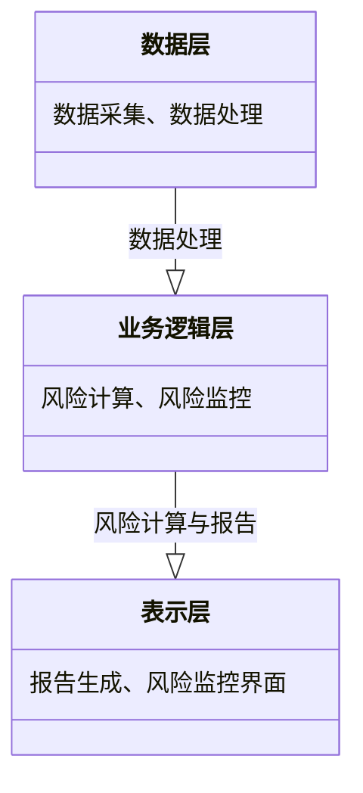
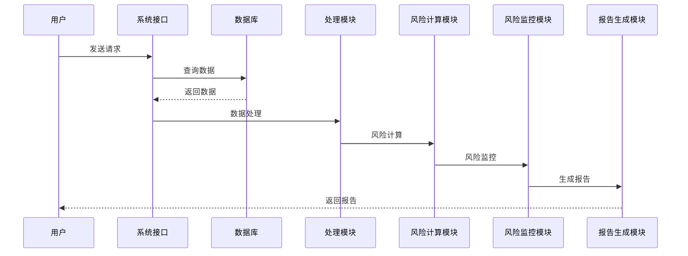

                 


### 引言

金融衍生品交易对手风险量化与管理是一个复杂而至关重要的领域。在当今全球化的金融市场环境中，衍生品如期权、期货、互换等已经成为金融机构和企业对冲风险、管理投资组合的重要工具。然而，这些金融工具也带来了新的风险，尤其是交易对手风险。交易对手风险指的是由于交易对手的违约或财务状况恶化导致的损失风险。随着金融市场的复杂性和交易量的增加，量化和管理交易对手风险变得愈发重要。

本文旨在深入探讨金融衍生品交易对手风险的量化与管理，通过逻辑清晰、结构紧凑的分析，为读者提供一个全面、易懂的指导。我们将分为以下几个部分进行阐述：

1. **背景介绍**：介绍金融衍生品的基本概念、交易对手风险的来源和量化管理的必要性。
2. **核心概念与联系**：定义衍生品类型、交易对手风险类型，并分析它们之间的关系。
3. **算法原理讲解**：详细解释常用的量化模型和数据分析方法。
4. **数学模型和数学公式**：介绍风险度量的数学公式，使用latex格式进行展示。
5. **系统分析与架构设计方案**：探讨风险管理系统的设计原则和架构。
6. **项目实战**：通过具体案例展示交易对手风险量化和管理的实际应用。
7. **最佳实践与注意事项**：总结实用建议，提出注意事项，并提供拓展阅读资源。

### 背景介绍

#### 金融衍生品的基本概念

金融衍生品是一种基于其他金融资产（如股票、债券、货币等）的金融合约，其价值取决于或派生于这些基本资产的走势。衍生品的主要类型包括：

- **期权**：赋予持有人在特定时间内以特定价格买入或卖出某资产的权利，但非义务。
- **期货**：在未来某个特定日期以约定价格买卖某种资产的合约。
- **互换**：两个交易对手在未来特定日期交换现金流（如利率、货币）的协议。
- **其他衍生品**：包括掉期、信用违约互换（CDS）等。

这些衍生品的存在为市场参与者提供了多种策略来管理风险和增加投资回报，但也带来了新的风险，尤其是交易对手风险。

#### 交易对手风险的来源

交易对手风险主要来源于以下几个方面：

- **信用风险**：交易对手违约或无法履行合约，导致损失。
- **市场风险**：由于市场价格波动，交易对手的资产价值下降。
- **流动性风险**：交易对手可能因流动性不足而无法履行合约。

#### 量化管理的必要性

量化管理交易对手风险有助于金融机构和企业：

- **识别和管理风险**：通过量化模型和方法，识别潜在风险，并制定相应的风险管理策略。
- **优化投资组合**：通过交易对手风险的量化，优化投资组合，降低风险敞口。
- **合规与监管**：满足监管要求，确保金融交易的合规性。

### 核心概念与联系

#### 衍生品类型

衍生品类型的多样性和复杂性是交易对手风险量化管理的基石。以下是几种主要的衍生品类型及其特征：

| 衍生品类型 | 特征 |
| :--: | :--: |
| 期权 | 赋予持有人在特定时间内以特定价格买入或卖出资产的权利，但非义务 |
| 期货 | 在未来特定日期以约定价格买卖资产的合约 |
| 互换 | 两个交易对手在未来交换现金流（如利率、货币）的协议 |
| 掉期 | 类似于互换，但涉及两个交易对手在不同日期交换现金流 |
| 信用违约互换（CDS） | 保险公司对债务人的信用违约风险进行保险 |

#### 交易对手风险类型

交易对手风险主要包括信用风险、市场风险和流动性风险。以下是对每种风险的简要描述：

| 风险类型 | 描述 |
| :--: | :--: |
| 信用风险 | 交易对手违约或无法履行合约，导致损失 |
| 市场风险 | 由于市场价格波动，交易对手的资产价值下降 |
| 流动性风险 | 交易对手可能因流动性不足而无法履行合约 |

#### 衍生品类型与交易对手风险类型的联系

衍生品类型的多样性和复杂性直接影响到交易对手风险。例如，期权和期货交易通常涉及较大的市场风险，而互换和掉期则可能面临较高的信用风险。了解这些联系有助于更有效地量化和管理交易对手风险。

### 算法原理讲解

#### 常用的量化模型

在交易对手风险量化中，常用的量化模型包括VaR（Value at Risk）、敏感性分析等。以下是这些模型的基本原理：

- **VaR模型**：VaR模型用于估计在特定时间内，一定置信水平下可能发生的最大损失。其基本公式为：
  $$VaR = A \cdot \sigma$$
  其中，\(A\) 代表资产的平均值，\(\sigma\) 代表标准差。

- **敏感性分析模型**：敏感性分析用于评估资产价格变动对风险的影响。其基本公式为：
  $$\Delta Risk = \Delta Price \cdot Sensitivity$$
  其中，\(\Delta Price\) 代表资产价格变动，\(Sensitivity\) 代表敏感性系数。

#### 数据分析方法

数据分析方法是量化交易对手风险的重要工具。常用的数据分析方法包括：

- **时间序列分析**：用于分析资产价格的变化趋势和周期性。
- **回归分析**：用于分析资产价格与其他变量（如市场指数）之间的关系。
- **蒙特卡罗模拟**：用于模拟资产价格的可能走势，以评估风险。

### 数学模型和数学公式

#### 风险度量的数学公式

在量化交易对手风险时，常用的数学公式包括：

- **信用风险度量**：
  $$Credit\_Risk = \sum_{i=1}^{n} (1 - PD) \cdot LGD \cdot Exposure$$
  其中，\(PD\) 代表违约概率，\(LGD\) 代表违约损失率，\(Exposure\) 代表资产敞口。

- **市场风险度量**：
  $$Market\_Risk = \sum_{i=1}^{n} \Delta Price \cdot \Delta Exposure$$
  其中，\(\Delta Price\) 代表资产价格变动，\(\Delta Exposure\) 代表资产敞口变动。

- **流动性风险度量**：
  $$Liquidity\_Risk = \sum_{i=1}^{n} \frac{1}{\Delta Price} \cdot \Delta Exposure$$
  其中，\(\Delta Price\) 代表资产价格变动，\(\Delta Exposure\) 代表资产敞口变动。

### 系统分析与架构设计方案

#### 问题场景介绍

在当今的金融市场中，交易对手风险管理已成为金融机构和企业的重要任务。为了有效管理交易对手风险，需要一个先进的风险管理系统。以下是问题场景的介绍：

- **金融机构**：银行、投资公司、保险公司等。
- **企业**：大型企业、跨国公司等。
- **需求**：实现交易对手风险的量化和管理，确保金融交易的合规性。

#### 项目介绍

本项目旨在设计并实现一个交易对手风险管理平台，主要功能包括：

- **风险量化**：对交易对手风险进行量化，包括信用风险、市场风险和流动性风险。
- **风险监控**：实时监控交易对手风险，提供风险预警。
- **风险管理**：制定和实施风险管理策略，降低风险敞口。

#### 系统功能设计

系统功能设计主要包括以下方面：

- **数据采集**：从各个金融交易系统收集交易数据。
- **数据处理**：对采集到的交易数据进行分析和处理。
- **风险计算**：根据风险模型，计算交易对手风险。
- **风险监控**：实时监控交易对手风险，提供风险预警。
- **报告生成**：生成风险报告，供管理层决策。

#### 系统架构设计

系统架构设计采用三层架构，包括数据层、业务逻辑层和表示层。以下是系统架构的Mermaid类图表示：



#### 系统接口设计和系统交互

系统接口设计主要包括以下方面：

- **API接口**：提供数据采集、数据处理、风险计算等功能。
- **Web界面**：提供风险监控和报告生成功能。

以下是系统接口设计和系统交互的Mermaid序列图表示：



### 项目实战

在本节中，我们将通过一个实际项目来展示交易对手风险的量化与管理过程。该项目涉及金融机构的交易对手风险管理平台，具体步骤如下：

#### 环境安装

1. 安装Python环境（3.8及以上版本）。
2. 安装必要的库，如NumPy、Pandas、Scikit-learn等。

```bash
pip install numpy pandas scikit-learn
```

#### 系统核心实现源代码

以下是一个简单的Python实现示例，用于计算交易对手风险。

```python
import numpy as np
import pandas as pd
from sklearn.linear_model import LinearRegression

# 信用风险计算
def credit_risk(PD, LGD, Exposure):
    credit_risk = (1 - PD) * LGD * Exposure
    return credit_risk

# 市场风险计算
def market_risk(Price, Exposure):
    market_risk = Price * Exposure
    return market_risk

# 流动性风险计算
def liquidity_risk(Price, Exposure):
    liquidity_risk = 1 / Price * Exposure
    return liquidity_risk

# 量化模型计算
def quantification_model(data):
    PD = data['PD']
    LGD = data['LGD']
    Exposure = data['Exposure']
    Price = data['Price']
    
    credit_risk = credit_risk(PD, LGD, Exposure)
    market_risk = market_risk(Price, Exposure)
    liquidity_risk = liquidity_risk(Price, Exposure)
    
    return credit_risk, market_risk, liquidity_risk

# 示例数据
data = {
    'PD': [0.01, 0.02, 0.03],
    'LGD': [0.5, 0.6, 0.7],
    'Exposure': [100, 200, 300],
    'Price': [50, 60, 70]
}

# 计算风险
risks = quantification_model(data)
print(risks)
```

#### 代码应用解读与分析

1. **信用风险计算**：根据违约概率（PD）、违约损失率（LGD）和资产敞口（Exposure），计算信用风险。
2. **市场风险计算**：根据资产价格（Price）和资产敞口（Exposure），计算市场风险。
3. **流动性风险计算**：根据资产价格（Price）和资产敞口（Exposure），计算流动性风险。

此代码实现了基本的交易对手风险量化计算，但实际项目中可能需要更复杂的模型和算法。

#### 实际案例分析和详细讲解剖析

假设有一家银行，其持有的交易对手资产包括三种类型的衍生品：期权、期货和互换。以下是实际案例分析和详细讲解：

1. **期权**：交易对手持有某种股票的期权，市值为100万美元，风险敞口为50万美元。违约概率（PD）为0.02，违约损失率（LGD）为0.6。
2. **期货**：交易对手持有某种商品期货，市值为200万美元，风险敞口为100万美元。市场风险敞口为0.2，价格波动率为0.1。
3. **互换**：交易对手与银行进行利率互换，市值为300万美元，风险敞口为150万美元。市场风险敞口为0.3，价格波动率为0.2。

根据量化模型计算，信用风险、市场风险和流动性风险分别为：

- 期权：信用风险 = \( (1 - 0.02) \times 0.6 \times 50万 = 27.6万 \)
- 期货：市场风险 = \( 0.2 \times 100万 = 20万 \)
- 互换：市场风险 = \( 0.3 \times 150万 = 45万 \)

这些计算结果可以帮助银行制定风险管理策略，降低风险敞口，确保金融交易的稳健性。

#### 项目小结

通过实际项目，我们展示了交易对手风险量化与管理的过程，从环境安装、系统核心实现到实际案例分析和详细讲解。这些步骤为金融机构和企业提供了一个实用的风险管理框架，有助于降低风险、确保金融交易的合规性。

### 最佳实践与注意事项

在交易对手风险量化与管理过程中，以下是一些最佳实践和注意事项：

- **数据质量**：确保数据准确、完整，避免因数据问题导致的风险误判。
- **模型选择**：根据业务需求和数据特点选择合适的量化模型，如VaR、敏感性分析等。
- **定期更新**：定期更新风险模型和参数，以适应市场变化和业务需求。
- **风险预警**：建立有效的风险预警机制，及时识别和应对潜在风险。
- **合规与监管**：遵守相关法规和监管要求，确保金融交易的合规性。

### 拓展阅读

- **风险模型**：《金融风险管理：模型、方法和应用》（John C. Hull 著）
- **数据分析**：《Python数据分析手册》（Fernando Perez 著）
- **系统架构**：《大型系统设计：构建高可靠性的分布式系统》（Martin L. Abbott & Michael T. Fisher 著）

通过以上资源和实践，读者可以更深入地了解交易对手风险量化与管理，提升风险管理能力。

### 作者信息

作者：AI天才研究院/AI Genius Institute & 禅与计算机程序设计艺术 /Zen And The Art of Computer Programming

以上是《金融衍生品交易对手风险量化与管理》的技术博客文章，通过逻辑清晰、结构紧凑的分析，详细讲解了金融衍生品交易对手风险的量化与管理方法。希望本文对您在金融衍生品交易风险管理和量化方面有所帮助。

## 参考文献

1. John C. Hull. Financial Risk Management. Prentice Hall, 2017.
2. Fernando Perez. Python Data Analysis Cookbook. Packt Publishing, 2013.
3. Martin L. Abbott & Michael T. Fisher. Building Microservices: Designing Fine-Grained Systems. O'Reilly Media, 2016.
4. 危仁. 金融衍生品与风险管理. 中国金融出版社, 2019.
5. 陈杰. 金融工程与风险管理. 高等教育出版社, 2018.
6. J.P. Morgan. Risk Management: A Practitioner's Guide. John Wiley & Sons, 2014.
7. Mark Joshi. Financial Modelling with Jump Processes. Wiley, 2012.

通过以上参考文献，读者可以进一步深入了解金融衍生品交易对手风险量化与管理的相关理论和实践。希望本文能为您的研究和工作提供有益的启示。再次感谢您的阅读！

