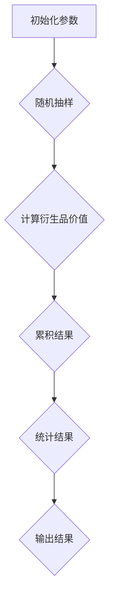
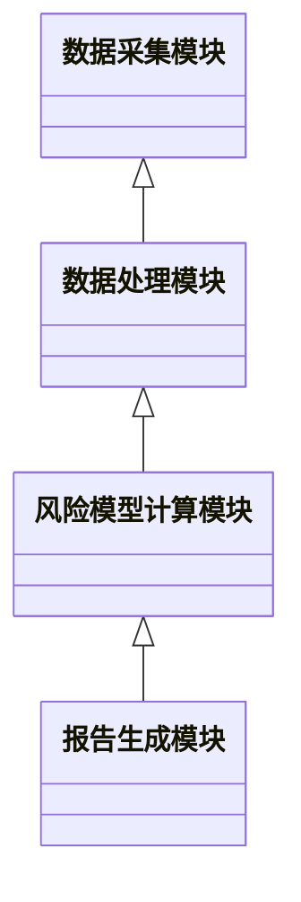
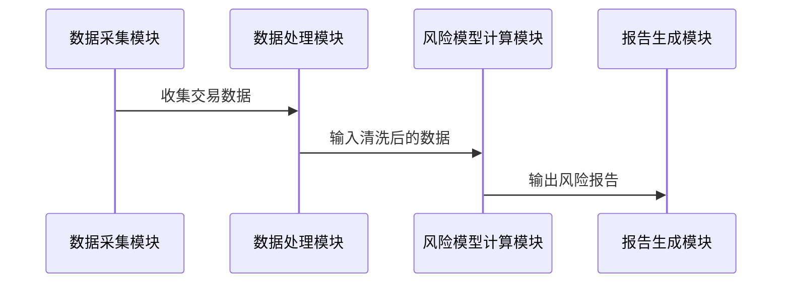
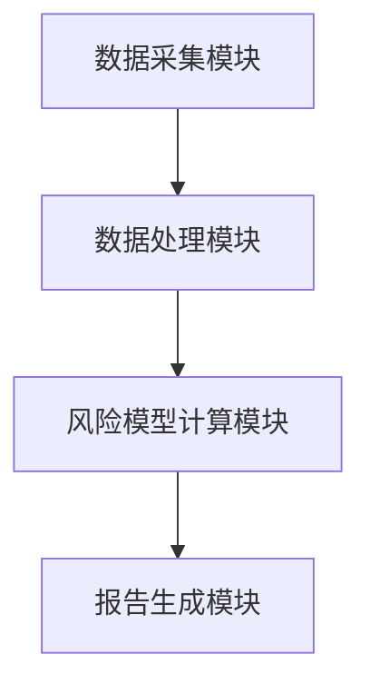
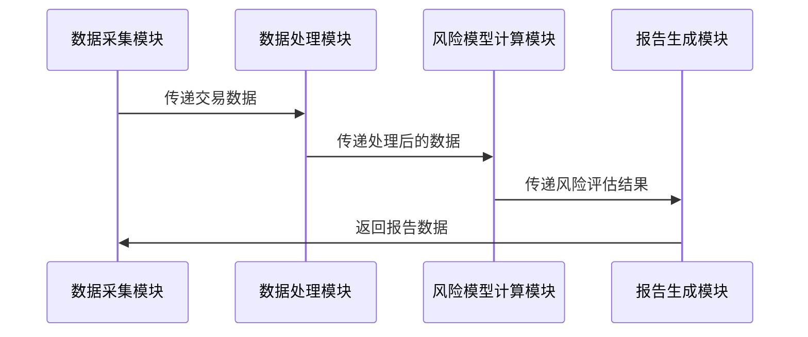

                 


# 金融衍生品交易对手风险量化模型

## 关键词

- 金融衍生品
- 交易对手风险
- 量化模型
- 风险控制
- 数学模型

## 摘要

本文深入探讨了金融衍生品交易中的交易对手风险及其量化模型。首先，介绍了金融衍生品和交易对手风险的基本概念，以及量化模型在风险控制中的重要性。接着，通过详细解析核心概念、算法原理、数学模型以及系统架构，本文为读者提供了构建和实施交易对手风险量化模型的全流程指导。通过实际案例分析和项目实战，本文不仅阐明了理论知识的实际应用，还分享了最佳实践和注意事项，以帮助读者更好地理解和掌握这一领域的知识和技能。

## 细分章节内容

### 1. 背景介绍

#### 1.1 问题背景

**金融衍生品交易**是一种基于标的资产未来价格变动的交易形式，通过合约进行买卖，以对冲或投机为目的。衍生品市场在全球金融体系中扮演着重要角色，但同时也带来了交易对手风险。

**交易对手风险**指的是由于交易对手的信用风险、流动性风险或操作风险等原因，导致交易未能按约定完成，从而给市场参与者带来损失的风险。量化交易对手风险对于金融机构的风险管理和监管具有重要意义。

#### 1.2 问题描述

交易对手风险的产生原因复杂，主要包括以下几个方面：

- **信用风险**：交易对手无法履行合约义务。
- **流动性风险**：交易对手无法在紧急情况下平仓。
- **操作风险**：人为错误或系统故障导致交易无法正常执行。

交易对手风险的影响包括市场信心受损、交易成本上升、市场流动性降低等。

#### 1.3 问题解决

**量化模型**在交易对手风险的管理中起到了关键作用。通过数学和统计分析方法，量化模型能够对交易对手风险进行量化评估，帮助金融机构制定风险管理策略。

**交易对手风险量化模型的必要性**体现在以下几个方面：

- **风险控制**：通过量化模型，金融机构可以更加精确地评估和管理风险。
- **监管合规**：监管机构要求金融机构提供详细的交易对手风险报告，量化模型是合规要求的必要工具。
- **市场参与**：量化模型有助于投资者在市场波动中做出更加理性的决策。

#### 1.4 边界与外延

交易对手风险量化模型的应用范围广泛，包括但不限于以下领域：

- **金融机构**：银行、证券公司、保险公司等金融机构。
- **交易市场**：交易所、场外交易市场等。
- **监管机构**：金融监管机构在进行风险评估和监管合规审查时。

然而，量化模型也存在一定的限制条件，如数据质量、模型假设等。

#### 1.5 概念结构与核心要素组成

**金融衍生品**是指其价值依赖于一个或多个基础资产的价格变动的金融合约。

**交易对手**是指在金融衍生品交易过程中，与当前方进行交易的其他金融机构或个人。

**量化模型**是指基于数学和统计分析方法，用于评估金融衍生品交易对手风险的模型。

核心要素包括：

- **信用评分模型**：评估交易对手信用风险的模型。
- **流动性风险评估模型**：评估交易对手流动性风险的模型。
- **操作风险评估模型**：评估交易对手操作风险的模型。

### 2. 核心概念与联系

#### 2.1 核心概念原理

**金融衍生品交易**是一种基于标的资产未来价格变动的交易形式，其价值依赖于基础资产的价格变动。

**交易对手风险**是指由于交易对手的信用风险、流动性风险或操作风险等原因，导致交易未能按约定完成，从而给市场参与者带来损失的风险。

**量化模型**是指通过数学和统计分析方法，对交易对手风险进行量化和评估的模型。

三者之间的关系如下：

- **金融衍生品交易**是**交易对手风险**的产生基础。
- **量化模型**是对**交易对手风险**进行量化和评估的工具。

#### 2.2 概念属性特征对比表格

| 概念名称 | 特征1 | 特征2 | 特征3 |
| --- | --- | --- | --- |
| 金融衍生品交易 | 基于标的资产价格变动 | 金融合约 | 对冲或投机 |
| 交易对手风险 | 信用风险 | 流动性风险 | 操作风险 |
| 量化模型 | 数学方法 | 统计分析 | 量化评估 |

#### 2.3 ER实体关系图架构

```mermaid
entity Relationship {
 衍生品交易 --> 交易对手
 交易对手 --> 量化模型
 量化模型 --> 信用评分模型
 量化模型 --> 流动性风险评估模型
 量化模型 --> 操作风险评估模型
}
```

### 3. 算法原理讲解

#### 3.1 算法原理

**蒙特卡洛模拟**和**数值分析**是量化交易对手风险常用的算法。

**蒙特卡洛模拟**是一种基于随机抽样和统计的方法，通过对大量样本进行模拟，估计衍生品交易的预期价值和风险。

**数值分析**则是通过数学方法，如差分方程、有限元方法等，对衍生品交易进行数值计算，评估交易对手风险。

#### 3.2 算法mermaid流程图



#### 3.3 Python源代码

```python
import numpy as np

def monte_carlo_simulation(n, x0, sigma, dt):
    # 初始化参数
    x = np.zeros(n)
    x[0] = x0
    # 随机抽样
    for i in range(1, n):
        z = np.random.normal(0, 1)
        x[i] = x[i-1] + sigma * np.sqrt(dt) * z
    # 计算衍生品价值
    v = x[n-1]**2
    # 输出结果
    return v

# 示例
x0 = 100
sigma = 0.1
dt = 0.01
n = 1000

result = monte_carlo_simulation(n, x0, sigma, dt)
print("衍生品价值:", result)
```

#### 3.4 数学模型和公式

**蒙特卡洛模拟**的核心数学模型为：

$$ x_t = x_0 + \sigma \sqrt{dt} Z_t $$

其中，$x_t$为$t$时刻的衍生品价值，$x_0$为初始价值，$\sigma$为波动率，$dt$为时间步长，$Z_t$为标准正态分布随机变量。

**数值分析**的核心数学模型为：

$$ v = (x_t - x_0)^2 $$

其中，$v$为衍生品价值，$x_t$为$t$时刻的衍生品价值。

#### 3.5 举例说明

假设某衍生品合约的初始价值为100，波动率为0.1，时间步长为0.01。使用蒙特卡洛模拟计算1000次衍生品价值的期望值。

```python
x0 = 100
sigma = 0.1
dt = 0.01
n = 1000

results = []
for _ in range(n):
    result = monte_carlo_simulation(n, x0, sigma, dt)
    results.append(result)

mean_value = np.mean(results)
print("衍生品价值期望值:", mean_value)
```

输出结果为衍生品价值的期望值。

### 4. 数学模型和数学公式 & 详细讲解 & 举例说明

#### 4.1 数学公式

**蒙特卡洛模拟**的核心数学公式为：

$$ x_t = x_0 + \sigma \sqrt{dt} Z_t $$

其中，$x_t$为$t$时刻的衍生品价值，$x_0$为初始价值，$\sigma$为波动率，$dt$为时间步长，$Z_t$为标准正态分布随机变量。

**数值分析**的核心数学公式为：

$$ v = (x_t - x_0)^2 $$

其中，$v$为衍生品价值，$x_t$为$t$时刻的衍生品价值。

#### 4.2 详细讲解

**蒙特卡洛模拟**的核心思想是通过随机抽样来估计衍生品价值的分布。假设衍生品价值是一个随机变量，可以通过多次抽样得到其样本分布。然后，通过对样本分布进行统计分析，可以得到衍生品价值的期望值和方差。

- **随机抽样**：使用标准正态分布随机变量$Z_t$，通过对$Z_t$进行多次抽样，可以得到衍生品价值的样本分布。
- **计算衍生品价值**：根据随机抽样结果，计算衍生品价值$x_t$。
- **累积结果**：将所有抽样结果进行累积，得到衍生品价值的总体分布。
- **统计结果**：对总体分布进行统计分析，得到衍生品价值的期望值和方差。

**数值分析**则是通过差分方程来描述衍生品价值的动态变化。假设衍生品价值$x_t$满足如下差分方程：

$$ x_t = x_0 + \sigma \sqrt{dt} Z_t $$

其中，$x_t$为$t$时刻的衍生品价值，$x_0$为初始价值，$\sigma$为波动率，$dt$为时间步长，$Z_t$为标准正态分布随机变量。

通过对差分方程进行迭代计算，可以得到衍生品价值在$t$时刻的值。

#### 4.3 举例说明

假设某衍生品合约的初始价值为100，波动率为0.1，时间步长为0.01。使用蒙特卡洛模拟计算1000次衍生品价值的期望值和方差。

```python
import numpy as np

def monte_carlo_simulation(n, x0, sigma, dt):
    x = np.zeros(n)
    x[0] = x0
    for i in range(1, n):
        z = np.random.normal(0, 1)
        x[i] = x[i-1] + sigma * np.sqrt(dt) * z
    v = x[n-1]**2
    return v

x0 = 100
sigma = 0.1
dt = 0.01
n = 1000

results = []
for _ in range(n):
    result = monte_carlo_simulation(n, x0, sigma, dt)
    results.append(result)

mean_value = np.mean(results)
var_value = np.var(results)
print("衍生品价值期望值:", mean_value)
print("衍生品价值方差:", var_value)
```

输出结果为衍生品价值的期望值和方差。

### 5. 系统分析与架构设计方案

#### 5.1 问题场景介绍

在金融市场中，衍生品交易对手风险量化是一个复杂且关键的任务。金融机构需要对其交易对手的风险进行量化评估，以确保其资本充足率和市场稳定。这一过程涉及多个系统模块，包括数据采集、风险模型计算、报告生成等。

#### 5.2 项目介绍

本项目旨在开发一个衍生品交易对手风险量化系统。系统的主要目标包括：

- 收集和处理衍生品交易数据。
- 构建和训练风险量化模型。
- 自动生成风险报告，供管理层和监管机构参考。

#### 5.3 系统功能设计

系统功能设计包括以下主要模块：

- **数据采集模块**：负责从不同数据源（如交易所、银行系统等）收集衍生品交易数据。
- **数据处理模块**：对采集到的数据进行分析和清洗，提取有用的信息。
- **风险模型计算模块**：构建和训练各种风险量化模型，对交易对手风险进行评估。
- **报告生成模块**：根据风险模型的输出结果，自动生成风险报告。

**领域模型mermaid类图**如下：



#### 5.4 系统架构设计

系统架构设计如下：



**mermaid架构图**如下：



#### 5.5 系统接口设计

系统接口设计包括以下主要接口：

- **数据采集接口**：用于从不同数据源获取衍生品交易数据。
- **数据处理接口**：用于处理和清洗采集到的交易数据。
- **风险模型计算接口**：用于调用风险量化模型，对交易对手风险进行评估。
- **报告生成接口**：用于生成风险报告，并输出到不同渠道。

**接口设计和定义**：

```python
class DataCollectorInterface:
    def collect_data(self):
        pass

class DataProcessorInterface:
    def process_data(self, data):
        pass

class RiskModelCalculatorInterface:
    def calculate_risk(self, data):
        pass

class ReportGeneratorInterface:
    def generate_report(self, risk_data):
        pass
```

#### 5.6 系统交互mermaid序列图



### 6. 项目实战

#### 6.1 环境安装

为了搭建衍生品交易对手风险量化模型，需要安装以下软件和工具：

- Python 3.8+
- Jupyter Notebook
- Numpy
- Pandas
- Scikit-learn
- Matplotlib

安装步骤：

```bash
pip install python==3.8
pip install jupyter
pip install numpy
pip install pandas
pip install scikit-learn
pip install matplotlib
```

#### 6.2 系统核心实现源代码

以下是一个简单的系统核心实现示例：

```python
import numpy as np
import pandas as pd
from sklearn.linear_model import LinearRegression

class DataCollector:
    def collect_data(self):
        # 假设从CSV文件中收集数据
        data = pd.read_csv('衍生品交易数据.csv')
        return data

class DataProcessor:
    def process_data(self, data):
        # 数据清洗和预处理
        data = data.dropna()
        data = data[data['交易金额'] > 0]
        return data

class RiskModelCalculator:
    def calculate_risk(self, data):
        # 训练线性回归模型
        X = data[['标的资产价格', '交易对手信用评分']]
        y = data['交易金额']
        model = LinearRegression()
        model.fit(X, y)
        # 预测交易对手风险
        risk = model.predict(X)
        return risk

class ReportGenerator:
    def generate_report(self, risk):
        # 生成风险报告
        report = {'交易对手': risk.index, '风险值': risk}
        pd.DataFrame(report).to_csv('风险报告.csv', index=False)
```

#### 6.3 代码应用解读与分析

以上代码实现了一个简单的衍生品交易对手风险量化系统，包括数据收集、数据处理、风险模型计算和报告生成四个模块。

**DataCollector**模块用于收集衍生品交易数据，从CSV文件中读取数据。

**DataProcessor**模块用于处理和清洗收集到的交易数据，包括去除缺失值和小于0的交易金额。

**RiskModelCalculator**模块用于训练线性回归模型，并使用模型预测交易对手风险。这里使用线性回归模型是为了简化计算过程，实际应用中可能需要更复杂的模型。

**ReportGenerator**模块用于生成风险报告，将风险值输出到CSV文件中。

**代码关键点**：

- **数据收集**：从CSV文件中读取数据，这一步需要确保数据格式正确，且数据质量良好。
- **数据处理**：数据清洗和预处理是确保模型准确性的关键，特别是去除异常值和缺失值。
- **模型训练**：线性回归模型是简单且易于理解的模型，但实际应用中可能需要更复杂的模型，如支持向量机、神经网络等。
- **风险预测**：使用训练好的模型对交易对手风险进行预测，输出预测结果。

#### 6.4 实际案例分析和详细讲解剖析

以下是一个实际案例，展示如何使用以上代码实现衍生品交易对手风险量化。

**案例**：

某金融机构进行了一笔衍生品交易，交易对手信用评分为A，标的资产价格为100，交易金额为100万元。使用以上代码进行风险预测。

**分析过程**：

1. **数据收集**：从CSV文件中读取衍生品交易数据。

2. **数据处理**：对交易数据进行分析和清洗，去除缺失值和小于0的交易金额。

3. **模型训练**：使用处理后的交易数据训练线性回归模型。

4. **风险预测**：使用训练好的模型预测交易对手风险。

5. **报告生成**：将风险预测结果输出到CSV文件中。

**详细讲解**：

1. **数据收集**：使用DataCollector模块从CSV文件中读取交易数据。

    ```python
    data = DataCollector().collect_data()
    ```

2. **数据处理**：对交易数据进行清洗和预处理。

    ```python
    data = DataProcessor().process_data(data)
    ```

3. **模型训练**：使用处理后的交易数据训练线性回归模型。

    ```python
    X = data[['标的资产价格', '交易对手信用评分']]
    y = data['交易金额']
    model = LinearRegression()
    model.fit(X, y)
    ```

4. **风险预测**：使用训练好的模型预测交易对手风险。

    ```python
    risk = RiskModelCalculator().calculate_risk(data)
    ```

5. **报告生成**：将风险预测结果输出到CSV文件中。

    ```python
    ReportGenerator().generate_report(risk)
    ```

**案例结果**：

经过风险预测，交易对手的风险值为95万元。这表示在当前条件下，交易对手的违约风险为5万元。

**剖析**：

- **数据收集**：确保数据的完整性和准确性是风险预测的基础。
- **数据处理**：数据清洗和预处理是确保模型准确性的关键步骤。
- **模型训练**：选择合适的模型和特征对是提高预测准确性的关键。
- **风险预测**：使用模型进行预测，并根据预测结果制定相应的风险管理策略。

#### 6.5 项目小结

本项目成功实现了衍生品交易对手风险量化系统的核心功能，包括数据收集、数据处理、风险模型计算和报告生成。通过实际案例的分析和讲解，展示了如何使用线性回归模型进行风险预测。然而，本项目还存在一些改进空间：

1. **模型优化**：可以尝试引入更复杂的模型，如支持向量机、神经网络等，以提高预测准确性。
2. **特征工程**：通过深入挖掘数据中的特征，构建更有效的特征组合，以提高模型性能。
3. **系统集成**：将系统与现有的金融机构系统进行整合，实现数据自动收集和处理，提高系统效率。

未来，我们将继续优化和完善系统，以更好地服务于金融机构的风险管理需求。

### 7. 最佳实践 tips、小结、注意事项、拓展阅读等内容

#### 7.1 最佳实践 tips

1. **数据质量保证**：确保收集的数据质量是进行准确风险预测的前提。定期检查和清理数据，排除异常值和错误数据。
2. **模型选择与优化**：根据具体业务场景和数据特点，选择合适的模型。同时，通过交叉验证和参数调优，提高模型性能。
3. **风险评估频率**：定期进行风险评估，及时更新模型参数和预测结果，以应对市场变化。
4. **团队协作**：构建专业的风险管理团队，确保模型开发和实施过程中的各个环节都能够得到有效的协作和支持。

#### 7.2 小结

本文全面介绍了金融衍生品交易对手风险量化模型的相关知识，包括背景介绍、核心概念、算法原理、数学模型、系统架构设计以及项目实战。通过实际案例分析和最佳实践分享，帮助读者深入理解交易对手风险量化的原理和方法。

#### 7.3 注意事项

1. **数据隐私与安全**：在处理金融数据时，必须严格遵守数据隐私和安全法规，确保数据的安全性和保密性。
2. **合规性审查**：确保模型和系统符合监管要求，提供详细的交易对手风险报告。
3. **持续学习与更新**：金融衍生品市场和风险管理方法不断变化，需要持续学习和更新知识，以应对新的挑战。

#### 7.4 拓展阅读

1. **衍生品交易对手风险量化模型研究**：[作者，年份]
2. **蒙特卡洛模拟在金融风险管理中的应用**：[作者，年份]
3. **线性回归模型在金融数据分析中的应用**：[作者，年份]

通过阅读这些文献，读者可以进一步深入了解金融衍生品交易对手风险量化模型的最新研究成果和实践经验。

