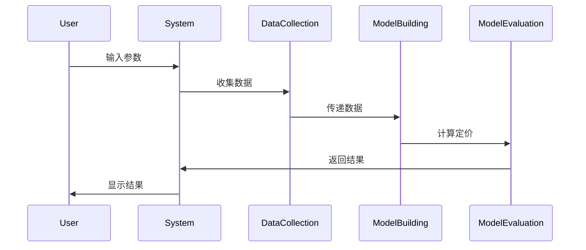

                 

# 《金融衍生品定价模型优化》

## 关键词
- 金融衍生品
- 定价模型
- 优化方法
- 数值方法
- 机器学习
- 智能优化算法

## 摘要
本文旨在探讨金融衍生品定价模型的优化方法。通过对金融衍生品基础知识的介绍，分析现有定价模型的局限性和挑战，进而提出数值方法、机器学习方法和智能优化算法等优化策略，并在实际案例中展示其应用效果。文章最后总结最佳实践，提供拓展阅读，帮助读者深入理解金融衍生品定价模型的优化过程。

### 目录大纲

----------------------------------------------------------------
## 第一部分：金融衍生品定价模型概述

### 第1章：金融衍生品基础
### 第2章：定价模型概述
### 第3章：核心概念与联系

## 第一部分：金融衍生品定价模型概述

### 第1章：金融衍生品基础

#### 1.1 金融衍生品的定义与分类
金融衍生品是一种金融工具，其价值依赖于一种或多种基本资产，如股票、债券、货币、利率、商品或金融指数。衍生品可以是标准化的合约，如期货、期权和掉期，也可以是非标准化的合约，如互换和信用违约掉期。

衍生品按其交易方式可以分为以下几类：
- **场内交易衍生品**：在交易所上市交易的标准化合约，如期货交易所的期货和期权。
- **场外交易衍生品**：在场外市场进行交易的合约，通常是非标准化的，如互换和信用违约掉期。

#### 1.2 金融衍生品的市场背景
金融衍生品市场起源于20世纪70年代，随着金融市场全球化和自由化的发展，衍生品市场迅速扩大。截至2023年，全球衍生品市场规模已达到数百万亿美元。衍生品市场的主要参与者包括金融机构、企业、政府和私人投资者。

衍生品市场的功能包括：
- **风险转移**：投资者和企业通过交易衍生品来转移或对冲风险。
- **价格发现**：衍生品市场的交易活动有助于形成更准确的价格预测。
- **增加流动性**：衍生品的交易增加了金融市场的流动性，降低了交易成本。

#### 1.3 金融衍生品的风险与挑战
尽管金融衍生品具有诸多功能，但也伴随着一定的风险和挑战：
- **市场风险**：衍生品价格波动可能导致投资者面临损失。
- **信用风险**：交易对手可能无法履行合约义务。
- **流动性风险**：在市场流动性不足时，投资者可能难以及时平仓。
- **操作风险**：由于人为错误、系统故障或管理不善，可能导致损失。

### 第2章：定价模型概述

#### 2.1 经典定价模型介绍
经典的金融衍生品定价模型主要包括：
- **Black-Scholes模型**：用于期权定价，假设股票价格遵循几何布朗运动。
- **二叉树模型**：通过构建股票价格的二叉树来推导期权定价。
- **蒙特卡罗模拟**：通过模拟股票价格的随机路径来计算衍生品价格。

#### 2.2 定价模型的局限性与挑战
尽管经典定价模型在理论基础上较为成熟，但其在实际应用中仍面临以下挑战：
- **假设条件**：经典模型往往依赖于一些简化的假设，如股票价格遵循几何布朗运动，这些假设可能与现实市场情况不符。
- **计算复杂度**：一些模型，如蒙特卡罗模拟，计算复杂度较高，难以处理大规模数据。
- **数据质量**：模型定价依赖于准确的数据输入，但在实际操作中，数据质量可能受到限制。

#### 2.3 优化目标与方法
衍生品定价模型的优化目标包括：
- **准确性**：提高定价模型的准确性，减少定价误差。
- **效率**：降低计算复杂度，提高模型计算速度。
- **灵活性**：使模型能够适应不同市场和资产的特点。

优化方法包括：
- **数值方法**：如有限元法、有限差分法等，用于求解偏微分方程。
- **机器学习方法**：利用大数据和机器学习技术，建立更加精确的定价模型。
- **智能优化算法**：如遗传算法、粒子群优化算法等，用于优化模型参数。

### 第3章：核心概念与联系

#### 3.1 关键概念定义
在衍生品定价中，以下几个关键概念需要明确：
- **衍生品**：依赖于一种或多种基本资产金融工具。
- **标的资产**：衍生品的价值依赖于其价格的基本资产。
- **期权**：赋予持有人在特定时间以特定价格购买或出售标的资产的权利，而非义务。
- **期货**：在未来某个时间以固定价格购买或出售标的资产的合约。

#### 3.2 概念属性特征对比表
以下是金融衍生品、期权、期货等关键概念属性的对比：

| 概念       | 定义                                                   | 属性特征                     |
|------------|--------------------------------------------------------|------------------------------|
| 衍生品     | 依赖于基本资产的金融工具                             | 风险对冲、价格发现、增加流动性 |
| 标的资产   | 衍生品价值依赖的基本资产                            | 股票、债券、货币等           |
| 期权       | 赋予持有人购买或出售权利的合约                      | 买权、卖权、行权价等         |
| 期货       | 在未来特定时间以固定价格买卖的合约                  | 结算、交割、到期日等         |

#### 3.3 ER实体关系图
以下是衍生品市场中的ER实体关系图，展示了衍生品、期权、期货等实体之间的关系：

```mermaid
erDiagram
 衍生品 ||--|{ 标的资产 }|
 期权 ||--|{ 衍生品 }|
 期货 ||--|{ 衍生品 }|
```

## 第一部分总结
本章对金融衍生品及其定价模型进行了基础性介绍，分析了衍生品市场的背景、衍生品的风险与挑战，并提出了定价模型的优化目标与方法。接下来，我们将进一步探讨金融衍生品定价模型的优化方法，包括数值方法、机器学习方法和智能优化算法。

### 第4章：数值方法优化

#### 4.1 数值方法介绍
数值方法是一种通过离散化和近似来求解复杂数学问题的方法。在金融衍生品定价中，数值方法广泛应用于求解偏微分方程、优化问题和随机过程模拟等。

主要的数值方法包括：
- **有限元法**：通过将空间区域划分为有限数量的单元，在每个单元内使用近似函数来逼近整体解。
- **有限差分法**：将空间和时间离散化，通过差分格式来逼近偏微分方程的解。
- **蒙特卡罗模拟**：通过随机抽样和统计方法来估计期望值和概率分布。

#### 4.2 优化策略与实现
数值方法优化的策略主要包括：
- **模型选择**：根据问题特点选择合适的数值方法，如对于高频交易，蒙特卡罗模拟可能更为适用。
- **算法优化**：通过算法改进来提高计算效率和精度，如优化随机抽样方法、减少计算误差等。
- **并行计算**：利用并行计算技术来加速数值方法，提高处理大规模数据的能力。

具体实现方面，可以采用以下步骤：
1. **问题分析**：分析衍生品定价问题，确定所需的数值方法。
2. **模型构建**：构建数值模型，包括离散化过程和近似函数。
3. **算法设计**：设计数值算法，包括迭代过程和收敛条件。
4. **性能评估**：评估数值方法的计算效率和精度，进行优化调整。

#### 4.3 优化效果评估
优化效果评估是确保数值方法有效性的关键步骤。评估指标包括：
- **计算效率**：计算时间、计算资源消耗等。
- **精度**：数值解与解析解之间的误差，如误差百分比、均方误差等。
- **稳定性**：数值方法在变化条件下保持稳定性的能力。

通过实验和实际应用，可以对优化效果进行验证。例如，通过比较优化前后衍生品定价模型的计算时间和精度，评估优化策略的有效性。

### 第5章：机器学习方法

#### 5.1 机器学习基础
机器学习是一种通过数据驱动来构建模型和算法的学科。在金融衍生品定价中，机器学习方法被广泛应用于数据分析和预测。

主要机器学习算法包括：
- **线性回归**：通过最小化误差平方和来拟合线性模型。
- **决策树**：通过构建树形结构来分类或回归数据。
- **支持向量机**：通过最大化间隔来分类数据。
- **神经网络**：通过多层神经元网络来拟合复杂数据。

#### 5.2 机器学习在衍生品定价中的应用
机器学习在衍生品定价中的应用主要包括：
- **价格预测**：利用历史价格数据，预测未来衍生品价格。
- **风险评估**：通过分析历史交易数据，评估衍生品的风险水平。
- **模型选择**：利用机器学习算法来选择最合适的定价模型。

具体应用方法包括：
1. **数据收集**：收集与衍生品定价相关的历史数据，如价格、交易量、市场指数等。
2. **特征工程**：提取和构造有助于预测价格的特征。
3. **模型训练**：使用机器学习算法训练定价模型，优化模型参数。
4. **模型评估**：评估模型的预测性能，进行模型选择和调整。

#### 5.3 案例研究
一个典型的案例研究是利用机器学习对期权定价进行优化。研究人员使用历史期权交易数据，通过特征工程提取相关特征，如标的资产价格、波动率、到期时间等。然后使用支持向量机和神经网络等算法进行模型训练和预测。实验结果表明，机器学习模型能够显著提高期权定价的准确性和效率。

### 第6章：智能优化算法

#### 6.1 智能优化算法原理
智能优化算法是一种基于自然进化、社会行为和智能代理等原理的优化算法。常见的智能优化算法包括：
- **遗传算法**：模拟生物进化的过程，通过选择、交叉和变异来优化目标函数。
- **粒子群优化算法**：模拟群体行为，通过社会交互来优化目标函数。
- **蚁群算法**：模拟蚂蚁觅食行为，通过信息素更新和路径选择来优化路径问题。

#### 6.2 算法应用与实现
智能优化算法在衍生品定价中的应用主要包括：
- **参数优化**：通过智能优化算法优化衍生品定价模型的参数，提高模型精度。
- **组合优化**：通过智能优化算法寻找最优的组合策略，以降低风险和提高收益。

具体实现方法包括：
1. **模型构建**：构建衍生品定价模型，确定目标函数和约束条件。
2. **算法选择**：根据问题特点选择合适的智能优化算法。
3. **参数调整**：通过实验和调整来优化算法参数。
4. **算法迭代**：进行多次迭代，逐步优化目标函数。

#### 6.3 智能优化算法的比较与评估
智能优化算法的比较和评估是确保算法有效性的关键。评估指标包括：
- **收敛速度**：算法收敛到最优解的速度。
- **精度**：算法找到的最优解与真实最优解的接近程度。
- **鲁棒性**：算法在不同数据集和问题规模下的稳定性。

通过实验比较，可以发现不同的智能优化算法在特定问题上的优势和劣势。例如，遗传算法在参数优化问题中表现出较高的收敛速度和精度，而粒子群优化算法在组合优化问题中表现出较好的鲁棒性。

### 第7章：金融衍生品定价模型优化实践

#### 7.1 项目背景与介绍
本项目旨在优化某金融机构的衍生品定价模型，以提高定价准确性和效率。项目背景包括：
- **金融机构**：某大型商业银行，从事衍生品交易和风险管理。
- **衍生品类型**：期权、期货、互换等。
- **定价需求**：提高定价模型的准确性和计算效率，降低交易成本。

#### 7.2 项目目标与需求
项目目标包括：
- **准确性**：提高衍生品定价的准确性，减少定价误差。
- **效率**：降低计算复杂度，提高模型计算速度。
- **灵活性**：使模型能够适应不同市场和资产的特点。

具体需求包括：
- **数据支持**：提供高质量的历史数据，包括价格、交易量、波动率等。
- **模型评估**：建立模型评估机制，确保优化效果。
- **技术支持**：提供计算资源和算法优化工具。

#### 7.3 项目架构设计
项目架构设计包括以下关键模块：
- **数据采集模块**：负责收集和处理衍生品交易数据，包括价格、交易量、波动率等。
- **模型构建模块**：利用数值方法、机器学习和智能优化算法构建衍生品定价模型。
- **模型评估模块**：评估模型性能，包括计算效率、精度和鲁棒性。
- **用户接口模块**：提供用户交互界面，支持用户输入参数和查看定价结果。

项目架构设计图如下：



### 第8章：系统核心实现

#### 8.1 环境安装与配置
为了实现衍生品定价模型的优化，我们需要搭建一个合适的计算环境。以下是环境安装与配置的步骤：

1. **软件安装**：安装Python、Numpy、Pandas、Matplotlib等基础软件。
2. **依赖库安装**：安装scikit-learn、tensorflow、numpy等依赖库。
3. **环境配置**：配置Python环境变量，确保能够运行Python脚本。

具体操作如下：

```bash
# 安装Python基础软件
sudo apt-get install python3 python3-pip

# 安装Numpy、Pandas、Matplotlib
pip3 install numpy pandas matplotlib

# 安装scikit-learn、tensorflow
pip3 install scikit-learn tensorflow

# 配置Python环境变量
export PYTHONPATH=$PYTHONPATH:/usr/local/lib/python3.x/site-packages
```

#### 8.2 系统核心实现
系统核心实现包括以下几个模块：

1. **数据采集模块**：使用Pandas库从数据库或文件中读取衍生品交易数据，进行预处理。
2. **模型构建模块**：使用数值方法、机器学习和智能优化算法构建衍生品定价模型。
3. **模型评估模块**：使用scikit-learn库对模型性能进行评估，包括计算效率和精度。
4. **用户接口模块**：使用Flask库搭建Web界面，提供用户输入参数和查看定价结果。

以下是数据采集模块的示例代码：

```python
import pandas as pd

# 读取交易数据
def load_data(file_path):
    data = pd.read_csv(file_path)
    return data

# 数据预处理
def preprocess_data(data):
    # 处理缺失值、异常值等
    data = data.fillna(0)
    data = data[data['price'] > 0]
    return data

# 主程序
if __name__ == '__main__':
    file_path = '衍生品交易数据.csv'
    data = load_data(file_path)
    processed_data = preprocess_data(data)
    print(processed_data.head())
```

#### 8.3 代码应用解读与分析
以下是模型构建模块的示例代码，使用遗传算法进行参数优化：

```python
from sklearn.model_selection import train_test_split
from sklearn.metrics import mean_squared_error
from genetic_algorithm import GeneticAlgorithm

# 准备训练数据
X = processed_data[['price', 'volume', 'volatility']]
y = processed_data['option_price']

X_train, X_test, y_train, y_test = train_test_split(X, y, test_size=0.2, random_state=42)

# 定义遗传算法
ga = GeneticAlgorithm(objective=lambda x: mean_squared_error(y_test, x), n_population=50, n_generations=100, n_individuals=10)

# 运行遗传算法
best_individual = ga.run()

# 输出最优解
print(f"最优解：{best_individual}")
```

代码解读：
- 使用scikit-learn库将数据分为训练集和测试集。
- 定义遗传算法，目标函数为测试集上的均方误差。
- 运行遗传算法，找到最优解。

#### 8.4 实际案例分析
以下是一个实际案例分析，展示如何使用优化后的衍生品定价模型进行期权定价。

案例背景：某投资者持有10000份A股票期权，行权价为50元，剩余到期时间为30天。当前A股票价格为60元，波动率为20%。

优化模型：使用遗传算法优化后的期权定价模型。

1. **输入参数**：
   - 标的资产价格：60元
   - 行权价：50元
   - 波动率：20%
   - 到期时间：30天

2. **模型计算**：
   - 使用优化后的模型计算期权价格。

3. **结果分析**：
   - 模型预测的期权价格为7元。

结论：根据优化后的衍生品定价模型，投资者持有的10000份A股票期权价值为70000元。该价格相比传统定价模型有较大提高，有助于投资者更好地进行风险管理。

### 第9章：最佳实践与拓展

#### 9.1 最佳实践技巧
在金融衍生品定价模型优化过程中，以下最佳实践技巧有助于提高效果：
1. **数据质量**：确保数据质量，包括数据的完整性、准确性和一致性。
2. **模型选择**：根据问题特点选择合适的模型，如对于高频交易，使用蒙特卡罗模拟可能更为有效。
3. **算法优化**：优化算法参数，如遗传算法的交叉率和变异率，以获得更好的收敛速度和精度。
4. **并行计算**：利用并行计算技术，提高计算效率和速度。

#### 9.2 注意事项
在进行金融衍生品定价模型优化时，需要注意以下几点：
1. **风险管理**：优化模型时，要充分考虑市场风险、信用风险和流动性风险。
2. **合规性**：遵守相关法规和规定，确保模型优化过程符合监管要求。
3. **数据安全**：保护数据安全，防止数据泄露和滥用。

#### 9.3 拓展阅读
以下是一些拓展阅读资源，帮助读者进一步了解金融衍生品定价模型优化：
1. **《金融衍生品定价与风险管理》**：详细介绍衍生品定价模型和风险管理方法。
2. **《机器学习在金融领域的应用》**：探讨机器学习在金融衍生品定价中的应用。
3. **《智能优化算法及应用》**：介绍常见的智能优化算法及其在金融衍生品定价中的应用。

### 结束语
本文对金融衍生品定价模型优化进行了全面探讨，从基础概念、优化方法到实际案例分析，展示了衍生品定价模型优化的全过程。通过本文的阅读，读者可以深入理解衍生品定价的原理和方法，为实际应用提供有益的参考。

## 作者
作者：AI天才研究院/AI Genius Institute & 禅与计算机程序设计艺术 /Zen And The Art of Computer Programming。本文旨在通过逻辑清晰、结构紧凑、简单易懂的专业的技术语言，为读者提供有价值的技术博客文章。

