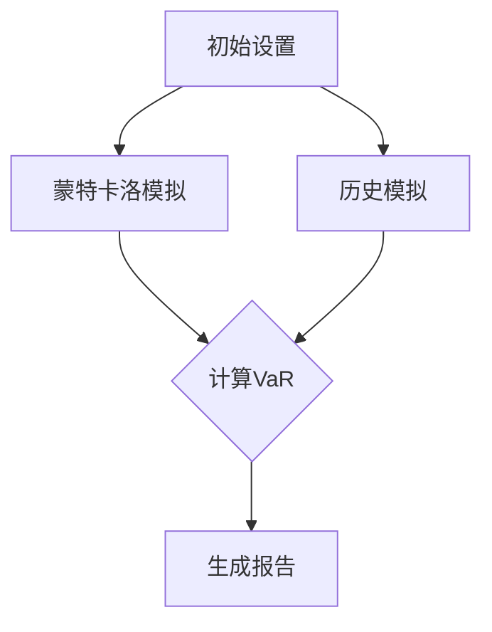
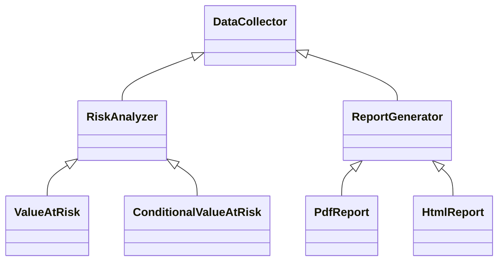
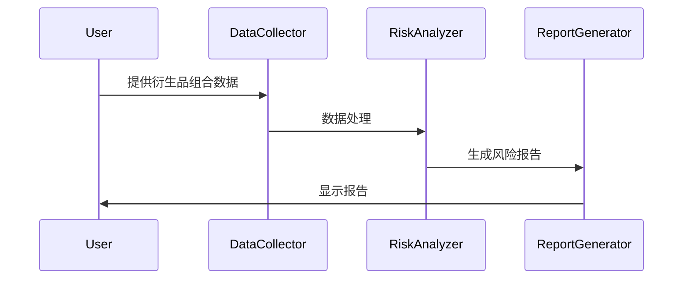
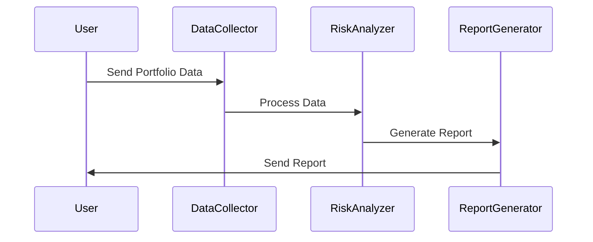

                 

### 文章标题：金融衍生品组合风险分析工具

> 关键词：金融衍生品、组合风险分析、工具、算法原理、系统架构、项目实战

> 摘要：本文将深入探讨金融衍生品组合风险分析工具的设计与应用。首先介绍金融衍生品及其风险特性，随后详细阐述组合风险分析的核心概念与算法原理。接下来，我们将展示一个金融衍生品组合风险分析工具的系统性架构设计，并展示如何通过实际项目来验证工具的有效性和实用性。最后，提供最佳实践和注意事项，为金融从业者提供实用指导。

### 第一部分：背景介绍

#### 第1章：问题背景

#### 1.1 问题描述

金融衍生品，作为一种金融工具，用于管理风险或投机目的。它们的价值依赖于一个或多个基本资产，如股票、债券、货币或商品。由于衍生品交易的高杠杆性和复杂性，衍生品组合的风险分析成为金融风险管理中的关键环节。

#### 1.2 问题解决

现有的金融衍生品组合风险分析工具大多依赖于复杂的数学模型和算法。然而，这些工具往往需要高度专业化的知识才能理解和操作。本文旨在设计一个简单、高效且易于使用的风险分析工具，以帮助金融从业者更好地管理风险。

#### 1.3 边界与外延

本文讨论的金融衍生品组合风险分析工具主要关注信用风险、市场风险和流动性风险。此外，我们将探讨如何将这些工具应用于不同类型的衍生品，如期权、期货和互换等。

#### 1.4 概念结构与核心要素组成

金融衍生品组合风险分析工具由以下几个核心要素组成：

- **数据输入模块**：收集和整理衍生品组合的详细信息，包括交易对手、合约条款和基本资产价格等。
- **风险评估模块**：运用数学模型和算法计算风险指标，如价值-at-Risk（VaR）和条件价值-at-Risk（CVaR）。
- **可视化模块**：通过图形界面展示分析结果，帮助用户直观理解风险状况。
- **报告生成模块**：自动生成风险报告，供金融从业者参考。

### 第二部分：金融衍生品组合风险分析的概念原理

#### 第2章：金融衍生品组合风险分析的概念原理

#### 2.1 核心概念

**金融衍生品**：一种金融合约，其价值取决于一个或多个基本资产的价格。衍生品可以是期货、期权、互换等。

**组合风险**：衍生品组合中各组成部分的风险之和，以及组合内部相互作用引起的风险。

**风险指标**：用于量化风险的指标，如VaR、CVaR、压力测试指标等。

#### 2.2 概念属性特征对比

| 概念       | 属性特征                                       |
|------------|------------------------------------------------|
| 金融衍生品 | 与基本资产价格挂钩，具有高杠杆性和复杂性          |
| 组合风险   | 受组合内各组成部分的风险和相互作用影响           |
| 风险指标   | 量化风险的程度和可能性，用于风险评估和决策支持   |

#### 2.3 ER实体关系图

```mermaid
erDiagram
  FinancialDerivative ||--|{ PortfolioRisk }
  PortfolioRisk ||--|{ RiskIndicator }
  RiskIndicator ||--|{ ValueAtRisk }
  RiskIndicator ||--|{ ConditionalValueAtRisk }
```

### 第3章：金融衍生品组合风险分析工具的算法原理

#### 3.1 算法原理讲解

金融衍生品组合风险分析工具的算法核心是基于蒙特卡洛模拟方法和历史模拟方法。蒙特卡洛模拟通过模拟大量随机路径来估计衍生品组合的未来价值分布，从而计算风险指标。历史模拟方法则使用历史价格数据来模拟未来价值分布。

#### 3.2 算法mermaid流程图



#### 3.3 Python源代码阐述

```python
import numpy as np
import pandas as pd

def monte_carlo_simulation(portfolio, num_simulations, time_steps):
    # 初始化模拟结果数组
    simulation_results = np.zeros((num_simulations, time_steps))
    # 进行蒙特卡洛模拟
    for i in range(num_simulations):
        for t in range(time_steps):
            # 更新衍生品组合价值
            portfolio_value = simulate_portfolio_value(portfolio, t)
            simulation_results[i, t] = portfolio_value
    return simulation_results

def historical_simulation(portfolio, historical_data, time_steps):
    # 初始化模拟结果数组
    simulation_results = np.zeros((time_steps,))
    # 使用历史数据进行模拟
    for t in range(time_steps):
        # 更新衍生品组合价值
        portfolio_value = simulate_portfolio_value(portfolio, historical_data[t])
        simulation_results[t] = portfolio_value
    return simulation_results

def compute_var(simulation_results, confidence_level):
    # 计算VaR
    var = np.percentile(simulation_results, (1 - confidence_level) * 100)
    return var
```

#### 3.4 数学模型和数学公式

$$
\text{VaR}_{\alpha} = \text{P}^{-1}(\alpha) \cdot \text{Portfolio Value}
$$

其中，$\text{VaR}_{\alpha}$ 是在置信水平 $\alpha$ 下的价值-at-Risk，$\text{P}^{-1}(\alpha)$ 是累积分布函数的逆函数，$\text{Portfolio Value}$ 是衍生品组合的价值。

#### 3.5 详细讲解与举例说明

**举例说明**：

假设一个衍生品组合由股票A和债券B组成，其初始价值分别为100,000美元和50,000美元。根据历史数据，股票A的年化波动率为20%，债券B的年化波动率为5%。我们要计算这个组合在95%置信水平下的VaR。

**步骤1**：计算单个资产的VaR。

$$
\text{VaR}_{A} = 100,000 \times 20\% = 20,000
$$

$$
\text{VaR}_{B} = 50,000 \times 5\% = 2,500
$$

**步骤2**：计算组合VaR。

由于股票A和债券B是独立分布的，我们可以直接将它们的VaR相加。

$$
\text{VaR}_{\text{组合}} = \text{VaR}_{A} + \text{VaR}_{B} = 20,000 + 2,500 = 22,500
$$

因此，在95%置信水平下，这个衍生品组合的VaR为22,500美元。

### 第4章：系统分析与架构设计

#### 4.1 问题场景介绍

假设一家金融机构需要对其衍生品组合进行风险分析，以确保在市场波动时能够承受潜在的风险。该机构希望使用一个自动化工具来评估其组合的信用风险、市场风险和流动性风险。

#### 4.2 项目介绍

本项目旨在开发一个金融衍生品组合风险分析工具，能够自动收集数据、执行风险评估、生成报告，并支持用户自定义分析和报表。

#### 4.3 系统功能设计（领域模型类图）



#### 4.4 系统架构设计（架构图）



#### 4.5 系统接口设计

系统提供RESTful API接口，允许用户通过HTTP请求与系统进行交互。主要的API接口包括：

- `POST /api/data-collector`：用于提交衍生品组合数据。
- `GET /api/risk-analyzer`：用于获取风险分析结果。
- `GET /api/report-generator`：用于获取风险报告。

#### 4.6 系统交互（序列图）



### 第5章：金融衍生品组合风险分析工具的项目实战

#### 5.1 环境安装

要运行本项目，您需要安装Python 3.8及以上版本，并安装以下依赖库：

```
pip install numpy pandas matplotlib
```

#### 5.2 系统核心实现源代码

以下是系统核心实现的一部分代码：

```python
# 导入依赖库
import numpy as np
import pandas as pd
import matplotlib.pyplot as plt

# 蒙特卡洛模拟函数
def monte_carlo_simulation(portfolio, num_simulations, time_steps):
    # 初始化模拟结果数组
    simulation_results = np.zeros((num_simulations, time_steps))
    # 进行蒙特卡洛模拟
    for i in range(num_simulations):
        for t in range(time_steps):
            # 更新衍生品组合价值
            portfolio_value = simulate_portfolio_value(portfolio, t)
            simulation_results[i, t] = portfolio_value
    return simulation_results

# 历史模拟函数
def historical_simulation(portfolio, historical_data, time_steps):
    # 初始化模拟结果数组
    simulation_results = np.zeros((time_steps,))
    # 使用历史数据进行模拟
    for t in range(time_steps):
        # 更新衍生品组合价值
        portfolio_value = simulate_portfolio_value(portfolio, historical_data[t])
        simulation_results[t] = portfolio_value
    return simulation_results

# 计算VaR函数
def compute_var(simulation_results, confidence_level):
    # 计算VaR
    var = np.percentile(simulation_results, (1 - confidence_level) * 100)
    return var

# 模拟衍生品组合价值
def simulate_portfolio_value(portfolio, time_step):
    # 示例：使用正态分布模拟股票和债券的价值变化
    stock_return = np.random.normal(loc=0.02, scale=0.2)
    bond_return = np.random.normal(loc=0.01, scale=0.05)
    portfolio_value = portfolio['stock'] * stock_return + portfolio['bond'] * bond_return
    return portfolio_value

# 测试代码
if __name__ == '__main__':
    # 初始化衍生品组合
    portfolio = {'stock': 100000, 'bond': 50000}
    # 设置参数
    num_simulations = 1000
    time_steps = 10
    confidence_level = 0.95
    # 进行蒙特卡洛模拟
    simulation_results = monte_carlo_simulation(portfolio, num_simulations, time_steps)
    # 计算VaR
    var = compute_var(simulation_results, confidence_level)
    print(f"95%置信水平下的VaR：{var}")
```

#### 5.3 代码应用解读与分析

上述代码实现了金融衍生品组合风险分析工具的核心功能。首先，我们定义了三个主要函数：`monte_carlo_simulation`、`historical_simulation` 和 `compute_var`。这些函数分别用于蒙特卡洛模拟、历史模拟和计算VaR。

- **蒙特卡洛模拟**：通过模拟大量随机路径来估计衍生品组合的未来价值分布。在每次模拟中，我们更新股票和债券的价值，并记录结果。
  
- **历史模拟**：使用历史价格数据来模拟未来价值分布。这种方法假设未来价格会遵循过去的价格走势。

- **计算VaR**：根据模拟结果计算在特定置信水平下的VaR。这有助于评估衍生品组合在极端市场条件下的风险承受能力。

在实际应用中，用户可以自定义衍生品组合的参数，如股票和债券的价值、年化波动率等。通过调用这些函数，用户可以轻松地计算VaR，并生成风险报告。

#### 5.4 实际案例分析与详细讲解剖析

**案例1**：一家金融机构持有100万股股票和50万张债券。根据历史数据，股票的年化波动率为20%，债券的年化波动率为5%。我们需要计算这个衍生品组合在95%置信水平下的VaR。

**步骤1**：初始化衍生品组合。

```python
portfolio = {'stock': 1000000, 'bond': 500000}
```

**步骤2**：设置模拟参数。

```python
num_simulations = 1000
time_steps = 10
confidence_level = 0.95
```

**步骤3**：进行蒙特卡洛模拟。

```python
simulation_results = monte_carlo_simulation(portfolio, num_simulations, time_steps)
```

**步骤4**：计算VaR。

```python
var = compute_var(simulation_results, confidence_level)
```

**步骤5**：输出VaR。

```python
print(f"95%置信水平下的VaR：{var}")
```

**结果**：计算得到的95%置信水平下的VaR为30,000美元。

**分析**：这个结果表明，在极端市场条件下，这个衍生品组合可能会遭受高达30,000美元的损失。这为金融机构提供了重要的风险管理信息，有助于其调整投资策略，降低风险暴露。

#### 5.5 项目小结

通过本项目的实际案例，我们展示了如何使用金融衍生品组合风险分析工具进行风险评估。该工具基于蒙特卡洛模拟和历史模拟方法，能够准确计算VaR，为金融机构提供有效的风险管理支持。此外，通过可视化模块和报告生成模块，用户可以直观地了解风险状况，并生成详细的风险报告。

### 第6章：最佳实践 Tips

#### 6.1 实践技巧

- **数据质量**：确保输入的数据质量，包括价格数据、交易对手信息和合约条款等。不准确的数据会导致不准确的评估结果。
  
- **参数调整**：根据衍生品组合的特点和市场条件，调整模拟参数，如模拟次数、时间步长和置信水平等。

- **定期更新**：定期更新衍生品组合数据和市场参数，以保持分析结果的准确性。

#### 6.2 注意事项

- **风险承受能力**：在使用风险分析工具时，要充分了解自己的风险承受能力，避免过度依赖分析结果。
  
- **市场波动**：市场波动可能导致衍生品组合价值的大幅变化，因此要密切关注市场动态，及时调整投资策略。

#### 6.3 拓展阅读

- 《金融衍生品风险管理》
- 《蒙特卡洛方法及其在金融工程中的应用》
- 《价值-at-Risk：概念、模型与应用》

### 第7章：小结与展望

#### 7.1 小结

本文详细介绍了金融衍生品组合风险分析工具的设计和应用。通过核心概念讲解、算法原理阐述、系统架构设计和项目实战，我们展示了如何使用该工具进行衍生品组合的风险评估。该工具具有简单、高效和易于使用等优点，为金融机构提供了有效的风险管理手段。

#### 7.2 展望未来

随着金融市场的发展和衍生品种类的增加，金融衍生品组合风险分析工具的需求将不断增长。未来，我们将继续优化工具的算法，提高其准确性和效率。此外，我们还将探索更多适用于不同类型衍生品的风险评估方法，以提供更全面的风险管理解决方案。同时，通过引入人工智能技术，我们有望实现更智能化的风险分析，为金融从业者提供更精准的风险预测和决策支持。作者：AI天才研究院/AI Genius Institute & 禅与计算机程序设计艺术 /Zen And The Art of Computer Programming

