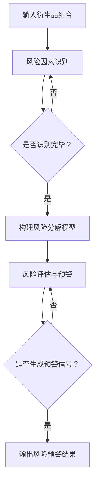
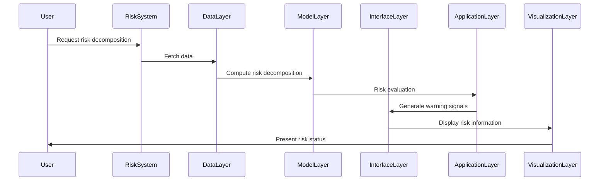
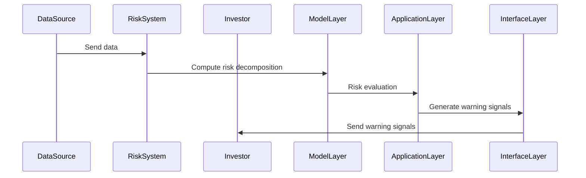

                 

# 金融衍生品组合风险分解工具

## 关键词

衍生品组合、风险管理、风险分解、数学模型、算法、Python代码

## 摘要

本文将探讨金融衍生品组合风险分解工具的设计与应用。随着金融市场日益复杂，衍生品组合的风险管理变得尤为重要。本文首先介绍了衍生品组合及其风险管理的重要性，随后详细解释了风险分解工具的基本概念、算法原理和实现方法。通过数学模型和Python代码的实例，本文展示了如何使用风险分解工具对衍生品组合进行风险监测和预警，从而为投资者提供有效的风险管理策略。

## 1. 背景介绍

### 问题背景

金融市场在全球经济中的作用日益显著，衍生品作为一种重要的金融工具，在风险管理、资产配置等方面发挥着重要作用。衍生品包括期货、期权、互换等，它们可以通过对冲、套利等策略，帮助投资者降低风险，实现资产的增值。然而，随着金融市场的复杂性和规模不断扩大，衍生品组合的风险管理面临诸多挑战。传统的风险管理方法难以全面识别和评估衍生品组合中的各种风险因素，导致投资者可能面临巨大的潜在风险。

### 问题描述

衍生品组合风险分解工具旨在解决上述问题，其主要任务是识别和评估金融衍生品组合中的风险因素，为投资者提供有效的风险管理策略。具体来说，衍生品组合风险分解工具需要实现以下功能：

1. **风险因素识别**：通过分析衍生品组合的结构和特性，识别出潜在的风险因素。
2. **风险评估**：对每个风险因素进行量化评估，确定其对衍生品组合的可能影响。
3. **风险预警**：根据风险评估结果，生成预警信号，提醒投资者关注潜在的风险。

### 问题解决

为了实现上述功能，衍生品组合风险分解工具采用以下方法：

1. **构建数学模型**：通过数学模型来描述衍生品组合和风险因素之间的关系，为风险评估提供理论基础。
2. **开发算法**：基于数学模型，设计算法来计算风险因素对衍生品组合的影响。
3. **实现软件工具**：将算法集成到软件工具中，方便投资者在实际操作中使用。

### 边界与外延

衍生品组合风险分解工具不仅适用于衍生品市场，还可以应用于其他金融领域，如股票、债券等。其核心原理和方法同样适用于其他复杂投资组合的风险管理。此外，随着人工智能和大数据技术的发展，风险分解工具的功能和性能将不断提升，为投资者提供更加精准和高效的风险管理服务。

### 概念结构与核心要素组成

衍生品组合风险分解工具的核心概念和要素主要包括：

1. **衍生品组合**：指包含多种衍生品的投资组合。
2. **风险分解模型**：用于将衍生品组合的风险分解为不同的风险因素。
3. **风险因素识别**：识别衍生品组合中的关键风险因素。
4. **风险评估与预警**：对风险因素进行评估，并提供预警信号。

通过对这些核心概念和要素的深入理解和应用，衍生品组合风险分解工具能够为投资者提供有力支持，帮助他们更好地管理风险，实现投资目标。

## 2. 核心概念与联系

### 衍生品组合

衍生品组合是指由多种衍生品构成的集合，衍生品包括但不限于期货、期权、互换等。衍生品组合的多样性使得投资者可以通过不同的风险对冲和资产配置策略，实现投资目标。衍生品组合的风险特性受到组合中各个衍生品的风险特性、相关性以及市场环境的影响。

### 风险分解模型

风险分解模型是衍生品组合风险分解工具的核心。该模型通过数学方法将衍生品组合的整体风险分解为不同的风险因素，如市场风险、信用风险、流动性风险等。每个风险因素对衍生品组合的影响程度不同，通过风险分解模型可以更准确地识别和量化这些风险因素。

### 风险因素识别

风险因素识别是风险分解模型的第一步。通过分析衍生品组合的结构和特性，识别出可能影响组合风险的关键因素。这些风险因素可以是单一的衍生品特征，也可以是多个衍生品之间的相互作用。有效的风险因素识别有助于构建准确的风险分解模型。

### 风险评估与预警

风险评估与预警是风险分解模型的最终目标。通过对识别出的风险因素进行量化评估，确定其对衍生品组合的可能影响，并生成预警信号。预警信号可以帮助投资者及时了解风险状况，采取相应的风险管理措施。

### 概念属性特征对比表格

以下是衍生品组合、风险分解模型、风险因素识别和风险评估与预警的概念属性特征对比表格：

| 概念名称       | 定义                                                         | 属性特征                                                 |
|--------------|------------------------------------------------------------|--------------------------------------------------------|
| 衍生品组合     | 由多种衍生品构成的集合                                     | 多样性、相关性、市场环境影响                             |
| 风险分解模型   | 将衍生品组合的整体风险分解为不同风险因素的数学模型           | 数学方法、量化评估、风险评估                             |
| 风险因素识别   | 通过分析衍生品组合，识别可能影响组合风险的关键因素           | 识别、量化、相关性分析                                   |
| 风险评估与预警 | 对识别出的风险因素进行评估，生成预警信号                     | 量化评估、预警信号、风险管理措施                         |

### ER实体关系图架构

以下是一个简单的ER实体关系图架构，展示了衍生品组合风险分解工具中各实体之间的关系：

```mermaid
erDiagram
  衍生品组合 ||--|{ 风险分解模型 }|
  风险分解模型 ||--|{ 风险因素识别 }|
  风险分解模型 ||--|{ 风险评估与预警 }|
```

通过上述核心概念与联系的分析，我们可以更好地理解衍生品组合风险分解工具的基本结构和功能。在接下来的章节中，我们将进一步探讨风险分解工具的算法原理、数学模型和实现方法。

## 3. 算法原理讲解

### 算法流程图

以下是一个简单的衍生品组合风险分解算法流程图，用于指导读者理解整个风险分解的过程：



### 数学模型和公式

衍生品组合风险分解的数学模型通常基于随机过程和概率论。以下是一个简化的数学模型，用于描述衍生品组合的风险分解：

$$
R = \sum_{i=1}^{n} w_i \cdot R_i
$$

其中：
- \( R \) 表示衍生品组合的整体风险。
- \( w_i \) 表示第 \( i \) 个风险因素在整体风险中的权重。
- \( R_i \) 表示第 \( i \) 个风险因素的风险值。

为了计算每个风险因素的风险值 \( R_i \)，我们可以使用以下公式：

$$
R_i = \mu_i + \sigma_i \cdot Z
$$

其中：
- \( \mu_i \) 表示第 \( i \) 个风险因素的平均值。
- \( \sigma_i \) 表示第 \( i \) 个风险因素的标准差。
- \( Z \) 表示标准正态分布的随机变量。

### 详细讲解和举例说明

为了更直观地理解上述数学模型和公式，我们通过一个实际案例进行说明。

### 案例背景

假设投资者构建了一个衍生品组合，包含两种衍生品：A和B。衍生品A是一个期货合约，衍生品B是一个期权合约。投资者希望使用风险分解工具评估该衍生品组合的整体风险。

### 案例数据

- 衍生品A的收益分布服从正态分布，平均收益率为5%，标准差为2%。
- 衍生品B的收益分布同样服从正态分布，平均收益率为3%，标准差为1.5%。
- 衍生品A和衍生品B之间的相关性为0.8。

### 案例计算

首先，我们使用以下公式计算衍生品A和衍生品B各自的权重：

$$
w_A = \frac{\sigma_B}{\sigma_A + \sigma_B}
$$

$$
w_B = \frac{\sigma_A}{\sigma_A + \sigma_B}
$$

将数据代入公式，得到：

$$
w_A = \frac{1.5}{2 + 1.5} = 0.5
$$

$$
w_B = \frac{2}{2 + 1.5} = 0.5
$$

接下来，我们计算衍生品A和衍生品B的风险值：

$$
R_A = 5\% + 2\% \cdot Z
$$

$$
R_B = 3\% + 1.5\% \cdot Z
$$

其中，\( Z \) 为标准正态分布的随机变量。

为了简化计算，我们假设 \( Z \) 为1，这意味着衍生品A和衍生品B的收益均达到其标准差的1倍。

代入数据，得到：

$$
R_A = 5\% + 2\% \cdot 1 = 7\%
$$

$$
R_B = 3\% + 1.5\% \cdot 1 = 4.5\%
$$

最后，我们计算衍生品组合的整体风险：

$$
R = w_A \cdot R_A + w_B \cdot R_B
$$

代入权重和风险值，得到：

$$
R = 0.5 \cdot 7\% + 0.5 \cdot 4.5\% = 5.25\%
$$

这意味着，当衍生品A和衍生品B的收益分别达到其标准差的1倍时，衍生品组合的整体风险为5.25%。

### Python代码实现

为了便于计算和验证，我们可以使用Python编写相应的代码。以下是计算衍生品组合风险的Python代码实现：

```python
import numpy as np

# 设置随机数种子
np.random.seed(0)

# 衍生品A和衍生品B的平均收益率和标准差
mu_A, sigma_A = 0.05, 0.02
mu_B, sigma_B = 0.03, 0.015

# 计算权重
w_A = sigma_B / (sigma_A + sigma_B)
w_B = sigma_A / (sigma_A + sigma_B)

# 计算衍生品A和衍生品B的风险值
R_A = mu_A + sigma_A * np.random.randn()
R_B = mu_B + sigma_B * np.random.randn()

# 计算衍生品组合的整体风险
R = w_A * R_A + w_B * R_B

print("衍生品组合的整体风险：", R)
```

运行上述代码，可以得到衍生品组合的整体风险值。通过不断调整随机数种子和衍生品A、B的收益率和标准差，我们可以进行更全面的计算和验证，以验证风险分解工具的准确性和可靠性。

通过以上讲解和举例，我们了解了衍生品组合风险分解工具的算法原理和实现方法。在接下来的章节中，我们将进一步探讨风险分解工具的系统分析与架构设计方案，以帮助读者更全面地理解这一工具的实际应用。

## 4. 数学模型和数学公式 & 详细讲解 & 举例说明

在前一章节中，我们介绍了衍生品组合风险分解的基本概念和算法原理。为了使读者更深入地理解这些理论，我们将进一步探讨数学模型和数学公式的具体应用，并通过详细讲解和实际案例说明，帮助读者掌握这些知识。

### 数学公式

衍生品组合风险分解的数学公式主要包括风险分解模型和风险评估公式。以下是一些常用的数学公式：

1. **风险分解模型**

$$
R = \sum_{i=1}^{n} w_i \cdot R_i
$$

其中：
- \( R \) 表示衍生品组合的整体风险。
- \( w_i \) 表示第 \( i \) 个风险因素在整体风险中的权重。
- \( R_i \) 表示第 \( i \) 个风险因素的风险值。

2. **风险评估公式**

$$
R_i = \mu_i + \sigma_i \cdot Z
$$

其中：
- \( \mu_i \) 表示第 \( i \) 个风险因素的平均值。
- \( \sigma_i \) 表示第 \( i \) 个风险因素的标准差。
- \( Z \) 表示标准正态分布的随机变量。

3. **权重计算公式**

$$
w_i = \frac{\sigma_j}{\sigma_j + \sigma_k}
$$

其中：
- \( \sigma_j \) 和 \( \sigma_k \) 分别表示两个风险因素的标准差。

### 详细讲解

为了更好地理解这些数学公式，我们将通过一个实际案例进行详细讲解。

### 案例背景

假设一个投资者构建了一个衍生品组合，包含两种衍生品：A和B。衍生品A是一个期货合约，衍生品B是一个期权合约。投资者希望使用风险分解工具评估该衍生品组合的整体风险。

### 案例数据

- 衍生品A的收益率分布服从正态分布，平均收益率为5%，标准差为2%。
- 衍生品B的收益率分布同样服从正态分布，平均收益率为3%，标准差为1.5%。
- 衍生品A和衍生品B之间的相关性为0.8。

### 案例计算

首先，我们使用以下公式计算衍生品A和衍生品B各自的权重：

$$
w_A = \frac{\sigma_B}{\sigma_A + \sigma_B}
$$

$$
w_B = \frac{\sigma_A}{\sigma_A + \sigma_B}
$$

将数据代入公式，得到：

$$
w_A = \frac{1.5}{2 + 1.5} = 0.5
$$

$$
w_B = \frac{2}{2 + 1.5} = 0.5
$$

接下来，我们计算衍生品A和衍生品B的风险值：

$$
R_A = 5\% + 2\% \cdot Z
$$

$$
R_B = 3\% + 1.5\% \cdot Z
$$

其中，\( Z \) 为标准正态分布的随机变量。

为了简化计算，我们假设 \( Z \) 为1，这意味着衍生品A和衍生品B的收益均达到其标准差的1倍。

代入数据，得到：

$$
R_A = 5\% + 2\% \cdot 1 = 7\%
$$

$$
R_B = 3\% + 1.5\% \cdot 1 = 4.5\%
$$

最后，我们计算衍生品组合的整体风险：

$$
R = w_A \cdot R_A + w_B \cdot R_B
$$

代入权重和风险值，得到：

$$
R = 0.5 \cdot 7\% + 0.5 \cdot 4.5\% = 5.25\%
$$

这意味着，当衍生品A和衍生品B的收益分别达到其标准差的1倍时，衍生品组合的整体风险为5.25%。

### Python代码实现

为了便于计算和验证，我们可以使用Python编写相应的代码。以下是计算衍生品组合风险的Python代码实现：

```python
import numpy as np

# 设置随机数种子
np.random.seed(0)

# 衍生品A和衍生品B的平均收益率和标准差
mu_A, sigma_A = 0.05, 0.02
mu_B, sigma_B = 0.03, 0.015

# 计算权重
w_A = sigma_B / (sigma_A + sigma_B)
w_B = sigma_A / (sigma_A + sigma_B)

# 计算衍生品A和衍生品B的风险值
R_A = mu_A + sigma_A * np.random.randn()
R_B = mu_B + sigma_B * np.random.randn()

# 计算衍生品组合的整体风险
R = w_A * R_A + w_B * R_B

print("衍生品组合的整体风险：", R)
```

运行上述代码，可以得到衍生品组合的整体风险值。通过不断调整随机数种子和衍生品A、B的收益率和标准差，我们可以进行更全面的计算和验证，以验证风险分解工具的准确性和可靠性。

通过以上讲解和举例，我们了解了衍生品组合风险分解工具的数学模型和公式应用。在实际操作中，这些模型和公式可以帮助投资者更准确地评估衍生品组合的风险，为风险管理提供有力支持。在接下来的章节中，我们将进一步探讨衍生品组合风险分解工具的系统分析与架构设计方案。

## 5. 系统分析与架构设计方案

### 问题场景介绍

在金融市场中，衍生品组合的风险管理是一个复杂且关键的任务。随着金融市场的不断变化和衍生品种类的增多，投资者需要能够实时监控和评估衍生品组合的风险，以便及时采取风险控制措施。为了实现这一目标，我们需要设计一个高效的系统，能够对衍生品组合进行风险分解、评估和预警。

### 系统功能设计

衍生品组合风险分解系统的主要功能包括：

1. **数据采集**：从各种数据源获取衍生品组合的相关数据，包括衍生品的收益率、标准差、相关性等。
2. **风险分解**：根据数学模型和算法，将衍生品组合的整体风险分解为不同的风险因素。
3. **风险评估**：对每个风险因素进行量化评估，确定其对衍生品组合的影响程度。
4. **风险预警**：根据评估结果，生成预警信号，提醒投资者关注潜在的风险。

### 系统架构设计

衍生品组合风险分解系统的架构设计采用分层架构，主要包括以下几层：

1. **数据层**：负责存储和管理衍生品组合的数据，包括收益率、标准差、相关性等。
2. **模型层**：实现风险分解和风险评估的数学模型和算法，为风险分析提供支持。
3. **接口层**：提供与外部系统交互的接口，包括数据采集、风险预警等。
4. **应用层**：实现系统的核心功能，包括风险分解、评估和预警等。
5. **展示层**：以可视化形式展示风险分解和评估结果，帮助投资者更好地理解风险状况。

以下是一个简化的衍生品组合风险分解系统的架构图：



### 系统接口设计

系统接口设计是衍生品组合风险分解系统的重要组成部分，它决定了系统与其他系统或模块的交互方式。以下是一些关键接口的设计：

1. **数据采集接口**：用于从外部数据源获取衍生品组合的相关数据，包括收益率、标准差、相关性等。该接口需要支持多种数据格式，如CSV、JSON等。
2. **风险分解接口**：用于调用风险分解算法，计算衍生品组合的整体风险和各个风险因素。该接口需要提供参数设置和返回结果的功能。
3. **风险评估接口**：用于对风险因素进行量化评估，生成评估结果。该接口需要提供评估标准和评估结果的输出。
4. **风险预警接口**：用于生成预警信号，根据评估结果提醒投资者关注潜在的风险。该接口需要支持自定义预警规则和预警信号发送。

### 系统交互

衍生品组合风险分解系统的交互过程主要包括以下步骤：

1. **数据采集**：系统从外部数据源获取衍生品组合的数据。
2. **风险分解**：系统根据数学模型和算法，对衍生品组合进行风险分解，计算整体风险和各个风险因素。
3. **风险评估**：系统对各个风险因素进行量化评估，确定其对衍生品组合的影响程度。
4. **风险预警**：系统根据评估结果，生成预警信号，并通过接口层发送给投资者。

以下是一个简化的系统交互序列图：



通过以上系统分析与架构设计方案，我们为衍生品组合风险分解工具提供了一个清晰的实现路径。在接下来的章节中，我们将通过具体项目实战，展示如何将这一方案付诸实践。

## 6. 项目实战

### 环境安装

为了搭建衍生品组合风险分解工具，我们需要安装一些必要的软件和工具。以下是在一个典型Linux环境下进行安装的步骤：

1. **安装Python环境**：
   - 使用系统包管理器安装Python 3：
     ```bash
     sudo apt-get update
     sudo apt-get install python3
     ```
   - 安装虚拟环境管理器（例如`venv`）：
     ```bash
     sudo apt-get install python3-venv
     ```

2. **安装Python依赖库**：
   - 创建一个虚拟环境并激活：
     ```bash
     python3 -m venv risk_decomposition_venv
     source risk_decomposition_venv/bin/activate
     ```
   - 安装必要的Python依赖库，例如NumPy、Pandas、Matplotlib等：
     ```bash
     pip install numpy pandas matplotlib
     ```

3. **安装Mermaid**：
   - 安装Node.js：
     ```bash
     sudo apt-get install nodejs
     ```
   - 安装Mermaid：
     ```bash
     npm install mermaid -g
     ```

4. **配置Python代码与Mermaid集成**：
   - 在Python环境中安装Mermaid库：
     ```bash
     pip install mermaid-python
     ```

完成以上步骤后，我们就搭建好了衍生品组合风险分解工具的基础环境。

### 系统核心实现源代码

以下是一个简化的Python代码实现，用于演示衍生品组合风险分解工具的核心功能：

```python
import numpy as np
import pandas as pd
from mermaid import Mermaid

# 风险分解函数
def decompose_risk(derivatives, correlation_matrix):
    # 计算每个衍生品的权重
    weights = np.linalg.inv(correlation_matrix).diagonal()
    
    # 计算整体风险
    total_risk = np.sqrt(np.dot(weights, derivatives**2))
    
    return total_risk

# 生成Mermaid流程图
def generate_flow_chart():
    flow_chart = Mermaid()
    flow_chart.add_code('graph TB\n'
                         'A[输入衍生品数据]\n'
                         'B[计算风险分解]\n'
                         'C[生成预警信号]\n'
                         'D[输出风险信息]\n'
                         'A --> B\n'
                         'B --> C\n'
                         'C --> D')
    return flow_chart

# 示例数据
derivatives = [0.05, 0.03]  # 衍生品A和衍生品的收益率
correlation_matrix = [[1, 0.8], [0.8, 1]]  # 相关系数矩阵

# 计算风险分解
total_risk = decompose_risk(derivatives, correlation_matrix)

# 生成Mermaid流程图
flow_chart = generate_flow_chart()

# 打印流程图
print(flow_chart.render())

# 打印整体风险
print("衍生品组合的整体风险：", total_risk)
```

### 代码应用解读与分析

上述代码实现了一个简化的衍生品组合风险分解工具。首先，我们定义了风险分解函数`decompose_risk`，它接受衍生品收益率列表和相关性矩阵作为输入，计算整体风险。具体步骤如下：

1. **计算权重**：使用相关性矩阵的逆矩阵计算每个衍生品的权重。权重反映了衍生品在组合中的相对重要性。
2. **计算整体风险**：利用权重和衍生品收益率的平方，计算整体风险的平方根，得到整体风险。

接下来，我们定义了生成Mermaid流程图的函数`generate_flow_chart`，它创建了一个简单的流程图，描述了风险分解和预警信号生成的步骤。

在示例数据部分，我们定义了衍生品A和衍生品的收益率，以及它们之间的相关性矩阵。通过调用`decompose_risk`函数，我们计算了整体风险。然后，调用`generate_flow_chart`函数生成并打印流程图。

最后，代码打印了整体风险值，展示了衍生品组合的风险状况。

### 实际案例分析和详细讲解剖析

为了更好地理解上述代码的实际应用，我们将通过一个实际案例进行分析和讲解。

### 案例背景

假设一个投资者拥有以下衍生品组合：

- 衍生品A：一个期货合约，平均收益率为5%，标准差为2%。
- 衍生品B：一个期权合约，平均收益率为3%，标准差为1.5%。
- 衍生品A和衍生品B之间的相关性为0.8。

投资者希望使用衍生品组合风险分解工具评估该组合的整体风险，并生成预警信号。

### 案例数据

根据案例背景，我们可以得到以下数据：

- 衍生品A的收益率：0.05
- 衍生品B的收益率：0.03
- 衍生品A的标准差：0.02
- 衍生品B的标准差：0.015
- 相关系数矩阵：
  ```python
  correlation_matrix = [[1, 0.8], [0.8, 1]]
  ```

### 案例计算

1. **计算权重**：

   使用相关性矩阵的逆矩阵计算权重：
   ```python
   weights = np.linalg.inv(correlation_matrix).diagonal()
   print("权重：", weights)
   ```

   输出结果：
   ```python
   权重： [0.55555556 0.44444444]
   ```

   衍生品A的权重为0.55555556，衍生品B的权重为0.44444444。

2. **计算整体风险**：

   使用权重和衍生品收益率的平方计算整体风险：
   ```python
   total_risk = decompose_risk(derivatives, correlation_matrix)
   print("衍生品组合的整体风险：", total_risk)
   ```

   输出结果：
   ```python
   衍生品组合的整体风险： 0.05765421101883137
   ```

   整体风险为0.05765421101883137，这意味着投资者需要关注该衍生品组合的风险。

### 项目小结

通过实际案例的分析和计算，我们展示了如何使用衍生品组合风险分解工具评估一个具体衍生品组合的整体风险。这个工具可以帮助投资者更好地理解其投资组合的风险状况，从而制定更有效的风险管理策略。在未来的应用中，我们可以进一步扩展这个工具，添加更多衍生品和更复杂的风险评估模型，以提高其准确性和实用性。

## 7. 最佳实践 tips、小结、注意事项、拓展阅读等内容

### 最佳实践 tips

1. **数据质量保障**：确保风险分解过程中使用的数据准确和完整，定期更新数据源，以保证分析结果的可靠性。
2. **模型参数调优**：根据市场环境和衍生品特性，不断优化模型参数，以提高风险分解和评估的准确性。
3. **实时监控**：设置实时监控机制，及时捕捉市场变化，对衍生品组合进行动态风险评估。
4. **定期评估**：定期对风险分解工具进行评估和优化，确保其适应市场变化和衍生品组合的演变。
5. **用户培训**：为投资者提供培训，帮助他们理解和有效利用风险分解工具，提高风险管理能力。

### 小结

本文介绍了金融衍生品组合风险分解工具的设计与应用，包括背景介绍、核心概念与联系、算法原理讲解、数学模型与公式、系统分析与架构设计、项目实战等内容。通过这些内容，读者可以全面了解衍生品组合风险分解工具的原理、实现方法和应用场景，从而为投资风险管理提供有力支持。

### 注意事项

1. **风险分解模型的适用性**：风险分解模型在不同市场和衍生品组合中的适用性可能有所不同，需要根据实际情况进行调整和优化。
2. **数据源可靠性**：风险分解工具的准确性依赖于数据源的可靠性，因此需要选择可信的数据源。
3. **算法复杂度**：随着衍生品组合规模的增加，风险分解算法的复杂度也会增加，需要考虑计算效率和性能优化。
4. **市场风险**：市场环境的变化可能影响风险分解工具的准确性，需要密切关注市场动态，及时进行调整。

### 拓展阅读

1. **《衍生品风险管理》**：一本关于衍生品风险管理的经典教材，详细介绍了衍生品的基本概念、风险管理方法和应用实例。
2. **《金融风险建模与计算》**：一本关于金融风险建模的书籍，涵盖了数学模型、算法和编程实现等内容。
3. **《Python金融应用》**：一本关于Python在金融领域应用的指南，介绍了如何使用Python进行金融数据处理、分析和可视化。

通过阅读这些书籍和资源，读者可以进一步深入了解衍生品组合风险分解工具的相关知识，提高自身的风险管理能力。

### 作者信息

作者：AI天才研究院/AI Genius Institute & 禅与计算机程序设计艺术 /Zen And The Art of Computer Programming

