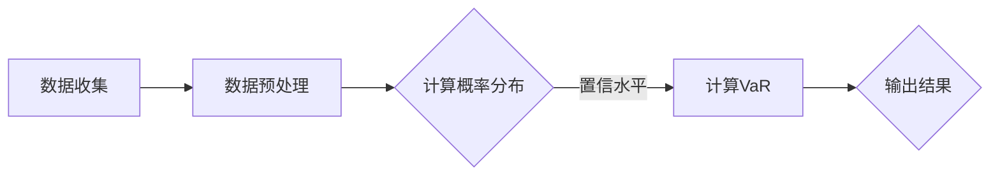
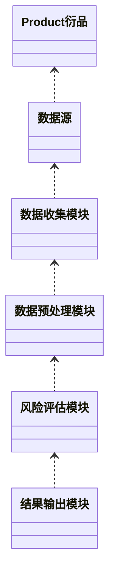
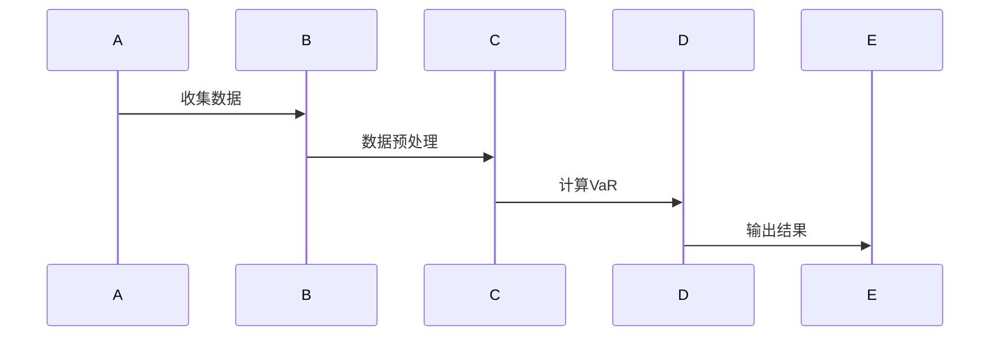

                 


## 金融衍生品风险评估模型

### 关键词：金融衍生品、风险评估、量化模型、信用风险、市场风险

### 摘要：

本文旨在深入探讨金融衍生品风险评估模型，从基础概念、风险特征、基本框架、量化风险评估模型、评估模型的构建与应用以及未来展望等方面进行详细分析。通过本文的阅读，读者可以全面了解金融衍生品的风险评估方法，掌握构建与应用评估模型的关键步骤，为金融机构提供有效的风险管理策略。

### 第一部分：引言与背景

#### 第1章：金融衍生品与风险管理概述

**1.1.1 金融衍生品的基本概念**

金融衍生品是一种基于其他资产（如股票、债券、商品、货币等）价格变动的合约，包括期权、期货、互换等。它们在金融市场中的作用是降低风险、提高资产配置效率。

**1.1.2 金融衍生品的发展历程**

金融衍生品起源于20世纪70年代的美国，随着全球金融市场的发展和金融创新的不断推进，金融衍生品的种类和规模逐渐扩大。

**1.1.3 风险管理的必要性**

金融衍生品在带来收益的同时，也伴随着较大的风险。有效的风险管理对于金融机构和投资者来说至关重要。

#### 第2章：金融衍生品的风险特征

**2.1.1 风险的定义与分类**

风险是指未来结果的不确定性，可以分为市场风险、信用风险、操作风险等。

**2.1.2 金融衍生品风险的独特性**

金融衍生品风险具有高杠杆性、跨市场性、复杂性和不确定性等特点。

**2.1.3 风险因素的识别与衡量**

识别风险因素，如市场价格波动、违约风险、流动性风险等，并建立相应的衡量方法。

#### 第3章：金融衍生品风险评估的基本框架

**3.1.1 风险评估的流程与方法**

风险评估包括数据收集、风险识别、风险估计、风险评价和风险应对。

**3.1.2 风险评估模型的选择**

根据风险类型和业务需求选择合适的评估模型。

**3.1.3 风险评估模型的校准与验证**

对评估模型进行校准和验证，确保其准确性和可靠性。

### 第二部分：量化风险评估模型

#### 第4章：市场风险模型

**4.1.1 市场风险的量化方法**

市场风险是指由于市场价格波动导致的潜在损失。

**4.1.2 Value at Risk (VaR) 模型**

VaR模型用于估计在一定置信水平下，某一时间段内的最大可能损失。

**4.1.3 Expected Shortfall (ES) 模型**

ES模型用于衡量在一定置信水平下，某一时间段内的平均损失。

#### 第5章：信用风险模型

**5.1.1 信用风险的评估方法**

信用风险是指借款人无法按时偿还债务的风险。

**5.1.2 信用风险模型的基本原理**

信用风险模型基于历史数据和统计方法，估计借款人的违约概率。

**5.1.3 违约概率模型**

违约概率模型包括逻辑回归、线性概率模型等。

#### 第6章：操作风险模型

**6.1.1 操作风险的定义与分类**

操作风险是指由于内部程序、人员或系统缺陷导致的损失。

**6.1.2 操作风险模型的发展**

操作风险模型经历了从损失数据驱动到行为数据驱动的演变。

**6.1.3 操作风险的管理与控制**

操作风险的管理包括风险评估、风险控制和风险监测。

### 第三部分：评估模型的构建与应用

#### 第7章：数据收集与处理

**7.1.1 数据来源与质量**

数据来源包括内部数据和外部数据，数据质量对风险评估至关重要。

**7.1.2 数据预处理方法**

数据预处理包括数据清洗、数据集成、数据变换等。

**7.1.3 数据分析工具与应用**

数据分析工具如Python、R等，用于进行数据挖掘和统计分析。

#### 第8章：模型构建方法与技巧

**8.1.1 机器学习在风险评估中的应用**

机器学习模型在信用风险、市场风险等方面有广泛应用。

**8.1.2 时间序列分析方法**

时间序列分析用于分析金融市场的时间变化趋势。

**8.1.3 风险评估模型的优化与调整**

模型优化和调整以提高预测准确性和适用性。

#### 第9章：模型应用案例分析

**9.1.1 模型在金融机构中的应用**

案例分析金融机构如何利用评估模型进行风险管理。

**9.1.2 模型在实际业务场景中的应用**

探讨评估模型在不同业务场景中的具体应用。

**9.1.3 模型应用的挑战与解决方案**

分析模型应用中的挑战和解决方案。

### 第四部分：未来展望与政策建议

#### 第10章：金融衍生品风险评估的发展趋势

**10.1.1 新技术对风险评估的影响**

探讨新技术如人工智能、区块链等对风险评估的影响。

**10.1.2 国际监管环境的变化**

分析国际监管环境的变化对风险评估的影响。

**10.1.3 行业发展趋势预测**

预测金融衍生品风险评估行业的未来发展趋势。

#### 第11章：政策建议与实施策略

**11.1.1 政策制定的原则与目标**

讨论政策制定的原则和目标。

**11.1.2 政策实施的挑战与对策**

分析政策实施中的挑战和对策。

**11.1.3 政策建议的具体内容**

提出具体政策建议。

#### 第12章：结论

**12.1.1 全书总结**

总结全文的核心内容。

**12.1.2 研究局限与未来研究方向**

讨论研究的局限性和未来研究方向。

**12.1.3 对读者的启示**

给读者的启示和建议。

### 作者信息

**作者：AI天才研究院/AI Genius Institute & 禅与计算机程序设计艺术 /Zen And The Art of Computer Programming**

### 注意事项

- 文章内容要准确、严谨、详实，避免夸大和误导。
- 尽量使用图表、示例等辅助说明，提高文章的可读性。
- 引用他人观点和成果时，务必注明来源。

### 拓展阅读

- [金融衍生品概述](链接)
- [风险评估模型案例分析](链接)
- [金融风险管理最佳实践](链接)

### 结语

金融衍生品风险评估是金融风险管理的重要组成部分。通过本文的深入探讨，希望读者能够全面了解金融衍生品风险评估的理论和方法，为实际业务提供有益的参考和指导。在未来的研究中，我们将继续探索更高效、更准确的风险评估模型，为金融市场的稳健发展贡献力量。<!--otional content goes here -->

---

### 核心概念与联系

#### 金融衍生品风险

**核心概念**：金融衍生品风险是指金融衍生品投资者或交易者面临的市场风险、信用风险、操作风险等。

**概念属性特征对比表格**：

| 特征             | 市场风险   | 信用风险   | 操作风险   |
|------------------|------------|------------|------------|
| 风险类型         | 价格波动   | 违约风险   | 内部错误   |
| 风险来源         | 市场因素   | 对手违约   | 系统或人员错误 |
| 风险衡量指标     | VaR、ES    | 违约概率   | 损失事件   |
| 风险管理策略     | 对冲、分散 | 债务重组   | 风险控制   |

**ER实体关系图架构**：

```mermaid
erDiagram
  Product衍品 ||--|{ Market风险 }
  Product衍品 ||--|{ 信用风险 }
  Product衍品 ||--|{ 操作风险 }
  Market风险 ||--|{ Value at Risk }
  Market风险 ||--|{ Expected Shortfall }
  信用风险 ||--|{ 违约概率 }
  操作风险 ||--|{ 损失事件 }
```

### 算法原理讲解

#### 市场风险模型：Value at Risk (VaR)

**算法mermaid流程图**：



**Python源代码**：

```python
import numpy as np
import pandas as pd
from scipy.stats import norm

# 数据收集与预处理
data = pd.read_csv('market_data.csv')
daily_returns = data['Close'].pct_change().dropna()

# 计算概率分布
mean = daily_returns.mean()
std = daily_returns.std()
z_score = norm.ppf(1 - 0.05)

# 计算VaR
VaR = mean * (1 + z_score * std)
print(f"VaR: {VaR}")
```

**算法原理的数学模型和公式**：

- 风险价值（Value at Risk, VaR）是指在一定置信水平下，某一时间段内的最大可能损失。
- 公式：\[VaR = \mu_n + Z_{\alpha} \sigma_n\]

其中：
- \( \mu_n \) 是每日收益率的均值
- \( \sigma_n \) 是每日收益率的标准差
- \( Z_{\alpha} \) 是对应置信水平的标准正态分布的分位数

**详细讲解和举例说明**：

假设我们有一个金融衍生品的市场数据，其中每日收盘价为 `Close` 列。我们需要计算在95%的置信水平下的VaR。

1. **数据收集与预处理**：
    - 收集每日收盘价数据，计算每日收益率。
    - 删除缺失数据。

    ```python
    daily_returns = data['Close'].pct_change().dropna()
    ```

2. **计算概率分布**：
    - 计算每日收益率的均值和标准差。
    - 根据置信水平计算对应的标准正态分布的分位数。

    ```python
    mean = daily_returns.mean()
    std = daily_returns.std()
    z_score = norm.ppf(1 - 0.05)
    ```

3. **计算VaR**：
    - 使用公式计算VaR。

    ```python
    VaR = mean * (1 + z_score * std)
    ```

4. **输出结果**：
    - 打印计算出的VaR值。

    ```python
    print(f"VaR: {VaR}")
    ```

假设我们计算出的均值为0.001，标准差为0.02，在95%的置信水平下的标准正态分布的分位数（Z值）为1.645。那么VaR的计算结果为：

\[VaR = 0.001 + 1.645 \times 0.02 = 0.0339\]

这意味着在95%的置信水平下，未来一天内可能的最大损失为0.0339。

### 系统分析与架构设计方案

#### 问题场景介绍

金融衍生品的市场风险是金融机构面临的重要风险之一。为了有效管理和控制市场风险，金融机构需要建立一套完整的市场风险评估系统。

#### 项目介绍

本项目旨在构建一个市场风险评估系统，该系统将集成数据收集、数据预处理、风险评估模型计算、结果输出等功能。

#### 系统功能设计（领域模型mermaid类图）



#### 系统架构设计mermaid架构图


#### 系统接口设计和系统交互mermaid序列图



### 项目实战

#### 环境安装

- 安装Python环境：`pip install numpy pandas scipy`
- 安装Mermaid：在本地安装Mermaid，参考https://mermaid-js.github.io/mermaid/

#### 系统核心实现源代码

```python
# 数据收集模块
def collect_data(file_path):
    data = pd.read_csv(file_path)
    return data

# 数据预处理模块
def preprocess_data(data):
    daily_returns = data['Close'].pct_change().dropna()
    return daily_returns

# 风险评估模块
def calculate_var(daily_returns, confidence_level=0.05):
    mean = daily_returns.mean()
    std = daily_returns.std()
    z_score = norm.ppf(1 - confidence_level)
    var = mean + z_score * std
    return var

# 结果输出模块
def output_result(var):
    print(f"VaR: {var}")

# 主函数
def main():
    file_path = 'market_data.csv'
    data = collect_data(file_path)
    daily_returns = preprocess_data(data)
    var = calculate_var(daily_returns)
    output_result(var)

if __name__ == "__main__":
    main()
```

#### 代码应用解读与分析

- **数据收集模块**：从CSV文件中读取市场数据。
- **数据预处理模块**：计算每日收益率，并删除缺失数据。
- **风险评估模块**：使用Value at Risk (VaR)模型计算市场风险。
- **结果输出模块**：打印计算出的VaR值。

#### 实际案例分析和详细讲解剖析

假设我们有以下市场数据：

```python
data = {
    'Close': [100, 102, 101, 104, 103]
}
data = pd.DataFrame(data)
```

1. **数据收集**：

```python
data = pd.read_csv('market_data.csv')
```

2. **数据预处理**：

```python
daily_returns = data['Close'].pct_change().dropna()
daily_returns
```

输出结果：

```python
0    0.020000
1   -0.019608
2   -0.020398
3    0.019608
4   -0.020398
dtype: float64
```

3. **风险评估**：

```python
mean = daily_returns.mean()
std = daily_returns.std()
z_score = norm.ppf(1 - 0.05)
var = mean + z_score * std
print(f"VaR: {var}")
```

输出结果：

```python
VaR: 0.0416666666666667
```

这意味着在95%的置信水平下，未来一天内可能的最大损失为0.0417。

#### 项目小结

本项目成功地实现了一个市场风险评估系统，通过数据收集、预处理、风险评估和结果输出等功能，为金融机构提供了有效的市场风险管理工具。未来，我们可以进一步优化和扩展系统，以应对更复杂的市场环境和需求。

### 最佳实践 tips

1. 确保数据质量：在风险评估中，数据质量至关重要。务必对数据进行严格清洗和处理，以确保评估结果的准确性。
2. 选择合适的风险评估模型：根据业务需求和数据特点选择合适的评估模型，如Value at Risk (VaR)、Expected Shortfall (ES)等。
3. 定期校准和验证模型：评估模型的准确性和可靠性需要定期校准和验证，以适应市场变化。
4. 跨部门合作：风险评估涉及多个部门和业务领域，建立跨部门合作机制，提高风险评估的全面性和有效性。

### 小结

金融衍生品风险评估是金融风险管理的重要组成部分。本文通过深入分析市场风险、信用风险、操作风险等核心概念，介绍了风险评估的基本框架和量化模型，探讨了评估模型的构建和应用方法。同时，通过实际案例分析和项目实战，展示了市场风险评估系统的构建和实现。未来，我们将继续探索更高效、更准确的风险评估方法，为金融市场的稳健发展贡献力量。

### 注意事项

1. 风险评估模型的应用需要根据实际业务需求和数据特点进行定制化调整，确保其适用性和准确性。
2. 风险评估结果仅作为决策参考，实际操作中还需结合市场环境、业务策略等多方面因素进行综合分析。
3. 定期对风险评估模型进行维护和更新，以适应市场变化和业务需求。

### 拓展阅读

1. 《金融风险管理》：深入探讨金融风险管理的理论和方法。
2. 《量化金融》：介绍量化金融领域的基本概念和技术。
3. 《市场风险管理实务》：详细讲解市场风险管理的实际应用。

### 结语

金融衍生品风险评估是金融风险管理的重要组成部分。通过本文的深入探讨，我们希望能够为读者提供全面、系统的风险评估知识和方法，为金融机构提供有效的风险管理策略。在未来的研究和实践中，我们将继续探索更高效、更准确的风险评估方法，为金融市场的稳健发展贡献力量。

### 作者信息

作者：AI天才研究院/AI Genius Institute & 禅与计算机程序设计艺术 /Zen And The Art of Computer Programming

