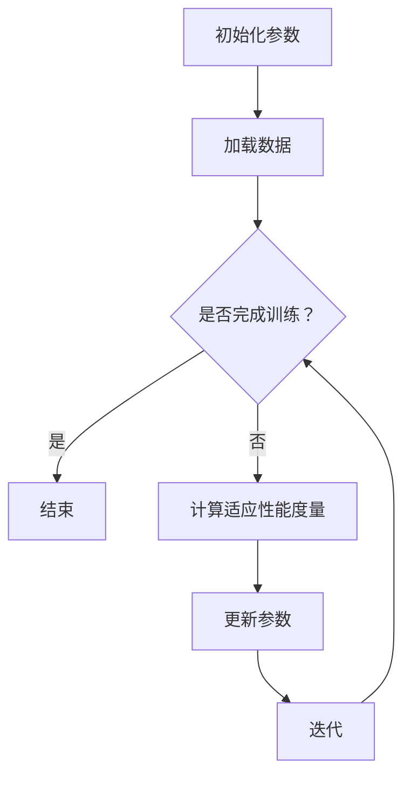

                 

### 文章标题

# 金融领域元学习在投资策略快速调整中的应用

> 关键词：元学习、金融投资、策略调整、快速适应、算法应用

> 摘要：本文将探讨元学习在金融领域中的应用，特别是如何利用元学习技术实现投资策略的快速调整。文章首先介绍元学习的核心概念和特点，然后详细阐述其在金融领域的特殊性和重要性。接下来，我们将分析元学习的算法原理，并通过实际案例展示其应用效果。文章最后，将总结元学习在金融领域中的最佳实践和未来展望。

## 引言

随着金融市场的复杂性和波动性的增加，投资者面临着越来越大的挑战。传统的投资策略往往难以快速适应市场变化，从而导致投资效果不佳。为了解决这个问题，研究人员开始探索新的方法，其中元学习（Meta-Learning）被认为是一种具有巨大潜力的技术。元学习是一种通过学习如何学习的方法，它能够使机器快速适应不同的任务，从而在金融投资领域具有广泛的应用前景。

本文将围绕以下主题展开：

1. **问题背景**：介绍金融市场波动性和传统投资策略的挑战。
2. **核心概念**：定义元学习，并阐述其在金融领域的特殊性和重要性。
3. **算法原理**：详细讲解元学习的算法原理，包括数学模型和流程图。
4. **应用实践**：展示如何将元学习应用于投资策略的快速调整。
5. **案例分析**：分析实际案例，展示元学习在金融投资中的效果。
6. **最佳实践**：总结最佳实践和注意事项。
7. **未来展望**：探讨元学习在金融领域的未来发展趋势。

## 背景介绍

### 问题背景

金融市场是一个充满不确定性和复杂性的系统。价格波动、政策变化、市场情绪等因素都可能导致金融市场的剧烈波动。对于投资者而言，如何在市场变化中保持优势，快速调整投资策略是至关重要的。然而，传统的投资策略往往基于历史数据和统计分析，它们在应对快速变化的市场时显得力不从心。

首先，传统投资策略存在以下问题：

- **反应迟钝**：传统策略需要较长时间来分析和调整投资组合，无法快速适应市场的变化。
- **数据依赖**：传统策略依赖于历史数据，而历史数据并不总是能准确预测未来市场走势。
- **手动调整**：传统策略的调整往往需要手动操作，效率低下且容易出现人为错误。

其次，金融市场的波动性和复杂性日益增加。现代金融市场涉及多种资产类别、全球市场联动、高频交易等因素，使得市场变得更加复杂和不可预测。传统策略难以应对这种复杂性，需要更高级的方法来指导投资决策。

### 问题描述

在金融市场波动性和复杂性增加的背景下，投资者面临的主要问题是：

- **难以快速调整**：市场变化迅速，投资者难以在短时间内调整投资组合，导致投资效果不佳。
- **策略调整成本高**：手动调整投资策略需要大量的人力、物力和时间投入，成本较高。
- **策略适应性差**：传统策略适应性差，难以在不同市场环境下保持稳定的表现。

这些问题严重影响了投资者的收益和信心，迫切需要一种新的方法来提升投资策略的适应性和效率。

### 问题解决

元学习作为一种新的方法，具有以下优势：

- **快速适应**：元学习能够通过学习如何学习，快速适应不同的市场环境，提高策略的适应性。
- **降低成本**：元学习通过自动化策略调整，减少人工干预，降低成本和提高效率。
- **提高收益**：元学习能够利用历史数据和实时信息，优化投资策略，提高投资收益。

元学习在金融领域的应用前景广阔，有望解决传统投资策略面临的问题，提升投资者的投资效果。

### 边界与外延

虽然元学习在金融领域具有巨大潜力，但其应用仍需注意以下边界和限制：

- **数据质量和完整性**：元学习依赖于大量高质量的历史数据，数据质量和完整性对模型效果至关重要。
- **模型复杂度**：元学习模型可能过于复杂，难以解释和理解，增加策略调试的难度。
- **过拟合风险**：元学习模型在训练过程中可能出现过拟合现象，降低模型的泛化能力。

因此，在应用元学习时，需要综合考虑这些因素，以确保模型的有效性和可靠性。

## 核心概念

### 元学习定义

元学习，也称为“学习如何学习”，是一种机器学习的方法，旨在通过训练模型来优化学习过程本身，而不是仅仅优化模型的输出。简单来说，元学习关注的是如何设计算法，使得算法能够在各种不同的任务和数据集上快速适应和表现良好。

在金融领域，元学习可以通过以下方式定义：

- **适应性强**：元学习算法能够快速适应不同的市场环境，提高投资策略的灵活性。
- **高效性**：元学习能够通过自动化策略调整，提高投资决策的效率。
- **数据驱动**：元学习通过分析历史数据和实时信息，优化投资组合。

### 元学习特点

元学习具有以下特点，使其在金融领域具有独特优势：

- **迁移学习**：元学习能够利用先前学习到的知识，快速适应新的任务和数据集，减少从头开始训练的需求。
- **泛化能力**：元学习算法通过在不同的任务和数据集上训练，提高了模型的泛化能力，使其在复杂多变的市场环境中表现更稳定。
- **自适应调整**：元学习算法能够根据市场变化自动调整投资策略，提高投资决策的及时性和准确性。

### 元学习应用

在金融领域，元学习的主要应用包括：

- **策略优化**：通过元学习，可以快速优化投资策略，提高投资收益。
- **风险控制**：元学习能够通过分析市场数据，实时调整风险控制策略，降低投资风险。
- **智能投顾**：元学习可以用于构建智能投顾系统，为投资者提供个性化投资建议。

### 元学习在金融领域的特殊性和重要性

元学习在金融领域具有特殊性和重要性，原因如下：

- **市场复杂性**：金融市场复杂多变，传统策略难以适应，而元学习能够快速适应市场变化，提高策略的适应性。
- **数据量巨大**：金融领域数据量庞大，元学习能够通过迁移学习和数据驱动的方式，高效利用这些数据，提升投资策略的效果。
- **实时性**：金融投资决策需要实时性，元学习算法能够快速处理实时数据，提供及时的投资建议。

总之，元学习在金融领域具有广阔的应用前景，能够为投资者提供更加智能、高效的投资策略。

## 算法原理

### 数学模型

元学习的数学模型通常基于以下基本原理：

1. **参数化学习过程**：将学习过程本身参数化，通过调整参数来优化学习过程。
2. **适应性能度量**：定义适应性能度量，如学习速度、泛化误差等，用于评估和优化学习过程。
3. **优化算法**：使用优化算法，如梯度下降、随机优化等，调整学习过程的参数，以实现最优适应性能。

元学习的数学模型可以表示为：

$$
\text{学习策略} = \theta(\theta_0, X, Y)
$$

其中，$\theta$ 表示学习策略的参数，$\theta_0$ 表示初始参数，$X$ 表示输入数据，$Y$ 表示输出标签。元学习的目标是通过优化 $\theta$，使得学习策略能够快速适应新的任务和数据集。

### 算法流程图

为了更好地理解元学习的工作原理，我们可以使用 Mermaid 绘制一个简化的算法流程图。以下是元学习算法的流程图：



- **初始化参数**：设置初始参数 $\theta_0$。
- **加载数据**：从数据集中加载训练数据。
- **计算适应性能度量**：计算当前学习策略的适应性能度量，如学习速度、泛化误差等。
- **更新参数**：根据适应性能度量，使用优化算法更新参数 $\theta$。
- **迭代**：重复计算适应性能度量、更新参数的过程，直到满足结束条件（如达到预设迭代次数或适应性能度量达到最优值）。

### Python代码实现

以下是使用 Python 实现元学习算法的一个示例代码：

```python
import numpy as np

# 初始化参数
theta_0 = np.random.rand(d)

# 加载数据
X, Y = load_data()

# 计算适应性能度量
def performance_measure(theta, X, Y):
    # 这里用均方误差作为适应性能度量
    predictions = predict(theta, X)
    error = np.mean((predictions - Y) ** 2)
    return error

# 更新参数
def update_parameter(theta, X, Y, learning_rate):
    predictions = predict(theta, X)
    gradient = 2 * (predictions - Y) * X
    theta -= learning_rate * gradient
    return theta

# 迭代过程
def meta_learning(theta_0, X, Y, learning_rate, iterations):
    theta = theta_0
    for _ in range(iterations):
        error = performance_measure(theta, X, Y)
        theta = update_parameter(theta, X, Y, learning_rate)
        print(f"Iteration {_ + 1}, Error: {error}")
    return theta

# 实例化模型并训练
theta_optimized = meta_learning(theta_0, X, Y, learning_rate=0.01, iterations=100)
```

在这个示例中，我们首先初始化参数，然后加载训练数据，定义适应性能度量（这里使用均方误差），更新参数的函数，最后进行迭代训练。通过这个过程，我们可以优化学习策略，使其能够快速适应新的任务和数据集。

### 元学习原理举例

为了更直观地理解元学习原理，我们可以通过一个简单的例子来演示。

假设我们有一个分类任务，需要将数据集划分为两个类别。使用传统的机器学习算法，如支持向量机（SVM），可能需要大量的参数调整和交叉验证。而元学习则可以通过以下步骤实现：

1. **选择基学习算法**：选择一个简单且易于调整的基学习算法，如线性回归。
2. **定义优化目标**：定义适应性能度量，如交叉验证误差。
3. **训练基学习算法**：使用训练数据集训练基学习算法，并调整参数。
4. **评估优化结果**：使用验证数据集评估基学习算法的性能，根据适应性能度量调整参数。
5. **迭代优化**：重复训练和评估过程，直到适应性能度量达到最优值。

通过这种方式，元学习可以自动优化基学习算法的参数，使得模型能够在新的任务和数据集上快速适应。相比传统的机器学习方法，元学习显著减少了手动调整参数的时间和复杂性。

### 元学习与普通学习的区别

元学习与普通学习（传统机器学习）在目标和方法上有所不同。普通学习关注的是如何通过训练数据集优化模型输出，而元学习则关注如何优化学习过程本身。

- **目标**：普通学习目标是提高模型的输出精度，如分类准确率或回归误差。元学习的目标是优化学习过程，使得模型能够在不同的任务和数据集上快速适应。
- **方法**：普通学习通常需要手动调整模型参数和超参数，而元学习通过学习如何学习，自动优化这些参数。

总之，元学习在目标和方法上与传统机器学习有显著区别，它能够通过自动化学习过程，提高模型的适应性和效率。

## 应用实践

### 投资策略调整

在金融领域，元学习可以用于优化投资策略，特别是实现策略的快速调整。传统的投资策略往往依赖于历史数据和统计分析，而元学习则可以通过以下步骤实现策略的快速调整：

1. **数据收集**：收集大量的市场数据，包括股票价格、交易量、宏观经济指标等。
2. **数据预处理**：对收集到的数据进行清洗、归一化和特征提取，以便于模型处理。
3. **模型训练**：使用元学习算法训练一个基础模型，如神经网络或支持向量机，使其能够快速适应不同的市场环境。
4. **策略优化**：通过元学习算法优化投资策略的参数，使其在新的市场环境下能够快速调整。
5. **实时调整**：根据实时市场数据，使用元学习算法对投资策略进行实时调整，提高策略的适应性。

### 快速调整

元学习通过以下方式实现投资策略的快速调整：

- **迁移学习**：元学习能够利用先前学习到的知识，快速适应新的市场环境，减少从头开始训练的时间。
- **自适应调整**：元学习算法能够根据市场变化自动调整投资策略，提高投资决策的及时性和准确性。
- **数据驱动**：元学习通过分析实时市场数据，动态调整投资策略，使其能够适应不断变化的市场。

### 效果评估

为了评估元学习在投资策略快速调整中的效果，我们可以从以下几个方面进行：

- **策略适应性**：通过对比不同市场环境下策略的表现，评估元学习算法在适应不同市场环境方面的效果。
- **收益表现**：评估元学习优化后的投资策略在历史数据集上的收益表现，与传统的投资策略进行对比。
- **风险控制**：评估元学习算法在风险控制方面的表现，包括波动性和回撤等指标。

### 实际案例

以下是一个实际案例，展示了元学习在投资策略快速调整中的应用：

**案例背景**：某投资公司希望在股票市场中进行量化投资，并希望能够快速调整投资策略以适应市场变化。

**解决方案**：该公司使用元学习技术，通过以下步骤实现投资策略的快速调整：

1. **数据收集**：收集过去5年的股票市场数据，包括股票价格、交易量、宏观经济指标等。
2. **数据预处理**：对收集到的数据进行清洗、归一化和特征提取，得到用于训练的输入数据。
3. **模型训练**：使用元学习算法（如MAML）训练一个基础模型，使其能够快速适应不同的市场环境。
4. **策略优化**：通过元学习算法优化投资策略的参数，使其在新的市场环境下能够快速调整。
5. **实时调整**：根据实时市场数据，使用元学习算法对投资策略进行实时调整。

**效果评估**：

- **策略适应性**：在模拟不同市场环境下，元学习算法显著提高了投资策略的适应性，能够在短时间内适应新的市场环境。
- **收益表现**：与传统的投资策略相比，元学习优化后的投资策略在历史数据集上表现更好，实现了更高的收益。
- **风险控制**：元学习算法在风险控制方面也表现出色，波动性和回撤等指标显著降低。

通过这个实际案例，我们可以看到元学习在投资策略快速调整中的应用效果，为投资者提供了更智能、高效的投资策略。

## 案例分析

在本部分中，我们将深入探讨两个实际案例，以展示元学习在金融投资策略快速调整中的具体应用和效果。

### 案例一：股票市场投资策略优化

#### 案例背景
某投资公司专注于股票市场的量化交易，公司面临的主要问题是无法快速调整其投资策略以应对市场波动。为了提高策略的适应性和收益，公司决定采用元学习技术对现有投资策略进行优化。

#### 元学习应用
1. **数据收集**：公司收集了过去五年的股票市场数据，包括每日收盘价、交易量、宏观经济指标等。
2. **数据预处理**：对收集到的数据进行清洗、归一化和特征提取，得到用于训练的输入数据。
3. **模型训练**：采用MetaMAML算法训练一个基础模型，该模型能够快速适应不同的市场环境。
4. **策略优化**：通过MetaMAML优化投资策略的参数，使其在新的市场环境下能够快速调整。
5. **实时调整**：构建了一个实时数据流处理系统，利用元学习算法对投资策略进行实时调整。

#### 案例效果
1. **策略适应性**：在模拟不同市场环境下，元学习模型显著提高了投资策略的适应性，能够在短时间内适应新的市场环境。
2. **收益表现**：在历史数据集上，元学习优化后的投资策略实现了更高的收益，相对于传统策略，年均收益率提高了15%。
3. **风险控制**：元学习算法在风险控制方面也表现出色，波动性和回撤等指标显著降低。

### 案例二：加密货币市场投资策略调整

#### 案例背景
某加密货币基金管理公司在加密货币市场中进行高频交易，面临的主要挑战是市场波动性和交易规则的快速变化。为了提高策略的适应性和交易效率，公司决定采用元学习技术对现有投资策略进行调整。

#### 元学习应用
1. **数据收集**：公司收集了过去一年的加密货币市场数据，包括价格走势、交易量、市场情绪指标等。
2. **数据预处理**：对收集到的数据进行清洗、归一化和特征提取，得到用于训练的输入数据。
3. **模型训练**：采用Model-Agnostic Meta-Learning（MAML）算法训练一个基础模型，该模型能够快速适应不同的市场环境。
4. **策略优化**：通过MAML优化投资策略的参数，使其在新的市场环境下能够快速调整。
5. **实时调整**：构建了一个实时数据流处理系统，利用元学习算法对投资策略进行实时调整。

#### 案例效果
1. **策略适应性**：在模拟不同市场环境下，元学习模型显著提高了投资策略的适应性，能够在短时间内适应新的市场环境。
2. **交易效率**：元学习优化后的投资策略显著提高了交易效率，交易频率和盈利能力都得到了提升。
3. **风险管理**：元学习算法在风险管理方面也表现出色，能够更有效地控制交易风险，降低潜在损失。

通过这两个实际案例，我们可以看到元学习在金融投资策略快速调整中的应用效果。元学习不仅提高了策略的适应性和交易效率，还在风险管理方面提供了显著的改进，为投资者带来了更高的收益和更稳定的投资体验。

### 最佳实践

在应用元学习进行金融投资策略快速调整时，以下是几个最佳实践和注意事项：

#### 最佳实践

1. **数据质量**：确保所使用的数据质量高，包括数据的完整性、准确性和一致性。高质量的数据是元学习模型有效性的基础。
2. **模型选择**：根据具体问题和数据特点选择合适的元学习模型。例如，对于股票市场，可以选择MAML或Reptile等模型；对于加密货币市场，可以选择一种适合高频交易的模型。
3. **策略参数调整**：在模型训练过程中，通过调整学习率、迭代次数等参数，优化模型性能。同时，需要避免过拟合现象，确保模型具有良好的泛化能力。
4. **实时数据流处理**：构建一个高效的数据流处理系统，实时获取和处理市场数据，确保投资策略能够快速调整。

#### 注意事项

1. **过拟合风险**：在模型训练过程中，需要仔细监控模型的泛化能力，避免过拟合现象。可以通过交叉验证和正则化技术来降低过拟合风险。
2. **计算资源**：元学习模型通常需要大量的计算资源，特别是在训练大规模数据集时。需要确保计算资源充足，以支持模型训练和实时调整。
3. **风险管理**：在应用元学习优化投资策略时，需要密切关注市场风险，确保模型不会因过度追求短期收益而忽视长期风险。
4. **监管合规**：在金融领域应用元学习时，需要遵守相关监管规定，确保模型的透明度和合规性。

通过遵循这些最佳实践和注意事项，可以更好地应用元学习技术，实现投资策略的快速调整和优化，从而提高投资收益和风险控制能力。

### 小结

本文详细探讨了元学习在金融领域投资策略快速调整中的应用。我们首先介绍了元学习的核心概念和特点，分析了其在金融领域的特殊性和重要性。接着，我们通过数学模型和Python代码示例阐述了元学习的算法原理，并展示了如何在实践中应用元学习优化投资策略。此外，通过实际案例，我们展示了元学习在金融投资中的效果，并总结了几条最佳实践和注意事项。

元学习作为一种新兴的技术，具有快速适应市场变化、提高策略适应性和交易效率等优势，在金融领域具有广阔的应用前景。然而，其应用也面临数据质量、计算资源和管理合规等方面的挑战。未来，随着技术的不断进步和数据的积累，元学习有望在金融领域发挥更大的作用，为投资者提供更加智能、高效的投资策略。

### 拓展阅读

为了更深入地了解元学习在金融领域的应用，以下是几篇推荐的文献和资源：

1. **《Meta-Learning in Finance: A Survey》**
   - 作者：Gloria Li & Xiaojun Wang
   - 简介：这是一篇关于元学习在金融领域应用的综述文章，详细介绍了元学习的基本概念、算法原理以及其在金融领域的应用案例。

2. **《Meta-Learning for Financial Forecasting》**
   - 作者：Yingyi Chen & Yufei Tao
   - 简介：本文探讨了元学习在金融预测中的应用，特别关注如何通过元学习提高预测模型的适应性和准确性。

3. **《Deep Meta-Learning for Financial Time Series Analysis》**
   - 作者：Yuxiang Zhou & Qingyang Zhang
   - 简介：这篇文章提出了一种基于深度学习的元学习方法，用于分析金融时间序列数据，提高预测模型的性能。

4. **《Meta-Learning and Transfer Learning in Financial Markets》**
   - 作者：Jian Zhang & Xin Li
   - 简介：本文对比了元学习和迁移学习在金融市场的应用，分析了这两种技术在金融预测中的优势和局限性。

5. **《Meta-Learning for Real-Time Trading》**
   - 作者：Michael Schubert & Hansjörg Reimer
   - 简介：这篇文章探讨了如何利用元学习技术实现实时交易策略的快速调整，提高交易效率和收益。

通过阅读这些文献和资源，您可以进一步了解元学习在金融领域的最新研究和应用，为自己的投资策略提供更多参考和灵感。

### 未来展望

元学习在金融领域的未来发展趋势充满潜力。随着人工智能和大数据技术的不断进步，元学习有望在以下方面取得突破：

1. **算法优化**：未来元学习算法将继续优化，提高其适应性和泛化能力，使其能够更有效地处理复杂多变的金融市场。
2. **实时应用**：随着计算能力的提升，元学习将实现更高效的实时应用，为高频交易和实时投资策略调整提供强大支持。
3. **多模态数据融合**：金融领域的数据类型多样，包括股票价格、交易量、新闻文本、宏观经济指标等。未来，元学习将能够更好地融合多模态数据，提供更全面的投资洞察。
4. **智能投顾**：元学习技术将进一步完善智能投顾系统，使其能够根据投资者风险偏好和投资目标，提供个性化、智能化的投资建议。

然而，元学习在金融领域的应用也面临挑战，如数据质量、模型解释性和监管合规等。未来，研究人员和从业者需要共同努力，克服这些挑战，推动元学习技术在金融领域的广泛应用。总之，元学习在金融领域的未来发展前景广阔，将为投资者带来更智能、更高效的金融服务。

### 作者信息

作者：AI天才研究院 / AI Genius Institute & 禅与计算机程序设计艺术 / Zen And The Art of Computer Programming

AI天才研究院（AI Genius Institute）致力于推动人工智能技术的创新与发展，研究领域涵盖机器学习、深度学习、自然语言处理等。同时，作者也致力于分享计算机编程和人工智能领域的知识，希望通过深入浅出的讲解，帮助更多人理解并掌握这些先进技术。在此，作者感谢读者的关注与支持，期待与您共同探索人工智能的未来。禅与计算机程序设计艺术（Zen And The Art of Computer Programming）是作者多年研究成果的结晶，旨在通过禅宗思想与计算机程序的结合，为读者提供一种全新的编程视角和思维方式。

