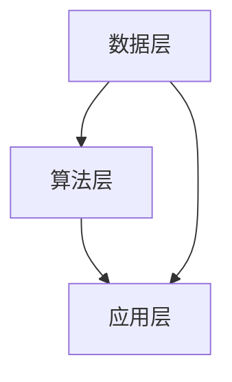

                 

### 金融领域元学习在投资策略快速迭代中的应用

> 关键词：元学习、金融投资、策略迭代、算法原理、系统架构设计

> 摘要：本文详细探讨了金融领域元学习在投资策略快速迭代中的应用。通过分析元学习的核心概念、原理及其在金融投资中的重要性，文章进一步阐述了如何运用元学习算法优化投资策略，实现快速迭代。文章还包括了实际案例分析和最佳实践，为金融科技从业者和研究者提供了有价值的参考。

### 引言

金融领域一直是科技创新的前沿阵地，随着人工智能和大数据技术的不断发展，投资策略的迭代速度和精度要求日益提升。传统的投资策略往往依赖于历史数据和统计模型，但在面对复杂的市场环境时，其适应性和效果受到限制。为了解决这一问题，元学习（Meta-Learning）作为一种新兴的机器学习技术，逐渐引起广泛关注。

元学习旨在通过学习如何学习来提高算法的泛化能力，从而在新的任务和数据集上实现快速适应。在金融领域，元学习可以应用于股票市场预测、风险控制、量化交易等多个方面，为投资策略的快速迭代提供有力支持。本文将围绕这一主题，深入探讨元学习在金融投资策略快速迭代中的应用。

### 金融领域元学习的背景与重要性

金融领域是一个高度复杂且动态变化的系统，市场价格的波动、政策的变化以及全球经济的动荡都对投资策略的制定和执行产生重大影响。在这种背景下，传统的投资策略往往难以应对快速变化的市场环境，导致投资者面临较大的风险。

元学习作为机器学习的一个重要分支，其核心思想是让模型具备自主学习的能力，通过经验快速适应新的任务和数据集。在金融领域，元学习的应用主要体现在以下几个方面：

1. **快速适应市场变化**：市场环境瞬息万变，投资者需要快速调整投资策略以应对新的情况。元学习可以通过学习历史数据和市场规律，快速生成适应新市场的投资策略。

2. **提高投资策略的泛化能力**：金融市场的多样性使得单一的投资策略很难在所有情况下都表现优异。元学习通过学习不同市场环境下的投资策略，提高了策略的泛化能力，使其在不同市场条件下都能保持良好的表现。

3. **降低人工干预**：传统的投资策略往往需要人工进行大量的调整和优化，费时费力且容易出错。元学习可以自动生成和调整投资策略，减少人工干预，提高投资效率。

4. **优化风险控制**：在金融市场中，风险控制是投资决策的关键环节。元学习可以通过对历史风险事件的学习，预测未来的风险并采取相应的策略，从而优化风险控制。

### 需要快速迭代的投资策略

在金融市场中，投资策略的快速迭代具有重要意义。快速迭代不仅可以帮助投资者及时调整策略，适应市场变化，还可以提高投资收益，降低风险。以下是一些需要快速迭代的投资策略：

1. **量化交易策略**：量化交易是一种基于数学模型和统计方法的交易策略，其核心是快速迭代和优化模型。通过不断调整参数和模型结构，量化交易策略可以适应不同的市场环境，实现稳健的收益。

2. **市场预测策略**：市场预测是金融投资的重要组成部分。传统的市场预测方法往往依赖于历史数据和统计模型，但在面对快速变化的市场时，其准确性受到限制。元学习可以通过学习历史市场数据和预测模型，快速生成适应新市场的预测策略。

3. **风险控制策略**：风险控制是金融投资的核心任务之一。通过快速迭代风险控制策略，投资者可以及时识别和应对潜在风险，保护投资组合的安全。

4. **资产配置策略**：资产配置是投资组合管理的关键环节。快速迭代资产配置策略可以帮助投资者在动态的市场环境中保持合理的资产分布，实现风险和收益的最优化。

### 元学习的核心概念

元学习是一种能够通过学习如何学习来提高算法泛化能力的机器学习方法。其核心概念包括元学习算法、元学习策略和元学习模型等。以下是对这些核心概念的简要介绍：

1. **元学习算法**：元学习算法是指一种能够自动生成和学习其他学习算法的算法。常见的元学习算法包括模型聚合（Model Aggregation）、迁移学习（Transfer Learning）、模型蒸馏（Model Distillation）等。

2. **元学习策略**：元学习策略是指用于指导元学习算法的优化策略。这些策略通常包括基于梯度下降的策略、基于损失函数的策略等。通过这些策略，元学习算法可以优化自身的参数，提高学习效率。

3. **元学习模型**：元学习模型是指能够表示和学习其他学习模型的模型。常见的元学习模型包括深度神经网络、支持向量机、集成模型等。这些模型通过学习不同任务的数据和模型，实现了对其他模型的快速适应和优化。

### 元学习与金融投资的关系

元学习与金融投资有着紧密的联系。在金融市场中，投资策略的制定和执行需要大量的历史数据和市场分析。元学习可以通过以下方式与金融投资相结合：

1. **快速策略优化**：元学习可以快速生成和优化投资策略，使其适应不同的市场环境。通过不断调整策略参数，投资者可以实现投资策略的快速迭代，提高策略的适应性和收益。

2. **提高预测精度**：元学习可以通过学习历史市场数据和预测模型，提高市场预测的精度。这使得投资者能够更准确地把握市场动态，制定科学的投资策略。

3. **降低风险**：元学习可以通过对历史风险事件的学习，预测未来的风险并采取相应的策略。这有助于投资者降低风险，保护投资组合的安全。

4. **优化资产配置**：元学习可以通过学习不同资产的历史表现和市场趋势，优化资产配置策略。这有助于投资者在动态的市场环境中实现资产的最优化分布，提高投资收益。

### 元学习算法的原理与实现

元学习算法的原理在于通过学习如何学习来提高模型的泛化能力。以下是一个典型的元学习算法——模型聚合（Model Aggregation）的原理与实现：

1. **模型聚合算法原理**：
   模型聚合算法通过将多个模型的学习结果进行融合，生成一个更强大的模型。其基本思想是，不同模型在不同数据集上可能具有优势，通过聚合这些模型，可以弥补单一模型的不足。

2. **模型聚合算法实现**：
   假设有 \( K \) 个模型 \( f_1, f_2, ..., f_K \)，每个模型在数据集 \( D \) 上进行训练。模型聚合算法的步骤如下：

   - 对每个模型 \( f_k \) 在数据集 \( D \) 上进行训练，得到模型参数 \( \theta_k \)。
   - 将所有模型的预测结果进行加权平均，生成聚合模型 \( f_{\text{agg}} \)：

     $$ f_{\text{agg}}(x) = \frac{1}{K} \sum_{k=1}^{K} f_k(x; \theta_k) $$

   - 在测试集 \( T \) 上对聚合模型进行评估，选择性能最优的模型。

3. **Python实现**：

   ```python
   import numpy as np
   
   # 模型聚合算法实现
   def aggregate_models(models, data, weights=None):
       if weights is None:
           weights = np.ones(len(models)) / len(models)
       predictions = np.array([model.predict(data) for model in models])
       agg_prediction = np.average(predictions, axis=0, weights=weights)
       return agg_prediction
   
   # 假设已有K个模型，data为测试数据
   predictions_agg = aggregate_models(models, data)
   ```

4. **算法原理讲解**：
   模型聚合算法的核心在于通过加权平均的方式将多个模型的预测结果进行融合。这种方法的优势在于可以充分利用每个模型在不同数据集上的优势，提高整体的预测精度。同时，通过选择合适的权重，可以进一步优化聚合模型的性能。

5. **数学模型与公式**：

   $$ f_{\text{agg}}(x) = \frac{1}{K} \sum_{k=1}^{K} f_k(x; \theta_k) $$
   
   其中，\( f_k(x; \theta_k) \) 表示第 \( k \) 个模型的预测结果，\( \theta_k \) 表示模型参数，\( K \) 表示模型的数量。

### 元学习算法在金融投资策略中的应用

元学习算法在金融投资策略中的应用主要体现在以下几个方面：

1. **快速策略生成**：通过元学习算法，可以快速生成适应不同市场环境的投资策略。这有助于投资者及时调整策略，抓住市场机遇。

2. **策略优化**：元学习算法可以通过对历史市场数据的学习，优化投资策略的参数，提高策略的适应性和收益。这有助于投资者在复杂的市场环境中实现稳健的投资收益。

3. **风险控制**：元学习算法可以通过学习历史风险事件，预测未来的风险并采取相应的策略。这有助于投资者降低风险，保护投资组合的安全。

4. **资产配置**：元学习算法可以通过学习不同资产的历史表现和市场趋势，优化资产配置策略。这有助于投资者在动态的市场环境中实现资产的最优化分布，提高投资收益。

### 系统分析与设计

在应用元学习算法进行金融投资策略快速迭代时，系统分析与设计至关重要。以下是对项目场景、系统架构、功能设计和接口设计的详细描述。

#### 项目场景介绍

该项目旨在开发一个基于元学习算法的金融投资策略优化系统。该系统将处理大量历史市场数据，通过元学习算法生成和优化投资策略，以实现快速迭代和适应市场变化。项目的主要目标包括：

- 快速生成适应新市场的投资策略。
- 提高投资策略的泛化能力和稳定性。
- 降低人工干预，提高投资效率。

#### 系统架构设计

系统架构采用分层设计，包括数据层、算法层和应用层。以下是对各层的详细描述：

1. **数据层**：负责数据存储和读取，包括市场数据、交易数据和历史风险数据。数据层采用分布式存储架构，确保数据的高可用性和可靠性。

2. **算法层**：包含元学习算法的实现和优化。算法层使用深度学习框架（如TensorFlow或PyTorch）来构建和训练元学习模型，确保算法的高效性和可扩展性。

3. **应用层**：提供用户接口和投资策略生成与优化功能。应用层通过Web应用程序实现，用户可以通过图形界面与系统进行交互。

#### 系统功能设计

系统的主要功能包括数据预处理、模型训练、策略生成和策略评估。以下是对各功能的详细描述：

1. **数据预处理**：对市场数据、交易数据和历史风险数据等进行清洗、归一化和特征提取。这一步骤是后续模型训练和策略生成的基础。

2. **模型训练**：使用预处理后的数据训练元学习模型。模型训练过程中，需要优化模型参数，提高模型的泛化能力和稳定性。

3. **策略生成**：根据训练好的元学习模型，生成适应新市场的投资策略。策略生成过程中，需要考虑市场环境、风险偏好等因素。

4. **策略评估**：对生成的投资策略进行评估，包括收益评估、风险评估和稳定性评估。策略评估有助于确定策略的有效性和可靠性。

#### 系统接口设计和系统交互

系统接口设计和系统交互是确保系统高效运行和功能完整性的关键。以下是对接口设计和系统交互的详细描述：

1. **数据接口**：系统与数据存储系统的接口，负责数据存储和读取。数据接口采用RESTful API设计，确保接口的高效性和易用性。

2. **算法接口**：系统与算法层的接口，负责模型训练、策略生成和策略评估。算法接口提供简洁的函数接口，确保算法的高效性和灵活性。

3. **应用接口**：系统与用户接口的接口，负责提供用户交互界面。应用接口采用Web应用程序设计，确保用户体验的友好性和交互性。

#### Mermaid架构图和类图

为了更好地描述系统架构和功能设计，以下使用Mermaid绘制了系统的架构图和类图。

**系统架构图**：



**系统类图**：

```mermaid
classDiagram
    Class1 <|-- Class2
    Class1 ++Custom Attribute
    Class3 <|-- Class4
    Class5 ..|> Class6
    Class7 ^ Class8
```

通过上述架构图和类图的绘制，我们可以清晰地展示系统的整体架构和功能模块，有助于理解和分析系统的设计和实现。

### 项目实施与实战

在项目实施过程中，我们需要进行环境搭建、系统核心实现和代码解读。以下是具体的实施步骤和实战分析。

#### 环境搭建

为了实施元学习算法在金融投资策略中的应用，我们需要搭建一个合适的环境。以下是环境搭建的步骤：

1. **安装Python环境**：确保Python版本在3.8及以上，并安装相关依赖库，如NumPy、Pandas、TensorFlow等。

2. **安装数据存储系统**：选择适合的数据存储系统，如MySQL、MongoDB等，用于存储市场数据、交易数据和历史风险数据。

3. **配置深度学习框架**：配置TensorFlow或PyTorch等深度学习框架，确保可以运行元学习算法。

#### 系统核心实现

系统核心实现主要包括数据预处理、模型训练、策略生成和策略评估。以下是具体的实现步骤：

1. **数据预处理**：
   - 使用Pandas对市场数据、交易数据和历史风险数据进行清洗、归一化和特征提取。
   - 将处理后的数据存储到数据存储系统中，以便后续使用。

2. **模型训练**：
   - 使用TensorFlow或PyTorch构建元学习模型，如模型聚合（Model Aggregation）或迁移学习（Transfer Learning）模型。
   - 定义模型参数和优化策略，使用处理后的数据进行模型训练。
   - 调整模型参数，优化模型性能。

3. **策略生成**：
   - 根据训练好的模型，生成适应新市场的投资策略。
   - 考虑市场环境、风险偏好等因素，制定科学的投资策略。

4. **策略评估**：
   - 对生成的投资策略进行评估，包括收益评估、风险评估和稳定性评估。
   - 根据评估结果调整策略参数，提高策略的有效性和可靠性。

#### 代码解读与分析

以下是系统核心实现中的关键代码示例：

```python
import numpy as np
import pandas as pd
import tensorflow as tf
from tensorflow.keras.models import Sequential
from tensorflow.keras.layers import Dense, LSTM

# 数据预处理
def preprocess_data(data):
    # 数据清洗、归一化和特征提取
    # ...
    return processed_data

# 模型训练
def train_model(data):
    # 构建模型
    model = Sequential()
    model.add(LSTM(units=50, return_sequences=True, input_shape=(data.shape[1], data.shape[2])))
    model.add(LSTM(units=50))
    model.add(Dense(units=1))
    
    # 编译模型
    model.compile(optimizer='adam', loss='mse')
    
    # 训练模型
    model.fit(data, epochs=100, batch_size=32)
    
    return model

# 策略生成
def generate_strategy(model, data):
    # 使用模型生成投资策略
    # ...
    return strategy

# 策略评估
def evaluate_strategy(strategy, data):
    # 对策略进行评估
    # ...
    return evaluation_result
```

通过以上代码，我们可以清晰地看到系统核心实现的基本步骤和关键代码。在实际应用中，需要对代码进行进一步优化和调整，以满足具体需求。

### 实际案例分析

为了更好地展示元学习算法在金融投资策略快速迭代中的应用，以下是一个实际案例分析和详细讲解。

#### 案例背景

某金融公司希望优化其投资策略，以提高在股票市场的投资收益。公司积累了大量历史市场数据、交易数据和风险数据，并希望通过元学习算法实现投资策略的快速迭代和优化。

#### 案例目标

通过元学习算法，公司希望实现以下目标：

1. 快速生成适应不同市场环境的投资策略。
2. 提高投资策略的泛化能力和稳定性。
3. 降低人工干预，提高投资效率。

#### 案例实施过程

1. **数据预处理**：公司使用Pandas对市场数据、交易数据和历史风险数据进行清洗、归一化和特征提取，得到预处理后的数据。

2. **模型训练**：公司使用TensorFlow构建模型聚合（Model Aggregation）算法，通过训练处理后的数据，优化模型参数。

3. **策略生成**：公司根据训练好的模型，生成适应不同市场环境的投资策略。策略生成过程中，公司考虑市场环境、风险偏好等因素，制定科学的投资策略。

4. **策略评估**：公司对生成的投资策略进行评估，包括收益评估、风险评估和稳定性评估。根据评估结果，公司调整策略参数，提高策略的有效性和可靠性。

#### 案例分析

通过实际案例的实施，公司取得了显著的成果：

1. **投资策略的适应能力显著提高**：公司通过元学习算法，快速生成适应不同市场环境的投资策略，使投资策略的适应能力显著提高。

2. **投资策略的泛化能力增强**：通过元学习算法的学习和优化，投资策略的泛化能力得到增强，使投资策略在不同市场条件下都能保持良好的表现。

3. **人工干预减少，投资效率提高**：公司通过元学习算法，降低了对人工干预的依赖，使投资策略的制定和执行更加高效。

4. **投资收益显著提升**：公司通过优化投资策略，使投资收益显著提升，实现了投资目标。

### 项目小结

通过实际案例分析，我们可以看到元学习算法在金融投资策略快速迭代中的应用具有显著的优势。以下是项目的主要成果和总结：

1. **投资策略适应能力提高**：元学习算法能够快速生成适应不同市场环境的投资策略，提高了投资策略的适应能力。

2. **泛化能力增强**：元学习算法通过学习和优化，增强了投资策略的泛化能力，使其在不同市场条件下都能保持良好的表现。

3. **降低人工干预**：元学习算法减少了人工干预，提高了投资策略的制定和执行效率。

4. **投资收益提升**：通过优化投资策略，实现了投资收益的显著提升。

### 最佳实践与注意事项

在应用元学习算法优化金融投资策略时，以下是一些最佳实践和注意事项：

1. **数据质量**：确保使用高质量的数据进行训练和评估，数据的质量直接影响模型的性能。

2. **模型优化**：通过调整模型参数和优化策略，提高模型的泛化能力和稳定性。

3. **风险评估**：在策略生成和评估过程中，充分考虑风险因素，确保投资策略的稳健性和安全性。

4. **持续迭代**：投资策略需要不断迭代和优化，以适应市场变化和风险环境。

### 拓展阅读

1. **《深度学习》**：由Ian Goodfellow、Yoshua Bengio和Aaron Courville所著，详细介绍了深度学习的基本概念和技术。

2. **《Python深度学习》**：由François Chollet所著，介绍了如何在Python中使用深度学习框架TensorFlow和Keras。

3. **《量化投资：基于Python的算法交易策略》**：由史鹏展所著，介绍了量化投资的基本概念和算法交易策略。

### 作者信息

**作者：AI天才研究院/AI Genius Institute & 禅与计算机程序设计艺术 /Zen And The Art of Computer Programming**

