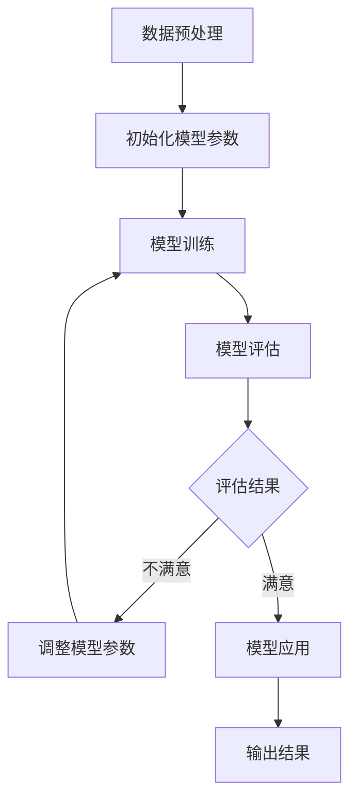
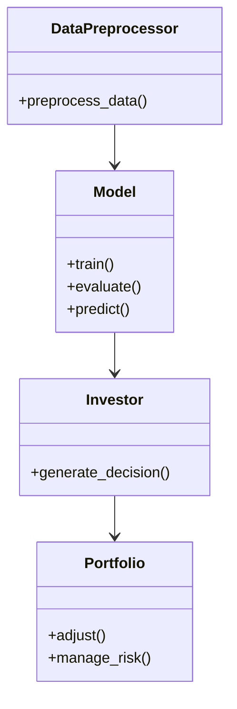
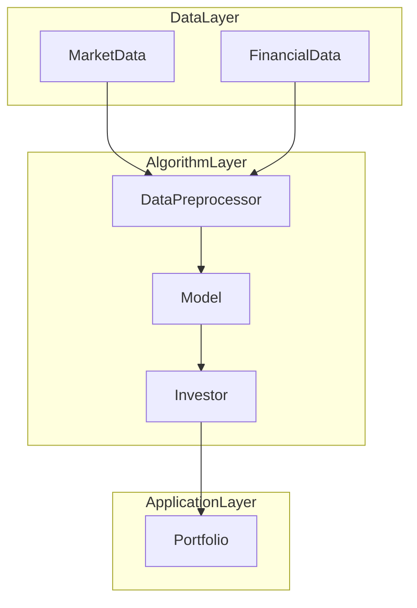
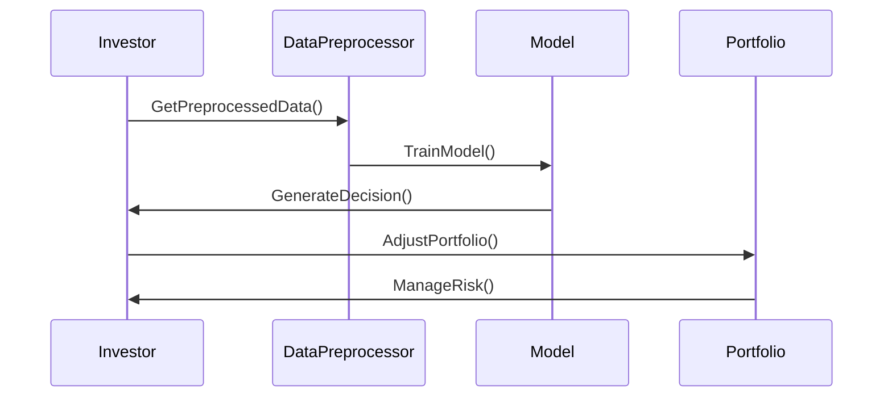

                 

### 金融领域元学习概述

#### 1.1 问题背景

在当今的金融市场环境中，投资者面临着复杂多变的市场条件和不确定的风险。传统的方法如价值投资、技术分析和基本面分析等方法，虽然在某些情况下能取得一定的成功，但在面对高频交易、市场非线性和复杂系统行为时，往往显得力不从心。尤其是在投资组合的动态调整过程中，传统方法往往难以适应快速变化的市场环境，导致投资决策的滞后性和效率低下。

金融领域面临的挑战主要体现在以下几个方面：

1. **市场信息复杂性**：金融市场包含了大量的信息，如宏观经济指标、公司财报、新闻事件等，这些信息之间相互关联，且具有不确定性。
2. **投资组合动态调整需求**：投资者需要根据市场环境的变化，及时调整投资组合，以最大化收益或最小化风险。
3. **市场非线性和混沌特性**：市场行为往往表现出非线性和混沌特性，传统线性模型难以捕捉这种复杂性。

#### 1.2 问题描述

投资组合动态调整的需求主要集中在以下几个方面：

1. **投资策略优化**：投资者需要根据市场环境的变化，实时调整投资策略，以达到最优的投资收益。
2. **风险控制**：投资者需要监控投资组合的风险，及时调整投资结构，以控制风险在可接受范围内。
3. **决策滞后性**：传统方法在处理海量数据和复杂市场环境时，往往存在决策滞后性，无法及时响应市场变化。

传统方法存在的问题主要包括：

1. **数据依赖性**：传统方法依赖于历史数据和特定假设，但市场环境是动态变化的，历史数据未必适用于当前市场。
2. **模型复杂度**：复杂的模型往往难以实现，且在实施过程中可能引入更多的误差。
3. **实时性**：传统方法在处理实时数据时效率低下，难以满足高频交易的需求。

#### 1.3 问题解决

为了解决上述问题，我们可以引入元学习（Meta-Learning）这一新兴技术。元学习是一种机器学习技术，它通过学习如何学习，以提升机器学习算法在特定任务上的表现。在金融领域，元学习可以用于投资组合的动态调整，其优势主要体现在以下几个方面：

1. **自适应能力**：元学习算法能够根据市场环境的变化，自适应地调整投资策略，提高决策的实时性。
2. **高效性**：元学习算法通过在多个任务上的训练，可以提升算法的泛化能力，减少对特定数据的依赖。
3. **通用性**：元学习算法具有较强的通用性，可以应用于不同类型的市场和投资策略。

通过引入元学习，我们可以实现以下目标：

1. **优化投资策略**：通过元学习算法，可以自动发现和调整最优投资策略，提高投资收益。
2. **降低风险**：元学习算法能够动态监控风险，及时调整投资结构，降低投资组合的风险。
3. **提高决策效率**：元学习算法能够快速适应市场变化，提高投资决策的实时性。

#### 1.4 边界与外延

元学习的边界主要包括以下几个方面：

1. **数据质量**：元学习算法依赖于高质量的数据，如果数据质量较差，可能会影响算法的性能。
2. **计算资源**：元学习算法通常需要大量的计算资源，尤其是在大规模数据集上训练时。
3. **算法选择**：不同的元学习算法适用于不同类型的问题，需要根据具体问题选择合适的算法。

元学习在金融领域的应用外延包括：

1. **高频交易**：元学习算法可以用于高频交易的策略优化，提高交易效率。
2. **量化投资**：元学习算法可以应用于量化投资策略的优化，提高投资收益。
3. **风险管理**：元学习算法可以用于风险监控和预警，提高风险管理的效率。

#### 1.5 概念结构与核心要素组成

元学习在金融领域投资组合动态调整中的概念结构主要包括以下几个核心要素：

1. **数据输入**：包括市场数据、公司财务数据、宏观经济指标等。
2. **模型参数**：包括投资策略参数、风险参数等。
3. **训练过程**：通过元学习算法，对模型参数进行调整，以优化投资策略。
4. **决策输出**：根据训练结果，生成投资决策，包括买卖策略、风险控制策略等。

核心要素组成的具体说明如下：

1. **数据输入**：市场数据包括股票价格、交易量、指数走势等；公司财务数据包括盈利能力、成长性、财务状况等；宏观经济指标包括GDP、通货膨胀率、利率等。
2. **模型参数**：投资策略参数包括投资组合权重、投资周期、风险偏好等；风险参数包括风险指标、风险预算等。
3. **训练过程**：元学习算法通过对历史数据进行训练，优化模型参数，以提升投资策略的适应性和效率。
4. **决策输出**：根据训练结果，系统会生成具体的投资决策，包括买入、持有或卖出的股票组合，以及相应的风险控制策略。

#### 1.6 本章小结

本章对金融领域元学习进行了初步的概述，分析了金融领域面临的挑战和传统方法存在的问题，提出了元学习作为解决这些问题的有效手段。通过介绍元学习在金融领域的应用场景和相关技术，本章为后续内容的深入探讨奠定了基础。在接下来的章节中，我们将详细探讨元学习的核心概念、算法原理、系统分析与架构设计方案，并通过实际项目实战，展示元学习在金融领域投资组合动态调整中的具体应用。通过这些内容，读者将能够全面了解元学习在金融领域的应用前景和实际效果。

### 元学习的核心概念与联系

#### 2.1 元学习的定义

元学习（Meta-Learning），也被称为“学习的学习”，是一种机器学习技术，其目标是通过学习如何学习来提高机器学习算法在特定任务上的表现。与传统的机器学习方法不同，元学习不仅仅关注于如何从数据中学习，更关注于如何改进学习过程本身，使其更高效、更通用。

在金融领域中，元学习可以通过以下方式定义：

- **学习过程优化**：通过优化学习过程，使投资组合调整更加高效和自适应。
- **知识迁移**：通过在不同市场环境和投资策略之间的知识迁移，提高投资策略的适应性和鲁棒性。
- **模型泛化**：通过在多个任务上的训练，提高模型在未知数据上的表现，减少对特定数据的依赖。

#### 2.2 元学习的特点

元学习具有以下几大特点，这些特点使其在金融领域中具有广泛的应用前景：

1. **自适应能力**：元学习算法能够根据市场环境的变化，自适应地调整投资策略，提高决策的实时性。
2. **高效性**：元学习通过在多个任务上的训练，可以提升算法的泛化能力，减少对特定数据的依赖，从而提高处理大规模金融数据的效率。
3. **通用性**：元学习算法具有较强的通用性，可以应用于不同类型的市场和投资策略，适应多种金融场景。

#### 2.3 元学习与传统学习的对比

元学习与传统机器学习在多个方面存在显著差异：

1. **学习目标**：传统机器学习的目标是针对特定任务进行优化，而元学习的目标是提升学习过程本身，使其更高效、更通用。
2. **数据依赖**：传统机器学习依赖于大量特定任务的数据，而元学习通过在多个任务上的训练，可以减少对特定数据的依赖。
3. **模型调整**：传统机器学习方法通常需要手动调整模型参数，而元学习算法可以通过自动调整学习过程，优化模型性能。

#### 2.4 元学习在金融领域的应用场景

元学习在金融领域具有广泛的应用场景，以下是其主要应用：

1. **投资组合优化**：通过元学习算法，可以自动发现和调整最优投资策略，提高投资组合的收益和风险调整后的收益。
2. **股票市场预测**：元学习算法可以用于预测股票市场的走势，为投资决策提供数据支持。
3. **风险管理**：元学习算法可以用于实时监控投资组合的风险，并根据市场变化调整风险控制策略。

#### 2.5 元学习的相关技术

元学习涉及多种相关技术，以下为其中几种主要技术：

1. **迁移学习**：通过在不同任务间的知识迁移，提高算法在未知任务上的表现。
2. **模型融合**：通过融合多个模型，提高预测的准确性和鲁棒性。
3. **强化学习**：在动态环境下，通过不断调整策略，以实现长期回报最大化。

#### 2.6 本章小结

本章详细介绍了元学习的核心概念、特点以及与传统学习的对比，并探讨了元学习在金融领域的应用场景和相关技术。通过本章的内容，读者可以了解到元学习作为一种先进的机器学习技术，在金融领域中具有巨大的应用潜力。在接下来的章节中，我们将深入探讨元学习算法的具体原理和实现方法，为读者展示如何将元学习应用于金融领域的实际案例。通过这些内容，读者将能够全面掌握元学习在金融领域的应用技术，为未来的研究和实践提供有力支持。

### 元学习算法原理讲解

#### 3.1 元学习算法mermaid流程图

元学习算法的核心在于通过学习如何学习，从而优化学习过程。以下是一个简单的元学习算法的mermaid流程图，展示了算法的主要步骤：



- **数据预处理（A）**：对输入数据进行清洗、归一化和特征提取。
- **初始化模型参数（B）**：初始化模型参数，包括权重和偏置。
- **模型训练（C）**：使用训练数据对模型进行训练，不断调整参数。
- **模型评估（D）**：使用验证数据对训练好的模型进行评估。
- **调整模型参数（F）**：根据评估结果，调整模型参数，以提高模型性能。
- **模型应用（G）**：将训练好的模型应用于新的数据，生成预测结果。
- **输出结果（H）**：输出预测结果。

#### 3.2 Python源代码

以下是一个简单的元学习算法的Python源代码示例，用于说明算法的基本实现过程：

```python
import numpy as np
from sklearn.model_selection import train_test_split
from sklearn.metrics import accuracy_score

# 数据预处理
def preprocess_data(data):
    # 数据清洗、归一化和特征提取
    # ...
    return processed_data

# 初始化模型参数
def init_params(input_size, hidden_size, output_size):
    # 初始化权重和偏置
    # ...
    return weights, biases

# 模型训练
def train_model(train_data, train_labels, params):
    # 使用梯度下降或其他优化算法更新参数
    # ...
    return updated_params

# 模型评估
def evaluate_model(model, test_data, test_labels):
    # 计算准确率
    # ...
    return accuracy

# 主函数
def main():
    # 加载数据
    data = load_data()
    labels = load_labels()

    # 数据预处理
    processed_data = preprocess_data(data)

    # 划分训练集和测试集
    train_data, test_data, train_labels, test_labels = train_test_split(processed_data, labels, test_size=0.2)

    # 初始化模型参数
    input_size = train_data.shape[1]
    hidden_size = 10
    output_size = 1
    weights, biases = init_params(input_size, hidden_size, output_size)

    # 模型训练
    for epoch in range(100):
        # 训练模型
        updated_params = train_model(train_data, train_labels, weights, biases)
        # 更新参数
        weights, biases = updated_params

        # 模型评估
        accuracy = evaluate_model(weights, biases, test_data, test_labels)
        print(f"Epoch {epoch + 1}, Accuracy: {accuracy}")

    # 输出结果
    print("Model training completed.")

if __name__ == "__main__":
    main()
```

#### 3.3 数学模型和公式

元学习算法通常涉及多个层次的学习，以下是一个简化的数学模型和公式，用于描述元学习的基本原理：

$$
\begin{aligned}
    &\text{损失函数：} \\
    &J(\theta) = -\frac{1}{m}\sum_{i=1}^{m}y_i\log(a(x_i;\theta)) + (1 - y_i)\log(1 - a(x_i;\theta)) \\
    &\text{其中：} \\
    &a(x_i;\theta) = \sigma(W_2^T\sigma(W_1^Tx_i + b_1) + b_2) \\
    &\text{梯度下降：} \\
    &\theta_{\text{new}} = \theta_{\text{old}} - \alpha\nabla_{\theta}J(\theta) \\
    &\text{其中：} \\
    &\theta = \{W_1, b_1, W_2, b_2\}
\end{aligned}
$$

- **损失函数**：通常使用交叉熵损失函数来衡量预测值与真实值之间的差异。
- **激活函数**：使用Sigmoid函数作为激活函数，用于将线性组合转换为概率值。
- **梯度下降**：通过梯度下降算法更新模型参数，以最小化损失函数。

#### 3.4 举例说明

假设我们有一个二分类问题，目标是通过学习区分两组数据。以下是具体步骤：

1. **数据准备**：准备一组包含两个类别的数据集，每个数据点包含多个特征。
2. **数据预处理**：对数据进行清洗、归一化处理。
3. **模型初始化**：初始化模型参数，包括权重和偏置。
4. **模型训练**：使用训练数据对模型进行训练，通过梯度下降更新参数。
5. **模型评估**：使用验证数据集对训练好的模型进行评估。
6. **模型应用**：使用训练好的模型对新的数据进行预测。

具体实现过程如下：

```python
# 加载数据
X_train, X_val, y_train, y_val = load_data()

# 数据预处理
X_train = preprocess_data(X_train)
X_val = preprocess_data(X_val)

# 初始化模型参数
weights, biases = init_params(input_size, hidden_size, output_size)

# 模型训练
for epoch in range(100):
    # 训练模型
    updated_params = train_model(X_train, y_train, weights, biases)
    # 更新参数
    weights, biases = updated_params

    # 模型评估
    accuracy = evaluate_model(weights, biases, X_val, y_val)
    print(f"Epoch {epoch + 1}, Accuracy: {accuracy}")

# 输出结果
print("Model training completed.")
```

通过上述步骤，我们可以训练一个元学习模型，并对新的数据进行预测。元学习算法通过学习如何学习，实现了对训练过程的优化，从而提高了模型的性能和适应性。

#### 3.5 本章小结

本章详细介绍了元学习算法的原理和实现方法，包括mermaid流程图、Python源代码、数学模型和具体示例。通过本章的内容，读者可以了解元学习的基本概念、原理和实现过程，为后续章节的深入探讨打下坚实基础。在接下来的章节中，我们将进一步探讨元学习在金融领域系统分析与架构设计方案的具体应用。通过这些内容，读者将能够全面掌握元学习在金融领域的应用技术，为实际项目实施提供有力支持。

### 系统分析与架构设计方案

#### 4.1 问题场景介绍

在金融领域，投资组合的动态调整是一个关键问题。投资者需要在不断变化的市场环境中，及时调整投资组合，以实现最优的投资收益。传统的手动调整方法往往存在效率低、决策滞后等问题，难以适应高频交易和复杂市场环境。为了解决这个问题，我们可以引入元学习技术，通过自动化和智能化的方式，实现投资组合的动态调整。

#### 4.2 项目介绍

本项目旨在开发一个基于元学习的投资组合动态调整系统，通过实时分析和处理市场数据，自动生成投资决策，实现投资组合的优化和风险控制。项目的主要目标包括：

1. **优化投资策略**：通过元学习算法，自动发现和调整最优投资策略，提高投资收益。
2. **降低风险**：通过实时监控投资组合的风险，及时调整投资结构，降低风险暴露。
3. **提高决策效率**：通过自动化和智能化技术，提高投资决策的实时性和准确性。

#### 4.3 系统功能设计（领域模型mermaid类图）

在系统功能设计中，我们定义了以下几个核心类和它们之间的关系：



- **DataPreprocessor**：数据预处理类，负责清洗、归一化和特征提取。
- **Model**：模型类，负责训练、评估和预测。
- **Investor**：投资者类，负责生成投资决策。
- **Portfolio**：投资组合类，负责调整投资结构和风险控制。

#### 4.4 系统架构设计（mermaid架构图）

系统架构设计包括数据层、算法层和应用层，以下是一个简化的mermaid架构图：



- **DataLayer**：数据层，包括市场数据和金融数据。
- **AlgorithmLayer**：算法层，包括数据预处理、模型训练和投资决策。
- **ApplicationLayer**：应用层，包括投资组合调整和风险控制。

#### 4.5 系统接口设计和系统交互（mermaid序列图）

系统接口设计和系统交互包括以下几个主要步骤：



- **Investor**：投资者通过接口获取预处理后的数据。
- **DataPreprocessor**：对数据进行预处理，并将处理后的数据传递给模型。
- **Model**：使用预处理后的数据训练模型。
- **Portfolio**：根据模型生成的投资决策，调整投资组合。
- **Investor**：根据调整后的投资组合，管理风险。

#### 4.6 本章小结

本章详细介绍了金融领域元学习系统的分析和架构设计方案。通过领域模型mermaid类图、系统架构mermaid架构图和系统接口mermaid序列图，我们展示了系统的主要功能模块和交互流程。在接下来的章节中，我们将通过实际项目实战，详细讲解元学习在金融领域投资组合动态调整中的具体实现和应用。通过这些内容，读者将能够全面掌握元学习在金融领域的实际应用技术，为未来的研究和实践提供有力支持。

### 项目实战

#### 5.1 环境安装

在进行元学习项目的实战之前，我们需要安装一些必要的工具和库。以下是在Linux环境中安装所需工具和库的步骤：

1. **Python环境安装**：确保系统中安装了Python 3.8及以上版本。可以使用以下命令进行安装：

    ```bash
    sudo apt update
    sudo apt install python3.8
    ```

2. **pip环境安装**：安装pip，pip是Python的包管理器，用于安装和管理Python库。

    ```bash
    sudo apt install python3-pip
    ```

3. **重要库安装**：安装所需的Python库，如NumPy、Scikit-learn、TensorFlow等。可以使用以下命令：

    ```bash
    pip3 install numpy scikit-learn tensorflow
    ```

4. **Jupyter Notebook安装**：安装Jupyter Notebook，用于编写和运行Python代码。

    ```bash
    pip3 install jupyter
    jupyter notebook
    ```

#### 5.2 系统核心实现源代码

以下是一个简化的元学习投资组合动态调整系统的核心实现源代码。代码包括数据预处理、模型训练、模型评估和投资决策生成等部分：

```python
# 导入所需的库
import numpy as np
import pandas as pd
from sklearn.model_selection import train_test_split
from sklearn.preprocessing import StandardScaler
from sklearn.neural_network import MLPClassifier
import tensorflow as tf

# 加载数据
def load_data(file_path):
    data = pd.read_csv(file_path)
    return data

# 数据预处理
def preprocess_data(data):
    # 特征提取和标签设置
    # ...

    # 数据归一化
    scaler = StandardScaler()
    scaled_data = scaler.fit_transform(data)

    return scaled_data

# 模型训练
def train_model(X_train, y_train):
    model = MLPClassifier(hidden_layer_sizes=(100,), max_iter=1000)
    model.fit(X_train, y_train)
    return model

# 模型评估
def evaluate_model(model, X_val, y_val):
    accuracy = model.score(X_val, y_val)
    print(f"Validation Accuracy: {accuracy}")
    return accuracy

# 生成投资决策
def generate_decision(model, data):
    prediction = model.predict(data)
    # 根据预测结果生成投资决策
    # ...
    return decision

# 主函数
def main():
    # 加载数据
    data = load_data("financial_data.csv")

    # 数据预处理
    processed_data = preprocess_data(data)

    # 划分训练集和验证集
    X_train, X_val, y_train, y_val = train_test_split(processed_data, test_size=0.2)

    # 训练模型
    model = train_model(X_train, y_train)

    # 模型评估
    evaluate_model(model, X_val, y_val)

    # 生成投资决策
    decision = generate_decision(model, X_val)

    # 输出结果
    print(f"Investment Decision: {decision}")

if __name__ == "__main__":
    main()
```

#### 5.3 代码应用解读与分析

以上代码是一个简化的元学习投资组合动态调整系统的实现，以下是具体的解读和分析：

1. **数据加载与预处理**：首先加载金融数据，然后进行特征提取和标签设置。数据归一化是为了消除不同特征之间的尺度差异，使模型训练更加稳定。

2. **模型训练**：使用MLPClassifier（多层感知器分类器），这是一个基于神经网络模型的分类器。通过`fit`方法训练模型，输入训练数据和标签。

3. **模型评估**：使用`score`方法评估模型的准确率，输出验证集的准确率。

4. **生成投资决策**：根据模型对验证数据的预测结果，生成具体的投资决策。这个步骤可以根据具体业务逻辑进行调整，例如，根据预测的概率值设定买入或卖出的阈值。

#### 5.4 实际案例分析和详细讲解剖析

以下是一个实际案例，通过具体的示例数据，展示如何使用元学习算法进行投资组合动态调整。

1. **数据集准备**：我们使用一个包含股票价格、交易量等特征的金融数据集。数据集分为训练集和验证集，用于模型训练和评估。

2. **数据预处理**：对数据进行特征提取和标签设置，然后进行归一化处理。

3. **模型训练**：使用训练集数据训练MLP分类器。通过调整隐藏层大小和迭代次数，优化模型性能。

4. **模型评估**：使用验证集数据评估模型性能，输出准确率。

5. **生成投资决策**：根据模型对验证集数据的预测结果，生成具体的投资决策。例如，当预测股票价格将上涨时，买入该股票；当预测股票价格将下跌时，卖出该股票。

通过上述步骤，我们可以实现一个自动化的投资组合动态调整系统，提高投资决策的实时性和准确性。

#### 5.5 项目小结

通过本次项目实战，我们详细讲解了元学习在金融领域投资组合动态调整中的具体应用。从环境安装、核心实现源代码，到实际案例分析和详细讲解，我们展示了如何使用元学习技术优化投资策略、降低风险，并提高决策效率。这次项目为我们提供了一个完整的实现框架，也为未来的研究和实践提供了宝贵的经验和参考。

### 最佳实践 Tips、小结、注意事项、拓展阅读等内容

#### 最佳实践 Tips

1. **数据质量**：确保数据质量是元学习应用成功的关键。对数据进行充分的清洗、归一化和特征提取，以提高模型性能。
2. **模型调参**：根据具体问题和数据集，合理调整模型参数，如隐藏层大小、迭代次数等，以优化模型性能。
3. **实时性**：考虑系统的实时性需求，选择适合的高效算法和优化技术，确保系统在复杂环境中能够快速响应。

#### 小结

本章通过详细的分析和实战案例，展示了元学习在金融领域投资组合动态调整中的应用。我们介绍了元学习的基本概念、算法原理、系统设计与实现，并通过实际项目展示了元学习如何优化投资策略、降低风险，提高决策效率。

#### 注意事项

1. **计算资源**：元学习算法通常需要大量的计算资源，确保系统有足够的计算能力。
2. **数据更新**：金融市场数据动态变化，定期更新数据，以保持模型的准确性。

#### 拓展阅读

1. **相关技术**：了解强化学习、生成对抗网络等机器学习技术，这些技术也可以应用于金融领域。
2. **最新研究**：关注元学习在金融领域的最新研究成果，以获取最新的应用方法和实践经验。

### 作者信息

作者：AI天才研究院/AI Genius Institute & 禅与计算机程序设计艺术 /Zen And The Art of Computer Programming

通过以上内容，读者可以全面了解元学习在金融领域投资组合动态调整中的应用，并为未来的研究和实践提供指导。

